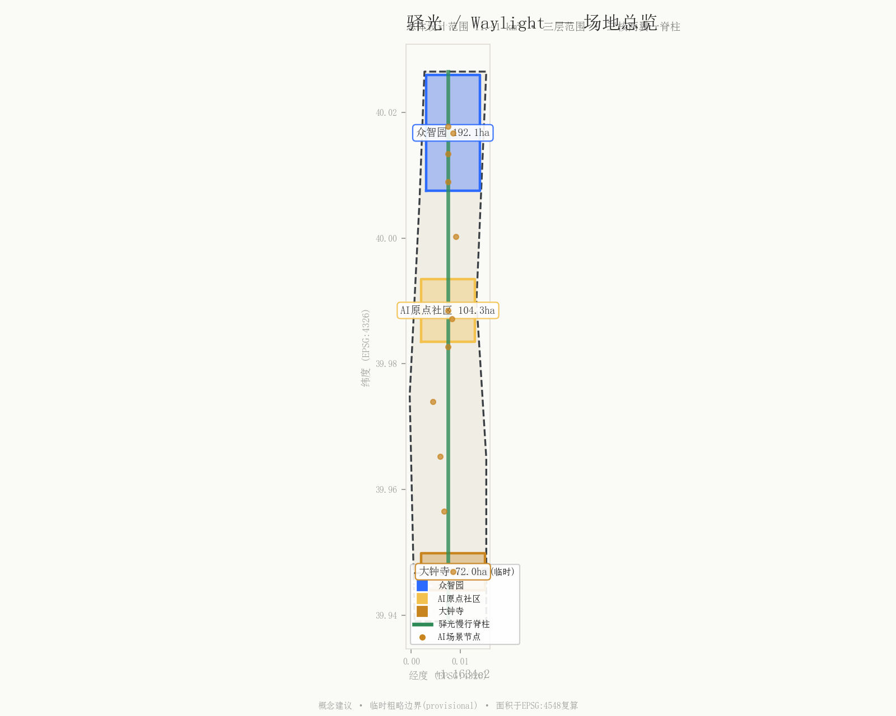
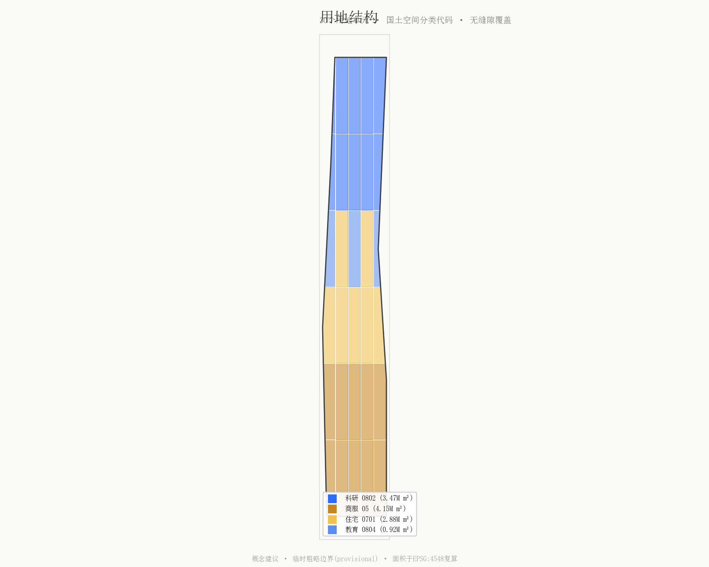
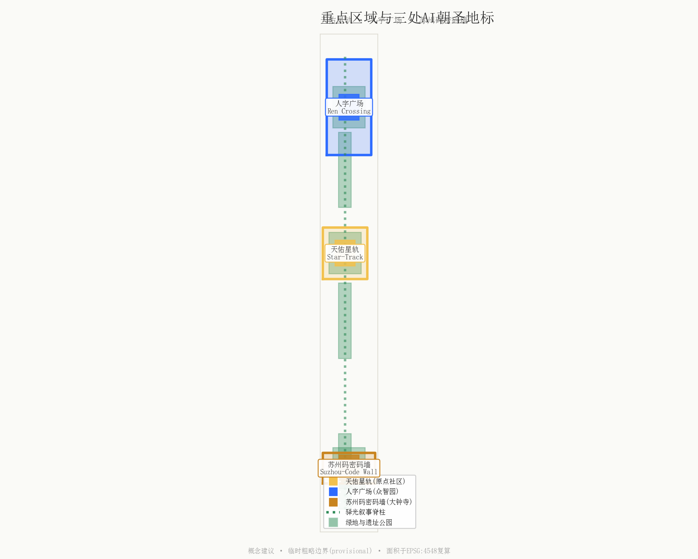
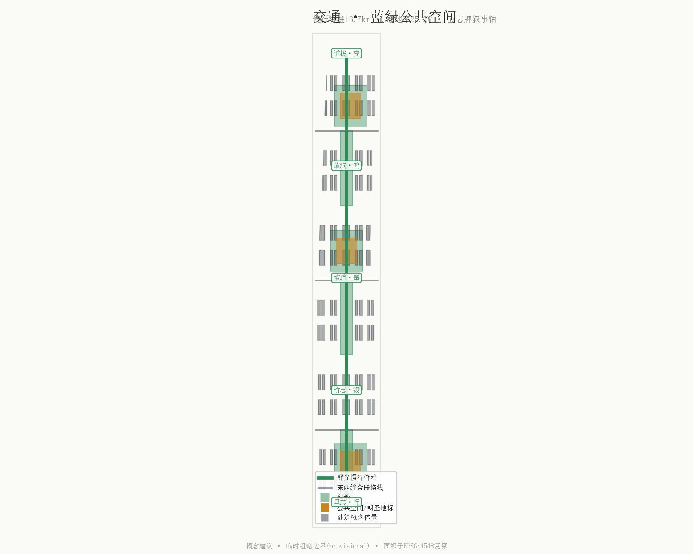
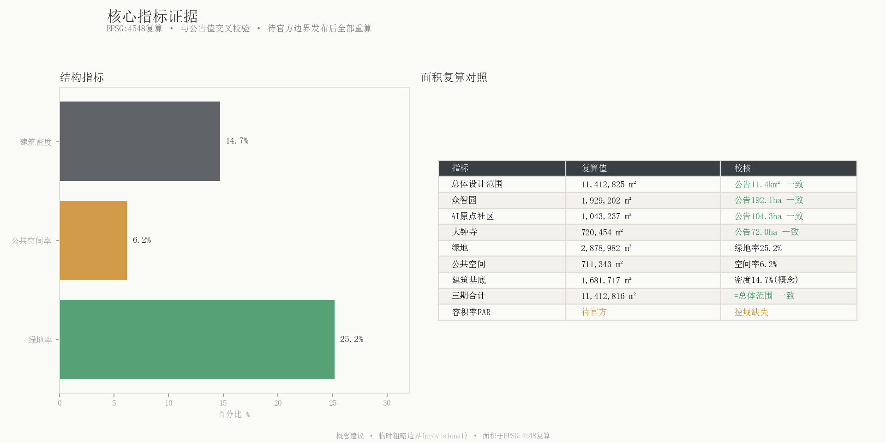

# Waylight — Let a Century of Steel Rails Lead to AI

> **Thesis**: The old Beijing–Zhangjiakou railway declared China's self-reliance with its "ren-shaped" switchback and Suzhou-numeral markers; the Waylight belt uses the same grammar to let Chinese AI remain "self-blessed, self-driven, and human-serving."

In 1909, Zhan Tianyou turned the world's sneer — "Chinese cannot build railways" — into history with a single 人-shaped switchback at Qinglongqiao. On every milestone and bridge marker he carved Suzhou numerals, a Chinese counting system, to declare the railway's Chinese lineage. 117 years later, on the same corridor, Haidian will build a global AI innovation belt. "Waylight" does not slap a railway sticker on a tech park. It elevates three of the railway's most legible motifs — **the switchback (human-centeredness), Suzhou numerals (Chinese identity), the signal lamp (a spectrum of light)** — into the naming, visual, spatial and narrative system of the entire belt, so that history becomes the grammar that drives the future rather than a specimen in a display case.

---

## 1. Design Basis and Source Inventory

This proposal is generated from the public open-call announcement, the agent taskbook, and the site package [source:OFFICIAL-ANNOUNCEMENT] [source:AGENT-TASKBOOK]. The three scope levels and three key areas use officially announced approximate areas; only provisional boundaries are currently available, and all areas have been recomputed in EPSG:4548 pending official polygons [data:geometry/site_boundary.geojson#SITE-001] [source:SITE-PACKAGE].

Historical motifs of the Jing-Zhang railway (Zhan Tianyou, the switchback, Qinglongqiao station, Suzhou numerals, signal lamps) are drawn from public sources of the National Railway Administration, China Railway, and Xinhua, as design inspiration for cultural narrative and landmarks — not as statutory heritage boundaries [source:SRC-JINGZHANG-HISTORY] [assumption:A-HERITAGE-001]. Regulatory planning controls (FAR, height, density, green ratio, setback) are missing from the public site package; all intensity-related content here is conceptual [assumption:A-CONTROLS-001].

---

## 2. Three-Level Scope Framework

This proposal strictly follows "Coordinated Research Area (43.6 km²) — Overall Design Area (11.4 km²) — Key Detailed Design Area (368.4 ha)" [data:geometry/site_boundary.geojson#SITE-001] [data:geometry/key_areas.geojson#KEY-ZZY]. The overall area recomputes to 11,412,825 m², matching the announced ~11.4 km² [metric:site_area_sqm]. The three key areas from north to south: Zhongzhiyuan AI Acceleration Area (192.1 ha), Beijing AI Origin Community (104.3 ha), Dazhongsi AI Industry Cluster (72.0 ha) [metric:key_area_count] [metric:key_area_area_zhongzhiyuan_sqm].

The "Waylight" narrative spine runs north–south along the old railway corridor through all three levels, linking the key areas into a walkable story scroll. It is both a physical slow-mobility greenway and a temporal axis anchoring 1909 (railway origin), the 1980s (Zhongguancun electronics street), and 2026 (the AI belt) — a "Century of Self-Reliance axis."

---

## 3. Coordinated Research Area Industry and Future-City Strategy

Within the 43.6 km² coordinated research area, the proposal frames a "three-belt overlay": the Jing-Zhang Cultural Belt (historical self-reliance), the Zhongguancun Innovation Belt (market-driven innovation after reform), and the AI Integration Belt (future smart-native innovation). All three share the same north–south corridor, forming an intergenerational relay [source:AGENT-TASKBOOK].

The Zhongguancun Technology Service Wing provides IP, capital, and globalized factor allocation; the Xiaoyuehe Scenario Empowerment Wing provides AI scenario deployment and urban-vitality testing. The two wings connect to the three cores via the Waylight slow-mobility spine, forming a "three cores, two wings, one spine" loop [assumption:A-DATA-001]. Regional industry judgments here are based on public case references and do not constitute commitments on tenanting, investment, or fiscal promises.

---

## 4. Overall Design Area Urban Renewal and Regulatory-Plan Urban Design

The overall design area (11.4 km²) is partitioned into 30 land-use cells using verifiable codes from the territorial-space land-use classification guide, with shared boundary coordinates and no gaps or overlaps [data:geometry/land_use.geojson#LU-001] [standard:MNR-LAND-USE-CLASSIFICATION-GUIDE]. Scientific research land (0802, 3.47M m²) forms the innovation core; commercial land (05, 4.15M m²) hosts Dazhongsi smart-native consumption; residential (0701, 2.88M m²) and education (0804, 0.92M m²) support the talent community [metric:land_use_area_0802_sqm] [metric:land_use_area_05_sqm].

Green and open space totals 2.88M m² (green ratio 25.2%); public space (three landmark plazas) 0.71M m² (6.2%) [metric:green_ratio] [metric:public_space_ratio]. Conceptual building footprints total 1.68M m² (density 14.7%) — this is a massing study, not surveyed footprints, and not a statutory density [metric:building_density] [assumption:A-CONTROLS-001].

A "white land" (reserve) strategy is applied between key areas, echoing the "switch marker" concept — just as a turnout represents path choice in the railway era, reserve land represents elasticity in the AI era [depth:land_use_and_building_scale].

---

## 5. Key Area Detailed Design

### 5.1 Zhongzhiyuan AI Acceleration Area (North, 192.1 ha)

This is the locus of the "full-stack AI self-innovation system." The "Ren Crossing" plaza uses switchback paving with an "AI ethics green-light" at the junction, hosting public rituals for sovereign compute, governance, and open-source releases [data:geometry/public_space.geojson#PS-02]. "Ren" carries a double meaning: Zhan Tianyou's engineering feat and the human-centered declaration that "AI serves people" [assumption:A-CULTURE-001].

### 5.2 Beijing AI Origin Community (Center, 104.3 ha)

The core of the "world-class AI innovation ecosystem." The "Tianyou Star-Track" is a sundial/astronomy-inspired landmark anchoring a 1909→∞ timeline. It doubles as an honor wall (inscribing contributors, per the charter principle "contributions are memorable") and a dawn gathering point [data:geometry/public_space.geojson#PS-01] [source:SRC-JINGZHANG-HISTORY]. A daily dawn "steam-whistle" soundscape ritual launches here.

### 5.3 Dazhongsi AI Industry Cluster (South, 72.0 ha)

The consumption and business gateway for "smart-native new business." The "Suzhou-Code Wall" is an interactive light wall that "decodes" the belt's addresses, footfall, and data flows into Chinese numerals [data:geometry/public_space.geojson#PS-03] — both a consumer gateway and a globally unique communication symbol.

---

## 6. AI Innovation Ecosystem, Talent Personas, and AI+ Scenarios

### 6.1 AI Ecosystem Cases (task agent.2)

Six global AI ecosystem cases inform the Zhongzhiyuan full-stack system (all public references, not tenanting commitments) [source:CASE-STANFORD-SILICON-VALLEY] [assumption:A-DATA-001]: Stanford–Silicon Valley (campus-industry symbiosis), Singapore One-North (cluster + scenario testing), Shenzhen Nanshan (government-industry + hardware stack), Hangzhou Chengxi (corridor串联), Station F (intensive startup container), Kashiwa-no-ha (smart-city living lab).

### 6.2 AI Scenario Cards (task agent.3, 12 cards, ≥10)

Twelve scenario cards are named by the three signal-lamp colors and arrayed along the spine [data:geometry/constraints.geojson#SCN-01] [metric:ai_scenario_node_count]: Amber (life services), Green (release-test), Blue (industry data).

### 6.3 Industry Test/Validation Scenarios (≥3)

Three test scenarios use the "front-pull, rear-push" dual-locomotive metaphor for human-machine boundaries — as the Guan'gou section used two steam locomotives to climb steep grades: "human leads (front-pull) + AI boosts (rear-push)" [assumption:A-SCENARIO-001]: (1) Zhongzhiyuan sovereign-compute testbed; (2) Xiaoyuehe multi-agent mobility test; (3) Dazhongsi smart-native consumption test with privacy sandbox.

### 6.4 User Personas (≥5)

AI researcher (compute + peers + long-termism → Zhongzhiyuan + Tianyou Conference); entrepreneur (low-cost space + scenarios + capital → Dazhongsi + Zhongguancun wing); student (internships + social + affordable living → Origin Community + 1435 trail); resident (public space + cultural belonging + no surveillance → heritage park + steam-whistle ritual + privacy boundary); international visitor (a legible Chinese innovation story → Suzhou-Code Wall + Five-Marker narrative axis).

---

## 7. Land Use, Building Scale, and Retain/Renovate/Demolish

Thirty land-use cells cover the overall design area with shared boundaries [data:geometry/land_use.geojson] [depth:land_use_and_building_scale]. Conceptual building massing expresses a "medium density, high vitality" AI community, not a statutory FAR [metric:building_footprint_area_sqm] [assumption:A-CONTROLS-001]. The retain/renovate/demolish strategy is stated conceptually: retain heritage station buildings as memory anchors; renovate low-efficiency industrial space as AI scenario carriers; reserve white land for elastic innovation. All parcel-level conclusions require professional verification of ownership and heritage [standard:MOHURD-CONTROL-DETAILED-PLANNING].

---

## 8. Traffic, Rail, Municipal, and Public Service Facilities

The road system centers on the "Waylight slow-mobility spine" (RD-SPINE), running north–south through the heritage park with three east–west stitching connectors, totaling 13,713 m [data:geometry/roads.geojson#RD-SPINE] [metric:road_length_m]. Slow mobility has priority. New infrastructure uses a "spectrum of light" metaphor: amber (life lighting), green (release indication), blue (AI sensing). Specific rail alignment, municipal pipelines, and engineering feasibility are outside this proposal's scope.

---

## 9. Blue-Green Public Space and Urban Character

The blue-green system uses the heritage park as a spine linking three key-area central parks; green totals 2.88M m² [data:geometry/green_space.geojson] [metric:green_space_area_sqm]. Public space anchors three landmark plazas plus a "switch-marker transformable furniture" network — reconfigurable street furniture symbolizing path-choice elasticity in the AI era [depth:blue_green_public_space]. Urban character follows the Urban Design Measures, coordinating height, massing, style, and color [standard:MOHURD-URBAN-DESIGN-MEASURES]. The palette is the "spectrum of light": kerosene amber #C8841F, semaphore green #2E8B57, rail iron-gray #3A3F44, data blue #2D6BFF, Tianyou dawn-gold #F2C14E.

---

## 10. Renewal Project List, Policies, and Phasing

Phasing proceeds north→center→south; the three phases tile the overall design area exactly with no gaps or overlaps [data:geometry/phasing.geojson#PH-1] [metric:phase_area_phase_1_sqm]: Phase 1 Zhongzhiyuan pioneer (3.47M m², 2026–2028); Phase 2 Origin Community core (3.80M m², 2028–2030); Phase 3 Dazhongsi industry (4.15M m², 2030–2032). Timeframes are conceptual [assumption:A-OPS-001].

---

## 11. Indicators, Area Recomputation, and Compliance Matrix

| Indicator | Value | Unit | Confidence |
|---|---|---|---|
| Overall design area | 11,412,825 | m² | High (provisional) |
| Green ratio | 25.2% | — | Medium |
| Public space ratio | 6.2% | — | Medium |
| Building density | 14.7% | — | Low (concept) |
| Key areas | 3 | count | High |
| AI scenario nodes | 12 | count | High |
| FAR | pending official data | — | Pending |

All areas recomputed in EPSG:4548 [metric:site_area_sqm] [depth:indicators_and_compliance]. FAR and GFA are marked unknown pending official controls [metric:floor_area_ratio].

---

## 12. Professional Standard Response and Design Depth Evidence

This proposal addresses all six mandatory professional standards [standard:PROJECT-OFFICIAL-ANNOUNCEMENT] [standard:PROJECT-AGENT-OPEN-CALL-TASKBOOK]. Land use uses verifiable codes per the territorial-space classification guide [standard:MNR-LAND-USE-CLASSIFICATION-GUIDE]. Regulatory content distinguishes confirmed vs. pending [standard:MOHURD-CONTROL-DETAILED-PLANNING]. Urban character follows the Urban Design Measures [standard:MOHURD-URBAN-DESIGN-MEASURES]. Architectural depth references the 2016 Architectural Design Depth provisions [standard:MOHURD-ARCH-DESIGN-DEPTH-2016]. All ten design-depth items are complete [depth:existing_conditions_diagnosis] [depth:overall_urban_design].

---

## 13. Agent Taskbook Response

**Task agent.1**: Name "Waylight"; logo = 人-shaped switchback Y-junction with a light point; wayfinding system uses modern Suzhou numerals (globally unique); module = standard gauge 1435mm. The three positionings and five functions map to three cores and two wings [source:AGENT-TASKBOOK].

**Task agent.2**: Zhongzhiyuan hosts the full-stack self-innovation system; six international cases (6.1) are references [assumption:A-DATA-001].

**Task agent.3**: 12 scenario cards (6.2), 3 test scenarios, 5 personas (6.3–6.4) with "front-pull/rear-push" human-machine boundaries [assumption:A-SCENARIO-001].

**Task agent.4**: Three AI pilgrimage landmarks — Tianyou Star-Track, Ren Crossing, Suzhou-Code Wall [data:geometry/public_space.geojson#PS-01]. Honor system inscribes contributions per the charter. Component library: transformable furniture, 1435-module bench, five-marker wayfinding pillar.

**Task agent.5**: The "Five Markers, Five Chapters" narrative rewrites Zhan Tianyou's five marker types into spatial story chapters (Li/Du/Pan/Ming/Bian = Mileage/Bridge/Grade/Whistle/Switch) [source:SRC-JINGZHANG-HISTORY]. Wayfinding uses Suzhou numerals as visual DNA, distinct from the belt logo (人-shaped Y). Zhongguancun's innovation lineage anchors the timeline's second point.

**Task agent.6**: Annual "Waylight Festival" (steam-whistle dawn ritual, Suzhou-code city puzzle run, Tianyou developer conference). Developer community: contributions are memorable (Star-Track honor wall), scenarios are testable (Xiaoyuehe), compute is requestable (Zhongzhiyuan). Conversion pathways for researcher→founder, student→talent, visitor→broadcaster. All events and mechanisms are conceptual, not confirmed government arrangements [assumption:A-OPS-001].

---

## 14. Risk, Copyright, and Legal/Official-Claim Boundaries

All spatial proposals are **conceptual suggestions, reference schemes, or material for professional teams to deepen**; they do not replace formal planning or constitute government-approved conclusions [source:AGENT-TASKBOOK]. Key risks: provisional boundaries must be recomputed when official polygons arrive [assumption:A-PROV-BOUNDARY-001]; missing regulatory controls mean no statutory intensity conclusions [assumption:A-CONTROLS-001]; narrative nodes require heritage verification [assumption:A-HERITAGE-001]; original design concepts (Suzhou-numeral renderings, 人-logo, three-color lamps) require font licensing and trademark search before official use [assumption:A-CULTURE-001]; AI enterprise cases are public references, not tenanting commitments [assumption:A-DATA-001]. No non-public government, enterprise-internal, or personal-privacy data is used [source:SOURCE-REGISTRY].
