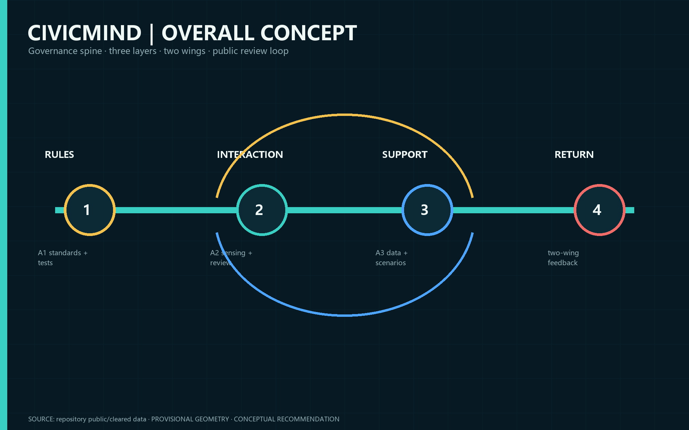
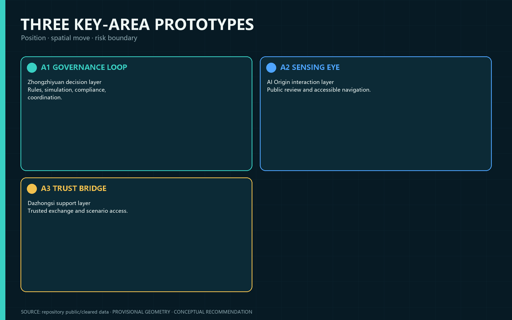
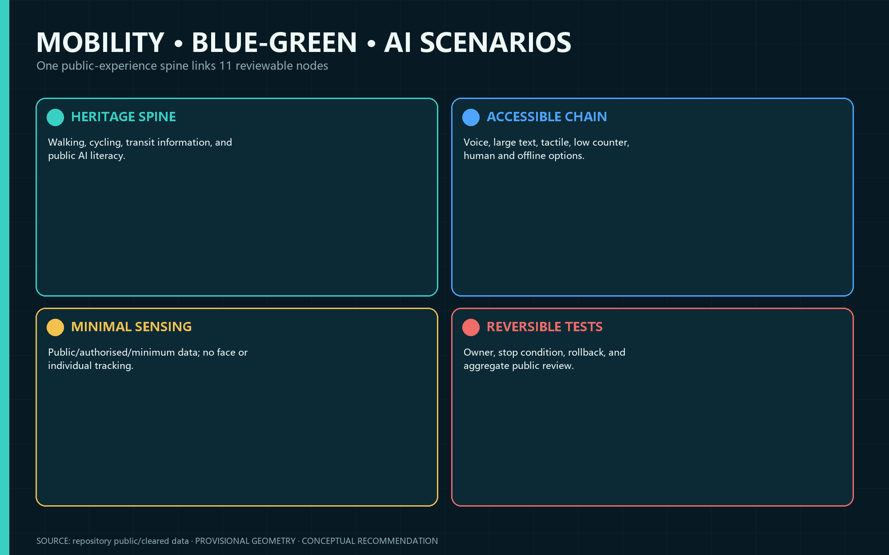
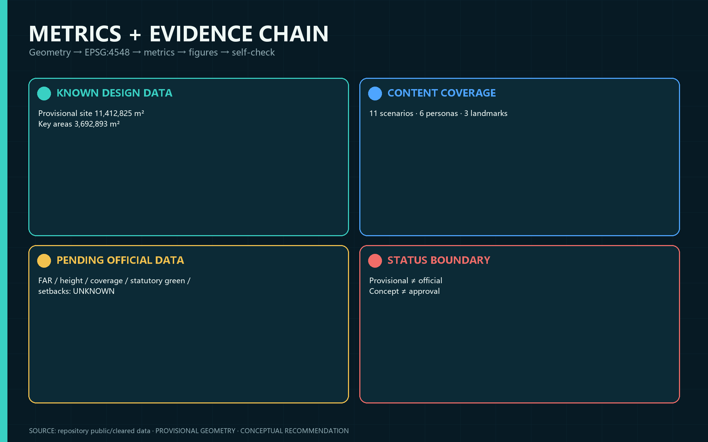

# CivicMind Jing-Zhang — A Living Lab for AI Urban Governance

> Governance as infrastructure: every urban AI scenario needs rules, accountable owners, Human Review, exit conditions, and a public return.

## Design Basis and Source List
About 70% of the proposal is grounded in real urban needs and public law, 25% uses real digital-government practice as a method anchor, and 5% draws on verified international precedents. Experience from 12315 and related public platforms demonstrates a workflow—not deployment in Jing-Zhang—and no internal data is used [source:OFFICIAL-ANNOUNCEMENT] [source:AGENT-TASKBOOK] [depth:existing_conditions_diagnosis]. Provisional geometry supports generation and intake checks only [source:SOURCE-REGISTRY] [standard:PROJECT-OFFICIAL-ANNOUNCEMENT].

## Three-Level Scope Framework
The 43.6 km² Coordinated Research Area frames strategy; the announced 11.4 km² Overall Design Area frames urban design; and the announced 368.4 ha Key-Area Detailed Design Area tests three prototypes [data:geometry/site_boundary.geojson#SITE-001] [metric:site_area_sqm] [depth:three_level_scope_framework]. All submitted polygons are provisional and require whole-package recalculation when official polygons arrive.

## Coordinated Research Area: Industry and Future City Research
“One body, two wings, three layers” connects the heritage governance spine, Zhongzhiyuan decision layer, AI Origin sensing/interaction layer, Dazhongsi industry-support layer, Xiaoyue River testing wing, and Zhongguancun standards/services wing [source:AGENT-TASKBOOK] [standard:PROJECT-AGENT-OPEN-CALL-TASKBOOK] [depth:overall_spatial_structure]. The original identity combines rail lines, a governance loop, indigo trust, green openness, and gold Human Review.

Seven precedents remain distinct from proposed mechanisms: Singapore AI Verify, the EU AI Act, Shenzhen Data Exchange, OECD AI Principles, Estonia e-Governance, Hangzhou City Brain, and Barcelona DECODE. They inform testing, risk tiers, trusted exchange, accountability, cross-agency coordination, and citizen data control; they do not prove local implementation [source:CASE-AI-VERIFY] [source:CASE-EU-AI-ACT] [source:CASE-OECD-AI].

## Overall Design Area: Urban Renewal and Regulatory-Plan-Level Urban Design
The spatial framework is a governance spine, three functional layers, two feedback wings, and a public-review loop. Reversible service interfaces reuse existing space where feasible [data:geometry/land_use.geojson#LU-001] [standard:MOHURD-CONTROL-DETAILED-PLANNING] [depth:land_use_layout]. FAR, height, coverage, statutory green ratio, setbacks, ownership, existing buildings, and utility capacity remain unknown [metric:floor_area_ratio] [depth:development_intensity_controls].

## Detailed Design of Key Areas

Zhongzhiyuan is the decision layer, with conceptual knowledge, simulation, compliance-support, and multi-agent spaces [data:geometry/key_areas.geojson#PROV-KEY-001]. Beijing AI Origin is the sensing/interaction layer with public review, accessible navigation, and co-creation [data:geometry/key_areas.geojson#PROV-KEY-002]. Dazhongsi is the industry-support layer with trusted data, scenario access, and legal-service referral [data:geometry/key_areas.geojson#PROV-KEY-003] [depth:three_key_area_detailed_design]. Buildings, bridges, and transport moves require professional development.

## AI Innovation Ecosystem, Personas, and AI+ Scenarios
Six design personas cover an older resident, young founder, enterprise data lead, university researcher, visitor, and visually impaired resident. They are design tools, not personal profiles [standard:BARRIER-FREE-ENVIRONMENT-LAW] [depth:blue_green_and_public_space]. Eleven readable cards cover sensing, policy simulation, multi-agent collaboration, governance knowledge, public review, scenario access, trusted data exchange, compliance support, civic navigation, community health, and legal-aid referral. Every scenario states data limits, accountable operations, Human Review, and exit conditions [data:geometry/scenario_nodes.geojson#SCN-01] [source:GENERATIVE-AI-MEASURES].

## Land Use, Building Scale, and Retain-Renovate-Demolish Strategy
Land use is a complete non-overlapping conceptual partition using national codes. Building footprints are design placeholders, not existing-building, ownership, or demolition evidence [standard:MNR-LAND-USE-CLASSIFICATION-GUIDE] [data:geometry/buildings.geojson#BLDG-001] [metric:building_footprint_area_sqm]. Statutory controls remain unknown [depth:building_renewal_classification] [depth:height_massing_character].

## Transport, Rail, Municipal Infrastructure, and Public Services
The conceptual Walking and Cycling Network links the three layers with transit information, accessibility, bicycle parking, and event-day dispersal, without claiming road redlines or engineering feasibility [data:geometry/roads.geojson#ROAD-001] [standard:MOHURD-URBAN-DESIGN-MEASURES] [depth:transport_transit_slow_traffic_parking]. Public services retain voice, large-text, tactile, low-counter, human, and non-digital options where applicable.

## Blue-Green Network, Public Space, and Urban Character
The Jing-Zhang Railway Heritage Park is the governance spine; Qinghe and Xiaoyue River links remain conceptual because official blue lines are unavailable [data:geometry/green_space.geojson#GREEN-001] [data:geometry/public_space.geojson#PUBLIC-001] [depth:blue_green_and_public_space]. Three conceptual pilgrimage landmarks—Governance Loop, Sensing Eye, and Trust Bridge—explain accountability, sensing limits, and data permissions. The narrative moves “from connecting cities to connecting governance,” without fictional history or unlicensed portraits.

## Renewal Projects, Implementation Policy, and Phasing
Conceptual phases are 0–6 month reversible pilots, 6–18 month controlled validation, and 18–36 month conditional scaling only after evidence, formal planning, and accountable owners are in place [data:geometry/phasing.geojson#PHASE-001] [depth:renewal_project_list] [depth:phasing_plan]. Proposed activities include a governance summit, compliance camp, scenario open day, public review assembly, multi-agent challenge, and open-source week. None is a confirmed government schedule.

## Metrics, Area Recalculation, and Compliance Matrix
Geometry-derived design quantities are calculated in EPSG:4548; announced areas remain separate references. Statutory green and public-space controls remain unknown [metric:site_area_sqm] [metric:key_area_total_sqm] [depth:metrics_recomputation]. Eleven scenarios, six personas, and three landmarks describe proposal content, not implementation scale.

## Risk, Copyright, and Compliance
The eight-dimension matrix covers privacy, complexity, acceptance, operations, policy uncertainty, spatial disputes, maturity, and inclusion. No private/internal data is used; AI does not replace statutory duties; provisional geometry, landmarks, events, procurement, funding, and timing are not official decisions [source:SOURCE-REGISTRY] [standard:PROJECT-OFFICIAL-ANNOUNCEMENT] [depth:risk_and_missing_data_register]. All spatial moves are Conceptual Recommendations for professional development, not approvals, legal opinions, engineering conclusions, investment commitments, or implementation arrangements.

## References
1. Haidian Branch of the Beijing Municipal Commission of Planning and Natural Resources, official open-call announcement, 2026.
2. Rights-cleared Agent open-call taskbook, 2026.
3. MOHURD urban-design and regulatory-planning measures; MNR land-use classification guide.
4. Interim Measures for Generative AI Services; Barrier-Free Environment Law.
5. Official/project sources for AI Verify, EU AI Act, OECD AI Principles, e-Estonia, Shenzhen Data Exchange, Hangzhou City Brain, and Barcelona DECODE.
