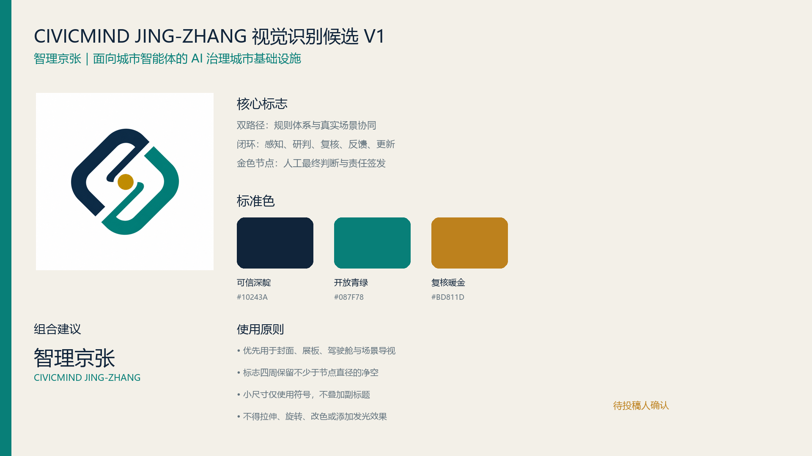
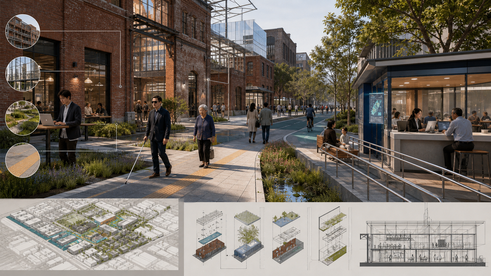
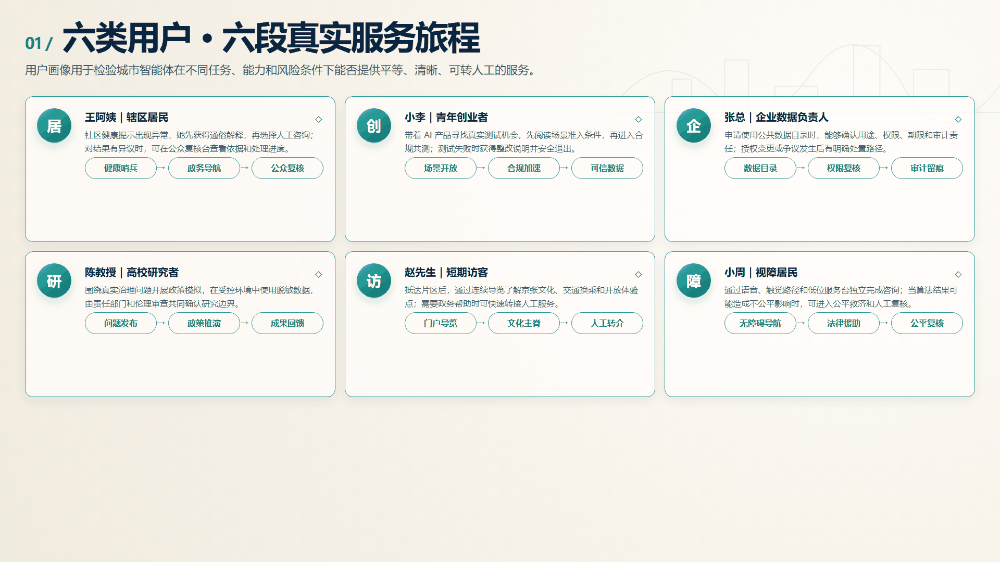
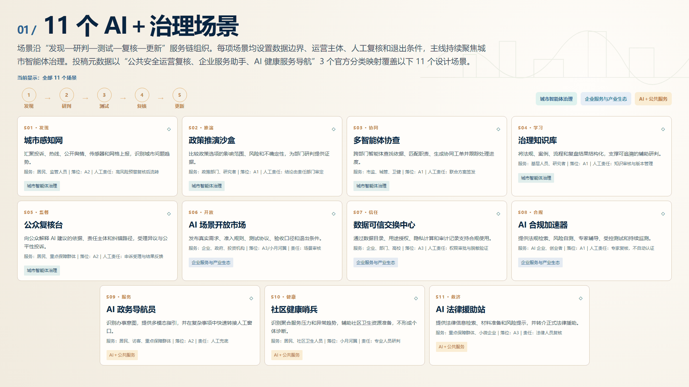
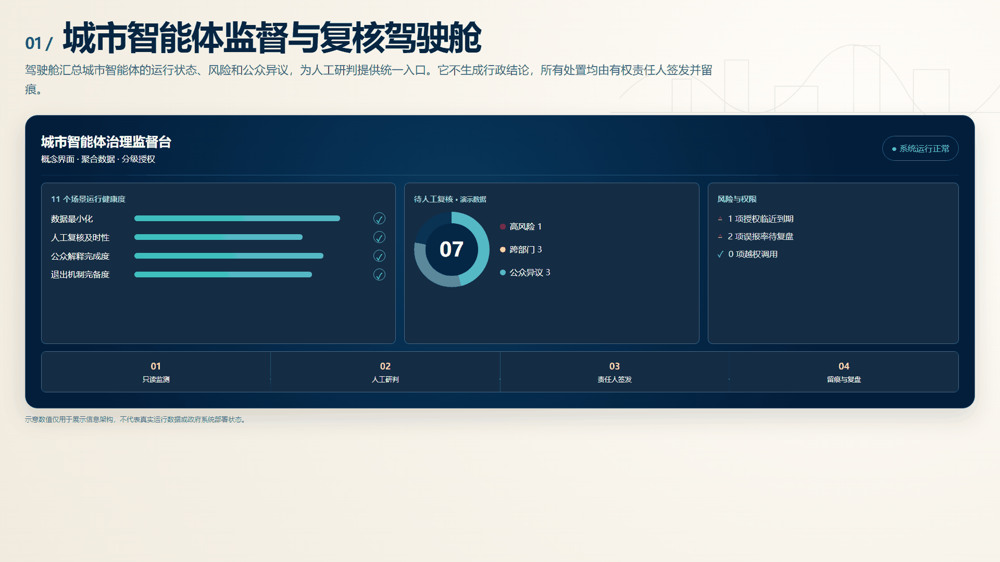
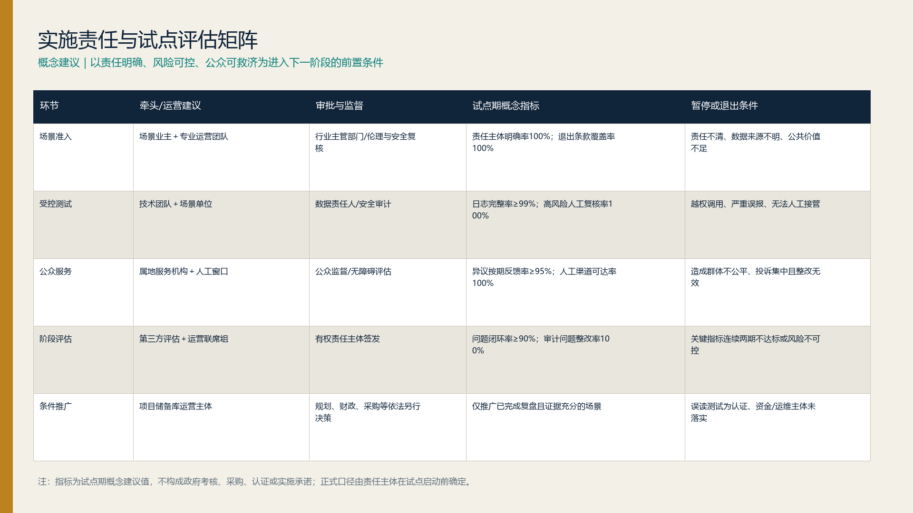

# 智理京张｜面向城市智能体：构建看得见、读得懂、可监督、可纠错的 AI 治理城市基础设施

**CivicMind Jing-Zhang — A Living Lab for AI Urban Governance**

> 治理即基础设施：让每一个城市AI场景都有规则、责任、人工复核、退出条件和公共回报。

## 方案总纲

*图：治理主脊、三类重点节点与蓝绿公共空间的总体愿景。图像用于表达概念性空间体验，具体边界、规模、建筑方案和实施条件均以正式规划及专业深化为准。*

面向人工智能由单点应用向城市系统深度嵌入的发展趋势，本方案提出建设“可感知、可验证、可治理、可推广”的 AI 城市治理实验场。规划依托京张铁路遗址公园、既有创新资源和公共服务网络，以存量空间更新为主要抓手，将治理规则、测试环境、公众参与和产业服务嵌入城市空间，形成具有海淀特色的 AI 创新环境。

总体形成“一脊统领、三区协同、两翼赋能、多点渗透”的空间格局：以京张铁路遗址公园为治理体验主脊，以众智园、北京AI原点社区和大钟寺三个重点区分别承载规则研发、公众交互和产业服务，以中关村科技服务翼、小月河场景赋能翼链接创新要素与真实需求，以11类AI场景节点向社区、园区和公共空间渗透。通过“发现问题—协同研判—受控测试—公众复核—评估推广”的运行闭环，推动技术创新、城市更新和公共治理协同增效。

## 设计依据与资料清单

方案从一个朴素的问题出发：当 AI 进入交通、社区服务、企业经营和公共决策，城市除了提供算力和办公空间，还应提供什么？答案是一套能被普通人看见、理解、质疑和纠正的治理基础设施。成熟政务协同实践形成的“感知—分流—协同—复核—学习”方法，为这套基础设施提供了现实起点；本方案不推定任何既有系统或数据已经在京张部署 [source:OFFICIAL-ANNOUNCEMENT] [source:AGENT-TASKBOOK] [depth:existing_conditions_diagnosis]。

设计判断以官方公告、任务书和公开专业标准为依据，并以生成式AI、数据安全和无障碍相关法规校核服务边界。现有空间图形是组织方提供的临时研究范围，只帮助表达片区关系；正式红线、控规条件和工程依据仍待后续资料补齐 [source:SOURCE-REGISTRY] [standard:PROJECT-OFFICIAL-ANNOUNCEMENT]。

### 依据分层与适用边界

| 依据层级 | 主要文件 | 在本方案中的作用 | 适用边界 |
|---|---|---|---|
| 项目直接依据 | 官方公告、征集任务书、site-package及数据源登记表 | 确定研究范围、任务要求、成果深度、评审维度和缺失数据处理方式 | 临时边界不等同于官方红线，缺失控规指标不得自行推定 |
| 国内空间规划依据 | 《城市设计管理办法》《城市、镇控制性详细规划编制审批办法》《国土空间调查、规划、用途管制用地用海分类指南》 | 校核空间结构、用地分类、设计深度以及规划结论的表达边界 | 本方案不替代法定规划、专项论证、工程设计和行政审批 |
| 国内治理与权益依据 | 《中华人民共和国个人信息保护法》《中华人民共和国数据安全法》《中华人民共和国无障碍环境建设法》《生成式人工智能服务管理暂行办法》 | 校核最小必要数据、用途授权、人工复核、公众救济、无障碍服务和生成式AI应用边界 | 具体场景是否适用及适用条款仍需由有权责任主体和专业法律团队复核 |
| 国际方法参考 | OECD AI Principles、EU AI Act、IMDA AI Verify等公开框架 | 借鉴风险分级、透明度、测试验证和问责方法 | 仅作方法参考，不替代中国适用法律，也不证明京张已建立相同制度或设施 |

据此，方案中的城市智能体仅承担信息汇聚、辅助研判、流程提示和运行监测等受控功能；涉及权益影响、资源配置、行政处置和高风险预警的事项必须进入人工复核、责任人签发、留痕审计和申诉纠错流程。政策文件用于约束设计边界，不用于包装尚未确定的建设承诺或审批结论。

## 三层范围工作框架

统筹研究范围约43.6平方公里，用于研究AI产业、治理标准与区域协同；总体设计范围公告约11.4平方公里，用于建立城市更新、公共空间与新型基础设施框架；三处重点区域公告合计约368.4公顷，用于形成可深化的片区原型 [data:geometry/site_boundary.geojson#SITE-001] [metric:site_area_sqm] [depth:three_level_scope_framework]。

三层范围构成相互传导的设计尺度：研究范围决定产业和区域协作，总体范围组织公共空间与基础设施，重点区把治理机制转化为可体验的场所。当前图形仍是临时研究范围；正式边界发布后，应统一校正各层空间关系和相关面积，现有数值仅用于方案内部复算。

统筹研究范围突出“谋战略、建网络、促协同”，重点研究海淀创新资源与未来科学城、怀柔科学城、北京经济技术开发区及京津冀创新节点之间的技术、人才和场景协作。总体设计范围突出“定结构、优空间、强支撑”，统筹产业功能、公共空间、综合交通和新型基础设施。重点区域突出“塑原型、建场景、可实施”，通过既有空间复用、公共界面改善和低风险试点，形成可供专业团队深化的城市更新单元。

## 统筹研究范围产业与未来城市研究

方案以“一体两翼三层”回应三大定位与五大功能：京张遗产治理主脊承载百年文化带，公众可理解的AI服务构成都市生活体验带，可测试、可复核、可推广的治理工具构成AI融合创新带。众智园为决策大脑层，北京AI原点社区为感知交互层，大钟寺为产业支撑层；小月河场景赋能翼负责测试反馈，中关村科技服务翼负责标准、人才与方法输出，再回流众智园知识库 [source:AGENT-TASKBOOK] [standard:PROJECT-AGENT-OPEN-CALL-TASKBOOK] [depth:overall_spatial_structure]。

品牌名称“智理京张”同时表达智能与治理；CivicMind强调公共心智与城市智能体。Logo概念取京张轨道双线与人机协同的闭环节点：深靛表示可信治理，青绿表示开放场景，暖金表示人工最终判断。标志、字体和图形均由本方案原创，不使用企业商标。

### 1. 全球案例借鉴

坚持“借鉴方法、不照搬制度；提炼机制、不推定条件”。七个案例均来自公开资料，主要用于识别可转化的方法，不作为京张已经具备相同制度、数据或设施的证明 [source:CASE-AI-VERIFY] [source:CASE-EU-AI-ACT] [source:CASE-OECD-AI]。

| 案例 | 主要做法 | 对本方案的启示 | 转化边界 |
|---|---|---|---|
| 新加坡 IMDA AI Verify | 通过测试框架和流程检查提升AI系统透明度 | 建设合规共测与结果解释机制 | 不等同于政府认证或市场准入 |
| 欧盟 AI Act | 按风险等级设置差异化责任要求 | 建立场景分级、准入条件和停止机制 | 适用法律仍以中国现行法规为准 |
| 深圳数据交易所 | 提供数据登记、合规、交易和服务链条 | 完善可信数据目录、用途授权和审计记录 | 不预设交易资格、价格或收益 |
| OECD AI原则 | 强调人本、透明、稳健与问责 | 将人工复核、公众异议和责任主体纳入场景设计 | 原则性参考，不替代国内规范 |
| 爱沙尼亚数字政府 | 以数字身份、X-Road和“一次提交”组织服务 | 支撑跨部门信息协同与服务入口整合 | 不照搬身份体系和数据架构 |
| 杭州城市大脑 | 以平台和场景推动跨部门城市治理 | 借鉴“问题牵引、场景验证、协同处置”的组织方式 | 仅采用公开报道口径，不推定本地部署 |
| 巴塞罗那 DECODE | 探索数据主权、公众控制和数据公地 | 强化数据用途说明、授权撤回和公共回报 | 不把试验机制表述为既定制度 |

### 2. 本方案机制转化

在上述经验基础上，本方案提出四项可供深化的机制：一是建立场景开放平台，统一发布需求、条件、责任和退出规则；二是建立公众反馈闭环，把解释、异议、人工复核和整改情况纳入运行评价；三是探索治理数据信托，通过用途约束、授权记录和审计追踪提升可信流通能力；四是形成AI合规加速流程，为企业提供法规检索、风险自测、专家辅导和持续监测服务。任何认证、采购、数据交易、资金、企业入驻和政策支持，均须由有权主体依法另行决定。

围绕五大功能，形成五类空间与服务载体：以开放实验室、模型评测和知识库支撑AI全栈自主创新；以共享会议、国际交流和人才服务支撑世界级创新生态；以场景清单、测试协议和供需对接支撑AI+场景赋能；以可达、可用、可求助的公共界面营造智能化AI活力城市；以规则研究、公众复核和开源工具提升AI治理议题的国际传播能力。

区域协同坚持“本地验证、区域联动、开放输出”。海淀侧重源头创新、公共治理与专业服务，外部创新节点侧重科学装置、产业转化和规模化应用。通过公开课题、联合测试、人才交流和可复用标准包建立协作关系，不预设具体合作主体、资金规模和招商结果。

## 总体设计范围城市更新与控规深度城市设计

*图：以既有建筑复用、可逆增补、连续慢行、雨洪花园和有人值守的公共服务界面为重点。图中建筑与场地均为概念建议，不对应具体地块拆改结论。*

空间结构以“治理主脊—三层节点—两翼回路—公众复核环”组织。主脊沿京张铁路遗址公园形成连续公共体验界面；三层节点分别承担规则、交互和产业；两翼连接技术服务与真实场景；复核环把发现、研判、测试、反馈、整改和知识更新连成闭环 [data:geometry/land_use.geojson#LU-001] [standard:MOHURD-CONTROL-DETAILED-PLANNING] [depth:land_use_layout]。

更新项目采用可逆、轻量和复用既有空间的原则：概念性运营中心、公众复核台、开放测试庭、数据审计室和无障碍服务点优先嵌入既有公共服务或产业空间。容积率、建筑高度、建筑密度、法定绿地率、退线、道路红线、权属、建筑现状和市政容量全部待正式资料确认，不推定具体地块拆改留或工程可行性 [metric:floor_area_ratio] [depth:development_intensity_controls]。

城市更新总体采取“四类行动”：一是贯通遗址公园及周边公共空间，构建连续步行、骑行和无障碍体验网络；二是盘活可利用的既有建筑首层、园区公共大厅和社区服务空间，植入治理展示、公众复核和企业服务功能；三是完善算力接入、可信数据、设备审计和应急切断等新型基础设施；四是建立场景准入、运行监测、公众反馈和退出复盘制度。城市风貌强调“历史基底可识别、创新设施轻介入、公共界面高开放”，避免以大尺度异形建筑替代真实城市更新。

## 重点区域详细设计

*图：三重点区分别突出治理之环、感知之眼和信任之桥的概念空间意象；建筑形态、桥梁线位与建设规模仅供专业团队深化研究。*

**A1 众智园AI自主创新加速区——决策大脑层。** 概念建议设置治理知识库中心、政策推演实验室、AI合规加速器和多智能体调度中心。建筑更新以复用和可逆嵌入为先；慢行连接清河与遗址公园；公共空间采用可观察但不暴露敏感数据的测试庭。“治理之环”作为透明闭环的概念地标。具体建设规模、建筑更新和交通组织须由专业团队在正式资料基础上深化 [data:geometry/key_areas.geojson#PROV-KEY-001]。

空间组织建议形成“一核、两廊、多庭院”：以治理知识与联合研判为核心，以遗址公园公共体验廊和园区创新服务廊联系研发办公、合规辅导与交流展示，以可预约、可隔离、可恢复的测试庭院承载阶段性验证。近期优先利用既有公共空间设置轻量展示和联合工作站，风险重点在于职责边界、数据共享和试验对日常运营的扰动。

**A2 北京AI原点社区——感知交互层。** 概念建议设置城市感知网运营中心、公众复核大厅、AI政务导航站及无障碍共创庭；保留线下人工服务和非数字替代路径。“感知之眼”是带触觉导览的概念地标，不将传感器等同于监控，也不采集人脸和个体轨迹 [data:geometry/key_areas.geojson#PROV-KEY-002]。

空间组织建议形成“一厅、一环、多触点”：以公众复核大厅作为综合服务入口，以社区步行环串联口袋空间、公共服务设施和遗址公园，以分布式服务触点提供导航、意见反馈和人工转介。界面设计强调低门槛、可解释和无障碍，运行中定期公开场景用途、数据类别、纠错情况和停止记录，避免将社区环境转化为过度感知空间。

**A3 大钟寺AI产业聚集区——产业支撑层。** 概念建议设置数据可信交换中心、AI场景开放市场、法律援助转介点及智能消费服务界面。“信任之桥”仅是连接片区与小月河场景翼的公共步行和数据解释概念，桥梁线位、结构和可行性均待专项研究 [data:geometry/key_areas.geojson#PROV-KEY-003] [depth:three_key_area_detailed_design]。

空间组织建议形成“一厅、一街、一链接”：以场景开放厅集中发布需求、规则和测试结果，以智能原生服务街展示经过验证的生活服务和企业应用，以步行联系概念强化与小月河翼的场景互动。更新优先改善首层开放度、遮阴休憩和人行连续性，不以封闭展厅取代日常商业。主要风险是把测试资格误读为政府认证，或把概念步行联系误读为已确定工程。

## AI 创新生态、人才画像与 AI+ 场景

*图：以老年居民、视障人士、创业者、企业人员、高校研究者和访客的差异化服务过程检验空间可用性；人物为设计画像，不对应真实个人档案。*

### 1. 用户角色与服务需求

用户画像用于检验空间和服务是否真正可用，不对应真实个人档案，也不用于推断个体属性。规划分别识别六类主要使用者 [standard:BARRIER-FREE-ENVIRONMENT-LAW] [depth:blue_green_and_public_space]。

#### （1）辖区居民——日常公共服务使用者

- **典型诉求：** 了解AI服务正在做什么、为何给出某项建议，以及出现错误后如何纠正。
- **主要障碍：** 专业术语难理解、数字入口分散、担心个人信息被采集、人工窗口不易找到。
- **空间回应：** 在北京AI原点社区设置公众复核大厅、社区服务触点和可阅读的规则说明界面。
- **服务回应：** 提供大字、语音、纸质说明、线下咨询和明确的人工转接路径。
- **重点场景：** 公众复核台、AI政务导航员、社区健康哨兵。

#### （2）青年人才与创业者——创新场景使用者

- **典型诉求：** 获得真实场景、测试环境、合规指导、数据使用条件和合作渠道。
- **主要障碍：** 场景需求不透明、测试责任不清、合规成本高、退出规则缺失。
- **空间回应：** 在众智园设置合规共测空间，在大钟寺设置场景开放厅和企业服务窗口。
- **服务回应：** 提供需求清单、申请流程、受控测试、专家辅导、结果复盘和退出说明。
- **重点场景：** AI场景开放市场、AI合规加速器、数据可信交换中心。

#### （3）企业与机构——数据和服务运营者

- **典型诉求：** 明确数据能否使用、允许用于何种目的、由谁审批，以及发生问题如何追责。
- **主要障碍：** 数据权责不清、跨部门标准不一致、审计链条不完整、合作预期难管理。
- **空间回应：** 在大钟寺布局可信数据服务和场景供需对接功能，在众智园提供规则咨询。
- **服务回应：** 建立数据目录、用途授权、访问审批、脱敏核验、日志审计和争议处理流程。
- **重点场景：** 数据可信交换中心、治理知识库、多智能体协查。

#### （4）高校与科研团队——研究和评估主体

- **典型诉求：** 接触来源清晰、边界明确的真实问题，开展可复核研究和成果转化。
- **主要障碍：** 研究问题与城市需求脱节、数据来源不完整、试验结果难以复现。
- **空间回应：** 在众智园设置政策推演和联合研究空间，在小月河翼开放受控测试场景。
- **服务回应：** 提供课题清单、公开数据说明、研究伦理要求、评估方法和成果回馈机制。
- **重点场景：** 政策推演沙盒、多智能体协查、城市感知网。

#### （5）访客与参会人员——短时体验者

- **典型诉求：** 快速理解京张文化、片区功能、公共交通和AI场景，不因停留时间短而迷失。
- **主要障碍：** 空间跨度大、信息层级复杂、文化叙事与技术展示割裂。
- **空间回应：** 依托遗址公园主脊形成连续导览，在门户和轨道站点设置综合信息节点。
- **服务回应：** 提供多语导览、主题路线、活动信息、无障碍路径和人工咨询。
- **重点场景：** AI政务导航员、感知之眼体验、京张文化叙事节点。

#### （6）老年人、残障人士和数字困难群体——重点保障对象

- **典型诉求：** 在不依赖智能手机和复杂操作的情况下，获得与其他用户等效的公共服务和权利救济。
- **主要障碍：** 视觉、听觉、行动或认知障碍，数字技能差异，以及算法偏差带来的不公平风险。
- **空间回应：** 设置连续无障碍路径、低位服务台、触觉导向、安静等候区和清晰人工窗口。
- **服务回应：** 提供语音、大字、简明语言、陪同协助、非数字替代和AI公平性投诉入口。
- **重点场景：** 公众复核台、AI法律援助站、AI政务导航员。

### 2. AI+场景体系

11个场景共同回答一件事：一个城市AI服务如何从发现问题开始，经过解释、复核和受控测试，最终形成可退出、可维护的公共服务。下表展示其空间位置与不可逾越的责任边界：

| 场景 | 主要服务对象 | 空间落位 | 核心服务 | 运营与人工责任 | 主要评价内容 |
|---|---|---|---|---|---|
| S01 城市感知网 | 居民、管理者 | A2运营中心 | 汇聚公开和授权的问题线索，形成趋势提示 | 运营团队维护；高风险提示由责任部门人工核验 | 误报率、核验时效、数据代表性 |
| S02 政策推演沙盒 | 政策人员、高校 | A1实验室 | 比较不同政策情景的公共影响和分配效应 | 专业团队设定假设；决策主体独立判断 | 假设透明度、结果可复现性、利益影响 |
| S03 多智能体协查 | 跨部门工作人员 | A1调度中心及前端站 | 辅助材料检索、任务分派和进度协同 | 各部门对本职事项负责；联合处置人工签发 | 流转次数、协同时长、纠错情况 |
| S04 治理知识库 | 基层人员、高校 | A1知识中心 | 提供带来源、版本和有效期的规则检索 | 内容维护人员审核更新；使用者判断具体适用 | 更新及时性、引用准确率、复用率 |
| S05 公众复核台 | 居民、弱势群体 | A2公众大厅 | 提供AI结果解释、异议提交、人工转接和纠错反馈 | 公众自愿反馈；运营人员受理并公示处理进度 | 人工可达性、申诉响应、纠错闭环率 |
| S06 AI场景开放市场 | 企业、政府、高校 | A3及小月河翼 | 发布真实需求、测试条件、资源边界和退出标准 | 场景方审核需求；准入、采购和合同由有权主体决定 | 需求清晰度、测试完成率、退出可执行性 |
| S07 数据可信交换中心 | 企业、政府、高校 | A3服务中心 | 提供数据目录、用途授权、隐私计算和审计记录 | 数据责任主体审批；审计人员核验合规性 | 授权完整性、违规访问、审计可追溯性 |
| S08 AI合规加速器 | AI企业、创业者 | A1服务中心 | 提供法规检索、风险自测、专家辅导和整改建议 | 企业对产品负责；专家复核关键结论 | 整改完成率、发现问题数、持续监测情况 |
| S09 AI政务导航员 | 居民、访客 | A2服务大厅及门户 | 提供事项查询、路径指引、多语与无障碍交互 | 人工窗口承担正式受理；系统只作导航 | 导航准确率、人工转接率、无障碍可用性 |
| S10 社区健康哨兵 | 居民、社区卫生人员 | 小月河翼 | 识别聚合服务压力并辅助资源调度 | 卫生专业人员研判；不提供个体诊断 | 提示准确性、响应时效、隐私保护 |
| S11 AI法律援助站 | 居民、小微企业 | A3服务节点 | 提供普法检索、材料整理和法律服务转介 | 法律专业人员负责正式意见；敏感信息最小化 | 转介成功率、内容准确性、风险提示完整性 |

### 3. 三项测试验证场景

#### （1）多智能体协查演练

选取不涉及个人隐私和行政裁量的模拟事项，测试材料检索、职责匹配和跨部门进度协同。演练前固化规则版本和测试数据，演练中保留全量日志，演练后由各责任部门复核输出。出现职责错配、敏感数据越权调用或无法解释的建议时立即停止，并回退至人工协作流程。

#### （2）AI场景开放市场受控试运行

选取需求边界清晰、可在隔离环境验证的企业服务场景，公开需求说明、申请条件、评价指标和退出机制。测试结果只用于技术和场景适配性评价，不形成采购承诺、认证资格或政府背书。参与方未按约定提供资料、无法满足安全要求或公共价值不足时终止试运行。

#### （3）社区健康哨兵压力测试

使用公开、合成或经授权的聚合数据，模拟服务需求短时增长，检验异常提示、人工研判和资源调度流程。系统不得形成个体健康画像，不得自动作出诊断和处置。出现误报集中、群体偏差、隐私风险或人工响应能力不足时，应暂停模型输出并开展专项复盘 [data:geometry/scenario_nodes.geojson#SCN-01] [source:GENERATIVE-AI-MEASURES] [depth:municipal_and_new_infrastructure]。

### 4. 场景运行管理

场景运营实行“四单管理”：形成需求清单，明确公共问题和目标用户；形成数据清单，标明来源、用途、保存期限和禁止事项；形成责任清单，明确系统提供者、场地运营者、专业复核人和申诉渠道；形成退出清单，约定暂停、回滚、数据删除和复盘条件。场景评价不以调用量作为唯一标准，重点考察问题解决率、人工转接可达性、纠错闭环率、弱势群体可用性和运行成本。

## 用地、建筑规模与拆改留方案

用地策略以公共服务、研发测试、产业配套和开放空间的连续关系引导渐进更新，控制一次性大拆大建。建筑优先采用“保留使用—轻量改造—可逆增补”的方式；在测绘、权属、文保和控规资料齐备前，不对任何具体建筑作拆除判断。图中的建筑基底只用于说明空间原型 [standard:MNR-LAND-USE-CLASSIFICATION-GUIDE] [data:geometry/buildings.geojson#BLDG-001] [metric:building_footprint_area_sqm]。

法定容积率、建筑高度、建筑密度、绿地率和退线仍待正式规划资料补齐。概念图层表达的是功能关系与更新次序，不构成法定控制或投资测算 [depth:building_renewal_classification] [depth:height_massing_character]。

## 交通、轨道、市政与公共服务设施

概念慢行系统以遗址公园主脊连接三层节点，设置轨道接驳信息、无障碍连续性、非机动车停放提示和活动日分流建议；不判断道路红线、桥隧、轨道线位或停车供给。新型基础设施包括端侧算力、最小化感知、审计日志和可断开的公共交互终端；传统市政、电力、消防、排水与分布式能源须专项复核 [data:geometry/roads.geojson#ROAD-001] [standard:MOHURD-URBAN-DESIGN-MEASURES] [depth:transport_transit_slow_traffic_parking]。

公共服务采取数字与人工并行：公众复核台、导航站和法律援助转介点设置低位界面、语音、大字、触觉提示及人工服务。无障碍要求只按法律适用场景表达，不泛化为所有界面的既成合规结论。

交通组织坚持“公交优先、慢行贯通、分区组织、弹性管理”。轨道站点周边重点完善步行导向、换乘信息和无障碍衔接；园区内部通过支路微循环、共享上下客区和非机动车规范停放减少人车冲突；大型活动采用预约、错峰和临时交通组织。市政与新型基础设施协同推进边缘计算、设备统一接入、网络安全、备用电源和故障隔离，具体容量由专项论证确定。

## 蓝绿空间、公共空间与城市风貌

*图：三个地标为概念建议和概念性参考意象，旨在解释透明治理、适度感知和可信交换，不代表已批准建设或确定工程方案。*

京张铁路遗址公园作为治理主脊，清河与小月河相关空间仅按任务书文字作为概念联系，不绘制或宣称官方蓝线。公共空间组件包括规则说明牌、人工复核桌、可撤回测试台、贡献出处牌和无障碍反馈点 [data:geometry/green_space.geojson#GREEN-001] [data:geometry/public_space.geojson#PUBLIC-001] [depth:blue_green_and_public_space]。

三个AI朝圣地标均为概念建议且不设工程尺寸：A1“治理之环”用可视闭环表达责任与复核；A2“感知之眼”用触觉与多模态解释感知边界；A3“信任之桥”解释数据用途、权限和退出。荣誉体系记录可核验的代码、标准、测试、公共反馈与维护贡献，允许纠错和撤回，不制造个人崇拜。

文化主线“从连接城市到连接治理”以1909年京张铁路连接南北为起点，以中关村创新文化的试验精神和AI新文化的透明精神延展。铁路“连接”转译为跨主体协作，人字形智慧转译为人机协同，但不虚构历史、不使用詹天佑肖像或未授权图像。

公共空间构建“主脊—节点—界面—标识”四级体系。主脊承载连续慢行和百年京张叙事；节点组织治理之环、感知之眼、信任之桥等概念地标；界面设置规则说明、人工服务、测试状态和公众反馈设施；标识系统以轨道双线、闭环节点和人机协同为基本语汇。夜景照明以安全引导和信息可读为主，避免高亮度屏幕和过度媒介化对周边生活造成干扰。

## 更新项目清单、实施政策与分期计划

近期0—6个月建议开展最小可行试点：场景前端、公众复核台和合规辅导自测；中期6—18个月建议验证多智能体协查、可信数据目录和场景开放协议；长期18—36个月仅在评估有效、正式规划允许且主体明确时扩展运营与标准传播。时间和项目均为概念建议，不构成政府开发时序 [data:geometry/phasing.geojson#PHASE-001] [depth:renewal_project_list] [depth:phasing_plan]。

年度活动建议包括京张AI治理峰会、季度合规加速营、月度场景开放日、公众复核议事会、半年多智能体挑战赛和年度AI治理开源周。人数、频率和效果均须根据场地、安全、预算与公众意见深化，不作已确定安排。

形成“项目储备—试点验证—评估优化—条件推广”的滚动项目库。近期项目侧重低成本、可撤回的公共服务界面和规则工具；中期项目侧重跨部门测试环境、数据目录和场景供需平台；远期项目侧重成熟机制的区域协作与国际交流。每个项目在进入下一阶段前，应完成空间条件、责任主体、数据合规、运维资金、公众影响和退出机制六项核验。

“治理即服务”形成技术、治理和生态三循环。人才路径从公开培训进入企业/社区共测，以自愿去向和六个月跟踪为概念指标；企业路径从场景申请、受控测试、合规辅导到资格主体依法作出的采购/合作决定，禁止承诺“认证后进入政府采购目录”；开发者路径从工具开源、评审、受控试跑到维护责任。每条路径都有入口、复核点、退出条件和聚合评估指标 [source:AGENT-TASKBOOK] [standard:PROJECT-AGENT-OPEN-CALL-TASKBOOK]。

为提高实施责任的可核验性，建议将场景准入、受控测试、公众服务、阶段评估和条件推广分别明确牵头、运营、审批、监督和退出责任。试点期可采用日志完整率、人工复核率、异议反馈率、问题闭环率等概念指标；具体口径和目标值须由责任主体在试点启动前依法确认。

## 指标体系、面积复算与合规矩阵

### 1. 指标分类

指标分为“空间基础指标、场景运行指标、公共价值指标、实施保障指标”四类。空间基础指标用于核对临时研究范围、重点区域和概念图层的一致性；场景运行指标用于评价服务是否稳定、可追责和可退出；公共价值指标关注公众理解、人工服务和包容性；实施保障指标关注责任主体、运维资源和风险处置能力 [metric:site_area_sqm] [metric:key_area_total_sqm] [depth:metrics_recomputation]。

| 指标类别 | 建议指标 | 主要用途 | 当前状态与后续条件 |
|---|---|---|---|
| 空间基础 | 总体研究图形、重点区面积、场景节点数量 | 核对方案内部空间关系 | 可按临时图形复算；正式边界到位后统一更新 |
| 场景运行 | 问题解决率、误报率、人工转接率、纠错闭环率 | 判断场景是否具备继续运行条件 | 试点启动前建立基线和统计口径 |
| 公共价值 | 公众理解度、申诉响应、无障碍可用性、非数字渠道可达性 | 检验服务是否公平、可理解 | 需通过公众测试和第三方评估获取 |
| 产业服务 | 测试完成率、整改完成率、退出执行率、开源贡献维护率 | 评价企业和开发者转化质量 | 不与招商数量、投资额直接等同 |
| 实施保障 | 责任主体明确率、日志完整率、风险响应时效、运维资源落实情况 | 判断项目能否进入下一阶段 | 每一阶段启动前进行核验 |
| 法定规划 | 容积率、高度、建筑密度、绿地率、退线 | 支撑正式规划管理 | 当前资料缺失，不以概念值替代 |

### 2. 评价机制

实施评估关注四组结果：公众能否理解并提出异议，跨部门协作是否减少无效流转，企业测试是否在明确规则下安全退出，弱势群体是否仍能获得等效的人工服务。具体基线、目标值和采集责任应在试点启动前由运营与专业团队共同确定。

评价建议采取“日常监测、阶段评估、公众复核、专业审查”相结合的方式。日常监测记录运行质量和异常情况；阶段评估决定是否扩大、调整或终止试点；公众复核关注可理解性、公平性和实际获得感；专业审查重点核验规划、数据、法律、安全和无障碍要求。评价结果应形成可公开摘要，为后续项目调整和知识库更新提供依据。

## 风险、版权与合规说明

八维风险矩阵覆盖数据隐私、实施复杂度、公众接受度、运维成本、政策不确定性、空间争议、技术成熟度和公平包容。核心红线是：不使用个人隐私和非公开数据；不以模型替代法定职责；不把临时边界、概念建筑、地标、活动、认证、采购、资金或时序写成官方决定；为老年人、残障人士和数字困难群体保留人工与非数字路径 [source:SOURCE-REGISTRY] [standard:PROJECT-OFFICIAL-ANNOUNCEMENT] [depth:risk_and_missing_data_register]。

图件、网页和文字由 OpenAI Codex 基于仓库公开/清权资料和本方案结构化数据生成。空间体验类图件使用 OpenAI 图像生成模型制作，并在图注中明确标识为 AI 生成概念效果图；边界、面积、交通和指标等证据性图件仍依据本地结构化数据绘制，不以生成图替代测绘或法定规划依据。字体使用本机微软雅黑，仅栅格化嵌入图片，不随包再分发。完整生成与许可说明见 `report/copyright_statement.md`。

所有空间落地建议均为概念建议、参考方案或可供专业团队深化研究。本方案不替代正式规划，不构成政府审定、行政许可、法律意见、工程可行性、投资承诺或实施安排。

## 参考资料

以下来源与前十二章的机器可读证据索引一致 [source:SITE-PACKAGE] [standard:PROJECT-OFFICIAL-ANNOUNCEMENT]。

1. 北京市规划和自然资源委员会海淀分局：《百年京张AI创新带城市设计国际方案征集资格预审公告》，2026。
2. 用户提供清权材料：《面向全球智能体开展百年京张AI创新带城市设计开源征集任务书摘录》，2026。
3. 住房和城乡建设部：《城市设计管理办法》；《城市、镇控制性详细规划编制审批办法》。
4. 自然资源部：《国土空间调查、规划、用途管制用地用海分类指南》，2023。
5. 国家互联网信息办公室等：《生成式人工智能服务管理暂行办法》，2023。
6. 全国人大常委会：《中华人民共和国无障碍环境建设法》，2023。
7. 全国人大常委会：《中华人民共和国个人信息保护法》，2021。
8. 全国人大常委会：《中华人民共和国数据安全法》，2021。
9. IMDA AI Verify、EU AI Act、OECD AI Principles、e-Estonia、深圳数据交易所、杭州城市大脑、Barcelona DECODE官方或项目原始资料。国际框架仅作为方法参考，不替代中国适用法律。
