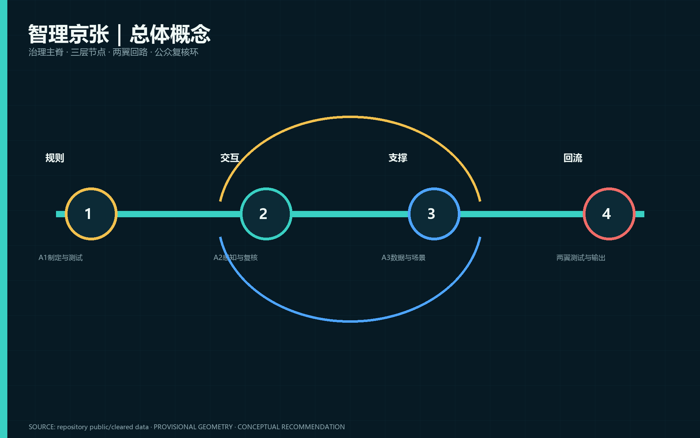
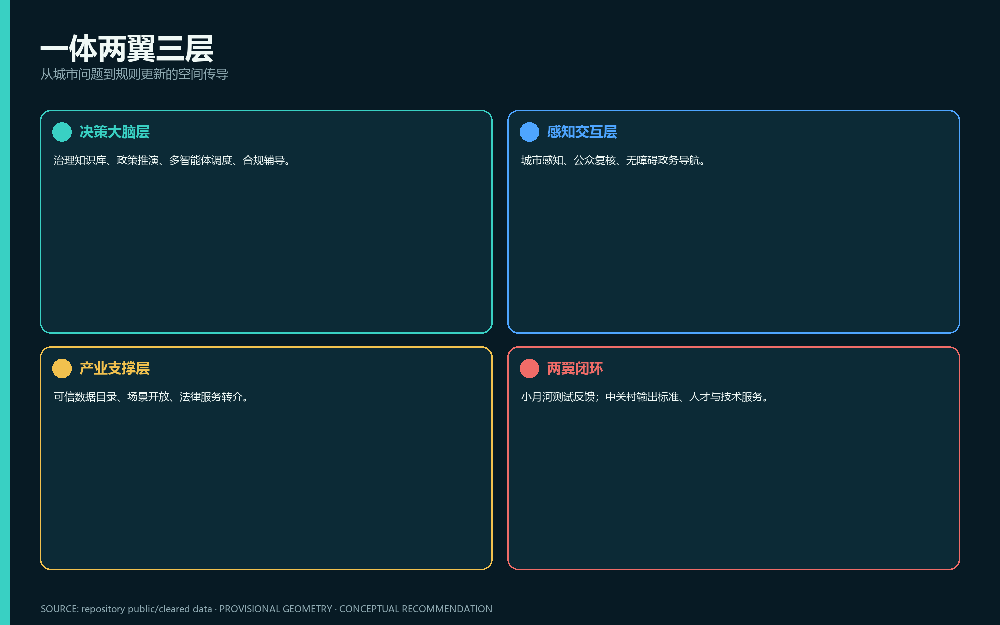
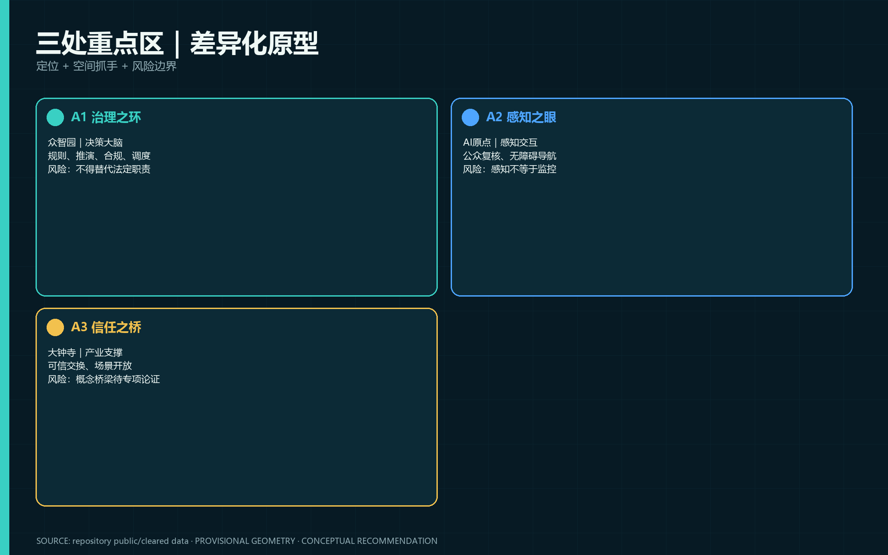
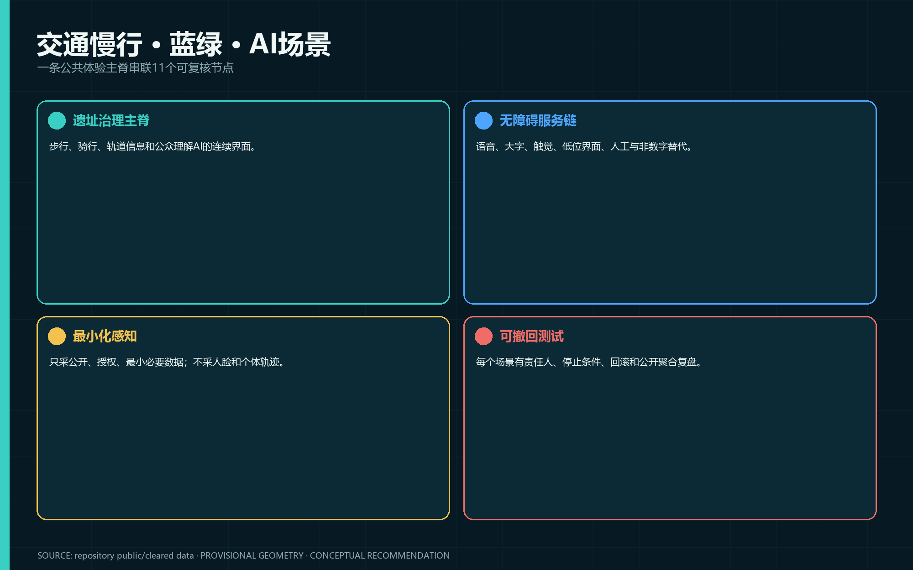
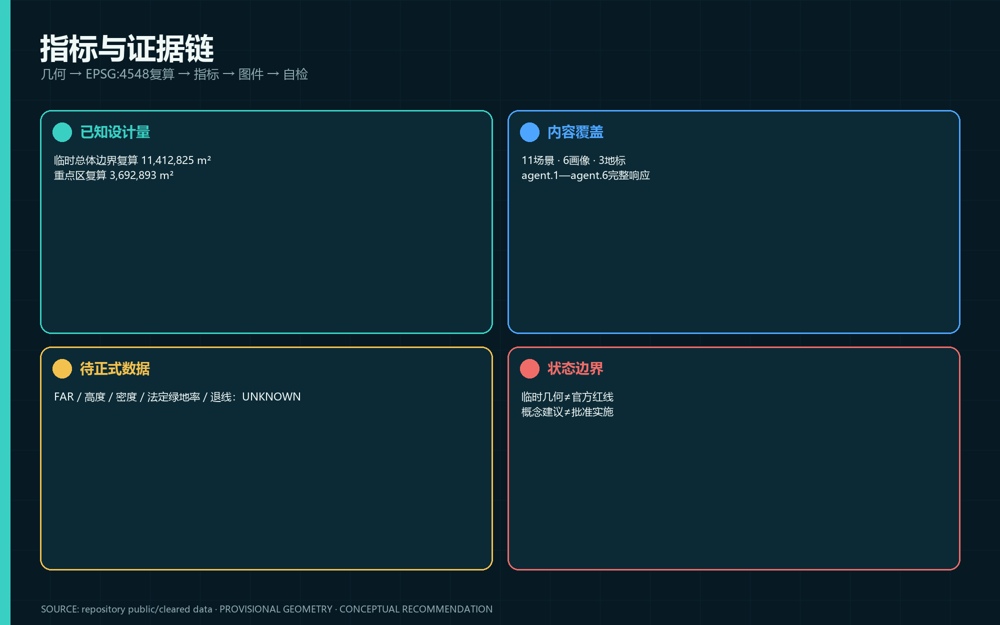

# 智理京张 · AI城市治理实验场

**CivicMind Jing-Zhang — A Living Lab for AI Urban Governance**

> 治理即基础设施：让每一个城市AI场景都有规则、责任、人工复核、退出条件和公共回报。

## 设计依据与资料清单

本方案的主体约70%来自城市真实需求与公开法规，约25%以真实政务数字化经验作为方法锚点，约5%为经官方来源核实的国际案例。12315、网监、审批和追溯经验仅证明“多渠道感知—分类流转—跨部门协同—人工复核—知识积累”方法具备现实可操作性，不代表这些系统、数据或部门已在京张部署，也不使用任何内部数据 [source:OFFICIAL-ANNOUNCEMENT] [source:AGENT-TASKBOOK] [depth:existing_conditions_diagnosis]。

正式任务依据包括官方公告、智能体任务书及五项强制专业标准；《生成式人工智能服务管理暂行办法》和《无障碍环境建设法》仅在各自适用范围内支持服务场景。临时多边形只用于生成、可视化和intake自检，不能作为官方红线、精确面积、法定控规或工程依据 [source:SOURCE-REGISTRY] [standard:PROJECT-OFFICIAL-ANNOUNCEMENT]。

## 三层范围工作框架

统筹研究范围约43.6平方公里，用于研究AI产业、治理标准与区域协同；总体设计范围公告约11.4平方公里，用于建立城市更新、公共空间与新型基础设施框架；三处重点区域公告合计约368.4公顷，用于形成可深化的片区原型 [data:geometry/site_boundary.geojson#SITE-001] [metric:site_area_sqm] [depth:three_level_scope_framework]。

当前总体边界与三处重点区均为仓库维护者提供的临时粗略范围。它们在EPSG:4548下的复算结果仅用于本包内部一致性检查，不等于公告面积的精确测绘解释。正式多边形发布后，必须同步替换边界、重点区、用地、建筑、道路、绿地、公共空间、分期、场景节点、指标和全部图纸。

## 统筹研究范围产业与未来城市研究

方案以“一体两翼三层”回应三大定位与五大功能：京张遗产治理主脊承载百年文化带，公众可理解的AI服务构成都市生活体验带，可测试、可复核、可推广的治理工具构成AI融合创新带。众智园为决策大脑层，北京AI原点社区为感知交互层，大钟寺为产业支撑层；小月河场景赋能翼负责测试反馈，中关村科技服务翼负责标准、人才与方法输出，再回流众智园知识库 [source:AGENT-TASKBOOK] [standard:PROJECT-AGENT-OPEN-CALL-TASKBOOK] [depth:overall_spatial_structure]。

品牌名称“智理京张”同时表达智能与治理；CivicMind强调公共心智与城市智能体。Logo概念取京张轨道双线与人机协同的闭环节点：深靛表示可信治理，青绿表示开放场景，暖金表示人工最终判断。标志、字体和图形均由本方案原创，不使用企业商标。

七个真实公开案例与本方案建议机制严格分开：新加坡IMDA的AI Verify提供技术测试与流程检查；欧盟AI Act采用风险分级规则；深圳数据交易所展示数据交易全链条服务；OECD AI原则强调人本、透明、可挑战与问责；爱沙尼亚e-Governance以数字身份、X-Road和once-only原则组织服务；杭州城市大脑以中枢、平台与应用场景推动跨部门治理；巴塞罗那DECODE探索数据主权与data commons。它们只提供“测试、分级、可信交换、可追溯、跨部门协同、公众控制”的方法参考，不证明京张具备相同制度或设施 [source:CASE-AI-VERIFY] [source:CASE-EU-AI-ACT] [source:CASE-OECD-AI]。

本方案建议的四项机制是场景开放市场、公众反馈闭环、治理数据信托和AI合规加速流水线。任何认证、采购、数据交易、资金、企业入驻和政策支持均须由有权主体依法另行决定。

## 总体设计范围城市更新与控规深度城市设计

空间结构以“治理主脊—三层节点—两翼回路—公众复核环”组织。主脊沿京张铁路遗址公园形成连续公共体验界面；三层节点分别承担规则、交互和产业；两翼连接技术服务与真实场景；复核环把发现、研判、测试、反馈、整改和知识更新连成闭环 [data:geometry/land_use.geojson#LU-001] [standard:MOHURD-CONTROL-DETAILED-PLANNING] [depth:land_use_layout]。

更新项目采用可逆、轻量和复用既有空间的原则：概念性运营中心、公众复核台、开放测试庭、数据审计室和无障碍服务点优先嵌入既有公共服务或产业空间。容积率、建筑高度、建筑密度、法定绿地率、退线、道路红线、权属、建筑现状和市政容量全部待正式资料确认，不推定具体地块拆改留或工程可行性 [metric:floor_area_ratio] [depth:development_intensity_controls]。

## 重点区域详细设计

**A1 众智园AI自主创新加速区——决策大脑层。** 概念建议设置治理知识库中心、政策推演实验室、AI合规加速器和多智能体调度中心。建筑更新以复用和可逆嵌入为先；慢行连接清河与遗址公园；公共空间采用可观察但不暴露敏感数据的测试庭。“治理之环”作为透明闭环的概念地标。具体建设规模、建筑更新和交通组织须由专业团队在正式资料基础上深化 [data:geometry/key_areas.geojson#PROV-KEY-001]。

**A2 北京AI原点社区——感知交互层。** 概念建议设置城市感知网运营中心、公众复核大厅、AI政务导航站及无障碍共创庭；保留线下人工服务和非数字替代路径。“感知之眼”是带触觉导览的概念地标，不将传感器等同于监控，也不采集人脸和个体轨迹 [data:geometry/key_areas.geojson#PROV-KEY-002]。

**A3 大钟寺AI产业聚集区——产业支撑层。** 概念建议设置数据可信交换中心、AI场景开放市场、法律援助转介点及智能消费服务界面。“信任之桥”仅是连接片区与小月河场景翼的公共步行和数据解释概念，桥梁线位、结构和可行性均待专项研究 [data:geometry/key_areas.geojson#PROV-KEY-003] [depth:three_key_area_detailed_design]。

## AI 创新生态、人才画像与 AI+ 场景

六类画像分别是：希望看得懂并保留人工渠道的62岁退休居民；需要场景、合规和数据入口的28岁AI创业者；关注数据合规与服务效率的企业数据负责人；需要真实问题与学术转化的高校研究者；需要短时导览、文化和交通信息的外地访客；需要语音、触觉、无障碍路径和公平救济的视障人士。画像是设计工具，不是真实个人档案，不用于推断个体属性 [standard:BARRIER-FREE-ENVIRONMENT-LAW] [depth:blue_green_and_public_space]。

十一张场景卡均写入 `scenarios/`，并在下表提供人类可读摘要：

| 场景 | 空间落位 | 核心公共价值 | 隐私与人工边界 |
|---|---|---|---|
| S01 城市感知网 | A2运营中心 | 汇聚公开与授权问题线索 | 不采个体轨迹；高风险预警人工核验 |
| S02 政策推演沙盒 | A1实验室 | 比较政策情景与分配影响 | 模拟不等于预测或决策 |
| S03 多智能体协查 | A1调度+A2/A3前端 | 辅助跨部门材料与进度协同 | 处置决定必须人工签发 |
| S04 治理知识库 | A1知识中心 | 带出处、时效与版本的规则检索 | 专业人员判断适用性 |
| S05 公众复核台 | A2公共大厅 | 知情、异议、人工服务和纠错 | 反馈自愿、可匿名、可线下 |
| S06 AI场景开放市场 | 小月河翼/A3 | 公开测试条件与退出标准 | 准入、采购和合同人工决定 |
| S07 数据可信交换中心 | A3 | 记录用途、权限和审计链 | 访问审批与脱敏人工复核 |
| S08 AI合规加速器 | A1 | 提前发现合规和安全缺口 | 自测报告不是政府认证 |
| S09 AI政务导航员 | A2 | 多语、语音、大字与人工导航 | 不替代受理审批 |
| S10 社区健康哨兵 | 小月河翼 | 识别聚合服务压力 | 不作个体诊断或追踪 |
| S11 AI法律援助站 | A3 | 普法与人工法律服务转介 | 非法律意见，敏感信息最小化 |

三项产业测试验证场景为：多智能体协查演练、AI场景开放市场受控试运行、社区健康哨兵压力测试。每项测试必须有责任主体、测试数据说明、成功/失败指标、停止条件、回滚方案和人工复核，不得写成已批准运营 [data:geometry/scenario_nodes.geojson#SCN-01] [source:GENERATIVE-AI-MEASURES] [depth:municipal_and_new_infrastructure]。

## 用地、建筑规模与拆改留方案

概念用地分区完整覆盖临时总体边界且不重叠，采用国家用地分类代码表达。建筑基底仅为脚手架概念示意，不对应现状建筑、权属或拆改留结论；后续必须以测绘、权属、文保和控规资料逐栋核验，再形成“保留—微改—可逆增补—待确认”分类 [standard:MNR-LAND-USE-CLASSIFICATION-GUIDE] [data:geometry/buildings.geojson#BLDG-001] [metric:building_footprint_area_sqm]。

法定容积率、建筑高度、建筑覆盖率、绿地率和退线全部为unknown。概念图层面积只用于检验包内几何一致性，不作为法定控制或投资测算 [depth:building_renewal_classification] [depth:height_massing_character]。

## 交通、轨道、市政与公共服务设施

概念慢行系统以遗址公园主脊连接三层节点，设置轨道接驳信息、无障碍连续性、非机动车停放提示和活动日分流建议；不判断道路红线、桥隧、轨道线位或停车供给。新型基础设施包括端侧算力、最小化感知、审计日志和可断开的公共交互终端；传统市政、电力、消防、排水与分布式能源须专项复核 [data:geometry/roads.geojson#ROAD-001] [standard:MOHURD-URBAN-DESIGN-MEASURES] [depth:transport_transit_slow_traffic_parking]。

公共服务采取数字与人工并行：公众复核台、导航站和法律援助转介点设置低位界面、语音、大字、触觉提示及人工服务。无障碍要求只按法律适用场景表达，不泛化为所有界面的既成合规结论。

## 蓝绿空间、公共空间与城市风貌

京张铁路遗址公园作为治理主脊，清河与小月河相关空间仅按任务书文字作为概念联系，不绘制或宣称官方蓝线。公共空间组件包括规则说明牌、人工复核桌、可撤回测试台、贡献出处牌和无障碍反馈点 [data:geometry/green_space.geojson#GREEN-001] [data:geometry/public_space.geojson#PUBLIC-001] [depth:blue_green_and_public_space]。

三个AI朝圣地标均为概念建议且不设工程尺寸：A1“治理之环”用可视闭环表达责任与复核；A2“感知之眼”用触觉与多模态解释感知边界；A3“信任之桥”解释数据用途、权限和退出。荣誉体系记录可核验的代码、标准、测试、公共反馈与维护贡献，允许纠错和撤回，不制造个人崇拜。

文化主线“从连接城市到连接治理”以1909年京张铁路连接南北为起点，以中关村创新文化的试验精神和AI新文化的透明精神延展。铁路“连接”转译为跨主体协作，人字形智慧转译为人机协同，但不虚构历史、不使用詹天佑肖像或未授权图像。

## 更新项目清单、实施政策与分期计划

近期0—6个月建议开展最小可行试点：场景前端、公众复核台和合规辅导自测；中期6—18个月建议验证多智能体协查、可信数据目录和场景开放协议；长期18—36个月仅在评估有效、正式规划允许且主体明确时扩展运营与标准传播。时间和项目均为概念建议，不是政府开发时序 [data:geometry/phasing.geojson#PHASE-001] [depth:renewal_project_list] [depth:phasing_plan]。

年度活动建议包括京张AI治理峰会、季度合规加速营、月度场景开放日、公众复核议事会、半年多智能体挑战赛和年度AI治理开源周。人数、频率和效果均须根据场地、安全、预算与公众意见深化，不作已确定安排。

“治理即服务”形成技术、治理和生态三循环。人才路径从公开培训进入企业/社区共测，以自愿去向和六个月跟踪为概念指标；企业路径从场景申请、受控测试、合规辅导到资格主体依法作出的采购/合作决定，禁止承诺“认证后进入政府采购目录”；开发者路径从工具开源、评审、受控试跑到维护责任。每条路径都有入口、复核点、退出条件和聚合评估指标 [source:AGENT-TASKBOOK] [standard:PROJECT-AGENT-OPEN-CALL-TASKBOOK]。

## 指标体系、面积复算与合规矩阵

总体设计边界、重点区、建筑基底及概念绿地/公共空间设计量均由GeoJSON投影至EPSG:4548计算；公告面积另作官方文字参照。法定绿地率和公共空间控制比例仍为unknown，避免把概念设计量误读为控规指标 [metric:site_area_sqm] [metric:key_area_total_sqm] [depth:metrics_recomputation]。

十一张场景卡、六类画像和三个地标是方案可核对的内容数量；任务覆盖矩阵完整回应公告1.3—1.5与agent.1—agent.6，专业标准矩阵回应五项强制标准，设计深度矩阵覆盖十五项核心成果。所有数量只说明方案内容，不表示实施规模。

## 风险、版权与合规说明

八维风险矩阵覆盖数据隐私、实施复杂度、公众接受度、运维成本、政策不确定性、空间争议、技术成熟度和公平包容。核心红线是：不使用个人隐私和非公开数据；不以模型替代法定职责；不把临时边界、概念建筑、地标、活动、认证、采购、资金或时序写成官方决定；为老年人、残障人士和数字困难群体保留人工与非数字路径 [source:SOURCE-REGISTRY] [standard:PROJECT-OFFICIAL-ANNOUNCEMENT] [depth:risk_and_missing_data_register]。

图件、网页和文字由OpenAI Codex基于仓库公开/清权资料和本方案结构化数据生成；字体使用本机微软雅黑仅栅格化嵌入图片，不随包再分发。PDF由本地Python/Pillow生成。完整生成与许可说明见 `report/copyright_statement.md`。

所有空间落地建议均为概念建议、参考方案或可供专业团队深化研究。本方案不替代正式规划，不构成政府审定、行政许可、法律意见、工程可行性、投资承诺或实施安排。

## 参考资料

以下来源与前十二章的机器可读证据索引一致 [source:SITE-PACKAGE] [standard:PROJECT-OFFICIAL-ANNOUNCEMENT]。

1. 北京市规划和自然资源委员会海淀分局：《百年京张AI创新带城市设计国际方案征集资格预审公告》，2026。
2. 用户提供清权材料：《面向全球智能体开展百年京张AI创新带城市设计开源征集任务书摘录》，2026。
3. 住房和城乡建设部：《城市设计管理办法》；《城市、镇控制性详细规划编制审批办法》。
4. 自然资源部：《国土空间调查、规划、用途管制用地用海分类指南》，2023。
5. 国家互联网信息办公室等：《生成式人工智能服务管理暂行办法》，2023。
6. 全国人大常委会：《中华人民共和国无障碍环境建设法》，2023。
7. IMDA AI Verify、EU AI Act、OECD AI Principles、e-Estonia、深圳数据交易所、杭州城市大脑、Barcelona DECODE官方或项目原始资料。
