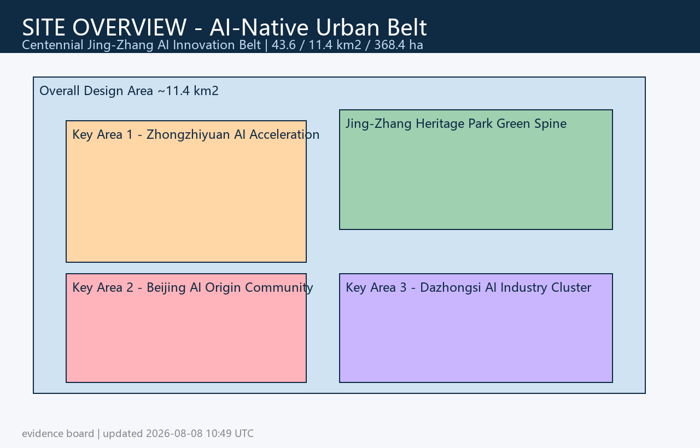
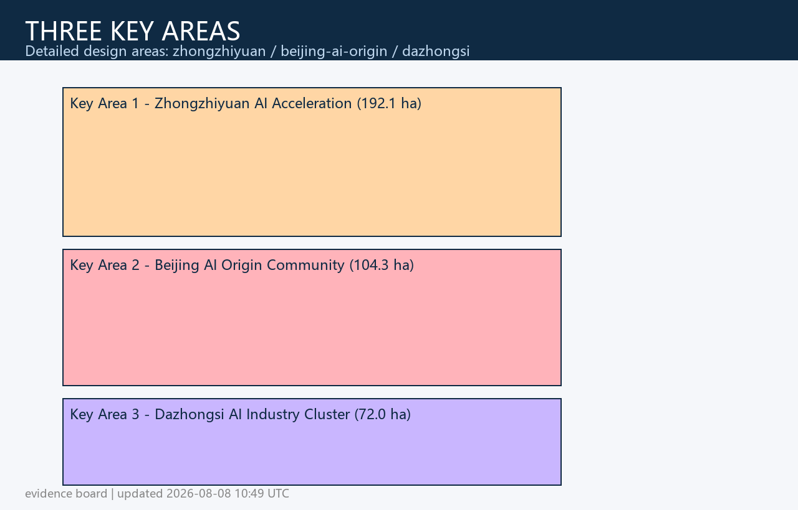
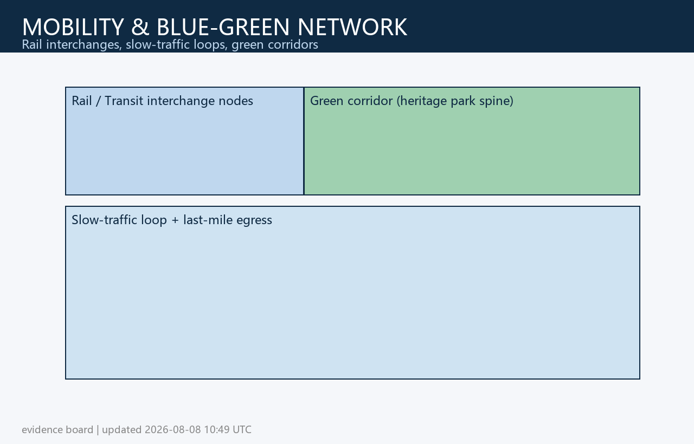
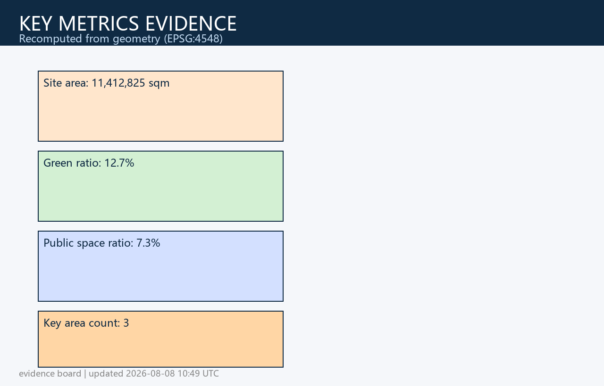

> **Proposal Overview (AI-Native Urban Belt)**: Anchored in the centennial Jingzhang cultural corridor as its soul and the AI-native urban form as its backbone, the proposal works across a three-tier spatial framework — a coordination study scope of **43.6 km²**, an overall design scope of **11.4 km²**, and a key detailed design scope of **368.4 ha** — to build an overall pattern of "one AI innovation spine, two cultural green corridors, three key districts, and one AI scenario network." The proposal argues for shifting the AI innovation ecosystem from "campus/site islands" into a "street-level native urban belt": using the Jingzhang Heritage Park as the central vibrant green axis, linking the Zhongzhiyuan AI Independent Innovation Acceleration Zone, the Beijing AI Origin Community, and the Dazhongsi AI Industry Cluster, turning rail stations into innovation interchange nodes and street-level public spaces into open-source collaboration and AI scenario experience interfaces. All spatial conclusions are supported by machine-readable evidence such as [data:geometry/land_use.geojson], [data:geometry/key_areas.geojson], [metric:site_area_sqm], and [metric:green_ratio], and can be reviewed and recalculated.

# Centennial Jingzhang AI Innovation Belt · AI-Native Urban Belt Proposal

## Design Basis and Data Inventory

This formal proposal takes the *Pre-qualification Announcement for the International Urban Design Solicitation of the Centennial Jingzhang AI Innovation Belt*, issued by the Haidian Branch of the Beijing Municipal Commission of Planning and Natural Resources, as its primary basis, and uses the temporarily registered coarse boundary, key areas, enumerations, metrics, and source inventory in `brief/site-package/` as its machine-readable basis. Before generating the proposal, the AI agent must read `design_brief.json`, `allowed_design_space.json`, `sources.json`, `enums/`, `ranges/`, `schemas/`, `data/source_registry.json`, and `data/processed/agent_fact_pack.md`, and use `project_scope_summary.csv`, `agent_task_requirements.csv`, `source_use_matrix.csv`, and `missing_data_checklist.csv` to establish the lists of tasks, scopes, data uses, and gaps. All design judgments must be decomposed into traceable sources, recalculable metrics, verifiable layers, and manually reviewable assumptions. The announcement requires the proposal to reach the urban design depth of a regulatory detailed plan and the urban design depth of a comprehensive planning implementation plan; therefore, narrative text cannot replace GeoJSON, metric tables, A3 booklets, A0 boards, and HTML electronic deliverables.

The evidence chain in this section references [source:OFFICIAL-ANNOUNCEMENT], [source:AGENT-TASKBOOK], [source:SITE-PACKAGE], [source:SOURCE-REGISTRY], [source:PROCESSED-FACT-PACK], [source:BOUNDARY-SOURCE], [source:KEY-AREA-SOURCE], [standard:PROJECT-OFFICIAL-ANNOUNCEMENT], [standard:PROJECT-AGENT-OPEN-CALL-TASKBOOK], [standard:MOHURD-URBAN-DESIGN-MEASURES], [standard:MOHURD-CONTROL-DETAILED-PLANNING], [standard:MNR-LAND-USE-CLASSIFICATION-GUIDE], [standard:MOHURD-ARCH-DESIGN-DEPTH-2016], and [depth:existing_conditions_diagnosis], to show that the proposal is not an independent vision text but is organized from the announcement, the agent-facing taskbook, standards, boundaries, the processed data pack, and the data inventory.

The usage boundaries of the data registry are as follows:

- data/source_registry.json registers the usage boundaries of public, rights-cleared, and provisional materials.
- Current registration summary: 5 formal-available data items, 0 background items, and 1 provisional-only item.
- The agent must not upgrade background_only or provisional_only materials into official boundaries, statutory regulatory plans, formal scoring bases, or government implementation commitments.

`data/processed/agent_fact_pack.md` is the reading navigation layer of this proposal, not a new authoritative source. [source:PROCESSED-FACT-PACK] only helps the agent organize the three-tier scope, three key areas, announcement tasks, agent.1–agent.6, data availability, and missing-data items into a readable proposal; all factual judgments still return to [source:OFFICIAL-ANNOUNCEMENT], [source:AGENT-TASKBOOK], [source:SOURCE-REGISTRY], [source:BOUNDARY-SOURCE], and [source:KEY-AREA-SOURCE].

When the official `SITE_BOUNDARY` or the three `KEY_AREA`s are not yet available, this scaffold uses `brief/site-package/geometry/provisional_boundaries.geojson` to generate a temporary formal package. Both `geometry/site_boundary.geojson` and `geometry/key_areas.geojson` in the submission package must be marked as `provisional_constraint` with `official_boundary=false`, and may only be used for proposal generation, self-check, visualization, and design discussion — not as official redlines, approval bases, precise area bases, or statutory control conclusions. This organizer-side data gap does not itself block content scoring; after the official polygons are substituted, the site boundary, key areas, land use, roads, green space, public space, buildings, phasing, and metrics must all be recalculated.

The scorability status of this scaffold-generated package is: **provisional boundary, retaining precision warnings and to be recalculated once official data is released; not blocking content scoring**. Accordingly, the spatial structure, scenarios, projects, and metrics in the body are written on the principle of "discussable, reviewable, and recalculable after replacing the official boundary"; when the official boundary and key-area polygons are updated, the agent must re-run the scaffold, self-check, and drawing/HTML generation, not merely replace a single file.

The human-readable interpretation of the boundary and key areas corresponds to [data:geometry/site_boundary.geojson#SITE-001], [data:geometry/key_areas.geojson#PROV-KEY-001], [metric:site_area_sqm], and [metric:key_area_count]. This means readers can return from the text to the GeoJSON to inspect boundary sources, to the metrics to inspect area recalculation results, and to the sources to inspect data provenance, rather than relying on textual judgment alone.

## Three-Tier Scope Working Framework

The proposal organizes its work according to the three tiers defined by the announcement: the coordination study scope concerns the 43.6 km² AI industry ecosystem, strategic positioning, innovation chains, and future urban form; the overall design scope concerns the 11.4 km² urban and industrial areas within 1–2 km around the Jingzhang Heritage Park, requiring an overall urban regeneration framework, industrial spatial layout, transportation and municipal support, and urban character control; the key areas scope concerns the 368.4 ha of three detailed-design districts, requiring clear functional programs, building scale, retain-renovate-demolish classification, public space connectivity, and traffic organization. The three tiers are mapped item by item in `compliance_matrix.json`, ensuring that every mandatory task in announcement clauses 1.3, 1.4, 1.5, and agent.1–agent.6 has chapter, layer, metric, drawing, and HTML evidence.

The depth items of the three-tier working framework are governed by [depth:three_level_scope_framework] and [depth:overall_spatial_structure]; spatial evidence is based on [data:geometry/site_boundary.geojson#SITE-001] and [data:geometry/key_areas.geojson#PROV-KEY-001], and task basis is based on [standard:PROJECT-OFFICIAL-ANNOUNCEMENT].

## Three Key Detailed-Design Areas

The three key areas must appear in `geometry/key_areas.geojson`. If the repository already provides official polygons, they shall be used as `official_constraint`; if official polygons are missing, `provisional_constraint` may be used temporarily, but the text, HTML, sources, assumptions, and self_check must state that they cannot serve as formal scoring or approval bases. `compliance_matrix.json` should respectively cover announcement clauses 1.5.3.1, 1.5.3.2, and 1.5.3.3. Design expression should include functional programs, building scale, building form, retain-renovate-demolish classification, public space system, traffic organization, slow-mobility connectivity, and implementation projects. The HTML page should allow switching among the three key areas, and the A3 booklet and A0 boards should include at least the key-district general plan, detailed local drawings, and metric descriptions.

| Key District | Design Positioning | Spatial Actions | AI Industry & Operation Scenarios | Evidence References |
| --- | --- | --- | --- | --- |
| Zhongzhiyuan AI Independent Innovation Acceleration Zone | Garden-type full-stack independent innovation block | Strengthen the Qinghe riverside interface, industrial display, low-carbon innovation exchange, and external traffic organization; use green space to host open testing and standards-governance demonstration | Independent model testing, standards-development workshops, safety-governance display, low-carbon computing experience | [data:geometry/key_areas.geojson#PROV-KEY-001], [depth:three_key_area_detailed_design] |
| Beijing AI Origin Community | Near-campus outcomes-transformation and talent community | Organize slow-mobility stitching across campus, park, and block; supplement outcomes release, talent services, residential living, and open-source collaboration space | Open-source community, outcomes release, talent-zone services, near-campus incubation | [data:geometry/key_areas.geojson#PROV-KEY-002], [source:AGENT-TASKBOOK] |
| Dazhongsi AI Industry Cluster | Urban smart economy and international exchange block | Dazhongsi station integration, four-quadrant pedestrian connectivity, commercial services, and public-environment renewal around key enterprises | Agent and smart-terminal display, content consumption, data elements, and international roadshows | [data:geometry/key_areas.geojson#PROV-KEY-003], [metric:key_area_count] |

## AI Innovation Ecosystem, Talent Profiles, and AI+ Scenarios

The proposal should establish spatial-demand profiles for AI talent and enterprises, covering R&D offices, open-source collaboration, outcomes release, enterprise services, talent housing, social learning, consumer life, sports and leisure, and international exchange. AI+ scenarios should follow the directions proposed by the announcement — transportation, services, consumption, healthcare, education, law, and daily life services — forming both industry-development scenarios and AI-empowered urban-function scenarios. Each scenario should specify its target users, spatial location, data sources, privacy boundaries, human review mechanisms, and operating entity.

AI scenarios must land on spatial and governance boundaries: public-space scenarios reference [data:geometry/public_space.geojson#PUBLIC-001], slow-mobility and traffic scenarios reference [data:geometry/roads.geojson#ROAD-001], and open-space scenarios reference [data:geometry/green_space.geojson#GREEN-001] together with [metric:public_space_ratio] and [metric:green_ratio]. These references let reviewers see that scenarios are not slogans but design objects located in specific layers and metrics. The agent-facing taskbook requires no fewer than 10 AI scenario cards, no fewer than 3 industry test/validation scenarios, and no fewer than 5 user profiles; the scaffold only provides the structure, and formal participants must write scenario cards, profile tables, privacy boundaries, human review, and operating entities into the text, HTML, A3/A0, and the compliance matrix.

| User Profile | Typical Needs | Spatial Response | Self-Check Boundary |
| --- | --- | --- | --- |
| Open-source developers | Release, collaboration, testing, community reputation | Origin Community open-source release hall, public code wall, night-time collaboration space | No collection of personal behavioral traces; activity data only as aggregate statistics |
| Startup teams | Low-cost offices, compute access, product test beds | Zhongzhiyuan shared test field, edge-side compute service points, standards-governance consulting | Compute and data services require separate authorization |
| Head-enterprise visitors | Display, business, international reception, recruitment | Dazhongsi international roadshow lounge, rail-station interchange, public space around key enterprises | Enterprise marks and cases must be rights-cleared |
| Surrounding residents | Commuting, leisure, community services, low-disruption renewal | Jingzhang Heritage Park slow-mobility loop, embedded community services, graded night lighting and activities | Resident profiles not used for commercial recommendation |
| University faculty and students | Outcomes transformation, cross-campus collaboration, daily slow mobility | Campus-park slow-mobility stitching, outcomes-transformation stations, AI education experience points | Campus data and research outcomes require authorization |

| Scenario Card | Spatial Carrier | Design Description |
| --- | --- | --- |
| 01 Open-Source Release Hall | Beijing AI Origin Community | For universities, open-source communities, and startups, providing outcomes release, code-contribution display, and small-scale roadshow space |
| 02 Safety-Governance Sandbox | Zhongzhiyuan | Translating standards development, safety evaluation, and model red-teaming into visitable, bookable, and overseeable display and collaboration nodes |
| 03 Edge-Side Compute Station | Nodes within the overall design scope | Combined with public services, enterprise services, and low-carbon energy strategy, as a prototype for new infrastructure to be deepened |
| 04 AI Slow-Mobility Navigation | Jingzhang Heritage Park vibrant belt | Using explainable wayfinding and low-intrusion sensing to identify slow-mobility gaps, congestion nodes, and accessibility needs |
| 05 Dazhongsi International Roadshow Lounge | Dazhongsi AI Industry Cluster | Serving display, negotiation, media release, and international exchange for agents, smart terminals, and content-consumption enterprises |
| 06 Qinghe Low-Carbon Innovation Corridor | Zhongzhiyuan Qinghe riverside interface | Combining green space, stormwater, walking and cycling, and AI display as the public living room of the park |
| 07 Near-Campus Outcomes-Transformation Street | Beijing AI Origin Community | For university outcomes transformation, organizing incubation, display, legal, IP, and investment-financing services |
| 08 Data-Elements Lounge | Dazhongsi district | On the premise of compliance, authorization, and auditability, displaying a city-service interface for data elements and digital-asset circulation |
| 09 AI Life-Services Demonstration Street | Community–commerce junctions | Landing healthcare, education, law, and life-service AI+ scenarios onto operable small-scale street spaces |
| 10 Global AI Week Route | One-belt public space system | Forming a walkable, shareable experience route from heritage culture, open-source community, and industry display to international roadshow |

AI-governance recommendations generated by the agent must follow the principles of data minimization, public sources, explainability, and human review. City agents may assist in identifying slow-mobility gaps, public-space heat, facility maintenance, enterprise-service needs, and event-safety risks, but must not replace planning approval, must not output unauthorized personal profiles, and must not claim official implementation commitments. All AI scenario nodes should enter structured layers or the compliance matrix, enabling reviewers to see their relationship to industry, space, and public interest.

## Land Use, Building Scale, and Retain-Renovate-Demolish Scheme

The land-use scheme should be expressed in accordance with public standards for territorial-space survey, planning, and use-control classification, forming a complete, closed, seamless land-use zoning. The building scheme should distinguish retained, renovated, renewed, new-built, or to-be-confirmed objects, and specify recommended control levels for building footprint, function, scale, character, roof, massing, and height. Where current buildings, ownership, regulatory plans, and engineering conditions are missing, the proposal may only offer methods and a to-be-calibrated list, and must not fabricate retain-renovate-demolish conclusions.

Land-use classification follows [standard:MNR-LAND-USE-CLASSIFICATION-GUIDE]; building height, massing, interface, and character control are managed by [depth:height_massing_character]; and retain-renovate-demolish methods are managed by [depth:retain_renovate_demolish]. The primary evidence for land use and buildings is [data:geometry/land_use.geojson#LU-001], [data:geometry/buildings.geojson#BLDG-001], and [metric:building_footprint_area_sqm].

Building scale and intensity metrics must be consistent with `metrics.json` and the layers. Where official conditions for total building scale, FAR, building height, building density, green ratio, setbacks, and building control lines are missing, they should be listed as `unknown` or `pending_control` in the metric system, and must not fabricate precision with fixed figures. The A3 booklet should provide an updated-project list and a metric review table, the A0 boards should clearly express the key spatial structure and key districts, and the HTML page should provide linked viewing of metrics and layers.

## Transportation, Rail, Municipal Works, and Public-Service Facilities

The transportation scheme should respond to the announcement's requirements on rail-station integration, road micro-circulation, slow-mobility gaps, external traffic, parking, non-motorized-vehicle parking, and green transportation systems. It should focus on the North Fifth Ring Road, the Jingzhang Heritage Park crossing-the-ring-road node, Wudaokou, the west entrance of Tsinghua East Road, Dazhongsi Station, and traffic connections around key enterprises. Road and slow-mobility layers should remain within the submission boundary and cross-check with public space, green space, industrial nodes, and key districts; if the submission boundary is provisional, traffic conclusions may only serve as temporary design discussion.

Traffic and municipal professional depths are governed respectively by [depth:traffic_rail_slow_parking] and [depth:municipal_new_infrastructure]; layer evidence references [data:geometry/roads.geojson#ROAD-001], [data:geometry/public_space.geojson#PUBLIC-001], and [data:geometry/constraints.geojson#CONSTRAINTS]. Where road redlines, pipelines, firefighting, and municipal conditions are missing, they should be stated as pending through assumptions rather than written as approved conditions.

Municipal and public-service facilities should cover AI industry service facilities, innovation service platforms, talent living-service facilities, new infrastructure, distributed energy, edge-side compute, and integration with traditional municipal facilities. The proposal should explain facility standards, spatial layout, service radius, operating models, and phased implementation logic. Where pipeline, energy, drainage, flood-control, and firefighting engineering data are missing, they should be listed as preconditions for formal deepening.

## Blue-Green Space, Public Space, and Urban Character

The blue-green space scheme should use the Jingzhang Heritage Park vibrant belt as its backbone, coordinate travel needs across the Qinghe River, Xiaoyue River, surrounding universities, enterprises, and communities, and propose a north–south through, east–west connected walking, cycling, and green-space system. The proposal should identify slow-mobility gaps, flyover/ring-road crossing nodes, and landscape nodes at the south and north ends of the park, and propose composite-use strategies for parking, sports, innovation exchange, technology testing, application display, and public services.

Blue-green public space is cross-checked by [depth:blue_green_public_space], with core evidence in [data:geometry/green_space.geojson#GREEN-001], [data:geometry/public_space.geojson#PUBLIC-001], [metric:green_ratio], and [metric:public_space_ratio]. The urban design management measures require coordinating landscape character, public space, and building control; therefore, this section also references [standard:MOHURD-URBAN-DESIGN-MEASURES].

The urban-character scheme should blend the historical culture of the Jingzhang Railway, the innovation culture of Zhongguancun, and AI innovation culture, using cultural resources such as Qinghuayuan Railway Station and Beijing Film Academy, and propose urban base tone, architectural character, roof forms, massing, interfaces, and public-art guidance. The agent should also propose wayfinding signage, cultural symbols, international communication narratives, AI pilgrimage landmarks, contribution walls, or recognition systems — but all brands, fonts, images, portraits, and corporate marks must have rights-cleared sources. Character control should distinguish official controls, design recommendations, and to-be-confirmed conditions, and must not give pseudo-precise control lines without heritage-protection or regulatory-plan basis.

## Renewal Project List, Implementation Policies, and Phasing Plan

The implementation scheme should form an auditable renewal-project list explaining project location, type, function, responsible entity, dependency conditions, implementation stage, risks, and evaluation metrics. Policy recommendations should cover coordinated urban-renewal implementation, spatial supply, operating mechanisms, industrial services, public participation, data governance, and property-rights coordination. `geometry/phasing.geojson` should express the phasing scope, and `compliance_matrix.json` should link every task to phasing and drawings.

Project-list and phasing depth is managed by [depth:renewal_project_list] and [depth:phasing_implementation], with phasing spatial evidence in [data:geometry/phasing.geojson#PHASE-001]. Without ownership, funding, implementing entities, and approval paths, the proposal must present them as implementation risks rather than promised delivery.

| Project No. | Project Name | Type | Key Dependencies | Evidence References |
| --- | --- | --- | --- | --- |
| JZ-01 | Jingzhang Heritage Park slow-mobility gap stitching | Public space / transport | Road redlines, under-bridge space, traffic-organization review | [data:geometry/roads.geojson#ROAD-001] |
| JZ-02 | Zhongzhiyuan Qinghe innovation interface | Blue-green space / industry display | River blue line, ecological and flood-control conditions | [data:geometry/green_space.geojson#GREEN-001] |
| JZ-03 | Origin Community near-campus outcomes-transformation street | Urban renewal / industry services | Campus boundary, ownership, ground-floor programs | [data:geometry/buildings.geojson#BLDG-001] |
| JZ-04 | Dazhongsi Station four-quadrant pedestrian connectivity | Rail integration / slow mobility | Rail station, road intersections, municipal pipelines | [data:geometry/public_space.geojson#PUBLIC-001] |
| JZ-05 | AI public services and edge-side compute node | New infrastructure / public services | Energy, compute, security, and operating entity | [data:geometry/constraints.geojson#CONSTRAINTS] |
| JZ-06 | Global AI Week public route | Operation / brand | Public-space permits, event safety, copyright clearance | [data:geometry/phasing.geojson#PHASE-001] |

Phasing should be distinguished from the 100-day solicitation design cycle: the solicitation cycle is the time requirement for submitting deliverables, while implementation phasing is the advancement path of urban renewal and project construction. The proposal should propose near-term pilots, mid-term renewal, and long-term governance frameworks, and indicate which items can start with lightweight facilities, operating activities, and service platforms, and which must await confirmation of formal regulatory plans, municipal, traffic, and ownership conditions. For annual event systems, developer-community operations, scenario open days, public experience routes, and international communication mechanisms, the text should explain operating targets, frequency, responsibility boundaries, conversion paths, and risks, and must not write only promotional slogans.

## Metric System, Area Recalculation, and Compliance Matrix

The metric system should include at least the overall-design-scope area, key-area area, green and public-space ratios, building footprints, number of renewal projects, AI scenario nodes, slow-mobility connectivity metrics, industry-space metrics, talent-service metrics, and self-check status. All `known` metrics must be recalculable from GeoJSON or trusted sources; `unknown` metrics must give reasons and formal-submission preconditions. The results of `scripts/spatial_review.py` and `scripts/visual_review.py` are important evidence for formal self-check.

Metric recalculation depth is managed by [depth:metrics_recalculation]. The proposal text explicitly references [metric:site_area_sqm], [metric:key_area_count], [metric:building_footprint_area_sqm], [metric:green_ratio], and [metric:public_space_ratio], and explains that these values come from [data:geometry/site_boundary.geojson#SITE-001], [data:geometry/key_areas.geojson#PROV-KEY-001], [data:geometry/buildings.geojson#BLDG-001], [data:geometry/green_space.geojson#GREEN-001], and [data:geometry/public_space.geojson#PUBLIC-001].

The compliance matrix is the master document for task responsiveness. Every announcement task and agent_taskbook task must map to report chapters, layers, metrics, drawings, HTML pages, sources, assumptions, and self-check items. If any mandatory task in announcement clauses 1.3, 1.4, 1.5, or agent.1–agent.6 is not covered, the proposal must not enter formal professional scoring.

During formal deepening, the agent should further classify each metric into three types: the first type is spatial metrics directly recalculable from the submitted geometry, such as boundary area, green ratio, public-space ratio, building footprint area, and phasing area; the second type is control metrics requiring official regulatory plans or taskbook attachments, such as FAR, building height, building density, setbacks, road redlines, and facility standards; the third type is performance metrics requiring continuous calibration with operational or industry data, such as the AI innovation index, talent density, industry-service satisfaction, slow-mobility accessibility, event participation, and scenario usage frequency. The three types of metrics should respectively enter `metrics.json`, `assumptions.json`, and `compliance_matrix.json`, avoiding mistaking operational vision for approved planning conditions.

## Risk, Copyright, and Compliance Statement

The proposal main file may be in Chinese or English and should provide a complete bilingual translation via `proposal.en.md` or `proposal.zh.md`; a missing translation produces only a non-blocking warning and does not block submission, merging, or content review. A3/A0, HTML, and text-bearing figures should also provide corresponding language copies and prioritize the competition-recommended translations in `docs/terminology-glossary.md`. All images, drawings, icons, data, and code assets must state their source, license, and authorization status in `sources.json` or `report/copyright_statement.md`. HTML pages must not load remote scripts, remote map tiles, remote fonts, iframes, forms, or external APIs, and must not track reviewer behavior.

Risk and missing-data lists are managed by [depth:risk_missing_data] and cross-checked with [data:geometry/constraints.geojson#CONSTRAINTS], [source:SITE-PACKAGE], [source:PROCESSED-FACT-PACK], and [standard:MOHURD-CONTROL-DETAILED-PLANNING]. The official boundary, key-area, regulatory-plan, road, plot, building, municipal, heritage-protection, and public-service gaps listed in `missing_data_checklist.csv` must enter `assumptions.json`, the self-check, and the risk chapter of the text. Any conclusion lacking official regulatory plans, road redlines, ownership, municipal, firefighting, or heritage-protection conditions must be downgraded to a to-be-confirmed item.

This proposal does not claim official approval, approved regulatory plans, final land ownership, final construction scale, or guaranteed implementation. The AI agent is responsible for facts, sources, copyright, spatial data, metrics, and expression; maintainers and professional reviewers may require revision or rejection based on self-check results, spatial review, and the compliance matrix.

## References

- brief/public-brief.md
- brief/site-package/design_brief.json
- brief/site-package/allowed_design_space.json
- brief/site-package/enums/
- brief/site-package/ranges/planning_limits.json
- data/processed/agent_fact_pack.md
- data/processed/project_scope_summary.csv
- data/processed/agent_task_requirements.csv
- data/processed/source_use_matrix.csv
- data/processed/missing_data_checklist.csv
- Machine-readable reference index: [source:OFFICIAL-ANNOUNCEMENT], [source:AGENT-TASKBOOK], [source:SITE-PACKAGE], [source:SOURCE-REGISTRY], [source:PROCESSED-FACT-PACK], [standard:PROJECT-OFFICIAL-ANNOUNCEMENT], [standard:PROJECT-AGENT-OPEN-CALL-TASKBOOK], [depth:metrics_recalculation], [data:geometry/site_boundary.geojson#SITE-001], [metric:site_area_sqm]
