# AFTER GO-LIVE

## Executive Summary: design every launch so space can return to ordinary city life

This is first an urban-design, adaptive-reuse and public-realm proposal. Operations are not a separate policy layer: they determine plans, sections, interfaces and components. A four-state system keeps each place useful during NORMAL, AI-ASSISTED, DEGRADED / HUMAN-ONLY and EXIT / REUSE conditions. One adoption spine links the Zhongzhiyuan Prototype Marshalling Yard, AI Origin Translation Platform and a transferable Dazhongsi Urban Adoption Concourse typology, while two lateral wings connect professional supply with everyday feedback.[data:geometry/roads.geojson#ROAD-001] [metric:operating_state_count]

Each key area now has a typological plan, relational section and four-state transformation. Zhongzhiyuan separates controlled testing, observation, repair and an ordinary bypass. AI Origin combines an open ground floor, accessible model garden, learning court and quiet/care room. Dazhongsi separates a public concourse, reversible units, staffed counter and maintenance band. PROV-KEY-003 is not represented as the actual station location.[source:ISSUE-1029] [depth:three_key_area_detailed_design]

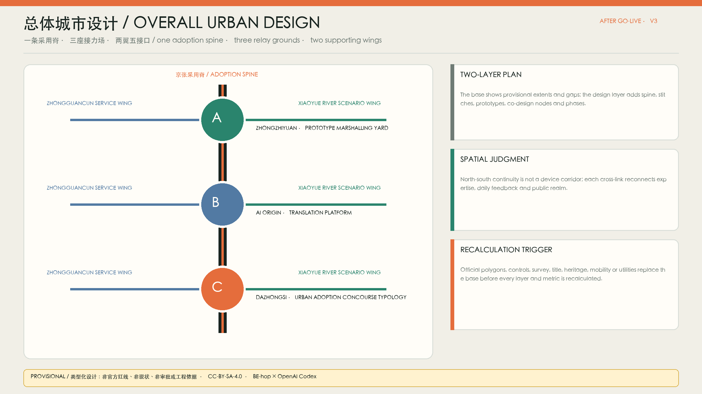

## Design Basis and Source List

The evidence stack separates the official call and Agent taskbook, repository source registry, official Beijing/Haidian historical context, and narrowly applicable legal or policy sources. Every entry records publisher, date, permitted use and limits. International examples are mechanism references, never evidence of local performance, partnership, finance or authority.[source:OFFICIAL-ANNOUNCEMENT] [source:SOURCE-REGISTRY]

Official site and key-area polygons, statutory land use, survey, building condition, title, utilities, transport, underground-rail and heritage controls remain incomplete. Repository provisional geometry supports generation and recalculation only. Three AI-generated images are conceptual typology views paired with deterministic plans and sections; none is a photograph, survey or approval basis.[data:geometry/site_boundary.geojson#SITE-001] [source:AI-CONCEPT-VISUALS]

## Historical Spatial Grammar: fact, function and contemporary use

Railway culture becomes a working spatial grammar rather than decorative switches or signals. A line becomes continuous public movement and an adoption spine; a platform becomes an equal handover interface; a marshalling yard becomes a place for combining and testing components, algorithms and services; duty and repair become staffed maintenance and incident review; a timetable becomes day/night sharing; retirement becomes component migration and ordinary reuse.[source:BJ-PARK-OPEN-2023] [depth:cultural_narrative]

Every translation must pass both a factual and practical gate. Treatment of authentic track, buildings or structures awaits heritage, railway, structural and landscape review. Six international cases transfer only problem-first access, controlled testing, resident collaboration, open interfaces, lifecycle procurement and post-deployment review. Their institutions, budgets, outcomes and powers are not imported.[data:visual/assets/case-transfer-matrix.json#cases]

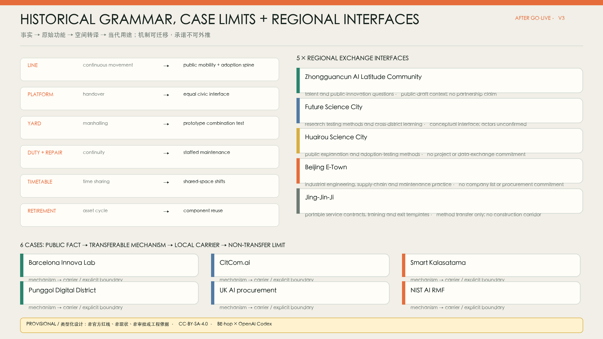

## Three-Level Scope Framework

The coordinated research level treats the roughly nine-kilometre heritage-park corridor and surrounding innovation resources as public adoption infrastructure. The overall-design level organises the adoption spine, east–west stitching, public nodes and gates within provisional geometry. The detailed level develops three spatial typologies that a professional team can later re-anchor and dimension. Functional overlays do not replace statutory classifications.[source:BJ-AI-BELT-2026] [depth:three_level_scope_framework]

A base/design split controls overclaiming. The base contains only provisional extents, the three required key areas and explicit gaps. The design layer contains relationships, prototypes, nodes, components and phases. Official polygons replace the base first, after which every area and shared boundary is recalculated in EPSG:4548.[data:geometry/key_areas.geojson#PROV-KEY-001] [metric:site_area_sqm]

## Coordinated Research Area: Industry and Future City Research

Regional synergy is described as exchange interfaces, not partnerships. The AI Latitude Community exchanges talent and civic-innovation questions; Future Science City exchanges research-testing methods; Huairou Science City exchanges public interpretation and adoption-testing methods; Beijing E-Town exchanges engineering, supply-chain and maintenance practice; Jing-Jin-Ji receives portable service contracts, training and exit templates. No company, investment or established corridor is claimed.[data:visual/assets/regional-synergy.json#interfaces] [source:AGENT-TASKBOOK]

The six-case matrix connects a public fact, transferable mechanism, Jing-Zhang spatial carrier and non-transfer limit. Barcelona maps to problem intake and the handover desk; CitCom.ai to controlled testing; Smart Kalasatama to the co-design hall; Punggol to operating interfaces; UK procurement guidance to the responsibility register and TCO; NIST AI RMF to four-state review. Local legal and procurement review remains necessary.[source:UK-AI-PROCUREMENT] [source:NIST-AI-RMF]

## Overall Design Area: Urban Renewal and Regulatory-Plan-Level Urban Design

The structure is one spine, three relay grounds, two supporting wings and five external interfaces. The spine is neither an equipment corridor nor road redline: it combines priority walking/cycling, continuous access, shade and stormwater, fixed information, visible staff and ordinary use during digital failure. Three cross-links reconnect Zhongguancun expertise and Xiaoyue River everyday feedback without claiming roads, bridges or engineering alignments.[data:geometry/roads.geojson#STITCH-001] [depth:overall_spatial_structure]

The four-state system turns operational questions into form. NORMAL protects ordinary access and stay. AI-ASSISTED adds dry-jointed, reversible devices under named human responsibility. HUMAN-ONLY closes automation and redirects to staff, paper and fixed information. EXIT / REUSE removes the service and returns the bay to ordinary use or moves components elsewhere. Every prototype shows entries, clear widths, duty points, maintenance and asset routes in all four states.[data:visual/assets/spatial-prototypes.json#operating_states] [metric:detailed_spatial_prototype_count]

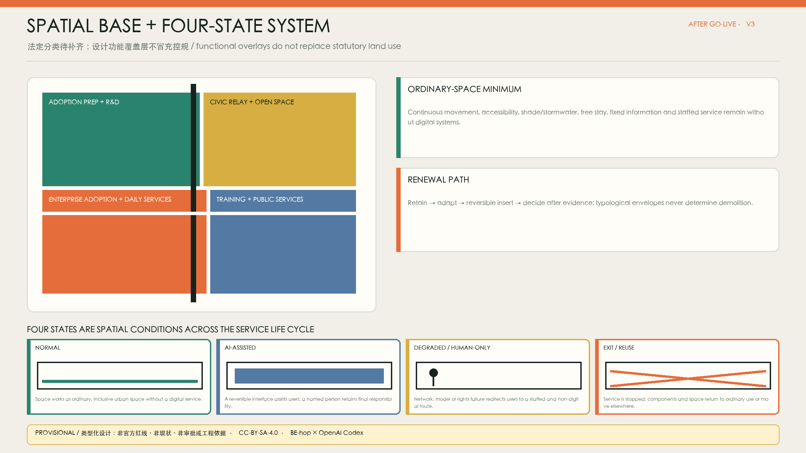

## Detailed Design of Key Areas

### Zhongzhiyuan: Prototype Marshalling Yard

The controlled test yard is the inner zone. A parallel public veranda remains physically separated; a repair workshop connects to a back-of-house strip; the staffed handover desk occupies the threshold; and a step-free ordinary bypass never enters the machine domain. When a low-speed robot loses contact, staff isolate and remove it while the ordinary route remains complete.[data:geometry/buildings.geojson#BLDG-001] [depth:three_key_area_detailed_design]

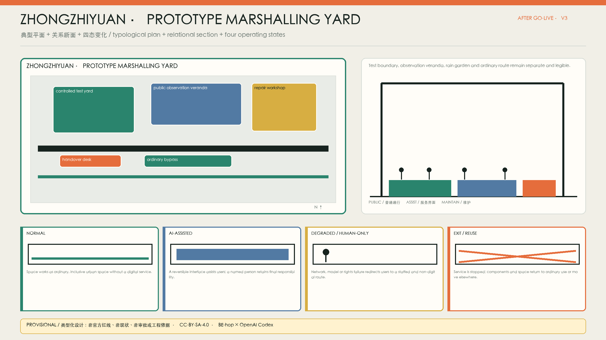

### AI Origin: Translation Platform

An open ground floor connects a co-design hall, accessible tactile model garden, learning court, feedback arcade and protected quiet/care room. Physical models, high contrast, seated participation, paper, telephone and staffed facilitation remain beside any digital interface. Daytime academic use and evening community deliberation share the court without forcing every participant into one social or sensory condition.[data:geometry/buildings.geojson#BLDG-003] [depth:blue_green_public_space]

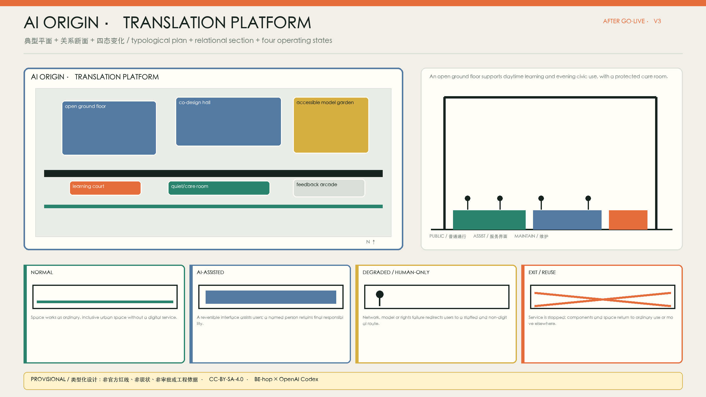

### Dazhongsi: Urban Adoption Concourse Typology

This is a transferable station-area type, not a site plan drawn on the current rectangle. A pedestrian public hall, reversible service units, visible staffed counter, separated logistics/maintenance band and free seating operate independently of digital services. Removing a bay closes its floor interface and restores ordinary concourse use. Official station-area geometry must re-anchor every dimension.[source:ISSUE-1029] [data:geometry/constraints.geojson#HOLD-003]

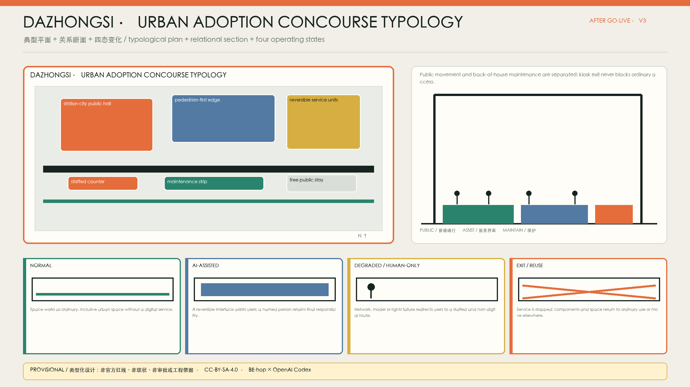

All three drawings are authoritative only as typological relationships. Survey, fire, structure, heritage, trees, ownership and underground-space evidence must determine exact siting, dimensions, materials and construction while preserving the ordinary–assisted–human-only–exit logic.

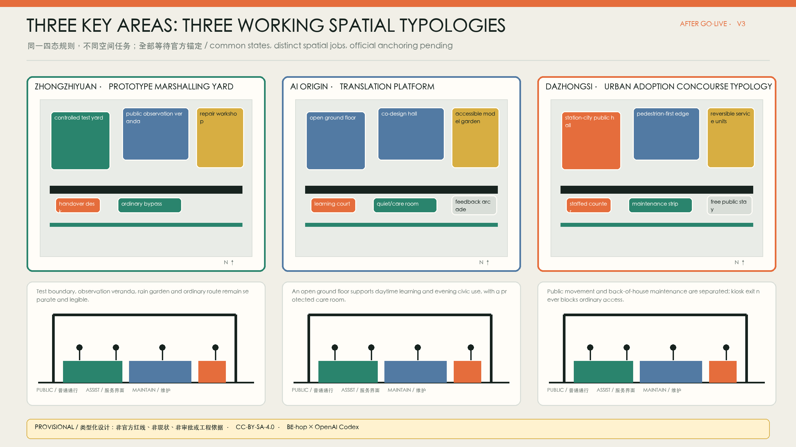

## AI Innovation Ecosystem, Personas, and AI+ Scenarios

Seven personas undergo a rights audit: operators may stop automation; micro businesses opt in and approve publication; residents/caregivers retain ordinary entry and quiet space; disabled users may veto inaccessible routes; people with low digital confidence receive equivalent paper, telephone and staffed access; R&D teams carry remediation duties; international youth receive understandable language and human translation review. Benefits and time, data, queue or maintenance burdens are both recorded.[data:visual/assets/persona-rights-audit.json#personas] [metric:persona_rights_coverage]

All twelve scenario cards specify spatial carrier, beneficiary, burden bearer, problem-owner role, unconfirmed operator, resource type, AI role, human decision, acceptance gate, takeover, ordinary alternative, maintenance, appeal, stop and asset exit. Model service, low-speed robots and edge/offline continuity include full blueprints. Completeness describes the design contract, not achieved field performance.[data:visual/assets/scenario-cards.json#scenarios] [metric:scenario_contract_completeness]

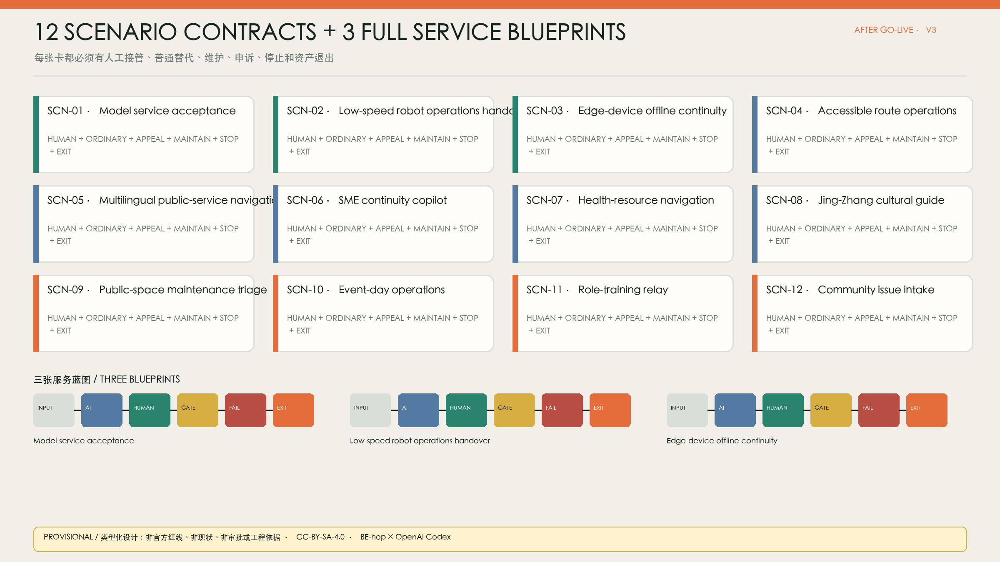

## Human–AI Co-design and Adoption Responsibility Register

Observe, generate, deliberate, prototype 1:1, review and adopt/exit all occupy real spaces. AI organises public evidence, exposes gaps, generates at least three comparable options and summarises test data. Planners, engineers, operators, residents and disabled participants decide public interest, feasibility and rights. Statutory approval, resource priority, medical judgment and public-safety response never pass to AI.[depth:ai_native_collaboration] [metric:co_design_stage_count]

The responsibility register records benefit, burden, problem ownership, operator, resources, human decision, appeal, maintenance, stop and asset destination for each scenario. Operators remain unknown until authorised assignment. Without signed roles, training, takeover drills, ordinary alternatives and an exit reserve, a service cannot enter open public space.[data:visual/assets/adoption-responsibility-register.json#entries] [metric:adoption_responsibility_register_coverage]

## Land Use, Building Scale, and Retain-Renovate-Demolish Strategy

Four colours describe adoption/R&D, civic relay/open space, enterprise/daily services and training/public-service functional overlays; none is a statutory classification. Four building types are an open-ground handover box, shared workshop/maintenance band, accessible translation court and reversible service unit. GeoJSON footprints are recomputable typological envelopes, not surveyed or approved buildings.[data:geometry/land_use.geojson#LU-001] [data:geometry/buildings.geojson#BLDG-001]

The decision path is retain, adapt after structural/title/fire confirmation, insert reversibly for short trials, or defer when evidence is missing. FAR, gross floor area, height, setbacks, parking and demolition remain unknown pending official controls and survey. No conceptual component is used to infer development intensity.[metric:floor_area_ratio] [depth:retain_renovate_demolish]

## Transport, Rail, Municipal Infrastructure, and Public Services

Mobility combines the continuous spine, three conceptual stitches and an ordinary bypass in every key area. Walking, cycling, accessibility and public stay take priority over low-speed devices. Robots remain in controlled testing until safety, takeover, insurance and professional requirements are met. Rail interchange, road crossings, fire access, logistics, parking and underground-rail protection await dedicated evidence.[data:geometry/roads.geojson#ROAD-001] [depth:traffic_rail_slow_parking]

Infrastructure follows “mobile validation before fixed works”. Edge devices require offline operation, local read-only modes, replaceable interfaces, maintenance access, shut-down and data erasure. Fixed information, staff, telephone and paper continue during failure. No power, communication, drainage, fire or capacity commitment is made without engineering evidence.[data:visual/assets/scenario-cards.json#SCN-03] [depth:municipal_new_infrastructure]

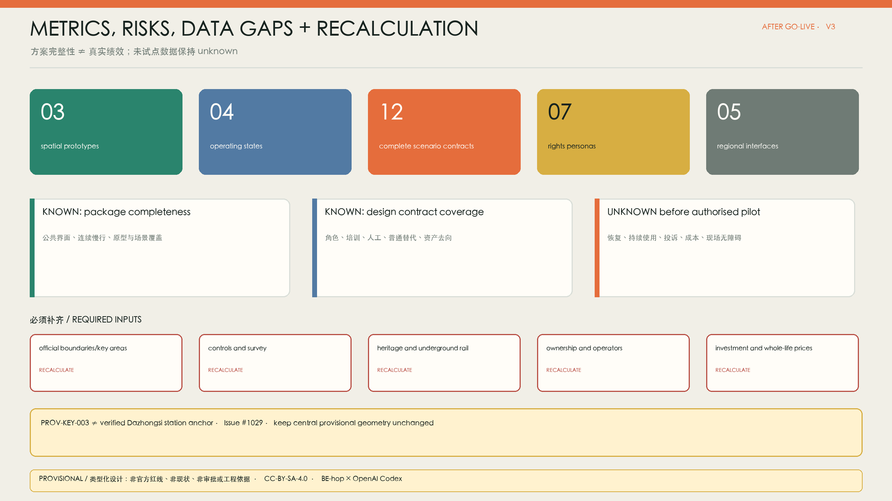

## Blue-Green Network, Public Space, and Urban Character

The public-space minimum is continuous accessibility, shade/stormwater, free stay, fixed information, staffed service, basic night lighting and ordinary use when digital systems fail. Rain gardens separate testing and public edges, organise shade, reduce exposure and create maintainable boundaries. Three low-volume landmarks are the handover desk, translation model wall and service commons; no generic technology monument is proposed.[source:BJ-PARK-OPEN-2023] [data:geometry/green_space.geojson#GREEN-001]

Character comes from engineering clarity, durability, repair and replacement—not unverified railway props. The solid/dashed identity mark is functional: solid means accepted human responsibility; dashed means an AI suggestion pending validation and withdrawal. Monochrome, small, light/dark and wayfinding variants share one SVG rule. Uncleared historic images, brands, artworks and external fonts are excluded.[data:assets/identity/after-go-live-logo.svg] [source:LOCAL-TOOLCHAIN]

## Renewal Projects, Implementation Policy, and Phasing

Days 0–90 contain no construction: request official bases, walk the site, map journeys, compare three options, deliberate through paper/physical models, assign roles and drill failure. Months 3–12 use removable segments for model service, low-speed robots, edge continuity and the three spatial interfaces. Years 1–3 deepen only elements that pass public value, spatial-use and operational handover gates; every phase may stop, move or exit.[data:geometry/phasing.geojson#PHASE-001] [depth:phasing_implementation]

Whole-life cost covers survey/design, data/rights, integration, spatial work, training, routine operation, human fallback, maintenance/recovery and exit. No monetary amount is invented. Open Marshalling Week, Translation Review Season and Adoption Retrospective describe possible spatial/time formats only; branding, operators, funds and partnerships remain unconfirmed.[source:UK-AI-PROCUREMENT] [metric:lifecycle_cost_completeness]

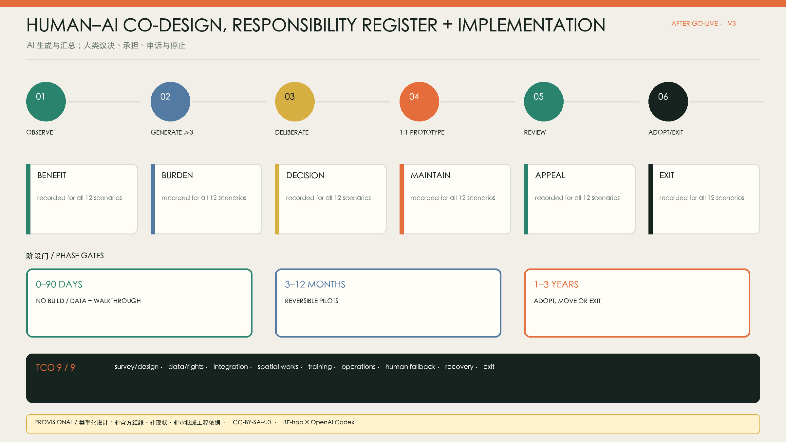

## Metrics, Area Recalculation, and Compliance Matrix

Metrics separate spatial design, adoption readiness and real performance. The first groups count three detailed prototypes, four states, interfaces and complete contracts. Real recovery, sustained use, complaints, cost and field accessibility remain unknown until an authorised pilot. A 1.0 ratio means documented field coverage, not performance success.[metric:detailed_spatial_prototype_count] [metric:scenario_contract_completeness]

GeoJSON exchanges in EPSG:4326 and is recalculated in EPSG:4548. Adjacent land-use partitions retain shared vertices and are checked for gaps and overlaps. New official boundaries, key areas, controls, survey or specialist constraints trigger the entire geometry–metric–figure chain. Task, standard and depth matrices keep exhaustive audit evidence outside the reading layer.[metric:green_space_area_sqm] [depth:metrics_recalculation]

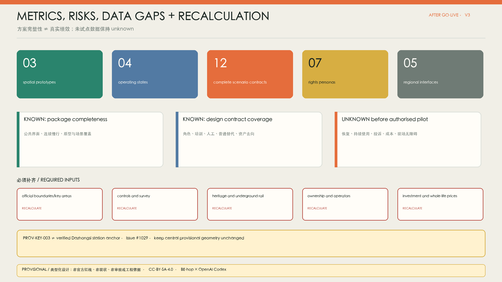

## Risk, Copyright, and Compliance

Risks include reading provisional geometry as an official line, treating PROV-KEY-003 as Dazhongsi station, replacing conservation with symbols, delegating professional judgment to AI, digital exclusion, vendor lock-in, omitted maintenance and stranded assets. Controls include fixed warnings, decision-hold areas, human final decisions, equivalent ordinary channels, the responsibility register, TCO and exit lists. Fixed works, heritage, underground rail, roads and public safety require separate statutory processes.[source:ISSUE-1029] [depth:risk_missing_data]

Article 39 of the Barrier-Free Environment Construction Law is used only for the public-service matters it explicitly lists. The Interim Measures for Generative AI Services are cited only within their scope. Elderly smart-technology policy is background for parallel traditional and intelligent routes, not local approval. Personal data follow minimisation, purpose limitation, appeal and human review.[source:PRC-BARRIER-FREE-LAW-ART39] [source:PRC-GENAI-MEASURES]

Prompts, human revision, hashes and licences for three AI concept images appear in the generation ledger; they carry no dimensional, existing-condition or approval evidence. Original text, deterministic figures, structured data and package visuals use CC-BY-SA-4.0. Offline HTML loads no remote map, CDN, external font or tracker.[source:AI-CONCEPT-VISUALS] [source:LOCAL-TOOLCHAIN]

## References

1. Official open-call announcement, Agent taskbook, source registry and provisional geometry.
2. Beijing and Haidian public sources on Jing-Zhang heritage, the heritage park and the AI innovation belt.
3. Barrier-free law, scoped generative-AI measures and elderly smart-technology policy.
4. First-party material for Barcelona, CitCom.ai, Smart Kalasatama, Punggol, UK AI procurement and NIST AI RMF.
5. Open-city-ai/haidian Issue #1029 on provisional key-area anchoring.[source:ISSUE-1029]

Full URLs, dates, rights, use limits, fonts, Python dependencies and image-generation records are in `sources.json`, `report/copyright_statement.md` and `visual/assets/generation-ledger.json`.
