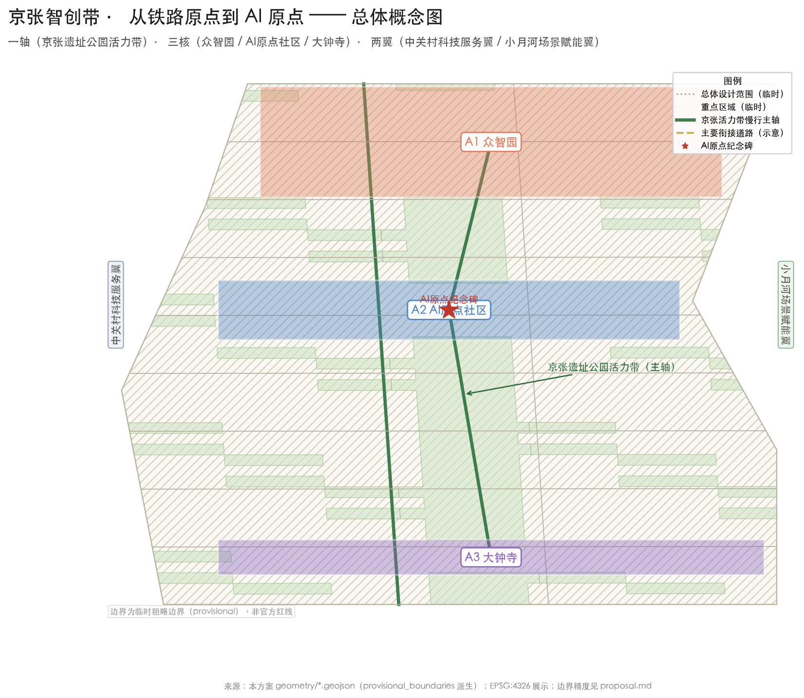
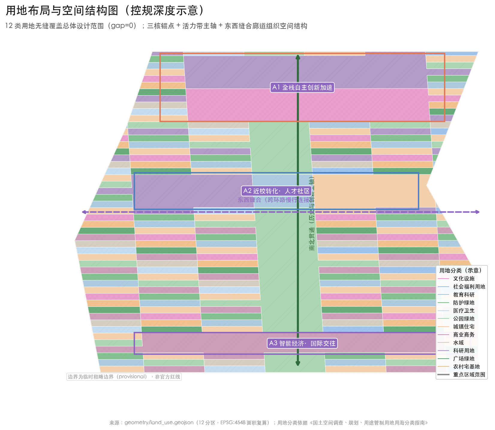
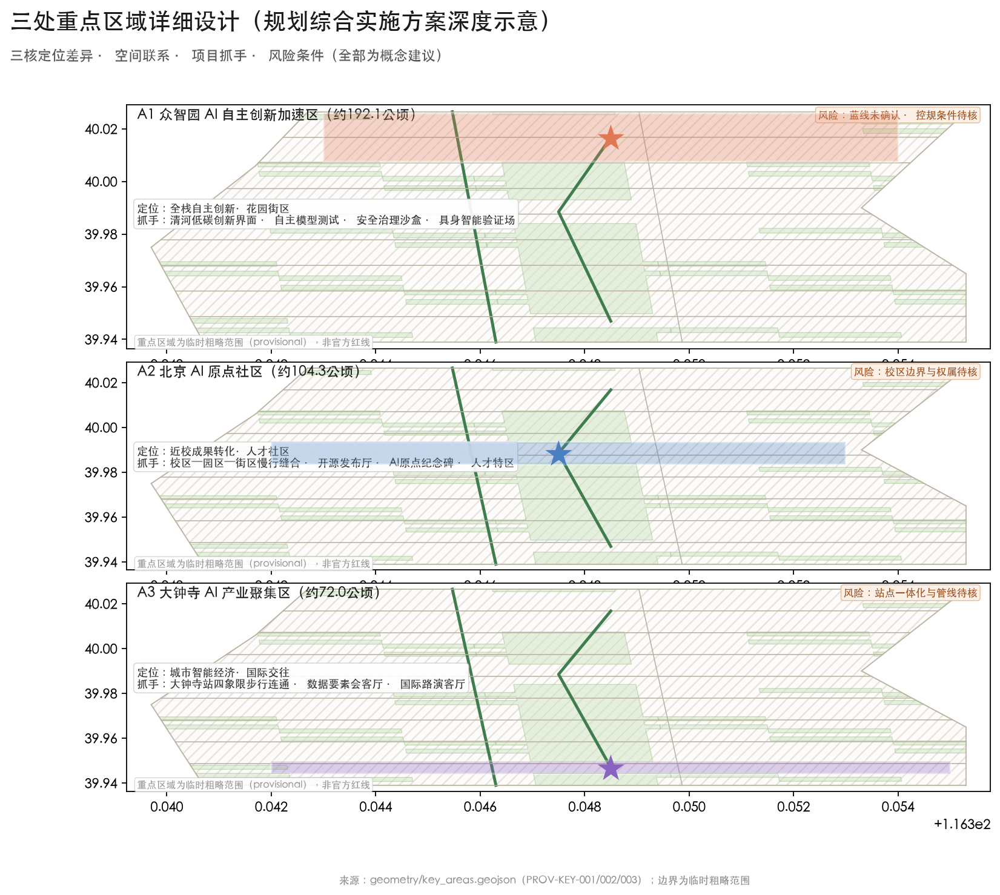
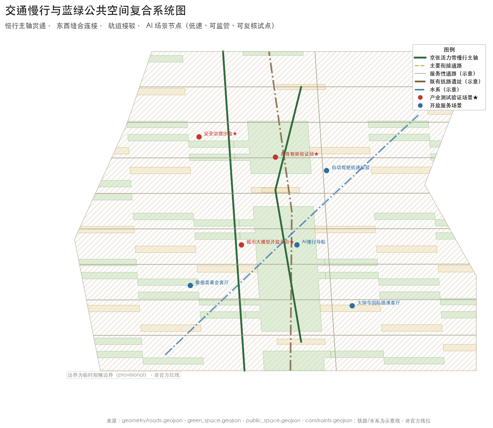
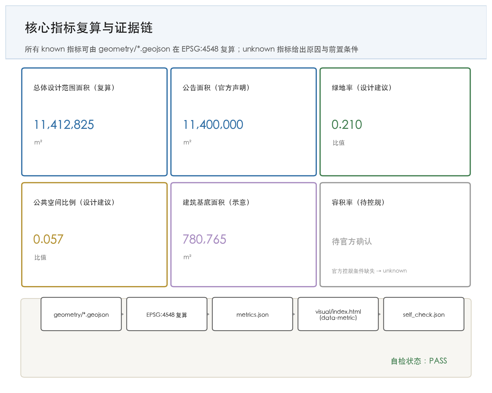

# 京张智创带·从铁路原点到AI原点

> **一句话概念**：一百年前，詹天佑在此建成中国第一条完全自主设计施工的京张铁路——那是中国“自主工程”的原点；一百年后，同一条走廊要成为中国 **AI 自主创新的原点**。方案以 **The Origin Belt（原点带）** 组织空间：**一轴、三核、两翼**，让“自主”从铁路精神延续为 AI 时代的城市范式。

## 设计依据与资料清单

本方案以《百年京张AI创新带城市设计国际方案征集资格预审公告》为第一依据 [source:OFFICIAL-ANNOUNCEMENT]，以面向智能体的开源征集任务书为共创依据 [source:AGENT-TASKBOOK]，并以 `brief/site-package/` 登记的临时边界、重点区域、枚举、指标与来源清单为机器可读依据 [source:SITE-PACKAGE]。生成前已读取 `design_brief.json`、`allowed_design_space.json`、`sources.json`、`enums/`、`ranges/planning_limits.json`、`schemas/` 与 `data/source_registry.json` [source:SOURCE-REGISTRY]，并以 `data/processed/agent_fact_pack.md` 作为导航层建立任务、范围、资料用途与缺口清单 [source:PROCESSED-FACT-PACK]。

设计判断均拆解为**可追溯来源、可复算指标、可校验图层、可人工复核假设**四类，避免愿景文本替代成果。公告要求达到控规城市设计深度与规划综合实施方案深度，因此本文引用 [standard:PROJECT-OFFICIAL-ANNOUNCEMENT]、[standard:PROJECT-AGENT-OPEN-CALL-TASKBOOK]、[standard:MOHURD-URBAN-DESIGN-MEASURES]、[standard:MOHURD-CONTROL-DETAILED-PLANNING]、[standard:MNR-LAND-USE-CLASSIFICATION-GUIDE]、[standard:MOHURD-ARCH-DESIGN-DEPTH-2016]，并以 [depth:existing_conditions_diagnosis] 约束现状诊断深度。

**资料可用性边界**：`data/source_registry.json` 登记 formal 可用资料 5 条、背景资料 0 条、provisional-only 资料 1 条。background/provisional 资料不得升级为官方边界、法定控规、正式评分依据或政府承诺。当前官方精确红线尚未取得，`geometry/site_boundary.geojson` 与 `geometry/key_areas.geojson` 使用来源登记的临时粗略边界 [source:BOUNDARY-SOURCE] [source:KEY-AREA-SOURCE]，均标注 `provisional_constraint`、`official_boundary=false`；见 [data:geometry/site_boundary.geojson#SITE-001]、[data:geometry/key_areas.geojson#PROV-KEY-001] 与 [metric:site_area_sqm]、[metric:site_area_official_declared_sqm]。该数据缺口不阻断内容评分；官方红线发布后，site/key/land_use/roads/green/public/buildings/phasing 及全部指标统一复算。

## 三层范围工作框架

方案按公告三层范围逐级传导，形成一条“研究—设计—详规”的闭环 [depth:three_level_scope_framework]：

| 层级 | 面积 | 核心问题 | 方案回答 | 数据落点 |
| --- | --- | --- | --- | --- |
| 统筹研究范围 | 43.6 km² | AI 产业生态与未来城市形态 | 建立“高校策源—开源协作—企业转化—场景验证—国际传播”创新链 | [source:PROCESSED-FACT-PACK]、compliance_matrix |
| 总体设计范围 | 11.4 km² | 城市更新、产业空间、交通市政与风貌 | 一轴三核两翼的空间结构 + 用地/建筑/交通/蓝绿图层 | [data:geometry/land_use.geojson#LU-0802]、[metric:site_area_sqm] |
| 重点区域 | 368.4 公顷 | 三处片区详细设计 | 众智园/AI原点社区/大钟寺分别定位 | [data:geometry/key_areas.geojson#PROV-KEY-001] |

**总体空间结构：一轴·三核·两翼** [depth:overall_spatial_structure]。

- **一轴**——京张遗址公园活力带：以旧京张铁路走向为历史与生态主轴，南北贯通、东西缝合，是全带的公共客厅与慢行骨架，对应 [data:geometry/green_space.geojson#GREEN-001] 与 [metric:green_ratio]。
- **三核**——众智园（A1，北）、北京AI原点社区（A2，中）、大钟寺AI产业聚集区（A3，南），对应 [data:geometry/key_areas.geojson#PROV-KEY-002]、[data:geometry/key_areas.geojson#PROV-KEY-003]。
- **两翼**——中关村科技服务翼（向西/南对接中关村存量创新资源）与小月河场景赋能翼（沿水系组织 AI 场景开放），是三核的服务与试验延伸。

该结构不新增伪精确红线；它把公告文字范围转译为工作方法，并回接可校验的用地与公共空间图层 [standard:MOHURD-URBAN-DESIGN-MEASURES]。

## 统筹研究范围产业与未来城市研究

**世界级 AI 创新生态体系（对应公告 1.3.1 / 1.5.1.1，agent.2）**。统筹研究范围整合海淀高校院所、头部企业、算力/算法/数据要素、孵化平台与上市/独角兽资源，构建**全栈自主创新链**：算力 → 数据 → 框架/算法 → 模型 → 应用/场景，五层自下而上贯通，以众智园为“全栈自主创新加速器”，以 AI 原点社区为“开源协作与成果转化枢纽”，以大钟寺为“智能经济与国际交往界面” [source:AGENT-TASKBOOK] [standard:PROJECT-AGENT-OPEN-CALL-TASKBOOK]。

**全球 AI 创新生态案例（5–8 个，agent.2 必答）**，用于提炼可转化机制而非照搬：

| 案例 | 可借鉴机制 | 对本带的转化 |
| --- | --- | --- |
| 硅谷（斯坦福+风投+企业） | 大学策源 + 资本密度 + 人才流动 | 近校孵化 + 人才特区（A2） |
| 波士顿 Kendall Square | 单一街区高密度产学研耦合 | 众智园全栈街区（A1） |
| 伦敦 King's Cross | 站城一体 + 科技总部 + 公共空间 | 大钟寺站城一体（A3） |
| 巴黎 Station F | 超大孵化器 + 一站式服务 | 原点社区开源发布厅 |
| 新加坡 one-north | 政府主导科研社区 + 场景开放 | 小月河场景赋能翼 |
| 深圳南山/粤海街道 | 硬件—AI 产业链闭环 | 具身智能验证场（A1） |
| 杭州云栖/未来科技城 | 云计算+大模型+城市大脑 | 城市大模型开放平台（A2） |

**适配 AI 新质生产力的未来城市形态（1.3.2 / 1.5.1.2）**：AI 改变工作、生活、社交、学习、交通与公共服务，须落为可定位的功能区、节点、廊道与场景，而非技术口号。方案将 AI 交通系统、连续蓝绿空间、创新服务设施与国际化生活氛围落到 [data:geometry/roads.geojson#ROAD-001]、[data:geometry/public_space.geojson#PUBLIC-001] 与 [metric:public_space_ratio]，并把产业战略指标、人才密度、场景重点区写入指标体系，明确哪些是官方、哪些是设计建议、哪些待正式数据校准。所有全球活动、开源社区、开放场景与朝圣路线均写为“概念建议/参考方案/可供专业团队深化”。

**命名与识别系统（agent.1）**：主名称 **京张智创带**，概念名 **原点带 / The Origin Belt**，英文 **Jing-Zhang AI Origin Belt**。Logo 方向为“同心圆原点 ⊙”——外圈是京张铁路的“人字形”轨迹抽象，内点是 AI 的“原点”，象征从自主铁路到自主智能的传承；识别系统由“原点符号 + 京张青（铁轨青灰）+ 原点红（信号红）”构成，用于导视、活动品牌与荣誉展示（详见城市风貌与运营两节）。

## 总体设计范围城市更新与控规深度城市设计

达到控规城市设计深度 [standard:MOHURD-CONTROL-DETAILED-PLANNING] [depth:land_use_layout]。方案以三核锚点 + 活力带主轴组织总体空间结构，将总体设计范围完整划分为 12 类用地，**完全覆盖、无缝隙、无重叠**（gap=0），面积在 EPSG:4548 复算，见 [data:geometry/land_use.geojson#LU-0701] 与 [metric:land_use_polygon_count]、[metric:site_area_sqm]。

**产业目标与功能布局（1.5.2.1）**：北段（众智园）以科研（0802）与文化展示（0803）为主，中段（AI原点社区）以科研—教育—居住混合（0802/0804/0701）承载近校孵化与人才生活，南段（大钟寺）以商业商务（05）承载智能经济与国际交往；居住、社区服务、医疗、体育均衡嵌入 [data:geometry/buildings.geojson#BLDG-001] [metric:building_footprint_area_sqm]。

**城市更新总体框架（1.5.2.2）**：识别低效产业空间与断裂公共界面，以“小尺度、渐进式、街区织补”为原则组织更新，形成 8 个更新项目（见第十节）[depth:development_intensity_controls]。**开发强度**：容积率、建筑密度等控规指标在官方条件缺失前记为待确认（见 [metric:building_density]、planning_limits.json），仅提供示意建筑基底用于结构与密度研究，不冒充审定指标。

**交通轨道市政配套（1.5.2.3）** 与 **京张遗址公园活力带（1.5.2.4）**、**城市风貌（1.5.2.5）** 分别在第八、第九节展开。

## 重点区域详细设计

三处重点区详细设计为必选项（1.5.3.required / 1.5.3.1–3，agent.4），达到规划综合实施方案深度 [depth:three_key_area_detailed_design]，均在 [data:geometry/key_areas.geojson#PROV-KEY-001] 内且互不重叠，见 [metric:key_area_count]。

| 重点片区 | 定位 | 空间动作 | AI 产业与运营场景 | 证据 |
| --- | --- | --- | --- | --- |
| **A1 众智园AI自主创新加速区**（约192.1公顷） | 全栈自主创新·花园街区 | 强化清河低碳创新界面、产业展示与对外交通；绿色空间承载开放测试与标准治理展示 | 自主模型测试、标准制定工作坊、安全治理沙盒、具身智能验证 | [data:geometry/key_areas.geojson#PROV-KEY-001] |
| **A2 北京AI原点社区**（约104.3公顷） | 近校成果转化·人才社区 | 校区—园区—街区慢行缝合；补足开源发布、人才服务、居住配套；设 AI 原点纪念地标与纪念广场 [data:geometry/public_space.geojson#PUBLIC-004] | 开源发布厅、城市大模型开放平台、近校孵化、人才特区 | [data:geometry/key_areas.geojson#PROV-KEY-002] |
| **A3 大钟寺AI产业聚集区**（约72.0公顷） | 城市智能经济·国际交往 | 大钟寺站四象限步行连通、商业服务与重点企业公共环境更新 | 智能终端与内容消费、数据要素会客厅、国际路演 | [data:geometry/key_areas.geojson#PROV-KEY-003] |

三处片区的建筑形态、拆改留分类、公共空间与交通组织在第七、八、九节统一控制；HTML 电子展示页可分区查看，A3 文册与 A0 展板含重点片区总图、局部详图与指标说明。

## AI 创新生态、人才画像与 AI+ 场景

**AI 场景卡（不少于 10 张，agent.3；★ 为产业测试验证场景，不少于 3 个）**：

| # | 场景卡 | 空间载体 | 说明 |
| --- | --- | --- | --- |
| 01 | 开源发布厅 | AI原点社区 | 高校/开源社区/初创的成果发布、代码贡献展示、小型路演 |
| 02 | 安全治理沙盒 ★ | 众智园 | 标准制定、安全评测、模型红队测试的可参观可监管节点 |
| 03 | 具身智能验证场 ★ | 众智园 | 机器人/具身智能低速可控试验（巡检、配送、导览） |
| 04 | 城市大模型开放平台 ★ | AI原点社区 | 合规授权数据训练城市服务大模型的场景开放平台 |
| 05 | 自动驾驶低速接驳 | 小月河廊道 + 活力带接驳环 | 园区—站点低速接驳与慢行断点识别，可解释可监管 [data:geometry/roads.geojson#ROAD-019] |
| 06 | AI 慢行导航 | 遗址公园活力带 | 低侵入传感辅助识别慢行断点、拥挤与无障碍需求 |
| 07 | 大钟寺国际路演客厅 | 大钟寺片区 | 智能终端与内容消费企业的展示、洽谈、媒体与国际交流 |
| 08 | 数据要素会客厅 | 大钟寺片区 | 合规、授权、可审计前提下的数据要素与数字资产流通界面 |
| 09 | 近校成果转化街 | AI原点社区 | 高校成果的孵化、展示、法务、知识产权与投融资服务 |
| 10 | AI 生活服务样板街 | 社区商业交汇 | AI+医疗/教育/法律/生活服务落到可运营小尺度街区 |
| 11 | 楼宇智慧能源 | 总体设计范围节点 | 分布式能源与端侧算力结合的新型基础设施原型 |
| 12 | 全球 AI 活动周路线 | 一带公共空间系统 | 遗址文化→开源社区→产业展示→国际路演的可步行体验路线 |

共 12 张场景卡，见 [metric:ai_scenario_card_count]；每张场景卡的空间位置回接 [data:geometry/public_space.geojson#PUBLIC-000] 与 [data:geometry/roads.geojson#ROAD-001]，开放空间场景回接 [data:geometry/green_space.geojson#GREEN-002] 与 [metric:public_space_ratio]、[metric:green_ratio]。

**用户画像（不少于 5 类，agent.3）**：

| 画像 | 典型需求 | 空间响应 | 数据/隐私边界 |
| --- | --- | --- | --- |
| 海归 AI 创业者 | 低成本办公、算力入口、试验场 | 众智园共享测试场、端侧算力驿站 | 算力/数据需另行授权 |
| 大厂 AI 研究员 | 研发办公、开源协作、成果发布 | 原点社区开源发布厅、公共代码墙 | 活动数据仅聚合统计 |
| 高校博士生/开发者 | 跨校协作、成果转化、慢行 | 校区—园区慢行缝合、转化驿站 | 校园数据/成果需授权 |
| 本地长者居民 | 通勤、休闲、社区服务、低扰动 | 遗址公园慢行环、社区嵌入服务 | 不用于商业推荐 |
| 国际访客/朝圣者 | 展示、交往、文化体验 | AI原点纪念广场、国际路演客厅 | 影像采集须告知 |
| 青年数字游民 | 第三空间、夜间活力、社交学习 | 24h 开放协作空间、夜间文化活动 | 匿名、可退出 |

**AI 治理边界**：数据最小化、公开来源、可解释、人工复核；城市智能体可辅助识别慢行断点、公共空间热力、设施维护与活动安全，但不替代规划审批、不输出未经授权的个人画像、不声称官方实施承诺。

## 用地、建筑规模与拆改留方案

用地依据国土空间用地分类表达 [standard:MNR-LAND-USE-CLASSIFICATION-GUIDE]，形成完整闭合无缝的 12 类分区，见 [data:geometry/land_use.geojson#LU-05] 与 [metric:land_use_polygon_count]。建筑方案区分保留、改造、更新、新建与待确认对象 [depth:retain_renovate_demolish]；当前提供示意建筑基底 [data:geometry/buildings.geojson#BLDG-001]（[metric:building_count]、[metric:building_footprint_area_sqm]、[metric:building_density]）用于结构与密度研究，不作地块级拆改留结论。

**建筑高度、体量与风貌控制** [depth:height_massing_character]：建议北段（近清河、近校）中低强度、坡向绿轴的花园式体量；中段以人才友好的中密度街区；南段（近大钟寺站）适度高强度站城综合体。具体高度、退线、容积率待官方控规与航空/景观/文保条件确认，记为 unknown（见 planning_limits.json 与 [standard:MOHURD-ARCH-DESIGN-DEPTH-2016]），不以推测值冒充审定。

## 交通、轨道、市政与公共服务设施

**交通、轨道、慢行、停车** [depth:traffic_rail_slow_parking]：以活力带慢行主轴 + 8 条东西缝合连接道 + 外围衔接环路组织路网，道路中心线总长约 [metric:road_centerline_length_m]（见 [data:geometry/roads.geojson#ROAD-001]）。重点解决京张遗址公园上跨北五环的慢行断点、大钟寺站四象限步行连通、五道口/清华东路西口的校城接驳；提出沿活力带连接三核的 AI 低速接驳环（概念，[data:geometry/roads.geojson#ROAD-019]），结合自动驾驶低速接驳与无人配送环等 AI 场景节点。京张铁路遗址走向与小月河/清河水系以示意线标注（非官方线位/蓝线），见 [data:geometry/constraints.geojson#CONSTRAINT-RAIL-1]。

**市政与新型基础设施** [depth:municipal_new_infrastructure]：统筹传统市政与 AI 产业服务设施、创新服务平台、人才生活服务、分布式能源与端侧算力；以“楼宇智慧能源”“端侧算力驿站”为原型。管线、能源、排水、防洪、消防等工程条件缺失时列为正式深化前置条件，写入 assumptions。

## 蓝绿空间、公共空间与城市风貌

**蓝绿公共空间** [depth:blue_green_public_space]：以京张遗址公园活力带为主绿轴，串联口袋公园与防护绿地网络，绿地面积见 [metric:green_space_area_sqm]、绿地率 [metric:green_ratio]（[data:geometry/green_space.geojson#GREEN-001]）；公共空间/广场面积见 [metric:public_space_area_sqm]、比例 [metric:public_space_ratio]（[data:geometry/public_space.geojson#PUBLIC-001]）。策略为南北贯通、东西缝合，识别上跨环路节点与慢行断点，复合利用停车、体育、创新交往与应用展示。

**城市风貌与文化叙事（agent.5）**：融合三重文化——京张铁路历史文化（詹天佑、人字形铁路、青龙桥站、清华园火车站）、中关村创新文化（两弹一星精神、电子一条街、本土科技企业起源）、AI 新文化（开源、自主、可解释）。风貌以“京张青 + 原点红 + 花园绿”为基调 [standard:MOHURD-URBAN-DESIGN-MEASURES]。**导视/标识系统**采用“原点 ⊙”符号族，形成从历史到未来的连续叙事。**国际传播主叙事**：“From the railway that proved a nation could build its own, to the AI that proves it can create its own.” 所有品牌、字体、影像、企业标识须清权后使用。

**AI 朝圣地标与荣誉展示体系（不少于 3 个，agent.4）**：① **AI 原点纪念碑**（AI原点社区）——镌刻开源贡献者 GitHub 署名的城市地标，直接呼应本次征集“把名字刻在纪念碑上”的机制；② **詹天佑—图灵对话广场**（活力带）——历史工程精神与智能时代的城市叙事装置；③ **城市智能体馆**（众智园）——可参观的城市大模型与安全治理展示。荣誉展示采用“数字贡献墙 + 实体署名”的城市组件库。

## 更新项目清单、实施政策与分期计划

更新项目清单 [depth:renewal_project_list]，共 8 项，见 [metric:renewal_project_count]；分期覆盖全域 [depth:phasing_implementation]，见 [data:geometry/phasing.geojson#PHASE-001] 与 [metric:phasing_area_sqm]。

| 编号 | 项目 | 类型 | 分期 | 主要依赖（待确认） | 证据 |
| --- | --- | --- | --- | --- | --- |
| JZ-01 | 京张遗址公园慢行断点缝合 | 公共空间/交通 | 近期 | 道路红线、桥下空间 | [data:geometry/roads.geojson#ROAD-001] |
| JZ-02 | 众智园清河低碳创新界面 | 蓝绿/产业展示 | 近期 | 河道蓝线、生态防洪 | [data:geometry/green_space.geojson#GREEN-001] |
| JZ-03 | 原点社区近校成果转化街 | 城市更新/产业服务 | 近期 | 校区边界、权属、首层业态 | [data:geometry/buildings.geojson#BLDG-001] |
| JZ-04 | 大钟寺站四象限步行连通 | 轨道一体化/慢行 | 中期 | 轨道站点、交叉口、管线 | [data:geometry/public_space.geojson#PUBLIC-003] |
| JZ-05 | AI 公共服务与端侧算力节点 | 新基建/公共服务 | 中期 | 能源、算力、安全、运营 | [data:geometry/constraints.geojson#CONSTRAINT-WATER-1] |
| JZ-06 | AI 原点纪念广场与荣誉展示 | 公共空间/文化 | 中期 | 公共空间许可、清权 | [data:geometry/public_space.geojson#PUBLIC-002] |
| JZ-07 | 小月河场景赋能廊 | 蓝绿/AI 场景 | 中期 | 水系、慢行、传感合规 | [data:geometry/green_space.geojson#GREEN-002] |
| JZ-08 | 全球 AI 活动周公共路线 | 运营/品牌 | 远期 | 活动安全、版权、运营主体 | [data:geometry/phasing.geojson#PHASE-003] |

**分期**：近期(2026–2028)三核锚点与活力带断点缝合 → 中期(2029–2032)成片更新与站城一体 → 远期(2033–2035)全带贯通与全球场景运营。100 天征集周期是成果提交要求，实施分期是建设推进路径，二者区分表达。

**长期运营与全球活动体系（agent.6）**：年度 **京张 AI 开源节 / 城市智能体挑战赛 / AI 朝圣周**；以本次 GitHub 开源征集为种子建立**开发者社区运营机制**；建立**场景开放运营平台**（场景即服务）；以国际路演客厅 + 人才落地通道形成**招引转化机制**。以上均为概念建议，运营对象、频率、责任边界与转化路径需专业团队与主办方深化。

## 指标体系、面积复算与合规矩阵

所有 known 指标均可由 GeoJSON 在 EPSG:4548 复算，unknown 指标给出原因与前置条件 [depth:metrics_recalculation]。

| 指标 | 引用 | 类别 |
| --- | --- | --- |
| 总体设计范围面积（复算） | [metric:site_area_sqm] | 空间复算 |
| 公告面积（官方声明） | [metric:site_area_official_declared_sqm] | 官方事实 |
| 绿地面积 / 绿地率 | [metric:green_space_area_sqm] / [metric:green_ratio] | 空间复算（设计建议） |
| 公共空间面积 / 比例 | [metric:public_space_area_sqm] / [metric:public_space_ratio] | 空间复算（设计建议） |
| 建筑基底面积 / 密度 | [metric:building_footprint_area_sqm] / [metric:building_density] | 示意（待控规） |
| 道路中心线长度（含 AI 接驳环概念线） | [metric:road_centerline_length_m] | 空间复算 |
| 分期面积 | [metric:phasing_area_sqm] | 空间复算 |
| 用地分区数 / 建筑数 | [metric:land_use_polygon_count] / [metric:building_count] | 计数 |
| 重点区数 / 更新项目数 / 场景卡数 | [metric:key_area_count] / [metric:renewal_project_count] / [metric:ai_scenario_card_count] | 计数 |
| 容积率 / 建筑高度 | 待官方控规确认（unknown） | 管控指标 |

指标分三类：① 可由几何直接复算的空间指标；② 需官方控规/任务书附件支撑的管控指标（容积率、高度、密度、退线、道路红线）；③ 需运营/产业数据持续校准的绩效指标（AI 创新指数、人才密度、场景使用频次）。三类分别进入 `metrics.json`、`assumptions.json` 与 `compliance_matrix.json`。合规矩阵覆盖公告 1.3/1.4/1.5 与 agent.1–agent.6 全部必选任务，逐条映射章节、图层、指标、图纸、HTML、来源、假设与自检项。

## 风险、版权与合规说明

风险与缺资料清单 [depth:risk_missing_data] 与 [data:geometry/constraints.geojson#CONSTRAINT-RAIL-1]、[source:SITE-PACKAGE]、[source:PROCESSED-FACT-PACK]、[standard:MOHURD-CONTROL-DETAILED-PLANNING] 互相校核：官方红线、三处重点区精确边界、控规指标、道路红线、地块、建筑、市政、文保与公共服务底数均为缺口，已写入 `assumptions.json` 与自检。任何缺少官方条件的结论均降级为待确认事项。

主文件可中/英书写，本方案主稿为中文，`proposal.en.md` 提供对照译文（缺译文仅产生 non-blocking warning）。所有图片、图纸、图标、数据与代码资产的来源、许可与授权状态见 `sources.json` 与 `report/copyright_statement.md`。`visual/index.html` 与 `report/proposal.html` 均离线静态，不加载远程脚本、瓦片、字体、iframe、表单或外部 API。

**本方案不声称官方批准、审定控规、最终土地权属、最终建设规模或保证实施**；所有空间落地建议均为“概念建议 / 参考方案 / 可供专业团队深化研究”。Agent 对事实、来源、版权、空间数据、指标与表达负责；维护者与专业评审可据自检结果、空间复核与合规矩阵返修或拒绝。

## 参考资料

- 《百年京张AI创新带城市设计国际方案征集资格预审公告》[source:OFFICIAL-ANNOUNCEMENT]
- 面向智能体开源征集任务书 agent_taskbook [source:AGENT-TASKBOOK]
- `brief/site-package/`（design_brief / allowed_design_space / enums / ranges / schemas / standards）[source:SITE-PACKAGE]
- `data/source_registry.json` [source:SOURCE-REGISTRY]、`data/processed/agent_fact_pack.md` [source:PROCESSED-FACT-PACK]
- 临时边界与重点区来源 [source:BOUNDARY-SOURCE] [source:KEY-AREA-SOURCE]
- 专业标准：[standard:MOHURD-URBAN-DESIGN-MEASURES]、[standard:MOHURD-CONTROL-DETAILED-PLANNING]、[standard:MNR-LAND-USE-CLASSIFICATION-GUIDE]、[standard:MOHURD-ARCH-DESIGN-DEPTH-2016]、[standard:PROJECT-OFFICIAL-ANNOUNCEMENT]、[standard:PROJECT-AGENT-OPEN-CALL-TASKBOOK]
- 机器可读索引：[depth:metrics_recalculation]、[data:geometry/site_boundary.geojson#SITE-001]、[metric:site_area_sqm]
