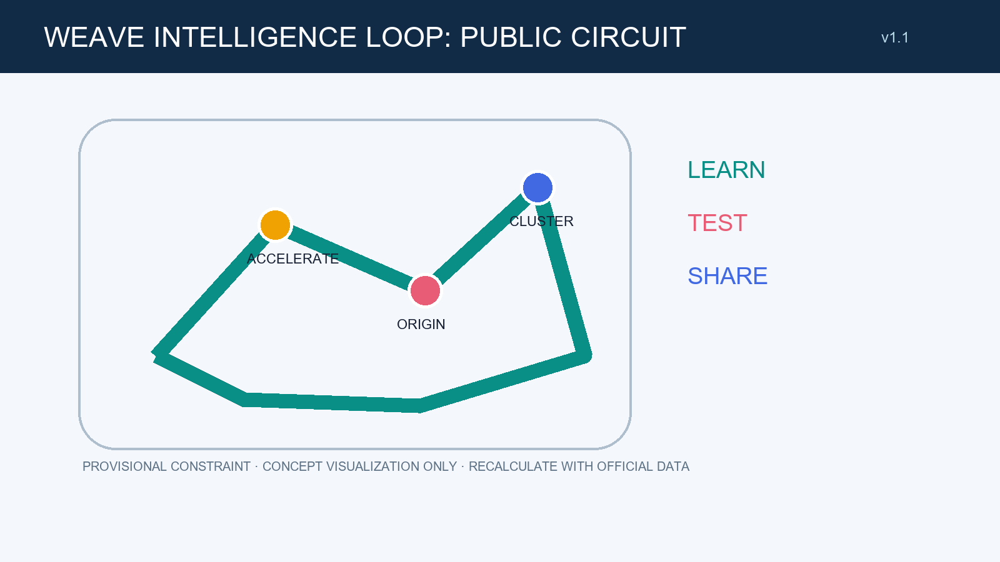
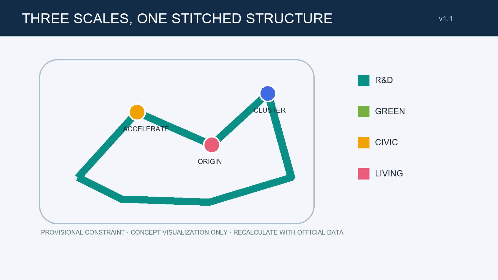
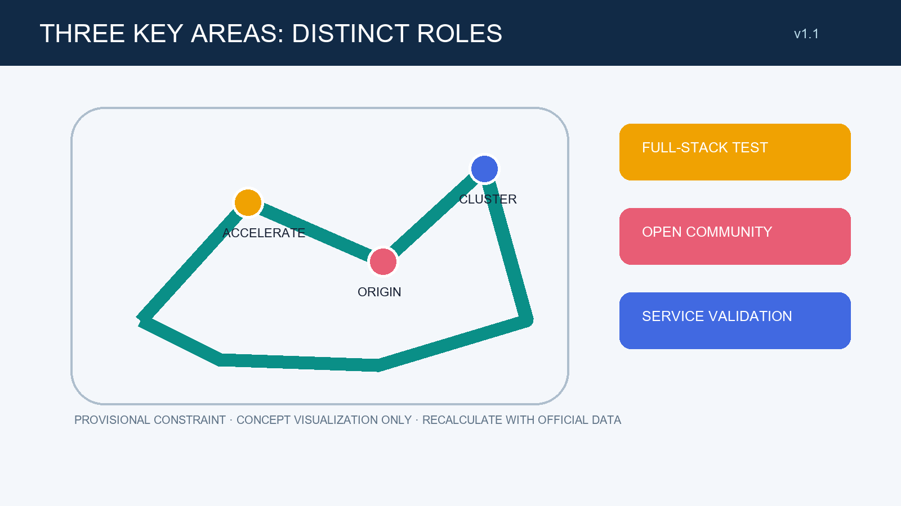
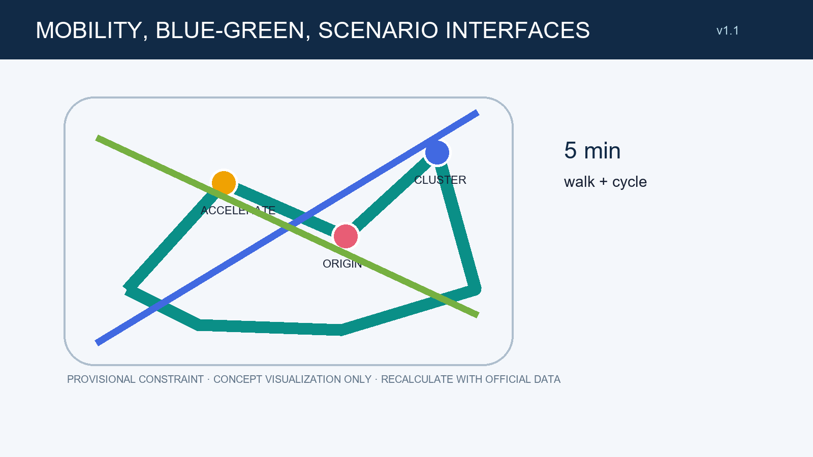
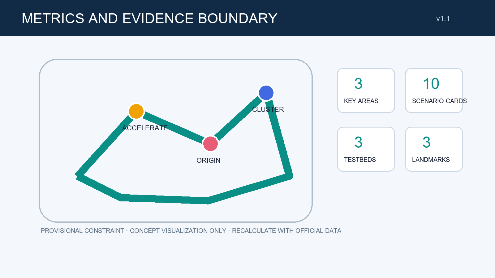

# Weave Intelligence Loop: A Public Circuit for the Centennial Jing-Zhang AI Innovation Belt

## Design Basis and Source List

This submission uses only the repository site package, source registry, local standard snapshots, and provisional geometry. Formal-ready, background, and provisional evidence are separated by allowed use. The submitted boundary is not an official redline; its areas support design communication and intake checking only, and must be recalculated when cleared attachments arrive. [source:SITE-PACKAGE] [source:SOURCE-REGISTRY]

This section keeps a reviewable relationship among evidence, space, and operation: each design judgment must return to its GeoJSON, metric, and matrix rather than rely on a diagram or slogan. Provisional geometry helps compare design relationships; it cannot derive statutory controls, investment scale, engineering feasibility, or ownership conclusions. When official boundaries, existing-condition survey, regulatory controls, transport, utilities, heritage, or ecological material changes, professional teams must revisit related layers, values, drawings, and scenario interfaces and record the impact. Any public AI interface is conditional on understandable notice, data minimisation, human assistance, and a complaint or alternative-service path; its specific compliance and performance require independent testing and confirmation.

## Three-Level Scope Framework

The framework has a coordinated research scale, an overall design scale, and three key-area scales. The first organizes regional innovation relationships; the second organizes a public circuit and renewal interfaces; the third provides scenario prototypes for professional teams to deepen. None substitutes for statutory planning. [data:geometry/site_boundary.geojson#SITE-001] [metric:site_area_sqm]

This section keeps a reviewable relationship among evidence, space, and operation: each design judgment must return to its GeoJSON, metric, and matrix rather than rely on a diagram or slogan. Provisional geometry helps compare design relationships; it cannot derive statutory controls, investment scale, engineering feasibility, or ownership conclusions. When official boundaries, existing-condition survey, regulatory controls, transport, utilities, heritage, or ecological material changes, professional teams must revisit related layers, values, drawings, and scenario interfaces and record the impact. Any public AI interface is conditional on understandable notice, data minimisation, human assistance, and a complaint or alternative-service path; its specific compliance and performance require independent testing and confirmation.

## Coordinated Research Area: Industry and Future City Research

The overall concept is Weave Intelligence Loop: a public circuit for walking, cycling, dwelling, and explaining data boundaries that stitches research, industry, community, and blue-green space. Its identity is two open lines interweaving at three nodes, signalling openness, pause, and auditability. Six comparative lenses—Montreal, Toronto, Helsinki, Seoul, Singapore, and Shenzhen—are a future public-research framework only; they create no local factual or policy claim. [source:AGENT-TASKBOOK] [standard:PROJECT-AGENT-OPEN-CALL-TASKBOOK]

This section keeps a reviewable relationship among evidence, space, and operation: each design judgment must return to its GeoJSON, metric, and matrix rather than rely on a diagram or slogan. Provisional geometry helps compare design relationships; it cannot derive statutory controls, investment scale, engineering feasibility, or ownership conclusions. When official boundaries, existing-condition survey, regulatory controls, transport, utilities, heritage, or ecological material changes, professional teams must revisit related layers, values, drawings, and scenario interfaces and record the impact. Any public AI interface is conditional on understandable notice, data minimisation, human assistance, and a complaint or alternative-service path; its specific compliance and performance require independent testing and confirmation.

## Overall Design Area: Urban Renewal and Regulatory-Plan-Level Urban Design

The overall strategy is retain first, add interfaces, and verify performance. Research, service, community, and blue-green areas form a complete design partition on the provisional scope. Building scale, height, ownership, road lines, utilities, and capacity remain for official data and professional confirmation. The heritage-park setting is treated as a narrative public interface, not an engineering corridor available for arbitrary intervention. [data:geometry/land_use.geojson#LU-001] [depth:land_use_layout]

This section keeps a reviewable relationship among evidence, space, and operation: each design judgment must return to its GeoJSON, metric, and matrix rather than rely on a diagram or slogan. Provisional geometry helps compare design relationships; it cannot derive statutory controls, investment scale, engineering feasibility, or ownership conclusions. When official boundaries, existing-condition survey, regulatory controls, transport, utilities, heritage, or ecological material changes, professional teams must revisit related layers, values, drawings, and scenario interfaces and record the impact. Any public AI interface is conditional on understandable notice, data minimisation, human assistance, and a complaint or alternative-service path; its specific compliance and performance require independent testing and confirmation.

## Detailed Design of Key Areas

Zhongzhiyuan is proposed as a bookable full-stack testing interface; Beijing AI Origin Community as an open-learning, everyday-service, and human-help counter; and Dazhongsi as a service-validation and evening-safety display interface. Each uses a public threshold, visible test layer, and quiet back-of-house layer. These are directional diagrams on provisional key-area geometry, not demolition, construction, or engineering instructions. [data:geometry/key_areas.geojson#PROV-KEY-001] [data:geometry/key_areas.geojson#PROV-KEY-002] [data:geometry/key_areas.geojson#PROV-KEY-003]

This section keeps a reviewable relationship among evidence, space, and operation: each design judgment must return to its GeoJSON, metric, and matrix rather than rely on a diagram or slogan. Provisional geometry helps compare design relationships; it cannot derive statutory controls, investment scale, engineering feasibility, or ownership conclusions. When official boundaries, existing-condition survey, regulatory controls, transport, utilities, heritage, or ecological material changes, professional teams must revisit related layers, values, drawings, and scenario interfaces and record the impact. Any public AI interface is conditional on understandable notice, data minimisation, human assistance, and a complaint or alternative-service path; its specific compliance and performance require independent testing and confirmation.

## AI Innovation Ecosystem, Personas, and AI+ Scenarios

Five personas guide the proposal: researchers, startup teams, neighbours, commuters, and accessibility/older users. Ten conceptual scenario cards are: open-source question kiosk, accessible travel helper, community service with human handoff, explainable-results wall, microclimate cue, cycle-safety cue, medical navigation prototype, shared-learning table, legal-service triage prototype, and evening public-space watch. The explainable-results wall, cycle-safety cue, and triage prototype are test/validation scenarios. Every scenario follows minimal data, notice, human review, and an alternative service path. [source:AGENT-TASKBOOK] [metric:scenario_card_count]

This section keeps a reviewable relationship among evidence, space, and operation: each design judgment must return to its GeoJSON, metric, and matrix rather than rely on a diagram or slogan. Provisional geometry helps compare design relationships; it cannot derive statutory controls, investment scale, engineering feasibility, or ownership conclusions. When official boundaries, existing-condition survey, regulatory controls, transport, utilities, heritage, or ecological material changes, professional teams must revisit related layers, values, drawings, and scenario interfaces and record the impact. Any public AI interface is conditional on understandable notice, data minimisation, human assistance, and a complaint or alternative-service path; its specific compliance and performance require independent testing and confirmation.

## Land Use, Building Scale, and Retain-Renovate-Demolish Strategy

Land use and buildings do not propose statutory FAR, height, or development quantum. The four design categories describe relations among research, blue-green, industry service, and community service. Retain-renovate-demolish-new-build is a decision framework to be applied only after survey, ownership, and engineering work; the current proposal favours retention and reversibility. [data:geometry/land_use.geojson#LU-002] [metric:building_footprint_area_sqm]

This section keeps a reviewable relationship among evidence, space, and operation: each design judgment must return to its GeoJSON, metric, and matrix rather than rely on a diagram or slogan. Provisional geometry helps compare design relationships; it cannot derive statutory controls, investment scale, engineering feasibility, or ownership conclusions. When official boundaries, existing-condition survey, regulatory controls, transport, utilities, heritage, or ecological material changes, professional teams must revisit related layers, values, drawings, and scenario interfaces and record the impact. Any public AI interface is conditional on understandable notice, data minimisation, human assistance, and a complaint or alternative-service path; its specific compliance and performance require independent testing and confirmation.

## Transport, Rail, Municipal Infrastructure, and Public Services

The transport proposal treats active and accessible access as the first performance of the public circuit, not as a new-road project. A conceptual three-station/three-campus service line, pause pockets, cycle-order points, and human wayfinding are shown. Rail, parking, fire access, utilities, and energy capacity require separate review by responsible authorities and professionals. [data:geometry/roads.geojson#ROAD-001] [standard:MOHURD-URBAN-DESIGN-MEASURES]

This section keeps a reviewable relationship among evidence, space, and operation: each design judgment must return to its GeoJSON, metric, and matrix rather than rely on a diagram or slogan. Provisional geometry helps compare design relationships; it cannot derive statutory controls, investment scale, engineering feasibility, or ownership conclusions. When official boundaries, existing-condition survey, regulatory controls, transport, utilities, heritage, or ecological material changes, professional teams must revisit related layers, values, drawings, and scenario interfaces and record the impact. Any public AI interface is conditional on understandable notice, data minimisation, human assistance, and a complaint or alternative-service path; its specific compliance and performance require independent testing and confirmation.

## Blue-Green Network, Public Space, and Urban Character

The blue-green network joins shade, accessible rainwater space, and knowledge gardens toward the Xiaoyue River and heritage-park direction. Three conceptual pilgrimage/honour nodes are the Centennial Echo Stop, Open-source Pledge Deck, and Verifiable Results Gallery. These are original working names with no unlicensed imagery or marks; they make culture a readable, participatory, and renewable public interface. [data:geometry/green_space.geojson#GREEN-001] [metric:green_ratio]

This section keeps a reviewable relationship among evidence, space, and operation: each design judgment must return to its GeoJSON, metric, and matrix rather than rely on a diagram or slogan. Provisional geometry helps compare design relationships; it cannot derive statutory controls, investment scale, engineering feasibility, or ownership conclusions. When official boundaries, existing-condition survey, regulatory controls, transport, utilities, heritage, or ecological material changes, professional teams must revisit related layers, values, drawings, and scenario interfaces and record the impact. Any public AI interface is conditional on understandable notice, data minimisation, human assistance, and a complaint or alternative-service path; its specific compliance and performance require independent testing and confirmation.

## Renewal Projects, Implementation Policy, and Phasing

The project list follows three phases: learn, test, share. The near term inventories data and broken links and hosts temporary learning events; the middle term improves public interfaces and test protocols; the longer term selects deepen-able projects after formal controls are known. A proposed annual loop is an open-source spring week, summer public-scenario trials, autumn evidence exhibition, and winter maintenance review. It is a community-operation concept, not a government funding, recruitment, or event commitment. [data:geometry/phasing.geojson#PHASE-001] [depth:phasing_implementation]

This section keeps a reviewable relationship among evidence, space, and operation: each design judgment must return to its GeoJSON, metric, and matrix rather than rely on a diagram or slogan. Provisional geometry helps compare design relationships; it cannot derive statutory controls, investment scale, engineering feasibility, or ownership conclusions. When official boundaries, existing-condition survey, regulatory controls, transport, utilities, heritage, or ecological material changes, professional teams must revisit related layers, values, drawings, and scenario interfaces and record the impact. Any public AI interface is conditional on understandable notice, data minimisation, human assistance, and a complaint or alternative-service path; its specific compliance and performance require independent testing and confirmation.

## Metrics, Area Recalculation, and Compliance Matrix

Metrics use the recalculable provisional-geometry values in the structured package: three key areas, ten scenario cards, three test/validation scenarios, and three honour nodes. Green, public-space, and building-footprint values are not official areas or planning controls. The compliance, standard, and design-depth matrices record the relevant layers, report sections, drawings, and gaps for each task. [metric:key_area_count] [metric:public_space_ratio]

This section keeps a reviewable relationship among evidence, space, and operation: each design judgment must return to its GeoJSON, metric, and matrix rather than rely on a diagram or slogan. Provisional geometry helps compare design relationships; it cannot derive statutory controls, investment scale, engineering feasibility, or ownership conclusions. When official boundaries, existing-condition survey, regulatory controls, transport, utilities, heritage, or ecological material changes, professional teams must revisit related layers, values, drawings, and scenario interfaces and record the impact. Any public AI interface is conditional on understandable notice, data minimisation, human assistance, and a complaint or alternative-service path; its specific compliance and performance require independent testing and confirmation.

## Risk, Copyright, and Compliance

No private data, restricted imagery, corporate mark, or unlicensed typeface is used. Drawings and HTML are locally generated explanatory assets. Generative-AI, public-service, and accessibility scenarios state governance boundaries for later work and do not make a legal compliance determination. Any construction, operation, or data processing needs subsequent professional, ownership, privacy, and authority confirmation. [source:SOURCE-REGISTRY] [standard:GENERATIVE-AI-INTERIM-MEASURES]

This section keeps a reviewable relationship among evidence, space, and operation: each design judgment must return to its GeoJSON, metric, and matrix rather than rely on a diagram or slogan. Provisional geometry helps compare design relationships; it cannot derive statutory controls, investment scale, engineering feasibility, or ownership conclusions. When official boundaries, existing-condition survey, regulatory controls, transport, utilities, heritage, or ecological material changes, professional teams must revisit related layers, values, drawings, and scenario interfaces and record the impact. Any public AI interface is conditional on understandable notice, data minimisation, human assistance, and a complaint or alternative-service path; its specific compliance and performance require independent testing and confirmation.

## References

Principal references: the project site package; the agent taskbook; public-data workflow; source registry; local snapshot of the urban-design measures; land-use classification guide; interim generative-AI measures; and barrier-free-environment law. Complete machine indexes are in sources.json and the three matrices. Each source is used only within its registered permission boundary and read with the provisional-geometry limitation. [source:SITE-PACKAGE] [source:SOURCE-REGISTRY]

This section keeps a reviewable relationship among evidence, space, and operation: each design judgment must return to its GeoJSON, metric, and matrix rather than rely on a diagram or slogan. Provisional geometry helps compare design relationships; it cannot derive statutory controls, investment scale, engineering feasibility, or ownership conclusions. When official boundaries, existing-condition survey, regulatory controls, transport, utilities, heritage, or ecological material changes, professional teams must revisit related layers, values, drawings, and scenario interfaces and record the impact. Any public AI interface is conditional on understandable notice, data minimisation, human assistance, and a complaint or alternative-service path; its specific compliance and performance require independent testing and confirmation.
