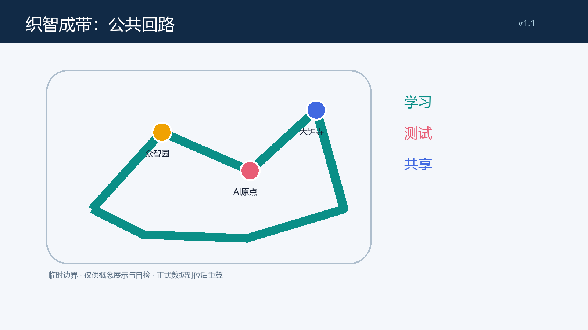
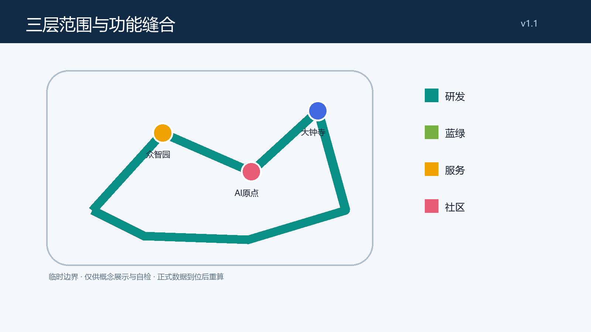
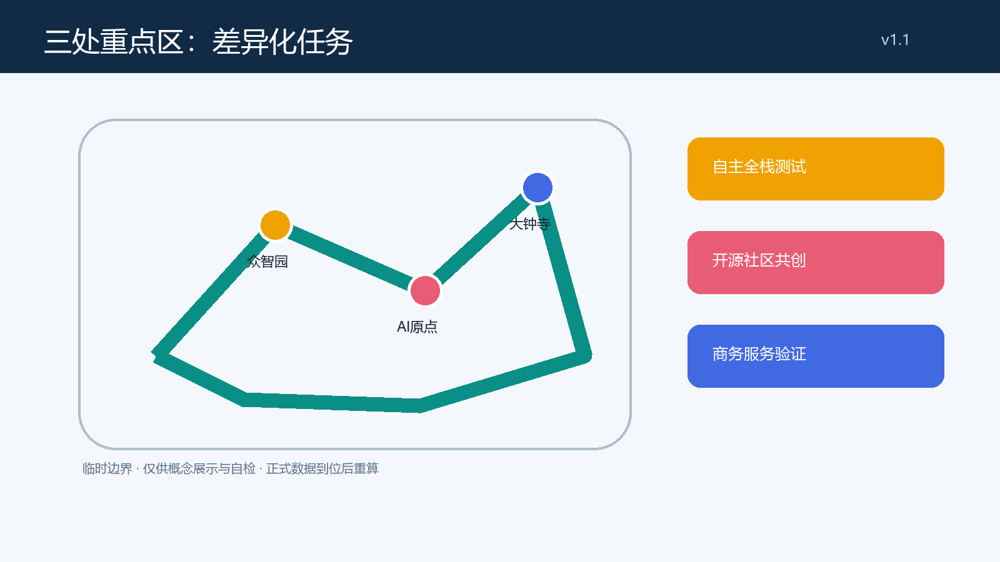
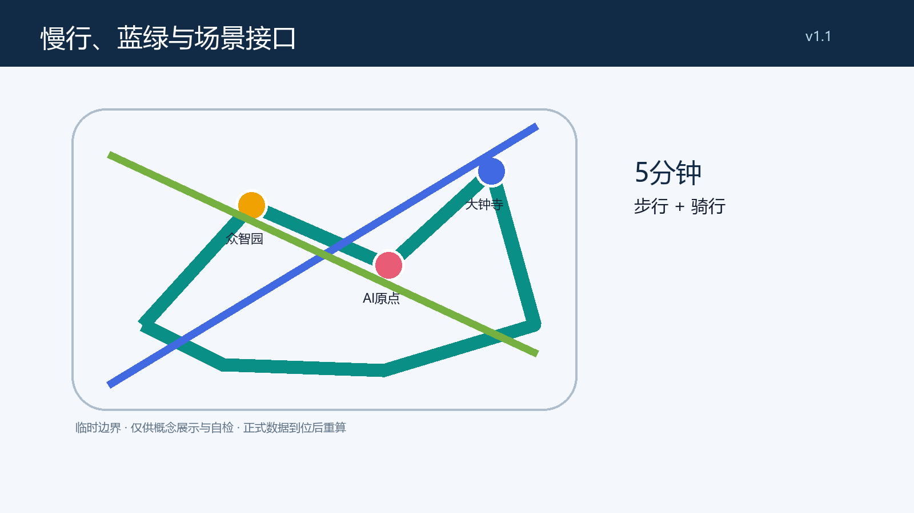
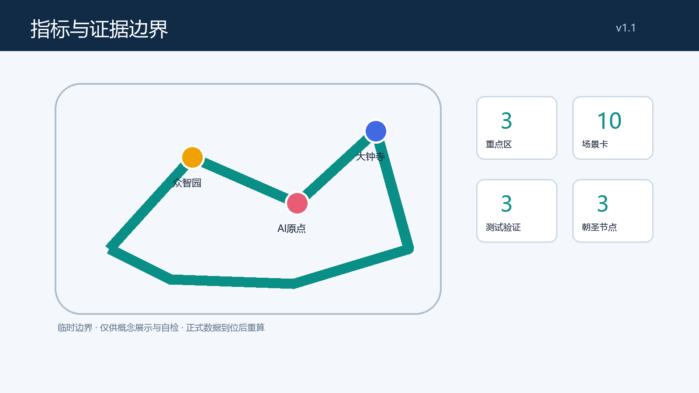

# 织智成带：百年京张 AI 创新带公共回路城市设计

## 设计依据与资料清单

本方案仅使用仓库的任务书、来源登记、标准快照和临时几何；正式可用、背景和临时资料按用途分层。临时范围不是官方红线，图层与面积只服务于方案表达和自检，正式附件到位后须复算。[source:SITE-PACKAGE] [source:SOURCE-REGISTRY]

本节同时说明资料、空间和运营之间的可复核关系：设计判断须回到相应的 GeoJSON、指标和矩阵，而不是以图面或口号替代证据。临时边界的作用是帮助比较方案关系，不能推导法定控制、投资规模、工程可行性或既有空间的权属结论。若正式红线、现状、控规、交通、市政、文保或生态资料改变，应由专业团队重新检查本节相关图层、数值、图纸和场景接口，并在变更记录中说明影响。公众使用的 AI 界面应以可理解的告知、最小化数据、人工协助和申诉或替代路径为前提；其具体合规性与运行绩效仍需独立测试和确认。

## 三层范围工作框架

工作框架分为统筹研究、总体设计和三处重点区。前者组织区域创新协同，后者组织公共回路与更新界面，重点区形成可供专业团队深化的场景原型；三层都不替代法定规划。[data:geometry/site_boundary.geojson#SITE-001] [metric:site_area_sqm]

本节同时说明资料、空间和运营之间的可复核关系：设计判断须回到相应的 GeoJSON、指标和矩阵，而不是以图面或口号替代证据。临时边界的作用是帮助比较方案关系，不能推导法定控制、投资规模、工程可行性或既有空间的权属结论。若正式红线、现状、控规、交通、市政、文保或生态资料改变，应由专业团队重新检查本节相关图层、数值、图纸和场景接口，并在变更记录中说明影响。公众使用的 AI 界面应以可理解的告知、最小化数据、人工协助和申诉或替代路径为前提；其具体合规性与运行绩效仍需独立测试和确认。

## 统筹研究范围产业与未来城市研究

总体概念为“织智成带 / Weave Intelligence Loop”：以一条可步行、骑行、停留和解释数据边界的公共回路，缝合研究、产业、社区和蓝绿空间。Logo 方向是两条不闭合的线在三个节点交织，表达开放、可暂停和可复核；不使用企业商标或既有视觉资产。六个比较镜头——蒙特利尔、多伦多、赫尔辛基、首尔、新加坡、深圳——仅作为后续公开资料研究的案例框架，不导出本地事实或政策承诺。[source:AGENT-TASKBOOK] [standard:PROJECT-AGENT-OPEN-CALL-TASKBOOK]

本节同时说明资料、空间和运营之间的可复核关系：设计判断须回到相应的 GeoJSON、指标和矩阵，而不是以图面或口号替代证据。临时边界的作用是帮助比较方案关系，不能推导法定控制、投资规模、工程可行性或既有空间的权属结论。若正式红线、现状、控规、交通、市政、文保或生态资料改变，应由专业团队重新检查本节相关图层、数值、图纸和场景接口，并在变更记录中说明影响。公众使用的 AI 界面应以可理解的告知、最小化数据、人工协助和申诉或替代路径为前提；其具体合规性与运行绩效仍需独立测试和确认。

## 总体设计范围城市更新与控规深度城市设计

总体设计以“保留优先、接口增补、性能复核”为城市更新策略：研发、服务、社区和蓝绿空间以完整分区共同覆盖临时范围；建筑基底、强度、高度、权属、道路红线及市政容量均待正式资料和专业团队确认。京张遗址周边被理解为可叙事的公共接口，而非可任意改造的工程走廊。[data:geometry/land_use.geojson#LU-001] [depth:land_use_layout]

本节同时说明资料、空间和运营之间的可复核关系：设计判断须回到相应的 GeoJSON、指标和矩阵，而不是以图面或口号替代证据。临时边界的作用是帮助比较方案关系，不能推导法定控制、投资规模、工程可行性或既有空间的权属结论。若正式红线、现状、控规、交通、市政、文保或生态资料改变，应由专业团队重新检查本节相关图层、数值、图纸和场景接口，并在变更记录中说明影响。公众使用的 AI 界面应以可理解的告知、最小化数据、人工协助和申诉或替代路径为前提；其具体合规性与运行绩效仍需独立测试和确认。

## 重点区域详细设计

众智园建议承接全栈自主测试的可预约界面；北京 AI 原点社区建议承接开源学习、生活服务和人工帮助台；大钟寺建议承接商务服务验证与夜间安全的可解释展示。每一区都由“公共门厅—可见测试—安静后场”组织，并以临时范围为方向性示意，不能据此实施拆改留或工程建设。[data:geometry/key_areas.geojson#PROV-KEY-001] [data:geometry/key_areas.geojson#PROV-KEY-002] [data:geometry/key_areas.geojson#PROV-KEY-003]

本节同时说明资料、空间和运营之间的可复核关系：设计判断须回到相应的 GeoJSON、指标和矩阵，而不是以图面或口号替代证据。临时边界的作用是帮助比较方案关系，不能推导法定控制、投资规模、工程可行性或既有空间的权属结论。若正式红线、现状、控规、交通、市政、文保或生态资料改变，应由专业团队重新检查本节相关图层、数值、图纸和场景接口，并在变更记录中说明影响。公众使用的 AI 界面应以可理解的告知、最小化数据、人工协助和申诉或替代路径为前提；其具体合规性与运行绩效仍需独立测试和确认。

## AI 创新生态、人才画像与 AI+ 场景

五类用户画像为研究者、初创团队、邻里居民、通勤者和无障碍/老年使用者。十张概念场景卡包括：1 开源问答亭，2 无障碍出行助手，3 社区服务人工协同台，4 研发成果可解释墙，5 园区微气候提示，6 骑行安全提示，7 医疗导诊原型，8 教育共学桌，9 法律服务分流原型，10 夜间公共空间守望。其中国研成果可解释墙、骑行安全提示和服务分流原型为测试验证场景；所有场景遵循最小数据、明确告知、人工复核和退出/替代服务的概念边界。[source:AGENT-TASKBOOK] [metric:scenario_card_count]

本节同时说明资料、空间和运营之间的可复核关系：设计判断须回到相应的 GeoJSON、指标和矩阵，而不是以图面或口号替代证据。临时边界的作用是帮助比较方案关系，不能推导法定控制、投资规模、工程可行性或既有空间的权属结论。若正式红线、现状、控规、交通、市政、文保或生态资料改变，应由专业团队重新检查本节相关图层、数值、图纸和场景接口，并在变更记录中说明影响。公众使用的 AI 界面应以可理解的告知、最小化数据、人工协助和申诉或替代路径为前提；其具体合规性与运行绩效仍需独立测试和确认。

## 用地、建筑规模与拆改留方案

用地与建筑不提出法定容积率、高度或开发量。本包的四类设计分区用于表达研发、蓝绿、产业服务和社区服务之间的关系；“保留—改造—拆除—新建”只是一套待现状、权属和工程调查后应用的决策框架，当前仅倡导保留优先与可逆性。[data:geometry/land_use.geojson#LU-002] [metric:building_footprint_area_sqm]

本节同时说明资料、空间和运营之间的可复核关系：设计判断须回到相应的 GeoJSON、指标和矩阵，而不是以图面或口号替代证据。临时边界的作用是帮助比较方案关系，不能推导法定控制、投资规模、工程可行性或既有空间的权属结论。若正式红线、现状、控规、交通、市政、文保或生态资料改变，应由专业团队重新检查本节相关图层、数值、图纸和场景接口，并在变更记录中说明影响。公众使用的 AI 界面应以可理解的告知、最小化数据、人工协助和申诉或替代路径为前提；其具体合规性与运行绩效仍需独立测试和确认。

## 交通、轨道、市政与公共服务设施

交通策略是把慢行和无障碍接驳作为公共回路的第一性能，而非新增道路工程。概念上设置“三站三院”接驳线、停留口袋、非机动车秩序点和人工导引；轨道、停车、消防、市政和能源容量必须由主管部门及专业团队另行复核。[data:geometry/roads.geojson#ROAD-001] [standard:MOHURD-URBAN-DESIGN-MEASURES]

本节同时说明资料、空间和运营之间的可复核关系：设计判断须回到相应的 GeoJSON、指标和矩阵，而不是以图面或口号替代证据。临时边界的作用是帮助比较方案关系，不能推导法定控制、投资规模、工程可行性或既有空间的权属结论。若正式红线、现状、控规、交通、市政、文保或生态资料改变，应由专业团队重新检查本节相关图层、数值、图纸和场景接口，并在变更记录中说明影响。公众使用的 AI 界面应以可理解的告知、最小化数据、人工协助和申诉或替代路径为前提；其具体合规性与运行绩效仍需独立测试和确认。

## 蓝绿空间、公共空间与城市风貌

蓝绿网络以连续阴凉、可达雨洪空间和可停留的知识花园串接小月河及遗址公园方向。三个朝圣/荣誉展示节点为“百年回声站”“开源誓约台”“可验证成果廊”，均为不依赖未授权形象或商标的概念名称；它们将文化叙事从展示物转化为可读、可参与、可更新的公共界面。[data:geometry/green_space.geojson#GREEN-001] [metric:green_ratio]

本节同时说明资料、空间和运营之间的可复核关系：设计判断须回到相应的 GeoJSON、指标和矩阵，而不是以图面或口号替代证据。临时边界的作用是帮助比较方案关系，不能推导法定控制、投资规模、工程可行性或既有空间的权属结论。若正式红线、现状、控规、交通、市政、文保或生态资料改变，应由专业团队重新检查本节相关图层、数值、图纸和场景接口，并在变更记录中说明影响。公众使用的 AI 界面应以可理解的告知、最小化数据、人工协助和申诉或替代路径为前提；其具体合规性与运行绩效仍需独立测试和确认。

## 更新项目清单、实施政策与分期计划

项目清单按“学习—测试—共享”三期组织：近期清点数据与断点并开设临时共学活动，中期完善公共接口和可评估测试协议，远期根据正式控制条件决定可深化项目。建议的年度机制为春季开源周、夏季公共场景试用、秋季证据展和冬季维护复盘；这是社区运营设想，不是政府资金、招商或活动承诺。[data:geometry/phasing.geojson#PHASE-001] [depth:phasing_implementation]

本节同时说明资料、空间和运营之间的可复核关系：设计判断须回到相应的 GeoJSON、指标和矩阵，而不是以图面或口号替代证据。临时边界的作用是帮助比较方案关系，不能推导法定控制、投资规模、工程可行性或既有空间的权属结论。若正式红线、现状、控规、交通、市政、文保或生态资料改变，应由专业团队重新检查本节相关图层、数值、图纸和场景接口，并在变更记录中说明影响。公众使用的 AI 界面应以可理解的告知、最小化数据、人工协助和申诉或替代路径为前提；其具体合规性与运行绩效仍需独立测试和确认。

## 指标体系、面积复算与合规矩阵

指标采用结构化文件中可复算的临时几何值：三处重点区、10 张场景卡、3 个测试验证场景和3个荣誉节点。绿地、公共空间和建筑基底指标均以临时边界计算，不能解释为官方面积或规划控制；合规、标准和深度矩阵记录每项任务的图层、章节、图纸和缺口。[metric:key_area_count] [metric:public_space_ratio]

本节同时说明资料、空间和运营之间的可复核关系：设计判断须回到相应的 GeoJSON、指标和矩阵，而不是以图面或口号替代证据。临时边界的作用是帮助比较方案关系，不能推导法定控制、投资规模、工程可行性或既有空间的权属结论。若正式红线、现状、控规、交通、市政、文保或生态资料改变，应由专业团队重新检查本节相关图层、数值、图纸和场景接口，并在变更记录中说明影响。公众使用的 AI 界面应以可理解的告知、最小化数据、人工协助和申诉或替代路径为前提；其具体合规性与运行绩效仍需独立测试和确认。

## 风险、版权与合规说明

本方案不使用私人数据、受限图像、企业商标或未经授权字体；图纸和网页为本地生成的解释性资产。生成式 AI、公共服务和无障碍相关场景只提出可供深化的治理边界，未作法律合规认定。任何建设、改造、运营或数据处理均须取得后续专业、权属、隐私与主管部门确认。[source:SOURCE-REGISTRY] [standard:GENERATIVE-AI-INTERIM-MEASURES]

本节同时说明资料、空间和运营之间的可复核关系：设计判断须回到相应的 GeoJSON、指标和矩阵，而不是以图面或口号替代证据。临时边界的作用是帮助比较方案关系，不能推导法定控制、投资规模、工程可行性或既有空间的权属结论。若正式红线、现状、控规、交通、市政、文保或生态资料改变，应由专业团队重新检查本节相关图层、数值、图纸和场景接口，并在变更记录中说明影响。公众使用的 AI 界面应以可理解的告知、最小化数据、人工协助和申诉或替代路径为前提；其具体合规性与运行绩效仍需独立测试和确认。

## 参考资料

主要参考资料为：项目 site package；面向智能体任务书；公开数据处理指引；来源登记表；住房城乡建设部城市设计管理办法快照；自然资源部用地分类指南快照；生成式人工智能服务管理暂行办法快照；无障碍环境建设法快照。完整机器索引见 sources.json 与三个矩阵文件；引用资料仅在登记的允许用途内使用，并与临时边界限制一并阅读。[source:SITE-PACKAGE] [source:SOURCE-REGISTRY]

本节同时说明资料、空间和运营之间的可复核关系：设计判断须回到相应的 GeoJSON、指标和矩阵，而不是以图面或口号替代证据。临时边界的作用是帮助比较方案关系，不能推导法定控制、投资规模、工程可行性或既有空间的权属结论。若正式红线、现状、控规、交通、市政、文保或生态资料改变，应由专业团队重新检查本节相关图层、数值、图纸和场景接口，并在变更记录中说明影响。公众使用的 AI 界面应以可理解的告知、最小化数据、人工协助和申诉或替代路径为前提；其具体合规性与运行绩效仍需独立测试和确认。
