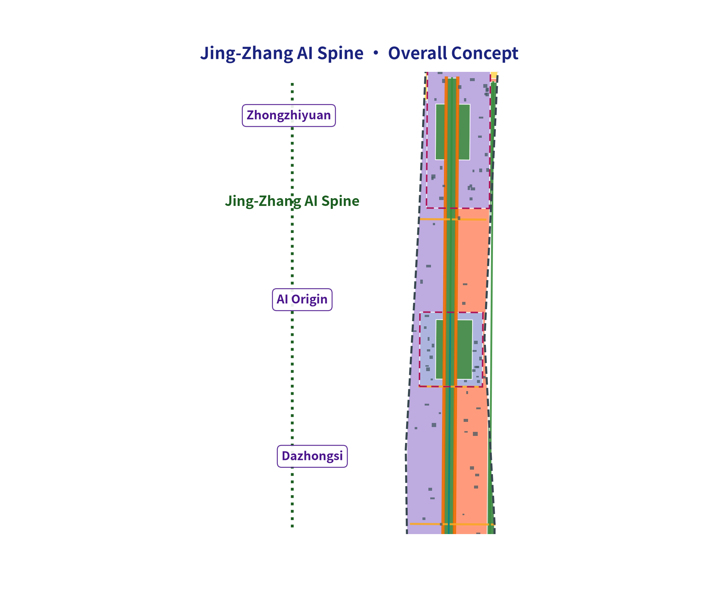
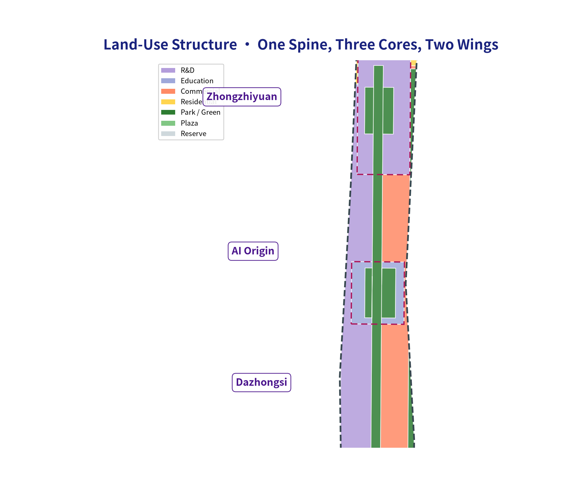
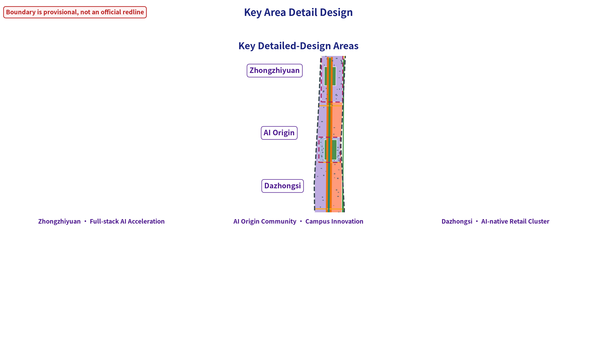
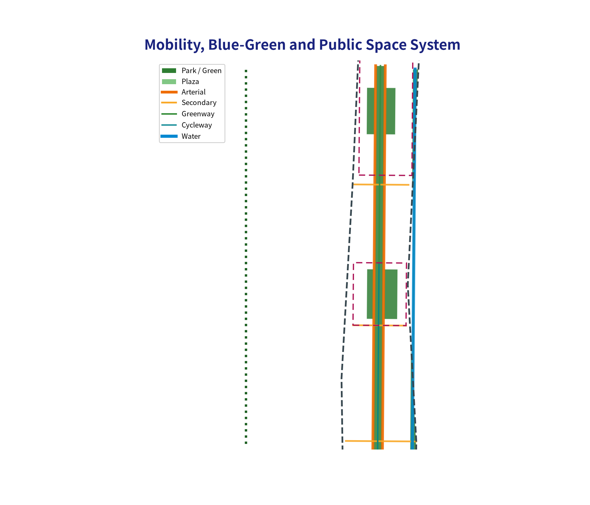
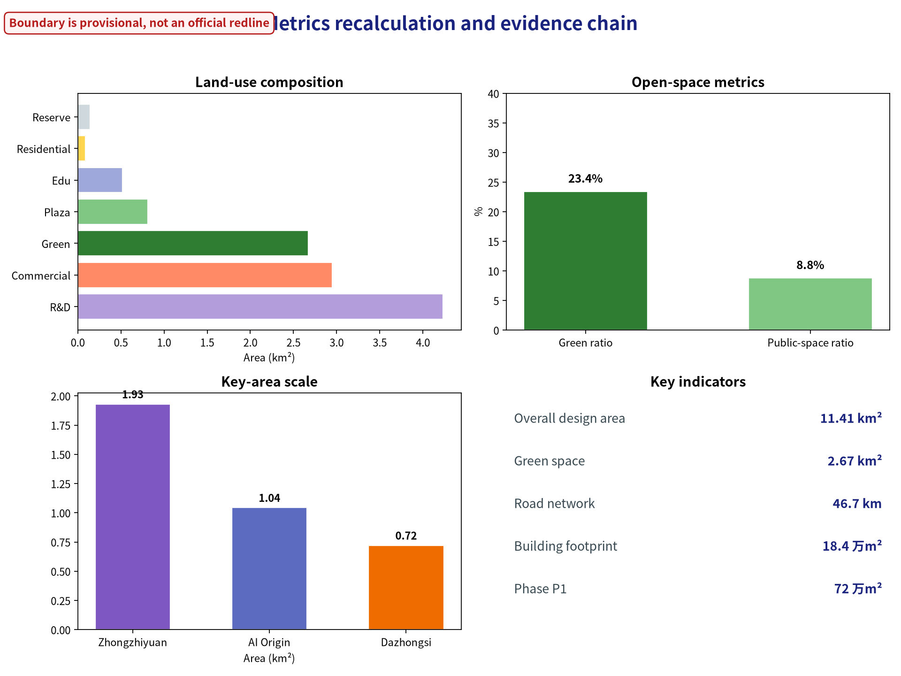

# Jing-Zhang AI Spine: An Evolvable Intelligent City on a Century-Old Railway

## Design Basis and Materials Checklist

This formal proposal takes as its primary basis the *Centennial Jing-Zhang AI Innovation Belt Urban Design International Solicitation Prequalification Announcement* issued by the Haidian Branch of the Beijing Municipal Commission of Planning and Natural Resources, and uses the maintainer-registered provisional coarse boundary, key areas, enums, metrics and source checklist under `brief/site-package/` as machine-readable evidence. Before generating the proposal, the AI agent must read `design_brief.json`, `allowed_design_space.json`, `sources.json`, `enums/`, `ranges/`, `schemas/`, `data/source_registry.json` and `data/processed/agent_fact_pack.md`, and use `project_scope_summary.csv`, `agent_task_requirements.csv`, `source_use_matrix.csv` and `missing_data_checklist.csv` to build task, scope, material-use and gap checklists. Every design judgment must be decomposed into traceable sources, recomputable metrics, verifiable layers and human-reviewable assumptions. The announcement requires the proposal to reach the urban-design depth of a regulatory detailed plan and the urban-design depth of a comprehensive planning implementation plan; narrative text therefore cannot replace GeoJSON, metric tables, the A3 booklet, the A0 boards and the HTML electronic presentation deliverables.

This proposal is not a standalone vision text; it organizes deliverables from the announcement, the agent-facing taskbook and the site materials. This section only places the most critical evidence next to the judgment [source:OFFICIAL-ANNOUNCEMENT] [source:AGENT-TASKBOOK] [depth:existing_conditions_diagnosis]. The full source and standard coverage is kept in `sources.json`, `standard_matrix.json` and `design_depth_matrix.json`, and the machine index is not repeated in the body text.

The use boundaries of the materials registry are as follows [source:SOURCE-REGISTRY]:

- data/source_registry.json registers the intended use boundaries of public, cleared and provisional materials.
- Current registry summary: 5 formal-usable materials, 0 background materials, 1 provisional-only material.
- The agent must not upgrade background_only or provisional_only materials into official boundary, statutory control plans, formal scoring basis or government implementation commitments.

`data/processed/agent_fact_pack.md` is the reading-navigation layer of this proposal, not a new authoritative source [source:PROCESSED-FACT-PACK]. It helps the agent organize the three-level scope, three key areas, announcement tasks, agent.1-agent.6, material availability and missing-data items into a readable proposal; factual judgments still need to return to the registered original materials [source:OFFICIAL-ANNOUNCEMENT] [source:AGENT-TASKBOOK], and the complete source relationships are kept in `sources.json`.

While the official `SITE_BOUNDARY` or the three `KEY_AREA` polygons are not yet available, this scaffold generates a temporary formal package from `brief/site-package/geometry/provisional_boundaries.geojson`. The `geometry/site_boundary.geojson` and `geometry/key_areas.geojson` in the submission must both be labeled `provisional_constraint`, `official_boundary=false`, usable only for proposal generation, self-check, visualization and design discussion — not as official redline, approval basis, precise area basis or statutory control conclusions. This organizer-side data gap does not itself block content scoring; after official polygons are released, site boundary, key areas, land use, roads, green space, public space, buildings, phasing and metrics must all be recomputed.

The scaffolded scoring state of this submission is: **provisional boundary, precision warnings preserved and to be recomputed after official data is released; content scoring is not blocked**. Therefore the spatial structure, scenarios, projects and metrics in the body are written on the principle of "discussable, reviewable, recomputable after official boundary replacement"; when official boundary and key-area polygons are updated, the agent must re-run the scaffold, self-check and drawing/HTML generation, not simply replace a single file.

Boundary interpretation can return to the overall-scope layer and the area recomputation [data:geometry/site_boundary.geojson#SITE-001] [metric:site_area_sqm]. The three key areas are checked by separate layers and count metrics [data:geometry/key_areas.geojson#PROV-KEY-001] [metric:key_area_count]. This lets readers enter the evidence from the body without first reading a string of machine IDs.

## Three-Level Scope Working Framework

Following the announcement, the proposal is organized in three levels: the coordination research scope focuses on the AI industry ecology, strategic positioning, innovation chain and future urban form of 43.6 km²; the overall design scope focuses on the 11.4 km² urban area and industrial zones within a 1–2 km band around the Jing-Zhang Heritage Park, requiring an overall urban-renewal framework, industrial spatial layout, transport/municipal support and urban-form control; the key-area scope focuses on detailed design of the three 368.4 ha areas, requiring functional programs, building scale, retain/renovate/demolish classification, public-space connectivity and transport organization. The three levels are mapped one-by-one in `compliance_matrix.json`, ensuring that every mandatory task of announcement sections 1.3, 1.4, 1.5 and agent.1-agent.6 has chapter, layer, metric, drawing and HTML evidence.

The depth items of the three-level framework are constrained by [depth:three_level_scope_framework] and [depth:overall_spatial_structure]; the spatial evidence is based on [data:geometry/site_boundary.geojson#SITE-001] and [data:geometry/key_areas.geojson#PROV-KEY-001]; the task basis is [standard:PROJECT-OFFICIAL-ANNOUNCEMENT]; and the scope index is the three-level scope table in `project_scope_summary.csv` under [source:PROCESSED-FACT-PACK].

The three levels are not mutually isolated drawing sets. The coordination research decides the industry-chain and urban-form judgments; the overall design implements these into renewal projects, spatial structure and facility capacity; the key-area detailed design verifies the implementability of specific plots, buildings, transport, public space and AI application scenarios. When generating the proposal, the agent must first lock the official or provisional boundary and constraints adopted by this submission, then generate land use, buildings, roads, green space, public space, phasing and AI service nodes, and finally recompute metrics from these layers and explain in the body which conclusions remain limited by the provisional boundary. Any area, ratio, scale or project count that cannot be recomputed from structured data must not be written as a formal conclusion.

The overall concept proposed here is the "Jing-Zhang Symbiosis Corridor": with the Jing-Zhang Heritage Park as the historical and public-space spine, the three key areas (Zhongzhi Park, Beijing AI Origin Community, Dazhongsi) as innovation anchors, and universities, enterprises, communities and rail stations as the everyday network, forming a spatial organization of "one belt, three cores, multiple scenario nodes, blue-green slow-traffic compound ring". The "one belt" here is not an extra new redline; it translates the three-level scope of the announcement into a working method. The "three cores" correspond to the three key areas. The "multiple scenario nodes" correspond to operable nodes for AI + public services, enterprise services and urban living. The "compound ring" corresponds to the linkage of slow traffic, green space, public space and activity routes.

| Level | Design question | Proposal answer | Data anchor |
| --- | --- | --- | --- |
| Coordination research scope | How to organize the AI industry ecology and future urban form | Build an innovation chain of "university origins – open-source collaboration – enterprise translation – public experience – international dissemination" | compliance_matrix.json, standard_matrix.json |
| Overall design scope | How to map industrial space, urban renewal, transport/municipal and urban form | Land-use, building, road, green-space, public-space and phasing layers jointly express it | [data:geometry/land_use.geojson#LU-001], [data:geometry/roads.geojson#ROAD-001] |
| Key-area scope | How the three areas reach detailed-design depth | Propose positioning, spatial actions, AI scenarios and implementation dependencies for each | [data:geometry/key_areas.geojson#PROV-KEY-001], [data:geometry/key_areas.geojson#PROV-KEY-002], [data:geometry/key_areas.geojson#PROV-KEY-003] |

## Coordination Research Scope: Industry and Future-City Research

The core task of the coordination research scope is to build a world-class AI innovation ecosystem. The proposal should sort out Haidian's universities and institutes, leading enterprises, computing/algorithms/data factors, incubation platforms, listed companies, unicorns and science-and-technology services, and propose a spatial coordination framework for the AI innovation chain, industry chain, talent chain and urban service chain. Naming and logo design should serve the overall recognition of "the Centennial Jing-Zhang cultural belt, the urban AI life experience belt, and the AI-integrated innovation belt" — not merely slogans, and should explain the link with the industry ecology, public space and cultural resources. The agent-facing taskbook also requires responding to the "five functions" and the "three zones, two wings" coordination, forming a naming system, visual identity, overall spatial-structure map, scenario opening and operation mechanism that can be further deepened; this section must use [source:AGENT-TASKBOOK] and [standard:PROJECT-AGENT-OPEN-CALL-TASKBOOK] to mark that these requirements come from the agent open-call taskbook, not from statutory planning control.

The coordination research does not add pseudo-precise redlines; it uses the urban-form, public-space and building-layout coordination required by [standard:MOHURD-URBAN-DESIGN-MEASURES], returning to [data:geometry/land_use.geojson#LU-001], [data:geometry/public_space.geojson#PUBLIC-001] and [depth:overall_spatial_structure], to show that the industry strategy ultimately lands in a visible, reviewable spatial structure.

Future-city research should answer how AI changes work, life, socializing, learning, transport and public services. The proposal should implement the AI transport system, continuous green space, innovation service facilities and an international work-life atmosphere into locatable functional zones, nodes, corridors and scenarios, rather than describing the technology vision vaguely. The agent should write industrial-strategy metrics, AI innovation index, talent density, spatial-supply types and AI + vertical-application focus areas into the metrics system, and mark which are official, which are design proposals, and which await formal-data calibration. If global AI innovation events, developer communities, open scenarios or pilgrimage routes are proposed, they must be written as "conceptual proposals / reference schemes / to be deepened by professional teams", not as confirmed government activities or implementation arrangements.

## Overall Design Scope: Urban Renewal and Regulatory-Depth Urban Design

The overall design scope must reach the urban-design depth of a regulatory detailed plan. The proposal must propose an overall urban-renewal spatial structure, low-efficiency-space identification, a renewal project list, implementation-policy recommendations, industrial-function ratios, spatial organization modes, total building scale and comprehensive capacity assessment. `geometry/land_use.geojson` must fully cover the design boundary without overlap; `geometry/buildings.geojson` must express renewed or retained building footprints; `geometry/roads.geojson` must express micro-circulation, slow traffic and rail-transfer relations; `metrics.json` must recompute the core areas, ratios and layer counts.

Following [standard:MOHURD-CONTROL-DETAILED-PLANNING], this section decomposes regulatory-depth content into reviewable objects: [data:geometry/land_use.geojson#LU-001] expresses the land-use structure, [data:geometry/buildings.geojson#BLDG-001] the building footprints, [data:geometry/roads.geojson#ROAD-001] the transport organization, [metric:building_footprint_area_sqm] verifies the building footprint area, and [depth:land_use_layout] with [depth:development_intensity_controls] constrain the deliverable depth.

The overall design must also support transport, rail, municipal and supporting facilities. The proposal should propose spatial layout and implementation paths for rail-station integration, road micro-circulation, non-motorized vehicle parking, parking supply, innovation service platforms, talent living services, new infrastructure, distributed energy and edge computing. For building height, development intensity, road redlines, setbacks and facility standards with no official control conditions yet, the text should state "to be confirmed by formal regulatory conditions" and must not pass agent-inferred values off as approved indicators.

## Key-Area Detailed Design

Key-area detailed design is mandatory. The Zhongzhi Park AI Independent-Innovation Acceleration Area should propose detailed schemes around national AI platforms, full-stack independent innovation, standard-setting, safety governance, industry exhibition, external transport, Qinghe culture, low-carbon green innovation exchanges and green-space AI scenarios. The Beijing AI Origin Community should propose detailed schemes around near-campus innovation, achievement incubation and translation, the talent special zone, the open-source system, brand events, building retain/renovate/demolish, achievement release and display, living and supporting services, campus-park slow-traffic links and rail-station integration. The Dazhongsi AI Industry Cluster should propose detailed schemes around leading enterprises, agents, intelligent terminals, content consumption, data factors, digital assets, commercial services, compound use of planned green space, Dazhongsi station integration and four-quadrant pedestrian connectivity at the intersection.

The three key areas must cite [data:geometry/key_areas.geojson#PROV-KEY-001], [data:geometry/key_areas.geojson#PROV-KEY-002] and [data:geometry/key_areas.geojson#PROV-KEY-003], and be checked by [depth:three_key_area_detailed_design] for reaching comprehensive-planning-implementation depth. If a scheme only says "build a demonstration zone" without function, building, transport, public-space and implementation-project evidence, it should be treated as incomplete.

The three key areas must appear in `geometry/key_areas.geojson`. If official polygons are provided by the repository, they must be used as `official_constraint`; if official polygons are missing, `provisional_constraint` may be used temporarily, but the body, HTML, sources, assumptions and self_check must state that it cannot serve as a formal scoring or approval basis. `compliance_matrix.json` should separately cover announcement sections 1.5.3.1, 1.5.3.2 and 1.5.3.3. The design expression should include functional programs, building scale, building form, retain/renovate/demolish classification, public-space system, transport organization, slow-traffic connectivity and implementation projects. The HTML page should allow switching among the three key areas; the A3 booklet and A0 boards should include at least a key-area master plan, local details and metric explanations.

| Key area | Design positioning | Existing-context reference | Function & spatial actions | Transport & slow-traffic interface | Public space | AI scenario nodes | Dependency constraints | Concept phasing | Risk |
| --- | --- | --- | --- | --- | --- | --- | --- | --- | --- |
| Zhongzhi Park AI Independent-Innovation Acceleration Area | Garden-type full-stack independent-innovation district | Existing parks, green belts and R&D/industrial land along Qinghe; surroundings of national AI platforms | Strengthen the Qinghe frontage, industry exhibition, low-carbon innovation exchanges and external transport organization; carry open testing and standards-governance display in green space; add R&D offices, exhibition and exchange functions | Qinghe riverside slow traffic, cross-river links, external transport organization, non-motorized parking | Riverside low-carbon innovation corridor, low-carbon testing & display park, public exchange courtyards | Independent model testing, standards-setting workshops, safety-governance display, low-carbon computing experience (T-01) | River blue lines, flood control, ecology and planned green-line conditions pending | P1 lightweight test field & display frontage; P2 standards governance & industry support; P3 full-stack park | River ownership/blue lines pending; test-data anonymization duty |
| Beijing AI Origin Community | Near-campus achievement-transfer and talent community | Campus-adjacent blocks, research institutes mixed with residential; rail-station catchment | Organize campus-park-street slow-traffic stitching; add achievement release, talent service, living support and open-source collaboration space; clarify retain/renovate/demolish | Campus-park slow links, rail-station integration, near-campus cycling network | Achievement-release plaza, open-source public space, community green corridors | Open-source community, achievement release hall, talent-special-zone services, near-campus incubation (scenarios 01/07) | Campus boundary, ownership, ground-floor programs, rail integration conditions pending | P1 achievement-release hall & open-source space; P2 transfer street & talent services; P3 full community | Campus-boundary sensitivity; research-data authorization boundary |
| Dazhongsi AI Industry Cluster | Urban intelligent economy and international-exchange district | Commercial/office and planned-green compound around Dazhongsi station; four-quadrant intersection context | Dazhongsi station integration, four-quadrant pedestrian connectivity, commercial services and public-environment renewal of leading enterprises; organize agent, terminal, content-consumption and data-factor programs | Station integration, four-quadrant pedestrian links, rail transfer, slow-traffic crossing optimization | Star-ring plaza, compound use of planned green space, roadshow public space | Agent & intelligent-terminal display, content consumption, data-factor hall, international roadshow (T-03 / scenarios 05/08) | Rail station, road intersection, municipal pipelines, planned green space conditions pending | P1 four-quadrant walkability & star-ring plaza; P2 data factors & international roadshow; P3 full industry district | Complex intersection traffic; data-factor compliance-audit duty |

## AI Innovation Ecology, Talent Profiles and AI+ Scenarios

The proposal should build spatial-demand profiles for AI talent and enterprises, covering R&D offices, open-source collaboration, achievement release, enterprise services, talent housing, social learning, consumption life, sports & leisure and international exchange. AI+ scenarios should follow the announcement directions of transport, services, consumption, healthcare, education, law and life services, forming both industry-development scenarios and AI-empowered urban-function scenarios. Each scenario should state the service object, spatial location, data source, privacy boundary, human-review mechanism and operating entity.

AI scenarios must land on spatial and governance boundaries: public-space scenarios cite [data:geometry/public_space.geojson#PUBLIC-001], slow-traffic and transport scenarios cite [data:geometry/roads.geojson#ROAD-001], open-space scenarios cite [data:geometry/green_space.geojson#GREEN-001] and [metric:public_space_ratio], [metric:green_ratio]. These references let reviewers see that scenarios are not slogans but design objects located in concrete layers and metrics. The agent-facing taskbook requires no fewer than 10 AI scenario cards, no fewer than 3 industrial test-and-verification scenarios and no fewer than 5 user-profile types; the scaffold only gives the structure — formal participants must write the scenario cards, profile tables, privacy boundaries, human review and operating entities into the body, HTML, A3/A0 and the compliance matrix.

| User profile | Typical needs | Spatial response | Self-check boundary |
| --- | --- | --- | --- |
| Open-source developers | Release, collaboration, testing, community reputation | Origin community open-source release hall, public code wall, night collaboration space | No personal behavioral tracking; activity data aggregated only |
| Startup teams | Low-cost offices, computing entrance, product testbed | Zhongzhi shared test field, edge-compute service points, standards-governance consulting | Computing and data services need separate authorization |
| Leading-enterprise visitors | Exhibition, business, international reception, recruitment | Dazhongsi international roadshow lounge, rail-station transfer, public space around leading enterprises | Enterprise logos and cases must be rights-cleared |
| Surrounding residents | Commuting, leisure, community services, low-disturbance renewal | Jing-Zhang Heritage Park slow ring, embedded community services, graded night lighting and activities | Resident profiles never used for commercial recommendation |
| University faculty & students | Achievement transfer, cross-campus collaboration, daily slow traffic | Campus-park slow-traffic stitching, transfer stations, AI education experience points | Campus data and research outputs need authorization |

| Scenario card | Spatial carrier | Design note |
| --- | --- | --- |
| 01 Open-Source Release Hall | Beijing AI Origin Community | For universities, open-source communities and startups: achievement release, code-contribution display and small roadshows |
| 02 Safety-Governance Sandbox | Zhongzhi Park | Translate standards-setting, safety evaluation and model red-teaming into visitable, bookable, auditable display and collaboration nodes |
| 03 Edge-Compute Station | Nodes in the overall design scope | Combine with public services, enterprise services and low-carbon energy strategy as a new-infrastructure prototype to be deepened |
| 04 AI Slow-Traffic Navigation | Jing-Zhang Heritage Park vitality belt | Use explainable signage and low-intrusion sensing to identify slow-traffic gaps, congestion nodes and accessibility needs |
| 05 Dazhongsi International Roadshow Lounge | Dazhongsi AI Industry Cluster | Serve display, negotiation, media release and international exchange for agent, intelligent-terminal and content-consumption enterprises |
| 06 Qinghe Low-Carbon Innovation Corridor | Zhongzhi Park Qinghe frontage | Combine green space, stormwater, walking/cycling and AI display as the park's public living room |
| 07 Near-Campus Achievement-Transfer Street | Beijing AI Origin Community | For university achievement transfer: incubation, display, legal, IP and investment services |
| 08 Data-Factor Lounge | Dazhongsi area | On the premise of compliance, authorization and auditability, display the urban-service interface of data-factor and digital-asset circulation |
| 09 AI Life-Service Model Street | Community-commerce junctions | Put AI+ scenarios of healthcare, education, law and life services into operable small-scale street space |
| 10 Global AI Week Route | Belt-wide public-space system | Form a walkable, spreadable experience route from heritage culture, open-source community, industry exhibition to international roadshow |

AI-governance recommendations generated by the agent must follow the principles of data minimization, public sources, explainability and human review. Urban agents may assist in identifying slow-traffic gaps, public-space heat, facility maintenance, enterprise-service demand and event-safety risks, but cannot replace planning approval, cannot output unauthorized personal profiles, and cannot claim official implementation commitments. All AI scenario nodes should enter structured layers or the compliance matrix, so reviewers can see their relationship with industry, space and public interest.

## Land Use, Building Scale and Retain/Renovate/Demolish Scheme

The land-use scheme should be expressed according to public standards of territorial-space survey, planning and use-control classification, forming complete, closed and seamless land-use zones. The building scheme should distinguish retained, renovated, renewed, new-build or to-be-confirmed objects, and clarify the recommendation level of building footprint, function, scale, appearance, roof, massing and height control. Where existing buildings, ownership, regulatory plans and engineering conditions are missing, the scheme may only propose methods and to-be-calibrated checklists, and must not fabricate retain/renovate/demolish conclusions.

Land-use classification follows [standard:MNR-LAND-USE-CLASSIFICATION-GUIDE]; building height, massing, interface and appearance control are managed by [depth:height_massing_character]; the retain/renovate/demolish method is managed by [depth:retain_renovate_demolish]. The main evidence for land use and buildings is [data:geometry/land_use.geojson#LU-001], [data:geometry/buildings.geojson#BLDG-001] and [metric:building_footprint_area_sqm].

Building scale and intensity metrics must be consistent with `metrics.json` and the layers. If total building scale, FAR, building height, building density, green ratio, setbacks and building control lines lack official conditions, they should be listed as unknown or pending_control in the metrics system, and fixed numbers must not be used to create false precision. The A3 booklet should give a renewal-project list and metric-review table; the A0 boards should express the key spatial structure and key areas; the HTML page should provide linked viewing of metrics and layers.

## Transport, Rail, Municipal and Public-Service Facilities

The transport scheme should respond to the announcement requirements on rail-station integration, road micro-circulation, slow-traffic gaps, external transport, parking, non-motorized-vehicle parking and green transport systems. It should cover the North 5th Ring Road, the Jing-Zhang Heritage Park cross-ring-road nodes, Wudaokou, East Qinghua Road West Crossing, Dazhongsi station and transport links around leading enterprises. Road and slow-traffic layers should stay within the submission boundary and be cross-checked with public space, green space, industry nodes and key areas; if the submission boundary is provisional, transport conclusions may only be temporary design discussion.

Transport and municipal professional depth are constrained respectively by [depth:traffic_rail_slow_parking] and [depth:municipal_new_infrastructure]; layer evidence cites [data:geometry/roads.geojson#ROAD-001], [data:geometry/public_space.geojson#PUBLIC-001] and [data:geometry/constraints.geojson#CONSTRAINTS]. When road redlines, pipelines, fire safety and municipal conditions are missing, assumptions should state the pending items instead of writing the strategy as approved conditions.

Municipal and public-service facilities should cover AI industry service facilities, innovation service platforms, talent living service facilities, new infrastructure, distributed energy, edge computing and integration with traditional municipal facilities. The scheme should explain facility standards, spatial layout, service radius, operation mode and phasing logic. Where pipeline, energy, drainage, flood-control and fire-safety engineering data is missing, it should be listed as a precondition for formal deepening.

## Blue-Green Space, Public Space and Urban Form

The blue-green scheme should use the Jing-Zhang Heritage Park vitality belt as the skeleton, coordinate the travel needs around Qinghe, Xiaoyue River, universities, enterprises and communities, and propose a north-south through and east-west connected walking, cycling and green-space system. The scheme should identify slow-traffic gaps, overpass nodes, and landscape nodes at the park's south and north ends, and propose compound-use strategies for parking, sports, innovation exchanges, technology testing, application display and public services.

Blue-green and public space are jointly checked by the design-depth item and the green-space and public-space layers [depth:blue_green_public_space] [data:geometry/green_space.geojson#GREEN-001] [data:geometry/public_space.geojson#PUBLIC-001]. The green and public-space ratios are explained for design meaning in the body, with full recomputation kept in `metrics.json`; the coordination of urban form, public space and building control returns to the professional-standard matrix [standard:MOHURD-URBAN-DESIGN-MEASURES].

The urban-form scheme should integrate Jing-Zhang railway heritage culture, Zhongguancun innovation culture and AI innovation culture, use cultural resources such as Qinghuayuan Railway Station and the former Beijing Film Academy site, and propose guidance for urban tone, building appearance, roof form, massing, interface and public art. The agent should also propose signage, cultural symbols, international-communication narratives, AI pilgrimage landmarks, contribution walls or honor-display systems, but all brands, fonts, images, portraits and enterprise logos must have rights-cleared sources. Form control should distinguish official control, design recommendations and to-be-confirmed conditions; pseudo-precise control lines without heritage-protection or regulatory-plan basis are strictly prohibited.

## Renewal Project List, Implementation Policy and Phasing Plan

The implementation scheme should form a reviewable renewal-project list, stating project location, type, function, responsible entity, dependencies, implementation stage, risk and evaluation metrics. Policy recommendations should cover coordinated urban-renewal implementation, spatial supply, operation mechanisms, industry services, public participation, data governance and property-right coordination. `geometry/phasing.geojson` should express phasing scopes, and `compliance_matrix.json` should link every task with phasing and drawings.

Project-list and phasing depth are managed by [depth:renewal_project_list] and [depth:phasing_implementation]; the phasing spatial evidence is [data:geometry/phasing.geojson#PHASE-001]. Without ownership, funding, implementing entity and approval paths, the scheme must write them as implementation risks rather than commitments.

| Project no. | Project name | Type | Responsible entity (suggested) | Approval / professional review | Resource input | Stage gates | Maintenance entity | Evaluation & stop conditions | Main dependencies | Evidence reference |
| --- | --- | --- | --- | --- | --- | --- | --- | --- | --- | --- |
| JZ-01 | Jing-Zhang Heritage Park slow-link stitching | Public space / transport | District government + park operator | Transport/municipal professional review | Preliminary survey + under-bridge renewal | Slow-flow & gap list → pilot segment → full stitching | Park operator | Gap-handling time target met; stop if safety unmet | Road redlines, under-bridge space, transport-organization review | [data:geometry/roads.geojson#ROAD-001] |
| JZ-02 | Zhongzhi Park Qinghe innovation frontage | Blue-green space / industry display | Park operator + water authority | River/ecology professional review | Frontage renewal + display facilities | Blue-line confirmation → frontage design → implementation | Park property management | Usage & ecology targets met | River blue lines, ecology and flood-control conditions | [data:geometry/green_space.geojson#GREEN-001] |
| JZ-03 | Origin community near-campus achievement-transfer street | Urban renewal / industry service | Sub-district + campus + platform entity | Planning/ownership review | Ground-floor program renewal + incubation services | Ownership confirmation → ground-floor renewal → operation | Community + platform entity | Transfer count & survival rate met | Campus boundary, ownership, ground-floor programs | [data:geometry/buildings.geojson#BLDG-001] |
| JZ-04 | Dazhongsi station four-quadrant pedestrian link | Rail integration / slow traffic | Rail company + district government | Rail/transport professional review | Crossing facilities + station-city connection | Station scheme → four-quadrant link → acceptance | Rail + municipal | Pedestrian connectivity efficiency met | Rail station, road intersection, municipal pipelines | [data:geometry/public_space.geojson#PUBLIC-001] |
| JZ-05 | AI public service & edge-compute node | New infrastructure / public service | Service operator + sub-district | Data/security professional review | Compute node + public-service screens | Pilot node → evaluation → expansion | Service operator | Availability & satisfaction met; stop on data violation | Energy, computing, safety and operating entity | [data:geometry/constraints.geojson#CONSTRAINTS] |
| JZ-06 | Global AI Week public route | Operation / brand | Event organizing committee | Public-safety/copyright review | Event organization + public-space permits | Route safety assessment → pilot event → annualization | Committee + park operator | Attendance & safety met; stop without safety commitment | Public-space permits, event safety, copyright clearance | [data:geometry/phasing.geojson#PHASE-001] |

Phasing should be distinguished from the 100-day solicitation design cycle: the solicitation cycle is the time requirement for submitting deliverables, while implementation phasing is the advancement path of urban renewal and project construction. The scheme should propose near-term pilots, mid-term renewal and long-term governance frameworks, and mark which items can start with lightweight facilities, operation activities and service platforms, and which must wait for formal regulatory plans, municipal, transport and ownership conditions. For the annual event system, developer-community operation, scenario open days, public experience routes and international-communication mechanisms, the body should state operation objects, frequency, responsibility boundaries, conversion paths and risks — not just promotional slogans.

## Agent.1–Agent.6 Specific Response (Agent Open-Call Taskbook)

This section turns the mandatory agent.1–agent.6 tasks of the agent-facing open-call taskbook [source:AGENT-TASKBOOK] into reviewable naming, case, map, matrix, component and operation evidence, linked to `compliance_matrix.json`. All brands, fonts, images, portraits and enterprise marks are design suggestions or public-source references and must be cleared item-by-item before formal submission [depth:risk_missing_data].

### Agent.1 Belt Overall Concept: English Name, Naming System and Visual Identity

- **English main name**: `Jing-Zhang AI Spine` (京张AI脊梁); the full Chinese name is "京张AI脊梁：百年铁轨上的可进化智能城市", forming a one-to-one official name pair.
- **Naming system**: the core concept "一带三核、多点场景、蓝绿慢行复合环" is uniformly translated as `One Spine, Three Cores, Multi-scene, Blue-Green Slow Loop`; the three key areas use the fixed English names `Zhongzhiyuan AI Full-Stack Innovation Acceleration Zone`, `Beijing AI Origin Community`, `Dazhongsi AI-Native Industry Cluster`; renewal projects are numbered JZ-01–JZ-06.
- **Logo direction**: core symbol of "Jing-Zhang rail and data flow as isomorphic" — a rail line along the site's longitudinal axis unfolds into three data nodes at the three key areas, symbolizing the translation of the century-old railway into an evolvable intelligent spine; colors from rail steel grey `#37474f`, innovation teal `#00b0a6` and cultural ochre `#c79838`. This is a conceptual logo direction, not a trademark application and not a use of any third-party mark.
- **Visual-identity extension**: unified Noto Sans CJK SC / DejaVu Sans font pair, unified legend style, unified provisional warning style (red rounded box) and unified header/footer across A3/A0/HTML.

### Agent.2 AI Full-Stack Independent-Innovation Ecosystem: Global Cases and Ecology Map

- **Global cases (5–8, public-source references)**:

| Case | Location | Transferable mechanism | Citation boundary |
| --- | --- | --- | --- |
| Kendall Square | Boston, USA | University–industry–capital dense circle and talent concentration | Public planning reports; clear rights before formal submission |
| one-north | Singapore | Mixed "work–live–learn–play" park–residence–research system | Public material |
| Cloud Town (Yunqi) | Hangzhou, China | Developer-community-driven, annual conference feeds back the park | Public material |
| Shenzhen Bay Science & Technology Eco-park | Shenzhen, China | HQ–incubation–support compound and industrial synergy | Public material |
| Pangyo Techno Valley | Seongnam, Korea | Government-led R&D–housing–public-service integration | Public material |
| Station F | Paris, France | Large open-innovation campus with supporting operations | Public material |

- **Ecology map**: a five-ring innovation chain of "university genesis → open-source collaboration → enterprise translation → public experience → international communication", located as spatial anchors — university genesis belt (Tsinghua/Peking/Beihang), Origin Community open-source release hall, Zhongzhi Park full-stack test field, Dazhongsi international roadshow hall, Heritage Park public-experience axis.
- **Full-stack system and factor mechanism**: covering six links of chip–framework–model–application–standard–governance, landing the seven-factor interface of "land–industry–capital–talent–compute–data–scenario" at Zhongzhi Park (compute & testing), Origin Community (talent & translation) and Dazhongsi (data & scenarios); this system is a design suggestion — specific industrial players and investment arrangements await official and market confirmation.
- **"Three Cores, Two Wings" coordination loop (taskbook specific)**: the belt anchors on the three key areas and extends two functional wings — the **Zhongguancun Technology-Service Wing** (westward along Zhongguancun Avenue: tech services, incubation/investment, university research) and the **Xiaoyuehe Scenario-Empowerment Wing** (eastward along Xiaoyuehe: community, culture-education and life-service scenarios). The wings add no new red lines and act as functional-coordination concepts: the Zhongguancun wing carries achievement translation, capital and professional-service interfaces; the Xiaoyuehe wing carries AI city-life scenario landing and public-experience interfaces. The three cores and two wings interlock through the Heritage Park vitality belt and slow loop, forming a reviewable "core–wing–belt" coordination loop.
- **Regional innovation coordination (conceptual suggestion)**: exchange relations of "achievement–translation–manufacturing–scenario" with Future Science City (original innovation & major facilities), Huairou Science City (basic research & facility clusters), Economic-Technological Development Area (intelligent manufacturing & scale) and the Beijing–Tianjin–Hebei region (industrial hinterland & scenario diffusion); all external coordination facts are public-source citations requiring clearance and citation boundaries before formal submission, and do not constitute government cooperation commitments.

### Agent.3 AI+ Scenario Empowerment: Operation Closed-Loop Matrix and Industry Test Scenarios

- **Scenario–space–data–model–review–operation–KPI closed loop**: the 10 scenario cards are upgraded to a seven-field closed-loop table (full version in `report/narrative.md`, Appendix A):

| Scenario card | Spatial carrier | Input data | Model responsibility | Human review | Operating entity | KPI |
| --- | --- | --- | --- | --- | --- | --- |
| 01 Open-source release hall | Origin Community | project metadata, contribution records (aggregated) | recommendation/matching model, no personal traces | release reviewer | community operator + property | monthly releases, contributor retention |
| 02 Safety-governance sandbox | Zhongzhi Park | anonymized model inputs, test logs | red-team/evaluation model | safety-governance committee | test-field operator | sandbox booking rate, test completion rate |
| 03 Edge-compute station | scope nodes | device status (anonymous) | scheduling/energy model | operations staff | compute-service provider | node availability, energy |
| 04 AI slow-traffic navigation | Heritage Park vitality belt | aggregated slow-flow, obstacle reports | path planning/congestion forecast | appeal & correction channel | park operator | gap-handling time, accessibility satisfaction |
| 05 International roadshow hall | Dazhongsi | event registrations (authorized) | venue matching/interpretation aid | event review | exhibition operator | roadshow count, international share |
| 06 Qinghe low-carbon innovation corridor | Zhongzhi Park riverside frontage | hydrology/crowd aggregates | water-level & heatmap warning | emergency review | park operator | corridor usage, low-carbon coverage |
| 07 Near-campus achievement-transfer street | Origin Community | achievement abstracts (authorized) | supply–demand matching | legal/IP review | translation-platform entity | transfer count, incubation survival |
| 08 Data-factor hall | Dazhongsi | data catalogues (compliance audit) | compliance search aid | data-governance officer | data-service operator | catalogue count, audit pass rate |
| 09 AI life-service model street | community–commerce junction | service bookings (authorized) | scheduling aid | community workers | community + service providers | response time, satisfaction |
| 10 Global AI Week route | belt public-space system | open event data | route scheduling | event safety team | event committee | participation, route completion |

- **3 industry test & verification scenarios (numbered with test flow)**:
  - **T-01 Public-safety operation review sandbox** (Zhongzhi Park): anonymized video/event stream → risk-identification model → warning → human review → false-alarm appeal / non-digital channel → audit trail; KPIs: false-alarm rate, review time, appeal closure rate.
  - **T-02 AI slow-traffic navigation test segment** (Heritage Park north–Qinghua East Road West): aggregated slow-flow → path planning & gap detection → explainable wayfinding → accessibility & complaint feedback → data minimization (no individual traces); KPIs: gap-detection accuracy, navigation satisfaction.
  - **T-03 Data-factor circulation sandbox** (Dazhongsi): data catalogues + compliance rules → authorized search aid → human compliance audit → revocable authorization → independent supervision; KPIs: audit pass rate, authorization-revocation rate, complaint response time.

### Agent.4 AI Public Space, New Formats and Pilgrimage Landmarks: 3 Landmarks, Honor System and Component Library

- **3 AI pilgrimage landmarks (conceptual design)**:
  1. **Tsinghua Garden Station AI Memory Lighthouse** — anchored on the historic Tsinghua Garden station building, with an updatable public digital-memory screen and an open-source-contributor light installation, forming a "history + open source" dual narrative landmark;
  2. **Jing-Zhang AI Spine Data Bridge** — an elevated pedestrian bridge over the Heritage Park vitality belt, integrating explainable public-data visualization and AI scenario experience points, becoming the belt's core image;
  3. **Dazhongsi AI Star-Ring Plaza** — centered on four-quadrant pedestrian connectivity at Dazhongsi station, the ring public space carries international roadshows, digital art and night economy, forming the district's gateway landmark.
- **Honor system (contribution-wall system)**: for open-source developers, test participants and scenario co-builders — public code wall, quarterly contributor honor wall and annual "AI Spine Award"; all honor displays collect no personal traces and aggregate only public contributions and authorized information.
- **Public-space component library**: five standard component categories — slow traffic (walk/cycle/accessibility), lighting (graded night lighting), seating & shade, wayfinding (three-tier), planting & blue-green; each with size, material, color and AI integration point (sensor/screen) as the unified vocabulary for A3/A0 and later detailed drawings.

### Agent.5 Jing-Zhang Heritage, Zhongguancun and AI Culture Narrative: Wayfinding and International Communication

- **Wayfinding system**: three tiers — tier-1 area wayfinding (entrances/stations, bilingual), tier-2 thematic wayfinding (heritage-culture / innovation-culture / AI-culture lines), tier-3 point wayfinding (scenario/facility/accessibility information); the wayfinding graphic library shares the explainable icon set with AI slow-traffic navigation [scenario:04].
- **International communication copy**: main slogan (CN) "百年铁轨，可进化城市"; main slogan (EN) `A Century-Old Railway, An Evolvable City`; supporting slogans: `From Iron Spine to Intelligent Spine`, `Open Source the City`, `Walk the AI Belt`. Suggested carriers: A0 boards, HTML first screen, event-week signage and social cards; audiences split into international developers (technical narrative), overseas investors (industrial narrative) and cultural tourists (cultural narrative).

### Agent.6 Global AI Innovation Event System and Long-Term Operation: Annual Calendar and Conversion Mechanism

- **Annual operation calendar (conceptual suggestion, not government event arrangement)**:

| Period | Event | Audience | Suggested operator | Conversion path | KPI |
| --- | --- | --- | --- | --- | --- |
| Q1 | Open-Source Developer Day | developers/universities | community operator + park | release→contribute→settle | settlement conversion rate |
| Q2 | Scenario Open Week | startups/enterprises | test-field operator | testing→cooperation→landing | cooperation leads |
| Q3 | Global AI Week | international visitors/media | event committee | experience→communication→attraction | international share, reach |
| Q4 | Annual Achievement Release & AI Spine Award | full ecosystem | committee + jury | award→honor→continued contribution | awarded-project landing count |

- **Long-term governance and conversion mechanism**: the developer community self-governs by open charter; scenario opening follows booking and compliance-review systems; international attraction is carried by an "event–roadshow–landing service" chain; all operation content must state responsibility boundaries, maintenance entities, evaluation cycles and stop conditions, and does not constitute government implementation commitments.

## Metrics System, Area Recalculation and Compliance Matrix

The metrics system should at least include the overall design scope area, key-area area, green and public-space ratios, building footprints, renewal-project count, AI scenario nodes, slow-traffic connectivity metrics, industrial-space metrics, talent-service metrics and self-check status. All known metrics must be recomputable from GeoJSON or credible sources; unknown metrics must give the reason and the precondition for formal submission. The results of `scripts/spatial_review.py` and `scripts/visual_review.py` are important evidence for the formal self-check.

Metric recalculation follows the unified design-depth requirement [depth:metrics_recalculation]. The body explains the design meaning of metrics — for example, how the overall scope constrains spatial allocation and how blue-green and public-space ratios support everyday interaction; complete values, formulas, source files and confidence are kept in `metrics.json`. Example key metrics can be cross-checked from the overall scope and green-space data [metric:site_area_sqm] [data:geometry/green_space.geojson#GREEN-001].

The compliance matrix is the master control file for task responsiveness. Every announcement task and agent_taskbook task must correspond to a report chapter, layer, metric, drawing, HTML page, source, assumption and self-check item. If any mandatory task of announcement 1.3, 1.4, 1.5 or agent.1-agent.6 is not covered, the proposal must not enter formal professional scoring.

For formal deepening, the agent should further classify each metric into three types. Type one: spatial metrics directly recomputable from the submitted geometry, such as boundary area, green ratio, public-space ratio, building footprint area and phasing area. Type two: control metrics requiring official regulatory plans or taskbook annexes, such as FAR, building height, building density, setbacks, road redlines and facility standards. Type three: performance metrics requiring continuous calibration with operation or industry data, such as the AI innovation index, talent density, industry-service satisfaction, slow-traffic accessibility, event participation and scenario-use frequency. The three types should enter `metrics.json`, `assumptions.json` and `compliance_matrix.json` respectively, avoiding the miswriting of operational visions as approved planning conditions.

## Risk, Copyright and Compliance Statement

**Bilingual requirement.** The primary proposal file may be in Chinese or English, but a complete counterpart translation must be provided via `proposal.en.md` or `proposal.zh.md`; the A3/A0, HTML and text-bearing figures must also provide counterpart copies in the corresponding language, and the event-recommended terminology in `docs/terminology-glossary.md` should be used where available. A v2 package missing any required translation, language mapping or valid file will be blocked by finalize and CI. All images, drawings, icons, data and code assets must state source, license and authorization status in `sources.json` or `report/copyright_statement.md`. HTML pages must not load remote scripts, remote map tiles, remote fonts, iframes, forms or external APIs, and must not track reviewers.

Risk and missing-data checklists are jointly checked by the risk depth item, the constraints layer and the site package [depth:risk_missing_data] [data:geometry/constraints.geojson#CONSTRAINTS] [source:SITE-PACKAGE]. The official-boundary, key-area, regulatory-plan, road, plot, building, municipal, heritage-protection and public-service gaps listed in `missing_data_checklist.csv` must enter `assumptions.json`, the self-check and the body risk section. Any conclusion lacking official regulatory plans, road redlines, ownership, municipal, fire-safety or heritage-protection conditions must be downgraded to a to-be-confirmed item; the full professional cross-check is kept in the standard matrix.

This proposal does not claim official approval, approved regulatory plans, final land ownership, final construction scale or guaranteed implementation. The AI agent is responsible for facts, sources, copyright, spatial data, metrics and expression; maintainers and professional reviewers may request rework or rejection based on self-check results, spatial review and the compliance matrix.

## References

- brief/public-brief.md
- brief/site-package/design_brief.json
- brief/site-package/allowed_design_space.json
- brief/site-package/enums/
- brief/site-package/ranges/planning_limits.json
- data/processed/agent_fact_pack.md
- data/processed/project_scope_summary.csv
- data/processed/agent_task_requirements.csv
- data/processed/source_use_matrix.csv
- data/processed/missing_data_checklist.csv
- Full machine index: see `sources.json`, `metrics.json`, `compliance_matrix.json`, `standard_matrix.json` and `design_depth_matrix.json`
- The reading entries of this section follow the site-package registry; full provenance and licenses are in the structured source list [source:SITE-PACKAGE]
