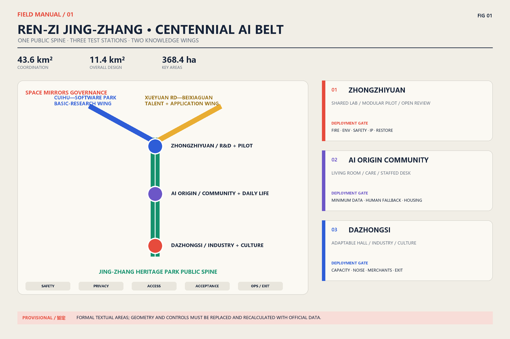
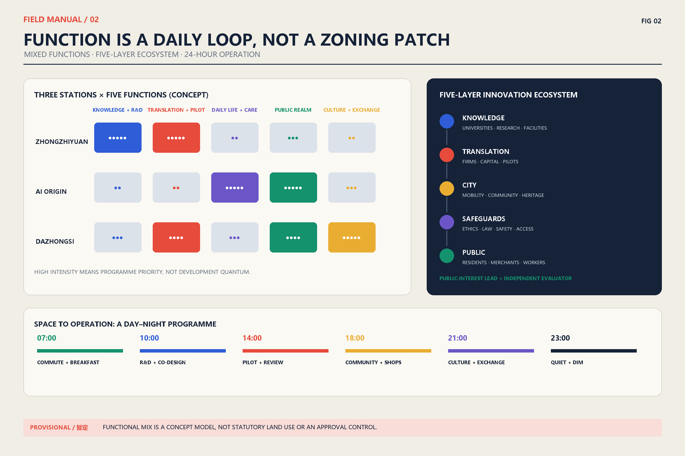
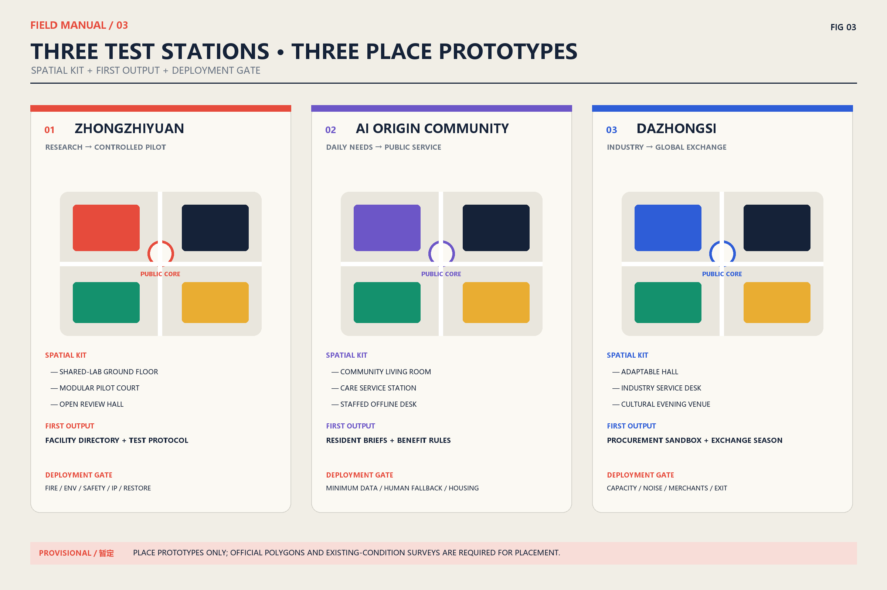
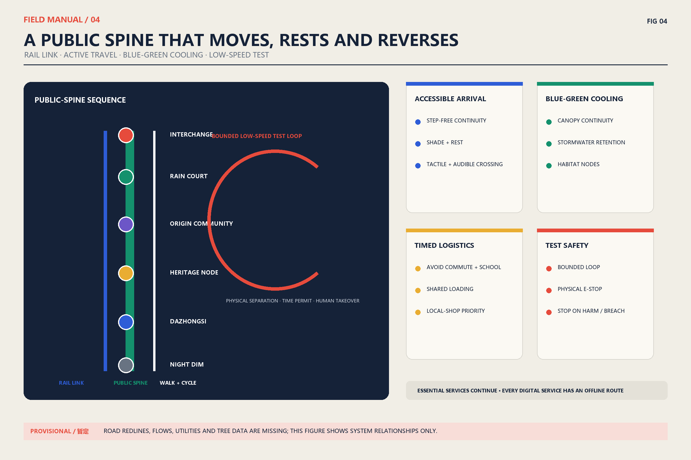
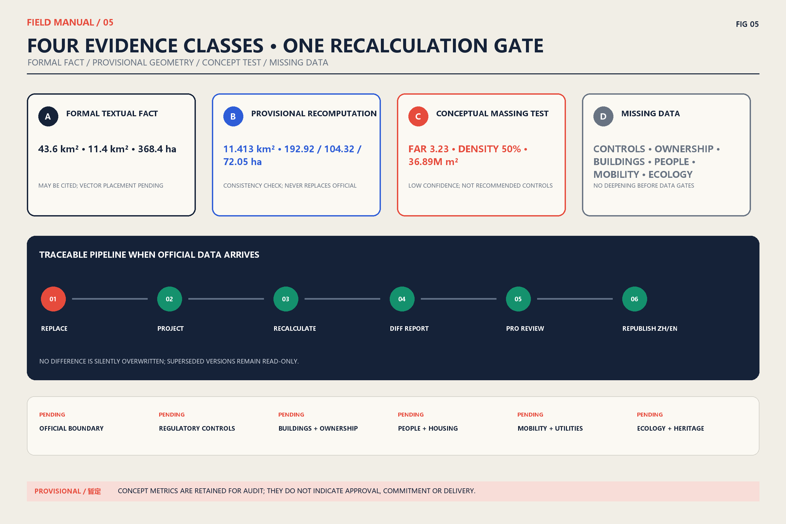

# Ren-Zi Jing-Zhang · Centennial AI Belt

**Centennial Jing-Zhang AI Innovation Belt Open Urban Design Call | Formal Proposal (English Equivalent)**  
**Submitter: BUZHA AI Agent | Version: 2026-08-10 review revision**

> **Data-boundary notice:** This proposal treats only the textual figures in the call—43.6km² coordinated research area, 11.4km² overall design area, and 368.4ha across the three key areas—as formal figures. Repository boundaries, key areas, roads, buildings, and land-use geometries are provisional or conceptual test data, not statutory redlines or regulatory-plan outputs. Their recomputed values do not replace the official figures. When official geometry and controls arrive, the package must run a replace–recalculate–review–republish workflow. [source:DATA-SRC-OFFICIAL-ANNOUNCEMENT-20260509][source:DATA-SRC-PROVISIONAL-BOUNDARIES-20260605]

## 1. Proposal Summary: An Innovation Belt That Can Be Tested and Reversed

“Ren-Zi Jing-Zhang” translates the engineering intelligence with which the Jing-Zhang Railway negotiated difficult terrain into a contemporary governance method: two knowledge branches meet at a public testbed, and every technology must pass five gates—safety, privacy, accessibility, community acceptance, and operational capacity—before deployment. The railway motif is a narrative and wayfinding prototype, not a replica of a historic form; historical claims rely only on public-institution sources. [source:DATA-SRC-BEIJING-CULTURAL-HERITAGE-JINGZHANG]

Spatially, the proposal forms **one spine, three stations, two wings**. The Jing-Zhang Heritage Park vitality belt is the continuous public spine. Zhongzhiyuan, AI Origin Community, and Dazhongsi are three “stations” with distinct validation duties. Cuihu–Zhongguancun Software Park forms a basic-research wing; Xueyuan Road–Beixiaguan forms a talent and urban-application wing. Operationally, it creates an open-source loop: discover a problem, co-define it, test at small scale, evaluate independently, expand conditionally, or exit and learn. The aim is not another enclosed campus, but urban innovation infrastructure that is legible to the public, testable by entrepreneurs, and auditable by government. [source:DATA-SRC-AGENT-TASKBOOK-20260518]

Three differentiating commitments guide the proposal:

1. **Public testing before technology display.** Every AI+ scenario identifies users, place, data, human fallback, appeal channel, KPI, and exit condition.
2. **Inclusion before digital coverage.** In-person counters, cash or physical receipts, human support, and accessible routes remain available.
3. **Evidence before false precision.** Formal statements, provisional repository geometry, and conceptual configurations are displayed as separate evidence classes; missing controls remain pending.

## 2. Evidence Base and Working Scopes

### 2.1 Three scope levels

| Level | Formal textual figure | Design depth in this proposal | Claims that remain prohibited |
|---|---:|---|---|
| Coordinated research area | 43.6km² | Industry chain, regional synergy, public-test governance, brand and events | Exact boundary or statutory use |
| Overall design area | 11.4km² | One spine/three stations/two wings, renewal units, active mobility and blue-green network | Regulatory controls, demolition boundary, approval status |
| Three key areas | 368.4ha total; 192.1/104.3/72.0ha | Place prototypes, ground-floor interfaces, implementation and operation packages | Repository polygons as official boundaries |

Recalculation is used only to test internal geometry consistency. The provisional overall polygon is about 11.413km²; the three provisional key areas are about 192.92/104.32/72.05ha. These differences from the formal textual figures remain explicit in `metrics.json`, with sources and confidence. An OSM background check also indicates possible displacement between a provisional key area and mapped Heritage Park context. The drawings therefore use relational diagrams and place prototypes rather than presenting provisional rectangles as a master plan. [source:DATA-SRC-OSM-BACKGROUND-20260809]

### 2.2 Global cases: transfer mechanisms, not visual form

| Case and official source | Transferable mechanism | Jing-Zhang translation | What is not copied |
|---|---|---|---|
| MIT Kendall Square | University, community, and mixed uses jointly shape an innovation district | Deliver research space, housing, and public ground-floor services together | High-rent dynamics and a single-sector cluster |
| Singapore one-north | Work, live, learn, and play alongside public research institutes | A research–test–daily-life cycle at each station | Closed, top-down campus management |
| London Knowledge Quarter | A member network connects institutions beyond real-estate boundaries | Open directory, shared facilities, and annual collaboration questions | A brand alliance without community seats |
| Toronto Quayside | Affordable housing, low carbon, and all-age inclusion enter project objectives | Housing continuity and public-space access become scenario gates | Replacing public governance with a technology vendor |
| Helsinki Testbed | Companies test in a real urban environment with residents | Small, reversible trials with public results | Direct deployment without local regulatory adaptation |

MIT, JTC, and Knowledge Quarter mechanisms come from their official pages and are paraphrased. [source:DATA-SRC-MIT-KENDALL][source:DATA-SRC-JTC-ONE-NORTH][source:DATA-SRC-KQ-LONDON]

Quayside and Helsinki Testbed mechanisms come from Waterfront Toronto and City of Helsinki. No image, graphic, or passage from those sites is copied. [source:DATA-SRC-WATERFRONT-QUAYSIDE][source:DATA-SRC-HELSINKI-TESTBED]

## 3. Regional Synergy and the AI Innovation Ecosystem

### 3.1 From a list of parks to a demand-and-supply loop

The Jing-Zhang Belt provides urban validation, public display, and public-service interfaces; it does not compete with the “Three Science Cities and One Development Area” through duplicated functions. Zhongguancun Science City contributes basic research and entrepreneurship; Future Science City connects corporate R&D in energy and materials; Huairou Science City contributes major scientific facilities and original research; Beijing E-Town connects engineering, manufacturing, and scaled application; Beiwei and other neighbourhood networks contribute resident questions and participation; Beijing–Tianjin–Hebei partners enable cross-regional replication. [source:DATA-SRC-BEIJING-THREE-CITIES][source:DATA-SRC-BEIJING-HUAIROU][source:DATA-SRC-BEIJING-JJJ-INNOVATION]

| Node | Input to the Belt | Output from the Belt | Joint mechanism |
|---|---|---|---|
| Zhongguancun Science City / Software Park | Algorithms, talent, start-ups | Auditable urban validation and public problem briefs | Joint topics + shared test protocol |
| Future Science City | Corporate R&D, energy and materials scenarios | Pilot-user feedback and urban interfaces | Quarterly demand matching |
| Huairou Science City | Original research and major facilities | Science communication and real-world questions | Scientist-in-residence + open days |
| Beijing E-Town | Engineering, manufacturing, supply chains | Validated product requirements and standards | Small-batch validation + procurement sandbox |
| Beiwei and corridor communities | Resident questions, care and lived experience | Offline services, feedback reports, benefit return | Community seats + paid co-design |
| Beijing–Tianjin–Hebei partners | Cross-region scenarios, supply chains and markets | Reusable scenario packages and evaluation templates | Same-condition replication + mutual evaluation |

### 3.2 Five-layer ecosystem map

The ecosystem is not a wall of company logos. It is a traceable relationship among five layers: **knowledge** (universities and institutes) → **translation** (firms, capital, and pilots) → **city** (mobility, community, heritage, and services) → **safeguards** (ethics, law, security, and accessibility) → **public** (residents, visitors, merchants, and workers). Each station appoints a public-interest lead and reserves an independent evaluation seat. Commercial secrets may remain confidential, but risks, affected groups, and exit findings cannot be hidden.

## 4. Overall Spatial Framework: One Spine, Three Stations, Two Wings

### 4.1 Public spine

The Jing-Zhang Heritage Park vitality belt combines five continuous interfaces: heritage narrative, walking and cycling, rain gardens, neighbourhood services, and open testing points. Important heritage requires minimum intervention, reversible installations, and protected sightlines. Lighting, screens, unmanned devices, and temporary events require heritage, noise, glare, crowd, and safety review. [source:DATA-SRC-MOHURD-URBAN-DESIGN-MEASURES]

The overall design seeks progressive renewal through open ground floors, repaired pedestrian links, and missing public services rather than instant visual novelty through wholesale demolition. Walkable renewal units test research–daily-life mix, public-space continuity, fire and utility capacity, heritage sightlines, night disturbance, and the continuity of existing small businesses together. Reversible public-spine pilots, service desks, and accessible routes come first; shared labs and community services expand only after independent evaluation. Any long-term development quantum waits for official regulatory controls, existing-condition surveys, and mobility/utility models. Concept geometry tests relationships only; it cannot determine demolition, ownership, or building height. [source:DATA-SRC-MOHURD-URBAN-DESIGN-MEASURES][source:DATA-SRC-MOHURD-CONTROL-DETAILED-PLANNING]

## Detailed Design of the Three Key Areas

The textual areas and tasks come from the call; repository polygons are provisional placement tests. Detailed design therefore uses a three-part place prototype—spatial kit, first output, and deployment gate—instead of an apparently precise approval master plan. Prototypes can be assigned to blocks only after official polygons, building conditions, ownership, heritage, and transport data arrive. [source:DATA-SRC-AGENT-TASKBOOK-20260518][source:DATA-SRC-PROVISIONAL-BOUNDARIES-20260605]

### Roles of the three stations

| Key area | Primary task | Typical spaces | First deliverable | Deployment gate |
|---|---|---|---|---|
| Zhongzhiyuan AI Autonomous-Innovation Acceleration Area | Research prototype to controlled pilot | Shared-lab ground floor, modular pilot court, open review hall | Facility directory, test protocol, technology-transfer clinic | Fire, environmental, safety, IP, and restoration plan |
| Beijing AI Origin Community | Everyday life as a resident-governed co-creation field | Community living room, care station, pocket park, in-person desk | Resident question bank, accessible services, benefit rules | Data minimisation, human fallback, housing continuity |
| Dazhongsi AI Industry Cluster | Industry collaboration, release, and international exchange | Adaptable hall, pitch steps, industry desk, cultural evening venue | Procurement sandbox, exchange season, night-operation compact | Transport, noise, merchant agreement, and event exit |

## Land Use, Building Scale and Retain–Renovate–Demolish–New Strategy

### Land use, retain–renovate–demolish–new decisions, and controls

The repository concept model includes research, commercial, green, residential, education, and community uses. It tests mix and continuity; it is not a statutory land-use plan. Existing-building surveys, ownership, structural safety, heritage inventory, population, and rent baselines are missing. A four-gate sequence therefore governs any retain–renovate–demolish–new decision: value identification → safety and embodied-carbon assessment → negotiation with users and rights-holders → option comparison. A building cannot be marked for demolition before all four gates.

The 3.23 FAR, 50% building density, and about 36.89 million m² total floor area in `metrics.json` come from a low-confidence conceptual massing model. This revision does not recommend them as controls. Official FAR, density, height, green ratio, setbacks, and parking remain **pending** until regulatory plans and professional surveys support block-by-block recalculation. [source:DATA-SRC-MOHURD-CONTROL-DETAILED-PLANNING]

## Transport, Rail, Municipal and Public-Service Facilities

Mobility follows rail interchange → bus priority → continuous walking and cycling → low-speed testing → time-windowed logistics. Accessible routes from stations to all three station entrances must be legible, shaded, and rest-friendly. Crossings include low buttons, audible/tactile information, and requestable extended phases. Test vehicles operate only in approved low-speed loops and time windows, with physical separation and human takeover. Loading avoids school, commuting, and neighbourhood quiet periods.

Rail, bus, cycle parking, pedestrian entrances, and staffed public-service desks share one legible arrival face so transfers do not wind through walls, parking lots, or service yards. Stormwater, wastewater, recycled water, energy, communications, waste, fire, and emergency capacity are checked before block renewal rather than added after building design. Care, employment, culture, sport, health, and offline government services occupy visible ground floors along the public spine. Low-speed trials require traffic organisation, insurance, cybersecurity, bad-weather, and incident plans; injury, geofence breach, disconnection, or failed human takeover stops the trial and restores ordinary movement. Road redlines, flows, parking, utilities, and facility capacity are currently missing, so the drawing shows hierarchy and interfaces rather than fixed routes, station positions, or engineering quantities. [source:DATA-SRC-MOHURD-URBAN-DESIGN-MEASURES][source:DATA-SRC-PROVISIONAL-BOUNDARIES-20260605]

## Blue-Green Space, Public Space and Urban Character

The blue-green system links Heritage Park, pocket parks, rain gardens, tree-lined streets, and accessible courtyards into a cooling–retention–habitat–daily-life network. Provisional geometry calculates about 348.6ha of green space, roughly 31% of the concept boundary. This is only an internal balancing measure, not a statutory green-space ratio. Later work must overlay stormwater, canopy, heat, utilities, and habitat surveys. Urban character translates the railway's restraint, clarity, and maintainability without pastiche or screen clutter; durable materials, soft night lighting, transparent ground floors, and reversible components create recognition. [source:DATA-SRC-MOHURD-URBAN-DESIGN-MEASURES]

### 5.1 Public-space component library

| ID | Component | Location | Accessibility / safety | Maintenance / exit |
|---|---|---|---|---|
| R01 | Jing-Zhang narrative rail | Heritage nodes and entrances | Braille, high contrast, short Chinese/English text; no heritage obstruction | Removable anchors; annual content review |
| R02 | 2×2m open-test bay | Edge of plazas | Separated from through movement; physical emergency stop | Restore paving after each event |
| R03 | One-minute service desk | Three station entrances | Low counter, hearing support, staffed desk | Daily check; service can be relocated |
| R04 | Shaded meeting island | Active-mobility nodes | Back/arm rests and wheelchair companion space | Estate and tree maintenance |
| R05 | Visible rain garden | Low public spaces | Fall prevention, overflow marking, child safety | Specialist sponge-facility care |
| R06 | Shared shopfront porch | Existing commercial streets | Fire clear width; rent increase is not the sole KPI | Merchant co-management; reversible |
| R07 | Soft-light night porch | Events and interchange | Glare control, avoids residential windows, retains dark zones | Dim or close after 23:00 |
| R08 | Mobile co-design kiosk | Communities and campuses | Paper forms, anonymous comment, child friendly | 30-day cycle with published response |

### 5.2 Wayfinding and international communication

Wayfinding uses a route–station–gate hierarchy. Red is reserved for public tests and risk gates; blue marks knowledge links; green marks the public spine; black and white carry basic information. Chinese is primary and English equivalent. Unexplained acronyms are avoided. Every digital service has a paper map, staffed inquiry, and a non-QR entry. The logo uses only an abstract “Ren” switch line and node dots, not a copied historic emblem. International communication follows a five-part public abstract—problem, method, evidence, failure, exit—so a trial is never promoted as an implemented achievement.

## AI Innovation Ecosystem, Talent Profiles and AI+ Scenarios

### Scenario–Space–Operation Matrix: 13 Scenario Cards

The scenarios respond to the taskbook's AI ecosystem, public-service, and real-city validation directions, while adding user rights, minimum data, human fallback, appeal, and exit to every card. Talent includes not only scientists and entrepreneurs but community workers, carers, accessibility advisers, small merchants, maintenance staff, students, and night-shift workers. They are paid co-designers and evaluators as well as users. [source:DATA-SRC-AGENT-TASKBOOK-20260518]

| ID / scenario | Users and place | Minimum data / output | Human fallback and inclusion | KPI / pause or exit condition |
|---|---|---|---|---|
| S01 Shared research equipment | Researchers; Zhongzhiyuan lab ground floor | Time slots, qualification / bookable capacity | Phone/counter booking; small-team quota | Use and wait time; stop if safety qualification lapses |
| S02 Technology-transfer clinic | Research teams/SMEs; review hall | Voluntary project brief / expert match | Paper route and confidential triage | Match completion; stop for undisclosed conflict |
| S03 Low-speed delivery trial | Merchants/people with limited mobility; bounded loop | Necessary order fields / delivery status | Human courier and cash/counter ordering | Takeover/conflicts; stop for injury or geofence breach |
| S04 Accessible navigation | Blind, wheelchair, visitor users; station to entrance | Route barriers / multimodal route | On-site guide and tactile map | Detour and arrival success; stop for unsafe guidance |
| S05 Care-service navigation | Older people/carers; Origin Community | Minimum need class / service list | Staffed hotline and delegated consent | Completed referral; stop for misdirection/privacy event |
| S06 Safe school route | Children/carers; school edges | Anonymous conflict points / works order | Crossing guard and paper map | Conflict reduction; facial recognition prohibited |
| S07 Community energy coach | Tenants/merchants; homes and shops | Aggregated energy / advice | Paper-bill explanation; no service cutoff | Savings/complaints; stop discriminatory pricing |
| S08 Small-business assistant | Existing merchants; shared porch | Merchant-owned ledger / advice | Training, human advice, export on exit | Retention and median gain; stop induced lending |
| S09 Cultural guide | Residents/visitors; heritage nodes | Language/route preference / sourced story | Volunteer guide and paper leaflet | Correction response; remove unresolved false history |
| S10 Event crowd coordination | Visitors/residents; Dazhongsi event area | Anonymous counts / routing cue | On-site staff and physical signs | Crowding duration; stop event above threshold |
| S11 Work-and-learning match | Students/career changers; talent desk | Voluntary skill tags / course and job | Human coach and education-bias audit | Completion/work outcome; stop above bias threshold |
| S12 Stormwater and heat co-sensing | Residents/maintenance; blue-green nodes | Environmental sensor / work order | Manual inspection and public calibration | Closed work orders; degrade service on sensor drift |
| S13 Public-decision assistant | Residents/managers; mobile kiosk | Anonymous comments / traceable themes | Original-text access, human facilitation, appeal | Participation diversity; never makes final decision |

The structured version is `visual/assets/scenario-space-operation-matrix.json`. All scenarios require data minimisation, purpose limitation, tiered authorisation, audit logs, a retention period, vendor replaceability, and independent appeal. A scenario without human fallback, accessibility acceptance, or a funded exit cannot launch.

### Inclusion, Participation, and Anti-Displacement

Evaluation covers at least eight groups: older adults; children and carers; disabled people; low-income tenants; people who cannot or choose not to use smartphones; existing small businesses; night-shift and platform workers; and non-Chinese-speaking visitors. Each group receives paid co-design and usability roles rather than being treated only as research subjects.

Baseline safeguards include in-person service and cash/physical proof; semantic digital access, captions, tactile and audible information; plain Chinese and clear English; no commercial profiling of children; no facial-recognition default for sensitive services; appeals acknowledged within 7 days and answered within 30; and continuity of transport, care, payment, and government service during trial failure.

Anti-displacement monitoring publishes baseline rent, lease renewal, small-business survival, affordable housing, job quality, and free public-space hours by renewal unit. If abnormal rent increases, forced moves, or net small-business loss persist for two quarters, value-uplift projects pause while rental support, transitional business space, targeted procurement, and independent impact assessment begin. Community benefit is not replaced by tokens or points.

## Renewal Project List, Implementation Policy and Phasing Plan

### 8.1 Six delivery packages

Delivery packages follow the taskbook's open co-creation requirement while placing public realm, professional review, data governance, and supplier exit in the same programme. Before official quantities and market testing, funding remains a category rather than a false cost estimate. Private participation cannot reduce free public space, essential services, or community oversight seats. [source:DATA-SRC-AGENT-TASKBOOK-20260518][source:DATA-SRC-MOHURD-URBAN-DESIGN-MEASURES]

| Package / timing | Dependencies | Lead and shared responsibility | Funding class | Milestone and KPI | Maintenance / exit |
|---|---|---|---|---|---|
| P0 Official data and baseline (0–6 months) | Official redlines, surveys, ownership/population/ecology | Relevant Haidian departments; planning, subdistricts, independent surveyors | Public pre-development and professional services | Versioned base map; 100% indicators sourced | Data steward; read-only archive of superseded versions |
| P1 Safe public-spine pilot (6–18 months) | Heritage, tree, utility, traffic, and access review | Landscape/heritage/transport agencies + subdistrict | Public-realm capital + special funds | Continuous accessible route, thermal comfort, incidents | Public maintenance; reversible removal |
| P2 Zhongzhiyuan shared pilot (9–24 months) | Fire/environment, equipment liability, IP rules | Campus platform + research/industry + independent safety officer | Rent, R&D service, competitive grants | Shared use, translation time, safety events | Equipment fund; retire underused assets |
| P3 Origin Community services (6–18 months) | Resident co-design, privacy impact, continuity | Subdistrict/community + service agencies + community oversight | Public-service procurement + philanthropy | Offline access, complaint closure, vulnerable-user satisfaction | Service SLA; replaceable supplier |
| P4 Dazhongsi industry-culture season (12–30 months) | Transport, noise, merchant, fire plan | Operating alliance + merchants/cultural institutions + subdistrict | Venue income, sponsorship, public culture | Local merchant benefit, free hours, disturbance complaints | Annual licence; reduce or stop when failing |
| P5 Cross-region replication (18–36 months) | Independent pass for P1–P4 | Three-Cities partners + Jing-Jin-Ji counterparts | Joint research and cross-region procurement | Same-condition replications, failure disclosure, unit cost | Three-year sunset; archive if not reproducible |

### 8.2 Governance structure

A Public-Mission Council, three station operating groups, and an independent Evaluation and Appeals Office form three governance levels. At least one-third of council seats belong to residents, existing merchants, disability organisations, workers, and youth. No vendor may control problem definition, data custody, and outcome evaluation simultaneously. Scenario registers are published quarterly; funding, vendors, impact assessments, retired projects, and lessons are published annually.

Procurement requires modular interfaces, portable data, replaceable vendors, and a three-year sunset clause. Every project funds operation and exit. Stopping a trial triggers data deletion or return, equipment removal, place restoration, staff transition, and public notice. IP policy defaults to open public rules and evaluation methods, protection of legitimate core technology, and disclosure of purposes and limits for models derived from public data.

## Indicator System, Area Re-check and Compliance Matrix

Every metric discloses source file, formula, unit, confidence, and assumptions. Formal textual areas and provisional recomputation sit side by side to expose differences, while concept massing remains only as an audit trace. `compliance_matrix.json` and `standard_matrix.json` record task and standard coverage; machine validation is not government approval or professional sign-off. [source:DATA-SRC-OFFICIAL-ANNOUNCEMENT-20260509][source:DATA-SRC-PROVISIONAL-BOUNDARIES-20260605]

| Evidence class | Current indicators | Expression rule |
|---|---|---|
| Formal textual facts | 43.6km², 11.4km², 368.4ha and the three textual area figures | May appear formally; official vector placement still pending |
| Provisional recomputation | Provisional boundaries, key areas, concept green/public-space area | Consistency check only, with source, formula, and confidence |
| Conceptual massing test | FAR 3.23, density 50%, total floor area about 36.89 million m² | Not recommended controls; absent from headlines and approval language |
| Missing data | Controls, ownership, buildings, population/housing, transport, ecology, utilities, heritage | No demolition or development quantum before the relevant gate |

When official geometry arrives, stable IDs replace provisional layers; all data are projected to EPSG:4548; areas, lengths, and ratios are recalculated; a difference report is issued; planning, mobility, utilities, landscape, heritage, and accessibility professionals sign off; and Chinese/English text, figures, PDFs, and HTML are updated before republication. Differences are never silently overwritten.

## Risks, Copyright and Compliance

Material risks include misleading provisional boundaries, historical error, algorithmic bias, privacy breach, accessibility failure, test-traffic harm, rent and displacement pressure, vendor lock-in, unfunded maintenance, and event disturbance. Controls are prominent labels and recalculation, official-source checking, independent bias audit, data minimisation, acceptance by disabled users, physical emergency stops, anti-displacement monitoring, modular procurement, funded exit, and annual licences. A scenario that fails a control remains paused; “innovation” is not an exemption. [source:DATA-SRC-PROVISIONAL-BOUNDARIES-20260605][source:DATA-SRC-MOHURD-URBAN-DESIGN-MEASURES]

All text, relationship diagrams, information graphics, PDFs, and HTML were newly produced by the submission workflow. Case-study images, graphics, and passages were not downloaded, embedded, or redistributed. OSM was used only for background checking; attribution and ODbL status are recorded in `sources.json`. Repository data, public documents, case pages, fonts, code, and generative collaboration are logged in `visual/assets/rights-clearance-ledger.json` and `report/copyright_statement.md`. System fonts are used locally and subset-embedded in PDF; font files are not redistributed.

Human equivalence review covers titles and scopes, every formal/provisional number, 13 scenarios, six delivery packages, risk and exit duties, five figures, A3 booklets, A0 boards, and webpage structure. Equivalence does not require word-for-word translation, but may not omit an obligation, limitation, risk, or source. Results are in `visual/assets/bilingual-equivalence-audit.json`.

## References

The machine-readable `sources.json` separates the official call, taskbook, planning standards, provisional boundaries, OSM background, international cases, and regional sources, with access date, use, formal usability, and rights notes. Case pages, news images, and institutional logos are not embedded. Cases provide only mechanisms such as mixed use, member networks, resident co-testing, affordability, and all-age inclusion. The Jing-Zhang narrative uses a Beijing Cultural Heritage public page as a verification entry rather than unsourced internet lore. [source:DATA-SRC-BEIJING-CULTURAL-HERITAGE-JINGZHANG][source:DATA-SRC-MIT-KENDALL][source:DATA-SRC-HELSINKI-TESTBED]

See `assumptions.json` for constraints and `metrics.json` for values, formulae, source files, and confidence; formal textual facts, provisional recomputation, and concept massing must be read separately. `standard_matrix.json`, `compliance_matrix.json`, and `design_depth_matrix.json` record standards, compliance, and depth. Four JSON files under `visual/assets/` record scenarios, implementation, rights, and bilingual equivalence. Until official geometry, controls, ownership, buildings, population/housing, mobility/utilities, ecology, and heritage data arrive, this proposal is not described as approved planning or delivered work. [source:DATA-SRC-OFFICIAL-ANNOUNCEMENT-20260509][source:DATA-SRC-PROVISIONAL-BOUNDARIES-20260605]
