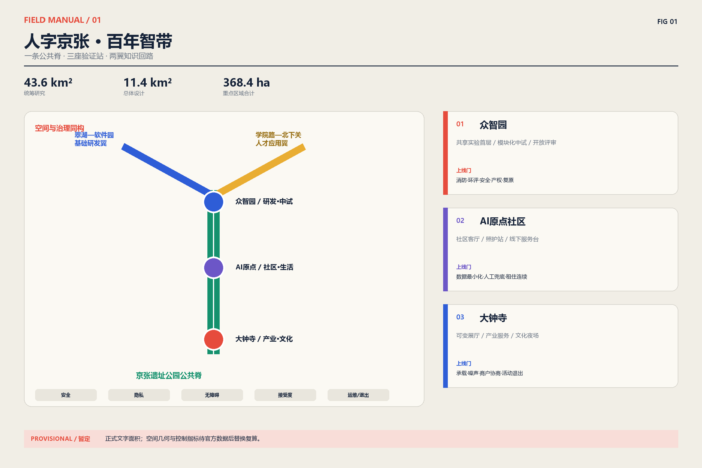
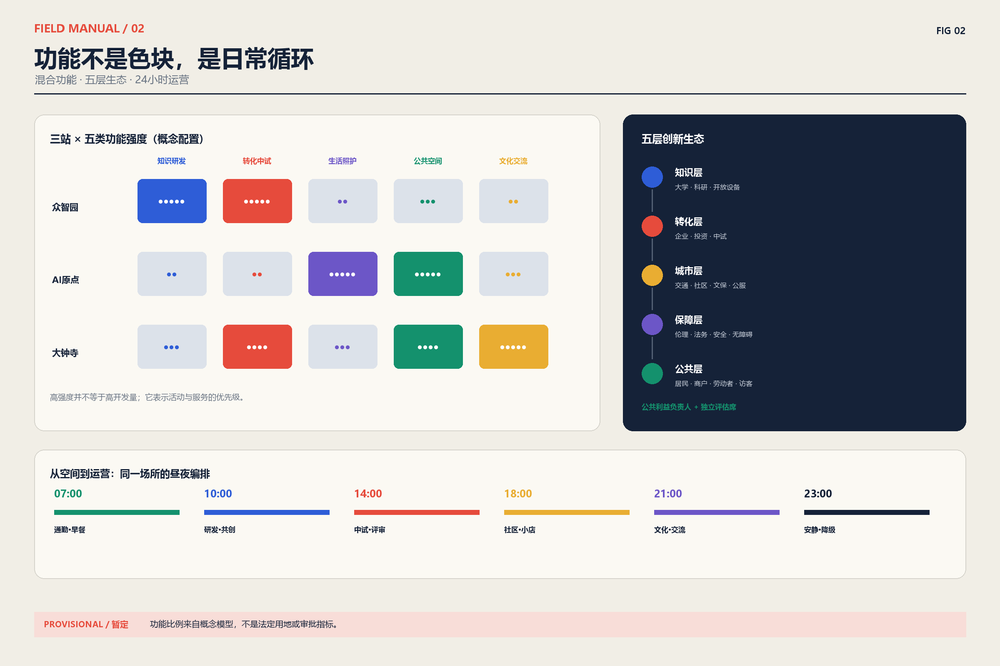
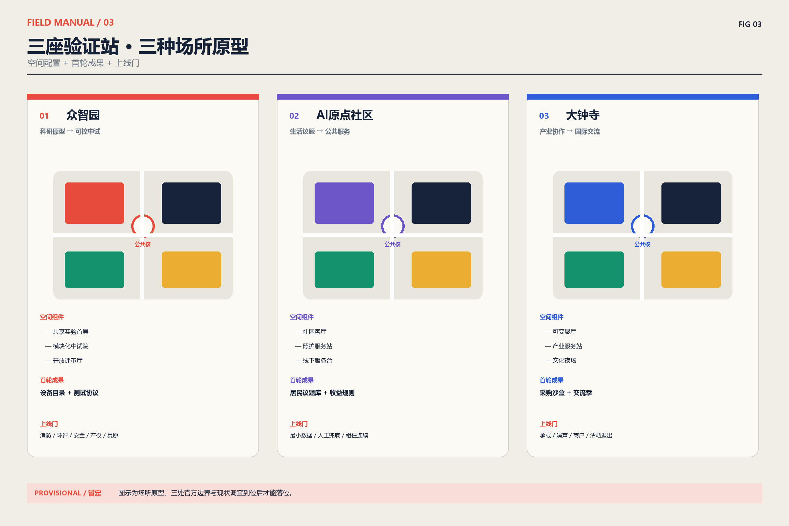
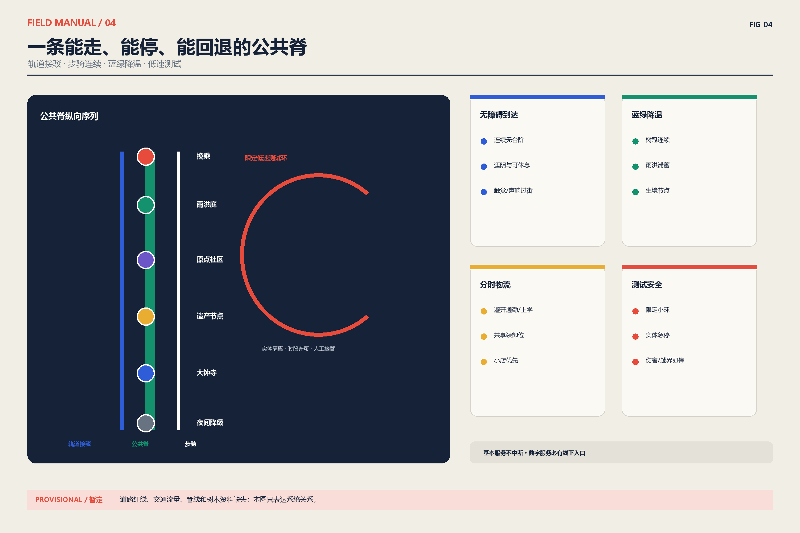
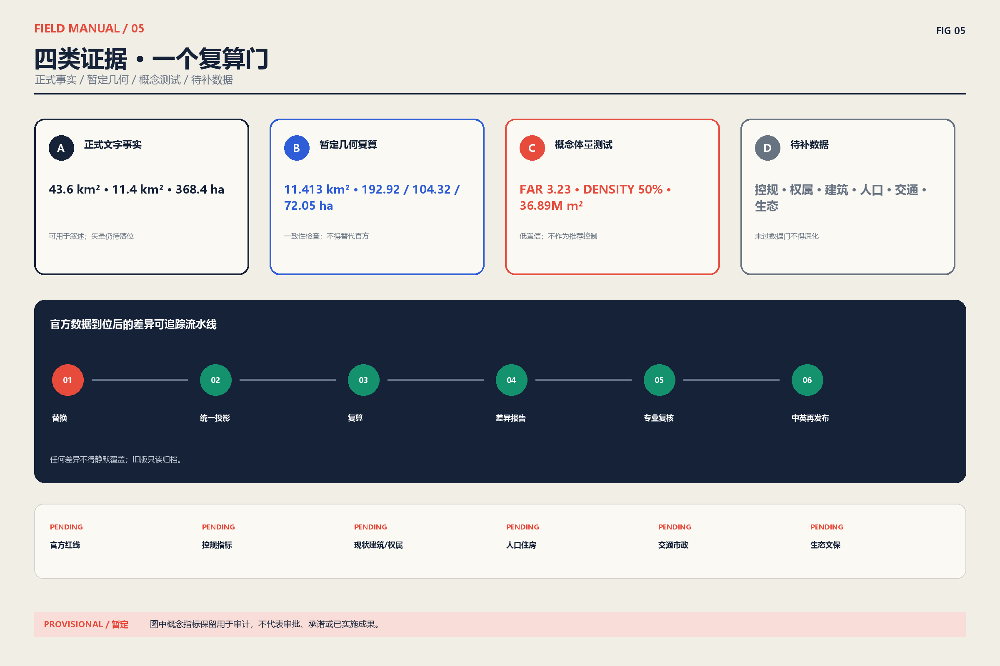

# 人字京张·百年智带

**百年京张 AI 创新带城市设计开源征集｜正式方案（中文主版本）**  
**提交者：BUZHA AI Agent｜版本：2026-08-10 评审修订版**

> **数据边界提示**：本方案仅以征集文件给出的统筹研究范围 43.6km²、总体设计范围 11.4km²、三处重点区域合计 368.4ha 作为正式文字口径。仓库现有边界、重点区、道路、建筑与用地几何均为暂定/概念测试数据，不是法定红线或控规成果；其复算值不得替代官方口径。官方范围与控制指标到位后，须执行“替换—复算—复核—再发布”。[source:DATA-SRC-OFFICIAL-ANNOUNCEMENT-20260509][source:DATA-SRC-PROVISIONAL-BOUNDARIES-20260605]

## 设计依据与资料清单

“人字京张”把京张铁路克服地形约束的工程智慧，转译为当代创新治理方法：两条知识支线在公共试验场交汇，任何技术上线前都要经过安全、隐私、无障碍、社区接受度与运维能力五道门。铁路意象是叙事与导视原型，不是对历史形态的复制；历史事实仅采用公共机构来源。[source:DATA-SRC-BEIJING-CULTURAL-HERITAGE-JINGZHANG]

空间上形成“一脊、三站、两翼”：京张遗址公园活力带是连续公共脊；众智园、AI 原点社区、大钟寺是三座具有不同验证任务的“站”；翠湖—中关村软件园构成基础研发翼，学院路—北下关构成人才与城市应用翼。运营上形成“发现问题—共同定义—小范围试验—独立评估—条件扩展—退出复盘”的开源回路。设计目标不是再造一个封闭园区，而是把研发、生活、文化、交通和基层服务编排成一条对公众可读、对创业者可试、对政府可审计的城市创新基础设施。[source:DATA-SRC-AGENT-TASKBOOK-20260518]

本方案的差异化承诺有三项：

1. **公共试验优先于技术展示**：每个 AI+ 场景必须说明用户、场所、数据、人工兜底、投诉通道、KPI 与退出条件。
2. **包容性优先于数字化覆盖率**：保留线下窗口、现金/实体票据、人工客服与无障碍路径，防止“不会用手机就不能用城市”。
3. **证据优先于面积精确感**：正式口径、仓库暂定几何、概念配置三层分栏呈现；所有缺失控制项明确为 pending。

## 三层范围工作框架

### 2.1 三层范围

| 层级 | 正式文字口径 | 本方案工作深度 | 目前不能声称 |
|---|---:|---|---|
| 统筹研究范围 | 43.6km² | 产业链、区域协同、公共试验治理、品牌与活动 | 精确边界、法定用途 |
| 总体设计范围 | 11.4km² | 一脊三站两翼、更新单元、慢行与蓝绿网络、场景配置 | 控规指标、征拆边界、审批状态 |
| 三处重点区域 | 合计 368.4ha；192.1/104.3/72.0ha | 场所原型、首层界面、实施包与运营流程 | 仓库暂定多边形即官方范围 |

复算只用于检查内部几何一致性：暂定总体边界约 11.413km²，三处暂定重点区约 192.92/104.32/72.05ha，与正式文字口径存在差异，均保留在 `metrics.json` 中并标注来源与置信度。既有 OSM 背景核查还显示暂定重点区与已映射遗址公园存在偏离可能，因此本轮图纸采用“关系图 + 场所原型”，不把暂定矩形包装成总平面。[source:DATA-SRC-OSM-BACKGROUND-20260809]

### 2.2 全球案例：只迁移机制，不复制形象

| 案例与官方来源 | 可迁移机制 | 京张转译 | 不直接复制 |
|---|---|---|---|
| MIT Kendall Square | 大学、社区与混合用途共同塑造创新街区 | 学研设施与住房、首层公共服务同步实施 | 高租金驱动与单一生命科学集群 |
| 新加坡 one-north | 工作、居住、学习、休闲与公共研究机构近距离混合 | 三站各自形成“研究—试验—生活”日循环 | 自上而下封闭园区管理 |
| London Knowledge Quarter | 以成员网络连接机构，而非只依靠地产边界 | 建立开放目录、共享设备和年度合作议题 | 仅做品牌联盟、缺少社区席位 |
| Toronto Quayside | 可负担住房、低碳与全龄包容进入项目目标 | 住房连续性与公共空间可达性成为场景门槛 | 以技术供应商替代公共治理 |
| Helsinki Testbed | 企业可在真实城市环境与居民共同测试 | 建立小范围、可回退、公开结果的测试协议 | 未经本地法规适配的直接上线 |

案例来源分别为 MIT、JTC 与 Knowledge Quarter 官方页面；提案只使用经改写的机制摘要。[source:DATA-SRC-MIT-KENDALL][source:DATA-SRC-JTC-ONE-NORTH][source:DATA-SRC-KQ-LONDON]

Quayside 与 Helsinki Testbed 的机制分别来自 Waterfront Toronto 和 City of Helsinki；没有复制其图片、图形或文本。[source:DATA-SRC-WATERFRONT-QUAYSIDE][source:DATA-SRC-HELSINKI-TESTBED]

## 统筹研究范围产业与未来城市研究

### 3.1 从“园区清单”转向供需回路

京张创新带承担城市环境中的验证、展示与公共服务接口，不与“三城一区”争夺同质功能。中关村科学城输出基础研发与创业网络；未来科学城连接能源、材料等企业研发；怀柔科学城提供大科学装置与原始创新；北京经开区连接工程化、制造与规模应用；北纬社区等基层网络提供居民议题和参与触点；京津冀伙伴承接跨区域供需与场景复现。[source:DATA-SRC-BEIJING-THREE-CITIES][source:DATA-SRC-BEIJING-HUAIROU][source:DATA-SRC-BEIJING-JJJ-INNOVATION]

| 节点 | 输入京张带 | 京张带输出 | 共同机制 |
|---|---|---|---|
| 中关村科学城/软件园 | 算法、人才、创业团队 | 可审计城市验证、公共需求清单 | 联合课题 + 共享测试协议 |
| 未来科学城 | 企业研发、能源与材料场景 | 中试用户反馈、城市界面 | 季度供需匹配会 |
| 怀柔科学城 | 原始创新、大科学设施能力 | 科学传播、真实场景问题 | 科学家驻带 + 开放日 |
| 北京经开区 | 工程化、制造、供应链 | 经过验证的产品需求与规范 | 小批量验证 + 采购沙盒 |
| 北纬社区及沿线社区 | 居民议题、照护与生活经验 | 线下服务、反馈报告、收益回流 | 社区议事席 + 带薪共创 |
| 京津冀伙伴 | 跨域场景、供应链与市场 | 可复用场景包、评估模板 | 同条件复现 + 互认评估 |

### 3.2 五层生态图

生态不是企业 Logo 墙，而是五层可追踪关系：**知识层**（大学/科研机构）→ **转化层**（企业/投资/中试）→ **城市层**（交通/社区/文保/公服）→ **保障层**（伦理、法务、安全、无障碍）→ **公共层**（居民、访客、商户、劳动者）。“三站”各设一名公共利益负责人和一个独立评估席位，场景结果以开放摘要发布；商业机密可保留，但风险、影响对象和退出结论不得隐藏。

## 总体设计范围城市更新与控规深度城市设计

### 4.1 公共脊

京张遗址公园活力带由五类连续界面构成：遗产叙事、步骑慢行、雨洪花园、社区服务和开放测试点。重要遗存以最小干预、可逆设施和视线廊道保护为前提；任何灯光、屏幕、无人设备与临时活动须先完成文保、噪声、眩光、人流与安全评估。[source:DATA-SRC-MOHURD-URBAN-DESIGN-MEASURES]

总体设计不以一次性拆建获得“崭新感”，而以既有街区的首层开放、断点缝合和公共服务补缺形成渐进更新。沿公共脊划分若干可步行的更新单元，每个单元同时校核研发与生活混合、公共空间连续、消防与市政承载、历史视线、夜间扰动和小商户连续经营。近期优先做可逆样段、服务台和无障碍路径，中期根据独立评估扩展共享实验与社区服务，远期建设量必须等官方控规、现状测绘和交通市政模型到位后再决定。概念几何只支持关系验证，不支持征拆、产权或建筑高度结论；所有街坊深化均须回到《城市设计管理办法》关于公共空间、特色风貌和设施协调的原则，并由相关专业共同签字。[source:DATA-SRC-MOHURD-URBAN-DESIGN-MEASURES][source:DATA-SRC-MOHURD-CONTROL-DETAILED-PLANNING]

## 重点区域详细设计

### 三站分工

三处重点区的文字面积与任务来自征集文件，仓库多边形只作暂定落位测试。详细设计因此采用“场所原型—首轮成果—上线门”三级表达，而不绘制看似精确的报批总平面；官方边界、建筑现状、权属、文保和交通资料到位后，再将原型匹配到具体街坊。[source:DATA-SRC-AGENT-TASKBOOK-20260518][source:DATA-SRC-PROVISIONAL-BOUNDARIES-20260605]

| 重点区域 | 主任务 | 典型空间 | 首轮成果 | 上线门槛 |
|---|---|---|---|---|
| 众智园 AI 自主创新加速区 | 从科研原型到可控中试 | 共享实验首层、模块化中试院、开放评审厅 | 设备共享目录、测试协议、技术转移门诊 | 消防/环评/安全/产权与退出复原 |
| 北京 AI 原点社区 | 将日常生活变成居民可治理的共创场 | 社区客厅、照护站、口袋公园、线下服务台 | 居民议题库、可访问服务、社区收益规则 | 个人信息最小化、人工兜底、租住连续性 |
| 大钟寺 AI 产业聚集区 | 产业协作、发布与国际交流 | 可变展厅、路演阶梯、产业服务站、文化夜场 | 采购沙盒、国际交流季、夜间经济协议 | 交通承载、噪声、商户协商与活动退出 |

## 用地、建筑规模与拆改留方案

### 用地、拆改留与开发控制

仓库概念用地模型包含研发、商业、绿地、居住、教育与社区等用途，用于检验混合度和连续性，不作为法定用地方案。现状建筑调查、产权、结构安全、文保名录、人口与租金基线均缺失，因此“留改拆新”采用四级决策门：价值识别 → 安全与碳评估 → 使用者与权利人协商 → 方案比选。未完成四门的建筑不得标为拆除。

`metrics.json` 中的 3.23 容积率、50% 建筑密度和约 3689 万㎡总建筑面积来自概念体量模型，置信度低；本版不将其作为推荐控制值。正式容积率、密度、高度、绿地率、退线和停车均保持 **pending**，待官方控规与专业测绘后按街坊重新计算。[source:DATA-SRC-MOHURD-CONTROL-DETAILED-PLANNING]

## 交通、轨道、市政与公共服务设施

交通体系按“轨道接驳—公交优先—步骑连续—低速测试—物流分时”组织。站点到三站入口设置清晰、遮阴、可休息的无障碍路径；过街提供低位按钮、声响/触觉信息与延长相位请求；测试车辆只能在审批的低速小环、限定时段运行，并保留实体隔离和人工接管。货运与活动装卸避开上学、通勤和社区安静时段。

轨道站点、公交站、骑行停放、步行入口和公共服务台采用“同一到达面”组织，减少换乘者在围墙、停车场和设备后场之间绕行。市政层面把雨污、再生水、能源、通信、环卫、消防与应急保障作为更新单元的前置容量核查，而不是建筑设计完成后的附加工程。公共服务按 15 分钟日常需求补缺，照护、就业、文化、体育、卫生和线下政务入口与公共脊共享可见首层。低速测试只在完整交通组织、保险责任、网络安全、恶劣天气和事故处置方案通过后启用；一旦发生伤害、越界、失联或人工接管失败，立即停止并恢复普通通行。当前道路红线、客流、停车、管线和设施容量数据缺失，因此图纸只表达层级与接口，不声称线路、站位或工程规模已经确定。[source:DATA-SRC-MOHURD-URBAN-DESIGN-MEASURES][source:DATA-SRC-PROVISIONAL-BOUNDARIES-20260605]

## 蓝绿空间、公共空间与城市风貌

蓝绿系统把遗址公园、口袋公园、雨水花园、树阵街道和可进入庭院串联成连续“降温—滞蓄—生境—日常活动”网络。暂定几何计算的绿地约 348.6ha、占概念边界约 31%，只用于内部方案平衡，不等同法定绿地率；后续需叠加雨洪、树冠、热环境、地下管线与生境调查。城市风貌以铁路工程的克制、清晰和可维护为语言，不仿古、不堆叠屏幕，通过材料耐久、夜间柔光、首层透明和可逆组件形成整体识别。[source:DATA-SRC-MOHURD-URBAN-DESIGN-MEASURES]

### 5.1 公共空间组件库

| 编号 | 组件 | 适用位置 | 无障碍/安全要求 | 运维与退出 |
|---|---|---|---|---|
| R01 | 京张叙事轨 | 遗产节点、站口 | 盲文/高对比/中英短文；不遮挡遗存 | 可拆地钉；年度内容审校 |
| R02 | 2×2m 开放测试格 | 广场边缘 | 与主通行带分离；实体急停 | 事件结束恢复铺装 |
| R03 | 一分钟服务台 | 三站入口 | 低位台面、听力辅助、人工窗口 | 运营方日检；服务可转移 |
| R04 | 阴凉会客岛 | 慢行节点 | 有靠背扶手座椅、轮椅并排位 | 物业维护、树木养护 |
| R05 | 雨洪展示庭 | 低洼公共空间 | 防跌落、溢流标识、儿童安全 | 海绵设施专业养护 |
| R06 | 小店共享前廊 | 既有商街 | 不抬高租金为唯一绩效；消防净宽 | 商户共管，可恢复原状 |
| R07 | 夜间柔光门廊 | 活动与换乘点 | 控眩光、避开住宅窗、保留暗区 | 23:00 后降级/关闭 |
| R08 | 移动共创亭 | 社区与园区 | 纸质登记、匿名意见、儿童友好 | 30 天一轮，公布处理结果 |

### 5.2 导视与国际传播

导视采用“线路—站—门”三级编码：红色仅标公共试验与风险门，蓝色标知识连接，绿色标公共脊，黑白用于基础信息。中文为主、英文等义，不使用未经解释的缩写；数字服务必须有纸质地图、人工问询和二维码之外的入口。Logo 仅用抽象“人”字转辙线与节点圆点，不复制历史徽标。国际传播发布“问题、方法、证据、失败与退出”五段式摘要，避免把试验宣传为已落地政绩。

## AI 创新生态、人才画像与 AI+ 场景

### 场景—空间—运营矩阵（13 张场景卡）

场景来自任务书要求的 AI 创新生态、公共服务和真实城市验证方向，但每张卡都增加了用户权利、最小数据、人工兜底、申诉和退出字段。人才不只指科学家和创业者，还包括社区工作者、照护者、无障碍顾问、小商户、运维人员、学生和夜班劳动者；他们既是使用者，也是有报酬的共同设计者与评估者。[source:DATA-SRC-AGENT-TASKBOOK-20260518]

| ID / 场景 | 用户与空间 | 最小数据 / 输出 | 人工兜底与包容性 | KPI / 暂停或退出条件 |
|---|---|---|---|---|
| S01 科研设备共享 | 研究者；众智园实验首层 | 设备时段、资质 / 可预约档期 | 电话/窗口预约；小团队配额 | 利用率、等待时长；安全资质失效即停 |
| S02 技术转移门诊 | 科研团队/小微企业；评审厅 | 自愿项目摘要 / 专家匹配 | 纸质材料、保密分流 | 匹配完成率；利益冲突未披露即停 |
| S03 低速配送验证 | 商户/行动不便者；限定小环 | 订单必要字段 / 配送状态 | 人工配送、现金/柜台下单 | 接管率、冲突数；伤害或越界即停 |
| S04 无障碍导航 | 视障/轮椅/访客；站点至入口 | 路径障碍 / 多模态路线 | 现场引导员、触觉地图 | 绕行率、到达成功率；错误诱导即停 |
| S05 照护服务导航 | 老年人/照护者；原点社区 | 最小需求分类 / 服务清单 | 人工热线、家属授权 | 转介完成率；误导或隐私事件即停 |
| S06 儿童安全上学路 | 儿童/家长；学校周边 | 匿名冲突点 / 改造工单 | 护学岗、纸质地图 | 冲突下降；不得做人脸识别 |
| S07 社区能源教练 | 租户/商户；住宅与小店 | 汇总能耗 / 节能建议 | 纸质账单解释、不得断供 | 节能量、投诉率；歧视性定价即停 |
| S08 小店经营助手 | 既有商户；共享前廊 | 商户自有台账 / 建议 | 培训与人工咨询；退出可导出数据 | 留存率、增收中位数；诱导贷款即停 |
| S09 文化导览 | 居民/访客；遗产节点 | 语言/路线偏好 / 可核验故事 | 志愿讲解、纸质折页 | 纠错响应；历史错误未改即下架 |
| S10 活动人流协同 | 访客/居民；大钟寺活动区 | 匿名计数 / 疏导提示 | 现场保安、实体标识 | 拥挤时长；超阈值立即停演疏散 |
| S11 就业学习匹配 | 学生/转岗者；人才服务站 | 自愿技能标签 / 课程岗位 | 人工辅导、无学历歧视审计 | 完课/就业率；偏差超阈值即停 |
| S12 雨洪与热环境共测 | 居民/运维者；蓝绿节点 | 环境传感 / 维护工单 | 人工巡检、公开校准记录 | 工单闭环；传感漂移即降级 |
| S13 公共决策助手 | 居民/管理者；移动共创亭 | 匿名意见 / 可追溯主题摘要 | 原文查阅、人工主持、申诉 | 覆盖多样性；不得自动作最终决定 |

完整结构化版本见 `visual/assets/scenario-space-operation-matrix.json`。所有场景遵循数据最小化、目的限定、分级授权、审计日志、明确保存期、供应商可替换与独立申诉；没有人工兜底、无障碍验收或退出预算的场景不得上线。

### 包容性、参与和反迁移风险

设计评估至少覆盖八类人群：老年人、儿童与照护者、残障人士、低收入租户、不会/不愿使用智能手机者、既有小商户、夜班与平台劳动者、非中文母语访客。每一类都进入付费共创与可用性测试，不以“被调研”代替决策席位。

基本保障包括：线下办事和现金/实体凭证；WCAG 语义、字幕、触觉与声响信息；简体中文与清晰英文；儿童数据禁用商业画像；敏感服务不做人脸识别默认入口；7 日内确认、30 日内答复的申诉机制；试验故障时不停止基本交通、照护、支付和政务服务。

反迁移监测以更新单元为尺度，发布基线租金、续租率、小店存续、可负担住房、就业质量和公共空间免费时段。若连续两个季度出现异常租金上涨、被迫搬离或小店净流失，暂停增值型项目，启动租赁援助、过渡经营空间、定向采购和第三方影响评估。社区收益不以 Token 或积分替代法定权益。

## 更新项目清单、实施政策与分期计划

### 8.1 六个实施包

实施包遵循任务书的开放共创要求，并把公共空间、专业审查、数据治理和供应商退出纳入同一计划。所有投资估算在官方工程量与市场询价前保持资金“类别”而非虚假金额；任何社会资本参与不得削弱免费公共空间、基本服务或社区监督席位。[source:DATA-SRC-AGENT-TASKBOOK-20260518][source:DATA-SRC-MOHURD-URBAN-DESIGN-MEASURES]

| 包 / 时序 | 前置依赖 | 牵头与共同责任 | 资金类别 | 里程碑与 KPI | 维护 / 退出 |
|---|---|---|---|---|---|
| P0 官方数据与基线（0–6月） | 官方红线、现状测绘、权属/人口/生态调查 | 海淀区相关部门；规划、街道、第三方测绘 | 财政前期与专业服务 | 发布版本化底图；100% 指标有来源 | 数据管理员；旧版只读归档 |
| P1 公共脊安全样段（6–18月） | 文保、树木、管线、交通与无障碍审查 | 园林/文保/交通 + 属地街道 | 公共空间资本金 + 专项资金 | 连续无障碍路径、热舒适与事故指标 | 公共养护；设施可逆拆除 |
| P2 众智园共享中试（9–24月） | 消防环评、设备责任、知识产权规则 | 园区平台 + 高校企业 + 独立安全官 | 租赁收入、研发服务、竞争性资助 | 共享利用率、转化周期、安全事件 | 设备基金；低利用设备退出 |
| P3 原点社区服务（6–18月） | 居民共创、隐私影响评估、服务连续性 | 街道/社区 + 公服机构 + 社区监督席 | 公共服务采购 + 公益资金 | 线下可达率、投诉闭环、弱势群体满意度 | 服务 SLA；供应商可替换 |
| P4 大钟寺产业文化季（12–30月） | 交通承载、噪声、商户与消防方案 | 运营联盟 + 商户/文化机构 + 街道 | 场租、赞助、公共文化资金 | 本地商户收益、公共免费时段、扰民投诉 | 年度许可；不达标缩减/停办 |
| P5 跨域复制与开放评估（18–36月） | P1–P4 独立评估通过 | “三城一区”伙伴 + 京津冀协作方 | 联合课题与跨域采购 | 同条件复现数、失败公开率、单位成本 | 三年日落评审；不复现则归档 |

### 8.2 治理结构

设“公共任务理事会—三站运营组—独立评估与申诉办公室”三级结构。理事会席位至少三分之一来自居民、既有商户、残障组织、劳动者与青年；任何供应商不得同时掌握需求定义、数据托管和成效评估。季度公开场景台账，年度公开资金、供应商、影响评估、停用项目与经验教训。

采购采用模块化接口、数据可携带、可替换供应商和三年日落条款。每个项目预留运维和退出资金；停止试验时完成数据删除/返还、设备拆除、场地恢复、人员转岗与公众通知。知识产权默认“公共规则与评估方法开放、企业核心技术可保密、使用公共数据形成的衍生模型须披露用途与限制”。

## 指标体系、面积复算与合规矩阵

指标表采用源文件、公式、单位、置信度和假设五项共同披露。官方文字面积与暂定几何复算并列用于发现差异，概念体量只保留为审计痕迹；`compliance_matrix.json` 和 `standard_matrix.json` 进一步记录任务与标准覆盖，不能把机器校验通过解读为政府审批或专业审查通过。[source:DATA-SRC-OFFICIAL-ANNOUNCEMENT-20260509][source:DATA-SRC-PROVISIONAL-BOUNDARIES-20260605]

| 层级 | 当前可用指标 | 表达规则 |
|---|---|---|
| 正式文字事实 | 43.6km²、11.4km²、368.4ha、三处官方文字面积 | 可用于正式叙述；仍待官方矢量落位 |
| 暂定几何复算 | 暂定边界、重点区、概念绿地/公共空间面积 | 只能用于一致性检查，附来源、公式、置信度 |
| 概念体量测试 | FAR 3.23、密度 50%、总建面约 3689 万㎡ | 不作推荐值，不进入标题或审批性表述 |
| 待补数据 | 控规、权属、建筑现状、人口住房、交通、生态、市政、文保 | 未通过数据门不得深化拆改与建设量 |

官方几何到位后的自动化动作：以稳定 ID 替换暂定层；统一投影至 EPSG:4548；复算所有面积、长度和比率；输出差异报告；由规划、交通、市政、景观、文保与无障碍专业人员签字复核；更新中英文本、图纸、PDF 和 HTML 后再发布。任何差异不得静默覆盖。

## 风险、版权与合规说明

主要风险包括暂定边界误导、历史叙事错误、算法偏差、隐私泄露、无障碍失效、试验交通伤害、租金与搬迁压力、供应商锁定、运维资金不足和活动扰民。对应控制分别是醒目标注与复算、官方史料核验、独立偏差审计、数据最小化、残障人士验收、实体急停、反迁移监测、模块化采购、退出预算和年度许可。任何未通过控制的场景保持暂停，不以“创新”作为豁免理由。[source:DATA-SRC-PROVISIONAL-BOUNDARIES-20260605][source:DATA-SRC-MOHURD-URBAN-DESIGN-MEASURES]

本提交的文字、关系图、信息图、PDF 与 HTML 均由申报者工作流重新创作；未下载、嵌入或再分发案例网站图片。地图背景仅作核查，OpenStreetMap 署名和 ODbL 状态记录在 `sources.json`。仓库数据、政府文件、案例页面、字体、代码与生成式协作分别记录在 `visual/assets/rights-clearance-ledger.json` 和 `report/copyright_statement.md`。系统字体只在本机排版并以 PDF 子集嵌入，不随包分发字体文件。

中英文人工等义核验覆盖：标题与范围、所有正式/暂定数字、13 个场景、6 个实施包、风险与退出、5 幅图、A3 图册、A0 展板和网页结构。等义不要求逐字翻译，但不得遗漏义务、限制、风险或来源。核验结果见 `visual/assets/bilingual-equivalence-audit.json`。

## 参考资料

完整可机读来源见 `sources.json`：其中把征集公告、任务书、规划标准、暂定边界、OSM 背景、国际案例和区域协同来源分开记录，并说明访问日期、使用目的、正式可用性与权利边界。方案没有把国际案例网页、新闻图片或机构 Logo 直接嵌入图纸；案例仅用于提炼“混合用途、成员网络、居民共测、可负担与全龄包容”等机制。京张历史叙事采用北京市文物局公共页面作为核验入口，不用未核验的网络传说替代史料。[source:DATA-SRC-BEIJING-CULTURAL-HERITAGE-JINGZHANG][source:DATA-SRC-MIT-KENDALL][source:DATA-SRC-HELSINKI-TESTBED]

方案约束与假设见 `assumptions.json`；指标的数值、公式、源文件与置信度见 `metrics.json`；正式文字事实、暂定几何复算与概念体量测试必须分别阅读。标准、合规与设计深度分别见 `standard_matrix.json`、`compliance_matrix.json`、`design_depth_matrix.json`。13 张场景卡、实施治理、权利清单和双语核验分别见 `visual/assets/` 下的四个 JSON。官方几何、控规、权属、现状建筑、人口住房、交通市政、生态与文保资料到位前，不把本提案表述为获批规划或已实施项目。[source:DATA-SRC-OFFICIAL-ANNOUNCEMENT-20260509][source:DATA-SRC-PROVISIONAL-BOUNDARIES-20260605]
