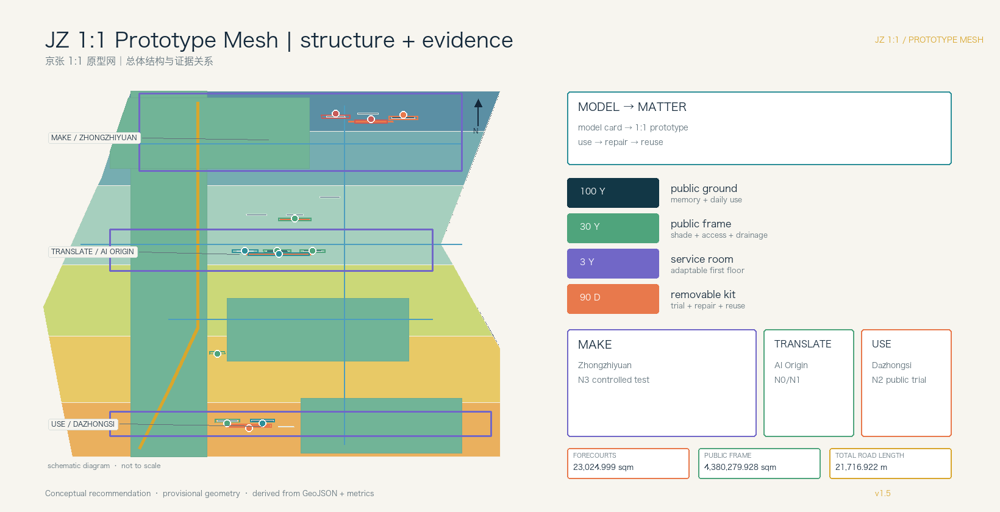
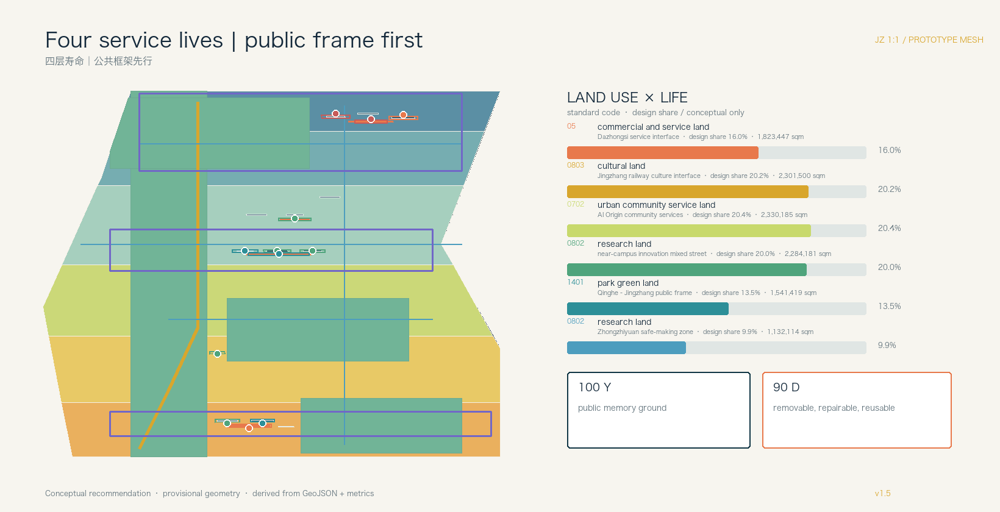
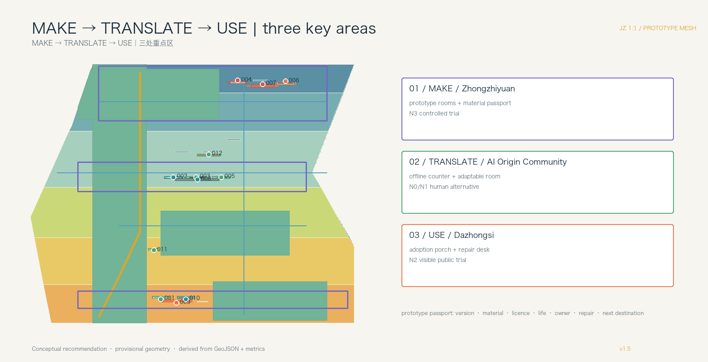
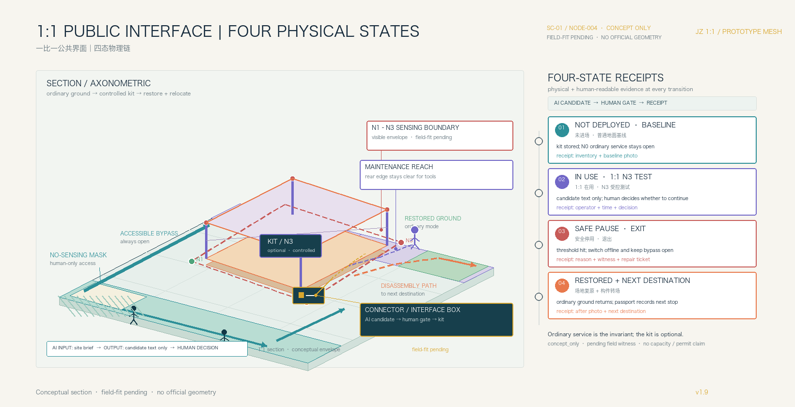
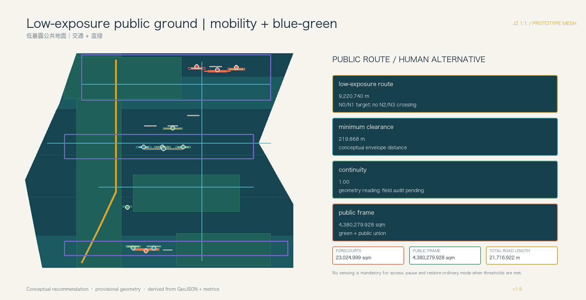
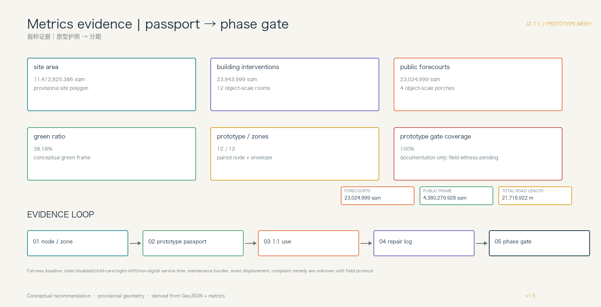

# JZ 1:1 Prototype Mesh: Model to Matter

## Design Basis and Source List

This formal reference scheme responds to the Centennial Jing-Zhang AI Innovation Belt open call. Its thesis is spatial and material: an AI output must become a one-to-one prototype that people can use, repair, disassemble, and reuse. A model card, a component list, a public interface, and a retirement path travel together through one production chain. The task basis is [source:OFFICIAL-ANNOUNCEMENT] and [source:AGENT-TASKBOOK]; the public brief and its source-boundary note define the open-call context and disclosure limits [source:brief-public-brief] [source:brief-public-boundary].

Urban-design and regulatory-plan depth follow [standard:MOHURD-URBAN-DESIGN-MEASURES] and [standard:MOHURD-CONTROL-DETAILED-PLANNING]; land-use terminology follows [standard:MNR-LAND-USE-CLASSIFICATION-GUIDE].

Official SITE_BOUNDARY, KEY_AREA polygons, building survey, ownership, road redlines, and utility conditions are not in the public package. The submission therefore uses the repository's rough `provisional_constraint` geometry: the submitted site recalculates to 11,412,825.386 sqm and the three key areas to 1,929,201.877, 1,043,236.909, and 720,454.221 sqm. These are discussion geometry, never official redlines, approvals, or exact survey areas. Replace the polygons and recalculate every layer, metric, figure, HTML page, and PDF when official data arrives [assumption:A-GEOMETRY-001].

JZ 1:1 is a distributed mesh of prototype rooms, prototype courtyards, public prototype segments, repair/reuse nodes, display-and-exchange porches, and park review faces. Multi-agent work is split into brief decomposition, spatial simulation, safety review, material schedule, operations, and human-factor feedback; professional teams retain final judgment [depth:overall_spatial_structure] [data:geometry/constraints.geojson#NODE-007].

To keep intelligence visible without turning public ground into invisible surveillance, the proposal adds an **Algorithmic Exposure Cadastre**. Each prototype node pairs with a conceptual AI_SERVICE_ZONE envelope recording sensing mode, N0–N3 exposure level, operating hours, retention, operator, human handover, no-capture mask, and the ordinary human/offline equivalent. A visible exposure setback and a continuous low-exposure route let people see and bypass sensing edges; unregistered nodes and envelopes stay out of public space. This is a conceptual design rule, not a statutory control [data:geometry/constraints.geojson#NODE-008] [data:geometry/constraints.geojson#ZONE-008] [metric:registered_exposure_coverage_ratio].

## Three-Level Scope Framework

The 43.6 km2 coordinated research area studies the relationship between Jing-Zhang heritage, Zhongguancun innovation, and AI culture. The approximately 11.4 km2 overall design area maps the public frame, adaptable service rooms, prototype nodes, mobility, utilities, and phasing. The three key areas, about 3.684 km2 in the announcement, receive detailed design. A common component ID, feedback record, and reuse log connect the levels [depth:three_level_scope_framework] [metric:key_area_count].

The century is made spatially legible through four service lives:

1. **100-year layer / public ground:** treat the heritage park and existing open spaces as the public substrate for memory, rest, and review; this proposal does not claim a new park-through project.
2. **30-year layer / public frame:** blue-green connections, shade, accessibility, drainage, lighting, and maintainable ground floors remain useful when a particular AI service retires.
3. **3-year layer / service rooms:** adaptable first floors host shared worktables, human counters, classes, pitches, and equipment interfaces.
4. **90-day layer / removable kits:** robots, sensors, edge devices, explanation screens, signs, furniture, and scene components are trialled, evaluated, repaired, reused, or retired.

The corresponding evidence is [data:geometry/site_boundary.geojson#SITE-001], [data:geometry/buildings.geojson#BLDG-001], and [data:geometry/constraints.geojson#NODE-007]. Provisional geometry supports intake discussion only.

## Coordinated Research Area: Industry and Future City Research

The three announced positions become five observable urban capabilities: make components, exchange components, use them in daily life, let non-specialists participate, and publish limits and retirement. The three areas are differentiated as **MAKE** (Zhongzhiyuan), **TRANSLATE** (AI Origin Community), and **USE** (Dazhongsi). The Zhongguancun technology-service wing supplies IP, standards, legal, procurement, and talent services; the Xiaoyue River scene wing supplies health, education, mobility, and ecological demand [source:AGENT-TASKBOOK] [depth:overall_spatial_structure].

Seven international references are mechanisms rather than Haidian facts. RIBA’s King’s Cross review indicates that inherited geometry, walking routes, and open space can become the public structure of renewal; STATION F’s official account records the former freight station Halle Freyssinet as a historic building in 2012, its conversion into an entrepreneurship campus beginning in 2013, and the concentration of entrepreneurs, partners, and growth services under one roof [source:GLOBAL-KINGS-CROSS-RIBA-2024] [source:GLOBAL-STATION-F].

Oodi’s official page lists reading, work, meetings, events, studios, and an Urban Workshop as bookable, staffed public services; Barcelona Superblocks describes reclaiming road space from motor vehicles and creating pedestrian-priority green nodes and squares for health, safety, equity, social interaction, and local economy [source:GLOBAL-OODI] [source:GLOBAL-BARCELONA-SUPERBLOCKS].

Waag Futurelab describes public research, interdisciplinary collaboration, and public value as its technology method, with civil society invited to question technical assumptions [source:GLOBAL-WAAG].

JTC’s Punggol Digital District materials describe district-scale coupling of industry, university, community, the Open Digital Platform, digital twins, testing, and everyday operations; the official Shibuya Scramble Square page shows a direct connection to Shibuya Station and a shared arrival interface for retail, offices, industry exchange, and observation [source:GLOBAL-PUNGGOL-JTC-2026] [source:GLOBAL-PUNGGOL-ODP] [source:GLOBAL-SHIBUYA-SCRAMBLE].

These sources support only the case facts. The MAKE—TRANSLATE—USE translation for Haidian is a conceptual proposal that requires field, ownership, operations, and professional review before it can guide implementation. Each reference is translated into a component, an access threshold, and a maintenance responsibility rather than an implementation promise.

AI is native to the design workflow. Agents split a public brief into spatial, algorithmic, material, safety, operations, and human-factor work orders, then merge them into a printable bill of materials and a service flow. Every model card states data licence, input boundary, users, failure modes, human owner, and removal path. Personal tracks, raw campus data, medical records, and unlicensed company data stay out [assumption:A-DATA-002] [depth:existing_conditions_diagnosis].

The identity system is `JZ 1:1 / Model to Matter`. Its mark uses a scale bar, grid joint, and detachable connector rather than a train icon or company logo. Charcoal denotes the inherited ground, green the long-life public frame, orange the 90-day kit, and white numbering the material passport. Type, symbols, and signage remain rights-cleared concept directions.

## Overall Design Area: Urban Renewal and Regulatory-Plan-Level Urban Design

The overall structure is a mesh, not a single corridor: prototype rooms, prototype courtyards, public prototype segments, repair/reuse nodes, display-and-exchange porches, and park review faces. Walking, cycling, and a low-speed service network connect them; `roads.geojson` expresses relationships, not statutory road lines [data:geometry/roads.geojson#ROAD-001] [depth:overall_spatial_structure].

Six proposal land-use families follow [standard:MNR-LAND-USE-CLASSIFICATION-GUIDE]: research and enterprise service, mixed innovation streets, community life, public green, open space, and transport/municipal interface. The six polygons cover the provisional site without overlap; they are design advice, not approved zoning [data:geometry/land_use.geojson#LU-001] [depth:land_use_layout].

Reuse comes before building action: retain railway/industrial bases; renovate shade, accessibility, energy, and shared rooms; test a removable 90-day prototype before considering renewal; study new construction only after controls and public benefit are evidenced. `renewal_action`, `lifecycle_layer`, `service_room_type`, and `component_reuse_path` expose the reasoning. The footprint metric is not floor area, FAR, or height [metric:building_footprint_area_sqm] [depth:retain_renovate_demolish].

Six conceptual projects are JZ-01 park review face and accessibility interface, JZ-02 Zhongzhiyuan prototype courtyard, JZ-03 Origin Community service room, JZ-04 Dazhongsi adoption porch, JZ-05 repair/reuse catalogue node, and JZ-06 annual prototype exchange week. Ownership, river, rail, utilities, fire, flood, and finance conditions remain to be verified [depth:renewal_project_list] [data:geometry/phasing.geojson#PHASE-001].

## Detailed Design of Key Areas

**Zhongzhiyuan / MAKE.** Bookable prototype rooms, a semi-outdoor courtyard, a material-passport wall, and a public porch expose how a model is made, stopped, and repaired. The first low-risk prototypes are accessible multilingual wayfinding, adjustable furniture, and an offline service interface. River, flood, ownership, and engineering conditions remain pending [data:geometry/key_areas.geojson#PROV-KEY-001] [data:geometry/public_space.geojson#PUBLIC-001].

**AI Origin Community / TRANSLATE.** Research becomes a resident-facing service room: shared making tables, human counters, adaptable class/pitch partitions, care corners, and an accessibility feedback desk. A prototype is used indoors before reaching a nearby public segment; retirement removes only short-life kits. Campus edges, ownership, and night operations need verification [data:geometry/key_areas.geojson#PROV-KEY-002] [data:geometry/buildings.geojson#BLDG-004].

**Dazhongsi / USE.** Daily users decide which devices deserve a longer life. Station and commercial ground floors host a display porch, repair desk, offline public service, and replaceable furniture; every smart terminal has a human alternative and a clear exit. Station quadrants, rail, and utilities require confirmation [data:geometry/key_areas.geojson#PROV-KEY-003] [data:geometry/public_space.geojson#PUBLIC-003].

All three units share a prototype passport: version, material, data licence, expected life, owner, tools, maintenance time, public feedback, and next destination. The evidence format is shared; the urban roles are deliberately different [depth:three_key_area_detailed_design].

## AI Innovation Ecosystem, Personas, and AI+ Scenarios

Six user groups shape rooms and ground: developers, start-ups, enterprise visitors, students, nearby residents, and older/young/disabled people with carers. They need different combinations of equipment, quiet space, human help, shade, accessible routes, and rights protection; the profiles aggregate needs and never identify people [source:AGENT-TASKBOOK].

Twelve concept cards make the AI-to-space pathway inspectable. The first three are industry prototype tests; the remaining nine are civic functions. Every card declares cleared/public inputs, minimisation, a human owner, an operator, a pause threshold, and a retirement destination:

1. one-to-one accessible multilingual wayfinding;
2. adjustable public furniture and material passport;
3. offline public-service interface;
4. near-campus research translation room;
5. community health, education, and care navigation;
6. shared making course;
7. station terminal adoption trial;
8. repair and reuse ledger;
9. rights-cleared railway culture guide;
10. AI walking diagnosis with field retest;
11. low-speed service device with human takeover;
12. aggregate public-space resilience notice.

The first three industry prototypes pass through an explicit entry gate. These fields are conceptual pilot controls for professional calibration. The proposed pass evidence describes a witnessing protocol, not an achieved performance result; every stop trigger restores ordinary public mode first [metric:industry_prototype_gate_coverage_ratio] [assumption:A-PILOT-GATES-010].

The proposal treats the gate as four auditable physical states: **not yet deployed → 1:1 in use → safely stopped → ground restored/component relocated**. A stop is not a backend button. It is a visible public-state change: the AI_SERVICE_ZONE returns to N0, ordinary service continues, the kit is removed, the ground is restored, and the material passport records its next destination.

To show that AI is a spatial production method rather than a post-hoc label, `SC-01 / JZ-001` carries one inspectable version lineage. `V0` keeps the ordinary static sign and human guide as baseline; `V1` generates a rights-cleared text candidate inside the MAKE prototype room; `V2` brings the same serialized component into a one-to-one tactile, paper-map, and audio-bypass review; `V3` translates the reviewed component into resident language in the TRANSLATE service room; `V4` makes it an optional aid at USE with no access gate; and `V5` returns it to the repair/reuse catalogue after N0 restoration, with a ground-restoration and material-transfer receipt. Each version records spatial, material/connection, and human-service changes. The example is explicitly `concept_only` and `pending_field_witness`, not a claimed field result [data:visual/assets/example-jz-001-prototype-passport.json#JZ-001-PASSPORT] [data:geometry/constraints.geojson#NODE-004] [depth:three_key_area_detailed_design].

The passport contract makes AI inputs, permitted outputs, human decisions, physical parts, tools, N0–N3 exposure, human equivalents, four-state receipts, stop/appeal rights, and the next destination machine-readable. Official geometry, ownership, capacity, funding, permits, and field witnessing remain pending [data:visual/assets/jz-prototype-passport.schema.json#JZ-PROTOTYPE-PASSPORT].

| Prototype / 1:1 test bay | Baseline and entry evidence | Proposed pass evidence | Stop trigger | Human/offline equivalent | Recovery or retirement |
| --- | --- | --- | --- | --- | --- |
| Accessible multilingual wayfinding / MAKE prototype room + courtyard | AI-generated candidate words/voice from rights-cleared text; accessibility, visual, audio, and tactile review; static route available first; named owner | Group-witnessed completion of the target route with a human fallback; misdirection log closed | Unresolved misdirection, obstruction, audio conflict, or unavailable accessible bypass | Static multilingual signs, tactile/paper map, human steward | `AI_SERVICE_ZONE → N0`; restore baseline signs, revise and review, or disassemble and relocate |
| Adjustable public furniture / MAKE prototype courtyard | AI-assisted size/adjustment options; material passport; structural, accessibility, and weather review; tool-accessible fasteners; ordinary clear route preserved | Witnessed fit between AI options and embodied use, stable use, no pinch hazard, clear route, and repairability; component ledger complete | Instability, pinch hazard, route obstruction, or missing component record | Fixed ordinary seating and unobstructed route | `AI_SERVICE_ZONE → N0`; isolate and restore ordinary seating/route, repair and review, or disassemble for reuse |
| Offline service interface / MAKE → TRANSLATE service room | AI interface reads only versioned public information; core-task list; staffed and paper workflow rehearsal; data minimisation | During outage or refusal, every core task remains completable through a human/paper route; version and owner traceable | Any core task loses its non-AI path, or information version/owner is unclear | Staffed counter, paper form, telephone/on-site referral | `AI_SERVICE_ZONE → N0`; turn off the AI interface while keeping human service, repair information/capacity and review, or retire the interface |

Industry tests follow **model card → component/room allocation → 1:1 use → field review → disassembly/reuse**. Civic functions keep human and offline service parallel to optional AI assistance. Each card also declares a space-time exposure budget: when the kit is on, who is present, when it shuts down, and when ordinary public mode is restored. No card replaces approval, diagnosis, traffic command, or safety responsibility [standard:PROJECT-AGENT-OPEN-CALL-TASKBOOK] [depth:three_key_area_detailed_design].

## Land Use, Building Scale, and Retain-Renovate-Demolish Strategy

Public frame first, visible ground floors, and reuse first guide the six land-use bands. The six non-overlapping design polygons cover the provisional site, with `land_use_polygon_count=6` and `land_use_share_sum_ratio=1.0`. Their conceptual design shares are 05 commercial/service 16.0%, 0803 cultural 20.2%, 0702 urban community service 20.4%, 0802 research 20.0% + 9.9% (two different lifecycle interfaces), and 1401 park green 13.5%. These are proposal shares over a provisional boundary, not statutory zoning or approved allocation. Research and enterprise service gathers at MAKE; shared material, legal, IP, and talent rooms occupy mixed streets; community life surrounds TRANSLATE rooms; open space and green space carry park review faces and USE nodes [data:geometry/land_use.geojson#LU-001] [metric:land_use_polygon_count] [depth:land_use_layout].

The building section is a maintenance section rather than a skyline promise: exposed joints, replaceable panels, shaded thresholds, repair storage, and accessible service counters. Retain existing bases; renovate first floors; renew only after a removable trial; consider new build only with official controls, infrastructure capacity, and public-benefit evidence. FAR, height, density, setbacks, parking, fire access, and total floor area are pending [depth:development_intensity_controls] [depth:height_massing_character].

## Transport, Rail, Municipal Infrastructure, and Public Services

The ground has three speeds: a slow public field with continuous accessibility and shade, a service network along secondary edges, and exchange pockets at stations, campus gates, and commercial fronts. Outside service windows, exchange pockets return to seats or community activity. The conceptual low-exposure route ROAD-001 is 9,220.740 m long, keeps a 219.868 m minimum distance from N2/N3 envelopes, and has continuity 1.0 in the submitted geometry. The six conceptual centerlines total `road_centerline_length_m=21,716.922 m`; ROAD-002–ROAD-006 connectors total `road_connector_length_m=12,496.182 m`. These are design readings, not field accessibility, privacy, or road checks; road geometry is not a redline [data:geometry/roads.geojson#ROAD-001] [metric:road_centerline_length_m] [depth:traffic_rail_slow_parking].

An interface-box strategy mounts lighting, rainwater, sensors, edge computing, public Wi-Fi, and repair power on removable elements. Capacity, pipelines, flood, fire, cybersecurity, and rail interfaces must be checked before any engineering decision. Human counters, paper/offline procedures, legal explanation, health navigation, and accessibility accompaniment remain available [depth:municipal_new_infrastructure] [data:geometry/constraints.geojson#NODE-008].

## Blue-Green Network, Public Space, and Urban Character

The existing heritage park is a 100-year public ground for memory and rest; Qinghe and Xiaoyue River support ecology, rain, and low-carbon experience; edges and station fronts host one-to-one review. New kits attach to maintainable frames instead of becoming permanent landscape claims. The conceptual green union is `green_ratio=38.18%`. Four object-scale forecourts total `public_space_area_sqm=23,024.999 sqm`, so `public_space_ratio=0.20%` is intentionally a forecourt ratio, not a district-wide public-space rate [metric:green_ratio] [metric:public_space_ratio] [depth:blue_green_public_space].

The long-life public frame is reported separately: the conceptual union of green space and the four forecourts is `long_life_public_frame_area_sqm=4,380,279.928 sqm`, or `public_frame_ratio=38.38%`, with `public_forecourt_count=4`. Neither area definition is a statutory green rate, public-space rate, or confirmed public ownership; both must be recomputed when official geometry and tenure data arrive [metric:public_frame_ratio] [metric:public_forecourt_count] [assumption:A-PUBLIC-FRAME-009].

Three AI pilgrimage / honour nodes are participatory memory points: a **repairable-component wall** at MAKE, a **one-to-one service-room porch** at TRANSLATE, and a **city adoption and retirement desk** at USE. They are reversible exhibits and public furniture suggestions, not approved landmarks.

The character language is honest engineering: visible connectors, numbered parts, detachable joints, durable materials, and readable maintenance signs. Zhongguancun culture enters through open making, contribution credit, and IP thresholds; AI culture enters through multilingual explanation, failure records, and human service. Clear every typeface, image, logo, person, and institutional mark [source:AGENT-TASKBOOK].

## Renewal Projects, Implementation Policy, and Phasing

Phasing follows life and evidence thresholds rather than the construction of a new line:

- **P0 / 0–6 months:** verify official geometry, ownership, building survey, and public frame; select one temporary room and establish the prototype passport.
- **P1 / 6–18 months:** run one low-risk 90-day prototype in each of MAKE, TRANSLATE, and USE; publish use, faults, human interventions, and retirement.
- **P2 / 18–36 months:** adapt existing first floors into three-year service rooms once ownership and fire conditions are clear.
- **P3 / after year 3:** deepen the 30-year public frame after official controls, transit, utilities, heritage, and finance are available.

Projects JZ-01 to JZ-06 remain conceptual recommendations. The long-term programme is a quarterly prototype exchange, an annual global AI Ground Week, and a developer repair community with bilingual model cards and downloadable component records. Submitted, reviewed, selected, and implemented status must stay distinct [depth:renewal_project_list] [depth:phasing_implementation].

To make the project list transferable to the next professional team, `phasing.geojson` adds a delivery register. Its owners are candidate roles rather than confirmed agencies; funding is a suggested type rather than a budget commitment; a pass can only be evidenced by an independent reviewer and a field record [metric:implementation_register_coverage_ratio] [assumption:A-IMPLEMENTATION-011].

| Project | Spatial delivery and minimum condition | Candidate responsibility / independent review | Suggested funding / permit gate | Stop and maintenance evidence |
| --- | --- | --- | --- | --- |
| JZ-01 Park review face + accessible interface | Existing public ground, step-free bypass, shade and removable exhibit; dimensions field-measured | Park/public-ground asset holder + daily steward; accessibility and public-service review | Public-ground maintenance/small-repair type; boundary, title, heritage, fire and flood gates | Stop when bypass fails or a complaint is unacknowledged; opening log, access walk and repair ticket |
| JZ-02 Zhongzhiyuan prototype courtyard | Prototype room, semi-outdoor yard, material-passport wall and tool-accessible fasteners; capacity manually baselined | Innovation/park asset holder + prototype operator; structural, safety and material-reuse review | Reversible pilot/small-repair type; title, river, fire, structure and cyber-safety gates | Set zone to N0 on a safety/privacy trigger; entry checklist, red-team log and de-install rehearsal |
| JZ-03 Origin Community service room | Step-free human counter, paper route, care corner, adaptable partition and clear egress; shifts calibrated | Community-service asset holder + room operator; care, privacy and language-access review | Shared public-service/course repair type; campus edge, rights, night-access and fire gates | Core tasks cannot fail offline; drill, version signoff and complaint closeout |
| JZ-04 Dazhongsi USE porch | Visible station-front porch, repair desk, accessible interchange and removable interface boxes; queue observed | Station/commercial frontage asset holder + interface operator; mobility, railway-heritage and safety review | Reversible public-interface pilot type; rail, traffic, heritage, fire and utility gates | Withdraw terminal on conflict or low human capacity; frontage walk, manual-service log and exit rehearsal |
| JZ-05 Repair/reuse catalogue node | Lockable parts store, workbench, inventory and safe loading edge; tools and labour measured | Facilities/repair asset holder + repair lead; worker-safety and material-origin review | Maintenance/material-recovery type; title, occupational safety, waste and loading gates | Quarantine unsafe or untraceable parts; work order, passport and next-destination receipt |
| JZ-06 Prototype exchange week | No permanent building; use verified forecourt only and restore ordinary seating/routes outside event | Event/public-space operator; independent public-interest and accessibility review | Public-event/reversible-fitout type; event, fire, crowd and copyright gates | Reduce or cancel when ordinary service is displaced; occupancy hours, human alternative and restoration record |

Coverage at 100% means the six field groups are documented for the three phase records; it does not mean agencies, permits, capacity or finance are secured [metric:implementation_register_coverage_ratio].

### Public rights and responsibilities (concept template)

Open space must not transfer the burden of pause and remedy to the user. The five actions below are the minimum field-protocol fields. “Same-shift confirmation / 24 hours / 72 hours” are calibration starting points, not administrative SLAs [metric:public_rights_protocol_coverage_ratio] [assumption:A-RIGHTS-012].

| Rights action | Who can start / receiving role | Proposed auditable sequence (to calibrate) | On-ground protection and equivalent path |
| --- | --- | --- | --- |
| Pause request | Any user, neighbour or maintenance worker; human counter, paper log, phone and optional digital entry | Confirm in the same shift; set N0 and record reason before independent review | Ordinary service continues; accessible bypass and paper explanation remain |
| Complaint and temporary remedy | Public-space operator receives it; one accountable owner is named | Aim for a temporary remedy within 24 hours and public closure or delay note within 72 hours, subject to capacity calibration | No requirement to use AI first; anonymous/group records only |
| Independent review and appeal | Reviewer without supplier conflict: accessibility, privacy, heritage or safety | Aim for an opinion within five working days; keep ordinary mode at N0 during dispute | Paper review materials; rights holder can withdraw content or request takedown |
| Front-line worker protection | Repair lead receives stop-work notice; asset holder protects the worker | Any worker may stop unsafe work immediately; record in the shift and review without personal blame | Safe tools, training, reasonable hours and protected reporting path |
| Night, non-digital and compensated participation | Night operator + community counter; project operator handles paid testing | 22:00–06:00 equivalence and participant compensation are set after labour/capacity calibration | Paper/phone/human path exists alongside optional AI; reasonable time/transport compensation is proposed |

Coverage at 100% means the five actions have fields; it does not mean time limits, staffing or compensation have been approved [metric:public_rights_protocol_coverage_ratio].

## Metrics, Area Recalculation, and Compliance Matrix

Known recomputable values are `site_area_sqm=11,412,825.386`, `building_footprint_area_sqm=23,943.999`, `green_ratio=0.381786`, `public_space_area_sqm=23,024.999`, `public_space_ratio=0.002017`, `land_use_polygon_count=6`, `land_use_share_sum_ratio=1.0`, and `key_area_count=3`. The building and public-space layers now contain 12 object-scale prototype rooms/porches and four forecourts, rather than parcel-sized envelopes; they remain conceptual geometry, not a survey or statutory indicator [data:geometry/buildings.geojson#BLDG-001] [data:geometry/public_space.geojson#PUBLIC-001] [metric:building_footprint_area_sqm].

The package also records `long_life_public_frame_area_sqm=4,380,279.928`, `public_frame_ratio=0.383803`, `public_forecourt_count=4`, `prototype_node_count=12`, `ai_service_zone_count=12`, and `ai_service_zone_area_sqm=59,736.002`; the service envelopes are conceptual exposure/setback geometry, not legal privacy boundaries [metric:long_life_public_frame_area_sqm] [metric:public_frame_ratio] [metric:ai_service_zone_count]. `implementation_register_coverage_ratio=1.0`, `scenario_control_record_coverage_ratio=1.0`, and `public_rights_protocol_coverage_ratio=1.0` measure documentation completeness only. `service_room_adaptability_count`, `replaceable_component_schedule_coverage`, `non_digital_service_retention_ratio`, `component_reuse_rate`, `feedback_closure_time_hours`, `off_state_verified_ratio`, and `public_mode_hours_ratio` remain unknown until an operating protocol and field data exist; each formula and collection method is recorded in `metrics.json`. `low_exposure_route_continuity_ratio=1.0` is only a current conceptual-geometry reading; field accessibility, privacy, and operating continuity remain pending measurement.

Road evidence is also split by role: `road_centerline_length_m=21,716.922` is the six-line conceptual network total, while `road_connector_length_m=12,496.182` is the projected sum for the five key-area/blue-green connectors. Neither is road area, width, tenure, or an engineering redline [metric:road_centerline_length_m] [metric:road_connector_length_m] [assumption:A-CONTROLS-001].

Public benefit is not reduced to a coverage percentage: completion time for older adults, disabled users, children/caregivers, night-shift workers, and non-digital users; maintenance-worker burden; ordinary-service displacement during events; and complaint-remedy time remain unknown baselines to be recorded by anonymised access groups and reviewed by accessibility and public-service professionals [metric:equity_service_completion_time_minutes].

Task-response counts are separately registered: twelve scenario cards, three industry prototype tests, and six persona groups are [metric:scenario_card_count], [metric:industry_prototype_count], and [metric:persona_count].

Three reversible honour nodes are [metric:landmark_count]; these counts prove coverage, not construction or operation.

The review path is node → prototype passport → repair record → public feedback → phase gate. `compliance_matrix.json` covers announcement tasks and agent.1–agent.6; `standard_matrix.json` covers professional standards; `design_depth_matrix.json` covers all 15 required depth items. Provisional geometry triggers a complete replacement, recalculation, redraw, and recheck [depth:risk_missing_data].

## Risk, Copyright, and Compliance

All text, drawings, layers, and AI-generated material are conceptual recommendations under `COMMUNITY-DISPLAY-ONLY`; they are not government endorsement, statutory planning, construction documents, investment promises, or company facts. SITE and KEY_AREA are explicitly `provisional_constraint`; missing ownership, controls, surveys, roads, rail, utilities, heritage, fire, flood, and energy data limit every spatial conclusion [assumption:A-CONTROLS-001].

Defence in depth means licence cards, data minimisation, public/synthetic inputs, professional review, paid diverse testers, offline human service, visible fault logs, 90-day expiry, disassembly/repair/reuse, and public appeal. A safety, privacy, accessibility, or copyright threshold first pauses the kit, then publishes the reason, and finally chooses repair, reuse, or retirement. Automation never becomes approval, diagnosis, traffic command, or safety responsibility [assumption:A-DATA-002] [depth:risk_missing_data].

History, oral accounts, images, logos, typefaces, people, institutions, and model outputs require item-by-item clearance. No remote maps, fonts, scripts, photos, or APIs are loaded. Provenance, generation method, and limits are recorded in [source:SOURCE-REGISTRY], `report/copyright_statement.md`, and `changelog.md`.

## References

- [source:OFFICIAL-ANNOUNCEMENT] Haidian planning and natural-resources announcement: scope, key areas, tasks, and deliverable depth.
- [source:AGENT-TASKBOOK] `brief/site-package/agent_taskbook.json`: positions, five functions, six agent tasks, scenarios, and operation boundaries.
- [source:SITE-PACKAGE] `brief/site-package/`: geometry declaration, enums, ranges, schemas, and standard snapshots.
- [source:SOURCE-REGISTRY] `data/source_registry.json`: source usability, licence, and uncertainty registry.
- [source:PROCESSED-FACT-PACK] `data/processed/agent_fact_pack.md`: task and missing-data navigation, not a new authority.
- [source:BOUNDARY-SOURCE] `brief/site-package/geometry/provisional_boundaries.geojson`: provisional geometry, not an official redline.
- [source:brief-public-brief] `brief/public-brief.md`: public-draft brief used only for task context and conceptual direction; public-status confirmation remains pending.
- [source:brief-public-boundary] `brief/README.md`: public-source boundary note, not a statutory planning document or public-disclosure approval.
