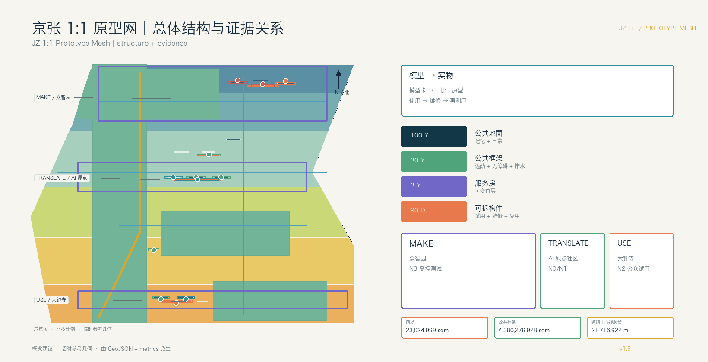
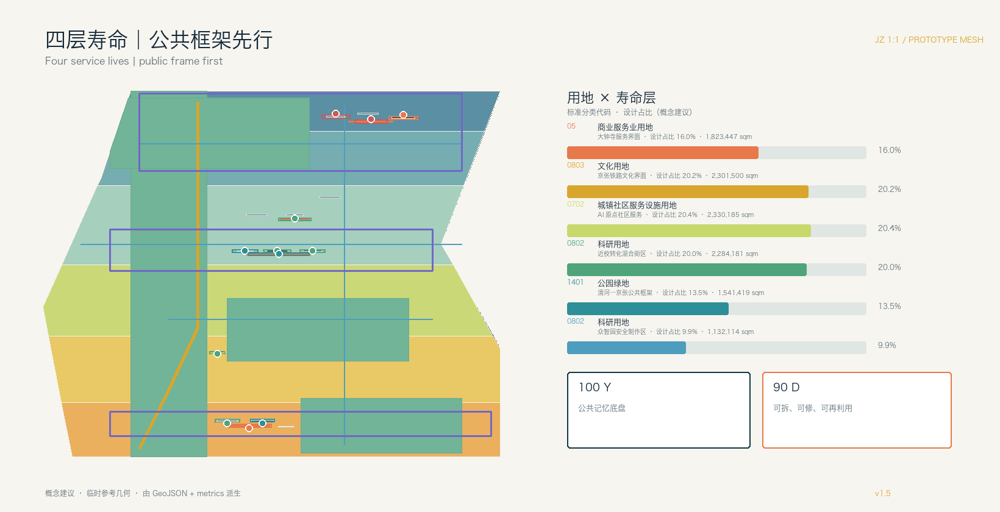
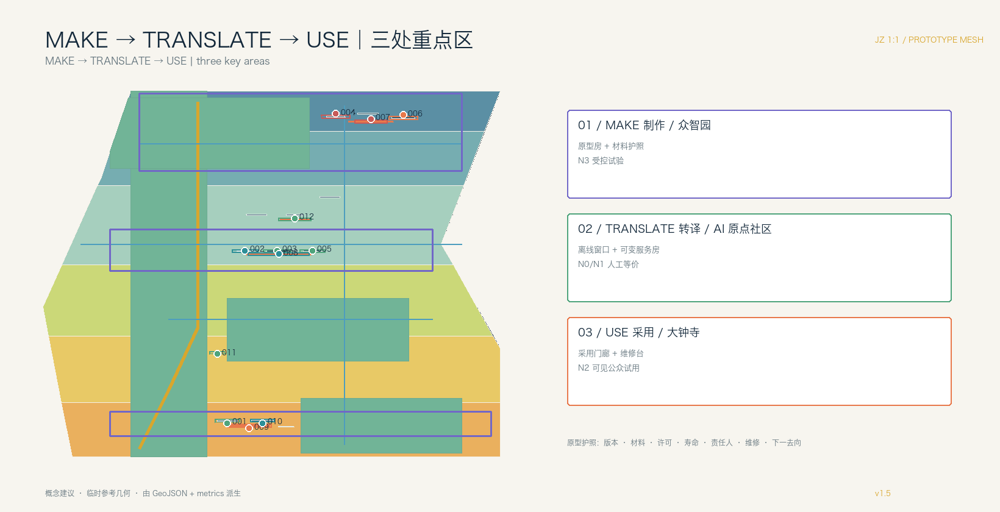
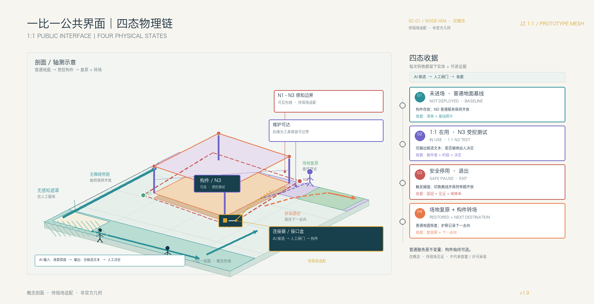
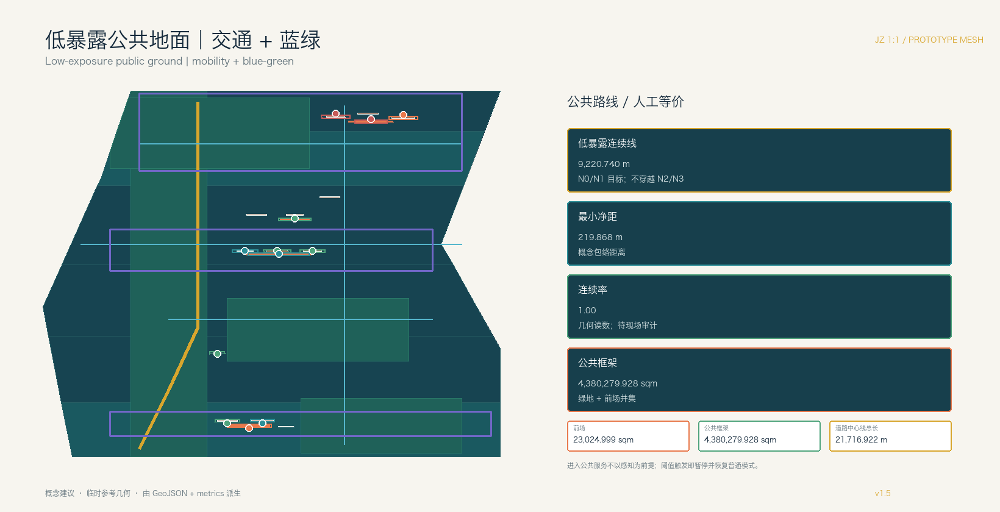
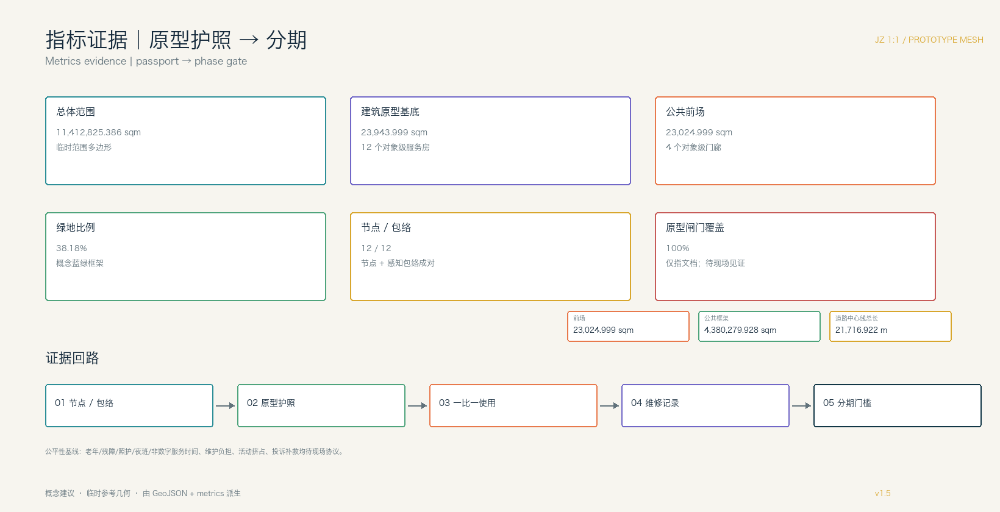

# 京张 1:1 原型网：把模型做成城市

## 设计依据与资料清单

本方案是面向《百年京张 AI 创新带城市设计国际方案征集资格预审公告》的 formal 参考方案。核心命题不是再画一条科技走廊，而是把 AI 的数字输出转成可被人使用、拆卸、维修和再次利用的城市部件：模型、材料、服务流程与公共地面在同一套空间生产链中往返。任务依据为 [source:OFFICIAL-ANNOUNCEMENT] 与 [source:AGENT-TASKBOOK]；公开任务书草案和资料边界说明分别限定议题背景与公开性边界 [source:brief-public-brief] [source:brief-public-boundary]。

城市设计与控规深度分别对照 [standard:MOHURD-URBAN-DESIGN-MEASURES]、[standard:MOHURD-CONTROL-DETAILED-PLANNING]；用地分类对照 [standard:MNR-LAND-USE-CLASSIFICATION-GUIDE]。

当前官方精确 SITE_BOUNDARY、KEY_AREA polygon、现状建筑、道路红线、权属和市政工程条件未公开。提交包沿用 [source:BOUNDARY-SOURCE] 的临时粗略几何：总体范围复算 11,412,825.386 sqm；三处重点区复算 1,929,201.877、1,043,236.909、720,454.221 sqm。这些几何均标为 `provisional_constraint`，不是官方红线、法定控规、审批依据或精确面积。官方 polygon 替换后，所有设计 GeoJSON、指标、图件、HTML 和 PDF 必须整体重算。[assumption:A-GEOMETRY-001]

本案的原创空间语法是 **JZ 1:1**：每一个 AI 结论必须有一个可读的模型卡、一个一比一原型和一条维修/退役路径。输出不止是屏幕上的渲染，而是“原型房—原型院—公共原型街段—维修再利用节点—展示交换门廊”的分布式网格。AI 多智能体分别承担问题拆解、空间模拟、安全审阅、材料清单、运营排班和人因回访；人类专业团队保留最终判断。[depth:overall_spatial_structure] [data:geometry/constraints.geojson#NODE-007]

为避免“智能”变成不可见的监控，本案另设 **AI 感知地籍**（Algorithmic Exposure Cadastre）这一机器可读登记层：每个原型节点与一个 AI_SERVICE_ZONE 概念包络成对登记感知方式、N0—N3 暴露等级、运行时段、留存期限、操作者、人工交接、无感知遮罩和普通人工等价服务。感知退线与低暴露连续线可在图面上看见、可绕行；未登记节点和包络不得进入公共空间。这是概念设计规则，不是法定控制。[data:geometry/constraints.geojson#NODE-008] [data:geometry/constraints.geojson#ZONE-008] [metric:registered_exposure_coverage_ratio]

## 三层范围工作框架

统筹研究范围为公告 43.6 平方公里，研究百年京张文化、中关村创新文化与 AI 新文化的关系，建立产业、人才、数据和公共服务的原型目录；总体设计范围约 11.4 平方公里，落图公共框架、首层服务房、原型节点、交通市政和分期；重点区域为三处合计公告约 3.684 平方公里的详细设计单元。三层范围通过同一套部件编号、使用反馈和复用记录连接，而不是三套互不相干的口号。[depth:three_level_scope_framework] [metric:key_area_count]

四层寿命框架把“百年”落到可实施的物理时间尺度：

1. **100 年层｜公共记忆底盘**：把京张遗址公园及既有开放空间视作需要持续使用的公共地面，承载铁路记忆、日常休息和公共审阅；本案不重复宣称新建贯通工程。
2. **30 年层｜公共框架**：蓝绿网络、遮荫、无障碍、排水、照明和可维护首层界面，即使 AI 服务下线也继续提供步行、停留和人工服务。
3. **3 年层｜服务房间**：在既有建筑首层设置可变隔断、共享工作台、人工窗口、课程/路演空间和设备接口，适应产业与公共服务换代。
4. **90 天层｜可拆换构件**：机器人、传感器、端侧设备、解释屏、导视、家具和场景组件以短周期试用；到期评估、拆除、维修、复用或退役。

三个尺度的图件分别对应 [data:geometry/site_boundary.geojson#SITE-001]、[data:geometry/buildings.geojson#BLDG-001] 和 [data:geometry/constraints.geojson#NODE-007]。临时边界只用于 intake 讨论和设计复算，不得解释为审批边界。

## 统筹研究范围产业与未来城市研究

方案把公告提出的三大定位转成五种可观察的城市能力：AI 全栈自主创新对应“能做出部件”，世界级生态对应“能交换部件”，AI+场景赋能对应“能在真实日常使用”，智能化活力城市对应“能让非专业者参与”，全球治理话语权对应“能公开记录限制与退役”。三区两翼协同回路为：众智园 **MAKE** 制作和测试，AI 原点社区 **TRANSLATE** 把研究转成共享服务房，大钟寺 **USE** 让部件进入城市日常并记录维修；中关村科技服务翼提供知识产权、标准、法务、采购和人才服务，小月河场景赋能翼提供健康、教育、慢行和生态需求。[source:AGENT-TASKBOOK] [depth:overall_spatial_structure]

七个国际案例仅作为机制参考，以下事实不等同于海淀现状。RIBA 对 King’s Cross 的评述提示，既有几何、步行路线和开放空间可以成为更新的公共结构；STATION F 官方资料说明，历史货运站 Halle Freyssinet 于 2012 年列为历史建筑、2013 年启动改造为创业校园，并把创业者、合作伙伴和成长服务集中在同一屋檐下。[source:GLOBAL-KINGS-CROSS-RIBA-2024] [source:GLOBAL-STATION-F]

Oodi 官方页面列出阅读、工作、会议、活动、工作室和 Urban Workshop 等可预约、有人运营的公共服务；Barcelona Superblocks 以回收部分机动车占用的道路空间、建设行人优先的绿色节点和广场回应健康、安全、公平、社会交往与地方经济。[source:GLOBAL-OODI] [source:GLOBAL-BARCELONA-SUPERBLOCKS]

Waag Futurelab 的公开资料把公共研究、跨学科合作和公共价值放在技术工作方法中，并邀请公民社会质询技术假设。[source:GLOBAL-WAAG]

JTC 对 Punggol Digital District 的资料描述了产业、大学、社区、Open Digital Platform、数字孪生以及测试与日常运营的地区级耦合；Shibuya Scramble Square 官方页面显示，项目直接连接涩谷站，并把商业、办公、产业交流和观景功能放在同一综合到达界面。[source:GLOBAL-PUNGGOL-JTC-2026] [source:GLOBAL-PUNGGOL-ODP] [source:GLOBAL-SHIBUYA-SCRAMBLE]

这些来源只支撑案例事实；面向海淀的 MAKE—TRANSLATE—USE 转译是本方案的概念建议，须在正式边界、权属、运营和专业审阅条件明确后现场核验。每个案例再被翻译成“空间构件 + 使用门槛 + 维护责任”三列，避免把外地经验直接当作实施承诺。

AI 原生不是给传统规划贴标签：多智能体先把居民课题拆为“空间、算法、材料、安全、运营、人因”六张工作单，再合并成可打印的部件清单和服务流程。模型卡必须写明训练/参考数据的许可、输入边界、适用人群、失败模式、人工责任人和拆除方式；未经授权的个人轨迹、校园原始数据、病历和企业未授权数据不进入公共试验。[assumption:A-DATA-002] [depth:existing_conditions_diagnosis]

命名体系建议使用 `JZ 1:1` 作为总标识，副题为“把模型做成城市 / Model to Matter”。Logo 以比例尺、方格接缝和可拆卸连接件构成，不使用火车图标或任何企业标识；炭黑表示既有底盘，草绿表示公共框架，警示橙表示 90 天构件，白色编号对应材料护照。字体、图形和导视仅为清权前的概念方向。

## 总体设计范围城市更新与控规深度城市设计

总体空间结构不是一条主轴，而是六类节点组成的原型网格：原型房（低风险室内试制）、原型院（半室外共享制作）、公共原型街段（1:1 人因测试）、维修再利用节点（拆装、清点和再次分配）、展示交换门廊（研发空间的公众界面）和公园审阅面（既有公共地面上的可逆展陈）。节点之间以步行、骑行和物流微循环联系，`roads.geojson` 表达关系线而非道路红线。[data:geometry/roads.geojson#ROAD-001] [depth:overall_spatial_structure]

用地建议仍遵循 [standard:MNR-LAND-USE-CLASSIFICATION-GUIDE] 的分类词汇。六块设计多边形覆盖临时范围且无重叠，`land_use_polygon_count=6`、`land_use_share_sum_ratio=1.0`；按当前概念设计占比分别为：05 商业服务业用地 16.0%、0803 文化用地 20.2%、0702 城镇社区服务设施用地 20.4%、0802 科研用地 20.0% + 9.9%（两块不同生命周期接口）、1401 公园绿地 13.5%。这些百分比是临时范围内的设计分配口径，不是法定用地审批或控制指标。[data:geometry/land_use.geojson#LU-001] [metric:land_use_polygon_count] [depth:land_use_layout]

存量更新以“先做可拆部件，再决定建筑动作”为顺序：保留既有工业/铁路基底，改造首层遮荫、无障碍、能源和共享服务房，更新低效建筑前先做 90 天临时原型，新建只在公共框架承载和正式控规均可证明时讨论。建筑图层的 `renewal_action`、`lifecycle_layer`、`service_room_type` 和 `component_reuse_path` 明确记录判断依据；[metric:building_footprint_area_sqm] 只统计概念基底，不推导楼面面积、FAR 或高度。[depth:retain_renovate_demolish] [standard:MOHURD-ARCH-DESIGN-DEPTH-2016]

建议的六个更新项目为：JZ-01 公园审阅面与无障碍接口；JZ-02 众智园公共原型院；JZ-03 原点社区共享服务房；JZ-04 大钟寺站前 USE 门廊；JZ-05 维修与再利用目录节点；JZ-06 年度原型交换周。每项先以可逆、轻量、可拆动作开始；权属、河道蓝线、轨道、市政、消防、防洪和资金条件未核实前，不提出拆除、永久工程或投资承诺。[depth:renewal_project_list] [data:geometry/phasing.geojson#PHASE-001]

## 重点区域详细设计

**众智园｜MAKE 制作单元。** 这里不是封闭的“测试场”，而是一组可预约的原型房、半室外原型院和材料护照墙：算法团队提交模型卡，硬件团队提交部件清单，安全人员检查边界，公众可从展示交换门廊看到“如何做、如何停、如何修”。首批建议只做低风险的无障碍导视、可调家具和离线服务界面；清河岸线、河道蓝线、防洪和权属待正式资料确认。对应 [data:geometry/key_areas.geojson#PROV-KEY-001]、[data:geometry/public_space.geojson#PUBLIC-001]。

**北京 AI 原点社区｜TRANSLATE 转译单元。** 把高校与研发成果翻译成居民能使用的服务房间：共享制作台、人工窗口、课程/路演可变隔断、亲子和照护角、无障碍反馈台。每个原型先在房间内试用，再进入相邻公共原型街段；撤回时只拆换短寿命构件，不留下固定废弃空间。校园边界、权属和夜间运营需核实，对应 [data:geometry/key_areas.geojson#PROV-KEY-002]、[data:geometry/buildings.geojson#BLDG-004]。

**大钟寺｜USE 采用单元。** 重点不是再造数字地标，而是让城市日常决定哪些部件值得留下：站前和商业首层设置展示交换门廊、维修台、可离线公共服务界面和可替换家具；智能终端、内容消费和国际交往都必须提供人工替代和清晰的退出入口。四象限步行、轨道和管线条件确认后再深化空间；对应 [data:geometry/key_areas.geojson#PROV-KEY-003]、[data:geometry/public_space.geojson#PUBLIC-003]。

三处单元共享“原型护照”字段：版本、材料、数据许可、预计寿命、责任人、拆装工具、维护时间、公众反馈和下一步去向。这里的共享是证据格式与部件目录共享，不是把三处空间做成同质化展示；其差异化角色见 [depth:three_key_area_detailed_design]。

## AI 创新生态、人才画像与 AI+ 场景

六类用户画像直接决定房间和地面：开发者需要可复用接口、材料目录和贡献署名；初创团队需要低成本原型房、法务/IP 和小规模试用；头部企业访客需要可解释展示和国际交流；高校师生需要近校转译、教学和安静学习；周边居民需要非数字人工服务、遮荫、健康与教育；老年人、儿童、残障人士和照护者需要连续无障碍、可休息和不被追踪的路径。画像是聚合需求的设计工具，不用于个人识别或商业推荐。[source:AGENT-TASKBOOK]

12 张场景卡均为概念建议，前三张是产业原型验证，后九张是城市功能试用；每张卡都要求公开/清权输入、数据最小化、人工责任、运营主体、空间节点、暂停阈值和退役去向：

1. **原型房：无障碍多语言导视**（众智园 MAKE）：合成/清权文本，测试 1:1 导视和语音界面；安全与无障碍人员复核，90 天后拆回或转移。
2. **原型院：可调公共家具**（众智园 MAKE）：材料护照记录耐候、维修和再利用；居民与行动不便者有偿试用，结构安全人员复核。
3. **公共街段：离线服务界面**（众智园—原点）：只读公开办事指南，窗口人员可一键转人工；断网仍提供纸面/人工服务。
4. **近校成果转译房**（原点社区 TRANSLATE）：使用授权科研摘要和公开专利，权利人确认后展示，撤权即下线。
5. **社区服务房**（原点社区）：健康、教育和照护导航只链接公开服务，不诊断、不存病历，医务/社工复核。
6. **共享制作课程**（原点社区）：面向学生、居民和开发者的材料/模型工作坊，报名名单到期删除。
7. **站前终端采用试用**（大钟寺 USE）：比较不同终端的可理解性和维护时间，保留无 AI 入口，投诉可暂停。
8. **维修与再利用台账**（大钟寺）：记录部件故障、修复、拆卸和下一使用地点，不记录个人轨迹。
9. **铁路文化导览**（公园审阅面）：仅用已清权史料和人工策展文本，文化顾问复核，版权异议可下架。
10. **AI 慢行诊断**（公园—站点）：匿名计数、人工踏勘和主动反馈识别断点，交通/无障碍专业人员确认后才调整导视。
11. **低速服务设备试用**（小月河场景赋能翼）：限定速度、时段、天气和人工接管，设备不是必选项，冲突即停测。
12. **公共韧性提示**（清河/小月河）：只读聚合雨量、水位和设施状态，防汛/园林人员巡检闭环，不接入住户摄像。

前三项产业原型再经过一层明确的入场闸门。以下字段是供专业团队校准的概念试点控制，表内“通过证据”是拟议的现场见证方式，不是已经取得的性能结果；任何停止触发都先恢复普通公共模式。[metric:industry_prototype_gate_coverage_ratio] [assumption:A-PILOT-GATES-010]

本案把闸门画成四种可验收的物理状态：**未进场 → 1:1 在用 → 安全停用 → 场地复原/构件转场**。停止不是后台按钮，而是公共空间的可见状态转换：AI_SERVICE_ZONE 退回 N0，普通服务不断，构件拆回，地面复原，材料有下一站。

| 原型 / 1:1 试验湾 | 基线与入场证据 | 通过证据（拟议） | 停止触发 | 人工/离线等价 | 恢复或退役 |
| --- | --- | --- | --- | --- | --- |
| 无障碍多语言导视 / MAKE 原型房 + 原型院 | AI 生成候选词/语音仅用清权文本；无障碍路线、视听和触觉审阅；静态导视先可用；责任人登记 | 分组用户见证完成目标路线并可回到人工引导；误导记录闭合 | 未解决的误导、遮挡、语音冲突，或无障碍旁路不可用 | 静态多语导视、触觉/纸图、人工引导 | `AI_SERVICE_ZONE → N0`；恢复基线导视，修订后复审，或拆回转移 |
| 可调公共家具 / MAKE 原型院 | AI 辅助生成尺寸/调节候选；材料护照；结构、无障碍、耐候审阅；工具可达紧固件；普通通行带畅通 | 见证 AI 候选与实体人因适配、稳定使用、无夹伤风险、通行净空和可维修性；部件台账完整 | 不稳定、夹伤风险、阻塞通行，或缺少部件记录 | 固定普通座椅和无遮挡通行带 | `AI_SERVICE_ZONE → N0`；隔离并恢复普通座椅/路径，修复复审，或拆解复用 |
| 离线服务界面 / MAKE → TRANSLATE 服务房 | AI 界面只读版本化公开信息；核心任务清单；人工席位与纸面流程演练；数据最小化 | 断网或拒答时，所有核心任务仍由人工/纸面路径闭环；版本和责任人可追溯 | 任一核心任务失去非 AI 路径，或信息版本/责任人不明 | 人工窗口、纸面表单、电话/现场转介 | `AI_SERVICE_ZONE → N0`；关闭 AI 界面并保持人工服务，补齐信息/容量后复审，或撤下接口 |

产业原型的空间—运营映射为“提交模型卡 → 领取材料/接口 → 1:1 试用 → 现场复盘 → 拆卸/复用”；城市功能则采用“人工服务并行 → 可选 AI 辅助 → 公众主动反馈 → 到期退役”。每张场景卡同时填写感知地籍字段和空间—时段暴露预算：何时开启、谁在现场、何时自动关闭、何时恢复普通公共模式。所有场景遵循 [standard:PROJECT-AGENT-OPEN-CALL-TASKBOOK]，不替代审批、医疗诊断、交通指挥或安全责任。[depth:three_key_area_detailed_design]

为证明 AI 是空间生产力而不是事后标签，本案用 `SC-01 / JZ-001` 做一条可复核的版本谱系。`V0` 保留普通静态导视与人工引导基线；`V1` 只在 MAKE 原型房生成清权文本候选；`V2` 把同一编号构件带入 1:1 触觉、纸图和语音旁路审阅；`V3` 将已复核构件转译为 TRANSLATE 服务房的居民语言；`V4` 才在 USE 端作为不设门槛的可选辅助；`V5` 触发 N0 后回到维修/再利用目录，留下地面复原和材料转场收据。每一版同时记录空间改变、材料/连接改变和人工服务改变，示例明确是 `concept_only`、`pending_field_witness`，不是已发生的现场性能结果。[data:visual/assets/example-jz-001-prototype-passport.json#JZ-001-PASSPORT] [data:geometry/constraints.geojson#NODE-004] [depth:three_key_area_detailed_design]

该护照合同把 AI 输入、允许输出、人类决定、实体构件、拆装工具、N0—N3 暴露、人工等价服务、四态收据、停止/申诉权和下一站写成可机器读取的字段；未取得官方几何、权属、容量、资金、许可或现场见证的项目仍保持待确认。[data:visual/assets/jz-prototype-passport.schema.json#JZ-PROTOTYPE-PASSPORT]

## 用地、建筑规模与拆改留方案

用地布局以公共框架先行、首层可见、存量优先为原则。研发与产业服务靠近 MAKE 节点，混合创新街区承载材料、法务、IP、共享制作和人才服务，社区生活服务围绕 TRANSLATE 房间，开放空间与绿地承载公园审阅面和 USE 节点。六块设计多边形完整覆盖提交范围；代码和 16.0%—20.4% 的设计占比用于方案复核，不能替代法定分区或批准的用地比例。[data:geometry/land_use.geojson#LU-001] [metric:land_use_share_sum_ratio] [depth:land_use_layout]

建筑不以“大体量新地标”证明创新，而以可维修的首层剖面证明适应性。保留：铁路/工业记忆与可持续使用基底；改造：遮荫、无障碍、能源、共享服务房；更新：先做 90 天原型再讨论；新建：仅在正式控规、承载和公共利益证据齐备后研究。建筑高度、密度、退线、停车、消防和总楼面待正式控规，不把 footprint 当作楼面或容积率。[depth:development_intensity_controls] [depth:height_massing_character]

## 交通、轨道、市政与公共服务设施

交通采用“人行慢场—服务网—交接口袋”三层地面剖面：主公共地面连续无障碍、遮荫和停留；后勤、维修和装卸沿次要边界组织；站点、园区门口和商业首层设置可变交接口袋，服务窗口外恢复为座椅或社区活动。概念低暴露路线 ROAD-001 长 9,220.740 m，与 N2/N3 包络保持 219.868 m 的最小距离，连续率按当前几何为 1.0；六条概念关系线总长 `road_centerline_length_m=21,716.922 m`，其中 ROAD-002—ROAD-006 连接线合计 `road_connector_length_m=12,496.182 m`。这些读数只表达设计意图，不能替代现场无障碍、隐私或道路核验；`roads.geojson` 不替代道路红线。[data:geometry/roads.geojson#ROAD-001] [metric:road_centerline_length_m] [depth:traffic_rail_slow_parking]

市政采用“接口盒子”而不是一次性智能化：照明、雨洪、传感、端侧算力、公共 Wi-Fi 和维修电源装在可拆卸盒体内，先挂载于既有公共框架和服务房；容量、管线、防洪、消防、网络安全和轨道接口确认后再深化。公共服务保留人工窗口、纸面/离线流程、法律解释、健康导航和无障碍陪伴，不以 AI 取代责任人。[depth:municipal_new_infrastructure] [data:geometry/constraints.geojson#NODE-008]

## 蓝绿空间、公共空间与城市风貌

蓝绿系统采用“既成公共地面 + 可挂载原型”的策略：京张遗址公园承担百年记忆和日常休息，清河与小月河承担生态、雨洪和低碳体验，公园边缘、站点前场和重点区入口承担一比一审阅。新构件只落在可维护的框架节点上，避免把临时技术误画成永久景观。绿地并集占临时范围 `green_ratio=38.18%`；四个对象尺度前场合计 `public_space_area_sqm=23,024.999 sqm`，其口径为 `public_space_ratio=0.20%`，只表示原型门廊/前场，不是全域公共空间率。[metric:green_ratio] [metric:public_space_ratio] [depth:blue_green_public_space]

为避免两个尺度被混读，长寿命公共框架另行报告：绿地与四个前场的概念并集为 `long_life_public_frame_area_sqm=4,380,279.928 sqm`，`public_frame_ratio=38.38%`，并登记 `public_forecourt_count=4`。这两个面积口径都是概念几何，不等同于法定绿地率、公共空间率或已确认公共权属，正式边界与权属资料到位后必须重算。[metric:public_frame_ratio] [metric:public_forecourt_count] [assumption:A-PUBLIC-FRAME-009]

三处 AI 朝圣/荣誉展示节点改为可参与的“原型记忆点”：① **第一件可修复部件墙**（众智园），展示材料护照和失败修复记录；② **一比一服务房门廊**（原点社区），展示高校成果如何变成可离线公共服务；③ **城市采用与退役台**（大钟寺），公开哪些终端被留下、拆下或再利用。它们是可逆展陈和公共家具建议，不是永久建筑或已批准地标。

城市风貌把铁路的工程诚实转成构件语言：可见连接件、编号、可拆接缝、耐候材料和可读维护标识；中关村文化通过开放制作、贡献署名和知识产权门槛进入首层；AI 新文化通过多语言解释、失败记录和人工服务进入公共地面。Logo、字体、材料样本和任何机构标识使用前逐项清权。[source:AGENT-TASKBOOK]

## 更新项目清单、实施政策与分期计划

分期不按“建成一条线”推进，而按寿命和证据门槛推进：

- **P0 / 0—6 个月：盘点与原型护照。** 核验正式边界、权属、现状建筑和公共框架；选取一处可临时使用的既有房间，建立部件编号、数据许可、维修责任和公众反馈模板。
- **P1 / 6—18 个月：90 天公共原型。** 在 MAKE、TRANSLATE、USE 各启动一个低风险原型，优先导视、家具、离线服务和维修台；每个周期结束公开使用、故障、人工介入和退役结果。
- **P2 / 18—36 个月：3 年服务房。** 在权属和消防条件明确的存量首层布置共享制作、人工窗口、课程和路演房间，构件可换、房间可转用。
- **P3 / 3 年以后：30 年公共框架深化。** 在正式控规、轨道、市政、文保和资金条件齐备后，完善遮荫、无障碍、排水、照明和蓝绿网络；不因某一代 AI 设备锁定长期空间。

项目清单为 JZ-01 公园审阅面、JZ-02 众智园原型院、JZ-03 原点服务房、JZ-04 大钟寺采用门廊、JZ-05 维修再利用台、JZ-06 原型交换周。每项均以概念建议提交，权属、审批、运营主体、容量和经费待确认。[depth:renewal_project_list] [depth:phasing_implementation] [data:geometry/phasing.geojson#PHASE-001]

为使项目清单可以交给下一阶段专业团队，`phasing.geojson` 增加一张实施登记。登记中的主体是候选角色，不是已经确认的部门；资金写成建议类型，不是预算承诺；“通过”只能由独立复核和现场记录证明。[metric:implementation_register_coverage_ratio] [assumption:A-IMPLEMENTATION-011]

| 项目 | 空间交付与最小条件 | 候选责任 / 独立复核 | 建议资金类型 / 许可门 | 停止与维护证据 |
| --- | --- | --- | --- | --- |
| JZ-01 公园审阅面与无障碍接口 | 既有公共地面、连续无障碍旁路、遮荫和可撤展陈；尺寸待现场测量 | 公园/公共地面资产主体 + 日常 steward；无障碍与公共服务复核 | 公共地面维护/小修建议；边界、权属、文保、消防、防洪门 | 旁路中断或投诉未确认即停展；开放日志、无障碍步行记录、维修单 |
| JZ-02 众智园公共原型院 | 原型房、半室外院、材料护照墙、工具可达紧固件；容量待人工基线 | 园区/创新资产主体 + 原型运营者；结构、安全、材料复用独立复核 | 可逆试点/小额维修建议；权属、河道、消防、结构、网络安全门 | 结构或隐私阈值触发即 N0；入场清单、红队记录、拆装演练 |
| JZ-03 原点社区共享服务房 | 无台阶人工窗口、纸面路线、照护角、可变隔断和清晰疏散；班次待校准 | 社区服务资产主体 + 服务房 operator；照护、隐私、语言可达性复核 | 共享公共服务/课程小修建议；校园边界、权利许可、夜间安全门 | AI 拒答也不能中断核心任务；离线演练、版本签名、投诉结案 |
| JZ-04 大钟寺站前 USE 门廊 | 站前可见门廊、维修台、无障碍接驳和可拆接口盒；排队容量待观测 | 站前/商业前场资产主体 + 接口运营者；交通、铁路遗产、公共安全复核 | 可逆公共界面试点建议；轨道接口、交通、文保、消防、市政门 | 冲突或人工容量不足即撤回终端；站前步行复核、人工服务日志、退场排演 |
| JZ-05 维修与再利用目录节点 | 可上锁的部件存放、维修台、清点台和安全装卸边界；工具及工时待测 | 公共设施/维修资产主体 + 维修 lead；一线工人安全和材料来源复核 | 维护与材料回收建议；权属、职业安全、危废和装卸门 | 不安全工序或来源不明即隔离；工单、部件护照、下一去向收据 |
| JZ-06 原型交换周 | 不新增永久建筑；活动只占用已核验前场，活动外恢复普通座椅/通行 | 活动/公共空间 operator；独立公共利益与无障碍复核 | 公共活动与小额可逆布置建议；活动许可、消防、人流、版权门 | 挤占普通服务或无法补救即缩小/取消；活动占用时数、人工替代和复原照片 |

登记覆盖率 100% 只表示六个字段组已写入三期记录，不表示机构、许可、容量或资金已经落实。[metric:implementation_register_coverage_ratio]

长期运营为“季度原型交换 + 年度全球 AI 地面周 + 开发者维修社区”：开放目录记录版本、材料和贡献者；社区成员可提交公共课题、申请 90 天节点、查看退役记录；国际活动采用中英双语和可下载模型卡。向外部账号发布内容前需取得账号所有者授权，投稿、评审、入选和实施状态分开表述。

### 公共权利与责任协议（概念模板）

空间开放不等于把暂停和补救责任交给用户。以下五项是现场协议的最小字段；“当班确认 / 24 小时 / 72 小时”等只是待专业校准的起点，不是行政 SLA。[metric:public_rights_protocol_coverage_ratio] [assumption:A-RIGHTS-012]

| 权利动作 | 谁可以启动 / 受理角色 | 建议的可审计时序（待校准） | 现场保护与等价路径 |
| --- | --- | --- | --- |
| 暂停请求 | 任何使用者、邻里、维护人员；人工窗口、纸面簿、电话和可选数字入口均可 | 当班确认；先切 N0 并记录原因，之后由独立复核决定修复、复测或退役 | 普通服务不断；无障碍旁路和纸面说明始终保留 |
| 投诉与临时补救 | 公共空间 operator 受理，指定一名 accountable owner | 建议 24 小时内给出临时补救，72 小时内公开结案或说明延期；均待容量校准 | 不能要求投诉人先使用 AI；可匿名/分组记录，不收集无关身份 |
| 独立复核与申诉 | 与供应商无利益关系的无障碍、隐私、遗产或安全复核人 | 建议五个工作日内给出复核意见；争议期间保持 N0 普通模式 | 复核材料可纸面取得；权利人可撤回内容或要求下架 |
| 一线维护人员保护 | 维护 lead 受理停工/拒绝不安全操作，资产主体负责保护 | 任何维护人员可即时停工；班次内记录，复盘不以个人承担故障责任 | 提供安全工具、培训、合理工时和不受惩罚的报告路径 |
| 夜间、非数字与参与补偿 | 夜班 operator + 社区服务窗口；有偿试用由项目 operator 负责 | 22:00—06:00 等价服务和试用补偿方式须先做容量与劳动校准 | 纸面/电话/人工路径与可选 AI 同时存在；参与者获得时间/交通等合理补偿建议 |

权利协议覆盖率 100% 只表示五个动作都有字段，不表示投诉时限、人员数量或补偿已经被批准。[metric:public_rights_protocol_coverage_ratio]

## 指标体系、面积复算与合规矩阵

当前可复算指标为：`site_area_sqm=11,412,825.386`、`building_footprint_area_sqm=23,943.999`、`green_ratio=0.381786`、`public_space_area_sqm=23,024.999`、`public_space_ratio=0.002017`、`land_use_polygon_count=6`、`land_use_share_sum_ratio=1.0`、`key_area_count=3`。建筑和公共空间现在均是 12 个对象尺度原型房/门廊与 4 个前场，不再把片区包络称为单栋建筑或公共广场；面积仍来自概念几何，不是现状普查或法定指标。[data:geometry/buildings.geojson#BLDG-001] [data:geometry/public_space.geojson#PUBLIC-001] [metric:building_footprint_area_sqm]

为让生命周期命题可被实施团队接手，新增记录 `long_life_public_frame_area_sqm=4,380,279.928`、`public_frame_ratio=0.383803`、`public_forecourt_count=4`、`prototype_node_count=12`、`ai_service_zone_count=12`、`ai_service_zone_area_sqm=59,736.002` 和 `repair_reuse_node_count=2`；其中公共框架是绿地与前场并集，感知包络是概念退线/视场，不是隐私法定边界。[metric:long_life_public_frame_area_sqm] [metric:public_frame_ratio] [metric:ai_service_zone_count]

新增 `implementation_register_coverage_ratio=1.0`、`scenario_control_record_coverage_ratio=1.0` 和 `public_rights_protocol_coverage_ratio=1.0` 只表示实施、场景控制和公共权利字段已登记完整，不表示责任主体、试点性能、投诉时限、人员容量或资金已经落实。[metric:implementation_register_coverage_ratio] [metric:scenario_control_record_coverage_ratio] [metric:public_rights_protocol_coverage_ratio]

道路证据也拆成两层：`road_centerline_length_m=21,716.922` 是六条概念中心线总长，`road_connector_length_m=12,496.182` 是五条重点区/蓝绿连接关系线的投影后合计；两者均不是道路面积、宽度、权属或工程红线。[metric:road_centerline_length_m] [metric:road_connector_length_m] [assumption:A-CONTROLS-001]

`registered_exposure_coverage_ratio` 记录感知地籍字段的登记完整度。[metric:registered_exposure_coverage_ratio] `service_room_adaptability_count`、`replaceable_component_schedule_coverage`、`non_digital_service_retention_ratio`、`component_reuse_rate`、`feedback_closure_time_hours`、`off_state_verified_ratio` 和 `public_mode_hours_ratio` 在正式运营前保持未知，并在 `metrics.json` 写明原因、公式和待采集方法。`low_exposure_route_continuity_ratio=1.0` 仅是当前概念几何读数，现场可达性、隐私和运营连续性仍待实测。

公共利益不以“覆盖率”代替实测：老年、残障、儿童照护、夜班、非数字用户的服务完成时间，一线维护人员负担，活动对普通公共服务的挤占，以及投诉补救时限均列为待正式数据补齐的基线，试点时按分组匿名记录并由无障碍与公共服务专业人员复核。[metric:equity_service_completion_time_minutes]

任务响应的计数证据也单独登记：12 张场景卡、3 个产业原型测试和 6 类用户画像分别见 [metric:scenario_card_count]、[metric:industry_prototype_count] 和 [metric:persona_count]。

3 个可逆荣誉节点见 [metric:landmark_count]；这些计数证明任务已被覆盖，不代表已经建成或已经运营。

评审可沿“节点 → 原型护照 → 维修记录 → 公共反馈 → 分期门槛”复核，而不是只看渲染效果。`compliance_matrix.json` 覆盖公告 1.3、1.4、1.5 和 agent.1—agent.6；`standard_matrix.json` 覆盖专业标准；`design_depth_matrix.json` 覆盖 15 项成果深度。所有临时几何、场景和运营指标均在正式资料到位后重算。[depth:risk_missing_data]

## 风险、版权与合规说明

本包的图纸、图层、文字和 AI 生成内容均为概念建议，采用 `COMMUNITY-DISPLAY-ONLY`，不构成政府背书、法定规划、施工图、投资承诺或企业事实。临时 SITE/KEY_AREA 明确为 `provisional_constraint`；正式边界、权属、控规、建筑普查、道路/轨道、市政、文保、消防、防洪和能源资料缺失时，所有空间动作只能作为参考方案。[assumption:A-CONTROLS-001]

风险控制采用防御纵深：来源许可卡、数据最小化、合成/公开输入、专业人员复核、现场有偿测试、离线人工服务、公开故障日志、90 天到期评估、部件拆回/维修/复用和公众申诉。任何安全、隐私、无障碍或版权阈值被触发，先暂停构件，再公开原因，最后决定修复、复用或退役；不会把自动化结果当成审批、诊断或交通指挥。[assumption:A-DATA-002] [depth:risk_missing_data]

历史文本、口述史、图像、Logo、字体、人物、企业标识和模型输出需逐项清权；本包不加载远程地图、字体、脚本、照片或 API。来源登记在 [source:SOURCE-REGISTRY]，生成方式和限制见 `report/copyright_statement.md` 与 `changelog.md`。

## 参考资料

- [source:OFFICIAL-ANNOUNCEMENT] 北京市规划和自然资源委员会海淀分局公告：项目范围、重点区域、任务和成果深度。
- [source:AGENT-TASKBOOK] `brief/site-package/agent_taskbook.json`：三大定位、五大功能、六项智能体任务、场景和运营边界。
- [source:SITE-PACKAGE] `brief/site-package/`：设计边界声明、枚举、范围、schemas 和标准快照。
- [source:SOURCE-REGISTRY] `data/source_registry.json`：来源可用性、许可和待核边界。
- [source:PROCESSED-FACT-PACK] `data/processed/agent_fact_pack.md`：任务和缺资料导航，不是新权威来源。
- [source:BOUNDARY-SOURCE] `brief/site-package/geometry/provisional_boundaries.geojson`：临时几何，非官方红线。
- [source:brief-public-brief] `brief/public-brief.md`：公开任务书草案，仅作任务背景和概念议题依据；正式发布前待维护者确认公开性。
- [source:brief-public-boundary] `brief/README.md`：公开资料边界说明，不替代正式规划文件或公开性审查。
