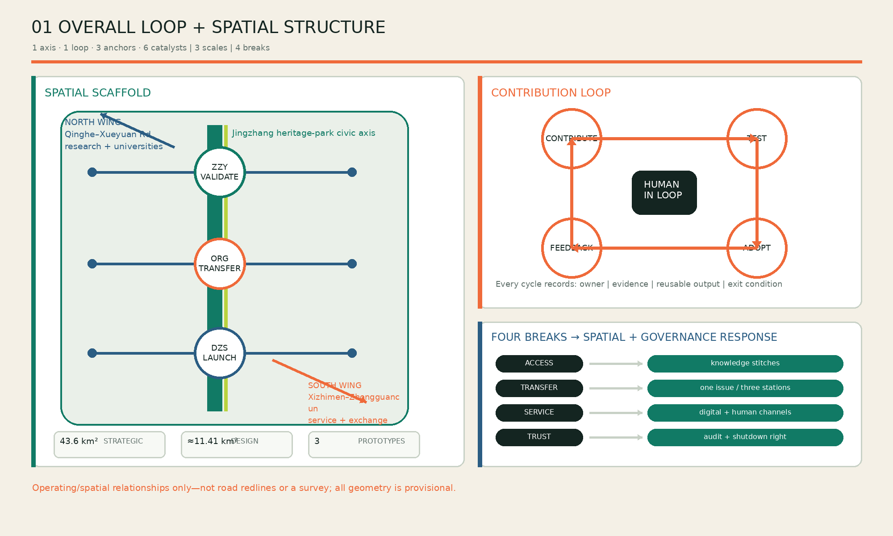
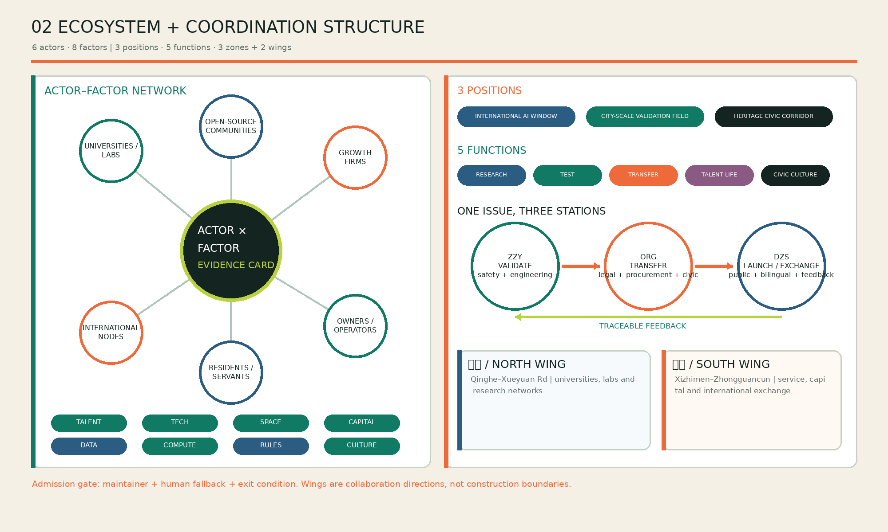
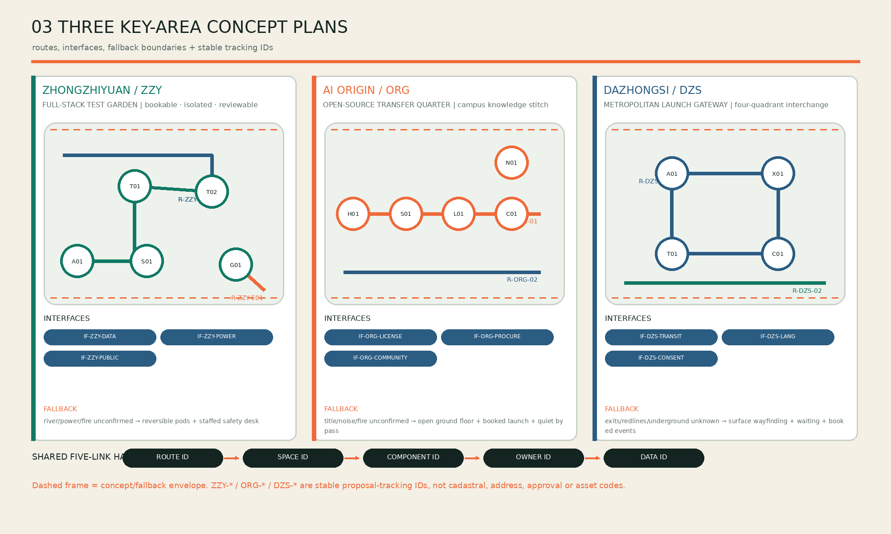
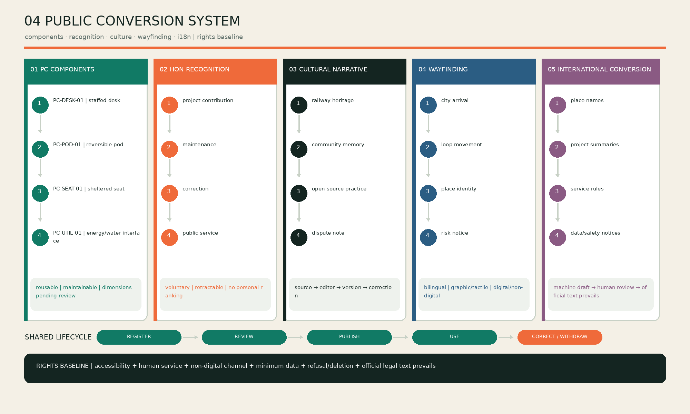
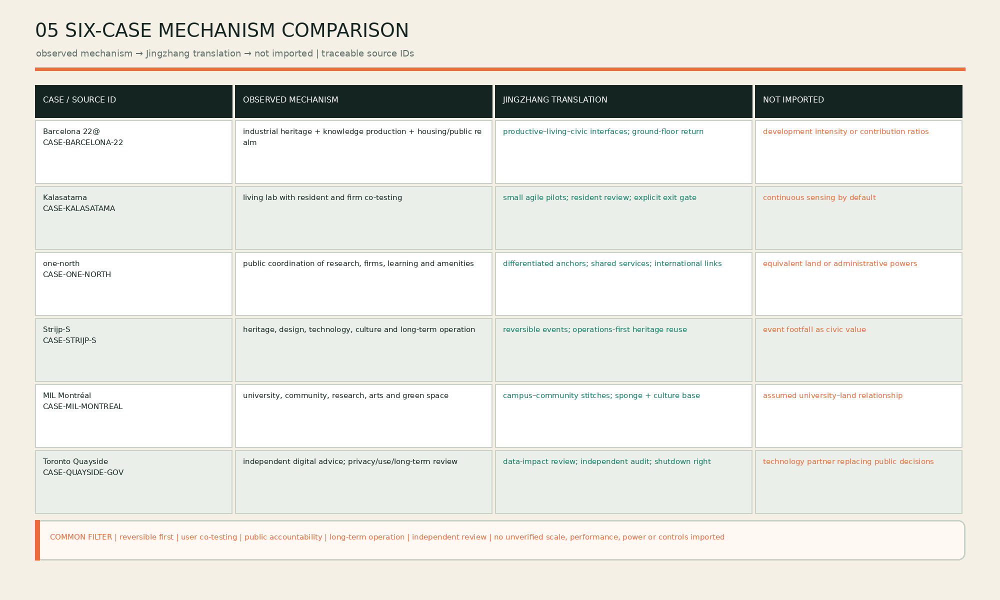

# JINGZHANG OPEN LOOP

> The project is not another technology corridor. Every contribution, test, spatial use and civic response must feed the next iteration. The loop is spatial, institutional, operational and social.

## 01 Evidence Boundary and Diagnosis
The proposal follows the official announcement, agent taskbook and registered site package [source:OFFICIAL-ANNOUNCEMENT] [source:AGENT-TASKBOOK]. The submitted overall boundary and three key areas are provisional geometry, not statutory redlines. Land use, buildings, green/public space, phasing and metrics must be recalculated when official polygons arrive [data:geometry/site_boundary.geojson#SITE-001] [depth:risk_missing_data].

Four breaks shape the response: fragmented east–west access; weak research-to-test interfaces; dispersed enterprise/talent/resident services; and missing audit loops for AI use. One public axis, one service loop, three anchors and six renewal catalysts answer these gaps.

## 02 Three Scales and Spatial Framework
The 43.6 km² strategic scope links universities, firms, communities and international networks. The approximately 11.41 km² design scope delivers spatial systems. Three key areas act as implementable prototypes [metric:site_area_sqm] [metric:key_area_count] [depth:three_level_scope_framework].

| Scale | Action | Verifiable output |
| --- | --- | --- |
| Strategic | contribution–test–adoption–feedback chain | annual issues, contribution ledger, scene register |
| Overall design | heritage-park axis plus knowledge stitches | land use, mobility, blue-green and service layers |
| Key areas | differentiated prototypes | test at Zhongzhiyuan, transfer at Origin, launch at Dazhongsi |

The loop uses existing streets, park paths, transit connections and civic nodes rather than claiming a new road redline [data:geometry/roads.geojson#ROAD-001] [standard:MOHURD-URBAN-DESIGN-MEASURES].

### Spatial motif: open ring, railway pair, contribution pulses

The Open Loop is not a form to be completed in one build-out; it is a spatial grammar that can work segment by segment. The **open ring** keeps apertures for entry, correction and exit rather than closing innovation inside a campus. The **railway pair** overlays the north–south continuity of Jingzhang heritage with east–west knowledge stitches among campuses, firms and communities. **Contribution pulses** make test gardens, staffed service desks, launch halls and civic landmarks legible. Together they represent public ground, cross-boundary connection and visible feedback.

The motif keeps one logic at all three scales: collaboration forms the strategic loop; the park axis and walking stitches form the overall loop; and each key area forms a smaller arrival–test/service–feedback–exit loop. Dark green means dependable public ground, bright green means contribution that may grow, and orange means a gate where a person must decide. Colours and IDs are review language, not statutory classifications. No crossing, station-area addition or new building gains implementation authority from the motif alone.

| Motif element | Spatial action | Operating action | Evidence boundary |
| --- | --- | --- | --- |
| Heritage-park public axis | retain continuous north–south public ground | host daily movement, correctable culture and public service | does not infer heritage limits, ownership or engineering conditions |
| Open-source service loop | link anchors through existing streets, park paths, interchange and nodes | return issues after validation, transfer and release | not a new road redline; “30 minutes” is not a traffic-engineering guarantee |
| Three contribution pulses | differentiate validation, transfer and launch interfaces | use shared IDs and handover packs | all key-area boundaries are provisional |
| Six renewal catalysts | move from reversible installations to conditional structural work | apply continue, adjust or exit gates | later phases depend on statutory, title, engineering and operating review |

## 03 Global Cases, Ecosystem and Coordination

The six references below transfer mechanisms only. Their scale, performance, development rights and governance powers are not assumed to apply in Beijing.

| Case | Mechanism observed | Jingzhang translation | Not imported |
| --- | --- | --- | --- |
| Barcelona 22@ | industrial heritage renewed with knowledge production, housing and public realm [source:CASE-BARCELONA-22] | mixed productive/public interfaces and ground-floor return | development intensity or contribution ratios |
| Helsinki Kalasatama | a living lab for residents and firms to co-create urban services [source:CASE-KALASATAMA] | agile pilots, resident review and explicit exit gates | continuous sensing by default |
| Singapore one-north | a public development agency coordinates research, firms, learning and amenities [source:CASE-ONE-NORTH] | differentiated anchors, shared services and international links | equivalent land or administrative powers |
| Eindhoven Strijp-S | industrial heritage combines with design, technology, culture and long-term operation [source:CASE-STRIJP-S] | reversible events and operations-first heritage reuse | event footfall as a proxy for civic value |
| MIL Montréal | university, community, research, arts and green public space meet in one renewal project [source:CASE-MIL-MONTREAL] | campus-community stitches and sponge/culture public realm | assumed university-land relationships |
| Toronto Quayside governance review | an independent digital advisory process exposed privacy, use and long-term governance questions [source:CASE-QUAYSIDE-GOV] | data-impact review, independent audit and shutdown rights before deployment | a technology partner replacing public decisions |

The ecosystem map links six actors—universities/labs, open-source communities, firms, owners/operators, residents/public servants and international nodes—with eight factors: talent, technology, space, capital, data, compute, institutions and culture. Every annual project must complete an actor–factor–interface–owner–evidence card. Capital and compute cannot bypass data responsibility or public interest; resident feedback and culture are admission factors, not communications add-ons.

**Three positions, five functions, three zones and two wings.** The three positions are an international AI exchange window, a city-scale open-source validation field and a public Jingzhang heritage corridor. The five functions are research, testing, transfer, talent living and civic culture. The three zones are Zhongzhiyuan Validation, AI Origin Transfer and Dazhongsi Launch/Exchange. The north wing connects Qinghe and Xueyuan Road research networks; the south wing connects Xizhimen, Zhongguancun services and international exchange. “Wing” denotes a collaboration direction, not a new construction boundary. One issue visits three stations: safety/engineering at Zhongzhiyuan, legal/procurement/community adaptation at Origin, then public demonstration, international interpretation and adoption feedback at Dazhongsi.

Five conversion systems make this coordination legible: (1) reusable public components with `PC-type-number` IDs; (2) voluntary, retractable, non-ranked contribution recognition with `HON-year-number`; (3) source-registered and correctable railway/community/open-source narratives; (4) four-level bilingual, graphic/tactile and digital/non-digital wayfinding with `R-level-number`; and (5) human-reviewed international conversion for names, summaries, service rules and data/safety notices. Component dimensions remain conceptual until structure, fire and accessibility review; official policy and legal translations prevail.

## 04 Land Use, Buildings and Public Realm
Four mixed zones support AI R&D, heritage park/open space, industry/commerce, and talent living. They are design calculations, not approved controls [standard:MNR-LAND-USE-CLASSIFICATION-GUIDE] [data:geometry/land_use.geojson#LU-001]. Buildings follow retain first, reversible retrofit second, statutory-control-dependent addition last [depth:retain_renovate_demolish].

The design layers calculate a 12.34% green ratio and 7.33% public-space ratio [metric:green_ratio] [metric:public_space_ratio]. Public interfaces are either always-open paths, bookable test gardens or event-time launch spaces. Every gated or sensed area keeps a non-identifying route.

## 05 Three Key Areas
**Zhongzhiyuan — Full-stack Test Garden.** A bookable model–device–low-carbon-compute test environment with reversible installations and an ecological buffer [data:geometry/key_areas.geojson#PROV-KEY-001].

Its five-point loop comprises `ZZY-A01` public arrival, `ZZY-T01` closed safety testing, `ZZY-T02` edge-device testing, `ZZY-G01` Qinghe buffer and `ZZY-S01` staffed safety desk. `R-ZZY-01` is the visitor route, `R-ZZY-02` the booked equipment route and `R-ZZY-E01` the provisional flood evacuation route. `IF-ZZY-DATA`, `IF-ZZY-POWER` and `IF-ZZY-PUBLIC` govern deletion, load/heat/shutdown and public hours/non-identifying passage. Locations and capacities are conceptual pending river, utility, fire and ownership data.

**Beijing AI Origin Community — Open-source Transfer Quarter.** A near-campus knowledge stitch links a launch hall, IP/legal desk, talent commons and night collaboration space [data:geometry/key_areas.geojson#PROV-KEY-002].

`ORG-H01` launch hall, `ORG-S01` legal/IP stop, `ORG-L01` talent commons, `ORG-C01` staffed civic help and `ORG-N01` night collaboration sit on `R-ORG-01`; `R-ORG-02` is a quiet resident bypass. `IF-ORG-LICENSE`, `IF-ORG-PROCURE` and `IF-ORG-COMMUNITY` check licences, pilot procurement evidence and complaint/correction closure. Hours, noise limits and open-ground-floor extents remain pending.

**Dazhongsi — Metropolitan Launch Gateway.** Four-quadrant walking continuity, multilingual arrival, roadshow and compliant data-exchange spaces precede any station-area intensification [data:geometry/key_areas.geojson#PROV-KEY-003] [depth:three_key_area_detailed_design].

The quadrants hold `DZS-A01` staffed arrival, `DZS-X01` international roadshow, `DZS-T01` accessible device trials and `DZS-C01` compliant data meeting. `R-DZS-01` is the interchange loop and `R-DZS-02` a quiet, non-commercial bypass. `IF-DZS-TRANSIT`, `IF-DZS-LANG` and `IF-DZS-CONSENT` govern crossing evidence, terminology/human review, and notice/refusal/deletion. Station exits, road redlines, underground space and structural crossings remain unknown; the fallback is ground-level wayfinding, better waiting and booked events.

All three areas share a route-ID–space-ID–component-ID–owner-ID–data-ID handover. Moving a result from `ZZY-*` to `ORG-*` requires safety retest and licence checks; moving from `ORG-*` to `DZS-*` requires a public-interest note, bilingual summary, accessibility check and exit plan. Dazhongsi feedback returns as traceable issues. These are proposal tracking IDs, not cadastral, address, approval or asset identifiers.

| Key area | Irreplaceable task | Spatial prototype | Admission input | Release output | Failure fallback |
| --- | --- | --- | --- | --- | --- |
| Zhongzhiyuan `ZZY` | safety and engineering validation | isolatable test court + ecological buffer + staffed safety desk | issue card, protocol, data inventory, shutdown plan | `VALIDATION-PACK`: retest, risk classification and licence inventory | isolate, fix, retest or close; no public release |
| AI Origin `ORG` | licence, procurement and community adaptation | launch hall + professional-service stops + resident bypass | validation pack, licence check, procurement evidence and objections log | `ADOPTION-PACK`: adoption boundary, staffed fallback and response record | narrow scope, add staffed service or stop pilot |
| Dazhongsi `DZS` | public release, international interpretation and adoption feedback | four-quadrant arrival + accessible trial + compliant meeting | adoption pack, bilingual summary, accessibility, notice/deletion and exit plan | `RELEASE-RECORD`: public version, feedback issues and adopt/withdraw record | return to Origin; use ground-level improvements if engineering fails |

## 06 Five Personas
| Persona | Priority | Spatial response | Rights boundary |
| --- | --- | --- | --- |
| Open-source developer | collaborate, launch, reputation | Origin launch hall and code clinic | attribution is voluntary and retractable |
| Startup team | low-cost test and first customer | sandbox and enterprise desk | commercial datasets remain isolated |
| University community | learning, transfer, cross-campus work | knowledge stitches and transfer stops | research/campus data need authorization |
| Resident and older adult | commute, leisure, assistance | legible paths and human-backed help | human service remains available |
| International visitor/firm | arrival, roadshow, recruitment | gateway and multilingual route | translation is correctable; marks cleared |

## 07 Twelve AI+ Scenes
1. Open-source launch hall; 2. model-safety sandbox; 3. edge-compute stop; 4. explainable walking guidance; 5. accessible-route assistant; 6. Qinghe flood-warning garden; 7. enterprise-service copilot; 8. community AI help desk; 9. multilingual heritage guide; 10. low-carbon event scheduling; 11. intelligent-device trial street; 12. human-reviewed night-safety maintenance. Each scene states consent, minimum data, a human decision owner and an exit route.

## 08 Three Industry Testbeds
1. **Model and agent safety at Zhongzhiyuan:** offline evaluation, closed integration, then public demonstration; severe issues must be closed before release.
2. **Edge devices and accessibility at Dazhongsi:** voluntary multi-age usability testing with refusal and deletion rights.
3. **Human–AI civic service at Origin and the park axis:** AI recommends; staff decide. Evaluate correction and takeover rates, not automation alone.

## 09 Six Renewal Cases

### Five-gate implementation chain: issue to feedback

The machine-readable master is `visual/assets/implementation-chain.json`. It translates the spatial motif into auditable decisions rather than presenting a concept diagram as a construction programme:

1. **G0 Issue admission:** a public need, named maintainer, spatial host, public-interest note and exit condition are mandatory. Council admission permits testing, not planning or engineering approval.
2. **G1 Zhongzhiyuan validation:** isolated testing records safety retest, data inventory, load/heat and shutdown capacity in a `VALIDATION-PACK`; unresolved severe issues cannot leave the sandbox.
3. **G2 Origin transfer:** licence, procurement evidence, community objections and staffed fallback form the `ADOPTION-PACK`; a pilot is narrowed or stopped if public value or maintenance responsibility is unclear.
4. **G3 Dazhongsi release:** a `RELEASE-RECORD` requires a bilingual summary, accessibility review, notice/refusal/deletion controls and an exit plan. Demonstration is not procurement, approval or routine operation.
5. **G4 Feedback return:** issue tickets, human takeover, incident summary and maintenance capacity enter an annual continue–adjust–exit review. Basic passage and staffed service remain when a digital service stops.

The chain constrains phasing. G0–G4 can run end to end through reversible pilots in years 0–2. Adaptive reuse in years 3–5 additionally requires title, fire, accessibility, utility and operating checks. Structural work after year 5 requires separate statutory planning, official redlines, specialist engineering and funding/operations decisions. Operational measures in `visual/assets/implementation-chain.json` are marked `future_operational_metric`; they are not represented as current performance.

| ID | Case | Near term | Mid term | Outcome |
| --- | --- | --- | --- | --- |
| JZ-01 | Fifth Ring walking stitch | wayfinding, lighting, underpass pilot | structural crossing study | break-point closure |
| JZ-02 | Qinghe test garden | reversible pods and rain garden | low-carbon R&D court | test reuse |
| JZ-03 | Origin open-source street | open ground floors and launch hall | adaptive retrofit | transfer and satisfaction |
| JZ-04 | Dazhongsi gateway | waiting space and multilingual signs | station integration study | interchange experience |
| JZ-05 | edge compute/service nodes | three light nodes | energy-compute network | energy and takeover rate |
| JZ-06 | annual Open Loop route | open day and test week | international season | repeat visits and issue closure |

## 10 Three Civic Landmarks
**Contribution Beacon** at Origin shows authorized milestones without ranking people. **Co-pilot Gate** at Dazhongsi makes “AI advises, people decide” the arrival message. **Compute Garden** at Zhongzhiyuan links energy, stormwater and test status without exposing sensitive data.

## 11 Operations and Governance
A multi-stakeholder council approves the annual scene register and data rules; a lean operator manages booking, safety and partnerships; topic maintainers govern issues, protocols and defect closure. Weekly code clinics, monthly scene open days, quarterly city test weeks and an annual open-source city season create cadence. Public passage and essential community help remain free [depth:phasing_implementation].

## 12 Mobility, Infrastructure and Resilience
Priority is continuous walking, accessibility, cycling, shuttle circulation, then vehicle optimization. Fifth Ring and Dazhongsi crossings require specialist review. No engineering promise is made before road, fire, utility, river and heritage conditions are confirmed [data:geometry/constraints.geojson#CONSTRAINTS] [depth:traffic_rail_slow_parking].

## 13 Metrics, Risk and Recalculation

Current reproducible values are 11,412,825.386 m² site area, 0.123423 green ratio, 0.073281 public-space ratio, three key areas, twelve scenes, three testbeds and six cases [metric:site_area_sqm] [metric:green_ratio] [metric:public_space_ratio]. FAR, height, road redlines and final development capacity remain unknown.

Key risks are boundary/title mismatch, privacy or algorithmic harm, event disturbance, commercial capture, engineering safety and operational shortfall. Responses include recalculation, suspension and human takeover, time/capacity limits, protected public hours, non-structural fallback and modular downsizing. The full chain—geometry, metrics, implementation interfaces, five figures, HTML, PDFs and self-check—must be rerun after any official geometry replacement [depth:metrics_recalculation] [standard:PROJECT-OFFICIAL-ANNOUNCEMENT].

## 14 Copyright, Licence and Use Disclaimer

The package uses locally generated diagrams and layouts. External case pages are cited as research evidence only; their text, images, maps, marks and design rights are not reproduced. Local fonts are runtime dependencies and are not redistributed. Provisional geometry, concept IDs and calculated ratios are not statutory redlines, approvals, addresses, engineering instructions or partnership commitments. Machine-assisted English has been human-reviewed for package parity, but official Chinese policy and legal instruments prevail. See `report/copyright_statement.md`, `sources.json`, `assumptions.json` and `visual/assets/implementation-chain.json` for the asset ledger, source status, unresolved data and decision gates.
