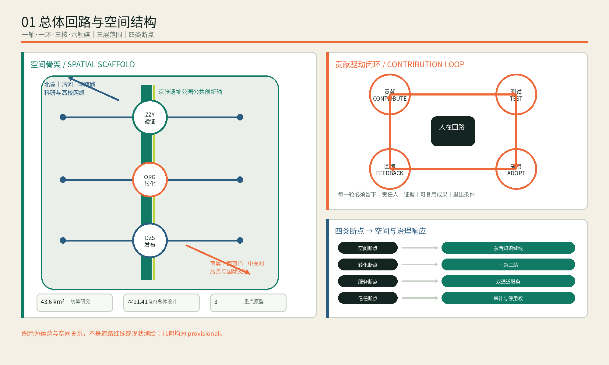
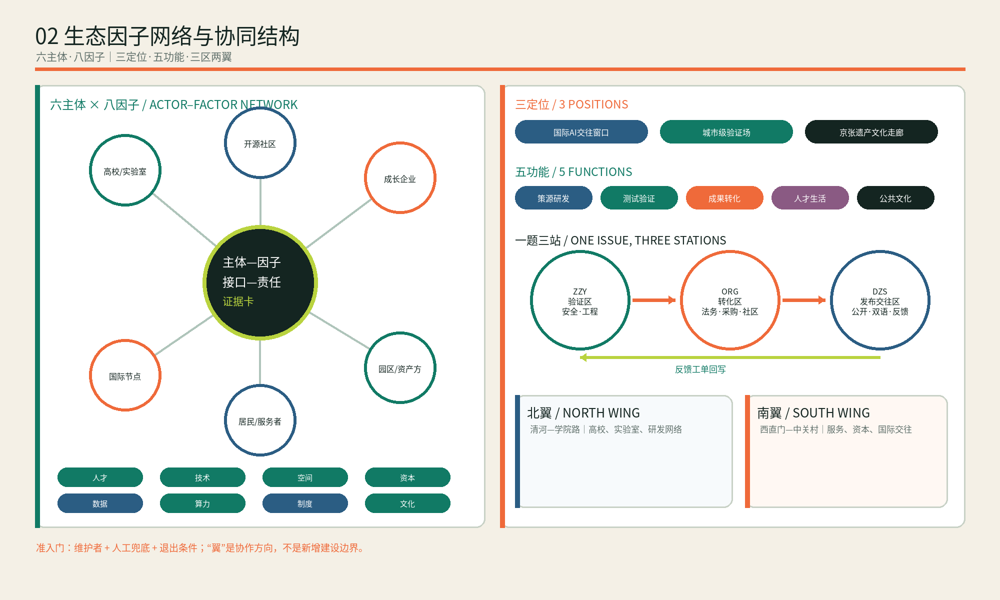
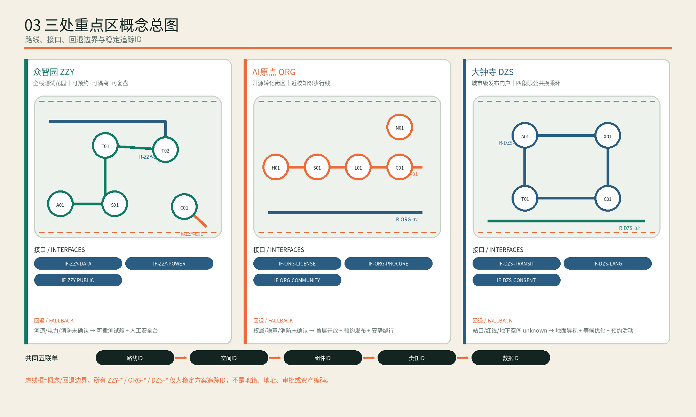
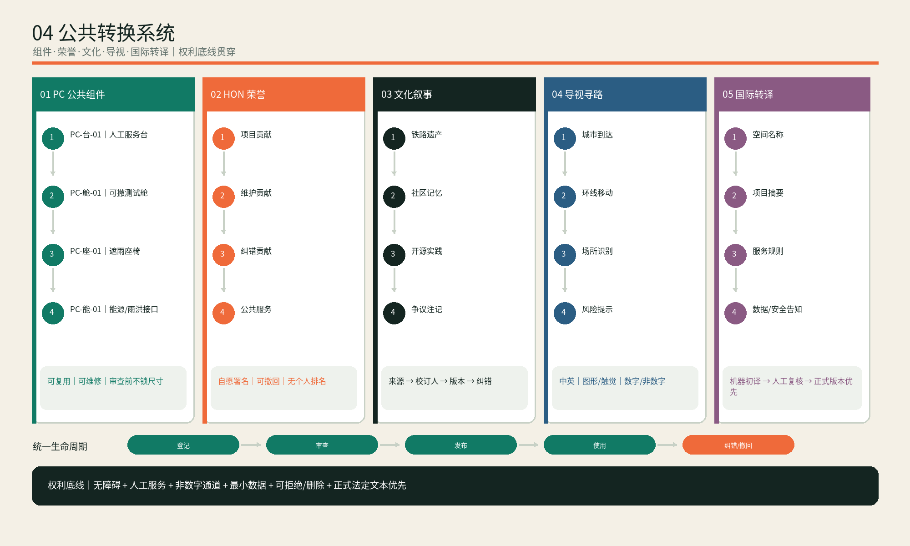
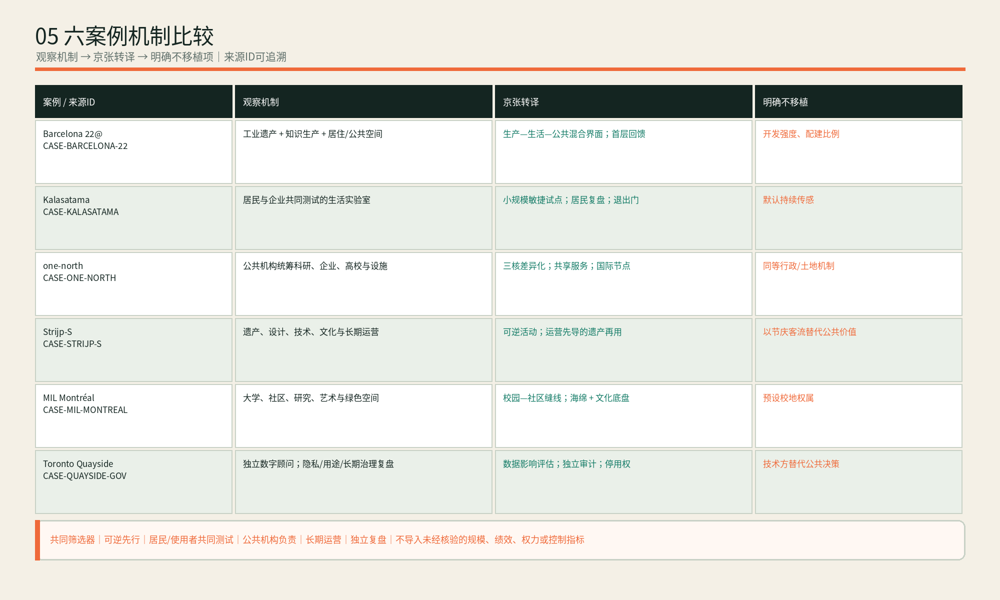

# 京张开源环 / JINGZHANG OPEN LOOP

> **设计命题**：不是再造一条“科技走廊”，而是让每一次代码贡献、空间使用、城市测试和公共反馈，都能回到下一轮改进。开源环既是空间环，也是治理环、人才环和运营环。

## 设计依据与资料清单

方案以官方公告、智能体任务书和场地包为依据 [source:OFFICIAL-ANNOUNCEMENT] [source:AGENT-TASKBOOK]。当前总体边界与三处重点区为组织方登记的 provisional geometry：仅用于方案生成、比较与复算，不是法定红线；替换正式边界后须重算用地、建筑、绿地、公共空间、分期及指标 [data:geometry/site_boundary.geojson#SITE-001] [depth:risk_missing_data]。

诊断归纳为四个断点：**空间断点**（铁路遗址、公园、站点与园区之间横向联系不足）；**转化断点**（高校成果到企业测试缺少可见接口）；**服务断点**（企业、人才、居民服务分散）；**信任断点**（AI测试、数据使用和公共反馈缺少可审计闭环）。因此本案用“一轴、一环、三核、六触媒”把物理更新与开源治理叠合。

资料采用“来源—用途—限制—更新动作”四栏登记：公告用于确认任务范围，智能体任务书用于确认场景和运营深度，场地包用于结构化校核，公开标准用于分类与专业表达。任何 background_only 或 provisional_only 资料均不升级为法定依据。正式边界、控规、权属、道路红线、市政管线、防洪、消防、文保和公共服务现状属于待补资料；这些缺口被写入假设和风险，而不是用推测数值填充。方案图是解释层，GeoJSON、metrics 与矩阵才是复算层 [source:SOURCE-REGISTRY]。

## 三层范围工作框架

统筹研究范围（43.6 km²）组织高校—企业—社区—国际网络；总体设计范围（约11.41 km²，按提交边界复算）落实空间、交通与设施；三处重点区域承担可实施原型 [metric:site_area_sqm] [metric:key_area_count] [depth:three_level_scope_framework]。

| 层级 | 核心动作 | 可验证输出 |
| --- | --- | --- |
| 统筹研究 | 建立“贡献—测试—采用—回馈”创新链 | 年度开源议题、贡献账本、场景开放清单 |
| 总体设计 | 形成遗址公园公共轴与东西向知识缝线 | 用地、慢行、蓝绿、公共服务图层 |
| 重点区域 | 三种创新原型差异化落地 | 众智园测试、原点转化、大钟寺发布 |

空间结构为：**一轴**（京张遗址公园公共创新轴）、**一环**（约30分钟骑行串联的开源服务环）、**三核**（众智园、AI原点社区、大钟寺）、**六触媒**（下文六个更新案例）。环不等于新道路红线，而是由既有道路、公园慢行、轨道接驳和公共空间节点组成的运营网络 [data:geometry/roads.geojson#ROAD-001] [standard:MOHURD-URBAN-DESIGN-MEASURES]。

### 空间母题：未闭合环、铁路双线、贡献脉冲

“开源环”不是一个需要一次建成的造型，而是一套可逐段成立的空间语法。**未闭合环**保留进入、纠错与退出的缺口，表达公共创新永不以封闭园区收口；**铁路双线**把京张遗产的南北连续性与高校—园区—社区的东西知识缝线叠合；**贡献脉冲**把测试庭、人工服务台、发布厅和公共地标组织成可读节点。三者分别对应公共底盘、跨界连接和可见回馈。

母题在三个尺度保持同一逻辑：统筹范围用协作网络成环，总体范围用公园轴与慢行缝线成环，重点区用“到达—测试/服务—反馈—退出”小回路成环。深绿只表示可靠公共底盘，荧光绿只表示可生长贡献，橙色只表示必须由人作决定的门；颜色和ID是审阅语言，不是法定分类。任何跨路结构、站城增量或新增建筑都不能凭母题自动获得实施正当性。

| 母题构件 | 空间动作 | 运营动作 | 事实边界 |
| --- | --- | --- | --- |
| 遗址公园公共轴 | 保持南北连续公共地面 | 承载日常慢行、文化校订与公共服务 | 不推定文保范围、现状权属或工程条件 |
| 开源服务环 | 以既有路网、公园路径、接驳和节点串联三核 | 让议题在验证、转化、发布后回写 | 不是新增道路红线，不承诺“30分钟”达到交通工程标准 |
| 三处贡献脉冲 | 三地分别强化验证、转化、发布界面 | 用统一ID和交接包减少责任断点 | 重点区边界均为 provisional |
| 六个更新触媒 | 从可逆设施走向条件性结构工程 | 每期设继续、调整、退出门 | 后续阶段取决于法定、权属、工程和运营复核 |

## 统筹研究范围产业与未来城市研究

统筹层不追求把所有资源画进一张“大而全”的图，而是建立四条可运营链：高校与开源社区组成策源链，众智园测试条件组成验证链，企业与专业服务组成转化链，遗址公园和大钟寺门户组成公共传播链。四链通过公开议题、测试协议、采用案例和问题回写连接；每个年度议题必须同时指定技术维护者、空间承载者、公共利益说明和退出条件。这样，“AI创新生态”不再只以企业数量衡量，而以跨组织协作是否留下可复用成果衡量 [depth:overall_spatial_structure]。

未来城市形态被定义为“低门槛进入、可解释使用、可撤回参与、可持续维护”。研发空间强调共享测试与合规服务，生活空间强调人工服务兜底和无障碍，公共空间强调非识别通行，文化空间强调可校订叙事。对国际人才的吸引不是封闭园区福利，而是开放知识网络、稳定生活服务、多语到达和可见贡献机制的组合 [source:AGENT-TASKBOOK]。

### 六个有来源的全球参照案例

以下案例只提炼机制，不移植未经核验的规模、绩效或控制指标；每项结论均以所列公开机构页面为来源，具体适用性仍须结合北京治理、产权与工程条件复核。

| 案例 | 可借鉴机制 | 对京张的转译 | 不照搬项 |
| --- | --- | --- | --- |
| 巴塞罗那 22@ | 工业遗产更新与知识型生产、居住和公共空间并置 [source:CASE-BARCELONA-22] | “生产—生活—公共”混合界面及首层回馈 | 不引用其开发强度和配建比例 |
| 赫尔辛基 Kalasatama | 以生活实验室让居民、企业共同测试城市服务 [source:CASE-KALASATAMA] | 小规模敏捷试点、居民复盘、明确退出门 | 不默认传感器持续采集 |
| 新加坡 one-north | 公共开发机构统筹科研、企业、高校与社区设施 [source:CASE-ONE-NORTH] | 三核差异化、共享服务和国际节点网络 | 不推定同等行政或土地机制 |
| 埃因霍温 Strijp-S | 工业遗产、设计、技术、文化活动和长期运营结合 [source:CASE-STRIJP-S] | 遗址叙事、可逆活动与运营先导 | 不将节庆客流等同日常公共价值 |
| 蒙特利尔 MIL Montréal | 大学、社区、研究、艺术与绿色公共空间共同更新 [source:CASE-MIL-MONTREAL] | 校园—社区缝线和“海绵+文化”公共底盘 | 不推定校地权属关系 |
| 多伦多 Quayside 数字治理复盘 | 独立数字策略顾问机制与对隐私、数据用途、长期治理的公开讨论 [source:CASE-QUAYSIDE-GOV] | 场景先做数据影响评估、独立复盘与停用权 | 不以技术合作方替代公共决策 |

### 生态与因子图谱

生态由六类主体和八项因子组成。主体是高校/实验室、开源社区、成长企业、园区/资产方、居民/公共服务者、国际节点；因子是人才、技术、空间、资本、数据、算力、制度、文化。任何项目进入年度清单前，必须填写“主体—因子—接口—责任—证据”卡：谁提出问题、调用哪些公共/商业资源、在哪个空间测试、谁作最终决定、产生何种可复用成果。资本和算力不能绕过数据责任与公共利益；文化与居民反馈不是宣传尾项，而是项目准入因子。

### “三定位、五功能、三区两翼”协同

- **三定位**：国际AI创新交往窗口、开源成果城市级验证场、京张遗产公共文化走廊。
- **五功能**：策源研发、测试验证、成果转化、人才生活、公共文化。
- **三区**：众智园“验证区”、AI原点“转化区”、大钟寺“发布交往区”。
- **两翼**：北翼连接清河—学院路高校与研发网络，南翼连接西直门—中关村服务与国际交往网络；“翼”是协作和服务方向，不是新增建设边界。

协同规则采用“一题三站”：同一议题在众智园完成安全/工程验证，在原点完成法务、采购和社区适配，在大钟寺完成公开演示、国际转译与采用反馈。五功能由年度任务单分配到三区两翼，未落实维护者、人工兜底或退出条件的项目不得进入公共场景。

### 五套公共转换系统

1. **公共组件系统**：可复用服务台、测试舱、无障碍坡台、遮雨座椅、能源/雨洪接口采用 `PC-类型-序号`；组件参数在正式结构、消防和无障碍审查前均为概念级。
2. **荣誉与贡献系统**：项目、维护、纠错、公共服务四类贡献采用自愿署名、可撤回授权、无个人排名；实体铭牌和数字记录使用 `HON-年度-序号`。
3. **文化叙事系统**：铁路遗产、社区记忆、开源实践三条叙事线；每条内容须登记出处、校订人、版本与争议注记，禁止用生成内容冒充史料。
4. **导视寻路系统**：城市到达、环线移动、场所识别、风险提示四级；中文/英文、图形/触觉、数字/非数字并行，路线编号使用 `R-层级-序号`。
5. **国际转译系统**：空间名称、项目摘要、服务规则、数据/安全告知形成中英双语主版本；机器翻译须人工复核，政策与法律文本以主管部门正式版本为准。

## 总体设计范围城市更新与控规深度城市设计

总体设计把统筹策略转译为空间主次：遗址公园轴承担连续公共性，东西向知识缝线连接校园、园区、社区和轨道，三核承担不同的高强度活动，社区节点承担低强度高频服务。更新采用“运营先导—轻量空间—结构工程”三级门槛：可逆导视、开放日和服务台可先启动；首层改造、测试庭和雨洪花园需权属及安全条件；跨路结构、站城一体化与新增体量必须进入专业审批 [depth:renewal_project_list]。

承载力不以单一容积率替代。近期评估关注步行连续性、活动容量、噪声、能源、算力热管理和人工服务能力；中长期再叠加控规强度、交通影响、市政容量和公共服务供给。所有强度与高度保持 pending_control，避免把概念方案误读为审定控制 [standard:MOHURD-CONTROL-DETAILED-PLANNING]。

## 用地、建筑规模与拆改留方案

用地采用四类复合分区：AI研发创新、遗址公园与开敞空间、产业/商业服务、人才生活配套；用途表达遵循分类指南，面积为设计图层复算而非审定控规 [standard:MNR-LAND-USE-CLASSIFICATION-GUIDE] [data:geometry/land_use.geojson#LU-001]。建筑采取“保留优先、轻改造先行、增量待控规”的三段法：首层开放界面和存量屋顶可先试点；新增体量、建筑高度、容积率、退线必须待正式控规与权属确认 [depth:retain_renovate_demolish] [data:geometry/buildings.geojson#BLDG-001]。

绿地率按设计绿地层为12.34%，公共空间率为7.33%；两者是当前几何的复算值，不是法定指标 [metric:green_ratio] [metric:public_space_ratio]。公共空间设置三类界面：24小时通行的环、预约开放的测试庭、活动时开放的发布场。所有门禁与传感设备保留无识别通道。

拆改留决策采用六项检查：结构安全、历史文化价值、使用适配性、全生命周期碳、权属实施性和公共界面贡献。未取得建筑普查与权属信息前，只标记“保留优先/适应性改造候选/增量待确认”，不标记强制拆除。建筑基底图层表达设计原型，不代表现状测绘；正式深化须逐栋校核 [metric:building_footprint_area_sqm]。

## 重点区域详细设计

### 众智园：全栈测试花园
沿清河界面布置“模型—终端—低碳算力”测试庭，形成可预约、可隔离、可复盘的产业测试环境。保留生态缓冲，测试区采用可撤除设施；对外交通与河道条件需专项复核 [data:geometry/key_areas.geojson#PROV-KEY-001]。

**结构、接口与路线**：以 `ZZY-A01` 公共到达厅、`ZZY-T01` 封闭安全测试庭、`ZZY-T02` 端侧设备庭、`ZZY-G01` 清河生态缓冲、`ZZY-S01` 人工安全台构成“五点一回路”。访客路线 `R-ZZY-01` 从园区入口至可公开演示边界；物流/设备路线 `R-ZZY-02` 独立预约；防汛撤离路线 `R-ZZY-E01` 须待河道和应急资料确认。接口 `IF-ZZY-DATA` 执行数据分级与删除，`IF-ZZY-POWER` 记录负荷/散热/关停，`IF-ZZY-PUBLIC` 控制开放时段和无识别通道。建筑位置、宽度、容量均为概念接口，不构成施工条件。

### 北京AI原点社区：开源转化街区
以近校步行缝线串联成果发布厅、知识产权/法务驿站、人才客厅和夜间协作空间。贡献墙只展示自愿公开的项目与署名，不展示个人轨迹 [data:geometry/key_areas.geojson#PROV-KEY-002]。

**结构、接口与路线**：`ORG-H01` 开源发布厅、`ORG-S01` 法务/知识产权驿站、`ORG-L01` 人才客厅、`ORG-C01` 社区人工帮办、`ORG-N01` 夜间协作点沿 `R-ORG-01` 近校知识步行线串联；`R-ORG-02` 为居民安静绕行线。`IF-ORG-LICENSE` 核对代码/内容许可，`IF-ORG-PROCURE` 形成试点采购证据包，`IF-ORG-COMMUNITY` 记录居民异议、纠错与关闭。营业时段、噪声阈值和首层开放范围待权属、声环境和消防核验。

### 大钟寺：城市级发布门户
围绕轨道站四象限组织连续步行、国际路演、智能终端体验和数据合规会客厅。先做导视、路口等待空间与首层开放，再研究站城一体化增量 [data:geometry/key_areas.geojson#PROV-KEY-003] [depth:three_key_area_detailed_design]。

**结构、接口与路线**：四象限分别设置 `DZS-A01` 到达/人工问询、`DZS-X01` 国际路演、`DZS-T01` 无障碍终端试用、`DZS-C01` 数据合规会客；通过 `R-DZS-01` 公共换乘环与 `R-DZS-02` 安静无商业绕行线连接。`IF-DZS-TRANSIT` 对接轨道客流与过街，`IF-DZS-LANG` 管理术语和人工译审，`IF-DZS-CONSENT` 管理体验告知、拒绝与删除。站口、道路红线、地下空间和结构跨越均为 unknown，未获专项条件时回退为地面导视、等候优化和预约活动。

### 三处重点区共同交付接口

三地统一使用“路线ID—空间ID—组件ID—责任ID—数据ID”五联单。测试成果从 `ZZY-*` 进入 `ORG-*` 前须附安全复测和许可清单；从 `ORG-*` 进入 `DZS-*` 前须附公共利益说明、双语摘要、无障碍检查和退出方案；大钟寺收到的使用反馈以工单回写两地。所有ID仅用于方案追踪，不代表地籍、地址、审批或资产编码。

| 重点区 | 不可替代任务 | 空间原型 | 准入输入 | 放行输出 | 失败回退 |
| --- | --- | --- | --- | --- | --- |
| 众智园 `ZZY` | 安全与工程验证 | 可隔离测试庭 + 生态缓冲 + 人工安全台 | 议题卡、测试协议、数据清单、关停方案 | `VALIDATION-PACK`：复测记录、风险分级、许可清单 | 隔离、修复、复测或关闭，不进入公众场景 |
| AI原点 `ORG` | 许可、采购与社区适配 | 开源发布厅 + 专业服务驿站 + 居民绕行 | 验证包、许可核对、采购证据、居民异议台账 | `ADOPTION-PACK`：采用边界、人工兜底、异议处置 | 缩小范围、补充人工服务或停止试点 |
| 大钟寺 `DZS` | 公开发布、国际转译与采用反馈 | 四象限到达 + 无障碍体验 + 合规会客 | 采用包、双语摘要、无障碍检查、告知/删除、退出计划 | `RELEASE-RECORD`：公开版本、反馈工单、采用/撤回记录 | 回到原点修订；工程不成立时退回地面改善 |

## AI 创新生态、人才画像与 AI+ 场景

场景不是安装设备清单，而是“需求—空间—数据—人工—退出”的完整服务契约。五类画像用于检查服务是否遗漏，不用于预测个人偏好；十二个场景按公共价值、技术成熟、数据风险和运营能力四项分级。任何高风险场景都必须先在隔离环境验证，再进入小范围共驾，最后才讨论常态运行 [data:geometry/public_space.geojson#PUBLIC-001]。

### 五类用户画像

| 画像 | 一天中的关键任务 | 空间响应 | 权利边界 |
| --- | --- | --- | --- |
| 开源开发者 | 协作、发布、测试、获得贡献认可 | 原点发布厅、夜间工位、代码诊所 | 署名可撤回，不以贡献量推断能力 |
| 初创团队 | 低成本试验、合规咨询、首单验证 | 众智园沙盒、企业服务台 | 商业数据隔离，测试失败可复盘 |
| 高校师生 | 课程、转化、跨校协作 | 校园—园区知识缝线、成果驿站 | 科研成果和校园数据须授权 |
| 周边居民与银发群体 | 通勤、休闲、办事、照护 | 无感慢行、社区AI帮办、安静时段 | 保留人工窗口，不做人脸默认识别 |
| 国际访客与企业 | 到访、路演、招聘、理解生态 | 大钟寺门户、多语导视、演示路线 | 翻译结果可纠错，企业标识须清权 |

### 十二个AI+场景

| # | 场景 / 位置 | 服务对象与闭环 | 数据与人工复核 |
| --- | --- | --- | --- |
| 01 | 开源发布厅 / 原点 | 项目发布→社区评议→版本迭代 | 自愿提交；主持人审核 |
| 02 | 模型安全沙盒 / 众智园 | 红队测试→问题分级→修复复测 | 隔离测试；安全负责人签字 |
| 03 | 端侧算力驿站 / 三核 | 预约算力→能耗计量→错峰激励 | 账户最小化；运维复核 |
| 04 | 可解释慢行导航 / 公园轴 | 断点识别→绕行建议→工单反馈 | 匿名流量；交通人员复核 |
| 05 | 无障碍路径助手 / 全环 | 障碍上报→安全路径→整改回访 | 不保存健康标签；人工确认 |
| 06 | 清河雨洪预警庭 / 众智园 | 水位感知→分级提示→封控解除 | 环境传感；防汛值守决策 |
| 07 | 企业服务共驾 / 三核 | 需求诊断→政策匹配→专员办理 | 企业授权；专员终审 |
| 08 | 社区AI帮办 / 社区节点 | 事项解释→材料清单→人工窗口 | 不代办审批；柜员确认 |
| 09 | 多语遗产导览 / 公园轴 | 故事检索→路线讲解→纠错回写 | 公开资料；专家校订 |
| 10 | 低碳活动调度 / 全环 | 人流预测→场地排期→能源复盘 | 聚合数据；运营经理确认 |
| 11 | 智能终端试用街 / 大钟寺 | 体验→无障碍测试→企业改进 | 明示同意；观察员记录 |
| 12 | 夜间安全共治 / 原点 | 照明巡检→风险上报→物业闭环 | 不做人脸追踪；人工派单 |

### 三个产业测试验证场

1. **模型与智能体安全测试场（众智园）**：分为离线评测、封闭联调、公众演示三级；退出条件是严重事件清零、问题有责任人、日志可审计。
2. **端侧终端与无障碍测试场（大钟寺）**：以真实但自愿的多龄用户完成可用性测试；任何采集先告知、可拒绝、可删除。
3. **城市服务共驾测试场（原点—公园轴）**：AI只给建议，工作人员做最终决定；以办事时间、纠错率、人工接管率评估，不以“自动化率”单独考核。

## 更新项目清单、实施政策与分期计划

实施分为三期：0—2年以可逆设施、服务台、开放日和治理制度验证需求；3—5年推进存量建筑适应性改造、测试花园和关键慢行界面；5年以后仅在控规、权属、工程和运营评估通过后推进结构性跨越与站城一体化。每期设置“继续、调整、退出”门，问题关闭率、人工接管率、公共时段保障和居民反馈比单纯客流更重要 [data:geometry/phasing.geojson#PHASE-001]。

政策工具包括：公共首层换取机制、可逆试点许可、场景数据影响评估、开源成果采购指引、无障碍共同测试、公益时段下限和跨主体问题台账。责任主体不是笼统的“政府/企业”，而是按议题明确资产方、运营方、技术维护者、数据责任人、现场安全人和公众联络人。

### 从议题到回写的五门实施链

机器可读主版本见 `visual/assets/implementation-chain.json`。它把空间母题转为五道可审计决策门，而不是把概念图误写成施工计划：

1. **G0 议题准入**：公共需求、维护者、空间承载者、公共利益说明和退出条件缺一不可；理事会只决定是否进入试验，不授予规划或工程许可。
2. **G1 众智园验证**：在隔离环境记录安全复测、数据清单、负荷/散热和关停能力，形成 `VALIDATION-PACK`；未关闭严重问题不得外溢。
3. **G2 原点转化**：核对许可、采购证据、社区异议和人工兜底，形成 `ADOPTION-PACK`；无法解释公共价值或承担维护责任则缩小或停止。
4. **G3 大钟寺发布**：双语摘要、无障碍检查、体验告知/拒绝/删除和退出计划齐备后，才形成 `RELEASE-RECORD`；公开演示不等同采购、审批或常态运营。
5. **G4 反馈回写**：问题工单、人工接管、事故摘要和维护能力进入年度“继续—调整—退出”复盘；停用时保留基础通行和人工服务。

实施链与分期互相约束：G0—G4可以在0—2年的可逆试点中完整跑通；3—5年的适应性改造还须增加权属、消防、无障碍、市政和运营复核；5年以上结构工程必须另获法定规划、正式红线、专项工程和资金运营条件。`visual/assets/implementation-chain.json` 中的运营指标均标记为 `future_operational_metric`，不冒充当前绩效或既有事实。

### 六个更新案例

| 编号 | 更新案例 | 近期（0—2年） | 中期（3—5年） | 成效口径 |
| --- | --- | --- | --- | --- |
| JZ-01 | 五环慢行缝合 | 临时导视、安全照明、桥下试行 | 结构性跨越专项 | 断点工单关闭率 |
| JZ-02 | 清河测试花园 | 可撤除测试舱、雨洪花园 | 低碳公共研发庭 | 测试复用次数 |
| JZ-03 | 原点开源街 | 首层开放、发布厅、服务驿站 | 存量建筑适应性改造 | 项目转化与社区满意 |
| JZ-04 | 大钟寺四象限门户 | 路口等待区、多语导视 | 站城一体化研究 | 换乘步行体验 |
| JZ-05 | 端侧算力与公共服务节点 | 三个轻量节点 | 能源—算力协同网络 | 单任务能耗与接管率 |
| JZ-06 | 开源环年度活动路线 | 开放日与城市测试周 | 国际开源城市季 | 复访率、问题闭环率 |

### 三个公共地标

- **贡献灯塔 / Contribution Beacon（原点）**：把已授权的开源里程碑转为低亮度光带；无排行、不展示个人轨迹。
- **共驾门廊 / Co-pilot Gate（大钟寺）**：多语导视与可触摸城市模型构成到达第一站，强调“AI建议、人在回路”。
- **清河算力花园 / Compute Garden（众智园）**：以能耗、雨洪和测试状态的公共仪表盘连接技术与生态，不展示企业敏感数据。

## 蓝绿空间、公共空间与城市风貌

蓝绿系统不是景观背景，而是开源环的公共底盘。京张遗址公园承担南北连续性，清河界面承担生态与雨洪教育，口袋空间承担高频停留，测试花园承担预约式创新活动。雨洪、热环境、生境和活动容量共同决定使用边界；极端天气下优先保障疏散、排水和生态缓冲 [data:geometry/green_space.geojson#GREEN-001] [depth:blue_green_public_space]。

风貌语法来自“未闭合环、铁路双线、贡献节点”三种几何：深绿表达可靠公共底盘，荧光绿表达可生长贡献，橙色表达需要人介入的关键节点。新设施控制为低高度、可拆卸、不过度发光；历史文化叙事坚持资料可追溯、解释可校订，不用AI生成图像替代真实遗产证据。

## 交通、轨道、市政与公共服务设施

交通组织采用“先缝合、后增容”：先修复过街等待、导视、照明、无障碍坡度和非机动车停放，再评估接驳微循环与结构性跨越。轨道站周边把到达界面、四象限连通和首层公共服务一起设计。市政侧重点是端侧算力的电力、散热、噪声、关停和迁移条件，以及活动高峰的环卫、消防和应急容量 [depth:municipal_new_infrastructure]。

公共服务坚持双通道：AI解释与人工窗口并存，线上预约与现场排队并存，多语导视与图形触觉信息并存。服务绩效同时记录完成时间、纠错率、人工接管率和弱势群体可达性；不得以减少人工岗位作为单一成效。

空间落点由道路中心线、公共空间和三核节点共同表达：开源环主线承担跨片区连续通行，三核周边设置短距离接驳与非机动车停放，社区节点布置可步行到达的人工服务台。交通模型、轨道客流、停车供需和路口渠化资料尚未提供，因此图层只表达连接意图，不宣称通行能力或道路红线。深化时应开展工作日/活动日两套流量调查，无障碍连续性审计，以及夜间照明、消防到达、应急疏散与大型活动容量校核。市政方面需补充电力容量、通信、给排水、燃气、热力、环卫与地下管线资料；端侧算力必须记录峰值负荷、单位任务能耗、散热噪声和故障关停时间。公共服务节点则以15分钟步行可达为分析目标，但只有在获得人口、设施和路网数据后才计算正式覆盖率。若跨路结构或站城工程不可行，方案回退为地面导视、信号优化、分时接驳和运营性缝合，不以高成本工程作为开源环成立的前提 [data:geometry/roads.geojson#ROAD-001] [data:geometry/public_space.geojson#PUBLIC-001]。

## 运营、品牌与治理

采用“1个理事会 + 1个轻量运营公司 + N个议题维护组”。理事会由属地、园区、高校、企业、居民和无障碍代表组成，批准年度场景清单与数据规则；运营公司负责空间预约、活动、安全和商业合作；维护组管理开源议题、测试协议与缺陷关闭。收入由场地服务、企业测试、活动赞助和公共服务采购构成，公共通行与基础社区服务不得收费。

年度节律：每周代码诊所、每月场景开放日、每季城市测试周、每年开源城市季。品牌采用“未闭合圆 + 铁轨双线 + 节点脉冲”的几何语法，所有视觉资产可离线使用。治理坚持数据最小化、用途限定、保存期限、可撤回、人工接管、公开事故摘要六项原则 [depth:phasing_implementation]。

### 韧性与应急

慢行优先级为：连续人行 > 无障碍 > 骑行 > 接驳微循环 > 机动车优化。五环跨越与大钟寺路口列为需专项论证节点；道路红线、消防、管线、河道和文保条件未取得前，不做工程承诺 [data:geometry/constraints.geojson#CONSTRAINTS] [depth:traffic_rail_slow_parking]。端侧算力节点采用可关停、可迁移、分时运行策略，并预留热管理与应急断电。

## 指标体系、面积复算与合规矩阵

当前可复算：场地面积11,412,825.386 m²、绿地率0.123423、公共空间率0.073281、重点区3处、场景12个、测试场3个、更新案例6个 [metric:site_area_sqm] [metric:green_ratio] [metric:public_space_ratio]。容积率、建筑高度、道路红线与最终开发规模保持 unknown，待正式控规。

合规矩阵把公告1.3、1.4、1.5与agent.1—agent.6映射到章节、图层、指标、图纸和自检；标准矩阵记录每项专业标准的响应方式；设计深度矩阵记录诊断、结构、用地、强度、拆改留、交通、市政、蓝绿、分期和风险证据。五张图和PDF只做信息解释，不成为新的数据源。已知指标采用图层复算，未知指标说明缺口与确认责任 [depth:metrics_recalculation]。

## 风险、版权与合规说明

| 风险 | 触发信号 | 缓解与退出 |
| --- | --- | --- |
| 边界/权属误读 | 正式资料与现图不一致 | 冻结面积结论，整体重算并版本标记 |
| 隐私与算法伤害 | 投诉、误判、越权调用 | 停用场景、人工接管、独立复盘 |
| 活动扰民 | 夜间噪声/拥堵上升 | 分级时段、容量阈值、居民否决窗口 |
| 商业挤出公共性 | 公共时段被付费活动占用 | 公益时段下限、公开排期与审计 |
| 工程安全 | 跨路/河道专项不通过 | 回退为导视和运营性缝合 |
| 运营断供 | 收入覆盖不足 | 模块化收缩，保留基础通行与帮办 |

提交包所有图件由本地结构化数据和原创排版派生，不加载远程资源。正式替换边界后必须按“几何→指标→实施链接口→五图→HTML→PDF→自检”全链重跑 [depth:metrics_recalculation] [standard:PROJECT-OFFICIAL-ANNOUNCEMENT]。

版权方面，五张中英文图、离线HTML和A3/A0版式均为本次原创派生；不使用外部地图截图、企业商标、人物肖像或远程字体。Noto Sans CJK与DejaVu Sans仅用于本地排版。数据许可、来源和临时性在 `sources.json` 与版权声明中登记。方案不声称获得政府批准、企业合作承诺或工程实施许可。

## 参考资料

- 官方征集公告与公开任务要求 [source:OFFICIAL-ANNOUNCEMENT]
- 面向智能体任务书 [source:AGENT-TASKBOOK]
- `brief/site-package/` 机器可读场地包 [source:SITE-PACKAGE]
- `data/processed/agent_fact_pack.md` 阅读导航 [source:PROCESSED-FACT-PACK]
- 完整来源、假设、指标、实施链、标准、设计深度与任务映射分别见 `sources.json`、`assumptions.json`、`metrics.json`、`visual/assets/implementation-chain.json`、`standard_matrix.json`、`design_depth_matrix.json` 与 `compliance_matrix.json`。
