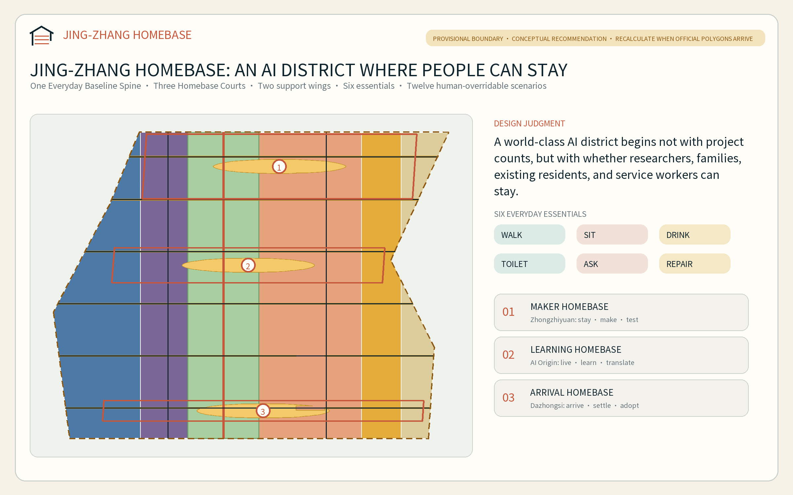
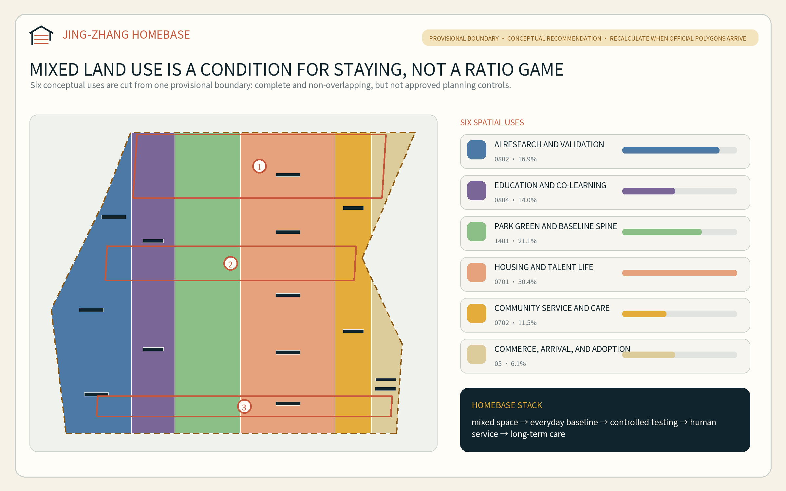
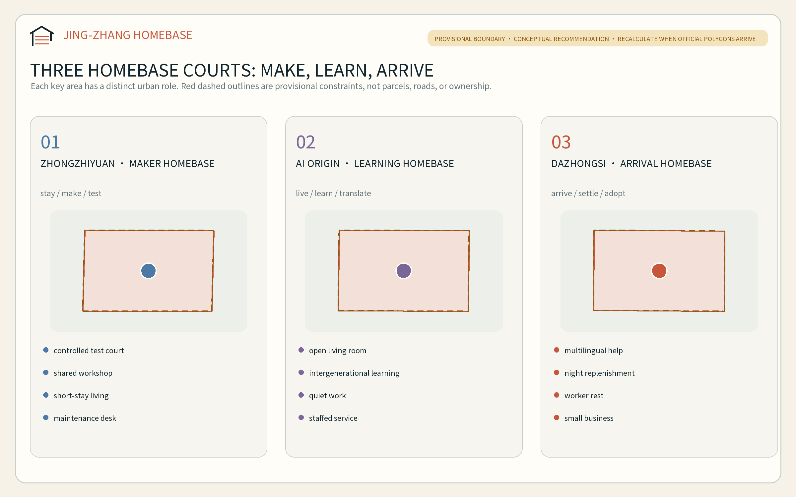
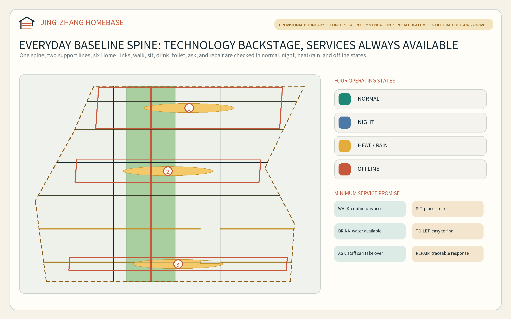
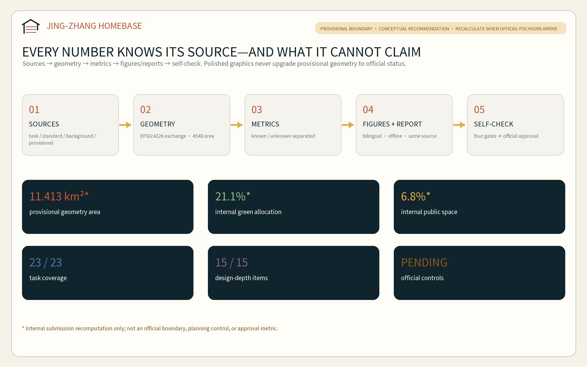

# JING-ZHANG HOMEBASE: A City Where Innovators and Everyday Communities Can Stay

The Chinese name *Guizhan* joins three meanings: a railway station, a technology stack, and a home to which people can return. The proposal begins with a simple judgment: a world-class AI district should not be measured only by projects, models, and events. It should also be tested by whether researchers, founders, families, existing residents, and maintenance and service workers can afford to remain, move safely, obtain help, and build a long life here. “Home” therefore means more than a housing product; it is an urban baseline linking work, life, social connection, learning, and care.

## Design Basis and Source List

The official prequalification announcement and the rights-cleared Agent taskbook define the assignment. The repository site package, local professional-standard snapshots, Source Registry, and processed fact pack form the evidence entry points. The announcement confirms the three scope levels, three key areas, and design tasks. The Agent taskbook requires a name and identity, five to eight cases, at least ten scenario cards, at least three industry testing and validation scenarios, at least five personas, at least three pilgrimage/honor nodes, and a long-term event and operating system. This proposal converts those requirements into readable prose, GeoJSON, metrics, and drawings instead of merely ticking matrix cells [source:OFFICIAL-ANNOUNCEMENT] [source:AGENT-TASKBOOK] [depth:existing_conditions_diagnosis].

As of 10 August 2026, the repository contains no verifiable official SITE_BOUNDARY or official polygons for the three KEY_AREA features. This package uses the maintainer-provided Provisional Boundary only for intake generation, topology checks, and conceptual representation. It is not an official planning boundary, parcel boundary, road redline, ownership record, or precise-area basis. A repository background audit also records a roughly 412.5-metre separation between the provisional Overall Design Area and the OSM-mapped heritage park. That observation does not prove the provisional geometry wrong, but it does require the proposal to refuse parcel-level conclusions [source:BOUNDARY-SOURCE] [source:ISSUE-846-GEOMETRY-AUDIT] [data:geometry/site_boundary.geojson#SITE-001].

The accurate package status is therefore “candidate for machine gates and content review; Formal Professional Scoring still awaits official polygons and professional baseline data.” When official geometry arrives, land use, building prototypes, roads, green space, public space, phasing, every figure, and every spatial metric must be regenerated. The central registry authorizes task, standard, and approximate-area facts only for their recorded uses; independently researched cases remain background lessons and are not promoted into statutory controls [source:SOURCE-REGISTRY] [source:PROCESSED-FACT-PACK] [depth:risk_missing_data].

## Three-Level Scope Framework

The three levels answer why the work matters, where it is organized, and how it is deepened. The 43.6-square-kilometre Coordinated Research Area establishes the relationship among the AI ecosystem, talent, and urban life. The approximately 11.4-square-kilometre Overall Design Area translates that relationship into land use, public space, walking and cycling, and renewal projects. The approximately 368.4-hectare Key-Area Detailed Design Area tests three distinct Homebase prototypes. Announced area values retain the official task convention; the submitted polygon area is only an internal recomputation of provisional geometry [standard:PROJECT-OFFICIAL-ANNOUNCEMENT] [depth:three_level_scope_framework] [metric:announced_site_area_sqm].

The overall structure is “one spine, three courts, two wings, and six everyday essentials.” The spine is an Everyday Baseline Spine organized in relation to Jing-Zhang railway heritage. The courts are the Maker Homebase at Zhongzhiyuan, the Learning Homebase at Beijing AI Origin Community, and the Arrival Homebase at Dazhongsi. The two wings provide technology services and urban-scenario feedback. The six essentials are walk, sit, drink, use a toilet, ask for help, and request repair. AI may improve them, but it must not become a prerequisite for receiving them [depth:overall_spatial_structure] [data:geometry/roads.geojson#ROAD-001] [metric:homebase_count].

| Scope | Core question | Proposal output | Data status |
| --- | --- | --- | --- |
| Coordinated Research Area | How can an AI ecosystem and a livable city reinforce each other? | Six global cases, a Three Zones and Two Wings loop, and the HOMEBASE identity | Official tasks and background cases only; no inferred controls |
| Overall Design Area | How do research, housing, services, mobility, and renewal form one maintainable system? | Six conceptual land-use classes, one baseline spine, six cross-links, and three phases | Complete provisional partition; replaceable and recalculable |
| Key-Area Detailed Design Area | How can the three areas test “make, learn, and arrive” differently? | Three spatial prototypes, twelve scenarios, and three service-first landmarks | All three polygons remain provisional constraints |

## Coordinated Research Area: Industry and Future City Research

### Brand, logo, and Three Zones and Two Wings

The primary name is `JING-ZHANG HOMEBASE`. Its mark combines an open roof, two parallel rail lines, and three sleepers. The roof represents a city where people can make a home; the rails represent Centennial Jing-Zhang; the three sleepers represent the three key areas. An open lower-right corner signals that public contributors, professional teams, and official data must complete the work. The palette uses oxidized rail red, civic-life teal, and evidence-status amber. Only system or embeddable typefaces are used; no corporate trademarks or externally copyrighted images are incorporated [standard:PROJECT-AGENT-OPEN-CALL-TASKBOOK] [source:AGENT-TASKBOOK].

The Three Zones and Two Wings form a talent-life-innovation-adoption loop. Zhongzhiyuan supports full-stack research, standards, and controlled validation. Beijing AI Origin Community supports university-city translation, families, and intergenerational learning. Dazhongsi supports urban adoption, international arrival, and AI-native consumer services. The Zhongguancun Technology Services Wing supplies legal, intellectual-property, finance, space, and talent services. The Xiaoyue River Scenario Enablement Wing supplies everyday use cases, extreme-state tests, and community feedback. Each experiment must return to a named user, spatial custodian, and non-digital alternative.

### Six global cases and transferable mechanisms

These cases support method comparison only; they do not establish Jing-Zhang boundaries, controls, or implementation commitments.

| Case | Transferable mechanism | Application to Jing-Zhang | Limit that prevents copying |
| --- | --- | --- | --- |
| New York High Line | Secure corridor rights, operations, and public access before landscape; return development value to public improvements | Create an asset-access-maintenance-accessibility checklist | US railbanking and transfer-of-development-rights mechanisms are not directly portable [source:CASE-HIGH-LINE] |
| Atlanta BeltLine | Prioritize continuous segments; pair the corridor with affordable housing, resident retention, and a public dashboard | Direct value-return concepts toward affordable talent/service-worker space and maintenance | TAD financing and low-density ring conditions differ [source:CASE-ATLANTA-BELTLINE] |
| Barcelona 22@ | Coordinate productive space, housing, facilities, green space, and a dedicated infrastructure plan | Deliver the six-use mix and shared new infrastructure together | Company counts do not prove planning causality [source:CASE-22BARCELONA] |
| Singapore CETRAN | Progress from simulation to closed test ground, supervised route, and operation | Give every testing scenario admission, human takeover, black-box logging, and stop gates | An autonomous-vehicle framework cannot govern all urban AI [source:CASE-CETRAN] |
| London King’s Cross | Long-term coordinated management, adaptive heritage reuse, education anchor, housing, and early public realm | Start each Homebase Court with a shared living room, workshop, and everyday services | Jing-Zhang does not have a single long-term owner [source:CASE-KINGS-CROSS] |
| Duisburg-Nord | Compare lifetime costs of retention, repair, and demolition; allow old structures to support new uses | Survey first and favor reversible adaptive reuse where justified | Project-specific savings cannot be generalized [source:CASE-DUISBURG] |

### The HOMEBASE innovation ecosystem

The ecosystem works through eight elements. Land is treated through compatibility directions only. Space supplies adaptable workshops, homes, and civic living rooms. Industry follows a research-validation-adoption chain. Finance should account for public realm and maintenance across the life cycle. Talent includes researchers, families, and service workers. Computing is edge-oriented, energy-conscious, and switchable. Data is minimized and purpose-bound. Scenarios open by risk level. All eight are conceptual recommendations; exact shares, subsidies, recruitment, procurement, and operating bodies await confirmation by public authorities and professional teams.

## Overall Design Area: Urban Renewal and Regulatory-Plan-Level Urban Design

The Overall Design Area is partitioned into six complete conceptual uses: research, education, residential, community service, commercial service, and park green space. All polygons are cut from the same boundary in EPSG:4548 and transformed back together, avoiding gaps and overlaps. Their proportions are internal design hypotheses, not approved land uses or Regulatory Detailed Planning controls [standard:MNR-LAND-USE-CLASSIFICATION-GUIDE] [data:geometry/land_use.geojson#LU-001] [depth:land_use_layout].

Instead of another “industry axis plus showcase nodes,” HOMEBASE treats the six everyday essentials as the minimum ground-floor and public-space offer: continuous accessible walking, seating, drinking water, toilets, human help, and visible repair reporting. Each essential is checked in normal operation, at night, in heat or heavy rain, and during network failure. If a digital layer stops, signs, access, and help must retain a human or mechanical route. The baseline serves the worst time and least advantaged user before innovation displays are added.

The building layer represents fifteen capacity prototypes rather than surveyed buildings: shared laboratories, adaptable workshops, talent housing, family/community service, culture and learning, mobility support, and mixed commerce. Every feature is a `design_proposal`, and its Demolish-Renovate-Retain status remains pending survey. Total floor area, FAR, building height, approved Building Coverage Ratio, and setbacks remain unknown [data:geometry/buildings.geojson#BLDG-001] [depth:development_intensity_controls] [depth:height_massing_character].

Renewal decisions pass four gates: ownership and existing-condition evidence; structure and fire safety; heritage, ecology, and municipal constraints; and a lifetime public-value comparison among retention, repair, adaptive reuse, lightweight addition, or demolition. No building receives a final DRR judgment before all four gates are passed [depth:retain_renovate_demolish] [source:SITE-PACKAGE].

## Detailed Design of Key Areas

Exact boundaries for the three key areas are missing. This chapter therefore uses the provisional polygons only to represent relationships, program combinations, and operating sequences; it does not determine parcels, buildings, or engineering alignments [source:KEY-AREA-SOURCE] [depth:three_key_area_detailed_design].

### Zhongzhiyuan: Maker Homebase

The Maker Homebase combines “stay, make, and test” in a garden research community. Its conceptual components are a controlled testing court, shared workshop, rotating/short-stay living units, a low-disturbance green interface toward the Qinghe context, and a staffed safety desk. Buildings favor adaptive reuse and detachable service layers. Mobility first improves internal walking, cycling, and commuter transfer before any Fifth Ring Road engineering is discussed. Scenarios HB-01, HB-02, and HB-03 remain controlled here; expansion into public space requires a new approval gate [data:geometry/key_areas.geojson#PROV-KEY-001] [data:geometry/constraints.geojson#SCN-HB-01].

### Beijing AI Origin Community: Learning Homebase

The Learning Homebase joins “long stay, co-learning, and translation” in a university-adjacent living-innovation community. An Open Living Room, an intergenerational learning court, a research-translation street, a staffed service desk, and continuous walking links connect housing and research through bookable shared rooms, child-friendly waiting space, quiet work rooms, and a community kitchen. Campus and owned spaces receive external-interface recommendations only; no permission to open or alter them is presumed [data:geometry/key_areas.geojson#PROV-KEY-002] [data:geometry/public_space.geojson#PUBLIC-001].

### Dazhongsi: Arrival Homebase

The Arrival Homebase links “arrival, settling in, and adoption” in an urban AI district. It organizes public-transport arrival, four-quadrant pedestrian continuity, multilingual staffed help, the six night-time essentials, rest and replenishment for service workers, and AI-native small business. Transit-Station Integration is expressed as a people-and-service relationship only; no tunnel, entrance, road-redline, or utility scheme is claimed. HB-04, HB-05, and HB-12 begin here as low-risk, withdrawable public-service pilots [data:geometry/key_areas.geojson#PROV-KEY-003] [data:geometry/roads.geojson#ROAD-006].

## AI Innovation Ecosystem, Personas, and AI+ Scenarios

### Six personas

Personas are hypotheses about service needs, not statistics about real residents or personal profiles. Formal development requires an open, rights-cleared, de-identified participation process.

| Persona | Frequently overlooked need | Spatial response | Non-digital route |
| --- | --- | --- | --- |
| Visiting researcher/founder | Quickly understand mobility, space, compliance, and daily services | Arrival Hall, short-stay unit, shared workshop | Multilingual paper guide and staffed desk |
| Early-career developer | Affordable living, focused work, peer learning, and night safety | Learning Court, quiet room, night baseline node | In-person booking and physical noticeboard |
| Dual-career family and child | Mismatched care, school, waiting, learning, and work times | Intergenerational living room, child-friendly waiting, legible walking links | No child biometrics; guardian and human fallback |
| Existing older resident | Familiar routes, rest, help, and offline service | Continuous seating, staffed service, clear signs | On-site guidance and human processing retained [source:ELDERLY-DUAL-CHANNEL] |
| Disabled or no-smartphone user | Accessible continuity and information equivalence | Tactile/audio guidance, low interfaces, no-phone route | Universal design and in-person assistance [source:BARRIER-FREE-LAW] |
| Night-shift, cleaning, repair, retail, and delivery worker | Toilets, water, rest, transfer, and repair outside office hours | Night service pavilion, maintenance desk, loading/parking management | Phone or in-person work order; no app-only gate |

### Twelve scenario cards

Each card binds space, accountability, minimum data, human takeover, and a stop condition. TVS means Testing and Validation Scenario; it does not mean approved operation.

| ID / type | Scenario and space | Minimum data and human review | Non-digital route / stop condition |
| --- | --- | --- | --- |
| HB-01 / TVS | Accessible domestic-service robot sandbox; controlled Zhongzhiyuan court | Synthetic layouts, explicit volunteer consent, on-site safety operator | Physical emergency stop; stop on boundary breach, collision, or unexplained behavior |
| HB-02 / TVS | Edge energy and indoor-comfort control; shared Maker workshop | Device-level local data, facilities-manager review | Manual control; revert on comfort or safety anomaly |
| HB-03 / TVS | Human-AI handover and accessible-interface lab; Maker/Learning Homebases | Task success and anonymous error types, participation by disabled users | Staffed window always open; stop if human takeover cannot complete the task |
| HB-04 | Multilingual arrival assistant; Dazhongsi Arrival Hall | User-selected language and question only; no movement history | Multilingual cards/staff; transfer on low translation confidence |
| HB-05 | Night safety guidance without facial recognition; Arrival Court and baseline spine | Lighting, opening state, and anonymous facility faults | Fixed signs/staffed help; identity tracking prohibited |
| HB-06 | Child-friendly co-learning route; Learning Court | No child identity, only facility condition | Teacher/guardian route; refuse any individual identification request |
| HB-07 | Dual-channel service for older residents; community nodes | User-submitted task only; minimum retention | Staffed processing; QR code cannot be compulsory |
| HB-08 | Tactile, audio, and low-vision walking assistance; six cross-links | Public facility locations and user-selected preference | Tactile map/human guide; warn and stop when positioning is unreliable |
| HB-09 | Public furniture and accessibility repair dispatch; three maintenance desks | Facility ID, fault, time, and status | Phone/paper work order; close unsafe facility and escalate |
| HB-10 | Heat/rain shade, water, and opening-state guidance; Blue-Green Space | Public weather and facility state | Fixed safety signs; last safe route remains visible offline |
| HB-11 | Fair booking of shared rooms and workshops; three Homebases | Time slot and resource only; no ranking by job or income profile | In-person registration and public queue; dispute goes to a human committee |
| HB-12 | Plain-language home/workspace contract assistant; Dazhongsi and Origin | Voluntarily supplied redacted clauses, local session | Paper template/legal service; no legal conclusion [source:GENERATIVE-AI-MEASURES] |

Scenario governance follows “explain first, consent, allow refusal, transfer to a person, switch off, and review.” Whether a specific public-facing generative service falls within current rules must be determined for that service. This proposal does not infer filing, security-assessment, or legality outcomes from general policy [standard:GENERATIVE-AI-INTERIM-MEASURES] [source:GENERATIVE-AI-MEASURES].

## Land Use, Building Scale, and Retain-Renovate-Demolish Strategy

Six uses form a cross-sectional gradient of research, education, green spine, housing, community service, and commerce; the three Homebase Courts and six cross-links organize them longitudinally. Areas are internally reproducible, but every use and share awaits recalibration against official polygons, existing-condition surveys, and planning controls.

| Machine metric | Design meaning | Evidence status |
| --- | --- | --- |
| Research land | Conceptual capacity for full-stack R&D and controlled validation [metric:land_use_0802_area_sqm] | Provisional design geometry |
| Education land | Conceptual capacity for university-city translation and co-learning [metric:land_use_0804_area_sqm] | Provisional design geometry |
| Residential land | Long-term life for talent, families, and service workers [metric:land_use_0701_area_sqm] | Provisional geometry, not a land grant |
| Community-service land | Care, staffed help, and the six essentials [metric:land_use_0702_area_sqm] | Provisional design geometry |
| Commercial-service land | Small business, arrival services, and urban adoption [metric:land_use_05_area_sqm] | Provisional design geometry |
| Park green land | Continuous green relationship inside a de-emphasized provisional constraint [metric:land_use_1401_area_sqm] | Provisional design geometry |

The fifteen prototypes provide reproducible footprint area and conceptual coverage only [metric:building_footprint_area_sqm] [metric:conceptual_building_coverage_ratio]. Total floor area and FAR remain pending because approved controls, existing floors, and lawful building quantities are missing. Height, daylight, fire safety, structure, heritage, and municipal capacity require professional development using official inputs [metric:total_floor_area_sqm] [metric:floor_area_ratio] [standard:MOHURD-CONTROL-DETAILED-PLANNING].

## Transport, Rail, Municipal Infrastructure, and Public Services

The conceptual walking and cycling network has one north-south Everyday Baseline Spine, two parallel living-support lines, and six east-west Home Links. The road layer represents connections only; it is not a road redline or engineering alignment. Formal design must check the implemented park boundary, rail facilities, junctions, under-bridge space, fire access, and accessible gradients [data:geometry/roads.geojson#ROAD-001] [depth:traffic_rail_slow_parking] [metric:road_length_m].

Each Home Link connects at least one productive space, one residential/community space, and one public space, while hosting the six essentials. Transit-Station Integration is checked as arrival, crossing, parking, staffed help, and the last walking segment. No bridge, tunnel, or new entrance is drawn without official road and rail information.

Municipal and New Infrastructure use two layers. The basic layer is power, water and drainage, fire safety, communication, toilets, drinking water, and staffed service. The enhancement layer is edge computing, environmental sensing, digital signs, and operational analysis. Enhancement failure must not disable the basic layer. Edge devices favor local processing, minimum collection, physical shutdown, and a named maintenance duty. Energy, water, utilities, flood safety, and fire capacity remain pending specialist inputs [depth:municipal_new_infrastructure] [data:geometry/constraints.geojson#SCN-HB-10] [metric:road_area_sqm].

## Blue-Green Network, Public Space, and Urban Character

Green and public space are not backdrops for technology exhibits; they are living infrastructure shared by talent and existing communities. The continuous green relationship supports conceptual shade, walking, and stormwater functions. The three courts and six links support rest, help, repair, and small events. Areas and ratios are computed from submission geometry only, for comparing internal spatial allocation [data:geometry/green_space.geojson#GREEN-001] [data:geometry/public_space.geojson#PUBLIC-001] [depth:blue_green_public_space].

The cultural narrative is not “old rail plus new screen.” First, the railway made distance reachable. Second, Zhongguancun made knowledge and entrepreneurship reachable. Third, the AI era should make urban capability reachable without making daily life subordinate to an algorithm. Wayfinding follows a three-level syntax of kilometre, door, and service: kilometres tell the heritage story, doors identify the three Homebases, and six service symbols identify the baseline. Historical images, people, trademarks, and fonts require permission checks [standard:MOHURD-URBAN-DESIGN-MEASURES] [source:OFFICIAL-ANNOUNCEMENT].

The required pilgrimage/honor nodes are low-volume and service-first:

1. **Kilometre-Zero Maintenance Desk** at Zhongzhiyuan shows passed, failed, and repaired tests, so honor recognizes traceable contribution rather than only star models.
2. **Open Intergenerational Living Room** at AI Origin preserves the version history of services revised by developers, residents, teachers, children, and maintainers.
3. **World Arrival Hall** at Dazhongsi supplies multilingual human help, night replenishment, and adoption cases; its honor wall also records stop and correction decisions.

Their count and conceptual points are auditable, but they remain design proposals [metric:landmark_count] [data:geometry/constraints.geojson#LANDMARK-01].

## Renewal Projects, Implementation Policy, and Phasing

The project list states who should do what for whom, what evidence is needed, and when to stop, instead of presenting a vision as a commitment [depth:renewal_project_list] [data:geometry/phasing.geojson#PHASE-001].

| Project | Near-term action | Dependency / stop condition |
| --- | --- | --- |
| P01 Boundary and field-baseline verification | Obtain official polygons; conduct open, rights-cleared, de-identified facility and movement surveys | Do not upgrade a spatial claim without provenance, CRS, and permission |
| P02 Six-essentials audit | Test walk, sit, drink, toilet, ask, and repair in four operating states | Keep performance unknown without field authorization |
| P03 Kilometre-Zero Maintenance Desk | Pilot detachable service and testing components | Relocate/stop if heritage, water, traffic, or safety review fails |
| P04 Open Intergenerational Living Room | Pilot co-learning and staffed service in lawful public interfaces | Do not presume campus or owned-space access |
| P05 World Arrival Hall | Pilot multilingual, night-time, and human services in available space | Do not presume metro entrances or intersection works |
| P06 Six Home Links | Start with signs, seating, repair, and accessible continuity | Official roads, fire access, and ownership are prerequisites |
| P07 Three industry validation scenarios | Begin with simulation and closed testing | No public opening before safety, ethics, and takeover gates pass |
| P08 HOMEBASE annual program | Developer residency, civic review, maintainer open day, and global case review | Events, funding, and hosts remain proposals for negotiation |
| P09 Data and copyright handover | Archive versions, sources, models, fonts, figures, and decisions | Do not publish without permission and privacy clearance |

Three complete spatial slices represent phasing. Phase 1 verifies data and repairs everyday baselines. Phase 2 advances the courts and links only after official geometry and existing-condition data arrive. Phase 3 considers longer-term renewal and operation. The three areas are internal provisional allocations [metric:phase_1_area_sqm] [metric:phase_2_area_sqm] [metric:phase_3_area_sqm].

Long-term operation follows “one annual week, one monthly release note, and one quarterly everyday review.” HOMEBASE Week shows successes, failures, and retired services. Monthly notes explain public-facility and scenario changes. Quarterly reviews invite residents, child carers, disabled users, night workers, and maintainers to examine worst-time conditions. Developer-community contribution expands from code to translation, accessibility testing, repair documents, and human-service procedures. International communication distinguishes submitted, reviewed, selected, and implemented status.

## Metrics, Area Recalculation, and Compliance Matrix

Metrics are separated into internally reproducible geometry, pending official controls, and pending field performance. The first proves submission consistency rather than statutory compliance. The second remains null. The third also remains unknown without authorized samples and measurement windows [depth:metrics_recalculation] [source:SOURCE-REGISTRY].

| Metric group | Current auditable content | Meaning |
| --- | --- | --- |
| Boundary | Provisional geometry and announced approximate area shown separately [metric:site_area_sqm] [metric:announced_site_area_sqm] | The two are not claimed to match precisely |
| Green | Area and internal ratio [metric:green_space_area_sqm] [metric:green_ratio] | Not an approved green-space control |
| Civic interaction | Public-space area and internal ratio [metric:public_space_area_sqm] [metric:public_space_ratio] | Public and green space may overlap by definition |
| Building capacity | Prototype footprints and conceptual coverage [metric:building_footprint_area_sqm] [metric:conceptual_building_coverage_ratio] | Neither existing nor statutory coverage |
| Network | Conceptual centerline length [metric:road_length_m] | Road area is unknown without widths/redlines |
| Key areas | Three provisional areas [metric:key_area_count] | Count follows the task; locations await official polygons |
| Task scale | Three Homebases, twelve scenarios, and three TVS [metric:homebase_count] [metric:ai_scenario_count] [metric:industrial_test_scenario_count] | Content counts, not approved projects |
| Inclusion and landmarks | Six personas and three service-first landmarks [metric:persona_count] [metric:landmark_count] | Personas remain needs hypotheses |

The structured matrices preserve exhaustive coverage of 23 announcement/Agent requirements, mandatory professional standards, and 15 design-depth items. The narrative keeps only claim-adjacent evidence. The coverage target is 23/23 tasks, 5/5 mandatory standards, and 15/15 design-depth items. A passing self-check establishes only an intake/content-review basis; it is not Formal Professional Scoring, official approval, or implementation [standard:MOHURD-ARCH-DESIGN-DEPTH-2016] [metric:persona_count].

## Risk, Copyright, and Compliance

The largest risk is not insufficient visual precision but false precision. Official boundaries, key areas, planning controls, parcels/ownership, existing buildings, road sections, utilities, fire and flood conditions, heritage controls, and public-facility baselines remain missing. When official information arrives, partitioning, metrics, figures, and project decisions must be rebuilt from the source [depth:risk_missing_data] [data:geometry/constraints.geojson#GAP-BOUNDARY] [source:ISSUE-846-GEOMETRY-AUDIT].

AI scenarios must not exchange convenience for personal profiling, continuous tracking, or a mandatory digital entrance. The application of generative-AI rules, personal-information requirements, staffed public service, and accessibility must be assessed for each service by legal and professional teams. This proposal provides minimization, explicit consent, human takeover, non-digital equivalence, and stop mechanisms; it does not provide case-specific legal advice [standard:BARRIER-FREE-ENVIRONMENT-LAW] [standard:GENERATIVE-AI-INTERIM-MEASURES].

The five figures, HTML, and PDFs are generated locally from the package GeoJSON, metrics, and text. No commercial-map screenshot, remote tile, external image, corporate logo, or portrait is used. System fonts are used to generate outputs but are not redistributed. Tools, versions, and license notes appear in `sources.json` and `report/copyright_statement.md`. The declared generation model is OpenAI Codex (GPT-5 family). Two research sub-agents supported source and peer review; the primary agent remains responsible for source selection, design judgment, translation, and validation.

This submission is an Open Co-Creation proposal. It does not replace formal planning and is not a government approval. Every spatial, operating, event, funding, and policy move is a Conceptual Recommendation, reference scheme, or material for professional teams to develop.

## References

1. Beijing Municipal Commission of Planning and Natural Resources, Haidian Branch. *Prequalification Announcement for the Centennial Jing-Zhang AI Innovation Belt International Urban Design Solicitation*, 9 May 2026.
2. `brief/site-package/agent_taskbook.json`, rights-cleared structured Agent taskbook excerpt, 18 May 2026.
3. `data/source_registry.json` and `data/processed/agent_fact_pack.md`, repository state updated through 9 August 2026.
4. Ministry of Housing and Urban-Rural Development. *Measures for the Administration of Urban Design* and *Measures for the Preparation and Approval of Regulatory Detailed Planning for Cities and Towns*.
5. Ministry of Natural Resources. *Guidelines for Land and Sea Use Classification in Territorial Spatial Investigation, Planning, and Use Control*, 2023.
6. *Law of the People’s Republic of China on Building an Accessible Environment*, 2023; *Interim Measures for the Management of Generative Artificial Intelligence Services*, 2023.
7. NYC Planning / City of New York official High Line and Special West Chelsea District materials.
8. Atlanta BeltLine 2025 annual reporting and 2026 mainline progress.
9. Barcelona City Council official 22@ and Barcelona Impulsa 2025-2035 materials.
10. Singapore LTA / MDDI CETRAN testing and assessment framework.
11. Camden Council / GLA / King’s Cross planning and operating materials.
12. Landschaftspark Duisburg-Nord official adaptive-reuse and operating materials.

Full provenance, access dates, allowed uses, and limitations are stored in `sources.json`; this bibliography does not replace the structured source list [source:SITE-PACKAGE].
