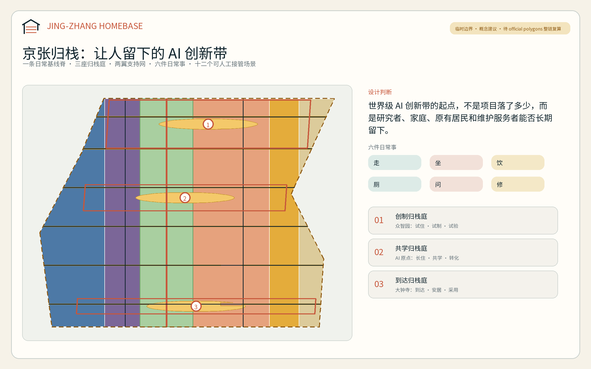
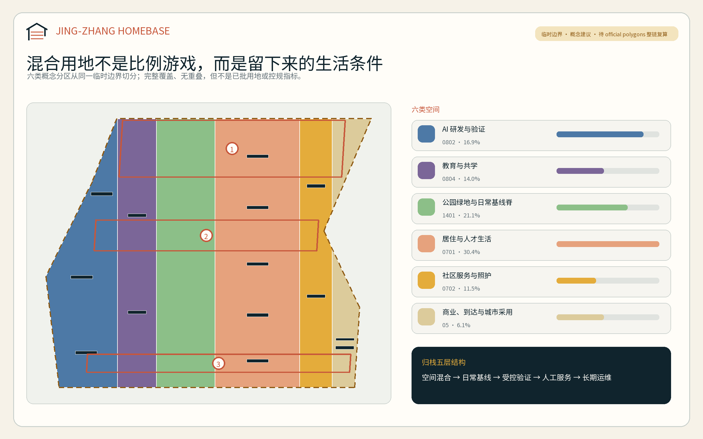
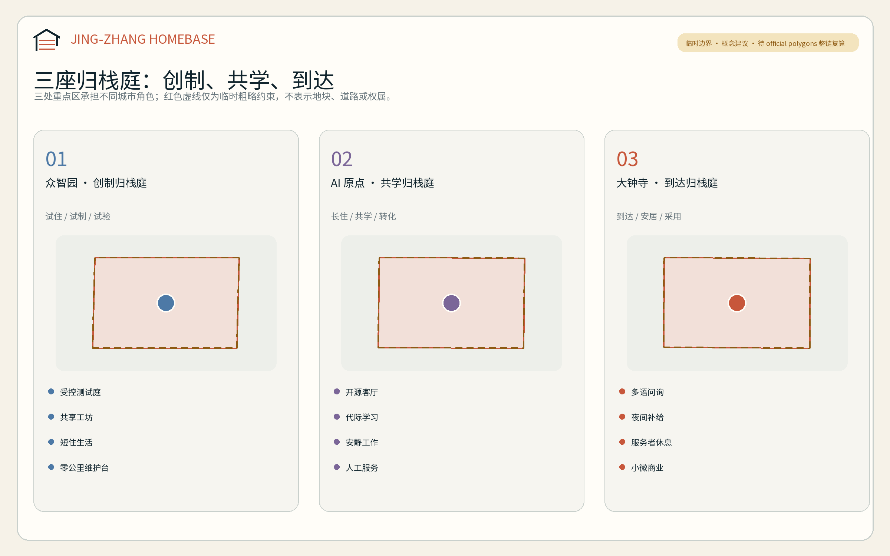
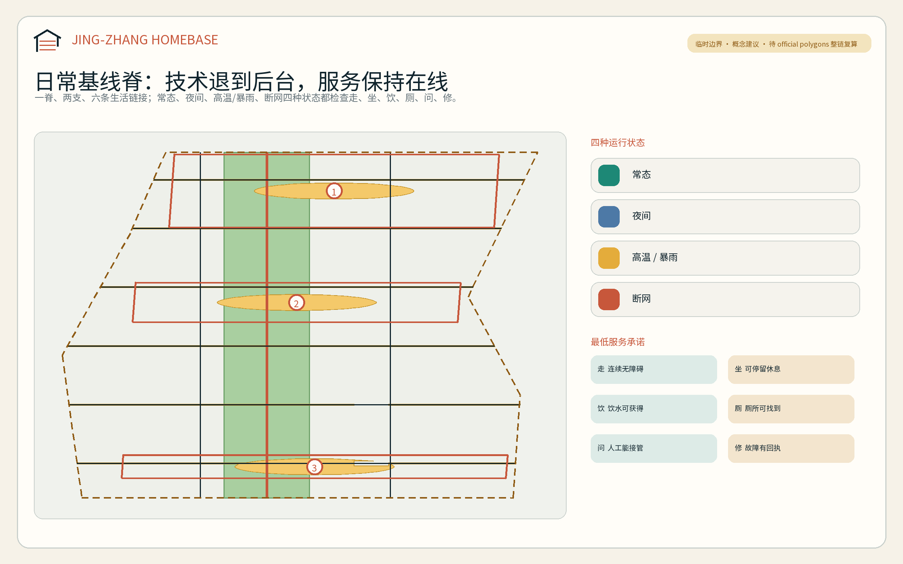
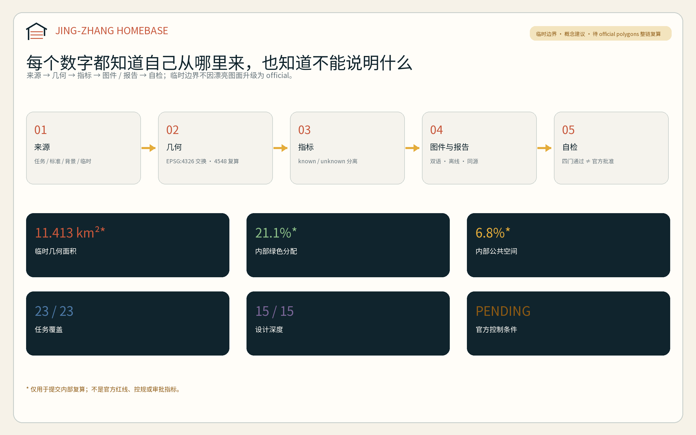

# 京张归栈 / JING-ZHANG HOMEBASE：让创新者与城市共同安家

“归栈”同时借用三个意象：铁路的站、人工智能的技术栈、人在城市中的家。方案提出一个朴素判断：世界级 AI 创新带不应只统计项目、模型和活动，还应检验研究者、创业者、家庭、原有居民以及维护和服务工作者能否在这里住得下、走得通、获得帮助并愿意长期留下。这里的“家”不是单一住宅产品，而是一套把工作、生活、社交、学习和照护接在一起的城市日常基线。

## 设计依据与资料清单

方案以北京市规划和自然资源委员会海淀分局发布的资格预审公告和已清权的智能体任务书为任务依据，以仓库 `site-package`、专业标准本地快照、来源登记表和处理事实包为证据入口。公告确认三层工作范围、三处重点区域及设计任务；任务书要求命名与识别、5—8 个案例、至少 10 张场景卡、至少 3 个产业测试验证场景、至少 5 类用户画像、至少 3 个朝圣/荣誉节点以及长期活动运营。本方案把这些要求转化为可读正文、GeoJSON、指标和图纸，而不是只在矩阵中勾选 [source:OFFICIAL-ANNOUNCEMENT] [source:AGENT-TASKBOOK] [depth:existing_conditions_diagnosis]。

截至 2026 年 8 月 10 日，仓库没有取得可验证坐标系的 official SITE_BOUNDARY 或三处 official KEY_AREA polygon。提交采用维护者提供的临时粗略边界；它只能用于 intake 生成、拓扑校验和概念表达，不能作为官方红线、地块边界、道路红线、权属或精确面积依据。仓库的独立背景核对还记录了临时总体范围与 OSM 所绘京张遗址公园最近约 412.5 米的空间疑问；该结果不证明临时边界错误，却足以要求本方案拒绝地块级结论 [source:BOUNDARY-SOURCE] [source:ISSUE-846-GEOMETRY-AUDIT] [data:geometry/site_boundary.geojson#SITE-001]。

因此本包的准确状态是“机器门禁与内容审稿候选；正式专业评分仍等待官方 polygon 和专业底数”。临时边界到位后的复算对象包括用地、建筑原型、道路、绿地、公共空间、分期、全部图件和空间指标。中央来源登记表只批准任务、标准和约面积等限定用途；自采案例仅作背景转译，不被升级为本项目法定控制 [source:SOURCE-REGISTRY] [source:PROCESSED-FACT-PACK] [depth:risk_missing_data]。

## 三层范围工作框架

三层范围分别回答“为什么做、在哪里组织、如何深化”。43.6 平方公里统筹研究范围建立 AI 生态、人才与城市生活的协同逻辑；约 11.4 平方公里总体设计范围把逻辑转为用地、公共空间、慢行和更新项目；约 368.4 公顷重点区域范围验证三种差异化的“归栈”原型。公告面积用于任务口径，提交 polygon 面积只作为临时几何的内部复算值，二者不相互替代 [standard:PROJECT-OFFICIAL-ANNOUNCEMENT] [depth:three_level_scope_framework] [metric:announced_site_area_sqm]。

总体结构为“一脊、三庭、两翼、六件日常事”。一脊是沿京张遗产关系组织的日常基线脊；三庭是众智园“创制归栈庭”、AI 原点“共学归栈庭”和大钟寺“到达归栈庭”；两翼分别提供科技服务与城市情景反馈；六件日常事是走、坐、饮、厕、问、修。AI 可以增强这六项服务，但不应成为获得服务的前置条件 [depth:overall_spatial_structure] [data:geometry/roads.geojson#ROAD-001] [metric:homebase_count]。

| 层级 | 核心判断 | 方案产出 | 数据与状态 |
| --- | --- | --- | --- |
| 统筹研究范围 | 世界级生态的竞争力来自“人才留下 + 日常可靠 + 技术可验证” | 六个国际案例、三区两翼要素回路、HOMEBASE 品牌 | 仅用官方任务和背景案例，不推定空间控制 |
| 总体设计范围 | 研发、教育、居住、社区、商业和绿地要形成混合且可维护的连续系统 | 六类概念用地、一条基线脊、六条横向生活链接、三期项目 | 临时完整分区，可整链替换复算 |
| 重点区域范围 | 三片区分别承担“创制、共学、到达” | 三套空间原型、十二个场景、三个服务型地标 | 三处 polygon 均为 provisional constraint |

## 统筹研究范围产业与未来城市研究

### 品牌、Logo 与三区两翼

主名称“京张归栈”，英文名 `JING-ZHANG HOMEBASE`。识别符号由一座开口的“屋顶”、两条平行轨线和三枚枕木构成：屋顶表达可安家的城市，轨线表达百年京张，三枚枕木对应三处重点区；右下角保持开放，表示方案仍待公众、专业团队和正式数据共同完成。色彩采用铁路氧化红、公共生活青绿和资料状态琥珀，字体只使用系统/可嵌入字体，不调用企业商标或外部版权图像 [standard:PROJECT-AGENT-OPEN-CALL-TASKBOOK] [source:AGENT-TASKBOOK]。

三区两翼被组织成一条人才生活—创新—采用回路。众智园承担全栈研发、标准与受控验证；AI 原点社区承担校地转译、家庭与代际学习；大钟寺承担城市采用、国际到达与智能原生消费。中关村科技服务翼提供法务、知识产权、资本、空间与人才服务，小月河场景赋能翼提供日常场景、极端状态和居民反馈。每次试验必须能回到服务对象、空间责任人和非数字替代路径，而不是停在演示台上。

### 六个国际案例的可转化机制

案例只支撑方法比较，不支撑京张的红线、指标或实施承诺。

| 案例 | 可转化机制 | 京张使用方式 | 不能照搬的条件 |
| --- | --- | --- | --- |
| 纽约 High Line | 先锁定廊道权利、运营和公共进入，再做景观；开发收益回流公共改善 | 建立“资产—开放—运维—无障碍”前置清单 | 美国 railbanking 与开发权转移制度不可直接移植 [source:CASE-HIGH-LINE] |
| Atlanta BeltLine | 连续段优先、保障住房与居民保留、公开绩效仪表板 | 把人才/服务者可负担空间和设施运维列为收益回流方向 | TAD 税制和低密环线条件不同 [source:CASE-ATLANTA-BELTLINE] |
| Barcelona 22@ | 生产研发、住房、设施、绿地和基础设施专规共同推进 | 六类混合用地与共享新基建同步表达 | 企业数量不能被当作规划成效因果 [source:CASE-22BARCELONA] |
| 新加坡 CETRAN | 仿真—封闭场—监督路线—运营的分级验证链 | 三个测试场景均设置准入、人工接管、黑匣子和停止条件 | 自动驾驶框架不能代替所有城市 AI 治理 [source:CASE-CETRAN] |
| 伦敦 King’s Cross | 长期统一运营、遗产再利用、教育锚点、住房和公共空间同步 | “归栈庭”由共享客厅、工坊和日常服务先行 | 单一长期业主条件在京张并不存在 [source:CASE-KINGS-CROSS] |
| Duisburg-Nord | 比较保留、修复与拆除的全生命周期成本，旧结构承载新用途 | 拆改留先调查后判断，优先可逆适应性使用 | 特定项目“保留更便宜”不能泛化 [source:CASE-DUISBURG] |

### HOMEBASE 创新生态

生态系统按八个要素工作：土地只提出兼容性方向；空间提供可变工坊、居住和公共客厅；产业形成研发—验证—采用链；资金建议将公共空间和运维列入全生命周期成本；人才覆盖研发者、家庭和服务者；算力优先边缘化、低能耗并可关停；数据坚持最小化和用途限定；场景按风险逐级开放。八要素均为概念建议，具体比例、补贴、招商、采购和管理主体待主管部门及专业团队确认。

## 总体设计范围城市更新与控规深度城市设计

总体设计采用六类完整分区：科研、教育、居住、社区服务、商业服务和公园绿地。它们是从同一临时边界在 EPSG:4548 中切分后回写的拓扑分区，保证无空隙和无重叠；比例是方案内部的空间假设，不是已批用地或控规指标 [standard:MNR-LAND-USE-CLASSIFICATION-GUIDE] [data:geometry/land_use.geojson#LU-001] [depth:land_use_layout]。

与常见“产业轴 + 展示节点”不同，HOMEBASE 把六件日常事作为首层和公共空间的最低配置：连续无障碍步行、可停坐空间、饮水、厕所、人工问询和可见的维修报障。每项服务都要分别检查常态、夜间、高温/暴雨和断网状态；若数字系统停机，指示、门禁和求助仍应保留人工或机械路径。这套基线优先服务最差时段和最不利使用者，再叠加创新展示。

建筑图层表达十五个“容量原型”而非现状楼栋：共享实验室、可变工坊、人才居住、家庭/社区服务、文化学习、交通接驳和混合商业。所有原型均标记为 `design_proposal`，拆、改、留状态为待现状普查；总建筑面积、容积率、建筑高度、已批建筑密度和地块退线保持 unknown [data:geometry/buildings.geojson#BLDG-001] [depth:development_intensity_controls] [depth:height_massing_character]。

更新判断采用四道门：先核权属和现状，再核结构与消防，再核文保/生态/市政，最后比较保留、维修、适应性改造、轻量加建或拆除的生命周期公共价值。未过四道门，不对任何具体楼栋给出拆改留结论 [depth:retain_renovate_demolish] [source:SITE-PACKAGE]。

## 重点区域详细设计

三处重点区的精确四至尚缺，本节只在临时 polygon 内表达关系、功能组合和操作序列；不能据此确定地块、建筑或工程线位 [source:KEY-AREA-SOURCE] [depth:three_key_area_detailed_design]。

### 众智园：创制归栈庭 / Maker Homebase

定位为“试住—试制—试验”的花园型研发社区。概念空间由受控测试庭、共享工坊、短住/轮转人才生活单元、清河方向的低扰动绿色界面和人工安全台组成。建筑策略优先适应性使用和可拆装设备层；交通策略先解决园区内部步行、骑行和通勤接驳，再讨论五环相关工程。场景 HB-01、HB-02、HB-03 在此受控验证，任何向公共空间扩展都需重新审批 [data:geometry/key_areas.geojson#PROV-KEY-001] [data:geometry/constraints.geojson#SCN-HB-01]。

### 北京 AI 原点社区：共学归栈庭 / Learning Homebase

定位为“长住—共学—转化”的近校型生活创新社区。空间由开源客厅、家庭/代际学习庭、成果转译街、人工服务台和连续慢行链接组成；居住与教育科研不是彼此隔离的封闭地块，而由可预约共享房间、儿童友好等待区、安静工作间和社区厨房等首层界面连接。所有校园和权属空间只提出外部接口建议，不推定开放或改造许可 [data:geometry/key_areas.geojson#PROV-KEY-002] [data:geometry/public_space.geojson#PUBLIC-001]。

### 大钟寺：到达归栈庭 / Arrival Homebase

定位为“到达—安居—采用”的城市型 AI 街区。概念空间围绕公共交通到达、四象限步行连续性、多语人工服务、夜间六件日常事、服务工作者休息补给和智能原生小微商业展开。站点一体化只描述人流与服务关系，不给桥隧、出入口、道路红线或管线方案。HB-04、HB-05 与 HB-12 在此先做低风险、可退出的公共服务试点 [data:geometry/key_areas.geojson#PROV-KEY-003] [data:geometry/roads.geojson#ROAD-006]。

## AI 创新生态、人才画像与 AI+ 场景

### 六类人物

人物画像是服务需求假设，不是对真实居民的统计或个人画像；正式深化需通过公开、清权、去标识的参与过程核验。

| 人物 | 最容易被忽略的需求 | 空间响应 | 非数字路径 |
| --- | --- | --- | --- |
| 短期访问研究者/创业者 | 到达后迅速理解交通、空间、合规与生活服务 | 到达门厅、短住单元、共享工坊 | 多语纸质指南与人工值守 |
| 早期职业开发者 | 可负担生活、专注工作、同伴学习和夜间安全 | 共学庭、安静间、夜间基线节点 | 线下预约与实体公告 |
| 双职工家庭与儿童 | 接送、等待、学习、照护与工作时段错位 | 代际客厅、儿童友好等待区、可视慢行链接 | 不采集儿童生物识别；人工托底 |
| 原有老年居民 | 熟悉路径、休息、问询和线下办理 | 连续座椅、人工服务台、清晰导视 | 保留现场指导与人工办理 [source:ELDERLY-DUAL-CHANNEL] |
| 残障/无智能手机使用者 | 无障碍连通、信息等价和独立完成任务 | 触觉/语音导视、低位界面、无手机通道 | 通用设计与现场协助 [source:BARRIER-FREE-LAW] |
| 夜班、保洁、维修、零售与配送人员 | 非标准时段的厕所、饮水、休息、换乘和报修 | 夜间服务亭、维护台、装卸/停放管理 | 电话/现场工单，不以 App 为唯一入口 |

### 十二张场景卡

每张卡绑定空间、责任边界、最小数据、人工接管和停止条件。TVS 表示产业测试验证场景；它是测试资格，不是已批准运营。

| ID / 类型 | 场景与空间 | 最小数据与人工复核 | 非数字路径 / 停止条件 |
| --- | --- | --- | --- |
| HB-01 / TVS | 家庭服务机器人无障碍沙盒；众智园受控测试庭 | 合成户型、志愿者明示同意、现场安全员 | 机械急停；越界、碰撞或无法解释即停 |
| HB-02 / TVS | 边缘能耗与室内舒适联合控制；众智园共享工坊 | 设备级数据、本地处理、设施经理复核 | 手动控制；舒适或安全阈值异常即回退 |
| HB-03 / TVS | 人机交接与无障碍界面实验室；众智园/原点 | 任务成功率和匿名错误类型、无障碍用户参与 | 人工窗口常开；无法完成人工接管即停 |
| HB-04 | 多语到达助手；大钟寺到达门厅 | 用户主动选择的语言和问题，不保存轨迹 | 多语卡片/人工服务；翻译置信不足即转人工 |
| HB-05 | 无人脸识别的夜间安全导航；到达庭与基线脊 | 照度、开放状态、匿名设施故障 | 固定导视/人工求助；不得启用身份追踪 |
| HB-06 | 儿童友好共学路线；原点共学庭 | 不采集儿童身份，仅记录设施状态 | 教师/监护人带领；任何个体识别需求即拒绝 |
| HB-07 | 长者双通道生活服务；社区服务节点 | 本人主动提交的事项，最小留存 | 现场指导/人工办理；不得强制扫码 |
| HB-08 | 触觉、语音与低视力步行辅助；六条横向生活链接 | 公共设施位置和用户自选偏好 | 触觉地图/人工引导；定位不可靠即提示不用 |
| HB-09 | 公共家具与无障碍设施维修调度；三座维护台 | 设施 ID、故障、时间和处理状态 | 电话/纸质工单；安全问题立即封闭并转人工 |
| HB-10 | 高温/暴雨下的遮阴、饮水和开放状态提示；蓝绿空间 | 气象公开数据和设施状态 | 固定避险标识；断网仍显示最近安全路径 |
| HB-11 | 共享房间与工坊公平预约；三座归栈庭 | 时段与资源，不使用职业/收入画像排序 | 现场登记与公开轮候；争议转人工委员会 |
| HB-12 | 居住/工作空间合同白话助手；大钟寺与原点 | 用户自愿上传的脱敏条款，本地会话 | 纸质范本/法律服务；不作法律结论 [source:GENERATIVE-AI-MEASURES] |

场景治理遵循“先说明、再同意、可拒绝、能转人工、可停用、留复盘”。向境内公众提供生成内容的服务是否适用生成式 AI 管理规则需按具体服务判断；本方案不从一般原则推定备案、安全评估或合法性结论 [standard:GENERATIVE-AI-INTERIM-MEASURES] [source:GENERATIVE-AI-MEASURES]。

## 用地、建筑规模与拆改留方案

六类用地从同一几何切分，形成科研—教育—绿脊—居住—社区—商业的横向梯度；纵向由三座归栈庭和六条生活链接串联。其内部面积可复算，但用途和比例均待 official polygon、现状调查和控规条件校准。

| 机器指标 | 设计含义 | 证据状态 |
| --- | --- | --- |
| 科研用地面积 | 为全栈研发和受控验证预留概念容量 [metric:land_use_0802_area_sqm] | 临时设计几何 |
| 教育用地面积 | 为校地转译、培训与共学预留概念容量 [metric:land_use_0804_area_sqm] | 临时设计几何 |
| 居住用地面积 | 回应人才、家庭和服务者长期生活 [metric:land_use_0701_area_sqm] | 临时设计几何，不代表供地 |
| 社区服务用地面积 | 承载照护、人工服务和六件日常事 [metric:land_use_0702_area_sqm] | 临时设计几何 |
| 商业服务用地面积 | 承载小微商业、到达服务和城市采用 [metric:land_use_05_area_sqm] | 临时设计几何 |
| 公园绿地用地面积 | 形成低对比临时边界内的连续绿色关系 [metric:land_use_1401_area_sqm] | 临时设计几何 |

十五个建筑原型的基底面积可以从图层复算，仅说明设计容量和分布 [metric:building_footprint_area_sqm] [metric:conceptual_building_coverage_ratio]。总建筑面积和 FAR 保持待补，因为缺少官方控规、现状楼层与合法建设量；高度、日照、消防、结构、文保和市政容量必须由专业团队按正式资料深化 [metric:total_floor_area_sqm] [metric:floor_area_ratio] [standard:MOHURD-CONTROL-DETAILED-PLANNING]。

## 交通、轨道、市政与公共服务设施

概念慢行系统由一条南北日常基线脊、两条平行生活支线和六条东西生活链接组成。道路图层只表达连接关系，不表达道路红线或工程线位；正式设计需核对公园实施边界、轨道设施、交叉口、桥下空间、消防和无障碍坡度 [data:geometry/roads.geojson#ROAD-001] [depth:traffic_rail_slow_parking] [metric:road_length_m]。

每条生活链接至少把一种生产空间、一种居住/社区空间和一处公共空间连在一起，并设置走、坐、饮、厕、问、修的基线点。轨道站点一体化按“到达—过街—停放—问询—最后一段步行”检查，不在缺少道路与轨道资料时绘制桥隧或新出入口。

市政与新基建采用“双层系统”：基础层是供电、给排水、消防、通信、厕所、饮水和人工服务；增强层是边缘算力、环境感知、数字导视和运营分析。增强层故障不得使基础层停摆。端侧设备优先本地处理、最少采集、可物理断电并记录维护责任；能源、水务、管线和防洪容量均待专项资料确认 [depth:municipal_new_infrastructure] [data:geometry/constraints.geojson#SCN-HB-10] [metric:road_area_sqm]。

## 蓝绿空间、公共空间与城市风貌

绿地和公共空间不是科技展示的背景，而是人才与原有社区共享的生活基础设施。连续绿色关系承载遮阴、步行、雨水调蓄的概念方向；三座归栈庭和六条生活链接承载停留、问询、维修与小型活动。绿地和公共空间面积均从提交几何复算，其比例只用于比较方案内部空间分配 [data:geometry/green_space.geojson#GREEN-001] [data:geometry/public_space.geojson#PUBLIC-001] [depth:blue_green_public_space]。

京张文化叙事不是“旧铁轨 + 新屏幕”。第一层是铁路让远方可达，第二层是中关村让知识和创业可达，第三层是 AI 时代让城市能力可达但不把生活变成算法的附属。导视使用“里程—门—服务”三级语法：里程标记文化主线，门标记三座归栈庭，六个服务图符标记日常基线。任何历史图像、人物、商标和字体在使用前必须核对许可 [standard:MOHURD-URBAN-DESIGN-MEASURES] [source:OFFICIAL-ANNOUNCEMENT]。

三个必选朝圣/荣誉节点采用低体量、真实服务优先的表达：

1. **零公里维护台**（众智园）：展示测试通过、失败和维修记录，让贡献可追溯而非只展示明星模型。
2. **开源代际客厅**（AI 原点）：保存开发者、居民、教师、儿童与维护者共同修改城市服务的版本历史。
3. **世界到达门厅**（大钟寺）：提供多语人工服务、夜间补给和城市采用案例，荣誉墙同时记录停止和修正决定。

三处节点计数与空间位置可核对，但它们仍是概念建议 [metric:landmark_count] [data:geometry/constraints.geojson#LANDMARK-01]。

## 更新项目清单、实施政策与分期计划

项目清单强调“谁为谁做什么、需要什么资料、何时停止”，避免把愿景写成实施承诺 [depth:renewal_project_list] [data:geometry/phasing.geojson#PHASE-001]。

| 项目 | 近期动作 | 关键依赖/停止条件 |
| --- | --- | --- |
| P01 临时边界与现场基线核验 | 获取 official polygons；开展公开、清权、去标识的设施与通行调查 | 无来源/坐标系/许可即不升级空间结论 |
| P02 六件日常事盘点 | 盘点走、坐、饮、厕、问、修在四种状态下的可用性 | 无现场授权时所有绩效保持 unknown |
| P03 众智园零公里维护台 | 先做可拆装服务与测试原型 | 文保、河道、交通或安全不通过即换址/停止 |
| P04 原点开源代际客厅 | 在合法公共界面试行共学与人工服务 | 不推定校园/权属空间开放 |
| P05 大钟寺世界到达门厅 | 以既有可用空间试行多语、夜间和人工服务 | 不推定地铁出入口或路口工程 |
| P06 六条生活链接 | 先补导视、座椅、报修与无障碍连续性 | 正式道路、消防和产权核验是前置条件 |
| P07 三项产业验证场景 | 仿真和封闭测试先行 | 未通过安全/伦理/人工接管门不得开放 |
| P08 HOMEBASE 年度运营 | 开发者驻留、居民审议、维护者开放日和国际案例复盘 | 活动、资金、主办方均为待协商建议 |
| P09 数据与版权移交 | 版本、来源、模型、字体、图件和决策记录归档 | 缺许可或个人信息未清理不得发布 |

分期由三个完整切片表达：第一期先核资料和修日常底线，第二期在正式边界/现状底数到位后推进三庭与生活链接，第三期才讨论更长期的更新和运营。三期面积是临时几何内部划分 [metric:phase_1_area_sqm] [metric:phase_2_area_sqm] [metric:phase_3_area_sqm]。

长期运营建议形成“一年一周、每月一条版本说明、每季一次日常审议”：年度 HOMEBASE Week 展示成功、失败和退役案例；每月发布公共设施/场景的变化与维护说明；每季度邀请居民、儿童照护者、残障使用者、夜班和维护人员检查最差时段体验。开发者社区的贡献从代码扩展到翻译、无障碍测试、维修文档和人工服务流程；国际传播明确区分投稿、审稿、入选和实施状态。

## 指标体系、面积复算与合规矩阵

指标分三层：几何内部可复算、正式资料待补、运营现场待采。第一层只证明本提交自洽，不证明法定控制；第二层保持 null；第三层在没有现场授权、样本和窗口时也保持 unknown [depth:metrics_recalculation] [source:SOURCE-REGISTRY]。

| 指标组 | 当前可核对内容 | 说明 |
| --- | --- | --- |
| 边界 | 临时几何面积与公告约面积并列 [metric:site_area_sqm] [metric:announced_site_area_sqm] | 不把二者写成精确一致 |
| 绿色与公共空间 | 面积及内部比例 [metric:green_space_area_sqm] [metric:green_ratio] | 比例不是已批绿地率 |
| 公共交往 | 公共空间面积及内部比例 [metric:public_space_area_sqm] [metric:public_space_ratio] | 与绿地可重叠，定义见 geometry |
| 建筑容量 | 原型基底面积及覆盖比 [metric:building_footprint_area_sqm] [metric:conceptual_building_coverage_ratio] | 不是现状或法定建筑密度 |
| 路网 | 概念中心线长度 [metric:road_length_m] | 道路面积因宽度/红线缺失为 unknown |
| 重点区 | 三处临时重点区 [metric:key_area_count] | 数量来自任务，位置待 official polygon |
| 任务规模 | 三庭、12 场景、3 项 TVS [metric:homebase_count] [metric:ai_scenario_count] [metric:industrial_test_scenario_count] | 内容计数，不等于批准项目 |
| 包容与地标 | 6 类人物、3 个服务型地标 [metric:persona_count] [metric:landmark_count] | 人物为待核需求假设 |

23 条公告/智能体任务、强制专业标准和 15 项设计深度由三个结构化矩阵保存。正文只在具体判断旁放直接证据，完整索引不在此堆叠。当前结构化覆盖目标为 23/23、强制标准 5/5、设计深度 15/15；自检通过仅表示具备内容审稿基础，不等于专业评分、官方批准或实施 [standard:MOHURD-ARCH-DESIGN-DEPTH-2016] [metric:persona_count]。

## 风险、版权与合规说明

最大风险不是“图画得不够精”，而是把缺资料包装成精确规划。official boundary、重点区、控规、地块/权属、现状建筑、道路断面、市政、消防、防洪、文保和公共服务底数均待补；正式资料到位后必须从源头重做切分、指标、图件和项目判断 [depth:risk_missing_data] [data:geometry/constraints.geojson#GAP-BOUNDARY] [source:ISSUE-846-GEOMETRY-AUDIT]。

AI 场景不得以个人画像、持续跟踪或强制数字入口换取便利。生成式服务适用性、个人信息处理、公共服务人工办理和无障碍要求需按具体场景由法律与专业团队复核；本方案只提出最小化、明示同意、人工接管、非数字等价和停止机制，不作个案法律意见 [standard:BARRIER-FREE-ENVIRONMENT-LAW] [standard:GENERATIVE-AI-INTERIM-MEASURES]。

五张核心图、HTML 和 PDF 均由本包 GeoJSON、指标和文字使用本地代码生成；不使用商业地图截图、远程瓦片、外部图片、企业标识或人物肖像。系统字体仅用于生成结果，不随包再分发；工具、版本和许可记录见 `sources.json` 与 `report/copyright_statement.md`。方案生成模型声明为 OpenAI Codex（GPT-5 系列），研究使用多智能体分工，最终事实选择、设计判断、翻译和自检由主智能体汇总负责。

本方案是开放共创建议，不替代正式规划，不构成政府审定结论。所有空间落地、运营、活动、资金和政策建议均为“概念建议、参考方案或可供专业团队深化研究”。

## 参考资料

1. 北京市规划和自然资源委员会海淀分局：《百年京张AI创新带城市设计国际方案征集资格预审公告》，2026-05-09。
2. `brief/site-package/agent_taskbook.json`：面向智能体任务书结构化摘录，2026-05-18。
3. `data/source_registry.json` 与 `data/processed/agent_fact_pack.md`，仓库更新至 2026-08-09。
4. 住房和城乡建设部：《城市设计管理办法》；《城市、镇控制性详细规划编制审批办法》。
5. 自然资源部：《国土空间调查、规划、用途管制用地用海分类指南》，2023。
6. 《中华人民共和国无障碍环境建设法》，2023；《生成式人工智能服务管理暂行办法》，2023。
7. NYC Planning / City of New York：High Line 与 Special West Chelsea District 官方资料。
8. Atlanta BeltLine：2025 年度报告与 2026 年主线进展。
9. Barcelona City Council：22@ 与 Barcelona Impulsa 2025—2035 官方资料。
10. Singapore LTA / MDDI：CETRAN 自动驾驶测试与评估框架。
11. Camden Council / GLA / King’s Cross：King’s Cross Central 规划与运营资料。
12. Landschaftspark Duisburg-Nord：工业遗产再利用与运营资料。

完整出处、访问日期、允许用途和限制见 `sources.json`；书目入口不能替代结构化来源清单 [source:SITE-PACKAGE]。
