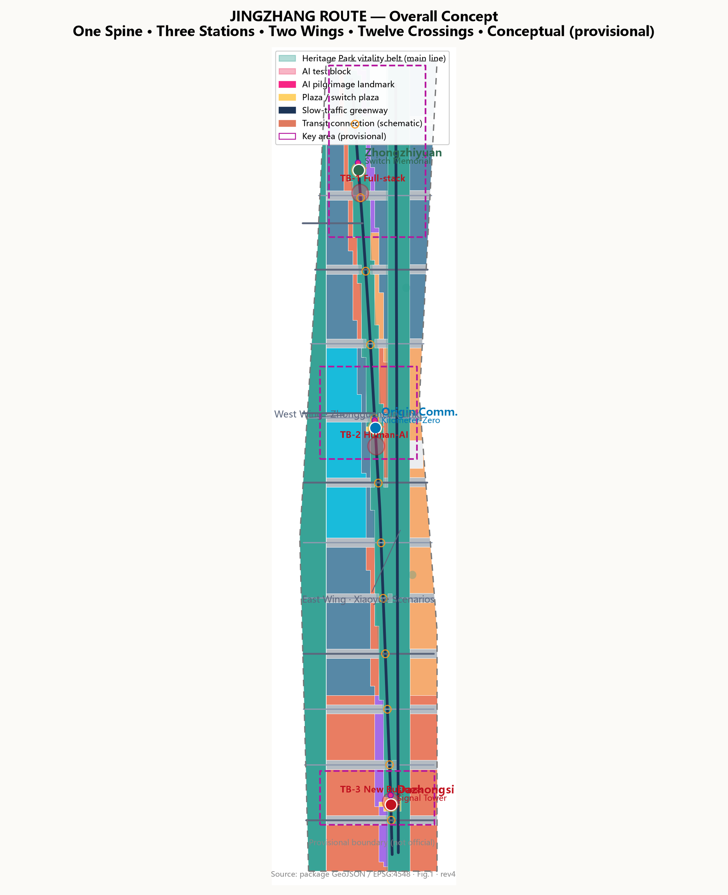
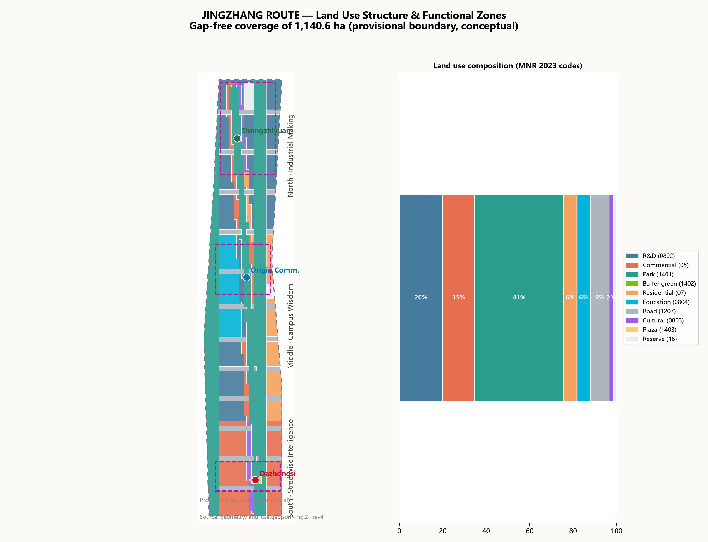
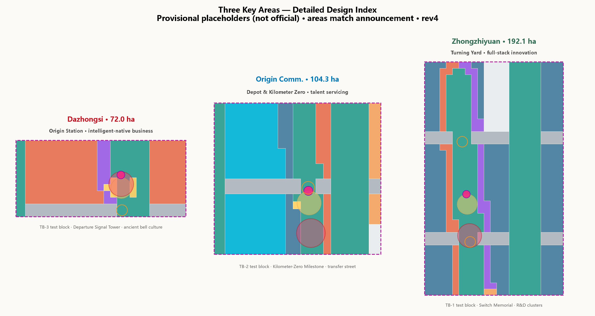
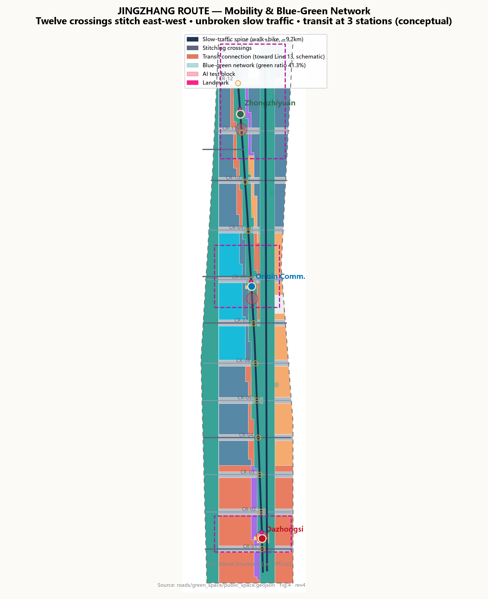
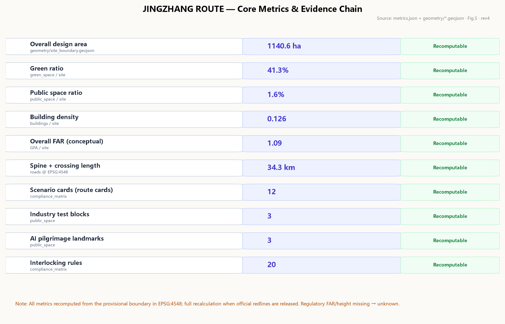

# JINGZHANG ROUTE

**Urban Design Proposal for the Centennial Jing-Zhang AI Innovation Belt**

> 117 years ago, Zhan Tianyou opened China's first self-designed railway route on the Jing-Zhang line.
> 117 years later, this steel track is to become the first urban route of the AI era — every innovation goes live like a train departing: apply for the route, pass interlocking, see the signal, enter the block, arrive safely, or retreat with dignity.

The proposal is organized around the concept of **JINGZHANG ROUTE (京张进路)**. The operating system of railway traffic organization is the most valuable engineering legacy the Jing-Zhang Railway left to China: not a bridge or a gradient, but a whole set of institutions that make thousands of safe movements possible — Route, Interlocking, Signal, Block, and Dispatch. Its core spirit: **every movement must be authorized, verified, visible, and reversible**. The AI Innovation Belt needs exactly this spirit: every AI service, from proposal to go-live, should move like a train — with a route card, an interlocking table, signal lights, test blocks, and a rollback procedure. This proposal pulls that institutional line from 1909 to 2026, turning the century-old Jing-Zhang from "China's first self-built railway" into "China's first route for self-governed AI urbanism."

---

## Design Basis and Source List

This proposal takes the 《Centennial Jing-Zhang AI Innovation Belt International Urban Design Solicitation Prequalification Announcement》 published by the Haidian Branch of the Beijing Municipal Commission of Planning and Natural Resources as its primary basis; its project name, organizers, three scope levels, key-area names and areas, and tasks 1.3/1.4/1.5 define the task boundary [source:OFFICIAL-ANNOUNCEMENT] [standard:PROJECT-OFFICIAL-ANNOUNCEMENT]. The agent-facing open call taskbook (`brief/site-package/agent_taskbook.json`) provides the three positioning statements, five functions, three-area-two-wing structure, the six required tasks agent.1–agent.6, the ten co-creation principles, and the unified boundary clause, which govern task response and wording [source:AGENT-TASKBOOK] [standard:PROJECT-AGENT-OPEN-CALL-TASKBOOK]. `brief/site-package/` — design brief, allowed design space, land-use enums, planning ranges, standards index, and schemas — forms the machine-readable input [source:SITE-PACKAGE]. `data/source_registry.json` formal-ready / background-only / provisional-only tiers define the usage boundary of every material [source:SOURCE-REGISTRY]. `data/processed/agent_fact_pack.md` serves as a reading navigation layer; it is not a new authority [source:PROCESSED-FACT-PACK].

**Provisional boundary disclosure**: as of this draft, the official redline has not been obtained; all geometry is generated from the provisional rough polygons in `brief/site-package/geometry/provisional_boundaries.geojson` [source:BOUNDARY-SOURCE] [source:KEY-AREA-SOURCE] [source:DATA-SRC-PROVISIONAL-BOUNDARIES-20260605]. `geometry/site_boundary.geojson#SITE-001` [data:geometry/site_boundary.geojson#SITE-001] and the three key areas carry `official_boundary=false`, `geometry_role=provisional_constraint`, `boundary_precision=provisional_rough`; they are for generation, self-check, visualization, and design discussion only, and must not be treated as official redlines, approval basis, precise-area basis, or statutory controls [metric:site_area_sqm]. When official polygons are released, the site boundary, key areas, land use, roads, green space, public space, buildings, phasing, and all area metrics must be recalculated as a whole. The proposal is organized to be discussable, verifiable, and replaceable; this data gap does not affect intake or structural review, while content scoring, acceptance, and merge decisions remain with the maintainers and professional review.

Land-use classification follows the project subset of the MNR 《Land Use and Sea Use Classification Guide (2023)》 [standard:MNR-LAND-USE-CLASSIFICATION-GUIDE]; urban design and public space controls cite the MOHURD 《Measures for the Administration of Urban Design》 [standard:MOHURD-URBAN-DESIGN-MEASURES]; implementation boundaries cite the 《Measures for Compilation, Examination and Approval of Regulatory Detailed Plans》 [standard:MOHURD-CONTROL-DETAILED-PLANNING]. AI scenario content safety and labeling follow the 《Interim Measures for the Administration of Generative AI Services》 [standard:GENERATIVE-AI-INTERIM-MEASURES], public space accessibility follows the 《Law of the PRC on Barrier-Free Environment Construction》 [standard:BARRIER-FREE-ENVIRONMENT-LAW], and elderly-friendly requirements reference Guo Ban Fa [2020] No. 45 (background reference) [standard:ELDERLY-SMART-TECH-PLAN].

[source:ASSET-FIG-SITE-OVERVIEW]

*Fig. 1: Overall concept and evidence chain. The provisional boundary is drawn as a low-contrast dashed line; design elements (spine, stations, wings, crossings, test blocks) are high contrast.*

## Three-Level Scope Framework

The three scopes defined by the announcement form the working framework [source:OFFICIAL-ANNOUNCEMENT]:

- **Coordinated research area (43.6 km²)**: north to the 5th Ring Road North, east to the Jingzang Expressway, south to Xizhimenwai Street, west to Wanquanhe Road. Objective: AI industry ecology, future-city form, and strategic positioning; depth: industry and spatial strategy; outputs: industry structure, three-area-two-wing synergy loop, naming/Logo system [metric:coordinated_research_area_sqm].
- **Overall design area (11.4 km²)**: the 1–2 km urban and industrial belt around the Jing-Zhang Heritage Park. Objective: overall urban renewal framework, land use and function layout, transport/municipal support, urban character; depth: regulatory-plan-level urban design [metric:site_area_sqm] [depth:overall_spatial_structure].
- **Key detailed design area (368.4 ha)**: from north to south, Zhongzhiyuan AI Autonomous Innovation Acceleration Area (192.1 ha), Beijing AI Origin Community (104.3 ha), and Dazhongsi AI Industry Cluster (72.0 ha); depth: consolidated implementation-plan-level urban design [metric:key_detailed_design_area_sqm] [metric:key_area_count] [depth:three_key_area_detailed_design].

The three levels transmit downward: industry strategy at the research level decides functional zoning at the overall level, and the overall spatial structure decides the detailed design of key areas. Key-area geometry comes from PROV-KEY-001/002/003 in `geometry/key_areas.geojson` [data:geometry/key_areas.geojson#PROV-KEY-001]; these are temporary rectangular placeholders expressing location and magnitude only, not road redlines, parcel boundaries, or ownership [source:KEY-AREA-SOURCE] [depth:three_level_scope_framework].

[source:ASSET-FIG-LAND-USE]

*Fig. 2: Three-level scope transmission and the "one spine, three stations, two wings, twelve crossings" structure.*

## Coordinated Research Area: Industry and Future City Research

### Positioning and functions

The three taskbook positioning statements — **Centennial Jing-Zhang Cultural Belt, Urban AI Life Experience Belt, AI-Integrated Innovation Belt** — are realized respectively by the cultural narrative (§10), the public experience line (§9), and the industry innovation line (§3/§7). The five functions — AI full-stack autonomous innovation, world-class AI innovation ecology, AI+ scenario empowerment paradigm, intelligent AI vibrant city, and global voice in AI governance — are assigned to the three-area-two-wing spatial carriers [source:AGENT-TASKBOOK] [standard:PROJECT-AGENT-OPEN-CALL-TASKBOOK]:

- **Zhongzhiyuan AI Autonomous Innovation Acceleration Area** (north) = **Turning Yard**: full-stack autonomous innovation and global AI governance voice. Trains turn back and re-marshal here — research turns back into products, products re-marshal into industry.
- **Beijing AI Origin Community** (middle) = **Locomotive Depot and Kilometer Zero**: talent servicing and maintenance for a world-class ecology. Railway mileage starts from station zero; AI innovation starts from people.
- **Dazhongsi AI Industry Cluster** (south) = **Origin Station**: intelligent-native new business. Routes depart from here.
- **Zhongguancun Technology Service Wing** (west) = **Link Line**: connecting to the Zhongguancun main network — capital, IP, global factor allocation.
- **Xiaoyue River Scenario Empowerment Wing** (east) = **Scenario Branch**: delivering AI scenarios into daily life along the Xiaoyue River.

### Naming and Logo direction

Chinese name: 京张进路; English: JINGZHANG ROUTE. Logo direction: **"signal light language + rail line"** — the green/yellow/red three-aspect signal of the Jing-Zhang semaphore as the motif, with three rail lines converging from north to south into the character "人" (person) — echoing Zhan Tianyou's switchback design at Qinglongqiao and expressing the "human-centered" value of an AI city. The Logo and identity system are conceptual and to be developed and trademark-cleared by professional designers [source:AGENT-TASKBOOK].

### Six global AI innovation ecology cases and transfer mechanisms

| Case | Transferable mechanism |
| --- | --- |
| King's Cross, London: disused railway yards regenerated into a tech-culture district | Railway-heritage regeneration paradigm: preserve track memory, public space first, phased renewal — directly maps to the Heritage Park spine and three-station renewal |
| Station F, Paris: old freight station converted into the world's largest startup campus | Station-hall-as-incubator prototype: applicable to Dazhongsi Origin Station |
| Kendall Square, Boston: innovation clustering around research institutions | Near-campus technology transfer: the Origin Community sits next to Tsinghua, Beihang, BUPT |
| Punggol Digital District, Singapore: smart district with integrated industry testing | Statutory test-and-validate space: corresponds to our three industry test blocks |
| Nanshan, Shenzhen: urban-village renewal coexisting with tech industry | Low-cost space + high-density innovation: elastic industrial space in the Turning Yard |
| Yunqi Town, Hangzhou: conference-community-industry compound operation | Annual events driving long-term operation: corresponds to the train-diagram operation system |

All transferred mechanisms are "routed": each case is evaluated and written into the interlocking conditions and operator clauses of the corresponding route card, so that borrowed experience stays verifiable and exit-able [source:AGENT-TASKBOOK].

## Overall Design Area: Urban Renewal and Regulatory-Plan-Level Urban Design

### Spatial structure: one spine, three stations, two wings, twelve crossings

- **One spine**: the Jing-Zhang Heritage Park vitality belt (main line), approx. 9.7 km long, 120–210 m wide — the blue-green spine, slow-traffic spine, and cultural spine [data:geometry/green_space.geojson#GRN-001].
- **Three stations**: Dazhongsi Origin Station, Origin Kilometer-Zero Station, Zhongzhiyuan Turning Yard — the innovation engines and public living rooms [data:geometry/public_space.geojson#PUB-001].
- **Two wings**: Zhongguancun Technology Service Wing (west link) and Xiaoyue River Scenario Wing (east branch) [data:geometry/roads.geojson#RD-015].
- **Twelve crossings**: twelve lateral stitching crossings reconnecting the east-west city split by a century of railway; each crossing is both a traffic stitch and a "switch" — the human-machine co-throw node of AI decisions [data:geometry/roads.geojson#RD-002] [data:geometry/public_space.geojson#PUB-013].

### Urban operating protocol: the five-step route regime

The core institutional design translates railway traffic organization into an urban operating protocol in five closed steps:

1. **Route application**: every AI service files a "route card" (scenario card) before go-live, stating spatial span, time window, responsible party, data boundary, and rollback plan.
2. **Interlocking verification**: the card enters the interlocking table — applications conflicting with existing routes (same public space at the same time, dual-write to the same dataset, overlapping test grounds) are not authorized.
3. **Signal authorization**: upon verification, the spatial signal light turns from red to green; the public can see "this route is open."
4. **Block operation**: the service runs inside its designated test block or formal block, with occupancy and release logged.
5. **Arrival / rollback**: normal arrival at expiry; on anomaly, the pre-filed rollback procedure is executed, the signal turns red, and the block is released.

The protocol is realized by 12 route cards (§7) and 20 interlocking rules [metric:interlocking_rule_count], with spatial seats at 3 test blocks, 12 switch nodes, and the three station plazas [data:geometry/public_space.geojson#PUB-007]. All protocol elements are conceptual and to be deepened by professional teams and authorities [source:AGENT-TASKBOOK].

### Urban renewal framework and character control

Renewal is organized as retain-renovate-new at an approximate 30/40/30 ratio (conceptual; subject to field survey) [metric:building_footprint_area_sqm] [depth:retain_renovate_demolish]: the first interface along the spine is renovation-led (keep the block grain, replace functions); the second interface is new-build-led (incremental innovation space); heritage and historic elements are strictly retained [data:geometry/constraints.geojson#CON-009]. Character in three bands: the south (Dazhongsi–Zhichunlu) is "streetwise intelligence" — active commercial frontages with advertising and lighting governed by the signal light language; the middle (Origin Community) is "campus wisdom" — low, transparent buildings near campuses; the north (Zhongzhiyuan) is "industrial making" — R&D clusters with unified rooftop and fifth-facade control. Height control concept is "setback from the green spine": within 150 m of the spine, buildings do not exceed 30 m to keep views open [data:geometry/buildings.geojson#BLD-0001]; 30–60 m farther out; 60–80 m landmarks at the three stations [metric:official_building_height_m] (regulatory height conditions are missing; these are conceptual values pending official conditions) [depth:height_massing_character] [depth:development_intensity_controls].

## Detailed Design of Key Areas

Key-area geometry is in `geometry/key_areas.geojson` (temporary rectangular placeholders; areas match the announcement: 192.1/104.3/72.0 ha) [data:geometry/key_areas.geojson#PROV-KEY-001] [data:geometry/key_areas.geojson#PROV-KEY-002] [data:geometry/key_areas.geojson#PROV-KEY-003]. All detailed designs below are directional concepts pending official polygons and survey data.

[source:ASSET-FIG-KEY-AREAS]

*Fig. 3: Station positioning differences, spatial links, and project anchors.*

### Zhongzhiyuan AI Autonomous Innovation Acceleration Area (Turning Yard, 192.1 ha)

- **Positioning**: main carrier of the AI full-stack autonomous innovation system; the turning-yard image: research turns into products, products re-marshal into industry [source:AGENT-TASKBOOK].
- **Structure**: central test spine (TB-1 full-stack innovation test block [data:geometry/public_space.geojson#PUB-005]) + eastern R&D clusters (0802 research land [data:geometry/land_use.geojson#LU-003]) + western industry service belt (05 commercial).
- **Buildings**: conceptual 40–60 m R&D clusters; retain existing park grain, renovate the spine interface, new-build around the Turning Plaza [metric:lu_research_area_sqm].
- **Mobility**: Qinghe Crossing (CR-12) and Shangdi South Crossing (CR-11) stitch; transit connection toward Line 13 [data:geometry/roads.geojson#RD-012].
- **Public space**: Turning Plaza (PUB-003) + Turning Switch Memorial (LM-3 landmark).
- **AI scenarios**: SC-01 full-stack compute dispatch, SC-02 robot delivery test block, SC-03 developer real-machine validation yard (route cards in §7).
- **Risks**: complex ownership in existing industrial parks; demolition/renovation subject to field survey; test-block opening requires special permits.

### Beijing AI Origin Community (Locomotive Depot and Kilometer Zero, 104.3 ha)

- **Positioning**: talent servicing and maintenance for a world-class AI ecology; the depot image: AI's talent "locomotives" are serviced, marshaled, and re-departed here; kilometer zero: the railway mileage origin and the spiritual origin of AI innovation.
- **Structure**: Kilometer-Zero Milestone Plaza (PUB-002) + education/research belt (0804 education / 0802 research [data:geometry/land_use.geojson#LU-005]) + near-campus technology transfer street.
- **Buildings**: conceptual 12–36 m education/research buildings; retain campus-adjacent street grain, renovate the spine commercial interface [metric:lu_education_area_sqm].
- **Mobility**: Wudaokou Crossing (CR-08) and Qinghuayuan Crossing (CR-07) stitch; TB-2 human-machine collaboration test block sits at the transit connection [data:geometry/public_space.geojson#PUB-006].
- **Public space**: Origin Plaza + Kilometer-Zero Milestone (LM-2) + multilingual interpretation pavilion.
- **AI scenarios**: SC-04 campus technology transfer street, SC-05 real-time multilingual interpretation, SC-06 human-machine care test block.
- **Risks**: university and research land is not unilaterally decided by the district; renewal is campus-community co-governed functional replacement, not large-scale demolition.

### Dazhongsi AI Industry Cluster (Origin Station, 72.0 ha)

- **Positioning**: intelligent-native new business cluster; the origin-station image: AI industry departs from here; the Dazhongsi ancient bell culture provides a "time bell" anchor.
- **Structure**: Origin Plaza (PUB-001) + intelligent new-business blocks (05 commercial + 0803 cultural [data:geometry/land_use.geojson#LU-004]) + ancient bell cultural node (heritage marker approximate; official line pending [data:geometry/constraints.geojson#CON-008]).
- **Buildings**: conceptual 18–54 m commercial/cultural buildings; renovation-led with selective new build.
- **Mobility**: Dazhongsi East Crossing (CR-01) and Xizhimen North Crossing (CR-02) stitch; TB-3 intelligent new-business test block [data:geometry/public_space.geojson#PUB-008].
- **Public space**: Origin Plaza + Departure Signal Tower (LM-1 landmark: bell + signal light composite).
- **AI scenarios**: SC-07 new-business window laboratory, SC-08 unmanned retail and last-mile delivery, SC-09 intelligent consumption experience.
- **Risks**: adjacent to the Xizhimen transport hub with complex underground conditions; construction near heritage requires special approvals.

## Land Use, Building Scale, and Retain-Renovate-Demolish Strategy

### Land use composition (recomputed from `geometry/land_use.geojson` in EPSG:4548 [depth:land_use_layout])

| Code | Category | Area (ha) | Share |
| --- | --- | ---: | ---: |
| 0802 | Research | 227.8 | 20.0% |
| 05 | Commercial services | 169.2 | 14.8% |
| 1401/1402 | Green and open space | 465.6 | 40.8% |
| 07 | Residential | 70.7 | 6.2% |
| 0804 | Education | 70.7 | 6.2% |
| 1207 | Road land | 97.7 | 8.6% |
| 0803 | Cultural | 23.0 | 2.0% |
| 1403 | Plaza | 8.9 | 0.8% |
| 16 | Reserve | 7.0 | 0.6% |
| **Total** | | **1140.6** | **100%** |

The partition fully covers the submitted boundary without gaps or overlaps; adjacent polygons share boundary coordinates [metric:lu_research_area_sqm] [metric:lu_commercial_area_sqm] and [metric:lu_green_area_sqm] [metric:lu_road_area_sqm]. The high green share (40.8%) expresses "a city founded on a green spine": the Heritage Park vitality belt, the Xiaoyue River greenbelt, and station parks form the blue-green skeleton [metric:green_ratio].

### Building scale (conceptual massing, not survey [depth:land_use_layout])

- Building footprint: approx. 1.435 million m² (building density 0.126) [metric:building_footprint_area_sqm] [metric:building_density]
- Total floor area: approx. 12.44 million m² (3.6 m/floor) [metric:building_gfa_sqm]
- Overall FAR: approx. 1.09 (sqm/sqm, conceptual) [metric:far_overall]
- Height control: ≤30 m within 150 m of the spine, 30–60 m beyond, 60–80 m landmarks at stations (conceptual; regulatory conditions missing and marked unknown) [metric:official_building_height_m]

### Retain-renovate-demolish strategy (conceptual ratio, pending survey)

Allocated by block-renewal logic: **approx. 30% retain** (heritage surroundings, campus grain, existing parks), **approx. 40% renovate** (spine first interface functional replacement), **approx. 30% new build** (second interface incremental space and station nodes). Every mass in `geometry/buildings.geojson` carries a `retention` property (retain/renovate/new) for audit [data:geometry/buildings.geojson#BLD-0100] [depth:retain_renovate_demolish]. These are conceptual only and do not constitute parcel-level demolition/renovation conclusions [source:AGENT-TASKBOOK].

## AI Innovation Ecosystem, Personas, and AI+ Scenarios

### Twelve route cards (AI scenario cards)

Each route card = one scenario: span, interlocking conditions, data boundary, human review, operator, spatial layer, risk. All are conceptual [metric:scenario_card_count] [source:GENERATIVE-AI-INTERIM-MEASURES].

| ID | Route card (scenario) | Location | Users | Type |
| --- | --- | --- | --- | --- |
| SC-01 | Full-stack compute dispatch | Turning Plaza | developers/enterprises | industry service |
| SC-02 | Robot delivery test block | Zhongzhiyuan TB-1 | logistics/ residents | **industry test & validation** |
| SC-03 | Developer real-machine validation yard | Zhongzhiyuan east | developers | industry service |
| SC-04 | Campus technology transfer street | Origin west spine | faculty/startups | industry service |
| SC-05 | Real-time multilingual interpretation | Origin Plaza | international talents | public service |
| SC-06 | Human-machine care test block | Origin TB-2 | seniors/care | **industry test & validation** |
| SC-07 | New-business window laboratory | Dazhongsi spine | merchants | industry service |
| SC-08 | Unmanned retail & last-mile delivery | Dazhongsi TB-3 | residents | **industry test & validation** |
| SC-09 | Intelligent consumption experience | Dazhongsi blocks | consumers | consumer experience |
| SC-10 | Crossing smart signal lights | twelve crossings | all | public service |
| SC-11 | AI pilgrimage check-in & honor wall | three landmarks | developers/visitors | public culture |
| SC-12 | Urban interlocking dashboard | three plazas | all | public governance |

Example route card (SC-02 robot delivery test block): span = TB-1 inner loop; time window = weekdays 10:00–16:00; interlocking conditions = no conflict with SC-12 dashboard data, off-peak with pedestrian rush hours, 8 km/h speed cap in the block; data boundary = no facial capture, no off-route recording; human review = weekly operation report jointly reviewed by operator and sub-district; rollback = immediate stop and switch to human delivery [data:geometry/public_space.geojson#PUB-005]. The three industry test-and-validation cards (SC-02/SC-06/SC-09) map to the three test blocks [metric:test_block_count] [metric:test_block_area_sqm].

### Five personas and scenario-space-operation mapping [metric:persona_count]

1. **Developers/entrepreneurs** (Zhongzhiyuan): real-machine validation, compute, funding → SC-01/03, operated by the "dispatch office" developer community.
2. **Faculty and students** (Origin): technology transfer, internships, cross-language exchange → SC-04/05, operated by a campus-community joint committee.
3. **Residents (incl. seniors)**: care, convenience, no digital exclusion → SC-06/08/10, operated by sub-district + enterprise consortium with human counters retained.
4. **Visitors and AI pilgrims**: culture, check-in, public narrative → SC-11, operated by the pilgrimage route manager.
5. **Enterprise operators**: testing compliance, data compliance, interlocking admission → SC-02/07/12, operated by the interlocking-table committee.

### Interlocking rules (20, excerpt)

Interlocking rules write "what must not happen at the same time" into verifiable entries: ①only one route open in the same public space at the same time; ②no dual-write to the same dataset; ③test blocks off-peak with pedestrian rush hours; ④unmanned delivery and event hours are mutually exclusive; ⑤landmark lighting and nighttime rest hours are mutually exclusive; ⑥every route's rollback procedure must be filed before opening [metric:interlocking_rule_count]. The full rule table is in `compliance_matrix.json` and the visual page. The rules are conceptual and to be converted into management instruments by professional teams and authorities.

## Transport, Rail, Municipal Infrastructure, and Public Services

### Slow traffic and stitching

- **Slow-traffic main spine**: continuous pedestrian + cycling greenway along the Heritage Park vitality belt, approx. 9.7 km, unbroken through the three stations [data:geometry/roads.geojson#RD-001] [metric:road_length_m].
- **Twelve crossings**: secondary/branch roads stitching east-west; zero-level crossings with synchronized signal light language (SC-10), reconnecting daily life on both sides [data:geometry/roads.geojson#RD-002].
- **Transit connections**: each station connects toward the existing Line 13 (schematic alignment, not engineering) [source:OSM-CONTEXT] [data:geometry/roads.geojson#RD-017].
- **Wing corridors**: Zhongguancun Link Line (west) and Xiaoyue River greenway (east) [data:geometry/roads.geojson#RD-015].

### Municipal and new infrastructure (conceptual)

- Edge-compute nodes co-located on smart light poles (carriers of the signal light language) at crossings [depth:municipal_new_infrastructure].
- Distributed energy and rooftop PV reserved; dual-circuit power for test blocks.
- Utility ducts pre-laid under the twelve crossings to avoid repeated excavation.
- Public data: the interlocking dashboard (SC-12) publishes route status and block occupancy anonymously; personal privacy never leaves the premises [source:GENERATIVE-AI-INTERIM-MEASURES].

[source:ASSET-FIG-MOBILITY]

*Fig. 4: Slow-traffic spine, twelve crossings, wing corridors, blue-green network, and AI scenario nodes.*

## Blue-Green Network, Public Space, and Urban Character

### Blue-green system

- Jing-Zhang Heritage Park vitality belt (main-line green spine in three bands: streetwise south / campus middle / industrial north) [data:geometry/green_space.geojson#GRN-001].
- Xiaoyue River greenbelt (east wing, waterfront slow traffic) [data:geometry/green_space.geojson#GRN-004] and west buffer greenbelt [data:geometry/green_space.geojson#GRN-005].
- Three station parks plus three pocket parks. Total green space approx. 4.708 million m²; green ratio 41.3% [metric:green_ratio] [metric:green_space_area_sqm] [depth:blue_green_public_space].

### Public space and three AI pilgrimage landmarks [metric:landmark_count]

1. **Departure Signal Tower (Dazhongsi, LM-1)**: modeled on the railway departure signal; the tower's three-aspect lights publish the belt's route status in real time; linked with the ancient bell culture for hourly "bell reports" — the public clock of AI city operations [data:geometry/public_space.geojson#PUB-019].
2. **Kilometer-Zero Milestone (Origin, LM-2)**: a railway mileage-origin installation recording century milestones and the first contributor list of the belt (honor display; names published with authorization) [data:geometry/public_space.geojson#PUB-020].
3. **Turning Switch Memorial (Zhongzhiyuan, LM-3)**: a manually throwable switch installation expressing "humans keep the final throw" — AI proposes, humans throw; a global check-in and public participation node [data:geometry/public_space.geojson#PUB-021].

The three landmarks form the "route pilgrimage line" public experience route (depart south, pass origin, arrive at the turn), linked with the Heritage Park and Zhongguancun innovation narrative [depth:blue_green_public_space]. All landmarks are conceptual installations requiring design rights clearance before implementation [source:AGENT-TASKBOOK].

### Character control

The signal light language is applied as a common public design language for paving, lighting, signage, and advertising norms; the fifth facade is uniformly managed; accessibility and age-friendliness are embedded throughout (zero-level crossings, audible signal cues, large-type and voice modes) [standard:BARRIER-FREE-ENVIRONMENT-LAW] [standard:ELDERLY-SMART-TECH-PLAN].

## Renewal Projects, Implementation Policy, and Phasing

### Eight renewal projects (conceptual list [metric:renewal_project_count])

| ID | Project | Location | Type | Dependencies |
| --- | --- | --- | --- | --- |
| R-01 | Heritage belt south section connection | Dazhongsi–Zhichunlu | public space | site handover |
| R-02 | Origin Plaza & signal tower | Dazhongsi station | node new build | heritage approval |
| R-03 | Intelligent new-business blocks renovation | Dazhongsi spine | building renovation | tenant negotiation |
| R-04 | Origin Plaza & Kilometer-Zero milestone | Origin station | node new build | campus co-governance |
| R-05 | Near-campus transfer street | Origin west | function replacement | university cooperation |
| R-06 | Turning Plaza & switch memorial | Zhongzhiyuan station | node new build | park ownership |
| R-07 | Full-stack test block TB-1 | Zhongzhiyuan | industry testing | special permits |
| R-08 | Xiaoyue River greenway connection | east wing | blue-green network | river management coordination |

### Phasing (`geometry/phasing.geojson` [data:geometry/phasing.geojson#PH-1-01])

- **Phase 1, 2026–2028 "test blocks first"**: approx. 2.4 km². Heritage belt connection, three test blocks open, station plazas launched — the route regime runs first [metric:phase_1_area_sqm].
- **Phase 2, 2029–2031 "three stations take shape"**: approx. 3.0 km². Renewal projects around stations land; wing corridors take shape [metric:phase_2_area_sqm].
- **Phase 3, 2032–2035 "full-belt interlocking"**: approx. 6.0 km². Full-belt renewal completes; the interlocking table runs belt-wide [metric:phase_3_area_sqm].

### Global AI event system and long-term operation (conceptual [source:AGENT-TASKBOOK] [depth:phasing_implementation])

Annual operations organized as a **train diagram**: ①**Jingzhang Developer Day** (quarterly, rotating stations); ②**International AI Innovation Week** (annual, Turning Plaza as home venue — the global AI event system); ③**Interlocking Annual Report** (annual public route statistics and governance ledger); ④**Route Pilgrimage Line** (everyday public experience); ⑤**Dispatch Office developer community** (online + three station spaces); ⑥**attraction and conversion mechanism** (test-block graduates get priority for industrial space). Operators, funding, and policy arrangements are conceptual and to be assessed by authorities and operators [assumption:A-OPERATION-001].

## Metrics, Area Recalculation, and Compliance Matrix

### Core metrics and design meaning

| Metric | Value | Design meaning | Recalculation source |
| --- | ---: | --- | --- |
| Overall design area | 1140.6 ha | overall level of scope transmission | site_boundary @ EPSG:4548 [metric:site_area_sqm] |
| Key-area areas | 192.1/104.3/72.0 ha | matching the announcement | key_areas @ EPSG:4548 [metric:key_detailed_design_area_sqm] |
| Green ratio | 41.3% | green-spine city, talent life quality | green_space/site [metric:green_ratio] |
| Public space ratio | 1.6% | point-like public spaces: stations, switches, test blocks | public_space/site [metric:public_space_ratio] |
| Building density | 0.126 | low-density renewal, no mass demolition | buildings/site [metric:building_density] |
| Overall FAR | 1.09 | conceptual, pending regulatory conditions | GFA/site [metric:far_overall] |
| Slow spine + crossing length | 34.3 km | stitching and slow-traffic continuity | roads @ EPSG:4548 [metric:road_length_m] |
| Scenario cards / test blocks / landmarks | 12/3/3 | taskbook-mandated counts | compliance_matrix [metric:scenario_card_count] [metric:test_block_count] [metric:landmark_count] |
| Interlocking rules | 20 | verifiable rules of the route regime | compliance_matrix [metric:interlocking_rule_count] |

All metrics are recomputed from `geometry/*.geojson` in EPSG:4548 or defined by design constants; formulas and assumptions are in `metrics.json` [depth:metrics_recalculation]. Regulatory FAR and height are marked `unknown` in `metrics.json` with recalculation preconditions because official conditions are missing [metric:official_far] [metric:official_building_height_m].

### Compliance coverage

`compliance_matrix.json` covers announcement tasks 1.3.1–1.5.3.3 (16 items) and agent.1–agent.6 (6 items), each with chapter, layer, metric, drawing, HTML, source, and assumption evidence [depth:metrics_recalculation]; `standard_matrix.json` covers 9 registered standards (all 5 mandatory addressed) [standard:MOHURD-URBAN-DESIGN-MEASURES]; `design_depth_matrix.json` covers 15 formal design-depth items, all complete [depth:three_key_area_detailed_design].

[source:ASSET-FIG-METRICS]

*Fig. 5: Core metric sources, recalculation relationships, pending regulatory metrics, and self-check status.*

## Risk, Copyright, and Compliance

- **Data legitimacy**: all cited materials come from public official announcements, repository-cleared materials, or agent-generated content; no non-public maps, unauthorized tables, or fabricated official endorsements are used [source:SOURCE-REGISTRY].
- **Copyright**: geometry, figures, HTML, and PDFs are self-generated by the agent with no external copyrighted material [source:ASSET-FIG-SITE-OVERVIEW] [source:ASSET-VISUAL] [source:ASSET-DRAWINGS]; OSM background is context-only under ODbL attribution boundaries [source:OSM-CONTEXT]; figures use system fonts (Microsoft YaHei/DejaVu Sans) not redistributed with the package; see `report/copyright_statement.md`.
- **Privacy**: data-boundary clauses in all AI scenarios prohibit facial capture and off-route recording; public data is published anonymized [source:GENERATIVE-AI-INTERIM-MEASURES].
- **AI generation disclosure**: this proposal is generated by an AI agent; methods and toolchain are disclosed in §12 and `report/narrative.md`; no fabricated manual operations [source:GEOMETRY-GENERATOR].
- **Official-approval prohibition**: all spatial proposals are conceptual; they do not constitute government approval, planning approval, implementation commitments, investment estimates, or parcel-level conclusions [source:AGENT-TASKBOOK].
- **Pending materials**: official redline and key-area polygons, regulatory conditions (FAR/height/density), existing buildings and ownership, road redlines, municipal utilities, heritage control lines, engineering alignments (e.g., Line 13), and current transport data [assumption:A-CONTROLS-001] [assumption:A-BOUNDARY-001].
- **Professional review needed**: the route regime, interlocking rules, and test-block institutions require legal and governance review; demolition/renovation and height control require planner review [depth:risk_missing_data].

## References

本清单对应的机器可读登记见 `sources.json` [source:OFFICIAL-ANNOUNCEMENT]。

1. Haidian Branch, Beijing Municipal Commission of Planning and Natural Resources: 《Prequalification Announcement for the Centennial Jing-Zhang AI Innovation Belt International Urban Design Solicitation》(2026-05-09), https://ghzrzyw.beijing.gov.cn/zhengwuxinxi/tzgg/hd/202605/t20260509_4643047.html
2. 《Agent-Facing Open Call Taskbook Excerpt for the Centennial Jing-Zhang AI Innovation Belt》, open-city-ai/haidian `brief/site-package/agent_taskbook.json` (cleared excerpt 2026-05-18)
3. MOHURD: 《Measures for the Administration of Urban Design》(Ministry Order No. 35, 2017)
4. MOHURD: 《Measures for Compilation, Examination and Approval of Regulatory Detailed Plans》(Ministry Order No. 7, 2010)
5. MNR: 《Land Use and Sea Use Classification Guide (2023)》
6. CAC et al.: 《Interim Measures for the Administration of Generative AI Services》(2023)
7. NPC Standing Committee: 《Law of the PRC on Barrier-Free Environment Construction》(2023)
8. General Office of the State Council: 《Implementation Plan for Solving Difficulties of the Elderly in Using Smart Technologies》(Guo Ban Fa [2020] No. 45)
9. Repository materials: `data/source_registry.json`, `data/processed/agent_fact_pack.md`, `brief/site-package/geometry/provisional_boundaries.geojson` (verified 2026-08-07)
10. Public historical records of the Jing-Zhang Railway (1905–1909) and the Qinglongqiao switchback designed by Zhan Tianyou
