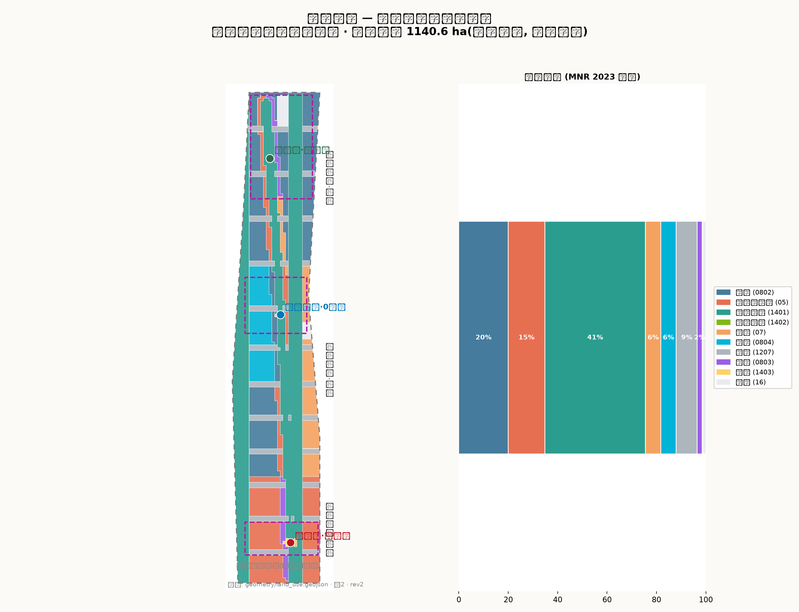
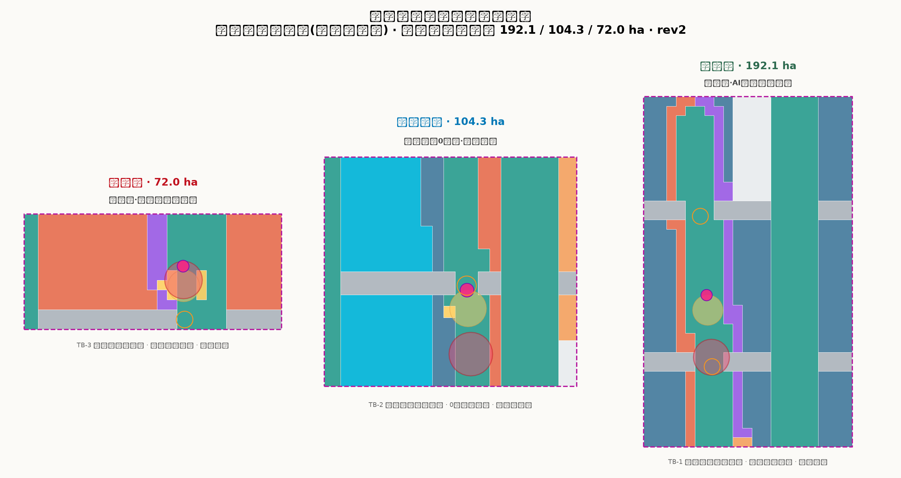
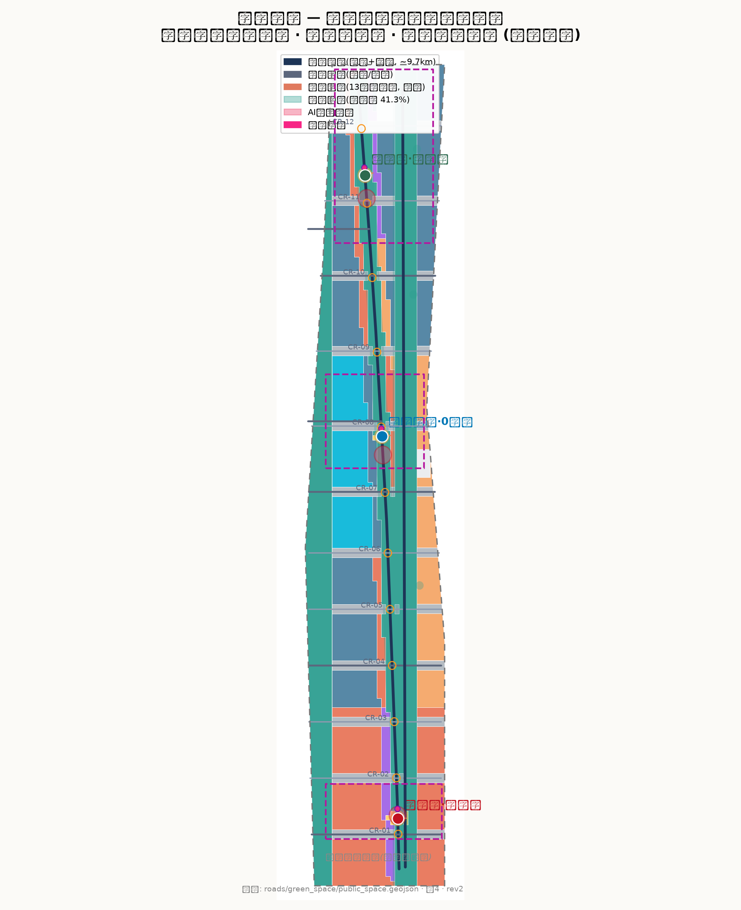
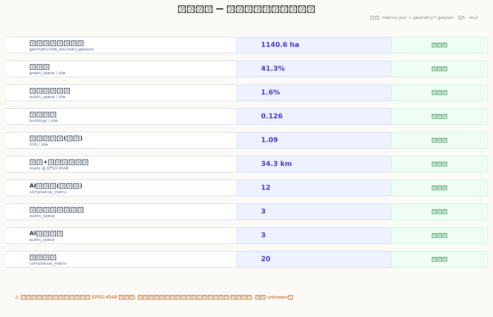

# 京张进路 JINGZHANG ROUTE

**百年京张 AI 创新带城市设计方案**

> 一百一十七年前，詹天佑在京张铁路上为中国开出了第一条自主设计的进路。
> 一百一十七年后，这条钢轨要成为 AI 时代的第一条城市进路——每一次创新上线，都像一列车出发：申请进路、通过联锁、看见信号、进入区间、平安到达，或者体面回退。

本方案以**「京张进路」**为总体概念。铁路行车组织制度是京张铁路留给中国最宝贵的工程遗产：不是某座桥、某段坡，而是一整套"让千万次运行安全发生"的制度——进路（Route）、联锁（Interlocking）、信号（Signal）、闭塞（Block）、调度（Dispatch）。这套制度的核心精神是：**每一次移动都必须被授权、被校验、被看见、可回退**。AI 创新带需要的正是同一种精神：每一个 AI 服务从立项到上线，都像一列车进站出站，有进路单、有联锁表、有信号灯、有试验区间、有回退程序。本方案把这条制度线从 1909 年拉到 2026 年，让百年京张从"中国自主修建的第一条铁路"变成"中国自主治理 AI 城市的第一条进路"。

---

## 1. 设计依据与资料清单

本方案以北京市规划和自然资源委员会海淀分局发布的《百年京张AI创新带城市设计国际方案征集资格预审公告》为第一依据，其确定的项目名称、主办信息、三层范围、三处重点区名称与面积、公告任务 1.3/1.4/1.5 均为本方案的任务边界 [source:OFFICIAL-ANNOUNCEMENT] [standard:PROJECT-OFFICIAL-ANNOUNCEMENT]。面向智能体的开源征集任务书（`brief/site-package/agent_taskbook.json`）提供三大定位、五大功能、三区两翼、agent.1–agent.6 六项必答任务、十条共创原则与统一边界条款，是本方案的任务约束与表述规范 [source:AGENT-TASKBOOK] [standard:PROJECT-AGENT-OPEN-CALL-TASKBOOK]。`brief/site-package/` 中的设计任务书、允许设计空间、用地代码枚举、规划指标区间、标准索引与 schema 构成本方案的机器可读输入 [source:SITE-PACKAGE]；`data/source_registry.json` 的 formal-ready / background-only / provisional-only 分级决定每项资料的使用边界 [source:SOURCE-REGISTRY]；`data/processed/agent_fact_pack.md` 作为阅读导航层帮助组织三层范围与任务清单，其本身不构成新权威来源 [source:PROCESSED-FACT-PACK]。

**临时边界披露**：截至本稿，仓库尚未取得官方精确红线，本方案按 `brief/site-package/geometry/provisional_boundaries.geojson` 提供的临时粗略多边形生成全部几何 [source:BOUNDARY-SOURCE] [source:KEY-AREA-SOURCE] [source:DATA-SRC-PROVISIONAL-BOUNDARIES-20260605]。`geometry/site_boundary.geojson#SITE-001` [data:geometry/site_boundary.geojson#SITE-001] 与三处重点区均设置 `official_boundary=false`、`geometry_role=provisional_constraint`、`boundary_precision=provisional_rough`，仅用于方案生成、自检、可视化与设计讨论，不得作为官方红线、审批依据、精确面积依据或法定控制结论 [metric:site_area_sqm]。官方 polygon 发布后，site boundary、key areas、land use、roads、green space、public space、buildings、phasing 与全部面积指标需整体重算，本方案已按"可讨论、可复核、可替换"原则组织，不因该组织方数据缺口阻断内容评分。

用地分类一律采用自然资源部《国土空间调查、规划、用途管制用地用海分类指南（2023）》的项目子集代码 [standard:MNR-LAND-USE-CLASSIFICATION-GUIDE]，城市设计与公共空间控制引用住建部《城市设计管理办法》 [standard:MOHURD-URBAN-DESIGN-MEASURES]，实施管理边界引用《城市、镇控制性详细规划编制审批办法》 [standard:MOHURD-CONTROL-DETAILED-PLANNING]。AI 场景的内容安全与标识要求对照《生成式人工智能服务管理暂行办法》 [standard:GENERATIVE-AI-INTERIM-MEASURES]，公共空间无障碍对照《无障碍环境建设法》 [standard:BARRIER-FREE-ENVIRONMENT-LAW]，适老化要求参考国办发〔2020〕45 号实施方案（背景性参考） [standard:ELDERLY-SMART-TECH-PLAN]。

[source:ASSET-FIG-SITE-OVERVIEW]

*图 1：京张进路总体概念与证据链总览。临时边界以低对比虚线表达，设计重点（正线、三站、两翼、十二道口、试验区间）高对比呈现。*

## 2. 三层范围工作框架

公告确定的三层范围构成本方案的工作框架 [source:OFFICIAL-ANNOUNCEMENT]：

- **统筹研究范围（43.6 km²）**：北至北五环路、东至京藏高速、南至西直门外大街、西至万泉河路。工作目标为 AI 产业生态、未来城市形态与战略定位研究，深度为产业与空间战略层面，成果表达为产业格局、三区两翼协同回路与命名/Logo 体系 [metric:coordinated_research_area_sqm]。
- **总体设计范围（11.4 km²）**：京张遗址公园周边 1–2 公里城市地区和产业区。工作目标为城市更新总体框架、用地与功能布局、交通市政支撑与风貌控制，深度达到控制性详细规划的城市设计深度 [metric:site_area_sqm] [depth:overall_spatial_structure]。
- **重点区域范围（368.4 ha）**：自北向南为众智园 AI 自主创新加速区（192.1 ha）、北京 AI 原点社区（104.3 ha）、大钟寺 AI 产业聚集区（72.0 ha），深度为规划综合实施方案的城市设计深度 [metric:key_detailed_design_area_sqm] [metric:key_area_count] [depth:three_key_area_detailed_design]。

三层范围逐级传导：统筹层的产业战略决定总体层的功能分区，总体层的空间结构决定重点区的详细设计。三处重点区几何来自 `geometry/key_areas.geojson` 的 PROV-KEY-001/002/003 [data:geometry/key_areas.geojson#PROV-KEY-001]，均为临时矩形占位，仅表达位置与量级，不表达道路红线、地块边界或权属 [source:KEY-AREA-SOURCE] [depth:three_level_scope_framework]。

[source:ASSET-FIG-LAND-USE]

*图 2：三层范围传导与"一脊三站两翼十二道口"总体空间结构。*

## 3. 统筹研究范围产业与未来城市研究

### 3.1 三大定位与五大功能

任务书确定的三大定位——**百年京张文化带、都市 AI 生活体验带、AI 融合创新带**——在本方案中分别由文化叙事线（§10）、公共体验线（§9）与产业创新线（§3/§7）落实；五大功能——AI 全栈自主创新体系、世界级 AI 创新生态、AI+ 场景赋能新范式、智能化 AI 活力城市、AI 治理全球话语权——落到"三区两翼"的空间载体上 [source:AGENT-TASKBOOK] [standard:PROJECT-AGENT-OPEN-CALL-TASKBOOK]：

- **众智园 AI 自主创新加速区**（北端）= **折返场**：承担 AI 全栈自主创新体系与 AI 治理全球话语权。列车在此折返换挂——研究在此折返为产品，产品在此换挂为产业。
- **北京 AI 原点社区**（中段）= **机务段与 0 公里**：承担世界级 AI 创新生态的人才整备与养护功能。铁路里程从车站零点算起，AI 创新从人才原点算起。
- **大钟寺 AI 产业聚集区**（南端）= **始发站**：承担智能原生新业态。进路从这里开出，产业从这里出发。
- **中关村科技服务翼**（西翼）= **联络线**：接入中关村的主网——资本、IP、要素全球化配置。
- **小月河场景赋能翼**（东翼）= **场景支线**：沿小月河把 AI 场景配送进日常生活。

### 3.2 命名与 Logo 方向

命名体系：中文"京张进路"，英文 JINGZHANG ROUTE。Logo 方向为**"信号灯语 + 轨道线"**：以京张铁路信号机的绿/黄/红三显示为母题，三条轨道线自北向南收束为"人"字形——呼应詹天佑设计的青龙桥人字形铁路，也表达"人本位"的 AI 城市价值观。Logo 及视觉识别均属概念建议，具体由专业设计团队深化并完成商标清权 [source:AGENT-TASKBOOK]。

### 3.3 六个全球 AI 创新生态案例及转化机制

| 案例 | 可转化机制 |
| --- | --- |
| 伦敦国王十字（King's Cross）：废弃铁路场站更新为科技文化区 | 铁路遗产地活化范式：保留轨道记忆、以公共空间为先导、分期更新——直接对应京张遗址公园活力带与三站更新 [source:AGENT-TASKBOOK] |
| 巴黎 Station F：旧货运车站改造为全球最大创业园区 | 旧站房→产业孵化器：大钟寺始发站可借鉴"站房即孵化器"的空间原型 |
| 波士顿肯德尔广场（Kendall Square）：研究机构密集区的创新集聚 | 近校成果转化：原点社区紧邻清华、北航、北邮，可转化"校园-街区-市场"三圈层 |
| 新加坡榜鹅数字园区（Punggol Digital District）：智慧园区与产业测试一体化 | 测试验证空间法定化：对应本方案 3 个产业测试试验区间 |
| 深圳南山区：城中村更新与科技产业共生 | 低成本空间+高密度创新：众智园折返场可保留弹性产业空间 |
| 杭州云栖小镇：会展-社区-产业复合运营 | 以年度活动带动长期运营：对应本方案运行图式活动体系 |

转化机制统一为"进路化"：每个案例的机制经评估后写入对应场景卡（进路单）的联锁条件与运营主体条款，确保"拿来"的经验可验证、可退出 [source:AGENT-TASKBOOK]。

## 4. 总体设计范围城市更新与控规深度城市设计

### 4.1 总体空间结构：一脊三站两翼十二道口

- **一脊**：京张遗址公园活力带（正线），全长约 9.7 公里，宽 120–210 米，是贯穿全带的蓝绿主脊、慢行主脊与文化主脊 [data:geometry/green_space.geojson#GRN-001]。
- **三站**：大钟寺始发站、原点 0 公里站、众智园折返场，对应三处重点区，是全带的创新引擎与公共客厅 [data:geometry/public_space.geojson#PUB-001]。
- **两翼**：中关村科技服务翼（西翼联络线）与小月河场景赋能翼（东翼支线） [data:geometry/roads.geojson#RD-015]。
- **十二道口**：十二条横向缝合道口把百年铁路造成的城市东西阻隔重新接上，每个道口既是交通缝合点，也是"道岔"——AI 决策的人机共扳节点 [data:geometry/roads.geojson#RD-002] [data:geometry/public_space.geojson#PUB-013]。

### 4.2 城市运行协议：进路五步制

本方案的核心制度设计是把铁路行车组织转译为城市运行协议，五步闭环：

1. **进路申请**：每个 AI 服务上线前提交"进路单"（场景卡），写明起讫空间、时间窗、责任主体、数据边界与回退方案。
2. **联锁校验**：进路单进入联锁表校验——与既有进路冲突（同一公共空间同时段、同一数据集双写、同一测试场地重叠占用）的申请不予开放。
3. **信号开放**：校验通过后，空间信号灯语由红转绿，公众可看见"这条进路已开放"。
4. **区间运行**：服务在划定的试验区间或正式区间内运行，区间占用与释放留痕。
5. **到达/回退**：到期正常到达；异常时按进路单预设的回退程序撤回，信号转红，区间释放。

这套协议对应 12 张进路单（§7）与 20 条联锁规则 [metric:interlocking_rule_count]，其空间落点为 3 个试验区间、12 处道岔节点与三站广场 [data:geometry/public_space.geojson#PUB-007]。所有运行协议均为概念建议，供专业团队与主管部门深化 [source:AGENT-TASKBOOK]。

### 4.3 城市更新总体框架与风貌控制

用地更新按"保留-改造-新建"约 30/40/30 组织（概念比例，待现状普查校核） [metric:building_footprint_area_sqm] [depth:retain_renovate_demolish]：沿脊第一界面以改造为主（保留街区肌理，置换功能），第二界面以新建为主（增量创新空间），文保与历史要素周边严格保留 [data:geometry/constraints.geojson#CON-009]。风貌三段式：南段（大钟寺-知春路）市井智能——商业界面活跃、广告与灯光受信号灯语规范；中段（原点社区）学府智慧——近校建筑低矮通透、学术气息；北段（众智园）产业智造——研发建筑群组、屋顶设备与第五立面统一管控。高度控制概念为"近脊退让"：距绿脊 150 米内建筑不超过 30 米，保证活力带视线通透 [data:geometry/buildings.geojson#BLD-0001]；远脊地块 30–60 米；三站节点允许 60–80 米地标 [metric:official_building_height_m]（控规高度条件缺失，以上为概念值，待官方条件校核） [depth:height_massing_character] [depth:development_intensity_controls]。

## 5. 重点区域详细设计

三处重点区几何见 `geometry/key_areas.geojson`（临时矩形占位，面积与公告一致：192.1/104.3/72.0 公顷） [data:geometry/key_areas.geojson#PROV-KEY-001] [data:geometry/key_areas.geojson#PROV-KEY-002] [data:geometry/key_areas.geojson#PROV-KEY-003]。以下详细设计均为方向性概念，待官方 polygon 与现状资料发布后深化。

[source:ASSET-FIG-KEY-AREAS]

*图 3：三站定位差异、空间联系与项目抓手。*

### 5.1 众智园 AI 自主创新加速区（折返场，192.1 ha）

- **定位**：AI 全栈自主创新体系主承载区。折返场意象：研究在此折返为产品，产品在此换挂为产业 [source:AGENT-TASKBOOK]。
- **空间结构**：中央试验脊（TB-1 全栈创新试验区间 [data:geometry/public_space.geojson#PUB-005]）+ 东侧研发组团（0802 科研用地为主 [data:geometry/land_use.geojson#LU-003]）+ 西侧产业服务带（05 商业）。
- **建筑更新**：概念体块约 40–60 米研发楼群，保留现状产业园区肌理、改造沿脊界面、新建折返广场周边组团 [metric:lu_research_area_sqm]。
- **交通慢行**：清河道口（CR-12）与上地南道口（CR-11）双缝合，轨道接驳线连接 13 号线方向 [data:geometry/roads.geojson#RD-012]。
- **公共空间**：折返广场（PUB-003）+ 折返扳道纪念装置（LM-3 朝圣地标）。
- **AI 场景**：SC-01 全栈算力调度台、SC-02 机器人配送试验区间、SC-03 开发者真机验证场（见 §7 进路单）。
- **实施风险**：既有产业园区权属复杂，拆改留需以现状普查为准；试验区间开放需主管部门专项许可。

### 5.2 北京 AI 原点社区（机务段与 0 公里，104.3 ha）

- **定位**：世界级 AI 创新生态的人才整备与养护区。机务段意象：AI 的人才"机车"在此检修、整备、再出发；0 公里意象：铁路里程原点，AI 创新的精神原点。
- **空间结构**：0 公里里程碑广场（PUB-002）+ 教育科研带（0804 教育/0802 科研 [data:geometry/land_use.geojson#LU-005]）+ 近校成果转化街。
- **建筑更新**：概念体块以 12–36 米教育科研建筑为主，保留高校周边街巷肌理、改造沿脊商业界面 [metric:lu_education_area_sqm]。
- **交通慢行**：五道口道口（CR-08）与清华园道口（CR-07）缝合；TB-2 人机协同试验区间紧邻轨道接驳 [data:geometry/public_space.geojson#PUB-006]。
- **公共空间**：原点广场 + 0 公里里程碑（LM-2）+ 多语共译亭。
- **AI 场景**：SC-04 校园成果转化街、SC-05 多语实时共译亭、SC-06 人机协同护理试验区间。
- **实施风险**：高校与科研院所用地非地方可单方决定，更新以校地协同、功能置换为主，不做大规模拆除。

### 5.3 大钟寺 AI 产业聚集区（始发站，72.0 ha）

- **定位**：智能原生新业态集聚区。始发站意象：AI 产业从这里发车；大钟寺古钟文化提供"报时钟"锚点。
- **空间结构**：始发广场（PUB-001）+ 智能新业态街区（05 商业 + 0803 文化 [data:geometry/land_use.geojson#LU-004]）+ 古钟文化节点（文保要素示意，位置待官方核实 [data:geometry/constraints.geojson#CON-008]）。
- **建筑更新**：概念体块 18–54 米商业文化建筑，改造为主、新建为辅。
- **交通慢行**：大钟寺东道口（CR-01）、西直门北道口（CR-02）缝合；TB-3 智能新业态试验区间 [data:geometry/public_space.geojson#PUB-008]。
- **公共空间**：始发广场 + 出发信号机塔（LM-1 朝圣地标，钟声+信号灯语复合装置）。
- **AI 场景**：SC-07 智能新业态橱窗实验室、SC-08 无人零售与末端配送、SC-09 智能消费体验区间。
- **实施风险**：南端邻近西直门交通枢纽，地下工程条件复杂；文保要素周边建设需专项审批。

## 6. 用地、建筑规模与拆改留方案

### 6.1 用地构成（由 `geometry/land_use.geojson` 在 EPSG:4548 下复算 [depth:land_use_layout]）

| 用地代码 | 类别 | 面积（ha） | 占比 |
| --- | --- | ---: | ---: |
| 0802 | 科研用地 | 227.8 | 20.0% |
| 05 | 商业服务业用地 | 169.2 | 14.8% |
| 1401/1402 | 绿地与开敞空间 | 465.6 | 40.8% |
| 07 | 居住用地 | 70.7 | 6.2% |
| 0804 | 教育用地 | 70.7 | 6.2% |
| 1207 | 城镇村道路用地 | 97.7 | 8.6% |
| 0803 | 文化用地 | 23.0 | 2.0% |
| 1403 | 广场用地 | 8.9 | 0.8% |
| 16 | 留白用地 | 7.0 | 0.6% |
| **合计** | | **1140.6** | **100%** |

用地分区无缝覆盖提交边界、无重叠，相邻多边形共享边界坐标 [metric:lu_research_area_sqm] 与 [metric:lu_commercial_area_sqm]；绿地与道路用地的复算见 [metric:lu_green_area_sqm] 和 [metric:lu_road_area_sqm]。绿地占比高（40.8%）体现"绿脊立城"：京张遗址公园活力带 + 小月河绿带 + 站前绿园构成蓝绿骨架 [metric:green_ratio]。

### 6.2 建筑规模（概念体块，非现状测绘 [depth:land_use_layout]）

- 建筑基底面积：约 143.5 万 m²（建筑密度 0.126） [metric:building_footprint_area_sqm] [metric:building_density]
- 建筑总面积：约 1244 万 m²（按 3.6m/层折算） [metric:building_gfa_sqm]
- 总体容积率：约 1.09（sqm/sqm，概念值） [metric:far_overall]
- 高度控制：近脊 ≤30m 退让、远脊 30–60m、三站节点 60–80m（概念值，控规条件缺失，标记 unknown 待校核） [metric:official_building_height_m]

### 6.3 拆改留方案（概念比例，待现状普查）

按街区更新逻辑分配：**保留约 30%**（文保周边、高校肌理、园区现状）、**改造约 40%**（沿脊第一界面功能置换）、**新建约 30%**（第二界面增量空间与三站节点）。`geometry/buildings.geojson` 每个体块带 `retention` 属性（retain/renovate/new）供复核 [data:geometry/buildings.geojson#BLD-0100] [depth:retain_renovate_demolish]。拆改留结论仅为概念建议，不构成地块级拆除/改造结论 [source:AGENT-TASKBOOK]。

## 7. AI 创新生态、人才画像与 AI+ 场景

### 7.1 十二张进路单（AI 场景卡）

每张进路单 = 一个场景卡：起讫区间、联锁条件、数据边界、人工复核、运营主体、空间图层、风险。全部为概念建议 [metric:scenario_card_count] [source:GENERATIVE-AI-INTERIM-MEASURES]。

| 编号 | 进路单（场景卡） | 区间位置 | 服务对象 | 类型 |
| --- | --- | --- | --- | --- |
| SC-01 | 全栈算力调度台 | 众智园折返广场 | 开发者/企业 | 产业服务 |
| SC-02 | 机器人配送试验区间 | 众智园 TB-1 | 物流企业/居民 | **产业测试验证** |
| SC-03 | 开发者真机验证场 | 众智园东侧 | 开发者 | 产业服务 |
| SC-04 | 校园成果转化街 | 原点西侧沿脊 | 高校师生/初创 | 产业服务 |
| SC-05 | 多语实时共译亭 | 原点广场 | 国际人才/游客 | 公共服务 |
| SC-06 | 人机协同护理试验区间 | 原点 TB-2 | 银发居民/照护机构 | **产业测试验证** |
| SC-07 | 智能新业态橱窗实验室 | 大钟寺沿脊 | 商户/消费者 | 产业服务 |
| SC-08 | 无人零售与末端配送 | 大钟寺 TB-3 | 居民/通勤者 | **产业测试验证** |
| SC-09 | 智能消费体验区间 | 大钟寺街区 | 消费者 | 消费体验 |
| SC-10 | 道口智慧信号灯 | 十二道口 | 全体公众 | 公共服务 |
| SC-11 | AI 朝圣打卡与荣誉墙 | 三处朝圣地标 | 开发者/游客 | 公共文化 |
| SC-12 | 城市运行联锁看板 | 三站广场 | 全体公众 | 公共治理 |

示例进路单（SC-02 机器人配送试验区间）：起讫=众智园 TB-1 内环路，时间窗=工作日 10:00–16:00，联锁条件=与 SC-12 看板数据不冲突、与行人高峰时段错峰、区间内限速 8km/h，数据边界=不采集人脸、不记录路径外数据，人工复核=每周运行报告由运营主体与街道联审，回退方案=异常即停、转入人工配送 [data:geometry/public_space.geojson#PUB-005]。三张产业测试验证进路单（SC-02/SC-06/SC-09）对应三处试验区间 [metric:test_block_count] [metric:test_block_area_sqm]。

### 7.2 五类用户画像与场景-空间-运营映射 [metric:persona_count]

1. **开发者/创业者**（众智园）：需要真机验证、算力、融资对接 → SC-01/03，运营=开发者社区"调度所"。
2. **高校师生**（原点社区）：需要成果转化、实习、跨语交流 → SC-04/05，运营=校地共建委员会。
3. **周边居民（含银发）**：需要照护、便利、不被数字排斥 → SC-06/08/10，运营=街道+企业联合体，保留人工窗口。
4. **游客与 AI 朝圣者**：需要文化体验、打卡、公共叙事 → SC-11，运营=朝圣线路管理。
5. **企业运营者**：需要测试合规、数据合规、联锁准入 → SC-02/07/12，运营=联锁表委员会。

### 7.3 联锁规则（20 条，节选）

联锁规则把"什么不能同时发生"写成可校验条目，示例：①同一公共空间同时段仅开放一条进路；②同一数据集禁止两个服务同时写入；③测试区间与行人高峰时段错峰；④无人配送与大型活动时段互斥；⑤朝圣地标灯光与夜间休息时段互斥；⑥任何进路的回退程序须在开放前备案 [metric:interlocking_rule_count]。完整规则表见 `compliance_matrix.json` 与 visual 展示页。规则本身为概念建议，供专业团队与主管部门转化为管理文件。

## 8. 交通、轨道、市政与公共服务设施

### 8.1 慢行与缝合

- **慢行主脊**：沿京张遗址公园活力带设连续步行+骑行绿道，全长约 9.7 公里，无断点贯通三站 [data:geometry/roads.geojson#RD-001] [metric:road_length_m]。
- **十二道口**：次干路/支路横向缝合，道口处零高差过街、信号灯语同步（SC-10），把东西两侧日常生活重新接上 [data:geometry/roads.geojson#RD-002]。
- **轨道接驳**：三站各设轨道接驳线连接既有 13 号线方向（示意线位，非工程线位 [source:OSM-CONTEXT]） [data:geometry/roads.geojson#RD-017]。
- **两翼通道**：中关村联络线（西翼，连接中关村主网）与小月河滨水绿道（东翼） [data:geometry/roads.geojson#RD-015]。

### 8.2 市政与新型基础设施（概念建议）

- 端侧算力节点沿道口布设，与智慧灯杆（信号灯语载体）共杆 [depth:municipal_new_infrastructure]。
- 分布式能源与建筑光伏预留，试验区间供电双回路。
- 管线随十二道口预埋横穿通道，避免重复开挖。
- 公共数据：联锁看板（SC-12）公开进路状态与区间占用，匿名化处理，个人隐私不出场 [source:GENERATIVE-AI-INTERIM-MEASURES]。

[source:ASSET-FIG-MOBILITY]

*图 4：慢行主脊、十二道口、两翼通道与蓝绿网络、AI 场景节点复合关系。*

## 9. 蓝绿空间、公共空间与城市风貌

### 9.1 蓝绿系统

- 京张遗址公园活力带（正线绿脊，三段：南段市井/中段学府/北段产业） [data:geometry/green_space.geojson#GRN-001]。
- 小月河绿带（东翼，滨水慢行） [data:geometry/green_space.geojson#GRN-004] 与西侧防护绿带 [data:geometry/green_space.geojson#GRN-005]。
- 三处站前绿园 + 三处口袋公园。绿地总面积约 470.8 万 m²，绿地率 41.3% [metric:green_ratio] [metric:green_space_area_sqm] [depth:blue_green_public_space]。

### 9.2 公共空间与三处 AI 朝圣地标 [metric:landmark_count]

1. **出发信号机塔（大钟寺，LM-1）**：以铁路出发信号机为原型，塔身三显示灯语实时发布创新带进路状态；与古钟文化联动，整点"报钟"；是 AI 城市运行状态的公共时钟 [data:geometry/public_space.geojson#PUB-019]。
2. **0 公里里程碑（原点社区，LM-2）**：铁路里程原点装置，刻录京张百年大事与 AI 创新带首批贡献者名单（荣誉展示节点，贡献者署名经授权） [data:geometry/public_space.geojson#PUB-020]。
3. **折返扳道纪念装置（众智园，LM-3）**：可手动扳动的道岔装置，寓意"人保持最终扳道权"——AI 提议，人扳道；是全球开发者打卡与公共参与节点 [data:geometry/public_space.geojson#PUB-021]。

三处地标构成"进路漫游线"公共体验路线（南起始发、中经原点、北至折返），与京张遗址公园、中关村创新文化叙事贯通 [depth:blue_green_public_space]。地标均为概念装置，需完成设计清权后方可实施 [source:AGENT-TASKBOOK]。

### 9.3 风貌控制

信号灯语作为公共设计语言统一应用于铺装、灯光、导视与广告规范；屋顶第五立面统一管控；无障碍与适老化全程嵌入（零高差道口、声音提示信号、大字与语音模式） [standard:BARRIER-FREE-ENVIRONMENT-LAW] [standard:ELDERLY-SMART-TECH-PLAN]。

## 10. 更新项目清单、实施政策与分期计划

### 10.1 八个更新项目（概念清单 [metric:renewal_project_count]）

| 编号 | 项目 | 位置 | 类型 | 依赖条件 |
| --- | --- | --- | --- | --- |
| R-01 | 活力带南段贯通工程 | 大钟寺-知春路 | 公共空间 | 现状场地移交 |
| R-02 | 始发广场与信号机塔 | 大钟寺站 | 节点新建 | 文保审批 |
| R-03 | 智能新业态街区改造 | 大钟寺沿脊 | 建筑改造 | 商户腾退协商 |
| R-04 | 原点广场与 0 公里里程碑 | 原点站 | 节点新建 | 校地协同 |
| R-05 | 近校成果转化街 | 原点西侧 | 功能置换 | 高校合作 |
| R-06 | 折返广场与扳道装置 | 众智园站 | 节点新建 | 园区权属 |
| R-07 | 全栈试验区间 TB-1 | 众智园 | 产业测试 | 专项许可 |
| R-08 | 小月河绿道贯通 | 东翼 | 蓝绿网络 | 河道管理协调 |

### 10.2 分期计划（`geometry/phasing.geojson` [data:geometry/phasing.geojson#PH-1-01]）

- **一期 2026–2028「试验区间先行」**：约 2.4 km²。完成活力带贯通、三处试验区间开放、三站广场启动——先让"进路制度"跑起来 [metric:phase_1_area_sqm]。
- **二期 2029–2031「三站成形」**：约 3.0 km²。三站周边更新项目落地、两翼通道成形 [metric:phase_2_area_sqm]。
- **三期 2032–2035「全带联锁」**：约 6.0 km²。全带用地更新完成、联锁表全域运行 [metric:phase_3_area_sqm]。

### 10.3 全球 AI 创新活动体系与长期运营（概念建议 [source:AGENT-TASKBOOK] [depth:phasing_implementation]）

以**运行图**组织年度运营：①**京张开发者日**（季度，三站轮值）；②**国际 AI 创新周**（年度，折返广场主场，对应"全球 AI 创新活动体系"）；③**联锁年度报告**（年度公开进路统计与治理账本）；④**进路漫游线**（日常公共体验）；⑤**调度所开发者社区**（线上+三站线下空间联动）；⑥**招引转化机制**（试验区间毕业项目优先获得产业空间）。运营主体、资金与政策安排均为概念建议，须由主管部门与运营主体评估后确定 [assumption:A-OPERATION-001]。

## 11. 指标体系、面积复算与合规矩阵

### 11.1 核心指标及其设计含义

| 指标 | 值 | 设计含义 | 复算来源 |
| --- | ---: | --- | --- |
| 总体设计范围面积 | 1140.6 ha | 三层范围传导的总体层 | site_boundary @ EPSG:4548 [metric:site_area_sqm] |
| 三处重点区面积 | 192.1/104.3/72.0 ha | 与公告一致 | key_areas @ EPSG:4548 [metric:key_detailed_design_area_sqm] |
| 绿地率 | 41.3% | 绿脊立城，人才生活品质 | green_space/site [metric:green_ratio] |
| 公共空间占比 | 1.6% | 三站+道岔+试验区间点状公共空间 | public_space/site [metric:public_space_ratio] |
| 建筑密度 | 0.126 | 低密度更新，避免大拆大建 | buildings/site [metric:building_density] |
| 总体容积率 | 1.09 | 概念值，待控规校核 | GFA/site [metric:far_overall] |
| 慢行主脊+道口长度 | 34.3 km | 缝合与慢行连续 | roads @ EPSG:4548 [metric:road_length_m] |
| 场景卡/试验区间/朝圣地标 | 12/3/3 | 任务书必答数量 | compliance_matrix [metric:scenario_card_count] [metric:test_block_count] [metric:landmark_count] |
| 联锁规则 | 20 条 | 进路协议的可校验规则 | compliance_matrix [metric:interlocking_rule_count] |

所有指标由 `geometry/*.geojson` 在 EPSG:4548 下复算或由设计常量定义，公式与假设见 `metrics.json` [depth:metrics_recalculation]。控规容积率与建筑高度因官方条件缺失，在 `metrics.json` 中标记 `unknown` 并附复算前置条件 [metric:official_far] [metric:official_building_height_m]。

### 11.2 合规矩阵覆盖

`compliance_matrix.json` 覆盖公告 1.3.1–1.5.3.3 共 16 项任务与 agent.1–agent.6 共 6 项任务，每项均给出章节、图层、指标、图纸、HTML 页面、来源与假设证据 [depth:metrics_recalculation]；`standard_matrix.json` 覆盖 9 条登记标准（5 条 mandatory 全部 addressed） [standard:MOHURD-URBAN-DESIGN-MEASURES]；`design_depth_matrix.json` 覆盖 15 项 formal 设计深度项全部 complete [depth:three_key_area_detailed_design]。

[source:ASSET-FIG-METRICS]

*图 5：核心指标来源、复算关系、待确认控规指标与自检状态。*

## 12. 风险、版权与合规说明

- **资料合法性**：全部引用资料来自公开官方公告、仓库清权资料或自生成内容；未使用非公开地图、未授权表格或伪造官方背书 [source:SOURCE-REGISTRY]。
- **版权**：几何、图表、HTML、PDF 均由本 agent 自生成，无外部版权素材 [source:ASSET-FIG-SITE-OVERVIEW] [source:ASSET-VISUAL] [source:ASSET-DRAWINGS]；OSM 背景仅作上下文并按 ODbL 署名边界处理 [source:OSM-CONTEXT]；图面使用系统字体（Microsoft YaHei/DejaVu Sans），不随包再分发，详见 `report/copyright_statement.md`。
- **隐私**：所有 AI 场景的数据边界条款禁止人脸采集与路径外数据记录；公共数据匿名化后发布 [source:GENERATIVE-AI-INTERIM-MEASURES]。
- **AI 生成披露**：本方案由 AI 智能体生成，生成方法与工具链在 §12 与 `report/narrative.md` 披露；不伪造手动操作经历 [source:GEOMETRY-GENERATOR]。
- **官方批准禁用**：本方案全部空间建议为概念建议，不构成政府审定、规划批准、实施承诺、投资测算或地块级结论 [source:AGENT-TASKBOOK]。
- **待补资料清单**：官方红线与重点区 polygon、控规条件（容积率/高度/密度）、现状建筑与权属、道路红线、市政管线、文保控制线、13 号线等工程线位、现状交通数据 [assumption:A-CONTROLS-001] [assumption:A-BOUNDARY-001]。
- **专业复核需求**：进路协议、联锁规则与试验区间制度需法律与治理专家复核；拆改留与高度控制需规划师复核 [depth:risk_missing_data]。

## 参考资料

本清单对应的机器可读登记见 `sources.json` [source:OFFICIAL-ANNOUNCEMENT]。

1. 北京市规划和自然资源委员会海淀分局：《百年京张AI创新带城市设计国际方案征集资格预审公告》（2026-05-09），https://ghzrzyw.beijing.gov.cn/zhengwuxinxi/tzgg/hd/202605/t20260509_4643047.html
2. 《面向全球智能体开展百年京张AI创新带城市设计开源征集任务书摘录》，open-city-ai/haidian 仓库 `brief/site-package/agent_taskbook.json`（2026-05-18 清权摘录）
3. 住房和城乡建设部：《城市设计管理办法》（住建部令第 35 号，2017）
4. 住房和城乡建设部：《城市、镇控制性详细规划编制审批办法》（住建部令第 7 号，2010）
5. 自然资源部：《国土空间调查、规划、用途管制用地用海分类指南（试行）》（2023）
6. 国家互联网信息办公室等：《生成式人工智能服务管理暂行办法》（2023）
7. 全国人大常委会：《中华人民共和国无障碍环境建设法》（2023）
8. 国务院办公厅：《关于切实解决老年人运用智能技术困难实施方案》（国办发〔2020〕45 号）
9. 仓库资料：`data/source_registry.json`、`data/processed/agent_fact_pack.md`、`brief/site-package/geometry/provisional_boundaries.geojson`（2026-08-07 核查）
10. 京张铁路历史资料：詹天佑主持修建京张铁路（1905–1909）及青龙桥人字形铁路的公开历史记录
