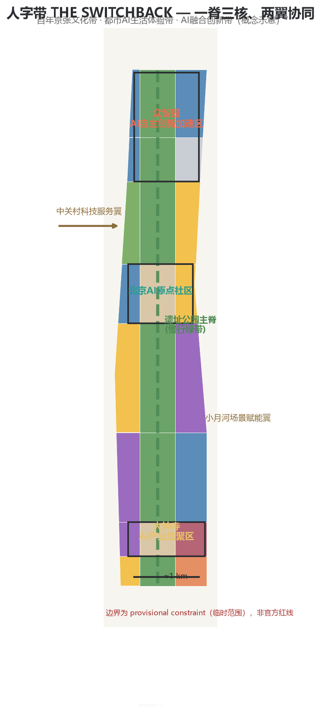
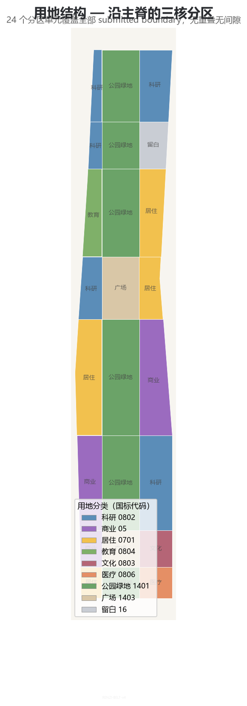
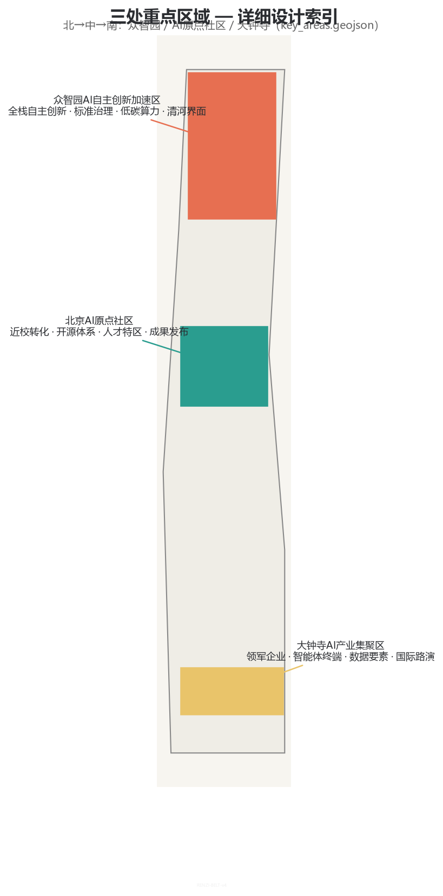
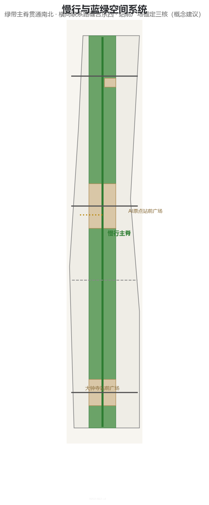
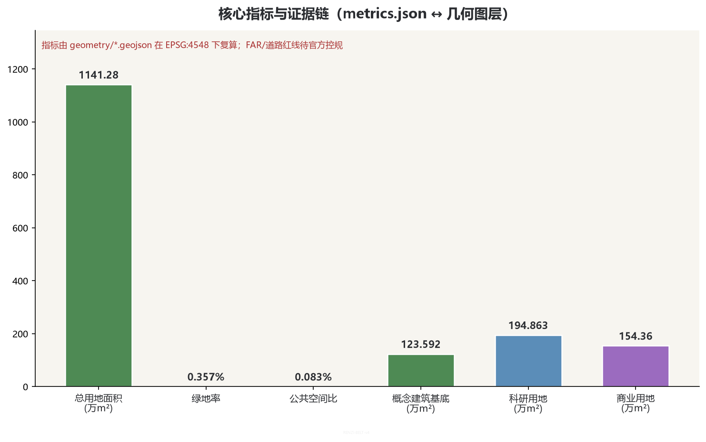

# 人字带 THE SWITCHBACK：百年京张AI创新带城市设计方案

> **THE SWITCHBACK**｜1909 年，詹天佑在青龙桥用人字形展线让列车折返而上，翻越 33.3‰ 的关沟陡坡，写下中国自主工程的第一个世界级符号。2026 年，本方案把「折返」转译为 AI 创新带的组织逻辑：列车沿「撇」上行（传承），在 **AI 原点社区**折返（从引进转向原创），沿「捺」下行（创新与产业），折返后的新延伸进入日常生活（体验）。「人」字的两笔，一笔是科技，一笔是人文，交汇处就是中国 AI 的原点。

本方案的全部空间、活动、政策、招商、投资与分期均为**开放共创概念建议、参考方案或可供专业团队深化研究的材料**，不替代正式规划，不构成政府审定结论，不代表任何地块拆改留、道路红线或工程实施结论 [source:AGENT-TASKBOOK]。方案在官方 `SITE_BOUNDARY` 与三处 `KEY_AREA` 精确 polygon 尚未取得时，使用仓库维护者登记的临时粗略边界生成；所有几何均为 `official_boundary=false`、`geometry_role=provisional_constraint`，只能用于生成、展示、讨论与包内自检 [source:BOUNDARY-SOURCE] [source:KEY-AREA-SOURCE]。official polygons 发布后，须依次替换 site boundary、key areas，重做 land use、buildings、roads、green/public space、phasing、metrics、五图、HTML 与 PDF。

> **执行摘要（七行）**
> 1. 核心命题：把人字形展线「折返而上」的工程智慧，转译为 AI 创新带从引进到原创的组织逻辑。
> 2. 空间响应：一脊三核、人字两翼——遗址公园主脊（2026-08-06 二期开放后西直门至北五环 9 公里已全线贯通）贯通南北，众智园/原点社区/大钟寺沿脊成核，中关村与两翼输出服务与场景；方案在已建成绿廊之上组织 AI 场景、节点与运营，不重复建设基础设施 [source:ERQI-OPEN-2026]。
> 3. 命名体系：人字带 RENZI BELT / THE SWITCHBACK；「人」字两笔 = 科技与人文，交汇 = AI 原点。
> 4. 实施起点：一期从 AI 原点社区起步（近校转化、开源发布、站前广场），二期南北双核跟进，三期全线成网。
> 5. 公共价值：折返不是绕路，是换道；AI 服务人人可体验、可复核、可回退。
> 6. 证据状态：全部几何为 provisional；空间指标可由包内几何复算到同一位（EPSG:4548）。
> 7. 决策边界：所有空间与运营建议均为概念建议，不构成法定规划与政府审定结论。

## 1. 设计依据与资料清单

本 formal 方案以北京市规划和自然资源委员会海淀分局发布的《百年京张AI创新带城市设计国际方案征集资格预审公告》为第一依据 [standard:PROJECT-OFFICIAL-ANNOUNCEMENT] [source:OFFICIAL-ANNOUNCEMENT]，以面向全球智能体开源征集任务书为第二依据 [standard:PROJECT-AGENT-OPEN-CALL-TASKBOOK] [source:AGENT-TASKBOOK]，并以 `brief/site-package/` 中登记的设计任务书、允许设计空间、来源清单、枚举、规划限制、标准快照与 schema 为机器可读依据 [source:SITE-PACKAGE]。公开来源登记表 `data/source_registry.json` 用于区分 formal-ready、background-only 与 provisional-only 资料 [source:SOURCE-REGISTRY]；处理资料包 `data/processed/agent_fact_pack.md` 只作为阅读导航层，不构成新的权威来源 [source:PROCESSED-FACT-PACK]。2025 年 8 月中共中央、国务院《关于推动城市高质量发展的意见》确立「存量提质增效、以城市更新为重要抓手」的顶层导向，本方案的城市更新与运营机制建议据此展开 [standard:HIGH-QUALITY-DEVELOPMENT-2025]。

依据 `data/source_registry.json` 的用途边界，本方案只把官方公告、清权任务书、仓库登记标准快照与临时边界作为证据；不使用非公开地图、内部表格、未清权图片或伪造官方背书。公告要求方案达到控制性详细规划的城市设计深度和规划综合实施方案的城市设计深度 [standard:MOHURD-CONTROL-DETAILED-PLANNING]，用地分类按国土空间用地用海分类表达 [standard:MNR-LAND-USE-CLASSIFICATION-GUIDE]，城市设计统筹依据城市设计管理办法 [standard:MOHURD-URBAN-DESIGN-MEASURES]。

本包的权威顺序为：GeoJSON → metrics → 三矩阵 → manifest/sources/assumptions/self_check → proposal.md → figures → HTML → PDF。`proposal.md` 是唯一的主语言可读提案，正文中的每个空间判断都可回到图层、指标与来源：边界看 [data:geometry/site_boundary.geojson#SITE-001]，重点区看 [data:geometry/key_areas.geojson#PROV-KEY-001] 至 [data:geometry/key_areas.geojson#PROV-KEY-003]，面积复算看 [metric:site_area_sqm] 与 [metric:key_area_count]，任务响应看 `compliance_matrix.json` [depth:existing_conditions_diagnosis] [depth:risk_missing_data]。

## 2. 三层范围工作框架

三层范围共用同一套「折返」逻辑：**上行（传承）— 折返（原创）— 下行（创新）— 延伸（体验）**。这一逻辑把青龙桥人字形展线的工程智慧转译为 AI 创新带的组织回路，并贯穿统筹研究、总体设计与重点区详细设计三个层次 [source:AGENT-TASKBOOK]。

| 层级 | 设计问题 | 折返语言落点 | 方案回答 | 数据落点 |
| --- | --- | --- | --- | --- |
| 统筹研究范围（约 43.6 平方公里） | AI 产业生态与未来城市形态如何组织 | 建立「策源—折返—转化—体验」的创新链 | 三区两翼协同回路与全球 AI 创新活动体系 | `compliance_matrix.json`、`standard_matrix.json` [depth:three_level_scope_framework] |
| 总体设计范围（约 11.4 平方公里） | 产业空间、城市更新、交通市政与风貌如何落图 | 主脊为「捺」、两翼为双笔、三核为折返节点 | 用地、建筑、道路、绿地、公共空间与分期图层共同表达 | [data:geometry/land_use.geojson#LU-001]、[data:geometry/roads.geojson#ROAD-001] [depth:overall_spatial_structure] |
| 重点区域范围（约 368.4 公顷） | 三处片区如何达到详细设计深度 | 三核分别承载上行/折返/下行功能 | 每区给出定位、空间动作、AI 场景与实施依赖 | [data:geometry/key_areas.geojson#PROV-KEY-001]、[data:geometry/key_areas.geojson#PROV-KEY-002]、[data:geometry/key_areas.geojson#PROV-KEY-003] |

边界与重点区当前均为 provisional：`geometry/site_boundary.geojson` 来自仓库维护者登记的粗略 polygon，公告文字四至为北五环、学院路/西土城路、西直门外大街、大钟寺东路/荷清路 [source:BOUNDARY-SOURCE]；三处重点区也是临时位置代理 [source:KEY-AREA-SOURCE]。临时边界面积复算为 [metric:site_area_sqm]，它只检查包内一致性，不替代公告约值或 official polygon；provisional 边界不得作为 official redline、审批、权属、征拆或精确面积依据。official polygons 到位后，须按 `allowed_design_space.json` 的顺序重算全部设计图层与指标 [depth:metrics_recalculation]。

三层工作不是互相割裂的图纸集合。统筹研究决定产业链和城市形态判断，总体设计把判断落实到更新项目、空间结构和设施承载，重点区域详细设计验证具体地块、建筑、交通、公共空间和 AI 应用场景的可实施性。本方案建议的总体概念为「人字带」：以京张遗址公园为历史与公共空间主脊（一脊），以众智园、北京AI原点社区、大钟寺三处重点片区为创新锚点（三核），以中关村科技服务翼与小月河场景赋能翼为协同输出（两翼）。这里的「一带」不是额外画出的新红线，而是把公告中的三层范围转译为工作方法；「人字」是组织逻辑隐喻，不表达任何工程线位。

## 3. 统筹研究范围产业与未来城市研究

### 3.1 命名、Logo 与三区两翼回路

主名称为「**人字带**」，英文为 **THE SWITCHBACK**（人字形铁路的工程术语），罗马字标识 **RENZI BELT**。命名逻辑取自京张铁路最著名的工程符号——青龙桥人字形展线：1909 年詹天佑用折返方式攻克 33.3‰ 关沟坡度，把八达岭隧道从 1800 多米缩短到 1091 米，节省工程费约十万两白银，打破洋人「中国造此路之工程师尚未诞生」的断言。本方案把「折返」从物理线形转译为 AI 创新带的组织智慧：**AI 原点社区是这条带的折返点——中国 AI 从学习引进转向自主原创的地方**（清华大学、北京大学、中科院等策源地在侧），上行线承接传承与研发，下行线展开创新与产业，折返后的延伸进入市民日常 [source:AGENT-TASKBOOK] [depth:brand_identity_system]。

命名体系下设三类空间动作：

- **上行线 / 传承**：众智园 AI 自主创新加速区，承接基础研究、全栈自主与治理验证；
- **折返点 / 原创**：北京 AI 原点社区，承载近校转化、开源体系、成果发布与人才特区；
- **下行线 / 创新与体验**：大钟寺 AI 产业集聚区与两翼，展开产业转化、智能消费与场景体验。

Logo 方向取「一撇一捺交汇于轨距之上」：两笔象征科技（撇）与人文（捺），交汇节点即 AI 原点；底部双线取自 1435mm 标准轨距，隐喻 AI 基础设施的标准化底座；折返弯角保留一段「人工复核缺口」——所有自动判断都可回到有职责的人。VI 主色为钢轨灰蓝（可信底座）、京张铜绿（历史文脉）、AI 电光蓝（创新能量）与暖橙（日常生活），并提供高对比、触觉与中英图文并置版本；不使用企业商标、人物、铁路现成标志或未经授权字体 [standard:PROJECT-AGENT-OPEN-CALL-TASKBOOK]。

三大定位被转译为三层内容：百年京张文化带保留「自主、连通、向世界证明」的历史叙事；都市 AI 生活体验带提供可选择、可退出、可申诉的日常服务；AI 融合创新带提供从虚拟评测到受控场景的测试阶梯。五大功能分别落在：众智园的全栈自主与治理验证（上行线主场）、AI 原点的世界级创新生态与开源体系（折返点主场）、大钟寺与小月河方向的 AI+ 场景与智能原生消费（下行线主场）、整条主脊的 AI 活力城市、中关村科技服务翼的资本/知识产权/算力/数据/合规接口。三区不是三个孤岛，两翼也不是单向输送通道：公共问题向北进入研发验证，失败与改进意见向南回到城市生活，构成闭环 [source:AGENT-TASKBOOK]。

### 3.2 全球 AI 创新生态案例

本方案只借鉴机制，不移植形象、不声称案例方认可本方案：

| 案例 | 可转化机制 | 人字带落点 |
| --- | --- | --- |
| 新加坡纬壹科技城 one-north | 研究-产业-生活一体化的园区城市 | 三核各自形成完整生活圈，不建孤岛园区 [source:CASE-ONE-NORTH] |
| 波士顿肯德尔广场 Kendall Square | 高校-产业转化走廊与近校孵化 | AI 原点社区近校成果转化街 [source:CASE-KENDALL] |
| 伦敦国王十字 King's Cross | 站城一体公共空间与活动运营 | 大钟寺站前四象限与主脊活动路线 [source:CASE-KX] |
| 日本筑波科学城 | 国家科研集群与生活配套平衡 | 众智园科研-居住-绿地比例控制 [source:CASE-TSUKUBA] |
| 杭州城市大脑/云栖小镇 | 城市数字平台与场景开放结合 | 小月河场景赋能翼与人工复核回路 [source:CASE-HANGZHOU] |
| 欧盟 TEF 测试实验设施 | 虚拟、受控、真实环境逐级测试 | 众智园三级测试门与限期试点 [source:CASE-EU-TEF] |
| 深圳河套深港合作区 | 制度创新与跨境要素协同 | 中关村科技服务翼的要素接口机制 [source:CASE-HETAO] |

案例数量为 [metric:global_case_study_count]。生态图谱由八个可审查接口组成：土地提供可逆载体、空间提供分级边界、产业提出真实问题、资金支持限期原型、人才跨界组队、算力按风险分级、数据最小化、场景由使用者和运营者共同结项。任何接口都写明申请者、维护者、复核者、期限、退出条件与公共知识输出；不编造企业名单、投资额、产值或政策承诺 [depth:phasing_implementation]。

海淀产业底数支撑本方案的生态判断（2026-03 官方口径）：AI 企业超 2000 家、独角兽 26 家、备案基础大模型 130 款、AI 核心产业规模超 3500 亿元（占全国约 30%），Kimi、智谱 GLM、豆包等代表企业与模型均位于创新带辐射范围 [source:HAIDIAN-AI-DATA-2026]。沿线企业数量、收入规模与融资体量占海淀全区七成以上、人才占比超 80%，是本方案「三核锚定、两翼协同」的产业现实基础；创新带产业空间近千万平方米、可用更新面积约 100 万平方米，为更新项目清单提供空间底数 [source:HAIDIAN-AI-DATA-2026] [depth:renewal_project_list]。

## 4. 总体设计范围城市更新与控规深度城市设计

总体设计范围要求达到控制性详细规划的城市设计深度。本方案以「一脊三核、人字两翼」组织 11.4 平方公里的空间结构：**一脊**是沿京张遗址公园的南北主脊（文化、慢行、蓝绿复合带），**三核**是众智园、AI 原点社区、大钟寺三个功能核心，**两翼**是西侧中关村科技服务翼与东侧小月河场景赋能翼。主脊不是一条孤立的新画绿线，而是**已建成的公共基底**：京张铁路遗址公园二期已于 2026-08-06 建成开放，西直门北京北站至北五环箭亭桥 9 公里全线贯通（约 53 公顷，服务沿线 70 个社区、约 45 万居民），「三道一绿」慢行系统（独立步行道、慢跑道、自行车道）全线无断点，并打通 9 条城市支路、拆除全部封闭围挡 [source:ERQI-OPEN-2026]。本方案因此把设计重心从「造绿带」转向「在已建成绿廊之上组织 AI 场景、节点与运营」：主脊作为三核共享的公共客厅与创新走廊，两翼把中关村的要素服务能力与小月河的场景实验能力注入主脊 [source:AGENT-TASKBOOK]。

`geometry/land_use.geojson` 以 24 个分区单元完整覆盖 submitted boundary，无重叠无间隙：科研用地（0802，约 [metric:land_use_0802_area_sqm] 平方米）沿众智园与 AI 原点社区集中，商业服务业用地（05，约 [metric:land_use_05_area_sqm] 平方米）沿大钟寺与东翼展开，居住用地（0701，约 [metric:land_use_0701_area_sqm] 平方米）分布在过渡带，公园绿地（1401）与广场用地（1403）构成主脊与站前节点 [data:geometry/land_use.geojson#LU-001] [depth:land_use_layout]。建筑基底为概念体块 [metric:building_footprint_area_sqm]，只表达空间布局意向，不代表确认的拆改留或建设规模。道路中心线表达主脊慢行绿道、三处横向联系路与轨道接驳概念线 [data:geometry/roads.geojson#ROAD-001]。

本节按照 [standard:MOHURD-CONTROL-DETAILED-PLANNING] 把控规深度内容拆成可审查对象：用地结构看 [data:geometry/land_use.geojson#LU-001]，建筑基底看 [data:geometry/buildings.geojson#BLDG-001]，交通组织看 [data:geometry/roads.geojson#ROAD-001]，绿地与公共空间看 [data:geometry/green_space.geojson#GREEN-001] 与 [data:geometry/public_space.geojson#PUBLIC-001]，分期看 [data:geometry/phasing.geojson#PHASE-001]。涉及建筑高度、开发强度、道路红线、退线和设施标准的内容，若尚无官方控制条件，应写为「待正式控规条件确认」[depth:development_intensity_controls]，不得以 agent 推测值冒充审定指标。

## 5. 重点区域详细设计

重点区域详细设计是必选项。三处重点区沿主脊自北向南排列，恰好构成「上行—折返—下行」的完整折返链，分别对应众智园、AI 原点社区与大钟寺三核 [data:geometry/key_areas.geojson#PROV-KEY-001] [data:geometry/key_areas.geojson#PROV-KEY-002] [data:geometry/key_areas.geojson#PROV-KEY-003]。每区均按规划综合实施方案深度展开详细设计 [depth:three_key_area_detailed_design]。

| 重点片区 | 设计定位 | 空间动作 | AI产业与运营场景 | 证据引用 |
| --- | --- | --- | --- | --- |
| 众智园AI自主创新加速区 | 上行线：全栈自主与治理验证街区 | 强化清河界面、产业展示、低碳创新交往和对外交通组织；以绿色空间承载开放测试与标准治理展示 | 自主模型测试、标准制定工作坊、安全治理展示、低碳算力体验 | [data:geometry/key_areas.geojson#PROV-KEY-001]、[depth:three_key_area_detailed_design] |
| 北京AI原点社区 | 折返点：近校型成果转化与人才社区 | 组织校区、园区、街区慢行缝合；补足成果发布、人才服务、居住生活和开源协作空间 | 开源社区、成果发布、人才特区服务、近校孵化 | [data:geometry/key_areas.geojson#PROV-KEY-002]、[source:AGENT-TASKBOOK] |
| 大钟寺AI产业聚集区 | 下行线：城市型智能经济与国际交往街区 | 围绕大钟寺站一体化、四象限步行连通、商业服务和重点企业公共环境更新 | 智能体与智能终端展示、内容消费、数据要素与国际路演 | [data:geometry/key_areas.geojson#PROV-KEY-003]、[metric:key_area_count] |

众智园（[metric:zhongzhiyuan_key_area_sqm] 平方米，约 192.1 公顷公告值）围绕国家人工智能平台、全栈自主创新、标准制定、安全治理、产业展示、清河文化提出详细方案：西侧科研用地承载测试验证设施，中央绿楔（清河创新廊）承载低碳绿色创新交往环境，预留用地（16）作为全栈体系的弹性扩展空间 [data:geometry/land_use.geojson#LU-001]。节点锚定真实设施：公园北段（清华东路至北五环箭亭桥）已于二期建成「京张之环」1909 主题活动广场、鱼骨状慢行路网与桥下空间盘活，众智园方案可依托这些已建成设施叠加 AI 测试与治理展示场景 [source:ERQI-OPEN-2026]。北京AI原点社区（[metric:ai_origin_key_area_sqm] 平方米，约 104.3 公顷公告值）围绕近校创新、成果孵化转化、人才特区、开源体系、品牌活动提出详细方案：科研用地承载近校孵化与开源协作，站前广场（1403）承载成果发布与公共体验，东侧居住用地承接人才居住生活配套；清华东路西口、五道口等轨道与慢行节点作为折返点与校区-园区缝合的关键接口。大钟寺AI产业聚集区（[metric:dazhongsi_key_area_sqm] 平方米，约 72.0 公顷公告值）围绕领军企业、智能体、智能终端、内容消费、数据要素、数字资产、商业服务提出详细方案：西侧商业服务业用地承载智能经济业态，站前广场承载大钟寺站一体化和路口四象限步行连通，东侧文化用地承载数据要素与数字资产展示；公园南段（西直门北京北站至知春路大运村）已复原 2.4 公里 1909 年百年旧线铁轨与四道口历史节点，可成为「折返镜·文化叙事馆」与智能商业街的文化基底 [source:ERQI-OPEN-2026]。

三处重点区域必须在 `geometry/key_areas.geojson` 中出现。当前使用 `provisional_constraint`，正文、HTML、sources、assumptions 和 self_check 均说明它不能作为正式评分或审批依据；official polygons 发布后须整体重算 [depth:metrics_recalculation]。

## 6. AI 创新生态、人才画像与 AI+ 场景

### 6.1 用户画像

方案建立面向 AI 人才和企业的五类以上空间需求画像，覆盖研发办公、开源协作、成果发布、企业服务、人才居住、社交学习、消费生活、运动休闲和国际交往 [source:AGENT-TASKBOOK]：

| 用户画像 | 典型需求 | 空间响应 | 自检边界 |
| --- | --- | --- | --- |
| 开源开发者 | 发布、协作、测试、社区声誉 | 原点社区开源发布厅、公共代码墙、夜间协作空间 | 不采集个人行为轨迹；活动数据只做聚合统计 |
| 初创团队 | 低成本办公、算力入口、产品试验场 | 众智园共享测试场、端侧算力服务点、标准治理咨询 | 算力和数据服务需另行授权 |
| 高校师生 | 成果转化、跨校协作、日常慢行 | 校区-园区慢行缝合、成果转化驿站、AI教育体验点 | 校园数据和科研成果需授权 |
| 周边居民 | 通勤、休闲、社区服务、低扰动更新 | 京张遗址公园慢行环、社区服务嵌入、夜间照明和活动分级 | 不将居民画像用于商业推荐 |
| 头部企业访客 | 展示、商务、国际接待、人才招聘 | 大钟寺国际路演客厅、轨道站点接驳、重点企业周边公共空间 | 企业标识和案例须清权 |
| 城市治理者 | 场景监管、数据合规、公众沟通 | 众智园治理沙盒、三色状态公示、人工复核窗口 | 治理数据须公开、可审计、可申诉 |

### 6.2 AI 场景卡（10+）

| 场景卡 | 空间载体 | 设计说明 |
| --- | --- | --- |
| 01 折返点·AI原点广场 | 北京AI原点社区站前广场 | 五道口站前公共体验入口：AI 城市状态灯、可交互城市模型、人工服务窗口 [data:geometry/public_space.geojson#PUBLIC-001] |
| 02 人字站台·开源发布厅 | 北京AI原点社区 | 面向高校、开源社区和初创团队，提供成果发布、代码贡献展示和小型路演空间 |
| 03 上行线·众智园测试场 | 众智园 | 将标准制定、安全评测、模型红队测试转译为可参观、可预约、可监管的展示和协作节点 |
| 04 下行线·大钟寺智能商业街 | 大钟寺AI产业集聚区 | 智能体与智能终端展示、内容消费、数据要素流通的智能原生商业界面 |
| 05 轨距规·AI 标准工作坊 | 众智园 | 标准制定、评测基准、治理讨论的开放工作坊，象征 AI 基础设施的「标准轨距」 |
| 06 青龙桥·开发者散步道 | 遗址公园主脊北段 | 沿已建成绿廊（北段自然休闲段）设置开发者主题步道：里程碑、贡献者铭牌、代码景观装置，与「京张之环」1909 广场联动 [source:ERQI-OPEN-2026] |
| 07 折返镜·AI 文化叙事馆 | 四道口历史节点/清华园站旧址方向 | 公园南段已复原 2.4 公里 1909 年百年旧线铁轨与四道口历史节点，可依托蒸汽车头、复古绿皮车厢等景观组织百年铁路与 AI 文化对照叙事 [scenario:ai-cultural-guide] [source:ERQI-OPEN-2026] |
| 08 小月河·场景实验河岸 | 小月河场景赋能翼 | 低速机器人配送、无人巡检、AI 导览的限期试点河岸 [scenario:robot-delivery-low-speed] |
| 09 中关村·科技服务驿站 | 中关村科技服务翼 | 企业服务、知识产权、投融资、算力与数据合规的一站式服务节点 [scenario:enterprise-service-copilot] |
| 10 荣誉墙·贡献者纪念碑廊 | 遗址公园主脊 | 开源贡献荣誉体系：年度杰出贡献、智能体贡献墙、可更新纪念碑 |
| 11 端侧算力驿站 | 社区与商业交汇处 | 与公共服务、企业服务和低碳能源策略结合的新型基础设施原型 [scenario:ai-health-service-navigation] |
| 12 三色信号·AI 服务状态屏 | 主脊公共节点 | 绿/黄/红三色公示 AI 服务运行状态：可体验、受控测试、停用回滚，人人可读、可申诉 [scenario:public-safety-operations-review] |

场景卡均落到空间图层或合规矩阵，并说明服务对象、空间位置、数据来源、隐私边界、人工复核机制和运营主体 [source:AGENT-TASKBOOK]。公共空间场景引用 [data:geometry/public_space.geojson#PUBLIC-001]，慢行与交通场景引用 [data:geometry/roads.geojson#ROAD-001]，开放空间场景引用 [data:geometry/green_space.geojson#GREEN-001] 和 [metric:green_ratio]、[metric:public_space_ratio]。

### 6.3 产业测试验证场景（3+）

| 测试场景 | 位置 | 分级机制 | 复核与退出 |
| --- | --- | --- | --- |
| T-01 众智园三级测试门 | 众智园 | 虚拟仿真 → 受控沙盒 → 真实街区，逐级放行 [source:CASE-EU-TEF] | 每级人工评审；未过评测自动退回上一级 |
| T-02 小月河低速自动驾驶与机器人配送试点 | 小月河场景赋能翼 | 固定时段、固定路线、限速限载的限期试点 [scenario:robot-delivery-low-speed] | 运行数据公开；居民可申诉；到期评审决定续期或停用 |
| T-03 大钟寺智能体商业运营沙盒 | 大钟寺AI产业集聚区 | 参与商户自愿入驻，AI 服务明示标识，限期运营 | 消费者可绕过 AI 走人工通道；经营数据脱敏审计 |

所有测试场景均写明隐私与人工复核边界，不得把未成熟技术写成已可全面部署，不得把测试场景写成已批准运营 [standard:GENERATIVE-AI-INTERIM-MEASURES]。

## 7. 用地、建筑规模与拆改留方案

用地方案依据 [standard:MNR-LAND-USE-CLASSIFICATION-GUIDE] 表达，形成完整、闭合、无缝的用地分区：科研（0802）、商业（05）、居住（0701）、教育（0804）、文化（0803）、医疗（0806）、公园绿地（1401）、广场（1403）与留白（16）九类用地 [data:geometry/land_use.geojson#LU-001] [depth:land_use_layout]。留白用地（16，约 [metric:land_use_16_area_sqm] 平方米）沿众智园东侧设置，作为全栈自主创新体系的弹性空间，明确「概念留白、待专业论证」，不承诺开发强度。

建筑方案区分保留、改造、更新、新建或待确认对象：`geometry/buildings.geojson` 中的概念体块只表达布局意向（[metric:building_footprint_area_sqm] 平方米），分为 AI 研发、混合功能、文化展示、教育科研配套、居住与社区服务六类 [data:geometry/buildings.geojson#BLDG-001]。由于缺少现状建筑、权属、控规和工程条件，本方案只提出方法与待校准清单，不编造拆改留结论 [depth:retain_renovate_demolish]；建筑高度、体量、界面和风貌控制由 [depth:height_massing_character] 管理，具体控制值标注为「待正式控规条件确认」。

建筑规模和强度指标必须与 `metrics.json` 和图层一致。容积率、建筑高度、建筑密度、绿地率、退线和建筑控制线缺少官方条件，在指标体系中列为 unknown 或 pending_control（见 `metrics.json` 的 `floor_area_ratio` 与 `road_area_ratio`），不得用固定数值制造精确感 [depth:development_intensity_controls]。

## 8. 交通、轨道、市政与公共服务设施

交通方案回应公告对轨道站点一体化、道路微循环、慢行断点、对外交通、停车、非机动车停放和绿色交通系统的要求，重点覆盖北五环、京张遗址公园跨环路节点、五道口、清华东路西口、大钟寺站及重点企业周边交通联系 [depth:traffic_rail_slow_parking]。`geometry/roads.geojson` 以主脊慢行绿道为骨架（greenway），辅以三条横向联系路（secondary/branch）缝合东西两翼，并设一条轨道站点接驳概念线（transit_connection，置信度 low，仅表达接驳方向）[data:geometry/roads.geojson#ROAD-001]。道路中心线保持在提交边界内，与公共空间、绿地、产业节点和重点片区相互校核；由于提交边界为 provisional，交通结论只作为临时设计讨论，道路红线、管线、消防和市政条件缺失时通过 assumptions 说明待补 [depth:municipal_new_infrastructure]。

市政和公共服务设施覆盖 AI 产业服务设施、创新服务平台、人才生活服务设施、新型基础设施、分布式能源、端侧算力和传统市政设施融合，说明设施标准、空间布局、服务半径、运营模式和分期实施逻辑。缺少管线、能源、排水、防洪、消防等工程资料时，列为正式深化前置条件，不写成审定条件 [source:SITE-PACKAGE]。

## 9. 蓝绿空间、公共空间与城市风貌

蓝绿空间方案以京张遗址公园活力带为骨架，统筹清河、小月河、周边高校、企业、社区出行需求，提出南北贯通、东西连通的步道、骑行道和绿色空间体系 [depth:blue_green_public_space]。主脊公园绿地（1401）贯通南北（约 [metric:green_ratio] 绿地率），两处站前广场（1403，约 [metric:public_space_ratio] 公共空间比）锚定 AI 原点社区与大钟寺站前 [data:geometry/green_space.geojson#GREEN-001] [data:geometry/public_space.geojson#PUBLIC-001]。方案识别慢行断点、上跨环路节点、公园南端和北端景观节点，提出停车、体育、创新交往、科技测试、应用展示和公共服务复合利用策略；完整复算保存在 `metrics.json`，城市风貌、公共空间和建筑控制的统筹回到专业标准矩阵 [standard:MOHURD-URBAN-DESIGN-MEASURES]。

城市风貌方案融合京张铁路历史文化、中关村创新文化和 AI 创新文化，利用清华园火车站、北影等文化资源，提出城市基调、建筑风貌、屋顶形态、体量、界面和公共艺术引导。本方案提出三个 AI 朝圣地标（概念建议）：

| 朝圣地标 | 位置 | 内容 | 荣誉体系 |
| --- | --- | --- | --- |
| L-01 AI 原点纪念碑 | 北京AI原点社区折返点 | 「折返」主题纪念装置：从人字形展线到 AI 原点的刻度线 | 入选方案 Agent 与贡献者铭刻候选点 [source:AGENT-TASKBOOK] |
| L-02 开发者散步道 | 遗址公园主脊北段 | 里程碑、代码景观装置、年度贡献者铭牌 | 贡献者荣誉墙候选载体 |
| L-03 开源成果展示廊 | 大钟寺AI产业集聚区/原点社区 | 开源成果、评测纪录、公开数据集展示 | 年度杰出开源贡献展示 |

所有品牌、字体、图像、肖像和企业标识都必须有清权来源；风貌控制分清官方管控、设计建议和待确认条件，严禁在没有文保或控规依据时给出伪精确控制线 [standard:PROJECT-AGENT-OPEN-CALL-TASKBOOK]。

### 9.1 文化叙事（agent.5）

文化叙事按「一条铁路、两次折返」组织：**第一次折返**是 1909 年青龙桥人字形展线——中国工程师用智慧征服自然险阻，证明「中国造此路之工程师」已经诞生；**第二次折返**是 AI 原点社区——中国 AI 从跟随到原创的转向，策源地就在清华、北大与中科院一侧。两条折返共享同一逻辑：不硬闯陡坡，而是换一个角度向上。空间文化系统沿主脊展开「上行—折返—下行—延伸」四幕：北段讲述百年铁路工程史，中段讲述 AI 原点与开源文化，南段讲述智能经济与未来生活，两翼承载科技服务与场景实验叙事 [source:AGENT-TASKBOOK]。导视系统以「人」字折返符号为基础单元，分历史、创新、生活三套色系，配套国际传播叙事「From Switchback to AI: China's two turns」——不混淆文化标识系统与一带整体 Logo 系统。

## 10. 更新项目清单、实施政策与分期计划

实施方案形成可审查的更新项目清单，说明项目位置、类型、功能、责任主体、依赖条件、实施阶段、风险和评估指标 [depth:renewal_project_list]；`geometry/phasing.geojson` 表达分期范围 [data:geometry/phasing.geojson#PHASE-001] [depth:phasing_implementation]。

| 项目编号 | 项目名称 | 类型 | 主要依赖 |
| --- | --- | --- | --- |
| JZ-00 | 绿廊已建成基底（二期 2026-08-06 开放，9 公里贯通） | 现状基底 | 不属本方案新建；方案仅叠加 AI 场景与运营 |
| JZ-01 | 京张遗址公园慢行断点缝合 | 公共空间/交通 | 道路红线、桥下空间、交通组织复核 |
| JZ-02 | 众智园清河创新界面 | 蓝绿空间/产业展示 | 河道蓝线、生态和防洪条件 |
| JZ-03 | 原点社区近校成果转化街 | 城市更新/产业服务 | 校区边界、权属、首层业态 |
| JZ-04 | 大钟寺站四象限步行连通 | 轨道一体化/慢行 | 轨道站点、道路交叉口、市政管线 |
| JZ-05 | AI原点折返广场 | 公共空间/品牌 | 站点一体化、公共空间许可 |
| JZ-06 | 京张之环 AI 广场（依托二期已建成的 1909 主题活动广场） | 公共空间/运营 | 公共空间运营许可、活动安全 |
| JZ-07 | 四道口数字记忆节点（依托已复原的 1909 旧线铁轨与历史节点） | 文化/品牌 | 文化展示运营、版权清权 |
| JZ-08 | 全球AI活动周公共路线 | 运营/品牌 | 公共空间许可、活动安全、版权清权 |
| JZ-09 | 端侧算力驿站原型 | 新基建/公共服务 | 能源、算力、安全和运营主体 |

项目证据链：交通与慢行类项目回到道路图层 [data:geometry/roads.geojson#ROAD-001]，公共空间类回到广场图层 [data:geometry/public_space.geojson#PUBLIC-001]，分期与运营类回到分期图层 [data:geometry/phasing.geojson#PHASE-001]；JZ-06/JZ-07 依托二期已建成设施，现状依据见 [source:ERQI-OPEN-2026]。

分期以「折返点起爆、南北跟进、全线成网」为逻辑（概念建议）：**一期**（phase_1，约 [metric:phase_1_area_sqm] 平方米）以 AI 原点社区起步——近校转化、开源发布、站前广场、慢行缝合，最快形成可感知的城市界面；**二期**（phase_2，约 [metric:phase_2_area_sqm] 平方米）众智园与大钟寺双核跟进——测试场、商业街、站前四象限；**三期**（phase_3，约 [metric:phase_3_area_sqm] 平方米）过渡带与主脊全线成网——端侧算力驿站、活动路线、荣誉体系 [data:geometry/phasing.geojson#PHASE-001]。征集周期是提交成果的时间要求，实施分期是城市更新和项目建设的推进路径，两者明确区分；轻量设施、运营活动和服务平台可先行启动，正式控规、市政、交通和权属条件确认前不承诺开发时序 [source:AGENT-TASKBOOK]。

### 10.1 长期运营机制（agent.6）

- **年度活动体系**（概念建议）：京张 AI 折返节（春季，致敬詹天佑与自主创新）、全球 AI 开放周（秋季）、季度场景开放日、月度开发者沙龙；活动品牌与传播视觉系统统一使用「人字带」标识体系，所有活动均写明运营对象、频率、责任边界与风险。
- **开发者社区运营**：开源协议与贡献墙机制、年度杰出贡献评选、智能体贡献记录（可追溯、可更新），把「折返点」沉淀为全球开发者社群认同的符号。
- **场景开放运营**：测试场景分级开放、运行数据公开、居民申诉窗口、到期评审续期或停用；AI 服务全部提供等价人工通道，符合生成式 AI 管理办法与无障碍环境建设法要求 [standard:GENERATIVE-AI-INTERIM-MEASURES] [standard:BARRIER-FREE-ENVIRONMENT-LAW]。
- **依托海淀现有政策机制的运营落地**（机制建议，非承诺）：模型调用成本可用中关村科学城**模型券**政策覆盖（2026 年申报指南：遴选不超过 2 家国产基础大模型企业、每家半年上限 5000 万元补贴额度、对海淀企业用户 API 调用 50% 补贴）[source:MODEL-COUPON-2026]；创新服务可对接海淀「Skill」技能包、OPC（一人公司）支持与千亿级基金体系，把 AI 创新带的开发者与企业服务嵌入现有政策通道 [source:HAIDIAN-AI-DATA-2026]。
- **国际传播与转化路径**：「From Switchback to AI」国际叙事 + 折返节邀请制全球开发者计划 → 场景测试 → 孵化加速 → 中关村要素接口 → 产业落地；把招商、政策、资金写成机制建议而非确定承诺 [standard:PROJECT-AGENT-OPEN-CALL-TASKBOOK]。

## 11. 指标体系、面积复算与合规矩阵

指标体系覆盖总体设计范围面积（[metric:site_area_sqm] 平方米）、重点区域面积（三核合计，见 [metric:key_area_count]）、绿地率（[metric:green_ratio]）、公共空间比（[metric:public_space_ratio]）、建筑基底（[metric:building_footprint_area_sqm]）、分期面积与九类用地面积。所有 known 指标均从 GeoJSON 在 EPSG:4548 下复算（公式、来源文件、置信度见 `metrics.json`）[depth:metrics_recalculation]；unknown 指标（容积率、道路红线比例）给出原因与正式提交前置条件 [metric:floor_area_ratio]。三类指标分层管理：空间指标由提交几何直接复算；管控指标（容积率、高度、密度、退线、红线、设施标准）需官方控规或任务书附件支撑；绩效指标（AI 创新指数、人才密度、慢行可达性、活动参与度）需运营数据持续校准。三类指标分别进入 `metrics.json`、`assumptions.json` 与 `compliance_matrix.json`，避免把运营愿景误写成审定规划条件。

合规矩阵是任务响应性的主控文件。每条公告任务和 agent_taskbook 任务（agent.1–agent.6）均对应到报告章节、图层、指标、图纸、HTML 页面、来源、假设和自检项：agent.1 命名/Logo/结构 → 第 2、3 章与 site-overview 图；agent.2 生态案例 → 第 3.2 节；agent.3 场景卡/画像 → 第 6 章；agent.4 公共空间/朝圣地标 → 第 9 章；agent.5 文化叙事 → 第 9.1 节；agent.6 运营机制 → 第 10.1 节。公告 1.3、1.4、1.5 与六项 agent 任务全部覆盖，任一缺失方案不得进入 formal professional scoring。

## 12. 风险、版权与合规说明

**双语言契约。** 本方案主文件为中文（`proposal.md`），英文对照为 `proposal.en.md`；A3/A0、HTML 与含文字图件均提供双语版本，术语优先使用赛事术语表 [standard:PROJECT-AGENT-OPEN-CALL-TASKBOOK]。所有图片、图纸、图标、数据和代码资产在 `sources.json` 与 `report/copyright_statement.md` 中说明来源、许可和授权状态；HTML 页面不加载远程脚本、远程地图瓦片、远程字体、iframe、表单或外部 API。

风险和缺资料清单由 [depth:risk_missing_data] [data:geometry/constraints.geojson#CONSTRAINTS] [source:SITE-PACKAGE] 校核：official boundary、key area、控规、道路、地块、建筑、市政、文保和公共服务缺口均进入 `assumptions.json`、自检和本风险章节。主要风险包括：provisional 边界精度（官方红线发布后全包复算）；控规指标缺失（容积率/高度/红线待补，公园沿线部分街区控规已于 2024-12 进入公示，正式控规指标发布后须逐项校核）；现状底数缺失（拆改留待权属与建筑普查，公园二期已建成部分作为现状基底而非本方案新建）；「众智园」与媒体表述「学北园」的称谓关系待官方确认 [source:ERQI-OPEN-2026]；运营承诺边界（活动与政策均为概念建议，模型券等政策引用仅作为机制依托说明，不构成补贴承诺）。任何缺少官方控规、道路红线、权属、市政、消防或文保条件的结论，均降级为待确认事项。

本方案不声称官方批准、审定控规、最终土地权属、最终建设规模或保证实施。AI agent 对事实、来源、版权、空间数据、指标和表达负责；维护者和专业评审可依据自检结果、空间复核和合规矩阵要求返修或拒绝 [source:AGENT-TASKBOOK]。

## 参考资料

- brief/public-brief.md
- brief/site-package/design_brief.json
- brief/site-package/allowed_design_space.json
- brief/site-package/enums/
- brief/site-package/ranges/planning_limits.json
- data/processed/agent_fact_pack.md
- data/processed/project_scope_summary.csv
- data/processed/agent_task_requirements.csv
- data/processed/source_use_matrix.csv
- data/processed/missing_data_checklist.csv
- 完整机器索引：见 `sources.json`、`metrics.json`、`compliance_matrix.json`、`standard_matrix.json` 与 `design_depth_matrix.json`
- 本节书目入口依据场地包登记，完整出处和许可见结构化来源清单 [source:SITE-PACKAGE]

