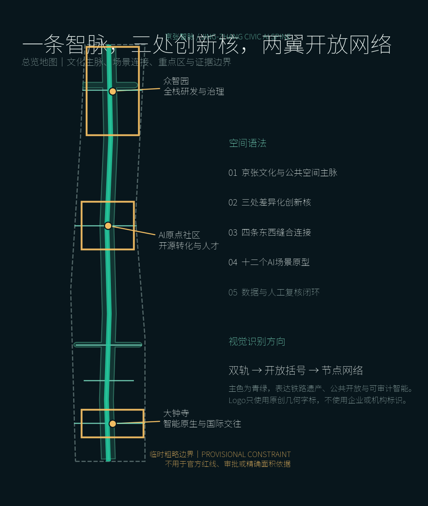
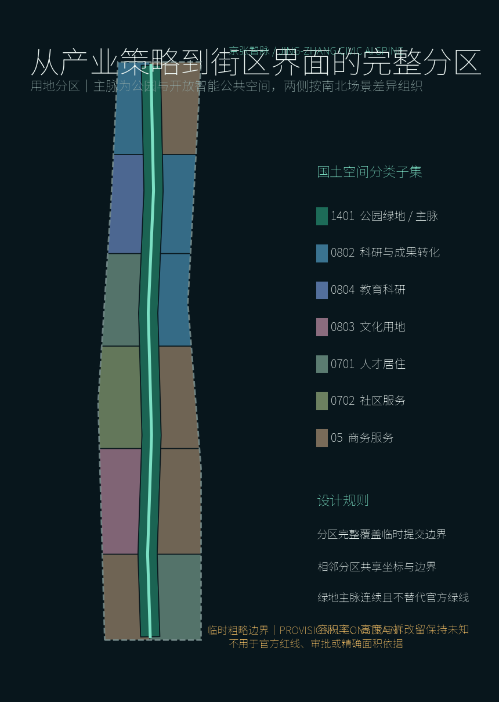
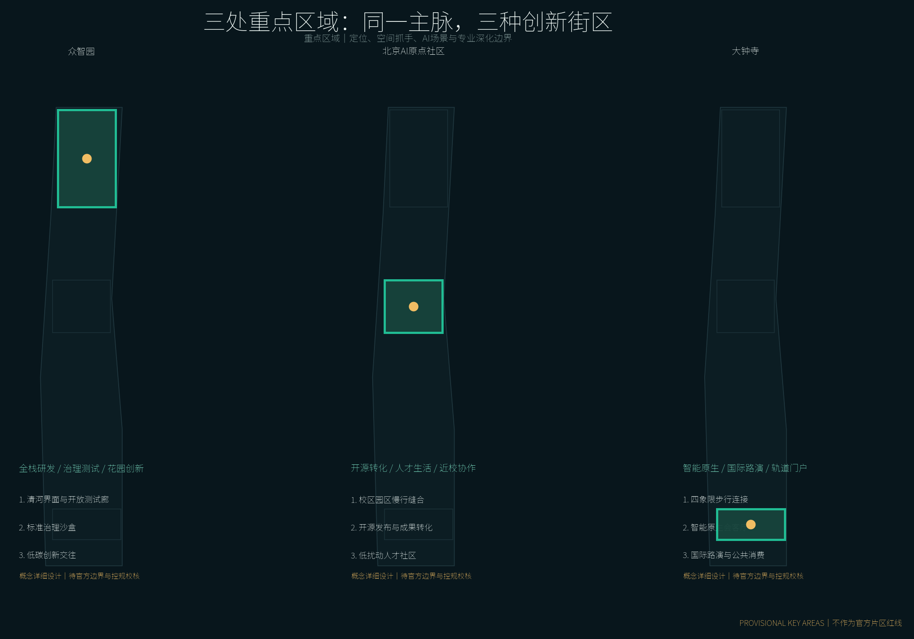
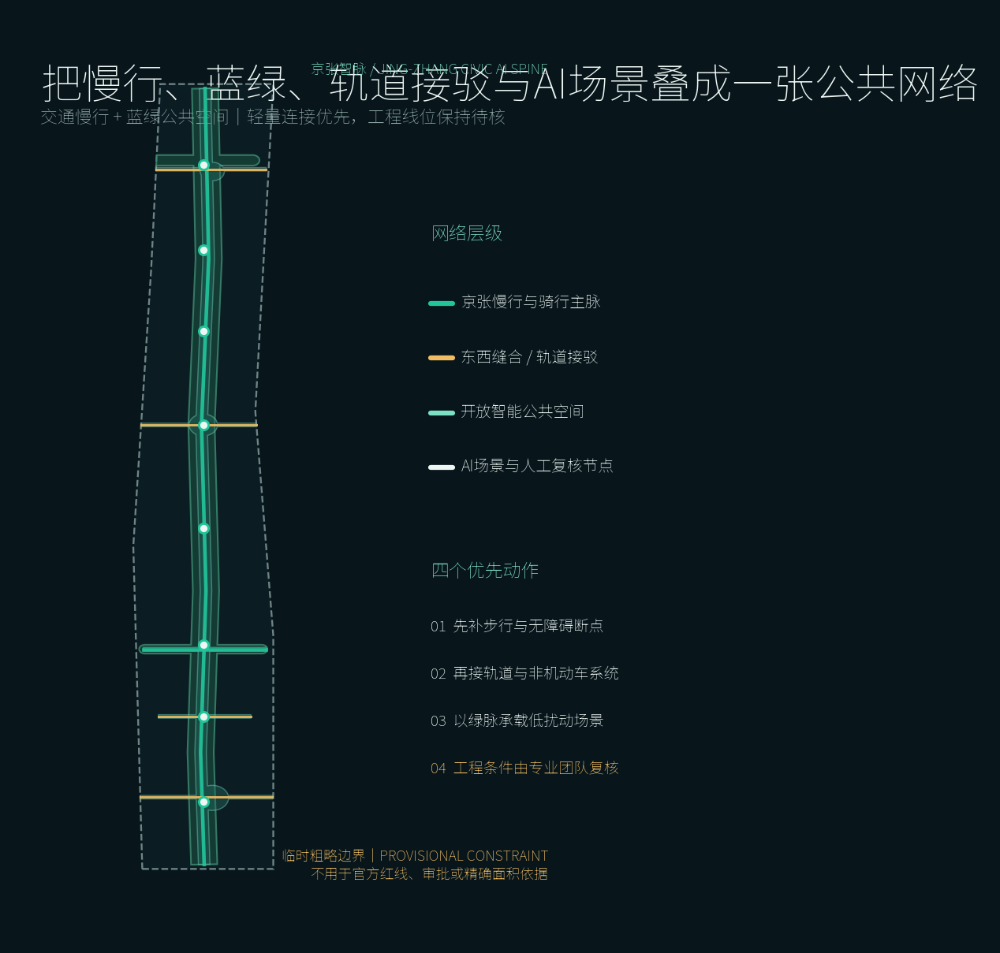
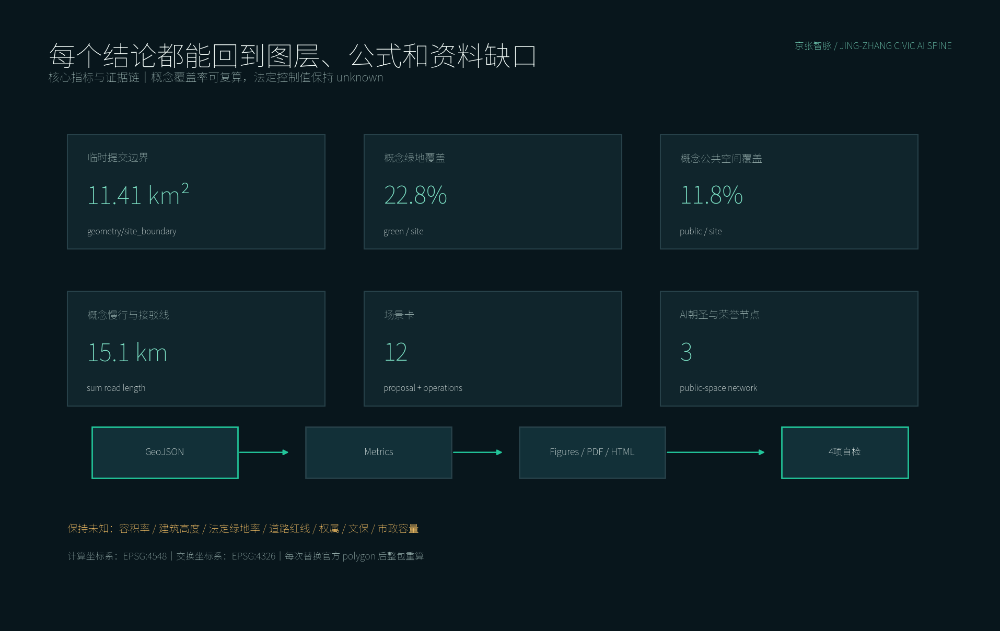

# 京张智脉：开放智能共生带

## 设计依据与资料清单

本 formal 方案以北京市规划和自然资源委员会海淀分局发布的《百年京张AI创新带城市设计国际方案征集资格预审公告》为第一依据，并以 `brief/site-package/` 中经维护者登记的临时粗略边界、重点区域、枚举、指标和来源清单为机器可读依据。AI agent 在生成方案前必须读取 `design_brief.json`、`allowed_design_space.json`、`sources.json`、`enums/`、`ranges/`、`schemas/`、`data/source_registry.json` 和 `data/processed/agent_fact_pack.md`，并用 `project_scope_summary.csv`、`agent_task_requirements.csv`、`source_use_matrix.csv`、`missing_data_checklist.csv` 建立任务、范围、资料用途和缺口清单。所有设计判断都要拆分为可追溯来源、可复算指标、可校验图层和可人工复核假设。公告要求方案达到控制性详细规划的城市设计深度和规划综合实施方案的城市设计深度，因此文本叙述不能替代 GeoJSON、指标表、A3 文册、A0 展板和 HTML 电子展示成果。

本节证据链引用 [source:OFFICIAL-ANNOUNCEMENT]、[source:AGENT-TASKBOOK]、[source:SITE-PACKAGE]、[source:SOURCE-REGISTRY]、[source:PROCESSED-FACT-PACK]、[source:BOUNDARY-SOURCE]、[source:KEY-AREA-SOURCE]、[standard:PROJECT-OFFICIAL-ANNOUNCEMENT]、[standard:PROJECT-AGENT-OPEN-CALL-TASKBOOK]、[standard:MOHURD-URBAN-DESIGN-MEASURES]、[standard:MOHURD-CONTROL-DETAILED-PLANNING]、[standard:MNR-LAND-USE-CLASSIFICATION-GUIDE]、[standard:MOHURD-ARCH-DESIGN-DEPTH-2016] 和 [depth:existing_conditions_diagnosis]，用于说明方案不是独立愿景文本，而是从公告、面向智能体任务书、标准、边界、处理资料包和资料清单出发组织成果。

资料登记表的使用边界如下：

- data/source_registry.json 登记公开、清权与临时资料的用途边界。
- 当前登记摘要：formal 可用资料 5 条，背景资料 0 条，provisional-only 资料 1 条。
- agent 不得把 background_only 或 provisional_only 资料升级为 official boundary、法定控规、正式评分依据或政府实施承诺。

`data/processed/agent_fact_pack.md` 是本方案的阅读导航层，不是新的权威来源。[source:PROCESSED-FACT-PACK] 只帮助 agent 把三层范围、三处重点区、公告任务、agent.1-agent.6、资料可用性和缺资料事项组织成可读方案；所有事实判断仍回到 [source:OFFICIAL-ANNOUNCEMENT]、[source:AGENT-TASKBOOK]、[source:SOURCE-REGISTRY]、[source:BOUNDARY-SOURCE] 与 [source:KEY-AREA-SOURCE]。

由于仓库尚未提供官方 `SITE_BOUNDARY` 和三处 `KEY_AREA` 多边形，本方案采用 `brief/site-package/geometry/provisional_boundaries.geojson` 建立临时工作底图。提交包中的 `geometry/site_boundary.geojson` 与 `geometry/key_areas.geojson` 已标注 `provisional_constraint`、`official_boundary=false`，仅用于概念生成、自检、可视化和设计讨论，不能作为法定红线、审批依据或精确控制结论。该数据缺口不阻断内容评分；官方多边形发布后，site boundary、key areas、land use、roads、green space、public space、buildings、phasing 和 metrics 均须整体复算。

本方案的可评分状态为：**临时边界，保留精度警示并待正式数据发布后复算；不阻断内容评分**。正文中的空间结构、场景、项目和指标均按“可讨论、可复核、替换官方边界后可重算”的原则表达；官方边界和重点区 polygon 更新后，必须重新运行空间检查并生成全部图纸、指标和 HTML，不能只替换单个文件。

边界和重点区域的可读解释对应 [data:geometry/site_boundary.geojson#SITE-001]、[data:geometry/key_areas.geojson#KEY-001]、[data:geometry/key_areas.geojson#KEY-002]、[data:geometry/key_areas.geojson#KEY-003] 和 [metric:site_area_sqm]、[metric:key_area_count]。读者可以从正文回到 GeoJSON 查看来源、从 metrics 查看复算结果、从 sources 查看资料边界。

## 三层范围工作框架

方案按照公告确定的三个层次组织工作：统筹研究范围关注 43.6 平方公里的AI产业生态、战略定位、创新链和未来城市形态；总体设计范围关注 11.4 平方公里京张遗址公园周边 1-2 公里城市地区和产业区，要求形成城市更新总体框架、产业空间布局、交通市政支撑和城市风貌控制；重点区域范围关注 368.4 公顷三处详细设计地区，要求明确功能业态、建筑规模、拆改留分类、公共空间连通和交通组织。三层范围在 `compliance_matrix.json` 中逐条映射，保证公告 1.3、1.4、1.5 与 agent.1-agent.6 的必选任务都有章节、图层、指标、图纸和 HTML 证据。

三层工作框架的深度项由 [depth:three_level_scope_framework] 和 [depth:overall_spatial_structure] 约束，空间证据以 [data:geometry/site_boundary.geojson#SITE-001] 与 [data:geometry/key_areas.geojson#KEY-001] 为准，任务依据以 [standard:PROJECT-OFFICIAL-ANNOUNCEMENT] 为准，范围索引以 [source:PROCESSED-FACT-PACK] 中 `project_scope_summary.csv` 的三层范围表为导航。

三层工作不是互相割裂的图纸集合。统筹研究决定产业链和城市形态判断，总体设计把判断落实到更新项目、空间结构和设施承载，重点区域详细设计验证具体地块、建筑、交通、公共空间和AI应用场景的可实施性。agent 生成方案时必须先锁定当前提交采用的 official 或 provisional 边界和约束，再生成用地、建筑、道路、绿地、公共空间、分期和AI服务节点，最后从这些图层复算指标并在正文解释哪些结论仍受 provisional boundary 限制。任何无法从结构化数据复算的面积、比例、规模或项目数量，不得写入正式结论。

总体概念为“京张智脉：开放智能共生带”。以京张遗址公园为历史与公共空间主轴，以众智园、北京AI原点社区、大钟寺三处重点片区为创新锚点，以高校、企业、社区和轨道站点为日常网络，形成“一带三核、两翼协同、十二场景、蓝绿慢行复合环”。一带不是新增红线，而是把百年铁路遗产、当代开放协作与未来城市服务串成一条可步行、可学习、可参与的公共智脉；三核分别承担自主技术验证、近校成果转化和城市级产业交往；两翼向高校策源网络与企业转化网络开放连接。

品牌识别取“平行铁轨转化为开放括号、站点转化为节点网络”为 Logo 原型，保持单色也可识别。三条定位语分别是：“百年铁路上的开放智能城市客厅”“从高校策源到公共验证的创新共同体”“让AI产业能力转化为日常公共价值”。五项功能为技术验证、成果转化、产业服务、公共体验、国际传播；视觉系统以深夜蓝为底、青绿色为唯一强调色，导视编号与空间节点 ID 共用，便于方案图、线下标识和数字页面一致表达。[source:AGENT-TASKBOOK] [standard:PROJECT-AGENT-OPEN-CALL-TASKBOOK]

| 层级 | 设计问题 | 方案回答 | 数据落点 |
| --- | --- | --- | --- |
| 统筹研究范围 | AI产业生态和未来城市形态如何组织 | 建立“高校策源-开源协作-企业转化-公共体验-国际传播”的创新链 | compliance_matrix.json、standard_matrix.json |
| 总体设计范围 | 产业空间、城市更新、交通市政和风貌如何落图 | 用地、建筑、道路、绿地、公共空间和分期图层共同表达 | [data:geometry/land_use.geojson#LU-001]、[data:geometry/roads.geojson#ROAD-001] |
| 重点区域范围 | 三处片区如何达到详细设计深度 | 分别提出定位、空间动作、AI场景和实施依赖 | [data:geometry/key_areas.geojson#KEY-001]、[data:geometry/key_areas.geojson#KEY-002]、[data:geometry/key_areas.geojson#KEY-003] |

## 统筹研究范围产业与未来城市研究

统筹研究范围的核心任务是构建世界级 AI 创新生态体系。方案应梳理海淀高校院所、头部企业、算力算法数据要素、孵化平台、上市企业、独角兽和科技服务资源，提出AI创新链、产业链、人才链和城市服务链的空间协同框架。命名方案和 logo 设计应服务于“百年京张文化带、都市AI生活体验带、AI融合创新带”的整体辨识度，不能只停留在口号，应说明与产业生态、公共空间和文化资源的关联。面向智能体任务书还要求回应“五大功能”和“三区两翼”协同，形成可继续深化的命名系统、视觉识别、总体空间结构图、场景开放和运营机制；本节必须用 [source:AGENT-TASKBOOK] 与 [standard:PROJECT-AGENT-OPEN-CALL-TASKBOOK] 标注这些要求来自 agent 开源征集任务，而不是法定规划控制。

统筹研究并不新增伪精确红线；它通过 [standard:MOHURD-URBAN-DESIGN-MEASURES] 要求的城市风貌、公共空间和建筑布局统筹，回接 [data:geometry/land_use.geojson#LU-001]、[data:geometry/public_space.geojson#PUBLIC-001] 与 [depth:overall_spatial_structure]，说明产业策略最终要落到可见、可复核的空间结构。

未来城市形态研究关注AI如何改变工作、生活、社交、学习、交通和公共服务，并把技术验证放进可到达、可观察、可退出的公共空间，而不是建立封闭科技园。产业链采用“高校策源、开源协作、沙盒验证、企业转化、公共体验、国际传播”六段式路径；每一段同时匹配空间、治理人和证据记录。AI创新指数、人才密度和产业绩效仍缺少可核验数据，暂不写入 known 指标。全球活动、开发者社区和朝圣路线均为概念建议，不代表政府活动或实施承诺。

六个国际案例只提取机制，不复制规模或政策。MIT Kendall Square 提供科研、住房、商业、公共空间混合以及社区参与的启示 [source:CASE-KENDALL-MIT]；新加坡 JTC One-North 强调工作、居住、协作、测试床和社区运营共同组织 [source:CASE-ONE-NORTH-JTC]；Paris-Saclay 的 UrbaIA 说明AI可用于生态城市多方案比较并由用户委员会复核 [source:CASE-PARIS-SACLAY]；Mila AI Passport 提供研究、商业化和加速资源连续入口的组织方式 [source:CASE-MONTREAL-MILA]；Vector Institute 展示人才、研究、行业和健康应用之间的生态连接 [source:CASE-TORONTO-VECTOR]；伦敦 Knowledge Quarter 说明锚点机构、知识交换、公共进入和区域品牌可以共用运营平台 [source:CASE-LONDON-KQ]。京张转译为三个原则：空间必须混合开放，测试必须有人审和退出机制，品牌必须由持续的公共活动支撑。

## 总体设计范围城市更新与控规深度城市设计

总体设计范围要求达到控制性详细规划的城市设计深度。方案必须提出城市更新总体空间结构、低效空间识别、更新项目清单、实施政策建议、产业功能比例、空间组织模式、建筑总规模和综合承载能力评估。`geometry/land_use.geojson` 应完整覆盖设计边界且无重叠，`geometry/buildings.geojson` 应表达更新建筑基底或保留建筑基底，`geometry/roads.geojson` 应表达微循环、慢行和轨道接驳关系，`metrics.json` 应复算核心面积、比例和图层数量。

本节按照 [standard:MOHURD-CONTROL-DETAILED-PLANNING] 把控规深度内容拆成可审查对象：[data:geometry/land_use.geojson#LU-001] 表达用地结构，[data:geometry/buildings.geojson#BLDG-001] 表达建筑基底，[data:geometry/roads.geojson#ROAD-001] 表达交通组织，[metric:building_footprint_area_sqm] 用于复核建筑基底面积，[depth:land_use_layout] 与 [depth:development_intensity_controls] 约束成果深度。

总体设计还必须支撑交通、轨道、市政和配套设施。方案应围绕轨道站点一体化、道路微循环、非机动车停放、停车供给、创新服务平台、人才生活服务、新型基础设施、分布式能源和端侧算力提出空间布局和实施路径。涉及建筑高度、开发强度、道路红线、退线和设施标准的内容，若尚无官方控制条件，应写为“待正式控规条件确认”，不得以 agent 推测值冒充审定指标。

## 重点区域详细设计

重点区域详细设计是必选项。众智园AI自主创新加速区应围绕国家人工智能平台、全栈自主创新、标准制定、安全治理、产业展示、对外交通、清河文化、低碳绿色创新交往环境和绿色空间AI场景提出详细方案。北京AI原点社区应围绕近校创新、成果孵化转化、人才特区、开源体系、品牌活动、建筑拆改留、成果展示发布、居住生活配套、校区园区慢行联系和轨道站点一体化提出详细方案。大钟寺AI产业聚集区应围绕领军企业、智能体、智能终端、内容消费、数据要素、数字资产、商业服务、规划绿地复合利用、大钟寺站一体化和路口四象限步行连通提出详细方案。

三处重点区域详细设计引用 [data:geometry/key_areas.geojson#KEY-001]、[data:geometry/key_areas.geojson#KEY-002]、[data:geometry/key_areas.geojson#KEY-003]，并由 [depth:three_key_area_detailed_design] 检查是否达到规划综合实施方案深度。三个多边形都是临时工作范围，片区内的功能、建筑、交通、公共空间和实施项目需要在取得官方边界、现状和权属数据后校准。

三处重点区域必须在 `geometry/key_areas.geojson` 中出现。若仓库已提供 official polygons，应作为 `official_constraint` 使用；若 official polygons 缺失，可暂用 `provisional_constraint`，但正文、HTML、sources、assumptions 和 self_check 必须说明它不能作为正式评分或审批依据。`compliance_matrix.json` 应分别覆盖公告 1.5.3.1、1.5.3.2、1.5.3.3。设计表达应包含功能业态、建筑规模、建筑形态、拆改留分类、公共空间系统、交通组织、慢行连通和实施项目。HTML 页面应能切换查看三处重点区域，A3 文册和 A0 展板应至少包含重点片区总图、局部详图和指标说明。

| 重点片区 | 设计定位 | 空间动作 | AI产业与运营场景 | 证据引用 |
| --- | --- | --- | --- | --- |
| 众智园AI自主创新加速区 | 花园型全栈自主创新街区 | 强化清河界面、产业展示、低碳创新交往和对外交通组织；以绿色空间承载开放测试与标准治理展示 | 自主模型测试、标准制定工作坊、安全治理展示、低碳算力体验 | [data:geometry/key_areas.geojson#KEY-001]、[depth:three_key_area_detailed_design] |
| 北京AI原点社区 | 近校型成果转化与人才社区 | 组织校区、园区、街区慢行缝合；补足成果发布、人才服务、居住生活和开源协作空间 | 开源社区、成果发布、人才特区服务、近校孵化 | [data:geometry/key_areas.geojson#KEY-002]、[source:AGENT-TASKBOOK] |
| 大钟寺AI产业聚集区 | 城市型智能经济与国际交往街区 | 围绕大钟寺站一体化、四象限步行连通、商业服务和重点企业公共环境更新 | 智能体与智能终端展示、内容消费、数据要素与国际路演 | [data:geometry/key_areas.geojson#KEY-003]、[metric:key_area_count] |

## AI 创新生态、人才画像与 AI+ 场景

方案以六类人物建立空间需求画像，覆盖研发办公、开源协作、成果发布、企业服务、人才居住、社交学习、消费生活、运动休闲和国际交往。十二个AI+场景分为产业验证、公共服务和文化传播三组；每个场景都明确服务对象、位置、数据边界、人工复核和拟议运营人，避免把技术能力等同于公共授权。

AI 场景落到空间和治理边界：公共空间场景引用 [data:geometry/public_space.geojson#PUBLIC-001]，慢行与交通场景引用 [data:geometry/roads.geojson#ROAD-001]，开放空间场景引用 [data:geometry/green_space.geojson#GREEN-001] 和 [metric:public_space_ratio]、[metric:green_ratio]。十二张场景卡对应 [metric:scenario_card_count]，其中前三项为产业测试验证场景；运行前必须完成数据授权、影响评估、人工值守、事故退出和结果归档。

| 用户画像 | 典型需求 | 空间响应 | 自检边界 |
| --- | --- | --- | --- |
| 开源开发者 | 发布、协作、测试、社区声誉 | 原点社区开源发布厅、公共代码墙、夜间协作空间 | 不采集个人行为轨迹；活动数据只做聚合统计 |
| 初创团队 | 低成本办公、算力入口、产品试验场 | 众智园共享测试场、端侧算力服务点、标准治理咨询 | 算力和数据服务需另行授权 |
| 头部企业访客 | 展示、商务、国际接待、人才招聘 | 大钟寺国际路演客厅、轨道站点接驳、重点企业周边公共空间 | 企业标识和案例须清权 |
| 周边居民 | 通勤、休闲、社区服务、低扰动更新 | 京张遗址公园慢行环、社区服务嵌入、夜间照明和活动分级 | 不将居民画像用于商业推荐 |
| 高校师生 | 成果转化、跨校协作、日常慢行 | 校区-园区慢行缝合、成果转化驿站、AI教育体验点 | 校园数据和科研成果需授权 |
| 游客与公共运营者 | 清晰导览、文化理解、活动安全、设施维护 | 智脉起点站、开源贡献长廊、未来论坛门及后台运营台 | 导览与运维数据分域；安全判断保留人工指挥 |

| 场景卡 | 空间与对象 | 数据及人工边界 | 拟议运营方式 |
| --- | --- | --- | --- |
| 01 模型安全治理沙盒 | 众智园，模型团队与监管观察者 | 仅使用授权测试集；红队结论经专家复核；一键停测 | 预约制季度测试与公开方法展 |
| 02 低速机器人共用测试环 | 众智园绿色界面，机器人团队与步行者 | 不做人脸识别；限速、地理围栏、现场安全员 | 分时封闭测试，事故立即退出 |
| 03 端侧算力能耗验证站 | 三核服务节点，企业与设施运营者 | 仅采集设备能耗和负载；工程师复核异常 | 设备接入前测评，月度公开汇总 |
| 04 轨道与近校接驳助手 | 原点社区，师生与通勤者 | 使用公开时刻和匿名流量；路线由人确认 | 公益小程序与实体导视并行 |
| 05 开源贡献荣誉站 | 原点社区，开发者与公众 | 贡献记录自愿授权；允许撤回和异议申诉 | 社区委员会季度更新展示 |
| 06 无障碍慢行导航 | 京张公共空间，行动不便者与居民 | 不保存个人轨迹；问题点由巡检员核验 | 社区共报、运维工单闭环 |
| 07 京张文化导览智能体 | 智脉全线，游客与学生 | 只引用清权史料；史实由策展人审核 | 双语导览与线下讲解互补 |
| 08 公共服务导航站 | 社区界面，居民与人才 | 不做医疗法律决策；敏感咨询转人工 | 服务清单定期校准，人工兜底 |
| 09 智能原生城市沙龙 | 三处客厅，行业与市民 | 发言记录经同意再公开；主持人管理风险 | 每月议题、年度成果册 |
| 10 活动安全辅助复核 | 一带公共活动，组织者与安保 | 聚合客流，不识别个人；只作辅助预警 | 活动前演练，指挥权在人 |
| 11 社区设施共评助手 | 社区与公共空间，居民与设计者 | 意见匿名去重；公开冲突与少数意见 | 每半年参与式评估与返修 |
| 12 更新证据助手 | 八个项目现场，规划与公众 | 记录版本和来源；不能替代审批结论 | 项目台账、问题清单、复算入口 |

AI治理遵守数据最小化、公开来源、可解释、可退出和人工复核原则。城市智能体可以辅助识别慢行断点、设施维护、企业服务需求和活动安全风险，但不能替代规划审批，不能输出未经授权的个人画像，也不能声称获得官方实施承诺。每个场景先完成小规模测试，再由技术、运营、使用者和公共利益代表组成的四方复核组决定是否扩大；故障、投诉、偏差和停用记录进入公开摘要。[source:CASE-PARIS-SACLAY] [standard:PROJECT-AGENT-OPEN-CALL-TASKBOOK]

## 用地、建筑规模与拆改留方案

用地方案以连续公共空间主脉为骨架，将临时总体边界完整切分为 13 个无缝、无重叠概念分区 [metric:land_use_zone_count]。主脉采用公园绿地类表达，两侧交替组织科研、商业服务、公共管理与公共服务、城镇住宅以及混合用途，形成“公共脉络连续、创新功能组团、生活服务补位”的结构。[data:geometry/land_use.geojson#LU-SPINE] 是公共智脉，其余分区由 [data:geometry/land_use.geojson#LU-001] 至 [data:geometry/land_use.geojson#LU-012] 构成。分类只用于城市设计结构讨论，不改变现行法定用地。

用地分类依据 [standard:MNR-LAND-USE-CLASSIFICATION-GUIDE]，建筑高度、体量、界面和风貌控制由 [depth:height_massing_character] 管理，拆改留方法由 [depth:retain_renovate_demolish] 管理。用地和建筑的主要证据是 [data:geometry/land_use.geojson#LU-001]、[data:geometry/buildings.geojson#BLDG-001] 和 [metric:building_footprint_area_sqm]。

建筑图层设置 18 个概念性基底，表达在三核和主脉界面上采用“小体量插入、首层开放、院落共享、保留优先”的设计意向；复算建筑基底面积为 268981.268 平方米 [metric:building_footprint_area_sqm]，[data:geometry/buildings.geojson#BLDG-001] 至 [data:geometry/buildings.geojson#BLDG-018] 均不是现状建筑认定或批准建设轮廓。拆改留采用四步法：先以文保、结构和使用价值建档，再判定保留与适应性再利用，随后识别可逆性增建，最后才讨论拆除。因缺少现状建筑、权属、控规和工程条件，容积率、建筑高度及法定绿地率保持 unknown，由 [depth:development_intensity_controls]、[depth:height_massing_character] 和 [depth:retain_renovate_demolish] 记录待补条件；建筑设计成果深度标准仍存在仓库资料缺口 [standard:MOHURD-ARCH-DESIGN-DEPTH-2016]。

## 交通、轨道、市政与公共服务设施

交通系统以一条京张文化慢行主脉、两条东西创新接驳线和三条片区微循环构成六线网络 [data:geometry/roads.geojson#ROAD-001] 至 [data:geometry/roads.geojson#ROAD-006]，复算线长 15059.249 米 [metric:road_length_m]。主脉优先步行、骑行和无障碍连续，接驳线连接三核、轨道站点和高校企业两翼，片区微循环服务物流、消防和低速测试。北五环及重要路口只提出“断点缝合与专业复核”任务，不预设桥隧形式；五道口、清华东路西口和大钟寺站的一体化界面在取得道路红线、客流和市政资料后再定。

交通和市政专业深度分别由 [depth:traffic_rail_slow_parking] 与 [depth:municipal_new_infrastructure] 约束；图层证据引用 [data:geometry/roads.geojson#ROAD-001]、[data:geometry/public_space.geojson#PUBLIC-001] 和 [data:geometry/constraints.geojson#CONSTRAINT-001]。当道路红线、管线、消防和市政条件缺失时，应通过 assumptions 说明待补，而不是把策略写成审定条件。

市政与公共服务采取“主脉共享、三核增强、社区嵌入”模式：主脉设置可撤回的导览和公共服务终端，三核配置测试沙盒、端侧算力能耗验证、成果发布和企业服务，社区界面嵌入人工服务台、无障碍设施与避雨休憩点。分布式能源、端侧算力和传统市政设施必须统一核算电力、散热、噪声、防水、网络安全与运维责任；当前缺少管线、排水、防洪、消防及能源条件，因此只作为新型基础设施原型 [data:geometry/constraints.geojson#CONSTRAINT-001] [depth:municipal_new_infrastructure]。

## 蓝绿空间、公共空间与城市风貌

蓝绿空间以京张遗址公园活力带为骨架，叠加清河、小月河方向的生态联系以及高校、企业、社区的东西慢行需求。概念绿地面积 2599145.030 平方米，绿地比例 22.7739% [metric:green_space_area_sqm] [metric:green_ratio]；公共空间网络面积 1351481.508 平方米，比例 11.8418% [metric:public_space_area_sqm] [metric:public_space_ratio]。这些是基于临时边界的几何复算值，不是法定绿地率或公服指标。空间动作包括补齐慢行断点、为环路节点保留专业比选接口、在南北端设置集散与雨洪花园、在三核设置可预约测试庭院，并使体育、创新交往、展示和社区休憩错时共享。[data:geometry/green_space.geojson#GREEN-001] [data:geometry/public_space.geojson#PUBLIC-001] [depth:blue_green_public_space]

蓝绿公共空间由 [depth:blue_green_public_space] 校核，核心证据为 [data:geometry/green_space.geojson#GREEN-001]、[data:geometry/public_space.geojson#PUBLIC-001]、[metric:green_ratio] 和 [metric:public_space_ratio]。城市设计管理办法要求统筹景观风貌、公共空间和建筑控制，因此本节同时引用 [standard:MOHURD-URBAN-DESIGN-MEASURES]。

风貌叙事以“铁路把城市连接起来，开源把知识连接起来，公共治理把技术与生活连接起来”为主线。建筑建议采用克制的工业遗产基调、清晰的首层公共界面和可逆轻构件，不模拟历史建筑，也不使用未经授权的企业标志。三处概念性 AI 朝圣与荣誉节点分别是：北段“智脉起点站”，展示京张历史与当代技术时间线；原点社区“开源贡献长廊”，以自愿授权、可撤回的贡献档案建立公共荣誉；大钟寺“未来论坛门”，作为年度议题、公众问答和国际交流的入口。三节点数量由 [metric:pilgrimage_landmark_count] 记录，均需文保、版权、结构和运营审核后才能深化。视觉和导视使用开放括号与节点网络符号，不使用企业品牌资产。[source:OFFICIAL-ANNOUNCEMENT] [standard:MOHURD-URBAN-DESIGN-MEASURES]

## 更新项目清单、实施政策与分期计划

实施方案应形成可审查的更新项目清单，说明项目位置、类型、功能、责任主体、依赖条件、实施阶段、风险和评估指标。政策建议应覆盖城市更新统筹实施、空间供给、运营机制、产业服务、公共参与、数据治理和产权协同。`geometry/phasing.geojson` 应表达分期范围，`compliance_matrix.json` 应把每个任务与分期和图纸挂接。

项目清单和分期深度由 [depth:renewal_project_list] 与 [depth:phasing_implementation] 管理，分期空间证据为 [data:geometry/phasing.geojson#PHASE-001]。如果没有权属、资金、实施主体和审批路径，方案必须把它写成实施风险，而不是承诺落地。

| 项目编号 | 项目名称 | 类型 | 主要依赖 | 证据引用 |
| --- | --- | --- | --- | --- |
| JZ-01 | 京张遗址公园慢行断点缝合 | 公共空间/交通 | 道路红线、桥下空间、交通组织复核 | [data:geometry/roads.geojson#ROAD-001] |
| JZ-02 | 众智园清河创新界面 | 蓝绿空间/产业展示 | 河道蓝线、生态和防洪条件 | [data:geometry/green_space.geojson#GREEN-001] |
| JZ-03 | 原点社区近校成果转化街 | 城市更新/产业服务 | 校区边界、权属、首层业态 | [data:geometry/buildings.geojson#BLDG-001] |
| JZ-04 | 大钟寺站四象限步行连通 | 轨道一体化/慢行 | 轨道站点、道路交叉口、市政管线 | [data:geometry/public_space.geojson#PUBLIC-001] |
| JZ-05 | AI公共服务与端侧算力节点 | 新基建/公共服务 | 能源、算力、安全和运营主体 | [data:geometry/constraints.geojson#CONSTRAINT-001] |
| JZ-06 | 全球AI活动周公共路线 | 运营/品牌 | 公共空间许可、活动安全、版权清权 | [data:geometry/phasing.geojson#PHASE-001] |
| JZ-07 | 三处荣誉节点与统一导视 | 文化/公共艺术 | 文保评估、结构安全、贡献授权与撤回机制 | [data:geometry/public_space.geojson#PUBLIC-001] |
| JZ-08 | 更新证据与开放数据运营台 | 治理/数字底座 | 数据协议、隐私评估、版本责任和人工复核 | [data:geometry/constraints.geojson#CONSTRAINT-001] |

八个概念项目由 [metric:renewal_project_count] 计数。近期采用轻量、可撤回原型：完成边界复核、无障碍问题地图、统一导视试点和三项受控测试 [data:geometry/phasing.geojson#PHASE-001]；中期在规划、权属、市政条件明确后推进三核首层公共界面、慢行断点和公共服务站 [data:geometry/phasing.geojson#PHASE-002]；长期形成主脉连续公共空间、年度国际活动和持续评估治理 [data:geometry/phasing.geojson#PHASE-003]。运营建议设立“京张智脉开放理事会”，由公共部门、园区高校企业、社区使用者和独立专业者共同参与；每月沙龙、每季度测试开放日、每半年社区共评、每年全球AI城市周，并发布场景成效、能耗、投诉、停用和复算摘要。理事会是治理原型，不是已成立机构。[depth:renewal_project_list] [depth:phasing_implementation]

## 指标体系、面积复算与合规矩阵

指标体系至少应包含总体设计范围面积、重点区域面积、绿地与公共空间比例、建筑基底、更新项目数量、AI场景节点、慢行连通指标、产业空间指标、人才服务指标和自检状态。所有 known 指标必须能从 GeoJSON 或可信来源复算；unknown 指标必须给出原因和正式提交前置条件。`scripts/spatial_review.py` 和 `scripts/visual_review.py` 的结果是 formal 自检的重要证据。

指标复算深度由 [depth:metrics_recalculation] 管理。当前 known 指标完整索引为：[metric:site_area_sqm]、[metric:building_footprint_area_sqm]、[metric:green_space_area_sqm]、[metric:green_ratio]、[metric:public_space_area_sqm]、[metric:public_space_ratio]、[metric:road_length_m]、[metric:key_area_count]、[metric:land_use_zone_count]、[metric:scenario_card_count]、[metric:pilgrimage_landmark_count]、[metric:renewal_project_count]。它们分别回接 [data:geometry/site_boundary.geojson#SITE-001]、[data:geometry/key_areas.geojson#KEY-001]、[data:geometry/buildings.geojson#BLDG-001]、[data:geometry/green_space.geojson#GREEN-001]、[data:geometry/public_space.geojson#PUBLIC-001]、[data:geometry/roads.geojson#ROAD-001]、[data:geometry/land_use.geojson#LU-SPINE] 和 [data:geometry/phasing.geojson#PHASE-001]。总体面积复算为 11412825.386 平方米，近似对应公告 11.4 平方公里的总体设计范围，但临时边界精度不足，不能当作官方面积。[source:BOUNDARY-SOURCE]

合规矩阵是任务响应性的主控文件。每条公告任务和 agent_taskbook 任务必须对应到报告章节、图层、指标、图纸、HTML 页面、来源、假设和自检项。未能覆盖公告 1.3、1.4、1.5 或 agent.1-agent.6 的任一必选任务，方案不得进入 formal professional scoring。

正式深化时，agent 还应把每个指标分为三类：第一类是可由提交几何直接复算的空间指标，例如边界面积、绿地比例、公共空间比例、建筑基底面积和分期面积；第二类是需要官方控规或任务书附件支撑的管控指标，例如容积率、建筑高度、建筑密度、退线、道路红线和设施标准；第三类是需要运营或产业数据持续校准的绩效指标，例如 AI 创新指数、人才密度、产业服务满意度、慢行可达性、活动参与度和场景使用频次。三类指标应分别进入 `metrics.json`、`assumptions.json` 和 `compliance_matrix.json`，避免把运营愿景误写成审定规划条件。

## 风险、版权与合规说明

方案文件可使用中文或英文；英文为主语言时，必须在同一 `proposal.md` 中附完整中文正式译文，并设置双语元数据。所有图片、图纸、图标、数据和代码资产必须在 `sources.json` 或 `report/copyright_statement.md` 中说明来源、许可和授权状态。HTML 页面不得加载远程脚本、远程地图瓦片、远程字体、iframe、表单或外部 API，不得跟踪评审者行为。

风险和缺资料清单由 [depth:risk_missing_data] 管理，并与 [data:geometry/constraints.geojson#CONSTRAINT-001]、[source:SITE-PACKAGE]、[source:PROCESSED-FACT-PACK] 和 [standard:MOHURD-CONTROL-DETAILED-PLANNING] 相互校核。`missing_data_checklist.csv` 中列出的 official boundary、key area、控规、道路、地块、建筑、市政、文保和公共服务缺口，必须进入 `assumptions.json`、自检和正文风险章节。任何缺少官方控规、道路红线、权属、市政、消防或文保条件的结论，都必须降级为待确认事项。

本方案不声称官方批准、审定控规、最终土地权属、最终建设规模或保证实施。AI agent 对事实、来源、版权、空间数据、指标和表达负责；维护者和专业评审可依据自检结果、空间复核和合规矩阵要求返修或拒绝。

## 参考资料

- brief/public-brief.md
- brief/site-package/design_brief.json
- brief/site-package/allowed_design_space.json
- brief/site-package/enums/
- brief/site-package/ranges/planning_limits.json
- data/processed/agent_fact_pack.md
- data/processed/project_scope_summary.csv
- data/processed/agent_task_requirements.csv
- data/processed/source_use_matrix.csv
- data/processed/missing_data_checklist.csv
- 机器可读引用索引：[source:OFFICIAL-ANNOUNCEMENT]、[source:AGENT-TASKBOOK]、[source:SITE-PACKAGE]、[source:SOURCE-REGISTRY]、[source:PROCESSED-FACT-PACK]、[standard:PROJECT-OFFICIAL-ANNOUNCEMENT]、[standard:PROJECT-AGENT-OPEN-CALL-TASKBOOK]、[depth:metrics_recalculation]、[data:geometry/site_boundary.geojson#SITE-001]、[metric:site_area_sqm]
