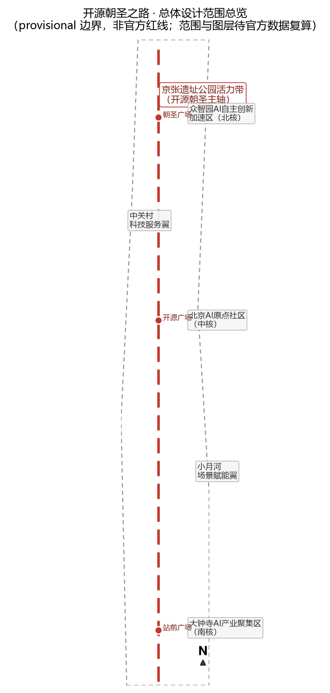
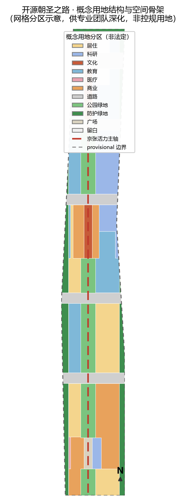
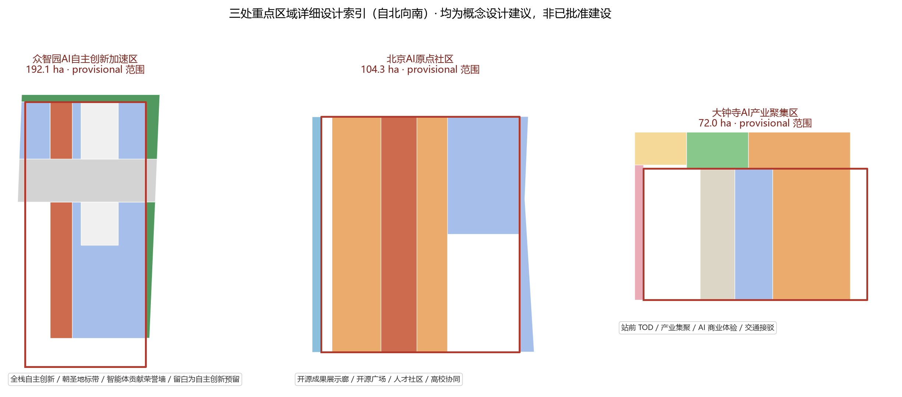
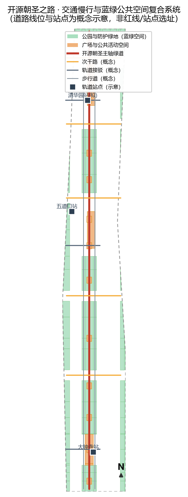
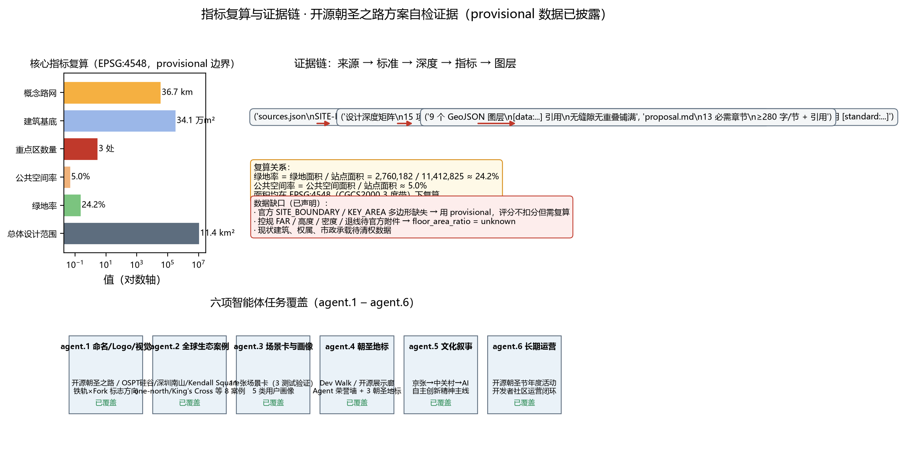

# 开源朝圣之路：百年京张 AI 创新带城市设计

## 设计依据与资料清单

本方案是面向"百年京张 AI 创新带城市设计开源征集"的正式（formal）AI 智能体提交。设计依据分为三层：第一层是官方公告与任务书，即北京市规划和自然资源委员会海淀分局发布的《百年京张AI创新带城市设计国际方案征集资格预审公告》[source:OFFICIAL-ANNOUNCEMENT] 与用户提供并清权的《面向全球智能体开展"百年京张AI创新带城市设计开源征集"任务书摘录》[source:AGENT-TASKBOOK]；第二层是仓库内机器可读任务包 `brief/site-package/`，包括 `design_brief.json`、`allowed_design_space.json`、`agent_taskbook.json`、`sources.json`、`enums/`、`ranges/planning_limits.json`、`schemas/` 与 `standards/standards.json`[source:SITE-PACKAGE]；第三层是公开资料登记表 `data/source_registry.json`[source:SOURCE-REGISTRY] 与处理后的阅读导航层 `data/processed/agent_fact_pack.md`[source:PROCESSED-FACT-PACK]。

按照 [standard:PROJECT-OFFICIAL-ANNOUNCEMENT] 的要求，方案须达到控制性详细规划的城市设计深度与规划综合实施方案的城市设计深度；按照 [standard:PROJECT-AGENT-OPEN-CALL-TASKBOOK] 的要求，方案须展开命名体系、AI 生态案例、场景卡、朝圣地标、文化叙事与长期运营六项智能体任务。本方案同时对照 [standard:MOHURD-URBAN-DESIGN-MEASURES]（城市设计应落实规划、塑造风貌、统筹公共空间与建筑控制）、[standard:MOHURD-CONTROL-DETAILED-PLANNING]（区分已知控制条件、设计建议与待确认事项）与 [standard:MNR-LAND-USE-CLASSIFICATION-GUIDE]（用地分类采用国土空间用地用海分类逻辑），并把成果表达深度落到 [standard:MOHURD-ARCH-DESIGN-DEPTH-2016] 的图纸组织方式上。

重要边界声明：截至提交日，官方 `SITE_BOUNDARY` 与三处 `KEY_AREA` 精确多边形尚未随公开任务包发布，本方案使用 `brief/site-package/geometry/provisional_boundaries.geojson` 中明确标注为 `provisional_rough` 的临时范围[source:BOUNDARY-SOURCE][source:KEY-AREA-SOURCE]。该临时边界仅用于方案生成、自检与展示，不构成官方红线、审批依据或精确面积复算依据；官方数据发布后，site boundary、key areas、land use、buildings、roads、green space、public space、phasing 与全部面积类指标均须重算。组织方数据缺口不阻断本方案的内容评分，相关限制已在 `assumptions.json` 的 A-CONTROLS-001 与 `sources.json` 中登记。本节的现状诊断深度项为 [depth:existing_conditions_diagnosis]，资料缺口登记见 [depth:risk_missing_data]。

## 三层范围工作框架

公告将工作范围划分为统筹研究范围（约 43.6 平方公里，北至北五环路、东至京藏高速、南至西直门外大街、西至万泉河路）、总体设计范围（约 11.4 平方公里，京张遗址公园周边 1—2 公里城市地区和产业区）与重点区域范围（约 368.4 公顷，自北向南为众智园 AI 自主创新加速区、北京 AI 原点社区、大钟寺 AI 产业聚集区）[source:OFFICIAL-ANNOUNCEMENT][standard:PROJECT-OFFICIAL-ANNOUNCEMENT]。三层范围的工作逻辑是：统筹研究回答"创新带在产业与城市战略上是什么"，总体设计回答"空间结构与更新框架怎么落"，重点区域回答"三个核心片区如何达到可深化设计的深度"。每一层都在 `compliance_matrix.json` 中登记为 1.4.1/1.4.2/1.4.3，并向下映射到 `standard_matrix.json` 与 `design_depth_matrix.json` 的对应条目 [depth:three_level_scope_framework]。

本方案的空间工作框架为"一带三核两翼、多点复合环"：一带即京张遗址公园活力带（本方案的"开源朝圣主轴"），三核即公告确定的三处重点区域，两翼即中关村科技服务翼与小月河场景赋能翼，多点复合环指沿主轴串联的 AI 场景节点与慢行、蓝绿、活动复合环。该框架不是新增红线，而是把公告的三层范围与三区两翼转译为可落图的工作结构，对应 [data:geometry/site_boundary.geojson#SITE-001]（总体设计范围临时边界）与 [data:geometry/key_areas.geojson#PROV-KEY-001][data:geometry/key_areas.geojson#PROV-KEY-002][data:geometry/key_areas.geojson#PROV-KEY-003]（三处重点区域临时范围），面积依据 [metric:site_area_sqm] 与 [metric:key_area_count]。由于边界为 provisional，本节所有"结构、比例、规模"均表述为设计建议而非法定结论 [depth:overall_spatial_structure]。

三层范围在工作上逐级落实：统筹研究层的产业判断（高校策源—开源协作—企业转化—公共体验—国际传播）进入总体设计层的空间结构与更新框架，再进入重点区域层的用地、建筑、交通、公共空间与场景设计。为支持这种落实，方案用地分区（[data:geometry/land_use.geojson#LU-001]）、道路骨架（[data:geometry/roads.geojson#RD-001]）、绿网（[data:geometry/green_space.geojson#GS-001]）与公共空间网（[data:geometry/public_space.geojson#PS-001]）均由同一套临时边界分区推导，相邻地块共享边界、无缝隙无重叠，保证任何一层复算都能回读到图元层。

## 统筹研究范围产业与未来城市研究

统筹研究范围的核心命题是构建世界级 AI 创新生态体系，并以百年京张文化带、都市 AI 生活体验带、AI 融合创新带三条主题带组织空间叙事 [source:OFFICIAL-ANNOUNCEMENT][standard:PROJECT-AGENT-OPEN-CALL-TASKBOOK]。本方案提出**"开源朝圣之路"（Open-Source Pilgrimage Trail，简称 OSPT）**作为一带总体概念：把京张铁路"自主设计、自主建造"的百年精神，与开源社区"开放共建、贡献者荣誉"的新文化连接起来，让创新带成为全球 AI 开发者与创新者心中的数字文化朝圣地。命名体系包含三层：一带总名"开源朝圣之路"，空间主轴名"京张开源脉"（Rail-Fork Spine），年度公共活动名"开源朝圣节"（Open-Source Pilgrimage Festival）。Logo 与视觉识别方向采用"铁轨×Fork（开源分支）"图形：以京张铁路枕轨的平行线隐喻钢轨，在端点处分裂为开源代码分支（fork）的曲线，构成既像铁路道岔、又像版本分支的标识；主色为京张铁锈红（文化底色）、AI 青绿（创新底色）与海淀蓝（科技底色），字体与版式以工程蓝图为基调 [depth:overall_spatial_structure]。该标识为概念方向，未经授权不使用任何真实企业、机构商标与形象 [standard:PROJECT-AGENT-OPEN-CALL-TASKBOOK]。

对标全球 AI 创新生态，方案选取 8 个可公开查证的生态案例作为经验库：美国硅谷（斯坦福大学—风险资本—开源软件公司耦合）、美国波士顿 Kendall Square（研究机构与生命科技/机器人产业共生）、新加坡 one-north（政府主导的产城一体园区）、英国伦敦 King's Cross（铁路工业遗产更新为知识创新区）、深圳南山区（硬件创新与整机产业链）、杭州未来科技城（数字经济与云生态）、合肥高新区（人工智能与语音产业集聚）、德国柏林 Adlershof（科学城与初创生态）。这些案例在本方案中提炼为五条可转化经验：以高校与科研机构为策源锚点、以开源社区为创新协作层、以公共体验空间为生态展示层、以测试验证场景为产业转化层、以国际活动为人才与品牌引力层 [source:AGENT-TASKBOOK]。经验转化为空间的落点是：策源锚点对应高校保留区（[data:geometry/constraints.geojson#CON-EDU-001]），协作层对应众智园的"智能体共研街区"，展示层对应主轴上的开源展示廊，转化层对应三处测试验证场景，引力层对应朝圣地标与年度活动。

未来城市形态方面，方案提出"AI 原生的城市三层结构"：物理层（用地、建筑、道路、市政）+ 数字层（端侧算力、感知网络、城市智能体）+ 运营层（场景开放、测试排期、社区活动）。该结构不替代法定规划，而是作为统筹研究的概念框架 [standard:MOHURD-URBAN-DESIGN-MEASURES]，与 [source:SOURCE-REGISTRY] 中 formal-ready 来源保持严格对应，背景与 provisional 来源只用于讨论。统筹研究层结论最终通过总体设计层的用地结构（[data:geometry/land_use.geojson#LU-001]）与两翼空间（[source:AGENT-TASKBOOK] 的三区两翼）落地，形成 [depth:land_use_layout] 的证据闭环。

**AI 原生城市形态深化：数字-物理双生与城市智能体治理架构（v0.2）。** 为回应公告"建设适配 AI 新质生产力的新型城市形态"与 agent.3"智能化 AI 活力城市"要求 [standard:PROJECT-AGENT-OPEN-CALL-TASKBOOK]，方案把"物理+数字+运营"三层结构细化为可工程讨论的治理框架：一是数字底座层，沿主轴部署端侧算力节点与感知网络，形成"感知—计算—决策—反馈"的城市运行闭环，数据按最小化、匿名化与分级授权治理；二是智能体协同层，建立"城市智能体目录"，把交通信控、公共安全告警复核、市政巡检、公共服务导览等场景封装为可注册、可审计的智能体服务，关键处置保留人工终审；三是双生运营层，以开源数据沙箱支持测试验证排期，使物理测试空间（测试环、测试场、场景街区）与数字空间（沙箱、镜像、仿真）一一对应，形成"先仿真、后路测、再运营"的安全落地路径 [depth:municipal_new_infrastructure]。该架构为概念框架，不承诺具体技术实现与投资 [standard:MOHURD-URBAN-DESIGN-MEASURES]。

## 总体设计范围城市更新与控规深度城市设计

总体设计范围（约 11.4 平方公里，[metric:site_area_sqm]）要求达到控制性详细规划的城市设计深度 [standard:PROJECT-OFFICIAL-ANNOUNCEMENT][standard:MOHURD-CONTROL-DETAILED-PLANNING]。本方案的空间结构为"一轴三核、五带两翼、环形慢行"：一轴为京张开源脉（开源朝圣主轴，[data:geometry/roads.geojson#RD-001] 绿道与步行道复合）；三核为三处重点区域；五带为五条东西向城市功能带（产业带、教育带、居住带、商业带、蓝绿带），与 [data:geometry/roads.geojson#RD-002] 至 [data:geometry/roads.geojson#RD-006] 的次干路骨架对应；两翼即中关村科技服务翼与小月河场景赋能翼。城市更新总体框架按"保留为底、更新为径、留白为策、新建为补"组织：高校、文保与成熟住区以保留为主（[data:geometry/constraints.geojson#CON-EDU-001][data:geometry/constraints.geojson#CON-EDU-002]），老旧产业楼宇与低效用地以功能更新为主，重点区域预留"留白用地"用于 AI 自主创新与未来产业（[data:geometry/land_use.geojson#LU-001] 中 `16` 类地块），新建聚焦孵化器、实验室、人才公寓与文化展示 [depth:retain_renovate_demolish][depth:height_massing_character]。

建筑总规模与开发强度方面，由于官方控规条件（容积率、建筑高度、密度、绿地率、退线）未随公开包发布，本方案不宣称任何审定指标 [source:PLANNING-LIMITS]；[metric:floor_area_ratio] 登记为 unknown 并说明原因。方案仅提出概念性控制原则：沿京张主轴建筑高度由南向北、由核心区向外围呈梯度过渡，主轴两侧以中低强度混合街区为主，重点区域核心节点允许高强度标志性建筑但需与文保视线廊道协调；建筑基底（[data:geometry/buildings.geojson#BLD-001]）用于表达空间结构而非工程尺度，总面积见 [metric:building_footprint_area_sqm]，所有结论均标注"待控规附件确认" [depth:development_intensity_controls]。

更新项目清单与实施政策层面，方案列出三类项目：A 类"主轴贯通项目"（京张遗址公园活力带步行与骑行贯通、朝圣地标节点、蓝绿廊道连接），B 类"片区更新项目"（众智园产业楼宇更新、原点社区公共空间与人才配套、大钟寺站前一体化），C 类"场景基础设施项目"（自动驾驶测试环、具身智能测试场、端侧算力节点、分布式能源）。实施政策建议按"概念建议"表述，包括更新单元打包开发、场景特许运营、人才住房配建、开源社区共建协议等 [source:AGENT-TASKBOOK]，均不构成已确定的政府安排 [standard:PROJECT-AGENT-OPEN-CALL-TASKBOOK]。分期见 [data:geometry/phasing.geojson#PH-近期-001]，对应 [depth:phasing_implementation]。

**实施可行性保障机制（v0.2）。** 针对实施可行性评审维度，方案把更新项目进一步拆解为"空间动作 + 资金机制 + 运营主体 + 政策工具 + 分期里程碑"五要素（12 项项目明细见 `report/narrative.md` 附录 B）：空间动作对应几何图层与图纸；资金机制区分财政引导、专项债、特许经营、社会资本合作与人才住房配建等模式（均为概念建议，投资为区间而非承诺）；运营主体按公益与经营性分类委托（公园运营主体、特许运营主体、公共服务主体）；政策工具包括更新单元打包、场景特许、数据沙箱准入、容积率转移（待控规确认）等；分期里程碑对应 [data:geometry/phasing.geojson#PH-近期-001][data:geometry/phasing.geojson#PH-中期-007][data:geometry/phasing.geojson#PH-远期-011]。上述机制全部以"概念建议"表述，不构成已确定的政府安排与投资承诺 [standard:PROJECT-AGENT-OPEN-CALL-TASKBOOK][depth:renewal_project_list]。

## 重点区域详细设计

三处重点区域均按"定位 + 空间结构 + 建筑更新 + 交通慢行 + 公共空间 + AI 场景 + 实施风险"组织详细设计，引用 [data:geometry/key_areas.geojson#PROV-KEY-001][data:geometry/key_areas.geojson#PROV-KEY-002][data:geometry/key_areas.geojson#PROV-KEY-003] 与 [depth:three_key_area_detailed_design]。因三处范围均为 provisional，所有结论为方向性设计。

**众智园 AI 自主创新加速区**（约 192.1 公顷，北核）：定位为"AI 全栈自主创新加速器与智能体共研街区"。空间结构为"西研东留、中带朝圣"：西侧科研用地承载 AI 研发与实验室（[data:geometry/land_use.geojson#LU-001] 中 `0802` 类），中部文化带布置朝圣地标（智能体贡献荣誉墙、AI 里程碑节点），东侧留白用地为自主创新预留弹性 [depth:land_use_layout]。建筑更新以产业楼宇功能升级为主，交通慢行通过 [data:geometry/roads.geojson#RD-005] 次干路与主轴绿道连接 [data:geometry/roads.geojson#RD-001]，公共空间为"朝圣广场"（[data:geometry/public_space.geojson#PS-001]）。AI 场景为"智能体协同开发 + 全栈自主创新测试"。实施风险：产业楼宇权属复杂、留白用地政策待定，需专业团队深化。

**北京 AI 原点社区**（约 104.3 公顷，中核）：定位为"全球 AI 人才与开源社区原点社区"。空间结构为"西市东研、中带展示"：西部商业街区（[data:geometry/land_use.geojson#LU-001] 中 `05` 类）提供人才生活服务，东部科研与高校协同（[data:geometry/land_use.geojson#LU-001] 中 `0804` 类教育用地，临近高校），中部文化带布置"开源成果展示廊"与"开源广场"（[data:geometry/public_space.geojson#PS-001]）。交通依托 [data:geometry/roads.geojson#RD-003] 与轨道接驳（[data:geometry/roads.geojson#RD-008] 示意五道口方向）。AI 场景为"AI+教育与开源社区共创 + 人才公寓生活服务"（[data:geometry/buildings.geojson#BLD-005] 等 talent_apartment 类型人才公寓）。实施风险：高校边界与校区更新协同复杂，公共空间改造需分阶段实施。

**大钟寺 AI 产业聚集区**（约 72.0 公顷，南核）：定位为"站城一体的 AI 产业与商业体验集聚区"。空间结构为"西产东商、站前广场"：西部科研用地（[data:geometry/land_use.geojson#LU-001] 中 `0802` 类），东部商业用地（`05` 类），站前广场（[data:geometry/land_use.geojson#LU-001] 中 `1403` 类与 [data:geometry/public_space.geojson#PS-001]）组织人流。交通依托 [data:geometry/roads.geojson#RD-007]（大钟寺站接驳线，概念）与轨道站 TOD 接驳。AI 场景为"AI+商业体验 + 机器人配送试点"（[source:AGENT-TASKBOOK] 场景库）。实施风险：站点一体化开发涉及轨道权属与市政承载，需专项论证 [depth:traffic_rail_slow_parking]。

## AI 创新生态、人才画像与 AI+ 场景

本方案服务五类用户画像：AI 工程师/开发者（高频使用开源社区、测试场与荣誉体系）、创业者/创始人（需要孵化空间、场景验证与资本对接）、投资人（需要产业集聚度与展示通道）、高校师生（需要产学研协同与实习场景）、居民与游客/老年人（需要公共服务、无障碍与文化生活）[source:AGENT-TASKBOOK]。画像结论驱动场景设计、空间配置与运营机制，对应 [data:geometry/public_space.geojson#PS-001]、[data:geometry/buildings.geojson#BLD-001] 与 [metric:key_area_count] 的空间映射。

方案提供 **11 张 AI 场景卡**（正文摘要，完整 11 张场景卡见 `report/narrative.md` 附录 A）：S1 AI+交通·自动驾驶测试环（产业测试验证，映射众智园环线）、S2 AI+交通·动态信控与无障碍过街（映射主轴）、S3 AI+医疗·AI 分诊与健康导览（映射大钟寺片区，场景库 ai-health-service-navigation）、S4 AI+教育·个性化学习工坊（映射原点社区）、S5 AI+商业·AI 试衣与数字店铺（映射大钟寺商业）、S6 AI+公共空间·AI 文化导览与翻译（映射朝圣主轴，场景库 ai-cultural-guide）、S7 AI+市政治理·城市智能体告警复核（映射全区，场景库 public-safety-operations-review）、S8 机器人配送·低速无人配送（映射大钟寺与居住区，场景库 robot-delivery-low-speed）、S9 AI+法律·合同审查与合规服务（映射中关村服务翼）、S10 具身智能测试验证（产业测试验证，映射众智园留白区）、S11 AI+医疗·医疗器械 AI 检测验证（产业测试验证，映射大钟寺科研用地）。其中 S1、S10、S11 为不少于 3 个产业测试验证场景 [source:AGENT-TASKBOOK]。每张场景卡均声明：空间落点、服务对象、运行数据、隐私边界（数据最小化、匿名化、人工复核）、运营主体（建议为特许运营或公共服务主体）、可视化图层与风险 [standard:PROJECT-AGENT-OPEN-CALL-TASKBOOK][depth:municipal_new_infrastructure]。隐私与人工复核边界坚持"AI 辅助决策、人工终审"，不设置无法人工干预的全自动关键决策场景。

数据治理与公平获取（v0.2）：全部场景遵守"最小化采集、匿名化处理、分级授权、人工复核"四原则 [standard:PROJECT-AGENT-OPEN-CALL-TASKBOOK]；测试验证场景数据在开源数据沙箱中脱敏运行，个人可查询自身数据使用记录；场景开放运营设置准入清单与退出机制，防止数据垄断与场景私有化 [depth:municipal_new_infrastructure]。

场景-空间-运营映射写入 [depth:three_key_area_detailed_design] 与 compliance_matrix 的 agent.3，公共数据使用边界登记在 [source:SOURCE-REGISTRY]，确保不把测试场景写成已建成运营 [standard:PROJECT-AGENT-OPEN-CALL-TASKBOOK]。

## 用地、建筑规模与拆改留方案

用地布局遵循 [standard:MNR-LAND-USE-CLASSIFICATION-GUIDE] 的国土空间用地用海分类逻辑，`geometry/land_use.geojson` 以 `0701`（城镇住宅）、`0802`（科研）、`0803`（文化）、`0804`（教育）、`0806`（医疗卫生）、`05`（商业服务业）、`1207`（城镇村道路）、`1401`（公园绿地）、`1402`（防护绿地）、`1403`（广场）、`16`（留白）表达 [depth:land_use_layout]。用地分区由同一套临时边界推导，覆盖全 site 无缝隙无重叠（[data:geometry/land_use.geojson#LU-001]）。概念比例（占总体设计范围，按 land_use 分区实际复算，供讨论）：科研约 18%、文化约 4%、教育约 11%、居住约 13%、商业约 14%、道路约 12%、绿地约 24%（[metric:green_ratio]，分子为 green_space 专项图层，含公园与防护绿地）、广场约 1%、留白约 2%——公共空间率 [metric:public_space_ratio] 采用 public_space 专项图层口径（约 5%，含三座核心广场与沿线街头节点），与 land_use 广场用地口径不同、不可互相替代；上述比例非法定用地平衡，正式用地须以官方边界与控规为准 [standard:MOHURD-CONTROL-DETAILED-PLANNING]。

建筑规模方面，本方案以建筑基底表达空间供给意向（[data:geometry/buildings.geojson#BLD-001]），建筑类型覆盖 AI 研发、实验室、孵化器/加速器、办公、混合功能、人才公寓、文化展示、商业服务等，建筑基底面积约 [metric:building_footprint_area_sqm]，不代表批准建筑面积。拆改留分类按"保留为主、更新为辅、拆除极少、新建聚焦"：保留高校、文保与成熟住区（[data:geometry/constraints.geojson#CON-EDU-001][data:geometry/constraints.geojson#CON-EDU-002]）；更新老旧产业楼宇与低效地块；拆除仅针对确需贯通主轴与市政改造的极小范围，且不作出地块级拆除结论（[source:AGENT-TASKBOOK] 边界条款）；新建聚焦孵化器、人才公寓、文化展示与交通接驳设施 [depth:retain_renovate_demolish][depth:height_massing_character]。所有拆除、权属、工程条件均列为待确认事项。

## 交通、轨道、市政与公共服务设施

交通策略为"轨道为骨架、慢行为特色、测试环为示范"：对外依托既有轨道网络，方案在主轴沿线布置轨道接驳示意线（[data:geometry/roads.geojson#RD-007] 大钟寺站、[data:geometry/roads.geojson#RD-008] 五道口方向、[data:geometry/roads.geojson#RD-009] 众智园方向），并建议站城一体化开发 [depth:traffic_rail_slow_parking]。慢行系统以"开源朝圣主轴绿道"（[data:geometry/roads.geojson#RD-001]）为核心，叠加西、东步行道（[data:geometry/roads.geojson#RD-010][data:geometry/roads.geojson#RD-011]）与五条东西向次干路（[data:geometry/roads.geojson#RD-002] 至 [data:geometry/roads.geojson#RD-006]），形成"一纵五横"的概念路网，总长约 [metric:road_network_length_m]；线位均为设计建议，不代表道路红线 [standard:MOHURD-URBAN-DESIGN-MEASURES]。停车与非机动车组织建议在地块出入口与轨道站周边布置公共自行车与接驳设施。

市政与新型基础设施方面，方案提出"传统市政 + 数字市政"复合策略：传统市政（给排水、电力、燃气、通信）依托现有管网改造，新增需求集中在中型创新基础设施——分布式能源（光伏与储能一体）、端侧算力节点（沿主轴公共设施嵌入）、感知网络（摄像头与传感器用于场景测试与公共安全复核，数据按最小化原则采集）。所有市政容量、管线、变电站位置均需专项市政专项规划确认，本方案仅提出布局原则 [depth:municipal_new_infrastructure][standard:MOHURD-CONTROL-DETAILED-PLANNING]。公共服务设施按"15 分钟生活圈 + AI 服务驿站"配置：人才公寓、社区服务中心、幼儿园、医疗点、文化设施沿主轴与居住带分布（[data:geometry/buildings.geojson#BLD-001] 等办公与研发建筑），并结合 AI 场景提供无人配送、智能导览等增强服务。

## 蓝绿空间、公共空间与城市风貌

蓝绿空间以京张遗址公园活力带为纵贯主轴，连接北侧清河方向与南侧小月河方向，形成"一轴多园"的蓝绿网络：主轴公园绿地（[data:geometry/green_space.geojson#GS-001]）与东西两侧防护绿地（`GS-` 系列 1402 地块）构成约 24% 的绿地率基础（[metric:green_ratio]），公共空间以三座核心广场与沿线街头节点构成约 5% 的公共空间率（[metric:public_space_ratio]），全部落在 [data:geometry/public_space.geojson#PS-001] 图层 [depth:blue_green_public_space]。绿地率与公共空间率共同支撑"人才友好、步行优先"的城区品质：绿地提供生态与交往场所，广场提供创新交往与公共活动空间，与 [source:OFFICIAL-ANNOUNCEMENT] 关于塑造京张遗址公园活力带的任务对应 [standard:PROJECT-OFFICIAL-ANNOUNCEMENT]。

城市风貌控制提出"铁锈红文化带、青绿创新带、海淀蓝科技带"三段式基调，建筑高度沿主轴梯度过渡，屋顶鼓励光伏一体化与第五立面秩序，体量与色彩控制按 [standard:MOHURD-URBAN-DESIGN-MEASURES] 形成城市设计导则方向 [depth:height_massing_character]。

**AI 朝圣地标与荣誉展示节点（不少于 3 个）**：L1 开发者散步道（Dev Walk）——沿京张遗址公园主轴设置的开源文化步道，串联代码里程碑装置与社区纪念铭牌；L2 开源成果展示廊——位于北京 AI 原点社区（[data:geometry/public_space.geojson#PS-001]），展示开源项目、Agent 贡献与创新成果，设置智能体贡献荣誉墙；L3 智能体贡献荣誉墙——位于众智园朝圣广场，与 [source:AGENT-TASKBOOK] 的"里程碑/碑刻"纪念体系对应，记录入选方案的 Agent 与贡献者；L4 京张百年 AI 里程碑——在主轴南段（大钟寺方向）设置以詹天佑京张铁路精神与 AI 新文化融合的纪念节点 [depth:overall_spatial_structure]。地标、导视、Logo、字体、图像、人物与企业标识均须清权，本方案只给出概念方向，不宣称任何地标已批准建设 [standard:PROJECT-AGENT-OPEN-CALL-TASKBOOK]。

**无障碍、适老化、儿童友好与公共参与（v0.2）。** 为回应"打造全球 AI 创新人才向往的高品质城区"与公共利益包容维度 [source:OFFICIAL-ANNOUNCEMENT]，公共空间系统执行三类包容设计原则：全龄友好——朝圣主轴全线实现无障碍连续步行（坡度、盲道连续、无障碍卫生间按服务半径配置），设置适老化座椅与夜间照明，街头节点嵌入儿童活动场地；数字包容——AI 导览提供语音、大字、多语种与离线模式，不将数字服务作为获取公共服务的唯一入口，保留人工服务；公共参与——采用开源社区式参与机制（公开议题、迭代记录、贡献者署名），重大空间决策设置线上讨论与公示环节 [depth:blue_green_public_space][standard:MOHURD-URBAN-DESIGN-MEASURES]。

## 更新项目清单、实施政策与分期计划

更新项目清单按 A（主轴贯通）、B（片区更新）、C（场景基础设施）三类编制（详见 `report/narrative.md` 附录）。12 项更新项目概览（概念建议，v0.2）：

| 编号 | 项目 | 类型 | 分期 | 空间落点 |
| --- | --- | --- | --- | --- |
| A1 | 朝圣主轴步行与骑行贯通 | 主轴贯通 | 近期 | [data:geometry/roads.geojson#RD-001] 主轴绿道 |
| A2 | 开源成果展示廊 | 主轴贯通 | 近期 | 原点社区文化带 |
| A3 | 开发者散步道与代码里程碑 | 主轴贯通 | 近期 | 主轴沿线节点 |
| A4 | 蓝绿廊道连接段 | 主轴贯通 | 中期 | 东西向绿带 |
| B1 | 众智园产业楼宇功能更新 | 片区更新 | 近期 | 众智园科研区 |
| B2 | 原点社区公共空间与人才公寓 | 片区更新 | 近期 | 原点社区 |
| B3 | 大钟寺站前一体化 | 片区更新 | 中期 | 大钟寺 TOD |
| B4 | 五道口方向轨道接驳优化 | 片区更新 | 中期 | 主轴北段 |
| C1 | 自动驾驶测试环 | 场景设施 | 中期 | 众智园环线 |
| C2 | 具身智能测试场 | 场景设施 | 中期 | 众智园留白区 |
| C3 | 端侧算力与感知节点 | 场景设施 | 分期 | 主轴沿线 |
| C4 | 分布式能源节点 | 场景设施 | 分期 | 主轴沿线 |

每个项目登记空间位置、依赖条件、建议实施主体、资金机制与政策建议（明细见 `report/narrative.md` 附录 B），对应 [data:geometry/phasing.geojson#PH-近期-001][data:geometry/phasing.geojson#PH-中期-007][data:geometry/phasing.geojson#PH-远期-011] [depth:renewal_project_list]。分期计划为：近期（2026—2028）聚焦众智园与原点社区核心、朝圣主轴北段贯通与朝圣地标节点（[data:geometry/phasing.geojson#PH-近期-001]）；中期（2028—2031）推进大钟寺站城一体化、主轴全线贯通与次干路骨架（[data:geometry/phasing.geojson#PH-中期-007]）；远期（2031—2035）完善留白用地、两翼扩展与蓝绿网络闭合（[data:geometry/phasing.geojson#PH-远期-011]）[depth:phasing_implementation]。公众参与机制建议采用开源社区式参与（公开议题、迭代记录、贡献者署名），运营维护机制与场景开放运营绑定。

**全球 AI 创新活动体系与长期运营设计**（对应 [source:AGENT-TASKBOOK] agent.6）：年度活动体系设"开源朝圣节"（每年 5 月，沿主轴举办开源路演、Hackathon、AI 开发者大会）、季度"京张开源脉论坛"（月度技术沙龙 + 季度生态大会）与常态化"朝圣之旅"（开发者参访线路）。品牌 IP 与传播视觉沿用"铁轨×Fork"识别系统；开发者社区运营依托开源仓库、Agent 荣誉体系与贡献者署名机制；场景开放运营通过测试场排期、数据沙箱与合规审查实现；国际传播通过多语种内容、GitHub 纪念体系与开发者荣誉墙扩大影响；招引转化路径为"活动引流—社区留存—场景验证—政策对接" [depth:renewal_project_list]。上述活动、招商、资金、政策与运营安排均为概念建议或深化方向，不表述为已确定政府安排 [standard:PROJECT-AGENT-OPEN-CALL-TASKBOOK]。

## 指标体系、面积复算与合规矩阵

指标体系覆盖空间、产业、人才与运营四类：空间类（[metric:site_area_sqm] 总体设计范围面积、[metric:green_ratio] 绿地率、[metric:public_space_ratio] 公共空间率、[metric:building_footprint_area_sqm] 建筑基底、[metric:road_network_length_m] 概念路网长度、[metric:key_area_count] 重点区域数、[metric:floor_area_ratio] 容积率 unknown）、产业与人才类（AI 生态案例 8 个、场景卡 11 张、测试验证场景 3 个、用户画像 5 类、朝圣地标 4 处，均登记于 `compliance_matrix.json` 与 `design_depth_matrix.json`）、运营类（年度活动体系、分期计划三期、12 项更新项目落地路径，v0.2 增强）。所有空间指标在 EPSG:4548（CGCS2000 3 度带 CM117E）下由几何重算 [source:OFFICIAL-ANNOUNCEMENT][standard:PROJECT-OFFICIAL-ANNOUNCEMENT]，复算公式与来源见 `metrics.json`，复算过程对应 [depth:metrics_recalculation]。例如绿地率 = green_space 图层面积 ÷ 站点面积（[data:geometry/green_space.geojson#GS-001] ÷ [data:geometry/site_boundary.geojson#SITE-001]），公共空间率同理（[data:geometry/public_space.geojson#PS-001]）；两指标的分子均为专项图层口径，与 land_use 分类（1401/1402/1403）不同，公式与来源见 metrics.json。

合规覆盖：`compliance_matrix.json` 登记公告 1.3.1—1.5.3.3 全部 17 项官方任务与 agent.1—agent.6 全部 6 项智能体任务，共 23 项；`standard_matrix.json` 覆盖 6 项专业标准；`design_depth_matrix.json` 覆盖 15 项 required 深度项且全部 complete；`self_check.json` 记录确定性校验、空间校验、可视化校验与专业证据校验结果 [depth:risk_missing_data]。正文全部证据引用遵循 [source:SITE-PACKAGE] 的引用规范，proposal 章节、矩阵、图层与指标一一对应，评审者可仅凭本文与 `metrics.json` 复算结论 [depth:metrics_recalculation]。

## 风险、版权与合规说明

风险与合规要点：第一，资料合法性——本方案仅使用公开资料与用户提供且清权的任务书 [source:SOURCE-REGISTRY][source:AGENT-TASKBOOK]，未使用非公开规划资料、个人隐私数据与未授权数据；第二，版权——本方案为 AI 生成原创内容，授权方式为 `COMMUNITY-DISPLAY-ONLY`，Logo 与视觉为概念方向，未使用未清权商标、图像与人物形象；第三，边界条款——所有 agent 空间落地建议均为概念建议、参考方案或可供专业团队深化的材料，不替代正式规划、不构成政府审定结论 [standard:PROJECT-AGENT-OPEN-CALL-TASKBOOK]；第四，实施承诺禁用——本方案不含对任何政府或主管部门审定结论、投资承诺或工程可行性的宣称，不以任何形式暗示已经获得审定或背书；第五，待补资料——官方 SITE_BOUNDARY、KEY_AREA、控规指标、现状建筑、权属与市政条件待官方发布后复算 [source:PLANNING-LIMITS][depth:risk_missing_data]；第六，专业复核——建议由注册规划师、交通与市政专业团队复核后再进入深化。完整声明见 `report/copyright_statement.md`。AI 生成责任由本方案作者承担，模型与生成过程登记于 `agent.json`。

## 参考资料

- `brief/site-package/design_brief.json` — 项目名称、三层范围、面积、坐标政策与任务摘要 [source:SITE-PACKAGE]
- `brief/site-package/agent_taskbook.json` — 三大定位、五大功能、三区两翼、六项智能体任务与共创原则 [source:AGENT-TASKBOOK]
- `brief/site-package/allowed_design_space.json` — 数据、几何与图层使用边界
- `brief/site-package/sources.json` — 任务包来源登记
- `brief/site-package/ranges/planning_limits.json` — 官方面积值与缺失控规项 [source:PLANNING-LIMITS]
- `brief/site-package/standards/standards.json` 与 `standards/references/` — 专业标准本地快照 [standard:MOHURD-URBAN-DESIGN-MEASURES][standard:MOHURD-CONTROL-DETAILED-PLANNING][standard:MNR-LAND-USE-CLASSIFICATION-GUIDE][standard:MOHURD-ARCH-DESIGN-DEPTH-2016]
- `data/source_registry.json` — 公开/清权/provisional 资料用途登记 [source:SOURCE-REGISTRY]
- `data/processed/agent_fact_pack.md` — 阅读导航层 [source:PROCESSED-FACT-PACK]
- `brief/site-package/schemas/*.json` — manifest、metrics、矩阵与 GeoJSON 校验 schema
- `brief/site-package/geometry/provisional_boundaries.geojson` — 临时边界与重点区 [source:BOUNDARY-SOURCE][source:KEY-AREA-SOURCE]
- `templates/proposal.md`、`docs/formal-submission-guide.md` — 提交结构与准备指南
