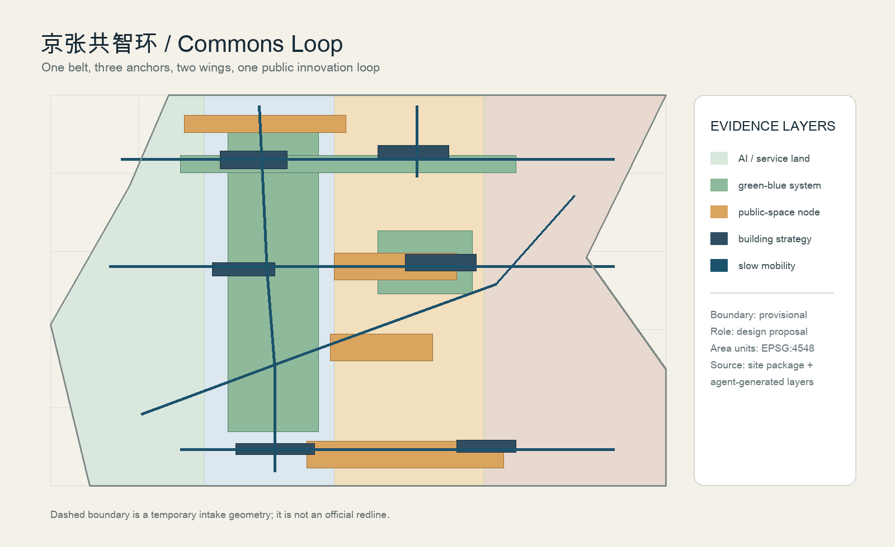
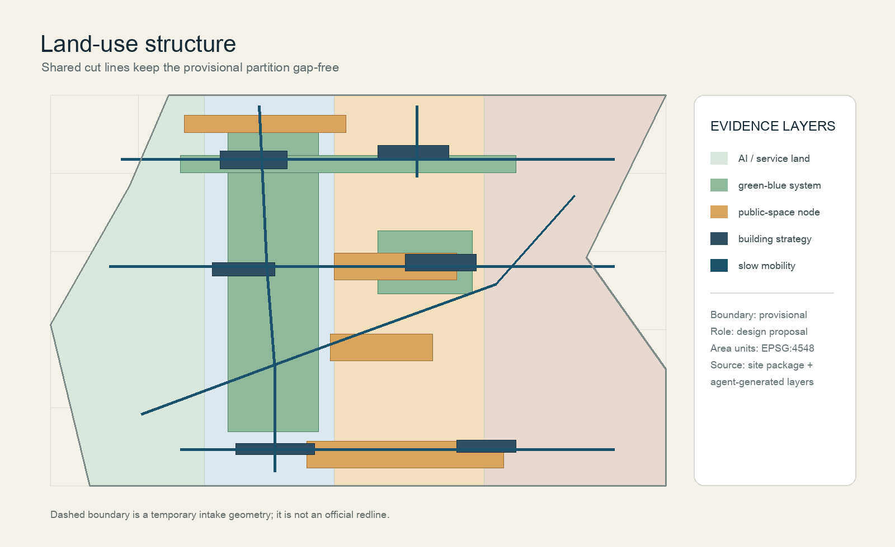
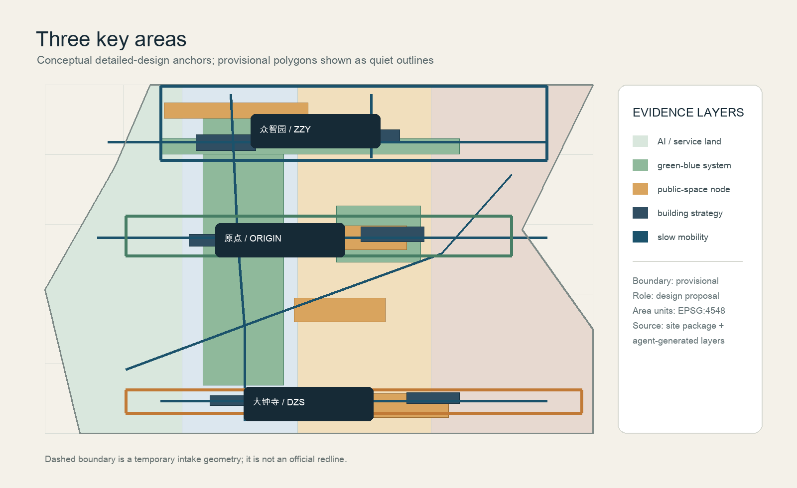
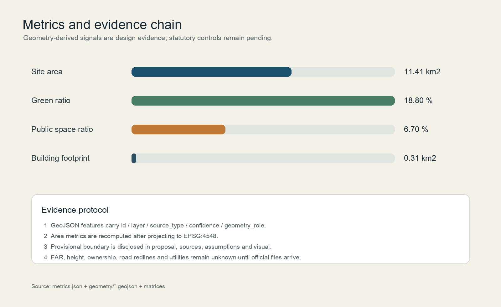

# Jing-Zhang Co-Intelligence Ring: An AI-Powered Public Innovation Belt on a Centennial Railway Heritage

## Design Basis and Source List

This proposal is based on the three-layer scope, tasks, and outcomes context of the official pre-qualification announcement for the project. It uses the structured task book, standard snapshot, and Source Registry from the `brief/site-package/` as traceable evidence. [source:OFFICIAL-ANNOUNCEMENT] [source:AGENT-TASKBOOK] [source:SITE-PACKAGE] [source:SOURCE-REGISTRY]. There is currently no organized party's precise polygon available for the Official Planning Boundary, so the `provisional_boundaries.geojson` provided by the maintainer is used as a temporary generating constraint; it does not support the official planning boundary, approval, ownership, or precise area conclusions. [source:BOUNDARY-SOURCE] [source:KEY-AREA-SOURCE]

Theme name "Jing-Zhang Commons Loop" translates the linear memory of railway heritage into a walkable, learnable, and collaborative public innovation loop. The logo direction is "interrupted rail + three points of wisdom," with three short lines representing history, life, and innovation, and three points representing three key areas. It is recommended to use four copyright-free colors: deep blue, rust orange, riverbank green, and off-white. No corporate trademarks, personal likenesses, or unauthorized fonts should be used. The text and machine files reference each other, and five images are generated from the same batch of GeoJSON, metrics, and matrices. [standard:PROJECT-OFFICIAL-ANNOUNCEMENT] [standard:PROJECT-AGENT-OPEN-CALL-TASKBOOK]

The data gaps include official SITE_BOUNDARY, precise boundaries for three KEY_AREA, current building footprints and ownership, control plan intensities, road right-of-way, rail interface, utility lines, cultural heritage, and fire safety conditions. These gaps are documented in `assumptions.json`, and are not covered by temporary geometries; all design layers and metrics should be recalculated after obtaining the clearance documents. [depth:existing_conditions_diagnosis] [source:PROCESSED-FACT-PACK] [source:STANDARD-SNAPSHOTS] [source:GENERATED-DESIGN-LAYERS]

## Three-Level Scope Framework

The Coordinated Research Area covers approximately 43.6 km², discussing the innovative ecosystem and regional coordination between the North Fifth Ring Road of Haidian and the Wexiang Road, from the Jingzhang Expressway to the Wexiang Road. The Overall Design Area covers approximately 11.4 km², with the design constraints set around the Jingzhang Relic Park within 1-2 km of the urban and industrial zones. The Key-Area Detailed Design Area covers approximately 368.4 ha, including Zhongzhiyuan, the Beijing AI Origin Community, and the Dazhongsi AI Industry Cluster. The submitted `site_boundary.geojson` area is 11.41 km², which is a recalculated value in the EPSG:4548 projection, not replacing the announced area or official survey. [data:geometry/site_boundary.geojson#SITE-001] [metric:site_area_sqm] [depth:three_level_scope_framework] (Jing-Zhang)

Three layers are not three sets of isolated drawings: the integrated layer forms the "university innovation source—open-source collaboration—enterprise transformation—public experience—international dissemination" industrial loop; the overall layer uses complete land zoning, architectural strategies, pedestrian and blue-green systems to support the loop; the key layer translates the three cores into spatial prototypes that can be further developed by professional teams. The Provisional Boundary is only used for intake, self-inspection, visualization, and directional discussions. Once the official polygon is in place, the land, green spaces, buildings, roads, Public Spaces, phased development, and indicators must be recalculated together. [data:geometry/key_areas.geojson#PROV-KEY-001] [data:geometry/key_areas.geojson#PROV-KEY-002] [data:geometry/key_areas.geojson#PROV-KEY-003]

## Coordinated Research Area: Industry and Future City Research

The spatial concept is "one axis with three cores, two wings in coordination, and blue-green coexistence": the Jing-Zhang Heritage Park serves as the public innovation axis, Zhongzhiyuan takes on full-stack independent innovation and governance validation, the Beijing AI Origin Community handles on-campus technology transfer and daily talent activities, Dazhongsi focuses on intelligent native business and content consumption; the Zhongguancun Technology Services Wing provides elements and professional services, while the Xiaoyue River Scenario Enablement Wing transforms technology into perceivable urban daily life. The five functional areas correspond to full-stack independent innovation in AI, a world-class innovation ecosystem, AI-Enabled Scenario empowerment, intelligent vibrant cities, and global AI governance discourse. [source:AGENT-TASKBOOK] [depth:overall_spatial_structure]

Transformative mechanisms for case studies rather than enterprise lists: Toronto Waterfront's open data collaboration is converted to a "public data ledger"; Helsinki Kalasatama's living experiments are transformed into a "small-scale, reversible scenario sandbox"; Barcelona 22@'s innovative district becomes a "mixed interface of industry-Public Space"; Amsterdam Marineterrein's open testing is converted to a "scheduled, log, Human Review" process; Singapore Punggol Digital District's campus-industry collaboration is transformed into a "near-campus conversion street"; Seoul Digital Media City's public media is converted to a "contribution and honor display"; Shenzhen Nanshan's industrial service network is transformed into an "enterprise service node". These are summaries of the mechanisms for public case studies, not guaranteed policies for this project. [source:AGENT-TASKBOOK] [source:SOURCE-REGISTRY]

Future urban forms emphasize three reversibilities: spatial reversibility (first floors and Public Spaces can be switched), data reversibility (minimizing data collection and making it deletable), and operational reversibility (pilot failures can be withdrawn). This enables AI's new productive capacity to rely on a combination of shared test fields, public service nodes, low-speed robots, and open knowledge bases rather than large-scale demolition and construction. [standard:MOHURD-URBAN-DESIGN-MEASURES]

## Overall Design Area: Urban Renewal and Regulatory-Plan-Level Urban Design

Overall spatial organization is suggested with a north-south public innovation main axis, three east-west stitching side axes, and a blue-green slow-moving loop. `land_use.geojson` fully covers the Provisional Boundary with four adjacent zones: research and innovation (0802), park and green spaces (1401), commercial and service (05), and community service (0702), with shared tangents generated by the same coordinate to avoid gaps and overlaps. [data:geometry/land_use.geojson#LU-001] [standard:MNR-LAND-USE-CLASSIFICATION-GUIDE] [depth:land_use_layout]

The architectural layer only expresses the design strategy baseline, not the current status or ownership judgment: two retention-type public nodes, two renovation-type innovative services, two renewal-type mixed neighborhoods, and two new construction-type low-carbon experimental buildings. Building Height, Floor Area Ratio, Building Coverage Ratio, setback, and fire safety distances are all listed as pending formal zoning confirmation unknowns, and no pseudo-precise numbers are manufactured in this plan. [data:geometry/buildings.geojson#BLDG-001] [metric:building_footprint_area_sqm] [depth:development_intensity_controls] [depth:height_massing_character] [depth:retain_renovate_demolish]

The update project adopts a three-phase proposal: "first public, then industry; first pilot, then expansion." Phase one stitches the slow-moving gaps in the Jing-Zhang Heritage Park, the original point community announcement hall, and the Qinghe innovation interface; phase two forms the four quadrants of pedestrian connections at Dazhongsi station, a shared test field, and an edge-side computing service node; phase three integrates mature scenarios into cross-regional innovation collaboration. Each phase is subject to evaluation, public feedback, and professional review. [data:geometry/phasing.geojson#PHASE-001] [depth:renewal_project_list] [depth:phasing_implementation]

## Detailed Design of Key Areas

**Zhongzhiyuan AI Independent Innovation Acceleration Area (Temporary Polygon)**: positioned as a "garden-type full-stack innovation district." It is suggested to use Qinghe interface and low-carbon innovation corridor as the public framework, arranging safety governance sandbox, standard workshop, shared test field, and contribution wall for visitors; the architectural strategy prioritizes the renovation of the first floor and public interface, with any land modifications, engineering lines, and municipal interfaces awaiting further refinement by professional teams. [data:geometry/key_areas.geojson#PROV-KEY-001] [depth:three_key_area_detailed_design]

**Beijing AI Origin Community (temporary polygon)**: Located as the "Near School Transformation and Talent Community." It is suggested to organize a slow travel connection between campus, park, and neighborhood. Set up an open-source release hall, a transformation street, a talent service kiosk, and a nighttime collaboration space. Mix living, education, culture, and light office spaces into an appointment-based daily network to avoid defaulting to the transformation of university or corporate spaces. [data:geometry/key_areas.geojson#PROV-KEY-002]

**Dazhongsi AI Industry Cluster (Temporary Polygon)**: positioned as the "Urban Type Intelligent Economy and International Exchange District." It is suggested to arrange around the rail station connections and quadrants at the road intersections, international roadshow lounges, smart terminal displays, data element sitting rooms, and content consumption scenarios. Lighting, media, and signage should be readable, low-distraction, and closable. [data:geometry/key_areas.geojson#PROV-KEY-003]

The common design language for the three key areas is "accessible, understandable, and escapable": each scene has public instructions, booking permissions, manned supervision, fallback paths in case of failure, and a data deletion pathway. [standard:MOHURD-CONTROL-DETAILED-PLANNING]

## AI Innovation Ecosystem, Personas, and AI+ Scenarios

Five categories of personas and spatial mapping: Open-source developers need to publish, collaborate, and showcase their reputation, corresponding to the Original Point Community Launch Hall; startup teams need low-cost testing, compliance consultation, and access to computing power, corresponding to the Zhongzhiyuan Test Field; leading enterprise visitors need international reception and pitch events, corresponding to the Dazhongsi Living Room; surrounding residents need commuting, leisure, community services, and low-impact nighttime activities, corresponding to the park's slow-moving loop; university students and faculty need to convert research outcomes and cross-institutional collaboration, corresponding to the campus-garden seam. All personas only describe service needs and do not collect personal identity or behavioral trajectory data. [source:AGENT-TASKBOOK]

Ten scene cards (with 01-04 being sector testing/verification recommendations) are as follows:

| ID | Scenario Card | Space and Operations | Data, Privacy, and Human Review |
| --- | --- | --- | --- |
| 01 | Safety Governance Sandbox | Zhongzhiyuan Reservation Testing Field | Authorized Model and Synthetic Data; Summary Released after Expert Review |
| 02 | Standard Workshop | Zhongzhiyuan Shared Meeting Box | Public standard text; do not upload confidential company information. |
| 03 | Low-Carbon Computing Test Platform | Qinghe Innovation Corridor | Aggregate energy and equipment data; engineering team review |
| 04 | Sidewalk Robot Low-Speed Testing | Park Edge by Time Segment | Only Authorized Test Logs; Safety Officers Can Immediately Stop |
| 05 | AI Slow Travel Navigation | Jing-Zhang Heritage Park | Aggregate Crowding and Accessibility Feedback; Does Not Track Personal Information |
| 06 | Open Source Release Hall | Origin Community | Contributors Voluntarily Sign; Displayed After Manual Editing |
| 07 | Results Street | Original Point Community Level 1 | Authorized Project Card; Intellectual Property Advisor Review |
| 08 | International Roadshow Living Room | Dazhongsi Station Area | Case Studies Voluntarily Provided by Enterprises; Copyright Clearance |
| 09 | AI-Led Living Services Sample Street | Intersection of Community Commerce | Public Service Directory; Medical and Legal Matters Redirect to Live Agent |
| 10 | Global AI Activity Week Route | Three Core Areas—Site Park | Count Only the Total Number of Activities; Rechecked by the Public Safety Team |

AI+ healthcare, education, law, and life services are only used as navigation and interpretation tools and do not provide diagnosis, legal rulings, or automatic approvals. Scene nodes and green spaces, Public Spaces, and road layers remain consistent. [data:geometry/roads.geojson#ROAD-001] [data:geometry/public_space.geojson#PUBLIC-001] [metric:public_space_ratio] [depth:traffic_rail_slow_parking]

## Land Use, Building Scale, and Retain-Renovate-Demolish Strategy

Land use zoning follows a unified classification: Research and Development (R&D) and standard service land uses are responsible for research and development activities, park and green spaces are responsible for continuous ecological and open testing, commercial services are responsible for exhibitions and living services, while community services support the daily needs of talents. The submitted Building Footprint area is 0.315 km², calculated from the projection of six design proposal features, and does not represent the total current building stock. [metric:building_footprint_area_sqm] [data:geometry/buildings.geojson#BLDG-001]

"Preserve/renovate/update/new construction" are categories of work rather than land conclusions: preserve public nodes by focusing on signage and accessibility; renovate type nodes by discussing the first floor, equipment, and public interfaces; update type neighborhoods require ownership, current condition surveys, and public engagement; new construction type experimental buildings require formal control detailed planning, architecture, fire safety, and energy efficiency reviews. FAR, total floor area, height, density, and road right-of-way all remain [metric:floor_area_ratio] [standard:MOHURD-CONTROL-DETAILED-PLANNING].

## Transport, Rail, Municipal Infrastructure, and Public Services

`roads.geojson` expresses a north-south greenway, two east-west connectors, three side streets, and two rail connectors. The design intention is to identify the continuity of the slow-moving nodes and station—Public Space connections, not the road right-of-way or engineering alignment. [data:geometry/roads.geojson#ROAD-001] [depth:traffic_rail_slow_parking]

Traffic recommendations prioritize walking, cycling, and public transportation: a four-quadrant barrier-free sign system is proposed at Dazhongsi Station, connecting the original community to the campus and the park, and linking Zhongzhiyuan to the Qinghe interface; parking and non-motorized vehicle capacity will be confirmed after traffic surveys. New Infrastructure will adopt a modular edge-side computing strategy, reserve public Wi-Fi, distributed energy, and a "pluggable" approach with traditional municipal interfaces, without conducting load or pipeline calculations. [depth:municipal_new_infrastructure]

## Blue-Green Network, Public Space, and Urban Character

Green spaces and Public Spaces form a "continuous loop + three living rooms + multiple parking pockets": Green spaces account for approximately 18.8% of the submitted boundary, while public spaces account for about 6.7%. Green spaces are not just landscape coloring but a composite base for flood management, pedestrian-friendly design, cooling, activities, and low-carbon testing; public spaces prioritize open-source releases, honor displays, and public services. [metric:green_ratio] [metric:public_space_ratio] [data:geometry/green_space.geojson#GREEN-001] [depth:blue_green_public_space]

Three AI Pilgrimage/Honor Display Nodes are as follows: 1) "Railway Memory Station" displays a century-long timeline of the Jing-Zhang history; 2) "Collaborative Contribution Wall" showcases vetted open-source contributions and records of public problem-solving; 3) "Explainable City Platform" displays scenario inputs, Human Review, and exit mechanisms. All three are Public Space components available for professional teams to deepen, not approved architectural landmarks. Signage uses a unified circular identifier and high-contrast text, with historical narratives juxtaposed against the Zhongguancun innovation culture and AI new culture. No unauthorized images are used. [source:AGENT-TASKBOOK] [depth:height_massing_character]

## Renewal Projects, Implementation Policy, and Phasing

Six Prioritized Projects Suggested: JZ-01 Pedestrian and Cyclist Connectivity Gaps, JZ-02 Qinghe Innovation Interface, JZ-03 Original Community Transformation Street, JZ-04 Dazhongsi Station Quadrant Connectivity, JZ-05 AI Public Services and Edge Computing Nodes, JZ-06 Global AI Activity Week Route. Each project will start with lightweight facilities, open activities, and reversible pilot programs, and will be further developed based on public feedback, data quality, and professional review. [data:geometry/phasing.geojson#PHASE-001] [depth:renewal_project_list] [depth:phasing_implementation]

Long-term operational recommendations suggest adopting a "quarterly pilot—annual co-creation—three-year review" approach: quarterly, scene operators will publicly share pilot logs; annually, host Developer Weeks, cultural and historical tours, and public service open days; and review scene fairness, operational costs, and data governance every three years. International communication should use bilingual case cards and downloadable open data descriptions to attract conversion through public scene needs and developer communities, without making it about recruitment, funding, or policy commitments. [source:AGENT-TASKBOOK]

## Metrics, Area Recalculation, and Compliance Matrix

Indicators were recalculated using the same batch of GeoJSON data: site area of 11.41 km², green space ratio of 18.8%, Public Space ratio of 6.7%, Building Footprint of 0.315 km², and key area count of 3. `floor_area_ratio` is set to unknown because the official control plan and total gross floor area were not provided; design recommendations cannot replace statutory indicators. [metric:site_area_sqm] [metric:green_ratio] [metric:public_space_ratio] [metric:building_footprint_area_sqm] [metric:floor_area_ratio] [metric:key_area_count] [depth:metrics_recalculation]

`compliance_matrix.json` covers all items of announcements 1.3, 1.4, and 1.5, and agents.1—agents.6; `standard_matrix.json` covers announcements, task book, Urban Design management, control plan, land use classification, and building depth references; the 15 depth items of `design_depth_matrix.json` are all set to complete. The visualization pages, drawings, and reports only present these structured data and do not add any untraceable numbers. [source:SOURCE-REGISTRY] [standard:MOHURD-ARCH-DESIGN-DEPTH-2016]

## Risk, Copyright, and Compliance

This package only uses repository public or permissive data, maintainer provisional geometry, and original graphics generated by this agent; it does not use commercial map tiles, unauthorized photos, corporate trademarks, personal likenesses, or personal data. Provisional boundaries and focal areas are only for intake; they must be recalculated once the formal polygons are in place. All spatial, activity, operational, and policy content are Open Co-Creation proposals, reference scenarios, or subject to further research by professional teams, and do not replace formal planning or constitute official government approval. [source:SOURCE-REGISTRY] [depth:risk_missing_data] (Provisional Boundary)

Items requiring professional review: Official Boundary, area, ownership and current buildings, cultural protection and blue lines, road and rail interfaces, fire and municipal capacity, scene data authorization, public safety and accessibility, event permits and operational costs. Copyright notice and generation method see `report/copyright_statement.md`; self-check status see `self_check.json`. [data:geometry/constraints.geojson#CONSTRAINT-001]

## References

Project announcements, task descriptions, and standard local snapshots are available in `brief/site-package/`; public source levels are documented in `data/source_registry.json`; and spatial rules are found in `skills/urban-design-ai-submission/references/geometry-and-metrics.md`. Complete evidence index as follows: [standard:PROJECT-OFFICIAL-ANNOUNCEMENT] [standard:PROJECT-AGENT-OPEN-CALL-TASKBOOK] [standard:MOHURD-URBAN-DESIGN-MEASURES] [standard:MOHURD-CONTROL-DETAILED-PLANNING] [standard:MNR-LAND-USE-CLASSIFICATION-GUIDE] [standard:MOHURD-ARCH-DESIGN-DEPTH-2016] [depth:existing_conditions_diagnosis] [depth:three_level_scope_framework] [depth:overall_spatial_structure] [depth:land_use_layout] [depth:development_intensity_controls] [depth:height_massing_character] [depth:retain_renovate_demolish] [depth:traffic_rail_slow_parking] [depth:municipal_new_infrastructure] [depth:blue_green_public_space] [depth:three_key_area_detailed_design] [depth:renewal_project_list] [depth:phasing_implementation] [depth:metrics_recalculation] [depth:risk_missing_data] [metric:site_area_sqm] [metric:building_footprint_area_sqm] [metric:green_space_area_sqm] [metric:green_ratio] [metric:public_space_area_sqm] [metric:public_space_ratio] [metric:road_length_m] [metric:road_feature_count] [metric:building_density] [metric:total_floor_area_sqm] [metric:floor_area_ratio] [metric:key_area_count] [metric:key_area_area_sqm] [metric:phase_area_sqm] [data:geometry/site_boundary.geojson#SITE-001] [data:geometry/key_areas.geojson#PROV-KEY-001] [data:geometry/key_areas.geojson#PROV-KEY-002] [data:geometry/key_areas.geojson#PROV-KEY-003] [data:geometry/land_use.geojson#LU-001] [data:geometry/buildings.geojson#BLDG-001] [data:geometry/roads.geojson#ROAD-001] [data:geometry/green_space.geojson#GREEN-001] [data:geometry/public_space.geojson#PUBLIC-001] [data:geometry/constraints.geojson#CONSTRAINT-001] [data:geometry/phasing.geojson#PHASE-001]
