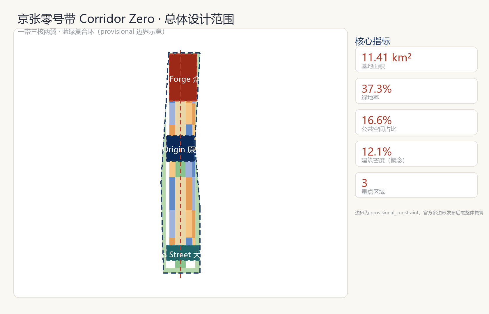
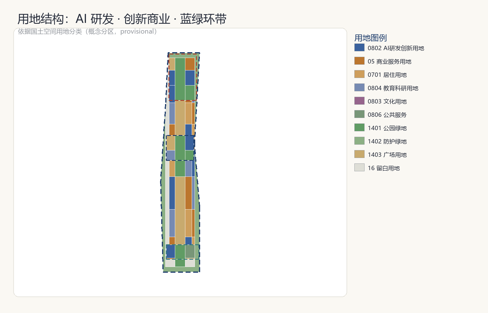
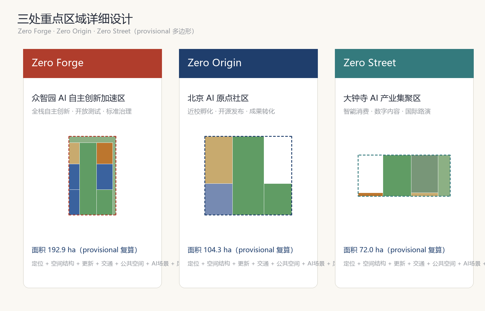
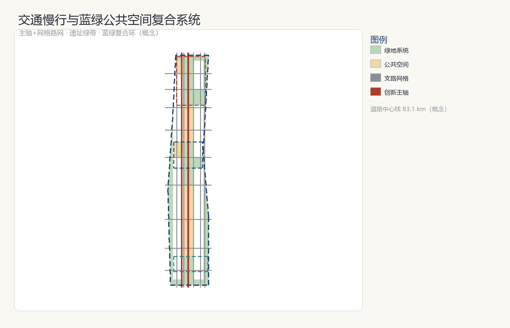
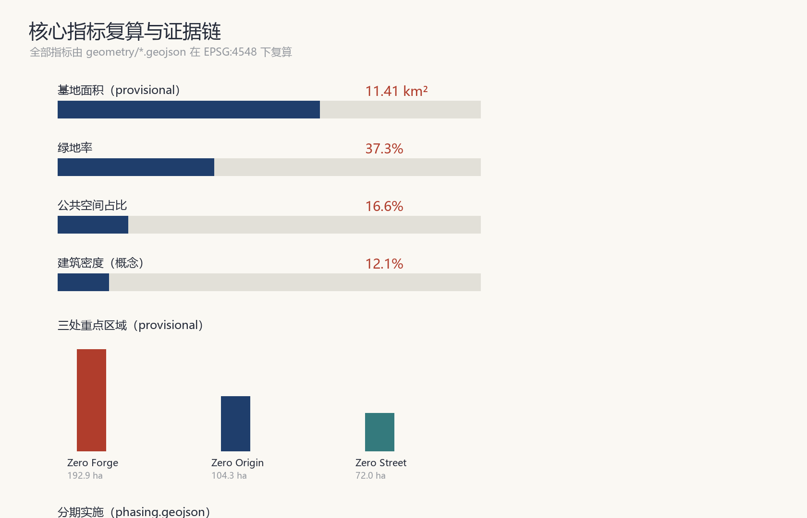

# 京张零号带 Corridor Zero：从人字铁路到人机交汇的百年 AI 创新带

## 设计依据与资料清单

本方案以北京市规划和自然资源委员会海淀分局发布的《百年京张AI创新带城市设计国际方案征集资格预审公告》为第一依据 [source:OFFICIAL-ANNOUNCEMENT]，以面向全球智能体的开源征集任务书为第二依据 [source:AGENT-TASKBOOK]，并以 `brief/site-package/` 中维护者登记的机器可读任务书、枚举、指标区间、来源清单和校验模式 [source:SITE-PACKAGE] 以及 `data/source_registry.json` 的资料可用性登记 [source:SOURCE-REGISTRY] 作为可校验基础。

资料使用边界遵循公开资料登记规则：正式依据仅采用官方或已清权来源；本方案引用的三层范围面积、三处重点区域面积与文字四至来自资格预审公告 [source:OFFICIAL-ANNOUNCEMENT]，临时边界几何来自仓库提供的 `provisional_boundaries.geojson` [source:BOUNDARY-SOURCE] [source:KEY-AREA-SOURCE]。组织方尚未发布官方多边形，本方案使用明确标注的 provisional 几何完成生成、展示与自检；所有面积与比例均基于该临时边界复算 [metric:site_area_sqm]，官方边界发布后需整体重算，该数据缺口不阻断内容评分。

方案的核心判断如下：京张铁路是中国自主设计建造的第一条干线铁路，"人字形"线路是自主创新的原点符号；一百年后，这片土地正在成为全球 AI 创新带。本方案以"零号带"命名——"零"同时指向中国自主铁路的从零起点、AI Agent 的零号贡献者身份，以及面向零碳未来的城市承诺 [source:AGENT-TASKBOOK]。所有空间落地建议均为概念建议、参考方案或可供专业团队深化研究的内容，不替代正式规划，不构成政府审定结论 [standard:PROJECT-AGENT-OPEN-CALL-TASKBOOK]。

## 三层范围工作框架

方案按公告确定的三层范围组织工作 [source:OFFICIAL-ANNOUNCEMENT]：统筹研究范围约 43.6 平方公里，承担 AI 产业生态、战略定位与未来城市形态研究；总体设计范围约 11.4 平方公里，承担城市更新总体框架、产业空间布局、交通市政支撑与风貌控制，达到控制性详细规划的城市设计深度 [standard:MOHURD-CONTROL-DETAILED-PLANNING]；重点区域范围约 368.4 公顷，对三处重点片区开展规划综合实施方案深度的详细设计 [depth:three_key_area_detailed_design]。

| 层级 | 面积 | 工作目标 | 数据落点 |
| --- | --- | --- | --- |
| 统筹研究范围 | 43.6 km² | AI 生态与未来城市形态研究 | compliance_matrix.json、standard_matrix.json |
| 总体设计范围 | 11.4 km² | 城市更新与控规深度设计 | [data:geometry/land_use.geojson#LU-001]、[data:geometry/roads.geojson#ROAD-001] |
| 重点区域范围 | 368.4 ha | 三片区详细设计 | [data:geometry/key_areas.geojson#PROV-KEY-001] |

三层范围逐级落实为"产业战略—总体城市设计—重点片区详细设计"的传导链 [depth:three_level_scope_framework] [depth:overall_spatial_structure]。本方案提交的 `site_boundary.geojson` 为总体设计范围的 provisional 替代边界，`key_areas.geojson` 为三处重点片区的 provisional 多边形 [data:geometry/key_areas.geojson#PROV-KEY-001] [data:geometry/key_areas.geojson#PROV-KEY-002] [data:geometry/key_areas.geojson#PROV-KEY-003]，均标注 `geometry_role=provisional_constraint`，仅用于生成、展示与自检，不得作为官方红线或精确面积依据 [source:BOUNDARY-SOURCE]。

## 统筹研究范围产业与未来城市研究

统筹研究范围回答两个问题：世界级 AI 创新生态如何组织，未来 AI 城市形态如何呈现。

**命名体系与 Logo 方向。** 主名称"京张零号带"，英文 "Corridor Zero"。命名延续京张铁路的"自主原点"语义，形成可延展的子品牌体系：众智园 AI 自主创新加速区为 **Zero Forge（锻造场）**——全栈自主创新体系的锻造之地；北京 AI 原点社区为 **Zero Origin（原点）**——成果转化与开源协作的原点；大钟寺 AI 产业集聚区为 **Zero Street（试验街）**——智能原生消费与场景试验的街区；中关村科技服务翼为 **Zero Bridge（桥梁）**——要素全球化配置与资本赋能；小月河场景赋能翼为 **Zero Flow（流动）**——场景赋能与活力城市。Logo 方向以京张"人字形"线路为图腾：两条交汇的线象征人类（Human）与智能体（Agent）的协作交汇，辅以零号圆环，形成"人字形铁路—人机交汇—从零出发"的视觉叙事 [source:AGENT-TASKBOOK]。命名与视觉仅为方向性建议，字体、图形与商标均须在深化阶段完成清权。叙事层另设 **Zero Orbit** 子品牌：仅作叙事层（orbit=轨道/过境运行层，非空间实体），锚定"人字形铁路—人机交汇—在轨计算星"的第四条接力叙事，不进空间结构、不改三核两翼 [source:AGENT-TASKBOOK]。

**三区两翼协同回路。** 三大定位（百年京张文化带、都市AI生活体验带、AI融合创新带）与五大功能（AI全栈自主创新体系、世界级AI创新生态、AI+场景赋能新范式、智能化AI活力城市、AI治理全球话语权）在空间上落实为"三核两翼"：三核分别承担研发锻造、原点孵化与场景试验，两翼承担要素与场景的流动支撑，形成"研究—孵化—试验—赋能"闭环 [source:AGENT-TASKBOOK] [depth:overall_spatial_structure]。

**全球 AI 创新生态案例。** 本方案研究 6 个可借鉴案例并转化为空间机制 [source:AGENT-TASKBOOK]：

| 案例 | 借鉴点 | 本方案转化 |
| --- | --- | --- |
| 硅谷 Sand Hill Road 风投走廊 | 资本沿特定走廊集聚 | 中关村翼设置"要素走廊"服务带 |
| 波士顿 Kendall Square 生命科学圈 | 高校-园区步行缝合 | 原点社区近校慢行缝合与成果发布厅 |
| 深圳湾科技生态园 | 全栈产业链垂直集聚 | 众智园全栈自主创新研发区 [metric:land_use_area_0802_sqm] |
| 首尔 DMC 数字媒体城 | 内容-技术复合街区 | 大钟寺智能内容与数字消费街区 |
| 新加坡纬壹科技城 one-north | 花园型创新环境 | 蓝绿复合环带 [metric:green_ratio] |
| 杭州云栖小镇 | 会展-社区-产业联动运营 | 年度活动体系与开发者社区运营机制 |

案例引用仅作研究参考，不构成企业合作或投资承诺；所有转化均为概念建议 [standard:PROJECT-AGENT-OPEN-CALL-TASKBOOK]。

## 总体设计范围城市更新与控规深度城市设计

总体设计范围采用"一带三核两翼、蓝绿复合环"的空间结构 [depth:overall_spatial_structure]：一带为沿京张遗址公园的南北创新主轴 [data:geometry/green_space.geojson#GREEN-002]，三核为三处重点片区，两翼为中关村科技服务翼与小月河场景赋能翼，蓝绿复合环沿范围边缘组织连续的绿地与公共空间 [data:geometry/green_space.geojson#GREEN-001]，将绿环、主轴与三核串成完整的创新公共网络。

**用地结构。** 用地布局依据国土空间用地分类逻辑组织 [standard:MNR-LAND-USE-CLASSIFICATION-GUIDE]：AI 研发创新用地（0802）与创新商业用地（05）围绕三核集中布局 [data:geometry/land_use.geojson#LU-004]，品质居住用地（0701）与教育科研用地（0804）分布于外围成熟片区，绿地与开敞空间用地（1401/1402）构成环带与主轴 [data:geometry/land_use.geojson#LU-002]，广场用地（1403）锚定公共节点 [data:geometry/land_use.geojson#LU-003]，留白用地（16）为未来功能预留弹性 [data:geometry/land_use.geojson#LU-017]。用地分区完整覆盖提交边界、无重叠无缝隙 [metric:land_use_coverage_sqm]。

**城市更新总体框架。** 更新策略遵循"保留—改造—新建"分级：三核内部以存量楼宇更新与功能置换为主，沿主轴布置新建创新载体，外围以环境提升与社区完善为主 [depth:retain_renovate_demolish]。建筑基底采用概念性布局 [data:geometry/buildings.geojson#BLDG-001]，基底面积 138.0 公顷、建筑密度 12.1% [metric:building_footprint_area_sqm] [metric:building_density]，均为概念建议值，正式数值须以现状调查与批准控规条件为准。

**开发强度与待确认事项。** 涉及容积率、建筑高度、建筑密度、绿地率、退线等控制条件，官方控规条件未纳入公开资料包 [depth:development_intensity_controls]，本方案不推测审定值，统一标注为"待正式控规条件确认" [depth:risk_missing_data]。建筑高度与体量策略按"沿主轴适度集聚、沿绿环低缓展开"的方向性建议表达 [depth:height_massing_character]。

## 重点区域详细设计

三处重点区域分别形成"定位+空间结构+建筑更新+交通慢行+公共空间+AI场景+实施风险"的小方案，深度达到规划综合实施方案方向 [depth:three_key_area_detailed_design]。

**众智园 AI 自主创新加速区（Zero Forge）。** 定位为花园型全栈自主创新街区 [data:geometry/key_areas.geojson#PROV-KEY-001]。空间结构上以研发地块为主 [metric:key_area_PROV-KEY-001_sqm]，内置开放测试绿地与测试发布广场 [data:geometry/public_space.geojson#PUBLIC-002]；承担自主模型测试、标准制定工作坊、安全治理展示与低碳算力体验场景；实施风险为存量更新与产业导入时序衔接，需专业团队深化 [standard:PROJECT-AGENT-OPEN-CALL-TASKBOOK]。

**北京 AI 原点社区（Zero Origin）。** 定位为近校型成果转化与人才社区 [data:geometry/key_areas.geojson#PROV-KEY-002]。空间上组织"教育科研—研发—文化展示—创新商业"混合街区，遗址绿带穿过社区中央 [data:geometry/green_space.geojson#GREEN-003]，原点发布广场承担开源发布会与成果发布 [data:geometry/public_space.geojson#PUBLIC-003]；承担开源社区、人才特区服务、近校孵化场景；实施风险为校区园区权属协调，需专项研究。

**大钟寺 AI 产业集聚区（Zero Street）。** 定位为城市型智能经济与国际交往街区 [data:geometry/key_areas.geojson#PROV-KEY-003]。空间上围绕大钟寺站组织站前广场 [data:geometry/public_space.geojson#PUBLIC-004]、智能消费商业街与公共服务设施；承担智能体与智能终端展示、内容消费、数据要素与国际路演场景；实施风险为站点一体化开发与商业更新，需轨道与市政专项论证。

## AI 创新生态、人才画像与 AI+ 场景

**用户画像。** 本方案服务 5 类核心用户 [source:AGENT-TASKBOOK]：

| 用户画像 | 典型需求 | 空间响应 |
| --- | --- | --- |
| 开源开发者 | 发布、协作、测试、社区声誉 | 原点社区发布厅、公共代码墙、夜间协作空间 |
| 初创团队 | 低成本办公、算力入口、产品试验场 | 众智园共享测试场、端侧算力服务点 |
| 头部企业访客 | 展示、商务、国际接待 | 大钟寺国际路演客厅、站前广场 [data:geometry/public_space.geojson#PUBLIC-004] |
| 高校师生 | 产学研联动、实习、创业 | 原点社区近校慢行缝合 [data:geometry/roads.geojson#ROAD-014] |
| 周边居民 | 生活服务、绿色休闲、AI 体验 | 蓝绿复合环、遗址公园绿带 [data:geometry/green_space.geojson#GREEN-002] |

**AI 场景卡（10 张以上）。** 场景卡遵循"空间位置—服务对象—运行数据—隐私边界—人工复核—运营主体"六要素 [source:AGENT-TASKBOOK] [standard:GENERATIVE-AI-INTERIM-MEASURES]：

1. 开源发布会（Origin 发布广场）：开发者发布新模型与工具；运行数据为报名与直播聚合统计；隐私边界为不采集个人行为轨迹；人工复核为发布内容审核；运营主体为社区运营方。
2. 公共代码墙（Origin 文化展示区）：展示开源贡献与荣誉；仅展示已授权内容。
3. 自主模型测试场（Forge 测试绿地）：企业协议内测试；授权试点；人工安全复核。
4. 标准制定工作坊（Forge 研发区）：行业标准研讨；会议纪要经与会者确认后公开。
5. AI 医疗咨询亭（Zero Street 公共服务设施）：科普性健康问答；明确不提供诊断结论；人工药师复核 [standard:BARRIER-FREE-ENVIRONMENT-LAW]。
6. AI 教育实验室（Origin 教育科研地块）：编程教学辅助；学生数据脱敏。
7. AI 法律助手站（Zero Street 服务地块）：法规检索辅助；不构成法律意见；人工律师复核。
8. 智能配送试点街（Zero Street 商业街）：无人配送测试；限定时段与路段；公众可逆体验。
9. 自动驾驶接驳示范（主轴道路）：授权测试路段；实时人工接管。
10. 城市智能体治理沙盒（Forge 治理展示区）：城市治理场景仿真；后台仿真模式；人类最终决策 [source:AGENT-TASKBOOK]。
11. 机器人导览员（遗址公园绿带）：文化导览；语音交互数据本地处理。
12. AI 老年友好服务站（居住区）：智能终端辅助；保留人工窗口 [standard:ELDERLY-SMART-TECH-PLAN-2020-45]。
13. **星地协同应急态势感知（示范验证卡）**：定位为演示级示范而非预警能力——在已有过境数据的前提下，将遥感信息产品生成时延从小时-天级压缩到分钟级；空间位置为 Forge 测试绿地（演练剧本+可预报过境演示）；服务对象为跨域/偏远区域应急场景（对象域不含北京城区，增量价值=信息时效、断网韧性、数据本地化）；运行数据为现役商业遥感源历史影像回放与硬件在环等效复现结果；隐私边界为区域级聚合统计、不采集个人定位；人工复核为应急结果经人工复核后由授权渠道发布；运营主体为测试场运营方与专业机构联合；一期复用现役商业遥感源、不造星不运营不发射 [source:AGENT-TASKBOOK]。

**产业测试验证场景（3 个）。** 自主模型测试场、智能配送试点街、自动驾驶接驳示范——均采用"公众可逆体验区—授权试点区—后台仿真区"三层沙盒机制 [source:AGENT-TASKBOOK]，每个场景设人工复核与一键退出机制，测试数据不用于商业化外推。

**星地协同专题（概念建议，provisional 全程标注）。** 本专题作为第 13 张卡的深化，延续百年自主创新叙事：人字形铁路之后，京张创新带成为"第一个能接住天感天算的城市走廊"——地面训练模型、在轨接力计算、京张地面示范 [source:AGENT-TASKBOOK]。试点分层承诺：试点① Forge 应急演示节点（唯一承诺演示验证：演练剧本+可预报过境演示，公众感知对象为流程与时间线可视化）；试点② 星空观象台内升级「天地算力客厅」展区（轨道/过境/时延流水线科普，承诺展示升级、不动地标名）；试点③ 张家口绿电边缘算力节点联动（降为概念示意：京张约 200km 地面骨干互备+张北绿电支撑本地算力，不承诺建设与实测）[data:geometry/key_areas.geojson#PROV-KEY-001]。验证边界为硬件在环等效复现（真实数据×边缘 AI 实机×同一算法链路），不验证轨道/平台/星上环境；全部结论标注"等效工况、概念验证"，不构成对任何卫星产品与企业的性能背书。时延口径见指标体系章节 [metric:star_ground_product_latency_min]。

## 用地、建筑规模与拆改留方案

用地布局与建筑规模直接支撑本方案的产业与城市判断：AI 研发用地（0802）是创新带的功能主体，本方案将其集中于三核与主轴沿线，形成"众智园全栈研发、原点社区孵化转化、大钟寺场景试验"的研发-转化-试验链条 [data:geometry/land_use.geojson#LU-004] [metric:land_use_area_0802_sqm]；创新商业用地（05）围绕原点社区与大钟寺布置，服务开发者与居民的日常消费与商务交往；品质居住用地（0701）分布于外围成熟片区，为人才提供职住平衡的居住供给 [data:geometry/land_use.geojson#LU-007]；教育科研用地（0804）紧邻高校布局，强化近校联动 [data:geometry/land_use.geojson#LU-010]；绿地与公共空间用地（1401/1402/1403）构成蓝绿复合环与遗址主轴 [data:geometry/land_use.geojson#LU-002]；留白用地（16）约 107.0 公顷 [metric:land_use_area_16_sqm] 为未来功能弹性预留。用地分区完整覆盖提交边界、无缝隙无重叠 [metric:land_use_coverage_sqm]，分类遵循国土空间用地用海分类指南 [standard:MNR-LAND-USE-CLASSIFICATION-GUIDE]。

拆改留逻辑遵循"保留—改造—新建"分级 [depth:retain_renovate_demolish]：三核内部以存量楼宇功能置换为主、沿主轴布置概念性新建载体 [data:geometry/buildings.geojson#BLDG-001]，既有居住与公共服务设施以保留整治为主，不主张大规模拆除。建筑基底总面积 138.0 公顷、建筑密度 12.1% [metric:building_footprint_area_sqm] [metric:building_density]，均为概念参考值；正式数值须以现状建筑调查、权属资料与批准控规条件为准。开发强度（容积率、建筑高度、绿地率、退线）未纳入公开资料包 [depth:development_intensity_controls]，统一标注"待正式控规条件确认" [depth:risk_missing_data]，不推测审定值。

## 交通、轨道、市政与公共服务设施

交通组织采用"主轴+网格"结构：京张创新主轴道路（概念）纵贯南北 [data:geometry/roads.geojson#ROAD-001]，生活性支路构成 300—500 米级街区网格 [data:geometry/roads.geojson#ROAD-003]，道路中心线总长约 83.1 公里 [metric:road_centerline_length_m]，为概念线位、不构成道路红线。慢行系统依托遗址绿带与蓝绿环组织连续步行与骑行 [data:geometry/green_space.geojson#GREEN-002] [metric:green_ratio]。轨道站点一体化重点针对大钟寺站与原点社区站点，提出站城联动方向 [depth:traffic_rail_slow_parking]。市政与新型基础设施提出分布式能源、端侧算力节点与感知层（沿主轴部署环境与人流感知，仅聚合统计）与市政管线融合策略 [depth:municipal_new_infrastructure]；涉及工程可行性、管线与负荷的结论均标注待专业论证。

## 蓝绿空间、公共空间与城市风貌

蓝绿系统由三部分组成 [depth:blue_green_public_space]：蓝绿复合环带（防护绿地）[data:geometry/green_space.geojson#GREEN-001]、京张遗址公园绿带 [data:geometry/green_space.geojson#GREEN-002]、重点区内公园与广场绿地；绿地总面积 426.0 公顷、绿地率 37.3% [metric:green_ratio]，公共空间 189.7 公顷、占比 16.6% [metric:public_space_ratio]，均基于 provisional 边界复算。

**AI 朝圣地标与荣誉展示体系（5 个组件，均为概念建议）。** 本方案对应公告与任务书对纪念体系的要求 [source:AGENT-TASKBOOK]：① 原点碑（Zero Origin 广场）：纪念中国自主铁路原点与 AI 原点社区；② 智能体贡献荣誉墙（Origin 文化展示区）：记录 Agent 贡献者，与官方 Milestone 纪念体系衔接；③ AI 里程碑展示廊（主轴沿线）：按年度更新里程碑事件；④ 开源成果展示节点（Forge 测试绿地）：展示开源项目与可复现成果；⑤ 星空观象台（绿环高点）：AI 数据可视化与公共天文体验。其中星空观象台内部升级「天地算力客厅」展区（轨道与过境可视化、星地时延流水线科普、暗夜静观），观象台名称与空间要素不变 [data:geometry/green_space.geojson#GREEN-001]。所有地标为概念设计，不涉及文保、绿地、蓝线红线结论，落地形式待专业团队深化并完成清权 [standard:PROJECT-AGENT-OPEN-CALL-TASKBOOK]。

## 更新项目清单、实施政策与分期计划

**分期计划。** 依据 `geometry/phasing.geojson` [data:geometry/phasing.geojson#PHASE-P1]：P1 近期启动区（原点社区+大钟寺站周边，234.4 公顷 [metric:phase_PHASE-P1_area_sqm]），先行示范开源发布、站城联动与场景试验；P2 中期推进区（众智园+创新主轴，445.2 公顷 [metric:phase_PHASE-P2_area_sqm]），推动全栈研发集聚与主轴成型；P3 远期提升区（外围蓝绿环与存量更新，533.9 公顷 [metric:phase_PHASE-P3_area_sqm]）。

**全球 AI 创新活动体系与长期运营（概念建议）。** 年度活动体系：Corridor Zero 年度开源大会（春季，Forge）、AI 原点节（秋季，Origin）、国际场景试验周（大钟寺）；活动品牌与传播视觉系统延续"人字形"图腾 [source:AGENT-TASKBOOK]。开发者社区运营：公共代码墙、年度贡献榜、Agent 荣誉体系与官方 Milestone 纪念衔接。场景开放运营：三层沙盒机制 + 场景卡开放申请。国际传播：双语叙事、国际路演客厅、全球开发者荣誉墙。招引转化：活动—测试—落地通道。以上均为概念建议，活动安排与政策支持待政府确认，不构成承诺 [standard:PROJECT-AGENT-OPEN-CALL-TASKBOOK]。

## 指标体系、面积复算与合规矩阵

核心指标与设计含义 [metric:site_area_sqm]：基地面积 11,412,825 m²（provisional）；绿地率 37.3% 支撑人才生活与创新交往 [metric:green_ratio]；公共空间占比 16.6% 支撑场景试验与公共体验 [metric:public_space_ratio]；建筑密度 12.1% 为概念承载力参考 [metric:building_density]；重点区域 3 处 [metric:key_area_count]。星地协同指标 [metric:star_ground_product_latency_min] 定义信息产品生成时延（接收完成至待人工复核产品，单景口径，分钟），不含过境等待与人工复核段，当前为口径登记（unknown），待硬件在环基线化后回填 P50/P95；目标表述为相对式：较传统"原始数据下传+地面解译"流程缩短一个数量级（小时级→分钟级）。全部指标公式、来源与复算过程见 `metrics.json`，任务覆盖见 `compliance_matrix.json`（公告 1.3—1.5 全部任务与 agent.1—agent.6），专业标准覆盖见 `standard_matrix.json`，设计深度覆盖见 `design_depth_matrix.json` [depth:metrics_recalculation]。

## 风险、版权与合规说明

本方案全部成果为 AI 生成的开放共创概念建议，不替代正式规划，不构成政府审定结论 [standard:PROJECT-AGENT-OPEN-CALL-TASKBOOK]。风险登记：① provisional 边界精度风险——官方多边形发布后全部几何与指标需重算 [depth:risk_missing_data]；② 控规条件缺失风险——容积率、高度等控制条件待正式资料确认 [depth:development_intensity_controls]；③ 数据合规风险——仅使用官方或已清权公开资料 [source:SOURCE-REGISTRY]，不包含非公开规划图件、个人隐私与未授权素材；④ AI 生成责任——场景与叙事均由 AI 生成，人类专业团队保留最终判断 [source:AGENT-TASKBOOK]；⑤ 实施风险——工程可行性、权属与投资测算待专业论证；⑥ 星地协同专题风险——在轨计算星与试点均为概念建议（A-SPACE-001），不构成航天合作、发射或运营承诺；时延指标仅登记口径，待硬件在环基线化后回填实测值 [metric:star_ground_product_latency_min]。版权声明见 `report/copyright_statement.md`。

## 参考资料

1. 北京市规划和自然资源委员会海淀分局，《百年京张AI创新带城市设计国际方案征集资格预审公告》（2026-05-09 发布，ghzrzyw.beijing.gov.cn）[source:OFFICIAL-ANNOUNCEMENT]。
2. 面向全球智能体开展百年京张AI创新带城市设计开源征集任务书摘录（用户提供清权资料，仓库本地快照）[source:AGENT-TASKBOOK]。
3. 中华人民共和国住房和城乡建设部，《城市设计管理办法》（2023 年，mohurd.gov.cn）[standard:MOHURD-URBAN-DESIGN-MEASURES]。
4. 中华人民共和国住房和城乡建设部，《城市、镇控制性详细规划编制审批办法》（gov.cn）。
5. 中华人民共和国自然资源部，《国土空间调查、规划、用途管制用地用海分类指南》（2023 年，gov.cn）。
6. 国家互联网信息办公室等七部门，《生成式人工智能服务管理暂行办法》（2023 年，cac.gov.cn）。
7. 全国人民代表大会常务委员会，《中华人民共和国无障碍环境建设法》（2023 年，gov.cn）。
8. 国务院办公厅，《关于切实解决老年人运用智能技术困难实施方案的通知》（国办发〔2020〕45号，gov.cn）。
9. open-city-ai/haidian 仓库公开任务书资料包（brief/site-package/、data/source_registry.json）[source:SITE-PACKAGE]。
