# Jing-Zhang PROBE

"PROBE" does not treat the city as a technology test site. It gives every spatial action an interface through which questions can be asked: who benefits in everyday life, who bears construction, noise, access, or business costs, and who funds, rectifies, and submits acceptance evidence under which trigger conditions. The proposal uses the "Everyday Commons Belt" as its spatial spine, organizing the heritage park, community interfaces, academic and research exchange, walking and cycling connections, and convenience services into public infrastructure that remains usable even when intelligent systems are offline. AI only helps identify problems, record evidence, and review closure; it does not replace planning approval, professional judgment, or human decisions.

## Design Basis and Source List

### Grade the evidence before starting the design

This proposal uses four evidence tiers: statutory and official bases, repository-registered material, proposal-generated geometry, and outstanding professional data. The Open Call scope, tasks, and deliverable requirements come from the announcement[source:OFFICIAL-ANNOUNCEMENT], while the agent's working boundaries come from the taskbook[source:AGENT-TASKBOOK]. Responses at planning depth map respectively to the Open Call announcement, urban-design, regulatory-planning, and land-use-classification requirements[standard:PROJECT-OFFICIAL-ANNOUNCEMENT][standard:PROJECT-AGENT-OPEN-CALL-TASKBOOK][standard:MOHURD-URBAN-DESIGN-MEASURES]. `brief/site-package/` is the machine-readable entry point[source:SITE-PACKAGE], `data/source_registry.json` determines whether material may enter formal judgments[source:SOURCE-REGISTRY], and the processed fact pack serves only as navigation and creates no new authority[source:PROCESSED-FACT-PACK].

The currently readable spatial boundary is provisional rough substitute geometry, not an Official Planning Boundary[source:BOUNDARY-SOURCE]. Therefore, "within the area," "along the belt," and "district" in this narrative are design indices based on the current submitted geometry; they do not constitute conclusions on land rights, road boundaries, existing uses, or approvals[data:geometry/site_boundary.geojson#SITE-001]. The three key areas likewise serve only for positioning and proposal organization. Their announced nominal areas and the recalculated values of the rough polygons must be stored separately[source:KEY-AREA-SOURCE]. This evidence hierarchy applies throughout land use, buildings, transport, blue-green systems, phasing, and metrics; it cannot be waived locally by a single disclaimer.

The existing-conditions diagnosis states only what the current evidence supports[depth:existing_conditions_diagnosis]:

| Diagnostic object | What can currently be said | What cannot currently be said | How to verify after data arrive |
|---|---|---|---|
| Scope | A provisional polygon can establish a shared design index | It cannot be called an Official Planning Boundary or a precise parcel boundary | Receive rights-cleared official CAD/GIS/PDF, transform coordinates, then produce a version-difference drawing and full recalculation |
| Key areas | Design tasks can be organized using the announced names and nominal areas[source:OFFICIAL-ANNOUNCEMENT] | Rough rectangular edges cannot be interpreted as roads, parcels, or property boundaries | Replace them with official key-area boundaries and check every proposal element for overrun, gaps, and overlaps |
| Land and buildings | The package's conceptual land uses and modular footprints can be read | They cannot determine existing use, retention, renovation, demolition, floor count, or ownership | Overlay existing-conditions survey, building-safety, ownership, heritage, and regulatory-plan data, with professional sign-off building by building |
| Transport and municipal infrastructure | A walking and cycling spine and connection directions to be surveyed can be expressed | They cannot determine road boundaries, station entrances, parking capacity, utilities, or fire-safety conclusions | Review after introducing traffic surveys, station entrances, road boundaries, underground utilities, and municipal-capacity data |
| Community interfaces | OSM residential land-use edges can be used as field-check leads | They cannot imply household counts, tenancy relations, vulnerability, losses, or responsibility | Calculate from authorized housing and population data, field interviews, and a professionally confirmed impact area |

OpenStreetMap is used only for low-confidence urban context and field-check leads[source:OSM-CONTEXT]. It does not enter boundary, area, ratio, planning-boundary, distance, or control conclusions; no metric number derived from OSM geometry may enter this proposal. Residential-interface leads in the constraints file still require field verification[data:geometry/constraints.geojson#OSM-RES-594891968]. This both limits what the "PROBE" can observe and avoids rewriting an omission in a crowdsourced map as an absence in reality.

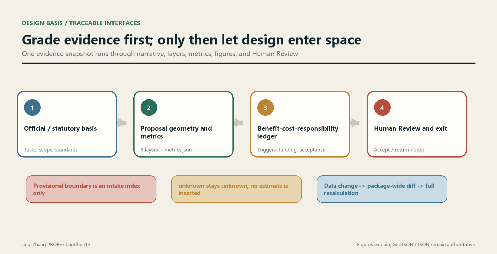

The typical-section drawing presents design questions only: railway states use separate symbols for removed alignment, at-grade operation, viaduct, and underground projection; the right-side interface strategy is not an existing-conditions survey and carries no formal dimensions. Uses on both sides are leads pending verification and cannot identify beneficiaries of additional employment[source:OSM-CONTEXT].

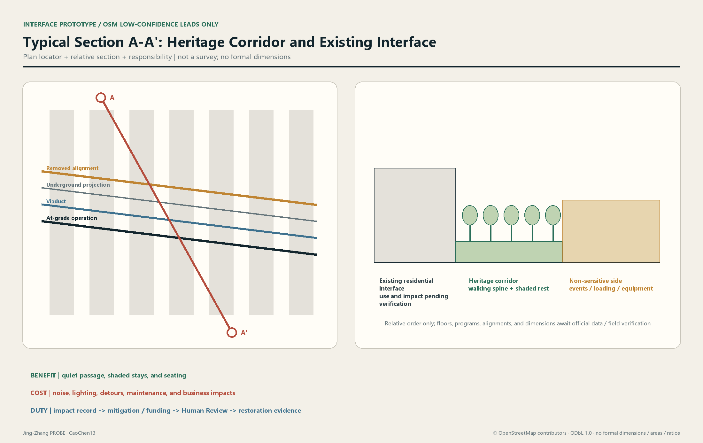

Data updates invalidate the entire package rather than replacing an isolated part. A change to any version of the official boundary, key areas, regulatory plan, or existing-conditions survey requires rerunning geometry, metrics, figures, and ledgers, while retaining the previous hash, difference summary, reviewer, and effective time. Reviewers then see one evidence snapshot, rather than a certainty illusion assembled from data of different dates.

## Three-Level Scope Framework

The three scope levels address different questions. They cannot share one denominator, and research judgments cannot be directly downscaled into parcel controls. The Coordinated Research Area establishes only relationships among industry, talent, culture, and urban services. The Overall Design Area carries the spatial structure, renewal strategy, public systems, and implementation ledger. The Key-Area Detailed Design Area tests whether the same method can reach space, operations, and responsibility chains under different interface conditions. Scope names and tasks come from the announcement[source:OFFICIAL-ANNOUNCEMENT], while working boundaries and agent tasks come from the taskbook[source:AGENT-TASKBOOK].[depth:three_level_scope_framework]

| Working level | Core question | Proposal output | Boundary not crossed |
|---|---|---|---|
| Coordinated research | How can innovation resources and everyday urban life benefit each other? | Innovation chain, public-service chain, scenario-access rules, and cross-area collaboration issues | No formal areas, project boundaries, or regulatory-plan metrics are generated |
| Overall design | How can the commons belt stitch heritage, communities, academic research, and transport together? | Spatial framework, conceptual land use, building modules, walking and cycling network, blue-green nodes, and implementation ledger | Current geometry is only a conceptual index and does not replace existing conditions or statutory controls |
| Key areas | How can different places deliver everyday benefit while constraining costs? | Area-specific actions, interface types, scenario packages, project gates, and responsibility closure | Nominal areas and provisional boundaries remain separate; precise capacity is not derived from rough boundaries |

The overall structure is summarized as "Everyday Commons Belt - Interface Stitching Lines - Area Co-Benefit Nodes"[depth:overall_spatial_structure]. The commons belt is not a single landscape axis: it simultaneously accommodates continuous walking and cycling, shaded stays, basic convenience services, cultural memory, academic and research exchange, and removable technology trials. Interface stitching lines connect communities, stations, and innovation spaces on both sides to the main belt. Area co-benefit nodes convert enterprise services or event flows into spaces and resources usable in surrounding everyday life. The roads layer expresses directions, the public-space layer expresses accessible areas, and the green-space layer expresses the ecological and thermal-comfort framework; none can substitute for another[data:geometry/roads.geojson#ROAD-001][data:geometry/public_space.geojson#PUBLIC-001][data:geometry/green_space.geojson#GREEN-001].

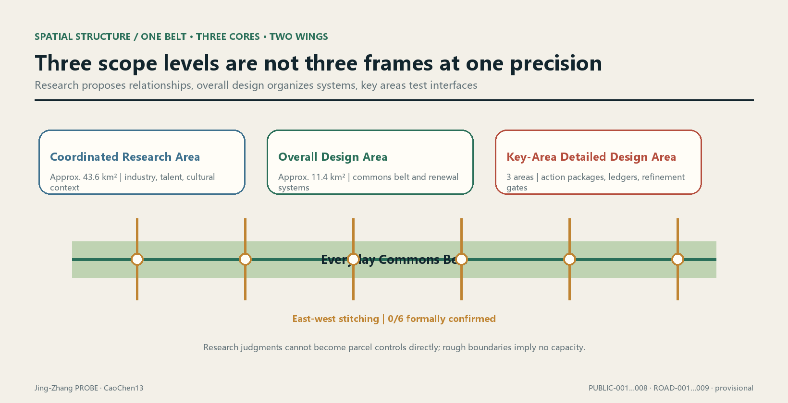

The three levels transmit through the same benefit-cost-responsibility ledger, not through geometry of the same precision. The coordinated level proposes benefit hypotheses and public-value boundaries; the overall level binds each hypothesis to an intervention unit, geometry version, and evidence cutoff; the key areas complete impact interfaces, mitigation actions, funding sources, and acceptance evidence. If lower-level data are inadequate, an upper-level vision cannot automatically become an implementable conclusion.

Each intervention unit forms an unambiguous recalculation key from `intervention_id + geometry_version + evidence_cutoff`. The benefit side records object definitions, eligibility rules, accessibility evidence, and use evidence. The cost side records the professionally confirmed impact area, impact type, duration conditions, action quantities, and reviewed unit costs. The responsibility side records trigger conditions, proposed duty holder, funder, reviewer, due condition, acceptance evidence, and status. Fields are frozen before data enter, preventing criteria from being redefined after the fact to beautify results.

## Naming, Visual Identity, and the Overall Structure of Three Zones and Two Wings (agent.1)

Everything in this section is an **Open Co-Creation Conceptual Recommendation**. It does not mean a name has been adopted, an identity has been registered, or a spatial structure has been approved. The naming and overall structure respond to the taskbook's three positionings, five functions, and Three Zones and Two Wings[source:AGENT-TASKBOOK][standard:PROJECT-AGENT-OPEN-CALL-TASKBOOK]. Spatial locations cite only the current provisional proposal index and imply no road boundary, building height, Floor Area Ratio, or engineering conclusion[data:geometry/site_boundary.geojson#SITE-001][depth:agent_1_identity_and_structure].

### One parent name and four extensible name classes

The parent name is **Jing-Zhang PROBE**. "PROBE" refers to a method that raises questions, leaves evidence, accepts review, and permits correction; it does not treat the city or its residents as passive experimental subjects. The name does not copy a city, campus, or company brand. The English form is consistently `Jing-Zhang PROBE`, with `PROBE` as the short mark. The following subnames are used only when the corresponding content exists, avoiding the creation of brands for outputs that do not yet exist:

| Level | Chinese / English | Applied to | Naming discipline |
|---|---|---|---|
| Parent brand | Jing-Zhang PROBE | Overall Belt method and submission package | Expresses only "observe - verify - correct" and does not claim area-wide sensing |
| Spatial system | PROBE Commons | Everyday Commons Belt, nodes, and cross-connections | `Commons` is used only where basic public use genuinely takes priority |
| Scenario system | PROBE Test Window | Gated scenario cards and test windows | Before approval it must appear alongside "Conceptual Recommendation / approval unknown" |
| Operating system | PROBE Relay | Events, developer collaboration, and conversion pathway | Proposed events are not presented as a confirmed schedule |

### Logo and visual-identity direction

The logo direction is a self-drawn "**open P + sleeper graduations + Human Review point**": the opening means conclusions can be revised, three short graduations recall Jing-Zhang engineering memory, and the solid dot represents final human judgment. It may not directly use existing railway, government, company, or Open Call marks, nor unlicensed fonts, photographs, people, or trademarks. The wordmark should preferentially use a verifiably licensed open-source grotesk or a system sans-serif. Before formal communication it must complete font-license review, similarity trademark search, small-size recognition testing, and monochrome print testing[source:AGENT-TASKBOOK].

The visual system retains one principal palette only: deep rail blue `#172235`, evidence gold `#C79838`, commons green `#15803D`, and paper white. Status colors are always paired with text and shape and never rely on a red-green distinction alone. Motion is limited to a three-step reveal of "problem appears - evidence is completed - human sign-off," with a static alternative. Cultural wayfinding has a separate symbol system described under agent.5 and cannot be mixed with the parent-brand logo.

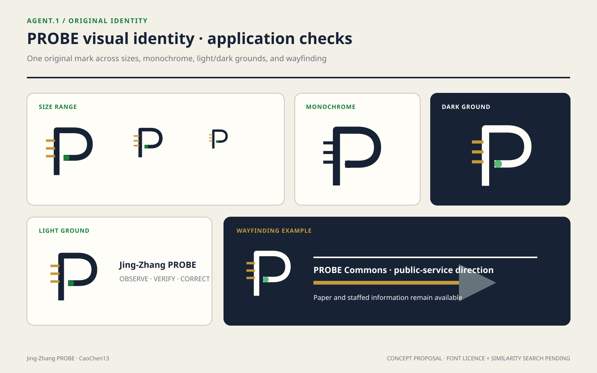

### Three positionings x five functions

| Three positionings | Corresponding function | Spatial delivery in this proposal | Acceptance question |
|---|---|---|---|
| Centennial Jing-Zhang Cultural Belt | Global discourse power in AI governance | Connect heritage narrative through engineering evidence, version records, and public explanation | Have historical facts, copyright, and approval been reviewed? |
| Metropolitan AI Life Experience Belt | New paradigm of AI-enabled scenarios; intelligent, vibrant AI city | Carry low-risk, removable scenarios on an Everyday Commons Belt that remains usable offline | Do basic access and services remain valid after technology is disabled? |
| AI-Integrated Innovation Belt | Full-Stack Independent AI Innovation System; world-class AI Innovation Ecosystem | Connect the Three Zones and Two Wings through a problem-engineering-evaluation-governance-delivery loop | Does the work leave transferable deliverables rather than a one-off display? |

### Overall spatial-structure diagram: one belt, three cores, two wings, and one evidence loop

The following is a **collaboration diagram, not a geographic-orientation or engineering-alignment drawing**:

`Zhongguancun Technology Services Wing <-> Zhongzhiyuan Full-Stack Core <-> AI Origin Community Co-Creation Core <-> Dazhongsi AI-Native Experience Core <-> Xiaoyue River Scenario Enablement Wing`

`                              ↖-- PROBE Commons (public experience) + Co-Benefit Ledger (evidence feedback) --↙`

The three zones form a structural index for professional refinement through the current seven conceptual public nodes and one commons belt[metric:key_area_count][data:geometry/public_space.geojson#PUBLIC-001]. The two wings provide factor services and scenario feedback and are not drawn as new land. The collaboration loop operates as follows: the services wing provides professional factors; Zhongzhiyuan builds engineering and governance capacity; the Origin Community organizes research, talent, and community co-creation; Dazhongsi verifies public explanation and AI-Native services; the scenario wing returns real-use problems; and the co-benefit ledger decides whether to continue, modify, or stop. Company rosters, funding, computing power, talent scale, and implementing bodies at every link all currently have `status: unknown`; they require rights-cleared rosters, effective agreements, and capacity and service records before values can be entered[metric:ecosystem_partner_count][metric:compute_capacity].

## Coordinated Research Area: Industry and Future City Research

### From "industrial agglomeration" to "urban reciprocity"

The announcement requires research into the AI industrial ecosystem, innovation chain, talent, and future urban form[source:OFFICIAL-ANNOUNCEMENT]. This proposal does not equate company counts or event intensity directly with public value. It asks whether industrial resources can translate into services usable in everyday life. When enterprise testing requires real scenarios, it should simultaneously provide publicly usable spatial improvements, accessibility information, community services, or maintenance resources. When large launches and visitor flows enter the commons belt, congestion, noise, cleaning, security, and small-business impacts should be recorded, with mitigation responsibility written into the ledger. All industrial scale, talent density, event participation, and employment outcomes retain `status: unknown` in the absence of a credible baseline. Required inputs are rights-cleared enterprise rosters, an employment definition, talent surveys, event logs, and a spatial-use baseline.

The coordinated level creates a collaboration loop of "origination - translation - demonstration - everyday feedback," not a closed-campus chain. Universities and research institutions may propose open topics, enterprises and service institutions undertake translation, the commons belt provides approved low-risk validation interfaces, and residents, commuters, and visitors respond through explicit participation rules. Any data involving personal behavior are minimized by default. Questions answerable through manual inspection, anonymous counting, or periodic sampling do not trigger continuous individual tracking. The agent only organizes evidence, marks conflicts, and generates lists for review; final judgments are made by professional teams and affected groups.[standard:PROJECT-AGENT-OPEN-CALL-TASKBOOK]

The future-city spatial prototype is "technology can withdraw; publicness cannot." When navigation displays, sensors, or service agents go offline, walking routes, shade, seating, wayfinding, convenience services, and accessible connections must remain functional. Algorithm updates may not alter a person's basic right of passage. Technology trials use removable, replaceable, auditable interfaces. They begin with maintenance, environmental, and facility-state questions that do not involve bodily or sensitive data, and expand only after independent review.

### The reciprocity contract at the coordinated level

Before entering a commons-belt scenario, each participating institution submits a one-page machine-readable contract: what public resources it provides, whom it expects to serve, what costs it may shift and to whom, who funds mitigation, how it stops, how data are deleted, and who confirms closure. The contract corresponds to spatial objects and the project ledger; it cannot remain only a list of partner organizations. If benefit evidence proves only institutional exposure and not public use, the project may still be discussed as an industrial activity but cannot count as public benefit.

The "Jing-Zhang PROBE" brand follows the same discipline. It represents an observable, reviewable, correctable working method and does not claim that the city has been comprehensively sensed. Cultural narrative juxtaposes railway heritage and innovation culture, but specific heritage objects, protection areas, signs, and image authorizations must be confirmed by formal data. Until then, only the narrative structure is provided, without false control lines.[standard:MOHURD-URBAN-DESIGN-MEASURES]

## Global AI Innovation Ecosystem and Industry-Space Mapping (agent.2)

### Five public cases: transfer mechanisms, not conclusions

The case table selects five public cases verifiable on operator or institutional websites, `[metric:ecosystem_case_count]=5`. It uses no company valuations, investment amounts, output values, or uncorroborated scale figures. Each case proves only that a mechanism has been publicly used elsewhere; it **does not prove that the mechanism fits this site, nor that any local partnership exists**[depth:agent_2_global_cases][standard:PROJECT-AGENT-OPEN-CALL-TASKBOOK].

| Case | Official-site fact that can be verified | Transferable mechanism | Boundary that cannot be extrapolated |
|---|---|---|---|
| AI Singapore · 100 Experiments (Singapore) | The official site organizes the program around assessment and scoping, implementation, and handover, and assigns engineers and apprentices to real problems[source:CASE-AISG-100E] | Problem definition precedes development; handover documents and capability transfer are completion conditions | Do not transfer its funding, duration, eligibility, or outcome figures; local funding and participants are unknown |
| Mila industry partnership ecosystem (Montreal) | The official site publishes applied/fundamental research partnerships, talent connections, collaborative workspaces, and training activities[source:CASE-MILA-PARTNERSHIPS] | Make research, talent, enterprise problems, and shared space a multi-entry service | Do not map partner counts or organization lists into local investment-promotion commitments |
| Vector Institute (Toronto) | The official site places research and talent, trusted-AI adoption, engineering support, and cross-sector collaboration in parallel[source:CASE-VECTOR-INSTITUTE] | A research institution also provides adoption support and a responsible-implementation interface | Its research space is not a public tourist facility; it cannot justify requiring local laboratories to open |
| STATION F · F/ai (Paris) | Its 2026 official site organizes early-stage AI founders, technology, research, computing-power chains, and investment specialists within one program[source:CASE-STATIONF-FAI] | A curated program reduces access friction among multiple resource types | Do not copy company lists, selection mechanisms, revenue targets, or self-claims such as "largest" |
| TUM Venture Labs (Munich) | Its official site connects university research and entrepreneurship centers as a domain-specific incubation network spanning ideas through early-stage venture support[source:CASE-TUM-VENTURE-LABS] | Shared foundations and domain laboratories coexist to serve different technology-readiness levels | Do not extrapolate incubation-multiplier goals, capital arrangements, or local institutional conditions |

### Ecosystem map: problems enter, evidence is delivered

This proposal decomposes a world-class ecosystem into six verifiable layers instead of a wall of company logos:

`Public/industrial problem -> research and talent -> data/computing/tools foundation -> engineering and testing -> safety/ethics/standards evaluation -> scenario delivery and public feedback`

Each layer must produce something transferable to the next: the problem layer delivers a brief with benefit and risk boundaries; the research layer delivers reproducible methods; the foundation layer delivers permissions, costs, energy use, and service windows; the engineering layer delivers versions and test records; the governance layer delivers Human Review and stop conditions; and the scenario layer delivers use, impact, and responsibility evidence. If any handover item is absent, the project remains `evidence_pending`; event exposure cannot substitute for conversion[standard:PROJECT-AGENT-OPEN-CALL-TASKBOOK][metric:approved_scenario_count].

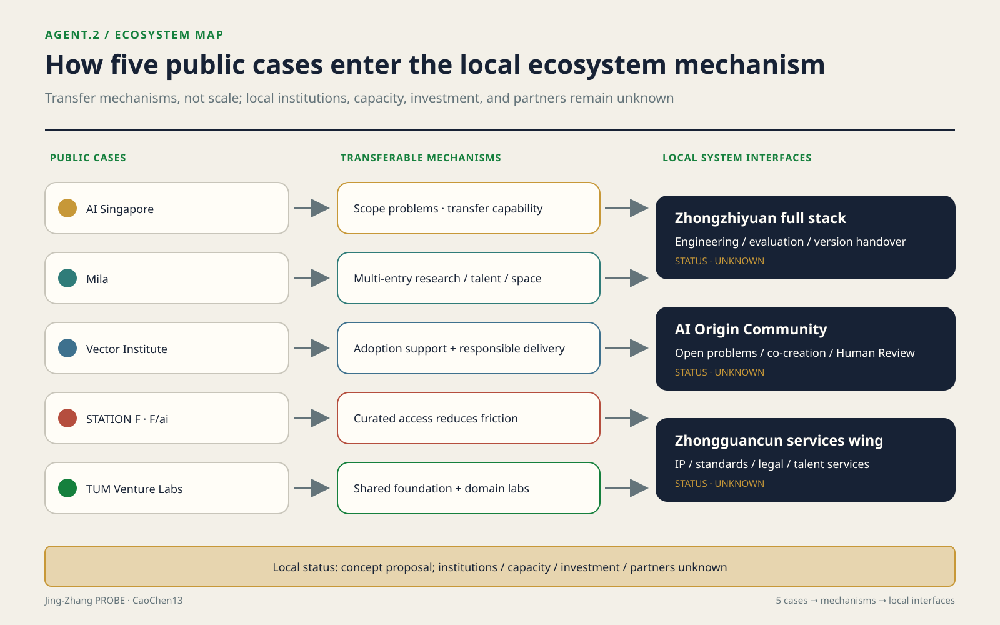

### Zhongzhiyuan full stack, AI Origin Community, and Zhongguancun Technology Services Wing

| System | Conceptual role | Spatial carrier | Entry conditions | Current status |
|---|---|---|---|---|
| Zhongzhiyuan full-stack independent system | Problem scoping, engineering implementation, evaluation governance, and version handover | Zhongzhiyuan open innovation lounge and controlled indoor testing interface[data:geometry/key_areas.geojson#PROV-KEY-001] | Sign-off on ownership, safety, data, computing, and operational responsibility | Conceptual Recommendation; institutions, capacity, and investment all unknown |
| AI Origin Community innovation ecosystem | Researchers, students, developers, residents, and service providers jointly propose and review problems | Near-campus shared street, commons-belt nodes, and permitted collaboration spaces[data:geometry/key_areas.geojson#PROV-KEY-002] | Voluntary participation, public issues, accessibility, and privacy review | Conceptual Recommendation; participation scale and open venues unknown |
| Zhongguancun Technology Services Wing | Professional-service entry for intellectual property, standards, legal services, talent, and capital connections | Online service desk plus confirmed existing service points, with no presumption of new construction | Rights-cleared service organizations and disclosure of scope, fees, and responsibility | Conceptual Recommendation; partner roster, funding, and effects unknown |

### Industry-space-factor mapping

| Factor | Proposal mechanism | Corresponding space | Data that must be completed |
|---|---|---|---|
| Land | Verify only rights and access conditions; make no land-supply commitment | Indices of the three provisional areas | Official boundaries, ownership, planning conditions, and approval status |
| Space | Relocatable workstations, shared evaluation tables, and public-explanation interfaces | Zhongzhiyuan controlled interface, Origin Community co-creation point, and Dazhongsi public hall | Fire safety, accessibility, access agreements, capacity, and operations |
| Industry | Organize collaboration around public problems and deliverables, without listing companies first | Division among three cores plus the services wing | Rights-cleared company roster, needs, and proof of capability |
| Funding | Record only who bears costs, funding status, and exit conditions | Co-benefit ledger, not mapped into building volume | Funding source, amount, validity period, audit, and approval |
| Talent | Capability chain of topic-apprentice-engineering-handover | Between the Origin Community and Zhongzhiyuan | Voluntary applications, eligibility definitions, mentors, and position records |
| Computing | Provider-neutral booking, quota, energy-use, and revocation rules | Controlled indoor/remote services, with no default collection on the commons belt | Shared capacity unit, service level, costs, energy use, and security audit `[metric:compute_capacity]` |
| Data | Tier synthetic/public/authorized data, minimize permissions, and delete on expiry | Data room and audit terminal | Data inventory, rights basis, field dictionary, and retention period |
| Scenarios | Small, removable test windows with Human Review | Xiaoyue River Scenario Enablement Wing and public-experience route | Site, operations, safety, privacy, accessibility, and stop approvals |

This mapping produces no investment-promotion roster. `[metric:ecosystem_partner_count]` retains `status: unknown` and requires a collaboration ledger containing all four items: "publicly disclosable identity + signed role + effective term + disclosure permission." `[metric:compute_capacity]` is likewise unknown and requires a provider-neutral capacity unit, time window, allocation rule, costs, and energy-use records. The five cases calibrate only the language of mechanisms; they do not fill these local unknowns.

### Regional-coordination interfaces: connect only to public mechanisms, not prewritten outcomes

This proposal has no actual cross-district coordination data; it offers only interfaces and validation conditions. The public consultation notice for Zhongguancun AI Latitude Community supports one limited fact: its draft intended a north-south response with AI Origin Community[source:AI-LATITUDE-PUBLIC-DRAFT]. This proposal therefore recommends only compatible `problem_brief`, eligibility-state, license, version, exit, and handover fields at the two ends. Any shared operator, project, computing capacity, funding, company, or movement of people remains `unknown` and requires effective agreements from both sides plus handover records from the same observation window.

Haidian's Fourteenth Five-Year Plan stated intentions to explore co-building an innovation-ecosystem chain with Future Science City, explore access to major scientific facilities with Huairou Science City, and strengthen innovation-chain and industrial-chain links with Beijing Economic-Technological Development Area[source:HAIDIAN-14FIVE-COORDINATION]. This proposal does not recast planning language as completed coordination. It retains only three machine interfaces: deliver rights-bounded problem briefs and reusable evaluation artifacts toward Future Science City; submit capability requests, eligibility, booking, approval, use, and return evidence toward Huairou Science City; and submit version, testing, compliance, handover, and exit materials toward the development area. Specific institutions, facility availability, projects, funding, companies, metrics, and service windows all remain `unknown` and require item-by-item confirmation by authorized participants.

At the Jing-Jin-Ji level, a decision of the Standing Committee of the Beijing Municipal People's Congress publishes mechanisms including supply-demand matching lists, proof of concept, result incubation, pilot-scale bases, and application scenarios[source:JINGJINJI-COLLABORATIVE-INNOVATION]. Measures led by the three science-and-technology authorities in 2025 further described regular result matching, proof-of-concept services, pilot-scale maturation, and cross-regional service chains[source:JINGJINJI-TRANSFER-MEASURES]. This proposal can output a compatible "problem-rights-version-test-impact-responsibility-exit" handover package, but it does not claim that the project has entered any list, platform, or program. Counterparties, eligibility, result rights, receiving location, funding, contracts, performance, and regional contribution all remain `unknown`; an "interface recommendation" may become a "coordination record" only after effective registration, signatures by both sides, and verifiable handover evidence exist.

## Overall Design Area: Urban Renewal and Regulatory-Plan-Level Urban Design

### Spatial framework: an everyday belt, not an event belt

The overall design translates the direction of Jing-Zhang heritage into a continuous framework for public life. At its center is a commons belt where walking, cycling, and shaded stays run in parallel. On both sides are compatible interfaces for communities, academic research, convenience commerce, and cultural services. Cross-connections are refined segment by segment after road, railway, station, and municipal conditions are confirmed. The existing roads file contains only conceptual centerlines, not road boundaries or engineering alignments[data:geometry/roads.geojson#ROAD-001]. The spatial structure gives priority to frequent everyday uses such as commuting, school drop-off and pickup, rest, exercise, and convenience services. Events, displays, and trials may occupy only removable spatial and temporal units and may not displace basic passage.

The Land-Use Plan uses verifiable `land_use_code` values, but represents design zoning rather than an existing-conditions survey or statutory land use[standard:MNR-LAND-USE-CLASSIFICATION-GUIDE]. The green core of the Everyday Commons Belt, community-service interface, and outer compatible areas together form a layout of "public continuity first, program insertion second"[data:geometry/land_use.geojson#LU-001]. Conceptual zones within the boundary test the proposal's internal consistency. When official existing land use, parcels, ownership, and regulatory-plan data arrive, a difference table of "retain, conflict, gap, overrun" must be generated for each face. A conceptual zone cannot simply be renamed as a planning deliverable.[depth:land_use_layout]

North and south gateways, community rest, cultural display, everyday market, academic exchange, and youth-service nodes are arranged along the commons belt. Nodes are not independent landmarks. They combine water, toilets, rest, shade, accessibility, repair, convenience commerce, or small collaboration spaces into service units that can be operated sustainably. Modular footprints are recorded in the buildings file and all are marked as low-confidence Conceptual Recommendations[data:geometry/buildings.geojson#BLDG-001]. They may later be placed in confirmed vacant buildings, adaptable ground floors, or compliant new-build locations; current geometry cannot determine demolition or construction.

### Regulatory-plan depth: make what cannot be determined into review gates

This proposal divides regulatory-plan content into "proposal quantities currently recalculable," "control quantities determinable after formal data arrive," and "implementation quantities that must not currently be inferred"[standard:MOHURD-CONTROL-DETAILED-PLANNING]. Currently recalculable quantities are the area of submitted geometry, union ratios, and conceptual footprints. Floor Area Ratio, Building Height, Building Coverage Ratio, statutory green ratio, setbacks, road boundaries, and facility capacities are all unknown. Development Intensity is expressed through a capacity-checking process rather than replaced by a target number: lock the approved boundary and parcels; import lawful gross floor area and retained quantities; check transport, municipal infrastructure, fire safety, sunlight, heritage, and public services; calculate parcel and overall intensity; and finally let professional approval conclusions decide.[depth:development_intensity_controls]

Height and massing follow the principles of "reduce pressure on the commons-belt side, preserve ventilation and sightlines at nodes, reduce abrupt interfaces toward existing communities, and prevent technology landmarks from overwhelming the heritage narrative"[depth:height_massing_character]. These are criteria for later professional simulations, not height values. Before any massing enters proposal comparison, it must be bound to approved height conditions, existing-condition surveys, sunlight review, and fire-safety review. If one item is missing, it can remain only as a massing option and cannot enter capacity or compliance conclusions.[standard:MOHURD-ARCH-DESIGN-DEPTH-2016]

### Three data worlds, three spatial alternatives

When the official boundary, regulatory plan, and existing-conditions survey have not yet been supplied, one master plan cannot be frozen as the sole answer; but the proposal also cannot leave only a list of unknowns. It converts the undisclosed data into three ordered choice gates: whether the boundary can contain a continuous framework, whether approved capacity permits net additional construction, and whether confirmed residential and business impacts have funding and closure conditions. `[metric:floor_area_ratio]` and `[metric:affected_household_count]` remain unknown[source:SITE-PACKAGE]. The following are not good-medium-poor tiers; they are different spatial organizations of the same public objective in three data worlds. Their location anchors all come from the current provisional Overall Design Area[data:geometry/site_boundary.geojson#SITE-001].

**Continuous Framework Conservation Alternative - sensitive to the official boundary and crossing conditions.** Spatially, it retains three north-south walking and cycling lines (the commons-belt spine, a cycling line, and an accessible walking line), with six east-west connections returning interfaces on both sides to the spine. Seven public nodes and shaded pockets are distributed along the route. Quiet passage and everyday services are placed first on the residential side, while events, loading, and equipment retreat to the non-residential side. Additional massing is studied only in compatible outer-wing areas, keeping the commons-belt side low-pressure and permeable[data:geometry/roads.geojson#ROAD-001][data:geometry/public_space.geojson#PUBLIC-001]. It assumes that the official boundary fully contains `PUBLIC-001…008` and that all six connections `ROAD-004…009` can form lawful and safe public crossings after formal road-boundary, ownership, and engineering review. The numerical Floor Area Ratio range does not decide the framework choice. The **selection condition** is that the containment relationship holds and all six crossings pass. Failure of any one eliminates the entire "fully continuous" claim and transfers consideration to the other two alternatives. Reversal after a wrong choice would require cancelling failed connections and rearranging nodes; paving and blue-green works could enter R2 below, while bridges, tunnels, underground utilities, or permanent buildings would enter R3. Before conditions are confirmed, only markings, movable furniture, and operational testing are permitted. If selected, `ROAD-001…009`, `PUBLIC-001…008`, and `GREEN-001…008` remain as the framework for refinement, while `BLDG-001…014` and `PHASE-002/003` are relocated according to approved capacity and engineering conditions, not directly constructed.

**Existing-Interface Mending Alternative - sensitive to statutory capacity and adaptable existing stock.** Space changes from a "continuous wide belt" to a bead-like network of "usable ground floor - courtyard - entrance lobby - wayfinding path." Service nodes enter buildings that can lawfully remain after structural, fire-safety, and ownership verification. Confirmed public rights of passage, street corners, and the direction of the heritage corridor connect the nodes. The spine remains only a wayfinding framework; every segment need not expand into new Public Space. The intensity position is **zero net additional gross floor area**. First define `ΔGFA = approved buildable gross floor area − verified lawful retained gross floor area`; this alternative assumes `ΔGFA ≤ 0`. A second judgment was previously written as "existing stock is sufficient for the needs list," which was indeterminate. It is now replaced by a recalculable rule:

- **Existing-capacity test** `S = Σ(usable ground-floor area of buildings that may remain after structural/fire-safety/ownership verification) − Σ(area requirements of public-service nodes)`. It passes when **`S ≥ 0`**. Both sides are currently `unknown`: the former requires an existing-stock survey and legality-verification results; the latter requires a service-needs list and per-node area standard.
- **New-build priority test** `R_新增 = new publicly accessible area / new gross floor area`, `R_存量 = additional publicly accessible area after renovation / renovated gross floor area`. Only when **`R_新增 > R_存量`** is "approved new construction better satisfies the public objective" established. Both ratios are currently `unknown` and require approved capacity and a verified existing-stock list.

The **selection condition** is that `ΔGFA ≤ 0` and `S ≥ 0` both hold. If `S < 0`, or if `ΔGFA > 0` and `R_新增 > R_存量`, this alternative is eliminated. All three quantities can be inserted on the day data arrive, and the decision does not depend on a reviewer's subjective weighting - **the definitions are fixed here and may not later be adjusted to keep this alternative alive.** Its costs concentrate in interior adaptation, accessible entrances, and use agreements and are managed as R2 below. Partitions, furniture, and wayfinding can be reversed; structural strengthening, long leases, and use approvals cannot be pretended reversible. If selected, `BLDG-001…014` lose their meaning as "placed footprints" and retain only relocatable functional templates; `PUBLIC-002…008` move to verified existing entrances; and the area-based preset for the `LU-002` community-service interface becomes a building-by-building agreement list[data:geometry/buildings.geojson#BLDG-001][data:geometry/land_use.geojson#LU-002].

**Neighborhood-Avoidance Loop Alternative - sensitive to affected households and business impacts.** Spatially, it retains commons-belt segments that do not touch confirmed impact interfaces and removes markets, displays, and nighttime activities from the residential side. Cross-connections no longer seek to open all six lines; each is selected according to "zero unmitigated impact." Alignments that cannot close are replaced by recognizable detours, time-shared access, or internal institutional passages. No additional building volume is introduced at the interface. The quiet side retains only passage, shade, lighting, and convenience rest, while equipment, loading, and gathering functions move to a confirmed non-sensitive side. It assumes that `[metric:affected_household_count] ≥ 1` at one proposed interface and that `[metric:mitigation_budget_cny]` at that interface remains unknown, funding is not effective, or due actions have not been accepted. The **selection condition** is that the first condition holds and at least one of the latter two closure gaps exists. When all proposed interfaces affect 0 households, or every non-zero impact has reviewed actions, funding, and acceptance responsibility, this alternative is eliminated and the first two are compared again. Only R1 actions may proceed under this alternative; if misjudged, wayfinding, events, and time rules can be removed. Permanent barriers, excavation, or demolition and construction may not proceed first. If selected, `PHASE-002` pauses, `ROAD-004…009` are removed or detoured one by one according to professionally confirmed impact areas, and `PUBLIC-003…007` move away from unclosed interfaces. A future impact-overlay table determines which elements change; this submission does not modify GeoJSON[data:geometry/phasing.geojson#PHASE-002][data:geometry/constraints.geojson#COST-SCREEN-001].

| Alternative | Boundary sensitivity (determinable gate) | Floor Area Ratio sensitivity (determinable gate) | Cost scale | Reversibility | Early implementability |
|---|---|---|---|---|---|
| Continuous Framework Conservation Alternative | Eliminated if the official boundary does not fully contain `PUBLIC-001…008` or if any of six crossings fails | Framework selection does not depend on the value; buildings are studied only after approved `ΔGFA > 0` | Amount unknown; crossings, utilities, and permanent buildings may touch R3, with quantities and reviewed unit costs missing | Markings/furniture are R1; paving and blue-green works are R2; permanent works cannot be reversed as R1 | Verification and removable passage tests may proceed; physical continuity works require all six crossings to pass the gate |
| Existing-Interface Mending Alternative | Requires only that each existing point and access route lie within confirmed rights; any point may move, with no commitment to enclosing the whole belt | Selected when `ΔGFA ≤ 0` and adaptable existing stock is sufficient; eliminated if either condition fails | Amount unknown; quantities for interior adaptation, accessibility, and agreement-related works are missing and screened as R2 | Furniture/wayfinding are R1; MEP, strengthening, and long-term use rights are not fully reversible | Existing-stock inventory may proceed; trials require fire-safety, ownership, and access-agreement sign-off |
| Neighborhood-Avoidance Loop Alternative | Detours segment by segment using confirmed public rights of passage; without a continuous lawful alternative the segment is unknown and cannot be drawn as connected | Net addition at the impact interface is fixed at 0 and is not amplified as compensation through FAR | Amount unknown; only R1 is allowed before closure, with affected objects, action quantities, and funding agreements missing | Only removable wayfinding, schedules, and event units are enabled; permanent works are barred by the gate | Temporary detours confirmed for ownership and safety may proceed; no interface construction may proceed |

The matrix also exposes the proposal's quantitative weakness. Six cross-connections appear in the current drawing, but **0/6** have formal confirmation of road boundaries, ownership, and engineering feasibility[source:SITE-PACKAGE][data:geometry/roads.geojson#ROAD-004]. The "continuous framework" therefore looks most complete in the drawing, yet is the alternative most likely to be eliminated first by official data. That 0/6 cannot be hidden by the attractive network drawn from nine lines.

### Benefit-cost-responsibility as a master-plan filter

Every spatial action first answers three questions. Benefit: does it improve public passage, everyday stays, access to services, or resource sharing between communities and academic research, and by what anonymous and reviewable means is evidence obtained? Cost: on which interface do construction, detour, noise, business, maintenance, energy, privacy, or spatial-exclusion costs fall, and is there a professionally confirmed impact area? Responsibility: what threshold triggers action, who proposes it, who funds it, who reviews it, and what evidence closes it? Actions that have not answered all three may remain in the alternative library but cannot enter early projects.

The screening belt `COST-SCREEN-001` is a proposal-generated analytical envelope, not an existing impact area or regulatory control line[data:geometry/constraints.geojson#COST-SCREEN-001]. It only flags that interventions within the belt must check adjacent interfaces. Formal impact areas must still be determined by professional methods for transport, acoustics, construction organization, commercial, and social impacts. "Cost" thereby becomes a design filter rather than an attitude statement attached after the fact.

For recalculation by population and the people it does not cover, see "Public Interest, Population Attribution, and Inclusion"; this material is not maintained twice here.

## Detailed Design of Key Areas

The names, tasks, and announced nominal areas of the three key areas come from the Open Call announcement[source:OFFICIAL-ANNOUNCEMENT]. Their current boundaries are all provisional rough locators[source:KEY-AREA-SOURCE]. Detailed design therefore uses "spatial action package + interface ledger + refinement gate" and does not derive parcel capacity from rectangular boundaries.[depth:three_key_area_detailed_design]

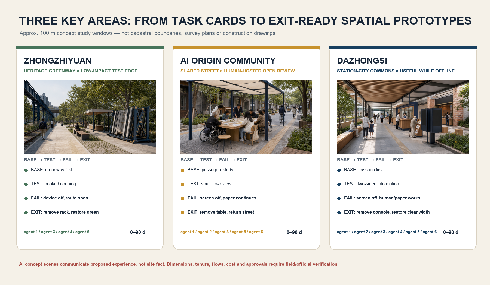

### Three spatial prototypes: approximately 100 m concept study windows

The three prototype sheets below translate the existing tasks into a visible chain of spatial sequence, reversible kit, four operating states, and a 0–90 day validation package. The approximately 100 m label is an observation scale for design study, not a surveyed radius, cadastral boundary, or engineering site plan. Official boundaries, dimensions, tenure, flows, cost, approvals, and delivery bodies remain `unknown`. The AI-generated scenes communicate proposed experience only; they are not site photographs or evidence of existing conditions. See the structured [key-area-prototypes.json](visual/assets/key-area-prototypes.json).

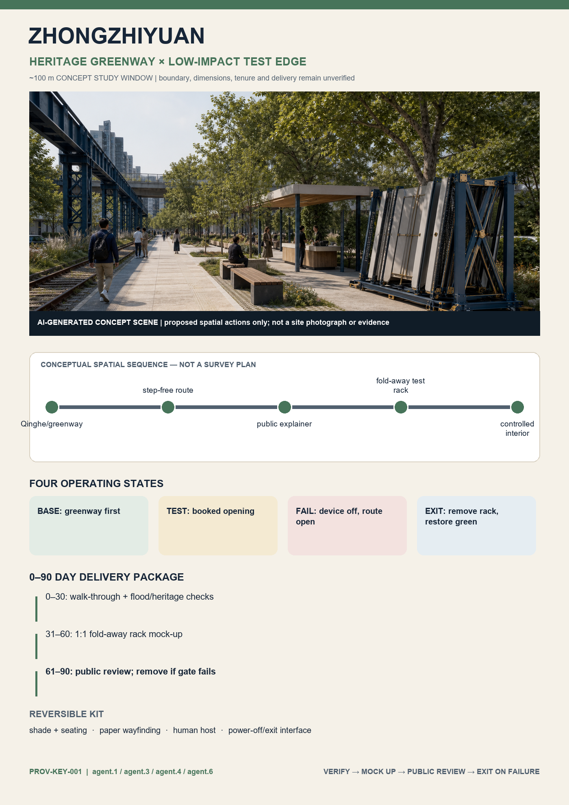

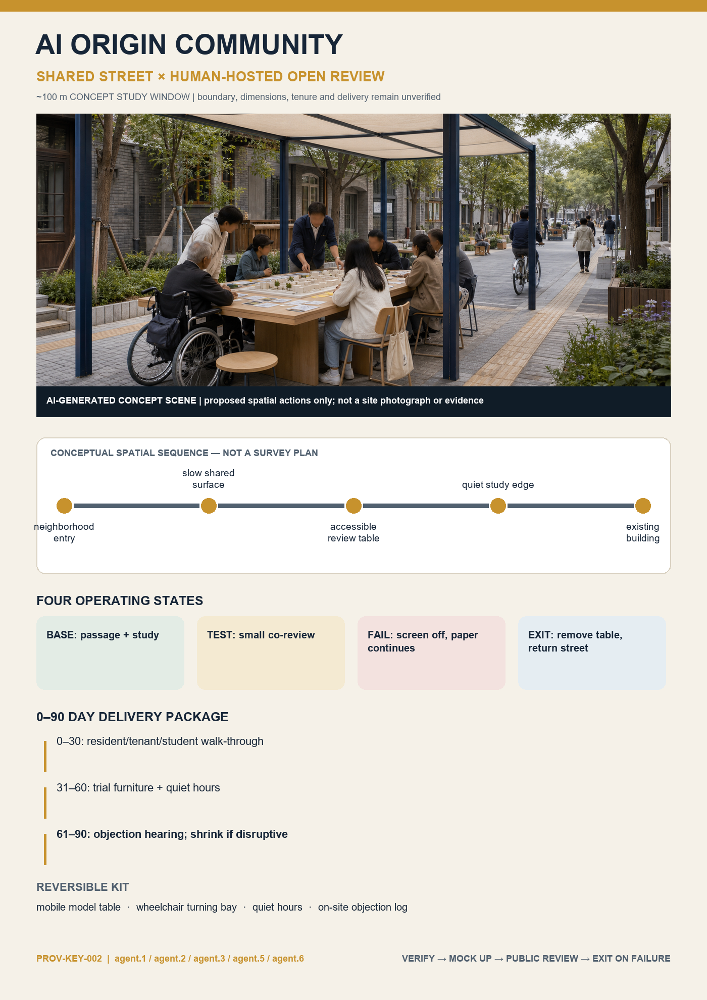

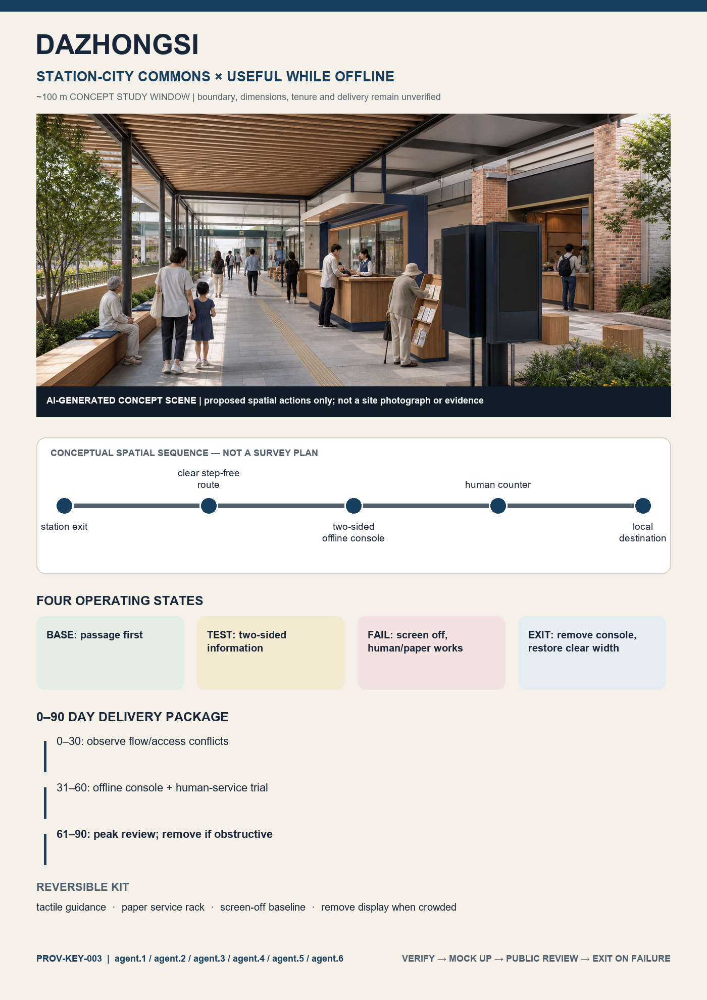

All three prototypes follow `BASE → TEST → FAIL → EXIT`: everyday public service does not depend on devices; a test opens only when booked, time-limited, and observable; on failure, devices stop while passage and human/paper baselines continue; on exit, temporary components are removed and public space is restored. Days 0–30 are for joint walk-throughs and professional checks, days 31–60 for 1:1 reversible mock-ups only, and days 61–90 for public review. A failed gate triggers reduction or removal instead of turning a pilot automatically into a construction promise.[depth:three_key_area_detailed_design]

The first-screen task loop is: `agent.1` tests the public-value gate; `agent.2` organizes industry-community interfaces; `agent.3` protects public-space and accessibility baselines; `agent.4` specifies reversible components; `agent.5` makes the narrative and wayfinding understandable; and `agent.6` manages operation, shutdown, and conversion. The six tasks are not distributed evenly by default. Dazhongsi tests the complete six-task interface, while the other two areas take the combinations required by their actual problems.

### Zhongzhiyuan: Qinghe innovation lounge and low-disturbance testing interface

The proposal anchor in Zhongzhiyuan is an open innovation lounge facing Qinghe River and the commons belt[data:geometry/key_areas.geojson#PROV-KEY-001]. Reservable results explanation, standards collaboration, low-carbon facility display, and everyday rest are placed near the public interface; high-noise, high-security, or dedicated-data testing retreats to controlled interiors. External transport first undergoes transfer, walking, and cycling conflict surveys before alignment decisions. The Qinghe interface first checks flood, ecological, blue-line, and maintenance conditions before facilities are decided. While the campus gains display and collaboration scenarios, it must provide shade, rest, walking and cycling maintenance, or public courses usable by neighbors and record access hours, stop conditions, and maintenance responsibility in the ledger.

Cost-side checks focus on how event flows, nighttime disturbance, delivery, and construction affect neighboring communities and river management. If professional review confirms an impact, the project implementer must attach mitigation actions, reviewed quantities, unit-cost sources, funding status, and acceptance evidence to the same intervention unit. Until then, [metric:mitigation_budget_cny] retains `status: unknown` and requires reviewed action quantities, unit costs, funding agreements, and human approval.

### Beijing AI Origin Community: near-campus shared street and everyday talent services

The Origin Community uses an everyday shared street between campus, innovation park, and community as its framework[data:geometry/key_areas.geojson#PROV-KEY-002]. Results releases, open-source collaboration, intellectual-property services, and enterprise services are embedded in walkable ground floors and existing-space renewal rather than a new closed exhibition hall. Talent services share dining, exercise, childcare consultation, cultural, nighttime-safety, and other basic infrastructure with nearby residents, but specific facility provision must be decided by supply-demand surveys. Campus data, research outputs, and personal identity information do not become authorized automatically through "openness"; every digital service should provide a non-digital alternative.

The area's greatest sensitivity is not whether events exist, but whether an innovation premium shifts everyday costs to tenants, small businesses, or users with weak bargaining power. Current rent, contract, vacancy, business, and household data are absent, so no numerical judgments are made about rent increases, relocation, affected households, or resettlement. [metric:affected_household_count] retains `status: unknown`. Filling it requires authorized housing and household data, a professionally confirmed impact area, and consistent deduplication rules. Once data arrive, calculation follows the fixed formula in this document; it cannot be changed temporarily to count only objects easier to compensate.

### Dazhongsi: station-city public hall and four-way walking connections

The Dazhongsi area organizes station-area visitor flows, industrial display, and everyday community passage into a shared public hall[data:geometry/key_areas.geojson#PROV-KEY-003]. Spatial actions include a continuous and legible ground-level walking interface, removable roadshow and display units, all-hours basic wayfinding, convenience stays, and a walking and cycling connection to the commons belt. Station entrances, road intersections, underground spaces, and utility conditions must be approved from formal data. The current proposal sets only the priority: "ensure passage before arranging events; ensure everyday services before configuring branded display."

Event and commercial benefits cannot be proved only by organizer footfall. The ledger records separate benefit definitions for passers-by, nearby residents, small businesses, enterprise visitors, and operators, and collects use evidence separately. Cleaning, security, noise, detours, loading, and strike-down costs correspond to specific actions and funders. If basic passage or accessibility acceptance fails, display events cannot offset the gap with "overall vitality."

All three areas use the same refinement template: existing evidence and version; Public Space and walking and cycling framework; land-use and building options; beneficiary definitions; impact interfaces; mitigation list; responsibility triggers; project gates; and review records. The template is the same, but the conclusions are not preset to be the same. If evidence shows an area is better suited to light operations than construction, physical intervention may be reduced.

## AI Innovation Ecosystem, Personas, and AI+ Scenarios

### AI-Enabled Scenario cards, task personas, and operating boundaries (agent.3)

Every card below is marked as a **Conceptual Recommendation**, not a survey conclusion, maturity claim, or approved operation. The taskbook requires at least 10 scenario cards, 3 Testing and Validation Scenarios, and 5 user-persona types[source:AGENT-TASKBOOK]. This package registers `[metric:scenario_card_count]=12`, of which `[metric:industry_test_scenario_count]=4`, and uses `[metric:persona_count]=8` task-persona types for needs checks[depth:agent_3_scenarios_personas].

#### Twelve scenario cards

| ID / status | Scenario and type | Principal users | Spatial-operating method | Preconditions for validity | Privacy, Human Review, and stop boundaries |
|---|---|---|---|---|---|
| SC-01 Conceptual Recommendation | Accessible walking and cycling assistant / public service | P-02, P-03 | PROBE Commons and cross-connections; operations desk publishes temporary detours | Surveyed continuous route, accessibility audit, and named update owner | Identifies no person; accepted by users and transport professionals; automatic recommendations stop when data expire |
| SC-02 Conceptual Recommendation | Facility-fault triage / public service | P-01, P-08 | Seven conceptual public nodes; human work-order queue[data:geometry/public_space.geojson#PUBLIC-002] | Facility inventory, response time, maintenance team, and offline repair channel | Records facility events only; model only ranks, and a human must verify work-order closure |
| SC-03 Conceptual Recommendation | Human inspection assistant for shade and rest / public service | P-01, P-03 | Green spine and pocket nodes; seasonal human sampling | Tree, thermal-environment, seating, and time-period baseline | Collects no face/trajectory; returns to a human form when a recommendation cannot be explained |
| SC-04 Conceptual Recommendation | Multilingual public-explanation desk / public experience | P-04, P-07 | Heritage-story points and Dazhongsi public hall; removable terminal plus paper | Historical review, translation review, copyright, and accessible alternative | Stores no voice; an editor confirms high-risk historical/policy answers before publication |
| SC-05 Conceptual Recommendation | Community-service navigation / public service | P-01, P-03 | Origin Community shared street; manually maintained public service directory | Rights-cleared service organizations, access times, eligibility, and correction channel | Infers no health/income; eligibility result is only a lead and is decided by service staff |
| SC-06 Conceptual Recommendation | Low-disturbance event scheduling / scenario operations | P-01, P-06, P-08 | Removable event units; schedule, loading, cleaning, and security ledger | Fire safety, noise, basic passage, community communication, and confirmed responsibility | No individual footfall tracking; any safety/passage gate failure pauses the event |
| SC-07 Conceptual Recommendation | Open-problem collaboration desk / innovation service | P-04, P-05, P-08 | Zhongzhiyuan innovation lounge; public brief-review-handover workflow | Rights basis of the problem, data license, mentor, and delivery owner | Accepts no personal or commercial secrets; Human Review decides entry into development |
| SC-08 Conceptual Recommendation | Synthetic-data interoperability test / **INDUSTRY-TEST** | P-05, P-08 | Zhongzhiyuan controlled indoor sandbox; versioned API test | Synthetic/public data, interface specification, security isolation, and exit plan | Real personal data prohibited; test report is human-signed and cannot go directly live |
| SC-09 Conceptual Recommendation | Edge-device weatherability and maintainability test / **INDUSTRY-TEST** | P-05, P-08 | Removable test rack in the Xiaoyue River Scenario Enablement Wing, location pending verification | Site/electrical/ecological/safety approval, non-collection mode, and operations and removal responsibility | No camera/microphone by default; accepted by professionals; removed if it affects waterfront ecology/passage |
| SC-10 Conceptual Recommendation | Indoor robot replenishment coordination / **INDUSTRY-TEST** | P-05, P-08 | Approved closed indoor route; never enters the public passage plane | Ownership, fire safety, occupational safety, insurance, and emergency stop | Collects no bystander data; safety officer present and one-button stop; cannot support claims of outdoor feasibility |
| SC-11 Conceptual Recommendation | Model red-team and Human Review desk / **INDUSTRY-TEST** | P-04, P-05, P-08 | Controlled evaluation room in Origin Community/Zhongzhiyuan; public test cards | Defined purpose, risk classification, evaluation-data license, appeal and stop process | High-impact output never executes automatically; independent reviewer signs each version conclusion |
| SC-12 Conceptual Recommendation | Voluntary content assistant for small businesses / everyday operations | P-06 | Dazhongsi service point; booked coaching plus removable account | Voluntary enrollment, content copyright, transparent charges, and human-help channel | Does not scrape business data; merchant confirms before publication and identifiable data are deleted on exit |

#### Eight task personas, not personal profiles

| ID | Task persona | Core tasks | Must not be assumed | Participation method and preconditions |
|---|---|---|---|---|
| P-01 | Residents along the belt | Quiet passage, rest, everyday services, and expressing impacts | Do not assume age, ownership, income, or attitude of support | Voluntary interview, public deliberation, and retractable opinion record |
| P-02 | Commuters and school escorts | Fast continuous passage, construction detours, and nighttime legibility | Do not assume a fixed route or device ownership | Fixed-point human observation plus anonymous questionnaire, after transport permission |
| P-03 | People with mobility constraints and accompanying carers | Accessible continuity, seating, ability to seek help, and non-digital alternatives | Do not define people by medical labels | Paid participatory audit and joint acceptance by accessibility organizations and professionals |
| P-04 | University faculty, students, and researchers | Open topics, research exchange, and responsible evaluation | Do not assume school or laboratory participation | Open registration, intellectual-property and ethics review |
| P-05 | Developers and startup teams | Engineering sandbox, computing/data rules, delivery, and entrepreneurship services | Do not invent company lists, financing, or jobs | Application to public problems, with dual technical and governance review |
| P-06 | Small businesses and service operators | Loading, footfall, visibility, business-interruption impact, and voluntary digital service | Do not infer turnover, leases, or digital capability | Entry requires authorization; record business impacts and exit channel |
| P-07 | Visitors and international-exchange participants | Clear wayfinding, cultural understanding, public experience, and low-threshold participation | Do not equate tourist volume with public value | Visible multilingual information, account-free experience, and feedback code |
| P-08 | Site operators and professional reviewers | Safety, maintenance, evidence, work orders, stopping, and handover | Do not assume one body can bear all responsibility | Responsibility matrix, signed logs, rota, and independent spot checks |

#### Scenario-space-operations matrix and Xiaoyue River public-experience route

| Scenario group | Scenario cards | Spatial carrier | Operating closure | Non-digital degradation after failure |
|---|---|---|---|---|
| Continuous passage | SC-01/02/03 | PROBE Commons, cross-connections, and green-spine nodes | Report-human verification-dispatch-acceptance-public status | Paper detour map, human inspection, and on-site service telephone |
| Public explanation | SC-04/05 | Heritage-story points, Origin shared street, and Dazhongsi public hall | Content review-publication-correction-version archive | Human service desk, paper guide, and fixed wayfinding |
| Open collaboration | SC-07/11 | Controlled collaboration spaces in Zhongzhiyuan and Origin Community | Public problem-dual review-sandbox-handover/stop | In-person workshop and human review form |
| Industry validation | SC-08/09/10 | Zhongzhiyuan interior plus removable Xiaoyue River test window | Site approval-risk grading-small test-human acceptance-clearance | Simulation, tabletop exercise, or closed indoor test |
| Everyday operations | SC-06/12 | Removable event units and Dazhongsi service point | Booking-impact registration-on-site owner-restoration acceptance | Human rota, paper notice, and face-to-face coaching |

The Xiaoyue River Scenario Enablement Wing is defined as an "**observe - explain - controlled test - public feedback - exit**" route, not a riverside filled with sensors. Any waterside, ecological, bridge/tunnel, electrical, or passage judgment requires specialist data and approval. Before then, only simulations, indoor demonstrations, or removable demonstrations that collect no personal data are allowed[source:AGENT-TASKBOOK][standard:MOHURD-URBAN-DESIGN-MEASURES].

Scenario design follows "physical service works first, data are minimized, model advice may be refused, results are traceable, and failure can degrade." Intelligent systems cannot directly change right of passage, approval status, compensation eligibility, enforcement, safety permission, or responsibility determinations; any high-impact output creates only a task for review. `[metric:approved_scenario_count]` and `[metric:service_use_ratio]` currently both have `status: unknown`. The former lacks site, operator, safety, privacy, accessibility, and Human Review approvals. The latter lacks rights-cleared aggregate events, service-access records, and a common-time-window object definition. The commons belt's core remains conceptual Public Space[data:geometry/public_space.geojson#PUBLIC-001]; sensing coverage cannot inversely define which places count as public.

## Land Use, Building Scale, and Retain-Renovate-Demolish Strategy

### Conceptual zoning does not masquerade as existing land use

The land-use file organizes conceptual green space, community services, residential compatibility, commercial services, research access, and educational sharing around the Everyday Commons Belt[data:geometry/land_use.geojson#LU-001]. These zones use standard `land_use_code` values[standard:MNR-LAND-USE-CLASSIFICATION-GUIDE], but `existing_condition_status` is explicitly pending official land-use data and field verification. They answer "what relationships does the proposal seek?" and not "what is the land today?" or "what statutory use will it become?"[depth:land_use_layout]

Land-use refinement uses a parcel-by-parcel difference table. Official existing use, statutory planned use, ownership, and occupancy are inputs; conceptual zoning is the comparison layer; outputs may only be "compatible, adjustment required, conflict, data missing." Without official parcels, no parcel area, ratio, or capacity is generated. For conflicts involving commons-belt continuity, compare rights of passage, time-sharing, leases, ground-floor access, and light renovation before land-use adjustment, avoiding demolition and construction as the default.

### Retain-renovate-demolish is an evidence gate, not a color map

Modules in the buildings file are all low-confidence conceptual footprints[data:geometry/buildings.geojson#BLDG-001]. Before a real building enters "retain, repair, adaptive reuse, partial renewal, demolition for discussion," it requires at least an existing-condition survey, structural safety, historical-cultural review, legality and ownership, use and vacancy, fire safety, MEP, carbon, and social-impact data. Classification rules are fixed first:[depth:retain_renovate_demolish]

- If repair, operation, or accessibility improvement can satisfy commons-belt needs, prioritize retention and repair.
- If structure and space can carry new services and the social cost is lower than new construction, enter adaptive-reuse comparison.
- Only when professionals confirm that safe use is impossible, that the building obstructs necessary public-safety works, or that combined evidence supports demolition may it enter demolition for discussion. "Inconsistent image" and "intensity potential" cannot trigger demolition alone.
- Every classification must show evidence sources, criterion results, affected users, alternatives, and human sign-off. Missing data produce unknown status.

Formal conditions for Building Height, floor count, gross floor area, and statutory intensity are all missing, so [metric:building_height_m] and [metric:floor_area_ratio] retain `status: unknown`. Required data are approved regulatory-plan conditions, existing-condition survey, parcel boundaries, and lawful gross floor area; architectural conclusions also require the corresponding design-depth material[standard:MOHURD-ARCH-DESIGN-DEPTH-2016].[depth:development_intensity_controls][depth:height_massing_character]

This yields a second quantitative conclusion adverse to the proposal. Existing conceptual footprints are only **approximately 1.49 ha of parametric illustrative footprints (14 conceptual modules, confidence=low)**[metric:building_footprint_area_sqm]. They contain no floor count, height, gross floor area, existing-condition, or demolition/construction attribute. Therefore, even though their internal plan values are recalculable, they **cannot prove any capacity, Floor Area Ratio, or feasibility of Retain-Renovate-Demolish Strategy**[data:geometry/buildings.geojson#BLDG-001]. In other words, the proposal's determinate conclusion on building capacity at this stage is "indeterminable," not a sense of completion manufactured from the number of modules.

Massing refinement uses the commons-belt interface as a section unit. It compares ground-floor accessibility, shade and wind environment, pressure on existing housing, heritage sightlines, rooftop equipment, and nighttime light. Results must be reviewed together with approved height, sunlight, fire-safety, and heritage conditions. If an innovation landmark sacrifices everyday passage, the living environment, or heritage narrative, it is removed from the preferred option.

## Transport, Rail, Municipal Infrastructure, and Public Services

### Walking and cycling continuity first; verify rail reality first

The transport structure comprises a commons-belt walking and cycling spine, cycling and accessible paths, cross-stitching connections, and station transfers pending verification[data:geometry/roads.geojson#ROAD-001]. All alignments are conceptual directions, and `engineering_status` explicitly contains no road-boundary or feasibility conclusion. Rail-station entrances, railway status, under-bridge clearance, intersection organization, bus-stop locations, and construction conditions must be verified using operator, traffic-management, and survey data; OSM railways produce no dimension or engineering judgment[source:OSM-CONTEXT].[depth:traffic_rail_slow_parking]

Transport refinement is ordered "continuity - safety - accessibility - transfer - parking." First record passability, slopes and steps, crossings, lighting, shade, conflicts, and temporary detours segment by segment, then decide engineering actions. Station transfers are based on actual entrances and passenger-flow surveys. No supply number is preset for motor-vehicle or non-motorized parking. After surveys of supply-demand, turnover, illegal parking, loading, and fire access, prioritize sharing, management, and optimization of existing resources before discussing new facilities. `[metric:parking_supply_count]` currently has `status: unknown`, lacking verified spaces, demand, turnover, and ownership data.

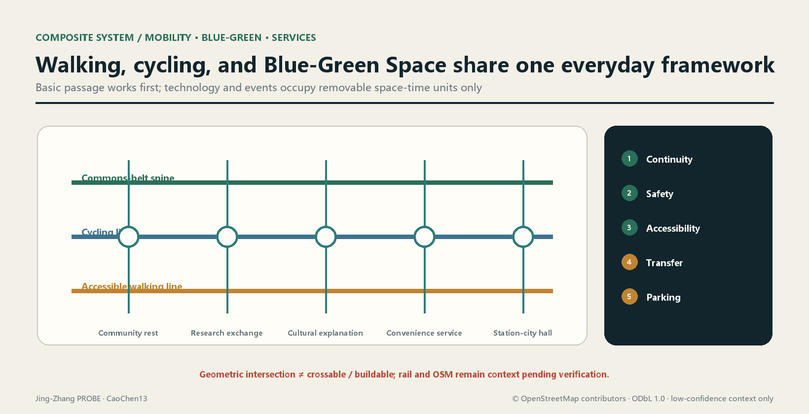

Intermediate quantities in the transport-project ledger include break location and evidence, affected route, detour conditions, accessibility review, construction period, merchant loading, noise and cleaning actions, responsibility triggers, and acceptance photographs. Any "connection completed" conclusion must be supported by continuous-route surveys and user review; drawing a line cannot substitute.

### Municipal infrastructure and New Infrastructure share one capacity ledger

New Infrastructure does not create a separate "smart city" utility system. It is checked for capacity and operations together with electricity, communications, water supply and drainage, flood protection, sanitation, lighting, fire safety, and emergency systems[depth:municipal_new_infrastructure]. Edge computing, sensing, and information displays preferentially attach to maintainable facilities and use minimum energy, offline degradation, and replaceable interfaces. Underground excavation or continuous energy use requires action quantities, energy source, utility conflicts, equipment life, replacement responsibility, and decommissioning route.

Formal utility, municipal-capacity, river, flood-protection, fire-safety, and energy data are currently missing[source:SITE-PACKAGE], so pipe diameters, capacity, service radius, energy use, and cost are all unknown. Filling them requires rights-cleared existing-network data, professional load forecasts, equipment inventory, operating windows, unit prices, and approval conditions. The concept stage sets only interface lists and a verification sequence; it does not replace local data with common rule-of-thumb values.

Public-service facilities consist jointly of "basic everyday services, innovation-collaboration services, and emergency and operations services." Each facility must state its users, non-digital alternative, access rules, operations team, fault response, funding source, and exit plan. If enterprise naming or event operations change public accessibility, the ledger triggers a new review. Facility existence does not equal service effectiveness; closure, faults, and inaccessible periods also enter the evidence.

## Blue-Green Network, Public Space, and Urban Character

The blue-green system forms the proposal framework from a continuous green spine, shaded pockets, and public nodes[data:geometry/green_space.geojson#GREEN-001]. Public Space is expressed through an all-hours accessible belt and its nodes[data:geometry/public_space.geojson#PUBLIC-001].[depth:blue_green_public_space] The union of each layer is calculated separately; green space is not automatically equated with accessible Public Space. Current ratios use the provisional Overall Design Area and can only support recalculation and internal proposal comparison, not a statutory green ratio.

The design sequence for the commons belt is: first secure a basic route that is continuous, visible, and accessible; then create everyday stays with shade, stormwater, rest, and convenience facilities. Cultural displays and AI-Enabled Scenarios use removable units and do not occupy basic passage. Qinghe River, Xiaoyue River, railway heritage, cultural heritage, and ecological conditions all require formal confirmation; no blue line, protection line, or engineering section is drawn before confirmation. Urban Design should coordinate Public Space, building layout, and Urban Character[standard:MOHURD-URBAN-DESIGN-MEASURES], but coordination does not mean bypassing specialist approvals.

Urban Character follows the principles of restrained heritage materials, legible public-service interfaces, a low-glare night environment, and maintainable small components. Historical images, company marks, fonts, portraits, and artworks require copyright registration; algorithm-generated images must also record generation and human-editing processes. An "AI feel" is not defined by illuminated facades or giant installations, but by whether public problems are honestly recorded, services remain usable, and responsibility closes.

Blue-green nodes use three records during refinement: "baseline - proposal - operation." The baseline includes soil, vegetation, drainage, thermal environment, accessibility, and actual maintenance. The proposal records retention, repair, addition, construction disturbance, and alternatives. Operation records survival, ponding, usable shade, facility faults, and maintenance action. There is currently no professional monitoring sufficient to support these performance judgments, so `[metric:blue_green_performance]` has `status: unknown`. Required data are seasonal monitoring under the same spatial version, facility inventory, maintenance records, and Human Review. Area ratios cannot substitute for ecological performance, and node counts cannot substitute for continuous experience. If monitoring shows that high-maintenance landscape repeatedly fails, return to more durable and repairable planting and paving strategies.

Green-space and Public Space operating costs enter the same ledger: planting, paving, stormwater facilities, lighting, cleaning, event restoration, and equipment decommissioning all require action quantities and reviewed unit prices. [metric:mitigation_budget_cny] is currently unknown. The presence of green space in a proposal drawing cannot establish maintenance funding. If later budgets are insufficient, reduce high-maintenance displays and technology equipment first, without sacrificing continuous passage, shade, or basic safety.

## AI Public Space, Pilgrimage Landmarks, and Component Library (agent.4)

This section is a **conceptual Public Space catalog**, not a conclusion on heritage conservation, green space, transport, bridges and tunnels, underground space, or engineering feasibility. Every component prioritizes everyday use, restrained entertainment, removability and repairability, and usability when technology is offline. Specific placement requires ownership, heritage, ecological, fire-safety, accessibility, structural, and operational review[source:AGENT-TASKBOOK][standard:MOHURD-URBAN-DESIGN-MEASURES][depth:agent_4_public_space_landmarks].

### Jing-Zhang Railway Heritage Park Public Space and two-way stitching

The direction of Jing-Zhang Railway Heritage Park carries four layers of publicness: "continuous walking - historical explanation - everyday rest - low-risk co-creation." North-south continuity expresses only a goal of continuous experience, using the current approximately 0.03 proposal coverage of `[metric:public_space_ratio]` and `PUBLIC-001…008` as internal indices[data:geometry/public_space.geojson#PUBLIC-001]. East-west stitching expresses only connection directions pending verification. The six transverse conceptual lines currently remain **0/6 formally confirmed** and cannot be called bridges, tunnels, intersections, or completed works[data:geometry/roads.geojson#ROAD-004]. Each segment first verifies lawful passage, accessibility, and a quiet interface before deciding whether to accommodate events or technology.

Dazhongsi's "AI-Native new programs" are not a list of unattended shops, but three removable service relationships: daytime multilingual public explanation and enterprise-service appointments, evening voluntary digital coaching for merchants, and approved small product-explanation/red-team demonstrations during specified periods. Spaces use shared tables, lockable equipment cabinets, and removable display rails without changing building ownership or default business use. Charges, naming, data use, event periods, and restoration responsibility must be explicit. When operating or fire-safety data are insufficient, only basic wayfinding, rest, and human service remain[data:geometry/key_areas.geojson#PROV-KEY-003].

### Three pilgrimage-landmark concepts

| ID / concept name | Public meaning and experience | Recommended carrier | Preconditions for validity | Failure/exit method |
|---|---|---|---|---|
| LM-01 "1909 — Verifiable Mileage" | Translates the independent survey, design, and construction ethos in Jing-Zhang engineering history into a public lesson of "look at evidence before concluding" | Low-profile graduation strip in the heritage park, with paper/offline multilingual explanation | Historical review, heritage and site approval, accessibility, and font and image permissions[source:JINGZHANG-HERITAGE-BEIJING] | Without approval, retain only online/paper narrative and install no permanent component |
| LM-02 "Open Review Bench" | The public watches model advice being questioned, reviewed, and revised rather than worshipping a black box | Removable discussion table and human-hosted interface in AI Origin Community | Site, content, safety, privacy, hosting, and appeal mechanisms | Close the digital layer during high-risk content or without a host; retain ordinary seating |
| LM-03 "Commons Console" | Visitors see service status, impact, responsibility, and unknown together, presenting restraint rather than a technology spectacle | Double-sided mechanical status board plus accessible digital mirror in Dazhongsi public hall | Ownership, fire safety, information-publication responsibility, data minimization, and maintenance budget | Return to `UNKNOWN` when data expire; screen shutdown does not affect passage |

`[metric:landmark_count]=3` counts only the conceptual catalog in this package. It does not mean that three landmarks have been sited, approved, or built. All three prioritize human explanation and everyday public use. Continuous face, voiceprint, emotion, or individual-trajectory collection is prohibited as a means of manufacturing interactivity.

### Honor display system: reward reusable contribution, not a company ranking

The honor system is called the "**PROBE Contribution Ledger**." Its objects are reviewed public contribution records, not company rankings, investment-promotion endorsements, or permanent naming. Four entry types are `OPEN` reusable code/data/methods, `CARE` accessibility and public-service repair, `REVIEW` discovering and correcting errors, and `STEWARD` completing maintenance and exit. Every entry must show the contributor's choice of voluntary attribution or anonymity, license, evidence link, reviewer, version, validity, and withdrawal/correction channel. Publicity effects, valuation, financing, and non-public data cannot enter the ledger. Physical display uses replaceable plaques only; the digital mirror stores version history[standard:PROJECT-AGENT-OPEN-CALL-TASKBOOK].

### Public Space component library

| ID | Component type | Basic function (works offline) | Optional AI layer | Preconditions and reversal |
|---|---|---|---|---|
| C-01 | Continuous guidance strip | High-contrast direction, distance category, and accessibility prompt | Temporary detour advice | Surveyed path and transport approval; cover with corrections when wrong |
| C-02 | Quiet rest edge | Seat, backrest, wheelchair companion place, and shade | Facility-state repair code | Tree/structure/maintenance review; digital layer can be removed |
| C-03 | Removable display rail | Paper boards and open mounting points | Versioned electronic-ink content | Copyright and content review; return to a blank board on expiry |
| C-04 | Human service desk | Directions, paper procedures, and community information | Multilingual translation and retrieval suggestions | Staffing, accessibility, and privacy rules; service remains when AI stops |
| C-05 | Open evaluation table | Discussion, workshop, and human scoring form | Controlled model demonstration | Host, safety, and data license; no model runs without a host |
| C-06 | Responsibility plaque | Facility responsibility, repair contact, and restoration deadline | Work-order status mirror | Responsible person and deadline signed; retain telephone/address during network failure |
| C-07 | Lockable test rack | Standardized mounting, physical isolation, and clearance mark | Non-collecting edge device | Electrical/structural/site approval; remove entirely on expiry |
| C-08 | Quiet event unit | Movable furniture, loading boundary, and end-of-event restoration mark | Booking and impact prompt | Fire safety, passage, noise, and merchant communication; cancel event if a gate fails |

`[metric:public_space_component_type_count]=8` is a count of component **types**, not units purchased or built. Dimensions, materials, unit prices, quantities, suppliers, and installation locations are all unknown. Filling them requires field survey, ergonomics and accessibility review, durability/fire/structural testing, operational capacity, and rights-cleared procurement.

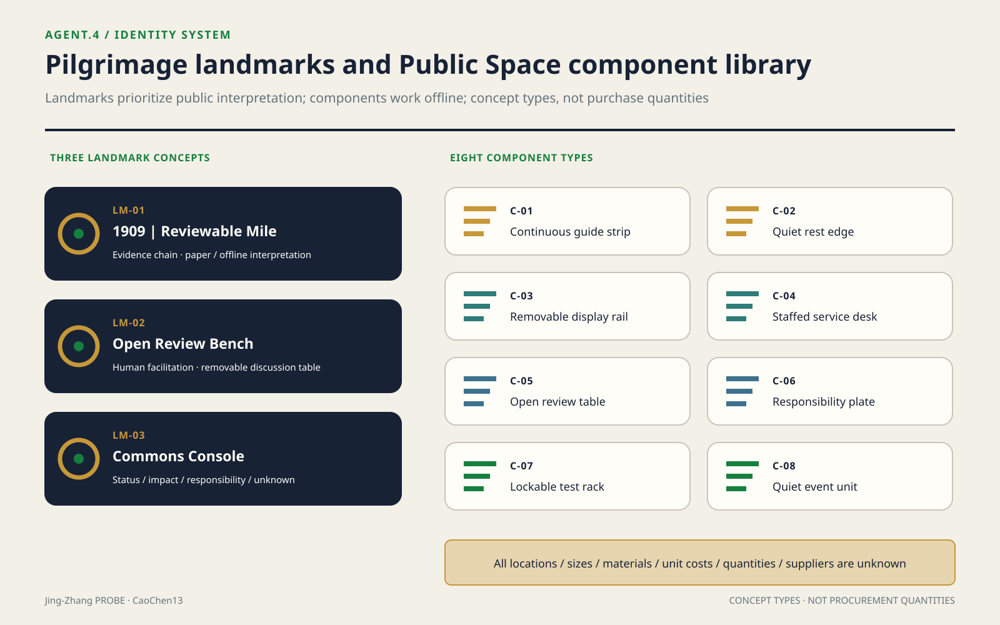

## Jing-Zhang-Zhongguancun-AI Cultural Narrative and Signage (agent.5)

### Cultural line: independent engineering is a working method, not decoration

Public Beijing municipal material records that the Jing-Zhang Railway was completed in 1909 as the first state-owned trunk railway independently designed and built by Chinese people. Construction of the heritage park also emphasizes restoring part of the railway memory, repairing significant relics, and integrating historical stories into the place[source:JINGZHANG-HERITAGE-BEIJING]. Public Zhongguancun material describes Haidian Park as the birthplace of Zhongguancun Science Park and a core area of the National Innovation Demonstration Zone[source:ZHONGGUANCUN-INNOVATION-CULTURE]. On this basis alone, the proposal establishes a three-part narrative of "**independent engineering - open innovation - responsible AI**" and does not elaborate unverified anecdotes, heritage lists, or company histories[depth:agent_5_culture_signage].

The connective phrase in the narrative is not a superficial technology upgrade "from steam to algorithms," but "make problems public within constraints, form methods, verify together, and leave inheritable knowledge." The Jing-Zhang history segment addresses engineering evidence and public memory. The Zhongguancun segment addresses research, entrepreneurship, and service networks. The new AI-culture segment addresses open methods, Human Review, removable technology, and visible correction of errors. History does not become an AI backdrop, and AI does not generate false historical imagery.

### Five-act spatial storyline

The storyline registers `[metric:spatial_story_stage_count]=5` acts. This counts the narrative structure, not completed locations or a confirmed heritage inventory.

| Act | Spatial experience | Cultural content | Carrier and boundary |
|---|---|---|---|
| 01 See the line | On entering the commons belt, first recognize the heritage direction and urban relationship | Jing-Zhang as a clue to independent engineering and industrial heritage | Use only reviewed text and abstract line engraving; heritage locations await a formal inventory |
| 02 Understand the method | At LM-01, read "problem - survey - design - verification" | Engineering is an Evidence Chain, not a heroic slogan | Do not reproduce unlicensed archival images, portraits, or engineering drawings |
| 03 Join innovation | See public problems and reusable outputs in Origin Community and Zhongzhiyuan | Zhongguancun innovation culture becomes open topics, mentors, and service interfaces | Institutional, company, and personal attribution all require authorization |
| 04 Question the model | At LM-02, watch advice red-teamed, human-reviewed, and modified | AI culture honors questionability and exit | High-impact models do not execute automatically for the public |
| 05 Leave a contribution | At LM-03 and the contribution ledger, see status, unknown, and maintenance responsibility | Innovation is completed through continuing maintenance, not a one-time release | Remove expired content and preserve dispute and correction versions |

### Wayfinding, identity, and symbol-system direction

Cultural wayfinding uses a self-drawn "**double line + graduation + version stamp**" symbol. The two lines represent historical evidence and current public use. An intersection graduation marks a node where people can stop and receive explanation. The version stamp shows the effective time of content. This is a spatial-information grammar, not the open-P parent-brand logo in agent.1. Wayfinding has `[metric:signage_information_level_count]=4` levels: `LINE` continuous direction, `NODE` node function, `STORY` reviewed narrative, and `STATUS` open/paused/unknown. These are conceptual information levels, not installed-sign counts. Every level uses Chinese, English, graphics, and high-contrast tactile/audio alternatives together and never encodes by color alone.

Before formal design, complete: surveyed decision points along the whole line, accessibility audit, bilingual/multilingual translation review, heritage review, nighttime-glare testing, material and maintenance samples, and font and image permissions. Every QR code must have equivalent paper content and a short URL. Location data are not a prerequisite for reading. Historical photographs, people, trademarks, paper figures, and company marks do not enter the system without authorization[source:AGENT-TASKBOOK].

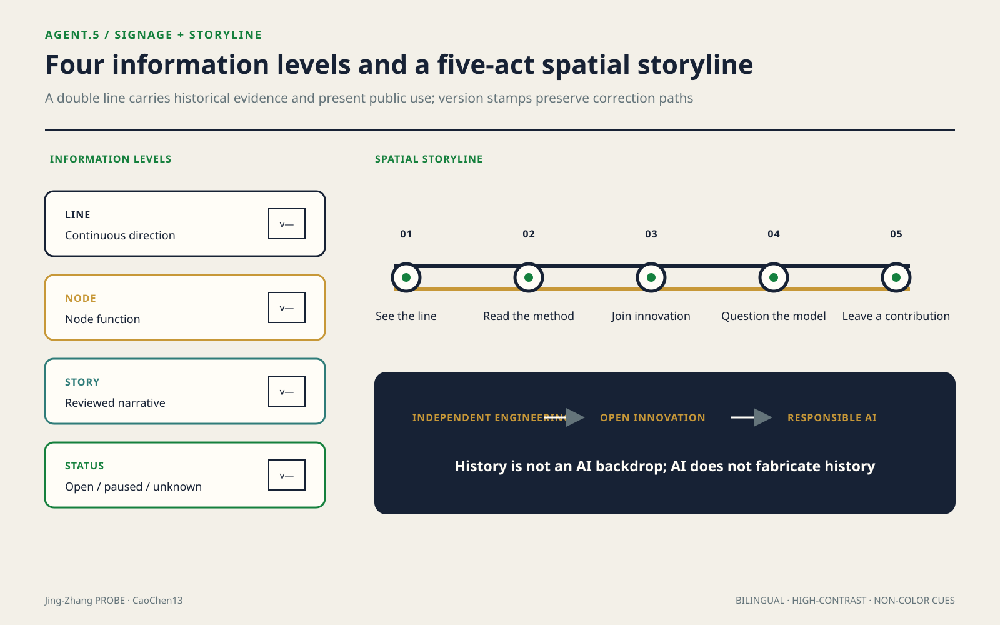

### International communication copy (concept draft, pending translation review)

Chinese: **“沿着一条自主工程的百年线索，让每一个AI提案都经得起公共生活的检验。”**

English: **“Along a century-old line of independent engineering, every AI proposal is tested against everyday public life.”**

Short line: **“Build openly. Test responsibly. Keep the commons usable.”**

The copy may describe only this proposal's value proposition. External publication must state "Open Co-Creation Submission / concept proposal" and may not present it as selected, approved, under construction, or a government commitment. Translation, images, accounts, and publication channels for international communication are currently all unknown and require translation review, copyright clearance, and account-owner authorization.

## Annual Events, Developer Community, and Conversion Pathway (agent.6)

This section is a **proposed operating framework** with no confirmed date, venue, organizer, participating company, fiscal funding, or outcome commitment. The annual-program count `[metric:annual_program_family_count]=4` counts only four repeatable conceptual program families. Actual delivery and participation metric `[metric:annual_participant_count]` has `status: unknown`[source:AGENT-TASKBOOK][depth:agent_6_operations_conversion].

### Annual program system and brand IP

The operating brand uses "**PROBE Relay**" defined in agent.1. Its visual language continues the opening, graduation, and Human Review point, but every event must display one of `PROPOSED / CONFIRMED / ACTIVE / CLOSED`. An unconfirmed event cannot display only a future date.

| ID / conceptual program | Recommended window (not a confirmed schedule) | Core output | Audience | Opening and closing gates |
|---|---|---|---|---|
| OP-01 Open Brief Season | First cycle of each year | Public/industrial problem briefs reviewed for rights and risks | Residents, operators, researchers, and developers | Opens only with a problem owner and data boundary; if no one takes it, archive the reason |
| OP-02 Model Mile Trials | Second cycle | Small test cards, failure records, red-team and Human Review report | Developers, professionals, and user representatives | Opens only with site/safety/privacy approval; closes only after clearance and data deletion |
| OP-03 Commons Value Week | Third cycle | Public review of everyday services, accessibility, and impact ledger | Residents, merchants, visitors, and operators | Basic passage remains intact; restoration accepted after the event |
| OP-04 PROBE Release & Relay | Fourth cycle | Reusable outputs, contribution ledger, correction record, and next-year problem pool | International partners, talent, companies, developers, and the public | Publish only licensed outputs; unknowns and failures must be displayed at the same time |

Event communication does not use footfall or media volume directly as success. The minimum delivery of each program is open materials, licenses, Human Review, impact and restoration records, and the next responsible person. Without these handover items, an event counts only as a gathering and does not enter the conversion ledger[standard:PROJECT-AGENT-OPEN-CALL-TASKBOOK].

### Developer community: from Issue to maintainable delivery

The developer community uses a six-step cycle: `public problem -> eligibility/ethics triage -> team and mentor matching -> sandbox prototype -> human/user acceptance -> documentation, license, maintenance or stopping handover`. Entry is open to individual developers, students, researchers, and startup teams, with no designated provider. Contributors may choose public attribution or anonymity. Every repository/project must have a problem owner, data card, model/rule version, tests, accessibility statement, safety and privacy review, license, maintenance period, and archive condition. A demo without a maintainer or exit statement cannot enter Public Space.

Community operating roles are all responsibilities pending confirmation, not appointed people: the `brief steward` manages problem boundaries, the `data steward` manages rights and deletion, the `safety/privacy reviewer` manages risk gates, the `community reviewer` represents affected users, the `maintainer` manages delivery, and the `independent closer` verifies exit. Implementing bodies, headcount, working hours, remuneration, and funding are all currently unknown and require public recruitment rules, contracts, budget, and oversight.

### Scenario-access operating gate

A scenario moves from `CONCEPT` through `EVIDENCE_READY -> SANDBOX -> LIMITED_PILOT -> PUBLIC_REVIEW -> MAINTAIN / RETIRE`. Entry into the next state simultaneously requires: lawful site and operator, purpose and user boundaries, data rights, privacy/safety/accessibility review, final human decision, non-digital alternative, and stop and restoration responsibility. If any item is missing, `[metric:approved_scenario_count]=status: unknown` remains; the 12 conceptual cards cannot be treated as 12 open projects. The industry tests SC-08…11 especially may not move beyond controlled environments and professional approval.

### International communication and attraction-conversion pathway

| Entry | Verifiable next step | Conversion evidence | Result it cannot masquerade as |
|---|---|---|---|
| International content reach | Voluntarily subscribe to public problems or attend an online briefing | Consent record, source page, language, and exit method | Views do not equal talent/company relocation |
| Talent/developer participation | Complete one public problem, review, or documentation contribution | Contribution record, license, mentor/reviewer signature | Registration does not equal employment or tenancy |
| Company/institution inquiry | Enter a needs and rights-boundary workshop | Rights-cleared institutional identity, problem brief, and data/site boundary | Inquiry does not equal partnership, investment promotion, or investment |
| Sandbox prototype | Pass technical, ethical, public-value, and exit gates | Test record, impact ledger, and human acceptance | Demo does not equal comprehensive deployment |
| Limited pilot | Under the same version/window, prove service and acceptable impact | Approval documents, use and impact records, and responsibility closure | Pilot does not equal procurement, policy, or long-term operations |
| Long-term relationship | Separately negotiate research, service, talent, or space agreements | Effective contract, budget, responsibility, exit, and public scope | This proposal commits to no company roster, funding, output value, or fiscal support |

`[metric:developer_to_pilot_conversion_ratio]` retains `status: unknown`. The numerator must be developers entering a **human-approved limited pilot** and the denominator voluntarily registered developers meeting public eligibility in the same cohort. Cohort, eligibility, approval ledger, and common observation window are currently absent. The same applies to international attraction: only effective agreements enter partnership records. Operations of public landmarks and experience spaces prioritize access hours, human explanation, basic maintenance, and fault degradation. Brand exposure cannot change public accessibility.

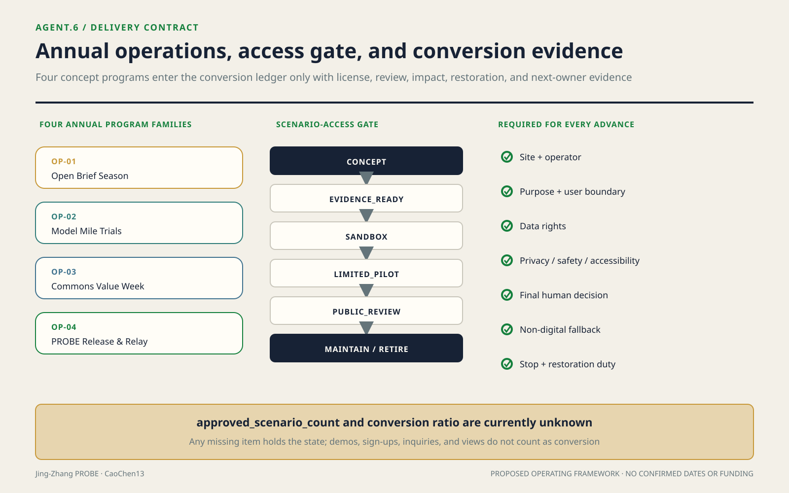

### Typical interfaces and Public Space network capacity

Typical Section A-A' does not only describe existing-condition leads at a "heritage park-residential interface". It fixes a design sequence: from the residential side toward the commons belt, address a quiet doorstep, maintainable service edge, continuous accessible passage, cycling and everyday stays, and a shaded heritage interface in order. Loading, amplified sound, strong light, and equipment-maintenance access move to the side away from housing. If formal boundaries, fire safety, or tree surveys prove the interface inadequate, remove displays, rentable events, and technology devices first, then reduce stays; basic passage cannot be cut. The section carries no formal dimensions because the current drawing presents design questions and OSM cannot generate metric judgments[source:OSM-CONTEXT]. Refinement replaces it segment by segment with surveyed sections[data:geometry/roads.geojson#ROAD-003].

Network capacity is recalculated from current proposal elements rather than imagined population. `count(PUBLIC_SPACE)=8`, meaning one continuous commons belt plus seven nodes. `count(ROAD_CENTERLINE)=9`, meaning three north-south lines plus six east-west connections[data:geometry/public_space.geojson#PUBLIC-001][data:geometry/roads.geojson#ROAD-009]. Build an element graph where "two road-element geometries intersect" creates an edge. The current nine serialized conceptual lines form **1 connected component in the element graph**; the recalculation is `components(intersects(ROAD-001…009))`. No "geometric breakpoints" are reported: the phrase can be confused with dangling endpoints, crossing gaps, or engineering discontinuities, and this package neither defines nor calculates it. The narrative shows area coverage only as `[metric:public_space_ratio]` **approximately 0.03**, with the provisional `overall_design_area` **approximately 11.4 km²** as denominator, not approximately 43.6 km². Element-graph connectivity proves neither crossability nor constructability. Engineering-verified discontinuities, service-radius coverage, and population capacity remain unknown and require formal entrances, obstacles, flows, population, and access-hour data. Read together with **0/6 confirmed connections**, geometric intersection does not equal real connectivity.

## Public Interest, Population Attribution, and Inclusion

### One: Recalculate benefit-cost-responsibility on a population axis

This section adds neither a moral slogan nor a new metric. It reallocates the existing benefit domains, cost domains, and metric references in `visual/assets/duty-ledger.json` by `group_id` in `visual/assets/inclusion-ledger.json`; `benefit_items` and `cost_items` are relationships to be tested, not evidence that benefit or harm has occurred. Each group is assigned through a reviewable evidence rule, followed by `blind_spots`, verifiable intermediates, inputs needed for calculation, and a proposed procedural position. One person may enter multiple groups; without authorized, deduplicated data in a common time window, people cannot be totalled. The population dimension permits no netting: aggregate benefit cannot cancel any group's rights, statutory process, minimum service, or unresolved cost.

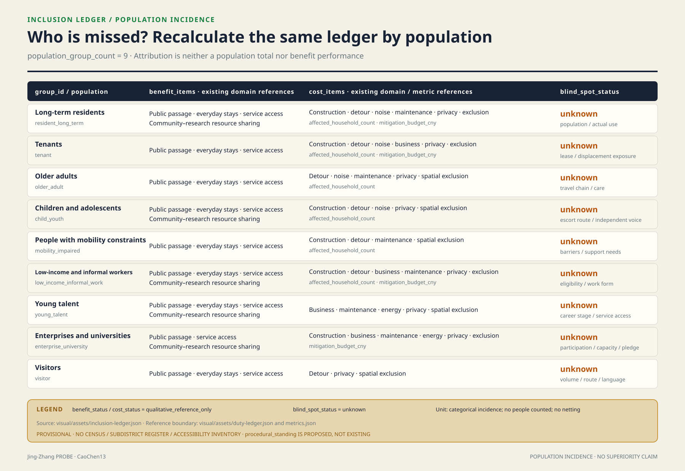

### Two: Benefits, costs, and known blind spots for nine population groups

| group_id / verifiable inclusion rule | benefit_items (not performance) | cost_items (not performance) | blind_spots / verifiable intermediate |
|---|---|---|---|
| `resident_long_term` Long-term residents: authorized, deduplicated usual-residence or occupancy record falls within the confirmed scope and observation window; ownership is not a proxy | Public passage, everyday stays, service access, community-research sharing | Construction, detour, noise, maintenance, privacy, spatial exclusion; affected households and mitigation budget | Population, actual use, and within-group differences are `unknown`; lighting-covered length of commonly used night routes can be checked `resident_night_route_covered_length_m` |
| `tenant` Tenants: valid lease, use agreement, or reviewed actual occupancy record; never inferred from ownership | Public passage, everyday stays, service access | Construction, detour, noise, business, privacy, spatial exclusion; affected households and mitigation budget | Tenant count, lease duration, rent, and displacement exposure are `unknown`; participatory-reviewed temporary-detour length can be checked `tenant_detour_length_m` |
| `older_adult` Older adults: age threshold verified at the cutoff date with the recorded threshold version; never judged by appearance | Public passage, everyday stays, service access | Detour, noise, maintenance, privacy, spatial exclusion; affected households | Population, travel chains, care, and digital exclusion are `unknown`; route length with continuous rest support can be checked `older_adult_rest_supported_length_m` |
| `child_youth` Children and adolescents: guardian-authorized birth date shows minority; school status does not replace age | Public passage, everyday stays, service access, community-research sharing | Construction, detour, noise, privacy, spatial exclusion; affected households | Population, escort routes, and independent expression are `unknown`; protected crossings passing a child-friendly audit can be checked `child_youth_protected_crossing_count` |
| `mobility_impaired` People with mobility constraints: a person voluntarily identifies a task-specific need for step-free passage, an aid, a carer, or extra rest; no medical label | Public passage, everyday stays, service access | Construction, detour, maintenance, spatial exclusion; affected households | Population, barrier locations, and support needs are `unknown`; accessible continuous-segment count can be checked `accessible_continuous_segment_count` |
| `low_income_informal_work` Low-income and informal workers: valid assistance or low-income eligibility, or a rights-reviewed voluntary work-form survey; the two sub-rules stay separate | Public passage, everyday stays, service access, community-research sharing | Construction, detour, business, maintenance, privacy, spatial exclusion; affected households and mitigation budget | Population, eligibility, work form, and cost distribution are `unknown`; free, accountless service points can be checked `free_accountless_service_point_count` |
| `young_talent` Young talent: declared age band plus a verified study, research, employment, or entrepreneurship task; “talent” is not an ability rating | Public passage, everyday stays, service access, community-research sharing | Business, maintenance, energy, privacy, spatial exclusion | Population, career stage, care, and service availability are `unknown`; access windows requiring no institution identity can be checked `young_talent_public_access_window_count` |
| `enterprise_university` Enterprises and universities: valid legal-person registration plus a confirmed premises, project, or service interface; a public name is not participation | Public passage, service access, community-research sharing | Construction, business, maintenance, energy, privacy, spatial exclusion; mitigation budget | Participation, capacity, access commitment, and exit responsibility are `unknown`; public interfaces with effective access agreements can be checked `signed_public_access_interface_count` |
| `visitor` Visitors: voluntary anonymous count or visit record within the observation window, not assigned through verified residence, work, business, or study status; devices are not persistently tracked | Public passage, everyday stays, service access | Detour, privacy, spatial exclusion | Visitor volume, routes, and language needs are `unknown`; multilingual, accountless wayfinding nodes can be checked `multilingual_accountless_wayfinding_node_count` |

Intermediates do not masquerade as coverage outcomes either. Existing public geometry has no accessibility, lighting, tenure, age, income, access-agreement, or actual-use attributes, so the intermediates in the table remain blank. The JSON fixes formulas, units, source interfaces, and missing inputs; recalculation begins only when those inputs arrive.

### Three: Procedural inclusion—who can say no at which gate

The following are objection positions proposed by this scheme, not existing institutions, and they do not alter the spatial thresholds of the original gates. `gates/01` takes counter-evidence from residents, older adults, children, and people with mobility constraints on continuous-passage evidence; an unanswered break remains `unknown`. `gates/02` takes objections from tenants, low-income and informal workers, young talent, enterprises, and universities on use rights, capacity, access agreements, or exclusion conditions and triggers recalculation. `gates/03` lets verified affected parties object to omissions in counting, detour, business interruption, displacement, funding, or acceptance; until closure, the ban on interface construction remains. `reversibility-r1-r3` connects unresolved objections to the upgrade gate: low-disturbance R1 checks may proceed, but many R1 actions cannot offset one R2 or R3 decision. Short-term visitors currently have no stable representative or gate-triggering position, so their `procedural_standing` is `null`; a feedback channel cannot masquerade as veto power.

### Four: What this section cannot prove

First, the population groups are inferred from public categories. There are no first-hand population data, census data, subdistrict household registers, or accessibility-facility census, so this section cannot prove any group's population, coverage, or actual net benefit. Second, `procedural_standing` is only a mechanism proposed by this scheme, not an existing institutional arrangement, settled decision, or implementation commitment. Third, the blind-spot list may itself have blind spots and does not exhaust intersecting identities, temporary conditions, care relationships, or unregistered users. Fourth, this section cannot prove that this proposal is more inclusive than any other proposal; it only discloses what is unknown, how it could be checked, and who still lacks a procedural position.

## Renewal Projects, Implementation Policy, and Phasing

### Projects are gated states, not a wish list

The project list is organized by independently reviewable intervention units[depth:renewal_project_list]. Each binds a geometry version, benefit definition, impact interface, missing data, mitigation action, proposed obligation, funding responsibility, acceptance evidence, and exit condition:

| Project | Core action | Benefit evidence | Principal costs | Gate to professional refinement |
|---|---|---|---|---|
| Commons-belt continuity works | Repair walking and cycling, accessibility, shade, and basic wayfinding breaks | Continuous-route survey, user review, and maintenance events | Construction detours, interface disturbance, and continuing maintenance | Official boundary and road conditions, break inventory, impact area, funding, and acceptance responsibility complete |
| Everyday service nodes | Embed convenience, culture, rest, and collaboration services in adaptable or compliant locations | Access records, service events, and accessibility audit | Operations, energy, cleaning, and surrounding business impacts | Needs survey, site ownership, fire safety, municipal infrastructure, operations, and exit agreement complete |
| Area co-benefit interfaces | Convert enterprise display, academic collaboration, and station-city events into shared resources | Use evidence by group and public-resource delivery records | Event flows, noise, security, loading, and exclusion risks | Impact assessment, access rules, mitigation list, and responsibility chain pass joint review |
| Blue-green and stormwater nodes | Improve shade, stays, stormwater, and ecological continuity | Professional ecological and thermal monitoring plus use observation | Maintenance, flood-protection conflicts, and seasonal failure | River, ecological, municipal, and maintenance conditions confirmed |
| Co-benefit ledger and dashboard | Freeze definitions, assemble evidence, and publish project status | Rerunnable output, version hash, and independent spot checks | Data governance, erroneous attribution, and long-term operations | Data-minimization assessment, permissions, retention, correction, and stop mechanisms complete |

In this proposal, "responsibility" is a calculable state chain, not a body entered in a table. For any intervention `i`, the ledger stores `beneficiary_definition_i`, `confirmed_impact_geometry_i`, `verified_action_quantity_i`, `reviewed_unit_cost_i`, `trigger_i`, `proposed_duty_holder_i`, `funder_i`, `reviewer_i`, `due_condition_i`, `acceptance_evidence_i`, and `status_i`. Responsibility closes only after the trigger condition holds, funding and action complete, and the named reviewer accepts the acceptance evidence. "Contacted" and "coordinated" do not count as closure.

Two core cost calculations are fixed before data arrive:

- [metric:affected_household_count]: `count(distinct verified_household_id intersecting professionally_confirmed_impact_area)`, currently `status: unknown`. Required inputs are authorized and deduplicated housing/household data, professionally confirmed impact area, time snapshot, and Human Review. OSM leads may not enter the household count.
- [metric:mitigation_budget_cny]: `Σ(verified_action_quantity_i × reviewed_unit_cost_i)`, currently `status: unknown`. For each action, intermediate quantities must publish source, unit, quantity, unit-price version, funding commitment, and approval status; if any item is missing it remains unknown.

Also define `[metric:duty_closure_ratio] = accepted_closed_due_actions / all_due_actions`, currently `status: unknown`. It requires effective triggers, due conditions, action status, and acceptance records. The denominator excludes tasks not yet triggered, preventing numerous future items from diluting overdue responsibility. The metric reflects responsibility closure only and does not prove spatial effects. Effects still require independent use, environmental, or engineering evidence.

The ledger uses an event chain instead of an overwrite table. An intervention moves from `draft` to `evidence_pending` and can enter `duty_confirmed` only after benefit definitions, impact areas, and required data are reviewed. Completed action still requires acceptance evidence before entering `accepted`. If a new affected object, cost, or engineering defect appears, status becomes `reopened`; previous records are not deleted. Every transition stores the previous-version hash, changed fields, evidence files, proposer, reviewer, and time, allowing a third party to reconstruct every judgment backward from the final state.

Benefits and costs are not netted simply. Increased use of the commons belt cannot offset an unmitigated loss to one household, merchant, or person with mobility constraints. High aggregate benefit may help rank projects, but cannot cancel rights, statutory process, or minimum service conditions. Project comparison first checks non-negotiable safety, passage, privacy, and rights gates, then compares verified public benefit, residual costs, and closure status. Unverified publicity exposure, forecast footfall, or model scores cannot enter total benefit.

Funding is also locked to actions, rather than only a project total. Every mitigation fund binds `action_id`, reviewed quantity, unit-price version, payment condition, recipient or executor, acceptance evidence, and balance status. Engineering changes create a new version difference. This both allows budget recalculation and reveals structural gaps where "a total has been arranged but a critical action is unfunded." Non-monetary actions, such as changing time periods, retaining passage, or providing temporary space, likewise record performance conditions and acceptance evidence and cannot disappear from the cost side because they lack a price.

### Phasing is decided by evidence gates, not packaged by year

Phasing geometry expresses three conceptual spatial classes: early, linked, and pending verification[data:geometry/phasing.geojson#PHASE-001]. All are low-confidence Conceptual Recommendations rather than an approved sequence.[depth:phasing_implementation] The early phase includes only baseline survey, commons-belt operating rules, reversible minor repair, and a ledger prototype. The linked phase implements disturbance reduction, service compensation, and cross-boundary connections after residential and business interfaces are verified. The pending-verification phase must wait until official land use, ownership, statutory controls, and engineering conditions are complete before physical refinement begins.

Phase transitions use evidence gates: boundaries and professional conditions are in the data room; impact areas are confirmed; beneficiary objects and exclusion rules are frozen; required cost metrics have been calculated or signed off as not applicable; funding, obligations, review, and exit mechanisms are effective; spatial and public-use acceptance has passed. If any gate fails, the project returns for evidence completion, reduction, or cancellation; overall progress cannot conceal a local risk.

As policy, establish a cross-project co-benefit ledger and versioned data room. The corridor operator maintains the data dictionary and public status, project implementers submit quantity and funding evidence, community and user representatives verify everyday impacts, professional teams review technical validity, and competent authorities make approval decisions according to law. All roles here are proposal recommendations pending agreement. But algorithms, fields, triggers, and acceptance logic are already fixed; later replacement of the words "responsible body" alone cannot establish responsibility.

### Rank evidence and reversal cost before years

Project priority uses sequential elimination rather than weighted scoring. First eliminate projects that touch safety, rights, statutory process, or basic-passage gates. Then compare whether they repair verified network breaks. Then compare whether they serve more than one event or institution. Finally, choose in order the project with fewer data gaps, lower reversal class, and a more complete cost ledger. Under these criteria, first priority is break and interface survey, accessibility review, operating rules, and reversible minor repair in `PHASE-001`. Second are existing service nodes approved for needs, ownership, and fire safety. Blue-green works and transverse crossings are third. Additional buildings, underground works, or land-use adjustment come last[data:geometry/phasing.geojson#PHASE-001]. This is a ranking, not a schedule. When official boundary and regulatory-plan data are absent[source:SITE-PACKAGE], the latter two levels cannot bypass gates with "planned start."

Reversal costs have three levels bound to spatial actions. **R1 removable** includes markings, wayfinding, movable furniture, event periods, software, and sensing equipment; reversal means removal, surface restoration, data decommissioning, and user notification. **R2 repairable** includes paving, planting, small stormwater facilities, interior partitions, and MEP adaptation; reversal also restores the base, planting, equipment, and business condition. **R3 difficult or irreversible** includes demolition, permanent new structures, underground utilities, bridges and tunnels, long-term rights changes, and relocation and may not, in principle, start while critical data are unknown. The level expresses only a reversal route and does not masquerade as an amount; `[metric:mitigation_budget_cny]` remains unknown. Quantification requires item-by-item quantities, reviewed unit prices, removal and restoration quantities, business interruption or substitute space, maintenance energy use, contract exit, affected objects, and funding agreements[data:geometry/constraints.geojson#COST-SCREEN-001]. When one project contains multiple action types, rank it by the highest irreversible class; numerous R1 decorations cannot offset one R3 decision.

## Metrics, Area Recalculation, and Compliance Matrix

This section takes the position that **a metric's value lies not in the number itself, but in whether a third party can rerun the same data and obtain the same result.** Every quantity therefore includes a formula, data file, and confidence. If it cannot be calculated, leaving it blank is preferable to giving a plausible-looking number.[depth:metrics_recalculation]

### One: The two denominators cannot masquerade as each other

The official material gives two different scopes; mixing them would distort every ratio: the Coordinated Research Area is **approximately 43.6 km²**, while the Overall Design Area is **approximately 11.4 km²**[source:BOUNDARY-SOURCE]. Regulatory-plan depth requires conclusions to distinguish known control conditions, design recommendations, and matters pending confirmation[standard:MOHURD-CONTROL-DETAILED-PLANNING]. The three-level scope definitions follow the announcement[standard:PROJECT-OFFICIAL-ANNOUNCEMENT]. Every ratio metric in this proposal uses the provisional Overall Design Area `[metric:site_area_sqm]` as its denominator, with formula `area_EPSG4548(SITE-001)`[data:geometry/site_boundary.geojson#SITE-001]. The research area provides context only and enters no denominator. This polygon is a temporary substitute boundary, not an Official Planning Boundary; release of the official boundary requires full recalculation.

The three key areas `[metric:key_area_count]=3` use the approximate values from the preliminary announcement directly, rather than measurements from rough polygons: Zhongzhiyuan **approximately 192.1 ha**, Beijing AI Origin Community **approximately 104.3 ha**, and Dazhongsi **approximately 72.0 ha**[source:OFFICIAL-ANNOUNCEMENT][data:geometry/key_areas.geojson#PROV-KEY-001]. The nominal approximate values and the machine-recalculated provisional geometry do not substitute for each other.

### Two: Narrative-level metrics: precision follows evidence

The narrative shows only approximations supported by current evidence: the Overall Design Area is approximately 11.4 km²; proposal green-space ratio is approximately 0.11; Public Space ratio is approximately 0.03; and parametric illustrative building footprints are approximately 1.49 ha (14 conceptual modules, confidence=low). These quantities support internal proposal review and are not real-world measurements, statutory metrics, or engineering scale.[metric:site_area_sqm][metric:green_ratio]The same constraints for Public Space and building footprints are recorded in[metric:public_space_ratio][metric:building_footprint_area_sqm].

### Three: Machine-recalculation appendix (full digits do not represent real-world precision)

Full digits in the table support only byte-for-byte reruns and difference diagnosis. They are **values recalculated from temporary geometry and do not represent real-world precision**; they must not be quoted at this precision in titles, summaries, approvals, investment, or engineering judgments.

| Metric | Value | Formula | Confidence |
|---|---|---|---|
| [metric:site_area_sqm] | 11,412,825.386 m² | `area_EPSG4548(SITE-001)` | medium |
| [metric:green_ratio] | **0.106694** | `area(∪GREEN_SPACE) / area(SITE-001)` | medium |
| [metric:public_space_ratio] | **0.033175** | `area(∪PUBLIC_SPACE) / area(SITE-001)` | medium |
| [metric:building_footprint_area_sqm] | 14,928.000 m² | `area(∪BUILDING_FOOTPRINT)` | low |

Land-use expression uses verifiable `land_use_code` values and no invented classification[standard:MNR-LAND-USE-CLASSIFICATION-GUIDE]. Every numerator is a **union** area, so overlapping proposal elements are not counted twice. All areas are recalculated in EPSG:4548 from serialized EPSG:4326 geometry[data:geometry/green_space.geojson#GREEN-001]. Building footprints are conceptual placeholders only, with no floor count, gross floor area, demolition, or approval claim, and therefore have low confidence.

#### Rerun chain: independently verifiable, but the generation script is not delivered with the package

Metrics were generated once by a deterministic Python script from provisional boundaries, planning limits, and OSM corridor inputs. The script contains no selection dependent on traversal order, dictionary order, or random numbers. Wherever "one of several candidates" is selected, criteria and thresholds are explicitly hard-coded.

**That script is not delivered with the package.** The submission package's auxiliary-file allowlist accepts only `.css/.js/.json/.svg/.png/.jpg/.jpeg/.webp`, not `.py`. Renaming Python source as `.js` and inserting it into `visual/assets/` could pass validation, but would mislabel the file type; this proposal does not do that. The "recalculable" claim must therefore be narrowed, with its boundary made explicit:

- **Independently verifiable without any proposal script**: the SHA-256 of every output file below and the aggregate fingerprint. The algorithm is specified verbatim below; a reviewer can compare the included 9 GeoJSON files and `metrics.json` using ten lines of standard-library code. Every area, ratio, and sensitivity conclusion can also be recalculated directly from the submitted GeoJSON in EPSG:4548 using any GIS tool.
- **Not regenerable by a third party from original inputs**: GeoJSON itself. Reproducing the "input to geometry" step requires the generation script, which is absent from the package.
- The proposal therefore claims **results are verifiable**, not **the process is rerunnable**. If maintainers accept `.py` or provide a separate script-delivery location, it can be supplied immediately.

The recorded environment for this run is Python 3.13.5 / pyproj 3.7.2 (PROJ 9.5.1) / shapely 2.1.2 / numpy 2.4.3. Sensitivity output and environment/hash records are delivered in `visual/assets/boundary_sensitivity.json` and `visual/assets/run_record.json` (both are genuine JSON).

Across two consecutive runs, 9 GeoJSON files and metrics.json were byte-identical. Output fingerprints (SHA-256) for this submission are:

| File | SHA-256 (first 16 characters) |
|---|---|
| site_boundary.geojson | `2f05910ba52f950f` |
| green_space.geojson | `b981e15253ecec64` |
| public_space.geojson | `c98292b0f518a514` |
| constraints.geojson | `2ecfa38feff9e7c6` |
| metrics.json | `65043520637cf6f2` |

The aggregate algorithm is defined verbatim as follows. First sort the **9 `.geojson` files under `geometry/` by filename in ascending order**, calculate SHA-256 over the exact bytes of each file, and express every digest as 64 lowercase hexadecimal characters. Then **append the digest of `metrics.json` at the end** using the same form. Concatenate these 10 digest strings in that order, without delimiters, filenames, prefixes, or line breaks, producing 640 ASCII bytes. Finally calculate SHA-256 over those 640 bytes. The aggregate fingerprint is `56ec03269648908d0f00d050e447bc31d7e4a9d8d4ed33c258cbbc36e8f78f1e`. The complete list, algorithm fields, and dependency versions are in `visual/assets/run_record.json`. A fingerprint mismatch means that input, environment, or output has changed and the conclusions must be reconsidered.

> **But determinism does not equal correctness.** The script proves only that the same input yields the same output. It **cannot prove that the input represents real planning boundaries, parcels, or existing conditions**. The validity ceiling of every number in this section is set by the provisional boundary, as shown next.

#### Boundary sensitivity: how unstable are these machine values?

Saying only "recalculate after the official boundary arrives" is inadequate: it does not answer **how large a perturbation changes the conclusion**. This proposal scans buffer perturbations of the provisional boundary and recalculates ratios[data:geometry/site_boundary.geojson#SITE-001]:

| Boundary perturbation | Design-area size | green_ratio | Relative change |
|---|---|---|---|
| −200 m | 7.218 km² | 0.168393 | **+57.8%** |
| −50 m | 10.334 km² | 0.117829 | +10.4% |
| Baseline | 11.413 km² | 0.106694 | — |
| +50 m | 12.509 km² | 0.097342 | −8.8% |
| +200 m | 15.892 km² | 0.076620 | −28.2% |

Within ±50 m the two numerators remain unchanged, so the change comes from substitute-boundary area. At −200 m, green-space and Public Space numerators are also slightly clipped; their relative changes are therefore close but not identical (+57.83% / +57.81%). The perturbation scan always recalculates both the denominator and intersection numerators using the substitute boundary. The result cannot be interpreted as "the denominator is fixed" or "the ratio is only a function of the denominator."

This produces a conclusion adverse to the proposal but essential to state: **±50 m of boundary uncertainty already produces approximately ±10% ratio change, so the six decimal places above are false precision.** Before the official boundary is released, the narrative uses only approximately 0.11 and approximately 0.03. Full digits support comparison only in this machine-recalculation appendix and claim no real-world precision. Scan data are in `visual/assets/boundary_sensitivity.json`.

### Four: Boundary on OSM use

The basemap uses OpenStreetMap[source:OSM-CONTEXT] (ODbL 1.0, data timestamp 2026-05-06). The full package contains 13 OSM features. **All have `geometry_role: analysis_helper` + `confidence: low`; none carries `area_sqm_declared`; none enters the calculation chain of any formula above**[data:geometry/constraints.geojson#OSM-RES-594891968]. Every feature carries `osm_id`, `osm_tags_used`, `osm_data_timestamp`, and `selection_rule`, allowing independent reproduction of the selection process.

The criterion is strict: **if a number is calculated from OSM geometry, it participates in an area/boundary judgment, and a disclaimer cannot exempt it.** This proposal therefore contains no metric dimension or ratio derived from OSM.

### Five: Cost-side metrics: leave them blank but provide the algorithms

A calculable benefit side and an incalculable cost side are where proposals of this kind most easily evade scrutiny. This proposal also lists costs as metrics and states what is missing before they can be filled:

| Metric | Status | Formula | Data needed to fill it |
|---|---|---|---|
| [metric:affected_household_count] | **unknown** | `verified_households ∩ professionally_confirmed_impact_area` | Subdistrict/community household-registration or housing-survey data; OSM has no household information and cannot substitute |
| [metric:mitigation_budget_cny] | **unknown** | `Σ(verified_action_quantity × reviewed_unit_cost)` | Reviewed unit-price basis for compensation and transitional resettlement |
| [metric:floor_area_ratio] | **unknown** | `total_floor_area / approved_site_area` | Approved regulatory-plan conditions[source:SITE-PACKAGE] |
| [metric:building_height_m] | **unknown** | `approved_or_surveyed_height` | Regulatory-plan conditions or field survey; architectural design-depth provisions activate only after official files arrive[standard:MOHURD-ARCH-DESIGN-DEPTH-2016] |
| [metric:statutory_green_ratio] | **unknown** | `approved_green_area / approved_site_area` | Regulatory-plan conditions |

Blank values are part of the conclusion. **Before the above data are obtained, any statement of "N affected households" or "M yuan in compensation" is fabricated, and this proposal supplies none.** Formula-first, data-later means the values can be calculated on the day data arrive, with definitions fixed by this document and impossible to revise afterward to beautify results.

### Six: Compliance matrix

| Constraint | Treatment in this proposal |
|---|---|
| OSM may not participate in boundary/area/planning-boundary/control decisions | All 13 OSM features are analysis leads; 0 enter the area chain (see the OSM-use subsection) |
| Provisional boundaries may not act as Official Planning Boundaries | All are marked `provisional_constraint` + `official_boundary=false`; full recalculation follows release of the official boundary |
| Key-area areas | Use official preliminary-announcement nominal values; do not substitute measurements from rough polygons |
| Missing statutory control metrics | Retain `status: unknown`, list required data, and do not fill with estimates |
| External-data registration | Publisher, URL, timestamp, bbox, license, coordinate transformation, usage boundary, and known limitations are all registered[source:OSM-CONTEXT] |

Known limitation: every spatial value in this section rests on provisional boundaries and is an intake-stage definition. The entire package must be recalculated from official boundaries before Formal Professional Scoring, when all ratios above will change. Their stability is not claimed in advance here.

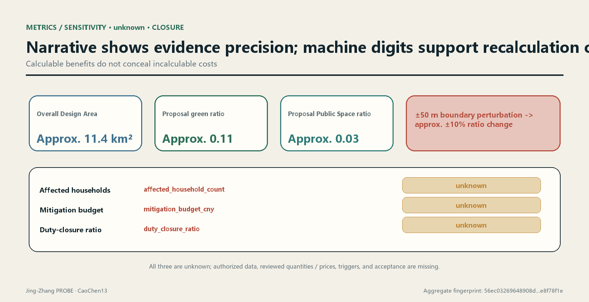

## Risk, Copyright, and Compliance

The first risk-control action is to state "what cannot currently be determined"[depth:risk_missing_data]. When official boundaries, key-area boundaries, existing land use and buildings, ownership, regulatory-plan conditions, road boundaries, station entrances, utilities, rivers, heritage, fire safety, affected population, quantities, unit prices, and funding agreements are absent, the corresponding conclusion remains unknown[source:SITE-PACKAGE]. Arrival of any item may change geometry, project priority, cost calculation, and responsibility chain. It must therefore trigger a version difference and new sign-off, not only an updated source date in the footer.

| Risk | Exposure in this proposal | Control action | Stop condition |
|---|---|---|---|
| Semantic invalidity | Provisional geometry is repeatable but does not represent a real planning boundary | Full difference, recalculation, and professional review after official data arrive | Stop use if geometry source or coordinates cannot be traced |
| Precision misrepresentation | Ratio display precision exceeds the real precision of the boundary | Retain machine values for hash comparison; state sensitivity and effective precision in narrative | Withdraw the conclusion if anyone uses a provisional number for approval or investment judgment |
| Omitted social cost | Household, tenant, merchant, and business data are missing | Verify impact area, object deduplication, action quantities, and unit prices separately | If physical intervention touches an interface while cost remains unknown, construction refinement cannot proceed |
| Responsibility without effect | Only proposed bodies are stated, without triggers and acceptance | Use the responsibility state chain, overdue tasks, and acceptance evidence | Do not claim closure until funding, obligations, or reviewer roles are effective |
| Data and privacy | Scenarios may induce continuous behavior collection | Minimization, non-digital alternative, purpose limitation, retention period, and Human Review | Stop if necessity, authorization, or deletion cannot be explained |
| Operations and decommissioning | Technology facilities are visible but long-term cost is unclear | Include energy, maintenance, replacement, and decommissioning in the quantity ledger | Do not install without stable operating and decommissioning responsibility |

Data completion itself also requires acceptance. When new data enter the data room, register publisher, original address, acquisition and effective times, license, spatial and temporal scope, collection method, coordinate system, transformation process, field dictionary, known omissions, and cross-validation status. Store originals read-only and preserve scripts and hashes for derivatives. For high-impact data such as boundaries, ownership, households, and unit prices, also record who is authorized to provide them, who completed rights clearance, who may view details, and who approved use in this project. Material with incomplete sources or unclear permissions may form leads pending verification but cannot change unknown to known.

Data replacement generates three kinds of differences. Geometry differences list added, deleted, shifted, overlapping, and overrunning objects. Metric differences list numerator, denominator, intermediate quantities, confidence, and interpreted-precision changes. Decision differences list changed projects, phasing, mitigation actions, or responsibility states. Reviewers must choose accept, return, or stop for every item and leave a reason. If any high-impact conclusion changes, old drawings and dashboards are marked invalid, preventing the public or professional teams from continuing to cite a determinate conclusion that is out of date.

For the public-readable layer, publish the data dictionary, aggregate metrics, project status, evidence date, and correction channel. Details concerning households, merchants, companies, and safety are stored under minimum permissions. Openness does not mean publishing every raw datum, and recalculability does not require sacrificing privacy. Independent reviewers can rerun de-identified data in a controlled environment and write only aggregate results, anomalies, and signatures back to the public ledger. If lawful purpose, minimum disclosure, and auditability cannot all be satisfied, the relevant metric remains unknown.

OSM publisher, license, timestamp, collection, transformation, scope, and limitations are registered[source:OSM-CONTEXT], and it is used only as background and leads. The proposal may not use its geometry to generate any formal dimension, area, or ratio. Figures, text, and code use the community-display license. External maps comply with ODbL attribution. Historical images, brands, fonts, people, company marks, and third-party works do not enter formal display before rights clearance. Copyright records in `sources.json` and `report/copyright_statement.md` govern.

AI generation creates no factual exemption. Every generated item should retain prompt input, data version, generation time, human edits, and review records. Model confidence, script stability, and consistent repeated runs cannot prove semantic validity. Outputs involving approval, engineering safety, rights impacts, compensation, and responsibility determinations must be confirmed by authorized people and the relevant professionals.[standard:MOHURD-CONTROL-DETAILED-PLANNING]

This proposal does not claim official approval, does not claim that current conceptual land use and buildings can be directly implemented, and does not claim that affected objects, compensation standards, funding, or responsibility have been determined. The permitted conclusion is that the proposal supplies a design mechanism that can be challenged and rejected with replaceable data and reruns. Its professional validity remains bounded by official data, field verification, statutory process, and human decisions.

## References

The following entries are narrative citation indices and do not expand their original evidence grades:

- Open Call announcement: scope, tasks, and deliverable requirements[source:OFFICIAL-ANNOUNCEMENT].
- Agent taskbook: co-creation principles, agent tasks, and scenario boundaries[source:AGENT-TASKBOOK].
- Site package: design brief, allowed design space, enumerations, scopes, and patterns[source:SITE-PACKAGE].
- Source Registry: usage boundaries for formal, background, provisional, and pending-review material[source:SOURCE-REGISTRY].
- Processed fact pack: reading navigation for three-level scope, tasks, and missing data, not a new authoritative source[source:PROCESSED-FACT-PACK].
- Sources of provisional overall boundary and key-area geometry[source:BOUNDARY-SOURCE][source:KEY-AREA-SOURCE].
- OpenStreetMap background context and field leads registered under ODbL[source:OSM-CONTEXT].
- Global-ecosystem cases: official webpages of AI Singapore 100E, Mila, Vector Institute, STATION F F/ai, and TUM Venture Labs[source:CASE-AISG-100E][source:CASE-MILA-PARTNERSHIPS][source:CASE-VECTOR-INSTITUTE]; the remaining two cases are documented in[source:CASE-STATIONF-FAI][source:CASE-TUM-VENTURE-LABS].
- Cultural narrative: Beijing municipal material on Jing-Zhang railway heritage and public material from the Beijing Municipal Science & Technology Commission and Zhongguancun Administrative Committee on the Zhongguancun Demonstration Zone[source:JINGZHANG-HERITAGE-BEIJING][source:ZHONGGUANCUN-INNOVATION-CULTURE].
- Regional-coordination interfaces: the AI Latitude Community public-consultation notice, Haidian's Fourteenth Five-Year Plan, the Jing-Jin-Ji collaborative-innovation decision, and the three-region technology-transfer measures. They establish only public mechanisms, not project cooperation[source:AI-LATITUDE-PUBLIC-DRAFT][source:HAIDIAN-14FIVE-COORDINATION][source:JINGJINJI-COLLABORATIVE-INNOVATION]; the technology-transfer measures are recorded separately[source:JINGJINJI-TRANSFER-MEASURES].

Machine-readable output entry points are `standard_matrix.json`, `design_depth_matrix.json`, `compliance_matrix.json`, `metrics.json`, `assumptions.json`, `sources.json`, and `self_check.json`. Audit outputs are delivered in `visual/assets/boundary_sensitivity.json`, `visual/assets/run_record.json`, the three gate JSON files, `reversibility-r1-r3.json`, `duty-ledger.json`, and `validation-report.json`. The generation script is not delivered because the package format does not accept `.py` (see "Rerun chain"). All nine spatial file classes are cited near their narrative uses: overall boundary, key areas, land use, buildings, roads, green space, Public Space, constraints, and phasing. A citation anchor proves only that an object can be located, not that it has official force[data:geometry/site_boundary.geojson#SITE-001][data:geometry/key_areas.geojson#PROV-KEY-001][data:geometry/land_use.geojson#LU-001].

This proposal's professional-standards indices are the Open Call announcement, agent taskbook, urban-design management, regulatory-plan depth, land-use classification, and architectural design depth[standard:PROJECT-OFFICIAL-ANNOUNCEMENT][standard:PROJECT-AGENT-OPEN-CALL-TASKBOOK][standard:MOHURD-URBAN-DESIGN-MEASURES]. For specific applicability, response status, and evidence files, `standard_matrix.json` governs. If the narrative and a structured file conflict, pause the conclusion and investigate using version records rather than selecting the more favorable version.
