# 京张探针 Probe

“探针”不是把城区当成技术试验场，而是给每项空间动作装上一套可追问的接口：谁在日常中受益，谁承受施工、噪声、通行或经营代价，谁在什么触发条件下出资、整改并提交验收证据。方案以“日常公共带”为空间主线，把遗址公园、社区界面、学研交流、慢行接驳与便民服务组织成即使智能系统离线也能使用的公共基础；AI只负责帮助发现问题、记录证据和复核闭环，不替代规划审批、专业判断或人的决定。

## 设计依据与资料清单

### 证据先分级，再开始设计

本方案采用“法定与官方依据—仓库登记资料—方案生成几何—待补专业资料”四层证据。征集范围、任务与成果要求来自公告[source:OFFICIAL-ANNOUNCEMENT]，智能体工作边界来自任务书[source:AGENT-TASKBOOK]；规划深度响应分别映射征集公告、城市设计、控规与用地分类要求[standard:PROJECT-OFFICIAL-ANNOUNCEMENT][standard:PROJECT-AGENT-OPEN-CALL-TASKBOOK][standard:MOHURD-URBAN-DESIGN-MEASURES]。`brief/site-package/` 是机器读取入口[source:SITE-PACKAGE]，`data/source_registry.json` 决定资料可否进入正式判断[source:SOURCE-REGISTRY]，处理后的事实包只作导航而不产生新的权威性[source:PROCESSED-FACT-PACK]。

目前可读空间边界是 provisional 粗略替代几何，不是官方红线[source:BOUNDARY-SOURCE]。因此，正文中的“范围内”“沿带”“片区”均是基于当前提交几何的设计索引，不构成土地权属、道路红线、现状用途或审批结论[data:geometry/site_boundary.geojson#SITE-001]。三处重点片区也只承担定位与方案组织功能，公告名义面积与粗略多边形复算值必须分开保存[source:KEY-AREA-SOURCE]。这条证据等级贯穿用地、建筑、交通、蓝绿、分期和指标，不能靠一段免责声明局部豁免。

现状诊断只陈述当前证据能支持的内容[depth:existing_conditions_diagnosis]：

| 诊断对象 | 当前可说 | 当前不可说 | 补数后如何核验 |
|---|---|---|---|
| 范围 | 可用 provisional 多边形建立统一设计索引 | 不可称官方红线或精确地块边界 | 接收清权后的官方 CAD/GIS/PDF，坐标转换后做版本差异图与全量重算 |
| 重点片区 | 可按公告名称和名义面积组织设计任务[source:OFFICIAL-ANNOUNCEMENT] | 不可把粗矩形边解释为道路、地块或产权边 | 以官方片区边界替换并逐项检查方案要素越界、缺口与重叠 |
| 土地与建筑 | 可读取本包的概念用地和模块化基底 | 不可据此判断现状用途、保留、改造、拆除、层数或产权 | 叠合现状调查、房屋安全、权属、文保与控规数据，由专业人员逐栋签认 |
| 交通与市政 | 可表达待勘察的慢行主脊和联络方向 | 不可据此给出道路红线、站口、停车容量、管线或消防结论 | 接入交通调查、站点出入口、道路红线、地下管线与市政容量资料后复核 |
| 社区界面 | 可把 OSM 居住用地边线当成外业核查线索 | 不可推出户数、租住关系、脆弱性、损失或责任 | 采用经授权的房屋与人口资料、现场访谈和经确认的影响范围计算 |

OpenStreetMap 仅用于低置信度城市语境和外业线索[source:OSM-CONTEXT]。它不进入边界、面积、比例、红线、距离或控制结论；任何由 OSM 几何派生的米制数字都不得进入本方案。约束文件中的居住界面线索仍需现场核验[data:geometry/constraints.geojson#OSM-RES-594891968]。这既限制“探针”能观察什么，也避免把众包地图的缺失误写成现实中的不存在。

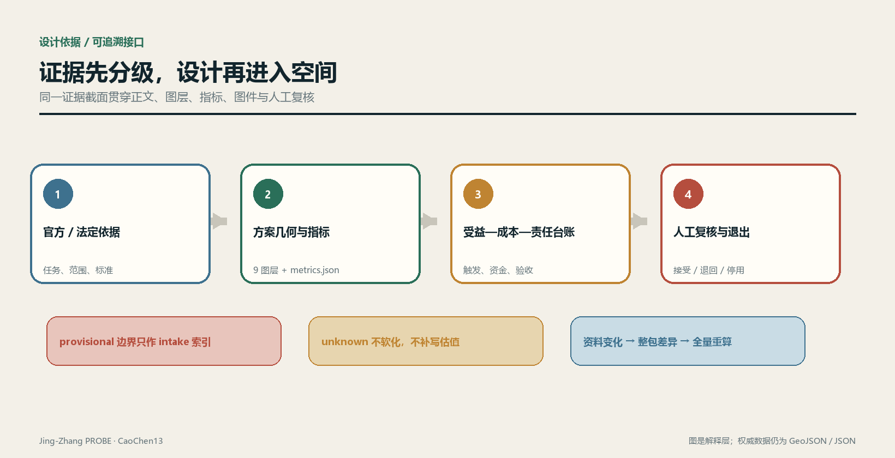

典型段落图只展示设计议题：铁路按已拆、地面、高架与地下投影分符号，右侧界面策略不是现状测绘，不标正式尺寸；图中两侧用途只作为待核线索，不能据此指定新增就业受益方[source:OSM-CONTEXT]。

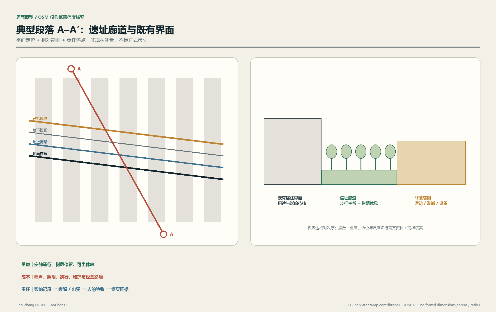

资料更新实行“整包失效”而非局部替换：官方边界、片区、控规或现状调查任一版本变化，都要重跑几何、指标、图件和台账，并保留旧版哈希、差异摘要、复核人和生效时间。这样，评审看到的是同一证据截面，而不是不同日期资料拼成的确定性幻觉。

## 三层范围工作框架

三层范围承担不同问题，不能共享一个分母，也不能把研究判断直接降尺度成地块控制。统筹研究范围只建立产业、人才、文化与城市服务关系；总体设计范围承接空间结构、更新策略、公共系统和实施台账；重点区域用于检验同一方法在不同界面条件下能否落到空间、运营和责任链。范围名称与任务来自公告[source:OFFICIAL-ANNOUNCEMENT]，工作边界与智能体任务来自任务书[source:AGENT-TASKBOOK]。[depth:three_level_scope_framework]

| 工作层 | 核心问题 | 方案输出 | 不越过的边界 |
|---|---|---|---|
| 统筹研究 | 创新资源如何与城市日常发生互惠 | 创新链、公共服务链、开放场景规则与跨片区协作议题 | 不生成正式面积、项目边界或控规指标 |
| 总体设计 | 公共带如何缝合遗址、社区、学研和交通 | 空间骨架、概念用地、建筑模块、慢行网络、蓝绿节点和实施台账 | 当前几何只作概念索引，不替代现状或法定控制 |
| 重点区域 | 不同场所怎样兑现日常受益并约束代价 | 分区动作、界面类型、场景组合、项目门槛和责任闭环 | 名义面积与 provisional 边界分列，不从粗边界推出精确容量 |

总体结构概括为“日常公共带—界面缝合线—片区共益节点”[depth:overall_spatial_structure]。公共带不是单一景观轴：它同时容纳连续步行骑行、树荫停留、基础便民服务、文化记忆、学研交流和可撤除的技术试验。界面缝合线把东西两侧社区、站点和创新空间接入主带；片区共益节点则把企业服务或活动流量转化为可被周边日常使用的空间和资源。道路图层表达方向，公共空间图层表达可进入区域，绿地图层表达生态与热舒适骨架，三者不能互相替代[data:geometry/roads.geojson#ROAD-001][data:geometry/public_space.geojson#PUBLIC-001][data:geometry/green_space.geojson#GREEN-001]。

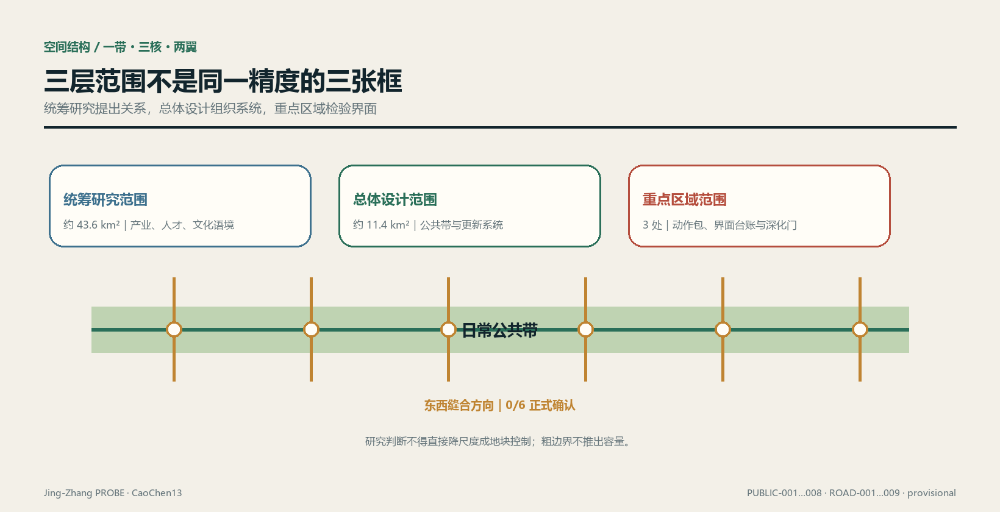

三层之间通过同一份“受益—成本—责任台账”传递，而不是通过同一精度的图形传递。统筹层提出受益假设与公共价值边界；总体层把假设绑定到干预单元、几何版本和数据截止时间；重点区域补齐影响界面、缓解动作、资金来源与验收证据。若下层资料不足，上层愿景不得自动升级为可实施结论。

每个干预单元以 `intervention_id + geometry_version + evidence_cutoff` 形成不可混淆的复算键。受益侧记录对象定义、准入规则、可达性证据和使用证据；成本侧记录经专业确认的影响范围、影响类型、持续条件、行动工程量和审核单价；责任侧记录触发条件、拟议义务人、出资人、复核人、截止条件、验收证据与状态。字段先冻结、数据后进入，防止为美化结果而事后改口径。

## 命名、视觉识别与三区两翼总体结构（agent.1）

本节全部内容是**开放共创的概念建议**，不代表命名已获采纳、标识已注册或空间结构已经审定。命名与总体结构响应任务书的三大定位、五大功能和三区两翼[source:AGENT-TASKBOOK][standard:PROJECT-AGENT-OPEN-CALL-TASKBOOK]；空间落点只引用当前 provisional 方案索引，不推出道路红线、建筑高度、容积率或工程结论[data:geometry/site_boundary.geojson#SITE-001][depth:agent_1_identity_and_structure]。

### 一套母名，四类可扩展名称

母名为**京张探针 Jing-Zhang PROBE**：“探针”指向提出问题、留下证据、接受复核和允许纠偏的方法，不把城市或居民当作被动试验对象。名称不照搬城市、园区或企业品牌；英文统一写作 `Jing-Zhang PROBE`，短标写作 `PROBE`。下列子名只在相应内容存在时使用，避免为没有成果的栏目先造品牌：

| 层级 | 中文 / 英文 | 使用对象 | 命名纪律 |
|---|---|---|---|
| 母品牌 | 京张探针 / Jing-Zhang PROBE | 一带总体方法与提交包 | 只表达“观察—验证—纠偏”，不声称全域感知 |
| 空间系统 | 探针公带 / PROBE Commons | 日常公共带、节点与横向联系 | `Commons` 只用于基本公共使用确实优先的空间 |
| 场景系统 | 探针试窗 / PROBE Test Window | 经门控的场景卡与测试窗口 | 未获批准时必须并列“概念建议 / approval unknown” |
| 运营系统 | 探针接力 / PROBE Relay | 活动、开发者协作与转化路径 | 不把设想活动写成已确定日程 |

### Logo 与视觉识别方向

Logo 方向采用一个自绘的“**开口 P + 轨枕刻度 + 人工复核点**”：开口表示结论可被修订，三段短刻度提示京张工程记忆，实心圆点代表最终的人类判断。它不得直接使用铁路、政府、企业或赛事现有标识，也不使用未授权字体、照片、人物或商标。字标优先采用可核许可的开源黑体或系统无衬线字体；进入正式传播前须完成字体许可、近似商标检索、小尺寸辨识和黑白打印测试[source:AGENT-TASKBOOK]。

视觉系统只保留一组主色：深轨蓝 `#172235`、证据金 `#C79838`、公共绿 `#15803D` 与纸白；状态颜色永远同时配文字和形状，不能只靠红绿区分。动效仅用于“问题出现—证据补齐—人工签认”的三步展开，并提供静态替代。文化导视另有符号系统，见 agent.5；它不能与母品牌 Logo 混用。

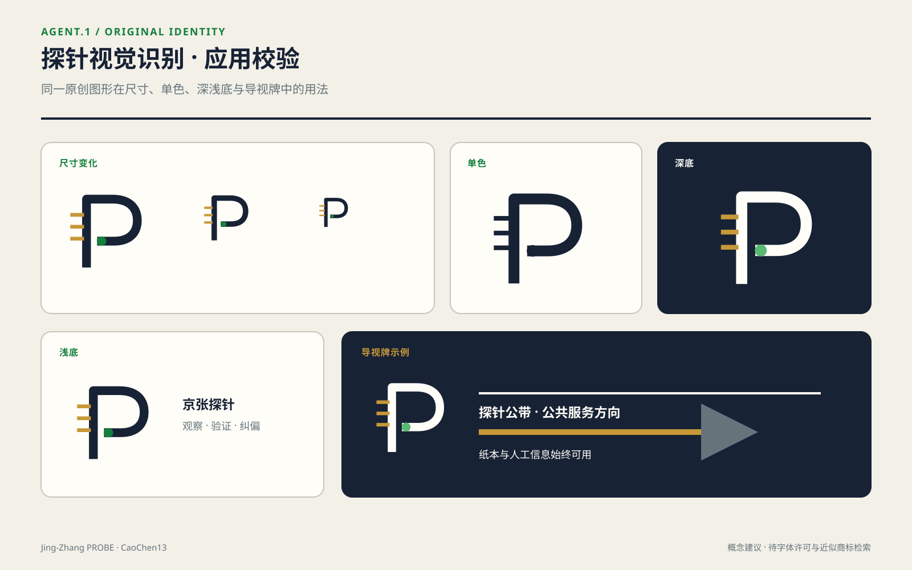

### 三大定位 × 五大功能

| 三大定位 | 对应功能 | 在本方案中的空间兑现 | 验收问题 |
|---|---|---|---|
| 百年京张文化带 | AI治理全球话语权 | 以工程证据、版本记录和公共解释连接遗址叙事 | 历史事实、版权与审批是否完成复核 |
| 都市AI生活体验带 | AI+场景赋能新范式；智能化AI活力城市 | 以离线仍可用的日常公共带承载低风险、可撤场景 | 技术停用后基本通行与服务是否仍成立 |
| AI融合创新带 | AI全栈自主创新体系；世界级AI创新生态 | 以问题—工程—评测—治理—交付回路连接三区两翼 | 是否留下可交接成果，而非一次性展示 |

### 总体空间结构图：一带、三核、两翼、一个证据回路

以下是**协同关系图，不是地理方位图或工程线位图**：

`中关村科技服务翼 ⇄ 众智园全栈核 ⇄ AI原点社区共创核 ⇄ 大钟寺智能原生体验核 ⇄ 小月河场景赋能翼`

`　　　　　　　↖—— 探针公带（公共体验）＋共益台账（证据反馈）——↙`

三区通过当前七个概念公共节点与一条公共带形成可供深化的结构索引[metric:key_area_count][data:geometry/public_space.geojson#PUBLIC-001]；两翼提供要素服务与场景反馈，不被画成新增用地。协同回路按“服务翼提供专业要素—众智园形成工程与治理能力—原点社区组织研究、人才和社区共创—大钟寺验证公共解释与智能原生服务—场景翼回传真实使用问题—共益台账决定继续、修改或停用”运行。任何环节的企业名单、资金、算力、人才规模和实施主体当前均为 `status: unknown`，需要清权名录、有效协议、容量与服务记录后才能填入[metric:ecosystem_partner_count][metric:compute_capacity]。

## 统筹研究范围产业与未来城市研究

### 从“产业集聚”转向“城市互惠”

公告要求研究 AI 产业生态、创新链、人才与未来城市形态[source:OFFICIAL-ANNOUNCEMENT]。本方案不把企业数量或活动热度直接当作公共价值，而把产业资源能否转译为日常可用服务作为判断：企业测试需要真实场景时，应同步提供可公开使用的空间改善、无障碍信息、社区服务或维护资源；大型发布与访客流量进入公共带时，应同步记录拥挤、噪声、保洁、安保和小商户经营影响，并把缓解责任写入台账。所有产业规模、人才密度、活动参与和就业效果在缺少可信基线时均保持 `status: unknown`，所需资料为经清权的企业名录、就业口径、人才调查、活动日志和空间使用基线。

统筹层形成“策源—转化—展示—日常反馈”的协作回路，而非封闭园区链。高校与研究机构可提出开放课题，企业和服务机构承接转化，公共带提供经审批的低风险验证界面，居民、通勤者与访客通过明确的参与规则反馈；任何涉及个人行为的数据默认最小化，能用人工巡查、匿名计数或定期抽样回答的问题，不启动持续个体追踪。智能体只整理证据、标记冲突和生成待复核清单，最终判断由专业团队与受影响群体完成。[standard:PROJECT-AGENT-OPEN-CALL-TASKBOOK]

未来城市的空间原型是“技术可退场、公共性不退场”。导航屏、传感器或服务代理离线时，步行路径、遮荫、座椅、导视、便民服务与无障碍连接仍应成立；算法更新不得改变人的基本通行权。技术试验采用可撤、可替、可审计的接口，先在不涉及人身与敏感数据的维护、环境与设施状态问题上运行，再由独立复核决定是否扩展。

### 统筹层的互惠合同

每个参与机构进入公共带场景前提交一页机器可读合同：提供什么公共资源、预期服务谁、可能把什么成本转移给谁、由谁出资缓解、怎样停用、数据怎样删除、由谁确认闭环。合同对应空间对象和项目台账，不能只停留在合作单位名单。若受益证据只能证明机构曝光而不能证明公共使用，项目仍可作为产业活动讨论，但不得计入公共受益。

品牌“京张探针”也遵循这套纪律：它代表可观察、可复核、可纠偏的工作方法，不声称城市已被完整感知。文化叙事以铁路遗址和创新文化的并置为线索，但具体文保对象、保护范围、标识与图像授权必须由正式资料确认；在此之前只给出叙事结构，不画伪控制线。[standard:MOHURD-URBAN-DESIGN-MEASURES]

## 全球AI创新生态与产业—空间映射（agent.2）

### 五个公开案例：只迁移机制，不移植结论

案例表选取五个可由运营方或机构官网核查的公开案例 `[metric:ecosystem_case_count]=5`。表内不使用企业估值、投资额、产值或未经交叉验证的规模数字；案例只证明某种机制在别处被公开采用，**不证明该机制适合本场地，也不证明任何本地合作已成立**[depth:agent_2_global_cases][standard:PROJECT-AGENT-OPEN-CALL-TASKBOOK]。

| 案例 | 官网可核事实 | 可借鉴机制 | 不可外推的边界 |
|---|---|---|---|
| AI Singapore · 100 Experiments（新加坡） | 官网把项目组织为评估与界定、实施、交接，并把工程人员与学徒投入真实问题[source:CASE-AISG-100E] | 问题定义先于开发；交接文档与能力转移是完成条件 | 不移植其资助、周期、准入或成效数字；本地资金与参与者 unknown |
| Mila 产业合作生态（蒙特利尔） | 官网公开应用/基础研究合作、人才连接、协作工作空间与培训活动[source:CASE-MILA-PARTNERSHIPS] | 把研究、人才、企业问题和共同空间做成多入口服务 | 不把伙伴数量或组织名单映射为本地招商承诺 |
| Vector Institute（多伦多） | 官网把研究与人才、可信AI采用、工程支持和跨部门合作并列[source:CASE-VECTOR-INSTITUTE] | 研究机构同时承担采用支持与负责任实施接口 | 其研究空间并非公共旅游设施；不能据此要求本地实验室开放 |
| STATION F · F/ai（巴黎） | 2026年官网将早期AI创业者与技术、研究、算力链和投资专业方组织在单一项目中[source:CASE-STATIONF-FAI] | 以策划项目压缩多类资源的接入摩擦 | 不复制企业名单、遴选机制、收入目标或“最大”等自述 |
| TUM Venture Labs（慕尼黑） | 官网将高校研究与创业中心连接为领域化孵化网络，覆盖从想法到早期创业支持[source:CASE-TUM-VENTURE-LABS] | 共享底座与领域实验室并存，服务不同技术成熟度 | 不外推其孵化倍增目标、资本安排或当地制度条件 |

### 生态图谱：问题进入，证据交付

本方案把世界级生态拆成可核验的六层，而不是企业 logo 墙：

`公共/产业问题 → 研究与人才 → 数据/算力/工具底座 → 工程与测试 → 安全/伦理/标准评测 → 场景交付与公共反馈`

每层输出都必须能交给下一层：问题层交付带受益与风险边界的 brief；研究层交付可复现方法；底座层交付权限、成本、能耗与服务窗口；工程层交付版本和测试记录；治理层交付人工复核与停用条件；场景层交付使用、影响和责任证据。缺任一交接件，项目留在 `evidence_pending`，不得用活动曝光替代转化[standard:PROJECT-AGENT-OPEN-CALL-TASKBOOK][metric:approved_scenario_count]。

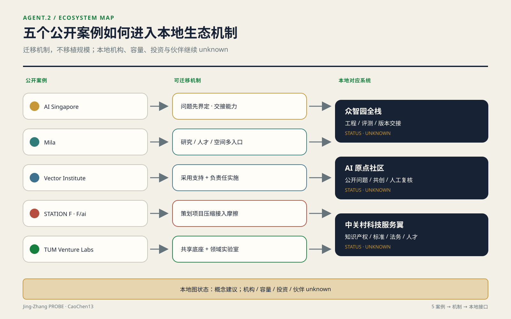

### 众智园全栈、AI原点社区与中关村科技服务翼

| 系统 | 概念角色 | 空间载体 | 进入条件 | 当前状态 |
|---|---|---|---|---|
| 众智园全栈自主体系 | 问题界定、工程实现、评测治理、版本交接 | 众智园开放创新客厅与受控室内测试界面[data:geometry/key_areas.geojson#PROV-KEY-001] | 权属、安全、数据、算力与运维责任签认 | 概念建议；机构、容量、投资均 unknown |
| AI原点社区创新生态 | 研究者、学生、开发者、居民和服务者共同提出/复核问题 | 近校共享街、公共带节点与经许可的协作空间[data:geometry/key_areas.geojson#PROV-KEY-002] | 自愿参与、公开议题、无障碍与隐私复核 | 概念建议；参与规模与开放场所 unknown |
| 中关村科技服务翼 | 提供知识产权、标准、法务、人才、资本对接等专业服务入口 | 线上服务台＋经确认的存量服务点，不预设新增建设 | 服务机构清权、适用范围、收费与责任披露 | 概念建议；伙伴清单、资金和效果 unknown |

### 产业—空间—要素映射

| 要素 | 方案机制 | 对应空间 | 必须补齐的资料 |
|---|---|---|---|
| 土地 | 只做权利与开放条件核验，不承诺供地 | 三处 provisional 片区索引 | 官方边界、权属、规划条件、审批状态 |
| 空间 | 可迁移工位、共享评测桌、公共解释界面 | 众智园受控界面、原点社区共创点、大钟寺公共厅 | 消防、无障碍、开放协议、容量与运维 |
| 产业 | 以公开问题和交付物组织协作，不先列企业 | 三核分工＋服务翼 | 清权企业名录、需求与能力证明 |
| 资金 | 只登记成本承担、资金状态和退出条件 | 共益台账，不映射为建设体量 | 资金来源、额度、有效期、审计与批准 |
| 人才 | 课题—学徒—工程—交接的能力链 | 原点社区与众智园之间 | 自愿报名、资格口径、导师与岗位记录 |
| 算力 | 供应商中立的预约、配额、能耗与撤销规则 | 受控室内/远程服务，不在公共带设默认采集 | 统一容量单位、服务等级、成本、能耗、安全审计 `[metric:compute_capacity]` |
| 数据 | 合成/公开/授权数据分级，最小权限与到期删除 | 数据室与审计终端 | 数据清单、权利基础、字段字典、保留期 |
| 场景 | 小范围、可撤、有人复核的测试窗口 | 小月河场景翼与公共体验路径 | 场地、运营、安全、隐私、可达性与停用批准 |

这张映射不产生招商名单。`[metric:ecosystem_partner_count]` 维持 `status: unknown`，需要“可公开身份＋签署角色＋有效期限＋披露许可”四项齐备的合作台账；`[metric:compute_capacity]` 同样为 unknown，需要供应商中立的容量单位、时窗、分配规则、费用与能耗记录。五个案例只校准机制语言，不填这些本地 `unknown`。

### 区域协同接口：只接公开机制，不预写合作结果

本方案不掌握跨区协同的实际数据，仅提出接口与验证条件。中关村 AI 北纬社区的公开征求意见公告只支持一项可核事实：其方案意在与 AI 原点社区形成南北呼应[source:AI-LATITUDE-PUBLIC-DRAFT]。因此本方案只建议两端使用兼容的 `problem_brief`、准入状态、许可、版本、退出与交接字段；是否已有共同运营者、项目、算力、资金、企业或人员往来全部 `unknown`，须以双方有效协议和同一观察窗口内的交接记录核验。

海淀区“十四五”规划曾写明与未来科学城探索创新生态链共建、与怀柔科学城探索大科学装置共享、与北京经济技术开发区加强创新链产业链衔接[source:HAIDIAN-14FIVE-COORDINATION]。本方案不把规划表述写成已经发生的协同，只保留三种机器接口：向未来科学城交付带权利边界的问题 brief 与可复用评测件；向怀柔科学城提交能力需求、资格、预约、批准、使用和归还证据；向经开区提交版本、测试、合规、移交和退出材料。具体机构、设施可用性、项目、资金、企业、指标与服务时窗均为 `unknown`，须由有权限的参与方逐项确认。

京津冀层面，北京市人大常委会决定公开了供需对接清单、概念验证、成果孵化、中试基地和应用场景等协同机制[source:JINGJINJI-COLLABORATIVE-INNOVATION]；2025 年三地科技部门措施进一步提出常态化成果对接、概念验证、中试熟化与跨区域服务链条[source:JINGJINJI-TRANSFER-MEASURES]。本方案可输出与这些机制兼容的“问题—权利—版本—测试—影响—责任—退出”交接包，但不声称本项目已进入任何清单、平台或专项。对接主体、资格、成果权利、承接地、资金、合同、绩效与区域贡献全部 `unknown`；只有有效登记、双方签认和可核验交接证据齐备后，才允许从“接口建议”升级为“协同记录”。

## 总体设计范围城市更新与控规深度城市设计

### 空间骨架：一条日常带，而不是一条活动带

总体设计把京张遗址方向转译为连续公共生活骨架：中部是步行、骑行与树荫停留并行的公共带；两侧是面向社区、学研、便民商业与文化服务的兼容界面；横向联系在确认道路、铁路、站点与市政条件后逐段深化。现有道路文件仅是概念中心线，不是道路红线或工程线位[data:geometry/roads.geojson#ROAD-001]。空间结构优先保证通勤、接送、休息、运动和便民服务等高频日常使用，活动、展示与测试只能占用可撤除的时空单元，不得挤占基本通行。

土地方案采用可校验的 `land_use_code`，但表达的是设计分区，不是现状调查或法定用地[standard:MNR-LAND-USE-CLASSIFICATION-GUIDE]。日常公共带绿地核心、社区服务界面和外围兼容区共同形成一套“先公共连续、再业态嵌入”的布局[data:geometry/land_use.geojson#LU-001]。边界内的概念分区用于检查方案是否自洽；官方现状用地、地块、权属和控规到位后，要逐面生成“保留、冲突、缺口、越界”差异表，不允许把概念分区直接改名为规划成果。[depth:land_use_layout]

公共带沿线设置南北门户、社区休憩、文化展示、日常市集、学研交流与青年服务等节点。节点不是独立地标，而是把水、厕、休息、遮荫、无障碍、维修、便民业态或小型协作空间组合成可持续运营的服务单元。模块基底记录在建筑文件中，全部标为低置信度概念建议[data:geometry/buildings.geojson#BLDG-001]；它们可在后续被置入经确认的空置建筑、可改造首层或合规新建位置，不能据当前图形判断拆建。

### 控规深度：把不能判定的内容列为审查门槛

本方案把控规相关内容分成“当前可复算的方案量”“正式资料到位后可判定的控制量”“现阶段不得推定的实施量”[standard:MOHURD-CONTROL-DETAILED-PLANNING]。当前可复算的是提交几何的面积、并集比例和概念基底；容积率、建筑高度、建筑密度、法定绿地率、退线、道路红线与设施容量均为 unknown。开发强度不以一个目标数替代，而以容量校核流程表达：锁定批准边界与地块，导入合法建筑面积和保留量，校核交通、市政、消防、日照、文保与公共服务，再计算各地块和总体强度，最后由专业审批结论决定。[depth:development_intensity_controls]

高度与体量遵循“公共带侧降压、节点处留出通风与视线、既有社区侧减少突兀界面、遗址叙事不被技术地标压倒”的设计原则[depth:height_massing_character]。这些是后续专业推演的判据，不是高度数值。任何体量进入方案比较前，必须绑定批准的高度条件、现状测绘、日照与消防校核；缺一项则只能保留为体块选项，不进入容量或合规结论。[standard:MOHURD-ARCH-DESIGN-DEPTH-2016]

### 三种资料世界，三种空间备选

官方边界、控规和现状调查尚未给出时，不能把一张总图冻结成唯一答案；但也不能只留下 unknown 清单。本方案把待揭晓资料写成三组有先后关系的选择门：边界能否容纳连续骨架、批准容量是否允许净新增建筑、经确认的居住与经营影响是否已经有资金和闭环条件。`[metric:floor_area_ratio]`、`[metric:affected_household_count]` 仍保持 unknown[source:SITE-PACKAGE]，以下不是好—中—差三档，而是同一公共目标在三种数据世界中的不同空间组织；其定位锚点均来自当前 provisional 总体范围[data:geometry/site_boundary.geojson#SITE-001]。

**连续骨架保全案——对官方边界与穿越条件敏感。** 空间上保留三条南北向慢行线（公共带主脊、自行车线、无障碍步行线），由六条东西联络把两侧界面接回主脊；七个公共节点与绿荫口袋沿线分布，居住侧先布安静通行与日常服务，活动、装卸和设备退到非居住侧；新增体量只在外翼兼容区研究，公共带侧保持低压、通透[data:geometry/roads.geojson#ROAD-001][data:geometry/public_space.geojson#PUBLIC-001]。它假设官方边界完整包含 `PUBLIC-001…008`，且 `ROAD-004…009` 六处联络均能在正式红线、权属和工程核查后形成合法安全的公共穿越；容积率落在哪个数值区间不决定骨架选择。**选择条件**是上述集合包含关系成立且六处穿越全部通过，任一处失败即淘汰整套“全连续”主张、转入另外两案。选错后的回退需取消已失败联络、重排节点，铺装和蓝绿工程可能进入下述 R2，桥隧、地下管线或永久建筑则会进入 R3；在条件确认前只允许标线、可移家具和运营测试。若入选，`ROAD-001…009`、`PUBLIC-001…008`、`GREEN-001…008` 保留为深化骨架，`BLDG-001…014` 与 `PHASE-002/003` 随批准容量和工程条件重定位，不直接施工。

**存量界面织补案——对法定容量与可改造存量敏感。** 空间从“连续宽带”改为“可用首层—院落—入口前厅—导向路径”的串珠网络：服务节点进入经结构、消防、权属核验可保留的建筑，节点之间用确认过的公共通行权、街角和遗址方向串联；主脊只作为寻路骨架，不要求每一段都扩成新公共空间。强度取向是**净新增建筑面积为零**：先定义 `ΔGFA = 批准可建设总建筑面积 − 经核合法保留总建筑面积`，本案假设 `ΔGFA ≤ 0`。第二个判断此前写作"存量足以容纳需求清单"，属不可判定表述，现改为可复算判定式：

- **存量容量判定** `S = Σ(经结构/消防/权属核验可保留建筑的可用首层面积) − Σ(公共服务节点需求面积)`，**`S ≥ 0` 成立即通过**。两侧当前均为 `unknown`：前者需存量普查与合法性核验结果，后者需服务需求清单及单点面积标准。
- **新增优先判定** `R_新增 = 新增公共可达面积 / 新增建筑面积`，`R_存量 = 改造后新增公共可达面积 / 改造建筑面积`；**仅当 `R_新增 > R_存量` 时，才判定"批准新增更能满足公共目标"**。两个比值当前均为 `unknown`，需批准容量与核验后的存量清单。

**选择条件**是 `ΔGFA ≤ 0` 与 `S ≥ 0` 同时成立；若 `S < 0`，或 `ΔGFA > 0` 且 `R_新增 > R_存量`，则淘汰本案。三个量在资料到位当天即可代入，判定结果不依赖评审者的主观权衡——**口径已在此固定，事后不得为了让本案存活而调整。**其代价集中在室内适应性改造、入口无障碍和使用协议，按下述 R2 管理；隔断、家具和导视可回退，结构加固、长期租约与用途审批不可假装可逆。若入选，`BLDG-001…014` 删除“落位基底”含义、只保留可迁移的功能模板，`PUBLIC-002…008` 移至核验后的存量入口，`LU-002` 的社区服务界面由面状预设改为逐栋协议清单[data:geometry/buildings.geojson#BLDG-001][data:geometry/land_use.geojson#LU-002]。

**邻里避让回路案——对受影响户与经营影响敏感。** 空间上保留不触及已确认影响界面的公共带段，把市集、展示和夜间活动撤出居住侧；横向联系不再追求六线齐开，而按“零未缓解影响”逐条选择，无法闭环的线位用可识别绕行、错时开放或机构内部通道替代。界面不新增建筑体量，安静侧只保留通行、遮荫、照明和便民休息，设备、装卸与聚集功能移到经确认的非敏感侧。它假设某一拟建界面的 `[metric:affected_household_count] ≥ 1`，并且该界面的 `[metric:mitigation_budget_cny]` 仍为 unknown、资金未生效或到期行动未验收。**选择条件**是三项中前一项成立且后两类闭环缺口至少一项存在；当所有拟建界面影响户数均为 0，或每一非零影响都已有审核行动、资金与验收责任时，本案淘汰并重新比较前两案。该案先行只用 R1 动作，误判时可撤除导视、活动和时段规则；不得先做永久阻隔、开挖或拆建。若入选，`PHASE-002` 暂停，`ROAD-004…009` 按专业影响区逐条删除或绕行，`PUBLIC-003…007` 迁离未闭环界面；哪些要素改变由未来影响叠合表判定，本次不修改 GeoJSON[data:geometry/phasing.geojson#PHASE-002][data:geometry/constraints.geojson#COST-SCREEN-001]。

| 方案 | 对边界敏感度（可判定门） | 对容积率敏感度（可判定门） | 代价规模 | 可逆性 | 先行可实施性 |
|---|---|---|---|---|---|
| 连续骨架保全案 | 官方边界不完整包含 `PUBLIC-001…008` 或六处穿越任一未通过即淘汰 | 骨架选择不依赖数值；建筑仅在批准 `ΔGFA > 0` 后研究 | 金额 unknown；跨越、管线、永久建筑可能触及 R3，缺工程量与审核单价 | 标线/家具为 R1；铺装蓝绿为 R2；永久工程不可按 R1 回退 | 可先做核查和可撤除通行测试；实体连续工程须六处穿越全部过门 |
| 存量界面织补案 | 只要求逐个存量点及通路位于确认权利范围；任一点可迁移，不承诺整带内包 | `ΔGFA ≤ 0` 且可改造存量足够时选择；任一条件不成立即淘汰 | 金额 unknown；室内改造、无障碍与协议工程量缺失，按 R2 筛选 | 家具/导视 R1；机电、加固、长期使用权不是完全可逆 | 可先做存量盘点；消防、权属和开放协议签认后才可试点 |
| 邻里避让回路案 | 以确认公共通行权逐段绕行；无连续合法替代路径时该段为 unknown、不得画成已连通 | 影响界面净新增量固定为 0，不以 FAR 放大补偿 | 金额 unknown；闭环前只准 R1，缺影响对象、行动工程量和资金协议 | 只启用可撤导视、时段与活动单元；永久工程被门槛禁止 | 经权属和安全确认的临时绕行可先行，任何界面施工不得先行 |

这张矩阵也暴露本方案的量化弱点：当前图面有六条横向联络，但获得正式红线、权属与工程可行性确认的是 **0/6**[source:SITE-PACKAGE][data:geometry/roads.geojson#ROAD-004]。因此“连续骨架”在图上最完整，却是三案中最先可能被官方资料淘汰的一案；这个 0/6 不能被九条线形成的漂亮网络图掩盖。

### 受益—成本—责任作为总图过滤器

每个空间动作先回答三问。受益：是否改善公共通行、日常停留、服务可达或社区与学研之间的资源共享，证据由何种匿名、可复核方式取得。成本：施工、绕行、噪声、经营、维护、能源、隐私或空间排他成本落到哪个界面，是否有经专业确认的影响范围。责任：何种阈值触发行动，由谁提出、谁出资、谁复核、以什么证据结案。未完成三问的动作可以留在方案备选库，但不得进入先行项目。

核查带 `COST-SCREEN-001` 是方案生成的分析包络，不是现状影响区或监管控制线[data:geometry/constraints.geojson#COST-SCREEN-001]。它只负责提醒：落入带内的干预必须检查相邻界面。正式影响范围仍须由交通、声环境、施工组织、商业与社会影响等专业方法确定。这样“代价”成为设计过滤器，而不是事后附上的态度声明。

按人群重算及其未覆盖对象见“公共利益、人群归属与包容性”一节；此处不重复维护。

## 重点区域详细设计

三处重点片区的名称、任务和公告名义面积来自征集公告[source:OFFICIAL-ANNOUNCEMENT]；当前边界均为 provisional 粗略定位[source:KEY-AREA-SOURCE]。因此详细设计采用“空间动作包 + 界面台账 + 深化门槛”，不从矩形边界推导地块容量。[depth:three_key_area_detailed_design]

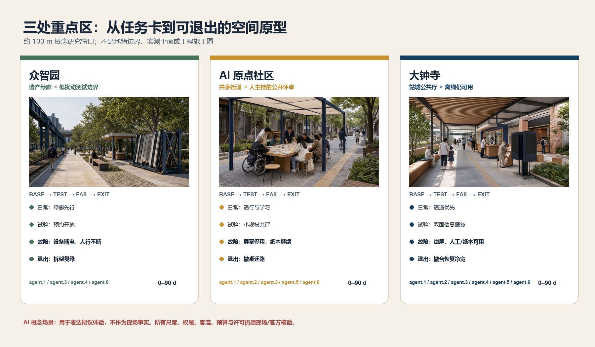

### 三处空间原型：100 m 级概念研究窗口

下面三张原型页把既有任务进一步落到“空间序列—可逆组件—四态运行—0–90 天验证”。这里的约 100 m 只表示设计研究的观察尺度，不是实测半径、地籍边界或工程总平面；正式边界、尺寸、权属、客流、预算、许可与实施主体仍为 `unknown`。场景图由 AI 生成，只表达拟议体验，不作为现场照片或现状证据。结构化原型记录见 [key-area-prototypes.json](visual/assets/key-area-prototypes.json)。

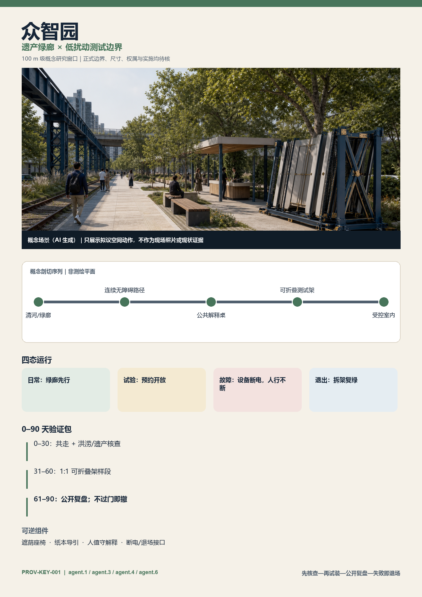

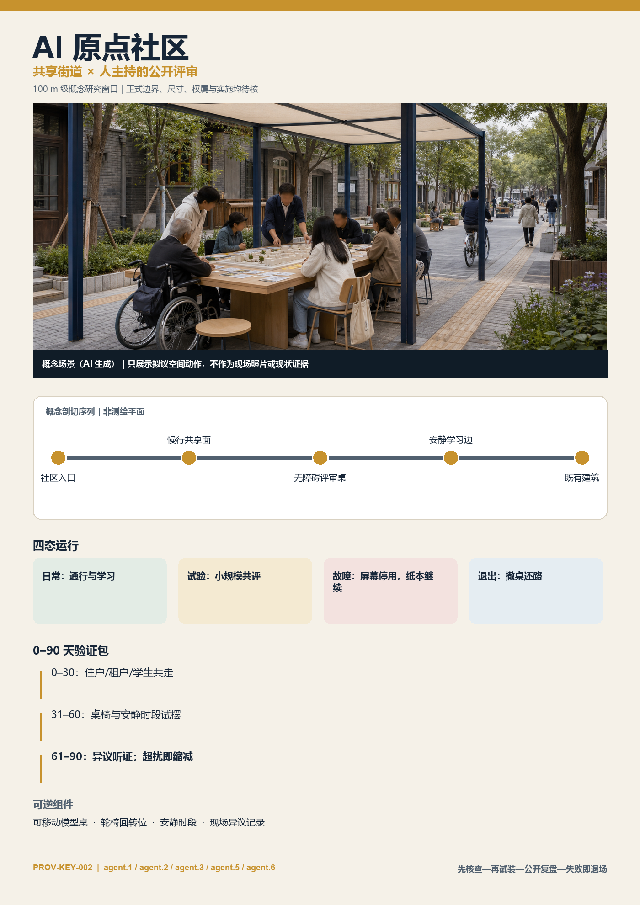

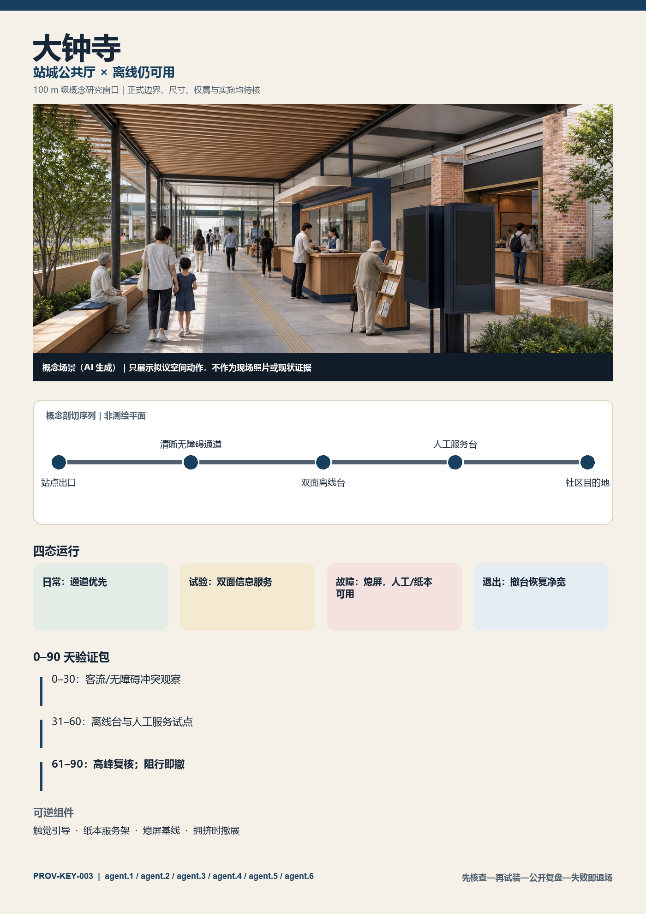

三处原型共同遵守 `BASE → TEST → FAIL → EXIT`：日常公共服务不依赖设备；试验只在预约、限时和可观察条件下开启；故障时设备停用但通行、人工与纸本基线继续；退出时拆除临时构件并恢复公共空间。0–30 天只做共走和专业核查，31–60 天只做 1:1 可逆样段，61–90 天进行公开复盘；没有通过门槛就缩减或撤除，而不是把试点自动固化为建设承诺。[depth:three_key_area_detailed_design]

首屏任务闭环为：`agent.1` 检查公共价值门，`agent.2` 组织产业—社区接口，`agent.3` 保障公共空间和无障碍基线，`agent.4` 定义可逆构件，`agent.5` 负责可理解叙事与导视，`agent.6` 管理运营、停用与转化。三处不要求平均分配六项任务；大钟寺承担六项的完整接口测试，其他两处按实际问题选择任务组合。

### 众智园：清河创新客厅与低扰动测试界面

众智园片区的方案锚点是面向清河和公共带的开放创新客厅[data:geometry/key_areas.geojson#PROV-KEY-001]。靠公共界面布置可预约的成果解释、标准协作、低碳设施展示与日常休息；高噪声、高安保或需专用数据的测试退入受控室内。对外交通先做接驳、步行和骑行冲突调查，再决定线位；清河界面先核洪水、生态、蓝线与管养条件，再决定设施。园区获得展示和协作场景的同时，必须提供可被周边使用的遮荫、休息、慢行维护或公共课程，并把开放时段、停用条件和维护责任写进台账。

成本侧重点检查活动人流、夜间扰动、配送与施工对相邻社区和河道管理的影响。若专业核查确认存在影响，项目实施主体须把缓解行动、审核工程量、单价来源、资金状态与验收证据挂到同一干预单元；在此之前，[metric:mitigation_budget_cny] 保持 `status: unknown`，需要经审核的行动数量、单价、资金协议和人的批准。

### 北京 AI 原点社区：近校共享街与人才日常服务

原点社区以校区—园区—社区之间的日常共享街为骨架[data:geometry/key_areas.geojson#PROV-KEY-002]。成果发布、开源协作、知识产权与企业服务被嵌入可步行的首层和既有空间更新，而不是另造封闭展馆；人才服务与周边居民共享餐饮、运动、托育咨询、文化和夜间安全等基础设施，但具体设施配置须由供需调查决定。校园数据、科研成果和个人身份信息不因“开放”而自动获得授权，任何数字服务都应提供非数字替代路径。

该片区最敏感的不是“有没有活动”，而是创新溢价是否把日常成本转给租户、小商户或低议价使用者。当前没有租金、合同、空置、营业或家庭资料，因此涨租、搬迁、受影响户数与安置安排均不作数量判断。[metric:affected_household_count] 保持 `status: unknown`；填数需要经授权的房屋与住户资料、经专业确认的影响范围和一致的去重规则。资料到位后按本文固定公式计算，不能临时改成只统计更容易补偿的对象。

### 大钟寺：站城公共厅与四向步行缝合

大钟寺片区把站点周边访客流、产业展示与社区日常通行组织为共享公共厅[data:geometry/key_areas.geojson#PROV-KEY-003]。空间动作包括连续可识别的地面步行界面、可撤除的路演与展示单元、全天候基础导视、便民停留和与公共带的慢行联系。站口、道路交叉口、地下空间与管线条件必须以正式资料核准；当前方案只确定“先保证穿行，再安排活动；先保证日常服务，再配置品牌展示”的优先级。

活动和商业受益不得只由主办方客流证明。台账分别记录通行者、周边居民、小商户、企业访客与运营人员的受益定义，分开采集使用证据；保洁、安保、噪声、绕行、装卸和撤场成本则对应具体行动与出资方。若基本通行或无障碍验收未通过，展示活动不能以“总体活力”抵消该缺口。

三片区使用同一深化模板：现状证据与版本、公共空间与慢行骨架、用地建筑选项、受益对象定义、影响界面、缓解清单、责任触发器、项目门槛和复核记录。模板相同，结论不预设相同；若证据显示某片区更适合轻运营而非建设，允许缩减物理干预。

## AI 创新生态、人才画像与 AI+ 场景

### AI+场景卡、任务画像与运营边界（agent.3）

以下每张卡都标为**概念建议**，不是调研结论、成熟度证明或已批准运营。任务书要求不少于10张场景卡、3个产业测试验证场景和5类用户画像[source:AGENT-TASKBOOK]；本包登记 `[metric:scenario_card_count]=12`、其中 `[metric:industry_test_scenario_count]=4`，并用 `[metric:persona_count]=8` 类任务画像做需求检查[depth:agent_3_scenarios_personas]。

#### 十二张场景卡

| ID / 状态 | 场景与类型 | 主要用户 | 空间—运营方式 | 成立前置条件 | 隐私、人工复核与停用边界 |
|---|---|---|---|---|---|
| SC-01 概念建议 | 无障碍慢行助手 / 公共服务 | P-02、P-03 | 探针公带与横向联系；运维台发布临时绕行 | 实测连续路径、无障碍审计、更新责任人 | 不识别人；使用者与交通专业人员验收；数据过期即停自动推荐 |
| SC-02 概念建议 | 设施故障分诊 / 公共服务 | P-01、P-08 | 七个概念公共节点；人工工单队列[data:geometry/public_space.geojson#PUBLIC-002] | 设施清单、响应时限、运维班组、线下报修入口 | 只记录设施事件；模型只排序，关闭工单须人工核验 |
| SC-03 概念建议 | 树荫与休息人工巡检助手 / 公共服务 | P-01、P-03 | 绿脊和口袋节点；季节性人工抽样 | 树木、热环境、座椅与时段基线 | 不采集人脸/轨迹；无法解释建议时退回人工表单 |
| SC-04 概念建议 | 多语公共解释台 / 公共体验 | P-04、P-07 | 遗址叙事点与大钟寺公共厅；可撤终端＋纸本 | 历史审校、译审、版权、无障碍替代 | 不保存声音；高风险历史/政策回答由编辑确认后发布 |
| SC-05 概念建议 | 社区服务导航 / 公共服务 | P-01、P-03 | 原点社区共享街；人工维护的公开服务目录 | 服务机构清权、开放时间、资格与纠错渠道 | 不推断健康/收入；资格结果只作线索，由服务人员决定 |
| SC-06 概念建议 | 低扰动活动调度 / 场景运营 | P-01、P-06、P-08 | 可撤活动单元；时段、装卸、保洁、安保台账 | 消防、噪声、基本通行、社区沟通和责任确认 | 不做个体客流跟踪；任何安全/通行门槛失败即暂停 |
| SC-07 概念建议 | 开放问题协作台 / 创新服务 | P-04、P-05、P-08 | 众智园创新客厅；公开 brief—评审—交接流程 | 问题权利基础、数据许可、导师与交付负责人 | 不接收个人或商业秘密；是否进入开发由人类评审 |
| SC-08 概念建议 | 合成数据互操作测试 / **INDUSTRY-TEST** | P-05、P-08 | 众智园受控室内沙盒；版本化 API 测试 | 合成/公开数据、接口规范、安全隔离、退出方案 | 禁用真实个人数据；测试报告人工签名，不能直接上线 |
| SC-09 概念建议 | 边缘设备耐候与可维护性测试 / **INDUSTRY-TEST** | P-05、P-08 | 小月河场景赋能翼的可撤测试架，位置待核 | 场地/电气/生态/安全批准，非采集模式，运维与撤除责任 | 默认不装摄像/麦克风；专业人员验收，影响水岸/通行即撤除 |
| SC-10 概念建议 | 室内机器人补给协同 / **INDUSTRY-TEST** | P-05、P-08 | 经批准的封闭室内路线；不进入公共通行面 | 权属、消防、职业安全、保险、应急停机 | 不采集旁观者；安全员在场，一键停机，禁止据此声称室外可行 |
| SC-11 概念建议 | 模型红队与人工复核台 / **INDUSTRY-TEST** | P-04、P-05、P-08 | 原点社区/众智园受控评测室；公开测试卡 | 明确用途、风险分类、评测数据许可、申诉与停用流程 | 高影响输出不得自动执行；独立复核人签认每次版本结论 |
| SC-12 概念建议 | 小商户自愿内容助手 / 日常经营 | P-06 | 大钟寺服务点；预约辅导＋可退出账号 | 自愿加入、内容版权、收费透明、人工帮助渠道 | 不抓取经营数据；发布前由商户确认，退出即删除可识别资料 |

#### 八类任务画像，而不是个人档案

| ID | 任务画像 | 核心任务 | 不能假定 | 参与方式与前置条件 |
|---|---|---|---|---|
| P-01 | 沿线居民 | 安静通行、休息、日常服务、表达影响 | 不假定年龄、产权、收入或支持态度 | 自愿访谈、公开议事、可撤回意见记录 |
| P-02 | 通勤与接送者 | 快速连续通行、施工绕行、夜间可读 | 不假定固定路线或设备持有 | 定点人工观察＋匿名问卷，先完成交通许可 |
| P-03 | 行动不便与照护同行者 | 无障碍连续、可坐、可求助、非数字替代 | 不用医学标签定义个人 | 付费参与式审计、无障碍组织与专业人员共同验收 |
| P-04 | 高校师生与研究者 | 公开课题、研究交流、负责任评测 | 不默认学校或实验室参与 | 公开报名、知识产权与伦理审查 |
| P-05 | 开发者与初创团队 | 工程沙盒、算力/数据规则、交付与创业服务 | 不编造企业名单、融资或岗位 | 公开问题申请、技术与治理双评审 |
| P-06 | 小商户与服务经营者 | 装卸、客流、可见性、停业影响与自愿数字服务 | 不推断营业额、租约或数字能力 | 入户须授权；记录经营影响与退出渠道 |
| P-07 | 访客与国际交流者 | 清楚导视、文化理解、公共体验、低门槛参与 | 不把游客量当公共价值 | 现场可见的多语信息、无账号体验和反馈码 |
| P-08 | 场地运营与专业复核者 | 安全、维护、证据、工单、停用与交接 | 不假定单一主体可承担全部责任 | 权责矩阵、签名日志、轮值与独立抽查 |

#### 场景—空间—运营矩阵与小月河公共体验路径

| 场景组 | 场景卡 | 空间载体 | 运营闭环 | 失败后的非数字降级 |
|---|---|---|---|---|
| 连续通行 | SC-01/02/03 | 探针公带、横向联系、绿脊节点 | 报告—人工核验—派单—验收—公开状态 | 纸本绕行图、人工巡查、现场服务电话 |
| 公共解释 | SC-04/05 | 遗址叙事点、原点共享街、大钟寺公共厅 | 内容审校—发布—纠错—版本归档 | 人工服务台、纸本导览、固定导视 |
| 开放协作 | SC-07/11 | 众智园与原点社区受控协作空间 | 公开问题—双评审—沙盒—交接/停用 | 线下工作坊和人工评审表 |
| 产业验证 | SC-08/09/10 | 众智园室内＋小月河可撤测试窗 | 场地批准—风险分级—小试—人工验收—清场 | 仿真、桌面推演或封闭室内测试 |
| 日常运营 | SC-06/12 | 可撤活动单元与大钟寺服务点 | 预约—影响登记—现场负责人—恢复验收 | 人工排班、纸本公告、面对面辅导 |

小月河场景赋能翼被定义为一条“**观察—解释—受控测试—公共反馈—退出**”路径，而不是沿河布满传感器。任何临水、生态、桥隧、电气或通行判断均须专项资料和批准；在此之前只允许仿真、室内或不采集个人数据的可撤演示[source:AGENT-TASKBOOK][standard:MOHURD-URBAN-DESIGN-MEASURES]。

场景设计遵循“物理服务先成立、数据最小化、模型建议可拒绝、结果可追溯、失败可降级”。智能系统不可直接改变通行权、审批状态、补偿资格、执法、安全许可或责任认定；任何高影响输出只生成待核任务。当前 `[metric:approved_scenario_count]` 与 `[metric:service_use_ratio]` 均为 `status: unknown`：前者缺场地、主体、安全、隐私、无障碍与人工复核批准，后者缺经清权的聚合事件、服务开放记录和同时间窗对象口径。公共带的核心仍是概念公共空间[data:geometry/public_space.geojson#PUBLIC-001]，不能反过来以传感覆盖定义何处才算公共。

## 用地、建筑规模与拆改留方案

### 概念分区不冒充现状用地

用地文件以日常公共带为核心组织绿地、社区服务、居住兼容、商业服务、科研开放和教育共享等概念分区[data:geometry/land_use.geojson#LU-001]。这些分区采用标准 `land_use_code`[standard:MNR-LAND-USE-CLASSIFICATION-GUIDE]，但 `existing_condition_status` 明确为待官方用地和现场核验。它们回答“方案希望什么关系发生”，不回答“土地今天是什么”或“法定用途将改成什么”。[depth:land_use_layout]

用地深化采用逐地块差异表：官方现状用途、法定规划用途、权属与使用状态为输入；概念分区为比较层；输出只允许“相容、需调整、冲突、资料缺失”。没有官方地块就不生成地块面积、比例或容量。涉及公共带连续性的冲突，先比较通过权、时段共享、租赁、首层开放和轻量改造，再讨论用地调整，避免把拆建当作默认手段。

### 拆改留是一套证据门，而不是颜色图

建筑文件中的模块均为低置信度概念基底[data:geometry/buildings.geojson#BLDG-001]。真实建筑进入“保留、修缮、适应性改造、局部更新、拆除待议”分类前，至少需现状测绘、结构安全、历史文化、合法性与权属、使用与空置、消防、机电、碳排与社会影响资料。分类规则先固定：[depth:retain_renovate_demolish]

- 能以维修、运营或无障碍改善满足公共带需求的，优先保留并修缮。
- 结构和空间可承载新服务、且社会代价低于新建的，进入适应性改造比较。
- 只有专业确认无法安全使用、妨碍必要公共安全工程或综合证据支持拆除时，才进入拆除待议；“形象不统一”“强度潜力”不能单独触发拆除。
- 每一分类必须显示证据来源、判据结果、受影响使用者、替代方案与人的签认；资料缺失则状态为 unknown。

建筑高度、层数、总建筑面积与法定强度均缺正式条件，[metric:building_height_m] 与 [metric:floor_area_ratio] 保持 `status: unknown`。补数需要批准的控规条件、现状测绘、地块边界和合法建筑面积；建筑专业结论还需相应设计深度资料[standard:MOHURD-ARCH-DESIGN-DEPTH-2016]。[depth:development_intensity_controls][depth:height_massing_character]

这里形成第二处对本方案不利的量化结论：现有概念基底只是**约 1.49 ha 的参数化示意基底（14 个概念模块，confidence=low）**[metric:building_footprint_area_sqm]；它没有层数、高度、总建筑面积、现状或拆建属性，因此即使内部平面数值可复算，也**不能证明任何容量、容积率或拆改留可行性**[data:geometry/buildings.geojson#BLDG-001]。换言之，本方案现阶段在建筑容量问题上的确定结论就是“不可判定”，而不是用模块总量制造完成感。

体量深化以公共带界面为剖面单元：比较首层可进入性、阴影与风环境、对既有居住的压迫、遗址视线、屋顶设备和夜间光环境。比较结果必须与批准的高度、日照、消防和文保条件共同审查；若某个创新地标牺牲日常通行、居住环境或遗址叙事，则从优选中剔除。

## 交通、轨道、市政与公共服务设施

### 慢行先连续，轨道先核真

交通结构由公共带慢行主脊、自行车与无障碍通道、横向缝合联系和待核站点接驳组成[data:geometry/roads.geojson#ROAD-001]。所有线位是概念方向，`engineering_status` 明确不含道路红线或可行性结论。轨道站口、铁路状态、桥下净空、交叉口组织、公交站位与施工条件必须用运营方、交通管理和测绘资料核验；OSM 轨道不产生任何尺寸或工程判断[source:OSM-CONTEXT]。[depth:traffic_rail_slow_parking]

交通深化按“连续性—安全—无障碍—接驳—停车”排序。先逐段记录可通过状态、坡坎、过街、照明、遮荫、冲突与临时绕行，再决定工程动作；站点接驳以实际出入口和客流调查为基础；机动车与非机动车停车不预设供给数，在供需、周转、违停、装卸和消防调查后，优先共享、管理和既有资源优化，再讨论新增设施。当前 `[metric:parking_supply_count]` 为 `status: unknown`，缺少经核实的泊位、需求、周转和权属资料。

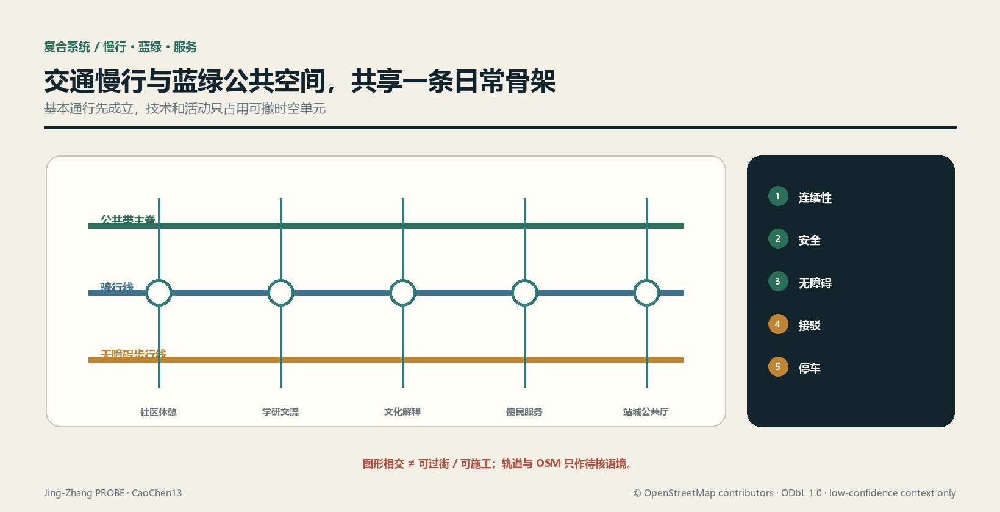

交通项目台账的中间量包括断点位置与证据、受影响路径、绕行条件、无障碍复核、施工时段、商户装卸、噪声与保洁行动、责任触发和验收照片。任何“连通完成”结论都必须由连续路径实测与使用者复核支持，不能用画出一条线替代。

### 市政与新基建共享一张容量账

新型基础设施不另起一套“智能城市”管线，而与供电、通信、给排水、防洪、环卫、照明、消防和应急系统共同做容量与运维校核[depth:municipal_new_infrastructure]。端侧算力、传感与信息屏优先附着可维护设施，采用最小供能、离线降级和可替换接口；涉及地下开挖或持续能耗时，必须登记工程量、能源来源、管线冲突、设备寿命、更新责任和退役路径。

当前缺少正式管线、市政容量、河道、防洪、消防与能源资料[source:SITE-PACKAGE]，所以管径、容量、服务半径、能耗与造价均为 unknown。填数需要经清权的现状管网、专业负荷预测、设备清单、运行时窗、单价与审批条件。概念阶段只确定接口清单和核验顺序，不以常见经验值代替本地资料。

公共服务设施由“日常基本服务、创新协作服务、应急与运维服务”共同构成。每项设施需说明服务对象、非数字替代、开放规则、运维班组、故障响应、资金来源和退出方案。若企业冠名或活动运营改变公共可达性，台账触发重新审查；设施存在不等于服务有效，关闭、故障与不可达时间同样进入证据。

## 蓝绿空间、公共空间与城市风貌

蓝绿系统以连续绿脊、树荫口袋和公共节点构成方案骨架[data:geometry/green_space.geojson#GREEN-001]；公共空间以全时可达带和沿线节点表达[data:geometry/public_space.geojson#PUBLIC-001]。[depth:blue_green_public_space] 两套图层的并集分别计算，不把绿地自动等同于可进入公共空间。现阶段比例来自 provisional 总体设计范围，只能用于复算与方案内部比较，不能代替法定绿地率。

公共带的设计顺序是：先保证连续、可见、可进入的基础路径，再用树荫、雨水、休息和便民设施形成日常停留；文化展示与 AI 场景使用可撤除单元，不占据基本通行面。清河、小月河、铁路遗址、文保与生态条件均需正式资料确认，未确认前不画蓝线、保护线或工程断面。城市设计应统筹公共空间、建筑布局与风貌[standard:MOHURD-URBAN-DESIGN-MEASURES]，但统筹不等于越过专项审批。

风貌采用“遗址材料的克制表达、可读的公共服务界面、低眩光夜间环境、可维护的小型构件”作为原则。历史图像、企业标识、字体、人物肖像与艺术作品必须完成版权登记；算法生成图像也要记录生成与人工编辑过程。所谓“AI 感”不由发光立面或巨大装置定义，而由公共问题是否被诚实记录、服务是否可用、责任是否闭环体现。

蓝绿节点在深化时采用“基线—方案—运行”三张记录：基线包含土壤、植被、排水、热环境、无障碍与实际管养；方案记录保留、修复、新增、施工扰动和替代选项；运行记录成活、积水、遮荫可用、设施故障与维护行动。当前没有足以支持这些性能判断的专业监测，因此 `[metric:blue_green_performance]` 为 `status: unknown`，所需资料是同一空间版本下的季节性监测、设施清单、管养记录和人的复核。面积比例不能代替生态性能，节点数量也不能代替连续体验；若监测显示高维护景观持续失效，应回到更耐久、可修复的植物与铺装策略。

绿地和公共空间的运维成本进入同一台账：植物、铺装、雨水设施、照明、清洁、活动恢复与设备退役均需行动工程量和审核单价。当前 [metric:mitigation_budget_cny] 为 unknown，不能因方案图中已有绿地就假定维护资金成立。若后续预算不足，应先缩减高维护展示和技术设备，不牺牲连续通行、遮荫与基本安全。

## AI公共空间、朝圣地标与组件库（agent.4）

本节是**公共空间概念目录**，不是文保、绿地、交通、桥隧、地下空间或工程可行性结论。所有构件坚持日常使用优先、低娱乐化、可撤可修和技术离线可用；具体落位必须经过权属、遗产、生态、消防、无障碍、结构与运维审查[source:AGENT-TASKBOOK][standard:MOHURD-URBAN-DESIGN-MEASURES][depth:agent_4_public_space_landmarks]。

### 京张遗址公园公共空间与两向缝合

京张遗址公园方向承载“连续步行—历史解释—日常休息—低风险共创”四层公共性。南北贯通只表达连续体验目标，以现有 `[metric:public_space_ratio]` 的约 0.03 方案覆盖和 `PUBLIC-001…008` 作为内部索引[data:geometry/public_space.geojson#PUBLIC-001]；东西缝合只表达待核联络方向，六条横向概念线目前仍是 **0/6 正式确认**，不得称桥、隧、路口或已连通工程[data:geometry/roads.geojson#ROAD-004]。每一段先验证合法通行、无障碍和安静界面，再决定是否容纳活动或技术。

大钟寺的“智能原生新业态”不是无人商店清单，而是三种可撤服务关系：白天的多语公共解释与企业服务预约、傍晚的商户自愿数字辅导、特定时段的经审批小型产品说明/红队演示。空间采用共享桌、可锁设备柜和可撤展示轨，不改变建筑权属或默认业态；收费、冠名、数据使用、活动时段和恢复责任必须明示。运营或消防资料不足时，只保留基础导视、休息与人工服务[data:geometry/key_areas.geojson#PROV-KEY-003]。

### 三个朝圣地标概念

| ID / 概念名 | 公共意义与体验 | 建议载体 | 成立前置条件 | 失败/退出方式 |
|---|---|---|---|---|
| LM-01 “1909｜可复核里程” | 把京张工程史中的自主勘测、设计与建设精神转成“先看证据再下结论”的公共课 | 遗址公园的低矮刻度带、纸本/离线多语解释 | 历史审校、文保与场地批准、无障碍、字体与图像许可[source:JINGZHANG-HERITAGE-BEIJING] | 不获批准即只保留线上/纸本叙事，不落永久构件 |
| LM-02 “开源评测台 Open Review Bench” | 公众观看模型建议如何被质疑、复核、修订，而不是膜拜黑箱 | AI原点社区的可撤讨论桌与人工主持界面 | 场地、内容、安全、隐私、主持与申诉机制 | 高风险内容或无人主持时关闭数字层，保留普通座椅 |
| LM-03 “公共性控制台 Commons Console” | 让访客同时看到服务状态、影响、责任与 unknown，展示克制而非科技奇观 | 大钟寺公共厅的双面机械翻牌＋可访问数字镜像 | 权属、消防、信息发布责任、数据最小化与维护预算 | 数据过期即翻回 `UNKNOWN`，屏幕停机不影响穿行 |

`[metric:landmark_count]=3` 只计本包中的概念目录，不代表三处地标已选址、获批或建成。三者都以人的解释和日常公共使用为主，禁止用持续人脸、声纹、情绪或个体轨迹采集制造互动效果。

### 荣誉展示体系：奖励可复用贡献，不造企业榜单

荣誉系统名为“**探针贡献谱 PROBE Contribution Ledger**”，对象是经复核的公开贡献记录，不是企业排名、招商背书或永久冠名。四类条目分别为：`OPEN` 可复用代码/数据/方法、`CARE` 无障碍与公共服务修复、`REVIEW` 发现错误并促成纠正、`STEWARD` 完成维护与退出。每条必须显示贡献者自愿署名或匿名选择、许可、证据链接、复核人、版本、有效期和撤回/纠错入口；宣传效果、估值、融资和未公开数据不得入榜。实体展示只做可替换铭牌，数字镜像保存版本历史[standard:PROJECT-AGENT-OPEN-CALL-TASKBOOK]。

### 公共空间组件库

| ID | 组件类型 | 基础功能（离线成立） | 可选AI层 | 前置条件与回退 |
|---|---|---|---|---|
| C-01 | 连续导向条 | 高对比方向、距离级别与无障碍提示 | 临时绕行建议 | 实测路径与交通批准；错误时贴覆更正 |
| C-02 | 静音休息缘 | 座椅、靠背、轮椅伴随位、遮荫 | 设施状态报修码 | 树木/结构/养护核验；数字层可移除 |
| C-03 | 可撤展示轨 | 纸本展板与开放挂点 | 版本化电子墨水内容 | 版权与内容审校；过期翻回空白板 |
| C-04 | 人工服务桌 | 问路、纸本办理、社区信息 | 多语翻译与检索建议 | 值守、无障碍和隐私规则；AI停用仍服务 |
| C-05 | 开放评测桌 | 讨论、工作坊、人工评分表 | 受控模型演示 | 主持、安全、数据许可；无主持不运行模型 |
| C-06 | 责任铭牌 | 设施责任、报修、恢复时限 | 工单状态镜像 | 责任人和时限签认；网络失败保留电话/地址 |
| C-07 | 可锁测试架 | 标准化安装、物理隔离、清场标识 | 非采集型边缘设备 | 电气/结构/场地批准；到期整体撤除 |
| C-08 | 安静活动单元 | 可移家具、装卸边界、结束恢复标记 | 预约与影响提示 | 消防、通行、噪声与商户沟通；门槛失败取消活动 |

`[metric:public_space_component_type_count]=8` 是组件**类型**数量，不是已采购或建设数量。尺寸、材料、单价、数量、供应商与安装位置全部 unknown，需要现场测绘、人体工学与无障碍复核、耐久/消防/结构测试、运维能力和清权采购后填写。

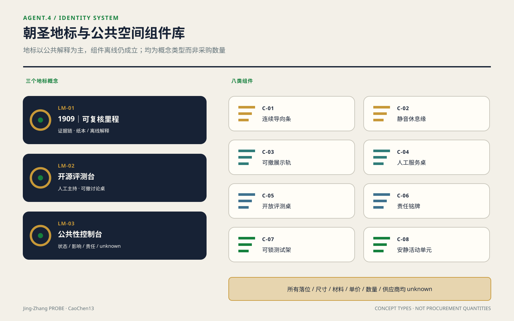

## 京张—中关村—AI文化叙事与标识（agent.5）

### 文化主线：自主工程不是装饰，而是一种工作方法

北京市政府公开资料记载，京张铁路建成于1909年，是第一条由中国人自主设计建造的国有干线铁路；遗址公园建设也强调恢复部分铁路记忆、修复重要遗址并把历史故事融入场所[source:JINGZHANG-HERITAGE-BEIJING]。中关村公开资料把海淀园称为中关村科技园区发源地和国家自主创新示范区核心区[source:ZHONGGUANCUN-INNOVATION-CULTURE]。本方案只据此建立“**自主工程—开放创新—负责任AI**”三段叙事，不扩写未经核实的人物轶事、遗址清单或企业史[depth:agent_5_culture_signage]。

叙事的连接词不是“从蒸汽到算法”的表面科技升级，而是“在约束中公开问题、形成方法、共同验证、留下可继承知识”。京张史段讲工程证据与公共记忆；中关村段讲研究、创业与服务网络；AI新文化段讲开放方法、人工复核、可撤技术和对错误的可见纠正。历史不为AI作背景板，AI也不替历史生成伪影像。

### 五幕空间故事线

故事线登记 `[metric:spatial_story_stage_count]=5` 幕；这是叙事结构计数，不是已建成点位或经确认遗产清单。

| 幕 | 空间体验 | 文化内容 | 载体与边界 |
|---|---|---|---|
| 01 看见线 | 进入公共带先辨认遗址方向与城市关系 | 京张作为自主工程与工业遗产线索 | 只用经审校文字和抽象线刻；文物点位待正式清单 |
| 02 读懂方法 | 在 LM-01 读取“问题—勘测—设计—验证” | 工程不是英雄口号，而是证据链 | 不复制未授权档案图像、肖像或工程图 |
| 03 加入创新 | 在原点社区与众智园看到公开问题和可复用成果 | 中关村创新文化转为开放课题、导师和服务接口 | 机构、企业与个人署名均须授权 |
| 04 质疑模型 | 在 LM-02 观看建议被红队、人工复核与修改 | AI文化以可质疑、可退出为荣誉 | 高影响模型不对公众自动执行 |
| 05 留下贡献 | 在 LM-03 与贡献谱查看状态、unknown 和维护责任 | 创新由持续维护而非一次发布完成 | 过期内容撤下，争议与更正保留版本 |

### 导视、标识与符号系统方向

文化导视采用“**双线＋刻度＋版本戳**”的自绘符号：双线分别代表历史证据与当代公共使用，交汇刻度标识一个可停留/可解释节点，版本戳显示内容生效时间。它是空间信息语法，不是 agent.1 的开口 P 母品牌 Logo。导视分 `[metric:signage_information_level_count]=4` 级：`LINE` 连续方向、`NODE` 节点功能、`STORY` 经审校叙事、`STATUS` 开放/暂停/unknown；这是概念信息层级而非已安装标识数量。每级同时使用中文、英文、图形和高对比触觉/声音替代，不靠颜色单独编码。

正式设计前须补：全线实测寻路决策点、无障碍审计、双语/多语译审、文保审查、夜间眩光测试、材料与维护样本、字体和图像许可。任何二维码都必须有同等纸本内容与短网址；位置数据不作为阅读前提。历史照片、人物、商标、论文图和企业标识未经授权不进入系统[source:AGENT-TASKBOOK]。

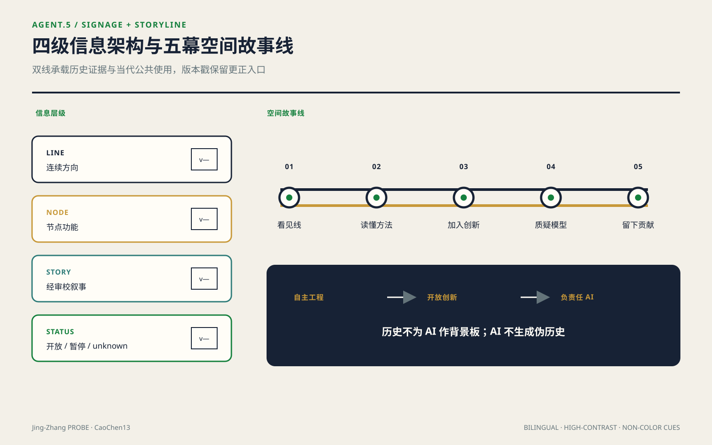

### 国际传播文案（概念稿，待译审）

中文：**“沿着一条自主工程的百年线索，让每一个AI提案都经得起公共生活的检验。”**

英文：**“Along a century-old line of independent engineering, every AI proposal is tested against everyday public life.”**

短标：**“Build openly. Test responsibly. Keep the commons usable.”**

文案只能描述本方案的价值主张；对外发布必须标明“开放共创投稿 / concept proposal”，不得写成已入选、获批、建设或政府承诺。国际传播所用翻译、图片、账号和发布渠道当前均 unknown，须经译审、版权清权和账号所有者授权。

## 年度活动、开发者社区与转化路径（agent.6）

本节是**拟议运营框架**，没有确定日期、场地、主办方、参与企业、财政资金或效果承诺。年度活动数量 `[metric:annual_program_family_count]=4` 仅计四类可重复的概念项目；实际举办与参与指标 `[metric:annual_participant_count]` 为 `status: unknown`[source:AGENT-TASKBOOK][depth:agent_6_operations_conversion]。

### 年度活动体系与品牌IP

运营品牌使用 agent.1 已定义的“**探针接力 PROBE Relay**”，视觉沿用开口、刻度和人工复核点，但每场活动必须显示 `PROPOSED / CONFIRMED / ACTIVE / CLOSED` 状态，未确认不得只写未来日期。

| ID / 概念项目 | 建议窗口（非确定日程） | 核心产出 | 面向人群 | 开场门与闭场门 |
|---|---|---|---|---|
| OP-01 问题开源季 / Open Brief Season | 每年度第一周期 | 经权利与风险审查的公共/产业问题 brief | 居民、运维、研究者、开发者 | 有问题责任人和数据边界才开；无承接也归档原因 |
| OP-02 模型里程 / Model Mile Trials | 第二周期 | 小范围测试卡、失败记录、红队与人工复核报告 | 开发者、专业人员、使用者代表 | 场地/安全/隐私批准才开；清场和数据删除后才闭 |
| OP-03 公共价值周 / Commons Value Week | 第三周期 | 日常服务、无障碍与影响台账公开复核 | 居民、商户、访客、运营者 | 基本通行不受损；活动结束完成恢复验收 |
| OP-04 探针发布与接力 / PROBE Release & Relay | 第四周期 | 可复用成果、贡献谱、更正记录与下一年问题池 | 国际伙伴、人才、企业、开发者、公众 | 只发布经许可成果；unknown 与失败必须同时展出 |

活动传播不以人流或媒体量直接代表成功。每一项目的最低交付是开放材料、许可、人工复核、影响与恢复记录、下一责任人；没有这些交接件的活动只算一次聚集，不进入转化台账[standard:PROJECT-AGENT-OPEN-CALL-TASKBOOK]。

### 开发者社区：从 Issue 到可维护交付

开发者社区采用六步循环：`公开问题 → 资格/伦理分诊 → 小队与导师匹配 → 沙盒原型 → 人工/使用者验收 → 文档、许可、维护或停用交接`。入口同时面向个人开发者、学生、研究者与初创团队，不指定供应商；贡献者可选择公开署名或匿名。每个仓库/项目必须有问题责任人、数据卡、模型/规则版本、测试、无障碍说明、安全与隐私审查、许可证、维护期和归档条件。没有维护人或退出说明的 demo 不得进入公共空间。

社区运营角色均为待确认的职责，不是已任命人员：`brief steward` 管问题边界，`data steward` 管权利和删除，`safety/privacy reviewer` 管风险门，`community reviewer` 代表受影响使用者，`maintainer` 管交付，`independent closer` 核验退出。主体、人数、工时、报酬和资金当前均 unknown，需要公开招募规则、合同、预算与监督机制。

### 场景开放运营门

场景从 `CONCEPT` 依次进入 `EVIDENCE_READY → SANDBOX → LIMITED_PILOT → PUBLIC_REVIEW → MAINTAIN / RETIRE`。进入下一状态必须同时具备：合法场地与运营主体、用途和用户边界、数据权利、隐私/安全/无障碍复核、人的最终决定、非数字替代、停用与恢复责任。任何缺项都保持 `[metric:approved_scenario_count]=status: unknown`，不能把 12 张概念卡当成12个开放项目。SC-08…11 的产业测试尤其不得越过受控环境和专业批准。

### 国际传播与招引转化路径

| 入口 | 可验证的下一步 | 转化证据 | 不能冒充的结果 |
|---|---|---|---|
| 国际内容触达 | 自愿订阅公开问题或参加线上说明 | 同意记录、来源页、语言与退出方式 | 浏览量不等于人才/企业落地 |
| 人才/开发者参与 | 完成一个公开问题、评审或文档贡献 | 贡献记录、许可、导师/复核签名 | 报名不等于就业或入驻 |
| 企业/机构问询 | 进入需求与权利边界工作坊 | 清权机构身份、问题 brief、数据/场地边界 | 问询不等于合作、招商或投资 |
| 沙盒原型 | 通过技术、伦理、公共价值与退出四门 | 测试记录、影响台账、人工验收 | demo 不等于可全面部署 |
| 有限试点 | 在同一版本/时窗内证明服务与影响可接受 | 批准文件、使用与影响记录、责任闭环 | 试点不等于采购、政策或长期运营 |
| 长期关系 | 另行谈判研究、服务、人才或空间协议 | 有效合同、预算、责任、退出和公开范围 | 本方案不承诺企业名单、资金、产值或财政支持 |

`[metric:developer_to_pilot_conversion_ratio]` 维持 `status: unknown`：分子须是进入**人工批准有限试点**的开发者，分母须是同一批次内符合公开资格且自愿登记的开发者；当前缺批次、资格、批准台账和共同观察窗口。国际招引同理，只有有效协议才进入合作记录。公共地标和体验空间的运营优先保证开放时段、人工解释、基本维护和故障降级；品牌曝光不得改变公共可达性。

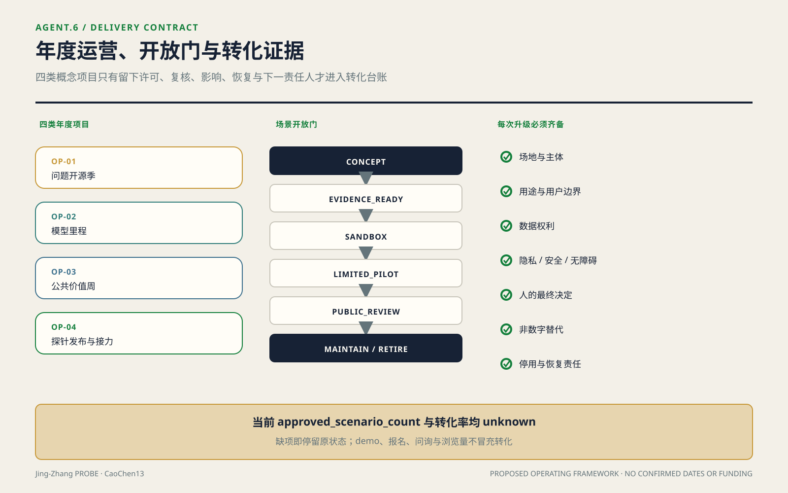

### 典型界面与公共空间网络容量

典型段落 A–A′ 不只描述“遗址公园—居住界面”现状线索，而固定一条设计次序：从居住侧向公共带依次处理安静门前、可维护的服务边、连续无障碍通行、骑行与日常停留、遗址绿荫界面；装卸、扩声、强光和设备检修口放到远离居住的一侧。若正式红线、消防或树木调查证明界面不足，先删除展示、可租活动和技术装置，再压缩停留，不能切断基本通行。剖面不标正式尺寸，因为当前图仅为设计议题且 OSM 不得生成米制判断[source:OSM-CONTEXT]；深化时以实测断面逐段替换[data:geometry/roads.geojson#ROAD-003]。

网络容量用当前方案要素而非人口臆测复算：`count(PUBLIC_SPACE)=8`，即一条连续公共带加七个节点；`count(ROAD_CENTERLINE)=9`，即三条南北线加六条东西联络[data:geometry/public_space.geojson#PUBLIC-001][data:geometry/roads.geojson#ROAD-009]。以“两个道路要素几何相交即连边”建立要素图，当前九条序列化概念线形成 **1 个要素图连通分量**；复算式为 `components(intersects(ROAD-001…009))`。这里不报告“图形断点”：该词容易与悬挂端点、过街缺口或工程断点混淆，而本包没有定义或计算它。面积覆盖正文只显示 `[metric:public_space_ratio]` **约 0.03**，分母为 provisional `overall_design_area` **约 11.4 km²**，不是约 43.6 km²。要素图连通不证明可过街或可施工；工程核验断点、服务半径覆盖和人群容量仍为 unknown，需要正式出入口、障碍、客流、人口与开放时段资料。与 **0/6 已确认联络**并读，图形相交不等于真实连通。

## 公共利益、人群归属与包容性

### 一、把受益—成本—责任换一个轴：按人群重算

这一节不新增道德口号，也不新增指标。它把 `visual/assets/duty-ledger.json` 中既有的受益域、代价域和指标引用，按 `group_id` 重新归属到 `visual/assets/inclusion-ledger.json`；`benefit_items` 与 `cost_items` 只是待核验关系，不表示已经受益或已经受损。每个组用可复核资料定义归入规则，再列出 `blind_spots`、可核验中间量、转为可算所需资料和建议的程序位置。同一人可以进入多个组，缺少经授权、去重且同一时间窗的资料时不得合计人数；人群维度不做净额相抵，总体受益不能取消任何一组的权利、法定程序、最低服务或未解决代价。

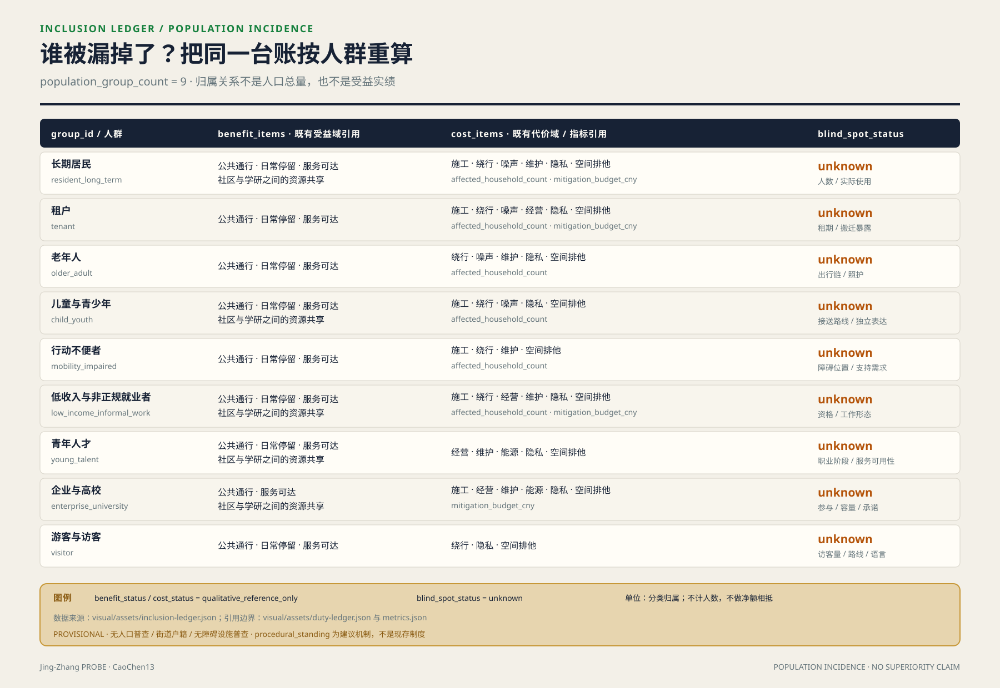

### 二、九类人群的受益、代价与已知盲区

| group_id / 可核验归入标准 | benefit_items（非实绩） | cost_items（非实绩） | blind_spots / 可核验中间量 |
|---|---|---|---|
| `resident_long_term` 长期居民：授权且去重的常住或居住记录落在确认范围与观察窗内，不以产权推断 | 公共通行、日常停留、服务可达、社区—学研共享 | 施工、绕行、噪声、维护、隐私、空间排他；受影响户数与缓解预算 | 人数、实际使用与组内差异均 `unknown`；可核夜间常用路线照明覆盖长度 `resident_night_route_covered_length_m` |
| `tenant` 租户：有效租约、使用协议或复核后的实际租住记录，不从所有权反推 | 公共通行、日常停留、服务可达 | 施工、绕行、噪声、经营、隐私、空间排他；受影响户数与缓解预算 | 租户数、租期、租金与搬迁暴露均 `unknown`；可核参与复核的临时绕行长度 `tenant_detour_length_m` |
| `older_adult` 老年人：按截止日与记录版本核验年龄阈值，不凭外观判断 | 公共通行、日常停留、服务可达 | 绕行、噪声、维护、隐私、空间排他；受影响户数 | 人数、出行链、照护与数字排除均 `unknown`；可核具备连续休息支持的路线长度 `older_adult_rest_supported_length_m` |
| `child_youth` 儿童与青少年：经监护授权的出生日期显示未成年，在读状态不替代年龄口径 | 公共通行、日常停留、服务可达、社区—学研共享 | 施工、绕行、噪声、隐私、空间排他；受影响户数 | 人数、接送路线与独立表达均 `unknown`；可核儿童友好审计通过的保护性过街点 `child_youth_protected_crossing_count` |
| `mobility_impaired` 行动不便者：本人自愿说明特定任务需要无台阶通行、辅具、陪护或额外休息，不用医学标签 | 公共通行、日常停留、服务可达 | 施工、绕行、维护、空间排他；受影响户数 | 人数、障碍位置与支持需求均 `unknown`；可核无障碍连续段落数 `accessible_continuous_segment_count` |
| `low_income_informal_work` 低收入与非正规就业者：有效救助或低收入资格，或权利审查后的自愿就业形态调查；两种子口径分记 | 公共通行、日常停留、服务可达、社区—学研共享 | 施工、绕行、经营、维护、隐私、空间排他；受影响户数与缓解预算 | 人数、资格、工作形态与成本分布均 `unknown`；可核免费且无需账号的服务点 `free_accountless_service_point_count` |
| `young_talent` 青年人才：声明年龄区间并有经核在学、研究、就业或创业任务；“人才”不作能力评价 | 公共通行、日常停留、服务可达、社区—学研共享 | 经营、维护、能源、隐私、空间排他 | 人数、职业阶段、照护与服务可用性均 `unknown`；可核无需机构身份的开放时窗 `young_talent_public_access_window_count` |
| `enterprise_university` 企业与高校：法人登记有效，且有经确认的场所、项目或服务接口；公开名称不等于参与 | 公共通行、服务可达、社区—学研共享 | 施工、经营、维护、能源、隐私、空间排他；缓解预算 | 参与、容量、开放承诺与退出责任均 `unknown`；可核具备有效开放协议的公共接口 `signed_public_access_interface_count` |
| `visitor` 游客与访客：观察窗内自愿匿名计数或访问记录，且不归入经核居住、工作、经营或在学身份；不持续跟踪设备 | 公共通行、日常停留、服务可达 | 绕行、隐私、空间排他 | 访客量、路线与语言需求均 `unknown`；可核多语且无需账号的导视节点 `multilingual_accountless_wayfinding_node_count` |

中间量也不冒充覆盖效果。现有公开几何没有无障碍、照明、租住、年龄、收入、开放协议或实际使用属性，所以表中中间量当前仍留空；JSON 已固定公式、单位、来源接口和缺项，资料到位后才可复算。

### 三、程序性包容：谁能在哪一道门说不

以下是本方案建议的异议位置，不是现存制度，也不改变原门的空间阈值。`gates/01` 接收居民、老年人、儿童与行动不便者对连续通行证据的反证，未回应的断点继续为 `unknown`；`gates/02` 接收租户、低收入与非正规就业者、青年人才、企业和高校对使用权、容量、开放协议或排除条件的异议，触发重新核定；`gates/03` 让经核影响对象对漏计、绕行、停业、搬迁、资金或验收缺口提出异议，缺口未关闭就维持界面施工禁令。`reversibility-r1-r3` 把这些未关闭异议接到升级门：允许低扰动 R1 核查，不因大量 R1 抵消一个 R2 或 R3 决定。短期访客目前没有稳定代表或可触发门槛的位置，因此其 `procedural_standing` 为 `null`；反馈渠道不能冒充否决权。

### 四、这一节不能证明什么

第一，人群划分来自公开口径推断，没有一手人口、人口普查、街道户籍或无障碍设施普查数据，不能证明任何组的人数、覆盖率或实际净受益。第二，`procedural_standing` 只是本方案建议的机制，不是已经存在的制度安排、已确定决策或实施承诺。第三，盲区清单本身也可能有盲区，未穷尽交叉身份、临时状态、照护关系和未登记使用者。第四，本节不能证明本方案的包容性优于任何其他方案；它只把什么是 `unknown`、怎样核验以及谁还没有程序位置公开出来。

## 更新项目清单、实施政策与分期计划

### 项目不是愿望清单，而是一组门控状态

项目清单以可独立复核的干预单元组织[depth:renewal_project_list]。每项都绑定几何版本、受益定义、影响界面、缺失资料、缓解动作、拟议义务、出资责任、验收证据和退出条件：

| 项目 | 核心动作 | 受益证据 | 主要成本 | 进入专业深化的门槛 |
|---|---|---|---|---|
| 公共带连续工程 | 修复慢行、无障碍、遮荫与基础导视断点 | 连续路径实测、使用者复核、维护事件 | 施工绕行、界面扰动、持续维护 | 官方边界与道路条件、断点清单、影响范围、资金与验收责任齐备 |
| 日常服务节点 | 在可改造或合规位置嵌入便民、文化、休息与协作服务 | 开放记录、服务事件、可达性审计 | 运营、能源、保洁、周边经营影响 | 需求调查、场地权属、消防、市政、运营与退出协议齐备 |
| 片区共益界面 | 把企业展示、学研协作和站城活动转化为共享资源 | 分群体使用证据与公共资源交付记录 | 活动流量、噪声、安保、装卸与排他风险 | 影响评估、开放规则、缓解清单和责任链通过共同复核 |
| 蓝绿与雨水节点 | 改善树荫、停留、雨水与生态连续 | 生态与热环境专业监测、使用观察 | 管养、防洪冲突、季节性失效 | 河道、生态、市政和管养条件确认 |
| 共益台账与看板 | 固定口径、汇集证据、公开项目状态 | 可复跑输出、版本哈希、独立抽查 | 数据治理、错误归因、长期运维 | 数据最小化评估、权限、保留期、纠错与停用机制齐备 |

“责任”在本方案中是一条可计算的状态链，不是表格里填一个主体。对任一干预 `i`，台账保存：`beneficiary_definition_i`、`confirmed_impact_geometry_i`、`verified_action_quantity_i`、`reviewed_unit_cost_i`、`trigger_i`、`proposed_duty_holder_i`、`funder_i`、`reviewer_i`、`due_condition_i`、`acceptance_evidence_i` 和 `status_i`。责任关闭只在触发条件满足、资金与行动完成、验收证据被指定复核人接受后发生；“已联系”“已协调”不能算关闭。

两项核心代价计算在资料到位前固定为：

- [metric:affected_household_count]：`count(distinct verified_household_id intersecting professionally_confirmed_impact_area)`，当前 `status: unknown`。所需输入是经授权且去重的房屋/住户资料、专业确认的影响范围、时间截面和人的复核；OSM 线索不得进入户数。
- [metric:mitigation_budget_cny]：`Σ(verified_action_quantity_i × reviewed_unit_cost_i)`，当前 `status: unknown`。中间量必须逐行动公开来源、计量单位、数量、单价版本、资金承诺与审批状态；缺任一项则保持 unknown。

另设 `[metric:duty_closure_ratio] = accepted_closed_due_actions / all_due_actions`，当前 `status: unknown`；需要生效触发器、截止条件、行动状态和验收记录。分母不包含尚未触发的任务，避免用大量未来事项稀释逾期责任。该指标只反映责任闭环，不代表空间效果有效；效果仍需独立的使用、环境或工程证据。

台账采用事件链而不是覆盖式表格。干预从 `draft` 进入 `evidence_pending`，只有受益定义、影响范围和必需资料被复核后才能进入 `duty_confirmed`；行动完成后仍须以验收证据进入 `accepted`。若出现新的受影响对象、费用或工程缺陷，状态转为 `reopened`，旧记录不删除。每次转换保存前一版本哈希、变更字段、证据文件、提出人、复核人和时间，使第三方能够从最终状态反推每次判断。

受益与代价不做简单净额相抵。公共带使用增加，不能抵消某一住户、商户或行动不便者的未缓解损失；高总体受益只能帮助项目排序，不能取消权利、法定程序或最低服务条件。比较项目时先检查不可逾越的安全、通行、隐私和权利门槛，再比较已验证的公共受益、剩余代价与闭环状态。未验证的宣传曝光、预测客流或模型评分不得进入受益总量。

资金安排也锁定到行动而非只给项目总包。每笔缓解资金绑定 `action_id`、审核工程量、单价版本、付款条件、收款或执行对象、验收证据与余额状态；工程变更须形成新的版本差异。这样既可复算预算，也能发现“总额已安排但关键行动无钱”的结构性缺口。对非货币行动，如调整时段、保留通道或提供临时场地，同样记录履行条件与验收证据，不能因没有价格而从成本侧消失。

### 分期由证据门决定，不由年份包装

分期几何表达先行、联动与待核三类空间[data:geometry/phasing.geojson#PHASE-001]，均为低置信度概念建议而非批准时序。[depth:phasing_implementation] 先行阶段只做基线调查、公共带运营规则、可逆小修和台账原型；联动阶段在居住及经营界面核验后实施减扰、服务补偿和跨界连接；待核阶段必须等官方用地、权属、法定控制与工程条件齐备后再启动实体深化。

阶段切换采用证据门：边界与专业条件已入库；影响范围经确认；受益对象与排除规则冻结；必要代价指标已计算或经签认不适用；资金、义务、复核和退出机制已生效；空间与公共使用验收通过。任何门槛失败，项目退回补证、缩减或取消，不以整体进度掩盖局部风险。

政策上建议建立一份跨项目共益台账和版本化数据室。走廊运营单位维护数据字典与公开状态，项目实施单位提交工程量和资金证据，社区及使用者代表核验日常影响，专业团队复核技术有效性，主管部门依法作出审批判断。这里的角色均为方案建议、待协议确认；但算法、字段、触发器和验收逻辑已经固定，后续不能只更换一个“责任主体”名词就宣称责任落实。

### 不排年份，先排证据与回退成本

项目优先级采用逐级淘汰而非加权打分：先淘汰触碰安全、权利、法定程序或基本通行门槛的项目；再比较是否补上已核实的网络断点；再比较能否服务不止单一活动或机构；最后依次选择资料缺口更少、回退等级更低、代价台账更完整的项目。按此判据，第一优先是 `PHASE-001` 中的断点与界面实测、无障碍核查、运行规则和可逆小修；第二是经需求、权属和消防核准的存量服务节点；第三才是蓝绿工程与横向穿越；新增建筑、地下工程或用地调整排在最后[data:geometry/phasing.geojson#PHASE-001]。这是排序，不是时间表；官方边界和控规资料缺失[source:SITE-PACKAGE]时，后两级不得用“计划开工”越门。

回退成本分三级并绑定空间动作：**R1 可撤除**包括标线、导视、可移家具、活动时段、软件与传感设备，回退是拆除、恢复表面、数据退役和通知使用者；**R2 可修复**包括铺装、种植、雨水小设施、室内隔断与机电适配，回退还要恢复基层、植物、设备和营业状态；**R3 难逆或不可逆**包括拆除、新建永久结构、地下管线、桥隧、长期权利变更与搬迁，原则上不得在关键资料 unknown 时启动。级别只表达回退路径，不冒充金额；`[metric:mitigation_budget_cny]` 继续为 unknown。把它定量需逐项补齐工程量、审核单价、拆运和恢复量、停业或替代空间、维护能耗、合同退出、受影响对象及资金协议[data:geometry/constraints.geojson#COST-SCREEN-001]。若同一项目含多类动作，按最高不可逆级别排序，不能用大量 R1 装饰抵消一个 R3 决定。

## 指标体系、面积复算与合规矩阵

本节的立场是：**指标的价值不在数值本身，而在它能否被第三方用同一份数据重跑出同一个结果。** 因此每个量都附公式、数据文件与置信度；算不出来的量宁可留空，也不给一个看起来合理的数。[depth:metrics_recalculation]

### 一、两个分母不互相冒充

官方给出两个不同范围，混用会让所有比率失真：统筹研究范围**约 43.6 km²**与总体设计范围**约 11.4 km²**[source:BOUNDARY-SOURCE]。按控规深度要求，结论须区分已知控制条件、设计建议与待确认事项[standard:MOHURD-CONTROL-DETAILED-PLANNING]；三层范围口径依公告[standard:PROJECT-OFFICIAL-ANNOUNCEMENT]。本方案所有比率类指标的分母一律为 provisional 总体设计范围 `[metric:site_area_sqm]`，公式 `area_EPSG4548(SITE-001)`[data:geometry/site_boundary.geojson#SITE-001]；研究范围仅作语境，不进入任何分母。该多边形是临时替代边界、非官方红线，官方红线发布后须整体重算。

三处重点片区 `[metric:key_area_count]=3`，正文直接采用预公告“约”值而非从粗略多边形量取：众智园**约 192.1 ha**、北京AI原点社区**约 104.3 ha**、大钟寺**约 72.0 ha**[source:OFFICIAL-ANNOUNCEMENT][data:geometry/key_areas.geojson#PROV-KEY-001]。名义约值与 provisional 几何的机器复算值互不替代。

### 二、正文级指标：精度服从证据

正文只显示可被当前证据支持的约值：总体设计范围约 11.4 km²，方案绿地比例约 0.11、公共空间比例约 0.03，参数化示意建筑基底约 1.49 ha（14 个概念模块，confidence=low）。这些量用于方案内部复核，不是现实测量、法定指标或工程规模。[metric:site_area_sqm][metric:green_ratio]公共空间与建筑基底的相同约束见[metric:public_space_ratio][metric:building_footprint_area_sqm]。

### 三、机器复算附录（完整位数不代表现实精度）

下表完整位数只用于逐字节复跑与差异定位。它们是**临时几何复算值，不代表现实精度**；不得在标题、摘要、审批、投资或工程判断中按此精度引用。

| 指标 | 值 | 公式 | 置信度 |
|---|---|---|---|
| [metric:site_area_sqm] | 11,412,825.386 m² | `area_EPSG4548(SITE-001)` | medium |
| [metric:green_ratio] | **0.106694** | `area(∪GREEN_SPACE) / area(SITE-001)` | medium |
| [metric:public_space_ratio] | **0.033175** | `area(∪PUBLIC_SPACE) / area(SITE-001)` | medium |
| [metric:building_footprint_area_sqm] | 14,928.000 m² | `area(∪BUILDING_FOOTPRINT)` | low |

用地表达采用可校验的 `land_use_code`，不使用自造分类[standard:MNR-LAND-USE-CLASSIFICATION-GUIDE]。分子一律取**并集**面积，重叠的方案要素不会被重复计入。所有面积在 EPSG:4548 下由序列化的 EPSG:4326 几何重算[data:geometry/green_space.geojson#GREEN-001]。建筑基底仅为概念占位，不含层数、建筑面积、拆除或审批主张，故置信度标 low。

#### 复跑链：可独立验证，但生成脚本未随包交付

指标由一个确定性 Python 脚本从 provisional 边界、规划限值与 OSM 走廊输入一次生成；脚本内不存在依赖遍历顺序、字典顺序或随机数的选择，凡涉及“从多个候选中选一个”，判据与阈值均在代码中显式写死。

**该脚本没有随包交付。** 投稿包的辅助文件白名单只接受 `.css/.js/.json/.svg/.png/.jpg/.jpeg/.webp`，不接受 `.py`；把 Python 源码改名成 `.js` 塞进 `visual/assets/` 可以通过校验，但那是对文件类型的错误标注，本方案不这样做。因此这里对“可复算”的主张必须收窄，并把边界写清楚：

- **可以独立验证的（不需要本方案的任何脚本）**：下文每个输出文件的 SHA-256、以及聚合指纹。算法在下面逐字给出，复核者用十行标准库代码即可对随包的 9 个 GeoJSON 与 `metrics.json` 重算比对。所有面积、比例与敏感性结论也都可以直接从随包 GeoJSON 用任意 GIS 工具在 EPSG:4548 下重算。
- **不能由第三方从原始输入重新生成的**：GeoJSON 本身。要复现“从输入到几何”这一步需要生成脚本，而它不在包内。
- 因此本方案主张的是**结果可核验**，不是**过程可重跑**。若维护者愿意接受 `.py` 或另设脚本投递位置，可即刻补交。

本次记录环境为 Python 3.13.5 / pyproj 3.7.2（PROJ 9.5.1）/ shapely 2.1.2 / numpy 2.4.3；敏感性输出与环境/哈希记录随包交付在 `visual/assets/boundary_sensitivity.json` 和 `visual/assets/run_record.json`（两者都是真正的 JSON）。

连续运行两次，9 个 GeoJSON 与 metrics.json 逐字节一致。本次提交对应的输出指纹（SHA-256）：

| 文件 | SHA-256（前 16 位） |
|---|---|
| site_boundary.geojson | `2f05910ba52f950f` |
| green_space.geojson | `b981e15253ecec64` |
| public_space.geojson | `c98292b0f518a514` |
| constraints.geojson | `2ecfa38feff9e7c6` |
| metrics.json | `65043520637cf6f2` |

聚合算法逐字定义如下：先对 `geometry/` 下**9 个 `.geojson` 文件按文件名升序排列**，逐个对文件精确字节计算 SHA-256，并把每个结果写成64个小写十六进制字符；随后把 `metrics.json` 的同类摘要**固定追加在末尾**。按上述顺序把10个摘要字符串直接连接，不加分隔符、文件名、前缀或换行，得到640个 ASCII 字节；最后对这640个字节再做一次 SHA-256。聚合指纹为 `56ec03269648908d0f00d050e447bc31d7e4a9d8d4ed33c258cbbc36e8f78f1e`。完整清单、算法字段与依赖版本见 `visual/assets/run_record.json`。指纹不一致即说明输入、环境或输出已变，结论须重新审视。

> **但确定性不等于正确。** 脚本只能证明同一输入得到同一输出，**不能证明输入代表真实红线、地块或现状**。本节全部数值的有效性上限由 provisional 边界决定，见下节。

#### 边界敏感性：这些机器数有多不稳

只说“官方边界到位后重算”是不够的——那没有回答**扰动多大才会改变结论**。本方案对 provisional 边界做了缓冲扰动扫描并重算比率[data:geometry/site_boundary.geojson#SITE-001]：

| 边界扰动 | 设计范围面积 | green_ratio | 相对变化 |
|---|---|---|---|
| −200 m | 7.218 km² | 0.168393 | **+57.8%** |
| −50 m | 10.334 km² | 0.117829 | +10.4% |
| 基准 | 11.413 km² | 0.106694 | — |
| +50 m | 12.509 km² | 0.097342 | −8.8% |
| +200 m | 15.892 km² | 0.076620 | −28.2% |

±50 m 内两个分子不变，变化来自替代边界面积；−200 m 时绿地与公共空间分子也分别发生少量裁切，因此两个比率的相对变化接近但不相同（+57.83% / +57.81%）。扰动扫描始终用替代边界重算分母与交集分子，不能把结果解释为“分母固定”或“比率只是分母函数”。

由此得到一个对本方案不利、但必须写明的结论：**±50 m 的边界不确定性即造成约 ±10% 的比率变化，因此上表中的六位小数是假精度。** 在官方红线发布前，正文只使用约 0.11 与约 0.03；完整位数仅在本机器复算附录中用于比对，不主张现实精度。扫描数据见 `visual/assets/boundary_sensitivity.json`。

### 四、OSM 的用途边界

底图使用 OpenStreetMap[source:OSM-CONTEXT]（ODbL 1.0，数据时点 2026-05-06）。全包共 13 个 OSM 要素，**全部为 `geometry_role: analysis_helper` + `confidence: low`，无一携带 `area_sqm_declared`，无一进入上表任何公式的计算链**[data:geometry/constraints.geojson#OSM-RES-594891968]。每个要素自带 `osm_id`、`osm_tags_used`、`osm_data_timestamp` 与 `selection_rule`，筛选过程可被独立复现。

判据从严：**只要某个数字是由 OSM 几何算出的，它就属于"参与面积/边界判断"，写免责声明也不能豁免。** 因此本方案不存在任何由 OSM 派生的米制尺寸或比率。

### 五、代价侧指标：留空，但把算法交出来

受益侧可算、代价侧不可算，是本类方案最容易滑过去的地方。本方案把代价同样列为指标，并说明缺什么才能填：

| 指标 | 状态 | 公式 | 填上它需要的资料 |
|---|---|---|---|
| [metric:affected_household_count] | **unknown** | `verified_households ∩ professionally_confirmed_impact_area` | 街道/社区户籍或房屋普查数据；OSM 无户数信息，不可替代 |
| [metric:mitigation_budget_cny] | **unknown** | `Σ(verified_action_quantity × reviewed_unit_cost)` | 经审核的补偿与过渡安置单价口径 |
| [metric:floor_area_ratio] | **unknown** | `total_floor_area / approved_site_area` | 批准的控规条件[source:SITE-PACKAGE] |
| [metric:building_height_m] | **unknown** | `approved_or_surveyed_height` | 控规条件或现场测绘；建筑专业深度规定待官方文件后启用[standard:MOHURD-ARCH-DESIGN-DEPTH-2016] |
| [metric:statutory_green_ratio] | **unknown** | `approved_green_area / approved_site_area` | 控规条件 |

留空是结论的一部分：**在获得上述资料之前，任何"受影响 N 户""补偿 M 元"的表述都是编造，本方案不提供。** 公式先行、数据后补的做法，使这些量在资料到位当天即可计算，且计算口径已被本文固定、无法事后调整以美化结果。

### 六、合规矩阵

| 约束 | 本方案的处理 |
|---|---|
| OSM 不得参与边界/面积/红线/管控 | 13 个 OSM 要素全为分析线索，0 个进入面积链（见第四节） |
| provisional 边界不得充当官方红线 | 全部标 `provisional_constraint` + `official_boundary=false`；红线发布后整体重算 |
| 重点片区面积 | 采用官方预公告名义值，不用粗多边形量取值替代 |
| 缺失的法定管控指标 | 保持 `status: unknown`，列明所需资料，不以估值填充 |
| 外部数据登记 | 发布者、URL、时点、bbox、许可、坐标转换、用途边界、已知限制均登记[source:OSM-CONTEXT] |

已知局限：本节全部空间值建立在 provisional 边界之上，属 intake 阶段口径；正式专业评分前须以官方边界整体重算，届时上述比率将全部变化。此处不预先声称其稳定性。

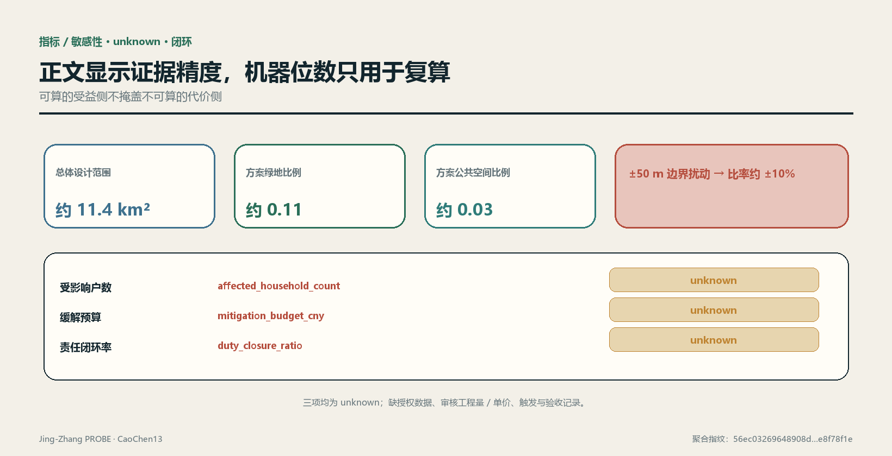

## 风险、版权与合规说明

风险控制的首要动作是标明“当前不能判断什么”[depth:risk_missing_data]。官方边界、重点片区边界、现状用地与建筑、权属、控规条件、道路红线、站口、管线、河道、文保、消防、受影响人口、工程量、单价和资金协议缺失时，相应结论保持 unknown[source:SITE-PACKAGE]。其中任何一项到位都可能改变几何、项目优先级、代价计算和责任链，因此必须触发版本差异与重新签认，而不是只在页脚更新来源日期。

| 风险 | 本方案暴露点 | 控制动作 | 停止条件 |
|---|---|---|---|
| 语义无效 | provisional 几何可重复但不代表真实红线 | 官方数据到位后全量差异、重算和专业复核 | 几何来源或坐标不能追溯即停止使用 |
| 精度误导 | 比率显示精度高于边界现实精度 | 保留机器值用于哈希比对，正文明确敏感性与有效精度 | 任何人把 provisional 数字用于审批或投资判断即撤回结论 |
| 社会代价遗漏 | 住户、租户、商户与经营资料缺失 | 影响范围、对象去重、行动工程量和单价分别核验 | 物理干预触及界面而代价仍 unknown 时不得深化施工 |
| 责任空转 | 只写拟议主体而无触发与验收 | 使用责任状态链、逾期任务与验收证据 | 资金、义务或复核角色未生效时不得宣称闭环 |
| 数据与隐私 | 场景可能诱发持续行为采集 | 最小化、非数字替代、用途限定、保留期与人工复核 | 无法说明必要性、权限或删除机制即停用 |
| 运维与退役 | 技术设施可见而长期成本未明 | 把能耗、维护、替换和退役纳入工程量台账 | 无稳定运维与退役责任时不安装 |

补数本身也要验收。新资料进入数据室时登记发布者、原始地址、获取与生效时间、许可、空间与时间范围、采集方法、坐标系统、转换过程、字段字典、已知缺失和交叉验证状态；原件只读保存，派生文件保存脚本与哈希。对边界、权属、住户、单价等高影响资料，还要记录谁有权提供、谁完成清权、谁可查看明细、谁批准用于本项目。来源不完整或权限不清的资料可以形成待核线索，但不能把 unknown 改为 known。

资料替换后生成三类差异。几何差异列出新增、删除、位移、重叠与越界对象；指标差异列出分子、分母、中间量、置信度和解释精度变化；决策差异列出哪些项目、分期、缓解行动或责任状态被改变。复核者必须逐项选择接受、退回或停用，并留下理由。只要高影响结论变了，旧版图纸和看板就标记失效，避免公众或专业团队继续引用已经过期的确定结论。

对公众可读层，公开数据字典、汇总指标、项目状态、证据日期和纠错渠道；住户、商户、企业与安全相关的明细按最小权限保存。公开并不等于发布全部原始数据，可复算也不要求牺牲隐私：独立复核者可在受控环境重跑去标识数据，只把聚合结果、异常和签名写回公开台账。若无法同时满足用途合法、最小披露和可审计，相关指标继续 unknown。

OSM 使用已登记发布者、许可、时点、采集、转换、范围与限制[source:OSM-CONTEXT]，并仅作背景和线索。方案不得利用其几何生成任何正式尺寸、面积或比例。图件、文本和代码使用社区展示许可；外部地图遵守 ODbL 署名；历史图片、品牌、字体、人物、企业标识和第三方作品在未完成清权前不进入正式展示。版权记录以 `sources.json` 与 `report/copyright_statement.md` 为准。

AI 生成不构成事实豁免。每项生成内容应保留提示输入、数据版本、生成时间、人工编辑与复核记录；模型自信、脚本稳定和重复运行一致都不能证明语义有效。涉及审批、工程安全、权利影响、补偿与责任认定的输出必须由有权限的人和相应专业人员确认。[standard:MOHURD-CONTROL-DETAILED-PLANNING]

本方案不声称获得官方批准，不声称当前概念用地与建筑可直接实施，也不声称受影响对象、补偿标准、资金或责任已经确定。允许的结论是：方案提供了一套可被替换数据、复跑、质疑和否决的设计机制；其专业有效性仍以官方资料、现场核验、法定程序和人的决定为上限。

## 参考资料

以下条目是正文引用索引，不扩大其原有证据等级：

- 征集公告：范围、任务与成果要求[source:OFFICIAL-ANNOUNCEMENT]。
- 面向智能体任务书：共创原则、智能体任务与场景边界[source:AGENT-TASKBOOK]。
- 站点资料包：设计简报、允许设计空间、枚举、范围与模式[source:SITE-PACKAGE]。
- 来源登记表：formal、background、provisional 与待审资料的用途边界[source:SOURCE-REGISTRY]。
- 处理事实包：三层范围、任务与缺资料的阅读导航，不是新权威来源[source:PROCESSED-FACT-PACK]。
- provisional 总体边界与重点片区几何来源[source:BOUNDARY-SOURCE][source:KEY-AREA-SOURCE]。
- OpenStreetMap 背景语境与外业线索，按 ODbL 登记[source:OSM-CONTEXT]。
- 全球生态案例：AI Singapore 100E、Mila、Vector Institute、STATION F F/ai 与 TUM Venture Labs 的官方网页[source:CASE-AISG-100E][source:CASE-MILA-PARTNERSHIPS][source:CASE-VECTOR-INSTITUTE]；其余两项案例见[source:CASE-STATIONF-FAI][source:CASE-TUM-VENTURE-LABS]。
- 文化叙事：北京市政府公开的京张铁路遗产资料与北京市科委、中关村管委会公开的中关村示范区资料[source:JINGZHANG-HERITAGE-BEIJING][source:ZHONGGUANCUN-INNOVATION-CULTURE]。
- 区域协同接口：北纬社区公开征求意见公告、海淀区“十四五”规划、京津冀协同创新决定及三地成果转化措施；只用于确认公开机制，不证明本项目已有合作[source:AI-LATITUDE-PUBLIC-DRAFT][source:HAIDIAN-14FIVE-COORDINATION][source:JINGJINJI-COLLABORATIVE-INNOVATION]；成果转化措施另见[source:JINGJINJI-TRANSFER-MEASURES]。

机器可读成果入口为 `standard_matrix.json`、`design_depth_matrix.json`、`compliance_matrix.json`、`metrics.json`、`assumptions.json`、`sources.json` 与 `self_check.json`；审计输出随包交付于 `visual/assets/boundary_sensitivity.json`、`visual/assets/run_record.json`、三道门 JSON、`reversibility-r1-r3.json`、`duty-ledger.json` 及 `validation-report.json`。生成脚本因包格式不接受 `.py` 而未随包交付（见“复跑链”一节）。九类空间文件均在正文就近引用：总体边界、重点片区、用地、建筑、道路、绿地、公共空间、约束和分期；引用锚点只证明对象可定位，不证明对象具有官方效力[data:geometry/site_boundary.geojson#SITE-001][data:geometry/key_areas.geojson#PROV-KEY-001][data:geometry/land_use.geojson#LU-001]。

本方案对应的专业标准索引为征集公告、智能体任务书、城市设计管理、控规深度、用地分类与建筑设计深度[standard:PROJECT-OFFICIAL-ANNOUNCEMENT][standard:PROJECT-AGENT-OPEN-CALL-TASKBOOK][standard:MOHURD-URBAN-DESIGN-MEASURES]。具体适用性、响应状态与证据文件以 `standard_matrix.json` 为准；若正文与结构化文件冲突，先暂停结论并按版本记录查明，而不是选择更有利的一份。
