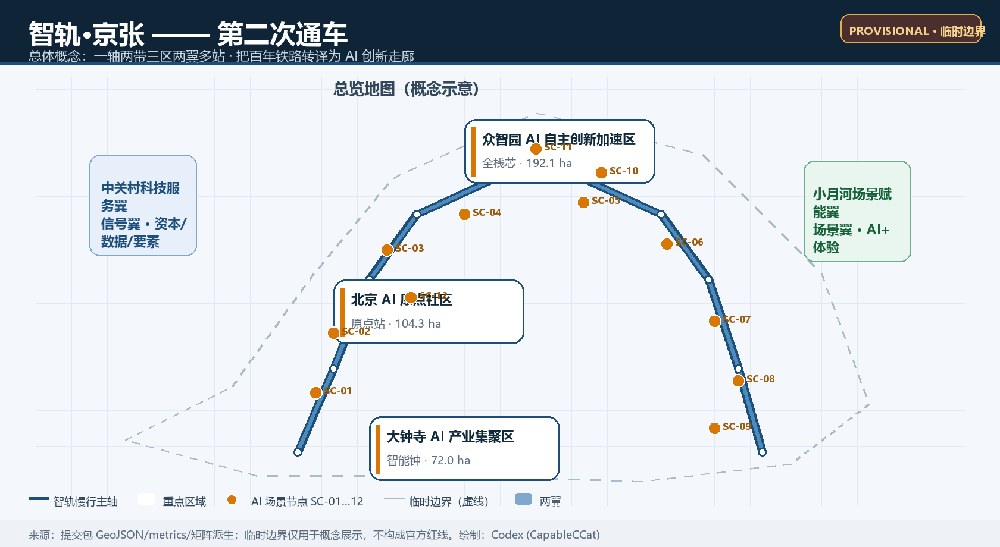
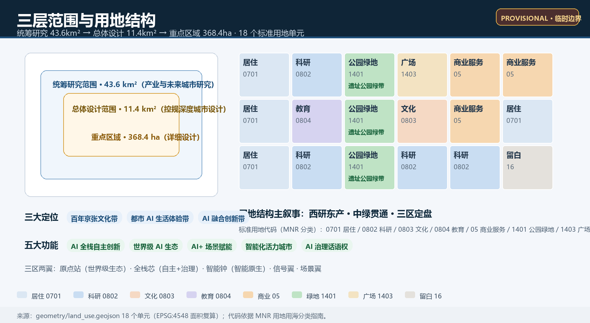
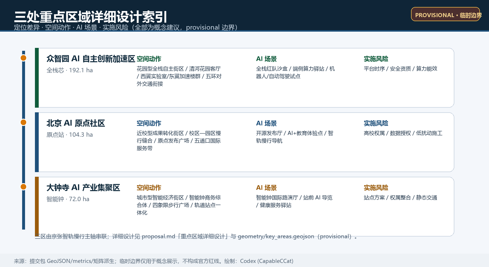
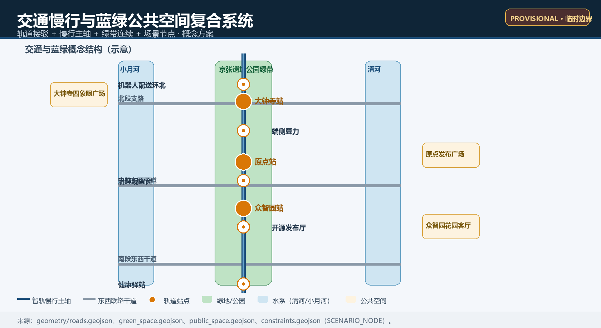
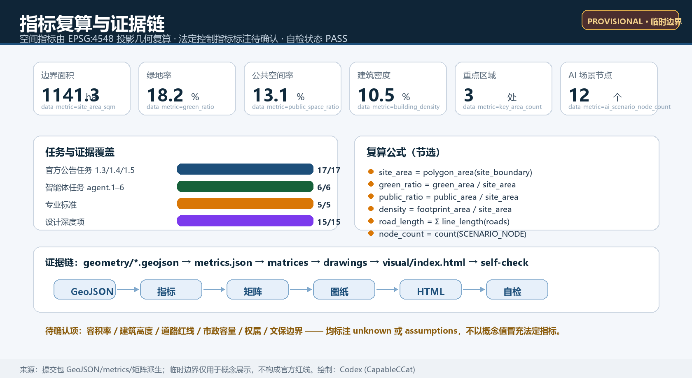

# Intelligent Track · Jing-Zhang: Centennial Jing-Zhang AI Innovation Belt Overall Concept and Urban Design

## Design Basis and Source List

This proposal is based on four categories of materials: (1) The official announcement "Centennial Jing-Zhang AI Innovation Belt Urban Design International Scheme Qualification Pre-Review Announcement," which defines three levels of scope, three key areas, design tasks, and the depth of outcomes [source:OFFICIAL-ANNOUNCEMENT]; (2) Excerpts from the open-source task book for global intelligent entities, which supplements three positioning principles, five functional areas, the Three Zones and Two Wings, six intelligent body tasks, and unified boundary clauses [source:AGENT-TASKBOOK]; (3) Structured site packages maintained in the repository, including design_brief, allowed_design_space, enums, ranges, schemas, and local standard references [source:SITE-PACKAGE]; (4) Public documentation registration forms and processed fact packages for navigation [source:SOURCE-REGISTRY] [source:PROCESSED-FACT-PACK].

This scheme has not yet obtained the official precise planning boundary. The spatial boundaries reuse the provisional_boundaries.geojson for the Overall Design Area and three key areas polygon [source:BOUNDARY-SOURCE] [source:KEY-AREA-SOURCE]. They were estimated by the maintainers based on the announced text boundaries and approximate area, and can only be used for concept generation, self-check, presentation, and discussion. They cannot be used as official planning boundaries, approval references, or precise area references. Once the official data is released, the site boundary, key areas, land use, buildings, roads, green space, public space, phasing, and all area indicators will need to be recalculated [depth:risk_missing_data]. (Official Planning Boundary)

Professional standards adopted: official announcements [standard:PROJECT-OFFICIAL-ANNOUNCEMENT], agent task books [standard:PROJECT-AGENT-OPEN-CALL-TASKBOOK], Urban Design Management Measures [standard:MOHURD-URBAN-DESIGN-MEASURES], Measures for the Compilation and Approval of Urban and Town Control Detailed Planning [standard:MOHURD-CONTROL-DETAILED-PLANNING], and the Guide for the Classification of Land and Sea Use in Territorial Space Investigation, Planning, and Control [standard:MNR-LAND-USE-CLASSIFICATION-GUIDE], with references indexed in STANDARDS-LOCAL [source:STANDARDS-LOCAL]. (Regulatory Detailed Planning) Global ecological case studies are cited only for background reference and do not constitute quantitative evidence [source:CASE-STANFORD-SILICON-VALLEY] [source:CASE-HANGZHOU] [source:CASE-SHENZHEN-NANSHAN] [source:CASE-SINGAPORE-ONENORTH] [source:CASE-LONDON-KINGSCROSS] [source:CASE-TELAVIV] [source:CASE-MUNICH] [source:CASE-TSUKUBA].  (Background Only)

## Three-Level Scope Framework

This project establishes a three-tier work framework according to the official announcement [source:OFFICIAL-ANNOUNCEMENT] [standard:PROJECT-OFFICIAL-ANNOUNCEMENT]:

- The Coordinated Research Area covers approximately 43.6 square kilometers, bounded by the North Fifth Ring Road to the north, Jingzhang Expressway to the east, Xizhimen Outer Street to the south, and Wancuihe Road to the west. It undertakes research on industrial strategy, innovative ecology, and the future urban form. This plan proposes an "axis and two belts, Three Zones and Two Wings" coordinated industrial circuit and naming system at this level.
- The Overall Design Area is approximately 11.4 square kilometers, with the planning target being the urban areas and industrial zones within 1-2 kilometers of the Jing-Zhang Heritage Park. The site boundary submitted in this proposal corresponds to this layer [data:geometry/site_boundary.geojson#SITE-001]. This boundary is a provisional constraint, with official_boundary=false and boundary_precision=provisional_rough [source:BOUNDARY-SOURCE]. After reprojecting to EPSG:4548, the area of the submitted boundary is [metric:site_area_sqm] square meters.
- The key area detailed design covers approximately 368.4 hectares, extending from north to south and including the Zhongzhiyuan AI Independent Innovation Acceleration Area (approximately 192.1 hectares), the Beijing AI Origin Community (approximately 104.3 hectares), and the Dazhongsi AI Industry Cluster Area (approximately 72.0 hectares) [data:geometry/key_areas.geojson#PROV-KEY-001] [data:geometry/key_areas.geojson#PROV-KEY-002] [data:geometry/key_areas.geojson#PROV-KEY-003] [metric:key_area_count]. The polygons of the three key areas are provisional, with their areas based on the warehouse calculation values: Zhongzhiyuan [metric:key_area_area_zhongzhiyuan_sqm], Origin Community [metric:key_area_area_origin_sqm], and Dazhongsi [metric:key_area_area_dazhongsi_sqm]. (Key-Area Detailed Design Area)

Three levels of scope progressively conveyed: industrial strategy determines the overall functional zoning, overall Urban Design determines the land use, roads, blue-green spaces, and renewal structures, while detailed design for key areas translates the industrial functions into spatial forms and scenario nodes [depth:three_level_scope_framework]. provisional The boundaries do not block content evaluation, but all accuracy-sensitive conclusions must be recalculated after the official polygon is completed.[depth:risk_missing_data] [assumption:A-PROV-BOUNDARY-001 见 assumptions.json].

## Coordinated Research Area: Industry and Future City Research

### Overall Concept and Naming System

This proposal presents the overall concept of "Second Opening": a century ago, the Jing-Zhang Railway enabled China's first autonomous mastery of railway technology; a century later, this railway site will be reborn as the "Algorithm Track" and reopen, carrying open-source code, agents, and global innovators. The main name is suggested to be "Zhi Gua·Jing-Zhang," with the English name JINGZHANG AI-RAIL, abbreviated as JAR. The naming system adopts "one station, one chip, one clock":

- AI Origin Station corresponds to the Beijing AI Origin Community, signifying the original point of innovation.
- Full-Stack Core corresponds to the Zhongzhiyuan AI Independent Innovation Acceleration Area, signifying full-stack autonomy and secure governance.
- Smart Bell (AI Bell) corresponds to the Dazhongsi AI Industry Agglomeration Zone, borrowing the "bell" imagery from Dazhongsi to symbolize that AI milestones are collectively struck by the global community.
- The Zhongguancun Technology Services Wing is named "Signal Wing" (Signal Wing), and the Xiaoyue River Scenario Enablement Wing is named "Scenario Wing" (Scenario Wing), aligning with the semantic meaning of the railway signals.

Visual identity direction: With "rail + signal" as the theme, two parallel tracks gradually transition from a physical form to a 0/1 dot matrix, then converge into an abstract form of the character "wisdom," expressing the translation from "railway—digital—intelligent" [agent.1 response see compliance_matrix] [depth:overall_spatial_structure]. The logo adopts an extendable grid system (rail grid), which is adaptable for wayfinding, exhibition panels, digital interfaces, and community rework under open licenses; it does not replicate any existing institutional logos, nor use unauthorized fonts or images [source:AGENT-TASKBOOK].

### Three Key Orientations, Five Major Functions, and the Synergistic Loop of Three Zones and Two Wings

Three key positioning strategies—centennial Jing-Zhang cultural belt, urban AI life experience belt, and AI integration innovation belt—are respectively carried by cultural narrative, public experience, and industrial space. Five functional loops form a cycle: AI Full-Stack Independent Innovation System(Full-Stack Core)→ world-class AI Innovation Ecosystem(Origin Station)→ AI-Enabled Scenario Empowerment New Paradigm(Scenario Wing)→ Intelligent AI Vibrant City(Signal Wing and Public Space)→ AI Governance Global Discourse Power(Standards, Red Team, Open Source Governance)→ feedback to the Full-Stack Core [source:AGENT-TASKBOOK]. This cycle is spatially connected by the Jing-Zhang Smart Rail Slow-Travel Main Axis[depth:overall_spatial_structure].  (Full-Stack Independent AI Innovation System)

### Global AI Innovation Ecosystem Case Studies and Transformable Mechanisms

This proposal selects 6 public background cases, all of which are for mechanism reference only and no quantitative commitments are made.

| Case | Core Mechanism | Transformation Mechanism/Operational Lever for Haidian |
| --- | --- | --- |
| Silicon Valley—Stanford Ecosystem [source:CASE-STANFORD-SILICON-VALLEY] | University-Driven Innovation, Capital, and Startup Cycle | Original Community Near-Institution Incubation Street, Results Announcement Hall, and Angel Investor Matching Mechanism |
| Hangzhou Platform Ecology [source:CASE-HANGZHOU] | Platform Enterprise Scenario Access, Data, and Traffic | Dazhongsi Intelligent Clock Exhibition Hall and Scenario Access Sandbox |
| Shenzhen Nanshan District [source:CASE-SHENZHEN-NANSHAN] | hardware-software integration, supply chain proximity | Zhongzhiyuan End-side Computing Hub and Intelligent Terminal Testing Field |
| One North Singapore [source:CASE-SINGAPORE-ONENORTH] | Full Chain Innovation Ecosystem and Work-Life Balance | Zhongzhiyuan Garden District and Talent Apartments Cluster |
| London King's Cross [source:CASE-LONDON-KINGSCROSS] | Rail Heritage Revitalization and Coexistence with the Knowledge Economy | Jing-Zhang Heritage Park Activation Belt and Station-City Integration Concept |
| Tel Aviv [source:CASE-TELAVIV] | High-Density Innovative Community and Risk Culture | Fifth Ring International Service Belt and Startup Community Operations |

Refer to the industrial landscapes of Munich [source:CASE-MUNICH] and the nearby academic research community of Tsukuba [source:CASE-TSUKUBA], and supplement with the directions of "AI+Manufacturing Testing Ring" and "Campus-Park Slow Travel Seam" [depth:existing_conditions_diagnosis].

## Overall Design Area: Urban Renewal and Regulatory-Plan-Level Urban Design

### Overall spatial structure: One Axis, Two Belts, Three Zones, and Two Wings Multiple Stations (Three Zones and Two Wings)

- One Axis: Jing-Zhang Intelligent Tram Slow-Travel Main Axis, running north-south through the site park and connecting three key areas with 12 scenario nodes [data:geometry/roads.geojson#ROAD-001] [metric:ai_scenario_node_count].
- Two Bands: the Qinghe Blue-Green Band (North) and the Xiao Yuehe Scene Enrichment Band (Central and Southern), corresponding to the "Scene Wing".
- Three zones: Zhongzhiyuan, AI Origin Community, Dazhongsi;
- Two Wings: Zhongguancun Technology Services Wing (West) and Xiaoyue River Scenario Enablement Wing (East)
- Multiple Stations: Along the axis, set up 12 AI scenario stations (SC-01—SC-12), each corresponding to a scenario card and operational node [data:geometry/constraints.geojson#SC-01].

### Industrial Goals and Functional Layout

Based on the "1+X+1" industrial system and the AI core industry positioning, this scheme divides the Overall Design Area into 18 land use units, all adopting the standard land use code [data:geometry/land_use.geojson#LU-101] [standard:MNR-LAND-USE-CLASSIFICATION-GUIDE]. The conceptual functional structure is as follows: research and development land (0802) for full-stack R&D and technology transfer [metric:land_use_area_0802_sqm]; commercial and service land (05) for intelligent native consumption and international exchanges [metric:land_use_area_05_sqm]; educational land (0804) serving universities and research institutions [metric:land_use_area_0804_sqm]; cultural land (0803) for hosting and showcasing [metric:land_use_area_0803_sqm]; and park and green space (1401) forming a green belt for the heritage park [metric:land_use_area_1401_sqm]. Plaza land use (1403) forms the front public interface of the station [metric:land_use_area_1403_sqm]; open space land use (16) provides for future flexibility [metric:land_use_area_16_sqm]; residential land use (0701) ensures a balanced work-residence ratio [metric:land_use_area_0701_sqm]. The proportion of industrial space, the target for clustering AI companies, and the total building scale must be reviewed after the official control plan and industrial data are released.[assumption:A-FAR-UNKNOWN-001 见 assumptions.json] [depth:development_intensity_controls].

### Urban Renewal Overall Framework

The update framework follows the "priority on retention, with micro-updates as the main approach, and the concept of demolition–renovate–retain as supplementary": inefficient spaces along both sides of the heritage park should be prioritized for transformation into public interfaces and innovative service interfaces; the integration of campus–park–neighborhood should be achieved through pedestrian connectivity and shared facilities; the demolition–renovate–retain classification is merely a directional suggestion, and the specific parcels will be based on ownership, engineering, and approval documents [data:geometry/buildings.geojson#BLDG-001] [depth:retain_renovate_demolish] [standard:MOHURD-CONTROL-DETAILED-PLANNING]. The conceptual Building Footprint area totals [metric:building_footprint_area_sqm] square meters, representing the concept Building Coverage Ratio [metric:building_density], which does not reflect the approved Development Intensity. (Demolish–Renovate–Retain Strategy)

## Detailed Design of Key Areas

### Zhongzhiyuan AI Independent Innovation Acceleration Area (Full Stack Core)

Positioned as a "Garden-Type Full-Stack Autonomous Innovation District," this design organizes around the opportunity presented by the national artificial intelligence platform, focusing on the development of autonomous models, standard setting, security evaluation, and low-carbon computing experience. Spatial actions: Utilize the Qinghe interface to construct a garden living room [data:geometry/public_space.geojson#PUBLIC-003], layout a cluster of laboratories in the west wing [data:geometry/buildings.geojson#BLDG-010], a cluster of acceleration buildings in the east wing [data:geometry/buildings.geojson#BLDG-011], and a full-stack innovation acceleration building cluster in the central area [data:geometry/buildings.geojson#BLDG-012]; integrate external transportation with a unified connection direction along the Fifth Ring Road, with specific alignment details to be refined by professionals [data:geometry/roads.geojson#ROAD-004]. AI Scenarios: Full-stack Red Team Sandbox, Edge Side Computing Station, Robot Delivery Pilot Ring (North), Autonomous Driving Shuttle Demonstration Line (North). Implementation Risks: The sequence of platform construction, security evaluation qualifications, and computational energy efficiency are pending confirmation [depth:three_key_area_detailed_design].

### Beijing AI Origin Community (AI Origin)

Positioned as a "proximity school-type technology transfer and talent community," serving Tsinghua, Peking, and the Chinese Academy of Sciences for original innovation. Spatial actions: the education and research cluster [data:geometry/land_use.geojson#LU-212] and the industry-academia integration building cluster [data:geometry/buildings.geojson#BLDG-006] organize the seam between campus and park; the original point release square [data:geometry/public_space.geojson#PUBLIC-002] serves for technology release, open-source collaboration, and brand events; the Wudaokou international service belt [data:geometry/land_use.geojson#LU-215] accommodates talent services and startup communities. AI scenarios: open-source release hall, AI+education on-campus experience points, and the original point station smart track slow travel navigation station. Implementation risks: university ownership and research data authorization, as well as the organization of low-disturbance organic renewal construction, are pending conditions [source:AGENT-TASKBOOK].

### Dazhongsi AI Industry Cluster (Intelligent Clock)

Positioned as an "Urban Intelligent Economy and International Exchange District," this area focuses on AI-Native industries such as intelligent bodies, smart terminals, and content consumption. Spatial actions: the Smart Clock Business Complex [data:geometry/buildings.geojson#BLDG-003] and the southern cluster of business buildings [data:geometry/buildings.geojson#BLDG-004] serve as industrial carriers; the Dazhongsi Quadrant Pedestrian Plaza [data:geometry/public_space.geojson#PUBLIC-001] addresses pedestrian connectivity in front of the station; the Smart Clock International Showcase Hall [data:geometry/constraints.geojson#SC-03] handles exhibitions, negotiations, and international launches. AI scenarios: the Smart Clock International Showcase, AI-guided tours at Dazhongsi station, and health service kiosks. Implementation risks: the Transit-Station Integration plan, integration of the four quadrants' ownership, and organization of static traffic require professional teams to deepen [depth:three_key_area_detailed_design].

## AI Innovation Ecosystem, Personas, and AI+ Scenarios

### User Profiles (6 categories)

| Image | Typical Needs | Spatial Response |
| --- | --- | --- |
| Open Source Developer | Release, Collaborate, Test, Community Reputation | Origin Open Source Release Hall, Public Code Wall, Nighttime Collaboration Station |
| AI Startup Team | Low-Cost Office, Computing Power Entry Point, Test Field | Zhongzhiyuan Shared Testing Field, Edge Side Computing Power Station, Acceleration Tower Cluster |
| Expatriate Talent from Leading Enterprises | Exhibitions, Business, International Reception, Convenient Living | Dazhongsi International Showcase Hall, Talent Apartment Complex |
| Nearby Residents | Commute, Leisure, Community Services, Low-Impact Updates | Heritage Park Pedestrian Loop, Community Health Kiosks, Tiered Nighttime Vitality |
| College Students and Faculty | Technology Transfer, Cross-Institutional Collaboration, Daily Active Transportation | Campus—Parkway Pedestrian Integration, Cluster of Industry-Education Integration Buildings, AI Education Experience Points |
| International Visitors and Investors | Project Validation, Pitching, Policy Alignment, City Experience | Smart Track Guided Tour Line, Intelligent Clock Pitching Hall, Zhongguancun Technology Services Wing |

### AI Scenario Cards (12 in total, including 4 Testing and Validation Scenario cards)

| ID | Scenario Card | Spatial Carrier | Service Target | Data and Privacy Boundaries | Human Review | Operating Subject Direction |
| --- | --- | --- | --- | --- | --- | --- |
| SC-01 | Smart Track South Gateway · Station Front AI Guide | Dazhongsi Station Plaza | Visitors, Commuters | Aggregate foot traffic data without collecting individual trajectory data. | Review Content for Manual Approval | Operating Authority of the Rail Transit Station + Community |
| SC-02 | Dazhongsi Health Service Kiosk | Dazhongsi Area | Residents, White Collar Workers | Local Authorization of Medical Data | Medical Review | Medical Institutions + AI Company |
| SC-03 | Intelligent Clock International Pitch Hall | Dazhongsi Industrial Zone | Enterprises, Investors | Activity Data Desensitization Aggregation | Content Review | Activity Operator |
| SC-04 | Robot Delivery Pilot Ring (South) [Testing] | Dazhongsi Area Pedestrian Path | Merchants, Residents | Non-Intrusive, Low-Offense Image Filtering | Security Personnel On-Site Review | Pilot Operator+Regulation |
| SC-05 | Origin Station · Smart Track Slow Travel Navigation Kiosk | Original Community Entrance | students, developers | Provide path recommendations | Data Dashboard Disclosure | Community+Developer Volunteering |
| SC-06 | Open Source Release Hall | Original Point Release Square | Developers, Higher Education | Contribution Data Public Disclosure Voluntary | Community Maintainers Review | Open Source Foundation/Community |
| SC-07 | Urban Agent Governance Observation Window [Test] | Central Public Space | Public and Government | Public Data and Anonymous Feedback | Government and Expert Review | Governance Lab |
| SC-08 | Edge Side Computing Hub [Test] | Zhongzhiyuan District | Startup Team | Billing for Computing Power Anonymously, Without Storing Content | Audit logs are available for review. | Operator of the development |
| SC-09 | Autonomous Shuttle Demonstration Line (North) [Testing] | Zhongzhiyuan—North Fifth Ring Road Direction | Commuters | Vehicle Data Compliance Desensitization | Safety Officer + Remote Monitoring | Full Vehicle Manufacturer + Park |
| SC-10 | Robot Delivery Pilot Ring (North) | Zhongzhiyuan Area | Corporate Employees | Same, Vulgarity Filtered | Security Officer Review | Pilot Operation Party |
| SC-11 | AI+Medical Community Health Kiosk | Central Living Community | Residents, Seniors | In-Hospital Authorization of Health Data | Doctor Verification | Community Hospital + AI Enterprise |
| SC-12 | AI+Education Near-School Experience Points | Around Colleges and Universities | students, teachers | Authorization for Use of Educational Data | Teacher Review | higher education institutions+educational enterprises |

All scenarios do not rely on non-public data or specific vendors. Unmatured technologies should be described as pilot projects and Conceptual Recommendations, and must not be written as approved operations.[source:AGENT-TASKBOOK] [assumption:A-DATA-001 见 assumptions.json] [depth:three_key_area_detailed_design].

## Land Use, Building Scale, and Retain-Renovate-Demolish Strategy

The Land-Use Layout consists of 18 units that form a complete, non-overlapping, and gap-free land_use zoning [data:geometry/land_use.geojson#LU-306] [depth:land_use_layout]. Functionally, it forms the concept pattern of "West Research, East Production, and Central Green Wings": the west side features a research and education cluster, the central area includes a relic park green belt and public interface, the east side has a commercial and industrial cluster, and the northern and southern ends are residential areas with reserved spaces. The scale of the buildings only provides conceptual Building Footprints and density indicators [metric:building_density], without specifying approved Floor Area Ratios or total building scale; height, massing, roof forms, and aesthetic controls are provided as conceptual guidance, with tiered suggestions around the station layers and park interfaces, which must be refined by a professional team in conjunction with the control plan [standard:MOHURD-URBAN-DESIGN-MEASURES] [depth:height_massing_character].

The Demolish–Renovate–Retain Strategy employs three tiers: "Preserve—Micro-Update—Conceptual New Build." Historical and cultural heritage resources, mature universities, and communities are primarily preserved; inefficient industries and station frontages are mainly micro-updated. Propose conceptual new directions only for clearly identified potential sites, not constituting specific conclusions for individual parcels.[depth:retain_renovate_demolish] [assumption:A-CONTROLS-001 见 assumptions.json].

## Transport, Rail, Municipal Infrastructure, and Public Services

Traffic strategies revolve around the "track transfer + slow travel main axis + micro circulation" approach: with the Jing-Zhang smart rail slow travel main axis serving as the north-south backbone [data:geometry/roads.geojson#ROAD-001], and the east-west connecting arterial roads [data:geometry/roads.geojson#ROAD-002] [data:geometry/roads.geojson#ROAD-003] improving micro circulation; an integrated transfer corridor concept is proposed for Dazhongsi station, Yuan Dian station, and Zhongzhiyuan station [data:geometry/roads.geojson#ROAD-005] [data:geometry/roads.geojson#ROAD-006] [data:geometry/roads.geojson#ROAD-007], with specific alignments and sections to be refined in the engineering phase. This package's conceptual road centerline totals a length of [metric:road_length_m] meters [depth:traffic_rail_slow_parking].

Municipal authorities and New Infrastructure propose three types of concept facilities: "edge-side computational waystations, distributed energy microgrids, and data element living rooms," which are integrated with the traditional three major facilities. Municipal capacity, energy loads, and pipeline conditions are listed as pending data.[source:OFFICIAL-ANNOUNCEMENT] [depth:municipal_new_infrastructure] [assumption:A-CONTROLS-001 见 assumptions.json]. Public service facilities are situated within community clusters, hosting health, education, cultural, sports, and talent service nodes. Among these, 12 AI scenario nodes are responsible for testing and demonstration functions [data:geometry/constraints.geojson#SC-08] [metric:ai_scenario_node_count].

## Blue-Green Network, Public Space, and Urban Character

The blue-green system is centered around the Jing-Zhang Heritage Park green belt [data:geometry/green_space.geojson#GREEN-N] [data:geometry/green_space.geojson#GREEN-M] [data:geometry/green_space.geojson#GREEN-S], connecting the Qinghe interface with public squares, forming a continuous boundaryless pedestrian network [metric:green_space_area_sqm]; the green space ratio concept value [metric:green_ratio]. Public Space systems consist of the forecourt, announcement square, and garden living room [data:geometry/public_space.geojson#PUBLIC-001] [data:geometry/public_space.geojson#PUBLIC-002] [data:geometry/public_space.geojson#PUBLIC-003], with a public space rate concept value [metric:public_space_ratio] (area [metric:public_space_area_sqm]) [depth:blue_green_public_space].

### AI Pilgrimage Landmarks and Honor Display System (4 items)

1. Qinghua Yuan Station · AI Origin Memorial Station: Set up the origin memorial device and the narrative starting point of "First Train Operation" at the surrounding area of the original Qinghua Yuan railway station (the cultural protection boundary is based on the official definition).[assumption:A-HERITAGE-001 见 assumptions.json];
2. Full Stack Core · Open Source Contribution Honor Wall: Display open source submissions, agent contributions, and security governance milestones in Zhongzhiyuan.
3. Smart Clock·AI Milestone Clock: Place an interactive digital clock at Dazhongsi, where global developers can collectively "ring" to mark model releases, major open-source version updates, and community milestones.
4. Developer Walkway: Along the Jing-Zhang Smart Rail Slow-Travel Axis, set up code plaques, contributor stepping stones, and an open-source achievements gallery.

Landmarks are all Conceptual Recommendations and must not violate heritage protection, green spaces, blue line, and traffic safety constraints. They must not be overly entertainment-oriented, and the construction plans must be professionally refined [source:AGENT-TASKBOOK] [depth:blue_green_public_space].

## Renewal Projects, Implementation Policy, and Phasing

### List of Concept Update Projects (12 items)

| Project | Location | Type | Dependent Conditions | Implementation Subject Direction |
| --- | --- | --- | --- | --- |
| Smart Clock International Showcase Hall | Dazhongsi | Public + Industrial | Site Integration and Ownership | District-Level Platform + Operating Entity |
| Quadrant-Wide Pedestrian Plaza | Dazhongsi Station | Public Space | Traffic Organization | Track+Street |
| AI Origin Open Source Gallery | AI Origin Community | Public+Culture | Higher Education Authorization | Community+Foundation |
| Origin Point Plaza Release Square | AI Origin Community | Public Space | Ownership Integration | Streets+Communities |
| Campus-Area—Campus-Park Pedestrian Integration | Origin Community | Traffic Pedestrian | Campus-Area Agreement | University+Campus-Park |
| Full-Stack Red Team Sandbox | Zhongzhiyuan | Industrial Testing | Safety Qualifications | Campus+Research Institutes |
| Edge Side Computing Hub | Zhongzhiyuan | New Infrastructure | Power and Computational Power Planning | Park+Developer |
| Garden Living Room | Zhongzhiyuan | Public Space | Recheck the Qinghe Blue Line | Water Resources+Park |
| Robot Delivery Pilot Ring | Dazhongsi/Zhongzhiyuan | Industrial Testing | Pilot Approval | Enterprise+Regulation |
| Autonomous Driving Shuttle Demonstration Line | Zhongzhiyuan—North | Industrial Testing | Test Drive Permit | Auto Manufacturer + Park |
| Governance Observation Window | Central Public Space | Public Services | Data and Ethics Review | Governance Laboratory |
| Housing Complex Cluster | East Side Community | Residential | Land Use and Financing | District-Level Entity |

### Phased Implementation and Policy Recommendations

In the near term (0-3 years) "Origination First": original point exhibition hall, slow travel integration, and open-source week; in the medium term (3-5 years) "North-South Expansion": Dazhongsi Quadrants, Zhongzhiyuan Sandbox, and pilot ring; in the long term (5-10 years) "Whole-Area Networking": autonomous driving demonstration lines, flexible development of reserved land, and governance observation window systematization [data:geometry/phasing.geojson#PHASE-P1] [data:geometry/phasing.geojson#PHASE-P2] [data:geometry/phasing.geojson#PHASE-P3]; the phased areas are respectively [metric:phase_area_phase_1_sqm], [metric:phase_area_phase_2_sqm], and [metric:phase_area_phase_3_sqm] square meters [depth:phasing_implementation]. Policy mechanisms (Scenario Access licenses, data sandboxes, talent special zones, and incentives for open-source contributions) are all Conceptual Recommendations and do not constitute government commitments.[assumption:A-OPS-001 见 assumptions.json] [depth:renewal_project_list].

### Global AI Innovation Ecosystem and Long-Term Operations

Annual System "Jing-Zhang AI Season": Host the "Origin Open Source Week" (hackathon, open-source release event) in May, the "Full Stack Testing Conference" (red team evaluation, standard workshop) in September, and the "Smart Clock Festival" (AI milestone release, developer honor ceremony) in December. These events are designed to connect the developer community both online and offline throughout the year. Community mechanisms include contribution points, intelligent body honor walls, code inscription claims, and the developer residency program; Scenario Access mechanisms include test sandbox reservations, data authorization reviews, and the Human Review dashboard; international promotion through bilingual content, open-source visualization, and annual reports helps to build brand assets; and the attraction and conversion pathway is "event—roadshow—incubation—policy alignment—implementation," all of which are mechanism suggestions [source:AGENT-TASKBOOK] [depth:phasing_implementation].

## Metrics, Area Recalculation, and Compliance Matrix

This plan establishes a dual-track indicator system of "spatial calculable + strategic analyzable":

- Space metrics are all recalculated in EPSG:4548 projection geometry: boundary area [metric:site_area_sqm], green space ratio [metric:green_ratio], Public Space ratio [metric:public_space_ratio], Building Coverage Ratio [metric:building_density], road length [metric:road_length_m], number and area of key zones, phased area, and number of scene nodes [metric:ai_scenario_node_count].
- Strategic research indicators (AI Innovation Index, AI Talent Density, AI Value Scale) listed as unknown, requiring authoritative statistical support [data:geometry/site_boundary.geojson#SITE-001];
- Legal control indicators (Floor Area Ratio, Building Height, Total Building Scale, Road Red Line, and Municipal Capacity) are listed as pending confirmation and no fictional values are to be assumed [depth:metrics_recalculation] [depth:development_intensity_controls].

Compliance Coverage: All 17 tasks from official announcements 1.3, 1.4, and 1.5, as well as the 6 tasks from agent.1 to agent.6, are registered in the compliance_matrix.json and mapped to the corresponding sections, layers, indicators, drawings, and HTML modules; all 5 professional standards are addressed; and all 15 design depth requirements are complete [depth:metrics_recalculation] [standard:PROJECT-OFFICIAL-ANNOUNCEMENT].

## Risk, Copyright, and Compliance

Main Risks and Boundaries: (1) Data Risk — Official Planning Boundary and control plan conditions are missing; provisional boundaries shall not be used for approval.[assumption:A-PROV-BOUNDARY-001 见 assumptions.json]; (2) Engineering and Ownership Risk —— Road Alignment, Station Integration, Demolish–Renovate–Retain Strategy, and Municipal Capacity are Concepts, to Be Professionally Deepened [assumption:A-CONTROLS-001 见 assumptions.json]; (3) Preservation Risk —— The boundaries of the cultural heritage sites, such as the Tsinghua Garden Station, are subject to the official announcement.[assumption:A-HERITAGE-001 见 assumptions.json]; (4) Data Privacy —— All scenarios use aggregation, authorization, and Human Review, without utilizing personal privacy or non-public data [assumption:A-DATA-001 见 assumptions.json]; (5) Operations and Policy — Activities, Recruitment, and Policy Mechanisms for the Conceptual Recommendation [assumption:A-OPS-001 见 assumptions.json].

Copyright and Generation Statement: This proposal text, geometry, metrics, charts, PDF, and HTML are generated by an AI agent, with references sourced from official public or cleared sources; no unauthorized trademarks, fonts, images, personal likenesses, or corporate logos are used. The AI-generated content is the responsibility of the submitter for factual and copyright accountability. For the full statement, see report/copyright_statement.md [source:SOURCE-REGISTRY] [depth:risk_missing_data].

## References

- `brief/site-package/design_brief.json` [source:SITE-PACKAGE]
- `brief/site-package/agent_taskbook.json` [source:AGENT-TASKBOOK]
- `brief/site-package/standards/standards.json` and `standards/references/index.json` [source:STANDARDS-LOCAL]
- `brief/site-package/geometry/provisional_boundaries.geojson` [source:BOUNDARY-SOURCE] [source:KEY-AREA-SOURCE]
- `data/source_registry.json` [source:SOURCE-REGISTRY]
- `data/processed/agent_fact_pack.md` [source:PROCESSED-FACT-PACK]
- Official Announcement [source:OFFICIAL-ANNOUNCEMENT]
- Ecological Case Public Portal (Background References) [source:CASE-STANFORD-SILICON-VALLEY] [source:CASE-HANGZHOU] [source:CASE-SHENZHEN-NANSHAN] [source:CASE-SINGAPORE-ONENORTH] [source:CASE-LONDON-KINGSCROSS] [source:CASE-TELAVIV] [source:CASE-MUNICH] [source:CASE-TSUKUBA]
