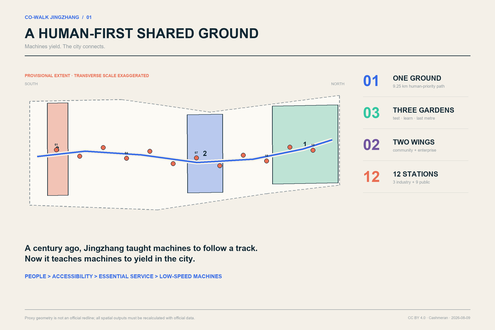
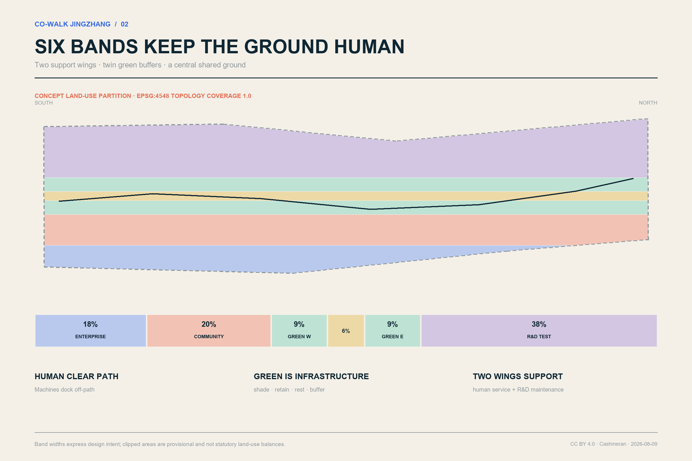
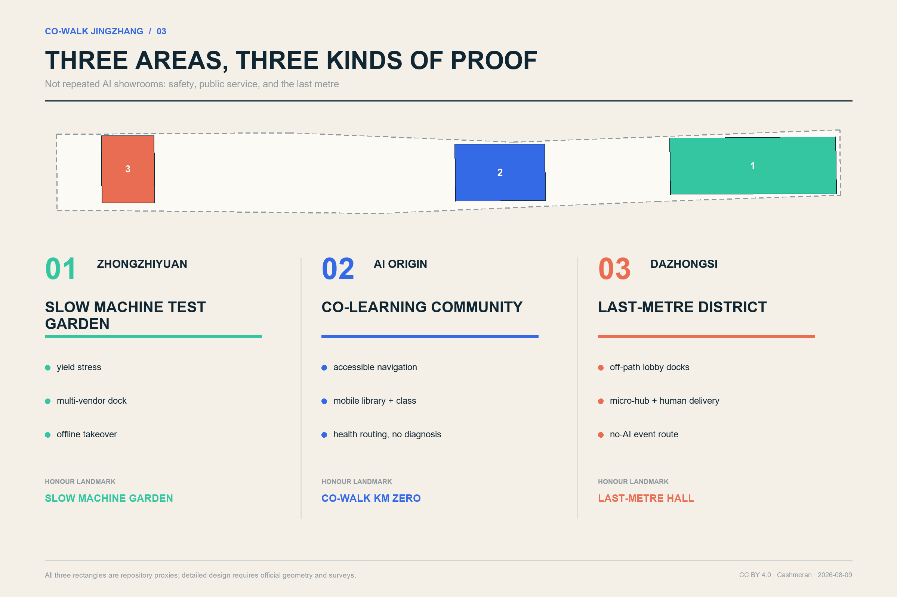
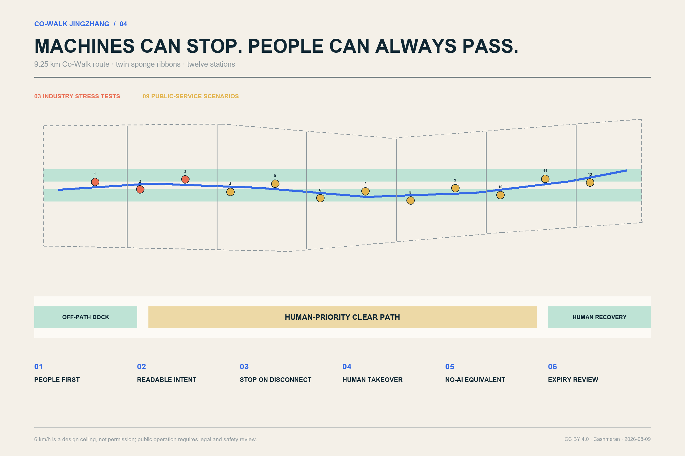
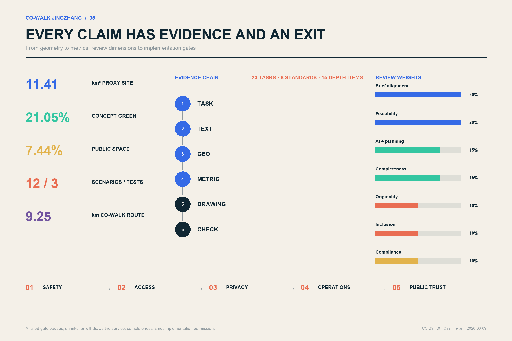

# CO-WALK JINGZHANG / 京张共步

> A century ago, the Jingzhang Railway taught machines to move along a track. In the AI era, Jingzhang should teach machines to yield in the city.
> **Machines yield. The city connects.**

## Design Basis and Source List

CO-WALK does not build a robot-only corridor. It writes human passage, accessibility, and access to public services into the first spatial protocol of an AI city. Its starting question is ordinary and concrete: when a wheelchair user, a stroller, an older adult, a child, a courier, and a low-speed robot arrive at the same narrow path, crossing, or lobby, who goes first, how is intent understood, and who can opt out? The answer is a human-first shared ground. Machines must be readable, stoppable, manually recoverable, and parked outside the clear path. Basic routes and human service remain available when a phone, network, or AI service fails.

The official announcement, the agent taskbook, and the repository site package govern the formal work. International precedents are method comparisons only; they do not establish a Beijing redline, existing condition, or implementation promise. [source:OFFICIAL-ANNOUNCEMENT] The three-level scope follows [standard:PROJECT-OFFICIAL-ANNOUNCEMENT], and the six agent tasks follow [source:AGENT-TASKBOOK] and [standard:PROJECT-AGENT-OPEN-CALL-TASKBOOK]. Existing-condition work uses a known / unknown / closure-trigger register instead of visually filling missing evidence. [depth:existing_conditions_diagnosis]

The package uses the repository’s provisional proxy geometries. The overall area and three key areas are marked `provisional_constraint` and `official_boundary=false`. They support concept organisation, internal topology checks, and provisional recalculation only; they are not official site, parcel, road, or approval boundaries. [data:geometry/site_boundary.geojson#SITE-001] The EPSG:4548 recalculation of the proxy site is 11,412,825.386 square metres. [metric:site_area_sqm] The key-area rectangles support task indexing, not parcel inference. [data:geometry/key_areas.geojson#PROV-KEY-001] [metric:key_area_count]

The public package does not supply statutory FAR, height, density, setbacks, official green ratio, building survey, ownership, municipal capacity, heritage controls, geotechnical data, or engineering constraints. The proposal therefore leaves `floor_area_ratio` unknown and treats 28 footprints as reversible service prototypes rather than development capacity. [data:geometry/constraints.geojson#CONSTRAINT-DATA-GAP-001] [metric:floor_area_ratio] [depth:risk_missing_data]

## Three-Level Scope Framework

The three scopes represent three levels of judgement, not disconnected drawing sets. The approximately 43.6-square-kilometre coordinated research area asks how a northern Beijing AI innovation chain and future urban services could cooperate. The approximately 11.4-square-kilometre overall design proxy asks how ground, functions, renewal, mobility, and blue-green systems can form one framework. The three provisional key areas, approximately 368.4 hectares in the announcement, ask which spatial prototypes and implementation gates should be tested first. This structure fulfils [depth:three_level_scope_framework] while keeping announced approximate areas separate from proxy-geometry precision.

| Level | Design question | CO-WALK deliverable | Limit |
| --- | --- | --- | --- |
| Coordinated research | How can an AI ecosystem become an urban commons? | Open Co-Walk Protocol, precedent review, talent and event network | No invented research polygon or industrial placement |
| Overall design | How can people, active mobility, and low-speed machines share the ground? | One ground, two support wings, twin green ribbons, six cross-links, twelve stations | Not a road redline, regulatory plan, or engineering design |
| Key areas | Where should testing start, and what should be verified? | Safety test garden, co-learning community, last-metre service district | Provisional rectangles are not parcels |

The structure is “**one ground, three Co-Walk gardens, two support wings, twelve service stations**.” One approximately 9.25-kilometre conceptual route supports continuous passage; three gardens test safety, community learning, and last-metre services; community and enterprise wings provide human and technical support; twelve stations host transparent, reviewable services. This is an auditable yielding protocol rather than another renamed “axis and three cores.” [data:geometry/roads.geojson#ROAD-COWALK-001] [metric:cowalk_route_length_m] [depth:overall_spatial_structure]

## Coordinated Research Area: Industry and Future City Research

The Co-Walk Protocol is itself shared innovation infrastructure. It puts city problem owners, robotics firms, university labs, disability organisations, operators, and regulators in one loop: publish a problem and site limits; submit a reversible prototype; co-test with users; audit safety and inclusion; expand only after passing. Public-space experience becomes R&D input, and compliance records become market credibility. Full-stack innovation is supported without granting technology unconditional access to public ground.

The name CO-WALK JINGZHANG combines place, action, and ethics. Its mark is formed by two parallel lines of unequal weight: the heavy line is the continuous pedestrian and accessible route; the light line is a machine trajectory that must yield and can leave the route. At stations, both lines remain open to signal a permanent human-service entrance. “Machines yield. The city connects.” becomes the wayfinding and international communication line. A company may use the “CO-WALK TESTED” badge only for a scenario that has passed its current gate.

Seven precedents contribute methods, not imported forms. Woven City demonstrates real-user participation and phased opening. Punggol Digital District combines industry, learning, community, and an open platform. Kalasatama connects daily services to transit, walking, and cycling. Barcelona’s Superblocks redistribute streets toward people and neighbourhood life. Seoul’s robot demonstration links real-world trials with operational standards and privacy guidance. EU CitCom.AI builds a network for trustworthy real-condition testing. EU Access City practice involves disability organisations in planning and acceptance.

| Precedent | Transferable lesson | Jingzhang translation | What is not copied |
| --- | --- | --- | --- |
| Woven City | Real users and phased living tests | Co-test in a small area before expansion | A private closed-community model |
| Punggol Digital District | Industry-learning-community integration | Shared stations between the enterprise and community wings | Imported platform specifications |
| Kalasatama | Daily services and green mobility together | Health, library, rest, and walking on one network | Replacing basic services with “smartness” |
| Barcelona Superblock | Return street space to people | Robot docks leave the clear path | Ignoring Beijing ownership and road conditions |
| Seoul robot test | Crowded real-world tests, standards, privacy | Three industry stress tests first | Treating a trial as permanent permission |
| EU CitCom.AI | Open trustworthy-AI testing network | Reusable scripts and public issue records | One metric flattening local conditions |
| EU Access City | Disability participation and accessible information | No-AI equivalent paths and co-acceptance | Accessibility as an add-on |

The operating loop is problem → prototype → co-test → audit → limited expansion. Long-term value is measured through fewer right-of-way conflicts, accessible task completion, manual-takeover response, closed public complaints, reproducible open issues, and service reversibility—not robot counts. [source:CASE-WOVEN-CITY] [source:CASE-PUNGGOL-DIGITAL-DISTRICT] [source:CASE-EU-CITCOM-TEF]

## Overall Design Area: Urban Renewal and Regulatory-Plan-Level Urban Design

Six longitudinal concept bands organise the overall proxy: an innovation-enterprise support wing, an all-age community-service wing, a west green ribbon, the central Co-Walk ground, an east green ribbon, and a robotics/public-service R&D wing. The features use national-guide-compatible codes `05`, `0702`, `1401`, `1207`, `1401`, and `0802`; together they cover the proxy boundary without area-scale overlaps. [standard:MNR-LAND-USE-CLASSIFICATION-GUIDE] [data:geometry/land_use.geojson#LU-ROAD] [metric:land_use_coverage_ratio] [depth:land_use_layout]

The bands are an urban-design proposition, not a statutory land-use plan. The central ground protects continuous passage. Twin green ribbons provide shade, retention, rest, and a soft safety buffer. The community wing provides human service, care, and accessibility support. Enterprise and R&D wings host laboratories, micro-hubs, maintenance, and developer services. Twelve alternating stations prevent one edge from being continuously occupied. Six east-west walking links make the belt permeable rather than walled.

Renewal follows “ground first, buildings lightly, protocol in parallel.” First repair path discontinuities, gradients, surfacing, shade, signs, and docking order. Then add reversible stations and test facilities. Only after building, ownership, structure, and regulatory evidence is available should retain/renovate/build decisions be made. Height, FAR, road lines, and setbacks remain pending. [standard:MOHURD-CONTROL-DETAILED-PLANNING] [metric:building_footprint_area_sqm] [depth:development_intensity_controls]

The public edge remains visible and maintainable: human help is placed at ground level; mint-green dock lines identify machine waiting without creating obstacles; night lighting prioritises human recognition, continuity, and low glare; sensing, charging, and edge-compute modules use removable interfaces. This integrated approach implements [standard:MOHURD-URBAN-DESIGN-MEASURES].

## Detailed Design of Key Areas

The three key areas are three distinct urban validation environments, not repeated AI showrooms. Functional, mobility, public-space, prototype-building, and operating-gate proposals are made within provisional proxy rectangles; all must be replaced and recalculated when official geometry arrives. [data:geometry/key_areas.geojson#PROV-KEY-001] [data:geometry/key_areas.geojson#PROV-KEY-002] [data:geometry/key_areas.geojson#PROV-KEY-003] [depth:three_key_area_detailed_design]

**Zhongzhiyuan: Slow Machine Test Garden.** This area asks how machines yield in open space. Variable crossings, surface and gradient segments, offline-signal zones, a manual-recovery desk, public observation walk, and standards workshop form the test landscape. Low-rise lab and co-test pavilions display purpose, operator, expiry date, and emergency-stop method. Only SCN-01 to SCN-03 operate initially; yielding, interoperability, and degraded-mode tests must pass before daily-life services open.

**Beijing AI Origin Community: Co-Walk Learning Community.** This area asks how AI service can become an everyday public service without becoming a digital barrier. Mobile libraries, open-source classes, accessible navigation, health-service navigation, and developer open days form a walking learning loop. Buildings remain “retain pending evidence” until surveyed. Reversible classrooms, a human help desk, and a repair point supplement existing space. Every digital service retains paper, oral, or staffed access.

**Dazhongsi: Last-Metre Service District.** This area asks how robots move through the boundary among commerce, transit, and community. Lobby docking, shared micro-hubs, wheelchair and stroller passage, event guidance, and four-quadrant walking connections are prioritised. Robots may not wait in the pedestrian clear zone. The “Last-Metre Exchange Hall” and community maintenance point are prototypes. Transit integration is limited to experience and wayfinding principles until official station and road evidence is available.

Four honour landmarks form a public pilgrimage route: the Slow Machine Test Garden, Co-Walk Kilometre Zero, the Last-Metre Exchange Hall, and the Contributors’ Rail. The rail records verified open contributions, failures, and repairers—not only companies and investors—so residents, maintainers, and accessibility testers become authors of AI-city culture. All 28 footprints are two- or three-storey concept prototypes, not total development. [data:geometry/buildings.geojson#BLDG-PROTOTYPE-01] [metric:prototype_building_count] [depth:height_massing_character]

## AI Innovation Ecosystem, Personas, and AI+ Scenarios

Six personas make design consequences tangible. An older resident with limited mobility needs short routes, rest, and a visible person to ask. A wheelchair user or stroller caregiver needs clear width, gradients, kerbs, and robot yielding. An R&D tester needs reproducible scripts and explicit responsibility. A merchant or courier needs ordered lobby exchange and peak management. A student or start-up needs affordable testing, open-source reputation, and publication space. A cleaner, maintainer, or security worker needs tools that reduce burden without enabling automated blame. Personas guide needs; they are not profiles of actual individuals.

Twelve scenario cards bind users, place, minimum data, human fallback, exit criteria, and responsibility. The first three are industry tests. Their count is verifiable in [data:geometry/public_space.geojson#PUBLIC-NODE-01], [metric:scenario_node_count], and [metric:industry_test_count]. Every scenario inherits five rules: human priority, no-AI equivalence, manual takeover, docks outside the path, and expiry review. [source:CASE-PUNGGOL-PHYSICAL-AI]

| ID | Scenario | Primary users | Minimum data and human review | Failure mode |
| --- | --- | --- | --- | --- |
| SCN-01 | Crossing-yield stress test | Wheelchair users, caregivers, robot firms | Anonymous conflict events and passage time; on-site safety officer | Slow, stop, restore human-only mode |
| SCN-02 | Multi-vendor dock interoperability | Operators, firms, merchants | Device status and interface logs; operator acceptance | Remove failed device from public ground |
| SCN-03 | Offline drift and manual takeover | Safety staff, developers, public | Error and takeover time; two-person confirmation | Stop on disconnect; tow clear |
| SCN-04 | Accessible Co-Walk navigation | Older, wheelchair, low-vision users | Accessibility status with public correction | Fixed signs and a human hotline remain |
| SCN-05 | Low-speed delivery and micro-hub | Residents, merchants, couriers | Order token; no stored bystander faces | Human delivery or fixed collection |
| SCN-06 | Mobile health-service navigation, no diagnosis | Older residents, visitors | Service location and queue only; clinician confirmation | Explicitly hand off to staffed care |
| SCN-07 | Mobile library and open-source class | Students, children, residents | Loan consent and event registration | Physical loan and teacher remain |
| SCN-08 | Cleaning and inspection assistance | Front-line workers | Facility fault points, no worker scoring | Human work order and worker appeal |
| SCN-09 | Jingzhang cultural guide | Residents, visitors | Preferences stored locally; editor review | Fixed panels and paper map remain |
| SCN-10 | Event crowd guidance | Event users, safety staff | Aggregated density, no face recognition | Human announcements and no-AI route |
| SCN-11 | Extreme-weather water and rest | Outdoor workers, older people, children | Weather warning and supply state | Fixed refuge and staffed supply |
| SCN-12 | Developer open day and issue reporting | All users, firms, maintainers | Voluntary, deletable, optionally anonymous issues | Staffed paper intake and public log |

The protocol bans default face recognition, personal scoring as a safety proxy, and automated enforcement. Raw sensing is processed at the edge where possible; operators may not join personal movement trails; every deployment publishes fields, retention, accountable staff, and deletion method. The public can see why a machine stopped, who can recover it, and when the permit expires. Seoul’s high-footfall demonstration is used only as a background comparison. [source:CASE-SEOUL-ROBOT-TEST] [depth:risk_missing_data]

## Land Use, Building Scale, and Retain-Renovate-Demolish Strategy

The six concept bands occupy approximately 18% enterprise support, 20% all-age community support, 21.05% twin green ribbons, 6% central shared ground, and 38% robotics/public-service R&D; irregular boundary clipping changes the nominal fractions. Coverage is 1.0. These are not statutory land-use balances and must be recalculated with official geometry. [data:geometry/land_use.geojson#LU-ENTERPRISE] [data:geometry/land_use.geojson#LU-RESEARCH] [metric:land_use_coverage_ratio]

Twenty-eight reversible service prototypes have a combined footprint of approximately 41,744 square metres. Types include open low-speed robot tests, shared community services, and Jingzhang memory/Co-Walk services. Small spans, replaceable equipment, open ground floors, and low-rise form are common principles. Two or three storeys are scale assumptions, not approved height or floor area. [data:geometry/buildings.geojson#BLDG-PROTOTYPE-12] [metric:building_footprint_area_sqm] [standard:MOHURD-ARCH-DESIGN-DEPTH-2016]

Retain/renovate/demolish follows “unknown means retain.” No building enters demolition without survey, ownership, structural, heritage, and use evidence. Later review first tests cultural/public value, then structural and embodied-carbon costs, then functional adaptability, and finally compares repair, reversible addition, and replacement over the life cycle. Retained buildings prioritise accessible ground floors; renovations prioritise reversible assemblies; demolition requires evidence that safety cannot reasonably be repaired and that public benefit exceeds alternatives. [depth:retain_renovate_demolish]

A two-column control sheet separates what can be recalculated—prototype footprint, green and public-space area, route, and nodes—from what remains unknown—FAR, height, density, setbacks, parking, municipal capacity, and heritage conditions. [standard:MOHURD-CONTROL-DETAILED-PLANNING] [metric:floor_area_ratio]

## Transport, Rail, Municipal Infrastructure, and Public Services

The conceptual main route is approximately 9,253.804 metres and is connected to both wings by six east-west walking links. `roads.geojson` describes active-mobility and service organisation, not a new road redline. The centre of the section remains a clear human-priority path; rest, planting, and robot waiting bays sit to the sides; stations use visible slow/yield/manual-recovery zones. The 6 km/h design ceiling is a safety assumption subject to law, certification, and test conditions. [data:geometry/roads.geojson#ROAD-COWALK-001] [metric:cowalk_route_length_m] [depth:traffic_rail_slow_parking]

Six spatial rules govern the ground: people always have priority; robot speed and intent are readable; docking and charging leave the clear path; loss of connection causes a stop and human recovery; every service has a no-AI route or staffed entrance; permits expire and public issues decide renewal. A 90-second manual-recovery target is a service design objective, not a claim of current capability. Controlled testing precedes open-space operation.

Transit recommendations are limited to experience interfaces: continuous exit signs, accessible routes without detours, no robot queues at lobbies, and equivalent low-stimulation/no-AI routes during events. Station boundaries, passenger counts, road lines, and interchange facilities are missing, so no station rebuild or parking count is claimed.

Infrastructure uses small, removable interfaces: low-voltage power, standard docking, self-check, physical emergency stop, edge processing, and staffed work orders. Charging is off-peak where possible. Thermal risk, network failure, or unresolved complaints can take one station offline without breaking the human route. Underground utilities and electrical capacity remain implementation prerequisites. [data:geometry/constraints.geojson#CONSTRAINT-DATA-GAP-001] [depth:municipal_new_infrastructure]

Robots do not monopolise public service. Health navigation never diagnoses; cultural content has editorial review; inspection does not automatically score workers; crowd guidance does not use face recognition; delivery retains staffed and fixed-pickup alternatives. Success is defined by easier completion of essential tasks, not AI call volume.

## Blue-Green Network, Public Space, and Urban Character

Twin sponge-green ribbons total approximately 2,402,791.530 square metres, or 21.0534% of the provisional site. The union of the Co-Walk ground and twelve nodes is approximately 849,284.498 square metres, or 7.4415%. These are concept-geometry results, not statutory green-space controls. [data:geometry/green_space.geojson#GREEN-RIBBON-001] [metric:green_space_area_sqm] [metric:green_ratio] [depth:blue_green_public_space]

The green ribbons provide shade and heat refuge, stormwater retention, habitat stepping stones, and a soft buffer between flow and machines. Drinking water, seats, weather cover, and toilets take priority over interactive screens. Public-space totals are derived from [data:geometry/public_space.geojson#PUBLIC-GROUND-001], [metric:public_space_area_sqm], and [metric:public_space_ratio].

The visual character combines railway engineering paper with an open-source issue tracker. Night blue carries Jingzhang’s engineering discipline; public mint marks access and safety; coral is reserved for conflict and manual takeover; warm paper white recalls archives. Provisional boundaries are always low-contrast grey dashes. Devices and pavilions expose fixings and IDs to communicate maintenance and iteration rather than a seamless futuristic shell.

The cultural narrative has three acts: “Along the Track” recalls engineering knowledge written into terrain; “Born Open” connects Zhongguancun innovation to collaborative networks; “Yielding Together” defines AI-era technical honour as restraint, transparent failure, and repair for public benefit. Kilometre Zero, the Slow Machine Test Garden, Last-Metre Exchange Hall, and Contributors’ Rail form a walkable set of landmarks. Barcelona’s people-first street redistribution and EU disability participation support this choice. [source:CASE-BARCELONA-SUPERBLOCK] [source:CASE-EU-ACCESS-CITY]

## Renewal Projects, Implementation Policy, and Phasing

Implementation builds ground, institutions, and community capability together. Eight packages can be reviewed, funded, stopped, or revised independently. Each publishes its scope, accountable party, expiry date, complaint route, and removal mechanism. [data:geometry/phasing.geojson#PHASE-01] [metric:implementation_phase_count] [depth:renewal_project_list]

| Package | Main work | Prerequisite | Verifiable output |
| --- | --- | --- | --- |
| P1 Ground repair | Gaps, gradients, paving, shade, width, signs | Official road/ownership check | Accessibility co-test record |
| P2 Twelve stations | Dock bays, human desk, e-stop, edge interface | Power, utilities, operator permit | Station-by-station acceptance |
| P3 Slow Machine Test Garden | Three industry stress tests | Controlled test and third-party safety review | Yield, interoperability, degradation reports |
| P4 Learning Community | Library, class, health navigation, issue library | Community co-design and service owner | No-AI equivalence test |
| P5 Last-Metre Exchange Hall | Micro-hub, lobby exchange, repair | Ownership, fire, logistics review | Peak passage and complaint closure |
| P6 Twin sponge ribbons | Shade, retention, rest, habitat | Landscape, water, maintenance review | Heat and runoff monitoring |
| P7 Contributors’ Rail | Open contributions, failure archive, guide | Rights clearance and editorial process | Annual public archive |
| P8 Protocol operations | Permit, audit, insurance, complaint, withdrawal | Multi-party committee | Quarterly report and renewal decision |

Three phases are gates, not fixed dates. Phase 1 starts conceptually in the southern Dazhongsi segment and tests last-metre service and clear width. Phase 2 at AI Origin proceeds only after major safety issues are closed, accessibility co-testing passes, and manual recovery meets its target. Phase 2 then tests public-service equity and multi-operator cooperation. Phase 3 at Zhongzhiyuan proceeds only after no-AI service stability, privacy audit, and operating finance are demonstrated. Any failed gate pauses, shrinks, or withdraws the service. [depth:phasing_implementation]

A Co-Walk Deliberation and Testing Committee includes disability representatives and caregivers, nearby residents, front-line operators, firms, universities, and planning, transport, and public-service professionals. Firms cannot unilaterally expand on public paths. Proposed tools include expiring scenario permits, public-liability insurance, open interfaces, disclosed issue logs, independent accessibility acceptance, and an equipment-removal bond.

The annual programme is seasonal: a Spring Open-Source Co-Walk Week publishes city problems; a Summer Slow-Machine Resilience Season tests heat and storms; an Autumn Jingzhang Yield Festival holds public tests and an international forum; a Winter Failure Archive Month publishes stopped and unresolved work. Developer open days occur monthly and community accompanied walks quarterly. Recognition goes to the best repaired yielding failure, not the highest deployment count. [source:CASE-KALASATAMA] [source:CASE-PUNGGOL-DIGITAL-DISTRICT]

## Metrics, Area Recalculation, and Compliance Matrix

Structured metrics make the proposal recalculable and contestable. Area and length use EPSG:4548; GeoJSON coordinates use EPSG:4326. Land-use union covers the proxy site. Green and public-space unions prevent double counting. Nodes, industry tests, prototypes, and phases are counted by stable feature IDs. [depth:metrics_recalculation]

| Metric | Current value | Formula/source | Limit |
| --- | ---: | --- | --- |
| Proxy site | 11,412,825.386 m² | `area(site_boundary)` | Not official boundary area |
| Land coverage | 1.000000 | `area(union(land_use))/site_area` | Topology, not statutory allocation |
| Green area/ratio | 2,402,791.530 m² / 0.210534 | `union(green_space)/site_area` | Concept ribbons, not official green ratio |
| Public area/ratio | 849,284.498 m² / 0.074415 | `union(public_space)/site_area` | Main ground and station union |
| Prototype footprint | 41,744.000 m² | `union(building prototypes)` | 28 prototypes, not development capacity |
| Main route | 9,253.804 m | `length(ROAD-COWALK-001)` | Concept route, not engineering quantity |
| Scenarios/industry tests | 12 / 3 | stable-feature count | Not approved pilots |
| Key areas/phases | 3 / 3 | stable-feature count | Proxy areas and gate sequence |

The complete record sits in `metrics.json`. [metric:site_area_sqm], [metric:green_ratio], [metric:public_space_ratio], and [metric:scenario_node_count] can be cross-checked against geometry. `compliance_matrix.json` covers 23 announcement and agent tasks; `standard_matrix.json` covers six standards; `design_depth_matrix.json` covers fifteen depth items. [standard:PROJECT-AGENT-OPEN-CALL-TASKBOOK]

The review dimensions map directly to evidence: brief alignment to the three scopes and 23 rows; feasibility to small pilots, accountable parties, and exit gates; AI/planning innovation to the protocol, stress tests, and no-AI equivalents; completeness to bilingual text, five figure pairs, A3/A0 PDFs, offline HTML, and nine geometry layers; originality to spatialised yielding rather than a slogan; inclusion to six personas and co-acceptance; compliance to minimum data, manual takeover, provisional boundaries, and unknown statutory metrics.

## Risk, Copyright, and Compliance

The proposal does not claim government approval, company partnership, access permission, or investment. External cases are background only; provisional boundaries use a grey dashed line. Before operation, every scenario still requires relevant planning, transport, fire, accessibility, cybersecurity, data-protection, product-safety, insurance, and operational-responsibility review. AI cannot replace statutory approval, diagnosis, enforcement, or professional safety judgement.

| Risk | Control | Stop/closure condition |
| --- | --- | --- |
| Privacy | No default face recognition; edge processing; minimum retention; deletion | No launch without a field register and impact assessment |
| Complexity | One station at a time; common e-stop and issue log | Pause without an accountable operator and insurance |
| Acceptance | Docks leave the path; public committee; expiring permit | No expansion with unresolved major complaints |
| Operating cost | Open interfaces, maintenance fund, removal bond | Remove if operating finance is not closed |
| Policy uncertainty | Treat 6 km/h as an assumption and review each scenario | Permission expiry stops operation |
| Spatial dispute | Grey dashed proxies and complete recalculation | Replace immediately when official geometry arrives |
| Technology maturity | Three stress tests, stop on disconnect, manual takeover | Major safety failure returns to controlled testing |
| Equity | No-AI equivalent route, staffed entrance, disability acceptance | AI service is withdrawn if equivalence fails |

Submission text, structured data, derived graphics, and layout are released under CC BY 4.0. Official materials, standards, repository proxy geometry, and precedent pages retain their respective rights and use limits. Visuals are derived locally from submitted geometry and original diagramming; no restricted third-party images are redistributed. Building content does not reach construction-document depth. [standard:MOHURD-ARCH-DESIGN-DEPTH-2016] [depth:risk_missing_data]

Implementation requires official geometry; surveys of buildings, ownership, regulatory planning, mobility, utilities, heritage, and engineering conditions; regeneration of all nine layers and metrics; multi-disciplinary review; and public co-testing. AI may not “infer away” any missing prerequisite.

## References

Formal task and local evidence:

- Official announcement and local snapshot. [source:OFFICIAL-ANNOUNCEMENT]
- Agent open-call taskbook. [source:AGENT-TASKBOOK]
- Site package, enums, planning-limit status, schemas. [source:SITE-PACKAGE]
- Source-use registry. [source:SOURCE-REGISTRY]
- Processed fact-pack navigation, not a new authority. [source:PROCESSED-FACT-PACK]
- Provisional overall proxy. [source:BOUNDARY-SOURCE]
- Provisional key-area proxies. [source:KEY-AREA-SOURCE]

International background precedents:

- Toyota Woven City. [source:CASE-WOVEN-CITY]
- Punggol Digital District. [source:CASE-PUNGGOL-DIGITAL-DISTRICT]
- Punggol Physical AI testbed. [source:CASE-PUNGGOL-PHYSICAL-AI]
- Helsinki Kalasatama. [source:CASE-KALASATAMA]
- Barcelona Superblock. [source:CASE-BARCELONA-SUPERBLOCK]
- Seoul COEX/Teheran-ro robot demonstration. [source:CASE-SEOUL-ROBOT-TEST]
- EU CitCom.AI testing facilities. [source:CASE-EU-CITCOM-TEF]
- EU Access City practice. [source:CASE-EU-ACCESS-CITY]

Professional responses use [standard:PROJECT-OFFICIAL-ANNOUNCEMENT], [standard:PROJECT-AGENT-OPEN-CALL-TASKBOOK], [standard:MOHURD-URBAN-DESIGN-MEASURES], [standard:MOHURD-CONTROL-DETAILED-PLANNING], [standard:MNR-LAND-USE-CLASSIFICATION-GUIDE], and [standard:MOHURD-ARCH-DESIGN-DEPTH-2016].
