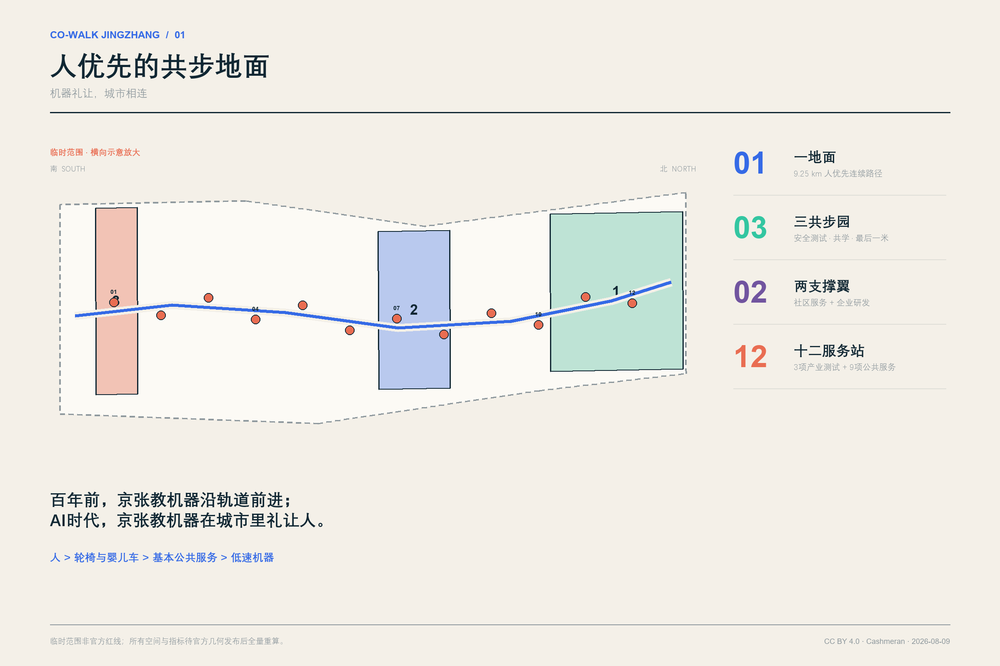
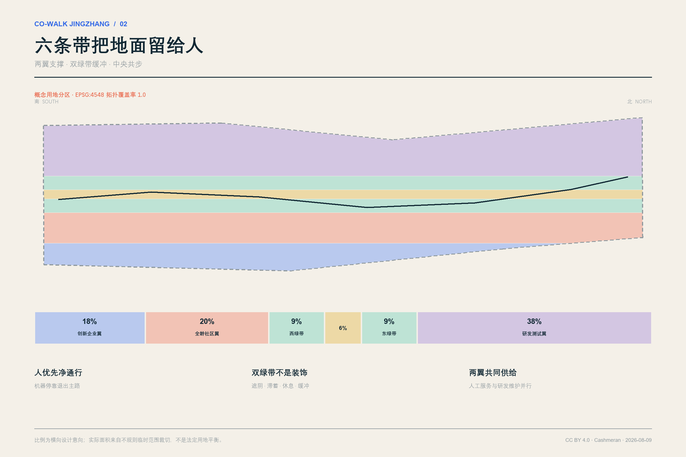
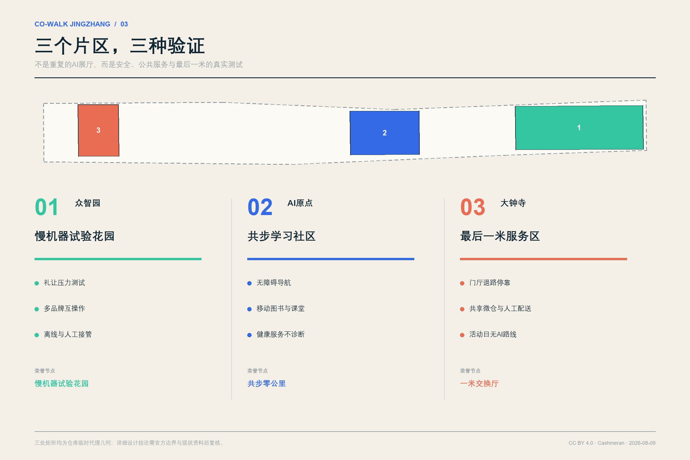
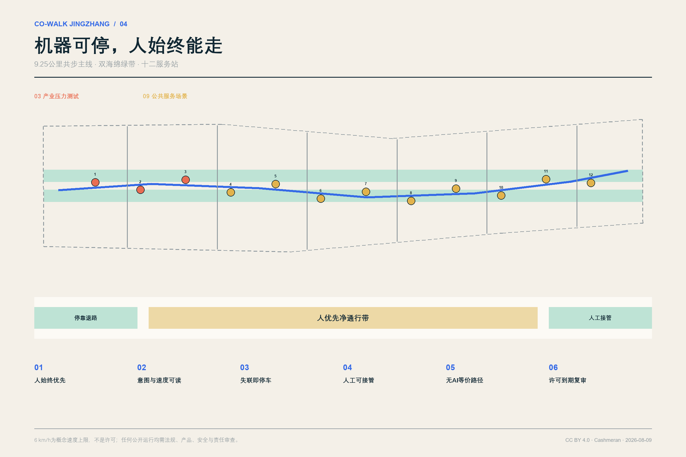
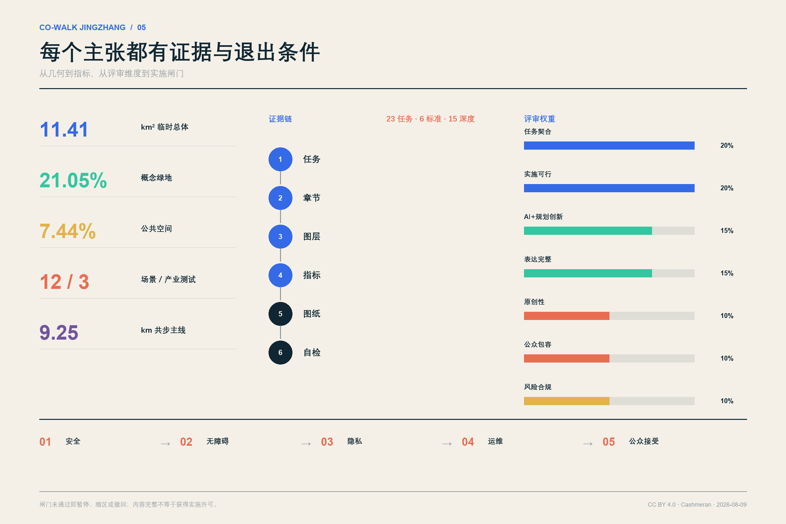

# 京张共步 / CO-WALK JINGZHANG

> 百年前，京张铁路教机器沿轨道前进；AI时代的京张，要教机器在城市里礼让人。
> **Machines yield. The city connects.**

## 设计依据与资料清单

“京张共步”不是为机器人修一条专用走廊，而是把人的通行权、无障碍权和公共服务权写进AI城市的第一层空间协议。方案的原点是一个日常问题：当轮椅、婴儿车、老人、儿童、快递员和低速机器人同时来到一段窄路、一个路口或一处门厅，谁先走，谁能看懂，谁可以退出？我们的回答是“人优先的共步地面”：机器必须可读、可停、可接管，停靠必须退出主通行带；没有手机、没有AI或服务失效时，基本路径和人工服务仍然存在。

正式任务以征集公告、面向智能体任务书和仓库场地包为依据；外部案例只用于比较方法，不用于推断北京的红线、现状或实施承诺。[source:OFFICIAL-ANNOUNCEMENT] 公告规定的三层范围和成果深度由 [standard:PROJECT-OFFICIAL-ANNOUNCEMENT] 约束；六项智能体任务由 [source:AGENT-TASKBOOK] 与 [standard:PROJECT-AGENT-OPEN-CALL-TASKBOOK] 约束。现状诊断采用“已知—未知—关闭条件”三栏法，而不是用漂亮图面填补资料空白。[depth:existing_conditions_diagnosis]

本包采用 `brief/site-package/geometry/provisional_boundaries.geojson` 中的临时代理几何。总体范围和三处重点片区均为 `provisional_constraint`，`official_boundary=false`；它们只支持概念空间组织、内部拓扑检查和临时面积复算，不是官方红线、地块线、道路红线或审批依据。[data:geometry/site_boundary.geojson#SITE-001] 当前临时总体面积按 EPSG:4548 复算为 11,412,825.386 平方米。[metric:site_area_sqm] 三处重点片区只核对数量和任务位置，不以矩形边界推断地块条件。[data:geometry/key_areas.geojson#PROV-KEY-001] [metric:key_area_count]

公开包尚缺正式范围、控规、建筑高度、密度、绿地率、退线、现状建筑、产权、市政容量、文保、地勘和工程条件。方案因此不输出虚构的容积率或政府投资承诺；`floor_area_ratio` 保持 `unknown`，28个建筑基底只代表可拆卸服务原型。缺口和关闭条件见 `assumptions.json` 与风险章节。[data:geometry/constraints.geojson#CONSTRAINT-DATA-GAP-001] [metric:floor_area_ratio] [depth:risk_missing_data]

## 三层范围工作框架

三层范围对应三种判断尺度，而不是三套互不相干的图纸。统筹研究范围约43.6平方公里，回答“北京北部AI创新链与未来城市服务如何协同”；总体设计范围约11.4平方公里，回答“公共地面、功能、更新、交通和蓝绿系统如何形成一体化骨架”；三处重点片区合计约368.4公顷，回答“具体场景、空间原型和实施闸门如何被验证”。这一框架落实 [depth:three_level_scope_framework]，所有面积仍以公告约值和临时几何的不同精度分别表达。

| 层级 | 设计问题 | 京张共步的交付 | 不能越过的边界 |
| --- | --- | --- | --- |
| 统筹研究范围 | AI生态如何从园区项目变成城市共同体 | “共步协议”开放标准、案例对标、人才与活动网络 | 不绘制伪精确研究范围，不承诺产业落位 |
| 总体设计范围 | 人、慢行与低速机器如何共享城市地面 | 一地面、两支撑翼、双绿带、六条横向缝合线、十二服务站 | 不替代道路红线、控规和工程设计 |
| 三处重点片区 | 哪些地方先试、验证什么 | 众智园安全测试园、AI原点共学社区、大钟寺最后一米服务区 | 临时片区边界不解释为地块边界 |

空间结构概括为“**一地面、三共步园、两支撑翼、十二服务站**”。“一地面”是约9.25公里的概念共步主线；“三共步园”分别承担安全测试、社区共学和最后一米服务；“两支撑翼”是全龄社区服务与创新企业研发；十二服务站把测试、健康、文化、配送、维护和公众反馈变成可运营节点。它不是常见的“三核一轴”换名，而是以一套可被审计的礼让协议组织空间、设备与运营。[data:geometry/roads.geojson#ROAD-COWALK-001] [metric:cowalk_route_length_m] [depth:overall_spatial_structure]

## 统筹研究范围产业与未来城市研究

共步协议本身就是AI创新生态的公共产品。它把城市需求方、机器人企业、高校实验室、无障碍组织、运营团队和监管者放在同一测试闭环中：城市公开问题与场地条件，企业提交可撤回的服务原型，公众共同测试，人因与安全结果进入开源问题库，达标后才允许扩区。与单纯招商相比，这套机制让“公共空间即测试基础设施、公众反馈即研发输入、合规记录即市场信誉”。它回应全栈自主创新，但不把技术领先等同于无条件进入公共空间。

品牌名“京张共步 / CO-WALK JINGZHANG”同时包含地点、动作和伦理。标志采用两条不等宽的平行线：粗线代表连续的人行与无障碍路径，细线代表必须让行、可随时退出的机器轨迹；两线在站点形成开口而非封闭回路，表示城市服务始终保留人工入口。品牌语“机器礼让，城市相连”用于导视、测试徽章和国际活动；任何企业只能在通过场景闸门后使用“CO-WALK TESTED”标识，避免把城市品牌变成广告授权。

全球案例不复制形态，只提炼可检验的方法。Toyota Woven City说明真实居民参与和分期启动的重要性；新加坡榜鹅数字园说明产学混合和开放数字底座的价值；Helsinki Kalasatama说明日常服务、公共交通与步行骑行需要同步；Barcelona Superblock说明街道再分配可以优先人和社区；Seoul的机器人实测说明高人流场所需要运营标准与隐私指引；欧盟CitCom.AI说明可信AI要在真实城市条件中持续测试；欧盟无障碍城市实践说明残障人士组织必须参与规划和验收。它们均为背景对标，不构成本场地事实。

| 案例 | 可迁移方法 | 京张转译 | 拒绝照搬的部分 |
| --- | --- | --- | --- |
| Woven City | 真实使用者参与、分期生活实验 | 每期先小范围共测，再决定扩区 | 企业封闭社区模式 |
| Punggol Digital District | 产学社区协同、开放平台 | 企业翼与社区翼共享服务站 | 直接移植数字底座规格 |
| Kalasatama | 日常服务与绿色出行一体化 | 把健康、图书、休息和慢行放在同一路径 | 用“智慧”替代基本公共服务 |
| Barcelona Superblock | 把街道面积还给步行、绿化和邻里活动 | 机器停靠退出主通行带 | 忽略北京道路与产权条件 |
| Seoul robot test | 高人流实测、标准和隐私同步 | 三项产业压力测试先行 | 把试点视为长期许可 |
| EU CitCom.AI | 开放测试网络与可信AI | 建立可复用测试脚本和公开问题单 | 用统一指标抹平场地差异 |
| EU Access City | 残障组织参与、物理与信息无障碍 | 无AI等价路径和共同验收 | 把无障碍当附加功能 |

生态运营采用“问题—原型—共测—审计—扩区”五步循环。长期价值不以机器人数量衡量，而以路权冲突下降、无障碍任务完成率、人工接管响应、公众投诉关闭率、开源问题复现率和服务可退出性衡量。外部对标由 [source:CASE-WOVEN-CITY]、[source:CASE-PUNGGOL-DIGITAL-DISTRICT] 与 [source:CASE-EU-CITCOM-TEF] 支撑，任务完整性由 [depth:municipal_new_infrastructure] 复核。

## 总体设计范围城市更新与控规深度城市设计

总体设计把共步主线置于六条纵向功能带之间：西侧创新企业支撑翼、全龄社区服务翼、西绿带、中央共步地面、东绿带、东侧机器人与公共服务研发翼。六个分区使用国家指南对应的 `05`、`0702`、`1401`、`1207`、`1401`、`0802` 代码。[standard:MNR-LAND-USE-CLASSIFICATION-GUIDE] [data:geometry/land_use.geojson#LU-ROAD] 它们完整覆盖临时总体范围且不发生面积级重叠，由覆盖率和正式深度项分别核查。[metric:land_use_coverage_ratio] [depth:land_use_layout]

纵向分带不是法定用地方案，而是对“机器需要什么、城市先保障什么”的城市设计表达。中央6%宽度级别的共步地面保证连续通行；两侧绿带吸收停留、遮阴、雨洪和安全缓冲；社区翼承载人工服务、照护和无障碍支援；企业与研发翼承载实验室、共享微仓、维护和开发者服务。十二节点沿主线交替布置，避免连续侵占一侧界面。六条横向缝合线把两翼接入主地面，形成“可穿越的带”而不是新围墙。

城市更新策略是“地面先行、建筑轻触、协议同步”。第一步先修复断点、坡度、铺装、遮阴、导视和停靠秩序；第二步用可拆卸的服务站与开放测试设施补足功能；第三步在取得现状、产权、结构与控规资料后，再决定建筑保留、改造或建设。建筑高度、开发强度、道路红线与退线均待官方条件确认。[standard:MOHURD-CONTROL-DETAILED-PLANNING] [metric:building_footprint_area_sqm] [depth:development_intensity_controls]

整体城市设计遵循“首层公共、边界可读、夜间克制、设备可撤”的风貌原则：沿共步地面的首层优先提供可见人工服务和开放界面；机器人停靠区用薄荷绿地面边线识别，但不得形成路障；夜间照明以人脸可辨、路径连续和低眩光为目标，不为机器感知过度照明；传感器、充电和边缘计算模块采用可拆装接口。该空间统筹落实 [standard:MOHURD-URBAN-DESIGN-MEASURES]。

## 重点区域详细设计

三处重点区域是三种不同的城市验证环境，而不是三个重复的“AI展示中心”。它们在临时代理边界内提出功能、交通、公共空间、建筑原型和运营闸门。[data:geometry/key_areas.geojson#PROV-KEY-001] [data:geometry/key_areas.geojson#PROV-KEY-002] 第三处片区和完整深度另行定位；正式落图前必须以官方几何替换并重算。[data:geometry/key_areas.geojson#PROV-KEY-003] [depth:three_key_area_detailed_design]

**众智园AI自主创新加速区：慢机器试验花园。** 这里验证“机器怎样在开放空间礼让人”。空间由可变路口、不同材质与坡度测试段、离线信号区、人工接管台、公众观察廊和标准工作室组成。建筑原型为低层实验室和共测亭，首层向公众展示测试目的、责任主体、有效期和紧急停止方式。对外交通只提出步行骑行缝合与服务接驳原则，不推断未提供的道路红线。首期只运行SCN-01至SCN-03三项产业测试；礼让、互操作和降级均通过后，才开放生活服务场景。

**北京AI原点社区：共步学习社区。** 这里验证“AI服务怎样成为日常公共服务，而不是数字门槛”。围绕移动图书、开源课堂、无障碍导航、健康服务导航和开发者开放日，形成可步行的学习环。既有建筑在未调查前一律进入“保留待核”状态；可拆卸共享教室、人工服务台和社区修理点作为补充。学生、居民、照护者和初创团队共同维护问题库。任何数字服务必须同步提供纸质、口头或人工渠道。

**大钟寺AI产业聚集区：最后一米服务区。** 这里验证“机器人如何穿越商业、交通与社区交界”。空间重点是门厅前停靠、共享微仓、轮椅与婴儿车通行、活动日人流引导和四象限步行缝合。机器人不得把人行道当等待区；所有停靠位退让主通道，并设置能被低视力人群识别的触觉与色彩边界。建筑原型包括“一米交换厅”和社区维护站；轨道站一体化仅提出换乘体验和导视接口，待官方站点与道路资料后深化。

三处片区各有一座公众可进入的荣誉节点：众智园“慢机器试验花园”、AI原点“共步零公里”、大钟寺“一米交换厅”；第四个跨片区地标“贡献轨”沿主线记录通过复核的开源贡献、失败案例和修复者姓名。它避免只纪念企业或资本，也让维修员、测试居民和无障碍共测者成为AI城市文化的共同作者。28个建筑基底均为两至三层概念原型，不是完整开发量。[data:geometry/buildings.geojson#BLDG-PROTOTYPE-01] [metric:prototype_building_count] [depth:height_massing_character]

## AI 创新生态、人才画像与 AI+ 场景

方案服务六类具体人群：行动不便老人关心少绕路、可休息和有人可问；轮椅使用者与推婴儿车照护者关心净宽、坡度、路缘和机器人礼让；研发与测试人员关心可复现脚本、真实条件和责任边界；商户与配送员关心门厅交接、共享微仓和高峰秩序；学生与初创团队关心低成本试验、开源声誉和成果发布；保洁、维修与安保人员关心工具减负、人工接管和不被自动化问责。画像只用于设计需求，不采集或推断具体个人行为。

十二张场景卡均绑定服务对象、空间、数据最小集、人工入口、退出条件和责任主体；前三张是产业测试。场景数量由 [data:geometry/public_space.geojson#PUBLIC-NODE-01] 与 [metric:scenario_node_count] 核对，产业测试由 [metric:industry_test_count] 核对。所有场景继承“人优先、无AI等价、人工接管、停靠退路、到期复审”五条底线。[source:CASE-PUNGGOL-PHYSICAL-AI] [depth:municipal_new_infrastructure]

| ID | 场景与类型 | 主要使用者 | 最小数据与人工复核 | 失败时怎么办 |
| --- | --- | --- | --- | --- |
| SCN-01 | 人机交叉口礼让压力测试（产业测试） | 轮椅、照护者、机器人企业 | 只记冲突事件和匿名通过时间；安全员现场停止 | 立即降速、停车、恢复纯人行模式 |
| SCN-02 | 多品牌停靠/充电互操作（产业测试） | 运维、企业、商户 | 设备状态和接口日志；运维员验收 | 故障设备退出公共地面 |
| SCN-03 | 离线漂移与人工接管（产业测试） | 安全员、开发者、公众 | 定位误差和接管时间；双人确认 | 失联停车，人工拖离主通道 |
| SCN-04 | 无障碍共步导航 | 老人、轮椅、低视力访客 | 无障碍设施状态；公众可纠错 | 提供固定导视和人工热线 |
| SCN-05 | 低速配送与共享微仓 | 居民、商户、配送员 | 订单令牌，不保存沿途人脸 | 转人工配送或固定自提 |
| SCN-06 | 移动健康服务导航（不诊断） | 老人、访客、社区工作者 | 服务地点与排队信息；医护确认 | 明示“不诊断”，转人工医疗入口 |
| SCN-07 | 移动图书与开源课堂 | 学生、儿童、居民 | 借阅授权与活动报名 | 保留实体借阅和现场教师 |
| SCN-08 | 保洁与设施巡检协作 | 保洁、维修、管理者 | 设施故障点，不做人岗评分 | 人工派单并允许一线复核 |
| SCN-09 | 京张文化共步导览 | 居民、游客、学生 | 内容偏好本地保存；编辑审核 | 固定展牌、纸质地图继续可用 |
| SCN-10 | 活动人流引导 | 活动参与者、安保、轮椅使用者 | 聚合密度，不做人脸识别 | 切换人工广播和无AI路线 |
| SCN-11 | 极端天气移动饮水与休息 | 户外工作者、老人、儿童 | 气象预警与物资状态 | 固定避难点与人工补给兜底 |
| SCN-12 | 开发者开放日与问题上报 | 全体公众、企业、维护者 | 自愿问题单，可匿名、可删除 | 现场人工登记与公开处理台账 |

“共步协议”禁止三类快捷方式：默认人脸识别、用个人评分代替场景安全、让算法自动执法。传感原始数据优先在设备端处理，只上传聚合事件；不同运营者不得拼接个人轨迹；每个场景公布数据字段、保存期限、责任人和删除入口。公众可以看见机器为何停、由谁接管、服务何时到期。Seoul真实环境机器人测试对标准与隐私并行的经验只作为背景比较。[source:CASE-SEOUL-ROBOT-TEST] [depth:risk_missing_data]

## 用地、建筑规模与拆改留方案

六条纵向功能带是概念城市设计分区：创新企业支撑翼约18%、全龄社区服务翼约20%、两条绿带合计约21.05%、中央共步地面约6%、机器人与公共服务研发翼约38%，实际面积受不规则临时边界影响。总覆盖率为1.0；这些比例不是法定用地平衡表，官方范围替换后必须重算。[data:geometry/land_use.geojson#LU-ENTERPRISE] [data:geometry/land_use.geojson#LU-RESEARCH] [metric:land_use_coverage_ratio]

建筑层只表达28个服务原型，总基底约41,744平方米，包含低速机器人开放测试原型、社区共享服务原型、京张记忆与共步服务原型。它们采用小跨、可拆、可换设备、首层开放的共同原则。两至三层是假设性的原型层数，用于图示尺度，不形成高度控制或总建面结论。[data:geometry/buildings.geojson#BLDG-PROTOTYPE-12] [metric:building_footprint_area_sqm] [standard:MOHURD-ARCH-DESIGN-DEPTH-2016]

拆改留遵守“**未知即保留**”：没有现状测绘、产权、结构安全、历史价值和使用状态证据时，不把任何建筑列为拆除。取得资料后按四步判断：先核历史与公共价值，再核结构和碳成本，再核功能适配，最后比较原位修复、可逆加建与拆除重建的全生命周期影响。保留对象优先改善首层无障碍和公共界面；改造对象优先采用可逆构件；只有安全不可修复或公共利益证据充分时才进入拆除论证，并公开替代方案。[depth:retain_renovate_demolish]

开发强度控制采用双栏表达：左栏为可复算的原型基底、绿地、公共空间、路线和节点；右栏为待确认的FAR、高度、密度、退线、停车、市政和文保条件。评审者可以确认方案没有掩盖资料缺口，也不会把概念建筑数量误读成开发权。[standard:MOHURD-CONTROL-DETAILED-PLANNING] [metric:floor_area_ratio]

## 交通、轨道、市政与公共服务设施

概念共步主线约9,253.804米，串联十二服务站，并由六条东西向步行缝合线连接两翼。`roads.geojson` 表达的是慢行与公共服务组织，不是新道路红线。共步地面横断面按行为而非车型分区：中部连续净通行带归人优先；两侧设停留、绿化和机器等待凹位；节点前设置清晰的减速、让行和人工接管区。机器设计速度上限6 km/h仅为概念安全假设，必须服从现场法规、产品认证和试验条件。[data:geometry/roads.geojson#ROAD-COWALK-001] [metric:cowalk_route_length_m] [depth:traffic_rail_slow_parking]

共步协议的空间规则有六条：①人始终优先；②机器速度、意图和剩余电量可读；③停靠、充电和等待退出净通行带；④失联即停车，人工接管可在90秒目标内响应；⑤每项服务保留无AI等价路线或人工入口；⑥许可有期限，以公开问题单决定续期。90秒是服务设计目标，不是现有能力证明。行业试验先在封闭或可控时段完成，再进入开放公共空间。

轨道接驳只提出体验接口：出站导视连续、无障碍路径不绕行、门厅前不堆积机器人、活动日同步给出低刺激与无AI路线。由于缺少正式站点边界、客流、道路红线和接驳设施数据，方案不重画轨道站、不计算停车位，也不声称改造站厅。取得资料后应把换乘步距、坡度、过街等待、非机动车停放和无障碍连续性纳入交通模型。

新型基础设施采用“小接口、可撤回”原则。每个服务站预留低压电源、标准停靠、设备自检、物理急停、边缘计算和人工工单接口；不预设大规模集中算力进入公园。充电优先错峰并记录能耗；设备发生热失控、网络中断或投诉超阈值时可单站下线。地下管线与电力容量未经核实，全部列为实施前置条件。[data:geometry/constraints.geojson#CONSTRAINT-DATA-GAP-001] [depth:municipal_new_infrastructure]

公共服务不由机器人独占。健康导航明确“不诊断”；文化导览有编辑审核；设施巡检不用于自动评价一线员工；活动安全不做人脸识别；配送保留人工和固定自提。服务成效以“基本任务是否更容易完成”而不是“AI调用次数”衡量。

## 蓝绿空间、公共空间与城市风貌

两条纵向海绵绿带合计约2,402,791.530平方米，临时范围内绿地比例约21.0534%；连续共步公共地面与十二节点的并集约849,284.498平方米，公共空间比例约7.4415%。这些是概念图层的几何结果，不是法定绿地率或规划指标。[data:geometry/green_space.geojson#GREEN-RIBBON-001] [metric:green_space_area_sqm] 绿地比例和景观专业深度分别由结构化指标与矩阵核对。[metric:green_ratio] [depth:blue_green_public_space]

绿带承担四种日常功能：树荫与热避难、雨水滞蓄、生态踏脚石、机器人与人流之间的柔性缓冲。饮水、座椅、避雨和卫生间等基本设施优先于互动屏幕；极端天气时，移动服务只能补充固定避难点。公共空间总量由 [data:geometry/public_space.geojson#PUBLIC-GROUND-001] 与 [metric:public_space_area_sqm] 复算，比例由 [metric:public_space_ratio] 表达。

城市风貌采用“铁路工程纸 + 开源问题单”的视觉语言：深夜蓝代表京张工程理性，公共薄荷绿代表可达与安全，珊瑚色只标示冲突与人工接管，米白色保持纸质档案温度。临时边界始终使用低对比灰色虚线，避免看起来像正式红线。设备、亭棚和标牌保留可见螺栓与编号，强调可维护、可迭代，而非未来主义外壳。

文化叙事分三幕：第一幕“沿轨而行”讲述京张铁路将工程知识写入山河；第二幕“开源而生”讲述中关村把知识变成协作网络；第三幕“礼让而共”把AI时代的技术荣誉定义为对人的克制、对失败的记录和对公共利益的修复。共步零公里、慢机器试验花园、一米交换厅与贡献轨构成四个可步行的荣誉节点。Barcelona把公共空间重新分配给人，以及欧盟无障碍城市让残障组织参与规划的做法，支持这种“公共地面先于设备展示”的选择。[source:CASE-BARCELONA-SUPERBLOCK] [source:CASE-EU-ACCESS-CITY]

## 更新项目清单、实施政策与分期计划

实施不是一次性采购机器人，而是同时建设地面、制度和社区能力。项目包拆成八项，使不同责任主体可以独立审查、分步投资和随时停止。所有项目都必须公布边界、责任人、有效期、投诉渠道和退出机制。[data:geometry/phasing.geojson#PHASE-01] [metric:implementation_phase_count] [depth:renewal_project_list]

| 项目包 | 主要内容 | 先决条件 | 可验证交付 |
| --- | --- | --- | --- |
| P1 共步地面修复 | 断点、坡度、铺装、遮阴、净宽、导视 | 官方道路与权属核验 | 无障碍连续性共测记录 |
| P2 十二服务站 | 停靠凹位、人工台、急停、边缘接口 | 电力、市政和运营许可 | 12个节点逐站验收 |
| P3 慢机器试验花园 | 三项产业压力测试 | 封闭测试与第三方安全评估 | 礼让、互操作、降级报告 |
| P4 共步学习社区 | 图书、课堂、健康导航、问题库 | 社区共创和服务主体 | 无AI等价服务可用性 |
| P5 一米交换厅 | 微仓、门厅交接、维修与人工配送 | 产权、消防、物流组织 | 高峰通行与投诉关闭率 |
| P6 双海绵绿带 | 遮阴、滞蓄、休息和生态节点 | 绿化、水务与养护核验 | 热舒适与雨洪监测 |
| P7 贡献轨与文化导览 | 开源贡献、失败案例、纸质/数字导览 | 内容清权与编辑制度 | 年度公开档案 |
| P8 共步协议运营 | 许可、审计、保险、投诉、撤回 | 多方治理委员会 | 季度透明报告和续期决定 |

三期不是固定年月，而是闸门顺序。第一期从大钟寺南段启动，验证最后一米服务和人行净宽；只有连续三个月没有未关闭的重大安全问题、无障碍共测通过、人工接管达标，才进入第二期AI原点社区扩展。第二期验证公共服务公平、社区接受和多运营者协作；只有无AI等价服务稳定、隐私审计和运维资金闭环，才进入第三期众智园开放测试网络。任一闸门失败即暂停、缩区或撤回。[depth:phasing_implementation]

建议成立“共步议事与测试委员会”，席位包括残障人士和照护者、周边居民、一线运维、企业、高校、规划交通与公共服务专业人员。企业不能单独决定公共路径的扩区；安全事故、投诉和人工接管数据按季度公开。政策工具包括有限期场景许可、公共责任保险、开放接口、问题单披露、独立无障碍验收和设备回收保证金。

全年运营形成四季循环：春季“共步开源周”发布城市问题；夏季“慢机器耐候季”测试高温暴雨；秋季“京张礼让节”开展公众共测和国际论坛；冬季“失败档案月”公开停止、修复和未解决问题。月度有开发者开放日，季度有社区陪走，年度评选“最佳让行修复”而不是“最多部署设备”。[source:CASE-KALASATAMA] [source:CASE-PUNGGOL-DIGITAL-DISTRICT]

## 指标体系、面积复算与合规矩阵

结构化指标把“设计意图”变成可以被复算、质疑和替换的数据。面积与长度统一在EPSG:4548计算，GeoJSON坐标为EPSG:4326。用地并集覆盖总体临时范围；绿地和公共空间用并集面积避免重复计数；节点、产业测试、建筑原型和分期按带有稳定ID的特征计数。[depth:metrics_recalculation]

| 指标 | 当前值 | 公式/来源 | 解释边界 |
| --- | ---: | --- | --- |
| 临时总体面积 | 11,412,825.386 m² | `area(site_boundary)` | 非官方红线面积 |
| 用地覆盖率 | 1.000000 | `area(union(land_use))/site_area` | 拓扑完整，不等于法定用地方案 |
| 绿地面积/比例 | 2,402,791.530 m² / 0.210534 | `union(green_space)/site_area` | 概念双绿带，不等于法定绿地率 |
| 公共空间面积/比例 | 849,284.498 m² / 0.074415 | `union(public_space)/site_area` | 含主地面与节点并集 |
| 建筑原型基底 | 41,744.000 m² | `union(building prototypes)` | 仅28个原型，不代表开发量 |
| 共步主线 | 9,253.804 m | `length(ROAD-COWALK-001)` | 概念路线，非道路工程量 |
| 场景/产业测试 | 12 / 3 | `count(scenario_id/type)` | 节点数量，不等于获批试点 |
| 重点片区/分期 | 3 / 3 | `count(features)` | 片区为临时代理，分期为闸门顺序 |

所有指标原始记录在 `metrics.json`；总体面积见 [metric:site_area_sqm]，绿地结果见 [metric:green_ratio]，公共空间结果见 [metric:public_space_ratio]，场景数量见 [metric:scenario_node_count]。`compliance_matrix.json`覆盖公告17项与agent.1—agent.6共23项任务；`standard_matrix.json`覆盖6项标准；`design_depth_matrix.json`覆盖15项正式设计深度。每项都指向正文、图层、指标、图纸、网页、来源、假设和自检，而不是只打“完成”勾选。[standard:PROJECT-AGENT-OPEN-CALL-TASKBOOK] [depth:metrics_recalculation]

评审维度的对应关系是：任务契合由三层范围和23项矩阵证明；实施可行由小步试验、责任和退出闸门证明；AI与规划创新由共步协议、三项产业测试和无AI等价路径证明；表达完整由双语文本、五组图、A3/A0、离线HTML和九个图层证明；原创性来自“机器礼让”的空间协议而非形态口号；公众包容由六类人群和共同验收证明；风险合规由数据最小化、人工接管、临时边界和unknown指标证明。

## 风险、版权与合规说明

本方案不声称获得政府批准、企业合作、场地使用许可或投资承诺。外部案例仅作背景；图纸中的临时边界以灰色虚线表示。所有AI服务在上线前仍需规划、交通、消防、无障碍、网络安全、数据保护、产品安全、保险和运营责任审查。AI不能替代法定审批、医疗诊断、执法或专业安全判断。

| 风险维度 | 主要风险 | 设计控制 | 停止/关闭条件 |
| --- | --- | --- | --- |
| 数据隐私 | 人脸、轨迹或多运营者数据拼接 | 默认不做人脸识别；边缘处理、最短留存、可删除 | 字段清单、影响评估和审计未通过即不上线 |
| 实施复杂度 | 多主体接口和责任不清 | 单站点、小范围、统一急停与问题单 | 无明确责任人或保险即暂停 |
| 公众接受 | 机器挤占人行、噪声和广告化 | 停靠退路、公众委员会、期限许可 | 重大投诉未关闭不扩区 |
| 运维成本 | 设备闲置、耗能和维护转嫁公共部门 | 开放接口、维护基金、回收保证金 | 运维资金无闭环即撤除 |
| 政策不确定 | 路权、试点和数据规则变化 | 把6 km/h等写成假设，逐场景法规复核 | 许可失效自动停止 |
| 空间争议 | 临时范围错位或被误认红线 | 灰色虚线、显著免责声明、换图全量重算 | 官方几何发布后立即替换 |
| 技术成熟 | 漂移、失联、互操作失败 | 三项产业压力测试、失联停车、人工接管 | 任一重大安全失败回到封闭测试 |
| 公平包容 | 无手机或残障人群被排除 | 无AI等价路径、人工入口、残障人士验收 | 等价服务不可用即下线AI服务 |

版权方面，方案文字、结构化数据、派生图和版式由本次提交生成，以CC BY 4.0开放；官方公告、标准摘要、仓库临时几何和外部案例保留各自权利与使用边界。方案不抓取或再发布受限图像，所有视觉为本地几何与原创图形派生。建筑专业成果尚未达到施工设计深度，[standard:MOHURD-ARCH-DESIGN-DEPTH-2016] 仅用于指出后续深化需求。[depth:risk_missing_data]

最终落地的必要动作是：替换官方范围和重点片区；导入现状、权属、控规、交通、市政、文保和工程资料；重新生成九个图层与全部指标；由规划、建筑、交通、景观、市政、无障碍、安全、数据与运营专业共同复核；完成公众共测后再决定是否实施。任何一个缺口都不能用AI“推测补齐”。

## 参考资料

正式任务与本地证据：

- 征集公告与本地快照。[source:OFFICIAL-ANNOUNCEMENT]
- 面向智能体任务书。[source:AGENT-TASKBOOK]
- 场地包、枚举、限值状态和模式规则。[source:SITE-PACKAGE]
- 来源分级登记。[source:SOURCE-REGISTRY]
- 处理后的事实导航包，不作为新增权威来源。[source:PROCESSED-FACT-PACK]
- 临时总体代理几何。[source:BOUNDARY-SOURCE]
- 三处临时重点片区代理几何。[source:KEY-AREA-SOURCE]

全球背景案例（只比较方法）：

- Toyota Woven City：真实使用者参与的移动出行测试与分期启动。[source:CASE-WOVEN-CITY]
- Punggol Digital District：产学社区混合与开放数字平台。[source:CASE-PUNGGOL-DIGITAL-DISTRICT]
- Punggol Physical AI testbed：多运营者机器人公共场所测试与安全参数。[source:CASE-PUNGGOL-PHYSICAL-AI]
- Helsinki Kalasatama：公共交通、步行骑行和日常服务协同。[source:CASE-KALASATAMA]
- Barcelona Superblock：公共空间向步行、绿化和社区活动再分配。[source:CASE-BARCELONA-SUPERBLOCK]
- Seoul COEX/Teheran-ro：高人流机器人实测、运营标准与隐私指引。[source:CASE-SEOUL-ROBOT-TEST]
- EU CitCom.AI：可信AI与机器人真实条件测试网络。[source:CASE-EU-CITCOM-TEF]
- EU Access City：残障组织参与和物理/信息无障碍实践。[source:CASE-EU-ACCESS-CITY]

专业标准响应：任务与成果深度由 [standard:PROJECT-OFFICIAL-ANNOUNCEMENT] 和 [standard:PROJECT-AGENT-OPEN-CALL-TASKBOOK] 管理；空间统筹由 [standard:MOHURD-URBAN-DESIGN-MEASURES] 管理；法定/建议/缺口分栏由 [standard:MOHURD-CONTROL-DETAILED-PLANNING] 管理；用地代码由 [standard:MNR-LAND-USE-CLASSIFICATION-GUIDE] 管理；建筑深化边界由 [standard:MOHURD-ARCH-DESIGN-DEPTH-2016] 管理。
