# CENTENNIAL JINGZHANG AI INNOVATION BELT: URBAN RENEWAL AND DELIVERY PROPOSAL

The Jingzhang railway corridor carries a century of industrial memory and links Haidian's universities, research institutes, innovation parks and established communities. It is where renewal of existing urban stock meets the district's concentration of innovation resources. Prepared in response to the open call, this proposal arranges the overall spatial structure, key-district renewal, public-service improvements and near-term projects along the corridor, with the aim of turning planning intent into deliverable, verifiable and assessable implementation.

It must be recognised clearly that the basic preconditions have not yet been verified item by item: formal boundaries, land and building tenure, rail safety, transport organisation, underground utilities, fire conditions, capital funding and future operating bodies. The proposal therefore takes a cautious, bottom-line approach. Verifying prerequisites is the first task; only on that basis should project scope, scale and sequence be determined, so that work does not start prematurely or proceed ahead of the evidence.

As required by the taskbook, the proposal works on an approximately 11.4 km² overall design area, takes Zhongzhiyuan, the Beijing AI Origin Community and Dazhongsi as the three near-term key districts, and establishes six project packages within a rolling 0–24 month delivery window. The heritage corridor serves primarily as a public-space connection; the three districts respectively address gaps in research and testing, technology transfer, talent services and station-city interchange; and twelve public-service nodes are built and opened in phases alongside the pilot corridor and district projects.[source:DATA-SRC-OFFICIAL-ANNOUNCEMENT-20260509] [source:DATA-SRC-AGENT-TASKBOOK-20260518]

## 1. Priority Delivery Issues

Current-condition analysis identifies six main constraints on near-term delivery. For each, the proposal states a management position, the near-term task and the output to be produced, so that no problem is avoided, no condition is assumed, and every step has a clear handle.

| Issue | Management response | Near-term task | Output |
|---|---|---|---|
| Formal boundaries, tenure and current conditions are incomplete | Use current layers as a working base only, not as a basis for land acquisition, supply or setting-out | Coordinate with competent authorities and rightsholders to verify redlines, titles, leases, active projects and building use | Shared base map, tenure register, building register |
| Walking and cycling links are discontinuous along the corridor | Start with a 1 km segment where conditions are relatively mature; avoid simultaneous whole-corridor construction | Complete transport survey, rail-safety coordination, utility and tree surveys and typical-section comparison | Pilot implementation plan, specialist opinions, construction-design brief |
| Public amenities are dispersed, and delivery and operating duties are easily separated | Secure site, staffing, funding and maintenance responsibility for each node as one package | Confirm three first-phase nodes; verify land, utility connections, staffing rosters and annual operating funds | Node site schedule, facility list, operating-duty register |
| Renewal conditions differ markedly among key districts | Prepare a separate project list for each district; do not apply one development model | Review tenure, structure and fire safety, passenger evacuation, industry demand and business conditions district by district | Three project lists and three prerequisite lists |
| Space-use efficiency and public-service provision need coordination | Prioritise ground-floor adaptation, time sharing and demountable facilities to lower upfront cost and relocation impacts | Inventory available ground floors, idle plots and existing amenities; define retain, repair and retrofit treatments | Building classification register, shared-use agreement terms |
| Public AI services lack unified application and operating rules | Each service must name an accountable body, a staffed route, data rules, stop authority and a complaint channel | Prepare service briefs, joint-review forms, trial records and annual review forms | Twelve-service list, eight review conditions, operating ledger |

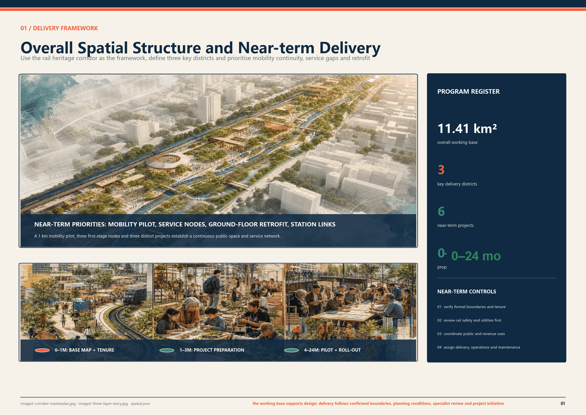

### Near-term Delivery Schedule

Near-term work proceeds in five rolling windows, each with defined tasks, proposed lead types, coordination items and stage outputs, so that a package starts only when it is ready.

| Window | Main task | Proposed lead type | Coordination | Output |
|---|---|---|---|---|
| 0–3 months | Establish program coordination; complete boundary, tenure, building, utility and passenger-flow evidence | District renewal mechanism and implementation coordinator | Planning and natural resources, development and reform, housing and construction, transport, subdistricts, rightsholders | Shared base, issue list, tenure register, project reserve |
| 2–6 months | Complete option comparison, feasibility work and specialist coordination for the 1 km pilot and three first nodes | Coordinator and design team | Rail, transport, fire, utilities, landscape, accessibility, operators | Implementation plans, specialist opinions, cost estimates, operating plans |
| 4–12 months | Start the mobility pilot, the service-node prototype and the public-AI management system | Delivery bodies, subdistricts, operators | Contractors, supervision, rightsholders, communities and user representatives | Construction documents, completion records, facility lists, handover records |
| 7–24 months | Roll out Dazhongsi, Zhongzhiyuan and AI Origin projects by readiness | District implementation bodies | District coordination departments, rightsholders, park or station operators | District project lists, annual capital plans, commencement and acceptance registers |
| Continuing | Assess facility inspection, service quality, spending and public feedback | Operators and program coordinator | Subdistricts, professional evaluators and user representatives | Monthly work orders, quarterly reports, annual adjustment list |

## 2. Design Basis and Source List

The working scope follows the three levels set by the open-call taskbook: a 43.6 km² coordinated research area, an approximately 11.4 km² overall design area, and the three key districts of Zhongzhiyuan, Beijing AI Origin Community and Dazhongsi. At this stage the planning base map is built from the published information package and the official notice; once formal boundaries are published, layer updates, area recalculation and indicator checks will be carried out uniformly. It should be noted that the submitted `SITE_BOUNDARY` and `KEY_AREA` layers are recorded as `official_boundary=false` and `geometry_role=provisional_constraint`; they serve as provisional working constraints only and are not a basis for land acquisition, land supply or engineering setting-out.[source:DATA-SRC-OFFICIAL-ANNOUNCEMENT-20260509] [source:SITE-PACKAGE] [assumption:A-BOUNDARY-001]

To keep sources traceable and usage consistent, planning material is managed under four evidence statuses:

| Status | Definition | Typical content in this package | Use rule |
|---|---|---|---|
| Published fact | Directly stated by the notice, taskbook or an official public source | Three planning scales, district names and published areas | Preserve source ID and original unit |
| Recalculation | Computed from submitted spatial data or a registered public dataset | Working-base area, concept blue-green ratio and climate baseline | State formula, coordinate system and confidence |
| Proposed target | A comparison value for scheme options and later specialist design | Clear widths, rest-point spacing and shade target | Verify further in specialist design and acceptance |
| Outstanding item | To be supplemented through survey and statutory procedure | Official redlines, tenure, FAR, building-by-building condition, utility capacity | Entered in the next-stage data list and task assignment |

Reference cases from other cities are used strictly as methodological comparison, adapted to local conditions: proximity planning to check service radii, inclusive planning to identify access barriers for different groups, incremental renewal to sequence small early projects, and industry-university-research coordination to organise operating relationships. Land use, development intensity, engineering parameters and approval procedures follow current Beijing planning administration and project-specific specialist opinions.[source:CASE-VIENNA-GENDER] [source:CASE-PUNGGOL] [source:CASE-KALASATAMA]

## 3. Planning Objectives and Public-Service Assurance Requirements

The proposal puts people first and gives priority to public interest, safety and stability. Public-space construction takes continuous access, basic amenities and maintainability as bottom-line requirements: children, older people and disabled users must be able to reach service points independently or with reasonable assistance; drinking water, rest, wayfinding and consultation always retain a staffed or physical route; and before any facility opens, the delivery body publishes the operator, service hours, charges, repair channel and emergency arrangements for public oversight.

Public AI services are managed through a register. Each application records users, location, accountable body, staffed route, necessary data, retention period, fault switching, stop authority, complaint channel and review date. The twelve proposed services have completed a scheme-stage rule review; before implementation, the actual accountable bodies must still confirm organisational, funding, technical and specialist-review conditions. A service does not go live until these conditions are met.[data:visual/assets/growth-runbook.json] [data:visual/assets/growth-tabletop-evidence.json]

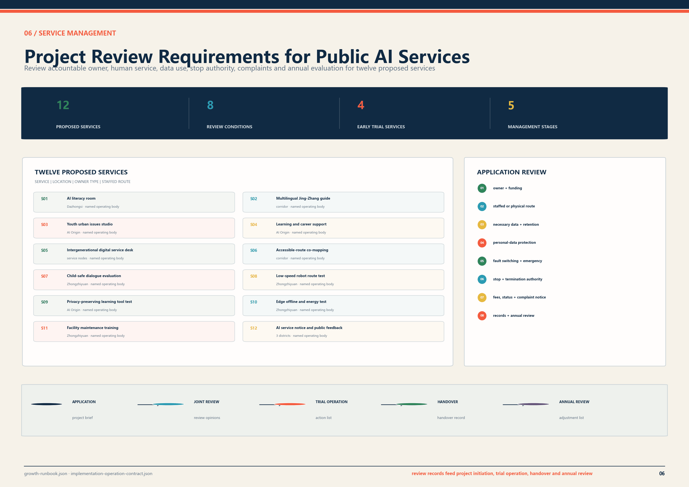

## 4. Three-Level Scope Framework

For each of the three levels set by the taskbook, the planning focus, main outputs and handover requirements are defined, so that work is transmitted level by level and implemented step by step.

| Scale | Main task | Scheme output | Condition for the next stage |
|---|---|---|---|
| 43.6 km² coordinated research area | Relate industrial coordination, talent services, transport and facility operations | Five cross-district tasks, a base-data list and annual work program | Lead types, supporting bodies, funding routes and annual outputs |
| Approx. 11.4 km² overall design area | Organize urban structure, mixed functions, walk-cycle links, blue-green space and renewal sequence | One spine, three districts, two interfaces, twelve service nodes and six concept zones | Official boundaries, regulatory controls and existing-condition surveys in one base map |
| 368.4 ha across three key districts | Define spatial designs and projects that can start | Zhongzhiyuan validation field, AI Origin shared ground floor and Dazhongsi station-city public-hall interface | Tenure, transport, fire, utilities, accessibility and operations agreements pass review |

The three scales correspond respectively to regional coordination research, regulatory-plan-level urban design and project-oriented district design. A single spatial base, a single indicator vocabulary, a single project list and a single delivery sequence maintain continuity between the levels, so that research is not interrupted and design outputs can be delivered.[depth:three_level_scope_framework]

## 5. Coordinated Research Area: Industry and Future City Research

The coordinated research area operates as a two-tier network. Five internal interfaces cover R&D testing, campus-community education, technology transfer, station-city service and blue-green maintenance. External programs connect Beiwei Community, Future Science City, Huairou Science City, Beijing Economic-Technological Development Area and the wider Beijing-Tianjin-Hebei innovation network. Each program uses an annual assignment that records exchanged resources, accountable body types, output quantities, budget items and exit conditions.[data:visual/assets/regional-collaboration-ledger.json] [data:visual/assets/regional-action-program.json]

Beiwei Community runs four priority-group walks and completes at least six service-process improvements each year. Future Science City co-releases two cross-city scenario challenges. Huairou Science City produces two public-science course packages and one urban-application validation. Beijing Economic-Technological Development Area runs three device cross-tests and one supply-chain session. The Beijing-Tianjin-Hebei network publishes one interregional scenario catalogue and advances three off-site validations. A collaboration is excluded from implementation and performance reporting until its annual project agreement has been confirmed.[depth:overall_spatial_structure] [data:visual/assets/regional-action-program.json]

Project initiation includes five baseline surveys: enterprises and employment, talent and family services, time-of-day commuting and interchange, existing buildings and leases, and blue-green and utility capacity. The results form a unified dataset, updated annually by the responsible bodies, and serve as the basis for adjusting service provision, project priorities and funding plans.[source:PROCESSED-FACT-PACK] [metric:osm_context_feature_count]

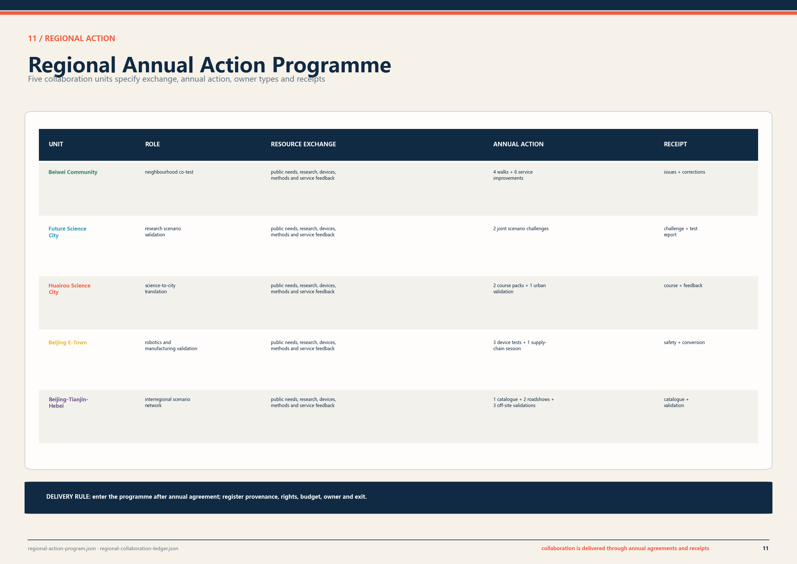

## 6. Overall Design Area: Urban Renewal and Regulatory-Plan-Level Urban Design

The overall design area forms a spatial structure of "one spine, three districts, two collaborative interfaces and multiple supporting nodes." The structure organises near-term projects and public facilities; it does not replace statutory land use or planning conditions.

- The Jingzhang public-space corridor uses the railway heritage route to close gaps in walking, cycling, canopy, stormwater facilities, public services and cultural information.
- The three key districts specialize in controlled validation, community-based innovation and station-city public service.
- The east and west interfaces connect Zhongguancun technical services and Xiaoyue River public-service resources, with courses, testing, transfer and facility maintenance coordinated through annual tasks.
- Twelve public-service nodes provide staffed consultation, rest, drinking water, charging, paper wayfinding, facility maintenance and service notices.

The working base recalculates to 11,412,825.386 m², which supports scheme-layer checks and indicator estimates; the area and land balance will be updated once the official overall design extent is published.[data:geometry/site_boundary.geojson#SITE-001] [metric:site_area_sqm]

## 7. Land Use, Building Scale, and Retain-Renovate-Demolish Strategy

The working base is organised into six renewal-unit types: R&D testing and safety evaluation; talent housing and daily amenities; education, training and technology transfer; rail culture and public services; digital services and commercial amenities; and blue-green space and utilities. Each unit records adaptation, new uses, facility additions and delivery conditions. It should be stressed that the layer codes serve scheme statistics only; statutory land use, development intensity and compatibility are determined through regulatory detailed planning and the urban-renewal implementation scheme.[data:geometry/land_use.geojson#LU-01] [standard:MNR-LAND-USE-CLASSIFICATION-GUIDE]

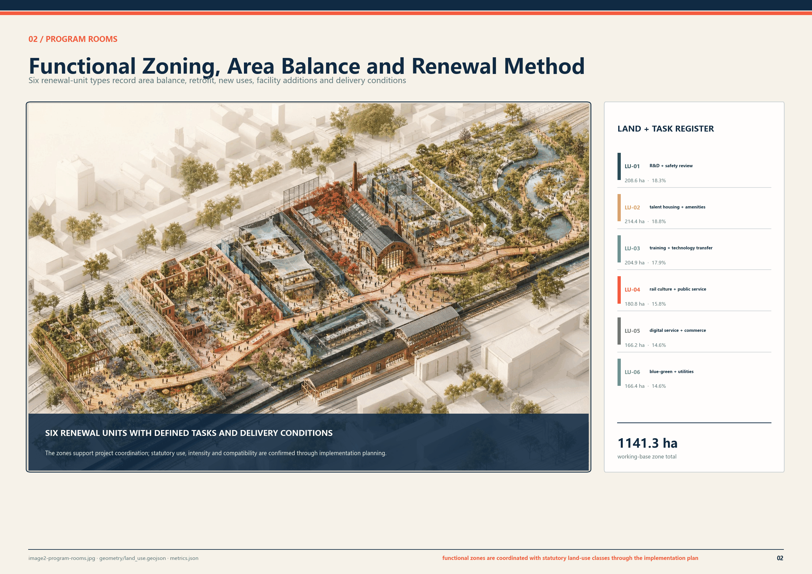

Building renewal follows the principle of retention, adaptation and removal in combination, with retention and upgrading as the main approach, and strictly follows the procedure of survey, evaluation, classification and implementation. A building-by-building survey records tenure, use, floors, structure, fire safety, heritage value and operating condition; comprehensive evaluation then produces recommendations of retention, repair, adaptive reuse, partial renewal or necessary removal. Large-scale demolition and construction are avoided. The current building layer expresses concept-level spatial grain within the key districts; the building classification register will be completed after the building-by-building survey. Near-term projects prioritise light ground-floor adaptation, time-sharing of idle space, demountable facilities and public-frontage improvement, minimising disruption to daily life and business.[data:geometry/buildings.geojson#BLDG-01-01] [depth:retain_renovate_demolish]

Indicators such as FAR, building height, density, setbacks, parking provision and utility capacity are placed on the next-stage deepening list, to be determined through regulatory detailed planning, the urban-renewal implementation scheme and specialist studies.[metric:floor_area_ratio] [assumption:A-CONTROLS-001]

## 8. Detailed Design of Key Areas

All three key districts use the same technical framework: aligned with published areas and the working base, each defines its functional positioning, first-stage project, space budget, building-renewal strategy, delivery conditions and operating responsibilities, so that conditions are clear, tasks are specific and accountability can be checked.[depth:three_key_area_detailed_design] [data:geometry/key_areas.geojson]

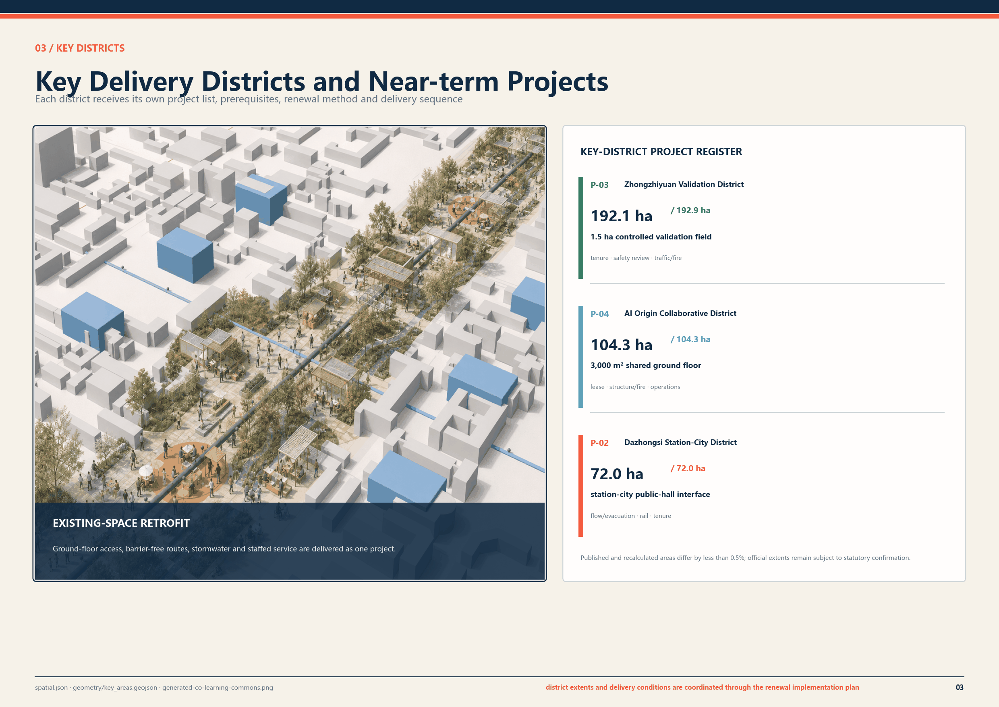

### 8.1 Zhongzhiyuan Innovation Validation District

The public notice gives approximately 192.1 ha; the working polygon recalculates to 192.92 ha. The district is assigned controlled testing, public review and facility-maintenance functions. A first-stage validation field of about 1.5 ha allocates 3,200 m² to controlled testing and safety buffer, 900 m² to public review and notice, 1,200 m² to maintenance training, 2,800 m² to rain garden and ecological buffer, and 6,900 m² to the all-age test loop, fire access and logistics.

The field uses reversible construction so that existing park circulation and public services continue to operate. Candidate buildings are classified only after tenure, structural and fire verification. Before opening, the site permit, transport and fire review, ethics and data review, safety assessment and independent test admission must be completed; a major incident triggers the emergency stop and independent review procedure.

### 8.2 Beijing AI Origin Collaborative Innovation District

The public notice gives approximately 104.3 ha; the working polygon recalculates to 104.32 ha. The district supports learning and collaboration, open release, talent services and family support. The first phase activates about 3,000 m² of shared ground floor: 900 m² for learning and assembly, 600 m² for open release and short-term display, 520 m² for staffed talent and family services, 680 m² for shared work and small prototypes, and 300 m² reserved for support, accessibility and fire adjustment.

The shared ground floor operates on time-sharing and light adaptation. Tenure, leases, building safety, fire review and the time-sharing operating agreement are verified first, and opening hours, charging rules and staffed-service arrangements are published. Short-term activities and temporary sharing can begin in the near term; permanent adaptation proceeds once tenure, operating and fire conditions are stable.

### 8.3 Dazhongsi Station-City Integration District

The public notice gives approximately 72.0 ha; the working polygon recalculates to 72.05 ha. The district supports interchange, city information, staffed services and public stay. The first study covers an approximately 2.4 ha station-city public-hall interface, improving four-way pedestrian access, adding two staffed service points, multilingual physical wayfinding and all-age stay facilities, and linking to the Innovation Spine pilot.

Delivery proceeds in sequence: passenger-flow and evacuation analysis, confirmation of rail-safety conditions, tenure and commercial operating agreements, wayfinding and paving improvement, and service-node construction. In the near term, wayfinding and staffed-service improvements come first; spatial expansion enters the later construction sequence once evacuation, passenger-flow and rail-safety conditions are secured.

## 9. Transport, Rail, Municipal Infrastructure, and Public Services

The transport system is checked for all-age friendliness against slower movement, limited wayfinding capacity and luggage-carrying situations. The Innovation Spine pilot sets a continuous clear walking width of no less than 3.0 m, a two-way clear cycle width of no less than 4.0 m, and spacing of principal effective rest points of no more than 150 m. These are scheme-stage control values; at the engineering design stage the section combination will be further optimised against road redlines, rail safety, fire access, municipal utilities and existing trees.[source:BEIJING-WALK-CYCLE-STANDARD] [metric:pilot_walk_clear_width_target_m] [metric:rest_point_spacing_target_max_m]

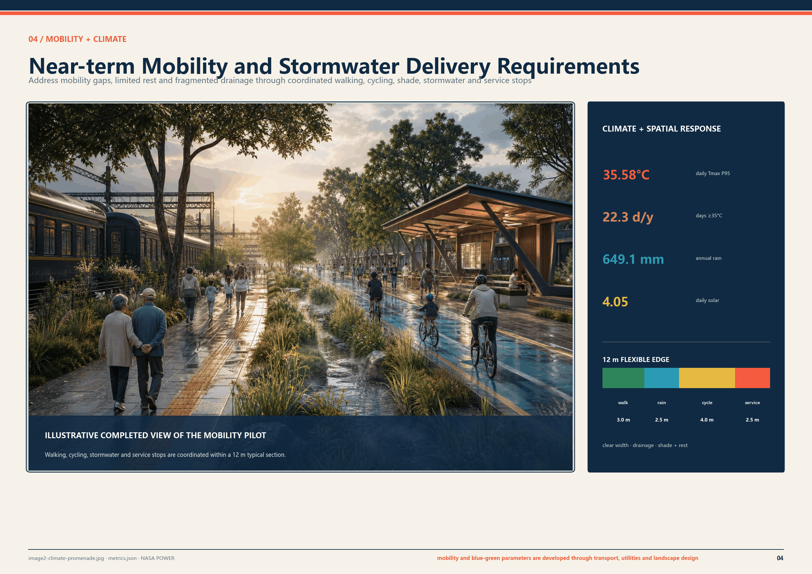

## 10. Blue-Green Network, Public Space, and Urban Character

The blue-green public-space system provides shade, stormwater regulation, continuous rest and ecological education. The concept-stage climate baseline uses NASA POWER daily data for 2015–2024: daily Tmax P95 of 35.58°C, an annual mean of about 22.3 days at or above 35°C, annual precipitation of about 649.1 mm, and mean solar radiation of 4.05 kWh/m²/day. On this basis the scheme provides continuous shade, rain gardens, safe overflow, winter sun and wind shelter, and maintainable facilities. Field monitoring and specialist models will refine hydrological, thermal, wind and energy parameters at the next stage.[source:NASA-POWER-2015-2024] [source:BEIJING-SPONGE-CITY] [depth:blue_green_public_space]

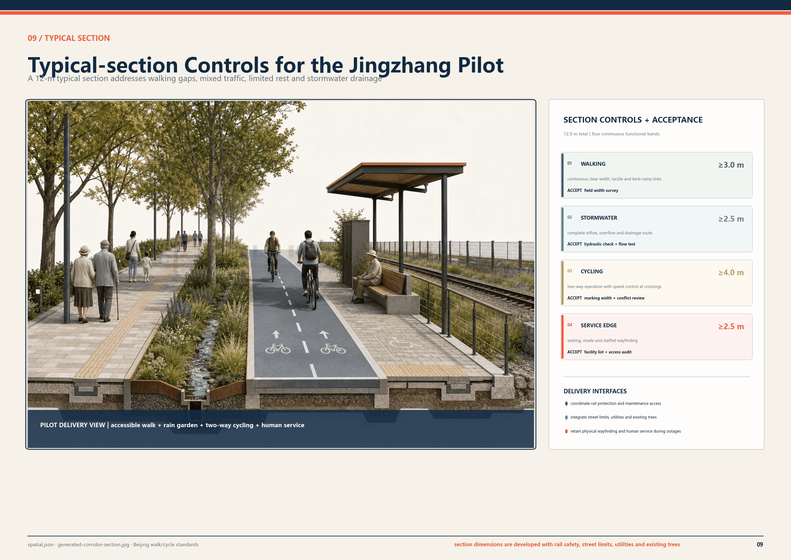

## 11. Public-Service Node Standard

Each public-service node is planned at 250–400 m² and uses demountable components wherever possible, so that it can adapt as needs change. A node includes 24–36 m² of staffed service space, together with shaded stay, drinking water, charging, a paper map, service notices and a rain garden. Construction is accompanied by underground-utility coordination, fire review, accessibility design, utility connection, site permitting and maintenance-plan preparation, so that basic services remain continuously available during network or power outages.

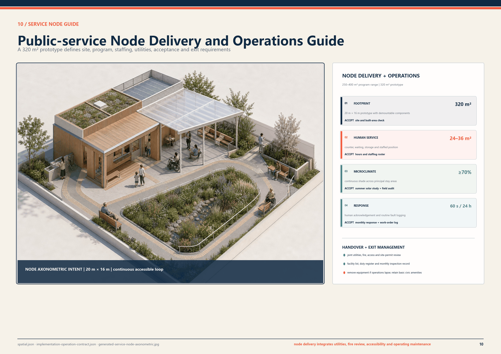

## 12. AI Innovation Ecosystem, Personas, and AI+ Scenarios

### 12.1 Innovation chain and factor allocation

The innovation ecosystem operates through four stages: demand release, prototype validation, public co-testing and application. Each year the program publishes at least 30 civic and industrial needs, completes at least 20 prototype tests at Zhongzhiyuan, runs at least 12 multi-group co-tests in AI Origin Community and the Xiaoyue River public-experience loop, and produces at least eight procurement, partnership or scaled-application plans through Dazhongsi and the Zhongguancun technology-service interface. Every stage issues an identifier, evaluation result, corrective action and conversion receipt.[data:visual/assets/ecosystem-policy.json]

Land, space, industry, finance, talent, computing, data and scenarios are managed through eight factor registers. First-stage projects use existing buildings and reversible facilities. Public co-testing space includes staffed service. Public-realm works, test facilities and commercial operations use separate accounts. Talent development links courses, training, residencies and jobs. Each dataset records source, purpose, retention, human review and deletion duty. Scenarios pass through open calls, joint review, time-limited trials, evaluation and exit.

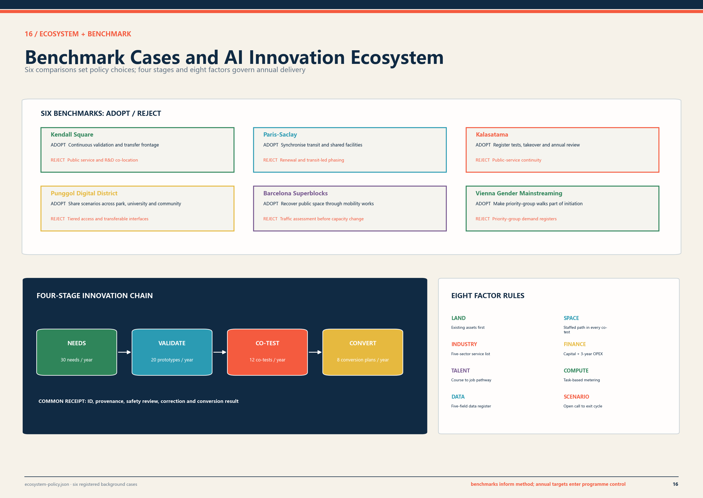

### 12.2 Twelve public AI services

Each of the twelve proposed public services defines its users, location, owner type, staffed route, necessary data, stop authority, public notice and annual review requirements. Four services are selected for near-term trial operation; the remainder proceed in careful phases once site, staffing, funding and specialist-review conditions are in place.

| ID | Service and location | Delivery and operating requirement | Staffed route and adjustment condition |
|---|---|---|---|
| S01 | AI literacy interaction at Dazhongsi | No face or identity collection | On-site educator and physical exhibit; stop if content risk remains open |
| S02 | Multilingual Jingzhang cultural guide | Voluntary language choice; no visitor profile | Human guide and paper map in parallel |
| S03 | Youth urban-issues studio at AI Origin | Anonymous issue cards | Teacher or community mentor reviews before publication |
| S04 | Learning and career assistance | Local, short-lived session; excluded from formal assessment | Teacher or adviser review; transfer to a person |
| S05 | Cross-generation digital service desk | Account-free service; minimum work-order data | Face-to-face support and paper process |
| S06 | Accessible-route co-mapping | Voluntary barrier point; aggregated publication only | Accessibility adviser review; contributor may withdraw |
| S07 | Child-safe dialogue-system evaluation | Synthetic data first | Guardian and ethics lead may stop immediately |
| S08 | Low-speed robot route test | Device operating data only; define time and test boundary | On-site safety operator; physical bypass remains open |
| S09 | Privacy-preserving learning-tool test | Voluntary sample; minimized input | Teacher review; separated from formal assessment |
| S10 | Edge-offline and energy test | Device performance data | Engineer sign-off; failed device leaves public space |
| S11 | Facility-maintenance training | De-identified work order | Professional review and public repair manual |
| S12 | Service notice and public feedback | Aggregated evidence; no individual ranking | Independent review, expiry date and published response |

Services touching on medical, legal, educational and public-safety matters are reviewed by the corresponding qualified professionals. Every service point publishes its purpose, applicable users, accountable body, charges, data scope, staffed route, operating status, repair and complaint channels, and next review date, so that the public can understand, use and exit each service with confidence.[source:PRINCIPLE-UNHABITAT] [data:visual/assets/growth-runbook.json]

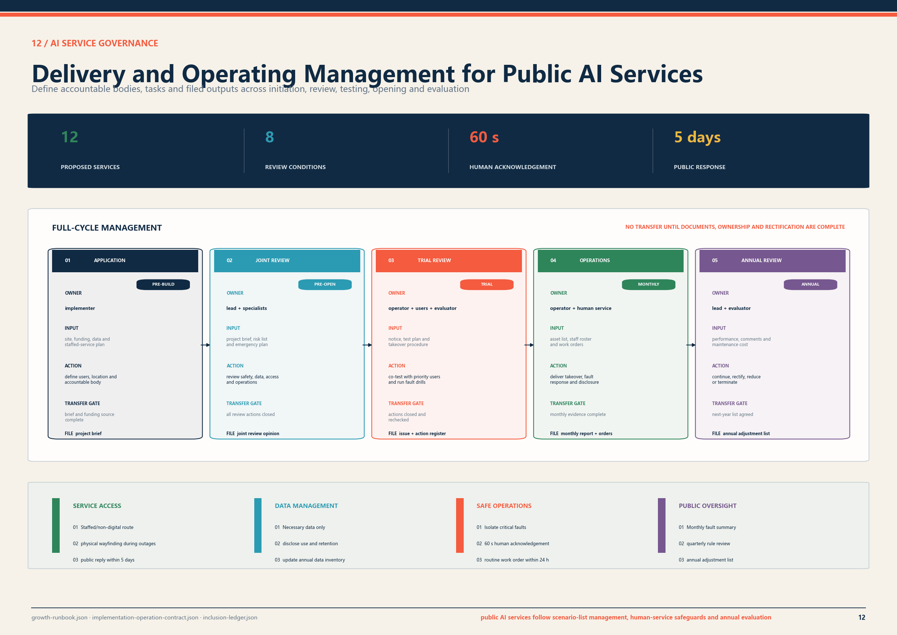

## 13. All-Age Friendliness and Public-Service Assurance

The priority-group survey covers children and families; older people and carers; disabled people; long-term residents; renters and small businesses; students and young talent; commuters and visitors; frontline workers; and nearby institutions. Before initiation, each project records access barriers, facility needs, construction effects, rent and business effects, staffed-service needs and participation comments for each group, forming an issue list and a rectification responsibility table that is answered item by item.

Public participation includes scheme notice, site visits, priority-user walk-throughs, construction notice, comment registration and feedback on how comments were handled. Projects affecting children, disabled people, renters or frontline maintenance staff carry out focused walk-throughs during feasibility work; the delivery body files the comments received, the adoption decisions and the reasons for non-adoption in the project record.[data:visual/assets/inclusion-ledger.json] [data:visual/assets/user-cotest-plan.json]

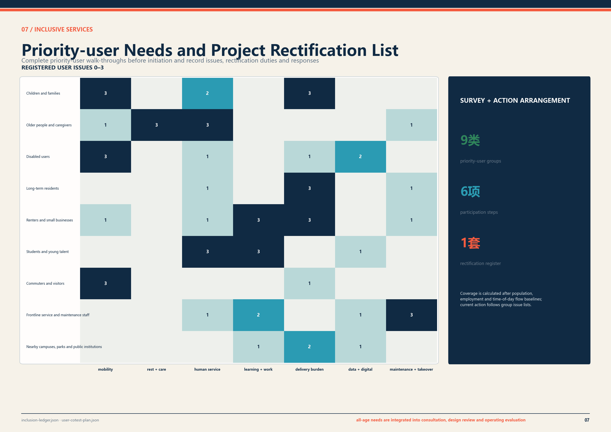

## 14. Public-space Identity and Wayfinding

“京张共长线 / GROW WITH JINGZHANG” is used as the public communication name. Government initiation titles, statutory place names, approved construction-project names and operator names are displayed separately as required, and the two are not mixed. The signage system has three levels — district gateways, directional wayfinding and service confirmation — covering route direction, public facilities, staffed-service locations, opening hours and repair contacts.

Colours are assigned by information duty: orange for responsibility, warning and stop items; ink blue for primary directions; green for parks and stormwater facilities; and cyan for convenience services. Signage is coordinated with Beijing requirements for road traffic, accessibility, fire evacuation and public-information guidance. The operator maintains a register of sign numbers, locations, installation dates and maintenance status, with regular inspection and updating.

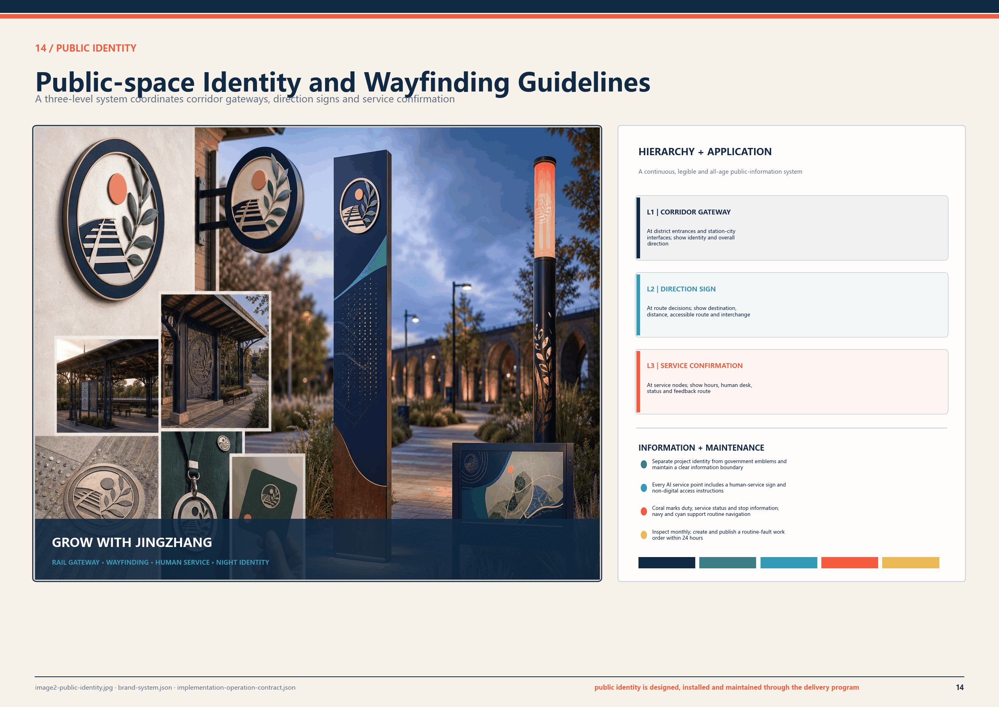

### Three cultural narratives and three civic landmarks

The corridor adopts three narrative lines. “Independent Engineering” covers the 1909 Jingzhang Railway, surveying and construction archives. “Open Innovation” covers Zhongguancun research, entrepreneurship, open-source collaboration and technology transfer. “Civic Intelligence” explains the duties, rights and operating rules that govern AI in public services. The three lines structure public courses, wayfinding, annual exhibitions and international communication.[data:visual/assets/culture-landmark-system.json]

Three landmarks are delivered. The Jingzhang Origin Milestone Court in AI Origin Community organises rail archives, oral history and public courses around the dates 1909, 1980 and 2026. The Open Model Gallery at Zhongzhiyuan publishes reproducible models, test methods, failure cases, data sources and stop records. The Civic Governance Signal Tower in Dazhongsi Public Hall displays whether each of the twelve services is open, restricted, under human takeover, being corrected or stopped. All three landmarks also provide everyday access, rest, education, wayfinding and staffed service.

The Jingzhang Open Contribution Archive records four types of contribution: public problem discovery, open tools and data, safety and accessibility improvements, and long-term maintenance. Only verifiable public work qualifies; sponsorship alone does not. Physical plaques, the contribution wall, the offline archive and the annual public report use the same record IDs and undergo annual joint review.

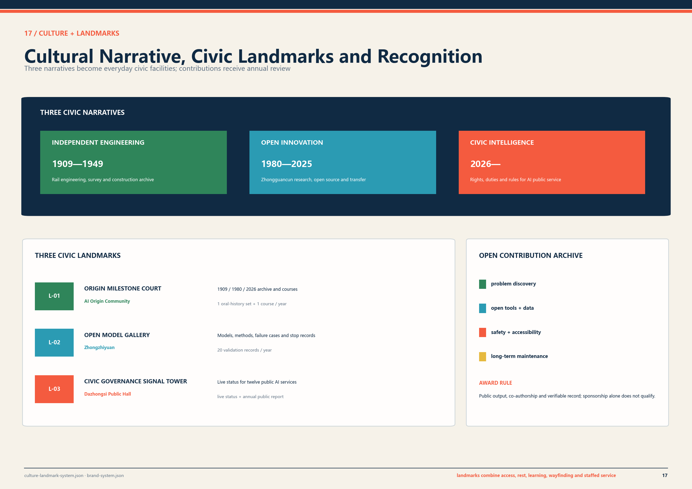

## 15. Renewal Projects, Implementation Policy, and Phasing

Six near-term project packages are established: the Jingzhang mobility pilot, the Dazhongsi station-city connection project, the Zhongzhiyuan R&D test field, the AI Origin shared ground floor, the public-service-node prototype and the public-AI service management system. Cost classes S, M and L are comparison grades for the project-reserve stage, corresponding to below CNY 5 million, CNY 5–20 million and CNY 20–50 million; specific investment requirements are determined at feasibility study, design estimate and fiscal review.

| Project | Main content | Proposed owner types | Window | Prerequisites | Funding and operation |
|---|---|---|---:|---|---|
| P-01 Jingzhang mobility pilot | About 1 km of continuous walking, two-way cycling, rain gardens, shaded rest and service stops | District coordination, subdistrict, rightsholders, transport and landscape specialists | 6–18 months | Official redlines and tenure, rail safety, transport organisation, utility and fire opinions | Public-space funds coordinated; daily maintenance shared by subdistrict and facility operators |
| P-02 Dazhongsi station-city connection project | Four-way pedestrian links, two staffed service points, multilingual physical wayfinding and cycle-parking improvement | Subdistrict, station operator, transport specialists, rightsholders | 12–24 months | Time-based passenger flow and evacuation, rail interface, fire review and tenure agreements | Station public-realm works and operator inputs accounted separately |
| P-03 Zhongzhiyuan R&D test field | About 1.5 ha of controlled testing, safety buffer, public briefing, maintenance training and stormwater facilities | Park operator, university and enterprise testers, independent safety evaluation | 12–24 months | Site tenure, project admission, data security, emergency response and insurance | Construction and testing costs borne by the implementing body; public and park facilities accounted separately |
| P-04 AI Origin shared ground floor | About 3,000 m² of learning and assembly, release, talent services, shared work and support space | Rightsholder, subdistrict, university community, professional operator | 9–18 months | Tenure and leases, building safety, fire review, time-sharing and charging rules | Light adaptation and operating costs estimated together; shared-use and maintenance agreements signed |
| P-05 Public-service-node prototype | 320 m² prototype with staffed service, drinking water and charging, shaded rest and rain garden | Subdistrict, community, landscape and facility operators | 6–12 months | Underground utilities, connections, site permit, fire review and maintenance duty | Capital and annual operating funds defined together; asset and maintenance handover after acceptance |
| P-06 Public-AI service management system | Applications, joint review, trial records, fault work orders, public feedback and annual review | District coordination, service operators, independent evaluators | 3–9 months | Data classification, accountable bodies, emergency plans and complaint procedure | Built as a management tool, with annual maintenance and evaluation funding |

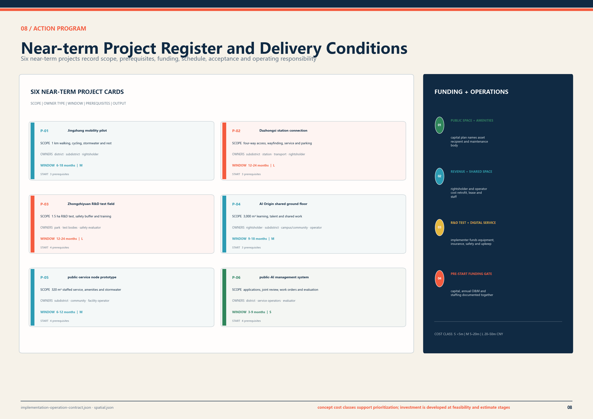

Delivery proceeds through five management gates; a package does not move to the next gate until the previous one's requirements are met:

| Gate | Pass condition | Stop or return condition |
|---|---|---|
| G0 Evidence lock | Boundary, tenure, existing conditions, sources and gaps registered | Source, authorization or responsible body cannot be identified |
| G1 Feasibility and negotiation | Affected groups, maintenance owner, human route and burden treatment recorded | Major burden, operating budget or maintenance duty unresolved |
| G2 Specialist review | Transport, rail, fire, utilities, accessibility, data and scenario admission complete | Any statutory or safety interface fails |
| G3 Acceptance and opening | Engineering acceptance, staff training, emergency stop and degraded-mode drill complete | Human takeover, emergency capacity or public receipt absent |
| G4 Annual review | Public report covers performance, burden, faults, maintenance and feedback | Adjust, scale down or exit when thresholds are missed |

Implementation, acceptance and objection handling are separated by post, so that no single body acts as both player and referee. Each action task names its coordinating, implementing, reviewing, consulting and informed parties, together with maintenance cycles and annual adjustment conditions.[data:visual/assets/implementation-operation-contract.json]

## 16. Ninety-Day Pre-initiation Work Program

Before formal initiation, a 90-day preparation program is arranged. Days 0–15 complete the lists of boundaries, tenure, existing buildings, users and responsible bodies. Days 16–45 cover site surveys, option comparison, operating-cost review and coordination with specialist departments. Days 46–75 test service procedures, fault switching, construction impacts and emergency response. Days 76–90 consolidate issues, assign rectification responsibilities and produce a clear recommendation on whether to enter implementation.

Participants include program, delivery and operating bodies; transport, rail, fire, utilities, landscape and accessibility specialists; and rightsholders, communities and affected users. Each stage produces meeting minutes, site issue sheets, departmental opinions, capital and operating estimates and action-closure records, which serve as the basis for project initiation and scheme deepening.[data:visual/assets/user-cotest-plan.json]

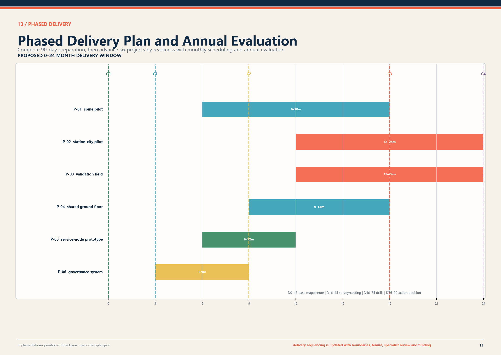

## 17. Annual Events, Developer Community, and Conversion

The annual calendar has four seasons. The Jingzhang Urban Problem Season in spring publishes at least 30 scenario needs and runs six site walks. The Open Validation Season in summer completes at least 20 prototype tests and repeats eight negative-test categories. Jingzhang Civic Intelligence Week in autumn completes at least 12 multi-group co-tests and four open-source workshops. The Annual Governance Assembly in winter reviews all twelve services and six project packages, issuing a list of actions to continue, correct, reduce or terminate.[data:visual/assets/annual-operation-program.json]

The developer community maintains four working groups: public service and accessibility, model safety and evaluation, edge devices and robotics, and urban data and maintenance. Each project names a maintainer and a public-problem owner. Licences for code, models, data and documentation are registered separately. A project that misses two consecutive safety corrections loses access to public scenarios. The annual program includes twelve open working days and produces at least eight reusable outputs.

Enterprise and talent conversion follows five gates: need registration, controlled validation, public co-testing, procurement or partnership, and scaled application. Cross-district replication begins only after rights, costs, operating responsibility and annual service performance meet the stated thresholds. Event funding, site maintenance and staffed-service posts have separate budgets; events cannot draw on basic maintenance or human-service funding.

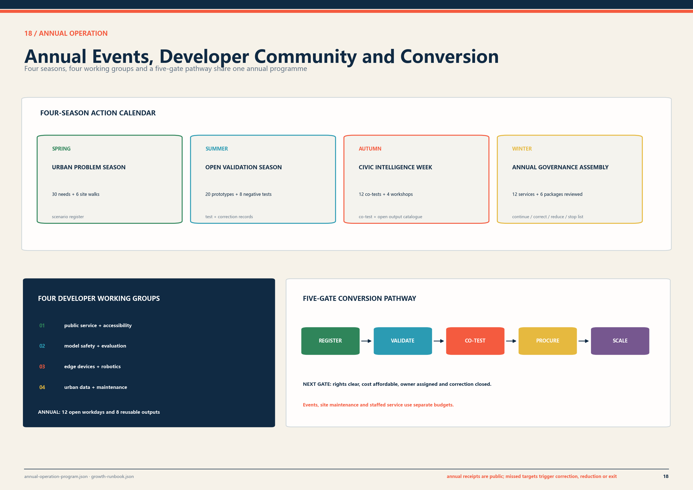

## 18. Metrics, Area Recalculation, and Compliance Matrix

Indicators are divided into five types: working-base recalculations, concept-scheme recalculations, proposed controls, operating targets and scheme-rule checks. Figures and tables record the current status, measurement method, responsible body and review cycle for each indicator. Items not yet surveyed are entered in the project-initiation list rather than filled with estimates.[metric:green_ratio] [metric:public_space_ratio] [depth:metrics_recalculation]

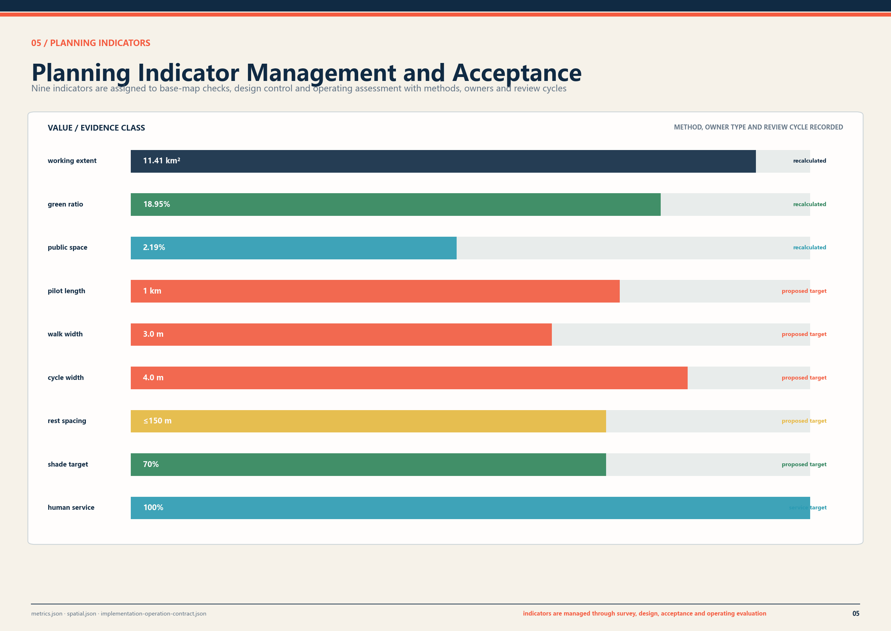

| Metric | Value or status | Attribute | Measurement and review |
|---|---:|---|---|
| Overall-design working base | 11.4128 km² | Recalculation | EPSG:4548 area; official value by competent authority |
| Concept blue-green ratio | 18.95% | Scheme recalculation | Union of layer areas divided by working-base area |
| Continuous clear walking width | ≥3.0 m | Proposed, unbuilt | Segment measurement at the narrowest point |
| Two-way cycle clear width | ≥4.0 m | Proposed, unbuilt | Drawing review and as-built measurement |
| Effective rest-point spacing | ≤150 m | Proposed, unbuilt | Measurement along the continuous accessible route |
| Shade at principal stay spaces | ≥70% | Proposed, unbuilt | Design-hour solar analysis and site spot check |
| Human service availability | 100% | Operating target, unbuilt | Monthly checks against published service hours |
| Protocol-valid services | 12/12 | Scheme-stage check | Check every service against eight admission rules |
| Negative tests rejected | 8/8 | Scheme-stage check | Inject defect and confirm expected rejection rule |

## 19. Risk, Copyright, and Compliance

Risk management covers boundary and tenure, rail and transport, personal information and minors, accessibility, operations and maintenance, climate and drainage, commercial displacement, and asset rights and claims. Each category defines its trigger conditions, mitigation measures, emergency arrangements and responsible body. Throughout delivery, staffed routes, basic public amenities and public-comment channels remain open, so that essential urban services run stably.[data:risk.json]

Figures, PDFs and webpages in this package are generated from structured data through the local build system. OpenStreetMap background follows ODbL 1.0 and retains contributor credit; NASA POWER supports concept-stage climate analysis; Blender, Three.js and generated scenes support spatial communication. Every delivered file records its path, author or generation tool, input source, licence, transformation, credit location, publication scope and restriction. Original work follows the bundled `COMMUNITY-DISPLAY-ONLY` terms.[source:OSM-CONTEXT-20260808] [source:NASA-POWER-2015-2024] [data:visual/assets/rights-clearance-ledger.json]

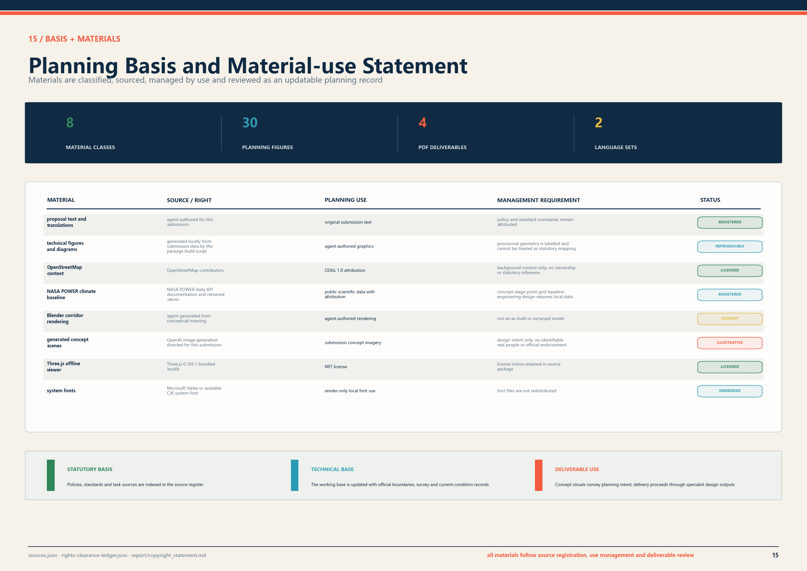

The next-stage data list includes official overall and key-district boundaries, topographic survey, road and parcel redlines, building-by-building and tenure survey, heritage controls, utility alignments and capacity, fire and transport models, time-based station passenger flow, current accessibility barriers, detailed hydrology and soil data, and public-participation records. Once these are incorporated into the shared base map, the land balance and indicators will be recalculated, producing a deepened scheme ready for planning review, feasibility study and engineering design.

## 20. Taskbook Delivery Matrix

The six taskbook workstreams are controlled through one delivery matrix. Overall coordination, ecosystem benchmarking, twelve public AI services, landmarks and recognition, cultural narrative, and annual operation each have a dedicated sheet, structured register, report section and annual indicator. A task is not recorded as complete unless the corresponding file, figure and accountability register have been delivered.[data:visual/assets/agent-task-delivery-matrix.json]

## 21. References

The task basis consists of the open-call notice, the agent taskbook, the repository site package, the source registry and the processed fact navigation.[source:DATA-SRC-OFFICIAL-ANNOUNCEMENT-20260509] [source:DATA-SRC-AGENT-TASKBOOK-20260518] [source:SOURCE-REGISTRY]

Urban renewal, walking and cycling, accessibility and climate adaptation refer to the Beijing Urban Renewal Regulation, Beijing walk-cycle planning and design standards, the national Accessibility Environment Construction Law, and Beijing sponge-city and resilient-city standards. Applicable clauses and design parameters will be confirmed by qualified organisations during project initiation and specialist design.[source:BEIJING-URBAN-RENEWAL-REGULATION] [source:DATA-SRC-BARRIER-FREE-ENVIRONMENT-LAW] [source:BEIJING-SPONGE-DESIGN-STANDARD]

### Deliverable Index

The index below links public sources, planning standards, design depth, spatial layers and the indicator ledger, so that original records and recalculation rules can be traced.

- Sources and methods: [source:SITE-PACKAGE] [source:SOURCE-REGISTRY] [source:PROCESSED-FACT-PACK] [source:BOUNDARY-SOURCE] [source:KEY-AREA-SOURCE] [source:DATA-SRC-OFFICIAL-ANNOUNCEMENT-20260509] [source:DATA-SRC-AGENT-TASKBOOK-20260518] [source:CASE-PARIS-15M] [source:CASE-VIENNA-GENDER] [source:CASE-PUNGGOL] [source:CASE-KALASATAMA] [source:CASE-BARCELONA-SUPERBLOCK] [source:CASE-KENDALL] [source:CASE-PARIS-SACLAY] [source:PRINCIPLE-UNHABITAT] [source:PRINCIPLE-NEB] [source:PRINCIPLE-AMSTERDAM-CIRCULAR] [source:OSM-CONTEXT-20260808] [source:NASA-POWER-2015-2024] [source:BEIJING-SPONGE-CITY] [source:BEIJING-RESILIENT-CITY] [source:BEIJING-CLIMATE-ADAPTATION] [source:BEIJING-RAIN-GARDEN-STANDARD] [source:BEIJING-URBAN-RENEWAL-REGULATION] [source:BEIJING-WALK-CYCLE-STANDARD] [source:DATA-SRC-BARRIER-FREE-ENVIRONMENT-LAW] [source:BEIJING-SPONGE-DESIGN-STANDARD] [source:BLENDER-52-MODEL] [source:THREEJS-OFFLINE-EXHIBIT] [source:OPENAI-IMAGEGEN-SCENES]
- Applicable standards: [standard:PROJECT-OFFICIAL-ANNOUNCEMENT] [standard:PROJECT-AGENT-OPEN-CALL-TASKBOOK] [standard:MOHURD-URBAN-DESIGN-MEASURES] [standard:MOHURD-CONTROL-DETAILED-PLANNING] [standard:MNR-LAND-USE-CLASSIFICATION-GUIDE] [standard:MOHURD-ARCH-DESIGN-DEPTH-2016]
- Design depth: [depth:existing_conditions_diagnosis] [depth:three_level_scope_framework] [depth:overall_spatial_structure] [depth:land_use_layout] [depth:development_intensity_controls] [depth:height_massing_character] [depth:retain_renovate_demolish] [depth:traffic_rail_slow_parking] [depth:municipal_new_infrastructure] [depth:blue_green_public_space] [depth:three_key_area_detailed_design] [depth:renewal_project_list] [depth:phasing_implementation] [depth:metrics_recalculation] [depth:risk_missing_data]
- Spatial data: [data:geometry/site_boundary.geojson] [data:geometry/key_areas.geojson] [data:geometry/land_use.geojson] [data:geometry/buildings.geojson] [data:geometry/roads.geojson] [data:geometry/green_space.geojson] [data:geometry/public_space.geojson] [data:geometry/constraints.geojson] [data:geometry/phasing.geojson]
- Indicator ledger: [metric:site_area_sqm] [metric:building_footprint_area_sqm] [metric:green_ratio] [metric:public_space_ratio] [metric:key_area_count] [metric:growth_station_count] [metric:ai_scenario_card_count] [metric:pilot_corridor_length_m] [metric:prototype_service_node_area_sqm] [metric:pilot_shared_ground_floor_area_sqm] [metric:implementation_project_count] [metric:acceptance_kpi_count] [metric:osm_context_feature_count] [metric:climate_heat_days_ge_35c_per_year] [metric:climate_annual_precip_mm] [metric:climate_mean_solar_kwh_m2_day] [metric:pilot_walk_clear_width_target_m] [metric:pilot_cycle_width_target_m] [metric:rest_point_spacing_target_max_m] [metric:shade_coverage_target_ratio] [metric:human_service_availability_target_ratio] [metric:protocol_service_pass_count] [metric:negative_test_caught_count]
