# 百年京张 AI 创新带城市更新与实施方案

京张铁路沿线承载着百年工业记忆，也串联起海淀区高校、科研院所、创新园区和成熟社区，是存量更新与创新资源集聚的交汇地带。为落实征集任务要求，推动京张铁路遗产廊道及周边地区有序更新，编制本方案。方案统筹安排总体空间结构、重点片区更新、公共服务补短板和近期建设项目，力求把规划意图转化为可落地、可核查、可评估的实施安排。

需要清醒认识到，现阶段正式边界、土地及房屋权属、轨道安全、交通组织、地下管线、消防条件、项目资金和后续运营主体等基础条件尚未逐项核清。本方案坚持底线思维、量力而行，把核清前置条件作为现阶段首要工作，在此基础上研究确定项目能否启动、建设规模和实施顺序，防止脱离实际、仓促上马。

按照征集任务，方案以约 11.4 平方公里总体设计范围为工作底图，以众智园、北京 AI 原点社区和大钟寺三处重点片区为近期工作重点，建立六个项目包和 0—24 个月滚动实施计划。其中，京张铁路遗产廊道主要承担公共空间联系功能；三处重点片区分别补齐研发测试、成果转化、人才服务和站城接驳方面的设施短板；十二处公共服务节点随示范段和片区项目分期建设、逐步投用。[source:DATA-SRC-OFFICIAL-ANNOUNCEMENT-20260509] [source:DATA-SRC-AGENT-TASKBOOK-20260518]

## 一、需要优先解决的实施问题

从现状研判看，制约近期实施的因素主要集中在六个方面。方案逐项明确管理判断、近期工作和应当形成的成果，做到问题不回避、条件不虚构、推进有抓手。

| 实施问题 | 管理判断 | 近期工作 | 形成成果 |
|---|---|---|---|
| 正式边界、权属和现状条件尚未齐备 | 现有图层用于方案编制；征地、供地和工程放线统一采用主管部门确认成果 | 衔接主管部门和权利主体，核对红线、产权、租约、在建项目及使用现状 | 统一工作底图、权属清单、现状建筑台账 |
| 京张沿线存在慢行断点和站区衔接问题 | 先选择条件相对成熟的 1 公里路段开展示范，避免全线同步开工 | 完成交通调查、轨道安全协调、管线摸排、树木调查和典型断面比选 | 示范段实施方案、专项意见、施工图任务书 |
| 便民服务设施分散，建设与运营责任容易脱节 | 服务节点与场地、人员、经费和维护责任一并落实 | 确定 3 处首期节点，核实用地、设施接入、人员排班和年度运维经费 | 节点选址表、设施清单、运营责任表 |
| 重点片区更新条件差异较大 | 众智园、AI 原点社区和大钟寺分别编制项目清单，不采用统一开发模式 | 逐片区核对权属、结构消防、客流疏散、产业需求和经营条件 | 三张项目清单、三套前置条件清单 |
| 存量空间使用效率与公共服务供给需要统筹 | 优先采用首层改造、分时共享和可拆装设施，降低前期投入和搬迁影响 | 盘点可利用首层、闲置场地和既有配套，明确保留、修缮和改造方式 | 建筑分类更新清单、共享使用协议要点 |
| 人工智能服务缺少统一申报和运行规则 | 每项服务须明确责任单位、人工办理、数据使用、停止权限和投诉渠道 | 建立服务项目任务书、联合审查表、试运行记录和年度评估表 | 十二项服务清单、八项审查条件、运行台账 |

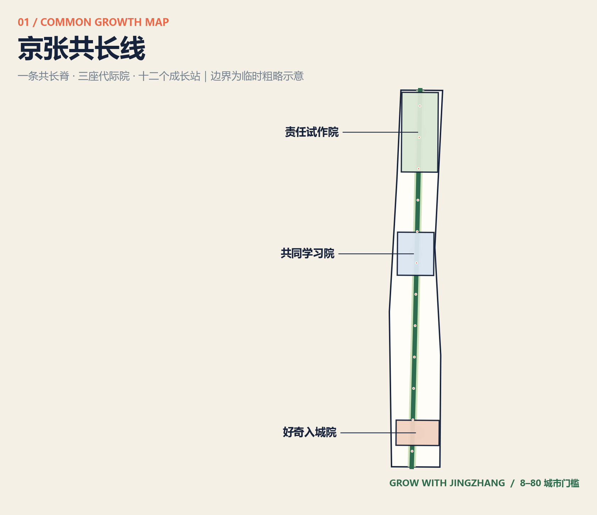

### 近期实施任务总表

近期工作按照五个时段滚动推进，分别明确重点任务、建议牵头类型、协同事项和阶段成果，做到成熟一项、启动一项。

| 时段 | 重点任务 | 建议牵头类型 | 协同事项 | 阶段成果 |
|---|---|---|---|---|
| 0—3 个月 | 建立项目统筹机制，补齐正式边界、权属、建筑、管线和客流资料 | 区级城市更新工作机制、实施统筹单位 | 规划自然资源、发展改革、住房建设、交通、属地街道、产权单位 | 统一底图、问题清单、权属台账、项目储备表 |
| 2—6 个月 | 完成 1 公里示范段和 3 处首期节点的方案比选、可行性研究及专项协调 | 实施统筹单位、设计单位 | 轨道、交通、消防、市政、园林、无障碍、运营单位 | 实施方案、专项意见、投资测算、运营方案 |
| 4—12 个月 | 启动慢行示范段、公共服务节点样板和公共人工智能服务管理系统 | 建设单位、属地街道、运营单位 | 施工、监理、产权、社区和使用者代表 | 施工图、竣工资料、设施清单、移交记录 |
| 7—24 个月 | 按成熟度滚动实施大钟寺、众智园和 AI 原点社区项目 | 各片区实施主体 | 区级统筹部门、产权单位、园区或站区运营单位 | 分片区项目清单、年度投资计划、开工与验收台账 |
| 建成后持续 | 开展设施巡检、服务质量、资金使用和公众意见评估 | 运营维护单位、项目统筹单位 | 属地街道、专业评估和使用者代表 | 月度工单、季度调度报告、年度项目调整清单 |

## 二、设计依据与资料清单

本方案工作范围按照征集任务书确定，包括 43.6 平方公里统筹研究范围、约 11.4 平方公里总体设计范围，以及众智园、北京 AI 原点社区和大钟寺三处重点片区。规划编制统一采用征集资料包和公告信息形成的工作底图。正式边界纳入统一底图后，完成图层更新、面积复算和指标校核；`SITE_BOUNDARY` 和 `KEY_AREA` 在此之前执行暂定约束属性，不进入征地、供地和工程放线程序。[source:DATA-SRC-OFFICIAL-ANNOUNCEMENT-20260509] [source:SITE-PACKAGE] [assumption:A-BOUNDARY-001]

为确保资料来源清楚、使用口径统一，本方案对规划资料按四类属性实行分类管理：

| 资料属性 | 主要内容 | 本成果中的典型内容 | 编制要求 |
|---|---|---|---|
| 公开事实 | 公告、任务书或正式公开资料直接载明 | 三层范围、三处重点片区名称及公告面积 | 保留来源编号和原始口径 |
| 复算值 | 由提交的空间数据或公开数据计算 | 工作底图面积、概念蓝绿空间比例、气候基线 | 同步说明公式、坐标系和置信度 |
| 规划控制值 | 用于方案比选和后续专项设计 | 步行净宽、骑行净宽、休憩点间距、遮阴比例 | 纳入专项设计和工程验收进一步校核 |
| 深化事项 | 随现状调查和法定程序补充 | 正式红线、权属、容积率、逐栋现状、市政容量 | 纳入下一阶段资料清单和任务分工 |

方案选取 Kendall Square、Paris-Saclay、Kalasatama、Punggol Digital District、Barcelona Superblocks 和 Vienna Gender Mainstreaming 六个案例进行同表比较。比较结果直接转化为六项制度：科研验证与成果转化连续布置，交通节点与共享设施同步建设，数字服务设置人工接管，园区和高校共享场景清单，慢行整治释放公共空间，重点人群走查纳入项目立项。案例中的高租金挤出、低密扩张、封闭数据平台和削弱基本服务等做法不予采用。[source:CASE-VIENNA-GENDER] [source:CASE-PUNGGOL] [source:CASE-KALASATAMA] [source:CASE-BARCELONA-SUPERBLOCK] [source:CASE-KENDALL] [source:CASE-PARIS-SACLAY] [data:visual/assets/ecosystem-policy.json]

## 三、规划目标与公共服务保障要求

本方案坚持以人民为中心，把公共利益和安全稳定放在首要位置。公共空间建设以连续通行、基本便民设施和可持续维护为底线要求，保障儿童、老年人和残障人士能够独立或在合理协助下到达各类服务点；饮水、休憩、导向、咨询等基本服务一律保留人工或实体办理方式；建设单位在设施开放前公布运营主体、服务时段、收费事项、报修渠道和应急安排，接受社会监督。

公共人工智能服务实行清单管理。每项服务申报时，须逐项填报服务对象、建设位置、责任单位、人工办理方式、必要数据、保存期限、故障切换、暂停权限、投诉渠道和评估日期。目前，十二项拟建服务已完成方案阶段的规则核对；项目实施前，仍须由实际责任单位补齐组织、资金、技术和专业审查条件，做到不具备条件不上线。[data:visual/assets/growth-runbook.json] [data:visual/assets/growth-tabletop-evidence.json]

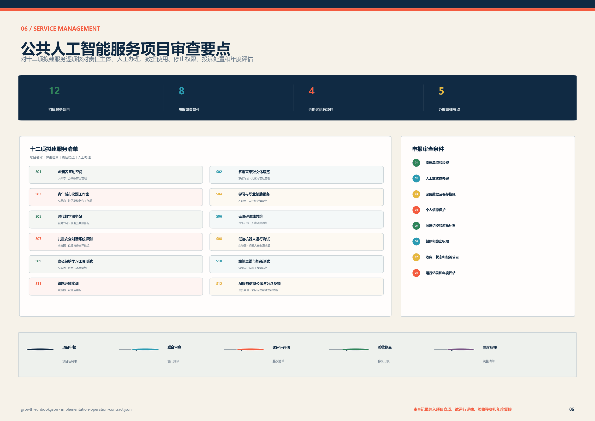

## 四、三层范围工作框架

按照任务书确定的三个层级，分别明确规划重点、主要成果和工作衔接要求，逐级传导、逐级落实。

| 工作层级 | 规划重点 | 主要成果 | 工作衔接要求 |
|---|---|---|---|
| 43.6 km² 统筹研究范围 | 研判产业协作、人才服务、交通联系和设施运维关系 | 五类跨片区协同事项、基础数据清单和年度工作安排 | 将牵头类型、配合单位、经费渠道和阶段成果纳入年度任务 |
| 约 11.4 km² 总体设计范围 | 组织城市结构、复合功能、慢行蓝绿和更新序列 | 一轴三片、两翼协同、十二处公共服务节点和六类方案分区 | 正式边界、控规条件和现状调查纳入统一底图 |
| 368.4 ha 三处重点片区 | 形成可启动的空间设计和项目包 | 众智园验证场、AI 原点共享首层、大钟寺站城公共厅先导界面 | 权属、交通、消防、市政、无障碍和运营协议通过审查 |

三层工作范围分别对应区域协同研究、总体城市设计和重点片区项目化设计，通过统一空间底图、统一指标口径、统一项目清单和统一实施时序逐级传导，保证研究工作不断档、设计成果能落地。[depth:three_level_scope_framework]

## 五、统筹研究范围产业与未来城市研究

统筹研究范围建立两级协同网络。廊道内部设置研发测试、校园社区教育、成果转化、站城服务和蓝绿运维五类接口；外部联动北纬社区、未来科学城、怀柔科学城、北京经济技术开发区和京津冀创新节点。各协作单元执行年度任务书，明确资源交换、责任类型、成果数量、经费科目和退出条件。[data:visual/assets/regional-collaboration-ledger.json] [data:visual/assets/regional-action-program.json]

北纬社区每年开展四次重点人群走查并完成不少于六项服务流程改进；未来科学城每年联合发布两个跨城场景题目；怀柔科学城每年形成两套公共科学课程和一项城市应用验证；北京经济技术开发区每年组织三项设备互测和一次供应链对接；京津冀协同网络每年发布一份跨区域场景目录，推动三项成果异地验证。未经年度项目协议确认的协作事项不列入实施项目和绩效统计。[depth:overall_spatial_structure] [data:visual/assets/regional-action-program.json]

项目启动阶段安排五项专项调查：企业和就业岗位、人才及家庭公共服务、分时通勤和站城接驳、存量建筑和租赁使用、蓝绿及市政设施容量。调查结果形成统一数据表，由责任单位按年度更新，作为调整公共服务规模、项目排序和资金计划的依据。[source:PROCESSED-FACT-PACK] [metric:osm_context_feature_count]

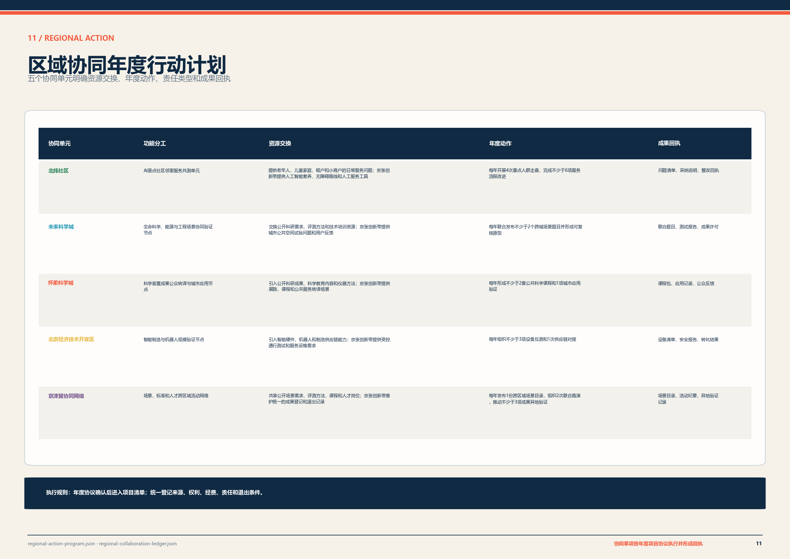

## 六、总体设计范围城市更新与控规深度城市设计

总体设计范围形成“一轴三片、两翼协同、多点支撑”的空间结构，统筹近期项目和公共设施布局；法定用地及规划条件按照主管部门审批成果执行。

- 京张沿线公共空间联系轴依托铁路遗产廊道，分段补齐步行、骑行、林荫、雨水设施、公共服务和文化信息。
- 三处重点片区分别承担受控验证、社区协同创新和站城公共服务职能。
- 东西两翼衔接中关村技术服务资源和小月河公共服务资源，按年度任务落实课程、测试、转化和设施运维协作。
- 十二处公共服务节点提供人工咨询、休憩、饮水、充电、纸质导向、设施维护和服务信息公示。

经复算，工作底图面积为 11,412,825.386 平方米，用于方案图层校核和规划指标测算；待正式总体设计范围公布后，同步更新面积成果和土地平衡。[data:geometry/site_boundary.geojson#SITE-001] [metric:site_area_sqm]

## 七、用地、建筑规模与拆改留方案

方案按六类更新单元组织总体设计工作底图，即研发测试与安全评估、人才居住与生活配套、教育培训与成果转化、铁路文化与公共服务、数字服务与商业配套、蓝绿空间与市政设施。每类单元分别安排保留改造、功能导入、设施补建和实施条件。需要强调的是，图层代码仅服务于本次方案统计，法定用地性质、开发强度和兼容关系，以控制性详细规划及城市更新实施方案核定为准。[data:geometry/land_use.geojson#LU-01] [standard:MNR-LAND-USE-CLASSIFICATION-GUIDE]

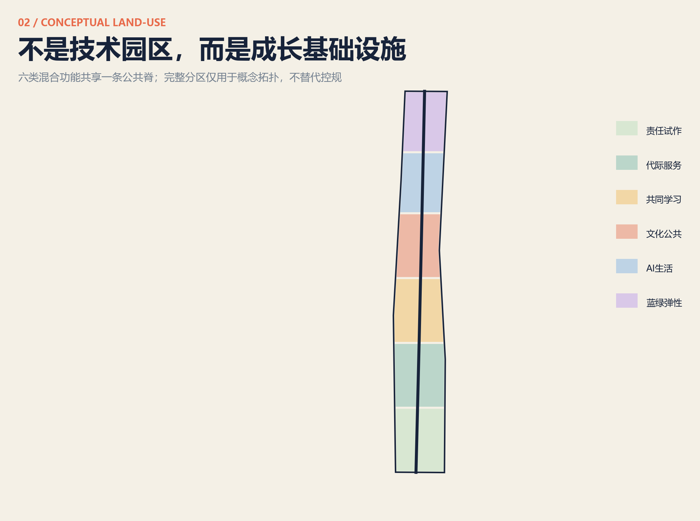

建筑更新坚持留改拆并举、以保留利用提升为主，严格执行“调查—评价—分类—实施”程序。逐栋调查记录产权、用途、层数、结构、消防、历史文化价值和运行状态；综合评价后形成保留、修缮、适应性再利用、局部更新或必要拆除的分类建议，不搞大拆大建。当前建筑图层表达的是重点片区的概念空间颗粒，待逐栋调查完成后形成建筑分类更新清单。近期项目优先采用首层轻改造、闲置时段共享、可拆装设施和公共界面整治，尽量降低对群众生产生活的影响。[data:geometry/buildings.geojson#BLDG-01-01] [depth:retain_renovate_demolish]

容积率、建筑高度、建筑密度、退线、停车配建和市政容量等指标，列入下一阶段重点深化清单，在控制性详细规划、城市更新实施方案和专项论证中统筹确定。[metric:floor_area_ratio] [assumption:A-CONTROLS-001]

## 八、重点区域详细设计

三处重点片区采用统一的编制框架：衔接公告规模和工作底图，逐项明确功能定位、首期项目、空间预算、建筑更新策略、建设条件和运营责任，做到条件清楚、任务具体、责任可查。[depth:three_key_area_detailed_design] [data:geometry/key_areas.geojson]

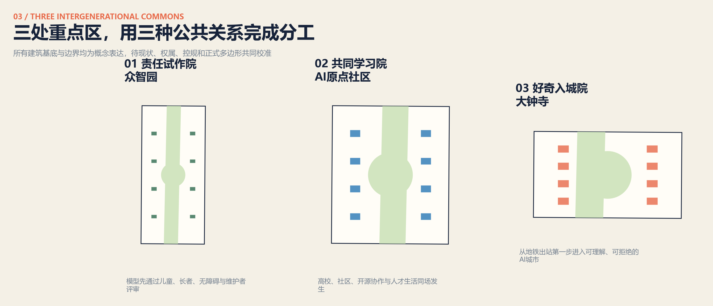

### （一）众智园创新验证片区

片区公告面积约 192.1 公顷，工作底图复算 192.92 公顷。功能定位为受控测试、公众审议和设施运维。首期设置约 1.5 公顷创新验证场，空间预算包括 3,200 平方米受控测试与安全缓冲、900 平方米公众审议与信息公示、1,200 平方米设施运维实训、2,800 平方米雨水花园和生态缓冲，以及 6,900 平方米全龄测试环、消防及后勤通道。

验证场采用可逆构造，保障既有园区通行和公共服务连续运行。建筑利用对象经权属、结构和消防核验后分类确定。开放前完成场地许可、交通消防、伦理数据、安全评估和独立测试审查；发生重大事件时，按规定启动应急暂停和独立复核程序。

### （二）北京 AI 原点社区协同创新片区

片区公告面积约 104.3 公顷，工作底图复算 104.32 公顷。功能定位为学习协作、开源发布、人才服务和家庭支持。首期盘活约 3,000 平方米共享首层，其中学习与议事空间 900 平方米，开源发布及短期展陈 600 平方米，人工人才服务和家庭支持 520 平方米，共享工作及小型原型空间 680 平方米，后勤、无障碍和消防调整预留 300 平方米。

共享首层采用分时开放和轻改造方式。实施前核对产权、租约、房屋安全、消防和分时运营协议，并向社会公布开放时段、收费规则和人工服务安排。近期可先行开展短期活动和临时共享，待产权、运营和消防条件稳定后，再推进固定改造。

### （三）大钟寺站城融合片区

片区公告面积约 72.0 公顷，工作底图复算 72.05 公顷。功能定位为轨道接驳、城市信息、人工服务和公共停留。首期研究约 2.4 公顷站城公共厅界面，完善四向步行联系，设置两处人工服务点、多语言实体导向和全龄友好停留设施，并与京张创新发展轴示范段衔接。

实施顺序依次为客流和疏散分析、轨道安全条件确认、产权及商业运营协商、导向及铺装改造、服务节点建设。近期优先实施导向和人工服务改善；空间扩建部分，待疏散、客流和轨道安全条件落实后，纳入后续建设时序安排。

## 九、交通、轨道、市政与公共服务设施

交通系统设计充分考虑行动速度较慢、识别能力较弱和携带行李等使用情形，开展全龄友好校核。京张创新发展轴示范段控制连续步行净宽不小于 3.0 米、双向骑行净宽不小于 4.0 米，主要有效休憩点间距不大于 150 米。上述指标为方案阶段控制值，工程设计阶段将结合道路红线、轨道安全、消防、市政管线和现状树木条件，进一步优化断面组合。[source:BEIJING-WALK-CYCLE-STANDARD] [metric:pilot_walk_clear_width_target_m] [metric:rest_point_spacing_target_max_m]

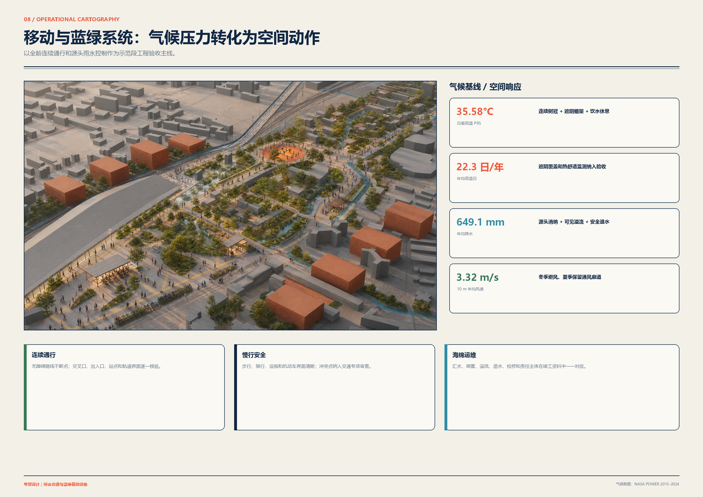

## 十、蓝绿空间、公共空间与城市风貌

蓝绿公共空间体系主要承担遮阴、雨水调蓄、连续休憩和生态教育功能。概念阶段气候基线采用 NASA POWER 2015—2024 日尺度数据：日最高温 P95 为 35.58°C，年均 ≥35°C 日数约 22.3 天，年均降水约 649.1 毫米，太阳辐射均值 4.05 kWh/m²/日。据此，方案设置连续遮阴、雨水花园、安全溢流、冬季向阳避风和可维护设施；下一阶段结合现场监测和专项模型，深化水文、热环境、风环境及能源参数。[source:NASA-POWER-2015-2024] [source:BEIJING-SPONGE-CITY] [depth:blue_green_public_space]

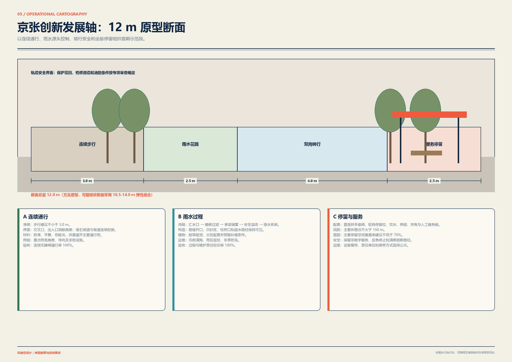

## 十一、公共服务节点建设指引

公共服务节点规划面积 250—400 平方米，优先采用可拆装构件，便于随使用需求调整。每处节点配置 24—36 平方米人工服务空间，并统筹设置遮阴停留、饮水、充电、纸质地图、服务信息公示和雨水花园。节点建设同步开展地下管线综合、消防审查、无障碍设计、设施接入、场地许可和运营维护方案编制，保障断网、停电等情形下基本服务连续可用。

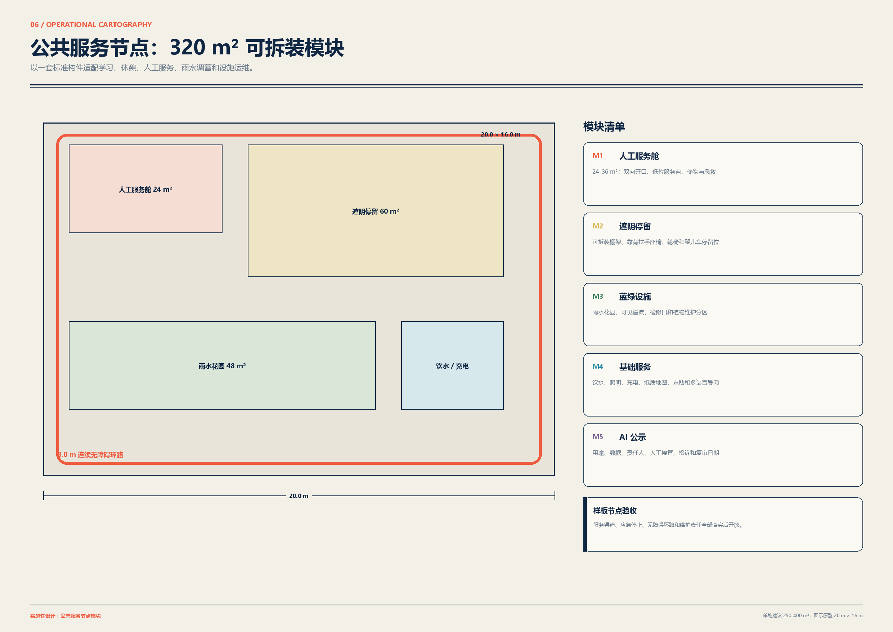

## 十二、AI 创新生态、人才画像与 AI+ 场景

### （一）创新生态与要素配置

创新生态按照“需求发布—原型验证—公共共测—转化应用”四级链条运行。每年发布不少于 30 项公共与产业场景需求，在众智园完成不少于 20 项原型测试，在 AI 原点社区和小月河公共体验环完成不少于 12 项多群体共测，在大钟寺和中关村科技服务翼形成不少于 8 项采购、合作或规模应用方案。每一阶段均形成编号、评估结果、整改要求和转化回执。[data:visual/assets/ecosystem-policy.json]

土地、空间、产业、资金、人才、算力、数据和场景实行八类要素清单管理。首期项目优先使用存量建筑和可逆设施；公共共测空间同步配置人工服务；公共环境、试验设施和商业运营分类建账；人才培养设置课程、实训、驻留和岗位四级通道；数据逐项登记来源、用途、保存期限、人工复核和删除责任；场景实行公开征集、联合审查、限期试验、效果评估和退出更新。

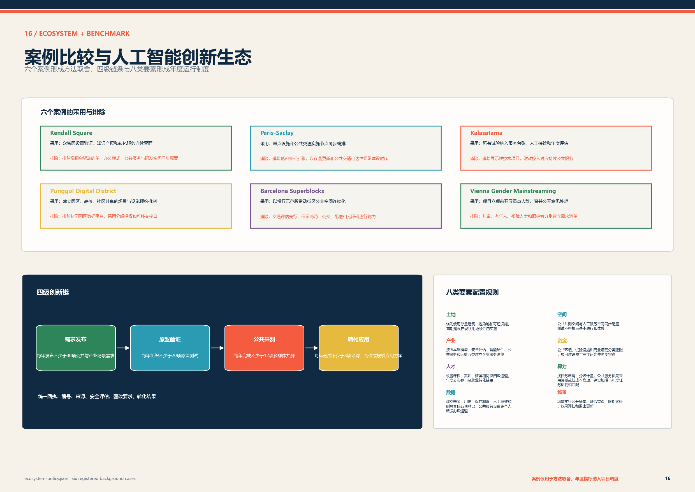

### （二）十二项公共人工智能服务

十二项拟建公共服务逐项明确服务对象、建设位置、责任类型、人工办理方式、必要数据、暂停权限、信息公开和年度评估要求。近期先行选择四项组织试运行；其余项目待场地、人员、经费和专业审查条件具备后，分期稳妥实施。

| 编号 | 服务项目与建设位置 | 建设和运行要求 | 人工办理与调整条件 |
|---|---|---|---|
| S01 | 大钟寺人工智能素养互动空间 | 不采集人脸和身份信息 | 现场教育员及实体展项；内容风险未闭环时暂停 |
| S02 | 京张文化多语言导览 | 自愿选择语言，不建立访客画像 | 人工导览和纸质地图同步提供 |
| S03 | AI 原点青年城市议题工作室 | 匿名问题卡 | 教师或社区导师复核后公开 |
| S04 | 学习与职业辅助服务 | 本地短时会话，不进入正式评价 | 教师或咨询师复核，可转人工 |
| S05 | 跨代数字服务站 | 免账户办理，记录最少工单信息 | 志愿者面对面支持并保留纸质流程 |
| S06 | 无障碍路线共绘 | 自愿标注障碍点，仅发布汇总信息 | 无障碍顾问审图，异议可撤回 |
| S07 | 儿童安全对话系统评测 | 合成数据优先 | 监护人和伦理负责人可立即终止 |
| S08 | 低速机器人通行测试 | 仅记录设备运行数据，现场划定测试时段和范围 | 安全员现场值守，保留实体绕行路径 |
| S09 | 隐私保护学习工具测试 | 自愿样本，最少化输入 | 教师复核，与正式教学评价分离 |
| S10 | 端侧离线与能耗测试 | 设备级性能数据 | 工程师签字，未达标设备退出公共环境 |
| S11 | 设施运维实训 | 工单去标识 | 专业人员复核并公开维修手册 |
| S12 | 服务信息公示与公众反馈 | 汇总证据，不进行个人排名 | 独立审议，到期复审并公开处理结果 |

医疗、法律、教育和公共安全相关服务，一律由相应专业人员复核把关。每个服务点公开用途、适用人群、责任单位、收费事项、数据范围、人工办理方式、运行状态、报修投诉渠道和下次评估日期，确保群众看得明白、用得放心、退得出去。[source:PRINCIPLE-UNHABITAT] [data:visual/assets/growth-runbook.json]

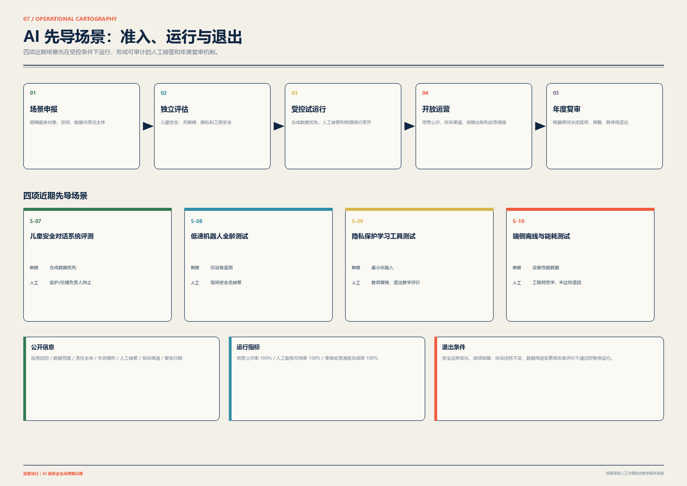

## 十三、全龄友好与公共服务保障

重点人群调查覆盖儿童及家庭、老年人及照护者、残障人士、长期居民、租户及小商户、学生及青年人才、通勤者及访客、一线服务人员和周边机构。项目立项前，分别记录各类人群的通行障碍、设施需求、施工影响、租金和经营影响、人工服务需求及参与意见，形成问题清单和整改责任表，逐条回应、逐项销号。

公众参与安排包括方案公示、现场踏勘、重点人群走查、施工告知、意见登记和处理结果反馈。涉及儿童、残障人士、租户及一线维护人员的项目，在可行性研究阶段开展专项走查；建设单位将意见、采纳情况和未采纳理由列入项目档案，做到件件有回音。[data:visual/assets/inclusion-ledger.json] [data:visual/assets/user-cotest-plan.json]

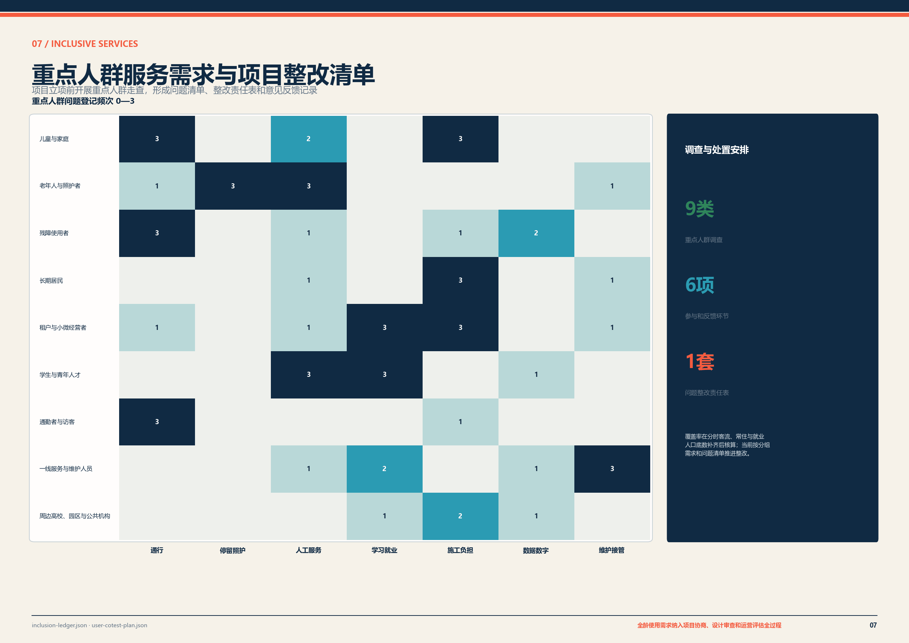

## 十四、公共空间标识与导视系统

“京张共长线 / GROW WITH JINGZHANG”作为公众传播名称使用。政府立项名称、法定地名、建设项目名称和运营单位名称，按管理要求单独标注，二者不混用。标识系统分为片区入口、方向导引和服务确认三级，用于识别线路方向、公共设施、人工服务点、开放时段和报修方式。

标识颜色按照信息职责规范使用：橙色标注责任、警示和停止事项，墨蓝色标注主要方向，绿色标注公园及雨水设施，青色标注便民服务。标识设置与北京市道路交通、无障碍、消防疏散和公共信息导向要求相衔接，由运营单位建立编号、位置、安装日期和维护状态台账，定期检查更新。

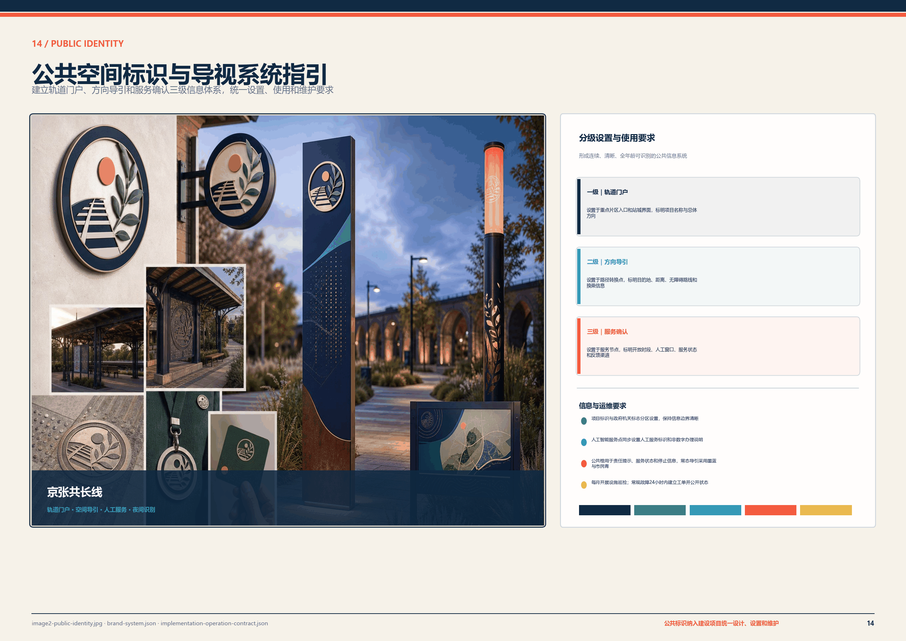

### 三条文化叙事与三处主题地标

沿线文化表达实行三条叙事线。第一条“自主工程”讲述 1909 年京张铁路工程、测绘与建设档案；第二条“开放创新”梳理中关村科研创业、开源协作和产业转化；第三条“公共智能”展示人工智能进入城市公共服务后的责任、权利和运行规则。三条叙事分别进入公共课程、空间导视、年度展陈和国际传播文本。[data:visual/assets/culture-landmark-system.json]

建设三处主题地标。北京 AI 原点社区设置“京张原点里程庭”，以 1909、1980、2026 三个时间刻度组织铁路档案、口述史和开放课程；众智园设置“开放模型廊”，公开展示可复现模型、测试方法、失败样例、数据来源和停止记录；大钟寺站城公共厅设置“共治信号塔”，显示十二项服务的开放、限流、人工接管、整改和停止状态。三处地标同时承担通行、休憩、课程、导向和人工服务，不设置脱离日常使用的纯展示构筑物。

建立“京张开放贡献档案”，按公共问题发现、开源工具与数据、安全与无障碍改进、长期维护四类记录贡献。荣誉只授予有公开成果和可复核记录的个人或团队，机构赞助不直接形成荣誉资格。沿线实体铭牌、开放贡献墙、离线数字档案和年度公共报告使用同一编号，每年联合复核一次。

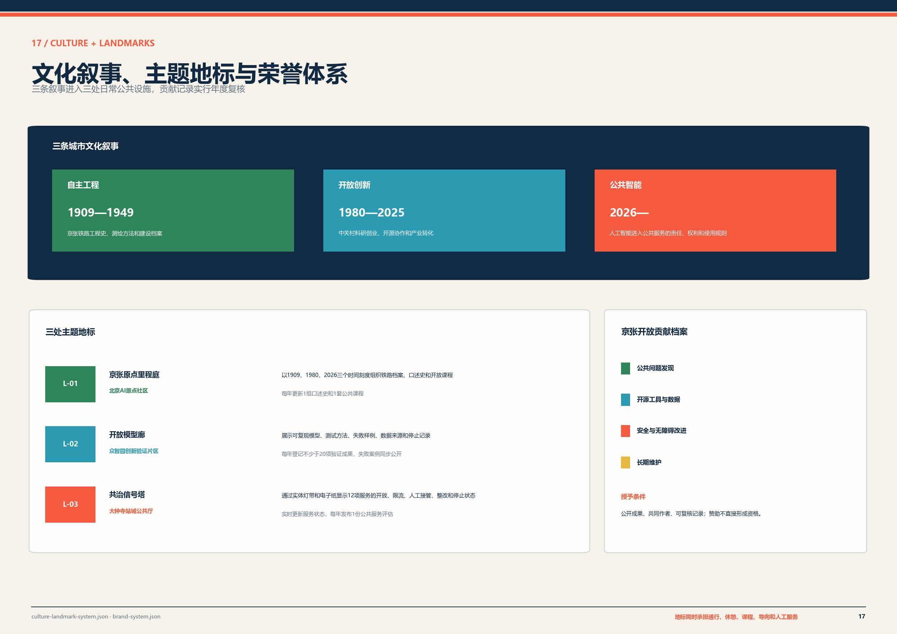

## 十五、更新项目清单、实施政策与分期计划

近期建立六个项目包，即京张沿线慢行示范段、大钟寺站城衔接先导项目、众智园研发测试场、AI 原点社区共享首层、公共服务节点样板、公共人工智能服务管理系统。S、M、L 为项目储备阶段的投资比较级别，分别对应 500 万元以内、500—2,000 万元和 2,000—5,000 万元；具体资金需求在可行性研究、设计概算和财政评审阶段核定。

| 项目 | 主要建设内容 | 建议责任类型 | 实施窗口 | 前置条件 | 资金与运营安排 |
|---|---|---|---:|---|---|
| P-01 京张沿线慢行示范段 | 约 1 公里连续步行、双向骑行、雨水花园、遮阴休憩及服务停留 | 区级统筹、属地街道、产权单位、交通和园林专业单位 | 6—18 个月 | 正式红线与权属、轨道安全、交通组织、管线和消防意见 | 公共空间建设资金统筹；属地和设施运维单位共同承担日常维护 |
| P-02 大钟寺站城衔接先导项目 | 四向步行联系、两处人工服务点、多语言实体导向和非机动车停放整治 | 属地街道、站区运营、交通专业单位、产权单位 | 12—24 个月 | 分时客流与疏散、轨道接口、消防和产权协议 | 站区公共环境改造与运营单位投入分类核算 |
| P-03 众智园研发测试场 | 约 1.5 公顷受控测试、安全缓冲、公众说明、运维培训和雨水设施 | 园区运营、高校企业测试方、独立安全评估 | 12—24 个月 | 场地权属、项目准入、数据安全、应急处置和保险安排 | 建设及测试费用由实施主体落实；公众设施和园区设施分别建账 |
| P-04 AI 原点社区共享首层 | 约 3,000 平方米学习议事、成果发布、人才服务、共享工作及后勤空间 | 产权单位、属地街道、高校社区、专业运营方 | 9—18 个月 | 权属租约、房屋安全、消防、分时开放和收费规则 | 轻改造与运营费用同步测算，签订共享使用和维护协议 |
| P-05 公共服务节点样板 | 320 平方米样板，配置人工服务、饮水充电、遮阴休憩和雨水花园 | 属地街道、社区、园林及设施运维单位 | 6—12 个月 | 地下管线、设施接入、场地许可、消防和维护责任 | 建设投资与年度运维经费一并明确，验收后办理资产和运维移交 |
| P-06 公共人工智能服务管理系统 | 项目申报、联合审查、试运行记录、故障工单、公众反馈和年度评估 | 区级统筹、服务运营单位、独立评估单位 | 3—9 个月 | 数据分类、责任单位、应急预案和投诉流程 | 作为管理工具建设，按年度安排系统维护和评估费用 |

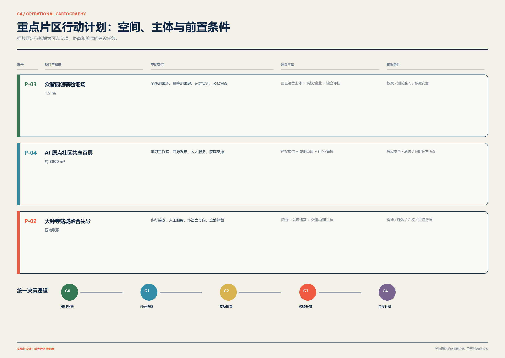

项目实施按五个管理节点推进，前一节点要求未落实的，不转入下一节点：

| 阶段 | 工作内容 | 转入下一阶段的要求 |
|---|---|---|
| G0 资料归集 | 汇总边界、权属、现状、来源和补充调查清单 | 资料来源、使用条件和责任单位完成登记 |
| G1 可行研究 | 开展重点人群走查，明确建设边界、维护主体、人工服务和影响缓解措施 | 形成可行性研究要点、协商纪要、运营经费安排和维护责任书 |
| G2 专项审查 | 推进交通、轨道、消防、市政、无障碍、数据和服务项目审查 | 各专项意见落实到设计图纸和实施清单 |
| G3 验收移交 | 完成工程验收、资产清册、人员培训、应急暂停和服务切换演练 | 竣工资料、运营移交、人工服务和应急安排齐备 |
| G4 年度评估 | 综合使用情况、资金支出、故障维护和公众意见 | 形成继续实施、整改、缩减或终止清单 |

实施、验收和异议处理实行岗位分离，防止同一主体既当运动员又当裁判员。每项行动任务明确统筹、实施、审查、协商和知情主体，并公布维护周期和年度调整条件。[data:visual/assets/implementation-operation-contract.json]

## 十六、项目启动前 90 日准备工作

项目正式启动前，安排 90 日准备工作：0—15 日完成边界、权属、现状建筑、使用人群和责任单位清单；16—45 日完成现场踏勘、方案比选、运营测算和专项部门对接；46—75 日开展服务流程、故障切换、施工影响和应急处置演练；76—90 日汇总问题、落实整改责任，并形成是否进入实施阶段的明确意见。

参加单位包括项目统筹、建设和运营单位，交通、轨道、消防、市政、园林、无障碍等专业单位，以及产权人、属地社区和受影响使用者。各阶段形成会议纪要、现场问题单、部门意见、投资与运营测算和整改闭环表，作为项目立项和方案深化的依据。[data:visual/assets/user-cotest-plan.json]

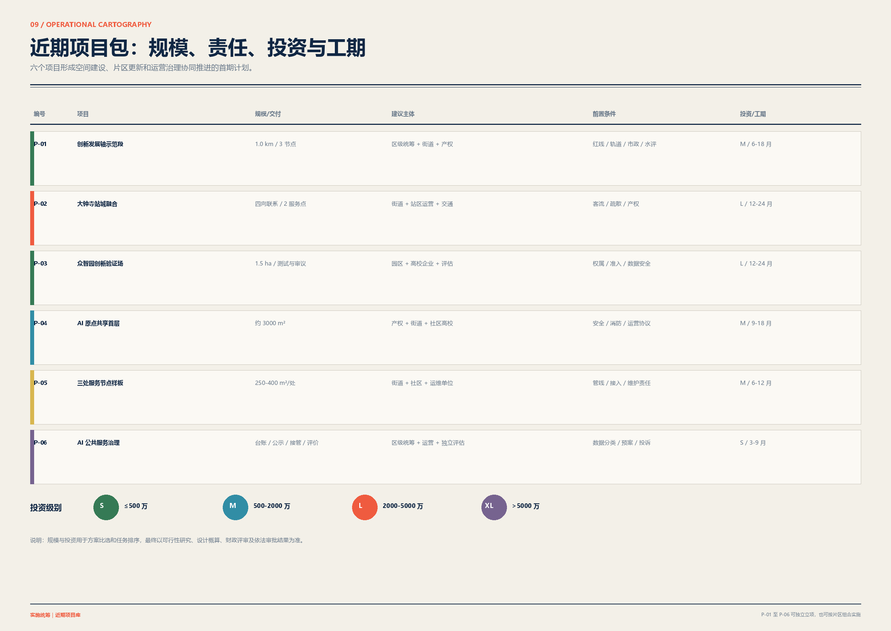

## 十七、年度活动、开发者社区与转化机制

建立四季活动日历。春季举办“京张城市问题季”，发布不少于 30 项场景需求并开展 6 场现场走查；夏季举办“京张开放验证季”，完成不少于 20 项原型测试和 8 类异常情形复测；秋季举办“京张公共智能周”，完成不少于 12 项多群体共测和 4 场开源工作坊；冬季召开“京张年度治理会”，对十二项服务和六个项目包形成继续、整改、缩减或终止清单。[data:visual/assets/annual-operation-program.json]

开发者社区设置公共服务与无障碍、模型安全与评测、端侧设备与机器人、城市数据与运维四个常态工作组。每个项目指定维护人和公共问题负责人，代码、模型、数据和文档分别登记许可；连续两次未完成安全整改的项目停止进入公共场景。年度安排 12 次开放工作日，形成不少于 8 项可复用成果。

企业和人才转化执行五级流程：需求入库、受控验证、公共共测、采购与合作、规模应用。项目只有在权利清晰、成本可承担、运营责任落实且年度绩效达到服务标准后，才能进入跨区复制和规模应用。年度活动经费、场地运维经费和人工服务岗位经费分别编制，活动经费不得挤占基本设施维护和人工服务预算。

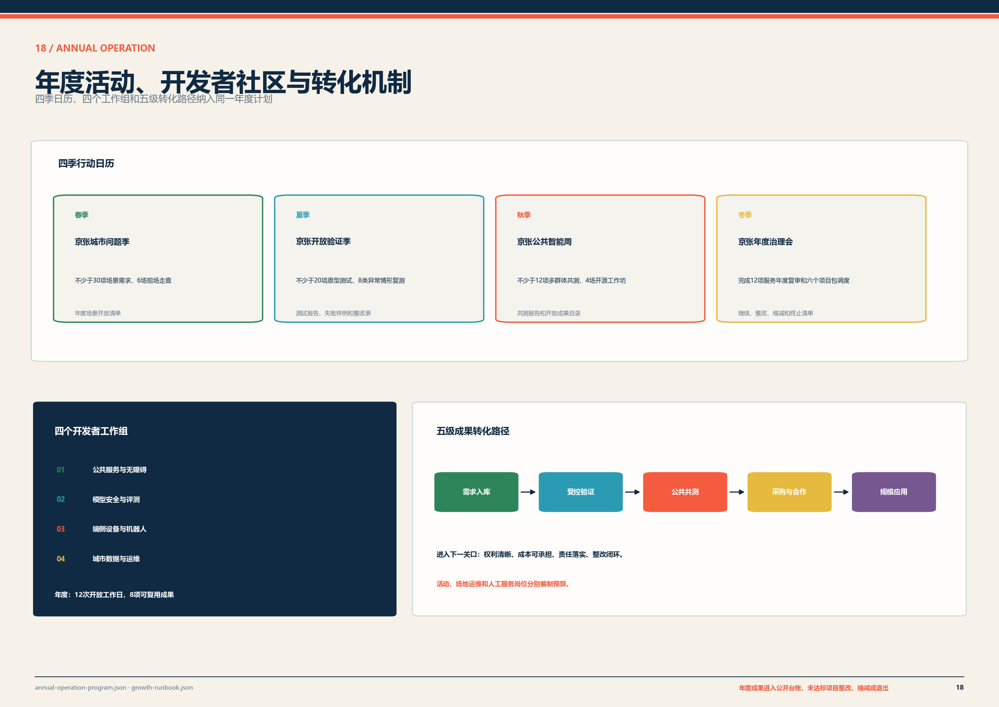

## 十八、指标体系、面积复算与合规矩阵

指标体系分为工作底图复算、概念方案复算、规划控制值、运营目标和方案规则校核五类。图表同步列出各项指标的当前状态、测量方法、责任主体和评估周期；尚未调查核实的补充事项，纳入项目启动清单，不以推测值充数。[metric:green_ratio] [metric:public_space_ratio] [depth:metrics_recalculation]

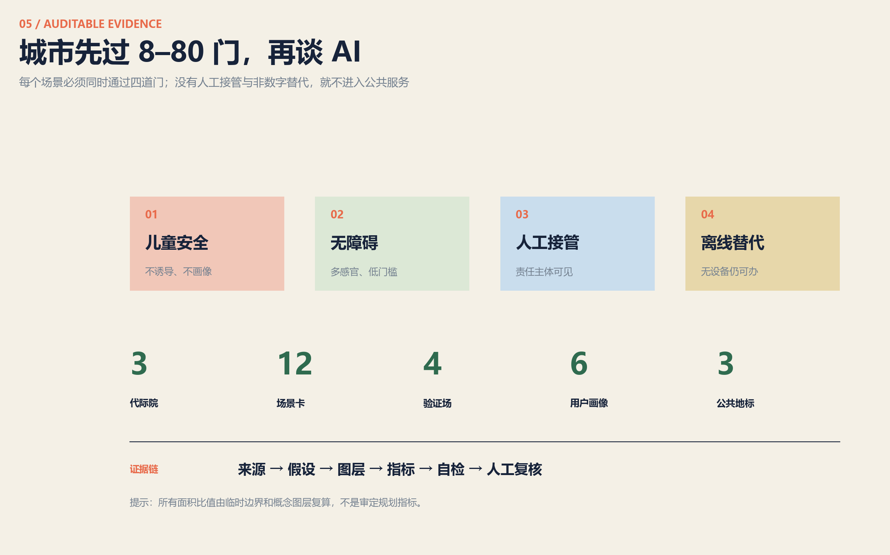

| 指标 | 数值或状态 | 属性 | 测量与复核 |
|---|---:|---|---|
| 总体设计工作底图 | 11.4128 km² | 复算值 | EPSG:4548 投影面积；正式值由主管部门确认 |
| 概念蓝绿空间比例 | 18.95% | 方案复算值 | 图层并集面积除以工作底图面积 |
| 连续步行净宽 | ≥3.0 m | 建议控制值，未实施 | 建成后按最窄点逐段实测 |
| 双向骑行净宽 | ≥4.0 m | 建议控制值，未实施 | 施工图复核和建成实测 |
| 有效休憩点间距 | ≤150 m | 建议控制值，未实施 | 沿连续无障碍路线测量 |
| 主要停留空间遮阴 | ≥70% | 方案控制目标 | 夏季设计时段日照分析和现场抽测 |
| 人工服务可用率 | 100% | 运营目标，未实施 | 按公布时段开展月度抽测 |
| 完成规则校核的拟建服务 | 12/12 | 方案阶段校核 | 八项申报审查条件逐项核对 |
| 完成异常情形测试 | 8/8 | 方案阶段校核 | 按预设异常情形核对响应机制 |

## 十九、风险、版权与合规说明

风险管理覆盖边界和权属、轨道及交通、个人信息和未成年人、无障碍、运营维护、气候排水、商业置换、素材权利和成果使用等事项。各类事项逐项明确识别条件、处置措施、应急安排和责任主体。项目推进期间，持续保障人工办理路径、基本公共设施和公众意见渠道畅通，确保城市基本服务稳定运行。[data:risk.json]

本成果的图件、PDF 和网页由结构化数据和本地构建程序生成。OpenStreetMap 背景遵循 ODbL 1.0 并保留贡献者署名；NASA POWER 数据用于概念阶段气候分析；Blender、Three.js 和图像生成场景用于空间表达。每个成果文件登记文件路径、作者或生成工具、输入来源、许可、修改方式、署名位置、公开范围和限制条件。原创成果适用 `COMMUNITY-DISPLAY-ONLY` 条款，完整条款随包交付。[source:OSM-CONTEXT-20260808] [source:NASA-POWER-2015-2024] [data:visual/assets/rights-clearance-ledger.json]

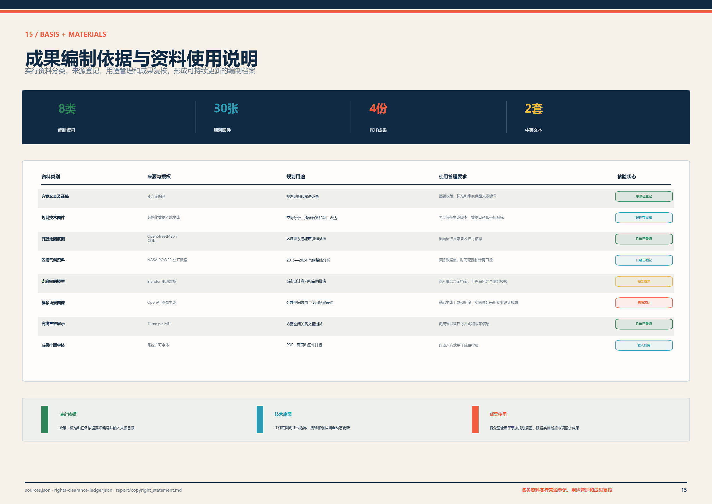

下一阶段资料清单包括正式总体及重点区边界、地形测绘、道路和地块红线、逐栋建筑及产权、文物保护、市政管线与容量、消防与交通模型、站点分时客流、现状无障碍障碍点、详细水文土壤及公众参与记录。上述资料纳入统一底图后，复算土地平衡和各项指标，形成可进入规划审查、可行性研究和工程设计阶段的深化成果。

## 二十、任务书交付矩阵

任务书六项专项任务纳入统一交付矩阵。总体统筹、案例与生态、十二项场景、地标与荣誉、文化叙事、年度运营分别对应独立图页、结构化台账、正文专节和年度指标。项目管理单位按交付矩阵检查缺项，未形成文件、图件或责任清单的任务不计为完成。[data:visual/assets/agent-task-delivery-matrix.json]

## 二十一、参考资料

任务依据包括征集公告、面向智能体任务书、仓库资料包、来源登记和处理事实导航。[source:DATA-SRC-OFFICIAL-ANNOUNCEMENT-20260509] [source:DATA-SRC-AGENT-TASKBOOK-20260518] [source:SOURCE-REGISTRY]

城市更新、慢行无障碍和气候适应依据包括《北京市城市更新条例》、北京步行和自行车交通环境规划设计标准、《无障碍环境建设法》、北京海绵城市及韧性城市相关标准。具体适用条款和设计参数，在项目立项及专项设计阶段由具备相应资质的单位核对确认。[source:BEIJING-URBAN-RENEWAL-REGULATION] [source:DATA-SRC-BARRIER-FREE-ENVIRONMENT-LAW] [source:BEIJING-SPONGE-DESIGN-STANDARD]

### 成果资料索引

下列索引用于连接公开资料、规划标准、设计深度、空间图层和指标台账，便于查询原始记录和复算口径。

- 来源与方法：[source:SITE-PACKAGE] [source:SOURCE-REGISTRY] [source:PROCESSED-FACT-PACK] [source:BOUNDARY-SOURCE] [source:KEY-AREA-SOURCE] [source:DATA-SRC-OFFICIAL-ANNOUNCEMENT-20260509] [source:DATA-SRC-AGENT-TASKBOOK-20260518] [source:CASE-PARIS-15M] [source:CASE-VIENNA-GENDER] [source:CASE-PUNGGOL] [source:CASE-KALASATAMA] [source:CASE-BARCELONA-SUPERBLOCK] [source:CASE-KENDALL] [source:CASE-PARIS-SACLAY] [source:PRINCIPLE-UNHABITAT] [source:PRINCIPLE-NEB] [source:PRINCIPLE-AMSTERDAM-CIRCULAR] [source:OSM-CONTEXT-20260808] [source:NASA-POWER-2015-2024] [source:BEIJING-SPONGE-CITY] [source:BEIJING-RESILIENT-CITY] [source:BEIJING-CLIMATE-ADAPTATION] [source:BEIJING-RAIN-GARDEN-STANDARD] [source:BEIJING-URBAN-RENEWAL-REGULATION] [source:BEIJING-WALK-CYCLE-STANDARD] [source:DATA-SRC-BARRIER-FREE-ENVIRONMENT-LAW] [source:BEIJING-SPONGE-DESIGN-STANDARD] [source:BLENDER-52-MODEL] [source:THREEJS-OFFLINE-EXHIBIT] [source:OPENAI-IMAGEGEN-SCENES]
- 适用标准：[standard:PROJECT-OFFICIAL-ANNOUNCEMENT] [standard:PROJECT-AGENT-OPEN-CALL-TASKBOOK] [standard:MOHURD-URBAN-DESIGN-MEASURES] [standard:MOHURD-CONTROL-DETAILED-PLANNING] [standard:MNR-LAND-USE-CLASSIFICATION-GUIDE] [standard:MOHURD-ARCH-DESIGN-DEPTH-2016]
- 设计深度：[depth:existing_conditions_diagnosis] [depth:three_level_scope_framework] [depth:overall_spatial_structure] [depth:land_use_layout] [depth:development_intensity_controls] [depth:height_massing_character] [depth:retain_renovate_demolish] [depth:traffic_rail_slow_parking] [depth:municipal_new_infrastructure] [depth:blue_green_public_space] [depth:three_key_area_detailed_design] [depth:renewal_project_list] [depth:phasing_implementation] [depth:metrics_recalculation] [depth:risk_missing_data]
- 空间数据：[data:geometry/site_boundary.geojson] [data:geometry/key_areas.geojson] [data:geometry/land_use.geojson] [data:geometry/buildings.geojson] [data:geometry/roads.geojson] [data:geometry/green_space.geojson] [data:geometry/public_space.geojson] [data:geometry/constraints.geojson] [data:geometry/phasing.geojson]
- 指标台账：[metric:site_area_sqm] [metric:building_footprint_area_sqm] [metric:green_ratio] [metric:public_space_ratio] [metric:key_area_count] [metric:growth_station_count] [metric:ai_scenario_card_count] [metric:pilot_corridor_length_m] [metric:prototype_service_node_area_sqm] [metric:pilot_shared_ground_floor_area_sqm] [metric:implementation_project_count] [metric:acceptance_kpi_count] [metric:osm_context_feature_count] [metric:climate_heat_days_ge_35c_per_year] [metric:climate_annual_precip_mm] [metric:climate_mean_solar_kwh_m2_day] [metric:pilot_walk_clear_width_target_m] [metric:pilot_cycle_width_target_m] [metric:rest_point_spacing_target_max_m] [metric:shade_coverage_target_ratio] [metric:human_service_availability_target_ratio] [metric:protocol_service_pass_count] [metric:negative_test_caught_count]
