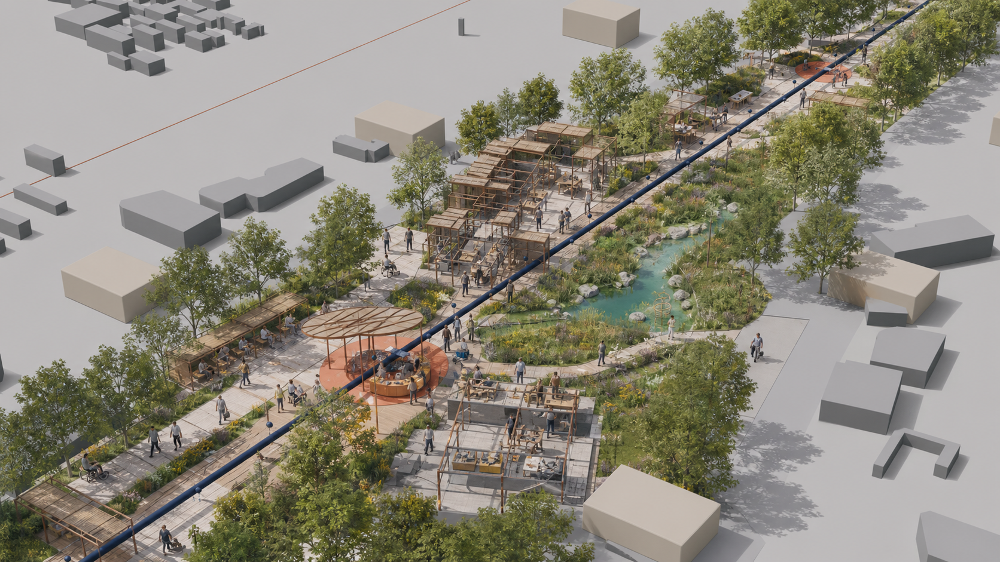
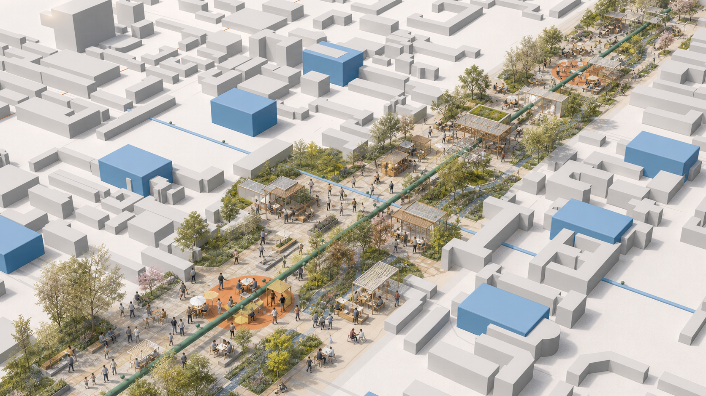
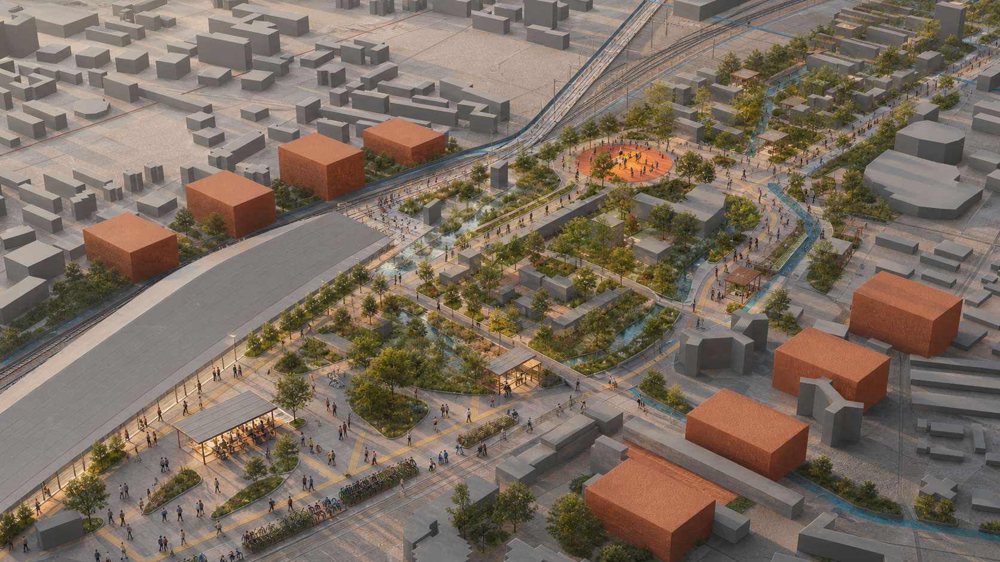
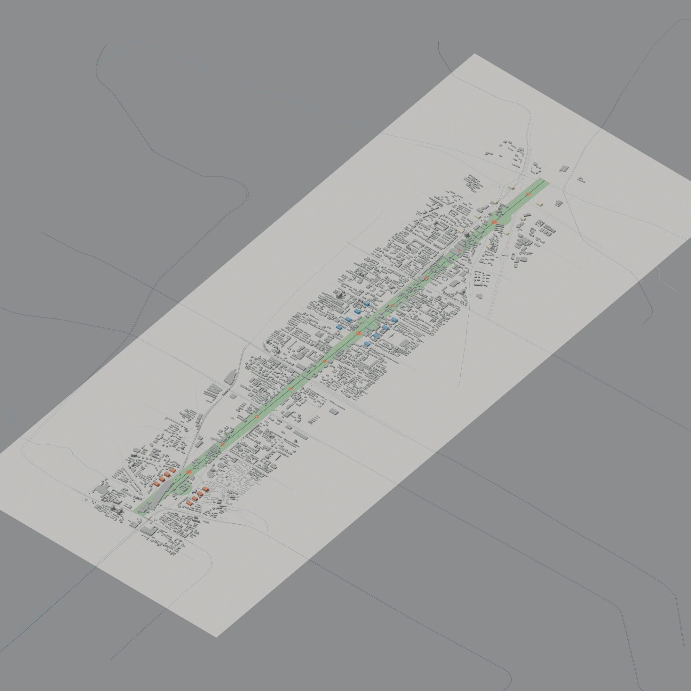

# 京张共长线 / GROW WITH JINGZHANG

> 以人的成长检验技术创新，以连续、包容、可维护的公共空间承载儿童探索、青年实践、成果转化、设施运维与长者独立出行，建设面向全龄人群的 AI 创新带。

## 设计依据与资料清单

本方案依据官方公告明确的三层研究范围和三处重点区域，按照任务书形成项目命名、案例研究、人才画像、AI 应用场景、标志性空间、文化叙事及长期运营等成果。处理后的事实包用于资料检索和任务导航，各项判断均回溯至登记来源。[source:OFFICIAL-ANNOUNCEMENT] [source:AGENT-TASKBOOK] [source:PROCESSED-FACT-PACK] [standard:PROJECT-OFFICIAL-ANNOUNCEMENT] [standard:PROJECT-AGENT-OPEN-CALL-TASKBOOK] [standard:MOHURD-URBAN-DESIGN-MEASURES] [standard:MOHURD-CONTROL-DETAILED-PLANNING] [standard:MOHURD-ARCH-DESIGN-DEPTH-2016] [depth:existing_conditions_diagnosis]

本阶段依据项目资料包提供的研究范围示意，建立 `SITE_BOUNDARY` 与 `KEY_AREA` 工作底图，属性标记为 `official_boundary=false`、`geometry_role=provisional_constraint`。坐标、面积、比例、建筑基底和路线用于总体方案研究；后续结合主管部门发布的边界、地块及道路红线、现状建筑、权属、市政、文保和控制性详细规划成果，统一更新底图、复算指标并深化设计。[source:BOUNDARY-SOURCE] [source:KEY-AREA-SOURCE] [source:SOURCE-REGISTRY] [data:geometry/site_boundary.geojson#SITE-001] [metric:site_area_sqm]

外部案例研究重点提炼可转化的规划机制，包括巴黎的近邻生活与设施复用、维也纳面向照护链条的包容性规划、Punggol 的产学政社协同、Kalasatama 的敏捷试点、Barcelona 的公共空间重构、Kendall Square 的混合使用与公众审议，以及 Paris-Saclay 的科研、居住和服务一体化。研究结果表明，创新城区应以完善日常生活基础设施为基本支撑。[source:CASE-PARIS-15M] [source:CASE-VIENNA-GENDER] [source:CASE-PUNGGOL] [source:CASE-KALASATAMA] [source:CASE-BARCELONA-SUPERBLOCK] [source:CASE-KENDALL] [source:CASE-PARIS-SACLAY]

## 规划目标：以 8–80 岁全龄友好检验 AI 应用

“8–80”作为全龄友好评价尺度，重点检验儿童和长者在公共交通、数据最小化、数字设备可及性等条件下，能否独立、安全、有尊严地完成到达、理解、使用和离开。AI 场景设置四项准入要求：**儿童安全、无障碍、人工接管、实体服务渠道**。未通过准入评估的场景纳入受控试验，完成整改和复核后再行评估公共服务应用条件。[source:PRINCIPLE-UNHABITAT]

项目中文名“京张共长线”，英文名“GROW WITH JINGZHANG”。标识由两条平行轨线与一组年轮相交：轨线延续百年京张的时间脉络，年轮表达不同世代的共同成长，开放缺口对应公众反馈、服务退出和持续更新机制。视觉体系采用纸张底色、铁路墨色、叶绿和公共橙，形成清晰、克制的“生长刻度”。

## 三层范围工作框架

统筹研究范围回答“何种创新生态值得城市承载”；总体设计范围回答“公共脊、混合用地、慢行蓝绿和更新序列如何协同”；三处重点区回答“价值如何在具体日常场景中被验证”。[depth:three_level_scope_framework] [depth:overall_spatial_structure]

| 层级 | 关键问题 | 本方案输出 | 边界 |
|---|---|---|---|
| 43.6 km² 统筹研究范围 | 产业、人才、生活与治理如何形成生态 | “研究—开源—转化—试用—维护—复盘”六步共长链 | 战略机制，不新增红线 |
| 约 11.4 km² 总体设计范围 | 城市形态如何适配不同人生阶段 | 京张创新发展轴、六类复合功能、十二处公共服务节点 | 依据工作底图形成总体空间方案 |
| 368.4 ha 重点区 | 三处片区如何形成差异化协同 | 众智园创新验证片区、北京 AI 原点社区协同创新片区、大钟寺站城融合片区 | 公告面积为规划依据，片区范围纳入后续边界衔接 |

## 统筹研究范围产业与未来城市研究

产业生态围绕六项城市支持任务组织：高校与实验室提出问题，开源社区公开方法，企业与团队推进成果转化，市民参与低风险场景试用，维护人员记录运行失效与全生命周期成本，独立审议机构将评估结果反馈至下一轮。方案借鉴 Punggol 的共址机制与 Kalasatama 的敏捷试点方法，并将儿童、长者、无障碍使用者和一线维护人员纳入共同评审。[source:CASE-PUNGGOL] [source:CASE-KALASATAMA]

方案将创新人才及其城市支持人群细分为六类：①儿童与照护者，配置安全探索和停留设施；②中学生与大学生，提供低成本学习、试验和展示空间；③研究者与创业者，支持开源协作、测试和成果转化；④服务与维护人员，完善后勤、培训和贡献记录；⑤残障人士与老年人，保障连续无障碍、清晰信息和人工窗口；⑥国际访客，提供多语言、低数字依赖的到达服务。维也纳“复杂出行链”方法用于识别照护、采购、接送、轮班等复合需求，并据此优化日常出行网络。[source:CASE-VIENNA-GENDER]

## 总体设计范围城市更新与控规深度城市设计

总体形成“**一轴三片、两翼协同、多点支撑**”的空间结构。京张创新发展轴依托铁路遗产廊道，串联慢行系统、林荫空间、公共服务和创新展示界面；三处重点片区分别承担技术验证、协同创新和站城服务职能；东西两翼加强与中关村技术服务资源、小月河应用场景资源的功能联系；十二处公共服务节点承载学习交流、休憩服务、设施维修、成果展示和人工咨询。[data:geometry/roads.geojson#ROAD-01] [data:geometry/public_space.geojson#PUBLIC-01] [metric:growth_station_count]

方案划分创新验证、代际服务、协同创新、文化公共、智慧生活和蓝绿韧性六类复合功能，并采用共享边界组织连续空间。该分类用于分析产业功能与日常服务在步行尺度内的复合关系；法定用地性质及比例依据控制性详细规划确定。[data:geometry/land_use.geojson#LU-01] [standard:MNR-LAND-USE-CLASSIFICATION-GUIDE] [depth:land_use_layout]

建筑更新坚持存量提质和审慎增量，优先延长既有建筑使用寿命，复合利用闲置时段，推进首层及屋顶适应性改造。保留、改造和更新方式应依据安全、权属、文保、结构及运营评估综合确定。当前建筑图层用于表达概念空间颗粒，后续结合现状调查形成分类处置方案。[source:PRINCIPLE-AMSTERDAM-CIRCULAR] [data:geometry/buildings.geojson#BLDG-01-01] [depth:retain_renovate_demolish]

容积率、建筑高度、建筑密度、建筑退线、道路红线和市政容量依据控制性详细规划及交通、市政、消防等专项论证综合确定，并与城市更新实施方案同步衔接。[metric:floor_area_ratio] [depth:development_intensity_controls]

## 重点区域详细设计

### 1. 众智园创新验证片区 / Zhongzhiyuan Innovation Validation District

重点承担人工智能原型测试、责任评估和公众审议等职能。沿绿色界面设置低速机器人全龄测试环、儿童安全对话系统评测室、端侧设备离线与能耗测试平台及设施运维实训空间。测试结果通过“人工智能服务信息公示卡”公开应用目的、数据范围、失效情形、责任主体、退出方式和复审日期。观察空间、受控测试场地、运维后场与公众审议空间分区组织，建立测试、维护、评价和反馈相衔接的运行机制。[data:geometry/key_areas.geojson#PROV-KEY-001]

### 2. 北京 AI 原点社区协同创新片区 / Beijing AI Origin Collaborative Innovation District

重点承担产学研协同、开源交流和创新人才综合服务等职能。高校、社区、开源团队及配套服务沿连续开放的首层空间布局，设置青年城市议题工作室、跨代数字服务站、开源成果发布空间、教育辅助服务台，以及短期居住和家庭支持设施。借鉴 Kendall Square 与 Paris-Saclay 的混合使用机制，促进研发空间、居住设施、公共服务、开放空间和公众参与协同建设。[source:CASE-KENDALL] [source:CASE-PARIS-SACLAY] [data:geometry/key_areas.geojson#PROV-KEY-002]

### 3. 大钟寺站城融合片区 / Dazhongsi Station-City Integration District

重点承担轨道交通接驳、人工智能公共教育和街区综合服务等职能。围绕轨道站点与周边街区的多向步行联系，完善易识别导向系统、人工咨询服务、全龄友好停留空间和多语言城市信息，形成连续便捷的到达序列。数字服务遵循自愿参与和数据最小化原则，实体导向覆盖完整出行流程；商业展示同步公示适用范围、运维责任和数据权益。[data:geometry/key_areas.geojson#PROV-KEY-003]

三处重点片区按照差异化定位形成相互支撑的功能体系。后续结合正式边界和现状调查成果，深化建筑更新、综合交通、功能布局和公共空间设计。[depth:three_key_area_detailed_design] [assumption:A-BOUNDARY-001]

## AI 创新生态、人才画像与 AI+ 场景

十二项人工智能应用场景均明确服务主体、空间载体、数据范围、人工复核和退出机制。★ 表示近期先导应用场景。

| # | 场景与空间 | 服务对象 / 最小数据 | 人工与退出机制 |
|---|---|---|---|
| 01 | 人工智能素养互动空间·大钟寺站城融合片区 | 儿童家庭；不采集人脸与身份信息 | 现场教育员；全部设施支持实体使用 |
| 02 | 多语言京张文化导览·京张创新发展轴 | 访客；自愿选择语言 | 人工导览与纸质地图并行 |
| 03 | 青年城市议题工作室·北京 AI 原点社区协同创新片区 | 青少年；匿名问题卡 | 教师/社区导师审核后公开 |
| 04 | 学习与职业辅助服务·北京 AI 原点社区协同创新片区 | 学生；本地短时会话 | 教师/咨询师复核；可转人工 |
| 05 | 跨代数字服务站·公共服务节点 | 长者与照护者；采用免账户服务 | 志愿者面对面支持；保留纸质流程 |
| 06 | 无障碍路线共绘·京张创新发展轴 | 残障使用者；自愿标注障碍点 | 无障碍顾问审图；仅发布汇总信息 |
| 07★ | 儿童安全对话系统评测·众智园创新验证片区 | 受控测试；合成数据优先 | 监护/伦理负责人随时终止 |
| 08★ | 低速机器人全龄测试·众智园创新验证片区 | 测试员；仅设备遥测 | 安全员接管；物理绕行路径常开 |
| 09★ | 隐私保护学习工具测试·北京 AI 原点社区协同创新片区 | 自愿样本；最小化输入 | 教师复核；与正式教学评价分离 |
| 10★ | 端侧离线与能耗测试·众智园创新验证片区 | 设备级性能数据 | 工程师签字；未达要求的设备返回实验室调整 |
| 11 | 设施运维实训·众智园创新验证片区 | 维护人员；工单去标识 | 专业人员复核；公开维修手册 |
| 12 | 人工智能服务信息公示与公众反馈·三处重点片区 | 汇总证据；无个人排名 | 独立审议；到期复审 |

医疗、法律、教育和公共安全相关输出定位为辅助信息，由具备相应资质的专业人员复核。各项数字服务应同步保留人工窗口、现金或纸质渠道及申诉机制。[source:PRINCIPLE-UNHABITAT] [metric:ai_scenario_card_count]

## 用地、建筑规模与拆改留方案

概念用地由六个共享边界的多边形覆盖总体设计工作范围，分别承载创新验证、代际服务、协同创新、文化公共、智慧生活和蓝绿韧性功能。空间图层用于分析功能复合关系和复算方案指标；商业、科研、居住、教育及绿地代码作为数据交换中的主导属性，具体功能比例和兼容关系依据法定规划校准。[data:geometry/land_use.geojson#LU-01] [standard:MNR-LAND-USE-CLASSIFICATION-GUIDE] [depth:land_use_layout]

建筑基底集中表达三处重点区的概念空间颗粒，统一标记为混合功能。后续应补充现状建筑、权属、结构安全、历史文化、消防和市政资料，按照“现状调查—价值评估—安全评估—运营可行性—公众意见”开展综合诊断，形成保留、微改造、适应性再利用和必要更新的分类方案，并据此论证新增建设需求。[data:geometry/buildings.geojson#BLDG-01-01] [depth:height_massing_character] [depth:retain_renovate_demolish]

建筑总规模、容积率、高度、密度、退线和停车配建依据法定规划、现状承载能力及专项论证确定。概念建筑基底用于表达重点片区的空间组织关系，后续将道路红线、市政管线、文物保护、消防和生态安全等控制条件纳入统一底图。[metric:building_footprint_area_sqm] [metric:floor_area_ratio] [data:geometry/constraints.geojson#CONSTRAINTS] [assumption:A-CONTROLS-001]

## 交通、轨道、市政与公共服务设施

交通系统以儿童、长者、轮椅使用者和携带行李人群的连续通行为基本评价尺度。京张创新发展轴重点配置连续遮阴、平缓坡度、休息设施、安全过街和低冲突骑行空间，东西向联系通道加强轨道遗产廊道与周边街区的日常联系。道路中心线结合道路红线、轨道运营、消防、市政和交通模型开展专项论证。[data:geometry/roads.geojson#ROAD-01] [depth:traffic_rail_slow_parking] [assumption:A-MOBILITY-001]

新型基础设施采用小型化、分布式和可独立运行的配置方式。公共空间传感优先采用边缘处理和短期留存，每个智能节点公开数据用途、保存期限和责任人员；照明、导视、求助和通行等基本功能具备停电、断网及未授权状态下的运行方案。市政容量、防洪排水、能源、消防和通信条件纳入实施前置核查。[depth:municipal_new_infrastructure]

## 蓝绿空间、公共空间与城市风貌

蓝绿系统按照日常公共服务基础设施进行组织：连续林荫缓解热暴露，雨水花园承担源头消纳和生态教育，连续座椅服务长者、孕妇和儿童，安静空间满足感官敏感人群需求。十二处公共服务节点沿京张创新发展轴均衡布局，完善连续通行、短时休息和人工咨询服务。[data:geometry/green_space.geojson#GREEN-01] [metric:green_ratio] [metric:public_space_ratio] [depth:blue_green_public_space]

三处标志性空间采用适度尺度和开放界面：**公众议题展示廊**集中展示公众意见及办理进展；**全龄友好慢行示范段**以行动不便人群的完成时间评价通行质量；**年度公共贡献档案**持续记录开源贡献、设施维护、儿童议题和服务调整案例。整体风貌以清晰的空间结构、精细的人本设施和可持续材料为主要特征。[source:PRINCIPLE-NEB]

## 更新项目清单、实施政策与分期计划

### 实施性设计建议控制值

以下数值用于近期示范项目方案比选和投资匡算，属于本方案的建议控制值。工程设计阶段应结合权属边界、道路红线、轨道安全、市政管线、消防、防洪排水和无障碍专项审查进行校核。[source:BEIJING-URBAN-RENEWAL-REGULATION] [source:BEIJING-WALK-CYCLE-STANDARD] [source:ACCESSIBILITY-LAW-2023] [source:BEIJING-SPONGE-DESIGN-STANDARD] [metric:pilot_corridor_length_m] [metric:prototype_service_node_area_sqm]

| 对象 | 方案建议控制值 | 构造与验收重点 |
|---|---:|---|
| 京张创新发展轴示范段 | 首期约 1.0 km | 连续步行净宽建议不小于 3.0 m，双向骑行空间建议不小于 4.0 m；交叉口、轨道及消防界面专项设计 |
| 蓝绿设施带 | 一般宽度 2.0–4.0 m | 明确汇水、溢流、退水和检修路径；规模以水影响评价及海绵城市专项设计为准 |
| 全龄休憩点 | 间距建议不大于 150 m | 设置靠背扶手座椅、遮阴、照明和清晰导向，保障轮椅停留及陪护空间 |
| 公共服务节点 | 单处建议 250–400 m² | 采用可拆装构件，包含 24–36 m² 人工服务空间、遮阴停留、饮水、充电和信息公示 |
| 重点片区共享首层 | 首期盘活约 3000 m² | 以分时共享和微改造为主，完成权属、结构、消防和运营协议后实施 |
| 人工智能先导场景 | 4 项 | 全部配置服务信息公示卡、人工接管、应急停止、申诉渠道和到期复审 |

### 近期实施项目包

投资级别用于方案阶段排序：S 为 500 万元以内，M 为 500–2000 万元，L 为 2000–5000 万元，XL 为 5000 万元以上。实际投资以可行性研究、设计概算和财政评审为准。[metric:implementation_project_count] [metric:pilot_shared_ground_floor_area_sqm]

| 编号 | 近期建设任务 | 规模与交付物 | 建议牵头与协同 | 前置条件 | 投资级别 / 工期 |
|---|---|---|---|---|---|
| P-01 | 京张创新发展轴示范段 | 约 1.0 km 连续慢行、蓝绿设施带、3 处服务节点 | 区级统筹部门；属地街道、产权单位、交通与园林专业单位 | 红线、轨道安全、市政、消防、水影响评价 | M / 6–18 个月 |
| P-02 | 大钟寺站城融合先导工程 | 四向步行联系、2 处人工服务点、多语言导向和全龄停留空间 | 属地街道及站区运营单位；交通、城管和商业运营主体 | 客流组织、交通衔接、消防疏散和产权协议 | L / 12–24 个月 |
| P-03 | 众智园创新验证场 | 约 1.5 ha 受控测试与公众审议空间，建设全龄测试环和运维实训区 | 园区运营主体；高校、企业、伦理与安全评估机构 | 场地权属、测试准入、数据和安全评估 | L / 12–24 个月 |
| P-04 | AI 原点社区共享首层 | 首期盘活约 3000 m²，形成学习、发布、人才及家庭服务空间 | 产权单位与属地街道；高校、社区及专业运营方 | 房屋安全、消防、权属和分时运营协议 | M / 9–18 个月 |
| P-05 | 三处公共服务节点样板 | 每处 250–400 m²，可拆装服务舱、遮阴、饮水、充电和雨水花园 | 属地街道；社区、园林和设施运营单位 | 管线复核、设施接入、维护责任和场地许可 | M / 6–12 个月 |
| P-06 | AI 公共服务治理系统 | 1 套场景台账、信息公示模板、人工接管流程和年度评价机制 | 区级统筹部门；场景运营方和独立评估机构 | 数据分类、责任主体、应急预案和投诉闭环 | S / 3–9 个月 |

### 决策关口与开放条件

项目按照五个关口推进：G0 完成边界、权属和现状资料归集；G1 完成可行性研究及公众协商；G2 完成专项审查、场景准入和施工许可；G3 完成工程验收、人员培训和应急演练后开放；G4 开放满一年开展绩效评价，确定延续、调整或退出。城市更新主体、物业权利人、利害关系人和公众参与要求贯穿各阶段。[source:BEIJING-URBAN-RENEWAL-REGULATION]

近期项目采用九项验收指标：无障碍连续通行率 100%；主要休憩点间距不大于 150 m；主要停留空间遮阴覆盖率建议不低于 70%；人工服务渠道可用率 100%；AI 服务信息公示率 100%；应急停止和人工接管季度演练完成率 100%；设施故障 24 小时内闭环率不低于 90%；公众意见 5 个工作日内响应率不低于 90%；蓝绿设施汇水、溢流、退水和维护责任标识率 100%。其中工程类指标在专项设计阶段依法校核。[metric:acceptance_kpi_count]

| 项目 | 近期可逆动作 | 中期条件 | 长期治理 |
|---|---|---|---|
| G-01 京张创新发展轴示范段 | 可逆式遮阴、座椅、实体导向和无障碍走查 | 道路、轨道、消防专项论证 | 年度全龄友好评估 |
| G-02 三处重点片区首层公共空间 | 闲置空间分时共享与微更新 | 权属、结构和运营协议 | 公共收益持续回投 |
| G-03 四类先导应用场景 | 合成数据和受控志愿测试 | 独立伦理、安全与数据评估 | 定期复审和动态调整 |
| G-04 十二处公共服务节点 | 建设 3 处示范节点 | 设施配置和市政接入 | 社区参与式维护 |
| G-05 人工智能服务信息公示 | 发布统一字段模板 | 接入第三方评估 | 推动跨项目互认 |
| G-06 年度公共贡献档案 | 开展年度公开评估 | 完善档案管理与版权授权 | 形成长期公共记忆 |

分三期推进：近期实施低成本、可逆的公共空间试点和四类先导应用场景，建立使用评价与运行数据基础；中期衔接法定规划和工程条件，推进空间缝合、建筑更新与功能适配；远期建立持续共治和滚动更新机制，通过年度评估确定项目延续、调整或退出安排。[data:geometry/phasing.geojson#PHASE-01] [depth:renewal_project_list] [depth:phasing_implementation]

运营管理建立四类公开台账：场景台账记录用途和风险，数据台账记录来源及删除情况，维护台账记录停机和成本，公共效益台账记录服务覆盖及使用障碍。每季度开展运行评估，每年通过“共长周”集中发布成果。具体活动应在实施阶段明确责任主体、审批程序和经费来源。[assumption:A-IMPLEMENTATION-001]

## 专业数据底座与气候适应策略

本轮深化补充城市背景和十年气候基线。2026-08-08 的 OSM Overpass 数据用于分析城市纹理和网络关系，包括建筑 2899、道路 3646、轨道 135、水系 15、公共交通点 384、设施点 527；© OpenStreetMap contributors，ODbL 1.0。法定边界、权属和现状条件以主管部门资料及现场测绘成果为准。[source:OSM-CONTEXT-20260808] [metric:osm_context_feature_count]

NASA POWER 2015—2024 年日尺度点数据用于概念阶段气候压力分析：日最高温 P95 为 35.58°C，≥35°C 日数约 22.3 日/年，年降水约 649.1 mm，日降水 P95 为 10.15 mm，太阳辐射均值为 4.05 kWh/m²/日。相应空间措施包括连续遮阴、雨水源头消纳与安全溢流、冬季向阳避风，以及基于监测结果的分阶段建设。排水、风热和能源参数应结合现场监测及专业模型进一步确定。[source:NASA-POWER-2015-2024] [source:BEIJING-SPONGE-CITY] [source:BEIJING-RESILIENT-CITY] [source:BEIJING-CLIMATE-ADAPTATION] [source:BEIJING-RAIN-GARDEN-STANDARD] [metric:climate_heat_days_ge_35c_per_year] [metric:climate_annual_precip_mm] [metric:climate_mean_solar_kwh_m2_day]

三处重点区域以 Blender 建立空间基模，并通过图像模型深化形成设计意向图。人物活动、植栽成熟度、材料及建筑形态共同表达空间使用目标；工程深化阶段依据审批条件和专项设计成果确定构造做法。数据来源、假设条件和指标说明分别记录于 `sources.json`、`assumptions.json` 与 `metrics.json`；离线三维证据查看器见 `visual/index.html`。[source:BLENDER-52-MODEL] [source:OPENAI-IMAGEGEN-SCENES] [source:THREEJS-OFFLINE-EXHIBIT]

## 指标体系、面积复算与合规矩阵

本节将核心方案指标与法定规划、专项论证、项目实施和运营评估程序相衔接。

| 指标 | 方案值 | 规划说明 |
|---|---:|---|
| 总体设计范围 | 约 11.4 km² | 依据项目公告规模和工作底图组织总体方案；实施阶段与法定边界衔接 |
| 概念建筑基底 | 约 11.29 ha | 表达三处重点片区的空间颗粒；建设规模依据控规和更新实施方案确定 |
| 蓝绿空间比例 | 约 18.95% | 依据方案图层测算，后续与绿地系统及海绵城市专项规划衔接 |
| 公共空间比例 | 约 2.19% | 依据方案图层测算，土地平衡阶段按法定分类口径复核 |
| 重点片区 | 3 处 | 分别承担创新验证、协同创新和站城融合职能 [metric:key_area_count] |
| 人工智能应用场景 | 12 项，其中 4 项近期先导 | 与空间建设、运行管理和公众评估同步实施 |

各项规划指标均关联可复算的空间数据文件。开发强度、建筑高度、道路红线及市政容量等控制要求，依据控制性详细规划和专项论证成果确定；成果目录同步建立公告要求、报告章节、空间图层、图纸和资料来源的对应关系。[metric:building_footprint_area_sqm] [metric:floor_area_ratio] [depth:metrics_recalculation]

## 风险、版权与合规说明

本成果为开源征集阶段的概念城市设计，适用于方案比选、公众讨论和后续深化。法定控规、土地权属、建设规模、道路方案及实施安排以主管部门审查和项目决策为准。外部案例用于方法研究，控制指标依据北京法定规划确定。图形、图纸和网页均依据本地结构化数据生成，采用本地脚本、字体和数据资源；来源及许可见 `sources.json` 和 `report/copyright_statement.md`。[depth:risk_missing_data]

下一阶段应补充官方总体与重点区边界、现状地形、道路、地块、建筑、权属、文保、控规、市政管线与容量、消防与交通模型、公共服务清单和公众参与记录，并据此开展专业校核，形成可进入规划审查和项目实施论证的深化成果。

## 参考资料

官方依据包括征集公告、面向智能体任务书、仓库 site package、来源登记与处理事实导航；它们分别控制任务范围、成果结构、数据可用性和精度声明。[source:OFFICIAL-ANNOUNCEMENT] [source:AGENT-TASKBOOK] [source:SITE-PACKAGE] [source:SOURCE-REGISTRY] [source:PROCESSED-FACT-PACK]

城市设计方法参照包括 Paris 15-minute city、Vienna gender mainstreaming、Punggol Digital District、Smart Kalasatama、Barcelona superblocks、Kendall Square 与 Paris-Saclay；人本智能治理、综合美学和循环更新原则分别参照 UN-Habitat、New European Bauhaus 与 Amsterdam circular economy。[source:CASE-PARIS-15M] [source:CASE-VIENNA-GENDER] [source:CASE-PUNGGOL] [source:CASE-KALASATAMA] [source:CASE-BARCELONA-SUPERBLOCK] [source:CASE-KENDALL] [source:CASE-PARIS-SACLAY] [source:PRINCIPLE-UNHABITAT] [source:PRINCIPLE-NEB] [source:PRINCIPLE-AMSTERDAM-CIRCULAR]

所有外部材料均登记为 `background_only`，用于研究邻近性、共创试点、混合使用、包容出行、公共空间重构和循环改造等机制。北京地区的空间事实与控制指标依据提交的 GeoJSON、`metrics.json`、假设清单、仓库登记来源及后续法定规划成果确定。
