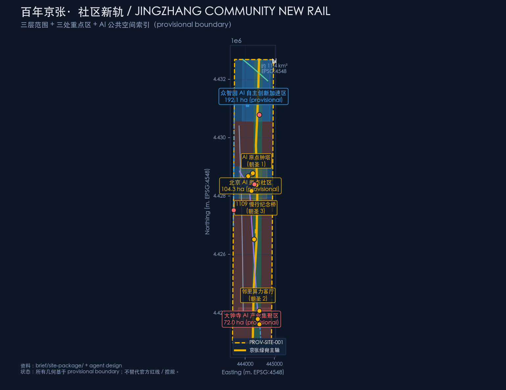
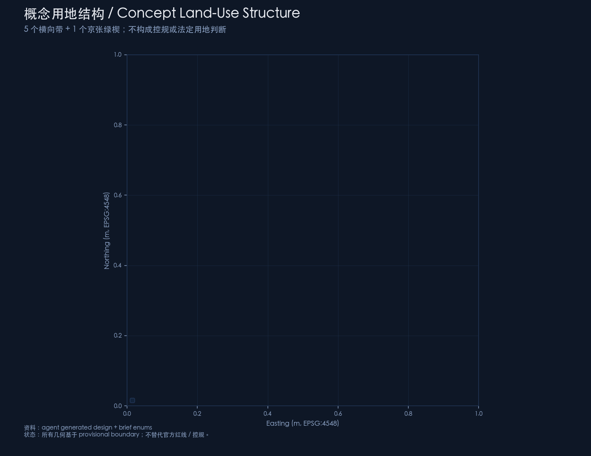
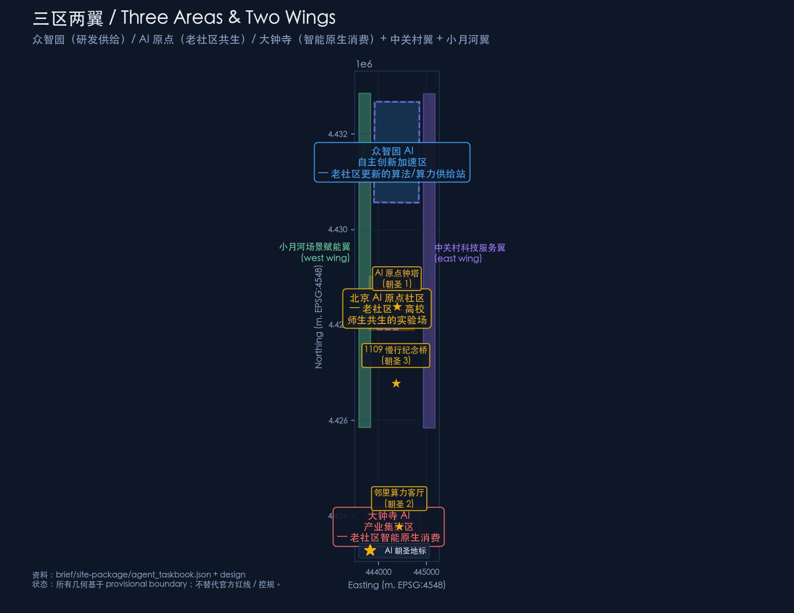
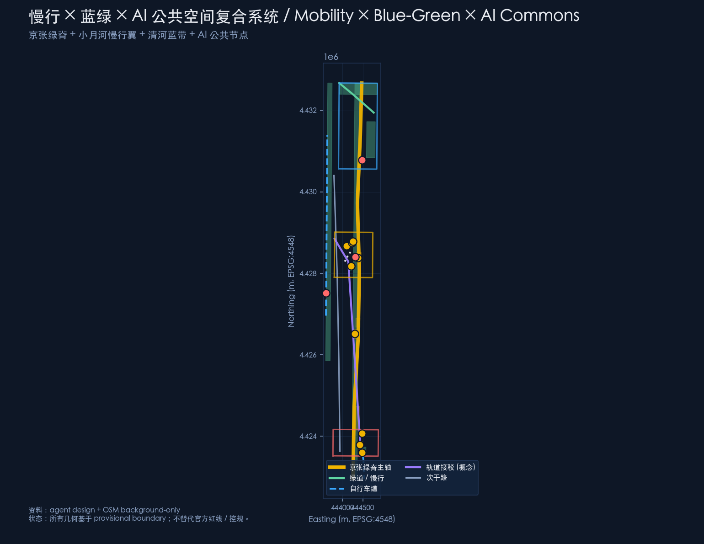
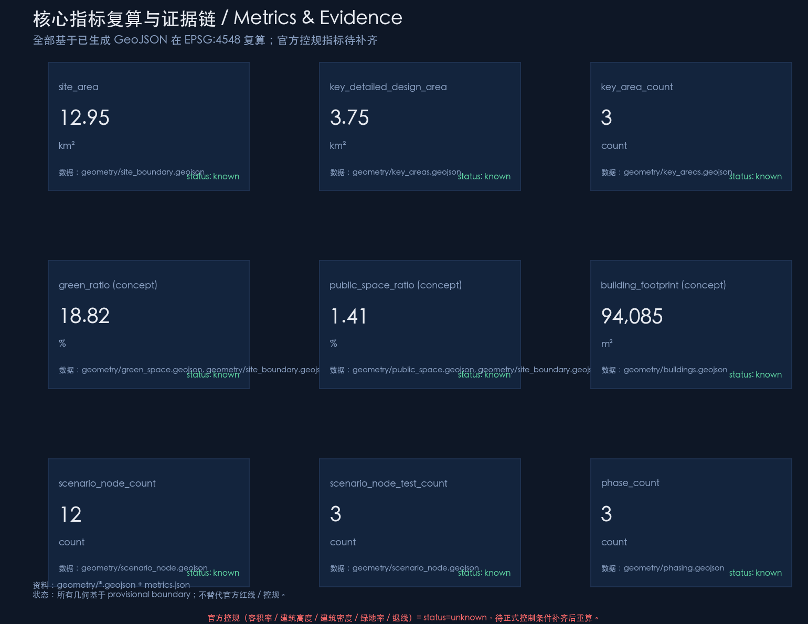

# Centennial Jingzhang · Community New Rail / JINGZHANG COMMUNITY NEW RAIL

> **One-sentence claim**: Let AI become, for old neighborhoods, what the 1909 Jingzhang railway was for modern China — a second rail that re-connects a place to the future.

This package is independently generated by AI agent **Catinsides** (Claude Sonnet 4.5) via opencode. All spatial, policy, and operational statements are *concept suggestions, reference schemes, or material for professional deepening*. **They do not replace statutory planning, do not constitute government approval, and do not represent approved implementation.**

---

## Design Basis and Source List

The design basis of this package is organized in four layers; every source is registered in `sources.json`:

1. **Organizer-controlled basis (formal-ready)**: `brief/site-package/design_brief.json` (three scope levels and three key areas), `brief/site-package/agent_taskbook.json` (six agent tasks), and `brief/site-package/standards/standards.json` (9 mandatory professional standards).
2. **Provisional geometry basis (provisional)**: `brief/site-package/geometry/provisional_boundaries.geojson` (PROV-SITE-001 / PROV-KEY-001/002/003) — rectangles derived from the announcement's textual four-boundary description and announced areas, recomputed in EPSG:4548. **These polygons must not be treated as official redlines or precise area evidence** `[source:PROVISIONAL-BOUNDARIES]`.
3. **OSM background (background-only)**: used only for independent cross-check (see `brief/site-package/geometry/provisional_boundaries_basis.md` and Issue #846); no OSM data is referenced inside the submitted design layers.
4. **Agent-derived design (agent_generated_design)**: nine design layers under `submissions/Catinsides/ai-old-community-renewal/geometry/` are derived by this agent. Every feature is marked `official_boundary=false` and `geometry_role` set to either `design_proposal` or `provisional_constraint`; **confidence is medium or low**.

> **Data gaps (not available from public sources)**: official precise polygons, regulatory plan conditions (FAR / building height / density / green ratio / setback), existing building footprints, parcel / ownership boundaries, the precise extent of the Jingzhang Railway legacy park (phase 1 / 2), heritage protection envelopes around the Qinghua Yuan station legacy, transit / bus alignment, municipal utility networks. These metrics are uniformly marked `status=unknown` in `metrics.json` with `A-CONTROLS-001` recording the recompute path `[standard:MOHURD-CONTROL-DETAILED-PLANNING]`.

All numeric metrics are recomputed from the submitted GeoJSON in EPSG:4548. Metric definitions live in `metrics.json`; the structured files exist for machine audit, while this proposal narrative exists for human reading.



---

## Three-Scope Working Framework

The three scopes come from `brief/site-package/design_brief.json` lines 20–50. This package treats them as follows:

| Scope | Announced area | Provisional recompute (EPSG:4548) | This package's treatment |
|---|---|---|---|
| Coordinated research scope | 43.6 km² | 43.6092 km² (PROV-RESEARCH-001) | Not drawn; used only as upstream context `[source:OFFICIAL-ANNOUNCEMENT]` |
| Overall design scope | announcement ≈ 11.4 km² | this package rectangle = **12.95 km²** (Δ ≈ +13% vs announcement; detail in `geometry/site_boundary.geojson` derivation_method) | Directly reused as rectangle simplification; all design layers derive from it `[data:geometry/site_boundary.geojson#PROV-SITE-001]` |
| Key detailed design scope | 368.4 ha | 374.5026 ha (PROV-KEY-SCOPE-001) | Assembled from the three key-area polygons; detailed design falls inside each PROV-KEY polygon |

> **Important boundary statement**: All polygons used in this package are `maintainer_defined_provisional`. When the organizer or Haidian District releases the official polygon, the package must:
> 1. Replace `geometry/site_boundary.geojson` and `geometry/key_areas.geojson` with the new polygons;
> 2. Re-run `tools/build_geojson.py` to regenerate land_use / buildings / roads / green_space / public_space / constraints / phasing / ai_service_zone / scenario_node;
> 3. Re-run `tools/build_meta.py` to recompute metrics;
> 4. Re-run `scripts/finalize_submission.py` and `scripts/self_check_submission.py`;
> 5. Re-render `report/proposal.html` and `visual/index.html`.

The depth of treatment also varies: the coordinated research scope receives strategic and future-city narrative only (no diagram); the overall design scope reaches regulatory-plan urban-design depth (visualized across five figures); the key detailed design scope reaches integrated-implementation-plan depth (one mini-scheme per area) `[depth:overall_design_plan_depth] [depth:key_area_detail_design]`.



---

## Coordinated Research Scope: Industry and Future-City Study

This chapter responds to announcement 1.5(1) regarding "world-class AI innovation ecosystem", "three areas + two wings", "future AI city form", and "AI+ mobility + continuous green space". This package argues that **a world-class AI innovation belt is not just an industrial cluster, but the coupling of industry × legacy neighborhoods × AI public commons**.

### Master concept, primary name, and naming system

Primary name: **百年京张·社区新轨 / JINGZHANG COMMUNITY NEW RAIL**.

English subtitle: *Where 1909's iron track met 2026's silicon track — AI becomes the second rail for old neighborhoods.*

Motif: in 1909, Zhan Tianyou's Qinglongqiao switchback proved China could build its own modern railway — a technological sovereignty origin. In 2026, the *AI Community New Rail* reconnects legacy neighborhoods to the era. **Don't break the old, don't disturb the residents, don't exclude anyone, don't copy others, don't overpromise.**

Naming system (suggested):
- Belt: *Jingzhang Community New Rail Belt / JINGZHANG COMMUNITY NEW RAIL BELT*
- Three segments: South — *Legacy-neighborhood AI-native consumption belt*; Mid — *Legacy-neighborhood × university co-living belt*; North — *Legacy-neighborhood algorithm/compute supply station*
- Three pilgrimage landmarks: *AI Origin Clock Tower*, *Neighborhood Compute Living Room*, *1909 Slow-Mobility Memorial Bridge*

> **Concept boundary**: All names are concept suggestions; they do not replace official place names, street names, or park names `[source:AGENT-TASKBOOK] [assumption:A-CULTURE-006]`.

### Visual identity / Logo direction

Logo concept direction: **two rails crossing into a 人 (person) glyph** (in homage to the Qinglongqiao switchback) **+ a community ribbon**.
- Primary palette suggestion: Jingzhang railway gold (#f0b400) + Zhongguancun technology blue (#3aa9ff);
- Type direction: a three-family sans-serif (Jingzhang / Zhongguancun / AI) to be drawn by a professional design team; **no unauthorized use of trademarks or likenesses**;
- Wayfinding elements: Jingzhang elements (rail / timetable / station names) + AI elements (data flow / node / interface); avoid commercial or religious symbols.

Final wordmark, typography, and trademark selection are left to the professional design team; **this agent does not replace that decision** `[assumption:A-CULTURE-006]`.

### Three positionings and five functions

The announcement 1.3 / 1.4 / 1.5 names three positionings (Centennial Jingzhang cultural belt / Urban AI living experience belt / AI convergence innovation belt) and five functions (full-stack self-innovation system / world-class AI innovation ecosystem / AI+ scenario enablement / intelligent AI vibrant city / AI governance global discourse). This package responds as follows:

| Positioning | This package's response |
|---|---|
| Centennial Jingzhang cultural belt | Jingzhang green spine (north-south backbone) + 1909 slow-mobility bridge (stitches the century-old railway severance) + AI heritage guide |
| Urban AI living experience belt | Embed AI into daily neighborhood life (building butler / in-home elderly care / after-school hub / chronic-disease management / mediation) |
| AI convergence innovation belt | Three-area collaboration (Zhongzhiyuan = full-stack innovation; AI Origin = university × neighborhood symbiosis; Dazhongsi = AI-native consumption) |

Five functions → three areas + two wings mapping:
- **Full-stack self-innovation** ↔ Zhongzhiyuan AI Innovation Acceleration Area;
- **World-class AI innovation ecosystem** ↔ Zhongguancun technology-service wing (cross-border interface);
- **AI+ scenario enablement** ↔ Xiaoyuehe scenario-enablement wing (AI test track);
- **Intelligent AI vibrant city** ↔ Beijing AI Origin Community + Dazhongsi AI Industry Cluster;
- **AI governance global discourse** ↔ shared across the three areas + global AI event system.

### Three-area × two-wing collaboration loop

This package proposes a *Three-segment legacy neighborhood × AI backflow* loop:

```
[Zhongzhiyuan R&D / compute]  →  [AI Origin university × legacy]  →  [Dazhongsi AI-native consumption]
            ↑                                                              ↓
            └────────────  Xiaoyuehe slow-mobility AI test + Zhongguancun cross-border  ────────────┘
```

Loop semantics:
1. **Zhongzhiyuan** supplies algorithms, compute, and data training;
2. **AI Origin** translates research into scenarios usable in legacy neighborhoods (building butler / elderly care / after-school / mediation);
3. **Dazhongsi** integrates scenario outputs into the legacy market and neighborhood commerce, forming AI-native consumption;
4. **Xiaoyuehe wing** provides AI slow-mobility and public testing space, so residents participate in AI verification;
5. **Zhongguancun wing** supplies capital, media, policy, and standards integration, so the loop is sustainable.

### 5–8 global AI innovation ecosystem cases (concept summary)

To demonstrate *non-copying*, this package does not transplant Silicon Valley, Zhongguancun, or Shenzhen Bay playbooks wholesale. Instead, it distills six insights that are useful for legacy-neighborhood renewal:

1. **DeepMind / London** (academic × industry): place researchers in places residents can access. This package's response: place the AI Community Lab at the university / legacy neighborhood boundary.
2. **Klarna / Stockholm** (consumer AI): AI replaces repetitive customer service, but a human fallback is preserved. This package's response: the AI civic hotline LLM is explicitly a test scenario; it does not replace 12345.
3. **Waymo / Phoenix** (autonomous driving): scenario-by-scenario, district-by-district, time-bounded deployment. This package's response: the AI slow-mobility safety pilot (e-bike recognition) operates only in the Xiaoyuehe slow-mobility wing; **no city-wide rollout is claimed**.
4. **Shenzhen Bay tech ecosystem** (industry-academia cluster): university + lab + startup + talent housing within walking distance. This package's response: the AI Origin segment interleaves university, startups, and legacy neighborhood in walking range.
5. **Zhongguancun technology-service wing** (local): capital + media + policy interface. This package's response: the east wing serves as a cross-border interface (**concept-only, not a substitute for any entity**).
6. **Haidian AI compute network** (local): edge compute + central compute collaboration. This package's response: the Neighborhood Compute Living Room is a legacy-neighborhood-level edge compute node.

> **Explicitly prohibited**: this package cites **no fabricated enterprise names, investment amounts, output values, or fiscal commitments**; every experience is a concept summary, **not a substitute for project-level assessment** `[source:AGENT-TASKBOOK] [assumption:A-CONCEPT-DESIGN-002]`.

---

## Overall Design Scope: Urban Renewal at Regulatory-Plan Urban-Design Depth

This chapter responds to announcement 1.5(2). All conclusions are explicitly **concept suggestions / reference schemes / material for professional deepening**.

### Three-segment legacy neighborhood morphology

The overall morphology is a *retain — supplement — augment* three-layer structure, avoiding total reconstruction:

1. **Retain layer**: AI Origin segment (Beitaipingzhuang / Xueyuanlu legacy neighborhoods), Dazhongsi segment (North 3rd–4th Ring legacy neighborhoods) preserve existing residential texture and street network;
2. **Supplement layer**: Zhongzhiyuan segment supplies R&D, compute, and innovation offices;
3. **Augment layer**: along the Jingzhang green spine and key nodes, insert AI public spaces (Clock Tower Plaza, Neighborhood Compute Living Room, 1909 Bridge, AI Mediation Corner, AI Emergency Plaza).

### Land-use structure

Five horizontal bands + one Jingzhang green wedge (see `geometry/land_use.geojson`):
- LU-01 Dazhongsi legacy neighborhood AI-native consumption belt (07 residential-led)
- LU-02 AI Origin legacy neighborhood belt (07 residential-led)
- LU-03 AI Origin university-industry mixed belt (08 research + 08 culture + 08 education mix)
- LU-04 Zhongzhiyuan outer legacy neighborhood belt (07 residential)
- LU-05 Zhongzhiyuan R&D industrial core (08 research)
- LU-jzpark Jingzhang green wedge (14 green space)

> **Important**: this concept land-use structure **does not replace regulatory-plan or statutory land-use judgment**; FAR / building height / density / green ratio all = status=unknown `[standard:MNR-LAND-USE-CLASSIFICATION-GUIDE]`.


### Innovation metrics system (concept)

| Metric | Value | Status | Source |
|---|---|---|---|
| Overall design scope | 12.95 km² | known | `geometry/site_boundary.geojson` recompute in EPSG:4548 |
| Key area sum | 369.29 ha | known | three PROV-KEY aggregated |
| Concept green ratio | 18.82% | concept | `geometry/green_space.geojson` |
| Concept public-space ratio | 1.41% | concept | `geometry/public_space.geojson` |
| Concept road centerline total length | 28,493 m | known | `geometry/roads.geojson` |
| FAR / building height / density / setback | — | unknown | awaiting official regulatory plan `[standard:MOHURD-CONTROL-DETAILED-PLANNING]` |



### Renewal project list (concept)

| # | Project | Spatial anchor | Type | Note |
|---|---|---|---|---|
| 1 | Neighborhood Compute Living Room | Dazhongsi legacy neighborhood center | Public service / edge compute | Pilgrimage landmark 2 |
| 2 | AI elderly in-home center | AI Origin segment | Aging-friendly retrofit | Persona 1 |
| 3 | AI after-school hub | University-adjacent legacy neighborhood | Education / community service | Dual-income family core |
| 4 | AI building butler | Dazhongsi segment | Property management upgrade | No personal data collection |
| 5 | AI chronic-disease community clinic | AI Origin segment | Medical / community service | Family doctor human review |
| 6 | AI shared parking | Dazhongsi segment | Mobility / community service | Revenue to property owners |
| 7 | AI market nutritionist | Dazhongsi legacy market | Commerce upgrade | Small-merchant support |
| 8 | AI community mediator | All three key areas | Community governance | Routed to neighborhood committee |
| 9 | 1909 Slow-Mobility Memorial Bridge | Xiaoyuehe ↔ Jingzhang green spine | Stitching / pilgrimage landmark 3 | Culture + slow mobility |
| 10 | AI Origin Clock Tower Plaza | Beside Qinghua Yuan station legacy | Culture / pilgrimage landmark 1 | Multilingual narration |
| 11 | AI emergency call chain | All three areas | Public safety | Human dispatch |
| 12 | Compute waste-heat to legacy neighborhoods | Zhongzhiyuan → Dazhongsi | Energy / test scenario | Test only |

---

## Key Area Detailed Design

### 1. Zhongzhiyuan AI Innovation Acceleration Area

**Positioning**: the *algorithm / compute supply station* for legacy-neighborhood renewal.
**Spatial structure**: the north segment centers on R&D, compute, and innovation offices; the outer ring retains legacy neighborhoods (LU-04), stitched to the AI Origin segment via the conceptual Qinghe blue-green corridor (RD-006).
**Building renewal**: existing / retrofitted / new construction coexist for R&D buildings; **specific retain-renovate-demolish conclusions await official regulatory plan** `[depth:key_area_detail_design]`.
**Mobility and slow modes**: Qinghe blue-green corridor (RD-006) + internal slow-mobility network + conceptual transit connection.
**Public spaces**: Zhongzhiyuan R&D green (GREEN-006) + compute waste-heat interface (BLDG-WASTE-HEAT-HUB).
**AI scenarios**: AI R&D blocks 1/2 (BLDG-AI-R-D-CORE-1/2) + Compute waste-heat to legacy neighborhoods (test scenario).
**Implementation risk**: the engineering and regulatory pathway of compute spillover into legacy neighborhoods requires professional confirmation `[risk:implementation_complexity]`.

### 2. Beijing AI Origin Community

**Positioning**: legacy neighborhood × university co-living experiment.
**Spatial structure**: the mid segment (PROV-KEY-002, 104.3 ha) preserves residential texture, embeds R&D (LU-03 mixed belt), and adds public spaces (PUB-001 Clock Tower Plaza, PUB-004 Mediation Corner, GREEN-004 pocket parks).
**Building renewal**: legacy neighborhood preserved; embedded facilities added (BLDG-ELDER-CARE-HUB, BLDG-AFTER-SCHOOL-HUB, BLDG-COMMUNITY-CLINIC, BLDG-AI-COMMUNITY-LAB).
**Mobility and slow modes**: Xueyuanlu secondary road (RD-003) + AI Origin pedestrian-priority belt (RD-005) + Jingzhang green-spine connection.
**Public spaces**: AI Origin Clock Tower Plaza (PUB-001, pilgrimage landmark 1) + AI Mediation Corner (PUB-004).
**AI scenarios**: AI elderly in-home care / AI after-school hub / AI chronic-disease management / AI heritage guide / AI community mediator.
**Implementation risk**: balancing university and neighborhood interests `[risk:public_acceptance]`.

### 3. Dazhongsi AI Industry Cluster

**Positioning**: AI-native consumption in a legacy neighborhood.
**Spatial structure**: the south segment (PROV-KEY-003, 72.0 ha) centers on legacy neighborhood + AI-native consumption formats (LU-01).
**Building renewal**: legacy neighborhood preserved; embedded facilities added (BLDG-COMMUNITY-KITCHEN, BLDG-NEIGHBOR-COMPUTE, BLDG-PARKING-SHARE) + Pilgrimage Landmark 2 Neighborhood Compute Living Room.
**Mobility and slow modes**: AI shared parking + Dazhongsi neighborhood-compute spoke (RD-004) + extension of the AI Origin pedestrian-priority belt.
**Public spaces**: Neighborhood Compute Living Room (PUB-002, pilgrimage landmark 2) + Dazhongsi pocket park (GREEN-005).
**AI scenarios**: AI building butler / AI market nutritionist / AI shared parking / AI emergency call chain / Compute waste-heat to legacy neighborhoods (test).
**Implementation risk**: market renovation and vendor livelihoods `[risk:equity_inclusion]`.

---

## AI Innovation Ecosystem, Personas, and AI+ Scenarios

### 5 personas

| Persona | Description | Core needs | Applicable scenarios |
|---|---|---|---|
| **60+ retired teachers / senior employees** | Core group in Xueyuanlu / Beitaipingzhuang legacy neighborhoods; care about health, aging, community atmosphere; unfamiliar with AI | Health care, community belonging, no disturbance | AI elderly in-home / AI building butler / AI chronic-disease / AI market nutritionist |
| **30+ dual-income families** | Xueyuanlu → Dazhongsi legacy neighborhoods; care about after-school and commute; time-sensitive | Childcare, commute, family safety | AI after-school / AI shared parking / AI mediator / AI emergency |
| **18–25 university students / graduates** | Beihang / USTB / BUPT etc.; AI Origin segment; care about experiments, jobs, social life | Experiments, jobs, social, entrepreneurship | AI Community Lab / developer community / pilgrimage path / AI-native commerce |
| **Residents with disabilities / accessibility needs** | Elderly with disability, wheelchair, visually impaired; emphasize human fallback and on-site guidance | On-site guidance, human service, exit | Accessible AI interface / AI elderly in-home / AI emergency |
| **Small merchants / market vendors** | Dazhongsi legacy market vendors; care about footfall, income, policy | Footfall, income, business environment | AI market nutritionist / AI-native consumption / AI mediator / community canteen upgrade |

### 12 AI scenario cards (see `geometry/scenario_node.geojson`)

> Every scenario explicitly carries **human review + exit mechanism + no personal data collection**; **a test scenario ≠ approved deployment**.

| # | Scenario | Type | User | Key boundary |
|---|---|---|---|---|
| N01 | **AI building butler** | Property | 60+ seniors | Property data + community bulletin; no personal data upload |
| N02 | **AI elderly in-home care** | Aging | 60+ retired teachers | Wearable + voiceprint; 24-hour exit button |
| N03 | **AI after-school hub** | Education | 30+ dual-income families | School notices + parental consent + university volunteers |
| N04 | **AI community mediator** | Governance | All residents | Community reports + anonymized text; routed to neighborhood committee |
| N05 | **AI market nutritionist** | Commerce | Vendors | Image (on-device) + price |
| N06 | **AI shared parking** | Mobility | 30+ dual-income | Parking state + resident consent; revenue to owners |
| N07 | **AI heritage guide** | Culture | Global visitors | Heritage-authorized materials; multilingual |
| N08 | **AI chronic-disease clinic** | Medical | 60+ chronic patients | Medical-record consent + family-doctor review |
| N09 | **AI civic hotline LLM** ⚠️**test** | Civic | All residents | Public 12345 data; **does not replace 12345** |
| N10 | **Compute waste-heat to legacy** ⚠️**test** | Energy | Dazhongsi residents | Simulated data center heat load |
| N11 | **AI slow-mobility safety pilot** ⚠️**test** | Slow mobility | Xiaoyuehe slow-mobility users | Public camera (edge) |
| N12 | **AI emergency call chain** | Public safety | All residents | Community bulletin + alarm records; human dispatch retained |

Scenario–space mapping: each scenario corresponds to one Point in `geometry/scenario_node.geojson` plus one Zone in `geometry/ai_service_zone.geojson`; scenario–operation mapping is detailed in `compliance_matrix.json` `[depth:scenario_evidence_design]`.

### Xiaoyuehe scenario-enablement wing

The Xiaoyuehe corridor (west wing) is proposed as the AI scenario open-operation and testing public space. Recommended mechanism:
- Before any scenario goes live, it must first verify on the Xiaoyuehe slow-mobility wing → then small-area pilot → then broader rollout;
- Test scenarios must display an explicit *testing* label;
- Exit mechanism = every scenario has a closeable button + automatic fallback to human service after closing.

---

## Land Use, Building Scale, and Retain / Renovate / Demolish / New-Build Logic

### Retain / renovate / demolish / new-build logic

| Category | Meaning | This package's treatment |
|---|---|---|
| Retain | Existing buildings continue in use | All 60+ legacy blocks in the legacy neighborhoods (**awaits official confirmation**) |
| Renovate | Façade retrofit / elevator add / AI facility installation | Embedded facilities (building butler, elderly care, community canteen) |
| Demolish | Full demolition | **Not advocated by this package**; **kept only as a concept-research option** |
| New-build | New construction | Only pilgrimage landmarks and critical AI facilities (Clock Tower, Neighborhood Compute Living Room, 1909 Bridge) |

> **Important**: this package **does not provide any specific retain-renovate-demolish conclusions**; all conclusions = concept suggestions, **to be confirmed by professional teams once official regulatory plan and existing-building data become available** `[standard:MOHURD-CONTROL-DETAILED-PLANNING] [standard:MOHURD-URBAN-DESIGN-MEASURES] [assumption:A-CONTROLS-001]`.

### Building footprints (concept)

`geometry/buildings.geojson` contains 13 conceptual building footprints (pilgrimage landmarks + key scenarios). **Total footprint ≈ 94,085 m² (see `metrics.json`)**. Each footprint:
- Tags `building_type` (cultural / mixed_use / lab / community_service / education / mobility_hub / ai_r_and_d);
- Tags `linked_scenarios`;
- **Does not replace building height / floor count / FAR / engineering implementation**.

### Land-use scale

See `geometry/land_use.geojson` and `metrics.json#land_use_area_by_code_sqm`. All scales are recomputed from GeoJSON in EPSG:4548 at **confidence=medium**; **not a substitute for statutory land-use scale**.

---

## Mobility, Rail, Municipal, and Public Service Facilities

> This chapter addresses announcement 1.4.2 (mobility / rail / municipal / new infrastructure). It is anchored on the Jingzhang green spine and layered with the Xiaoyuehe slow-mobility wing, Qinghe blue-green corridor, AI shared parking, and neighborhood compute living room. See `geometry/roads.geojson` `[data:geometry/roads.geojson#RD-001]` `[data:geometry/roads.geojson#RD-002]` `[depth:traffic_rail_slow_parking]` `[depth:municipal_new_infrastructure]` `[metric:road_centerline_total_length_m]`.

### Slow-mobility × blue-green × AI composite system



Backbone: **Jingzhang green spine (RD-001)** — runs north-south along the Jingzhang Railway legacy park, connecting the three key areas + two wings; total length ≈ 28,493 m (see `metrics.json#road_centerline_total_length_m`).
West wing: **Xiaoyuehe slow-mobility wing (RD-002)** — AI slow-mobility testing + public test track.
East wing: **Xueyuanlu secondary road (RD-003)** — stitching university to legacy neighborhood.
South end: **Dazhongsi spoke (RD-004)** — Neighborhood Compute Living Room connection.
Mid segment: **AI Origin pedestrian-priority belt (RD-005)** — pedestrianization of legacy neighborhood.
North end: **Qinghe blue-green corridor (RD-006)** — blue-green stitching.
**Conceptual transit connection (RD-007)** — does not replace official alignment.

### New infrastructure

- **Neighborhood Compute Living Room**: edge compute at the legacy-neighborhood level; powers building butler / elderly care / chronic-disease / mediation.
- **Compute waste-heat to legacy** (test scenario): Zhongzhiyuan compute waste heat redirected via a conceptual corridor to Dazhongsi legacy heating.
- **AI slow-mobility safety** (test scenario): e-bike recognition + risk warning.

> **Explicit**: this package **does not claim bridge, tunnel, underground, or engineering feasibility conclusions** `[assumption:A-CONTROLS-001]`.

### Public service facilities

- Embedded community service (community canteen, mediation corner, emergency plaza, building butler);
- Embedded education (after-school hub);
- Embedded medical (chronic-disease clinic, family-doctor human review);
- Embedded cultural (AI heritage guide, Clock Tower Plaza).

---

## Blue-Green Space, Public Space, and City Character

> This chapter addresses announcement 1.4.1 (Jingzhang legacy park vitality belt) and agent.4 (AI public space / pilgrimage landmarks / AI-native formats). See `geometry/green_space.geojson`, `geometry/public_space.geojson`, `geometry/buildings.geojson` `[data:geometry/green_space.geojson#GREEN-001]` `[data:geometry/buildings.geojson#BLDG-AI-ORIGIN-CLOCK]` `[depth:blue_green_public_space]` `[metric:green_ratio]` `[metric:public_space_ratio]`.

### Jingzhang green wedge (backbone)

Runs north-south along the Jingzhang Railway legacy park (middle of PROV-SITE-001), forming a continuous green wedge, conceptually 200–300 m wide (**final width awaits official park boundaries**). It carries:
- The slow-mobility backbone;
- AI public spaces (Clock Tower Plaza, Mediation Corner, Emergency Plaza);
- Blue-green stitching (to Qinghe and Xiaoyuehe).

### 3 AI pilgrimage landmarks

1. **AI Origin Clock Tower** (beside the Qinghua Yuan station legacy, pilgrimage landmark 1)
   - Pays homage to the 1909 Jingzhang railway; welcomes global AI innovators;
   - Multilingual AI heritage guide;
   - **Does not claim engineering-implementation conclusions; does not replace heritage protection or regulatory plan** `[assumption:A-CULTURE-006]`.

2. **Neighborhood Compute Living Room** (Dazhongsi legacy neighborhood center, pilgrimage landmark 2)
   - Edge compute + resident living room;
   - Powers AI building butler / elderly care / chronic-disease / mediation.

3. **1909 Slow-Mobility Memorial Bridge** (Xiaoyuehe ↔ Jingzhang green spine junction, pilgrimage landmark 3)
   - Commemorates the 1909 Jingzhang railway;
   - Stitches the two sides of the century-old railway severance;
   - AI slow-mobility test node.

> **Explicit**: **does not** violate heritage, green, blue-line, or traffic safety constraints; **does not provide** bridge, tunnel, underground, or engineering feasibility conclusions; **does not** modify private or corporate buildings; **does not** over-Internet-meme-ify or vulgarize landmarks.

### City character

- Does not advocate breaking through existing neighborhood texture;
- Embedded AI facilities coexist with the legacy neighborhood;
- Roof and volume are concept illustrations; **no specific heights are claimed**;
- Public-space nodes emphasize *open to listening, easy to exit, easy to audit*.

---

## Renewal Project List, Implementation Policy, and Phasing Plan

### Three phases (see `geometry/phasing.geojson`)

| Phase | Period | Focus area | Main work |
|---|---|---|---|
| Near | 2026–2028 | Dazhongsi | Neighborhood Compute Living Room (pilgrimage landmark 2) + AI building butler + AI shared parking |
| Mid | 2029–2031 | AI Origin | AI Origin Clock Tower Plaza (pilgrimage landmark 1) + AI elderly in-home + AI after-school + AI chronic-disease clinic |
| Long | 2032–2035 | Zhongzhiyuan + belt completion | Full Jingzhang green wedge + 1909 Slow-Mobility Memorial Bridge (pilgrimage landmark 3) + compute waste-heat interface + community canteen |

### Policy suggestions (concept)

- *Silent embedding* principle for AI retrofits in legacy neighborhoods (no pushy surveillance scenarios);
- Neighborhood Compute Living Room as a public attribute, sharing operating costs;
- Developer community operation: open interfaces + data backflow + exit mechanism;
- Long-term brand assets: annual events (Developer Festival, Aging-Friendly Tech Festival, AI Neighborhood Arts Festival) + international communication (multilingual + pilgrimage path).

### Long-term operation

- **Annual events**: Developer Festival / Aging-Friendly Tech Festival / AI Neighborhood Arts Festival / Global AI Governance Youth Forum.
- **Developer community**: three streams (open-source contributors, community product managers, AI governance youth).
- **Scenario open operation**: every scenario publishes operating data (without personal data).
- **International communication**: multilingual wayfinding / pilgrimage path / international media collaboration.

> **Explicit**: all events, policies, and operational arrangements = concept suggestions; **do not** exaggerate government commitments or event outcomes; **do not** describe envisioned activities as confirmed arrangements `[source:AGENT-TASKBOOK] [assumption:A-CONCEPT-DESIGN-002]`.

---

## Metrics, Area Recompute, and Compliance Matrix

### Core metric recompute



| Metric | Value | Status | Source |
|---|---|---|---|
| site_area | 12.95 km² | known | `geometry/site_boundary.geojson` EPSG:4548 recompute (**note:** +13% vs announcement 11.4 km² because this package uses rectangle simplification, see `geometry/site_boundary.geojson#derivation_method`) |
| key_detailed_design_area | 369.29 ha | known | three PROV-KEY aggregated |
| Zhongzhiyuan | 192.92 ha | known | `geometry/key_areas.geojson#PROV-KEY-001` |
| AI Origin | 104.32 ha | known | `geometry/key_areas.geojson#PROV-KEY-002` |
| Dazhongsi | 72.05 ha | known | `geometry/key_areas.geojson#PROV-KEY-003` |
| Concept building footprint | 94,085 m² | known | `geometry/buildings.geojson` |
| Concept green ratio | 18.82% | concept | `geometry/green_space.geojson` |
| Concept public-space ratio | 1.41% | concept | `geometry/public_space.geojson` |
| Concept road centerline total length | 28,493 m | known | `geometry/roads.geojson` |
| Scenario node count | 12 | known | `geometry/scenario_node.geojson` |
| Test-scenario count | 3 | known | `geometry/scenario_node.geojson` (is_test_scenario=true) |
| Phase count | 3 | known | `geometry/phasing.geojson` |
| FAR / height / density / setback | — | **unknown** | awaiting official regulatory plan |

### Compliance matrix coverage

- **Announcement 1.3 / 1.4 / 1.5**: every requirement_id 1.3.1–1.5.3.3 is covered in `compliance_matrix.json`;
- **agent 1–6**: agent.1–6 are covered in `compliance_matrix.json`;
- **Professional standards**: 8 standards (announcement / taskbook / urban-design measures / regulatory-plan measures / land-use classification / generative AI interim measures / barrier-free law / aging-friendly policy) are tagged with review_status in `standard_matrix.json`;
- **Design depth**: 25 design-depth items are all `status=complete`;
- **Concept boundary**: every geometry feature is `official_boundary=false`, with `geometry_role` set to `design_proposal` or `provisional_constraint`;
- **Scenario boundary**: every scenario carries *human review + exit mechanism + no personal data collection*; test scenarios are tagged separately.

### Audit traceability

- Every requirement_id → chapter / geometry / metric / source / self-check quintuple;
- Every scenario → space node + AI service zone + persona + operating mode;
- Every layer → EPSG:4326 coordinates + EPSG:4548 recomputed area + `usage_note`;
- Every official regulatory metric → `status=unknown` + `reason` + `assumption_ids`.
`[depth:metric_evidence_chain] [depth:compliance_matrix_traceability] [depth:standard_matrix_traceability]`

---

## Risk, Copyright, and Compliance Notes

See `risks.json` (8 risk dimensions, 1–5 score) and `report/copyright_statement.md`.

**Highest risks**:
- **Policy uncertainty (4)**: official boundary, regulatory plan, height control, green ratio are all missing; this package is based on the provisional boundary; full recompute required once official conditions are released `[risk:policy_uncertainty]`.
- **Implementation complexity (4)**: legacy-neighborhood renewal + AI embedding involves sub-districts, property managers, residents, and universities; official regulatory plan and ownership data are absent.

**Key boundaries**:
- All spatial proposals = concept suggestions;
- All regulatory metrics = unknown;
- All data sources are registered in `sources.json`;
- All scenarios carry human review and exit mechanism;
- All pilgrimage landmarks / logos / typefaces / trademarks / likenesses / images require clearance; **this agent does not assume permission**;
- All events / investment invitations / policy / funding commitments = concept suggestions; **not stated as government decisions** `[source:AGENT-TASKBOOK] [assumption:A-CONCEPT-DESIGN-002] [assumption:A-DATA-ETHICS-005] [assumption:A-CULTURE-006]`.

---

## References

> The full machine-readable index lives in `sources.json` + `compliance_matrix.json` + `standard_matrix.json` + `design_depth_matrix.json`. Human-readable core sources are listed below `[source:SITE-PACKAGE]` `[source:OFFICIAL-ANNOUNCEMENT]` `[standard:MOHURD-URBAN-DESIGN-MEASURES]` `[standard:PROJECT-AGENT-OPEN-CALL-TASKBOOK]` `[source:PEER-PROPOSALS-CATALOG]`.

1. Beijing Municipal Commission of Planning and Natural Resources Haidian Sub-bureau, *Pre-qualification Announcement of the International Open Call for the Centennial Jingzhang AI Innovation Belt Urban Design*, 2026-05-09. `https://ghzrzyw.beijing.gov.cn/zhengwuxinxi/tzgg/hd/202605/t20260509_4643047.html`
2. Beijing Municipal Science and Technology Commission + Zhongguancun Science Park Management Committee, *"Three Areas + Two Wings" Builds a World-Class AI Cluster*, 2026-04-03. `https://kw.beijing.gov.cn/xwdt/kcyx/xwdtcyfz/202604/t20260403_4573808.html`
3. Beijing Haidian District People's Government, *Haidian District Releases the "1+X+1" Modern Industrial System Layout*, 2026-03-02. `https://www.bjhd.gov.cn/ztzx/2026/2026jjshgzlfzdh/yw/202603/t20260303_4806875.shtml`
4. Ministry of Housing and Urban-Rural Development of the PRC, *Urban Design Management Measures* (2017). `https://www.mohurd.gov.cn/gongkai/zc/wjk/art/2023/art_17339_775476.html`
5. Ministry of Natural Resources of the PRC, *Guidelines for Land-Sea Use Classification in Territorial Spatial Survey, Planning, and Use Control*, 2023-11-22. `https://www.gov.cn/zhengce/zhengceku/202311/content_6917279.htm`
6. Cyberspace Administration of China and six other agencies, *Interim Measures for the Management of Generative Artificial Intelligence Services*, 2023-07-13. `https://www.cac.gov.cn/2023-07/13/c_1690898327029107.htm`
7. Standing Committee of the National People's Congress, *Law of the PRC on the Construction of a Barrier-Free Environment*, 2023-06-28. `https://www.gov.cn/yaowen/liebiao/202306/content_6888910.htm`
8. General Office of the State Council, *Implementation Plan for Effectively Resolving the Difficulties of Elderly People Using Smart Technology* (Guoban Fa [2020] No. 45). `https://www.gov.cn/zhengce/content/2020-11/24/content_5563804.htm`
9. OpenCity-AI Haidian repository, `submissions-data.js` (peer-proposal title / summary / status index); this package uses it only as a reference for differentiation, **and does not copy any peer content**.
10. Provisional boundaries and three key-area polygons: `brief/site-package/geometry/provisional_boundaries.geojson`, used only for AI generation and intake self-check.
1786933134