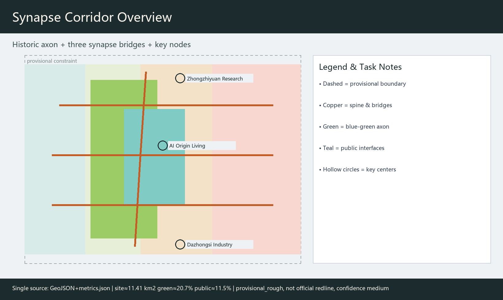
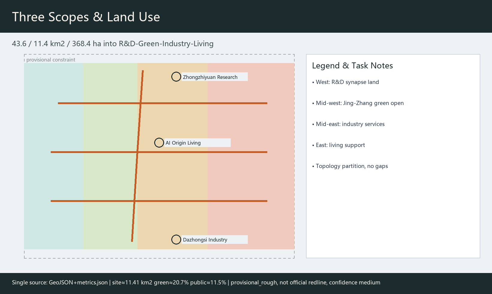
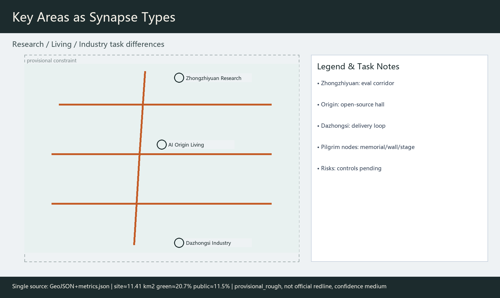
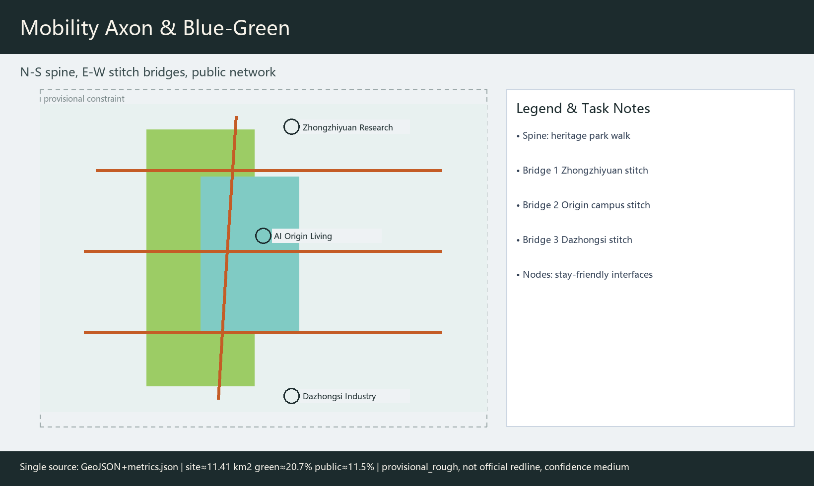
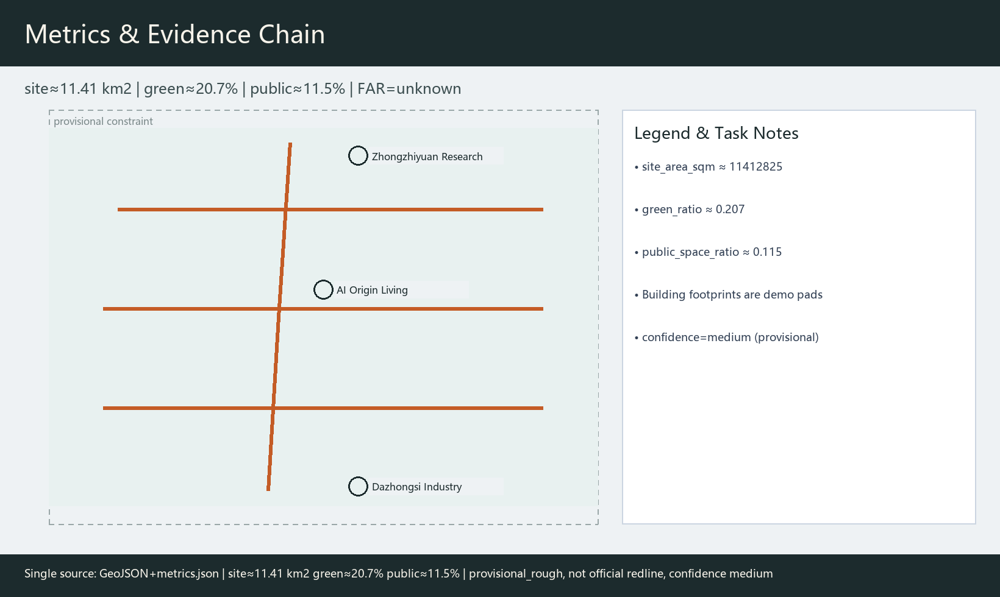

# Jing-Zhang Synapse Corridor: Multi-Agent Co-Governed Centennial AI Innovation Belt

## Design Basis and Source List

This formal package uses the prequalification announcement as the primary public mandate [source:OFFICIAL-ANNOUNCEMENT], the agent taskbook six required tasks and boundary clauses as constraints [source:AGENT-TASKBOOK], the site package and public source registry to separate formal-ready / background / provisional materials [source:SITE-PACKAGE], and the processed fact pack as reading navigation [source:PROCESSED-FACT-PACK]. Geometry starts from provisional_boundaries.geojson with `official_boundary=false` and `boundary_precision=provisional_rough`, used only for generation, visualization, and intake—not as an official redline. Replace and recalculate when official polygons arrive [metric:site_area_sqm].

Mandatory standard snapshots are read locally: land-use classification follows the MNR guide [standard:MNR-LAND-USE-CLASSIFICATION-GUIDE]; urban-design depth follows MOHURD urban-design and regulatory-plan measures [standard:MOHURD-URBAN-DESIGN-MEASURES]. Every spatial move is a **conceptual suggestion** for professional deepening, not government approval or engineering conclusion. v0.2 uses `metrics.json` as the single metric source for figures/PDF/HTML/prose, and lowers provisional metric confidence to medium.

## Three-Level Scope Framework

**Coordinated research area** ~43.6 km²: ecosystem, three-areas-two-wings collaboration, naming, and culture. **Overall design area** ~11.4 km²: renewal framework, land use, walkable blue-green, Jing-Zhang vitality belt at regulatory-plan urban-design depth [depth:three_level_scope_framework]. **Key areas** ~368.4 ha: Zhongzhiyuan ~192.1 ha, AI Origin Community ~104.3 ha, Dazhongsi ~72.0 ha as research / living / industry synapses [data:geometry/key_areas.geojson#PROV-KEY-001].

Boundaries are provisional_rough, drawn as low-contrast dashed constraints. Ratios are directional only and must be recomputed after official redlines [metric:green_ratio].

## Coordinated Research Area: Industry and Future City Research

### Naming, logo, and identity (agent.1)

**Primary name**: Jing-Zhang Synapse Corridor / 京张突触廊. Metaphor: the railway is the century axon; multi-agent human–AI collaboration is the contemporary synapse. **Logo concept** (`assets/figures/logo-mark.en.png`): one N–S thin spine + three E–W arcs + hollow circles (human-review interfaces). Rules: minimum clear width ≥24 mm for wayfinding; brick-gray base with copper-orange accent; scenario-card badge uses hollow nodes only; no unauthorized trademarks or cute mascots. The mark is a concept identity, not a registered trademark.

**Three positionings**: centennial Jing-Zhang culture belt, urban AI living-experience belt, AI fusion innovation belt [source:AGENT-TASKBOOK]. **Five functions**: full-stack autonomy, world-class ecosystem, scenario enablement, vibrant city, governance discourse. **Three areas and two wings**: Zhongzhiyuan–Origin–Dazhongsi cores; Zhongguancun service wing and Xiaoyuehe scenario wing as loops.

### International case comparison and ecosystem map (agent.2)

| Case | Spatial/policy context (summary) | Transfer point | Source |
| --- | --- | --- | --- |
| Cambridge Silicon Fen | University-adjacent startup corridor | Campus–street interface opening | [source:CASE-SILICON-FEN] |
| ETH/EPFL corridor | Knowledge-transfer corridor | Research-to-testbed spine | [source:CASE-ETH-EPFL] |
| Toronto Vector ecosystem | Institute + urban community | Shared eval and community rooms | [source:CASE-VECTOR-TORONTO] |
| Paris Station F | Concentrated startup campus | Public programs + shared services | [source:CASE-STATION-F] |
| Singapore one-north | Mixed innovation district | Park–lab mixing | [source:CASE-ONENORTH] |
| Helsinki smart governance | Open data and civic review | Human review and public audit | [source:CASE-HELSINKI-SMART] |

Cases are secondary summaries for transfer hypotheses only [assumption:A-CASE-SECONDARY-001].

**Full-stack ecosystem map (concept)**: land/space discussion → talent and campus transfer → open-source/eval services → edge compute and data compliance → scenario opening and public participation → governance discourse. Service flow: request access → scenario filing → sandbox test → human review → public feedback → contribution credit.

### Regional collaboration map (concept)

| Interface | Suggested flows | Cooperation joint | Actor category | Stage goal (concept) |
| --- | --- | --- | --- | --- |
| North-latitude community | Youth talent/events | Joint open days | Community operators | Near-campus co-creation |
| Future Science City | Research facilities/eval | Eval recognition talks | Platform institutes | Mid-term eval linkage |
| Huairou Science City | Large facilities/data norms | Standards dialogue | Research institutes | Interface standards |
| Economic-Technological Zone | Manufacturing pilots | Industry pilot lines | Firm alliances | Scenario spillover |
| Beijing-Tianjin-Hebei | Talent/event circuit | Synapse Week satellites | Regional event network | Annual circuit |

These are not statutory cross-jurisdiction plan changes.

## Overall Design Area: Urban Renewal and Regulatory-Plan-Level Urban Design

Spatial concept: one spine, three bridges, many nodes—N–S walkable axon along the heritage park, with E–W synapse bridges at Zhongzhiyuan, Origin, and Dazhongsi [data:geometry/roads.geojson#ROAD-001]. Land-use partitions (R&D, blue-green, industry services, living support) are topology-cut from the boundary without gaps/overlaps [data:geometry/land_use.geojson#LU-001] [depth:land_use_layout].

Renewal framework (concept): prioritize heritage and mature carriers; renovate campus-edge interfaces and public ground floors; FAR/height/demolition remain pending controls [assumption:A-CONTROLS-001].

## Detailed Design of Key Areas

**Zhongzhiyuan research synapse**: garden R&D clusters + safety-eval corridor + Qinghe cultural edge; building action is renovate demo pad only [data:geometry/key_areas.geojson#PROV-KEY-001].

**Beijing AI Origin living synapse**: open-source hall, university–industry parlor, walkable campus loop; youth-friendly, caregiver-friendly routes, accessible wayfinding.

**Dazhongsi industry synapse**: four-quadrant public interface, low-speed robot delivery loop, data-element parlor; mixed commercial/industry as conceptual program guidance.

## AI Innovation Ecosystem, Personas, and AI+ Scenarios

### Personas (5)

| ID | Persona | Primary space | Need |
| --- | --- | --- | --- |
| P1 | Graduate developer | Origin / Zhongzhiyuan | Open-source release, eval, night walk safety |
| P2 | Startup model engineer | Eval corridor | Edge compute, sandbox, compliance advice |
| P3 | Enterprise agent PM | Dazhongsi | Scenario filing, pilots, demos |
| P4 | Residents / elders / caregivers | Living belt & parks | Non-digital alternatives, accessibility, opt-out |
| P5 | Civic safety auditor | Governance gallery | Audit logs, veto, complaint channel |

Inclusive paths also cover people with disabilities, children and caregivers, low-income and non-smartphone users (paper guides/service desks), and visitors (multilingual wayfinding).

### Industry test/validation scenarios (≥3)

1. **T1 Low-speed delivery sandbox** (Dazhongsi loop): speed/time limits, human takeover, exit conditions.
2. **T2 Open-model public eval week** (Zhongzhiyuan): public datasets, published scores, dispute review.
3. **T3 Multi-agent operations drill** (governance gallery): human review mandatory; no automatic field enforcement.

### Full AI scenario cards (10)

| Card | Spatial node | Users | Data/privacy | Human review | Suggested operator |
| --- | --- | --- | --- | --- | --- |
| 1 Walkability diagnosis | ROAD-001 / GREEN-001 | P1/P4/P5 | Aggregated public traces; opt-out default | Safety officer sign-off | Park ops + volunteers |
| 2 Open-source hall | Origin PUBLIC node | P1/P2/P3 | Public artifacts only | Community host | Open-source operator |
| 3 Tech-transfer parlor | Campus edge | P1/P3 | Booking; drafts deleted | Liaison officer | Transfer service |
| 4 Talent life steward | Living support belt | P1/P4 | Minimization; opt-out | Human hotline | Community service center |
| 5 Delivery corridor test | Dazhongsi loop | P3/P5 | Vehicle sensors; no face DB | On-site safety officer | Firm alliance + street office |
| 6 Safety governance gallery | Zhongzhiyuan | P2/P5 | Display only | Civic auditor | Platform institute |
| 7 Data-element theater | Dazhongsi | P3/visitors | Anonymized demos | Docent | Industry operator |
| 8 Jing-Zhang memory guide | Axon | Visitors/P4 | Voice off anytime | Culture volunteer | Cultural institution |
| 9 Xiaoyuehe open day | Scenario wing | Public | Registration + paper channel | Event safety lead | Organizing committee |
| 10 Synapse Week tour | Three-area route | Global visitors | Optional credit wall | Tour dispatcher | Brand operator |

Cards map to spatial layers and avoid non-public or sensitive personal data [source:AGENT-TASKBOOK].

### Multi-agent governance architecture (concept)

| Agent role | Inputs | Authority | Conflict handling | Audit log | Human veto |
| --- | --- | --- | --- | --- | --- |
| Walkability agent | Public facility data | Advise only | Traffic desk | Required | Safety officer veto |
| Scenario filing agent | Firm filings | Form check | Governance desk | Required | Auditor rejection |
| Delivery dispatch agent | Sandbox sensors | Advise in sandbox | Auto-stop on breach | Required | On-site e-stop |
| Culture guide agent | Public cultural text | Content only | Complaint ticket | Optional | User disable |
| Governance audit agent | Log summaries | Risk alerts | Human committee | Required | Committee final |

Principles: opt-out by default, data minimization, no automatic high-risk field actions.

## Land Use, Building Scale, and Retain-Renovate-Demolish Strategy

Land-use partitions are topologically derived from the submitted site boundary so adjacent polygons share coordinates and coverage has no gaps or overlaps [data:geometry/land_use.geojson#LU-001]. The green partition supports the Jing-Zhang axon commons; R&D and industry partitions serve Zhongzhiyuan and Dazhongsi synapses; living-support partitions serve the Origin community. Building footprints only illustrate two conceptual demonstrations—renovate at the research synapse and retain_adapt at the industry synapse—without parcel-level demolition conclusions [data:geometry/buildings.geojson#BLDG-001]. FAR, height, and total floor area remain unknown pending regulatory controls and ownership data [metric:floor_area_ratio].

## Transport, Rail, Municipal Infrastructure, and Public Services

One spine and three bridges address N–S continuity and E–W stitching [data:geometry/roads.geojson#ROAD-001]. Road classes use greenway / branch / pedestrian / cycleway. Rail integration, parking, delivery, and edge-compute stations are system suggestions only—no load or bridge/tunnel feasibility claims [assumption:A-CONTROLS-001].

## Blue-Green Network, Public Space, and Urban Character

Blue-green continuity follows the axon [data:geometry/green_space.geojson#GREEN-001]. Public spaces serve developers, employees, residents, and visitors [data:geometry/public_space.geojson#PUBLIC-001] [metric:public_space_ratio].

**Public-space / landmark catalog (concept)**: axon memorial, Origin signature wall, Dazhongsi agent stage; component kit includes release kiosk, eval screen, walkway light bollard, accessible wayfinding, and paper-guide rack. Honor system: optional contribution wall, open-source badges, Synapse Week memorial route.

## Renewal Projects, Implementation Policy, and Phasing

Phasing: near-term axon + Origin living synapse; mid-term Dazhongsi industry synapse and event system [data:geometry/phasing.geojson#PHASE-001].

### Three priority pilot work packages (conceptual)

| Package | Spatial IDs | Actor category | Dependencies | Stage gate | Public participation | KPI (discussion) | Human review / exit |
| --- | --- | --- | --- | --- | --- | --- | --- |
| WP1 Axon walk continuity | ROAD-001, GREEN-001 | Park ops + street office | Heritage / traffic safety | Safety assessment pass | Walk audit workshop | Break closure rate; complaint SLA | Officer veto; stop after incident |
| WP2 Origin open-source hall | PUBLIC-001 (Origin) | Community ops + university services | Tenure / fire safety | Filing + accessibility acceptance | Developer co-creation | Open-day count; accessibility items | Host review; complaint circuit-breaker |
| WP3 Dazhongsi delivery sandbox | Dazhongsi loop roads | Firm alliance + street office | Traffic permit / insurance | Public sandbox rules | Resident consultation | E-stop latency; intrusion count | On-site e-stop; exit on breach |

Resource level, maintenance duty, and operating cost are category discussions only—no investment figures or fiscal commitments. Long-term ops use annual Synapse Week for developer festival, open days, eval contests, and cultural night walks along visit–experience–co-create–credit–reshare [source:AGENT-TASKBOOK].

## Metrics, Area Recalculation, and Compliance Matrix

Core metrics are recomputed in EPSG:4548 and shared by figures/HTML/PDF: site area ~11.41 km², green ratio ~20.7%, public-space ratio ~11.5% [metric:site_area_sqm]. Building footprint and related ratios are listed in metrics.json [metric:green_ratio]. Public-space ratio and key-area count use the same recomputation chain with medium confidence [metric:public_space_ratio]. Provisional values are not statutory. compliance_matrix gives differentiated sections/evidence for agent.1–agent.6.

## Risk, Copyright, and Compliance

Only public/cleared repository materials and provisional boundaries are used [source:SOURCE-REGISTRY]. Itemized rights for fonts, images, maps, code, logo, AI assets, and case materials are in `report/copyright_statement.md`; bilingual QA notes are in `changelog.md` v0.2. The visual is offline static HTML. Intensity, alignments, investment, and events remain conceptual suggestions [standard:PROJECT-AGENT-OPEN-CALL-TASKBOOK]. Privacy scenarios keep minimization, opt-out defaults, and human review. `validation_claim.data_confidence` is set to medium to match provisional geometry. Final selection rests with human maintainers and professional teams.

## References

The announcement and taskbook set scopes, two wings, and six agent tasks [source:OFFICIAL-ANNOUNCEMENT]; the site package defines provisional precision; the registry separates formal-ready from background/provisional; CASE-* records support comparative notes; MOHURD/MNR snapshots support professional wording [standard:MOHURD-URBAN-DESIGN-MEASURES]. When official redlines or regulatory sheets enter the repository, replace geometry and metrics before re-checking.
