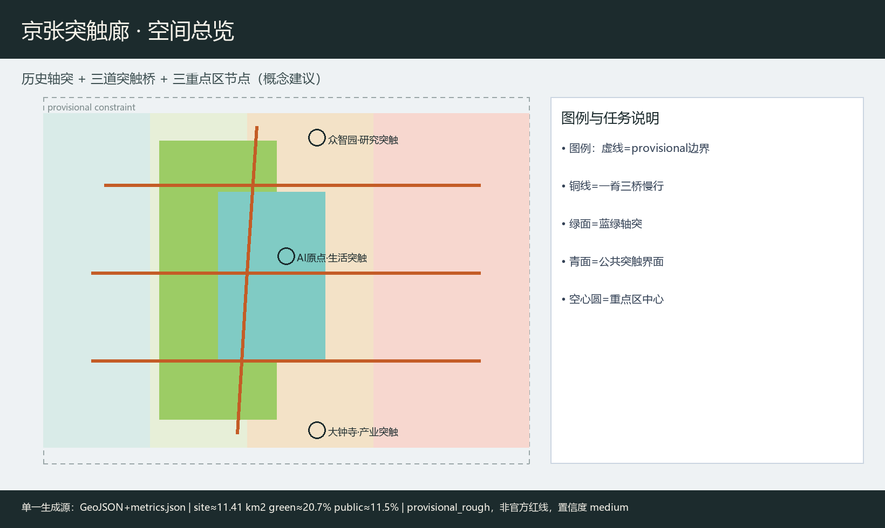
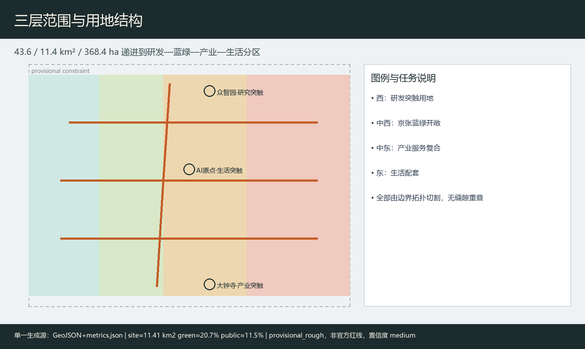
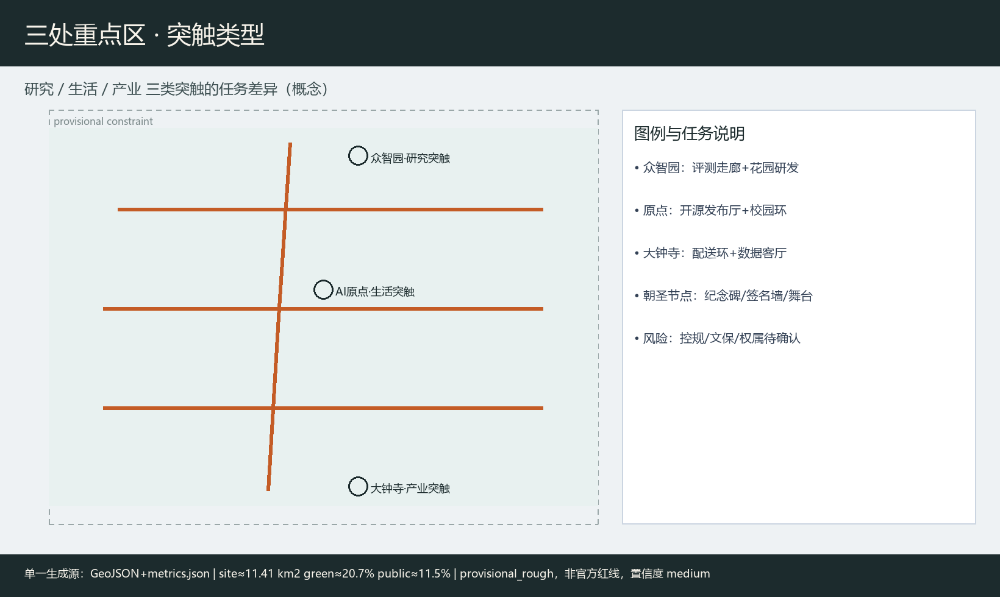
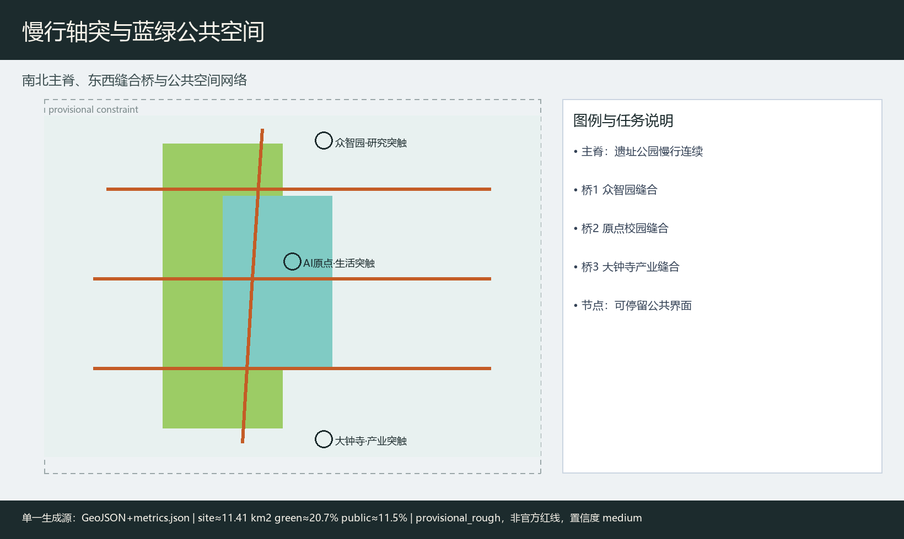
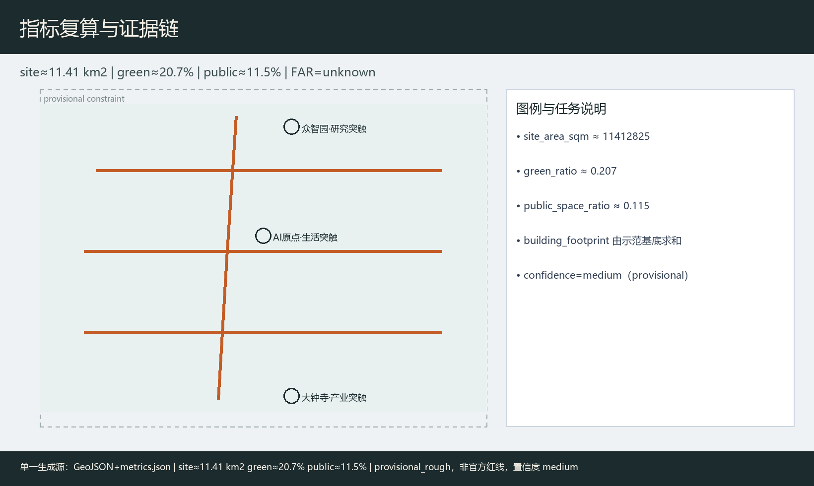

# 京张突触廊：多智能体共治的百年京张AI创新带

## 设计依据与资料清单

本 formal 方案以资格预审公告与公开任务为第一依据 [source:OFFICIAL-ANNOUNCEMENT]，以面向智能体任务书六项必答、十条共创原则与边界条款为约束 [source:AGENT-TASKBOOK]，以站点资料包与公开资料登记表区分 formal-ready / background / provisional [source:SITE-PACKAGE]，并以处理资料包作为阅读导航 [source:PROCESSED-FACT-PACK]。几何起点为 provisional_boundaries.geojson，明确 `official_boundary=false`、`boundary_precision=provisional_rough`，仅用于生成、可视化与 intake，不得冒充官方红线；正式多边形发布后须整体替换并复算 [metric:site_area_sqm]。

强制标准本地参考快照已读取：用地分类采用自然资源部分类指南口径 [standard:MNR-LAND-USE-CLASSIFICATION-GUIDE]，城市设计深度参照住建部城市设计管理办法与控规编制审批办法 [standard:MOHURD-URBAN-DESIGN-MEASURES]。本方案所有空间落地均为**概念建议**，供专业团队深化，不构成政府审定或工程结论。v0.2 以 `metrics.json` 为单一指标生成源，图件/PDF/HTML/正文统一读取复算结果，provisional 指标置信度降为 medium，正文只保留一位小数或两位有效数字级表达。

## 三层范围工作框架

**统筹研究范围** 约 43.6 km²：组织产业生态、三区两翼协同、命名识别与文化叙事。**总体设计范围** 约 11.4 km²：组织城市更新框架、用地与慢行蓝绿、京张活力带，达到控规深度城市设计表达 [depth:three_level_scope_framework]。**重点区域** 约 368.4 ha：众智园约 192.1 ha、AI原点社区约 104.3 ha、大钟寺约 72.0 ha，分别对应研究突触、生活突触、产业突触 [data:geometry/key_areas.geojson#PROV-KEY-001]。

当前边界为 provisional_rough：图中以低对比虚线约束表达，面积与比例仅作方向性讨论；官方红线到位后，用地、绿地、公共空间与分期图层需重算 [metric:green_ratio]。

## 统筹研究范围产业与未来城市研究

### 命名、Logo 与识别系统（agent.1）

**主名称**：京张突触廊 / Jing-Zhang Synapse Corridor。隐喻：京张铁路是百年“轴突”，AI 多智能体与人的协作是当代“突触”。**Logo 概念稿**见 `assets/figures/logo-mark.png`：一条北南细脊线 + 三道东西弧桥 + 空心圆（人工复核接口）。组合规范：主标志最小清晰宽度建议 ≥ 24 mm；导视使用灰砖底色与铜橙强调色；场景卡角标仅用空心节点；禁止未授权企业商标与娱乐化表情。该标志为概念识别，不是注册商标。

**三大定位**：百年京张文化带、都市AI生活体验带、AI融合创新带 [source:AGENT-TASKBOOK]。**五大功能**：全栈自主创新、世界级生态、场景赋能、活力城市、治理话语权。**三区两翼回路**：众智园—原点—大钟寺为三核；中关村科技服务翼与小月河场景赋能翼提供要素与体验回路。

### 国际案例对照与生态图谱（agent.2）

| 案例 | 空间/政策背景（摘要） | 可转化点 | 来源 |
| --- | --- | --- | --- |
| 剑桥 Silicon Fen | 近校创业走廊 | 校园—街区界面打开 | [source:CASE-SILICON-FEN] |
| 苏黎世 ETH/EPFL 走廊 | 高校走廊知识转化 | 研究—测试廊道 | [source:CASE-ETH-EPFL] |
| 多伦多 Vector 生态 | 研究院+城市社区 | 共享评测与社区空间 | [source:CASE-VECTOR-TORONTO] |
| 巴黎 Station F | 集中创业校园 | 公共活动与集中服务 | [source:CASE-STATION-F] |
| 新加坡 one-north | 产城混合创新区 | 公园—实验室混合 | [source:CASE-ONENORTH] |
| 赫尔辛基智慧治理 | 市政开放数据与审议 | 人工复核与公开审计 | [source:CASE-HELSINKI-SMART] |

案例均为二次摘要，仅供转化假设，不作政策事实证明 [assumption:A-CASE-SECONDARY-001]。

**全栈生态图谱（概念）**：土地与空间供给讨论 → 人才服务与近校转化 → 开源/评测服务 → 算力驿站与数据合规 → 场景开放与公众参与 → 治理话语展示。服务流程建议：申请访问 → 场景备案 → 沙盒测试 → 人工复核 → 公开反馈 → 贡献留名。

### 区域协同图谱（概念）

| 接口 | 要素流（建议讨论） | 合作接口 | 治理主体类别 | 阶段目标（概念） |
| --- | --- | --- | --- | --- |
| 北纬社区 | 青年人才/活动 | 联合开放日 | 社区运营方 | 近校试点共创 |
| 未来科学城 | 科研装置/评测 | 评测互认讨论 | 平台机构 | 中期评测联动 |
| 怀柔科学城 | 大装置/数据规范 | 标准对话 | 科研机构 | 标准接口研究 |
| 经开区 | 制造/部署场景 | 产业中试 | 企业联盟 | 场景外溢 |
| 京津冀 | 人才与活动巡回 | 突触周分会场 | 区域活动网络 | 年度巡回 |

以上不构成跨区法定规划调整。

## 总体设计范围城市更新与控规深度城市设计

总体空间建议形成“一脊三桥多节点”：沿京张遗址公园的南北慢行主脊，在众智园、原点、大钟寺各设一道东西突触桥 [data:geometry/roads.geojson#ROAD-001]。用地分区由边界拓扑切割生成研发、蓝绿、产业服务与生活配套四类，覆盖完整边界无缝隙重叠 [data:geometry/land_use.geojson#LU-001] [depth:land_use_layout]。

更新框架建议（概念）：优先保留文保与成熟产业载体，改造近校界面与公共首层；拆改留、容积率、高度须待控规与权属资料，现状记为待确认 [assumption:A-CONTROLS-001]。

## 重点区域详细设计

三处重点区在 provisional key_areas 图层中分别落位，本包以“研究 / 生活 / 产业”三类突触给出差异化概念设计，而不是复述同一套口号 [data:geometry/key_areas.geojson#PROV-KEY-001]。因缺少权属、控规图则与文保工程条件，建筑高度、拆改清单与市政接入保持待确认，图面强调公共界面、慢行缝合与场景接口。

**众智园·研究突触**：定位全栈自主创新与治理话语展示。空间建议花园型研发簇群、安全评测走廊与清河文化界面；建筑以 renovate 示范基底表达界面打开与公共首层活化，不给出高度与拆除清单。风险焦点是评测活动对交通与噪声的影响，须人工复核后开放。

**北京AI原点社区·生活突触**：定位近校成果转化与人才日常生活。建议开源发布厅、校企会客厅与步行校园环；同步布置儿童照护友好通道、无障碍导视与非智能手机服务台，避免“只服务开发者”的排他性。

**大钟寺·产业突触**：定位智能原生消费与产业测试。建议四象限路口公共界面、低速机器人配送环与数据要素展示客厅；商业与产业复合以概念业态指引表达，配送沙盒必须设置急停与退出机制。

## AI 创新生态、人才画像与 AI+ 场景

### 用户画像（5类）

| ID | 画像 | 主要空间 | 关键需求 |
| --- | --- | --- | --- |
| P1 | 高校研究生开发者 | 原点/众智园 | 开源发布、评测、夜间安全慢行 |
| P2 | 初创模型工程师 | 众智园评测廊 | 算力驿站、沙盒、合规咨询 |
| P3 | 企业智能体产品经理 | 大钟寺 | 场景备案、中试、路演 |
| P4 | 居民/老年/照护者 | 生活带与公园 | 非数字替代、无障碍、可拒绝采集 |
| P5 | 公共治理审核员 | 治理廊 | 审计日志、否决权、投诉通道 |

另补充路径：残障人士（无障碍导视+人工协助点）、儿童与照护者（安全慢行与停留）、低收入与非智能手机用户（纸质导览/服务台）、访客（多语导视）。

### 产业测试验证场景（≥3）

1. **T1 低速无人配送沙盒**（大钟寺环）：限速、时段、人工接管、退出条件。
2. **T2 开源模型公开评测周**（众智园）：公开数据集、结果公示、争议复核。
3. **T3 多代理城市运维推演**（治理廊）：必须人工复核，不得自动执行现场处置。

### 完整 AI 场景卡（10）

| 卡 | 空间节点 | 服务对象 | 数据/隐私 | 人工复核 | 运营主体建议 |
| --- | --- | --- | --- | --- | --- |
| 1 轴突慢行断点诊断 | ROAD-001 / GREEN-001 | P1/P4/P5 | 公开轨迹聚合，默认可拒绝 | 交通安全员签字 | 公园运营+志愿者 |
| 2 开源发布厅 | 原点 PUBLIC 节点 | P1/P2/P3 | 公开成果，禁个人敏感 | 社区主持人 | 开源社区运营方 |
| 3 近校成果转化会客 | 原点近校界面 | P1/P3 | 预约制，会后删除草稿 | 校企联络人 | 转化服务机构 |
| 4 人才生活管家 | 生活配套带 | P1/P4 | 最小化，默认可拒绝 | 人工热线 | 社区服务中心 |
| 5 低速配送走廊测试 | 大钟寺环 | P3/P5 | 车端传感，禁人脸库 | 现场安全员 | 企业联盟+街道 |
| 6 AI 安全治理廊 | 众智园 | P2/P5 | 展示型，无实时监控处决 | 治理审核员 | 平台机构 |
| 7 数据要素剧场 | 大钟寺 | P3/访客 | 脱敏演示 | 讲解员 | 产业运营方 |
| 8 京张记忆讲解代理 | 轴突 | 访客/P4 | 可关闭语音，无强制识别 | 文化志愿者 | 文化机构 |
| 9 小月河场景开放日 | 场景赋能翼 | 公众 | 报名制，纸质通道并行 | 活动安全负责人 | 活动组委会 |
| 10 全球突触周导览 | 三区串联 | 全球访客 | 贡献留名可选 | 导览调度 | 品牌运营方 |

每张卡均映射空间图层，不使用非公开或个人敏感数据 [source:AGENT-TASKBOOK]。

### 多智能体共治架构（概念）

| 代理角色 | 输入数据 | 决策权限 | 冲突解决 | 审计日志 | 人类否决 |
| --- | --- | --- | --- | --- | --- |
| 慢行诊断代理 | 公开路况/设施 | 仅建议 | 提交交通席 | 必留 | 安全员可一票否决 |
| 场景备案代理 | 企业申报 | 形式审查 | 治理席仲裁 | 必留 | 审核员可驳回 |
| 配送调度代理 | 沙盒传感 | 沙盒内建议 | 超限即停 | 必留 | 现场员可急停 |
| 文化讲解代理 | 公开文旅文本 | 讲解内容 | 投诉工单 | 可选 | 用户可关闭 |
| 治理审核代理 | 日志摘要 | 风险提示 | 人类委员会 | 必留 | 委员会最终决定 |

原则：默认可拒绝、数据最小化、高风险动作禁止自动执行。

## 用地、建筑规模与拆改留方案

用地四分区支撑“研发—蓝绿—产业—生活”突触链条，图层由站点边界拓扑切割生成，相邻多边形共享边界坐标，覆盖完整提交边界且无缝隙重叠 [data:geometry/land_use.geojson#LU-001]。蓝绿分区对应京张轴突公共开敞意图，研发与产业分区分别服务众智园研究突触与大钟寺产业突触，生活配套分区服务原点社区与日常服务。建筑基底仅示意两处概念示范：众智园侧以 renovate 表达界面打开与公共首层活化，大钟寺侧以 retain_adapt 表达产业载体适应性更新，二者都不是地块级拆除或新建审批结论 [data:geometry/buildings.geojson#BLDG-001]。容积率、建筑高度、总建筑规模因缺少控规图则、权属与市政条件，在指标中保持 unknown，并在 assumptions 中列为待专业确认事项 [metric:floor_area_ratio]。

## 交通、轨道、市政与公共服务设施

交通组织以“一脊三桥”概念回应东西缝合与南北贯通：南北绿道主脊贴合京张遗址公园活力带，三道东西连接分别服务众智园、原点社区与大钟寺两侧校园—产业—社区界面 [data:geometry/roads.geojson#ROAD-001]。道路图层使用 greenway / branch / pedestrian / cycleway 等可编辑类别，表达慢行与接驳意图，而不是快速路或主干路红线调整。轨道站点一体化、停车与非机动车、低速配送廊道以系统清单提出，强调可步行最后一公里与可人工复核的运行规则。创新服务平台、人才生活服务与端侧算力驿站作为新型基础设施概念节点，与传统市政设施融合讨论，但不给出能源负荷、管线容量或桥隧工程可行性结论。缺官方道路红线、轨道线位与市政图纸时，相关位置仅作方向性示意 [assumption:A-CONTROLS-001]。

## 蓝绿空间、公共空间与城市风貌

蓝绿连续带沿轴突展开，目标是把遗址公园、清河/小月河相关开敞空间与街角公共界面连成可步行网络，支撑青年友好与居民日常停留 [data:geometry/green_space.geojson#GREEN-001]。公共空间图层表达突触广场、开发者发布界面与社区共享庭院概念，服务对象同时覆盖开发者、企业员工、居民与访客 [data:geometry/public_space.geojson#PUBLIC-001]。公共空间比例由同源指标复算，仅作方向性讨论 [metric:public_space_ratio]。城市风貌建议以历史灰砖为底、铜橙为突触强调色；导视区分一带 Logo 与文化叙事符号。三处 AI 朝圣地标——轴突纪念碑、原点开源签名墙、大钟寺智能体舞台——及组件库（发布亭、评测屏、慢行灯桩、无障碍导视、纸质导览架）均为概念节点，不构成已批准建设项目。

## 更新项目清单、实施政策与分期计划

分期：近期轴突+原点生活突触；中期大钟寺产业突触与活动体系 [data:geometry/phasing.geojson#PHASE-001]。

### 三个优先试点工作包（概念建议）

| 工作包 | 空间 ID | 主体类别 | 依赖 | 阶段门 | 公众参与 | KPI（讨论） | 人工复核/退出 |
| --- | --- | --- | --- | --- | --- | --- | --- |
| WP1 轴突慢行连续化 | ROAD-001, GREEN-001 | 公园运营+街道 | 文保/交通安全 | 安全评估通过 | 步行体检工作坊 | 断点闭合率、投诉响应时限 | 安全员否决；事故即停 |
| WP2 原点开源发布厅 | PUBLIC-001（原点） | 社区运营+高校服务 | 场地权属/消防 | 备案与无障碍验收 | 开发者共创会 | 开放日场次、无障碍合格项 | 主持人复核；投诉熔断 |
| WP3 大钟寺配送沙盒 | 大钟寺环道路 | 企业联盟+街道 | 交通许可/保险 | 沙盒规则公示 | 居民意见征询 | 急停响应、侵限次数 | 现场急停；越界退出 |

资源级别、维护责任与运营成本仅作类别讨论，不写投资额或财政承诺。长期运营以年度“突触周”组织开发者节、场景开放日、评测赛与文化夜游，形成访问—体验—共创—留名—再传播路径 [source:AGENT-TASKBOOK]。

## 指标体系、面积复算与合规矩阵

核心指标由 EPSG:4548 投影复算，并与图件/HTML/PDF 同源：场地面积约 11.41 km²、绿地率约 20.7%、公共空间比例约 11.5% [metric:site_area_sqm]。建筑基底与重点区数量见 metrics.json 中对应条目 [metric:green_ratio]。公共空间比例与重点区计数同样来自复算结果，confidence 均为 medium [metric:public_space_ratio]。provisional 指标不得作为法定面积结论；compliance_matrix 为 agent.1–agent.6 配置了差异化章节与证据摘要。

## 风险、版权与合规说明

仅使用仓库内公开/清权材料与 provisional 边界 [source:SOURCE-REGISTRY]。字体、图像、地图、代码、Logo、AI 生成资产与案例材料的逐项权属见 `report/copyright_statement.md`；双语核对记录见 `changelog.md` v0.2。visual 为离线静态页。涉及强度、线位、投资与活动的内容均为概念建议 [standard:PROJECT-AGENT-OPEN-CALL-TASKBOOK]。隐私场景坚持最小化采集、默认可拒绝与人工复核。`validation_claim.data_confidence` 与指标置信度一并降为与 provisional 相协调的 medium。最终筛选由人类维护者与专业团队完成。

## 参考资料

本方案判断主要依据以下可读材料，完整机器索引见 sources.json 与三类矩阵，不在此重复全部 ID。公告与任务书确定三层范围、三区两翼与六项智能体任务 [source:OFFICIAL-ANNOUNCEMENT]；站点资料包与 provisional 边界说明规定几何精度与复算义务；公开资料登记表区分 formal-ready 与 background/provisional；处理资料包提供任务导航；案例级二次摘要见 CASE-* 记录并标明仅供转化假设；住建部城市设计与控规办法、自然资源部用地分类指南的本地快照支撑专业深度表述 [standard:MOHURD-URBAN-DESIGN-MEASURES]。项目门户 haidian.open-city.ai 提供公开参与说明。若后续官方红线、控规图则或清权附件进入仓库，应优先替换本包几何与指标后再复检，并同步更新图件、PDF、HTML 与双语正文。
