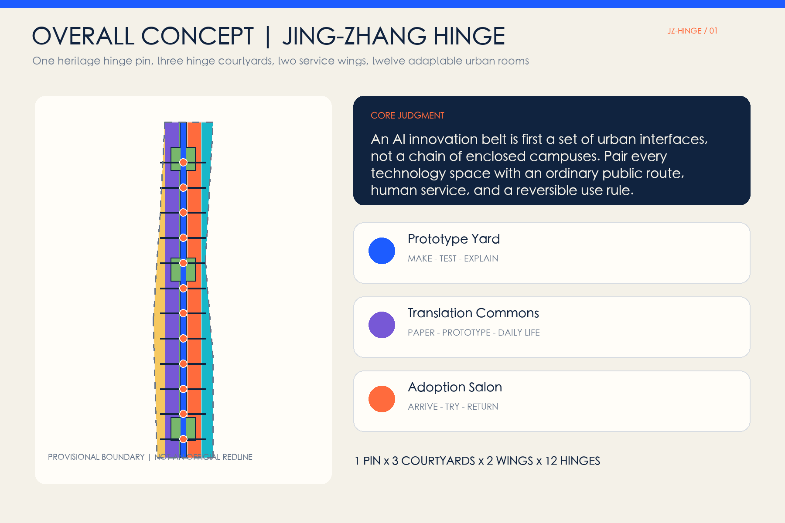
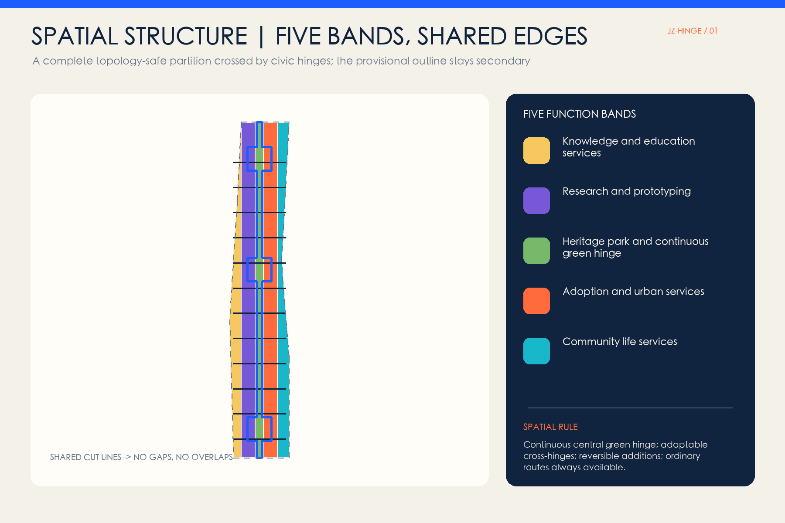
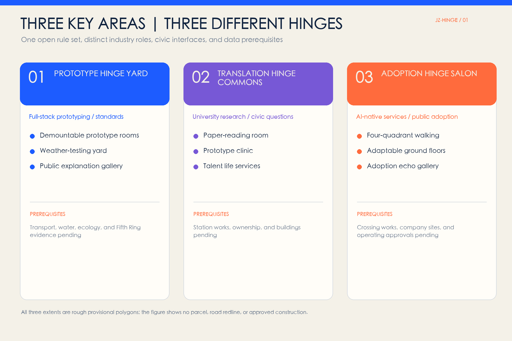
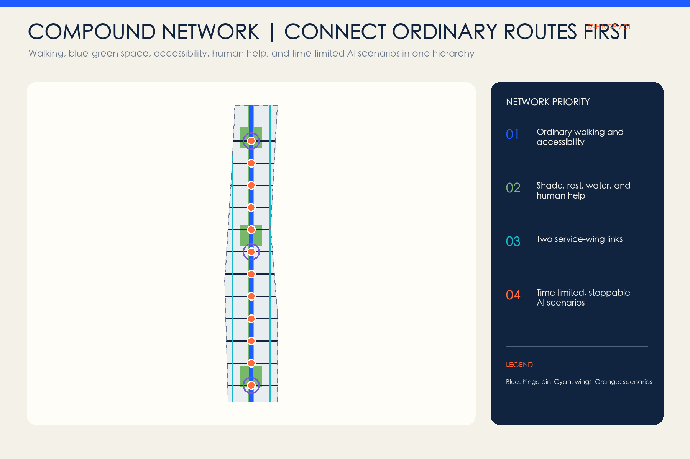
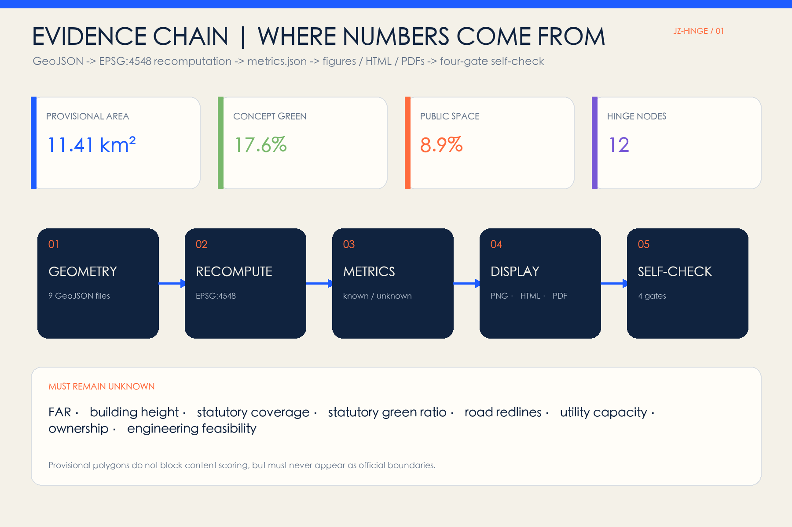

# JING-ZHANG HINGE

> One heritage hinge pin, three hinge courtyards, two service wings, and twelve adaptable urban rooms.

The proposal does not treat the AI Innovation Belt as another enclosed campus or a row of technology showcases. It treats the site as a set of urban interfaces that must be reconnected. The Jing-Zhang Railway Heritage Park is the continuous north-south hinge pin; twelve east-west hinges connect campuses, innovation parks, communities, transit, and the park to a shared public-space system. Each hinge supports ordinary walking, rest, and human help, then may shift at limited times to prototyping, teaching, validation, performance, or civic discussion. It can return to ordinary public use when a trial expires. Every spatial move is a conceptual recommendation based on provisional geometry and requires professional development after official boundaries, regulatory controls, ownership, existing-building, and engineering information become available.

## Design Basis and Source List

Evidence is managed in four layers: the official announcement and Agent taskbook define scope and tasks; the repository site package, local standard snapshots, and source registry define evidentiary limits; provisional polygons support generation, presentation, and intake checks only; international cases provide mechanisms rather than transplanted metrics, authority, or delivery commitments. [source:OFFICIAL-ANNOUNCEMENT] [source:AGENT-TASKBOOK]

The site package governs coordinates, layers, metrics, and formats. The central registry distinguishes formal-ready, background-only, and provisional-only material, while the processed fact pack is a reading aid rather than a new authority. [source:SITE-PACKAGE] [source:SOURCE-REGISTRY] [source:PROCESSED-FACT-PACK]

The Overall Design Area and all three key areas currently use repository-maintained rough provisional geometry derived from textual limits, north-south order, and approximate area checks. They are not official planning boundaries, road redlines, or parcels and cannot support statutory planning conclusions. [source:BOUNDARY-SOURCE] [source:KEY-AREA-SOURCE] [data:geometry/site_boundary.geojson#SITE-001]

## Three-Level Scope Framework

The Coordinated Research Area establishes why connections matter by translating the Three Zones and Two Wings, global cases, and the full-stack AI value chain into collaboration mechanisms. The Overall Design Area establishes what connects them through a heritage hinge pin, three hinge courtyards, twelve transverse urban rooms, and two service wings. The Key-Area Detailed Design Area establishes how the Prototype, Translation, and Adoption Courtyards operate. [standard:PROJECT-OFFICIAL-ANNOUNCEMENT] [depth:three_level_scope_framework]

The current provisional Overall Design Area recalculates to about 11.41 square kilometres and is only a design quantity based on provisional polygons; the official announcement's approximately 11.4 square kilometres remains the formal textual scale. When official polygons arrive, land use, green space, public space, footprints, routes, phasing, figures, and all ratios must be recomputed. [metric:site_area_sqm] [data:geometry/key_areas.geojson#PROV-KEY-001]

## Coordinated Research Area: Industry and Future City Research

The name JING-ZHANG HINGE uses two opening rail lines and a pivot dot as its identity grammar. The rails represent the century-old railway and the two sides of the city; the dot is a public interface that can be seen, used, and reviewed. The system uses original geometry, cleared or system fonts, and no corporate marks. Its structure is “one hinge pin, three courtyards, two wings, twelve hinges”: the heritage line carries culture and active travel, the courtyards correspond to the key areas, the wings provide technology and scenario services, and twelve hinges host cross-boundary daily life. [standard:PROJECT-AGENT-OPEN-CALL-TASKBOOK] [depth:overall_spatial_structure]

Seven cases contribute spatial and operational mechanisms only:

| Case | Transferable mechanism | Jing-Zhang translation |
| --- | --- | --- |
| STATION F, Paris | SHARE/CREATE/CHILL zones and public passages combine startup services, production, and daily life in a historic structure | Three access levels for hinge rooms while ordinary passage remains continuous [source:CASE-STATION-F] |
| one-north, Singapore | Work-live-play-learn integration, activated public space, and international startup services | Two service wings connect work, life, learning, and park space [source:CASE-ONE-NORTH] |
| Seoul AI Hub | Distributed facilities combine education, computing, PoC, and staged company support | The Prototype Courtyard forms a train-test-explain chain [source:CASE-SEOUL-AI-HUB] |
| Mila, Montreal | Researchers, students, industry partners, and an open-science community share an ecosystem | The Translation Courtyard interprets papers, prototypes, and civic questions in both directions [source:CASE-MILA] |
| Kendall Square, Cambridge | Innovation is brought from inward-facing buildings into public space and indoor-outdoor public interfaces | Hinge rooms bridge campus edges and park space [source:CASE-KENDALL] |
| Barcelona 22@ | Economic renewal is coordinated with housing, facilities, green space, and mobility | The Adoption Courtyard adds everyday services and public space, not only business attraction [source:CASE-BARCELONA-22] |
| Quayside, Toronto | Digital innovation remains subject to public governance, privacy principles, and public review | Every AI scenario states responsibility, minimum data, human review, and exit [source:CASE-QUAYSIDE] |

The three positionings become spatial actions: the Cultural Belt uses the heritage hinge pin and time marks; the Metropolitan AI Life Experience Belt uses twelve ordinary-life-first urban rooms; the AI Integrated Innovation Belt uses a north-south prototype-translate-adopt-return loop. The five functions are carried by full-stack prototyping in Zhongzhiyuan, ecosystem translation at AI Origin, scenario access at the hinges, adaptable civic rooms, and public review.

## Overall Design Area: Urban Renewal and Regulatory-Plan-Level Urban Design

Renewal follows four actions: retain the armature, open interfaces, add missing rooms, and adapt their use. Five longitudinal, topology-sharing land-use bands completely cover the submitted boundary: knowledge services, research and prototyping, the central heritage park, adoption and commerce, and community services. This is a conceptual land-use structure under provisional geometry, not a survey or statutory plan. [data:geometry/land_use.geojson#LU-001] [standard:MNR-LAND-USE-CLASSIFICATION-GUIDE] [depth:land_use_layout]

The building layer represents only twelve clusters of reversible conceptual footprints. Existing ground floors, courtyards, undercrofts, and demountable facilities should be considered before new construction. Any retain-renovate-demolish conclusion requires building, ownership, structural, fire, and heritage information at individual-building level. [data:geometry/buildings.geojson#BLDG-001] [depth:retain_renovate_demolish]

Statutory controls must come from legally approved planning. FAR, building height, statutory building coverage, green-space ratio, road redlines, and municipal capacity remain pending official data. Footprints and ratios in this package are reproducible conceptual design quantities, not approval controls. [standard:MOHURD-CONTROL-DETAILED-PLANNING] [depth:development_intensity_controls] [depth:height_massing_character]

## Detailed Design of Key Areas

Each key area receives a directional package of positioning, spatial structure, building renewal, walking, public space, AI scenarios, and risk within a rough provisional rectangle. Rectangle edges are not interpreted as parcels or road redlines. [data:geometry/key_areas.geojson#PROV-KEY-002] [depth:three_key_area_detailed_design]

**Prototype Hinge Yard, Zhongzhiyuan.** The north supports full-stack independent innovation, standards, and safety governance. Demountable prototype rooms, an outdoor weather-testing yard, a Qinghe ecological observation edge, and a public explanation gallery form a make-test-explain loop. Industry tests remain in enclosed or time-limited areas while an ordinary walking route runs in parallel. External transport, Fifth Ring connections, bridge/tunnel work, and water engineering require specialist evidence and approvals.

**Translation Hinge Commons, Beijing AI Origin Community.** The middle area translates university research, startup prototypes, and community questions in both directions. Street-level interiors, shared courtyards, and station walking interfaces host paper-reading rooms, prototype clinics, community question tables, and talent life services. Wudaokou and Qinghuadongluxikou are directional relationships named by the brief, not inferred station engineering or ownership.

**Adoption Hinge Salon, Dazhongsi.** The south supports public adoption of Agents, devices, content, consumption, and business services. Four-quadrant walking becomes a continuous arrive-cross-rest-experience-human-help interface. Small adaptable ground-floor units may host trials and services by day, then return to ordinary commerce, culture, and community use. Crossing works, station integration, and company-site renewal require separate professional study.

## AI Innovation Ecosystem, Personas, and AI+ Scenarios

Six personas prevent “talent” from becoming an abstraction. Researchers need trusted prototyping and peer exchange; startup teams need affordable validation and market feedback; residents and carers need ordinary routes, human service, and quiet time; students need legible learning access; frontline workers need responsibility and takeover authority; international visitors need bilingual wayfinding and accessible experiences. No service may require face recognition, continuous tracking, or abandonment of a human channel. [depth:existing_conditions_diagnosis]

All twelve scenario cards use nine fields: purpose, users, space, minimum data, human responsibility, opening period, pause condition, restoration method, and operating recommendation. The first three are industry testing and validation scenarios:

| # | Scenario card | Spatial and operating boundary |
| --- | --- | --- |
| TVS-01 | Edge-model energy and latency test | Prototype Courtyard; synthetic or cleared data, published method, stop on anomaly |
| TVS-02 | Accessible co-testing of service robots | Weather yard; low-speed enclosure, on-site safety lead, non-robot route in parallel |
| TVS-03 | Red-team testing for multilingual public-service models | Translation Courtyard; cleared test corpus and joint review by experts and frontline staff |
| SC-04 | Paper-to-daily-life translation clinic | AI Origin; researchers answer questions without medical, legal, or approval conclusions |
| SC-05 | Continuous low-vision and wheelchair navigation | Twelve hinges; opt-in, edge-first, with human wayfinding in parallel |
| SC-06 | Park comfort advice | Heritage hinge; public weather and non-identifying sensors, static guidance retained |
| SC-07 | Community care resource assistant | AI Origin; public resource index only, no diagnosis or personal records |
| SC-08 | AI-native shop trial | Adoption Courtyard; generated content is labelled, complaints visible, human staff responsible |
| SC-09 | Multilingual railway-heritage guide | Heritage hinge; facts are human-edited, with text and tactile fallback |
| SC-10 | Cycle-parking coordination | Dazhongsi; spatial prompts only, no enforcement or individual profiling |
| SC-11 | Open-model contribution honour wall | Three courtyards; only voluntary public contributions, with correction and removal |
| SC-12 | Night-event and quiet-mode switching | Three courtyards; announced schedules and parallel manual checks for light, sound, and access |

Scenario nodes express conceptual relationships rather than existing deployment or approval. The twelve cards, three testing scenarios, and six personas are recorded as auditable counts. [metric:scenario_card_count] [metric:industry_test_count] [metric:persona_count]

## Land Use, Building Scale, and Retain-Renovate-Demolish Strategy

Land-use polygons are topologically split from the same provisional boundary with shared cut lines, preventing gaps and overlaps. A central green band carries heritage and walking while research, knowledge services, adoption, and community services create adaptable edges. [data:geometry/land_use.geojson#LU-003]

Conceptual building-footprint area and coverage are calculated from `buildings.geojson` only to compare a low-addition, open-ground-floor, reusable-component strategy. They do not represent existing buildings, planned floor area, or statutory building coverage. [metric:building_footprint_area_sqm] [metric:building_coverage_ratio]

Retain-renovate-demolish decisions pass four gates: ownership and safety, heritage and use value, low-impact repair, and only then reversible addition. Because an official architectural design-depth source file is missing, this package does not claim construction-document or architectural-scheme depth. [standard:MOHURD-ARCH-DESIGN-DEPTH-2016]

## Transport, Rail, Municipal Infrastructure, and Public Services

The network comprises one north-south heritage walking spine, twelve east-west hinge connections, and two service-wing links. Lines express public connection intent rather than road alignment, road redline, or engineering design. Each crossing first adds kerbs, rest, shade, accessibility, and human help before smart services. [data:geometry/roads.geojson#ROAD-SPINE] [depth:traffic_rail_slow_parking]

New infrastructure is room-scale, pluggable, and accountable. Edge computing, networks, power, and sensing serve defined scenarios during authorised periods and return to ordinary-space mode when stopped. Energy load, utility capacity, fire, flood, and underground engineering remain subject to specialist calculation. [data:geometry/constraints.geojson#CONSTRAINT-001] [depth:municipal_new_infrastructure]

Public services retain non-digital access. Where medical, social-security, financial, or utility-payment services invoke statutory requirements, on-site guidance and human handling must be judged against applicable law and the specific venue rather than generalised from this concept.

## Blue-Green Network, Public Space, and Urban Character

The heritage park is the continuous blue-green base. Three garden hinge courtyards extend places to stay and meet, and twelve transverse public rooms connect entrances, shade, seating, and activity surfaces on both sides. Area and ratios are recalculated from submitted geometry and remain conceptual design shares under provisional geometry, not statutory green-space controls. [data:geometry/green_space.geojson#GREEN-HINGE] [data:geometry/public_space.geojson#PUBLIC-HINGES] [depth:blue_green_public_space]

Urban character combines railway construction clarity, restrained academic courtyards, and legible AI interfaces. Rail direction and industrial scale are retained, while navy, warm white, and hinge orange form the identity. The park is not surrounded by screens, and corporate logos do not replace civic identity. Urban design coordinates buildings, landscape, public space, and history, while exact height, massing, colour, and heritage controls await formal evidence. [standard:MOHURD-URBAN-DESIGN-MEASURES]

Three AI pilgrimage landmarks are conceptual components for professional development: the Open Prototype Gate in the north reveals a technology's path from prototype to retirement; the Century Pivot Hall in the middle pairs the Jing-Zhang timeline with verifiable AI contributions; the Adoption Echo Gallery in the south records public questions, revisions, and stopping decisions. Honour display is voluntary and verifiable, with correction, removal, and non-screen access. [metric:landmark_count]

## Renewal Projects, Implementation Policy, and Phasing

The near-term concept begins with four actions that do not depend on new buildings: identify twelve candidate hinges, complete ordinary walking and accessibility gaps, run three low-risk tests, and publish room-use rules. The medium term may open ground floors and add reversible facilities to the three courtyards. Only after boundaries, controls, ownership, and professional assessment are complete should long-term spatial expansion be decided. The three phases are topological partitions of the same provisional boundary, not a government timetable. [data:geometry/phasing.geojson#PHASE-001] [depth:phasing_implementation]

The project ledger includes the ordinary heritage route, twelve hinge kits, three hinge courtyards, two wing interfaces, three honour landmarks, and an open operating handbook. Every item lists data dependencies, suggested responsibility, stop conditions, and recalculation triggers rather than investment, approval, or business-attraction commitments. [depth:renewal_project_list]

Long-term operations follow a week-month-quarter-year rhythm: weekly open-room classes, monthly scenario clinics, quarterly safety and accessibility reviews, and an annual Open Hinge Week linking models, space, culture, and public feedback. Whether events occur, who operates them, and their funding all require later agreement. Brand assets are bilingual naming, open fields, scenario-card templates, and reusable spatial components rather than a single-company identity.

## Metrics, Area Recalculation, and Compliance Matrix

Known metrics are either recalculated from GeoJSON in EPSG:4548 or counted from structured records. Unknown controls are never presented as numbers in figures. The main conceptual quantities are:

| Metric | Design meaning |
| --- | --- |
| Provisional site area | Temporary denominator for every ratio; recompute with official polygons [metric:site_area_sqm] |
| Green-space area and ratio | Conceptual share of the continuous green hinge and garden courtyards [metric:green_space_area_sqm] [metric:green_ratio] |
| Public-space area and ratio | Share of twelve hinges as civic interfaces rather than enclosed campuses [metric:public_space_area_sqm] [metric:public_space_ratio] |
| Footprint area and coverage | Limits conceptual additions and prioritises open ground floors [metric:building_footprint_area_sqm] [metric:building_coverage_ratio] |
| Total connection-line length | Network quantity for the spine, wings, and hinges, not road works [metric:road_length_m] |
| Phase area | Confirms that each phase derives from the same provisional extent [metric:phasing_area_sqm] |
| Three key areas | Ensures three hinge courtyards answer distinct tasks [metric:key_area_count] |
| Twelve hinge nodes | Connects the spatial framework to scenario cards [metric:hinge_node_count] |
| Seven cases | Ensures comparative mechanisms rather than a single analogy [metric:case_study_count] |

The compliance matrix covers announcement sections 1.3, 1.4, and 1.5 plus agent.1-agent.6. The standard matrix links each standard to narrative, geometry, metrics, and drawings. The design-depth matrix covers diagnosis, structure, land use, missing intensity controls, buildings, transport, infrastructure, blue-green space, key areas, projects, phasing, metrics, and risk. [depth:metrics_recalculation]

## Risk, Copyright, and Compliance

The primary risk is missing evidence: official overall and key-area polygons, regulatory controls, roads and rail, existing buildings, ownership, heritage, municipal, ecological, and fire information are not in the public cleared package. The proposal therefore cannot support statutory planning, approval, demolition, investment, engineering, or operating commitments. When provisional geometry is replaced, all spatial layers, metrics, figures, PDFs, and HTML must be recomputed. [depth:risk_missing_data]

Model and scenario risks include privacy, bias, safety, erroneous automation, digital exclusion, and responsibility drift. Controls are minimum data, opt-in use, human review, ordinary-route parity, limited periods, visible responsibility, incident records, and expiry. Generative-AI rules, accessibility law, and sectoral standards are used only within their scope and not as case-specific legal advice.

All narrative, code, data-driven figures, and layouts are generated for this submission. If a generated cover is included, it is labelled as a synthetic conceptual representation and never as site evidence. Case research cites public pages without copying images, trademarks, or extended text. Generation method, fonts, software, and rights are recorded in `report/copyright_statement.md`.

## References

- [source:OFFICIAL-ANNOUNCEMENT] Haidian Branch of the Beijing Municipal Commission of Planning and Natural Resources, official project announcement, 9 May 2026.
- [source:AGENT-TASKBOOK] Cleared Agent open-call taskbook extract, 18 May 2026.
- [standard:MOHURD-URBAN-DESIGN-MEASURES] Ministry of Housing and Urban-Rural Development, *Measures for the Administration of Urban Design*.
- [standard:MOHURD-CONTROL-DETAILED-PLANNING] Ministry of Housing and Urban-Rural Development, *Measures for the Preparation and Approval of Regulatory Detailed Plans for Cities and Towns*.
- [standard:MNR-LAND-USE-CLASSIFICATION-GUIDE] Ministry of Natural Resources, *Guide to Land and Sea Use Classification for Territorial Spatial Investigation, Planning and Use Control*.
- [source:CASE-STATION-F] [source:CASE-ONE-NORTH] [source:CASE-SEOUL-AI-HUB] Official public pages of STATION F, one-north, and Seoul AI Hub, used only for mechanism comparison.
- [source:CASE-MILA] [source:CASE-KENDALL] Official public pages of Mila and Cambridge Kendall Square, used only for mechanism comparison.
- [source:CASE-BARCELONA-22] [source:CASE-QUAYSIDE] Official public pages of Barcelona 22@ and Waterfront Toronto, used only for mechanism comparison.

This submission is an open co-creation proposal. It does not replace formal planning and does not constitute a government-approved conclusion. Every spatial move is a conceptual recommendation, reference scheme, or material for further development by professional teams.
