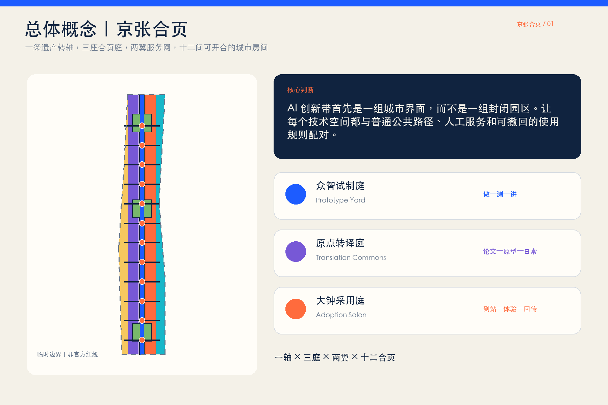
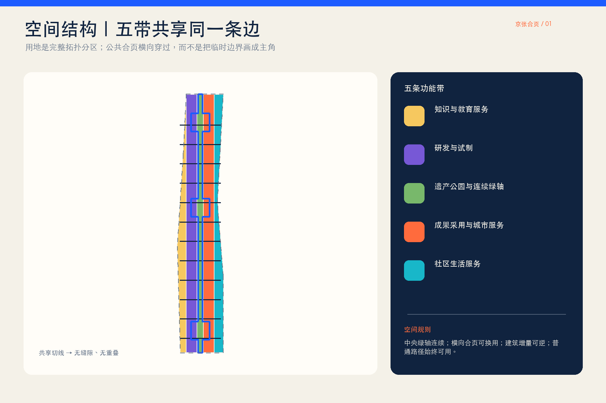
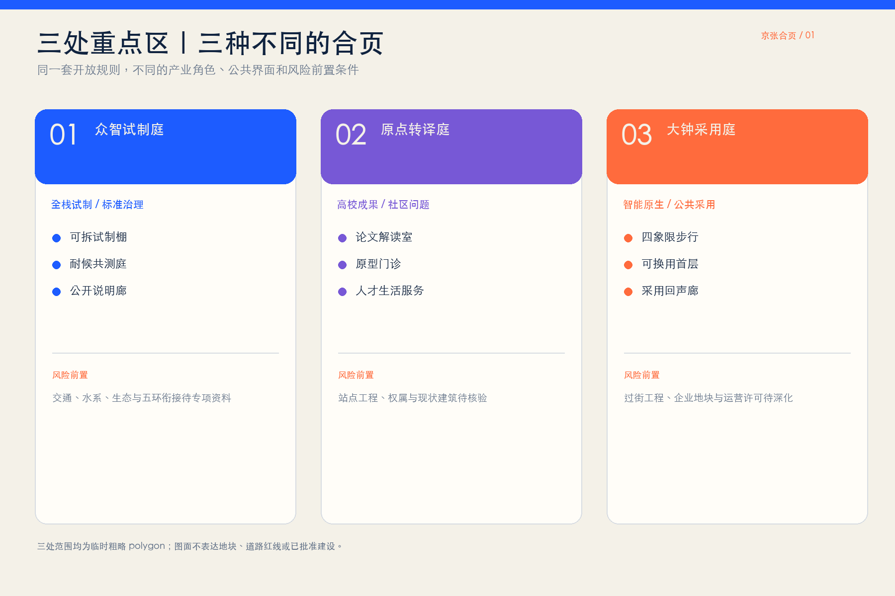
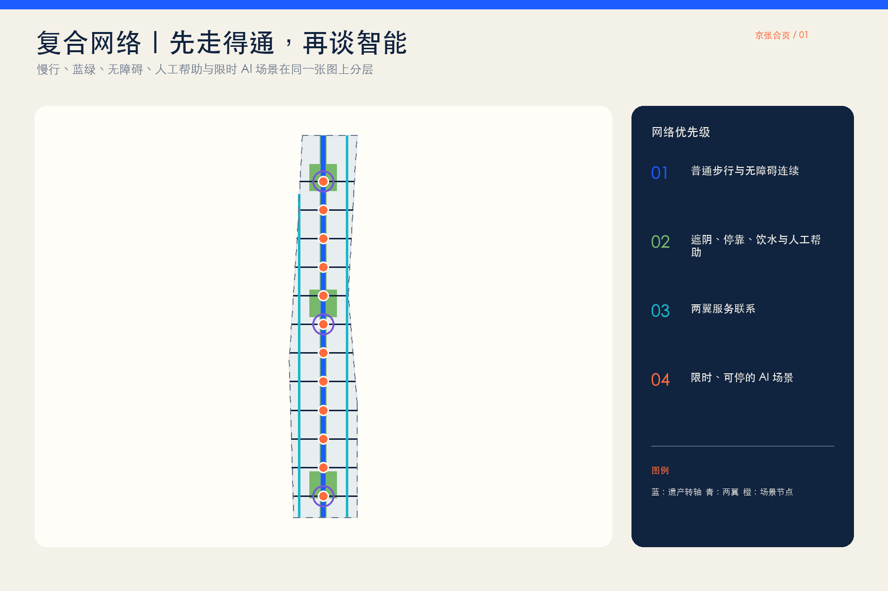
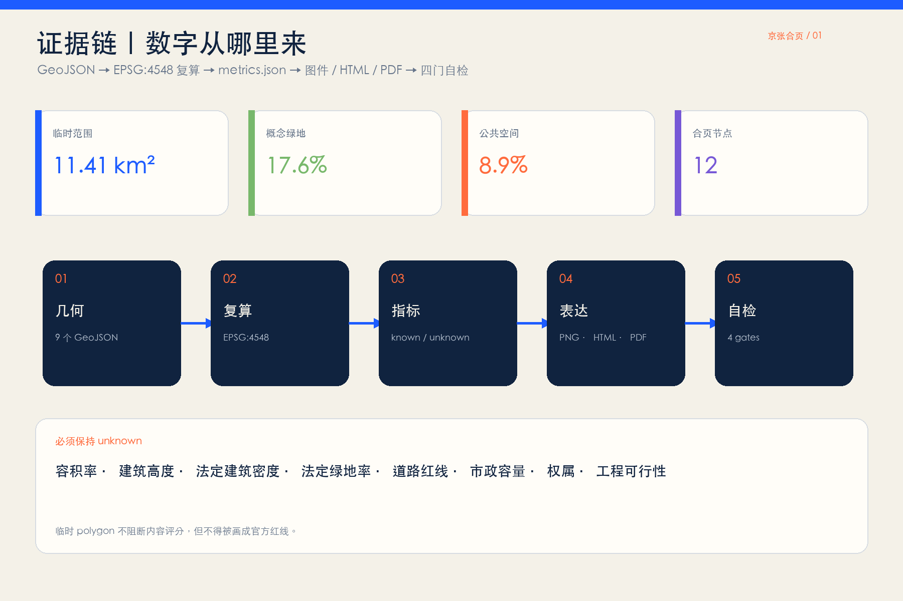

# 京张合页 JING-ZHANG HINGE

> 一条遗产转轴，三座合页庭，两翼服务网，十二间可开合的 AI 城市房间。

本方案不把 AI 创新带理解为新的封闭园区或一排技术展台，而把它看作一组需要被重新连接的城市界面。京张铁路遗址公园是南北连续的“转轴”；十二处东西向合页把校园、园区、社区、轨道与公园接到同一套公共空间上。每处合页既有普通步行、休息和人工服务，也可在限定时段转为试制、教学、验证、展演或社区议事；试用到期后可以恢复普通公共空间。所有空间落位均为临时边界下的概念建议，待官方红线、控规、权属、现状建筑与工程条件到位后由专业团队深化。

## 设计依据与资料清单

设计依据按四层管理：官方公告和智能体任务书确定三层范围与任务；仓库场地包、标准快照和资料登记表确定可用证据边界；临时 polygon 只支持生成、展示和入口自检；国际案例只提供机制参考，不移植指标、权限或建设承诺。[source:OFFICIAL-ANNOUNCEMENT] [source:AGENT-TASKBOOK]

仓库场地包用于坐标、图层、指标和格式约束，中央资料登记表用于区分 formal-ready、background-only 与 provisional-only，处理资料只是阅读导航而不是新权威来源。[source:SITE-PACKAGE] [source:SOURCE-REGISTRY] [source:PROCESSED-FACT-PACK]

总体设计范围和三处重点区目前均采用仓库临时粗略几何。它们依据公告文字四至、南北顺序和约面积校核形成，不是官方红线、道路红线或地块边界，也不用于法定控规判断。[source:BOUNDARY-SOURCE] [source:KEY-AREA-SOURCE] [data:geometry/site_boundary.geojson#SITE-001]

## 三层范围工作框架

统筹研究范围负责“为什么连接”：把三区两翼、全球案例和 AI 全栈创新链转译为合作机制。总体设计范围负责“用什么连接”：以遗产公园转轴、三座合页庭、十二处横向城市房间和两翼服务网形成空间骨架。重点区域负责“如何运行”：分别深化众智试制庭、原点转译庭和大钟采用庭。[standard:PROJECT-OFFICIAL-ANNOUNCEMENT] [depth:three_level_scope_framework]

当前临时总体设计范围复算约 11.41 平方公里，只作为基于临时 polygon 的设计量；公告“约 11.4 平方公里”仍是正式文本尺度。官方多边形到位后，必须整体重算用地、绿地、公共空间、建筑基底、道路、分期和全部图件。[metric:site_area_sqm] [data:geometry/key_areas.geojson#PROV-KEY-001]

## 统筹研究范围产业与未来城市研究

“京张合页 / JING-ZHANG HINGE”以两条相向开启的轨线和一个铰接圆点构成识别母题：轨线代表百年京张与东西两侧城市，圆点代表可以被看见、被使用、被复盘的公共接口。视觉系统只使用原创几何、开源/系统字体与无商标色块，不借用企业标识。总体结构为“一轴三庭两翼十二合页”：遗产转轴承接文化与慢行，三庭对应三处重点区，两翼提供技术服务和场景验证，十二合页承接跨界日常。[standard:PROJECT-AGENT-OPEN-CALL-TASKBOOK] [depth:overall_spatial_structure]

七个案例只提炼“空间机制 + 运行机制 + 京张转译”，不复制建筑形态或数值：

| 案例 | 可借鉴机制 | 京张转译 |
| --- | --- | --- |
| 巴黎 STATION F | SHARE/CREATE/CHILL 分区与公共穿行把创业服务、生产和日常放进同一历史建筑 | 三类开放级别的合页房间；公共路径始终连续 [source:CASE-STATION-F] |
| 新加坡 one-north | work-live-play-learn、公共空间激活与一站式国际创业服务 | 两翼服务网连接工作、居住、学习和公园 [source:CASE-ONE-NORTH] |
| 首尔 AI Hub | 分布式场地、教育、算力、PoC、企业成长阶段支持 | 众智试制庭形成“训练—验证—公开说明”链 [source:CASE-SEOUL-AI-HUB] |
| 蒙特利尔 Mila | 高校研究者、学生、企业伙伴和开放科学社区共处 | 原点转译庭把论文、原型与市民问题互译 [source:CASE-MILA] |
| 剑桥 Kendall Square | 把创新从内向楼宇带到公共空间，并连接室内外公共界面 | 合页房间跨越园区围墙与公园边界 [source:CASE-KENDALL] |
| 巴塞罗那 22@ | 产业更新与住房、设施、绿地和交通协同 | 大钟采用庭不只招商，也补足日常服务与公共空间 [source:CASE-BARCELONA-22] |
| 多伦多 Quayside | 数字创新必须服从既有公共治理、隐私原则和公开评议 | 每个 AI 场景先列责任、最少数据、人工复核和退出 [source:CASE-QUAYSIDE] |

三大定位由空间动作落地：文化带通过遗产转轴和时间刻度表达；都市 AI 生活体验带通过十二个普通日常优先的合页房间表达；AI 融合创新带通过“研发—转译—采用—回传”南北循环表达。五大功能分别由众智全栈试制、原点生态转译、合页场景开放、全天候公共房间和公开复盘机制承担。

## 总体设计范围城市更新与控规深度城市设计

城市更新的核心不是清空重建，而是“保留骨架、打开界面、补足房间、按需换用”。用地采用五条纵向共享边界分区，完整覆盖提交边界：西侧知识服务、研发试制、中央遗产公园、成果采用与社区服务。它是临时几何下的概念用地结构，不替代现状调查或法定用地。[data:geometry/land_use.geojson#LU-001] [standard:MNR-LAND-USE-CLASSIFICATION-GUIDE] [depth:land_use_layout]

建筑图层只表达十二组可逆的概念基底：优先利用既有首层、院落、架空或可拆装设施，原则上先保留、再修补、后增补；任何“拆除、新建、改造”结论必须等到现状建筑、权属、结构、消防和文保资料齐备后逐栋判断。[data:geometry/buildings.geojson#BLDG-001] [depth:retain_renovate_demolish]

控规要求必须依据依法批准成果。本包将容积率、建筑高度、法定建筑密度、绿地率、道路红线和市政容量保持为待正式数据补齐；图中建筑基底和比例只是可复算的概念设计量，不是审批指标。[standard:MOHURD-CONTROL-DETAILED-PLANNING] [depth:development_intensity_controls] [depth:height_massing_character]

## 重点区域详细设计

三处重点区均在临时粗略矩形内提出“定位 + 空间结构 + 建筑更新 + 慢行 + 公共空间 + AI 场景 + 风险”的方向性设计，不把矩形边解释为地块或道路红线。[data:geometry/key_areas.geojson#PROV-KEY-002] [depth:three_key_area_detailed_design]

**众智试制庭 / Prototype Hinge Yard。** 北部承担全栈自主创新、标准与安全治理。空间上以可拆装试制棚、室外耐候测试庭、清河生态观察边和公开说明廊构成“做—测—讲”回路；产业测试只在围合或限时区域运行，普通慢行保持并行。对外交通、五环衔接、桥隧和水系工程均待专项资料与审批深化。

**原点转译庭 / Translation Hinge Commons。** 中部承担高校成果、创业团队与社区问题的双向翻译。将沿街首层、共享院落和站点步行入口组织为论文解读室、原型诊所、社区提问桌与人才生活服务；五道口、清华东路西口等站点只作任务书给出的方向性联系，不推定站口工程或权属。

**大钟采用庭 / Adoption Hinge Salon。** 南部承担智能体、终端、内容消费与商务服务的公共采用。四象限步行连接被转译为“到站—过街—停靠—体验—人工帮助”连续界面；临街底层采用可换用小单元，白天是测试/服务台，夜间恢复普通商业、文化和社区活动。具体过街工程、地铁一体化和企业地块改造需专业团队另行论证。

## AI 创新生态、人才画像与 AI+ 场景

六类用户不是抽象“人才”：研究者需要可信试制和同行交流；初创团队需要低成本验证与市场反馈；居民与照护者需要普通路径、人工服务和安静时间；学生需要可理解的学习入口；一线服务人员需要明确责任与接管权；国际访客需要双语导向和无障碍体验。任何服务都不得强迫刷脸、持续定位或放弃人工渠道。[depth:existing_conditions_diagnosis]

十二张场景卡共同使用九个字段：目的、用户、空间、最少数据、人工责任、开放时段、暂停条件、恢复方式、运营建议。前三张为产业测试验证场景：

| # | 场景卡 | 空间与运行边界 |
| --- | --- | --- |
| TVS-01 | 端侧模型能耗与时延公开测试 | 众智试制庭；使用合成/清权数据，发布测量口径，异常即停 |
| TVS-02 | 服务机器人无障碍共测 | 众智耐候庭；低速围合、现场安全员、非机器人路线并行 |
| TVS-03 | 多语种公共服务模型红队 | 原点转译庭；测试语料清权，专家与一线人员共同复核 |
| SC-04 | 论文到日常的“翻译门诊” | 原点社区；研究者回答居民问题，不作医疗、法律或审批结论 |
| SC-05 | 低视力与轮椅连续导航 | 十二合页；端侧优先、主动使用、人工问路点并行 |
| SC-06 | 公园舒适度建议 | 遗产转轴；只用公开气象与现场非识别传感，保留静态导向 |
| SC-07 | 社区照护资源助手 | 原点社区；只提供公开资源索引，不处理诊断或个人档案 |
| SC-08 | AI 原生小店试营业 | 大钟采用庭；明确生成内容、投诉入口和人工店员责任 |
| SC-09 | 铁路文化多语导览 | 遗产转轴；史实由人工编辑审校，提供文字与触觉后备 |
| SC-10 | 非机动车停放协同 | 大钟寺；只给空间提示，不作执法或个体画像 |
| SC-11 | 开源模型贡献荣誉墙 | 三处合页庭；仅展示自愿公开贡献，提供更正与撤下通道 |
| SC-12 | 夜间活动与安静模式切换 | 三处合页庭；按预告时段启停，照明、声音和无障碍人工巡查并行 |

场景节点以点位表达概念关系，不声称现状已部署或取得许可；十二张卡、三类测试和六类用户分别作为可审查计数进入指标层。[metric:scenario_card_count] [metric:industry_test_count] [metric:persona_count]

## 用地、建筑规模与拆改留方案

用地分区由同一组切线从临时边界拓扑分割，避免相邻多边形独立手画造成缝隙或重叠。中央绿地带承接遗产与慢行，两侧研发、知识服务、采用与社区服务形成可换用界面；完整用地覆盖率在空间自检中复核。[data:geometry/land_use.geojson#LU-003]

概念建筑基底总量和覆盖比例来自 `buildings.geojson`，只用于比较“增量要小、首层要开、构件可回收”的设计倾向；它不等于现状建筑、规划总建筑面积或法定建筑密度。[metric:building_footprint_area_sqm] [metric:building_coverage_ratio]

拆改留采用四步门槛：先核验权属与安全，再识别历史/使用价值，再评估低扰动修补，最后才讨论可逆增补。缺少官方建筑设计深度文件时，本包不声称达到施工或建筑方案深度，只把该项列为资料缺口。[standard:MOHURD-ARCH-DESIGN-DEPTH-2016]

## 交通、轨道、市政与公共服务设施

交通结构由一条南北遗产慢行脊、十二条东西向合页步行联系和两条两翼服务联系组成。线要素表达公共连接意图，不是道路线形、道路红线或工程方案；每个交叉点优先补足路缘、停靠、遮阴、无障碍和人工帮助，再讨论智能服务。[data:geometry/roads.geojson#ROAD-SPINE] [depth:traffic_rail_slow_parking]

新型基础设施采用“房间级、可拔插、有人负责”原则：端侧算力、网络、电源和传感只在授权时段服务具体场景，停止后恢复普通空间；能源负荷、管线容量、消防、防洪和地下空间工程均待专项测算。[data:geometry/constraints.geojson#CONSTRAINT-001] [depth:municipal_new_infrastructure]

公共服务设施必须保留非数字入口。涉及医疗、社保、金融或生活缴费等法定语境时，现场指导和人工办理要求以适用法律及具体场所审查为准，不从概念设计外推所有场所的合规结论。

## 蓝绿空间、公共空间与城市风貌

蓝绿系统以遗产公园为连续底板，三处花园型合页庭扩展停留和交往，十二处横向公共房间把东西两侧的入口、树荫、座椅和活动面缝合起来。绿地和公共空间面积由提交几何复算，只表示临时边界下的概念设计占比，不是法定绿地率。[data:geometry/green_space.geojson#GREEN-HINGE] [data:geometry/public_space.geojson#PUBLIC-HINGES] [depth:blue_green_public_space]

城市风貌遵循“铁路构造的清晰、学院院落的克制、AI 接口的可读”：保留轨道方向和工业尺度记忆，以深蓝、暖白和铰接橙表达层级；不用大屏幕包围公园，不用企业 Logo 代替城市识别。城市设计应统筹建筑、景观、公共空间和历史文化，但具体高度、体量、色彩和文保边界须依据正式资料深化。[standard:MOHURD-URBAN-DESIGN-MEASURES]

三处 AI 朝圣地标都是可供专业团队深化的公共组件：北部“开源试制门”展示一项技术从原型到退役的全过程；中部“百年转轴厅”并置京张时间线与可验证 AI 贡献；南部“采用回声廊”公开记录公众问题、修订和停止决定。荣誉只记录自愿公开、可核验的个人/团队贡献，并提供更正、撤下和无屏阅读方式。[metric:landmark_count]

## 更新项目清单、实施政策与分期计划

近期概念建议先做“不依赖新增建筑”的四件事：标出十二个候选合页、补全普通慢行与无障碍断点、开展三项低风险测试、建立公开房间使用规则。中期再讨论三座合页庭的首层开放与可逆设施；长期在官方边界、控规、权属和专业评估完成后再决定空间扩展。三期范围来自同一临时边界的拓扑分割，并非政府确定时序。[data:geometry/phasing.geojson#PHASE-001] [depth:phasing_implementation]

更新项目台账包括：遗产转轴普通路径、十二合页基础包、众智试制庭、原点转译庭、大钟采用庭、两翼服务接口、三处荣誉地标和公开运营手册。每项均列前置数据、责任建议、停止条件与复算触发器，而不是给出投资、审批或招商承诺。[depth:renewal_project_list]

长期运营建议采用“周—月—季—年”节奏：每周房间开放课，每月场景诊所，每季安全与无障碍复盘，每年“Open Hinge Week”汇集模型、空间、文化与公众反馈；活动是否举办、由谁举办和经费来源均需后续协商。品牌资产包括双语命名、开放字段、场景卡模板和可复用空间组件，不绑定单一企业。

## 指标体系、面积复算与合规矩阵

所有已知指标要么由 GeoJSON 在 EPSG:4548 下复算，要么由结构化台账计数；unknown 指标不在图面中伪装成数字。核心设计量如下：

| 指标 | 设计含义 |
| --- | --- |
| 临时总体设计范围面积 | 决定所有占比的临时分母；官方 polygon 到位后重算 [metric:site_area_sqm] |
| 绿地面积与比例 | 说明连续绿轴和花园合页的概念空间份额 [metric:green_space_area_sqm] [metric:green_ratio] |
| 公共空间面积与比例 | 说明十二合页作为公共界面而非封闭园区的份额 [metric:public_space_area_sqm] [metric:public_space_ratio] |
| 建筑基底与覆盖比例 | 约束概念增量，强调低扰动和首层开放 [metric:building_footprint_area_sqm] [metric:building_coverage_ratio] |
| 慢行/联系线总长 | 表示一轴、两翼和横向合页的网络量，不是道路工程量 [metric:road_length_m] |
| 三期覆盖面积 | 验证每期由同一临时范围派生 [metric:phasing_area_sqm] |
| 三处重点区 | 保证三座合页庭分别回应任务 [metric:key_area_count] |
| 十二合页节点 | 保证空间结构与场景卡有明确接口 [metric:hinge_node_count] |
| 七个案例 | 保证机制比较而非单一类比 [metric:case_study_count] |

任务覆盖矩阵包含公告 1.3、1.4、1.5 和 agent.1—agent.6；专业标准矩阵把每条标准连接到正文、图层、指标和图纸；设计深度矩阵覆盖现状诊断、结构、用地、强度缺口、建筑、交通、市政、蓝绿、重点区、项目、分期、指标与风险。[depth:metrics_recalculation]

## 风险、版权与合规说明

最大风险是资料边界：官方总体和重点区 polygon、控规指标、道路/轨道条件、现状建筑、权属、文保、市政、生态和消防资料尚未进入公开清权包。因此本方案不能作为法定规划、审批、征拆、投资、工程或运营承诺；临时几何一旦替换，全部空间层、指标、图件、PDF 和 HTML 均须重算。[depth:risk_missing_data]

模型与场景风险包括隐私、偏差、安全、错误自动化、数字排斥和责任漂移。控制策略是最少数据、主动使用、人工复核、普通路径并行、限定时段、可见责任、事故记录和到期退出。生成式 AI 规则、无障碍法律和具体行业规范只能按适用范围使用，不作个案法律意见。

全部正文、代码、数据驱动图件和版式为本次生成；概念封面若采用生成图，明确标注为合成概念表达，不作为现场证据。国际案例只引用公开网页事实，不复制图片、商标或长段文字。完整生成方法、字体、软件与权利说明见 `report/copyright_statement.md`。

## 参考资料

- [source:OFFICIAL-ANNOUNCEMENT] 北京市规划和自然资源委员会海淀分局：《百年京张AI创新带城市设计国际方案征集资格预审公告》，2026-05-09。
- [source:AGENT-TASKBOOK] 面向全球智能体开源征集任务书清权摘录，2026-05-18。
- [standard:MOHURD-URBAN-DESIGN-MEASURES] 住房和城乡建设部：《城市设计管理办法》。
- [standard:MOHURD-CONTROL-DETAILED-PLANNING] 住房和城乡建设部：《城市、镇控制性详细规划编制审批办法》。
- [standard:MNR-LAND-USE-CLASSIFICATION-GUIDE] 自然资源部：《国土空间调查、规划、用途管制用地用海分类指南》。
- [source:CASE-STATION-F] [source:CASE-ONE-NORTH] [source:CASE-SEOUL-AI-HUB] STATION F、one-north 与 Seoul AI Hub 官方公开页面；仅作机制比较。
- [source:CASE-MILA] [source:CASE-KENDALL] Mila 与 Cambridge Kendall Square 官方公开页面；仅作机制比较。
- [source:CASE-BARCELONA-22] [source:CASE-QUAYSIDE] Barcelona 22@ 与 Waterfront Toronto 官方公开页面；仅作机制比较。

本成果为开放共创建议，不替代正式规划，不构成政府审定结论；所有空间落地建议均为概念建议、参考方案或可供专业团队深化研究。
