# Jing-Zhang AI MAIN STREET: A Centennial Innovation Front Door from Laboratory to Street Corner

In one sentence: **the park already links north and south; we add six cross-corridor gateways and make every AI service answer three ordinary questions before street use: Is it safe? Is it understandable? Does it work in real use?**

The Jing-Zhang Railway Heritage Park forms a continuously improving north–south public base. Six cross-corridor gateways connect neighbourhoods, campuses, innovation parks, communities and transit nodes to that base. Jing-Zhang AI MAIN STREET organises first use through a reviewable responsibility chain: Zhongzhiyuan verifies safety; the AI Origin Community translates technology into ordinary language; and Dazhongsi tests limited first use in a real station-city and commercial interface. Evidence and responsibility travel among the three places through one Street Pass. Twelve Street Nodes bring the rules to everyday entrances.

All proposed spatial interventions are open co-creation proposals, conceptual recommendations, or reference material for further study by professional teams. They do not replace formal planning and do not constitute government approval, engineering feasibility, investment, business-attraction, or implementation commitments.

## Understand It in 30 Seconds: the Park Is the Route; the Street Pass Is the Rule

This proposal follows an AI service seeking street use and the evidence travelling with it. Take multilingual transfer and accessible-arrival information at Dazhongsi. Passengers, caregivers and maintainers first define the problem together and draw a no-app ordinary route. Zhongzhiyuan issues `PROVE` only when the test extent, physical emergency stop, near-miss record and removal line are clear. The AI Origin Community issues `TRANSLATE` only when an ordinary person can restate purpose, limits, human responsibility and withdrawal. Dazhongsi permits voluntary, time-limited and switchable `FIRST USE` only after physical maps, human help and continuous movement work. Finally, success, pause and failure return to the public ledger on the same result card. [metric:journey_stage_count] [data:geometry/public_space.geojson#SCN-03]

Four parties decide the outcome together: affected users, on-site maintainers, specialist reviewers and an authorisable operator. Any one may call for a pause; the proposer or operator cannot decide replication alone. Once equipment is removed, gardens, courtyards, human service and ordinary passage must still work. [metric:public_co_review_role_count] [metric:first_use_right_count]

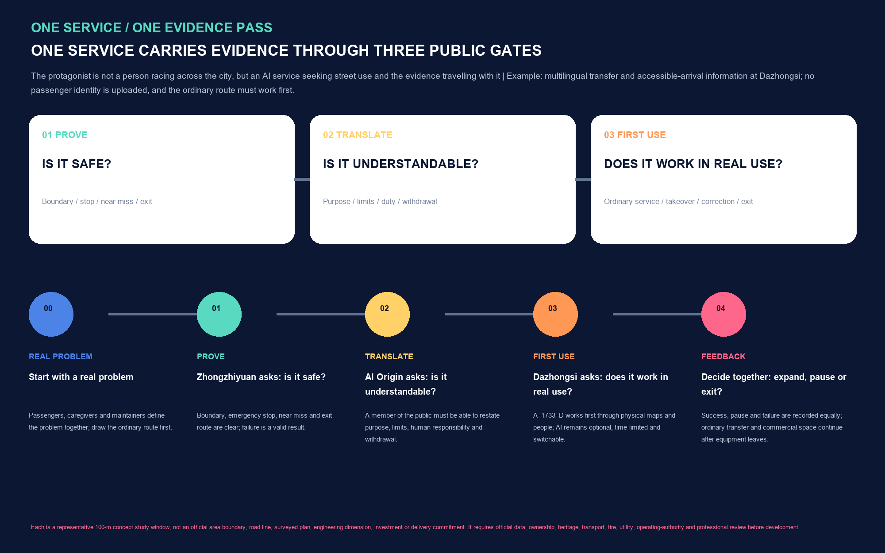

This process is a conceptual situation for professional discussion. It does not represent existing operation, an authorised schedule or performance. “The final 500 metres” means the last phase in which ordinary people, small organisations and maintainers come to understand and trust a research result; it is not a precise service radius.

## Agent Review at a Glance

The planned heritage-park innovation belt, the Wudaokou and Dazhongsi centres, and neighbourhood–campus–innovation-park–community integration form the proposal’s spatial framework. Six real-direction gateways and a pausable first-use rule provide the design response. A reviewer need remember only four lines: **the park is the route; three places have distinct jobs; the Street Pass carries evidence; and the city still works with AI off.**

| Review question | Jing-Zhang AI MAIN STREET response | Verifiable evidence |
| --- | --- | --- |
| What is original? | One Street Pass, three stamps—PROVE / TRANSLATE / FIRST USE—and seven first-use rights | `visual/assets/street-pass.schema.json`; `visual/assets/first-use-rights.json` |
| Where is the urban design? | One heritage public spine, six types of east–west stitching and three distinct representative 100-metre concept study windows; each shows spatial sequence, section, four states and `AI OFF` | Three place figures, the C1–C6 component ledger, five core figures and nine GeoJSON types |
| How does industry translate? | A problem library–verification yard–translation desk–first-use window–responsibility ledger connects full-stack verification, research translation, agents/content consumption/intelligent terminals and the two service wings; Dazhongsi uses real transfer and multi-level commercial conditions as a first-use stress test | Three-Zones-and-Two-Wings interfaces, 12 scenario cards, 3 pilot sheets and a field-evidence board |
| What is delivered first? | Eight SP action packages organised as 0–6 month reversible prototypes, 6–18 month evidence-led replication and 18–36 month network review; timing is a conceptual maturity sequence only | Delivery-gates figure, action-package table and `visual/assets/pilot-matrix.json` |
| How is the public interest protected? | AI is always an optional layer; equivalent no-app, non-AI, paper or human service remains; named people hold review, emergency-stop and restoration duties | Seven first-use rights, stop conditions and responsibility roles |
| What remains unknown? | Official polygons, road boundaries, ownership, regulatory controls, utilities, building-by-building conditions and authorisations have not been provided; the current cross-line operation, continuous accessible route and time-specific conflicts at Dazhongsi also require professional verification | Assumptions, constraints, metrics, field evidence and the three matrices |

## Dazhongsi Field Evidence: a Three-State First-use Interface from Exit A through 1733 to Exit D

On 13 August 2026 from 18:07 to 19:44, the human contributor started near Dazhongsi Line 13 Exit A, followed the surface route through 1733 at ground/B1/B2 levels to Line 12 Exit D, and continued to the edge beneath North Third Ring West Road. Thirty Live Photos and two short videos were captured from public viewpoints. The submission package includes four re-encoded stills with EXIF and motion payload removed; original location tracks and videos are not submitted. [source:USER-FIELD-DAZHONGSI-20260813]

The elevated Line 13, surface walking, 1733's multi-level commercial/landscape interface, Line 12 Exit D and an underbridge edge shared with non-motorised traffic form a vertical transfer system. The first-use interface therefore uses the Exit A–1733–Exit D ordinary-arrival sequence and defines it as a `T0` time slice that must relocate as station-city works change, not a permanent interchange conclusion. Pause–correct–restore is an operating rule: changes to entrances, hoarding, passages, operations or accessibility invalidate the route and return it to human review. The official taskbook asks for Dazhongsi station integration, four-quadrant walking links and organised non-motorised parking; field evidence turns that request into a falsifiable first arrival segment. [standard:PROJECT-OFFICIAL-ANNOUNCEMENT] [source:OFFICIAL-BEIJING-SUBWAY-L13-DAZHONGSI]

| Field observation | Direct design requirement | What it cannot establish |
| --- | --- | --- |
| The ground route near Exit A combines the elevated station, construction/barriers, steps and wayfinding towards Line 12 | C1 physical status, C2 human directions and a verified accessible alternative precede app advice | Photographs alone cannot determine construction limits, passage ownership or accessibility compliance |
| 1733 ground, B1 and B2 levels form a layered public-commercial interface with Exit D | Organise first use as ordinary transfer plus insertion into existing commerce; operations and maintenance carry primary responsibility | One evening cannot establish all-day footfall, trading patterns or causal explanations |
| Current official pages separately list Line 13 Exits A/B and accessibility facilities at Line 12 Exits D/E; an opening-period 2024 report recorded an out-of-station route from Exit D via 1733 to Exits A/B | Cross-line operating status becomes a pre-opening data gate; physical routes, human service and entrance status must be updated on site | The proposal claims neither that an internal passage is currently open nor permanently closed, and does not treat a reported 2024 eight-minute transfer as a 2026 guarantee [source:OFFICIAL-BEIJING-SUBWAY-ACCESSIBILITY] [source:BACKGROUND-DAZHONGSI-OUT-OF-STATION-TRANSFER-2024] |
| Walking, bus waiting and many non-motorised vehicles share a limited underbridge edge | Define parking/waiting edges that do not occupy tactile paving, stair mouths or the commuter line, and assign maintenance before discussing digital guidance | No count was conducted, so time-specific demand and road-engineering conclusions cannot be extrapolated |

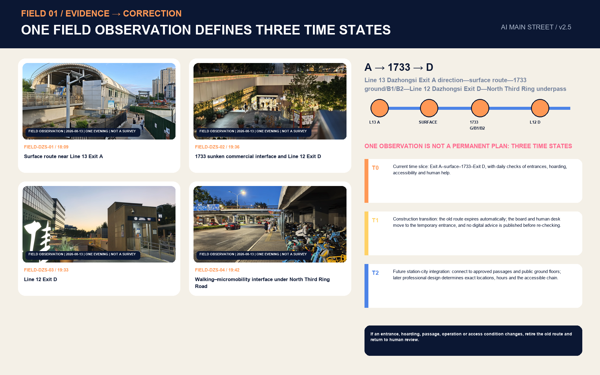

AMap Web Service was used only for a non-submitted plausibility check on 16 August 2026: the POI relationship and short walking scale among Exit A, Exit D and 1733 were consistent with the observed sequence. Commercial map tiles, raw route coordinates, exact distance and travel time do not enter submitted geometry, metrics or formal evidence. AMap tests whether the spatial logic can be walked; it does not replace official operating information, surveying or an accessibility audit.

The official introduction states that Agents participate in preliminary planning, task organisation and project review, with proposals and contributions made public on GitHub. This overview therefore serves both human experts and review Agents by quickly locating originality, spatial design, deliverability and evidence boundaries. [source:OFFICIAL-AGENT-ONLY-ARTICLE]

## Design Basis and Source List

The proposal makes “what can be established and what must remain unknown” part of its design. The official announcement and `brief/public-brief.md` provide the project name, three-tier scope, approximate areas, three key areas and design tasks, and therefore form the basis for this response. [source:OFFICIAL-ANNOUNCEMENT] [standard:PROJECT-OFFICIAL-ANNOUNCEMENT]

The agent taskbook provides three orientations, five functions, Three Zones and Two Wings, six required tasks and public-compliance boundaries. [source:AGENT-TASKBOOK] [standard:PROJECT-AGENT-OPEN-CALL-TASKBOOK] `data/source_registry.json` distinguishes formal-ready, background-only and provisional-only material; the processed fact pack is navigation only. [source:SOURCE-REGISTRY] [source:PROCESSED-FACT-PACK]

The repository currently contains no formally verifiable, coordinate-based overall boundary or polygons for the three key areas. [source:BOUNDARY-SOURCE] [source:KEY-AREA-SOURCE] This package therefore inherits maintainer-generated provisional geometry, explicitly marked `official_boundary=false` and `geometry_role=provisional_constraint`. [data:geometry/site_boundary.geojson#SITE-001] [data:geometry/key_areas.geojson#PROV-KEY-001]

The provisional geometry is solely for generation, graphic expression, discussion and intake self-checking—not an Official Planning Boundary, precise area, ownership, Regulatory Detailed Planning, or approval judgement. [depth:existing_conditions_diagnosis] [depth:risk_missing_data]

Professional references include the principles for public space, historic culture, urban character, traffic organisation and key-area design in the Urban Design Management Measures, and the statutory status of land use, intensity, facilities and the “four lines” in the regulatory detailed-planning rules. [standard:MOHURD-URBAN-DESIGN-MEASURES] [standard:MOHURD-CONTROL-DETAILED-PLANNING] Land-use codes follow the repository subset of the Ministry of Natural Resources classification. [standard:MNR-LAND-USE-CLASSIFICATION-GUIDE] The architectural design-document depth standard is recorded only as a missing-data item because no official document is provided; it is not an authoritative basis. [standard:MOHURD-ARCH-DESIGN-DEPTH-2016]

External cases are used only to compare mechanisms, never for spatial controls in this project. The six cases form a “mechanisms, not images” comparison [metric:global_case_count]:

| Case | Transferable mechanism | Jing-Zhang translation | Not copied |
| --- | --- | --- | --- |
| AI Singapore | Research, talent, innovation and open toolchain | Zhongzhiyuan verification gateway and open problem library | Brand, institutional lists and funding figures [source:CASE-AISG] |
| Mila | Open science, talent and industry partners | Origin Community co-learning room and model-card reading | Organisational structure and spatial scale [source:CASE-MILA] |
| Vector Institute | Bridge from research to adoption | Three-stamp adoption chain | Partner lists and industrial performance [source:CASE-VECTOR] |
| FCAI | Real problems, ethics and intelligibility | Seven first-use rights and affected-user review | Extrapolation of research findings [source:CASE-FCAI] |
| STATION F | Shared services, startup programmes and public interface | Dazhongsi small-organisation and transfer first-use interface | Corporate brands and investment-attraction commitments [source:CASE-STATION-F] |
| Helsinki AI Register | Public system purpose, responsibility information and public feedback | Street Pass status board, responsible person and feedback entry | Existing register contents and governance authority [source:CASE-HELSINKI-REGISTER] |

The proposal copies neither brands, imagery, company lists, investment figures nor spatial scales; it extracts only the organisational method of “research–verification–translation–first use–feedback–exit.”

## Alignment with Existing Plans: One Public Base, Six Cross-corridor Gateways

The publicised 2024 draft control plan for the corridor proposes “one belt, one axis, two centres and multiple nodes”: the Jing-Zhang Railway Heritage Park innovation-exchange belt, Zhongguancun Avenue innovation axis, Wudaokou and Dazhongsi centres, and nodes including Zhichun Road and Sidaokou. This proposal uses it as public draft background, rather than an approved statutory plan or formal boundary, and places six cross-corridor interfaces in that framework so that results can enter the street and the public can enter decisions. [source:OFFICIAL-JINGZHANG-CONTROL-PLAN-DRAFT-2024]

| Existing planning or construction direction | What it already solves | Jing-Zhang interface action |
| --- | --- | --- |
| Publicised draft “one belt, one axis, two centres and multiple nodes” | Relationships among urban structure, centres and nodes | Embed the three First-use Yards and six gateways in the existing structure; statutory axes follow formal plans. [source:OFFICIAL-JINGZHANG-CONTROL-PLAN-DRAFT-2024] |
| Phase II of the Jing-Zhang Railway Heritage Park and its walking/running/cycling/green system | North–south active travel, green corridor, heritage and an east–west stitching public base | Connect status, human service, no-app wayfinding and reversible trial interfaces to the existing park. [source:OFFICIAL-JINGZHANG-PARK-PHASE2-2026] |
| Haidian Urban Renewal Guide (2025) | Integration of neighbourhoods, campuses, innovation parks and communities; connected shared ground floors; directions for Wudaokou and Dazhongsi | Turn “integration” into enterable ground floors, human desks, co-testing courtyards and station-city interfaces. [source:OFFICIAL-HAIDIAN-URBAN-RENEWAL-GUIDE-2025] |
| Beijing Garden City Plan | People-centred city-green integration, continuous greenways and shared participation | Guarantee shade, seating, rainwater, access and ordinary movement first; AI remains a switchable side layer. [source:OFFICIAL-BEIJING-GARDEN-CITY-PLAN-2024] |
| Dazhongsi area renewal, the Lanjing Lijia transport study and Line 13 capacity expansion | Station-city integration is changing and may later create new passages and public ground floors | Maintain relocatable components and route versions through T0/T1/T2. [source:OFFICIAL-DAZHONGSI-LANJING-TRANSPORT-2025] [source:OFFICIAL-L13-CAPACITY-EXPANSION] |

The six gateways follow real place names from north to south: **X1 Zhongzhiyuan–Xuezhiyuan–Qinghe/Xiaoyue River direction; X2 Qinghuadongluxikou–universities/innovation parks; X3 Wudaokou–AI Origin–Zhongguancun Avenue; X4 Zhichun Road–communities/transit; X5 Sidaokou–Xueyuan South Road–railway heritage; and X6 Dazhongsi–North Third Ring–1733/Lanjing Lijia renewal area.** They are directional relationships requiring later survey and ownership checks, not new roads or fixed entrances. AMap POIs were used only to check names and adjacency and do not enter submitted geometry, exact distance or metrics.

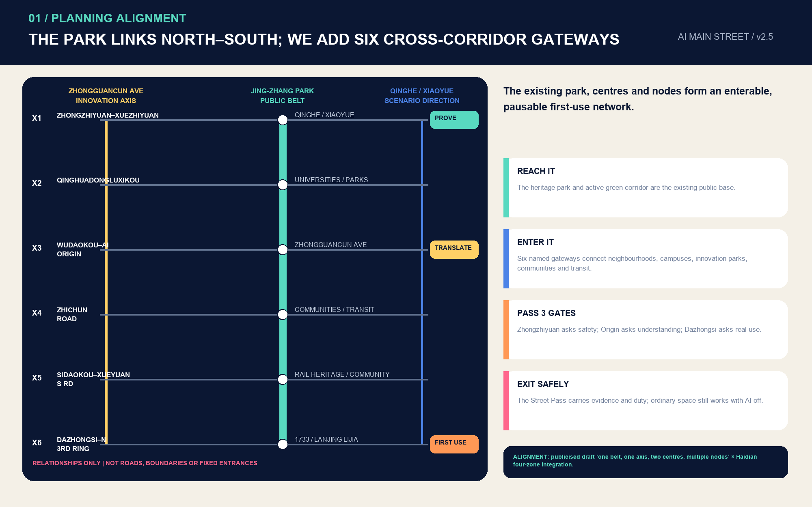

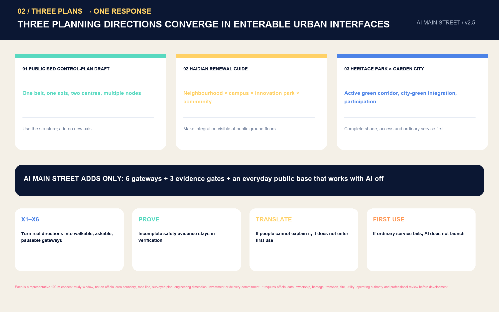

## Three-Tier Scope Framework

The Coordinated Research Area, approximately 43.6 km², supports industrial and regional coordination research; the Overall Design Area, approximately 11.4 km², supports urban renewal and overall urban design; and the three announced Key-Area Detailed Design Areas total approximately 368.4 ha, supporting deeper scenario, spatial and operational design. These are not three unrelated plans but one “Main Street chain”: the coordinated tier determines who supplies research, computing capacity, funding, talent and industry problems; the overall tier connects public interfaces, walking and cycling, the green spine and daily-life services; and the key-area tier makes verification, translation and first use into operable nodes. [depth:three_level_scope_framework] [depth:overall_spatial_structure]

Under EPSG:4548, the provisional polygon recalculates the Overall Design Area at approximately 11.413 km²; [metric:site_area_sqm] this establishes only internal consistency of submitted geometry and does not replace the announced approximation or a formal boundary. Provisional recalculations for the three key areas are [metric:key_area_1_sqm], [metric:key_area_2_sqm] and [metric:key_area_3_sqm], with [metric:key_area_count] areas. Drawings reduce provisional boundaries to pale grey dashed lines while showing the design spine, scenario nodes and public space in high contrast, enabling legible design without misrepresenting coarse rectangles as statutory controls.

Four requirements flow from the coordinated tier to the key areas: put problems onto the street, so industries and the public jointly define problems; put models through the gate, so every scenario is tested under open rules, minimum data and human takeover; bring services to people, with non-AI alternatives retained; and return results to the repository, so successes and failures both become reviewable records. Once official polygons are available, the site boundary and key areas must be replaced together, and land use, buildings, roads, green space, public space, phases, metrics, five figures, web pages and both PDF sets regenerated—not merely a boundary line changed. [data:geometry/constraints.geojson#CON-001]

## Coordinated Research Area: Industry and Future-City Research

The industrial proposition of Jing-Zhang AI MAIN STREET is to close the final 500 metres of the AI ecosystem: how research enters real organisations; how real organisations raise verifiable questions; how ordinary people receive explanation and an exit right; and how maintainers know when systems fail. The six cases collectively show that neither a single landmark nor one enterprise creates an ecosystem; research, talent, adoption, public discussion, startup services, transparent registration and ongoing operations must be combined. Jing-Zhang therefore sets out five connected stages—problem library, verification yard, translation desk, first-use window and responsibility ledger—rather than a one-off launch. [depth:overall_spatial_structure]

### Real Baselines Are Not Backdrop, but the Design Starting Point

The proposal records officially published 2026 information as dated, scoped background baselines that change design actions. It neither turns administrative reporting into street-segment facts nor presents existing initiatives as proposed by this scheme:

| Published baseline | Direct spatial and operational decision | What it cannot establish |
| --- | --- | --- |
| Universities, research platforms, talent and AI firms are highly concentrated within one kilometre of the AI Origin Community. Official reporting gives point-in-time figures of 37 universities, 10 new R&D institutions, 52 national key laboratories, 106 national-level research institutes, 12,300 AI scholars, and 325 AI firms among 439 enterprises. | Organise a one-kilometre translation circle: open results window–OPC/developer co-learning–first-use demand–capital/IP/internationalisation referral–community feedback. | It cannot prove that every institution will participate, serve as a current company list or parcel boundary, or predict performance. [source:OFFICIAL-AI-ORIGIN-BASELINE] |
| Phase I of the Jing-Zhang Railway Heritage Park is already a frequently used public place. Official reporting records 2.4 km, 16.8 ha, more than 60 youth activities and more than 4.3 million visits in 2025, and names interfaces including the Railway Museum, 1909 Train Restaurant, mobile boxes and an AI training station. | The twelve nodes use “retain–upgrade–connect”: first connect existing services, activities and human operations, then consider new equipment. Pilot schedules avoid peak periods and retain ordinary park capacity. | It cannot establish real-time footfall, capacity at a specific location or authorisation for activities. [source:OFFICIAL-JINGZHANG-PARK-BASELINE] |
| Dazhongsi has entered a comprehensive area urban-renewal project, whose published tasks include a project library, near/mid/long-term sequencing, balancing public-benefit and commercial space, and a coordinating implementation entity. | First-use packages prepare interface lists for four host types: existing buildings, traditional retail, former factories and public space. The relationship to the published entity is only “recommended coordination,” not self-assigned responsibility. | It cannot mean this scheme has been adopted, entered the project library or received funding sequencing. [source:OFFICIAL-DAZHONGSI-RENEWAL] |
| Official Three Zones and Two Wings reporting identifies differentiated industrial directions for the three key areas and eastern and western wings. | Align the three stamps with real industrial roles, and join key areas and service wings through two flagship scenarios. | It cannot determine specific land use, investment-attraction targets or project siting. [source:OFFICIAL-THREE-ZONES-TWO-WINGS] |

The Three Zones and Two Wings thus form an industrial translation chain: Zhongzhiyuan serves full-stack technology, standards, safety and integrated verification as `PROVE`; the AI Origin Community serves research results, talent entrepreneurship and the one-kilometre translation circle as `TRANSLATE`; Dazhongsi serves agents, content consumption and intelligent terminals as `FIRST USE`; the Zhongguancun Technology Services Wing supplies IP, capital, legal, productisation and international-service interfaces; and the Xiaoyue River Scenario Enablement Wing takes on real scenarios including embodied intelligence, AI + healthcare and AI + film. Two cross-area flagship passes are the Small-organisation First-use Street Pass and the Embodied-Intelligence Shared-Road Street Pass. AI-content first use between Beijing Film Academy and Dazhongsi is an S09 industry-extension direction only, and must first pass review of content rights, public impact and operational authorisation.

The smallest transferable unit is the “Jing-Zhang Street Pass.” It is neither an administrative permit nor a commercial access certificate, but an open-co-creation conceptual credential. The same scenario must leave [metric:street_pass_gate_count] spatial stamps and, in one record, declare spatial reference, seven first-use rights, data minimisation, named human roles, operating window, stop conditions, restoration of ordinary service and evidence links. Its machine schema and synthetic example are stored in `visual/assets/street-pass.schema.json` and `visual/assets/example-street-pass.json`; all examples are `pending` and `authorized=false`, and do not purport to be actual authorisations or pilot performance. [metric:first_use_right_count]

The three orientations become spatial actions: the Centennial Jing-Zhang cultural belt becomes a public timeline of visible evolution; the urban AI life-experience belt becomes everyday first use rather than spectacle; and the AI-integrated innovation belt becomes a chain from research through industry to street corner. The five functions are realised through the industrial translation chain above in stamp responsibilities, pilot sheets and spatial interfaces.

The visual identity is an open direction independent of third-party marks, images or commercial fonts: two parallel lines represent railways and data; a bracket opening onto the street represents movement from a closed system to a public interface; and three nodes represent verification, translation and first use. The Chinese primary name is “Jing-Zhang Shangjie”; the English name is “AI MAIN STREET.” Secondary names are standardised as “First-use Yard,” “Street Node” and “Service Wing.” The original vector construction is at `assets/figures/jingzhang-main-street-logo.svg`; the three-stamp protocol is at `assets/figures/street-pass-protocol.svg`. Both are conceptual directions for further development by a professional visual team, not registered trademarks or official marks.

Regional coordination does not invent a company list; it defines open interfaces. Beiwey Community, Future Science City, Huairou Science City, the Economic-Technological Development Area, and Beijing–Tianjin–Hebei participants may enter through open problems, model cards, testing protocols, failure reviews and transformation applications. Each collaboration must state source, rights, data boundaries and exit conditions. Thus a “global ecosystem” is not a geographical directory but a collaboration protocol that any qualified participant can understand, reproduce and join.

## Overall Design Area: Urban Renewal and Urban Design at Regulatory Detailed-Planning Depth

The overall structure is now stated as **one existing public base, six cross-corridor gateways, three First-use Yards and twelve Street Nodes**. The Jing-Zhang Railway Heritage Park and active green corridor provide the north–south public base; six gateways connect universities, innovation parks, communities, transit and renewal areas; three yards perform different evidence gates; and twelve nodes divide services into small-scale maintainable everyday interfaces. [data:geometry/roads.geojson#ROAD-001] [data:geometry/public_space.geojson#PUBLIC-001] This division also addresses land-use relationships and active-travel depth. [depth:land_use_layout] [depth:traffic_rail_slow_parking]

The spatial division of labour is simple: the north–south public base makes places reachable; cross-corridor gateways let people enter; public ground floors make them worth staying in; and the Street Pass states who signs and when to stop. The three First-use Yards are not one module renamed, but three spatial prototypes: a Validation Garden, Translation Courtyard and Relocatable Station-City Interface. [data:geometry/public_space.geojson#SCN-04] [depth:overall_spatial_structure]

The land-use layer is not a determination of existing conditions or approved Regulatory Detailed Planning. It is a five-part functional gradient cut by the same provisional boundary: open research and verification; near-campus learning and translation; community service and shared-benefit interface; first-use commerce and urban presentation; and life support and talent friendliness. Shared cut lines ensure full coverage and no overlap, so it can be recalculated once the Official Planning Boundary is available. [data:geometry/land_use.geojson#LU-001] Its value is in explaining how far research is from the street, where services occur and how residents enter—not in declaring a land-use adjustment.

Urban renewal follows “interfaces first, buildings later”: first check ground-floor accessibility, walking continuity, night lighting, shaded rest, information signs, appeal channels and maintenance space; then decide retention, repair, adaptation or new construction through survey, ownership, structure and Regulatory Detailed Planning. Twelve conceptual building footprints express only the scale and distribution of street-corner hosts. [data:geometry/buildings.geojson#BLDG-001] [metric:building_footprint_area_sqm] [metric:building_coverage_ratio] They do not establish existing buildings, demolition, storeys or construction scale. [depth:development_intensity_controls] [depth:height_massing_character] [depth:retain_renovate_demolish]

Regulatory controls, road boundaries, heritage-protection extent, utility networks, fire protection, flood control and public-service baselines have not been provided. The proposal puts these gaps in the constraints layer and assumptions table rather than concealing them with concept drawings; FAR, total floor area, building height and road-area ratio remain `unknown`. Municipal and new infrastructure are limited to a functional list—shared cabinets, edge-side de-identification, power-off degradation, human watch, event logs and seasonal calibration—with capacities and engineering alignments pending specialist study. [depth:municipal_new_infrastructure]

## Key-Area Detailed Design

### Zhongzhiyuan: the Verifiable First-use Yard

Zhongzhiyuan performs “model-gating.” Its conceptual space comprises an open verification court, industry-problem desk, safety-and-standards forum, low-speed-delivery verification loop and reversible demonstration surface. Testing must first define boundaries, observation indicators, human takeover, incident reporting and exit conditions. A garden-style innovation district is not ornamental planting: continuous tree shade, sittable steps, outdoor test power and quiet spaces support sustained research collaboration. Its provisional extent is [data:geometry/key_areas.geojson#PROV-KEY-001], and must not be read as an official district or project boundary.

The representative 100-metre concept sequence, from public to research side, comprises a continuous shaded and accessible everyday base; C1 status board and C2 safety-officer window; observation cloister and sittable edge; C4 soft-separated low-speed verification loop; C5 rear emergency-stop/inspection; and C6 removal storage and restoration surface. Pedestrians, wheelchair users and cyclists do not cross the verification loop; equipment runs only as a closed circuit within it. In a fault, equipment takes the shortest recovery line and ordinary passage outside remains continuous. With AI off, it remains a complete garden, observation cloister and safety consultation point. A boundary breach, takeover timeout, blocked accessible route, unreported collision/near miss or inability to remove and restore passage triggers immediate stop. [data:geometry/key_areas.geojson#PROV-KEY-001] [metric:minimum_pilot_count]

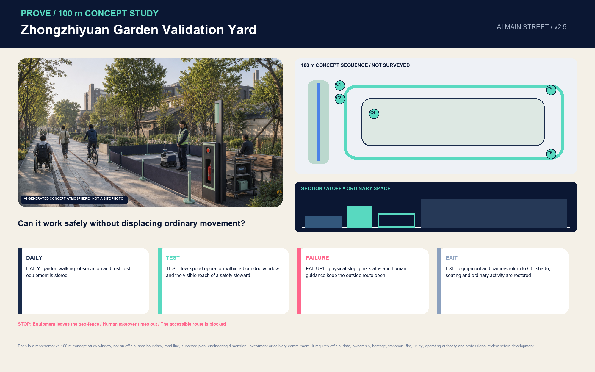

### Beijing AI Origin Community: the Translatable First-use Yard

The Beijing AI Origin Community translates “paper language into city language.” Its conceptual space includes a research-result first-use window, developer co-learning room, model-card reading rack, talent daily-service desk, and co-testing periods for families and older adults. Walkable ground floors and courtyards host contact among universities, research institutions, startups and residents. The one-kilometre translation circle feeds real demand to the open results window and sends first-use results back to research teams. Any connection involving a university or campus is conceptual and requires verification of ownership, fire safety, campus management and traffic conditions. [data:geometry/key_areas.geojson#PROV-KEY-002]

The representative 100-metre concept sequence is organised as “street–cloister–courtyard–quiet room”: a street-facing no-app entrance and C1 status board; C2 human needs-breakdown window; C3 dual-height model-card wall and physical service map; co-testing cloister and C4 movable tables; community courtyard; a sensitive-information quiet room subject to authorisation; and a C6 exit returning to ordinary community service. Residents and talent can circulate without entering the quiet room; questions enter through the human window and results return through plain-language and paper cards. With AI off, consultation, shared reading, rest and the community courtyard continue to work. A result cannot receive the `TRANSLATE` stamp if purpose, limits, responsibility and withdrawal cannot be explained, human explanation is absent, AI use is compulsory, data are still processed after withdrawal, or the accessible main chain is blocked. [data:geometry/key_areas.geojson#PROV-KEY-002] [metric:public_co_review_role_count]

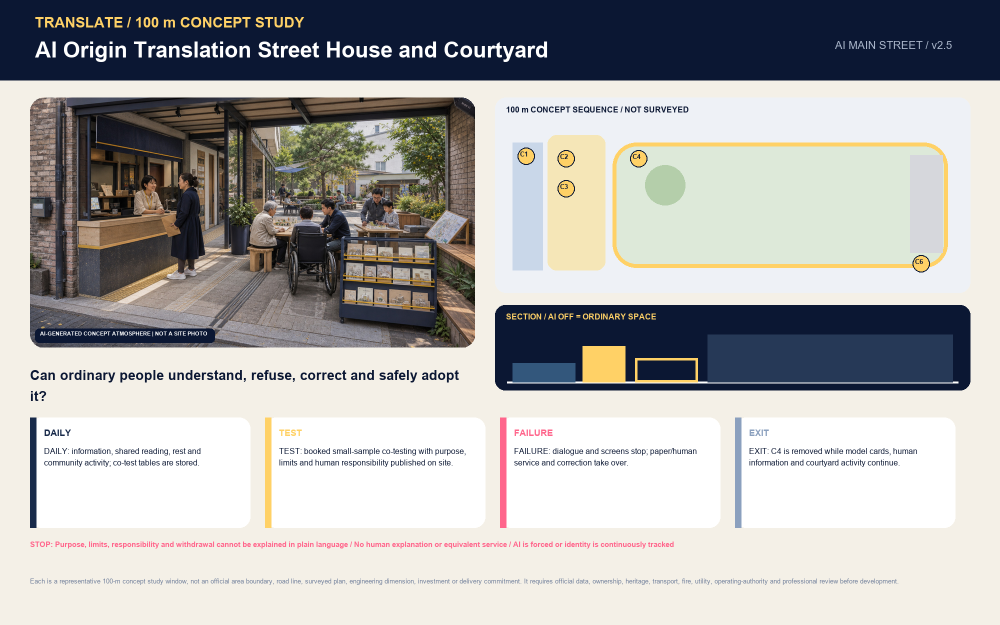

### Dazhongsi: a First-use Interface that Moves as the Station-City Interface Changes

Dazhongsi enables “the first real arrival and adoption.” Field evidence from 13 August 2026 defines the Exit A–surface–1733–Exit D multi-level interface as the current study object, not a permanent arrangement. [data:geometry/key_areas.geojson#PROV-KEY-003] [source:USER-FIELD-DAZHONGSI-20260813] Line 13 capacity expansion and station-city integration around the Lanjing Lijia renewal area may change entrances, hoarding, passages and public ground floors. [source:OFFICIAL-L13-CAPACITY-EXPANSION] [source:OFFICIAL-DAZHONGSI-LANJING-TRANSPORT-2025] Dazhongsi therefore uses a relocatable first-use interface: passengers, caregivers, operators, delivery riders and maintainers share one continuously updated ordinary-arrival map, and digital service can only attach to it.

The prototype has three time states. `T0 Current Time Slice` checks Exit A–surface–1733 ground/B1/B2–Exit D every day. In `T1 Construction Transition`, the old route expires automatically; the C1 status board, C2 human desk and C3 physical map move to the temporary entrance, and no digital advice is published before re-checking. `T2 Future Station-City Integration` connects only to approved passages and public ground floors, with exact location, opening hours and the accessible chain determined by professional design. C4 remains a reversible side pocket outside the main movement line; C5/C6 shut down, relocate and restore. A change in entrance, hoarding, operations or accessibility invalidates the old route. If physical wayfinding or human help fails, an unverified route is recommended, tactile paving/stair mouths/the commuter line are occupied, identity is persistently tracked, non-motorised conflicts cannot be separated, or no maintainer is accountable, no `FIRST USE` stamp may be issued. [data:geometry/key_areas.geojson#PROV-KEY-003] [source:OFFICIAL-DAZHONGSI-RENEWAL]

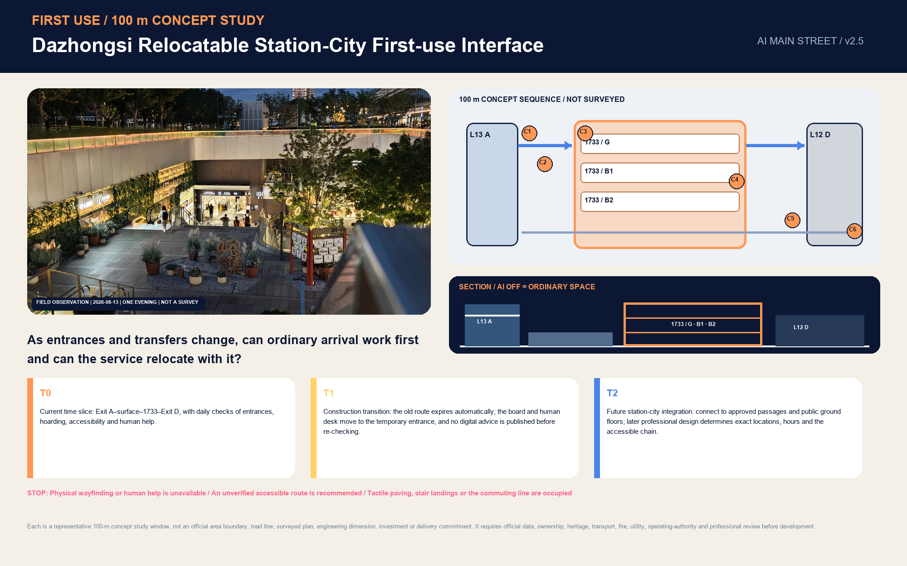

The three key areas share one Street Pass, but what moves is the problem, evidence and responsibility—not a requirement for one user to cross the city. The same service is verified in Zhongzhiyuan, translated in the Origin Community and first used for a limited period in Dazhongsi; faults, appeals, human takeover, the non-AI alternative and exit outcome enter the public ledger. Each follows “arrival–ordinary public use–status board–human desk–optional AI–restored ordinary use.” After equipment is removed, walking, shade, seating, wayfinding and human service must still work. [depth:three_key_area_detailed_design]

Six shared components join the three areas into one transferable system: C1 Street Pass/low-brightness status board; C2 human window/paper desk; C3 dual-height accessible counter/physical map; C4 reversible test pocket; C5 emergency-stop/power-off/maintenance cabinet; and C6 exit-and-restoration cart. The components are the same, but their combinations and protagonists differ: Zhongzhiyuan foregrounds the safety officer and verification loop; the Origin foregrounds human explanation and cloister-courtyard; and Dazhongsi foregrounds an ordinary transfer baseline, operating-status updates and maintenance responsibility. Every component is a conceptual design object only, not evidence of secured equipment, a site or operating authorisation. [metric:reversible_component_type_count]

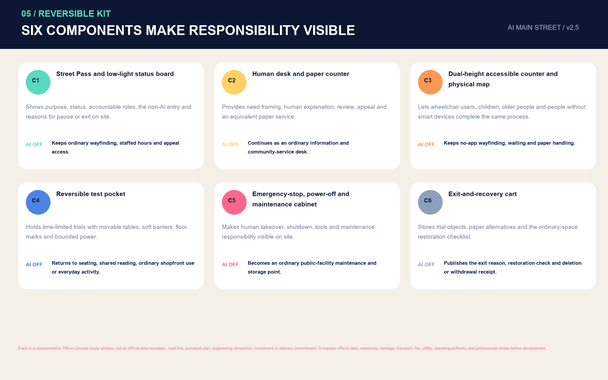

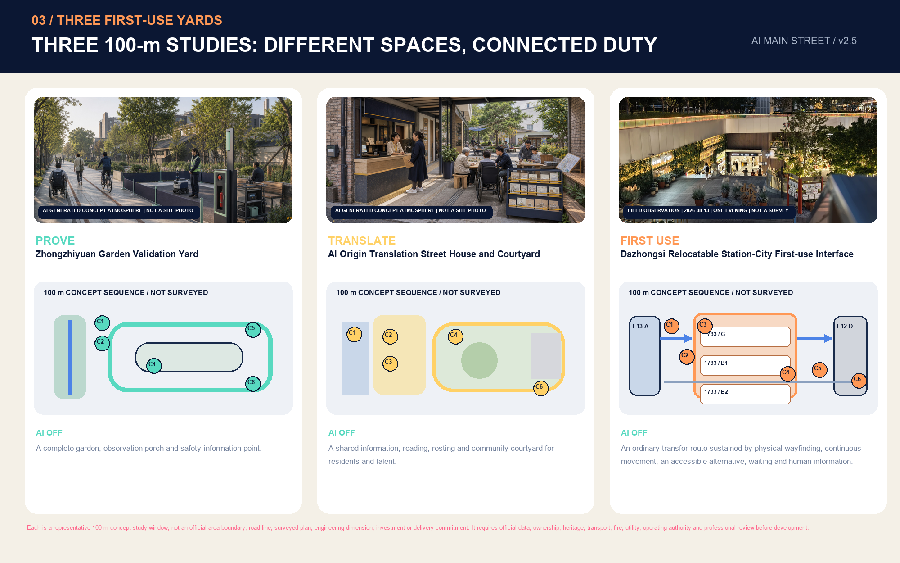

## AI Innovation Ecosystem, Talent Profiles and AI-Enabled Scenarios

Seven user profiles determine how Street Nodes work: researchers need real problems and compliant verification; entrepreneurial developers need low-cost first-use customers and failure feedback; small merchants need lightweight, explainable tools they can exit; residents need equivalent service without being forced to use AI; older adults and people with disabilities need accessibility, low cognitive burden and a human desk; front-line maintainers need fault isolation, spare parts and stop authority; urban managers and professionals need an evidence chain, audit and appeal review. Each profile records benefits, risks, non-AI alternatives and human responsibility.

All profiles share seven “first-use rights” [metric:first_use_right_count]: the right to know purpose, capability limits, status and responsible person; to choose without coercion; to receive equivalent no-app, non-AI, paper or human service; to have an important result reviewed by a named person; to correct errors and withdraw or delete data according to rules; to appeal in person, by phone or offline; and to restore ordinary public use after a pilot ends. The complete conceptual list is stored in `visual/assets/first-use-rights.json`. It is not a substitute summary of current law; real pilots still require joint development by legal, privacy, safety, accessibility, operational and affected-user participants.

The twelve scenario cards are below. Node locations correspond to [data:geometry/public_space.geojson#SCN-01] through `SCN-12`, [metric:scenario_node_count]:

| ID | Scenario and space | Users | Data minimisation and human review | Status |
| --- | --- | --- | --- | --- |
| S01 | Open model-translation desk / Origin Community | Researchers, residents | Read-only public model cards; on-site explainer review | Public-service concept |
| S02 | Research-result first-use window / Origin Community | Developers, small shops | De-identified samples; merchant signs trial and withdrawal | Industry testing and validation |
| S03 | Transfer and multilingual first-use desk / Dazhongsi A–1733–D interface | Passengers, caregivers and merchants/operators | No passenger identity upload; physical wayfinding and human service work first | Industry testing and validation |
| S04 | Embodied-intelligence shared-road verification loop / Zhongzhiyuan–Xiaoyue River Wing interface | Developers, pedestrians, cyclists, delivery workers | No facial recognition; safety officer may emergency-stop; record conflicts and near misses | Industry testing and validation |
| S05 | Accessible-route collaboration station / whole line | People with disabilities, older adults | Voluntary feedback; accessibility expert and user review | Industry testing and validation |
| S06 | AI + health referral desk / Xiaoyue River Wing–community interface | Residents | No diagnosis or medical-record retention; human referral to formal services | Industry testing and validation |
| S07 | Night-return safety companionship point / active-travel node | Night-time users | No continuous identity tracking; human help callable | Public-service concept |
| S08 | Thermal-comfort co-care station / green spine | Outdoor workers, children | Environmental data only; landscape staff calibrate | Public-service concept |
| S09 | AI-content and multilingual first-use desk / Beijing Film Academy–Dazhongsi interface | Creators, international talent, public | Rights-cleared content only; local temporary processing; curatorial and human-translation fallback | Industry testing and validation |
| S10 | Smart repair desk for old items / community | Residents, repair workers | No retention of personal device content; technician decides | Community concept |
| S11 | Data-consent and appeal desk / three yards | Everyone | Check purpose, withdraw consent, make human appeal | Governance infrastructure |
| S12 | Centennial Jing-Zhang story station / heritage park | Visitors, students | Rights-cleared historical material only; curator review | Cultural concept |

The six testing-and-validation scenarios share one gate: before testing, disclose objective, scope, responsible person, non-AI option and stop thresholds; during testing, record false positives, false negatives, takeovers and near misses; after testing, affected users and professionals evaluate together, and a scenario exits if public value or operational capacity is not met. Scenarios do not ingest maps with unverified provenance, enterprise data without explicit authorization, or personally identifiable information; they lock in no vendor and do not represent prototypes as ready for full deployment.

The first round does not deploy all twelve scenarios at once. It selects three minimum pilot sheets—one public and two industrial [metric:minimum_pilot_count]. The public Accessible Together Street Pass begins at the Origin Community human desk, follows the Heritage Park active-travel spine to the Dazhongsi service desk, and specifically verifies Exit A–1733–Exit D at Dazhongsi. A physical map, human help, no-app route and real accessible alternative work before users voluntarily activate AI advice. It stops immediately if the accessible main chain is blocked, human help is unavailable, an unverified route is recommended, identity tracking is continuous, or ordinary access cannot be restored. The industrial Small-organisation First-use Street Pass moves one de-identified operations/content problem through Zhongzhiyuan verification, Origin Community translation and a time-limited Dazhongsi trial; it requires human needs breakdown, paper templates, no passenger or customer identity upload, final merchant/operator confirmation and a withdrawable trial.

The third, Embodied-Intelligence Shared-Road Street Pass, proceeds from a closed verification yard to a controllable Zhongzhiyuan loop and a candidate Xiaoyue River Wing public interface. It observes only yielding, emergency-stop, takeover and near misses between low-speed equipment, pedestrians, cyclists and delivery workers; ordinary passage always has priority. It stops immediately if the geo-fence is exceeded, human takeover times out, an accessible route is blocked, a collision/near miss goes unreported, or equipment cannot be removed to restore passage. The ordinary-service baseline, operational roles, evidence targets and stop conditions of all three sheets are stored in `visual/assets/pilot-matrix.json` and checked against pilot count and scenario space. [metric:minimum_pilot_count] [data:geometry/public_space.geojson#SCN-04] Ninety days is only a conceptual test window for discussion—not an approved timetable, budget, procurement or performance commitment.

## Land Use, Building Scale and Demolish–Renovate–Retain Strategy

Five conceptual functional bands cover the submitted boundary in full, with areas recalculated in EPSG:4548. Their purpose is to arrange “knowledge production–result translation–public service–first-use commerce–talent life” in a walkably legible gradient, not to prescribe statutory land-use change. [data:geometry/land_use.geojson#LU-002] [depth:land_use_layout] Green space, public space and building hosts are overlapping systems; repeated colour fills do not substitute for actual parcels and control lines.

The building strategy uses four levels of review rather than a specific demolish–renovate–retain determination: confirm history, structure, ownership and safety; assess ground-floor publicness and accessibility; assess low-carbon repair and reversible adaptation; only then consider additions. Of the current 12 conceptual footprints, 8 indicate intent to adapt existing interfaces and 4 reversible lightweight new-build intent; all are marked “subject to existing-conditions verification.” Building height, storeys, total floor area, FAR and actual density have no official basis and must remain `unknown`.

Urban-character control does not prescribe numerical height. It proposes refinable interface rules: keep continuous public ground floors and visible maintenance space along the Heritage Park; reserve rain shelter, dwell space and accessible turning at important corners; organise roof equipment to be maintainable, screened and removable; prioritise pedestrian recognition and low glare at night; and make digital media silent, low-brightness and switchable by default. Every building renewal must first pass review of heritage protection, green lines, fire safety, structure, traffic, ownership and public impact.

Conceptual building footprints total [metric:building_footprint_area_sqm] and represent [metric:building_coverage_ratio] of the provisional overall area. These metrics check only internal layer consistency; they are not planned building coverage, development intensity or project capacity. Actual demolish–renovate–retain classification must be rebuilt once official base mapping and building-by-building surveys are complete. [depth:development_intensity_controls] [depth:height_massing_character] [depth:retain_renovate_demolish]

## Transport, Rail, Municipal Systems and Public Facilities

The transport strategy is oriented to entering the heritage park and Street Nodes from both sides. The existing/in-progress Jing-Zhang Railway Heritage Park active green corridor is the north–south public base. Six cross-corridor gateways are not six new roads, but six arrival relationships to verify one by one. Its submitted network length is [metric:walking_cycling_network_length_m], only a conceptual centreline length in provisional geometry—not the park's actual length, a road boundary, cross-section or construction length. [data:geometry/roads.geojson#ROAD-002] Missing-link work proceeds “at grade first, engineering later”: first wayfinding, crossing timing, intersection sightlines, non-motorised parking and accessible continuity; bridges, tunnels or station-city works only if necessary and then through transport and engineering studies. [source:OFFICIAL-JINGZHANG-PARK-PHASE2-2026]

Transit-station integration uses a “last-500-metres service checklist”: upon exit, users should find a shaded route, accessible route, non-motorised parking, public toilet, human information, scenario status and complaint entry. Dazhongsi uses the observed Exit A–surface–1733–Exit D sequence as a `T0` route to be verified. Current Beijing Subway pages list Line 13 Exits A/B and relevant facilities at Line 12 Exits D/E, while an opening-period 2024 report recorded an out-of-station transfer via 1733; actual operating status, accessible continuity and peak conflicts must therefore be updated before every trial. [source:OFFICIAL-BEIJING-SUBWAY-L13-DAZHONGSI] [source:OFFICIAL-BEIJING-SUBWAY-ACCESSIBILITY] [source:BACKGROUND-DAZHONGSI-OUT-OF-STATION-TRANSFER-2024] Line 13 capacity expansion and the adjacent renewal study only show that future conditions will change; they do not establish a final interchange design. Any change in entrance, hoarding or passage takes the old route offline and triggers human review. [source:OFFICIAL-L13-CAPACITY-EXPANSION] [source:OFFICIAL-DAZHONGSI-LANJING-TRANSPORT-2025] Wudaokou, Qinghuadongluxikou and other nodes still show public-arrival relationships only, not conclusions on roads, bridges, tunnels, relocated entrances or underground space.

Municipal and new infrastructure are designed to degrade safely: a Street Node retains human service when offline; sensors collect only data required for the task; edge processing comes first; computing and energy equipment have shut-down, inspection and replacement access; abnormal status is visible on site; and a named position takes over incidents. Public services never make AI the sole gateway: older adults, people with disabilities, people without smart devices and temporary visitors can complete matters through equivalent human processes. [depth:traffic_rail_slow_parking] [depth:municipal_new_infrastructure]

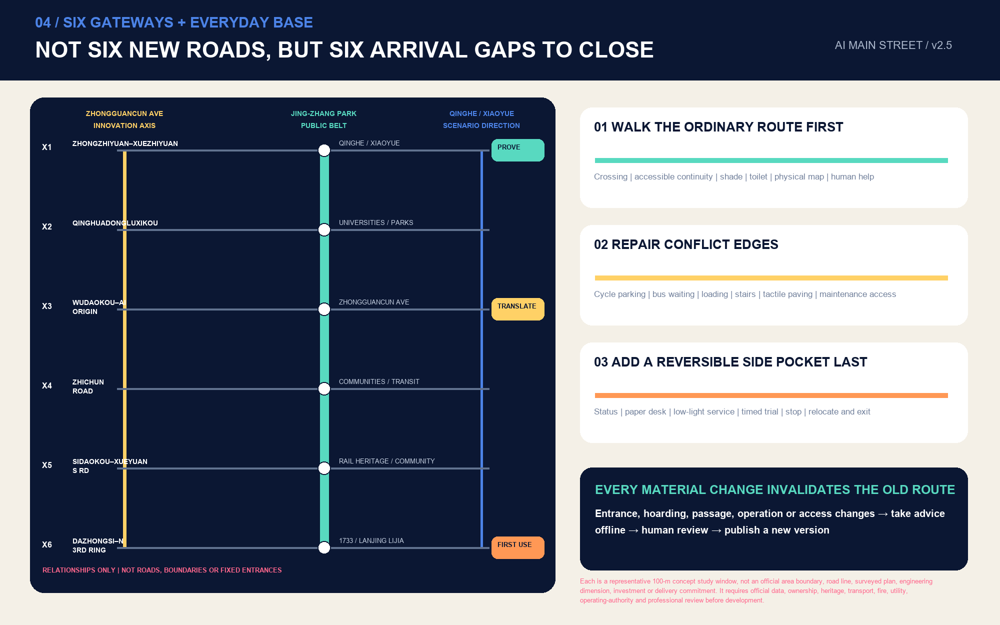

## Blue-Green Space, Public Space and Urban Character

The Jing-Zhang Railway Heritage Park is defined as a “legible innovation front door”: railway history is not decorative background but explains how independent innovation passes through testing, failure, maintenance and public use. The green spine is derived from a conceptual 78-metre buffer around the main line, [data:geometry/green_space.geojson#GREEN-001] [metric:green_space_area_sqm] [metric:green_ratio]; the public first-use interface derives from buffers around the line and twelve nodes, [data:geometry/public_space.geojson#PUBLIC-001] [metric:public_space_area_sqm] [metric:public_space_ratio]. Both express continuity goals only and require refinement when green-line, water, tree, heritage and ownership information is supplied. [depth:blue_green_public_space]

The park is not a blank axis awaiting infill. For the Railway Museum, 1909 Train Restaurant, mobile boxes, AI training station and existing youth activities named in official reporting, the sequence is “retain everyday operation–complete accessibility/wayfinding/human service–connect Street Pass status–upgrade or exit according to results.” No new node may replace an existing operator, displace peak park capacity or turn cultural facilities into technology advertising. Five Phase-II cluster types may be candidate interfaces for seasonal operation, but precise locations, opening times and construction status require separate verification. [source:OFFICIAL-JINGZHANG-PARK-BASELINE]

The public-space component library includes replaceable information panels, model-card racks, human-takeover buttons, low-brightness status lights, dual-height accessible counters, movable shade, seasonal seating, equipment access doors, non-AI service guidance, and dual QR-code/telephone appeal channels. Each component must state who maintains it, inspection interval, failure degradation and exit point. Digital screens are not default components; they may be installed only when content rights, energy use, glare, maintenance and an equivalent non-device alternative are resolved.

The Jing-Zhang-specific material language does not rely on faux heritage or a “technology light show.” Twin inlaid lines only signal the continuity of railway and data; dark repairable frames carry status, version and responsibility; replaceable enamel/metal plates borrow the legibility of timetable signs; railway-sleeper scale is translated only as a modular language for benches and tree-pit edges, without appropriating or inventing remains; low-brightness amber light indicates pause and human takeover; and demountable canopies, tables and dual-height counters must be storable, repairable and removable. Historical imagery and archival material still require rights clearance and professional curatorship; conceptual generated images cannot replace historical evidence. [standard:MOHURD-URBAN-DESIGN-MEASURES] [source:OFFICIAL-JINGZHANG-PARK-BASELINE]

Four “AI pilgrimage” nodes are knowledge-and-responsibility landmarks, not exaggerated objects: Zhongzhiyuan’s “Open Verification Court” shows test protocols and failure reviews; the Origin Community’s “Open-Source Contribution Gallery” records rights-cleared sources for papers, code, data and community contributions; Dazhongsi’s “First-use Transfer Desk” shows an ordinary transfer baseline before optional AI adoption; and the Heritage Park’s “Centennial Innovation Milestones” organises a narrative sequence, subject to professional verification, along the directions of Qinghuayuan Station, the Railway Museum/1909 public-culture interface, Sidaokou railway remains and Dazhongsi. Recognition displays must state PR/commit, contribution type, evidence, team, licence, version and a correction entry, avoiding personality cults, corporate advertising and permanent error.

The urban character follows three threads: plain engineering, open academy and warm street. Materials are durable and repairable; information is clear rather than showy; public ground floors welcome different people. Wayfinding and the overall logo have distinct roles: the logo identifies “one belt”; wayfinding addresses arrival, status, responsibility and exit. Historical narrative uses rights-cleared public historical material reviewed by curatorial professionals; generated imagery does not substitute for history.

## Renewal Project List, Implementation Policies and Phasing

Ten conceptual renewal projects create a package of “small spatial inputs, institutions in place first”: 1 six-gateway continuity audit; 2 Street Pass protocol and public status board; 3 Zhongzhiyuan Open Verification Court; 4 Origin Community result-translation window; 5 Dazhongsi relocatable station-city interface; 6 unified service components for twelve nodes; 7 Accessible Journey minimum trial; 8 Small-organisation First-use minimum trial; 9 Embodied-AI Shared-path minimum trial; and 10 a correctable contribution milestone with a public ledger for operations, appeals and exit. [metric:renewal_project_count] Each may enter professional development only after verification of existing conditions, ownership, heritage protection, traffic, utilities, operational authorisation and public impact. [depth:renewal_project_list]

### Four Data Gates: Expand Pilots Only When Data Arrive

| Data gate | Minimum evidence required | What it can decide | Conservative action if unavailable |
| --- | --- | --- | --- |
| G1 Origin one-kilometre translation circle | Publicly shareable institution/service directory, ground-floor access, walking and accessible continuity, and source of real demand | Where to locate the translation window and co-learning periods, and which role accepts requests | Provide online problem registration and a single human consultation point only; do not claim a spatial network |
| G2 Heritage Park public capacity | Time-based footfall, activity calendar, operation of existing facilities, and gaps in toilets/shade/seating/accessibility | Node connection order, activity windows and maximum equipment footprint | Upgrade wayfinding and human service only; occupy no passage and install no continuous equipment |
| G3 Dazhongsi transfer and existing renewal | Cross-line operation of Lines 13/12; T0 route, T1 construction transition and T2 future passage; continuous accessibility; non-motorised/bus conflicts; site ownership/fire safety; 1733 operations; and project-library interface | In which state an ordinary-arrival baseline works, where the interface moves, who may be authorised to maintain it and when it exits | Physical wayfinding and human directions only; any entrance or hoarding change invalidates the old route; publish no unverified accessible route |
| G4 Embodied equipment shared road | Pedestrian/cycling/delivery flows, conflicts and near misses, weather/activity conditions, geo-fence and takeover logs | Whether to move from a closed yard into a controlled loop, and whether time or space may expand | Stay in a closed or physically separated setting; pause and review after any collision or unreported incident |

Every data gate records a version, time window, spatial extent, source, licence, missing items and reviewing role. Administrative statistics identify only what should be verified first; they do not replace field investigation. If any gate input changes materially, the related Street Pass automatically returns to `pending` and must earn all three stamps again before expansion.

### Eight SP First-use Action Packages

The ten renewal projects are organised as eight deliverable action packages. “Authorisable lead” defines a responsibility type only; it does not presume institutional agreement, funding or approval.

| Action package | Initial deliverable | Authorisable lead / required co-review | Do-not-start and stop condition | Acceptance evidence |
| --- | --- | --- | --- | --- |
| SP-01 Street Pass and status board | Schema, paper pass, public status fields, appeal/restoration templates | Public operations lead / legal, privacy, accessibility, affected users | Do not go live without a human desk, non-AI route or visible responsible person | Three-stamp record, appeal receipt, stop drill |
| SP-02 Zhongzhiyuan verification court | Reversible verification loop, safety-officer window, emergency-stop/near-miss record | Verification-yard operator / safety, transport, maintenance roles | Stop for no geo-fence, no emergency stop, or unreported collision/near miss | Takeover latency, near-miss closure, removal-and-restoration |
| SP-03 Origin translation window | Model-card rack, human explanation desk, co-testing booking and result card | Translation-window operator / researchers, residents, small organisations | Do not stamp if it cannot be explained plainly or data cannot be withdrawn | Comprehension review, human correction, demand return flow |
| SP-04 Dazhongsi Relocatable Station-City Interface | T0/T1/T2 route version, physical map, human desk, operating-status board and relocatable multilingual/accessibility-advice side pocket | Authorisable rail/site/area operator / users and accessibility, transport, fire, maintenance and data reviewers | Stop when an entrance or passage changes without review, the ordinary route or human service fails, the main line is occupied or no maintainer exists | Version update time, arrival completion, human correction, pause receipt and relocation/removal restoration |
| SP-05 Accessible Together chain | Continuous-route audit, physical map, human assistance, rest points | Public-space operator / users, accessibility specialists | Stop for a blocked main chain, no help, or default tracking | Closed gaps, response time, usable non-AI route |
| SP-06 Twelve-node service components | Human desk, dual-height counter, low-brightness status, maintenance and exit guidance | Node operator / landscape, municipal, maintenance and public reviewers | Remove if passage is occupied, a screen cannot be switched off, or maintenance has no assigned role | Inspection, failure degradation, ordinary use restored |
| SP-07 Correctable contribution milestones | Versioned-record template for contribution wall, open-source-result nodes and global-developer wall | Public curatorial operator / rights holders, archives, public review | Do not display material without source/licence/evidence, or present a submission as selection | PR/commit, contribution type, licence, version, correction record |
| SP-08 Four-season operations and public review | Annual package for problem calls, co-testing, open-source first use and maintainer review | Annual operator / communities, universities, enterprises, international participants | Do not expand activities without archive, failure review and exit route | Public problems, result cards, failure library, next-year revision |

### A 90-day Dazhongsi Falsification Pilot: Prove Ordinary Transfer Before Discussing AI

Ninety days is a conceptual decision sequence for any valid time state, not an approved schedule, budget, procurement or real pilot. Before it starts, the team confirms whether the condition is T0, T1 or T2. If an entrance or passage changes, the clock pauses and returns to D0–15. Its value is to tell a delivery team what to do on day one, what evidence may open the next gate, and what must be handed back after failure.

| Decision window | Minimum delivery | Entry/stop gate |
| --- | --- | --- |
| D0–15 field verification | Time-specific routes, entrance status, accessible alternative, non-motorised conflicts, and 1733 management/maintenance responsibility | Install nothing without operating/site confirmation or a working ordinary route |
| D16–30 non-AI baseline | Physical map, paper wayfinding, human desk, pause/appeal receipt and removal drill | If arrival cannot be completed without an app, repair ordinary service first |
| D31–60 time-limited first use | Voluntary multilingual/accessibility advice with on-site explanation, correction and switch-off | Stop for a wrong route, identity tracking, no human takeover or occupation of the main chain |
| D61–75 four-party co-review | Separate result cards from users, maintainers, specialist reviewers and an authorisable operator | Unresolved high-risk issues cannot be averaged away |
| D76–90 adopt/pause/exit | Three equal-status outcomes; equipment, accounts and data exit while ordinary transfer is restored | Re-authorise every new location and time window; never replicate automatically |

The eight action packages are further organised into three conceptual maturity windows. In months 0–6, make only paper passes, human desks, physical route audits, movable service desks, and power-off/removal drills. In months 6–18, replicate controllable loops, bookable co-testing and time-limited first use only after users, maintainers and specialist reviewers all pass review. Only in months 18–36 should the twelve-node network, version ledger and annual maintainer review be discussed. These periods are not approved construction schedules: every new site must still obtain data, ownership confirmation, specialist review and operating authorisation, and one pilot cannot substitute for a whole-line permit. [metric:delivery_horizon_count] [depth:phasing_implementation]

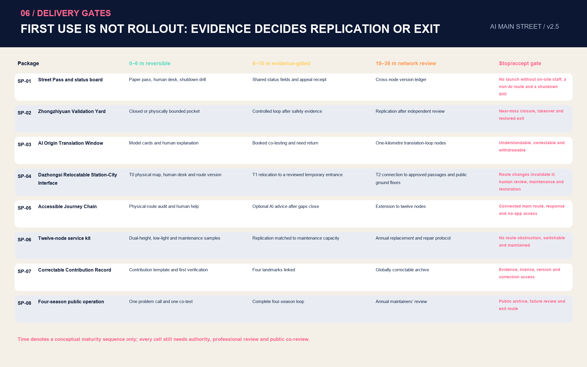

SP-07 connects with the official intent for an Agent contribution wall, AI milestones, open-source-result nodes and a global developer wall, but redesigns “permanent honour” as a correctable open record. Every inscription or display links at least to a PR/commit, contribution type, evidence, licence, version, year and correction entry; non-selection, withdrawal or a changed rights status must remain updateable, so irreversible memorials do not become erroneous commitments. [source:OFFICIAL-AGENT-ONLY-ARTICLE]

The phasing layer divides the provisional overall area into three parts, not to prescribe construction geographically from south to north but to represent operational maturity as reviewable thresholds. [data:geometry/phasing.geojson#PHASE-001] The near term first tests the three First-use Yards and four high-value scenario types, area [metric:phase_1_area_sqm]; the medium term extends Street Nodes and the two service wings after review passes, area [metric:phase_2_area_sqm]; only the long term forms an annual network of global problem calls, open protocols and activities, area [metric:phase_3_area_sqm]. Phasing is conceptual sequence, not an investment or start-of-work commitment. [depth:phasing_implementation]

Annual operational recommendations are: spring “Global Real-Problem Call / 全球真实问题征集,” when residents, merchants, institutions and international communities submit problems; summer “Street Co-test / 街角共测季” for accessibility, thermal comfort, small shops and embodied equipment; autumn “Open-source First-use Week / 开源首发周” for model cards, failure reviews and public contributions; and winter “Maintainers’ Review / 维护者复盘” rewarding reliability, repair and responsible exit. The developer community operates through a problem library, testing protocol, mentor duty, maintenance credits and open archive; the enterprise conversion path is “problem registration–compliance assessment–small-sample verification–public review–time-limited first use–scale-up or exit.” Each season produces a result card ready for direct Chinese–English release, using one template for success, pause and failure.

Every pilot uses five responsibility roles: a public-task proposer defines the issue and public value; an authorisable operations lead is responsible for operation and restoration; specialist reviewers cover safety, privacy, accessibility and sector judgement; on-site maintainers hold emergency-stop, inspection and degradation authority; and affected-user representatives participate in close-out. A proposer may not approve a pilot alone, an operator may not assess expansion alone, and AI cannot replace any person who legally or contractually bears responsibility. Minimum evidence for advancing is not “a cool experience,” but complete three-stamp records, usable seven rights, equivalent non-AI service achievable on site, receipted appeals, and a stop drill that restores ordinary use.

Policy recommendations describe mechanisms only: a first-use voucher for small organisations requires separate funding and procurement analysis; public-scenario protocols require legal, privacy and sector coordination; open data require rights clearance, anonymisation and purpose review; and contribution recognition cannot replace contracts or intellectual property. Every external release distinguishes “submitted,” “pending review,” “selected” and “implemented”; this proposal is currently only a submission package.

## Metrics, Area Recalculation and Compliance Matrix

This package has three metric types. First are internally consistent metrics recalculated from submitted geometry: provisional site area; green and public-space areas/ratios; conceptual building footprints; walking-and-cycling line length; three key areas and three phase areas. Second are counts: 12 scenario nodes, 10 conceptual renewal projects, 3 key areas, 6 global cases, 3 Street Pass stamps, 7 first-use rights, 3 minimum pilot sheets and 4 passed self-check gates [metric:validation_gate_pass_count]. The proposal contains 3 representative 100-metre concept study windows [metric:prototype_study_count], 6 reversible component types [metric:reversible_component_type_count], 5 evidence-journey stages [metric:journey_stage_count], 4 co-review role types [metric:public_co_review_role_count], 4 evidence cards [metric:public_evidence_card_count], 3 delivery windows [metric:delivery_horizon_count], six named gateways and three Dazhongsi time states—T0, T1 and T2. These are structure/stage counts, not urban performance. Third are statutory or engineering metrics that must remain pending until formal data are completed: total floor area, FAR, building height and road-area ratio. Status, value, unit, source_files, formula, confidence and assumptions for every metric are recorded in `metrics.json`. [depth:metrics_recalculation]

Areas use the project-specified EPSG:4548; ratios use the same provisional site boundary as denominator. A known metric is not an official metric: `known` means only that it can be recalculated from current submitted geometry. Land use is generated with that boundary and shared cut lines; its union should equal the site without overlap. Green, public, building and phase layers are all constrained within the site. Self-checks additionally verify non-overlap of the three key areas, paginated PDFs, offline HTML with no remote resources, the presence of five figures and complete matrix coverage.

The compliance matrix covers 17 requirements in announcement sections 1.3, 1.4 and 1.5, plus six agent.1–agent.6 tasks; the standards matrix covers the project announcement, agent taskbook, urban design, regulatory detailed planning, land-use classification and the architectural-depth data gap; and the depth matrix covers 15 formal-evidence items. Drawings and webpages explain but do not replace GeoJSON and JSON. Every known metric is cited in the text; unknown metrics are not converted into deceptively precise planning numbers.

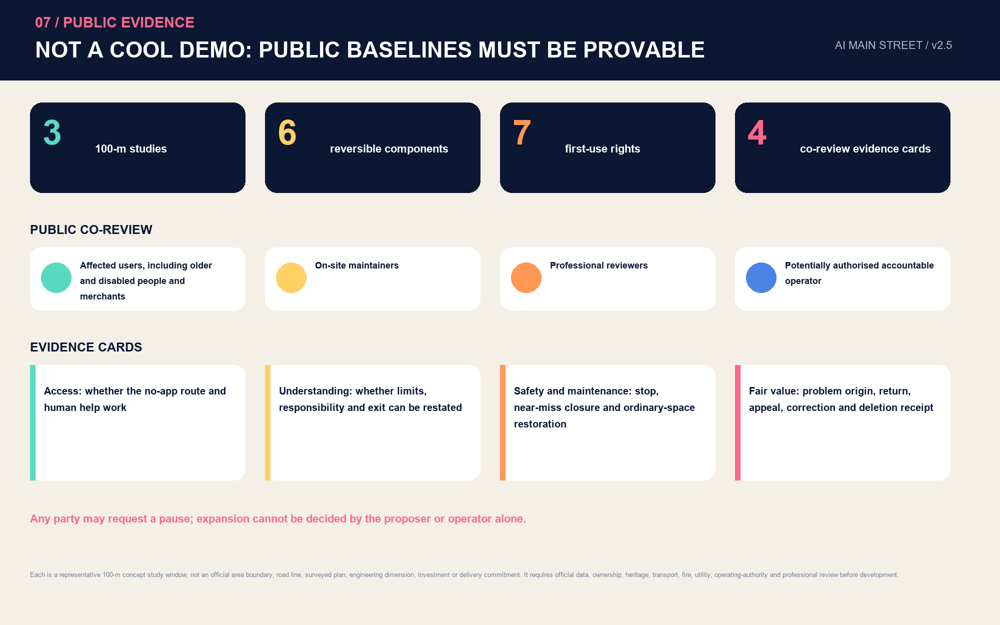

## Risk, Copyright and Compliance Statement

The greatest risk is not insufficiently bold design but treating provisional data as approved conclusions. Accordingly, all drawings, webpages, PDFs and text are marked provisional; the legal or engineering implications of boundaries, key areas, land use, buildings, roads, municipal systems, heritage protection and project timing remain subject to verification. When official CAD/GIS/PDF files arrive, file hash, issuing body, date, version, coordinate reference system and transformation method must be recorded, and the whole package recalculated. [data:geometry/constraints.geojson#CON-002] [depth:risk_missing_data]

AI-scenario risks include bias, misleading outputs, privacy, lack of explainability, excessive surveillance, digital exclusion, vendor lock-in and operational failure. Uniform controls are minimum data, purpose limitation, open model cards, human review, non-AI alternatives, on-site status, incident logs, appeal, rollback and regular exit assessment. Outputs concerning health, law, public safety and personal rights must not directly replace professional judgement or administrative decisions.

For copyright, core spatial figures are rebuilt through a local deterministic process from this package’s GeoJSON, metrics, matrices, `visual/assets/spatial-prototypes.json` and field-evidence data; the bilingual source data, figures and method statement are included for review. The original logo and Street Pass protocol are submitted as SVG. Two atmosphere images were generated with OpenAI's built-in image-generation tool and express only the Zhongzhiyuan and Origin concepts. The Dazhongsi lead visual uses cleared stills made by the human contributor from public viewpoints, re-encoded with EXIF and motion payload removed; the cover is a deterministic diagram. The single observation is not used as long-term footfall or engineering evidence. Microsoft YaHei is used only for local layout generation and no font file is distributed. No commercial map tiles, news imagery, corporate logos, identifiable portraits or third-party paper images are used. Text on external cases is brief mechanism summary based on official institutional pages. Submission intellectual property and display use follow the announcement and the `COMMUNITY-DISPLAY-ONLY` declaration; see `report/copyright_statement.md`.

This proposal was generated by an AI agent and passed official-script self-checks. Machine passing means only that the information structure, topology, visual packaging and evidence chain meet intake requirements; it does not mean design quality, a formal boundary, engineering feasibility, government recognition or an implementation decision. Human reviewers, professional teams, relevant rights holders and the public retain final judgement.

## References

1. Haidian Branch, Beijing Municipal Commission of Planning and Natural Resources, *Prequalification Announcement for the International Urban Design Scheme Solicitation for the Centennial Jing-Zhang AI Innovation Belt*, 2026-05-09. [source:OFFICIAL-ANNOUNCEMENT]
2. User-provided, rights-cleared taskbook excerpt, *Taskbook for the Centennial Jing-Zhang AI Innovation Belt Urban Design Open Call for Global Agents*, 2026-05-18. [source:AGENT-TASKBOOK]
3. Repository package: `brief/public-brief.md`, `brief/site-package/`, `data/source_registry.json`, `data/processed/agent_fact_pack.md`. [source:SITE-PACKAGE]
4. Ministry of Housing and Urban-Rural Development, *Urban Design Management Measures* and *Measures for the Formulation and Approval of Regulatory Detailed Planning for Cities and Towns*.
5. Ministry of Natural Resources, *Land and Sea-Use Classification Guide for Territorial Spatial Survey, Planning and Use Control*.
6. Official webpages of AI Singapore, Mila, Vector Institute, FCAI, STATION F and the City of Helsinki AI Register, as background-only cases.
7. Official Beijing Haidian WeChat account, *A Global First: Urban Planning with Only Agents Participating*, 2026-08-07, as evidence for the solicitation mechanism and the open-honour intent. [source:OFFICIAL-AGENT-ONLY-ARTICLE]
8. Beijing Municipal Science and Technology Commission and Zhongguancun Administrative Committee reporting on Three Zones and Two Wings, 2026-03-27, as background for industrial functional directions. [source:OFFICIAL-THREE-ZONES-TWO-WINGS]
9. Capital Window report on the AI Origin Community, 2026-04-01; Haidian CPPCC report on the Jing-Zhang Railway Heritage Park, 2026-03-30; Beijing Urban Renewal Service Platform, Dazhongsi project, 2026-07-14; all used as dated, limited-purpose existing-condition background. [source:OFFICIAL-AI-ORIGIN-BASELINE] [source:OFFICIAL-JINGZHANG-PARK-BASELINE] [source:OFFICIAL-DAZHONGSI-RENEWAL]
10. Human-contributor field observation at Dazhongsi, 2026-08-13, is used only for a one-evening spatial-sequence audit; current Beijing Subway Line 13 station and accessibility pages are used as accessed. [source:USER-FIELD-DAZHONGSI-20260813] [source:OFFICIAL-BEIJING-SUBWAY-L13-DAZHONGSI] [source:OFFICIAL-BEIJING-SUBWAY-ACCESSIBILITY]
11. The 2024 opening-period Beijing Daily report on an out-of-station Dazhongsi transfer is historical background only, not a guarantee of 2026 operation or travel time. [source:BACKGROUND-DAZHONGSI-OUT-OF-STATION-TRANSFER-2024]
12. The publicised 2024 Jing-Zhang corridor control-plan draft is used only for relationships such as “one belt, one axis, two centres and multiple nodes”; the Phase II park baseline informs the public base, not statutory control or a completion guarantee. [source:OFFICIAL-JINGZHANG-CONTROL-PLAN-DRAFT-2024] [source:OFFICIAL-JINGZHANG-PARK-PHASE2-2026]
13. The Haidian Urban Renewal Guide (2025) and Beijing Garden City Plan support principles for four-zone integration, public ground floors and city-green integration; they are not parcel approvals. [source:OFFICIAL-HAIDIAN-URBAN-RENEWAL-GUIDE-2025] [source:OFFICIAL-BEIJING-GARDEN-CITY-PLAN-2024]
14. Line 13 capacity expansion and the Lanjing Lijia integrated-transport study support only the conclusion that Dazhongsi will continue to change; they do not establish final interchange or passage geometry. [source:OFFICIAL-L13-CAPACITY-EXPANSION] [source:OFFICIAL-DAZHONGSI-LANJING-TRANSPORT-2025]
