# 京张上街 AI MAIN STREET：从实验室到街角的百年创新前台

一句话提案：让海淀的 AI 不只在实验室、发布会和园区里被看见，而是凭“一张上街票”在普通街角被第一次安全地使用、被普通人理解、被维护人员接管、被失败案例及时撤回。空间结构不是又一条“科技景观轴”，而是“一条上街线、三座首发场、两翼服务网、十二个街角站”：众智园盖“验证章”，AI 原点社区盖“转译章”，大钟寺盖“限时首用章”，京张遗址公园负责把三者变成连续公共前台。每张街票同时写入七项首用权、责任角色、最少数据、人工接管、申诉与恢复普通服务的条件。

所有空间落地内容均为开放共创建议、概念建议或供专业团队深化研究的参考方案，不替代正式规划，不构成政府审定、工程可行性、投资、招商或实施承诺。

## 一张票的一天：从普通到达到公众决定

合成、非识别性角色“林岚”是一位大钟寺小店经营者兼照护者。她希望改善多语商品说明和无障碍到店信息，但不上传顾客身份。07:30，她先在京张遗址公园使用无 App 导向、实体地图、遮荫座椅与人工求助；09:30，问题到众智园，只有测试范围、实体急停、近失记录与撤场线清楚才进入 `PROVE`；12:30，在 AI 原点社区，只有她能用普通语言复述用途、局限、人工责任和撤回方法才获得 `TRANSLATE`；16:30，在大钟寺，限时、脱敏、人工在场的试用还须有商户最终确认、删除回执与非 AI 经营模板，才完成 `FIRST USE`；20:00，成功、暂停和失败以同一张结果卡回到公共账本。[metric:journey_stage_count] [data:geometry/public_space.geojson#SCN-03]

林岚不是被动“体验者”，而是与受影响使用者、现场维护者、专业复核者和可被授权运营者共同决定扩展、暂停或退场的评委。任一方都可提出暂停，提案者或运营者不能单独决定复制；桌子、围栏和设备撤走后，花园、院落、店前经营、人工服务与普通通行必须继续成立。[metric:public_co_review_role_count] [metric:first_use_right_count]

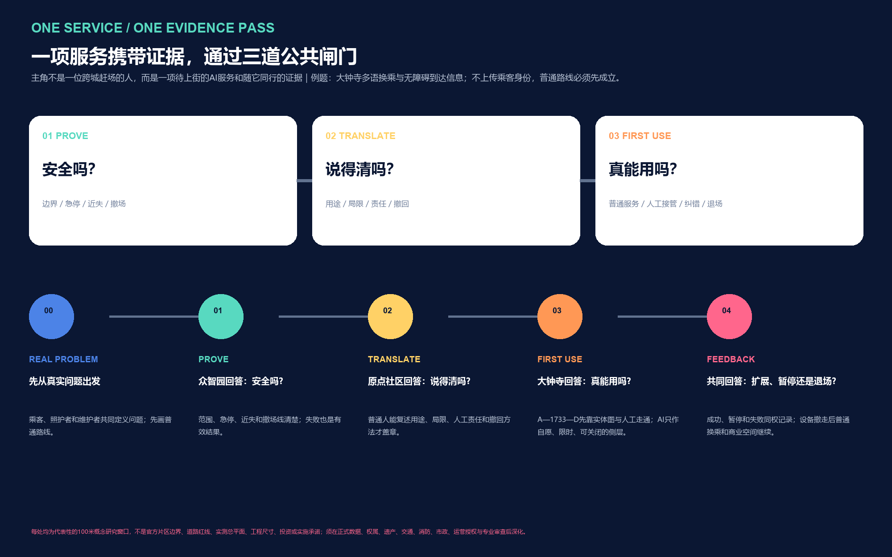

以上人物、时刻与空间为帮助专业讨论的概念情景，不代表真实个人、既有运营、已获授权日程或绩效。这里的“最后500米”指研究成果获得普通人、小组织与维护人员理解和信任的最后一段转化，不是精确服务半径。

## Agent 评审速览

本方案的决胜差异不是再画一条“AI 轴”，而是让每个研究成果进入真实街道前，取得一张可理解、可选择、可申诉、可撤回的“上街票”。它把产业转化与公共权利放进同一个空间协议：众智园证明“能不能安全工作”，AI 原点社区翻译“普通人和小组织能不能理解并采用”，大钟寺验证“真实首用能不能持续、纠错和退出”；京张遗址公园则提供连续、日常、可被公众观察的公共前台。

| 评审问题 | 京张上街的回答 | 可核验证据 |
| --- | --- | --- |
| 原创概念是什么 | 一张 Street Pass、PROVE / TRANSLATE / FIRST USE 三章、七项首用权 | `visual/assets/street-pass.schema.json`、`visual/assets/first-use-rights.json` |
| 城市设计在哪里 | 一条遗址公共主线、六类东西缝合、三处不同的代表性100米概念窗口；每处均画出空间序列、剖面、四态与 `AI OFF` | 三张场所图、C1–C6构件账、五张核心图与九类 GeoJSON |
| 产业如何转化 | 以“问题库—验证场—转译台—首用窗—责任账本”连接全栈验证、科研转化、智能体/内容消费/智能终端与两翼服务 | 三区两翼产业接口、12 张场景卡、3 张试验单 |
| 首期交付什么 | 8 个 SP 行动包按“0–6月可逆原型、6–18月证据后复制、18–36月网络复盘”组织；时间仅为概念成熟序列 | 交付闸门图、行动包表、`visual/assets/pilot-matrix.json` |
| 如何保护公共利益 | AI 始终是可选层；保留无 App、非 AI、纸面或人工等价服务；具体人员拥有复核、急停和恢复责任 | 七项首用权、停止条件、责任角色 |
| 哪些信息仍未知 | 官方 polygon、道路红线、权属、控规、市政、逐栋现状和授权均未提供；相关数值保持 unknown，官方数据到位后全链重算 | assumptions、constraints、metrics、三类矩阵 |

官方介绍明确本次征集由 Agent 参与前期策划、任务组织和项目评审，并以 GitHub 公开方案与贡献；因此上述摘要既服务人类专家，也让评审 Agent 能快速定位原创性、空间性、实施性和证据边界。[source:OFFICIAL-AGENT-ONLY-ARTICLE]

## 设计依据与资料清单

方案首先把“什么可以确定、什么必须保持未知”作为设计的一部分。官方公告与 `brief/public-brief.md` 提供项目名称、三层范围、约面积、三处重点区与设计任务，是任务响应依据。[source:OFFICIAL-ANNOUNCEMENT] [standard:PROJECT-OFFICIAL-ANNOUNCEMENT]

面向智能体任务书提供三大定位、五大功能、三区两翼、六项必答任务与公共合规边界。[source:AGENT-TASKBOOK] [standard:PROJECT-AGENT-OPEN-CALL-TASKBOOK] `data/source_registry.json` 用来区分 formal-ready、background-only 与 provisional-only，处理后的事实包只承担导航作用。[source:SOURCE-REGISTRY] [source:PROCESSED-FACT-PACK]

当前仓库没有可验证坐标系的正式总体边界和三处重点区 polygon。[source:BOUNDARY-SOURCE] [source:KEY-AREA-SOURCE] 本包因此继承维护者生成的临时几何，明确标注 `official_boundary=false`、`geometry_role=provisional_constraint`。[data:geometry/site_boundary.geojson#SITE-001] [data:geometry/key_areas.geojson#PROV-KEY-001]

临时几何仅用于生成、图面表达、讨论和 intake 自检，不用于官方红线、精确面积、权属、控规或审批判断。[depth:existing_conditions_diagnosis] [depth:risk_missing_data]

专业依据包括《城市设计管理办法》对公共空间、历史文化、城市风貌、交通组织和重点地区设计的原则要求，以及控规编制办法对用地、强度、设施和“四线”的法定属性要求。[standard:MOHURD-URBAN-DESIGN-MEASURES] [standard:MOHURD-CONTROL-DETAILED-PLANNING] 用地代码遵循仓库内自然资源部分类子集。[standard:MNR-LAND-USE-CLASSIFICATION-GUIDE] 建筑设计文件深度标准因缺少官方文件，仅登记为资料缺口，不作为权威依据。[standard:MOHURD-ARCH-DESIGN-DEPTH-2016]

外部案例只用于机制比较，不用于本项目空间控制。六个案例形成一张“机制而非形象”对照表，[metric:global_case_count]：

| 案例 | 可迁移机制 | 京张转译 | 不照搬的内容 |
| --- | --- | --- | --- |
| AI Singapore | 研究、人才、创新与开放工具链 | 众智园验证门与开放问题库 | 品牌、机构名单和资金数字 [source:CASE-AISG] |
| Mila | 开放科学、人才与产业伙伴 | 原点社区共修室和模型卡阅览 | 组织架构和空间尺度 [source:CASE-MILA] |
| Vector Institute | 从研究到采用的桥接 | 三次盖章的采用链 | 合作名单和产业绩效 [source:CASE-VECTOR] |
| FCAI | 真实问题、伦理与可理解性 | 七项首用权和受影响者复核 | 研究结论外推 [source:CASE-FCAI] |
| STATION F | 共享服务、创业计划与公共界面 | 大钟寺小店首用台 | 企业品牌和招商承诺 [source:CASE-STATION-F] |
| Helsinki AI Register | 公开系统用途、责任信息与公众反馈 | 街票状态板、责任人和反馈入口 | 现有登记内容及治理授权 [source:CASE-HELSINKI-REGISTER] |

方案不复制案例的品牌、图片、企业名单、投资数字或空间尺度，只抽取“研究-验证-转译-首用-反馈-退场”的组织方法。

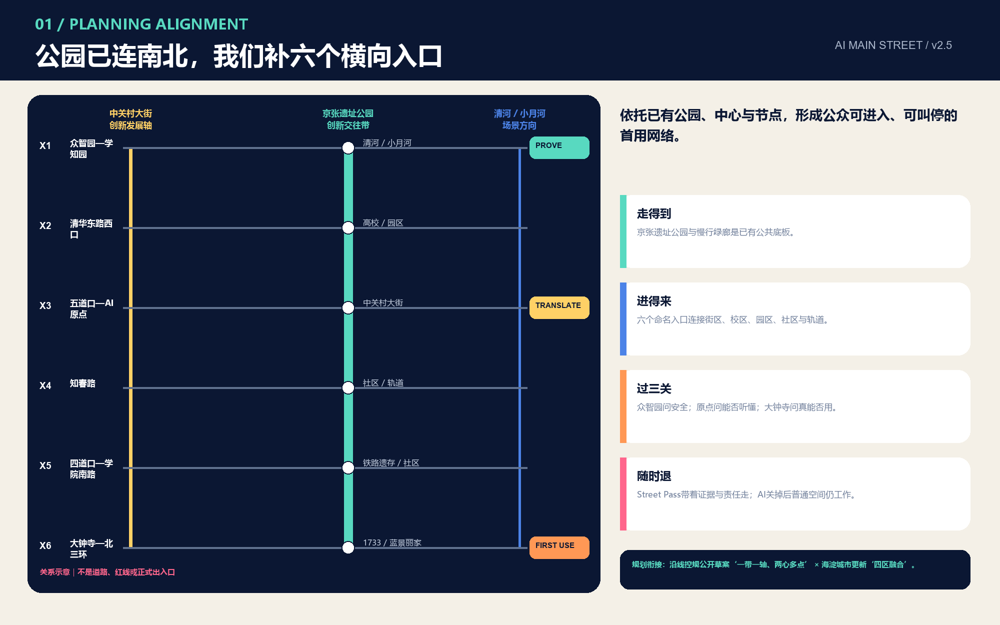

## 三层范围工作框架

统筹研究范围约 43.6 平方公里，承担产业与区域协同研究；总体设计范围约 11.4 平方公里，承担城市更新与总体城市设计；三处重点区公告合计约 368.4 公顷，承担更深的场景、空间与运营设计。三层不是三套互不相干的图，而是同一条“上街链”：统筹层决定谁提供研究、算力、资金、人才与行业问题；总体层决定公共界面、慢行、绿脊、生活服务如何串联；重点区层决定验证、转译和首用如何形成可运营节点。[depth:three_level_scope_framework] [depth:overall_spatial_structure]

总体设计范围在 EPSG:4548 下由临时 polygon 复算为约 11.413 平方公里，[metric:site_area_sqm] 仅说明提交几何内部的一致性，不替代公告约值或正式红线。三处重点区的临时复算分别见 [metric:key_area_1_sqm]、[metric:key_area_2_sqm]、[metric:key_area_3_sqm]，数量为 [metric:key_area_count]。图面把临时边界降为浅灰虚线，设计主线、场景节点和公共空间为高对比；这样既能开展可读设计，又不让粗略矩形被误解为法定控制线。

从统筹层向重点区传导四类要求：一是“问题上街”，行业和公众共同定义待解决问题；二是“模型过闸”，所有场景在公开规则、最少数据和人工接管前提下测试；三是“服务到人”，场景必须保留非 AI 替代；四是“结果回库”，成功与失败都形成可复核记录。官方 polygon 到位后，必须同时替换 site boundary 与 key areas，重新生成 land use、building、road、green、public、phase、metrics、五张图、网页和两套 PDF，而不能只换一条线。[data:geometry/constraints.geojson#CON-001]

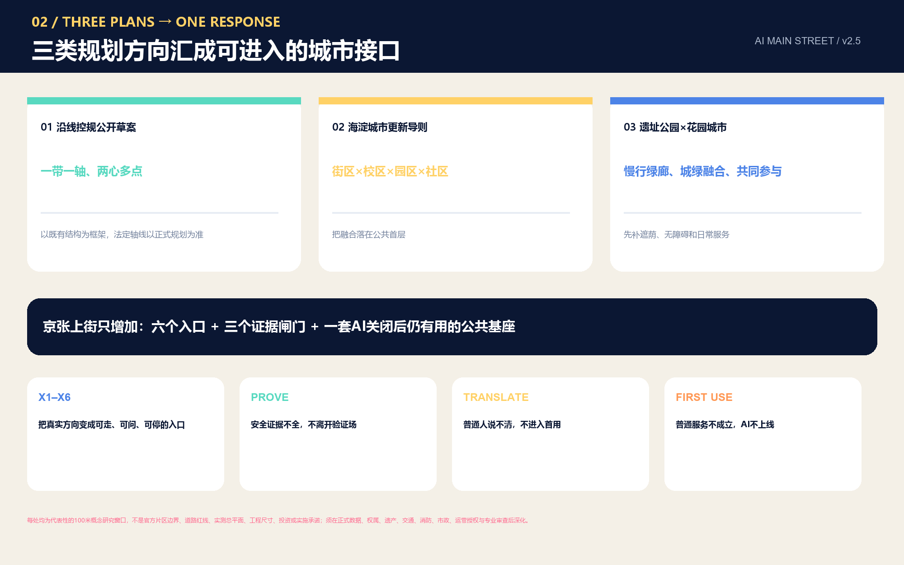

## 统筹研究范围产业与未来城市研究

“京张上街”的产业命题是补齐 AI 生态最后 500 米：研究成果如何进入真实组织，真实组织如何提出可验证问题，普通人如何获得解释与退出权，维护人员如何知道系统何时失效。六个全球案例共同说明，单一地标或单一企业并不能构成生态；需要研究、人才、采用、公共讨论、创业服务、透明登记与持续运营的组合。京张的转化策略因此分为“问题库-验证场-转译台-首用窗-责任账本”五个连续环节，而非一次性发布活动。[depth:overall_spatial_structure]

### 真实基线不是背景板，而是设计起点

方案把 2026 年官方公开信息登记为“有日期、有口径、会改变设计动作”的背景基线，不把行政报道下推成街段精确事实，也不把既有项目误写成由本方案提出：

| 已公开基线 | 对空间与运营的直接决定 | 不能推出什么 |
| --- | --- | --- |
| AI 原点社区一公里范围的高校、科研平台、人才与 AI 企业高度集聚；官方报道给出 37 所高校、10 家新型研发机构、52 家全国重点实验室、106 家国家级科研院所、1.23 万名 AI 学者，以及 439 家企业中 325 家为 AI 企业的时点数据 | 不再设置泛化“人才展厅”，而组织“一公里转化圈”：公开成果窗—OPC/开发者共修—首用需求—资本/知识产权/出海转介—社区反馈 | 不能证明每个机构会参与，也不能成为当前企业清单、地块边界或绩效预测 [source:OFFICIAL-AI-ORIGIN-BASELINE] |
| 京张铁路遗址公园一期已是高频使用的公共场所；官方报道记录 2.4 公里、16.8 公顷，2025 年 60 余场青年活动和 430 余万人次到访，并列出现有铁路博物馆、1909 火车餐厅、移动盒子、AI 训练驿站等接口 | 十二站采用“保留—升级—接入”，先接入现有服务、活动和人工运营，再讨论新增设备；试点排期须避开高峰并预留普通游园容量 | 不能推出实时客流、具体点位容量或活动授权 [source:OFFICIAL-JINGZHANG-PARK-BASELINE] |
| 大钟寺已进入区域综合性城市更新项目，公开任务包括项目库、近中远期时序、公益与经营空间平衡，并公布统筹实施主体 | 首用行动包按存量楼宇、传统商业、老厂房、公共空间四类载体编制接口清单；与公布主体的关系仅表述为“建议对接”，不自行分配职责 | 不能视为本方案已获采纳、已纳入项目库或已有资金时序 [source:OFFICIAL-DAZHONGSI-RENEWAL] |
| 官方“三区两翼”报道明确三处重点区及东西两翼的差异化产业方向 | 把三次盖章与真实产业角色对齐，并用两张旗舰场景串联重点区与服务翼 | 不能据此判断具体用地、招商对象或项目落位 [source:OFFICIAL-THREE-ZONES-TWO-WINGS] |

三区两翼因此形成一条产业转化链：众智园面向全栈技术、标准、安全和综合验证，负责 `PROVE`；AI 原点社区以科研成果、人才创业与一公里转化圈负责 `TRANSLATE`；大钟寺面向智能体、内容消费和智能终端负责 `FIRST USE`；中关村科技服务翼提供知识产权、资本、法律、产品化和国际服务接口；小月河场景赋能翼承接具身智能、AI+医疗与 AI+影视等真实场景。两张跨区旗舰票分别是“小店首用街票”和“具身智能共路街票”；北影—大钟寺的 AI 内容首发作为 S09 的产业拓展方向，必须先完成内容权利、公众影响与运营授权复核。

其中最小可交接单元是“京张上街票 / Street Pass”。它不是行政许可或商业准入证，而是一份开放共创的概念凭证：同一场景必须留下三次空间盖章 [metric:street_pass_gate_count]，并在同一记录中声明空间引用、七项首用权、数据最小化、具体人工角色、运行窗口、停止条件、恢复普通服务和证据链接。机器模式和合成示例分别保存在 `visual/assets/street-pass.schema.json` 与 `visual/assets/example-street-pass.json`；示例全部为 `pending`、`authorized=false`，不冒充真实授权或试点绩效。[metric:first_use_right_count]

三大定位被翻译为空间行为：百年京张文化带对应“看得见演进”的公共时间线；都市 AI 生活体验带对应“日常首用而非炫技展示”；AI 融合创新带对应“从研究到行业再到街角”的协同链。五大功能不再停留在名称对照，而是通过前述产业转化链落实到盖章责任、试验单和空间接口。

视觉身份采用一个不依赖第三方商标、图片或商业字体的开放方向：两条平行线代表铁路与数据，一枚向街道打开的方括号代表“从封闭系统走向公共界面”，三枚节点代表验证、转译、首用。中文主名“京张上街”，英文名“AI MAIN STREET”；二级命名统一为“首发场 / First-use Yard”“街角站 / Street Node”“服务翼 / Service Wing”。原创矢量构造见 `assets/figures/jingzhang-main-street-logo.svg`，三次盖章协议见 `assets/figures/street-pass-protocol.svg`；它们是供专业视觉团队深化的概念方向，不是注册商标或官方标识。

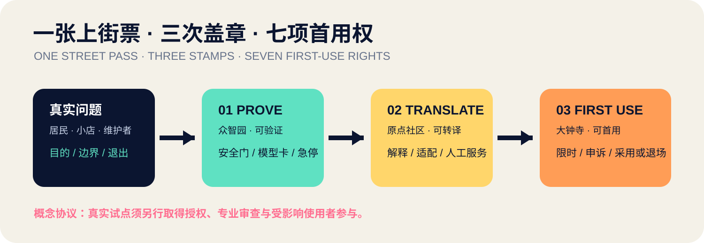

区域协同不编造企业清单，而定义开放接口：北纬社区、未来科学城、怀柔科学城、经开区及京津冀主体可通过公开问题、模型卡、测试协议、失败复盘和成果转化申请进入；每次合作都要注明来源、权利、数据边界与退出条件。这样，“全球生态”不是地理名录，而是一套任何合格主体都能理解、复现和参与的协作协议。

## 总体设计范围城市更新与控规深度城市设计

总体结构为“一线三场十二站”：南北向上街线沿京张遗址公园组织连续步行、自行车、遮荫与公共解释界面，三座首发场分别嵌入三处重点区。[data:geometry/roads.geojson#ROAD-001] [data:geometry/public_space.geojson#PUBLIC-001]

六条东西连接把高校、园区、社区和轨道站点方向接入；十二个街角站把 AI 服务拆成小尺度、可维护的接口。[depth:land_use_layout] [depth:traffic_rail_slow_parking]

空间骨架不只是一条南北线：京张铁路遗址的连续公共底板负责“看见与到达”，东西缝合负责把高校、园区、社区和轨道方向的真实问题送到主线，公共首层负责把研发界面变成可进入的花园、街屋、廊院与店前，蓝绿和维护界面负责让遮荫、雨洪、座椅、检修与退场同时成立。三个首发场不是同一模块换名，而分别固定为“验证环、转译廊院、首用市集”三种空间原型。[data:geometry/public_space.geojson#SCN-04] [depth:overall_spatial_structure]

用地层不是对现状或已批控规的判断，而是由同一临时边界切分的五段功能梯度：开放研发与验证、近校学习与转化、社区服务与共益接口、首用商业与城市发布、生活支持与人才友好。共享切线确保全覆盖、无重叠，便于官方红线到位后重算。[data:geometry/land_use.geojson#LU-001] 这套分区的价值在于说明“研究离街多远、服务在哪里发生、居民如何进入”，而不是宣告地块用途调整。

城市更新优先采用“接口先行、建筑后定”：先把一层可进入性、步行连续、夜间照明、遮荫休息、说明牌、申诉渠道和维护空间做成检查清单；再根据现状测绘、权属、结构和控规决定保留、修缮、适配或新建。十二个概念建筑基底仅用于表达街角载体的尺度和分布，[data:geometry/buildings.geojson#BLDG-001] [metric:building_footprint_area_sqm] [metric:building_coverage_ratio] 不构成现状建筑、拆除、楼层或建设规模结论。[depth:development_intensity_controls] [depth:height_massing_character] [depth:retain_renovate_demolish]

控规条件、道路红线、文保范围、市政管线、消防、防洪、公共服务底数均未提供。方案把这些缺口放进 constraints 图层和假设表，而不是用概念图遮盖；容积率、总建筑面积、建筑高度、道路面积率均保持 unknown。市政与新型基础设施只提出“共享机柜、端侧脱敏、可断电降级、人工值守、事件日志、季节校准”的功能清单，具体容量和工程线位待专项论证。[depth:municipal_new_infrastructure]

## 重点区域详细设计

### 众智园：可验证的首发场

众智园承担“模型过闸”。概念空间由开放验证庭、行业问题台、安全与标准论坛、低速/具身设备验证环、可回滚演示面组成；测试必须先定义边界、观察指标、人工接管、近失事件上报和退场条件。花园型创新街区不是装饰绿化，而是用连续树荫、可坐台阶、户外测试电源与静默空间支撑长期研发协作。临时范围引用 [data:geometry/key_areas.geojson#PROV-KEY-001]，不解释为官方片区或项目边界。

代表性100米概念序列从公共侧到研发侧依次为：连续树荫与无障碍日常底板、C1状态板与C2安全员窗、观察廊和可坐边界、C4软隔离低速验证环、C5后场急停/检修、C6撤场收纳与恢复面。行人、轮椅与骑行者不穿越验证环，设备只在环内闭合运行；故障时设备走最短回收线，外侧普通通行保持连续。AI全部关闭后，它仍是一处完整的花园、观察廊和安全咨询点。越界、接管超时、无障碍通道被阻、碰撞/近失漏报或无法撤场恢复通行，任一项都立即停止。[data:geometry/key_areas.geojson#PROV-KEY-001] [metric:minimum_pilot_count]

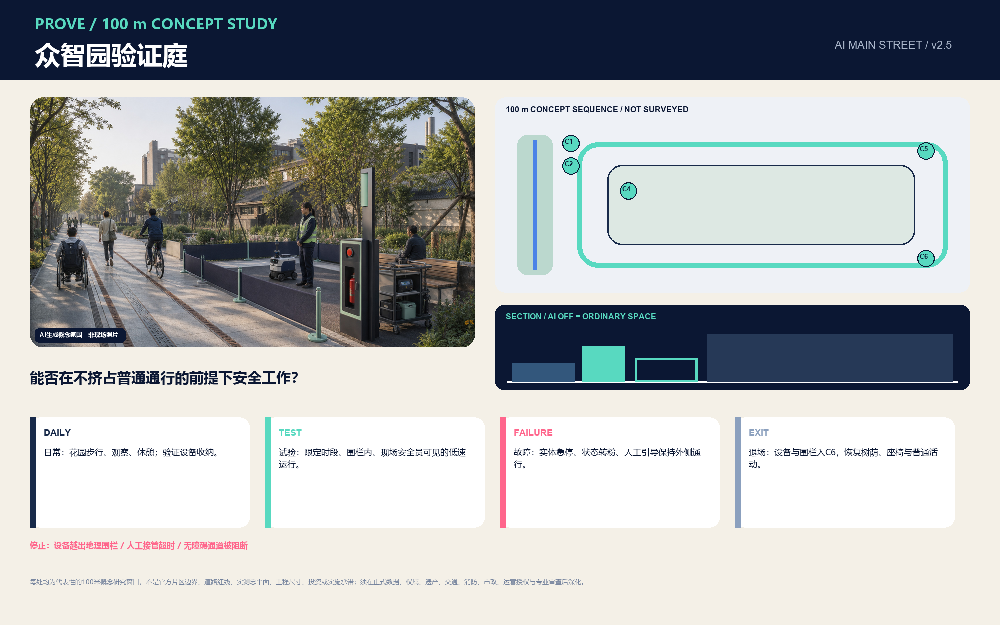

### AI 原点社区：可转译的首发场

AI 原点社区承担“把论文语言翻译为城市语言”。概念空间由研究成果首用窗、开发者共修室、模型卡阅览架、人才日常服务台、亲子和长者共测时段组成。重点不是再建一座封闭孵化器，而是把高校、科研机构、创业团队和居民的接触面安排在可步行到达的一层与院落，并通过“一公里转化圈”把真实需求送入开放成果窗，再把首用结果送回研发团队。任何涉及高校或园区的连接都是概念关系，须经权属、消防、校园管理与交通条件核验。[data:geometry/key_areas.geojson#PROV-KEY-002]

代表性100米概念序列按“街—廊—院—静室”组织：沿街无 App 入口与C1状态板、C2人工需求拆解窗、C3双高模型卡墙和实体服务图、共测廊与C4移动桌、社区院落、待授权敏感信息静室以及C6返回普通社区服务的出口。居民和人才可环行而不经过静室；问题从人工窗进入共测，结果以普通语言和纸面卡返回。AI关闭后，咨询、共读、休息与社区院落继续工作。不能说明用途、局限、责任和撤回，没有人工解释，强制使用AI，撤回后仍处理数据或阻断无障碍主链，任一项都不得盖 `TRANSLATE` 章。[data:geometry/key_areas.geojson#PROV-KEY-002] [metric:public_co_review_role_count]

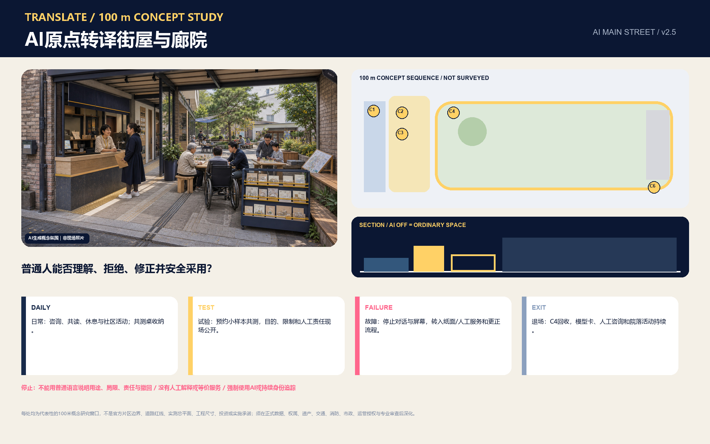

### 大钟寺：可首用的城市首发场

大钟寺承担“小微组织第一次安全采用 AI”。四类接口分别服务小店、文化/内容消费、国际商务与社区维修；商户可以带着真实但已脱敏的问题到首用台，由服务团队协助完成需求拆解、模型选择、风险评估、试用和撤回。存量楼宇首层、传统商业界面、老厂房和公共空间是四类优先适配载体；是否使用及如何改造，需建议对接公开更新统筹主体并纳入项目库、公益—经营平衡和近中远期审查。大钟寺站四象限只表达步行可达、非机动车有序停放、街角停留与导视连续的目标，不给出桥隧、道路或站城工程结论。[data:geometry/key_areas.geojson#PROV-KEY-003]

代表性100米概念序列按“到站方向—店前—市集—后台”组织：连续步行与等候底板、C1状态板与C2人工台、C3纸面需求/非AI经营模板、C4小店/多语内容/维修轮换桌、商户确认与删除/撤回窗、C5轻维护柜和C6退场车。通勤、购物与无障碍主线直行，不穿越试用桌；商户问题经人工拆解、限时试用和最终确认后返回经营。AI关闭后，普通店前、等候、维修与人工多语服务继续。要求上传顾客身份、差别定价或歧视、建议无法解释、商户不同意、撤回无回执或试用阻断可达通行，任一项都不得盖 `FIRST USE` 章。[data:geometry/key_areas.geojson#PROV-KEY-003] [source:OFFICIAL-DAZHONGSI-RENEWAL]

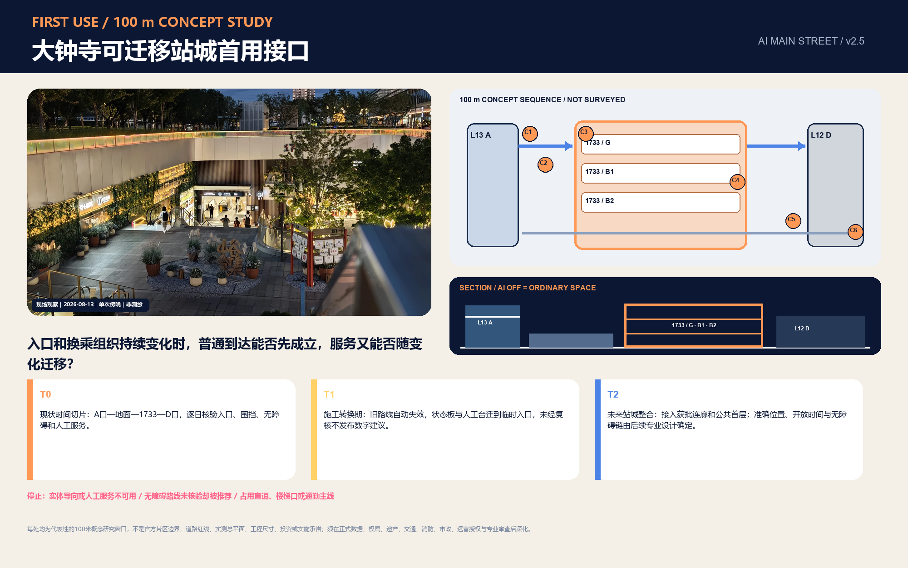

三处重点区共享“一张街票”：同一场景在众智园验证、在原点社区转译、在大钟寺限时首用，最终把问题、证据、故障、申诉、人工接管、非 AI 替代和退出结果写入公共账本。每处都形成“到达-普通公共使用-状态板-人工窗口-可选 AI-恢复普通使用”的空间序列；试点设备撤走后，步行、遮荫、座椅、导视和人工服务仍应成立。片区详细设计达到的是“问题、空间、运营、风险和证据可继续深化”的深度，不是法定规划或综合实施方案审批结论。[depth:three_key_area_detailed_design]

六个共用构件把三区接成同一套可移交系统：C1街票/低亮状态板、C2人工窗/纸面台、C3双高可达台/实体地图、C4可逆试验口袋、C5急停/断电/检修柜、C6退出与恢复车。构件相同，但组合与主角不同：众智园以安全员和验证环为主，原点以人工解释和廊院为主，大钟寺以商户决定和普通经营为主；任何构件都只是概念设计对象，不代表已获设备、点位或运营授权。[metric:reversible_component_type_count]

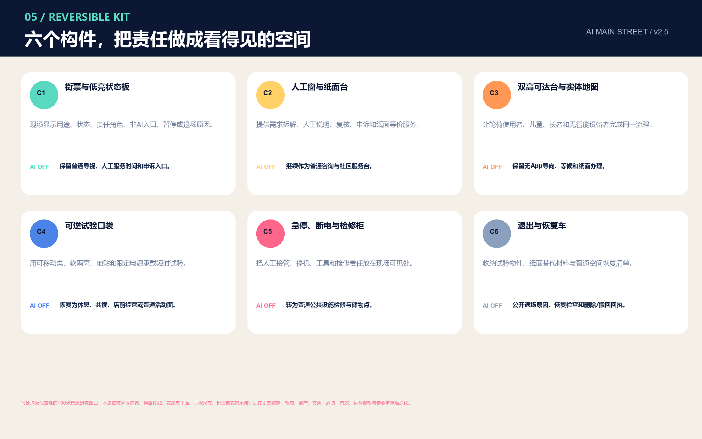

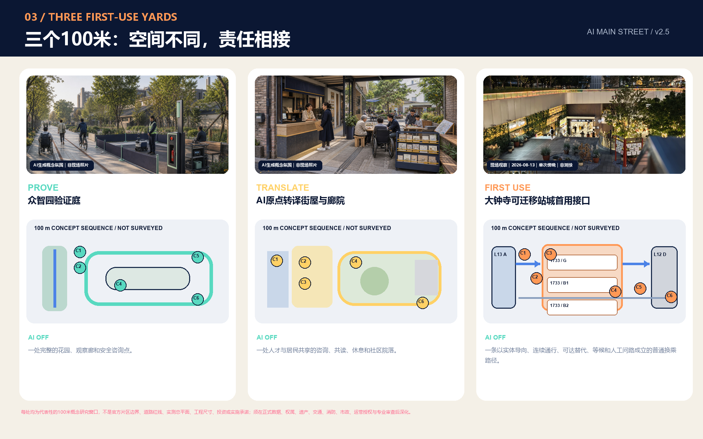

## AI 创新生态、人才画像与 AI+ 场景

七类用户画像决定街角站如何工作：科研人员需要真实问题与合规验证；创业开发者需要低成本首用客户和失败反馈；小微商户需要能退出、能解释的轻量工具；居民需要不被迫使用 AI 的同等服务；长者与残障人士需要无障碍、低认知负担和人工窗口；一线维护人员需要故障定位、备件和停机权；城市管理与专业人员需要证据链、审计与申诉复核。每一类都同时写入收益、风险、非 AI 替代和人工责任。

所有画像共享七项“首用权” [metric:first_use_right_count]：一是知道用途、能力边界、状态和责任人的知情权；二是不被强迫使用的选择权；三是获得无 App、非 AI、纸面或人工等价服务的权利；四是把重要结果交给具体人员复核的权利；五是更正错误并按规则撤回或删除数据的权利；六是通过现场、电话或线下渠道申诉的权利；七是试点停止后恢复普通公共使用的权利。完整概念清单保存在 `visual/assets/first-use-rights.json`。它不是对现行法律的替代性归纳，真实试点仍须法务、隐私、安全、无障碍、运营和受影响使用者共同深化。

十二张场景卡如下；节点位置对应 [data:geometry/public_space.geojson#SCN-01] 至 `SCN-12`，[metric:scenario_node_count]：

| 编号 | 场景与空间 | 服务对象 | 数据最小化与人工复核 | 状态 |
| --- | --- | --- | --- | --- |
| S01 | 开放模型翻译台 / 原点社区 | 研究者、居民 | 只读公开模型卡；现场解释员复核 | 公共服务概念 |
| S02 | 研究成果首用窗 / 原点社区 | 开发者、小店 | 脱敏样本；商户签署试用与撤回 | 产业测试验证 |
| S03 | 小店智能经营台 / 大钟寺 | 小微商户 | 不上传顾客身份；经营者确认建议 | 产业测试验证 |
| S04 | 具身智能共路验证环 / 众智园—小月河翼接口 | 开发者、行人、骑行者、配送员 | 不做人脸识别；安全员可急停；记录冲突和近失事件 | 产业测试验证 |
| S05 | 无障碍路径协作站 / 全线 | 残障人士、长者 | 自愿反馈；无障碍专家与用户复核 | 产业测试验证 |
| S06 | AI+健康转介台 / 小月河翼—社区接口 | 居民 | 不诊断；不保存病历；人工转介到正规服务 | 产业测试验证 |
| S07 | 夜归安全陪伴点 / 慢行节点 | 夜间使用者 | 不做持续身份跟踪；可呼叫人工 | 公共服务概念 |
| S08 | 热舒适共护站 / 绿脊 | 户外工作者、儿童 | 只采环境数据；园林人员校准 | 公共服务概念 |
| S09 | AI 内容与多语首发台 / 北影—大钟寺接口 | 创作者、国际人才、公众 | 只用清权内容；本地临时处理；策展与人工翻译兜底 | 产业测试验证 |
| S10 | 旧物智能维修台 / 社区 | 居民、维修人员 | 不留设备个人内容；技师最终判断 | 社区概念 |
| S11 | 数据同意与申诉台 / 三场 | 所有人 | 可查用途、撤回同意、人工申诉 | 治理基础设施 |
| S12 | 百年京张故事站 / 遗址公园 | 游客、学生 | 只用清权史料；策展人复核 | 文化概念 |

六个测试验证场景采用统一门禁：测试前公开目标、范围、责任人、非 AI 方案与停止阈值；测试中记录误报、漏报、接管和近失事件；测试后由受影响用户与专业人员共同评估，未达公共价值或运维能力即退场。场景不接入来源不明的地图、未经明确授权的企业数据或可识别个人信息，不锁定供应商，不把原型写成已可全面部署。

首轮不同时铺开十二个场景，而是选择“一公两产”三张最小试验单 [metric:minimum_pilot_count]。公共版“无障碍同行街票”从原点社区人工窗口出发，经遗址公园慢行主线到大钟寺服务台，先保证实体地图、遮荫休息、人工求助和无 App 路径，再由使用者主动开启 AI 路径建议；阻断无障碍主链、没有人工求助、持续身份追踪或无法恢复普通通行时立即停止。产业版“小店首用街票”把同一个脱敏经营问题依次送入众智园验证、原点社区转译和大钟寺限时试用；要求人工需求拆解、纸面模板、不上传顾客身份、经营者最终确认和可撤回试用。

第三张“具身智能共路街票”以封闭验证场—众智园可控环—小月河翼候选公共接口为渐进序列，只观察低速设备与行人、骑行者、配送员之间的让行、急停、接管和近失事件；普通通行永远优先。出现超出地理围栏、人工接管超时、阻塞无障碍通道、未报告碰撞/近失或无法撤除设备恢复通行时立即停止。三张试验单的普通服务底线、操作角色、证据目标与停止条件保存在 `visual/assets/pilot-matrix.json`，并由试点数量和场景空间共同核对。[metric:minimum_pilot_count] [data:geometry/public_space.geojson#SCN-04] 90 天只是一段便于讨论的概念测试窗口，不是已批准日程、预算、采购或绩效承诺。

## 用地、建筑规模与拆改留方案

五类概念功能带完整覆盖提交边界，面积均由 EPSG:4548 重算；其核心含义是把“知识生产-成果转译-公共服务-首用商业-人才生活”排成可步行理解的梯度，而非给出法定用地调整。[data:geometry/land_use.geojson#LU-002] [depth:land_use_layout] 绿地、公共空间与建筑载体作为可叠加系统，不以重复填色替代真实地块和控制线。

建筑策略采用四级审查而非具体拆改留判定：第一级确认历史、结构、权属与安全；第二级判断一层公共性和无障碍；第三级评估低碳修缮和可逆适配；第四级才讨论新增量。现阶段 12 个概念基底中，8 个表达既有界面适配意向，4 个表达可逆轻量新建意向，全部标注“待现状核验”。建筑高度、楼层、总建筑面积、容积率和实际密度没有官方依据，必须保持 unknown。

风貌控制不规定数值高度，而提出可深化的界面规则：遗址公园侧保持连续公共首层与可见维护空间；重要转角预留遮雨、停留和无障碍回转；屋顶设备采用可维护、可遮蔽、可拆卸组织；夜间照明以行人识别和低眩光为先；数字媒介默认静音、低亮、可关闭。任何建筑更新都必须先通过文保、绿线、消防、结构、交通、权属与公众影响核验。

概念建筑基底合计面积 [metric:building_footprint_area_sqm]，占临时总体范围比例 [metric:building_coverage_ratio]。这两个指标只用于检查本方案内部图层是否一致，不是规划建筑密度、开发强度或项目容量；真实拆改留分类应在官方底图与逐栋调查完成后重新建立。[depth:development_intensity_controls] [depth:height_massing_character] [depth:retain_renovate_demolish]

## 交通、轨道、市政与公共服务设施

交通策略以“到达街角站”为目标：一条南北连续的步行与骑行主线连接三处重点区，六条东西接口指向高校、园区、社区与轨道站点方向。提交线网总长度为 [metric:walking_cycling_network_length_m]，只是概念中心线长度，不代表道路红线、断面或施工长度。[data:geometry/roads.geojson#ROAD-002] 断点治理按“先地面、后工程”排序：先做导视、过街时序、路口视距、非机动车停放和无障碍连续核验；确需桥隧或站城改造时再进入交通与工程专项。

轨道站点一体化采用“最后 500 米服务清单”：出站后应能找到遮荫路径、无障碍路径、非机动车停放、公共厕所、人工咨询、场景状态与投诉入口。大钟寺四象限、五道口和清华东路西口只标示公共到达关系，不提出道路、桥隧、出入口迁移或地下空间结论。停车策略优先管理既有供给与短时装卸，机器人和低速配送只能进入明确时窗和测试边界。

市政与新型基础设施采用“可降级”设计：街角设备断网时保留人工服务；传感器只收集完成任务所需的最少数据；端侧处理优先；算力和能源设备有关闭、检修和替换通道；异常状态在现场可见；事件由具体岗位接管。公共服务不把 AI 当作唯一入口，长者、残障人士、无智能设备人群与临时访客都能通过同等人工流程完成事项。[depth:traffic_rail_slow_parking] [depth:municipal_new_infrastructure]

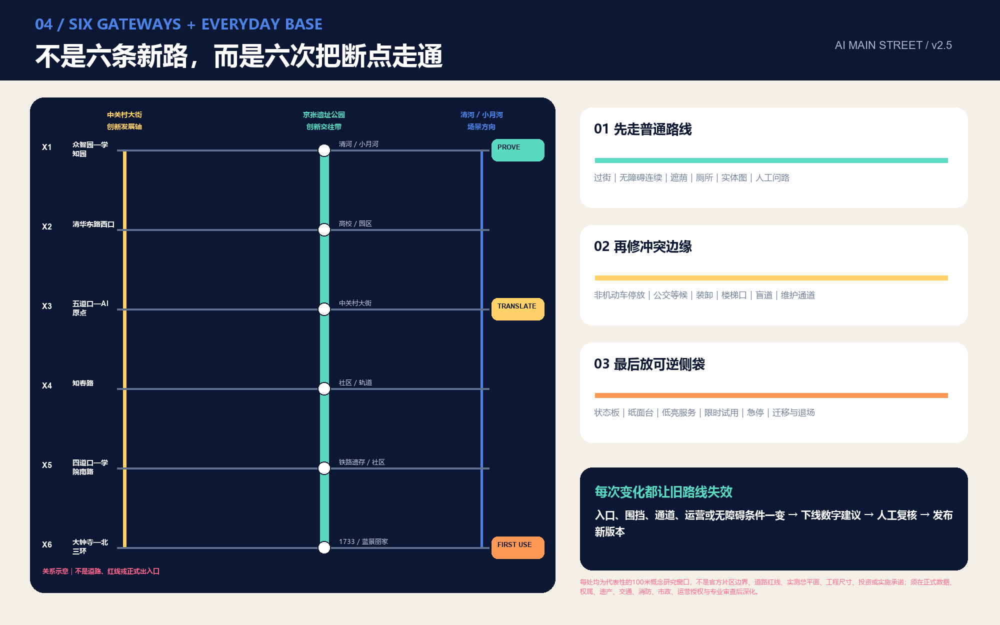

## 蓝绿空间、公共空间与城市风貌

京张遗址公园被定义为“可读的创新前台”：铁路历史不是装饰背景，而是解释自主创新如何经过试验、失败、维护和公共使用。绿脊由主线 78 米概念缓冲派生，[data:geometry/green_space.geojson#GREEN-001] [metric:green_space_area_sqm] [metric:green_ratio]；公共首用界面由主线和十二个节点缓冲联合派生，[data:geometry/public_space.geojson#PUBLIC-001] [metric:public_space_area_sqm] [metric:public_space_ratio]。两者只表达连续性目标，待绿线、水系、树木、文保与权属资料补齐后深化。[depth:blue_green_public_space]

公园不是等待填充的空白轴。对官方报道已列出的铁路博物馆、1909 火车餐厅、移动盒子、AI 训练驿站和既有青年活动，采用“保留日常运营—补足无障碍/导视/人工服务—接入 Street Pass 状态—根据结果升级或退出”的顺序；任何新站都不得替代现有运营者、挤占高峰游园容量或把文化设施变成技术广告。二期五类组团可作为季节运营的候选接口，但具体点位、开放时间和施工状态必须另行核验。[source:OFFICIAL-JINGZHANG-PARK-BASELINE]

公共空间组件库包括：可更换说明牌、模型卡阅览架、人工接管按钮、低亮状态灯、无障碍双高台面、可移动遮荫、季节性座椅、设备检修门、非 AI 服务指引和申诉二维码/电话双通道。每个组件都要说明谁维护、多久巡检、故障时如何降级、何时退场。数字屏不是默认组件；只有当内容权利、能耗、眩光、维护和无设备替代均被解决时才可设置。

京张特有的材料语言不靠仿古或“科技灯光秀”：双平行嵌线只提示铁路与数据的连续关系；深色可维修边框承载状态、版本与责任；可替换搪瓷/金属牌借用时刻牌的可读性；轨枕尺度只转译为坐凳和树池边的模数语言，不挪用或虚构遗存；低亮琥珀灯表示暂停与人工接管；可拆遮棚、桌和双高柜台必须能收纳、修复和退出。历史图像与史料仍须清权和专业策展，概念生成图不能替代历史证据。[standard:MOHURD-URBAN-DESIGN-MEASURES] [source:OFFICIAL-JINGZHANG-PARK-BASELINE]

四处“AI 朝圣”节点是知识和责任地标，而非夸张造型：众智园“公开验证庭”展示测试协议与失败复盘；原点社区“开源贡献廊”记录论文、代码、数据和社区贡献的清权来源；大钟寺“第一用户台”展示小微组织如何安全采用；京张遗址公园“百年创新里程碑”沿清华园车站、铁路博物馆/1909 公共文化接口、四道口铁路遗存方向与大钟寺方向组织一条待专业核验的叙事序列。荣誉展示必须注明 PR/commit、贡献类型、证据、团队、许可、版本与更正入口，避免个人崇拜、企业广告和错误永久化。

城市气质以“朴素工程感、开放学院感、温暖街道感”为三条线：材料耐久可修，信息清楚不炫技，公共首层欢迎不同人群。导视系统与总体 Logo 分工明确：Logo 识别“一带”，导视只解决到达、状态、责任和退出。历史叙事使用清权公开史料并由策展专业人员复核，不以生成图像替代史实。

## 更新项目清单、实施政策与分期计划

十项概念更新项目形成“空间小投入、制度先到位”的组合：1 上街主线连续性审计；2 上街票协议与公共状态板；3 众智园公开验证庭；4 原点社区成果转译窗；5 大钟寺小店首用台；6 十二站统一服务组件；7 无障碍同行最小试验；8 小店首用最小试验；9 具身智能共路最小试验；10 可纠错贡献里程碑与运维、申诉、退场公开账本。[metric:renewal_project_count] 每项都须在现状、权属、文保、交通、市政、运营授权和公众影响核验后才能进入专业深化。[depth:renewal_project_list]

### 四类数据门：拿到数据才扩大试点

| 数据门 | 最小所需证据 | 能决定什么 | 未取得时的保守动作 |
| --- | --- | --- | --- |
| G1 原点一公里转化圈 | 可公开机构/服务目录、首层可进入性、步行与无障碍连续性、真实需求来源 | 转译窗和共修时段设在哪里、由何类岗位接单 | 只做线上问题登记与单点人工咨询，不声称形成空间网络 |
| G2 遗址公园公共容量 | 分时客流、活动日历、现有设施运营、厕所/遮荫/座椅/无障碍断点 | 十二站接入次序、活动窗口、设备占地上限 | 只升级导视和人工服务；不占用通行带，不布连续设备 |
| G3 大钟寺存量更新 | 逐楼/逐店现状、权属与消防、首层业态需求、公益—经营平衡、更新项目库接口 | 哪类载体可适配首用台、谁可被授权运营、何时退出 | 使用可移动纸面服务台，不作拆改留、招商或投资判断 |
| G4 具身设备共路 | 行人/骑行/配送流量、冲突与近失、天气/活动条件、地理围栏与接管日志 | 能否从封闭场转入可控环，是否允许扩大时间或空间 | 停留在封闭或物理隔离环境；任何碰撞/漏报先暂停复核 |

每个数据门都采用版本号、时间窗、空间范围、来源、许可、缺失项和复核岗位；行政统计只用于判断“应先验证什么”，不能替代现场调查。任一门的输入发生重大变化，相关 Street Pass 自动回到 `pending`，重新获得三章后才可扩大。

### 八个 SP 首用行动包

十项更新项目被编排为八个可交付行动包；“可被授权牵头”只定义责任类型，不预设机构已同意、资金已落实或项目已批准。

| 行动包 | 首期交付物 | 可被授权牵头 / 必要共同复核 | 不得开始与停止条件 | 验收证据 |
| --- | --- | --- | --- | --- |
| SP-01 上街票与状态板 | schema、纸面票、公开状态字段、申诉/恢复模板 | 公共运营负责人 / 法务、隐私、无障碍、受影响者 | 无人工窗口、无非 AI 路径、责任人不可见则不得上线 | 三章记录、申诉回执、停止演练 |
| SP-02 众智园验证庭 | 可逆验证环、安全员窗、急停/近失记录 | 验证场运营者 / 安全、交通、维护岗位 | 无地理围栏、无急停、漏报碰撞/近失即停止 | 接管时延、近失闭环、撤场恢复 |
| SP-03 原点转译窗 | 模型卡架、人工解释台、共测预约与结果卡 | 成果转译运营者 / 研发者、居民、小组织 | 不能普通语言解释或不能撤回数据则不盖章 | 理解度复核、人工纠正、需求回流 |
| SP-04 大钟寺首用台 | 纸面需求模板、限时试用桌、商户撤回窗口 | 片区运营者 / 商户、更新/消防/数据专业方 | 无经营者最终确认或无普通模板即停止 | 完成率、纠正次数、删除/撤回回执 |
| SP-05 无障碍同行链 | 连续路线审计、实体地图、人工求助、休息点 | 公共空间运营者 / 使用者、无障碍专业方 | 阻断主链、无求助或默认追踪即停止 | 断点关闭、响应时间、非 AI 路径可用 |
| SP-06 十二站服务组件 | 人工窗口、双高台面、低亮状态、检修与退出指引 | 点位运营者 / 园林、市政、维护、公众 | 占用通行、数字屏不可关、维护无岗位即撤除 | 巡检、故障降级、普通使用恢复 |
| SP-07 可纠错贡献里程碑 | 贡献墙、开源成果节点、全球开发者墙的版本化记录模板 | 公共策展运营者 / 权利人、档案、公众复核 | 无来源/许可/证据，或把投稿误写成入选即不得展示 | PR/commit、贡献类型、许可、版本、纠错记录 |
| SP-08 四季运营与公开复盘 | 问题征集、共测、开源首发、维护者复盘的年度运行包 | 年度运营者 / 社区、高校、企业、国际参与者 | 没有归档、失败复盘和退出通道则不扩大活动 | 公开问题、结果卡、失败库、次年修订 |

八个行动包再按三个概念成熟窗口组织：0–6月只做纸面票、人工台、物理路线审计、可移动服务台和停机/撤场演练；6–18月只有在使用者、维护者和专业复核共同通过后，才复制可控环、预约共测和限时首用；18–36月才讨论十二站网络、版本账本和年度维护者复盘。时间不是获批工期，每个新点位仍须重新取得数据、权属、专业审查和运营授权，不能用一次试点替代全线许可。[metric:delivery_horizon_count] [depth:phasing_implementation]

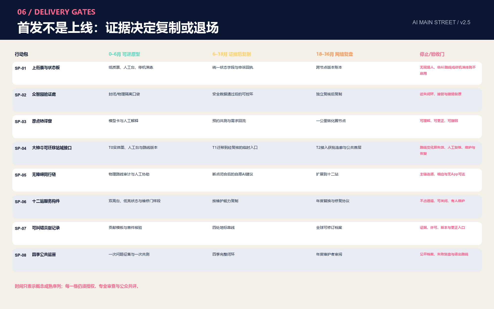

SP-07 对接官方提出的 Agent 贡献墙、AI 里程碑、开源成果节点和全球开发者墙意向，但把“永久荣誉”设计为可纠错的开放记录：每条刻录或展示至少关联 PR/commit、贡献类型、证据、许可、版本、年份和更正入口；未入选、撤回或权利状态变化必须可更新，不把不可逆纪念物变成错误承诺。[source:OFFICIAL-AGENT-ONLY-ARTICLE]

分期图层把临时总体范围切为三段，目的不是按地理从南到北施工，而是把运营成熟度画成可复核门槛。[data:geometry/phasing.geojson#PHASE-001] 近期先试三个首发场与四类高价值场景，面积标记 [metric:phase_1_area_sqm]；中期在评估通过后扩展街角站和两翼服务，面积 [metric:phase_2_area_sqm]；长期才形成全球问题征集、开放协议和年度活动网络，面积 [metric:phase_3_area_sqm]。分期是概念顺序，不构成投资或开工承诺。[depth:phasing_implementation]

年度运营建议包括：春季“全球真实问题征集 / Global Problem Call”由居民、商户、机构与国际社区提交问题；夏季“街角共测季 / Street Co-test”开展无障碍、热舒适、小店与具身设备共测；秋季“开源首发周 / Open-source First-use Week”发布模型卡、失败复盘和公共贡献；冬季“维护者复盘 / Maintainers’ Review”奖励可靠性、修复和负责任退场。开发者社区以问题库、测试协议、导师值守、维护积分和开放归档运作；企业转化路径是“问题登记-合规判断-小样本验证-公共复核-限时首用-扩大或退场”。每季均形成可直接中英发布的结果卡，成功、暂停和失败使用同一模板。

每条试点采用五类责任角色：公共任务提出者明确问题与公共价值；可被授权的运营负责人对运行和恢复负责；专业复核者覆盖安全、隐私、无障碍和行业判断；现场维护者拥有急停、检修和降级权；受影响使用者代表参与结项。提案者不能独自批准试点，运营者不能独自评价扩容，AI 不能替代任何一名依法或依约承担责任的人。进入下一阶段的最低证据不是“体验很酷”，而是三次盖章记录完整、七项权利可用、非 AI 等价服务可现场完成、申诉有回执、停止演练能恢复普通使用。

政策建议只描述机制：设置小微组织首用券需另行论证资金与采购；建立公共场景协议需法务、隐私和行业主管协同；开放数据必须通过清权、匿名化和用途审查；贡献荣誉不得替代合同或知识产权。任何外部发布均区分“已投稿、待评审、已入选、已实施”，本方案目前仅为投稿包。

## 指标体系、面积复算与合规矩阵

本包的指标分三类。第一类是从提交几何复算的内部一致性指标：临时 site area、绿地和公共空间面积/比例、概念建筑基底、慢行线长、三处重点区与三期面积；第二类是计数指标：12 个场景节点、10 项概念更新项目、3 处重点区、6 个全球案例、3 次街票盖章、7 项首用权、3 张最小试验单与 4 项通过的自检闸门 [metric:validation_gate_pass_count]。v2.2 另登记3处100米概念窗口 [metric:prototype_study_count]、6类可逆构件 [metric:reversible_component_type_count]、5段公共旅程 [metric:journey_stage_count]、4类共评角色 [metric:public_co_review_role_count]、4张证据卡 [metric:public_evidence_card_count]和3个交付窗口 [metric:delivery_horizon_count]，均是对提交内容的可复算计数，不是已实施绩效。第三类是必须保持待正式数据补齐的法定或工程指标：总建筑面积、容积率、建筑高度和道路面积率。指标的 status、value、unit、source_files、formula、confidence 和 assumptions 全部记录于 metrics.json。[depth:metrics_recalculation]

面积使用项目指定 EPSG:4548 计算，比例以同一临时 site boundary 为分母。已知指标不等于官方指标；“known”只表示能从当前提交几何复算。land use 用同一边界和共享切线生成，union 应等于 site、相互不重叠；green、public、building 和 phase 均限制在 site 内。自检还检查三处重点区不重叠、PDF 有页、离线 HTML 无远程资源、五张图存在、矩阵覆盖完整。

合规矩阵覆盖公告 1.3、1.4、1.5 共 17 条要求与 agent.1-agent.6 六项任务；标准矩阵覆盖项目公告、智能体任务书、城市设计、控规、用地分类与建筑深度资料缺口；深度矩阵覆盖 15 项 formal 证据。图纸和网页只承担解释，不替代 GeoJSON 与 JSON。所有 known 指标均在正文引用，unknown 指标不被换算成貌似精确的规划数值。

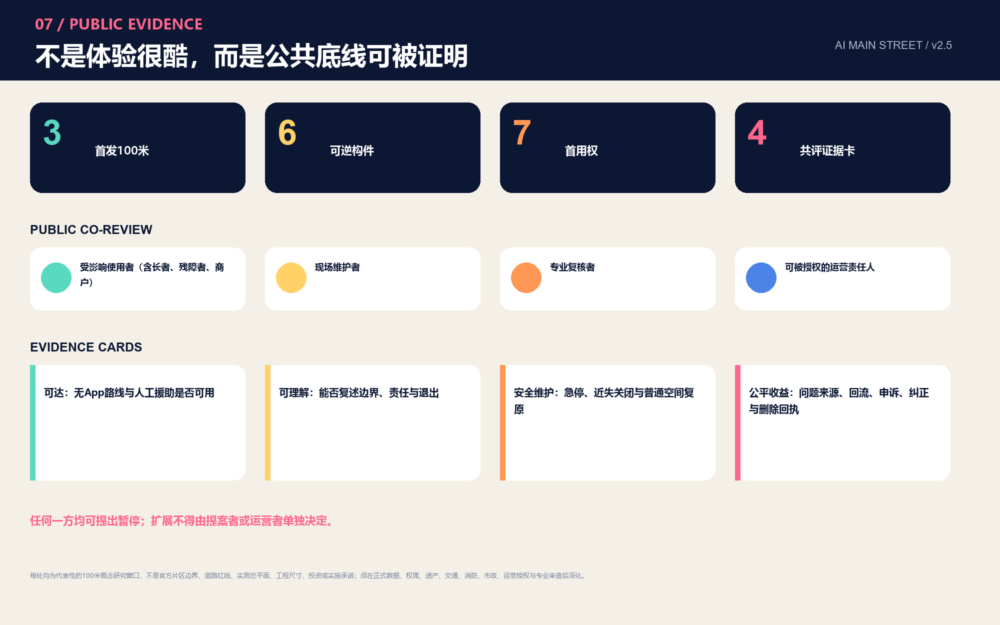

## 风险、版权与合规说明

最大风险不是设计不够大胆，而是临时数据被误读为已批准结论。为此，所有图件、网页、PDF 和正文都标注 provisional；边界、重点区、用地、建筑、道路、市政、文保和项目时序的法律或工程含义均保留待核。官方 CAD/GIS/PDF 到位后，需要登记文件哈希、发布机构、日期、版本、坐标系和转换方法，并整包重算。[data:geometry/constraints.geojson#CON-002] [depth:risk_missing_data]

AI 场景风险包括偏差、误导、隐私、不可解释、过度监控、数字排斥、供应商锁定和运维失效。统一控制措施是最少数据、用途限定、公开模型卡、人工复核、非 AI 替代、现场状态、事件记录、可申诉、可回滚与定期退场评估。涉及健康、法律、公共安全和个人权益的输出不得直接替代专业判断或行政决定。

版权方面，核心空间图由本包 GeoJSON、metrics、矩阵和 `visual/assets/spatial-prototypes.json` 通过本地确定性生成流程重建；双语源数据、图件和方法说明随投稿包开放以便复核。原创 Logo 与街票协议以 SVG 提交。三张氛围图与一张参赛者自定义封面由 OpenAI 内置图像生成工具制作，仅表达概念体验，不是现场照片、公众意见或历史证据；封面以三张原创氛围图为参考，不含第三方视觉输入。使用 Microsoft YaHei 仅用于本地排版生成，不在仓库分发字体文件；没有使用商业地图瓦片、新闻图片、企业 Logo、可识别人物肖像或第三方论文图像。外部案例文字以官方机构页面为背景来源，仅做简短机制概括。投稿知识产权与展示使用遵循公告和 `COMMUNITY-DISPLAY-ONLY` 声明，详细见 `report/copyright_statement.md`。

本方案由 AI agent 生成并执行官方脚本自检，但机器通过只代表资料结构、拓扑、视觉包装和证据链达到入口要求，不代表方案优秀、边界正式、工程可行、政府认可或已决定实施。人类评审、专业团队、相关权利人和公众仍拥有最终判断权。

## 参考资料

1. 北京市规划和自然资源委员会海淀分局，《百年京张AI创新带城市设计国际方案征集资格预审公告》，2026-05-09。[source:OFFICIAL-ANNOUNCEMENT]
2. 用户提供清权任务书摘录，《面向全球智能体开展百年京张AI创新带城市设计开源征集任务书》，2026-05-18。[source:AGENT-TASKBOOK]
3. 仓库资料包：`brief/public-brief.md`、`brief/site-package/`、`data/source_registry.json`、`data/processed/agent_fact_pack.md`。[source:SITE-PACKAGE]
4. 住房和城乡建设部，《城市设计管理办法》与《城市、镇控制性详细规划编制审批办法》。
5. 自然资源部，《国土空间调查、规划、用途管制用地用海分类指南》。
6. AI Singapore、Mila、Vector Institute、FCAI、STATION F 与 City of Helsinki AI Register 官方网页，作为 background-only 案例。
7. “北京海淀”官方公众号，《全球首次，只有 Agent 参与的城市规划》，2026-08-07，作为征集机制与开放荣誉意向依据。[source:OFFICIAL-AGENT-ONLY-ARTICLE]
8. 北京市科委、中关村管委会“三区两翼”相关报道，2026-03-27，作为产业功能方向背景。[source:OFFICIAL-THREE-ZONES-TWO-WINGS]
9. 首都之窗 AI 原点社区报道，2026-04-01；海淀政协京张铁路遗址公园报道，2026-03-30；北京市城市更新服务平台大钟寺项目，2026-07-14，均作为有日期、有限用途的现状背景。[source:OFFICIAL-AI-ORIGIN-BASELINE] [source:OFFICIAL-JINGZHANG-PARK-BASELINE] [source:OFFICIAL-DAZHONGSI-RENEWAL]
