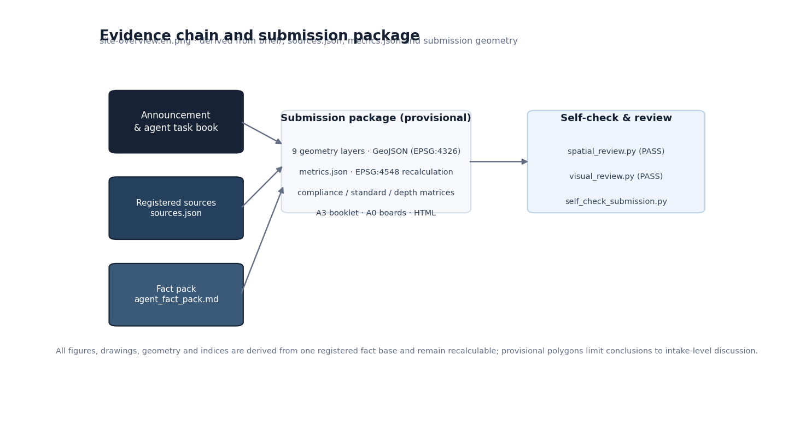
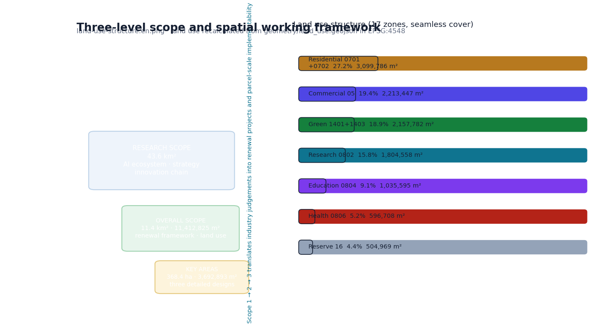
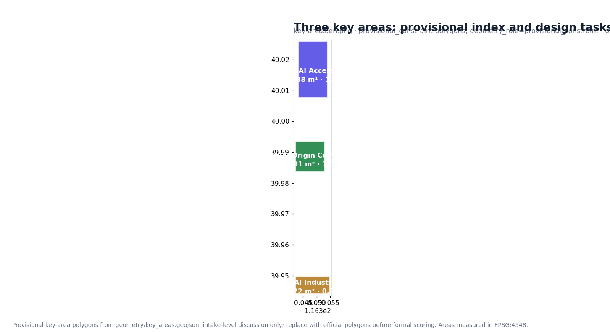
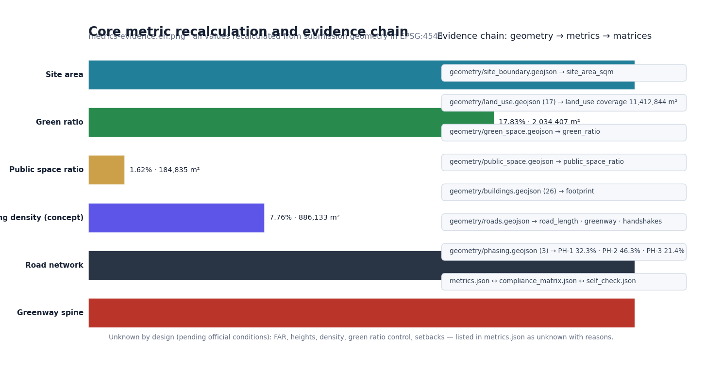

# THE JINGZHANG PROTOCOL BELT · From a Century-Old Railway to an Open-Source City Protocol

This document is the complete English counterpart of `proposal.md`. Machine-readable indexes — `sources.json`, `metrics.json`, `compliance_matrix.json`, `standard_matrix.json` and `design_depth_matrix.json` — are language-neutral and authoritative.

## Design Basis and Materials Register

This formal proposal takes the *Qualification Announcement for the International Urban Design Solicitation of the Centennial Jing-Zhang AI Innovation Belt* published by the Haidian Branch of the Beijing Municipal Commission of Planning and Natural Resources as its first authority, and treats the machine-readable provisional boundary, key areas, enums, metrics and source register in `brief/site-package/` as its computationally verifiable basis. Before generating content, the AI agent must read `design_brief.json`, `allowed_design_space.json`, `sources.json`, `enums/`, `ranges/`, `schemas/`, `data/source_registry.json` and `data/processed/agent_fact_pack.md`, and must build the task/scope/materials/gap lists from `project_scope_summary.csv`, `agent_task_requirements.csv`, `source_use_matrix.csv` and `missing_data_checklist.csv`. Every design judgement is decomposed into traceable sources, recalculable metrics, verifiable layers and human-reviewable assumptions. The announcement requires urban design depth equivalent to a regulatory detailed plan plus a comprehensive implementation plan; narrative text alone therefore cannot substitute for the GeoJSON layers, metric tables, A3 booklet, A0 boards and HTML electronic deliverables.

The proposal is not a standalone vision text but a package organized around the announcement, the agent task book and site materials. This section places only the most critical basis beside the judgement [source:OFFICIAL-ANNOUNCEMENT] [source:AGENT-TASKBOOK] [depth:existing_conditions_diagnosis]; full source and standards coverage is kept in `sources.json`, `standard_matrix.json` and `design_depth_matrix.json`.

The usage boundaries of the materials register [source:SOURCE-REGISTRY] are:

- `data/source_registry.json` records the usage boundary of public, rights-cleared and provisional materials: 7 formal-use materials, 1 background material, 1 provisional-only material.
- The agent must not upgrade `background_only` or `provisional_only` materials into official boundaries, statutory regulatory plans, formal scoring bases or government implementation commitments.

`data/processed/agent_fact_pack.md` is a reading-navigation layer, not a new authoritative source [source:PROCESSED-FACT-PACK]; factual judgements return to the registered originals [source:OFFICIAL-ANNOUNCEMENT] [source:AGENT-TASKBOOK].

Where official `SITE_BOUNDARY` or `KEY_AREA` polygons are not yet available, this scaffold generates a provisional formal package from `brief/site-package/geometry/provisional_boundaries.geojson`. The `geometry/site_boundary.geojson` and `geometry/key_areas.geojson` in the submission are both marked `provisional_constraint` with `official_boundary=false` — usable only for proposal generation, self-check, visualization and design discussion, never as official redlines, approval bases, precise area bases or statutory conclusions. This organizer-side data gap does not itself block content scoring; once official polygons are released, the site boundary, key areas, land use, roads, green space, public space, buildings, phasing and metrics must all be recalculated.

The scoreable state of this package is therefore: **provisional boundary, precision warnings preserved, recalculation scheduled after official data release; content scoring is not blocked**. Spatial structure, scenarios, projects and metrics are written under the principle "discussable, reviewable, recalculable after official boundaries replace the provisional ones"; when official polygons update, the agent must rerun the scaffold, self-check and drawing/HTML generation rather than replacing individual files.

Boundary interpretation returns to the overall-scope layer and area recalculation [data:geometry/site_boundary.geojson#SITE-001] [metric:site_area_sqm]; the three key areas are verified by their own layer and count metric [data:geometry/key_areas.geojson#PROV-KEY-001] [metric:key_area_count].

## Three-Level Scope Working Framework

The proposal organizes work along the announcement's three levels: the research scope attends to the 43.6 km² AI industry ecosystem, strategic positioning, innovation chain and future urban form; the overall design scope attends to the 11.4 km² urban areas and industry districts within 1–2 km of the Jingzhang Heritage Park, delivering an overall renewal framework, industrial space layout, transport/municipal support and urban character control; the key-area scope attends to the three 368.4 ha detailed-design areas, specifying functions, building scale, retain/renovate/demolish classification, public-space connectivity and traffic organization. `compliance_matrix.json` maps each level item by item so that every mandatory task of announcement clauses 1.3/1.4/1.5 and agent.1–agent.6 has chapter, layer, metric, drawing and HTML evidence.

Depth items are governed by [depth:three_level_scope_framework] and [depth:overall_spatial_structure]; spatial evidence is [data:geometry/site_boundary.geojson#SITE-001] and [data:geometry/key_areas.geojson#PROV-KEY-001]; task authority is [standard:PROJECT-OFFICIAL-ANNOUNCEMENT]; scope navigation uses the three-level table of `project_scope_summary.csv` via [source:PROCESSED-FACT-PACK].

The three levels are not disconnected drawing sets: research determines industrial-chain and urban-form judgements; overall design translates them into renewal projects, spatial structure and facility capacity; key-area design verifies implementability of parcels, buildings, transport, public space and AI scenarios. The agent must first lock the boundary and constraints in force, then generate land use, buildings, roads, green space, public space, phasing and AI service nodes, then recalculate metrics from these layers and state which conclusions remain limited by the provisional boundary. Nothing that cannot be recalculated from structured data may be written into formal conclusions.

The overall concept is the **"Jingzhang Smart-Network Symbiosis Belt"**: the Jingzhang Heritage Park as the historical and public-space spine; Zhongzhiyuan, the Beijing AI Origin Community and Dazhongsi as innovation anchors; universities, enterprises, communities and rail stations as the everyday network — "one belt, three cores, multi-scenario nodes, and a composite blue-green slow-traffic ring". The "belt" translates the announcement's three scopes into a working method; it is not an extra new redline.

| Scope | Design question | Proposed answer | Data anchor |
| --- | --- | --- | --- |
| Research scope | How to organize the AI ecosystem and future urban form | Innovation chain: university sourcing – open-source collaboration – enterprise conversion – public experience – international dissemination | compliance_matrix.json, standard_matrix.json |
| Overall design scope | How to map industrial space, renewal, transport/municipal and character | Land use, buildings, roads, green space, public space and phasing layers together | [data:geometry/land_use.geojson#LU-001], [data:geometry/roads.geojson#ROAD-001] |
| Key-area scope | How the three areas reach detailed-design depth | Positioning, spatial actions, AI scenarios and implementation dependencies per area | [data:geometry/key_areas.geojson#PROV-KEY-001], #PROV-KEY-002, #PROV-KEY-003 |

## Research Scope: Industry and Future Urban Form

The research scope builds a world-class AI innovation ecosystem: inventorying Haidian's universities and institutes, leading enterprises, compute/algorithm/data elements, incubation platforms and tech-service resources, and proposing a spatial coordination framework across the innovation, industry, talent and urban-service chains. Naming and logo design serve the recognizability of the "Centennial Jingzhang culture belt, urban AI-life experience belt, and AI-integrated innovation belt" and must connect to the industry ecosystem, public space and cultural resources. The agent task book additionally requires responses to the "five functions" and "three zones, two wings", forming a naming system, visual identity, overall spatial-structure diagram, scenario opening and operation mechanism that can be deepened later; those requirements come from the agent open call [source:AGENT-TASKBOOK] [standard:PROJECT-AGENT-OPEN-CALL-TASKBOOK], not from statutory planning controls.

Research adds no pseudo-precise redlines; through the coordination of character, public space and building layout required by [standard:MOHURD-URBAN-DESIGN-MEASURES], it connects back to [data:geometry/land_use.geojson#LU-001], [data:geometry/public_space.geojson#PUBLIC-001] and [depth:overall_spatial_structure].

Future-urban-form research pins the AI transport system, continuous green space, innovation-service facilities and an international work-and-life atmosphere to locatable functional zones, nodes, corridors and scenarios. Industry metrics, the AI innovation index, talent density, space-supply types and AI-plus-vertical priority districts enter the metric system with official/design-suggest/pending-calibration labels. Global AI innovation activities, developer communities, open scenarios and pilgrimage routes are written as "conceptual suggestion / reference scheme / to be deepened by professional teams", never as confirmed government activities.

## Overall Design Scope: Renewal and Regulatory-Depth Urban Design

The overall design scope must reach urban design depth equivalent to a regulatory detailed plan: overall renewal spatial structure, identification of low-efficiency space, a renewal project list, implementation policy proposals, industrial functional ratios, spatial organization modes, total building scale and comprehensive capacity assessment. `geometry/land_use.geojson` fully covers the design boundary without overlap; `geometry/buildings.geojson` expresses renewed or retained footprints; `geometry/roads.geojson` expresses micro-circulation, slow traffic and rail interchange; `metrics.json` recalculates core areas, ratios and layer counts.

Per [standard:MOHURD-CONTROL-DETAILED-PLANNING] the section decomposes into reviewable objects: [data:geometry/land_use.geojson#LU-001] land-use structure, [data:geometry/buildings.geojson#BLDG-001] footprints, [data:geometry/roads.geojson#ROAD-001] traffic organization, [metric:building_footprint_area_sqm] footprint cross-check, and [depth:land_use_layout] plus [depth:development_intensity_controls] for depth governance.

Overall design also covers rail-station integration, road micro-circulation, non-motorized and car parking, innovation service platforms, talent-life facilities, new infrastructure, distributed energy and on-device compute. Building heights, development intensity, road redlines, setbacks and facility standards without official controls are written as "pending confirmation of official regulatory conditions" — never as agent-inferred approved indices.
## Key Areas: Detailed Design

Key-area detailed design is mandatory. The **Zhongzhiyuan AI Autonomous Innovation Acceleration Area** requires a detailed scheme around national AI platforms, full-stack autonomous innovation, standards-setting, safety governance, industry display, external transport, Qinghe culture, low-carbon green innovation exchange and green-space AI scenarios. The **Beijing AI Origin Community** requires a scheme around university-proximate innovation, outcome incubation and conversion, a talent special zone, the open-source ecosystem, brand activities, building retain/renovate/demolish, outcome display and release, residential support, campus-park slow-traffic connection and rail-station integration. The **Dazhongsi AI Industry Cluster** requires a scheme around leading enterprises, agents, smart terminals, content consumption, data elements, digital assets, commercial services, composite use of planned green space, Dazhongsi station integration and four-quadrant pedestrian connectivity.

The three designs cite [data:geometry/key_areas.geojson#PROV-KEY-001], #PROV-KEY-002 and #PROV-KEY-003, examined by [depth:three_key_area_detailed_design] for comprehensive-implementation-plan depth; "build a demonstration zone" alone, without function, building, transport, public-space and implementation-project evidence, is incomplete.

Official polygons, where provided, must be used as `official_constraint`; otherwise `provisional_constraint` may be used temporarily, with text, HTML, sources, assumptions and self-check stating that they cannot serve as formal scoring or approval bases. `compliance_matrix.json` covers announcement clauses 1.5.3.1/1.5.3.2/1.5.3.3. The HTML page allows switching between the three areas; the A3 booklet and A0 boards include key-district master plans, partial details and metric notes.

| Key area | Design positioning | Spatial actions | AI scenarios | Evidence |
| --- | --- | --- | --- | --- |
| Zhongzhiyuan AI Acceleration Area | Garden-type full-stack innovation block | Qinghe frontage, industry display, low-carbon exchange, external traffic; green space hosts open testing and standards display | Model testing, standards workshops, safety display, low-carbon compute experience | [data:geometry/key_areas.geojson#PROV-KEY-001], [depth:three_key_area_detailed_design] |
| Beijing AI Origin Community | University-proximate outcome-conversion talent community | Campus-park-block slow-traffic sewing; outcome release, talent services, residential life, open-source collaboration | Open-source community, outcome release, talent-zone services, incubation | [data:geometry/key_areas.geojson#PROV-KEY-002], [source:AGENT-TASKBOOK] |
| Dazhongsi AI Industry Cluster | Urban smart-economy and international-exchange block | Station integration, four-quadrant connectivity, commercial services, public realm around key enterprises | Agent and terminal display, content consumption, data elements, roadshows | [data:geometry/key_areas.geojson#PROV-KEY-003], [metric:key_area_count] |

## AI Innovation Ecosystem, Personas and AI-plus Scenarios

The proposal builds spatial-requirement personas covering R&D offices, open-source collaboration, outcome release, enterprise services, talent housing, social learning, consumption and life, sports and leisure, and international exchange. AI-plus scenarios follow the announcement directions — transport, services, consumption, healthcare, education, law, life services — as both industry-development and urban-function scenarios, each stating service object, spatial location, data sources, privacy boundary, human-review mechanism and operating entity.

Scenarios are pinned to layers and metrics: public space [data:geometry/public_space.geojson#PUBLIC-001], slow traffic and transport [data:geometry/roads.geojson#ROAD-001], open space [data:geometry/green_space.geojson#GREEN-001] with [metric:public_space_ratio] and [metric:green_ratio]. The agent task book requires ≥10 scenario cards, ≥3 industry test-verification scenarios and ≥5 persona types; the scaffold supplies the structure, and participants must write scenarios, personas, privacy boundaries, human review and operators into the text, HTML, A3/A0 and compliance matrix.

| Persona | Typical needs | Spatial response | Self-check boundary |
| --- | --- | --- | --- |
| Open-source developer | Release, collaboration, testing, reputation | Origin Community release hall, public code wall, night collaboration space | No personal behavior traces; activity data only as aggregates |
| Startup team | Low-cost office, compute access, testing ground | Zhongzhiyuan shared testing ground, on-device compute points, standards consulting | Compute and data services require separate authorization |
| Leading-enterprise visitor | Display, business, international reception, hiring | Dazhongsi roadshow lounge, station transfer, public realm around key enterprises | Logos and cases must be rights-cleared |
| Surrounding residents | Commute, leisure, community services, low-disruption renewal | Heritage Park slow-traffic loop, embedded community services, graded night lighting | Resident personas never drive commercial recommendation |
| University faculty and students | Outcome conversion, cross-campus collaboration, daily slow traffic | Campus-park sewing, conversion stops, AI education points | Campus data and research outcomes require authorization |

| Scenario card | Spatial carrier | Design note |
| --- | --- | --- |
| 01 Open-source release hall | Beijing AI Origin Community | Release, code-contribution display and small roadshows for universities, communities, startups |
| 02 Safety-governance sandbox | Zhongzhiyuan | Standards-setting, safety evaluation and red-teaming as visitable, reservable, supervised nodes |
| 03 On-device compute stop | Overall-design nodes | Prototype new infrastructure combining public services and low-carbon energy |
| 04 AI slow-traffic navigation | Heritage Park active belt | Explainable wayfinding and low-intrusion sensing for gaps, congestion, accessibility |
| 05 Dazhongsi roadshow lounge | Dazhongsi cluster | Display, negotiation, media release, international exchange |
| 06 Qinghe low-carbon corridor | Zhongzhiyuan Qinghe frontage | Green space, stormwater, walking/cycling and AI display as public living room |
| 07 Outcome-conversion street | Beijing AI Origin Community | Incubation, display, legal, IP and investment services |
| 08 Data-elements lounge | Dazhongsi district | Rights-cleared, authorized, auditable interface for data elements and digital assets |
| 09 AI life-services model street | Community-commerce intersections | Healthcare, education, law and life services in operable small-scale streets |
| 10 Global AI Week route | The belt public-space system | Walkable, shareable route from heritage, open source, industry display to roadshows |

AI governance proposals follow data minimization, public sources, explainability and human review. Urban agents may assist in identifying slow-traffic gaps, public-space intensity, facility maintenance, enterprise-service needs and activity-safety risks, but cannot replace planning approval, output unauthorized personal profiles or claim official implementation commitments.

## Land Use, Building Scale and Retain/Renovate/Demolish

Land use follows national land-space survey, planning and use-control classification standards [standard:MNR-LAND-USE-CLASSIFICATION-GUIDE] as complete, closed, seamless zones. The building scheme distinguishes retained, renovated, renewed, new or to-be-confirmed objects with recommended footprint, function, scale, character, roof, massing and height classes governed by [depth:height_massing_character] and [depth:retain_renovate_demolish]. Where existing-building, ownership, regulatory or engineering conditions are missing, only methods and a calibration checklist may be offered. Evidence: [data:geometry/land_use.geojson#LU-001], [data:geometry/buildings.geojson#BLDG-001], [metric:building_footprint_area_sqm].

Building scale and intensity metrics must be consistent with `metrics.json` and the layers. Total building scale, FAR, heights, density, green ratio, setbacks and control lines without official conditions are listed as `unknown` or `pending_control`; no fixed numbers create false precision. A3 gives the renewal project list and metric cross-checks; A0 presents key spatial structure and key districts; HTML provides linked metric-and-layer viewing.

## Transport, Rail, Municipal and Public Service Facilities

The transport scheme responds to rail-station integration, road micro-circulation, slow-traffic gaps, external transport, parking, non-motorized parking and green transport, covering the North 5th Ring, the Heritage Park crossing-node, Wudaokou, West Qinghua East Road, Dazhongsi station and traffic links around key enterprises. Road and slow-traffic layers stay inside the submission boundary and are cross-checked against public space, green space, industrial nodes and key districts; provisional boundaries keep transport conclusions at the level of temporary design discussion.

Depth is governed by [depth:traffic_rail_slow_parking] and [depth:municipal_new_infrastructure]; layer evidence cites [data:geometry/roads.geojson#ROAD-001], [data:geometry/public_space.geojson#PUBLIC-001] and [data:geometry/constraints.geojson#CONSTRAINTS]. Missing redlines, pipelines, fire and municipal conditions are recorded in assumptions, not presented as confirmed controls. Municipal and service facilities cover AI industry services, innovation service platforms, talent-life facilities, new infrastructure, distributed energy, on-device compute and conventional municipal integration, stating standards, layout, service radius, operation modes and phasing logic; missing engineering data is listed as a formal deepening prerequisite.

## Blue-Green Space, Public Space and Urban Character

The blue-green scheme uses the Jingzhang Heritage Park active belt as its spine, integrating the Qinghe and Xiaoyue rivers and the travel needs of surrounding universities, enterprises and communities, proposing a north-south through, east-west connected network of walkways, cycleways and green space, addressing slow-traffic gaps, the overpass crossing the North 5th Ring, and the park's northern/southern gateway nodes, with composite use of parking, sports, innovation exchange, technology testing, application display and public services.

The system is cross-checked by [depth:blue_green_public_space], [data:geometry/green_space.geojson#GREEN-001] and [data:geometry/public_space.geojson#PUBLIC-001]; ratios are interpreted in the text and fully recalculated in `metrics.json`; character coordination returns to [standard:MOHURD-URBAN-DESIGN-MEASURES].

Character work merges Jingzhang railway heritage, Zhongguancun innovation culture and AI innovation culture, drawing on Tsinghuayuan station and BFA resources, proposing urban tone, building character, roof forms, massing, frontage and public-art guidance, plus wayfinding, cultural symbols, international narrative, AI pilgrimage landmarks and contribution/recognition systems — all brands, fonts, images, portraits and corporate marks require rights-clearing. Control levels distinguish official control, design suggestion and to-be-confirmed conditions; no pseudo-precise control lines without heritage or regulatory basis.

## Renewal Project List, Implementation Policy and Phasing

The implementation scheme forms a reviewable renewal project list stating location, type, function, responsible entity, dependencies, phase, risk and evaluation metrics; policy proposals cover coordinated renewal implementation, space supply, operation mechanisms, industry services, public participation, data governance and property coordination. `geometry/phasing.geojson` expresses phasing ranges; `compliance_matrix.json` links every task to phasing and drawings. Depth is governed by [depth:renewal_project_list] and [depth:phasing_implementation]; spatial evidence is [data:geometry/phasing.geojson#PHASE-001]. Missing ownership, funding, implementing entities and approval paths are written as implementation risks, not commitments.

| Project | Name | Type | Main dependency | Evidence |
| --- | --- | --- | --- | --- |
| JZ-01 | Heritage Park slow-traffic gap repair | Public space/transport | Road redlines, underpass space, traffic review | [data:geometry/roads.geojson#ROAD-001] |
| JZ-02 | Zhongzhiyuan Qinghe innovation frontage | Blue-green/industry display | River blue line, ecology, flood control | [data:geometry/green_space.geojson#GREEN-001] |
| JZ-03 | Origin Community outcome-conversion street | Renewal/industry services | Campus boundary, ownership, ground-floor programs | [data:geometry/buildings.geojson#BLDG-001] |
| JZ-04 | Dazhongsi four-quadrant connectivity | Rail integration/slow traffic | Station, intersections, municipal pipelines | [data:geometry/public_space.geojson#PUBLIC-001] |
| JZ-05 | AI public service and on-device compute node | New infrastructure/public service | Energy, compute, safety, operator | [data:geometry/constraints.geojson#CONSTRAINTS] |
| JZ-06 | Global AI Week public route | Operation/brand | Space permits, event safety, rights clearing | [data:geometry/phasing.geojson#PHASE-001] |

Phasing is distinct from the 100-day solicitation cycle: the cycle is a delivery deadline; implementation phasing is the urban renewal path. The proposal sets near-term pilots, mid-term renewal and long-term governance, marking what can start with light facilities, operations and service platforms versus what must wait for official regulatory, municipal, transport and ownership conditions. Annual activity systems, developer-community operation, open-scenario days, public experience routes and international communication state operators, frequency, responsibility boundaries, conversion paths and risks — not slogans.

## Metrics, Area Recalculation and Compliance Matrix

The metric system covers at least overall-design area, key-area area, green/public-space ratios, building footprint, renewal project count, AI scenario nodes, slow-traffic connectivity, industrial-space, talent-service and self-check status. Every `known` metric must be recalculable from GeoJSON or trusted sources; `unknown` metrics state reasons and formal submission prerequisites. `scripts/spatial_review.py` and `scripts/visual_review.py` are formal self-check evidence. Depth is governed by [depth:metrics_recalculation]; the text explains design meaning (e.g., [metric:site_area_sqm], [data:geometry/green_space.geojson#GREEN-001]) while full values, formulas, source files and confidence live in `metrics.json`.

The compliance matrix is the master responsiveness file: every announcement and agent-taskbook mandatory task maps to a report chapter, layer, metric, drawing, HTML page, source, assumption and self-check item. A proposal missing any mandatory task of clauses 1.3/1.4/1.5 or agent.1–agent.6 cannot enter formal professional scoring.

At formal deepening, metrics fall into three classes: (1) spatial metrics directly recalculable from submitted geometry — boundary area, green ratio, public ratio, footprint, phasing areas; (2) control metrics depending on official regulatory conditions or task-book annexes — FAR, heights, density, setbacks, redlines, facility standards; (3) performance metrics requiring continuous operation/industry data — AI innovation index, talent density, service satisfaction, slow-traffic accessibility, activity participation, scenario usage. Classes 1–3 respectively enter `metrics.json`, `assumptions.json` and `compliance_matrix.json`, preventing operational visions from being written as approved planning conditions.

## Risk, Copyright and Compliance

**Bilingual requirement.** The primary file may be Chinese or English but must provide a complete counterpart translation via `proposal.en.md` or `proposal.zh.md`; A3/A0, HTML and text-bearing figures must also provide corresponding language copies, preferring the event-recommended terminology of `docs/terminology-glossary.md`. A v2 package missing any required translation, language mapping or valid file is blocked by finalize and CI. All images, drawings, icons, data and code assets must state source, license and authorization status in `sources.json` or `report/copyright_statement.md`. HTML pages must not load remote scripts, map tiles, remote fonts, iframes, forms or external APIs, and must not track reviewers.

Risk and missing-data inventory is cross-checked by [depth:risk_missing_data], [data:geometry/constraints.geojson#CONSTRAINTS] and [source:SITE-PACKAGE]. Gaps listed in `missing_data_checklist.csv` — official boundary, key areas, regulatory plans, roads, parcels, buildings, municipal works, heritage protection, public services — must enter `assumptions.json`, the self-check and the risk section. Conclusions lacking official regulatory, redline, ownership, municipal, fire or heritage conditions are downgraded to to-be-confirmed items.

This proposal claims no official approval, adopted regulatory plan, final land ownership, final construction scale or implementation guarantee. The AI agent is accountable for facts, sources, copyright, spatial data, metrics and presentation; maintainers and professional reviewers may request revision or rejection based on self-check results, spatial cross-checks and the compliance matrix.

## References

- brief/public-brief.md
- brief/site-package/design_brief.json
- brief/site-package/allowed_design_space.json
- brief/site-package/enums/
- brief/site-package/ranges/planning_limits.json
- data/processed/agent_fact_pack.md
- data/processed/project_scope_summary.csv
- data/processed/agent_task_requirements.csv
- data/processed/source_use_matrix.csv
- data/processed/missing_data_checklist.csv
- Full machine indexes: `sources.json`, `metrics.json`, `compliance_matrix.json`, `standard_matrix.json`, `design_depth_matrix.json` [source:SITE-PACKAGE]