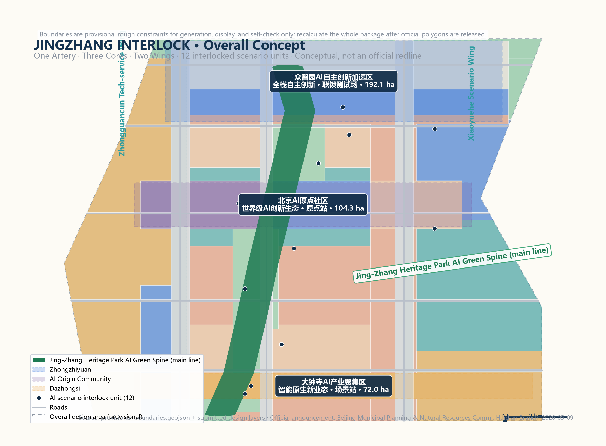
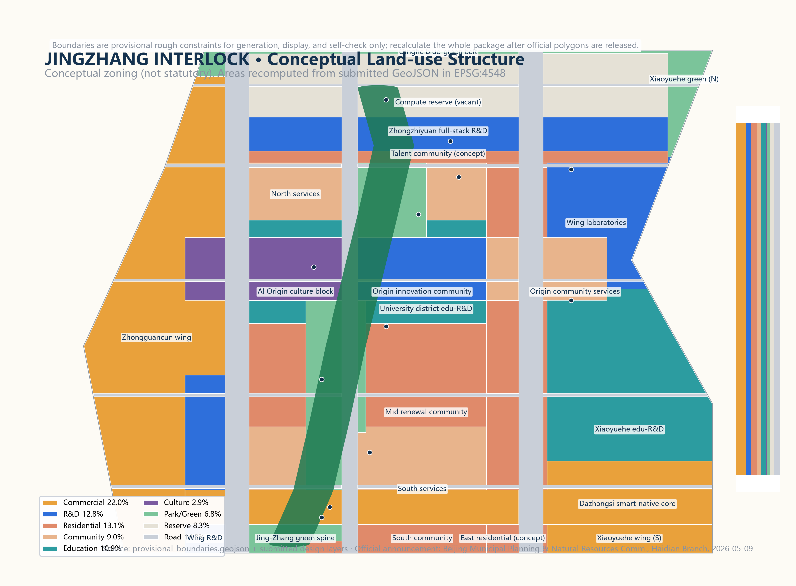
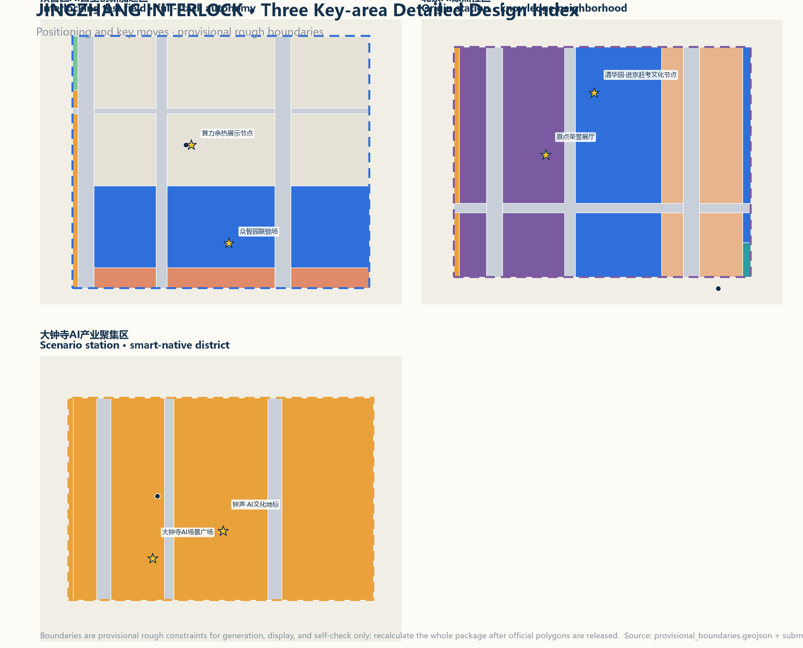
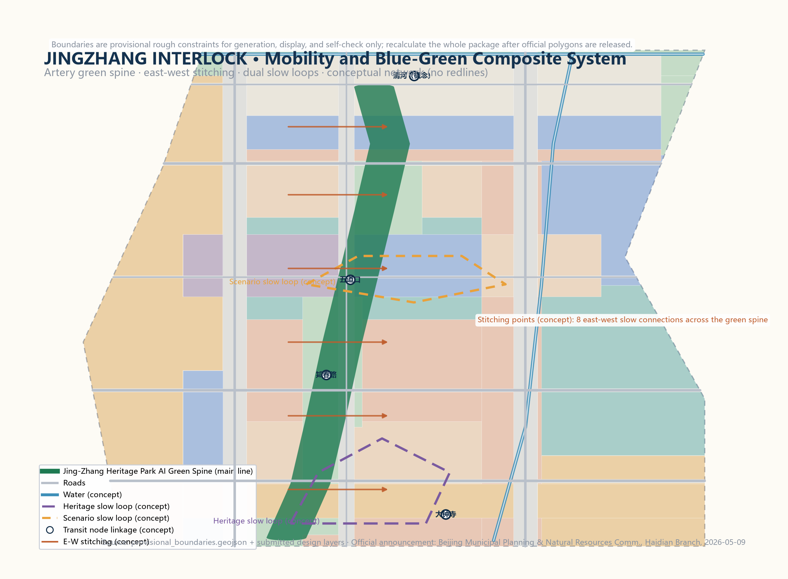
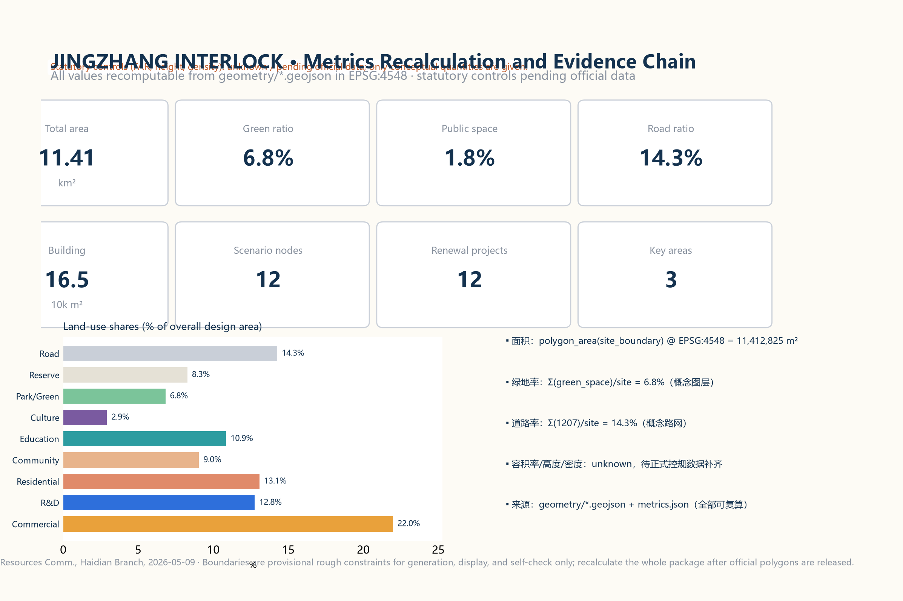

# JINGZHANG INTERLOCK: Interlock First, Enter the Station, Then Go Live — Conceptual Urban Design for the Centennial Jing-Zhang AI Innovation Belt

## Design Basis and Source List

This proposal is based strictly on public or cleared materials; no confidential maps, non-public tables, or unauthorized assets are used. Core inputs include: the Qualification Pre-Announcement for the International Urban Design Solicitation for the Centennial Jing-Zhang AI Innovation Belt issued by the Haidian Branch of the Beijing Municipal Commission of Planning and Natural Resources (2026-05-09, defining the three scope levels, three key areas, areas, and design tasks) [source:OFFICIAL-ANNOUNCEMENT] [standard:PROJECT-OFFICIAL-ANNOUNCEMENT]; the agent-facing open-call taskbook excerpt (user-provided cleared document) [source:AGENT-TASKBOOK] [standard:PROJECT-AGENT-OPEN-CALL-TASKBOOK]; the maintainer-derived provisional rough boundary `provisional_boundaries.geojson` (`official_boundary=false`, used for generation, display, and self-check only) [source:BOUNDARY-SOURCE] [source:KEY-AREA-SOURCE]; and the public policy and standard snapshots registered in `data/source_registry.json`.

All spatial recommendations in this proposal are conceptual suggestions, reference schemes, or material for professional teams to deepen. They do not replace statutory planning, do not constitute government approval, and imply no investment, attraction, or implementation commitments. Boundaries are provisional rough constraints; the entire package must be recalculated once official polygons are released [source:BOUNDARY-SOURCE] [data:geometry/site_boundary.geojson#SITE-001].

## Three-Level Scope Framework

According to the announcement, the project has a coordinated research area (about 43.6 km²; bounded by the 5th Ring Road North, Jingzang Expressway, Xizhimen Outer Street, and Wanquanhe Road), an overall design area (about 11.4 km²; the urban and industrial areas 1-2 km around the Jing-Zhang heritage park), and a key detailed-design area (about 368.4 ha, including from north to south the Zhongzhiyuan AI Acceleration Area, the Beijing AI Origin Community, and the Dazhongsi AI Industry Cluster) [standard:PROJECT-OFFICIAL-ANNOUNCEMENT] [metric:key_area_count]. The proposal works in three levels: research at the coordinated level, renewal and spatial structure at the overall level, and refined design at the key-area level [depth:three_level_scope_framework].

The provisional boundaries have known precision limits: the research and overall boundaries are polylines inferred from the announcement text, and the three key areas are rough rectangles fitted to announced areas [source:BOUNDARY-SOURCE]. These temporary constraints serve discussion and display only and must not be treated as redlines, approval bases, or precise area bases; the organizer data gap does not block content scoring, and all areas and indicators will be recomputed uniformly once official data arrives [source:KEY-AREA-SOURCE].

## Coordinated Research Area: Industry and Future City Research

The coordinated research area takes the Jing-Zhang heritage park as its north-south spine, linking the Zhongguancun Science City core, the university district along Xueyuan Road, the Shangdi information-industry base, and the Qinghe area — one of Beijing's most AI-intensive corridors. Haidian's "1+X+1" modern industrial system positions AI as a core industry, and the municipal "three areas, two wings" layout (AI Origin Community, Zhongzhiyuan AI Acceleration Area, Dazhongsi AI Industry Cluster plus the Zhongguancun tech-service wing and the Xiaoyuehe scenario wing) corresponds spatially to this project [source:HAIDIAN-1X1] [source:BEIJING-KW-THREE-AREAS].

Three judgments structure the research level. First, the belt should evolve from a linear heritage park into an innovation-ecosystem corridor that re-stitches the two sides severed by the railway. Second, AI industry space should shift from single parks to a research-validation-application continuum linked with universities, capital, data, and scenario resources. Third, the future city form should integrate computing, data, embodied intelligence, and public services rather than merely stacking smart devices [depth:three_level_scope_framework] [depth:overall_spatial_structure].

For regional synergy, the proposal suggests a division of labor with the Beiqing Road frontier innovation corridor, Future Science City, Huairou Science City, Yizhuang Economic Development Zone, and the Beijing-Tianjin-Hebei region: basic research, computing supply, scenario testing, and manufacturing; this belt focuses on frontier innovation and scenario validation to avoid homogeneous competition [source:BEIJING-KW-THREE-AREAS]. This is a research suggestion to be deepened by professional teams in coordination with municipal and district plans [depth:risk_missing_data].

## Overall Design Area: Urban Renewal and Regulatory-Plan-Level Urban Design

### Overall Concept and Naming System

The core tension of the overall design area is this: a century ago, the Jing-Zhang Railway broke the technology-sovereignty dilemma through its own design and the famous "zigzag" alignment; today AI services enter the public realm at a similar speed, yet residents often do not know who operates them, where data flows, or how to stop them. The proposal therefore introduces the overall concept **JINGZHANG INTERLOCK (京张联锁)**: borrowing the safety logic of railway interlocking — no train may enter a section without mutual confirmation — every AI service entering the public realm is treated as a "train" that must pass **permission interlock, safety interlock, and human interlock** before it can "enter the station and go live"; during operation its status remains visible, humans can take over, and it can always be stopped [depth:overall_spatial_structure].

The naming system has three layers: the overall name **JINGZHANG INTERLOCK** (abbreviated JZI); the three key areas named the **Interlocking Test Field** (Zhongzhiyuan), the **Origin Station** (Beijing AI Origin Community), and the **Scenario Station** (Dazhongsi), corresponding to full-stack validation, ecosystem convergence, and smart-native businesses; and the two wings named the **Signal House** (Zhongguancun tech-service wing, as the signal system for capital, IP, and factor markets) and the **Test Track** (Xiaoyuehe scenario wing, as the place for real-scenario trials) [standard:PROJECT-AGENT-OPEN-CALL-TASKBOOK] [source:AGENT-TASKBOOK]. This naming system is a conceptual proposal to be deepened by brand professionals with public testing; it does not copy any existing city, park, or enterprise name [depth:risk_missing_data].

The three positionings and five functions map onto the scheme as follows: the Centennial Jing-Zhang Culture Belt is carried by the main-line green spine plus the heritage narrative system; the Urban AI Life Experience Belt is carried by the scenario station, the dual slow loops, and the scenario cards; and the AI Fusion Innovation Belt is carried by the interlocking test field and the innovation-ecosystem map. The five functions — full-stack autonomous AI innovation, a world-class AI ecosystem, a new AI-plus-scenario paradigm, an intelligent vibrant AI city, and global AI-governance discourse — are assigned respectively to Zhongzhiyuan, the Origin Community, the Xiaoyuehe test track, the public-space component library, and the signal-house governance open seat [source:AGENT-TASKBOOK] [depth:overall_spatial_structure].

### Visual Identity and Logo Direction

The logo direction uses a "two rails into one pulse" motif: two parallel rails turn into a pulse curve whose nodes represent interlock units, forming a "track-pulse-loop" identity symbol. The palette uses Haidian blue (innovation), railway ochre (heritage), and interlock green (safety) [source:AGENT-TASKBOOK]. The visual system extends to: an interlock signal-light icon set (green = running and human-overridable, yellow = testing, red = stopped), milestone-based wayfinding (one "interlock milestone" per kilometer), scenario-card templates, and event visual templates. All fonts and graphics are original or open-licensed; no unauthorized trademarks or corporate logos are used [depth:risk_missing_data] [standard:PROJECT-AGENT-OPEN-CALL-TASKBOOK].

### Overall Spatial Structure: One Artery, Three Cores, Two Wings

The overall spatial structure is **"one artery, three cores, two wings, twelve interlock units"**: the artery is the Jing-Zhang heritage park AI green spine (main line) — the principal axis for slow mobility, culture, scenarios, and honor display [data:geometry/constraints.geojson#CON-ARTERY-01] [data:geometry/land_use.geojson#LU-AR-01]

The three cores are the key areas, carrying R&D validation, ecosystem convergence, and scenario transformation [data:geometry/key_areas.geojson#KEY-001] [data:geometry/key_areas.geojson#KEY-002] [data:geometry/key_areas.geojson#KEY-003]

The two wings are the Zhongguancun tech-service wing (west) and the Xiaoyuehe scenario wing (east) [data:geometry/constraints.geojson#AZ-WEST] [data:geometry/constraints.geojson#AZ-EAST]

Twelve AI scenario interlock units form an experienceable, operable network along the main line and the cores [data:geometry/constraints.geojson#SCN-01] [metric:scenario_node_count].

Three key spatial moves organize the design: first, **rail-to-artery** — upgrading the heritage park from a linear green belt into a composite culture-slow-mobility-data-energy artery, with eight east-west stitching points on both sides of the green spine to repair historical severance [data:geometry/roads.geojson#RD-01] [depth:traffic_rail_slow_parking]; second, **three cores on a string** — forming a "validation-convergence-transformation" industrial function chain along the main line [metric:key_area_count]; third, **dual slow loops** — a heritage slow loop and a scenario slow loop organizing human activity and AI experience routes [depth:blue_green_public_space].

### Land Use and Renewal Framework

Land use follows the principles of "green spine first, core concentration, wing growth" within the provisional boundary: commercial service land concentrates at the Dazhongsi smart-native core and the Zhongguancun wing [data:geometry/land_use.geojson#LU-DZ-01] [data:geometry/land_use.geojson#LU-ZG-01]

R&D land concentrates at the Zhongzhiyuan full-stack R&D zone and the Origin innovation community [data:geometry/land_use.geojson#LU-ZZ-02] [data:geometry/land_use.geojson#LU-OR-02]

Education land runs along the university-district education belt [data:geometry/land_use.geojson#LU-M-02]; park and green land forms the blue-green skeleton along the main line, the Qinghe, and the Xiaoyuehe [data:geometry/land_use.geojson#LU-AR-01] [data:geometry/land_use.geojson#LU-QH-01] [data:geometry/land_use.geojson#LU-XY-04]; and reserve land keeps flexibility for computing and full-stack functions at Zhongzhiyuan [data:geometry/land_use.geojson#LU-ZZ-01].

All land-use areas are recomputed from the submitted GeoJSON in EPSG:4548; the conceptual road ratio is about 14.3%, green ratio about 6.8%, and public-space ratio about 1.8% — conceptual quantities, not statutory indicators [metric:road_ratio] [metric:green_ratio] [metric:public_space_ratio].

The renewal framework is "retain as the base, renovate as the main mode, new-build to fill gaps": mature neighborhoods, university surroundings, and usable industrial buildings are retained with functional repositioning; low-efficiency land and temporary structures along the railway are progressively renovated; reserve and vacated nodes are filled with new construction. Parcel-level retain/renovate/demolish decisions require official building, ownership, and regulatory-plan data and must be made by professional teams; this proposal gives no parcel-level conclusions [depth:retain_renovate_demolish] [depth:development_intensity_controls] [metric:floor_area_ratio].

### City Character

The character direction is "historic rail line, modern tech core, green public base": linear rail memory along the main line with heritage anchors such as station buildings and signal houses; medium-scale block-based urban form in the three cores, avoiding continuous high-rise walls; and a palette of Haidian blue, interlock green, and railway ochre with a unified public-space component system [standard:MOHURD-URBAN-DESIGN-MEASURES] [depth:height_massing_character]. Statutory controls on height, massing, and intensity follow official data; this proposal provides only conceptual character direction [metric:floor_area_ratio].

## Detailed Design of Key Areas

Each of the three key areas is developed as a readable mini-scheme covering positioning, spatial structure, building renewal, mobility and slow traffic, public space, AI scenarios, and implementation risks. Their boundaries are provisional rough polygons; all conclusions are directional, and everything must be rechecked when official polygons are released [source:KEY-AREA-SOURCE] [depth:three_key_area_detailed_design].

### Zhongzhiyuan AI Acceleration Area (Interlocking Test Field)

**Positioning**: the carrier of the full-stack autonomous AI innovation system and AI-governance discourse — the "interlocking test field" where AI must be validated before entering the city [standard:PROJECT-OFFICIAL-ANNOUNCEMENT].

**Spatial structure**: a three-band layout from north to south — computing reserve belt, full-stack R&D park, and talent community [data:geometry/land_use.geojson#LU-ZZ-01] [data:geometry/land_use.geojson#LU-ZZ-02] [data:geometry/land_use.geojson#LU-ZZ-03].

**Building renewal**: conceptually R&D labs, pilot workshops, and talent apartments dominate, with reuse of existing buildings through functional repositioning [data:geometry/buildings.geojson#BLD-001] [depth:retain_renovate_demolish].

**Mobility**: access organized along the Qinghe blue-green belt and the green corridor south of the 5th Ring Road, with the start of the autonomous shuttle test loop [data:geometry/constraints.geojson#SCN-03].

**Public space**: an "interlock plaza" publicly displaying the status of AI services under test and the human takeover entry [data:geometry/public_space.geojson#PS-03].

**AI scenarios**: the AI pilot interlock field, compute-heat reuse showcase, and low-altitude logistics test node [data:geometry/constraints.geojson#SCN-09] [data:geometry/constraints.geojson#SCN-10] [data:geometry/constraints.geojson#SCN-08].

**Risks**: energy and municipal capacity for computing infrastructure, land ownership, and noise from the 5th Ring Road all await official data [depth:risk_missing_data].

### Beijing AI Origin Community (Origin Station)

**Positioning**: a world-class AI innovation ecosystem and a high-quality district that global AI talent wants to live in — the "origin station" where Zhongguancun entrepreneurial culture and AI culture converge into a knowledge neighborhood [standard:PROJECT-OFFICIAL-ANNOUNCEMENT].

**Spatial structure**: anchored on the Qinghua East Road West End-Wudaokou area, forming a compound neighborhood of culture blocks, innovation community, and community services [data:geometry/land_use.geojson#LU-OR-01] [data:geometry/land_use.geojson#LU-OR-02] [data:geometry/land_use.geojson#LU-OR-03].

**Building renewal**: light-touch retrofits of existing buildings with shared labs, AI education spaces, and talent services [depth:retain_renovate_demolish].

**Mobility**: strengthened walking links between the transit station and the green spine, with the "Origin Plaza" as the gathering and civic center [data:geometry/public_space.geojson#PS-02] [depth:traffic_rail_slow_parking].

**Public space**: the Origin Plaza carries the honor-display system, the "AI Honor Hall," and annual developer events [data:geometry/constraints.geojson#SCN-06].

**AI scenarios**: AI education lab, AI health station, and Origin honor hall [data:geometry/constraints.geojson#SCN-05] [data:geometry/constraints.geojson#SCN-07].

**Risks**: height controls around universities, heritage protection (e.g., the Qinghuayuan station site), and community renewal willingness require professional and public confirmation [depth:risk_missing_data].

### Dazhongsi AI Industry Cluster (Scenario Station)

**Positioning**: the core showcase of smart-native businesses and the Urban AI Life Experience Belt — the "scenario station" where AI services complete their final interlock in real commercial and public contexts [standard:PROJECT-OFFICIAL-ANNOUNCEMENT].

**Spatial structure**: a station-city integrated structure with commercial surroundings and a plaza focal point around Dazhongsi station [data:geometry/land_use.geojson#LU-DZ-01] [data:geometry/public_space.geojson#PS-01].

**Building renewal**: conceptually commercial complex renovation and street-front renewal with smart-native consumption and AI exhibition uses [depth:retain_renovate_demolish].

**Mobility**: integrated rail-bus-slow connections safely channeling station flows into the green spine [depth:traffic_rail_slow_parking].

**Public space**: the "AI Scenario Plaza" as the demonstration window of interlock units, showing scenario status and data-boundary explanations [data:geometry/constraints.geojson#SCN-01] [data:geometry/constraints.geojson#SCN-02].

**AI scenarios**: smart-native consumption and the AI scenario plaza interlock unit [data:geometry/constraints.geojson#SCN-01] [data:geometry/constraints.geojson#SCN-02].

**Risks**: property rights and operator coordination in commercial renewal, and underground and municipal conditions requiring engineering review [depth:risk_missing_data].

## AI Innovation Ecosystem, Personas, and AI+ Scenarios

### Global AI Ecosystem Cases (6)

Six global AI ecosystem cases inform the proposal, contributing transferable spatial and operational mechanisms [source:CASE-STANFORD] [source:CASE-KINGS-CROSS] [source:CASE-ONENORTH].

The remaining cases (Pangyo, Adlershof, Tel Aviv) and the full index are recorded in sources.json and compliance_matrix [source:CASE-PANGYO] [source:CASE-ADLERSHOF] [source:CASE-TELAVIV]; all are background references from public sources and imply no commitment for this project.

| Case | Core mechanism | Transferable idea for Jingzhang Interlock |
| --- | --- | --- |
| Stanford Research Park (US) | University-capital-company proximity; walkable environment fosters informal exchange | Origin Community: strengthen a walkable university-lab-incubator radius |
| King's Cross Knowledge Quarter (UK) | Station-city integrated renewal; public space first; knowledge institutions cluster | Dazhongsi Scenario Station: station-city integration with public space first |
| one-north, Singapore | Thematic clusters + lifestyle + scenario trials in one plan | Zhongzhiyuan: three-band R&D-test-life layout |
| Pangyo Techno Valley (KR) | Government-guided startup acceleration; IT/game ecosystem | Interlocking test field: low-barrier test access |
| Berlin Adlershof (DE) | Research institutes and SMEs co-located; sustainable campus | Public experiment and showcase nodes along the green spine |
| Tel Aviv AI ecosystem (IL) | Dense exchange networks; defense-tech conversion tradition | Signal-house wing: technology transfer and factor services |

### Ecosystem Map and Factor Mechanisms

The ecosystem map is organized as "one network, three rings": the **factor ring** (land, space, industry, capital, talent, computing, data, and scenarios configured at the Signal-house wing) [data:geometry/constraints.geojson#AZ-WEST]; the **innovation ring** (universities, labs, startups, large firms, and developers along the Origin Community and the green spine) [data:geometry/constraints.geojson#AZ-EAST]; and the **governance ring** (interlock rules, human review, and public audit at signal-house nodes along the main line) [data:geometry/constraints.geojson#SCN-04]. Suggested mechanisms include a full scenario-open application-review-interlock-launch-review process, public-use rules for computing and data factors, and a developer community charter with honor incentives [source:AGENT-TASKBOOK] [standard:PROJECT-AGENT-OPEN-CALL-TASKBOOK]. All mechanisms are conceptual and require professional and operational deepening with statutory procedures [depth:risk_missing_data].

### User Personas (5)

| Persona | Needs | Corresponding scenarios and spaces |
| --- | --- | --- |
| P1 LLM researcher | Computing, data, experiments, peer exchange | Zhongzhiyuan R&D park, pilot interlock field |
| P2 Startup founder | Low-barrier testing, capital, scenario access | Interlocking test field, open scenarios at the Scenario Station |
| P3 International developer / visiting scholar | International services, English wayfinding, community belonging | Origin Community, developer event system |
| P4 Nearby residents (incl. elderly and children) | Perceivable, exitable, accessible AI services | Green spine, community services, health station |
| P5 Students / visitors / families | Experienceable, sharable, learnable AI scenarios | Scenario plaza, Origin honor hall, pilgrimage landmarks |

### AI Scenario Cards (12, including 4 industry test-and-validation scenarios)

The scenario cards are readable here and mapped to spatial location, users, data boundaries, human review, operators, and risks [source:AGENT-TASKBOOK] [depth:overall_spatial_structure]. Data use follows the least-necessary principle; every scenario must pass interlock review and publish its status; no scenario may impose non-reviewable mandatory surveillance or automated decisions [standard:GENERATIVE-AI-INTERIM-MEASURES] [standard:BARRIER-FREE-ENVIRONMENT-LAW].

| ID | Scenario card | Location | Users | Data boundary | Human review | Operator (concept) | Layer |
| --- | --- | --- | --- | --- | --- | --- | --- |
| SC-01 | Dazhongsi smart-native consumption | Dazhongsi station area | Shoppers / merchants | Anonymized aggregated flows and preferences | Merchant and platform double review | Commercial operation consortium | [data:geometry/constraints.geojson#SCN-01] |
| SC-02 | AI scenario plaza interlock unit | Dazhongsi AI scenario plaza | Public | Anonymous interaction data | Plaza operator | Public-space operator | [data:geometry/constraints.geojson#SCN-02] |
| SC-03 | Autonomous shuttle test loop (industry test) | Zhongzhiyuan south loop | Commuters / test firms | Anonymized vehicle trajectories | Safety officer + remote takeover | Test operation alliance | [data:geometry/constraints.geojson#SCN-03] |
| SC-04 | Signal-house AI governance open seat | Zhichunlu signal-house plaza | Public / developers | Public minutes | Human chair | Governance committee | [data:geometry/constraints.geojson#SCN-04] |
| SC-05 | AI education lab | Origin education belt | Students / teachers | Teaching data stays on campus | Teacher review | School alliance | [data:geometry/constraints.geojson#SCN-05] |
| SC-06 | Origin community AI honor hall | Origin Plaza | Public / contributors | Contributor-authorized info | Honor committee | Community foundation | [data:geometry/constraints.geojson#SCN-06] |
| SC-07 | AI health service station | Mid-area communities | Elderly / chronic-care users | Encrypted local health data | Medical review | Medical institutions | [data:geometry/constraints.geojson#SCN-07] |
| SC-08 | Low-altitude logistics test node (industry test) | Northern Zhongzhiyuan | Park firms | Anonymized routes and parcels | Ground supervisor | Low-altitude platform | [data:geometry/constraints.geojson#SCN-08] |
| SC-09 | Zhongzhiyuan AI pilot interlock field (industry test) | Zhongzhiyuan core | Test firms | Tiered confidential test data | Pilot review panel | Park operator | [data:geometry/constraints.geojson#SCN-09] |
| SC-10 | Compute-heat reuse showcase | Northern Zhongzhiyuan | Public / energy firms | Public energy data | Energy regulator | Integrated energy service | [data:geometry/constraints.geojson#SCN-10] |
| SC-11 | Embodied-AI street test field (industry test) | Xiaoyuehe scenario wing | Robotics firms | Anonymized behavior data | On-site safety officer | Scenario operator | [data:geometry/constraints.geojson#SCN-11] |
| SC-12 | Xiaoyuehe scenario empowerment lab | Xiaoyuehe education-R&D belt | Developers / public | Licensed open datasets | Community review | Open innovation platform | [data:geometry/constraints.geojson#SCN-12] |

Privacy and human boundaries: all scenarios comply with personal-information protection and generative-AI management requirements, provide exit and human-fallback channels, and offer non-smart alternatives for the elderly and people with disabilities [standard:GENERATIVE-AI-INTERIM-MEASURES] [standard:BARRIER-FREE-ENVIRONMENT-LAW] [standard:ELDERLY-SMART-TECH-PLAN-2020-45].

## Land Use, Building Scale, and Retain-Renovate-Demolish Strategy

The conceptual land-use structure is encoded with the national land-use classification (05 commercial, 0701 residential, 0702 community services, 0802 R&D, 0803 culture, 0804 education, 1207 roads, 1401 green, 16 reserve); all areas are recomputed from `geometry/land_use.geojson` in EPSG:4548 and fully cover the provisional boundary without gaps or overlaps [standard:MNR-LAND-USE-CLASSIFICATION-GUIDE] [depth:land_use_layout] [metric:site_area_sqm]. The conceptual building footprint is about 165,000 m² across buildable R&D, commercial, cultural, educational, and residential zones, all inside land-use parcels and clear of roads, green space, and plazas [data:geometry/buildings.geojson#BLD-001] [metric:building_footprint_area_sqm] [metric:building_density].

The retain/renovate/demolish classification is conceptual only: retain (existing universities, mature neighborhoods, reusable industrial buildings), renovate (low-efficiency railway-side land, street fronts), and new-build (reserve and vacated nodes). Parcel-level determinations require official building, ownership, regulatory-plan, and engineering data; this proposal gives none [depth:retain_renovate_demolish] [metric:floor_area_ratio]. Statutory controls such as FAR, height, and density follow official data and are currently marked "pending official data" [depth:development_intensity_controls].

## Transport, Rail, Municipal Infrastructure, and Public Services

Mobility follows "transit first, slow-traffic loops, stitching first": station-city integrated connections at existing transit stations (Dazhongsi, Zhichunlu, Wudaokou, etc., shown conceptually) [data:geometry/constraints.geojson#SCN-01] [depth:traffic_rail_slow_parking]; a conceptual road network of two north-south secondary roads, one branch road, and five east-west roads [data:geometry/roads.geojson#RD-01] [data:geometry/roads.geojson#RD-02] [metric:road_ratio]; eight east-west stitching points along the green spine to repair severed pedestrian links [depth:traffic_rail_slow_parking]; and a slow-traffic system of heritage and scenario loops connected to the green spine and the Xiaoyuehe blue-green belt [depth:blue_green_public_space].

Municipal and new-infrastructure strategies are conceptual directions: distributed energy and compute-heat reuse interfaces reserved at Zhongzhiyuan [data:geometry/constraints.geojson#SCN-10]; edge computing, public Wi-Fi, and environmental sensors deployed modularly per interlock unit [data:geometry/constraints.geojson#SCN-04]; underground utilities, fire access, and sponge-city measures are listed as pending data for professional deepening [depth:municipal_new_infrastructure] [depth:risk_missing_data].

Public service facilities follow a "15-minute life circle" concept: talent services and education at the Origin Community [data:geometry/land_use.geojson#LU-OR-03] [data:geometry/land_use.geojson#LU-OR-02]; community, health, and elderly-care services in the mid and south areas [data:geometry/land_use.geojson#LU-M-03] [data:geometry/land_use.geojson#LU-S-02]; and residential and service support in the Zhongzhiyuan talent community [data:geometry/land_use.geojson#LU-ZZ-03]. Facility lists and scales need official population and service-radius data [depth:risk_missing_data].

## Blue-Green Network, Public Space, and Urban Character

The blue-green skeleton consists of the main-line green spine, the Qinghe belt, and the Xiaoyuehe belt [data:geometry/green_space.geojson#GRN-01] [data:geometry/green_space.geojson#GRN-02] [data:geometry/green_space.geojson#GRN-03], with a conceptual green ratio of about 6.8% [metric:green_ratio].

Public space consists of five plazas and the green-spine promenade [data:geometry/public_space.geojson#PS-01] [data:geometry/public_space.geojson#PS-02] [data:geometry/public_space.geojson#PS-03]; the remaining nodes (PS-04–PS-06) are small plazas and stitching points along the spine [data:geometry/public_space.geojson#PS-04] [data:geometry/public_space.geojson#PS-05] [data:geometry/public_space.geojson#PS-06].

The conceptual public-space ratio is about 1.8% [metric:public_space_ratio]; per-node areas are recomputable from public_space.geojson and metrics.json.

**AI public space** (concept): installations along the green-spine promenade follow "experienceable, explainable, exitable"; every installation shows a status light (green/yellow/red) and a human-service entry, with no irreversible or coercive interactions [standard:GENERATIVE-AI-INTERIM-MEASURES] [depth:blue_green_public_space].

**AI pilgrimage landmarks and honor-display system** (4, concept): the Jing-Zhang Kilometer-Zero Milestone and Origin Honor Hall at the Origin Plaza (commemorating the railway's origin and the "journey to take the exam" historical context, displaying AI contributor honors) [data:geometry/constraints.geojson#SCN-06]; the Dazhongsi "Bell Station" cultural landmark (an AI culture scene themed on bell sound and time) [data:geometry/constraints.geojson#SCN-01]; the Zhongzhiyuan "Interlock Tower" landmark (a signal-house-inspired symbol of technology governance) [data:geometry/constraints.geojson#SCN-09]; and the Wudaokou "Zigzag Rail" stitching plaza (a public-art node evoking the Jing-Zhang zigzag alignment) [data:geometry/public_space.geojson#PS-02]. The honor system has three layers — milestones, badges, and the honor roll: interlock milestones along the green spine, annual contributor badges, and major contributions entering the Origin Honor Hall; all landmarks must respect heritage, green, and safety constraints and avoid excessive entertainment [standard:PROJECT-AGENT-OPEN-CALL-TASKBOOK] [depth:risk_missing_data].

## Renewal Projects, Implementation Policy, and Phasing

The renewal project list (12, concept): the main-line green-spine through-connection, eight east-west stitching points, the Origin Plaza and Honor Hall, the Dazhongsi AI scenario plaza, the Zhongzhiyuan interlock plaza, the AI pilot interlock field, the compute-heat demonstration node, the autonomous shuttle test loop, the low-altitude logistics test node, the embodied-AI street test field, the Xiaoyuehe scenario lab, and the signal-house governance open seat [data:geometry/phasing.geojson#PH-P1] [data:geometry/phasing.geojson#PH-P2] [data:geometry/phasing.geojson#PH-P3].

The renewal project count of 12 is tracked in [metric:renewal_project_count].

Phasing (concept): **Near-term 2026-2028** — main-line interlock launch: green-spine through-connection, two plazas, the governance open seat, and the first scenario-card pilots, about 308.7 ha [metric:phase_P1_area_sqm]; **Mid-term 2028-2031** — three-core network: linkage of the three key areas, test loops, and scenario labs, about 572.4 ha [metric:phase_P2_area_sqm]; **Long-term 2031-2035** — whole-belt intelligence: deepening of the two wings and the full scenario network, about 260.1 ha [metric:phase_P3_area_sqm]. Policy suggestions include a scenario-open and interlock-review procedure, public-data-open rules, a developer community charter, honor incentives, and phased investment plans; all are conceptual and require professional and authority deepening [depth:phasing_implementation] [depth:renewal_project_list].

**Global AI event system and long-term operation** (concept): an annual event system with the "Jingzhang AI Interlock Festival" (spring; public experience and scenario releases), "Jingzhang Developer Week" (summer; hackathons and open interlock reviews), the "Origin Innovation Dialogue" (autumn; global AI governance and ecosystem forum), and quarterly "Scenario Open Days" (test-scenario applications and pitches) [source:AGENT-TASKBOOK] [depth:renewal_project_list]. Operation mechanisms include dual online-and-on-site developer community operation, an apply-review-interlock-review closed loop for open scenarios, public experience routes (landmarks plus scenario cards), and an "experiencer-contributor-honor" conversion path; event branding reuses the interlock identity system to build long-term brand assets [standard:PROJECT-AGENT-OPEN-CALL-TASKBOOK] [depth:risk_missing_data]. All event arrangements are conceptual and are not confirmed government arrangements.

## Metrics, Area Recalculation, and Compliance Matrix

Core indicators include: overall design area (recomputed about 1,141.3 ha) [metric:site_area_sqm]; the three key-area areas (Zhongzhiyuan about 192.9 ha, Origin Community about 104.3 ha, Dazhongsi about 72.0 ha; provisional recomputations) [metric:key_area_zhongzhiyuan_ai_acceleration_area_sqm] [metric:key_area_beijing_ai_origin_community_sqm] [metric:key_area_dazhongsi_ai_industry_cluster_sqm]; conceptual green ratio about 6.8% [metric:green_ratio]; conceptual public-space ratio about 1.8% [metric:public_space_ratio]; and conceptual road ratio about 14.3% [metric:road_ratio].

Conceptual building footprint is about 165,000 m² [metric:building_footprint_area_sqm]; 12 AI scenario nodes [metric:scenario_node_count]; 12 renewal projects [metric:renewal_project_count]; and three conceptual phase areas [metric:phase_P1_area_sqm] [metric:phase_P2_area_sqm] [metric:phase_P3_area_sqm].

All values are recomputable from `geometry/*.geojson` in EPSG:4548; formulas and sources are in `metrics.json`. Statutory indicators such as FAR are unknown and pending official data [metric:floor_area_ratio] [depth:metrics_recalculation].

For task coverage, `compliance_matrix.json` covers all announcement tasks in sections 1.3, 1.4, and 1.5 and the six agent tasks agent.1-agent.6; `standard_matrix.json` covers all mandatory professional standards; `design_depth_matrix.json` covers all 15 required design-depth items. Proposal chapters and structured files correspond one-to-one; machine indexes are not duplicated here [depth:metrics_recalculation] [depth:risk_missing_data].

## Risk, Copyright, and Compliance

Legality of materials: only public or cleared sources are used; sources, retrieval dates, licenses, and limitations are recorded in `sources.json`; no non-public government data, internal corporate data, or personal data is used [source:SOURCE-REGISTRY]. Copyright: all original text, graphics, and generated figures belong to this submission and are displayed under the repository's public license; no unauthorized trademarks, fonts, images, or portraits are used (see `report/copyright_statement.md`). AI generation responsibility: this proposal is generated by an AI agent with disclosed methods; all spatial conclusions are conceptual and are not professional planning, approval, or implementation commitments. Risk register: provisional boundary precision, missing statutory controls, missing existing-building and ownership data, and engineering conditions pending review are recorded in `assumptions.json` and the design-depth matrix [depth:risk_missing_data] [depth:existing_conditions_diagnosis]. Going forward, the participant should sync repository main daily, re-read material updates, rerun self-checks, and recalculate the whole package when official data is released [source:AGENT-TASKBOOK].

## References

1. Haidian Branch, Beijing Municipal Commission of Planning and Natural Resources: Qualification Pre-Announcement for the International Urban Design Solicitation for the Centennial Jing-Zhang AI Innovation Belt (2026-05-09).
2. Excerpt of the agent open-call taskbook for the Centennial Jing-Zhang AI Innovation Belt open solicitation (user-provided cleared document, 2026-05-18).
3. Beijing Municipal Science and Technology Commission / Zhongguancun Administrative Committee: "Three areas, two wings" to build a world-class AI cluster (2026-04-03).
4. Haidian District Government: "1+X+1" modern industrial system announcement (2026-03-02).
5. Ministry of Natural Resources: Land-sea classification guide for territorial spatial surveys, planning, and use control (2023-11-22).
6. MOHURD: Measures for the Administration of Urban Design (2017).
7. MOHURD: Measures for the Formulation and Approval of Regulatory Detailed Plans for Cities and Towns.
8. CAC and others: Interim Measures for the Management of Generative AI Services (2023-07).
9. NPC Standing Committee: Law of the People's Republic of China on the Construction of a Barrier-Free Environment (2023-06).
10. General Office of the State Council: Implementation Plan for Solving the Difficulties of the Elderly in Using Intelligent Technologies (Guobanfa [2020] No. 45).
11. Public pages of Stanford Research Park, King's Cross Knowledge Quarter, one-north, Pangyo Techno Valley, Berlin Adlershof, and the Tel Aviv AI ecosystem (background reference).
12. Repository maintainers: provisional_boundaries.geojson and derivation notes (reviewed 2026-08-07).

The full source index is maintained in sources.json and the data registry [source:SOURCE-REGISTRY].
