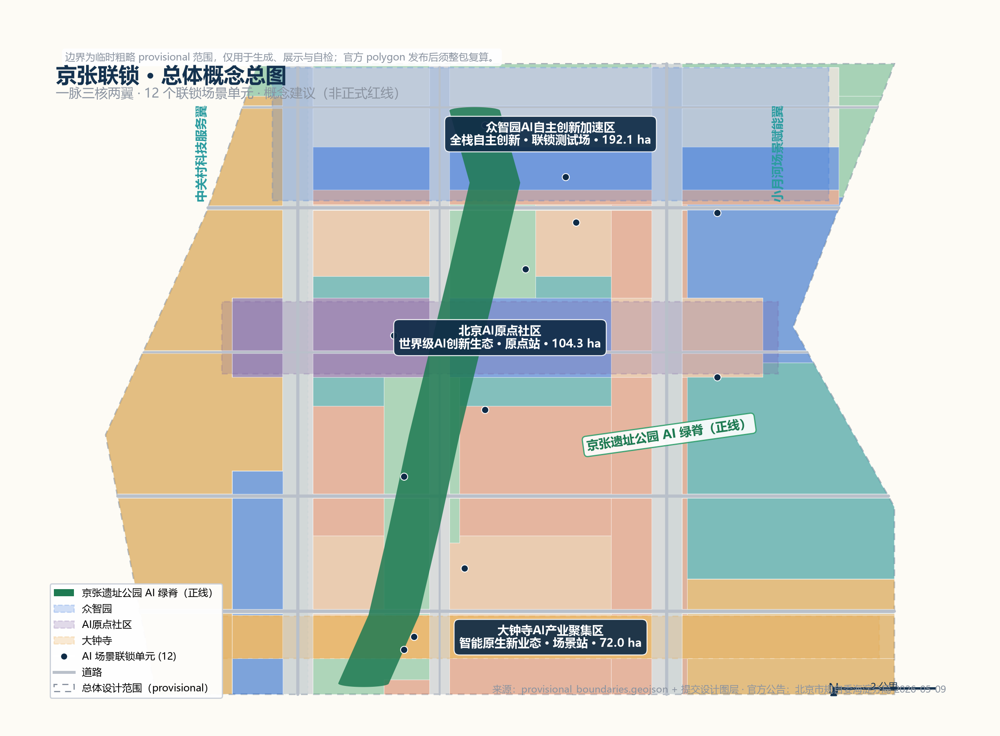
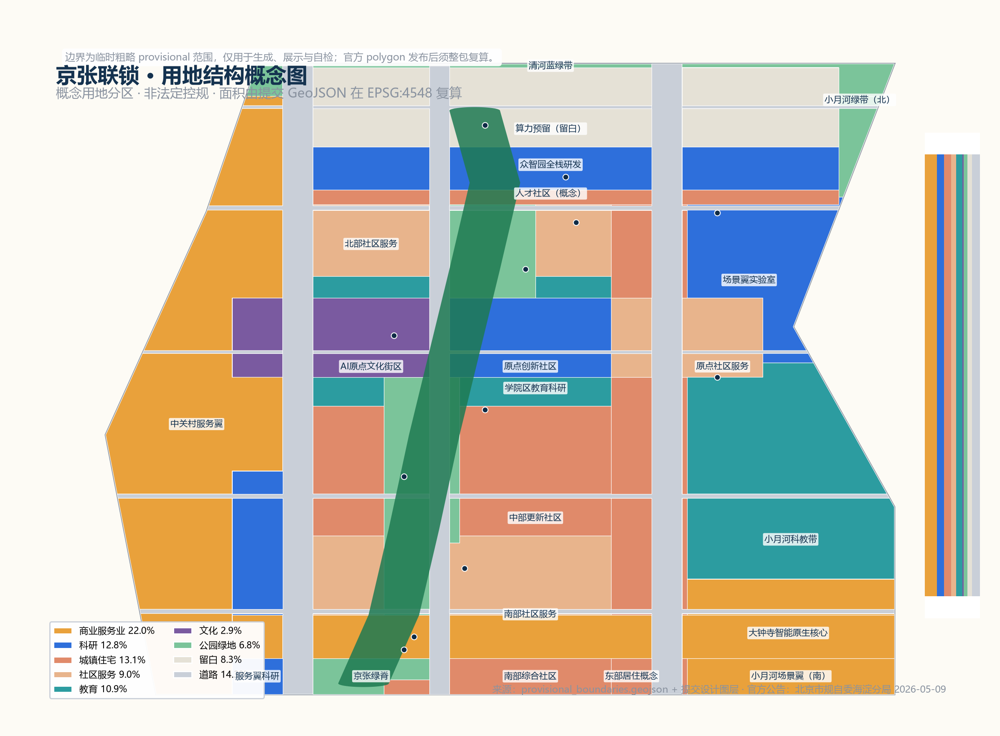
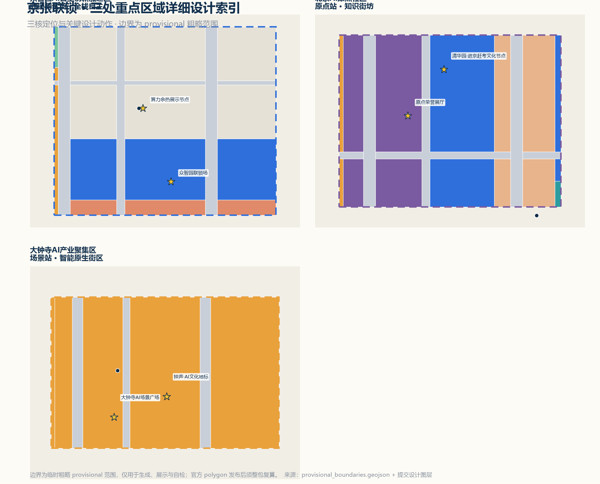
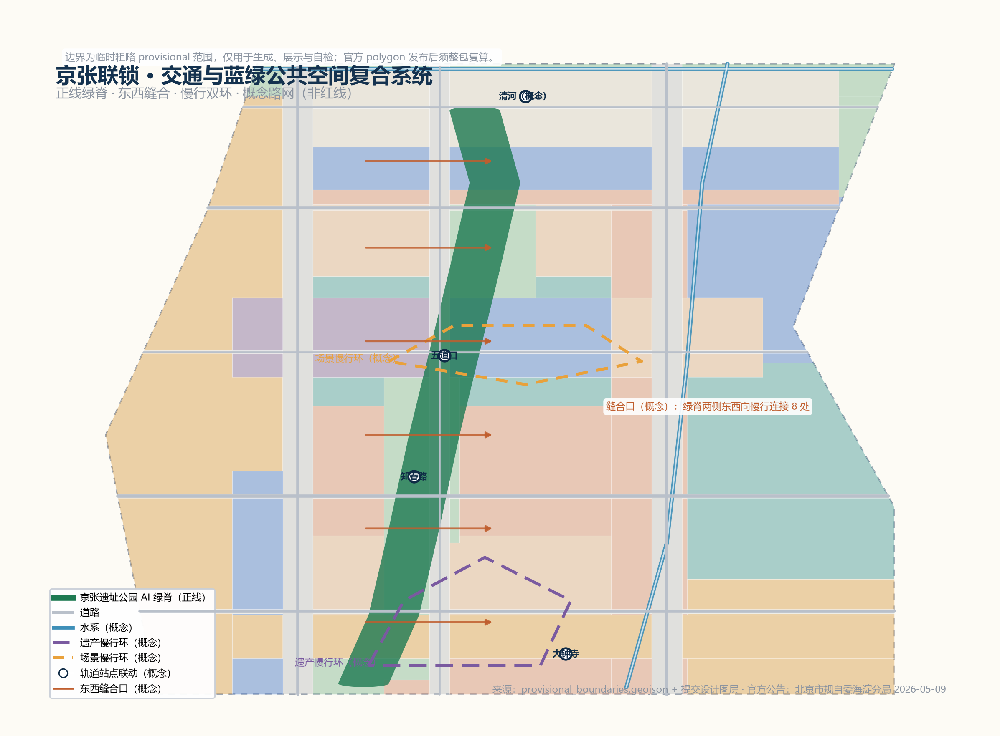
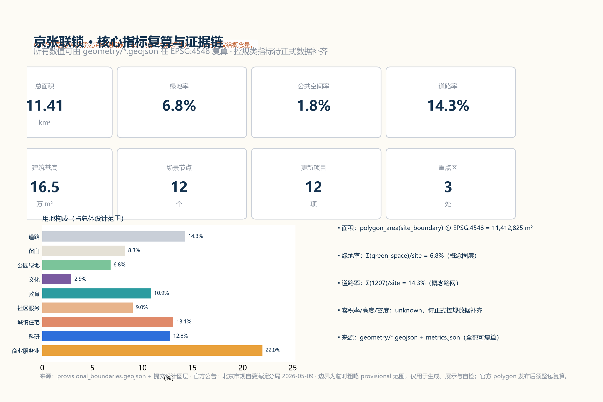

# 京张联锁 JINGZHANG INTERLOCK：先联锁、再进站、后上线的百年京张AI创新带城市设计概念方案

## 设计依据与资料清单

本方案严格基于公开或清权资料编制，不使用秘密地图、非公开表格或未经授权素材。核心依据包括：北京市规划和自然资源委员会海淀分局《百年京张AI创新带城市设计国际方案征集资格预审公告》（2026-05-09，含三层范围、三处重点区域、面积与任务要求）[source:OFFICIAL-ANNOUNCEMENT] [standard:PROJECT-OFFICIAL-ANNOUNCEMENT]、面向全球智能体开展本征集的任务书摘录（用户提供清权文件）[source:AGENT-TASKBOOK] [standard:PROJECT-AGENT-OPEN-CALL-TASKBOOK]、仓库维护者依公告文字四至推定的临时粗略边界 `provisional_boundaries.geojson`（`official_boundary=false`，仅用于生成、展示与自检）[source:BOUNDARY-SOURCE] [source:KEY-AREA-SOURCE]，以及 `data/source_registry.json` 中登记的公开发布政策与标准快照。

本方案中所有空间落地建议均为概念建议、参考方案或可供专业团队深化研究的内容，不替代正式规划，不构成政府审定结论，不承诺投资、招商或实施安排。边界为临时粗略 provisional 范围，官方 polygon 发布后须整包复算 [source:BOUNDARY-SOURCE] [data:geometry/site_boundary.geojson#SITE-001]。

## 三层范围工作框架

依据公告，项目设置统筹研究范围（约43.6平方公里，北至北五环路、东至京藏高速、南至西直门外大街、西至万泉河路）、总体设计范围（约11.4平方公里，京张遗址公园周边1—2公里城市地区和产业区）与重点区域范围（约368.4公顷，自北向南包括众智园AI自主创新加速区、北京AI原点社区、大钟寺AI产业聚集区）[standard:PROJECT-OFFICIAL-ANNOUNCEMENT] [metric:key_area_count]。本方案以三层范围建立"研究—设计—深化"的工作框架：统筹层回答区域协同与产业生态，总体层回答城市更新与空间结构，重点层回答精细化设计 [depth:three_level_scope_framework]。

临时边界存在精度限制：统筹与总体范围为公告文字四至推定折线，三处重点区为公告面积拟合的粗略矩形占位 [source:BOUNDARY-SOURCE]。这些临时约束只承担讨论与展示功能，不得视为红线、审批依据或精确面积依据；组织方数据缺口不阻断内容评分，官方数据到位后全部面积与指标将统一复算 [source:KEY-AREA-SOURCE]。

## 统筹研究范围产业与未来城市研究

统筹研究范围以京张铁路遗址公园为南北主轴，连接中关村科学城核心区、学院路高校带、上地信息产业基地与清河周边地区，是北京人工智能产业最密集的走廊之一。海淀区"1+X+1"现代化产业体系将人工智能列为核心产业，市科委发布的"三区两翼"布局（AI原点社区、众智园AI自主创新加速区、大钟寺AI产业集聚区与中关村科技服务翼、小月河场景赋能翼）与本项目空间高度对应 [source:HAIDIAN-1X1] [source:BEIJING-KW-THREE-AREAS]。

统筹层研究提出三点判断：第一，创新带应从"线性遗产公园"升级为"创新生态走廊"，把铁路割裂的两侧空间重新缝合；第二，AI产业的空间组织应从单一园区转向"研究—验证—应用"连续体，与高校、资本、数据和场景资源形成协同回路；第三，未来城市形态应围绕算力、数据、具身智能与公共服务融合展开，而不是简单叠加智能设备 [depth:three_level_scope_framework] [depth:overall_spatial_structure]。

在区域协同上，方案建议与北清路前沿创新走廊、未来科学城、怀柔科学城、亦庄经开区及京津冀地区形成"基础研究—算力供给—场景测试—产业制造"的分工网络；本带聚焦前端创新与场景验证，避免与相邻园区同质竞争 [source:BEIJING-KW-THREE-AREAS]。该判断属于研究建议，需与市级国土空间规划和各区产业规划衔接后由专业团队深化 [depth:risk_missing_data]。

## 总体设计范围城市更新与控规深度城市设计

### 总体概念与命名体系

总体设计范围的核心矛盾是：百年京张铁路以"人字形"和自主建造打破了技术主权困境，而今天AI服务正以同样快的速度进入城市公共空间，公众却常常不知道谁在运行、数据流向哪里、如何停止。本方案提出总体概念**"京张联锁（JINGZHANG INTERLOCK）"**：借鉴铁路联锁系统"未经多方确认、列车不得进入同一区间"的安全逻辑，把每一项进入公共空间的AI服务视为一列"列车"，必须先通过**权限联锁、安全联锁、人机联锁**三重确认，才能"进站—上线"；运行中状态可感知，人工可接管，随时可停止 [depth:overall_spatial_structure]。

命名体系分三层：总称**"京张联锁"**（英文 JINGZHANG INTERLOCK，缩写 JZI）；三处重点区域分别命名为**"联锁测试场"（众智园）、"原点站"（北京AI原点社区）、"场景站"（大钟寺）**，对应全栈自主验证、创新生态汇聚与智能原生业态三个功能环节；两翼命名为**"信号楼"（中关村科技服务翼，隐喻资本、IP与要素信号）**与**"试车线"（小月河场景赋能翼，隐喻真实场景试验）** [standard:PROJECT-AGENT-OPEN-CALL-TASKBOOK] [source:AGENT-TASKBOOK]。该命名体系为概念建议，需经品牌专业机构与公众测试后深化，不照搬任何城市、园区或企业名称 [depth:risk_missing_data]。

三大定位与五大功能在方案中的对应关系为：百年京张文化带由"正线绿脊+遗产叙事系统"承载，都市AI生活体验带由"场景站+慢行双环+场景卡"承载，AI融合创新带由"联锁测试场+创新生态图谱"承载；五大功能（AI全栈自主创新体系、世界级AI创新生态、AI+场景赋能新范式、智能化AI活力城市、AI治理全球话语权）分别落实到众智园、原点社区、小月河试车线、公共空间组件库与信号楼治理公开席 [source:AGENT-TASKBOOK] [depth:overall_spatial_structure]。

### 视觉识别与Logo方向

Logo方向采用"双轨入脉"图形：两条平行轨道线在中间转折为一道脉冲曲线，曲线上的节点象征联锁单元，整体构成"轨道—脉搏—回路"的识别符号；主色采用海淀蓝（创新）、铁轨赭（历史）与联锁绿（安全）三色系统 [source:AGENT-TASKBOOK]。视觉系统延展包括：联锁信号灯图标体系（绿=运行中可接管、黄=测试中、红=已停止）、里程碑式导视（每公里一个"联锁里程标"）、场景卡模板与活动视觉模板。所有字体与图形均为原创或开源清权素材，本方案不引入任何未授权商标或企业标识 [depth:risk_missing_data] [standard:PROJECT-AGENT-OPEN-CALL-TASKBOOK]。

### 总体空间结构：一脉三核两翼

总体空间结构为**"一脉三核两翼、十二联锁单元"**：一脉即京张遗址公园AI绿脊（正线），是慢行、文化、场景与荣誉展示的主轴 [data:geometry/constraints.geojson#CON-ARTERY-01] [data:geometry/land_use.geojson#LU-AR-01]

三核即三处重点区域，承担研发验证、生态汇聚与场景转化 [data:geometry/key_areas.geojson#KEY-001] [data:geometry/key_areas.geojson#KEY-002] [data:geometry/key_areas.geojson#KEY-003]

两翼即中关村科技服务翼（西）与小月河场景赋能翼（东），承担要素配置与场景试验 [data:geometry/constraints.geojson#AZ-WEST] [data:geometry/constraints.geojson#AZ-EAST]

十二个AI场景联锁单元沿正线与三核布局，构成可感知、可运营的场景网络 [data:geometry/constraints.geojson#SCN-01] [metric:scenario_node_count]。

空间组织的关键设计动作有三：一是**轨道变动脉**，将遗址公园从"线性绿带"升级为"文化—慢行—数据—能源复合动脉"，绿脊两侧设置8处东西缝合口修复历史割裂 [data:geometry/roads.geojson#RD-01] [depth:traffic_rail_slow_parking]；二是**三核串珠**，沿正线形成"验证—汇聚—转化"的产业功能链 [metric:key_area_count]；三是**双环慢行**，以遗产慢行环与场景慢行环组织人的活动与AI体验动线 [depth:blue_green_public_space]。

### 用地与更新框架

用地布局以"绿脊优先、核区集聚、两翼生长"为原则，在临时边界内建立概念用地分区：商业服务业用地集中于大钟寺智能原生核心与中关村服务翼 [data:geometry/land_use.geojson#LU-DZ-01] [data:geometry/land_use.geojson#LU-ZG-01]

科研用地集中于众智园全栈研发区与原点创新社区 [data:geometry/land_use.geojson#LU-ZZ-02] [data:geometry/land_use.geojson#LU-OR-02]

教育用地沿学院区科教带布局 [data:geometry/land_use.geojson#LU-M-02]；公园绿地沿正线、清河与小月河形成蓝绿骨架 [data:geometry/land_use.geojson#LU-AR-01] [data:geometry/land_use.geojson#LU-QH-01] [data:geometry/land_use.geojson#LU-XY-04]；留白用地为众智园算力与全栈功能预留弹性 [data:geometry/land_use.geojson#LU-ZZ-01]。

全部用地面积由提交 GeoJSON 在 EPSG:4548 复算，道路率约14.3%、绿地率约6.8%、公共空间率约1.8%，均为概念量，不构成法定指标 [metric:road_ratio] [metric:green_ratio] [metric:public_space_ratio]。

城市更新框架采用"保留为主、改造为辅、新建填空"的总体策略：对高校周边、成熟社区与现状产业用地以保留和功能置换为主；对铁路沿线低效空间与临时建筑以渐进改造为主；对留白与腾退节点以填空式新建为辅。具体地块的拆改留必须等待现状建筑、权属与控规条件正式数据到位后由专业团队判定，本方案不给出地块级结论 [depth:retain_renovate_demolish] [depth:development_intensity_controls] [metric:floor_area_ratio]。

### 城市风貌

风貌控制方向为"历史轨道线、现代科技芯、绿色公共底"：沿正线保持轨道记忆的线性秩序，站房与信号楼等遗产元素作为风貌锚点；三核地区采用中等体量、街区化布局，避免高层板式连续墙；色彩以海淀蓝、联锁绿、铁轨赭为基调，公共空间组件形成统一识别系统 [standard:MOHURD-URBAN-DESIGN-MEASURES] [depth:height_massing_character]。建筑高度、体量与强度等法定控制以公告与控规正式数据为准，本方案只提供概念性风貌方向 [metric:floor_area_ratio]。

## 重点区域详细设计

三处重点区域均按"定位—空间结构—建筑更新—交通慢行—公共空间—AI场景—实施风险"七个要素形成可深化的小方案；其边界为 provisional 粗略范围，所有结论均为方向性设计，官方 polygon 发布后须重新校核 [source:KEY-AREA-SOURCE] [depth:three_key_area_detailed_design]。

### 众智园AI自主创新加速区（联锁测试场）

**定位**：AI全栈自主创新体系与AI治理全球话语权的承载区，是"联锁测试场"——AI技术从实验室走向城市的必经验证节点 [standard:PROJECT-OFFICIAL-ANNOUNCEMENT]。

**空间结构**：自北向南形成"算力预留带—全栈研发园—人才社区"三段式结构 [data:geometry/land_use.geojson#LU-ZZ-01] [data:geometry/land_use.geojson#LU-ZZ-02] [data:geometry/land_use.geojson#LU-ZZ-03]。

**建筑更新**：概念上以研发实验楼、中试车间与人才公寓为主，保留现状可利用建筑进行功能置换 [data:geometry/buildings.geojson#BLD-001] [depth:retain_renovate_demolish]。

**交通慢行**：依托清河蓝绿带与五环路南侧绿廊组织接驳，设置无人接驳测试环的起点 [data:geometry/constraints.geojson#SCN-03]。

**公共空间**：设"联锁广场"，公开显示测试中的AI服务状态与人工接管入口 [data:geometry/public_space.geojson#PS-03]。

**AI场景**：AI中试联锁场、算力余热展示节点、低空物流测试节点 [data:geometry/constraints.geojson#SCN-09] [data:geometry/constraints.geojson#SCN-10] [data:geometry/constraints.geojson#SCN-08]。

**实施风险**：算力基础设施的能源与市政容量、现状用地权属与五环路噪声影响均待正式数据确认 [depth:risk_missing_data]。

### 北京AI原点社区（原点站）

**定位**：世界级AI创新生态与AI人才向往的高品质城区，是"原点站"——把中关村创业文化与AI新文化交汇为知识街坊 [standard:PROJECT-OFFICIAL-ANNOUNCEMENT]。

**空间结构**：以清华东路西口—五道口地区为锚点，形成"文化街区—创新社区—社区服务"的复合街坊 [data:geometry/land_use.geojson#LU-OR-01] [data:geometry/land_use.geojson#LU-OR-02] [data:geometry/land_use.geojson#LU-OR-03]。

**建筑更新**：概念上以存量建筑微改造为主，植入共享实验室、AI教育空间与人才服务设施 [depth:retain_renovate_demolish]。

**交通慢行**：强化轨道站点与绿脊的步行联系，设置"原点广场"作为人流集散与公共活动中心 [data:geometry/public_space.geojson#PS-02] [depth:traffic_rail_slow_parking]。

**公共空间**：原点广场结合荣誉展示体系，承载"AI荣誉展厅"与年度开发者活动 [data:geometry/constraints.geojson#SCN-06]。

**AI场景**：AI教育实验室、AI健康服务驿站、原点荣誉展厅 [data:geometry/constraints.geojson#SCN-05] [data:geometry/constraints.geojson#SCN-07]。

**实施风险**：高校周边高度控制、历史文保要求（清华园车站旧址等）与既有社区更新意愿须由专业团队与公众参与确认 [depth:risk_missing_data]。

### 大钟寺AI产业聚集区（场景站）

**定位**：智能原生新业态与都市AI生活体验带的核心展示区，是"场景站"——AI服务在真实商业与公共场景中完成最后联锁的转化节点 [standard:PROJECT-OFFICIAL-ANNOUNCEMENT]。

**空间结构**：围绕大钟寺站形成"站城一体、商业环绕、广场点睛"的结构 [data:geometry/land_use.geojson#LU-DZ-01] [data:geometry/public_space.geojson#PS-01]。

**建筑更新**：概念上以商业综合体改造与临街界面更新为主，植入智能原生消费与AI展示业态 [depth:retain_renovate_demolish]。

**交通慢行**：组织轨道—公交—慢行一体化接驳，把大钟寺站人流安全导入绿脊 [depth:traffic_rail_slow_parking]。

**公共空间**：设"AI场景广场"，是联锁单元的示范窗口，展示场景状态与数据边界说明 [data:geometry/constraints.geojson#SCN-01] [data:geometry/constraints.geojson#SCN-02]。

**AI场景**：智能原生消费场景、AI场景广场联锁单元 [data:geometry/constraints.geojson#SCN-01] [data:geometry/constraints.geojson#SCN-02]。

**实施风险**：商业更新涉及产权与运营主体协调，地下空间与市政条件待工程论证 [depth:risk_missing_data]。

## AI 创新生态、人才画像与 AI+ 场景

### 全球AI创新生态案例（6个）

本方案研究6个全球AI创新生态案例，提炼可转化机制；案例信息来自公开资料，仅作背景参考，提炼可转化的空间与运营机制 [source:CASE-STANFORD] [source:CASE-KINGS-CROSS] [source:CASE-ONENORTH]。

其余案例（潘乔科技谷、阿德勒斯霍夫、特拉维夫等）与完整索引见 sources.json 与 compliance_matrix [source:CASE-PANGYO] [source:CASE-ADLERSHOF] [source:CASE-TELAVIV]；案例信息来自公开资料，仅作背景参考，不构成对本项目的承诺。

| 案例 | 核心机制 | 对京张联锁的转化建议 |
| --- | --- | --- |
| 斯坦福研究园区（美） | 大学—资本—企业近邻协同，慢行环境促进非正式交流 | 原点社区强化"高校—实验室—孵化"步行半径 |
| 伦敦国王十字知识区（英） | 站城一体更新，公共空间先行，知识机构集聚 | 大钟寺场景站以站城一体与公共空间先行组织更新 |
| 新加坡纬壹科技城 one-north（新） | 主题集群+生活配套+场景试验一体规划 | 众智园按"研发—测试—生活"三段式布局 |
| 韩国板桥科技谷（韩） | 政府引导的初创加速与游戏/IT生态 | 联锁测试场提供低门槛测试准入机制 |
| 柏林阿德勒斯霍夫科技园（德） | 科研机构与中小企业共生，可持续园区 | 绿脊两侧布置公共实验与展示节点 |
| 特拉维夫AI生态（以） | 高密度交流网络与国防技术转化传统 | 信号楼翼承载技术转化与要素服务功能 |

### AI创新生态图谱与要素机制

生态图谱以"一网三环"组织：**要素环**（土地、空间、产业、资金、人才、算力、数据、场景八类要素在信号楼翼配置）[data:geometry/constraints.geojson#AZ-WEST]；**创新环**（高校—实验室—初创—大企业—开发者沿原点社区与绿脊组织）[data:geometry/constraints.geojson#AZ-EAST]；**治理环**（联锁规则、人工复核、公开审计沿正线信号楼节点组织）[data:geometry/constraints.geojson#SCN-04]。机制建议包括：场景开放申请—评审—联锁上线—复盘的全流程、算力与数据要素的公共使用规则、开发者社区章程与荣誉激励机制 [source:AGENT-TASKBOOK] [standard:PROJECT-AGENT-OPEN-CALL-TASKBOOK]。所有机制均为概念建议，须经专业团队与运营方深化并履行法定程序 [depth:risk_missing_data]。

### 用户画像（5类）

| 画像 | 特征与需求 | 对应场景与空间 |
| --- | --- | --- |
| P1 大模型研究员 | 需要算力、数据、实验环境与同行交流 | 众智园研发园、中试联锁场 |
| P2 初创团队创始人 | 需要低门槛测试、资本与场景入口 | 联锁测试场、场景站开放场景 |
| P3 外籍开发者/访问学者 | 需要国际化服务、英文导视与社区归属 | 原点社区、开发者活动体系 |
| P4 周边居民（含老人儿童） | 需要可感知、可退出、无障碍的AI服务 | 绿脊慢行、社区服务、健康驿站 |
| P5 学生/游客/家庭 | 需要可体验、可打卡、可学习的AI场景 | 场景广场、原点荣誉展厅、朝圣地标 |

### AI场景卡（12张，其中4张产业测试验证场景）

以下场景卡均在正文可读，并映射到空间位置、服务对象、数据边界、人工复核、运营主体与风险 [source:AGENT-TASKBOOK] [depth:overall_spatial_structure]。数据使用遵循最小必要原则，场景上线必须通过联锁评审并公开状态，任何场景不得实施无人工复核的强制监控或自动决策 [standard:GENERATIVE-AI-INTERIM-MEASURES] [standard:BARRIER-FREE-ENVIRONMENT-LAW]。

| 编号 | 场景卡 | 空间位置 | 服务对象 | 数据边界 | 人工复核 | 运营主体（概念） | 图层 |
| --- | --- | --- | --- | --- | --- | --- | --- |
| SC-01 | 大钟寺智能原生消费 | 大钟寺站周边 | 消费者/商家 | 脱敏客流与偏好聚合 | 商家与平台双复核 | 商业运营联合体 | [data:geometry/constraints.geojson#SCN-01] |
| SC-02 | AI场景广场联锁单元 | 大钟寺AI场景广场 | 公众 | 匿名互动数据 | 广场管理方 | 公共空间运营方 | [data:geometry/constraints.geojson#SCN-02] |
| SC-03 | 自动驾驶接驳测试环（产业测试） | 众智园南侧接驳环 | 通勤者/测试企业 | 车辆轨迹脱敏 | 安全员+远程接管 | 测试运营联盟 | [data:geometry/constraints.geojson#SCN-03] |
| SC-04 | 信号楼AI治理公开席 | 知春路信号楼广场 | 公众/开发者 | 公开议事记录 | 人工主持 | 治理委员会 | [data:geometry/constraints.geojson#SCN-04] |
| SC-05 | AI教育实验室 | 原点社区科教带 | 学生/教师 | 教学数据不出校园 | 教师复核 | 学校联盟 | [data:geometry/constraints.geojson#SCN-05] |
| SC-06 | 原点社区AI荣誉展厅 | 原点广场 | 公众/贡献者 | 贡献者授权信息 | 荣誉委员会 | 社区基金会 | [data:geometry/constraints.geojson#SCN-06] |
| SC-07 | AI健康服务驿站 | 中部社区 | 老人/慢病人群 | 健康数据加密本地处理 | 医护复核 | 医疗机构 | [data:geometry/constraints.geojson#SCN-07] |
| SC-08 | 低空物流测试节点（产业测试） | 众智园北部 | 园区企业 | 航线与包裹脱敏 | 地面监管员 | 低空运营平台 | [data:geometry/constraints.geojson#SCN-08] |
| SC-09 | 众智园AI中试联锁场（产业测试） | 众智园核心 | 测试企业 | 测试数据分级保密 | 中试评审组 | 园区运营公司 | [data:geometry/constraints.geojson#SCN-09] |
| SC-10 | 算力余热利用展示节点 | 众智园北部 | 公众/能源企业 | 能耗公开数据 | 能源监管 | 综合能源服务商 | [data:geometry/constraints.geojson#SCN-10] |
| SC-11 | 具身智能街区测试场（产业测试） | 小月河场景翼 | 机器人企业 | 行为数据脱敏 | 现场安全员 | 场景运营公司 | [data:geometry/constraints.geojson#SCN-11] |
| SC-12 | 小月河场景赋能实验室 | 小月河科教带 | 开发者/公众 | 开放数据集授权 | 社区评议 | 开放创新平台 | [data:geometry/constraints.geojson#SCN-12] |

隐私与人本边界：所有场景遵守个人信息保护与生成式AI管理要求，提供退出与人工降级通道，面向老人与残障群体提供非智能替代服务 [standard:GENERATIVE-AI-INTERIM-MEASURES] [standard:BARRIER-FREE-ENVIRONMENT-LAW] [standard:ELDERLY-SMART-TECH-PLAN-2020-45]。

## 用地、建筑规模与拆改留方案

本方案的概念用地结构已按国土空间用地用海分类指南编码表达（05商业、0701住宅、0702社区服务、0802科研、0803文化、0804教育、1207道路、1401绿地、16留白），全部面积由 `geometry/land_use.geojson` 在 EPSG:4548 复算，覆盖整个临时边界、无缝隙无重叠 [standard:MNR-LAND-USE-CLASSIFICATION-GUIDE] [depth:land_use_layout] [metric:site_area_sqm]。概念建筑基底约16.5万平方米，分布于科研、商业、文化、教育与居住等可建设分区，全部位于用地分区内部且避开道路、绿地与广场 [data:geometry/buildings.geojson#BLD-001] [metric:building_footprint_area_sqm] [metric:building_density]。

拆改留分类仅为概念建议：保留（现状高校、成熟社区、可利用产业建筑）、改造（铁路沿线低效空间、临街界面）、新建（留白与腾退节点填空）三类；具体地块判定需现状建筑、权属、控规与工程条件正式数据，本方案不给出地块级结论 [depth:retain_renovate_demolish] [metric:floor_area_ratio]。建筑高度、容积率、建筑密度等法定控制指标一律以官方正式数据为准，当前标记为"待正式数据补齐" [depth:development_intensity_controls]。

## 交通、轨道、市政与公共服务设施

交通组织以"轨道优先、慢行成环、缝合优先"为原则：依托既有轨道站点（大钟寺、知春路、五道口等，概念示意）组织站城一体接驳 [data:geometry/constraints.geojson#SCN-01] [depth:traffic_rail_slow_parking]；概念路网由两条南北次干路、一条南北支路与五条东西向道路构成 [data:geometry/roads.geojson#RD-01] [data:geometry/roads.geojson#RD-02] [metric:road_ratio]；沿绿脊设置8处东西缝合口，修复铁路割裂的东西向步行联系 [depth:traffic_rail_slow_parking]；慢行系统由遗产慢行环与场景慢行环组成，与绿脊、小月河蓝绿带贯通 [depth:blue_green_public_space]。

市政与新型基础设施策略为概念方向：分布式能源与算力余热利用沿众智园预留接口 [data:geometry/constraints.geojson#SCN-10]；端侧算力与公共Wi-Fi、环境传感器按联锁单元模块化部署 [data:geometry/constraints.geojson#SCN-04]；地下管网、消防通道、海绵城市等传统市政内容列入待补资料清单，由专业团队在正式设计中深化 [depth:municipal_new_infrastructure] [depth:risk_missing_data]。

公共服务设施按"15分钟生活圈"概念配置：原点社区设人才服务与教育设施 [data:geometry/land_use.geojson#LU-OR-03] [data:geometry/land_use.geojson#LU-OR-02]；中部与南部社区补充社区服务、医疗与养老设施 [data:geometry/land_use.geojson#LU-M-03] [data:geometry/land_use.geojson#LU-S-02]；众智园人才社区配套居住与服务功能 [data:geometry/land_use.geojson#LU-ZZ-03]。具体设施清单与规模需依据人口与服务半径正式数据确定 [depth:risk_missing_data]。

## 蓝绿空间、公共空间与城市风貌

蓝绿骨架由正线绿脊、清河绿带与小月河绿带构成 [data:geometry/green_space.geojson#GRN-01] [data:geometry/green_space.geojson#GRN-02] [data:geometry/green_space.geojson#GRN-03]，绿地率约6.8%（概念）[metric:green_ratio]。

公共空间由五处广场与绿脊慢行公共带组成 [data:geometry/public_space.geojson#PS-01] [data:geometry/public_space.geojson#PS-02] [data:geometry/public_space.geojson#PS-03]；其余节点（PS-04—PS-06）为绿脊沿线的小型广场与缝合口 [data:geometry/public_space.geojson#PS-04] [data:geometry/public_space.geojson#PS-05] [data:geometry/public_space.geojson#PS-06]。

公共空间率约1.8%（概念）[metric:public_space_ratio]，各节点面积复算见 public_space.geojson 与 metrics.json。

**AI公共空间**概念：绿脊公共带按"可体验、可解释、可退出"三原则布置AI展示装置，所有装置显示状态灯（绿/黄/红）与人工服务入口，不使用不可逆或强制式交互 [standard:GENERATIVE-AI-INTERIM-MEASURES] [depth:blue_green_public_space]。

**AI朝圣地标与荣誉展示体系**（4处，概念）：京张零里程标·原点荣誉厅（原点广场，纪念铁路起点与"进京赶考"历史语境，展示AI贡献者荣誉）[data:geometry/constraints.geojson#SCN-06]；大钟寺"钟声站"文化地标（以钟声与时间为母题的AI文化场景）[data:geometry/constraints.geojson#SCN-01]；众智园"联锁塔"地标（以信号楼为原型的技术治理象征）[data:geometry/constraints.geojson#SCN-09]；五道口"人字轨"缝合广场（以京张铁路人字形为意象的公共艺术节点）[data:geometry/public_space.geojson#PS-02]。荣誉展示体系采用"里程碑—徽章—名录"三层：绿脊沿线设置联锁里程碑，年度贡献者获得徽章，重要贡献进入原点荣誉展厅名录；所有地标均须遵守文保、绿地与安全约束，不得过度娱乐化 [standard:PROJECT-AGENT-OPEN-CALL-TASKBOOK] [depth:risk_missing_data]。

## 更新项目清单、实施政策与分期计划

更新项目清单（12项，概念）：正线绿脊贯通工程、8处东西缝合口、原点广场与荣誉展厅、大钟寺AI场景广场、众智园联锁广场、AI中试联锁场、算力余热示范节点、自动驾驶接驳测试环、低空物流测试节点、具身智能街区测试场、小月河场景实验室、信号楼治理公开席 [data:geometry/phasing.geojson#PH-P1] [data:geometry/phasing.geojson#PH-P2] [data:geometry/phasing.geojson#PH-P3]。

更新项目总数12项见 [metric:renewal_project_count]。

分期（概念）：**近期2026—2028**正线联锁上线：绿脊贯通、两处广场、治理公开席与首批场景卡试点，约308.7公顷 [metric:phase_P1_area_sqm]；**中期2028—2031**三核成网：三处重点区联动、测试环与场景实验室落地，约572.4公顷 [metric:phase_P2_area_sqm]；**远期2031—2035**全域智联：两翼深化与全域场景网络，约260.1公顷 [metric:phase_P3_area_sqm]。实施政策建议包括：场景开放与联锁评审办法、公共数据开放规则、开发者社区章程、荣誉激励机制与更新项目分期投资计划；所有政策与投资均为概念建议，需经专业团队与主管部门深化 [depth:phasing_implementation] [depth:renewal_project_list]。

**全球AI创新活动体系与长期运营**（概念）：年度活动体系设"京张AI联锁节"（春季，公众体验与场景发布）、"京张开发者周"（夏季，黑客松与联锁评审公开）、"原点创新对话"（秋季，全球AI治理与生态论坛）、"场景开放日"（每季度，测试场景开放申请与路演）[source:AGENT-TASKBOOK] [depth:renewal_project_list]。运营机制包括：开发者社区在线与在地双轨运营、场景开放"申请—评审—联锁—复盘"闭环、公共体验路线（朝圣地标+场景卡）与"体验者—贡献者—荣誉"转化路径；活动品牌与视觉系统复用联锁标识体系，形成可沉淀的长期品牌资产 [standard:PROJECT-AGENT-OPEN-CALL-TASKBOOK] [depth:risk_missing_data]。所有活动安排均表述为概念建议，不构成已确定政府安排。

## 指标体系、面积复算与合规矩阵

核心指标包括：总体设计范围面积（复算约1141.3公顷）[metric:site_area_sqm]、三处重点区面积（众智园约192.9公顷、原点社区约104.3公顷、大钟寺约72.0公顷，均为provisional复算）[metric:key_area_zhongzhiyuan_ai_acceleration_area_sqm] [metric:key_area_beijing_ai_origin_community_sqm] [metric:key_area_dazhongsi_ai_industry_cluster_sqm]、概念绿地率约6.8% [metric:green_ratio]、概念公共空间率约1.8% [metric:public_space_ratio]、概念道路率约14.3% [metric:road_ratio]。

概念建筑基底约16.5万平方米 [metric:building_footprint_area_sqm]、AI场景节点12个 [metric:scenario_node_count]、更新项目12项 [metric:renewal_project_count]、三期概念分区面积 [metric:phase_P1_area_sqm] [metric:phase_P2_area_sqm] [metric:phase_P3_area_sqm]。

所有数值均可由 `geometry/*.geojson` 在 EPSG:4548 复算，公式与来源见 `metrics.json`；容积率等法定指标为 unknown，待正式数据补齐 [metric:floor_area_ratio] [depth:metrics_recalculation]。

任务覆盖方面，`compliance_matrix.json` 覆盖公告1.3、1.4、1.5全部任务与agent.1—agent.6六项智能体任务；`standard_matrix.json` 覆盖全部强制专业标准；`design_depth_matrix.json` 覆盖15项正式设计深度项。正文章节与结构化文件一一对应，不在此重复机器索引 [depth:metrics_recalculation] [depth:risk_missing_data]。

## 风险、版权与合规说明

资料合法性：本方案仅使用公开或清权来源，来源、检索日期、许可与限制记录于 `sources.json`；未使用非公开政府数据、企业内部数据与个人隐私数据 [source:SOURCE-REGISTRY]。版权：全部原创文字、图形与生成图件归本项目提交所有并依仓库公开许可展示；未引入未授权商标、字体、图片或人物肖像，详见 `report/copyright_statement.md`。AI生成责任：本方案由AI Agent生成并披露生成方式，所有空间结论为概念建议，不构成专业规划、审批或实施承诺。风险登记：provisional边界精度、法定控规缺失、现状建筑与权属数据缺失、工程条件待论证等风险列入 `assumptions.json` 与设计深度矩阵 [depth:risk_missing_data] [depth:existing_conditions_diagnosis]。后续应每日同步仓库main、复读材料更新并重跑自检，官方数据发布后整包复算 [source:AGENT-TASKBOOK]。

## 参考资料

1. 北京市规划和自然资源委员会海淀分局：百年京张AI创新带城市设计国际方案征集资格预审公告（2026-05-09）。
2. 面向全球智能体开展百年京张AI创新带城市设计开源征集任务书摘录（用户提供清权文件，2026-05-18）。
3. 北京市科委、中关村管委会："三区两翼"打造世界级AI集聚地（2026-04-03）。
4. 海淀区人民政府：海淀区发布"1+X+1"现代化产业体系建设布局（2026-03-02）。
5. 自然资源部：国土空间调查、规划、用途管制用地用海分类指南（2023-11-22）。
6. 住房和城乡建设部：城市设计管理办法（2017）。
7. 住房和城乡建设部：城市、镇控制性详细规划编制审批办法。
8. 国家互联网信息办公室等：生成式人工智能服务管理暂行办法（2023-07）。
9. 全国人大常委会：中华人民共和国无障碍环境建设法（2023-06）。
10. 国务院办公厅：关于切实解决老年人运用智能技术困难实施方案的通知（国办发〔2020〕45号）。
11. 斯坦福研究园区、伦敦国王十字知识区、新加坡纬壹科技城、韩国板桥科技谷、柏林阿德勒斯霍夫科技园、特拉维夫AI生态官方公开页面（背景参考）。
12. 仓库维护者：provisional_boundaries.geojson 与推定依据说明（2026-08-07复核）。

全量来源索引见 sources.json 与数据登记表 [source:SOURCE-REGISTRY]。
