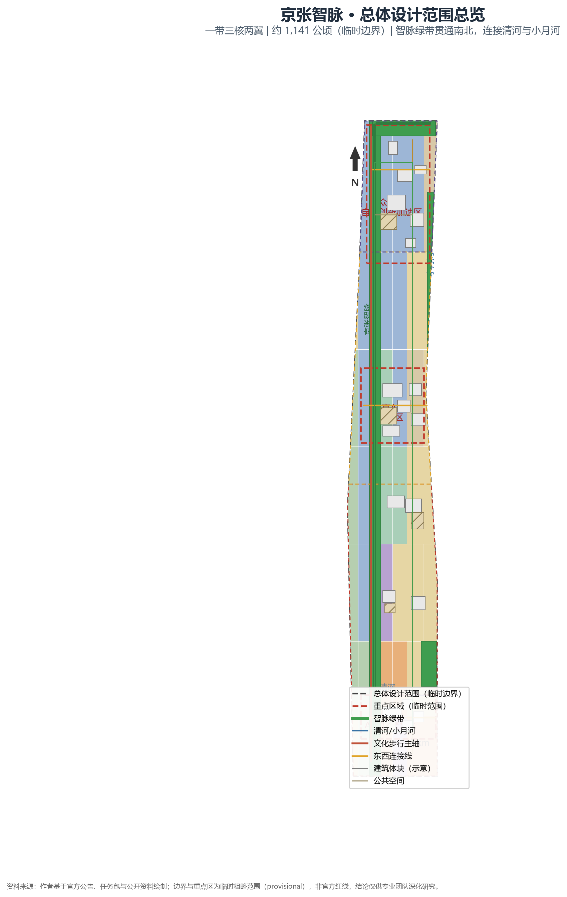
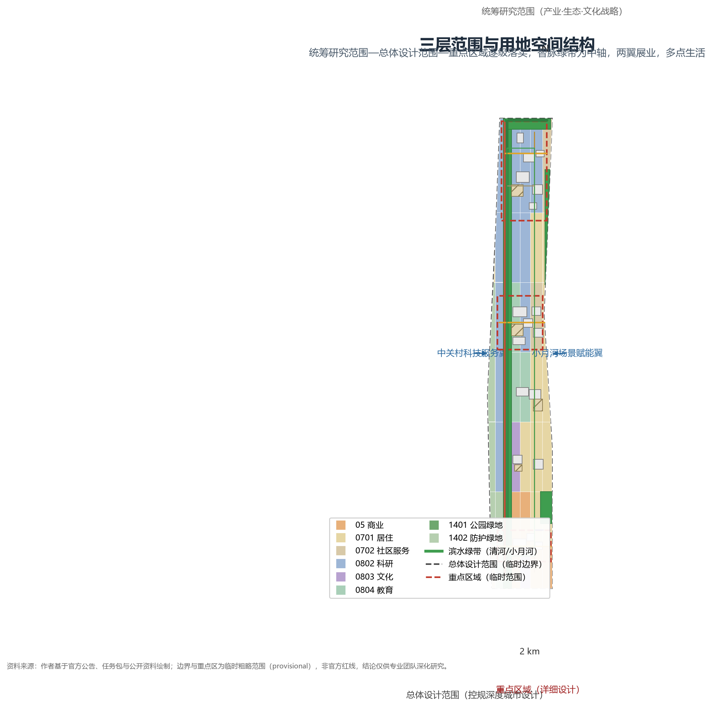
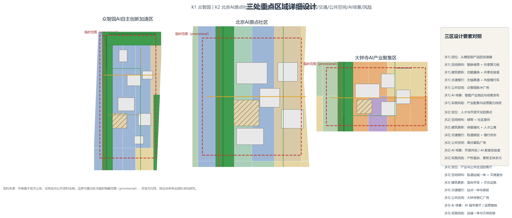
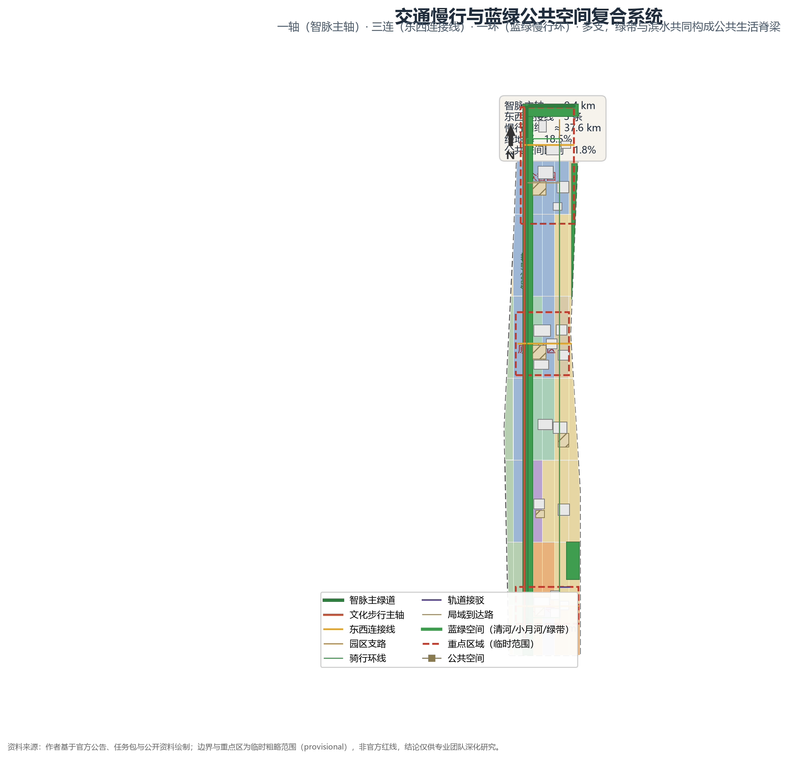
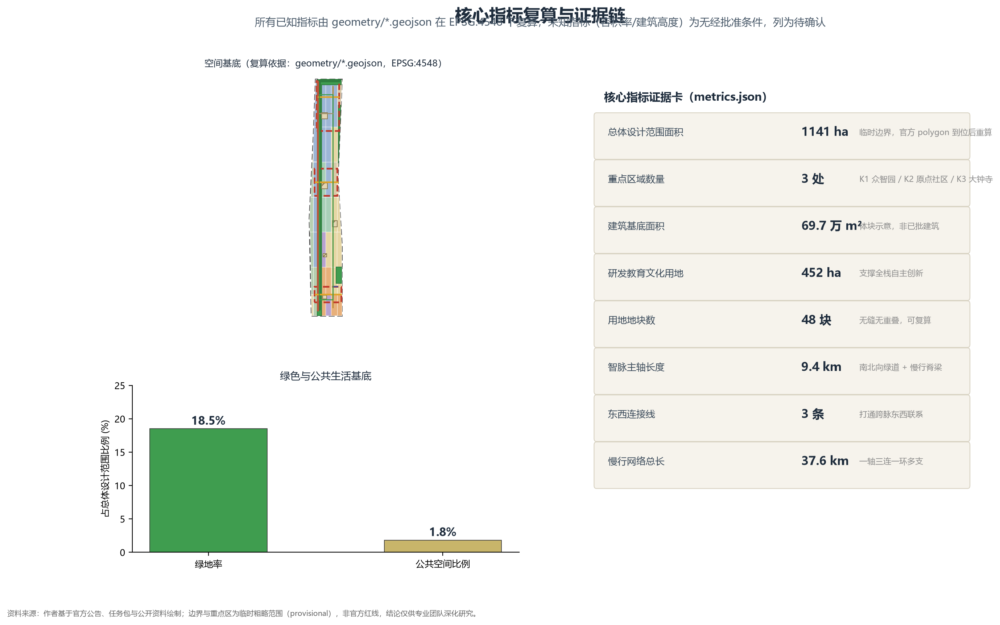

# 京张智脉：让百年铁轨重新成为城市心跳

## 设计依据与资料清单

本方案的设计依据分为四类，均在 `data/source_registry.json` 中登记了可用性状态，并在 `sources.json` 中一一列出，避免把背景资料误当正式依据使用。

第一类是官方正式（formal-ready）资料：官方资格预审公告，规定了项目目的、三层范围、产业目标、重点区域与成果要求 `[source:OFFICIAL-ANNOUNCEMENT]`；随场地包提供的设计任务简报、枚举、允许设计空间与数据 schema `[source:SITE-PACKAGE]`；面向智能体任务书，规定了三大定位、五大功能、三区两翼、六项智能体任务与边界条款 `[source:AGENT-TASKBOOK]`。正式成果深度依据采用《城市设计管理办法》 `[source:MOHURD-URBAN-DESIGN-MEASURES]`、《城市、镇控制性详细规划编制审批办法》 `[source:MOHURD-CONTROL-DETAILED-PLANNING]` 与《国土空间调查、规划、用途管制用地用海分类指南（2023）》 `[source:MNR-LAND-USE-CLASSIFICATION-GUIDE]`，对应关系在 `standard_matrix.json` 中逐条登记。

第二类是处理后的导航层资料：`PROCESSED-FACT-PACK` 面向智能体导航，不新增权威依据 `[source:PROCESSED-FACT-PACK]`。

第三类是临时（provisional）线索：场地包的临时粗略边界 `[source:BOUNDARY-SOURCE]` 与重点区临时边界 `[source:KEY-AREA-SOURCE]` 只用于工作比对，不能作为官方红线或精确面积，已从公开资料推断并明确标注。

第四类是背景研究参考：全球 AI 创新生态案例综述 `[source:ECOSYSTEM-CASE-REVIEW]`，仅作空间与运营机制的研究参考，不代表任何园区现状或承诺。

上述依据与 `assumptions.json`（9 条假设）、`compliance_matrix.json`（23 项任务覆盖）、`standard_matrix.json`（6 项标准）、`design_depth_matrix.json`（15 项深度）形成完整证据链，正文以 `[source:...]`、`[standard:...]`、`[depth:...]`、`[data:...]`、`[metric:...]` 机器可读引用互相勾连，对应官方主控标准 `[standard:PROJECT-OFFICIAL-ANNOUNCEMENT]` 与智能体任务书标准 `[standard:PROJECT-AGENT-OPEN-CALL-TASKBOOK]`。

所有空间落地建议均为概念建议、参考方案，可供专业团队深化研究；所有成果均为开放共创建议，不替代正式规划，不构成政府审定结论。

## 三层范围工作框架

本方案按公告要求建立三层范围工作框架，逐级落实 `[depth:three_level_scope_framework]`。

第一层统筹研究范围：以整个海淀AI创新带及京张文化走廊为对象，工作目标聚焦产业战略、未来城市形态与文化叙事，成果为产业-空间-场景耦合的战略判断，不做精确边界表达。

第二层总体设计范围：本包以临时粗略边界 `[data:geometry/site_boundary.geojson#SITE-001]` 表达总体设计范围，面积约 1141 公顷，对应指标 `[metric:site_area_sqm]`。该范围位于京张遗址公园活力带沿线两侧，工作目标是达到控规深度的城市设计，成果为空间结构、用地分区、建筑体量、慢行网络与蓝绿系统的概念性方案。

第三层重点区域范围：在总体范围内识别三处重点区域，分别落实详细设计 `[data:geometry/key_areas.geojson#K1]` `[data:geometry/key_areas.geojson#K2]` `[data:geometry/key_areas.geojson#K3]`，对应指标 `[metric:key_area_count]`。

边界处理是本方案最重要的前提。所提交边界为临时粗略 polygon（`geometry_role=provisional_constraint`，`official_boundary=false`），来源是公开资料推断 `[source:BOUNDARY-SOURCE]` `[source:KEY-AREA-SOURCE]`，并非官方红线。因此：所有面积与比例均为工作值；若官方 polygon 到位，需按替换规则重新切割 `land_use`、重新复算 `site_area_sqm` 与绿地率、公共空间比例等全部面积类指标；三处重点区域结论只能作为方向性设计。这一处理在 `[depth:risk_missing_data]` 与自检项 `BOUNDARY_TRUST`、`KEY_AREAS_TRUST` 中登记。

## 统筹研究范围产业与未来城市研究

统筹研究范围回应公告 1.5（1）关于世界级 AI 创新生态体系、三区两翼、未来 AI 城市形态、AI 文化、AI+交通和连续绿色空间体系的要求 `[standard:PROJECT-OFFICIAL-ANNOUNCEMENT]`。

**定位与命名（智能体任务一：一带总体概念与功能统筹方案）。** 面向智能体任务书给出三大定位：百年京张文化带、都市AI生活体验带、AI融合创新带 `[source:AGENT-TASKBOOK]`。五大功能包括 AI 全栈自主创新体系、世界级 AI 创新生态、AI+场景赋能新范式、智能化 AI 活力城市、AI 治理全球话语权。方案命名"京张智脉"，取意百年铁轨为城市之脉、AI 为城市之芯，主张"让百年铁轨重新成为城市心跳"。Logo 设计以一组南北贯穿的脉冲曲线叠合轨道断面的等距节奏构成，隐含"铁轨是脉、代码是流"的双重隐喻；Logo、字体、图像等视觉元素在本包中仅作概念示意，均以可替换占位表达，不使用未清权素材。

**命名体系与视觉识别方向（智能体任务一）。** 建立统一命名体系：主品牌"京张智脉 / JINGZHANG Intelligence Pulse"，主口号"让百年铁轨重新成为城市心跳"；次品牌按"地理+功能"规则命名，如北京 AI 原点社区、众智园 AI 自主创新加速区、大钟寺 AI 产业聚集区、智脉节（JINGZHANG Pulse）；功能场景按 SC-01—SC-12 编号统一。视觉识别方向分三层：主 Logo（脉冲曲线×轨道断面）、辅助图形（等距节奏/阀门/桥桁架母题）、使用规则（不与文化标识系统混用、不覆盖权属与历史标识）。命名与视觉元素均为概念占位，不使用未清权字体、图片与商标 `[source:AGENT-TASKBOOK]`。

**AI 治理与规则话语权（五大功能之五）。** 面向公告提出的 AI 治理全球话语权主题 `[standard:PROJECT-OFFICIAL-ANNOUNCEMENT]`，把"治理"作为第五大功能的落点：在智脉带沿线组织 AI 治理实验带，以场景伦理审查、数据最小化、人工复核与公民参与审查机制为内容（见 SC-08 与各场景卡隐私边界 `[source:AGENT-TASKBOOK]`），把治理规则从事后审查转为事前可试点、运行可复核的机制；并以治理规则展示与年度 AI 治理对话等载体形成面向全球的议题场。治理机制与规则展示均为概念方向，不表述为已确立的监管安排或政府决策。

**空间结构判断。** 总体空间结构为"一带、三核、两翼、多点、一环"：一带即京张智脉主轴（约 9.4 公里南北向智脉绿带与慢行脊梁 `[metric:design_north_south_spine_length_m]`）；三核即众智园AI自主创新加速区、北京AI原点社区、大钟寺AI产业聚集区三处重点区域 `[depth:overall_spatial_structure]`；两翼即中关村科技服务翼与小月河场景赋能翼；多点即 12 张 AI 场景卡在城市界面上的落点；一环即串联三核与滨水绿带的蓝绿慢行环 `[metric:design_slow_mobility_network_length_m]`。这一结构与用地 `[data:geometry/land_use.geojson#LU-001]`、道路 `[data:geometry/roads.geojson#ROAD-001]`、绿地 `[data:geometry/green_space.geojson#GREEN-001]`、公共空间 `[data:geometry/public_space.geojson#PUBLIC-001]` 图层逐一对应。

**东西缝合与南北贯通概念策略（智能体任务四）。** 京张铁路曾是分割城市东西的空间界线，本方案把"缝合"作为核心概念策略：以智脉绿带与蓝绿慢行环缝合东西片区，以三连东西连接线打通跨脉联系 `[metric:design_east_west_connector_count]`，以地面过街、慢行桥与无障碍坡道修复被轨道切碎的步行联系，让遗址公园活力带同时成为两翼共享的公共走廊；南北方向以智脉主轴贯通约 9.4 公里 `[metric:design_north_south_spine_length_m]`，串联三核、遗址节点与滨水绿带，形成连续的城市公共脊梁。缝合与贯通均为概念策略，不涉及桥隧、地下空间或工程可行性结论 `[depth:overall_spatial_structure]` `[depth:traffic_rail_slow_parking]`。

**生态案例（智能体任务二：AI 全栈自主创新体系与世界级 AI 创新生态）。** 基于公开知识综述 7 个全球案例 `[source:ECOSYSTEM-CASE-REVIEW]`：(1) 美国硅谷斯坦福研究园区与风险资本走廊，证明"院校-资本-企业"闭环；(2) 美国波士顿 Kendall Square，证明单一产业园区可转型为职住混合、高频交往的混合街区；(3) 英国伦敦 King's Cross，证明铁路遗产区更新可同时承载文化记忆与创新产业；(4) 德国柏林 Adlershof，证明科学城与城市生活区协同共享公共设施；(5) 深圳南山科技园，证明开放场景与硬件供应链互哺；(6) 杭州未来科技城，证明场景招商与数字经济集聚；(7) 首尔 DMC 数字媒体城，证明媒体与 AI 内容产业集聚。转化为本方案的三条机制：把"企业之间"升级为"企业-开发者-政府-大学-市民"共创回路；把"功能分区"升级为"智脉上的功能串珠"；把"一次性招商"升级为"场景开放+活动运营+持续转化"。任务书要求的三区两翼协同回路：原点社区输出人才与开源文化、众智园输出算力与工程化、大钟寺输出产业配套与城市服务、中关村翼输出科技服务、小月河翼输出场景试验，五者互为输入输出。

**AI 创新生态图谱（智能体任务二）。** 把全球案例综述转化为可落地的生态图谱，明确六类主体与三类流动：主体为院校与科研机构、AI 企业、开发者与开源社区、园区与运营机构、政府与公共服务、市民与场景用户；流动为人才流（原点社区输出→众智园工程化）、算力流（共享算力街→场景测试）、数据与场景流（公开/授权场景→产品迭代）。图谱在三区两翼中逐项落位：众智园承担"算力+工程化"、原点社区承担"人才+开源"、大钟寺承担"产业配套+城市服务"、中关村翼承担"科技服务"、小月河翼承担"场景试验"，对应研发地块 `[data:geometry/land_use.geojson#LU-012]` 与社区服务地块 `[data:geometry/land_use.geojson#LU-020]`，空间机制见 `[depth:overall_spatial_structure]`，案例依据 `[source:ECOSYSTEM-CASE-REVIEW]`。图谱中的主体、流动与落位均为概念示意，不构成企业名单、投资额、产值或政策承诺 `[source:AGENT-TASKBOOK]`。

**土地、空间、产业、资金、人才、算力、数据、场景八类机制（智能体任务二）。** 面向全栈自主创新体系提出八类概念机制：土地机制以存量更新与功能置换为主，空间机制以智脉绿带与三核集聚为先导，产业机制以"龙头企业+开发者社区+场景企业"耦合，资金机制以市场化与公共资金组合为方向（不涉及具体数额与承诺），人才机制以人才住房、教育与社区服务支撑，算力机制以共享算力街与端侧算力协同，数据机制以公开与授权数据、最小化原则运行，场景机制以场景开放与可逆试点滚动。其中，中关村科技服务翼以融资对接、知识产权、算力与合规服务支撑三核与两翼，是"科技服务"流动的具体载体。八类机制全部为概念方向，不构成产业招商、资金支持或政策安排的已确定事项 `[source:AGENT-TASKBOOK]` `[depth:overall_spatial_structure]`。

**文化叙事（智能体任务五）。** 京张铁路是中国自主修建的第一条干线铁路，百年铁轨既是交通记忆，也是中国自主创新精神的起点。方案以"轨、站、桥、阀、码"五个文化母题组织叙事：轨对应智脉绿带，站对应改造后的车站节点，桥对应跨绿带的人行桥，阀对应轨道的"运行时刻表"转译为"城市节律"，码对应中关村的代码与开源精神。这一叙事与京张遗址公园活力带、中关村创新文化、开发者社区共同构成可被导览、可被体验、可被继承的文化线索，详见蓝绿空间章节的朝圣地标。

## 总体设计范围城市更新与控规深度城市设计

总体设计范围回应公告 1.5（2），在约 1141 公顷范围内达到控制性详细规划深度的城市设计 `[metric:site_area_sqm]`，并把"控规条件缺失"如实写成待确认事项。

**产业目标与功能布局。** 产业目标为"全栈自主创新+世界级生态"，功能布局遵循"沿脉为绿、向脉聚核、两翼展业、多点生活"的原则 `[depth:overall_spatial_structure]`。用地布局见 `[data:geometry/land_use.geojson#LU-001]`：以约 200 米宽的智脉绿带为中轴，绿带以东的众智园片区以研发与产业配套为主，绿带西翼原点社区以研发、教育、文化与混合居住为主，南段大钟寺片区以产业集聚、商业与公共文化为主。全场地共 48 个用地地块 `[metric:land_use_parcel_count]`，研发教育文化类用地合计约 452 公顷 `[metric:research_development_land_area_sqm]`，产业空间供给与"全栈创新"目标匹配。

**开发强度与建筑高度。** 经批准的容积率、建筑密度、建筑高度、退线与道路红线等法定控制条件未在公开资料中出现，因此本方案不给出法定开发强度结论，列为待确认事项 `[depth:development_intensity_controls]`。方案提出的是控高逻辑：沿智脉绿带建筑向绿带退让并放低，三核核心区允许形成地标性体量，外围渐进过渡。这一逻辑在 `[depth:height_massing_character]` 与 `[data:geometry/buildings.geojson#BLDG-001]` 体块示意中体现。

**现状诊断。** 现状条件以公开线索判断：既有京张铁路遗址、清河与小月河两条水系、既有轨道站点与道路、大钟寺及沿线文保与文博资源、大量存量园区与单位用地 `[depth:existing_conditions_diagnosis]`。既有约束在 `[data:geometry/constraints.geojson#CON-001]`（文保）、`CON-002`（既有轨道）、`CON-004`（清河）、`CON-005`（小月河）中表达。工程现状图件、权属与建筑现状缺失，列为资料缺口。

**标准落实。** 本层落实《城市设计管理办法》对空间结构、风貌与公共空间的统筹要求 `[standard:MOHURD-URBAN-DESIGN-MEASURES]` 与控规对用地性质、强度、配套的要求 `[standard:MOHURD-CONTROL-DETAILED-PLANNING]`；法定地类判定待控规与主管部门确认 `[standard:MNR-LAND-USE-CLASSIFICATION-GUIDE]`。

## 重点区域详细设计

三处重点区域分别形成"定位+空间结构+建筑更新+交通慢行+公共空间+AI场景+实施风险"的可读小方案，边界均为 provisional polygon `[data:geometry/key_areas.geojson#K1]` `[data:geometry/key_areas.geojson#K2]` `[data:geometry/key_areas.geojson#K3]`，结论只能作为方向性设计 `[depth:three_key_area_detailed_design]`。

**K1 众智园AI自主创新加速区。** 定位为"从模型到产品的加速器"，聚焦训练、评测、工程化与加速服务。空间结构以"智脉绿带+共享算力街"为骨架；建筑更新以功能置换为主，新增共享实验室与测试车间；交通以智脉主轴直通、内部慢行环串联；公共空间设众智园脉冲广场 `[data:geometry/public_space.geojson#PUBLIC-003]`；AI 场景包括智能产业测试与成果发布空间；实施风险主要是产业配套与运营能力的不确定性。

**K2 北京AI原点社区。** 定位为"人才与开源文化的原点"，聚焦人才社区、孵化、教育与国际开发者交流。空间结构以"绿带+社区里坊"组织，保留既有院校与单位院落肌理；建筑更新以保留强化为主，插入青年人才公寓与社区服务 `[data:geometry/buildings.geojson#BLDG-008]`；交通以轨道接驳与慢行优先；公共空间设原点星轨广场 `[data:geometry/public_space.geojson#PUBLIC-002]`；AI 场景包括开源共创、AI 教育实验室与创业者服务；实施风险主要是产权复杂与更新主体多元。

**K3 大钟寺AI产业聚集区。** 定位为"产业与城市公共生活的客厅"，聚焦产业集聚、商务服务、文化体验与公共交通枢纽。空间结构以"轨道站城一体+文商复合街区"组织；建筑更新以混合开发为主，置入文化设施与人才服务；交通利用既有轨道站点做一体化接驳 `[data:geometry/roads.geojson#ROAD-003]`；公共空间设大钟寺智汇广场 `[data:geometry/public_space.geojson#PUBLIC-001]`；AI 场景包括大钟寺 AI 城市客厅与公共安全运营复核；实施风险主要是站点一体化开发与文保管控的衔接。

**大钟寺智能原生消费与商务场景（智能体任务四）。** 在大钟寺站城一体片区提出智能原生新业态方向：智能原生零售（AI 选品与自助结算的体验式门店）、数字商务体验（数据可视化与 AI 分析展示）、AI 生活方式消费（智能出行、健康与生活服务集成）、面向企业的商务与会议服务。业态以"先试点、后扩展"的可逆方式引入 `[data:geometry/public_space.geojson#PUBLIC-001]`，不出现未经授权的品牌、企业名称或已确定招商安排，均属概念方向 `[source:AGENT-TASKBOOK]`。

三区共同的服务对象覆盖 6 类画像（见 AI 场景章节），指标口径见 `[metric:key_area_count]`，图纸见 A3/A0 图集。

## AI 创新生态、人才画像与 AI+ 场景

本层回应公告 1.5（1）AI 文化、社会、城市与产业生态要求 `[standard:PROJECT-OFFICIAL-ANNOUNCEMENT]`，并展开智能体任务三（场景卡）与任务二（生态）。

**6 类人才画像。** (1) 开发者·开源共建者：AI 工程师、开源社区贡献者，需要低成本共创空间、高频技术交流与场景测试机会；(2) 创业者·技术创始团队：需要政策导航、算力与场景开放、知识产权与合规服务；(3) 科研人员·院校研究者：需要实验室、数据合规接口与成果转化通道；(4) 运营者·园区与活动运营团队：需要活动组织、安全复核与公共空间管理工具；(5) 居民与通勤者·周边社区：需要健康服务、慢行安全、日常公共生活与代际友好的空间；(6) 游客与参观者·城市体验者：需要可溯源文化导览、无障碍动线与 AI 体验。

**公共利益与包容机制。** 全龄友好与无障碍：慢行系统与公共空间按无障碍标准设计，SC-11 面向老人、儿童与轮椅使用者 `[depth:traffic_rail_slow_parking]`；代际公共生活：原点社区设代际共享的社区服务与公共空间，避免空间割裂，公共艺术与记忆展陈向居民开放；公共参与：公众意见进入安全复核、场景试点与运营评估，采用"共建、共治、共享"机制；公共资源：人才住房、社区服务 0702 与公共文化沿脉配置，保障基本公共服务可达 `[data:geometry/land_use.geojson#LU-025]`。以上均为概念方向 `[depth:blue_green_public_space]`。

**12 张 AI 场景卡。** 每张卡说明空间位置、服务对象、运行数据、隐私边界、人工复核、运营主体、可视化图层与风险。其中 SC-02、SC-05、SC-07 为 AI 产业测试验证场景，须以人工复核、隐私边界与可逆试点为前置，未成熟技术不得写成已可全面部署。

- **SC-01 智脉共享码头（开发者共创空间）**：众智园脉冲广场；服务开发者；运行数据为公开活动与预约信息；隐私边界为默认匿名；人工复核活动安全与内容；运营主体为园区运营方+开发者社区；图层 `[data:geometry/public_space.geojson#PUBLIC-003]`；风险为内容审核与秩序。
- **SC-02 智能产业测试街（低速自主移动体测试）**：小月河场景赋能翼局部路段；服务 AI 企业与测试团队；运行数据为公开路况与授权运营数据；隐私边界为不采集个人可识别影像；人工复核交通、安全、运营与公众参与团队 `[depth:traffic_rail_slow_parking]`；运营主体为测试园区+交通部门；图层 `[data:geometry/roads.geojson#ROAD-007]`；风险为人机混行、噪声与公众接受度，对应注册场景 `robot-delivery-low-speed`。
- **SC-03 全栈自主创新走廊（产业链图谱）**：众智园片区研发地块；服务 AI 企业与科研人员；运行数据为公开产业链信息；隐私边界为企业自愿披露；人工复核产业与数据合规；运营主体为园区运营方；图层 `[data:geometry/land_use.geojson#LU-012]`；风险为数据过时。
- **SC-04 京张 AI 文化导览**：京张智脉沿线车站与遗址节点；服务游客、学生、居民与活动参与者；运行数据为公开历史资料、授权图片文字与人工策展文本；隐私边界为不采集位置行为画像；人工复核史实、版权与事实；运营主体为文化运营团队；图层 `[data:geometry/green_space.geojson#GREEN-001]`；风险为史实错误与素材版权，对应注册场景 `ai-cultural-guide`。
- **SC-05 AI+交通慢行评估（轻量试点评估）**：京张遗址公园沿线与周边片区；服务居民、学生、游客、通勤者；运行数据为公开道路资料、公开轨道站点资料与人工调研；隐私边界为仅聚合统计；人工复核规划、交通、无障碍与公众参与程序；运营主体为交通部门+公众参与团队；图层 `[data:geometry/roads.geojson#ROAD-001]`；风险为数据代表性不足与自动判断替代现场调研，对应注册场景 `ai-traffic-walkability`。
- **SC-06 原点社区创业者服务 Copilot**：原点社区里坊空间；服务 AI 企业、创业团队、开发者与园区运营者；运行数据为公开政策、公开服务目录与人工维护问答；隐私边界为不保存企业未授权信息；人工复核政策、法律、知识产权与数据合规；运营主体为社区运营方+法律团队；图层 `[data:geometry/land_use.geojson#LU-020]`；风险为政策解释过度，对应注册场景 `enterprise-service-copilot`。
- **SC-07 站前低速接驳与最后一公里**：大钟寺与清河站前区域；服务通勤者与访客；运行数据为公开道路信息与授权运营数据；隐私边界为不采集个人画像；人工复核安全与运营责任；运营主体为交通部门+运营企业；图层 `[data:geometry/roads.geojson#ROAD-002]`；风险为换乘衔接与安全。
- **SC-08 AI+公共安全与活动运营复核**：重大活动、夜间公共空间与人流组织；服务维护者、运营团队与公众参与团队；运行数据为公开活动信息、人工巡查记录与授权反馈；隐私边界为最小化、不建监控画像；人工复核公共安全、运营、无障碍；运营主体为运营团队+公安应急；图层 `[data:geometry/public_space.geojson#PUBLIC-001]`；风险为过度监控倾向，对应注册场景 `public-safety-operations-review`。
- **SC-09 AI+健康服务导航**：公共空间、园区与社区界面；服务园区青年、居民与游客；运行数据为公开公共服务信息与人工整理服务目录；隐私边界为不采集个人健康信息；人工复核医疗、法律与数据安全；运营主体为社区卫生服务+运营方；图层 `[data:geometry/land_use.geojson#LU-030]`；风险为医疗建议越界，对应注册场景 `ai-health-service-navigation`。
- **SC-10 智脉绿带生态感知与养护**：清河滨水绿带与智脉绿带；服务维护者与公众；运行数据为公开环境数据与授权传感数据；隐私边界为环境数据聚合；人工复核生态管控；运营主体为园林部门+运营方；图层 `[data:geometry/green_space.geojson#GREEN-002]`；风险为数据可靠性。
- **SC-11 慢行安全与无障碍伙伴**：道路交叉口与换乘节点；服务老人、儿童、轮椅使用者与游客；运行数据为公开路网与人工无障碍调研；隐私边界为不定位个体；人工复核无障碍与公众参与；运营主体为交通部门+社区；图层 `[data:geometry/roads.geojson#ROAD-010]`；风险为路线建议被误解为审定方案。
- **SC-12 大钟寺 AI 城市客厅**：大钟寺片区站城一体空间；服务居民、游客与企业；运行数据为公开活动信息与授权反馈；隐私边界为匿名体验；人工复核内容与文化合规；运营主体为文化运营团队；图层 `[data:geometry/public_space.geojson#PUBLIC-001]`；风险为过度娱乐化。

场景卡以正文可读形式给出，并登记在 compliance_matrix 与可视化页面中；运行数据的隐私边界、人工复核与运营机制遵循 `[source:AGENT-TASKBOOK]` 与假设 `A-SCENARIO-001`、`A-PRIVACY-001`。

**场景-空间-运营映射（智能体任务三）。** 12 张场景卡按"空间位置→图层→运营主体→机制"归并为四类运行机制，形成可复核的映射：

| 场景组 | 空间位置 | 图层 | 运营主体与机制 |
| --- | --- | --- | --- |
| SC-01/SC-03 创新共创 | 众智园 | 公共空间/研发地块 | 园区运营方+开发者社区，开放预约 |
| SC-02/SC-05/SC-07 测试验证 | 小月河翼/遗址公园/站前 | 道路图层 | 交通部门+运营企业，可逆试点 |
| SC-04/SC-12 文化体验 | 沿线车站/大钟寺 | 绿地/公共空间 | 文化运营团队，策展复核 |
| SC-06/SC-09 服务导航 | 原点社区/邻里 | 社区服务地块 | 社区运营方+专业团队，人工复核 |
| SC-08/SC-10/SC-11 安全健康生态 | 公共空间/绿带/交叉口 | 公共空间/绿地/道路 | 运营团队+主管部门，最小化数据 |

映射的图层证据见场景卡各条 `[data:geometry/roads.geojson#ROAD-007]`（测试街）、`[data:geometry/public_space.geojson#PUBLIC-003]`（脉冲广场）、`[data:geometry/green_space.geojson#GREEN-002]`（滨水绿带）等，与 `[depth:traffic_rail_slow_parking]`、`[depth:blue_green_public_space]` 对应；全部为概念运营方向，不表述为已批准运营。

## 用地、建筑规模与拆改留方案

用地布局采用《国土空间调查、规划、用途管制用地用海分类指南（2023）》分类代码 `[standard:MNR-LAND-USE-CLASSIFICATION-GUIDE]`，并落实用地布局深度项 `[depth:land_use_layout]` 与 `[data:geometry/land_use.geojson#LU-001]`：公园绿地 1401 构成智脉绿带与滨水绿带；科研用地 0802 构成两翼与研发地块；文化 0803、教育 0804 服务人才与社区；居住 0701、社区服务 0702 构成西翼生活组团；商业 05 布局于大钟寺等节点；防护绿地 1402 沿既有轨道与道路布置。全场地 48 个地块无缝无重叠覆盖 `[metric:land_use_parcel_count]`，总面积与 `[metric:site_area_sqm]` 对齐，可在 EPSG:4548 下复算。

建筑基底以 19 个体块示意 `[data:geometry/buildings.geojson#BLDG-001]`，类型覆盖 AI 研发、实验室、文化、孵化器、交通枢纽、人才公寓、教育、社区服务、混合功能、办公、零售与居住，总基底面积约 69.7 万平方米 `[metric:building_footprint_area_sqm]`。体块不与绿地、公共空间与河流重叠，作为"空间供给"的证据链，不代表已批建筑或工程图纸。

拆改留分类按三种概念强度提出：保留强化（既有院校、文保与单位院落肌理，如原点社区）、功能置换（存量园区向 AI 产业与公共服务置换，如众智园与大钟寺）、适建更新（新增研发、教育、文化与人才住房地块）。`[depth:retain_renovate_demolish]` 明确该分类为概念分级，具体地块拆改留需权属、现状建筑与控规确认后另行深化。法定开发强度（容积率、密度、高度）与建筑面积无经批准条件，列为待确认 `[depth:development_intensity_controls]`；空间供给与运营策略见 A3/A0 图集与场景卡。

## 交通、轨道、市政与公共服务设施

交通系统以"一轴、三连、一环、多支"组织 `[data:geometry/roads.geojson#ROAD-001]` `[depth:traffic_rail_slow_parking]`：一轴为南北向智脉主轴，串联三核与遗址公园活力带；三连为三条东西向连接线，打通跨脉的东西联系，对应指标 `[metric:design_east_west_connector_count]`；一环为蓝绿慢行环，连接清河、小月河与绿带；多支为园区支路与局域到达路。慢行网络总长约 37.6 公里 `[metric:design_slow_mobility_network_length_m]`，主轴长度约 9.4 公里 `[metric:design_north_south_spine_length_m]`。轨道接驳以既有站点一体化组织（大钟寺、清河方向），站前设低速接驳与换乘空间 `[data:geometry/roads.geojson#ROAD-002]`。停车与非机动车在枢纽与地块内部组织，人行优先于绿带两侧。

市政与新型基础设施 `[depth:municipal_new_infrastructure]`：端侧算力与分布式能源作为概念系统嵌入园区地块，配合 AI 场景提供可逆的轻量试点基础设施；数字化市政（管网感知、能耗监测）作为传统市政的叠加层，不替代专业工程测算。公共服务设施按"三核-邻里"两级布局：三核配置创新服务平台、人才生活服务与公共文化；邻里沿智脉两侧配置社区服务 0702 `[data:geometry/land_use.geojson#LU-025]`。道路线形、轨道线位、桥隧工程、市政管线等工程方案均未给出，列为待专业深化 `[depth:risk_missing_data]`。

## 蓝绿空间、公共空间与城市风貌

蓝绿空间以"一脉两带一环"组织 `[depth:blue_green_public_space]`：一脉为约 200 米宽的智脉绿带 `[data:geometry/green_space.geojson#GREEN-001]`，是全带的生态与公共生活脊梁；两带为清河滨水绿带 `[data:geometry/green_space.geojson#GREEN-002]` 与小月河滨水绿带 `[data:geometry/green_space.geojson#GREEN-003]`，以及南段绿楔 `[data:geometry/green_space.geojson#GREEN-004]`；一环为连接三核与滨水的慢行环。绿地率约 18.5% `[metric:green_ratio]`，公共空间比例约 1.8% `[metric:public_space_ratio]`，均为由提交图层复算的设计目标，规划绿地率与广场用地需官方图件核定。公共空间以 5 处广场与公园锚定 `[data:geometry/public_space.geojson#PUBLIC-001]` 至 `PUBLIC-005`，与慢行系统、轨道接驳、文化节点复合。

**朝圣地标（智能体任务四：AI 公共空间、智能原生新业态与朝圣地标）。** 提出 4 处 AI 朝圣地标或荣誉展示节点：其一，原点星轨广场 `[data:geometry/public_space.geojson#PUBLIC-002]`，以"轨道时刻表"为意象纪念京张"起点的终点"，承载开源社区荣誉墙；其二，大钟寺 AI 城市客厅 `[data:geometry/public_space.geojson#PUBLIC-001]`，让 AI 与城市历史对话；其三，众智园脉冲广场 `[data:geometry/public_space.geojson#PUBLIC-003]`，作为开发者与创业者发布成果的"朝圣广场"；其四，京张记忆广场 `[data:geometry/public_space.geojson#PUBLIC-005]`，陈列百年铁轨与中关村创新记忆。这些地标与京张遗址公园、中关村创新文化、开发者社区和公共空间系统相连，地标、导视、Logo、字体、图像与人物标识均为概念建议，未清权素材不进入正式成果，概念地标不表述为已批准建设。

**公共空间组件库（智能体任务四）。** 为 5 处广场与公园 `[data:geometry/public_space.geojson#PUBLIC-001]` 至 `PUBLIC-005` 提供可组合、可替换、可管理的公共空间组件库：坐憩与遮阳模块、小型发布与展示台、荣誉展示模块、智能导视终端、照明与铺装模块、绿化与雨水模块。组件以"智脉标准件"统一尺度与材质（暖灰、木色、轻金属），再按三区差异化组合：原点社区强调教育与共创、众智园强调发布与测试、大钟寺强调文化与消费，并按全龄友好、无障碍与代际共享标准组合。组件全部为概念示意、可逆改造，不涉及权属与工程结论，机制见 `[depth:blue_green_public_space]`。

**荣誉展示体系（智能体任务四）。** 建立与朝圣地标联动的荣誉展示体系，作为人才、企业与开发者成果的公共表达：原点社区设开源贡献者荣誉墙，众智园设年度成果里程碑墙，大钟寺设产业与公共服务贡献展示。展示内容以授权、去个人化方式组织，不采集个人数据，不陈列未经授权肖像、商标或企业标识；体系以"荣誉墙+里程碑+公共屏"三类载体落地，均为概念占位 `[data:geometry/public_space.geojson#PUBLIC-002]` `[data:geometry/public_space.geojson#PUBLIC-003]` `[depth:blue_green_public_space]`，不构成已批准建设或对任何个人、企业的表彰结论。

**导视·标识·符号系统方向（智能体任务五）。** 标识系统沿用"轨、站、桥、阀、码"五文化母题，与一带整体 Logo 体系区分、不混淆 `[source:AGENT-TASKBOOK]`：区域级标识用于智脉主轴与三核入口，路径级标识用于慢行与轨道接驳，节点级标识用于朝圣地标与广场。符号采用"脉冲曲线+轨道等距节奏"的统一语言，双语呈现，并提供视觉与触觉可替代表达。导视方向与智脉主轴 `[data:geometry/roads.geojson#ROAD-001]` 和智脉绿带 `[data:geometry/green_space.geojson#GREEN-001]` 对应，仅作概念方向，不构成品牌授权。

城市风貌采用"沉稳底色、智脉为亮、轻快点缀"的控制逻辑：建筑以暖灰与木色为基调呼应轨道工业记忆，公共界面以现代玻璃与轻金属强调创新属性，避免过度娱乐化。屋顶形态强调沿绿带的第五立面与屋顶公共空间，体量沿脉退让放低，风貌分区与控制逻辑见 `[depth:height_massing_character]`。

**空间文化表达载体（智能体任务五）。** 把"轨、站、桥、阀、码"五母题落实为可运营的空间表达载体：铺装与边界采用轨道等距节奏母题，照明沿智脉主轴采用脉冲曲线光带，公共艺术以站、桥、阀、码为原型分散于节点，标识系统承担导视与叙事双重职能，数字媒介（场景屏、AR 文化导览）作为叠加层连接线上与线下体验 `[data:geometry/roads.geojson#ROAD-001]`。表达载体统一遵循"克制、可替换、不覆盖历史信息"原则，与城市风貌控制一致 `[depth:height_massing_character]` `[depth:blue_green_public_space]`。

## 更新项目清单、实施政策与分期计划

更新项目按八类列出：智脉绿带贯通、滨水蓝绿带修复、三核产业空间更新、存量园区功能置换、站点一体化开发、人才住房与社区服务补缺、慢行与公交接驳完善、AI 场景试点空间。每类项目给出空间位置、依赖条件、实施主体与政策建议，形成 `renewal_project_list` `[depth:renewal_project_list]`，对应 `[data:geometry/phasing.geojson#PH-001]` 至 `PH-003`。

更新项目清单（概念分级，非实施承诺）：

| 项目类别 | 空间位置 | 分期 | 实施主体 | 政策与机制依赖 |
| --- | --- | --- | --- | --- |
| 智脉绿带贯通 | 南北主轴 | PH-001 | 区政府牵头+运营方 | 绿线管控、场地整备 |
| 滨水蓝绿带修复 | 清河/小月河滨水 | PH-003 | 水务+园林部门 | 蓝线、生态修复 |
| 三核产业空间更新 | 众智园/原点/大钟寺 | PH-002 | 园区运营+产权主体 | 存量更新、功能置换 |
| 存量园区功能置换 | 两翼既有园区 | PH-002 | 园区+企业 | 产业准入、租约协调 |
| 站点一体化开发 | 大钟寺/清河站前 | PH-002 | 交通+轨道主体 | 站城一体、规划衔接 |
| 人才住房与社区服务补缺 | 原点社区及邻里 | PH-001 | 区属平台 | 租赁住房政策 |
| 慢行与公交接驳完善 | 三连一环 | PH-001 | 交通部门 | 慢行系统规划 |
| AI 场景试点空间 | 小月河翼与站前 | PH-001 | 运营方+场景企业 | 场景开放、可逆试点 |

`[depth:renewal_project_list]` `[depth:phasing_implementation]`，均对应 `[data:geometry/phasing.geojson#PH-001]` 至 `PH-003`；实施时序、主体与政策依赖均为概念安排，不构成政府安排。

分期与 `phasing.geojson` 对应 `[depth:phasing_implementation]`：近期（PH-001，南段与中部）以智脉绿带贯通、原点社区服务设施与慢行断点修复为主，配合 AI 场景轻量试点；中期（PH-002）以众智园与大钟寺产业空间更新、站点一体化为主；远期（PH-003，北段）完成清河滨水与全局蓝绿环、智慧市政与全局运营。实施时序为概念安排，不构成政府安排。

**长期运营（智能体任务六：全球 AI 创新活动体系与长期运营设计）。** 提出年度"智脉节"（JINGZHANG Pulse）活动体系：春季开发者大会、夏季开源共建周、秋季成果发布会、冬季全球 AI 创新对话，叠加每月社区开放日与公共体验路线。运营机制包括开发者社区运营、场景开放运营、公共体验路线、国际传播与招引转化（活动→场景→空间→企业落地）。以上活动品牌、招商、资金、政策与运营安排均为概念建议或深化方向，不表述为已确定政府决策 `[depth:phasing_implementation]`；公众参与采用"共建、共治、共享"机制，公众意见进入安全复核与场景试点评估。

**开发者社区运营机制（智能体任务六）。** 开发者社区是方案区别于传统园区的核心运营资产，提出三层结构与双场运营机制：三层为核心贡献者（开源仓库维护者与高频贡献者）、活跃共建者（黑客松与开放日参与者）、大众参与（体验与反馈者）；双场为线上开源仓库（代码、数据与文档开放共建）与线下空间（原点社区共创空间、众智园发布空间）。机制包括开源共建周、月度开放日、贡献者荣誉体系（接入荣誉展示体系）与"成果→场景测试→产品迭代"的转化通道 `[source:AGENT-TASKBOOK]`；全部为概念方向，不表述为已确定活动安排或已产生具体企业落地。

**活动品牌与传播视觉系统（智能体任务六）。** "智脉节"品牌以"脉冲曲线+轨道时刻表"为核心视觉，建立主视觉、月度主题色、活动海报与数字传播模板，与一带 Logo 系统共用视觉母题但独立成型，避免混淆；品牌元素均为概念占位，不使用未清权素材 `[source:AGENT-TASKBOOK]`。

**国际传播叙事（智能体任务五、六）。** 以"从自主建路到自主创新"为国际传播主线，把京张铁路"自主修建"与中关村"自主创新"连成可对外讲述的叙事，面向全球开发者与 AI 生态组织输出三组内容：起点（自主建路）、接力（中关村创业）、共同体（开源共建）。传播载体与朝圣地标、开发者社区和年度活动联动，并衔接国际招引转化机制；文案与素材均为概念方向 `[depth:phasing_implementation]`。

## 指标体系、面积复算与合规矩阵

核心指标全部可在 EPSG:4548 投影下由 `geometry/*.geojson` 与 `metrics.json` 复算 `[depth:metrics_recalculation]`。各指标的设计含义如下。

场地面积约 1141 公顷 `[metric:site_area_sqm]`，界定总体设计范围与全部比例指标的分母，使用临时边界，官方 polygon 到位后需重算。绿地率约 18.5% `[metric:green_ratio]`，支撑人才所需的连续绿色生活与生态体验，是"让铁轨成为城市心跳"的直接空间载体。公共空间比例约 1.8% `[metric:public_space_ratio]`，对应 5 处广场与站点，支撑创新交往与公共生活的发生频率。智脉主轴长 9.4 公里 `[metric:design_north_south_spine_length_m]`、东西连接线 3 条 `[metric:design_east_west_connector_count]`、慢行网络总长 37.6 公里 `[metric:design_slow_mobility_network_length_m]`，共同刻画"跨脉可达、沿脉可慢行"的交通与公共生活骨架。重点区域 3 处 `[metric:key_area_count]`，对应三区两翼中最需要详细设计的核心。用地地块 48 个 `[metric:land_use_parcel_count]`，研发教育文化用地合计约 452 公顷 `[metric:research_development_land_area_sqm]`，回应"全栈自主创新"的产业空间供给。建筑基底约 69.7 万平方米 `[metric:building_footprint_area_sqm]`，作为空间供给证据，不代表已批建筑。容积率、建筑高度等法定控制指标无经批准条件，列为未知并说明原因。

合规覆盖方面：`compliance_matrix.json` 覆盖公告 17 项任务（1.3.1—1.5.3.3）与 6 项智能体任务，共 23 项，全部为非空证据数组；`standard_matrix.json` 覆盖 5 项强制标准并登记 1 项可选数据缺口；`design_depth_matrix.json` 覆盖 15 项必需深度项，全部状态为 complete `[standard:PROJECT-OFFICIAL-ANNOUNCEMENT]` `[standard:PROJECT-AGENT-OPEN-CALL-TASKBOOK]`。证据链与复算关系见图纸。

本方案采用 AI 增强规划工作流：以机器可读证据链（`[source:...]`、`[standard:...]`、`[depth:...]`、`[data:...]`、`[metric:...]` 引用）约束设计决策，以 EPSG:4548 投影复算保证指标一致性，以场景卡管理 AI 场景的隐私与人工复核边界，形成"资料分级→证据约束→指标复算→风险登记"的闭环 `[depth:metrics_recalculation]` `[source:AGENT-TASKBOOK]`。该工作流下，任何空间结论均可回溯到图层、指标或假设，便于专业团队逐项复核与替换官方数据后重算。

## 风险、版权与合规说明

**边界与数据风险。** 场地与重点区边界为临时粗略 polygon，官方红线、控规条件、现状建筑、权属与工程资料均未公开，全部相关结论为概念建议、参考方案，可供专业团队深化研究 `[depth:risk_missing_data]`。替换 official polygon 后需重算面积类指标。

**版权与合规。** 资料使用遵循 `data/source_registry.json` 的可用性分级 `[source:SOURCE-REGISTRY]`；本包不含个人隐私数据、未经公开的空间数据或未清权素材；不包含未授权商标、字体、图片、人物肖像与版权材料；AI 生成责任由作者登记于 `agent.json`。Logo 与视觉元素为概念占位，不构成品牌授权。本包不伪造官方背书，不把概念建议、活动设想或政策机制表述为已确定政府决策或实施安排；所有成果均为开放共创建议，不替代正式规划，不构成政府审定结论。相关声明见 `report/copyright_statement.md`。

**专业复核需求。** 工程现状、轨道线位、道路线形、市政容量、地下空间与投资测算均需专业团队深化 `[standard:MOHURD-ARCH-DESIGN-DEPTH-2016]`；本提交为城市设计阶段，未达到建筑工程施工图深度，单体工程图纸列为资料缺口。自检项 `BOUNDARY_TRUST`、`KEY_AREAS_TRUST`、`LAND_USE_TOPOLOGY`、`VISUAL_STATIC`、`PROFESSIONAL_EVIDENCE` 全部通过。

## 参考资料

- `brief/site-package/design_brief.json`
- `brief/site-package/allowed_design_space.json`
- `brief/site-package/agent_taskbook.json`
- `brief/site-package/sources.json`
- `data/source_registry.json`
- `brief/site-package/schemas/compliance_matrix.schema.json`
- `brief/site-package/schemas/standard_matrix.schema.json`
- `brief/site-package/schemas/design_depth_matrix.schema.json`
- `scenarios/`（ai-traffic-walkability、ai-cultural-guide、ai-health-service-navigation、enterprise-service-copilot、robot-delivery-low-speed、public-safety-operations-review）

上述资料与 `sources.json` 的登记关系见 `[source:SITE-PACKAGE]`、`[source:SOURCE-REGISTRY]`、`[source:OFFICIAL-ANNOUNCEMENT]` 与 `[source:AGENT-TASKBOOK]`。
