# Jing-Zhang AI Talent Living Lab Belt

This proposal reframes “attracting AI talent” from a one-time investment or image project into an urban service capability that can be tested in everyday life. People state real needs; systems recommend only within explicit rules; space and operations respond flexibly; service quality remains traceable; the public can comment, correct, or exit; and the next iteration changes accordingly. The six-stage loop is: **demand sensing → controlled recommendation → flexible service → quality traceability → public feedback → continuous iteration**.

The spatial framework combines three 15-minute innovation living circles, the Jing-Zhang Public Innovation Axis, and two wings. Zhongzhiyuan is responsible for service prototyping and quality validation; Beijing AI Origin Community is responsible for near-campus talent life and public feedback; Dazhongsi is responsible for enterprise services and scaled-adoption review. The Zhongguancun Technology Service Wing provides access to public policy, intellectual-property, compliance, and professional services. The Xiaoyuehe Scenario Empowerment Wing provides public-space, ecological, accessibility, and everyday-experience feedback. Every spatial move is a **conceptual suggestion, reference scheme, or item for professional teams to deepen**. It is not formal planning, government approval, or an implementation commitment. [source:AGENT-TASKBOOK] [standard:PROJECT-AGENT-OPEN-CALL-TASKBOOK]

## Core Differentiator: Living Service Acceptance Rail

The public value of the Jing-Zhang Railway came not only from connection, but from delivering engineering capability as a line that could be inspected. This proposal therefore introduces the **Living Service Acceptance Rail**. An AI service cannot enter everyday urban life merely because a technical demonstration works; it must pass five public gates along the Jing-Zhang Public Innovation Axis. Each gate has a spatial interface, accountable role, auditable record, and failure exit, turning the six-stage loop from a process diagram into urban infrastructure.

| Gate | Core question | Spatial interface | Passing evidence | If it fails |
| --- | --- | --- | --- | --- |
| G1 Public-value gate | Does it address a real, publicly explainable daily need? | Talent Daily Needs Station | Need source, non-AI alternative, affected-group statement | Return to problem definition |
| G2 Rights-and-equity gate | Is it voluntary, explainable, and non-exclusionary? | Voluntary Trial and Exit Desk | Disclosed rules, withdrawal record, accessibility and price-equity check | Stop the trial and revise rules |
| G3 Quality-and-safety gate | Is output stable, traceable, and human-takeover ready? | Quality workshop and safety sandbox | Test record, accountability chain, incident and takeover record | Isolate the service |
| G4 Operating-accountability gate | Is someone responsible for operation, maintenance, and disputes? | Feedback forum and enterprise interface | Accountable role, service hours, complaint route, retrospective | Pause and publish remediation |
| G5 Scaling-review gate | Should a single-point pilot expand to a district? | Dazhongsi Scaled Adoption Review Desk | Consolidated public-value, rights, quality, and operating evidence | Hold, roll back, or exit |

The gates are not substitutes for statutory approval. They form a public evidence framework for conceptual pilots. All 12 scenarios must provide a staffed equivalent, accountable role, correction route, and stop condition; usage growth alone never proves success. [metric:service_acceptance_gate_count] [metric:non_ai_equivalent_coverage_ratio] [metric:accountable_role_coverage_ratio]

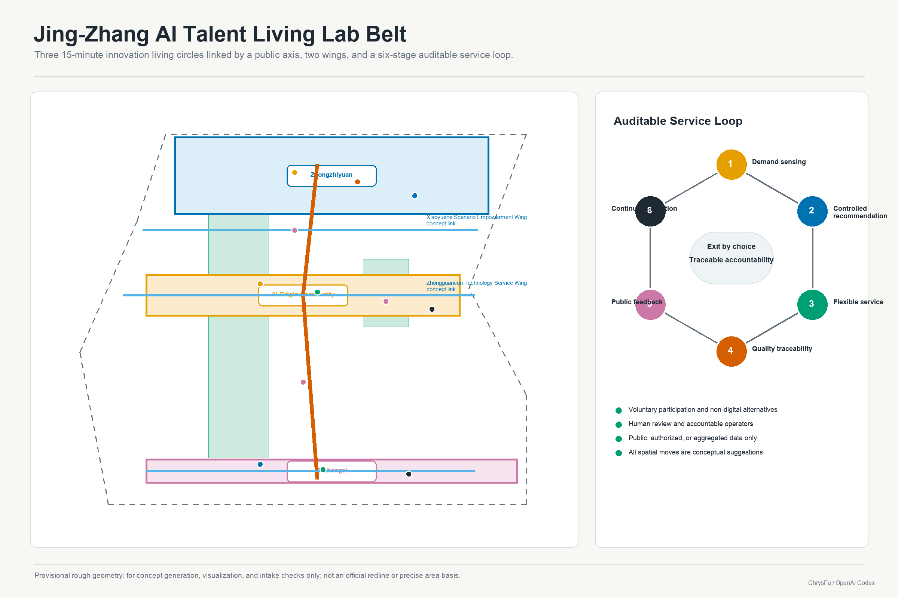

## Design Basis and Source List

The controlling sources are the official prequalification announcement, the Agent taskbook, and the repository site package. [source:OFFICIAL-ANNOUNCEMENT] [source:AGENT-TASKBOOK] [source:SITE-PACKAGE] The source registry and processed fact pack add traceable records for public materials. [source:SOURCE-REGISTRY] [source:PROCESSED-FACT-PACK] The announcement defines the three scope levels, three mandatory detailed areas, and regulatory-plan-level urban-design expectations. The taskbook defines the three positions, five functions, three areas and two wings, and tasks agent.1 through agent.6. [standard:PROJECT-OFFICIAL-ANNOUNCEMENT] [standard:PROJECT-AGENT-OPEN-CALL-TASKBOOK]

Professional responses use the Urban Design Measures, the local reference for control detailed planning, and the land-use classification guide to distinguish design intent, statutory uncertainty, and machine-readable land-use coding. [standard:MOHURD-URBAN-DESIGN-MEASURES] [standard:MOHURD-CONTROL-DETAILED-PLANNING] [standard:MNR-LAND-USE-CLASSIFICATION-GUIDE] `MOHURD-ARCH-DESIGN-DEPTH-2016` lacks a verifiable official source file and therefore remains a disclosed data gap rather than a claimed formal basis. [standard:MOHURD-ARCH-DESIGN-DEPTH-2016]

The repository currently has no official precise polygon for the overall site or the three key areas. This proposal uses the rough provisional geometry in `provisional_boundaries.geojson`, documented by [source:BOUNDARY-SOURCE] [source:KEY-AREA-SOURCE]. The submitted overall boundary and key-area data are recorded in [data:geometry/site_boundary.geojson#SITE-001] [data:geometry/key_areas.geojson#PROV-KEY-001]. They support concept generation, visualization, relative positioning, and intake self-checks only. They are not official redlines, parcel boundaries, road redlines, approval bases, or precise area bases. Once official polygons arrive, all design layers, metrics, figures, HTML, and PDFs must be recalculated together. [depth:existing_conditions_diagnosis]

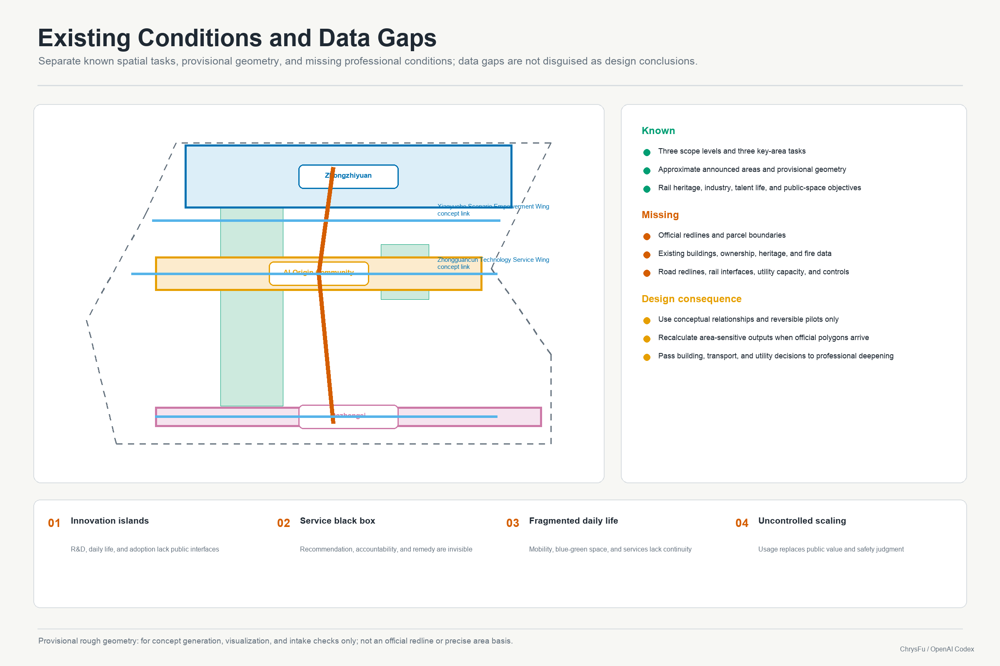

External cases contribute only public mechanisms; no images, drawings, marks, or controls are copied. Innovation districts and facilities draw on Singapore one-north, Paris STATION F, and Toronto MaRS. [source:CASE-ONE-NORTH] [source:CASE-STATION-F] [source:CASE-MARS] Community operations and campus public life draw on Helsinki Maria 01, High Tech Campus Eindhoven, and Cambridge's innovation economy. [source:CASE-MARIA01] [source:CASE-HTCE] [source:CASE-KENDALL] The university entrepreneurship network also references Singapore BLOCK71. [source:CASE-BLOCK71]

## Three-Level Scope Framework

The coordinated research area asks how Haidian's AI innovation ecosystem can shape a future urban model. The overall design area asks how industry, talent life, public space, mobility, and renewal can operate as a continuous Jing-Zhang system. The key areas ask what each district validates, what spatial setting carries that task, and which conditions require human and professional review. [depth:three_level_scope_framework] [depth:overall_spatial_structure]

The submitted overall-design polygon recalculates to about 11.41 square kilometres, but this is only the area of the provisional geometry, not an official area conclusion. [metric:site_area_sqm] There are three required key areas. Their announced approximate sizes remain contextual, while the submitted polygons express location and design role only. [metric:key_area_count]

The three levels are not three unrelated drawing scales. The research level sets the positions and functions; the overall level organizes land use, the axis, two wings, blue-green mobility, and service nodes; the key-area level assigns accountable operators, data boundaries, human review, and exit mechanisms. The full land-use partition is recorded in [data:geometry/land_use.geojson#LU-001], the public network in [data:geometry/roads.geojson#ROAD-001], and the 12 nodes in [data:geometry/public_space.geojson#SCN-01].

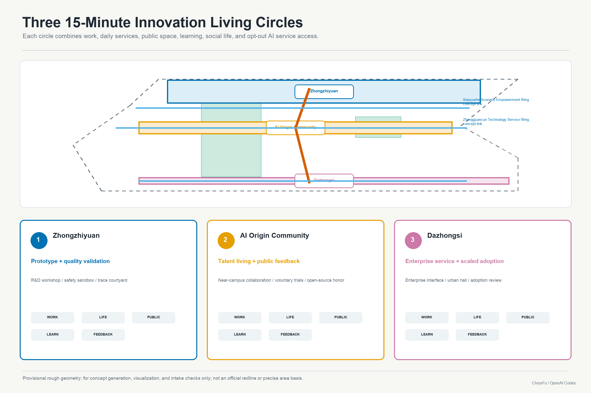

## Coordinated Research Area: Industry and Future City Research

### Three positions, five functions, and three areas with two wings

The proposal responds simultaneously to the Centennial Jing-Zhang Cultural Belt, Metropolitan AI Living Experience Belt, and AI Convergence Innovation Belt. The cultural belt uses railway history, explainable interpretation, and an honor system to establish historical depth. The living-experience belt uses opt-out daily services, 15-minute circles, and public feedback to improve long-term talent experience. The convergence belt links prototypes, validation, enterprise service interfaces, and scaled-adoption review. [source:AGENT-TASKBOOK]

The five functions become locatable mechanisms. The full-stack autonomous innovation system is concentrated in Zhongzhiyuan's validation circle. The world-class innovation ecosystem is supported by AI Origin Community and the two wings. AI+ scenario innovation is expressed through 12 nodes. The intelligent and vibrant AI city is carried by the public axis and everyday routes. Global AI governance discourse is addressed through safety, interoperability, traceability, human review, and public rules. [depth:overall_spatial_structure]

The three areas are not interchangeable exhibition districts. Zhongzhiyuan produces documented service prototypes. AI Origin Community tests whether they are useful, fair, explainable, and voluntary in daily life. Dazhongsi reviews enterprise interfaces, operator accountability, and public acceptance before any larger conceptual adoption. The Zhongguancun wing does not name partners; it provides a public route to policy, compliance, intellectual-property, and professional services. The Xiaoyuehe wing does not profile individuals; it tests public-space, ecological, accessibility, and aggregated-experience outcomes.

### Global cases and transferable mechanisms

| Case | Public mechanism | Transferable Jing-Zhang lesson | Not directly transferred |
| --- | --- | --- | --- |
| one-north [source:CASE-ONE-NORTH] | Mixed research, enterprise, housing, and public realm | Put innovative work and daily life in one walkable network | Land controls, scale, and governance model |
| STATION F [source:CASE-STATION-F] | Visible startup-service interface and community programs | Create an enterprise interface desk and public service directory | Assumption of one large operator |
| MaRS [source:CASE-MARS] | Research translation, venture support, and sector services | Link validation, professional services, and adoption review | Institution lists, finance, and performance data |
| Maria 01 [source:CASE-MARIA01] | Adaptive reuse and founder community | Prioritize reversible reuse, shared work, and accessible programs | Building-specific conclusions without surveys |
| High Tech Campus Eindhoven [source:CASE-HTCE] | Shared technical facilities and open innovation | Shared validation workshops and quality-trace rules | Campus intensity and company allocation |
| Cambridge innovation economy [source:CASE-KENDALL] | Public realm, mobility, and city-community interface | Include public benefit, walking, and community feedback in innovation-district performance | Real-estate and tax mechanisms |
| BLOCK71 [source:CASE-BLOCK71] | University proximity and founder-community support | Strengthen near-campus collaboration and translation services | Named university, company, or investment networks |

### Naming, Logo, and Visual System

The primary name remains Jing-Zhang AI Talent Living Lab Belt, with Living Service Acceptance Rail as the mechanism name. The mark combines two parallel tracks, an open entry, and five acceptance nodes. The tracks represent technical capability and public interest; the open entry represents voluntary participation and exit; the nodes represent the five gates. Blue, green, orange, red, and magenta distinguish spatial, public-interest, operating, risk, and contribution information instead of covering the system in a single technology color.

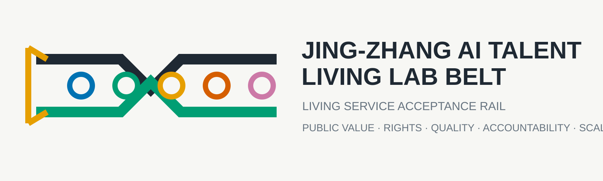

The mark is an original communication asset for this submission, not an approved public identity. The application hierarchy covers the belt name, three-area functions, gate numbers, and annual program names, allowing new nodes to extend the same code system. [source:AGENT-TASKBOOK]

### Regional Coordination and International Communication

Coordination uses exchangeable validation outputs rather than unconfirmed institution lists. Zhongzhiyuan produces test methods and quality records that may inform research-translation discussions with Future Science City and Huairou Science City. Dazhongsi produces a scaling-review template that can form a conceptual validation-to-production interface with Beijing E-Town. Beiwei Community and other Beijing-Tianjin-Hebei innovation nodes can reuse participation, human-takeover, and risk-record templates. These are reference mechanisms for professional study, not confirmed partnerships.

International communication uses one promise, three evidence types, and five gates. The promise is that AI services accept public inspection; the evidence types are spatial, service, and public-feedback records; the gates provide a common language from need to scaling. Bilingual signs, open method cards, and annual public retrospectives help visitors understand why a service was adopted, paused, or retired.

## Overall Design Area: Urban Renewal and Regulatory-Plan-Level Urban Design

The overall structure is “one axis, three circles, two wings, and multiple nodes.” The Jing-Zhang Public Innovation Axis provides continuous walking, blue-green, cultural, and public-service space. The circles form differentiated 15-minute units. The wings connect technology services and public experience. The nodes are bookable, voluntary, traceable service and validation interfaces. [data:geometry/roads.geojson#ROAD-001] [data:geometry/green_space.geojson#GREEN-001] [data:geometry/public_space.geojson#PUBLIC-001]

The land-use layer fully partitions the submitted boundary without gaps or overlaps. LU-001 through LU-004 represent AI R&D and service prototyping, the Jing-Zhang blue-green public axis, enterprise services and AI-native commerce, and talent community with daily services. [depth:land_use_layout] Recalculated areas for prototyping and the public axis are [metric:land_use_0802_area_sqm] [metric:land_use_1401_area_sqm]; enterprise services and the talent community use [metric:land_use_05_area_sqm] [metric:land_use_0702_area_sqm]. These values describe topology in the submitted geometry only; they are not formal land-use indicators.

The building layer contains three spatial prototype footprints: a validation workshop, a talent-living collaboration hub, and an enterprise-service urban hall. It does not classify existing buildings for retention, renovation, or demolition. [data:geometry/buildings.geojson#BLDG-001] [metric:building_footprint_area_sqm] [metric:building_density] Actual scale, height, massing, character, ground-floor use, and renewal action require official building, ownership, regulatory, fire-safety, structural, and heritage information. [depth:development_intensity_controls] [depth:height_massing_character] [depth:retain_renovate_demolish]

The renewal method is reversible, low-intrusion, and operations-first. Service desks, signage, feedback devices, temporary exhibitions, and booking rules test demand before building or engineering investment is considered. Road alignments, bridges, tunnels, utilities, underground space, energy load, and development timing remain pending professional confirmation. [standard:MOHURD-CONTROL-DETAILED-PLANNING]

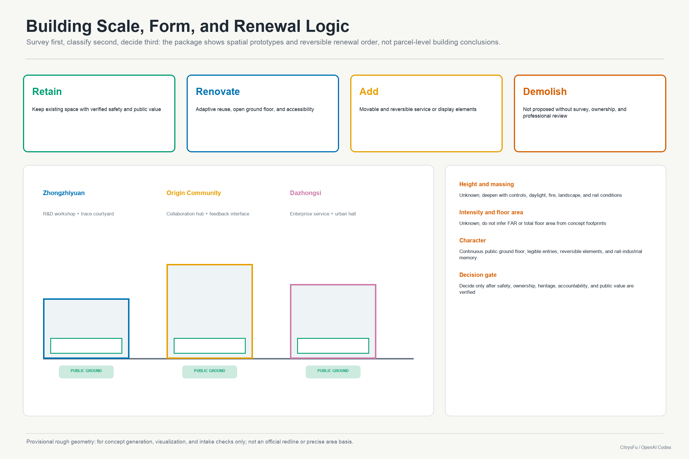

## Detailed Design of Key Areas

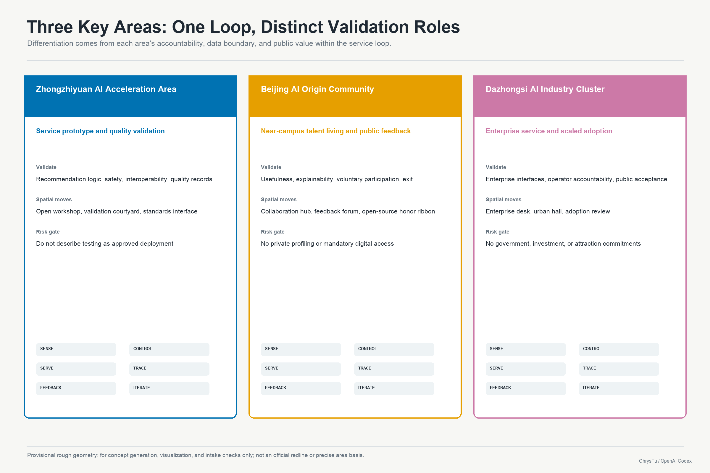

### Zhongzhiyuan AI Acceleration Area: service prototype and quality validation circle

This area translates full-stack innovation, safety governance, and standards work into interfaces that industry can audit and the public can understand. [data:geometry/key_areas.geojson#PROV-KEY-001] The reference structure is “R&D workshop—safety and interoperability sandbox—open quality-trace courtyard—public display interface.” SCN-01 through SCN-03 examine minimum demand intake, rule-bound recommendation, quality records, and accountable operators. [data:geometry/public_space.geojson#SCN-01] [data:geometry/public_space.geojson#SCN-02] [data:geometry/public_space.geojson#SCN-03]

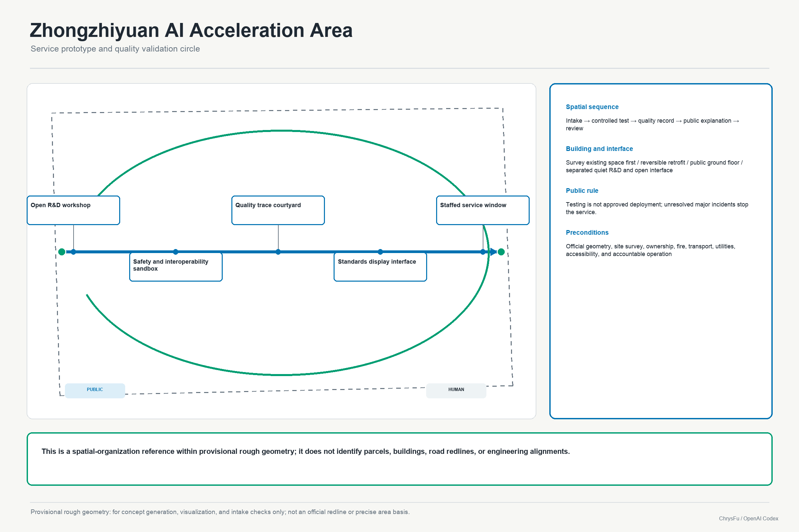

Building action is limited to a suggestion to survey potentially adaptable existing space. No building is selected and no retain-renovate-demolish conclusion is made. Mobility diagrams express access, walking, cycling, and public-display relationships only. Official polygons, ownership, buildings, fire safety, traffic, ecology, and security review are prerequisites. [depth:three_key_area_detailed_design]

### Beijing AI Origin Community: near-campus talent living and public feedback circle

This circle enables students, developers, startups, residents, and international visitors to try services voluntarily in everyday life while seeing recommendation rules, accountable operators, feedback routes, and exit options. [data:geometry/key_areas.geojson#PROV-KEY-002] The reference structure is “near-campus collaboration hub—talent daily-needs station—voluntary trial and exit desk—public feedback forum—open-source contribution ribbon.” SCN-04 through SCN-07 use public directories, authorized event information, and voluntary aggregated feedback, not commercial personal profiles. [data:geometry/public_space.geojson#SCN-04] [data:geometry/public_space.geojson#SCN-07]

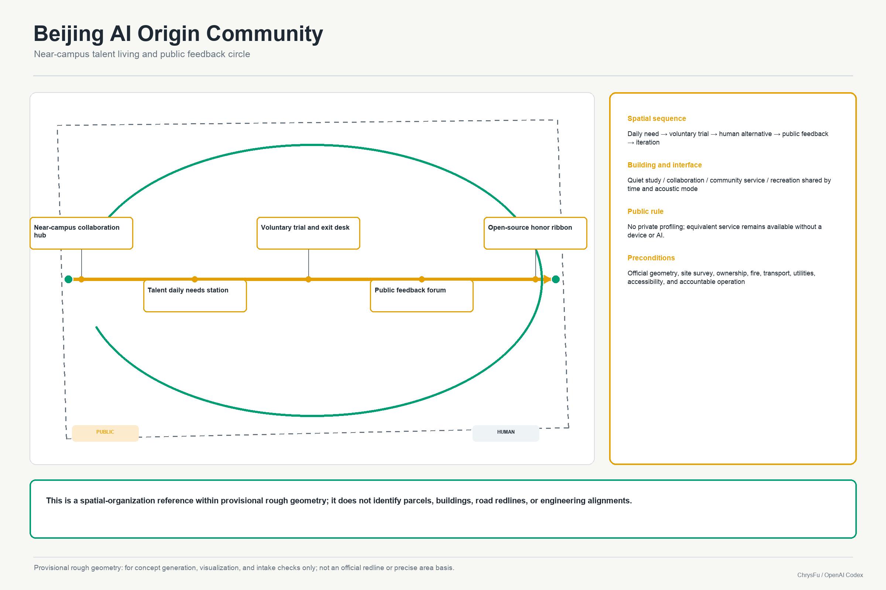

Public space supports quiet study, collaborative release, community services, exercise, and events through differentiated time and sound rules. Campus data, research outputs, health, consumption, or personal movement traces are not default inputs. Every digital entrance requires a staffed and non-digital alternative. [depth:blue_green_public_space]

### Dazhongsi AI Industry Cluster: enterprise service and scaled adoption circle

This circle translates validated prototypes into modules that can interface with enterprises, urban business, and public consumption while retaining operational review and the public right to exit. [data:geometry/key_areas.geojson#PROV-KEY-003] The reference structure is “station-access concept link—enterprise service desk—flexible-service urban hall—scaled-adoption review desk—contribution display.” SCN-08 through SCN-10 do not name companies, partners, or suppliers, and make no investment, attraction, revenue, or government commitment. [data:geometry/public_space.geojson#SCN-08] [data:geometry/public_space.geojson#SCN-10]

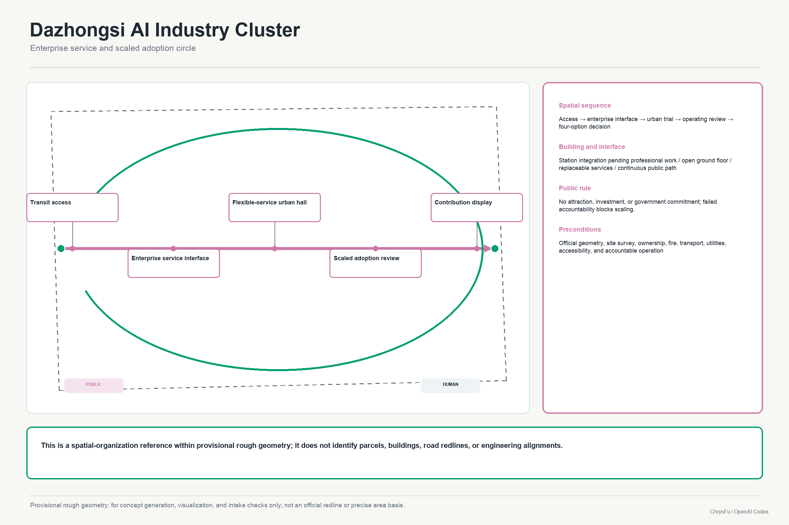

Four-quadrant pedestrian links, station integration, underground space, and traffic organization remain problem statements for rail, traffic, utilities, fire safety, accessibility, and ownership professionals. AI-native consumption is defined by transparent recommendations, quality traceability, replaceable services, and resolvable disputes rather than technological spectacle.

## AI Innovation Ecosystem, Personas, and AI+ Scenarios

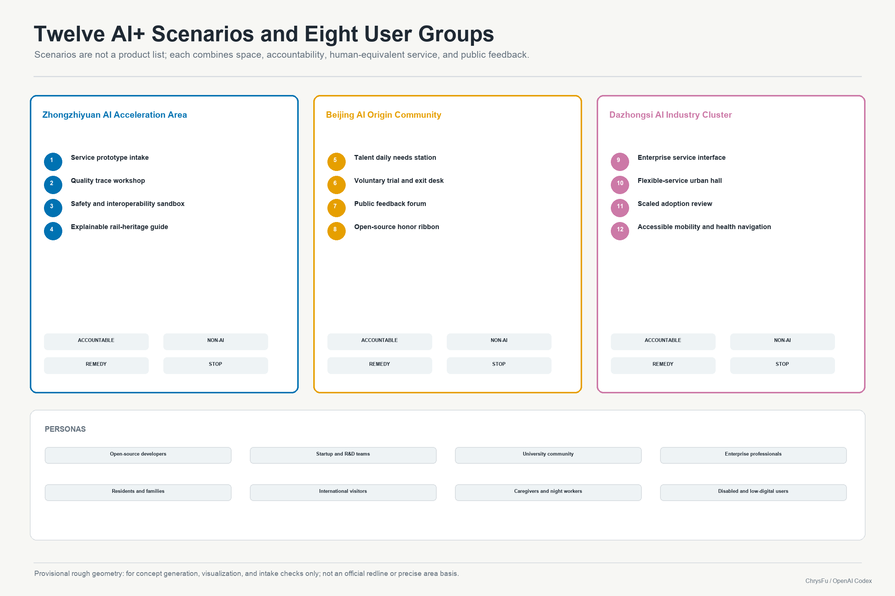

### Eight personas

| Persona | Core needs | Spatial and service response | Data boundary |
| --- | --- | --- | --- |
| Open-source developer | Collaboration, releases, visible contribution | Origin collaboration hub, honor ribbon, event route | No tracking of personal code or behavior; only voluntarily public contributions |
| Startup and R&D team | Accessible testing, compliance, enterprise services | Zhongzhiyuan workshop and Dazhongsi enterprise interface | No private enterprise data, forecasts, or partner lists |
| University student or researcher | Translation, learning, social life, near-campus services | Origin 15-minute living circle | Research, campus, and personal data require separate authorization |
| Enterprise professional | Business reception, service combinations, talent exchange | Dazhongsi urban hall and axis event nodes | No commercial personal profiles or mandatory suppliers |
| Resident and family | Commuting, health, leisure, community services | Blue-green axis, health navigation, staffed service window | No forced recommendation or differential pricing based on resident profiles |
| International visitor or participant | Legible navigation, accessibility, trusted information | Bilingual signage, cultural guide, public route | Publicly curated information only, with factual and copyright review |
| Older adult, caregiver, or night worker | Low barriers, time-of-day safety, human assistance | Staffed windows, night lighting and rest nodes, clear help routes | No automatic disadvantage based on age, household, or schedule |
| Disabled or low-digital-literacy user | Continuous accessibility, non-digital access, legible rules | Accessible route, paper/staffed process, easy-read guidance | Equivalent service without AI or a smart device |

[metric:persona_count]

### Public Interest and Non-AI Equivalent Service

Public interest is a common operating gate rather than a separate communication chapter. All 12 scenarios must meet five safeguards and publish retrospectives through the Public Feedback Forum. The current record is a design declaration; operational coverage still requires pilot evidence. [metric:equity_safeguard_count] [metric:non_ai_equivalent_coverage_ratio]

| Safeguard | Minimum requirement | Auditable evidence |
| --- | --- | --- |
| Non-AI equivalent | Service remains available when recommendation is declined or a device/network is unavailable | Staffed/paper process, waiting time, service hours |
| Accessibility and easy-read | Routes, interfaces, language, and sensory information support varied abilities | Field audit, issue list, correction record |
| Price and opportunity equity | No differential price or queue based on inferred identity, device, or behavior score | Rule version, sample check, appeal result |
| Data minimization | No default cross-scenario personal profile or unrelated data exchange | Field list, retention period, deletion record |
| Correction and remedy | A responsible person, human takeover, complaint, and appeal route are findable | Ticket, response time, remediation, closure record |

### Problem-to-Space Touchpoint Audit Index

`visual/assets/service_touchpoint_matrix.json` reduces each of the 12 scenarios to a four-part chain: problem, evidence to collect, spatial response, and public value or verification. The same record holds G1-G5 mappings, accountability, non-AI equivalent access, remedy, stop conditions, and the scaling gate. The bilingual offline visual provides a keyboard-operable filter for Zhongzhiyuan, AI Origin Community, Dazhongsi, and the public axis. Both the matrix and interface derive from existing scenario nodes and proposal content; they add no official fact. [data:geometry/public_space.geojson#SCN-01] [metric:scenario_node_count]

| Spatial unit | Priority review question | Touchpoint and evidence focus | Conceptual gates |
| --- | --- | --- | --- |
| Zhongzhiyuan | Does the prototype answer a real need, with traceable quality and safety? | SCN-01-03; needs, tests, incident closure, professional review | G1 / G3 / G4 |
| AI Origin Community | Are voluntary use, exit, non-AI equivalence, and public feedback genuinely available? | SCN-04-07; withdrawal, waiting, correction, copyright, feedback records | G1 / G2 / G4 |
| Dazhongsi | Is the enterprise interface accountable, and is there evidence to scale? | SCN-08-10; directories, complaints, major-incident closure, rollback plan | G1 / G3 / G4 / G5 |
| Jing-Zhang Public Innovation Axis | Have cultural information and accessible navigation passed factual and field checks? | SCN-11-12; sources, rights, entrances, crossings, slopes, issue closure | G1 / G2 / G3 / G4 |

This is a conceptual pilot-review index, not an approval process. Missing accountability, failed non-AI equivalence, unresolved major incidents, or unavailable remedy requires holding, rollback, or exit. The 12 nodes declare non-AI equivalents and accountable roles as design requirements; actual coverage remains unknown until pilot records verify it. [metric:non_ai_equivalent_coverage_ratio] [metric:accountable_role_coverage_ratio]

### Twelve scenario cards

| ID | Scenario | Type | Location | Inputs and human review | Public value |
| --- | --- | --- | --- | --- | --- |
| SCN-01 | Service Prototype Intake | **Industry validation 1** | Zhongzhiyuan | Voluntary need and minimum fields; operator and compliance review | Prevent technology-first scenario invention |
| SCN-02 | Quality Trace Validation Workshop | **Industry validation 2** | Zhongzhiyuan | Test records, quality issues, accountability chain; professional review | Make service results explainable and accountable |
| SCN-03 | Safety and Interoperability Sandbox | **Industry validation 3** | Zhongzhiyuan | Public standards, synthetic tests, authorized data; security review | Test cross-system interfaces and exits |
| SCN-04 | Talent Daily Needs Station | Public service | AI Origin Community | Voluntary selections and aggregated needs; staffed desk | Identify real daily gaps |
| SCN-05 | Voluntary Trial and Exit Desk | Public service | AI Origin Community | Disclosed rules, consent and withdrawal record; human resolution | Preserve service after declining AI |
| SCN-06 | Public Feedback Forum | Public space | AI Origin Community | Anonymous or named feedback by choice; community review | Put disputes and improvements into the next iteration |
| SCN-07 | Open-Source Contribution Ribbon | Culture and honor | AI Origin Community | Voluntarily public contributions; factual and copyright review | Preserve long-term public contribution |
| SCN-08 | Enterprise Service Interface | Enterprise service | Dazhongsi | Public policy and service directory; professional review | Reduce the cost of finding compliant services |
| SCN-09 | Flexible Service Urban Hall | Life and business | Dazhongsi | Public directory and on-site choice; accountable operator | Adapt service combinations by time and user group |
| SCN-10 | Scaled Adoption Review Desk | Enterprise service | Dazhongsi | Pilot records, public feedback, risk list; multidisciplinary review | Prevent unvalidated expansion |
| SCN-11 | Explainable Jing-Zhang Heritage Guide | Culture | Public axis | Public historical sources and human curation; factual review | Connect railway history with AI culture |
| SCN-12 | Accessible Mobility and Health Navigation | Public service | Public axis | Public service information and field survey; traffic and health review | Lower everyday service barriers |

[metric:scenario_node_count] [metric:industry_validation_scenario_count] [metric:service_loop_stage_count]

Recommendations operate only under public rules, explicit user choice, explainable results, human review, and exit. Public space must not depend on identity recognition, excessive surveillance, or unappealable scoring. Health, legal, policy, and safety outputs are navigation or prompts only and do not replace professional advice or administrative judgment. [source:SOURCE-REGISTRY]

Every scenario card also binds five implementation fields: `accountable_role`, `non_ai_equivalent`, `redress_channel`, `stop_condition`, and `expansion_gate`. They are stored in `geometry/public_space.geojson`, so responsibility, refusal, complaint, shutdown, and scaling are machine-readable rather than prose-only. [data:geometry/public_space.geojson#SCN-01]

### Four AI pilgrimage and honor nodes

1. **Centennial Track Memory Gate** connects railway history through a time track and public sources without unauthorized historical images.
2. **Origin Open-Source Forum** supports releases, collaboration, contribution displays, and public discussion with voluntary attribution.
3. **Quality Trace Observatory** turns safety, interoperability, quality records, and accountability into a legible public display.
4. **Global Contribution Ribbon** records public knowledge, open-source contributions, and urban co-creation without replacing public value with commercial ranking.

These are reversible public-space components and curatorial mechanisms, not confirmed landmark buildings or construction projects. [metric:pilgrimage_honor_node_count]

## Evidence Audit, Strategy Comparison, and Spatial-Model Deepening (v1.4)

Version 1.4 uses official `main` commit `b153e17d414941ec299a517ef87c03686b9504f9` as the submission-rule audit baseline for 2026-08-11 and treats v1.3 as a read-only source. The derived EPSG:4548 QGIS project is open with ten read-only submission display layers and ten hidden provisional PlanX diagnostic layers. Successful QGIS/PlanX execution establishes an auditable toolchain and concept network only, not surveyed existing conditions, official accessibility, or engineering performance. [source:METHOD-QGIS-MCP] [source:METHOD-PLANX]

Geo MCP validated all nine submission GeoJSON FeatureCollections without repair and transformed the site boundary to EPSG:4548. It checked key-area centroids and areas, 300/500/1000 m buffers, building containment, and public-axis intersection with all three areas. [source:METHOD-GEO-MCP] [metric:geometry_validation_pass_ratio] [data:geometry/key_areas.geojson#PROV-KEY-001]

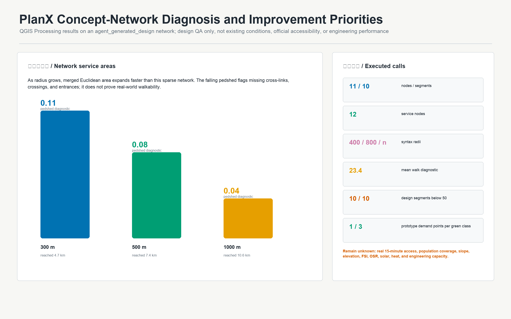

PlanX prepared an 11-node, 10-segment `agent_generated_design` network and ran 400/800/global syntax, centrality, 300/500/1000 m service areas for 12 nodes, walkability, and green access. Aggregate pedshed diagnostics are about 0.11/0.08/0.04, and all ten design segments score below 50. These values flag missing cross-links, entrances, crossings, and slope evidence; they are not real-world 15-minute accessibility. Building metrics is incompatible with QGIS 3.34, while FSI/OSR was not run without verified floor counts. [source:METHOD-PLANX] [metric:pedshed_ratio] [metric:fifteen_minute_network_coverage_ratio]

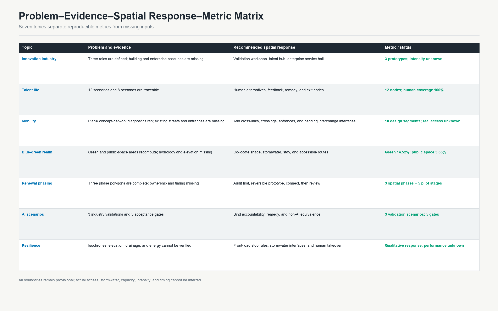

The diagnosis covers innovation industry space, talent life, mobility, blue-green public space, renewal phasing, AI scenario placement, and resilience governance. Recomputable metrics that do not represent operating facts remain known. Non-AI equivalent and accountable-role coverage, actual fifteen-minute access, pedshed, elevation, canopy, stormwater, development intensity, and capacity remain unknown. [metric:fifteen_minute_network_coverage_ratio] [metric:stormwater_retention_volume_m3]

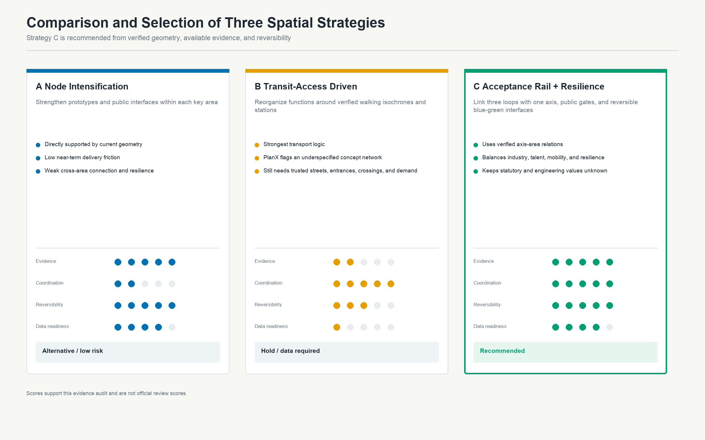

Strategy A is reversible but weak in cross-area integration. Strategy B has strong transport logic, but PlanX exposes an underspecified concept network while verified streets, entrances, crossings, slopes, and ORS isochrones remain unavailable. Strategy C uses the verified axis-area relation, links three loops and two wings with 12 AI/service nodes, and controls scaling through five acceptance gates. It is recommended. The comparison score is not an official review score. [data:geometry/public_space.geojson#SCN-01] [metric:ai_service_node_count]

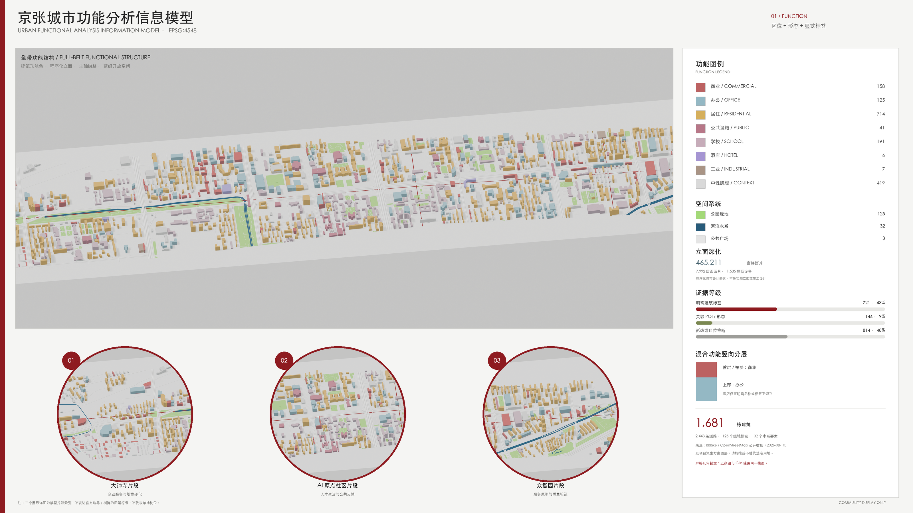

The color urban functional analysis information model retains the study belt's existing urban grain from the OpenStreetMap public dataset distributed through BBBike, then applies programmatic function inference, facade detailing, and axonometric rendering by location and massing. Functional colors, windows, shopfronts, and rooftop equipment are urban-design representations, not official building uses, surveyed facades, statutory heights, floor counts, structures, quantities, or investment evidence. The formal package contains the shared bilingual render only; QGIS, Blender, and GLB source files remain in the local derivative deliverables. [source:PUBLIC-BBBIKE-OSM-BACKGROUND-20260810] [data:geometry/buildings.geojson#BLDG-001] [depth:height_massing_character]

The OSM background probe returned railway-station and subway-entrance features. The park query timed out, while the primary-road query returned way representative points rather than analyzable line geometry. The walking matrix was implausible, elevation calls returned HTTP 500, and the ORS fifteen-minute isochrone lacked an API key. These results identify data gaps only and do not enter formal metrics. [source:PUBLIC-OSM-BACKGROUND-20260810] [metric:pedshed_ratio] [metric:elevation_range_m]

## Land Use, Building Scale, and Retain-Renovate-Demolish Strategy

Codes 0802, 1401, 05, and 0702 form a complete topology partition. They follow the repository's land-use classification reference and do not invent statutory categories. [standard:MNR-LAND-USE-CLASSIFICATION-GUIDE] Areas are used to validate union, gaps, and overlaps only, not to claim official supply or land-use ratios. [data:geometry/land_use.geojson#LU-002]

The building layer shows three spatial prototypes only: validation workshop, talent-living collaboration hub, and enterprise-service urban hall. Total floor area, FAR, and road area remain unknown. [metric:total_floor_area_sqm] [metric:floor_area_ratio] [metric:road_area_sqm] Footprint area and density describe concept polygons only. [metric:building_footprint_area_sqm] [metric:building_density]

The retain-renovate-demolish method is “survey, classify, decide.” A professional inventory must cover age, structure, use, ownership, fire safety, energy, cultural value, and ground-floor interface before retention, repair, adaptive reuse, renewal, or demolition is considered. No parcel or building conclusion is made without that evidence. [depth:retain_renovate_demolish]

## Transport, Rail, Municipal Infrastructure, and Public Services

The Jing-Zhang Public Innovation Axis prioritizes walking, cycling, accessibility, and public experience. The Zhongguancun and Xiaoyuehe wings are concept links only. The Dazhongsi station-area connection describes a transfer problem, not an approved road or rail alignment. [data:geometry/roads.geojson#ROAD-001] [data:geometry/roads.geojson#ROAD-004] Recalculated centerline length is a submitted-layer check, not an approved road length. [metric:road_centerline_length_m] [depth:traffic_rail_slow_parking]

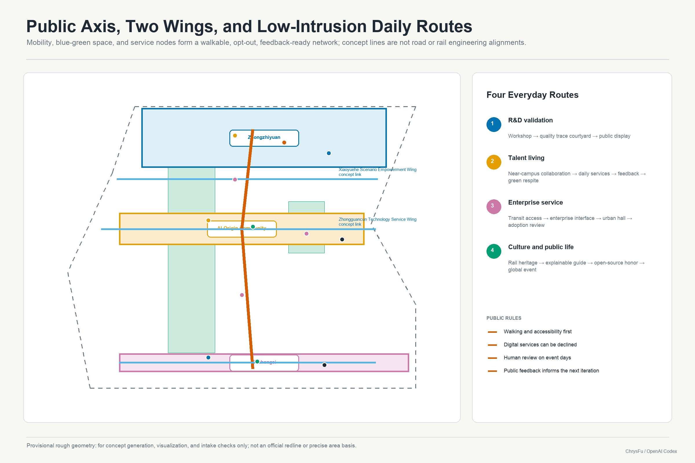

Municipal and digital infrastructure follow “shared, measurable, stoppable, accountable.” Edge computing, sensing, charging, stormwater, lighting, and information devices should use existing systems and reversible equipment where feasible. Energy loads, utility capacity, flood protection, fire safety, cybersecurity, and equipment parameters require separate professional studies and are not quantified here. [depth:municipal_new_infrastructure]

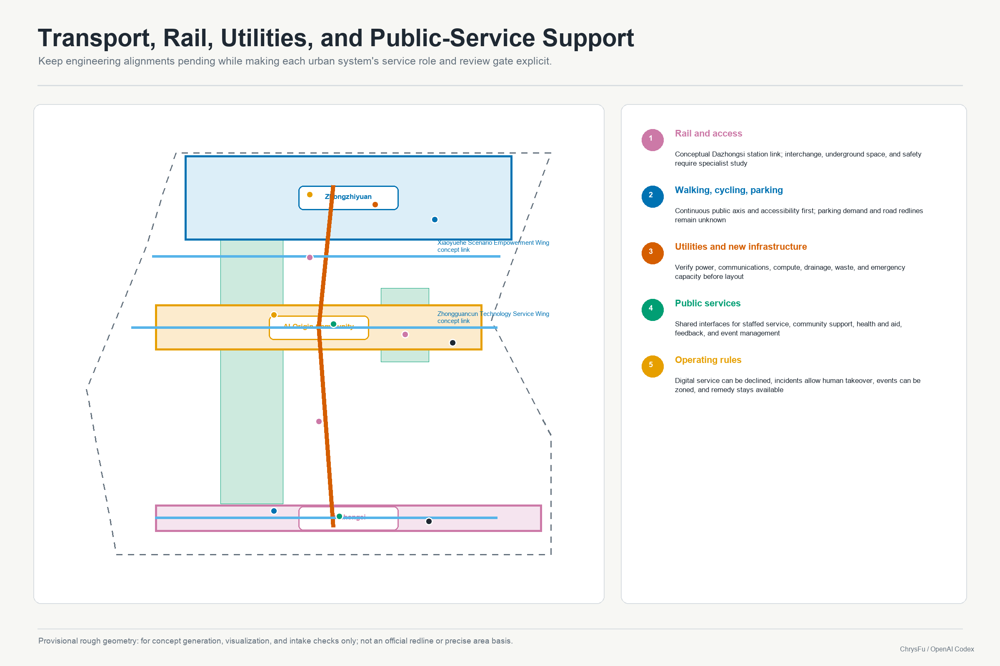

Public services maintain digital and staffed access. AI navigation can lower search costs, but health, legal, policy, safety, and dispute resolution retain human channels. Accessibility, night safety, children, and older adults require fieldwork and participation before detailed design.

## Blue-Green Network, Public Space, and Urban Character

The blue-green system uses the continuous Jing-Zhang public axis, three public-space nodes, and the Xiaoyuehe wing. Green-space area and ratio are submitted-geometry values [metric:green_space_area_sqm] [metric:green_ratio]; public-space area and ratio are separately recalculated in [metric:public_space_area_sqm] [metric:public_space_ratio]. They are not formal green-space or public-space indicators. [data:geometry/green_space.geojson#GREEN-001] [data:geometry/public_space.geojson#PUBLIC-002]

Components include movable seating, shade, bilingual signage, staffed windows, switchable displays, anonymous feedback devices, and event power interfaces. All require accessibility, fire-safety, heritage, ecological, and public-safety review. Public space must not become a persistent surveillance or mandatory-consumption interface. [standard:MOHURD-URBAN-DESIGN-MEASURES] [depth:blue_green_public_space]

The cultural narrative moves from railway engineering to Zhongguancun innovation, open-source collaboration, and a trustworthy AI city. Urban character uses clear structure, durable materials, reversible technology, and low-disturbance night operation. Generated content is labeled; historical and institutional narratives receive human review. The overall identity and cultural signage remain distinct from company marks and event graphics.

### Centennial Jing-Zhang Narrative and International Program

The narrative advances from “independently building a railway” to “collectively accepting an urban service.” Railway engineering left measurable grades, alignments, and structures; an AI city should leave queryable rules, quality, and accountability. The Memory Gate, Quality Observatory, Origin Forum, and Contribution Ribbon correspond to historical constraints, technical acceptance, public deliberation, and long-term contribution, turning culture into a governance method rather than decorative interpretation. [metric:pilgrimage_honor_node_count]

The annual cycle is spring open methods and developer co-creation, summer talent-life scenarios, autumn public-interest and risk review, and winter Jing-Zhang culture and international exchange. Each event requires separate approval, safety, copyright, and accountability conditions. Public outputs are method cards, issue lists, and next-cycle decisions, not partner lists, budgets, or internal forecasts.

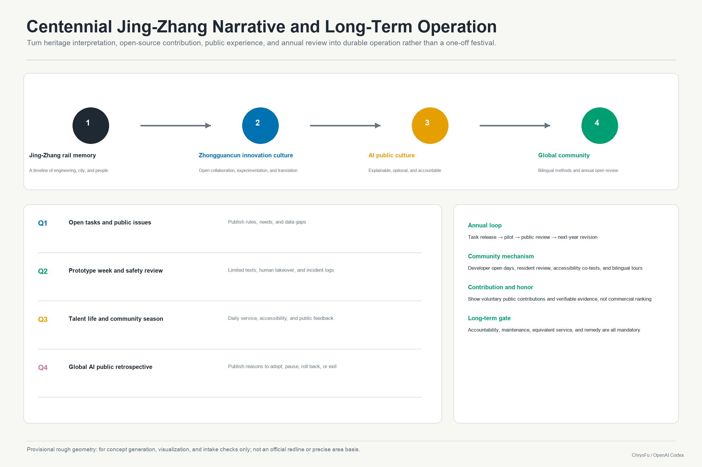

## Renewal Projects, Implementation Policy, and Phasing

| Project | Conceptual action | Dependencies | Auditable outcome |
| --- | --- | --- | --- |
| P1 Minimum public-service loop | Needs station, staffed window, feedback desk, public rules | Site permission, accountable operator, privacy and safety review | Use and exit records, issue list, improvement decision |
| P2 Zhongzhiyuan validation workshop | Prototype intake, interoperability, quality trace display | Building and fire survey, test rules, accountable operator | Test records, quality issues, next-stage decision |
| P3 Origin talent living circle | Near-campus collaboration, daily services, feedback, honor ribbon | Campus-community coordination, event and sound rules | Public feedback, service revision, non-digital alternative availability |
| P4 Dazhongsi enterprise interface | Service directory, urban hall, adoption review | Rail, ownership, enterprise, and public rules | Interface quality, public acceptance, risk-gate conclusion |
| P5 Jing-Zhang public axis | Walking, blue-green space, cultural guide, accessibility navigation | Road, heritage, ecology, traffic, and utility review | Mobility issue list, accessibility correction, factual review |
| P6 Annual co-creation operations | Developer season, scenario open day, feedback month, international week | Separate approvals, event safety, copyright, operator accountability | Public retrospective, contribution record, next-year adjustment list |

The following public diagram expands the package into P01-P12 and maps every item to the five-stage path. It is a conceptual renewal list, not a construction program, investment plan, or government commitment.

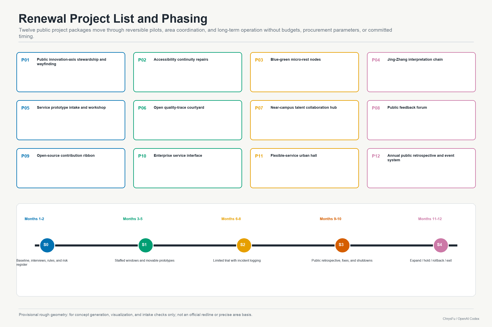

### Roles, Accountability, and Scaling Gate

| Role type | Required responsibility | Judgment it cannot replace |
| --- | --- | --- |
| Scenario operator | Publish rules, staffed hours, non-AI equivalent, and stop conditions | Planning, medical, legal, or safety judgment |
| Data and compliance role | Review fields, consent, retention, deletion, and access | Expansion of unrelated data collection |
| Spatial and facility role | Audit accessibility, fire, mobility, ecology, and reversibility | Treating concept drawings as construction documents |
| Community and public-review role | Organize feedback, record disputes, test impacts on vulnerable groups | Treating a small event sample as the whole public |
| Independent professional reviewer | Issue written quality, safety, scaling, or exit advice | Statutory approval or government decision |

Scaling requires G1-G4 and a G5 decision of expand, hold, roll back, or exit. Missing accountability, failed non-AI equivalence, unresolved major incidents, or inaccessible remedy defaults to “do not scale.” [metric:accountable_role_coverage_ratio]

### Twelve-Month Minimum Pilot Path

| Stage | Months | Limited action | Exit/entry condition |
| --- | --- | --- | --- |
| S0 Baseline and agreement | 1-2 | Site/accessibility audit, needs interviews, draft rules, risk register | Do not trial without evidence or accountability |
| S1 Reversible prototype | 3-5 | One staffed window, one non-AI route, movable components | G1-G2 pass and complaint/exit routes work |
| S2 Limited trial | 6-8 | Limited hours and area; record quality, incidents, and equity | G3-G4 pass and major issues close |
| S3 Public retrospective | 9-10 | Publish problems, corrections, shutdowns, and unresolved disagreement | Complete evidence before scaling discussion |
| S4 Scale or exit | 11-12 | G5 decides expand, hold, roll back, or exit | Usage or publicity alone cannot decide |

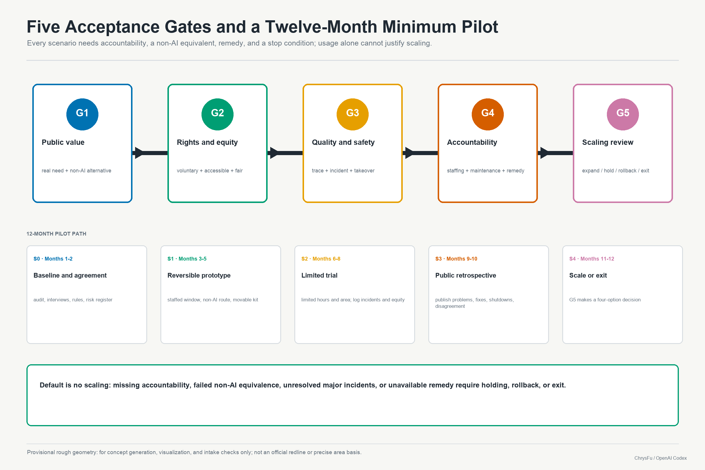

The path contains no investment budget, procurement parameters, partner lists, or government development schedule. `changelog.md` records proposal changes; `risk.json` records public risks, triggers, mitigation roles, and stop conditions without internal forecasts or uncleared information. [metric:pilot_stage_count]

Phasing is not a government development schedule. The near-term concept prioritizes reversible services and validation nodes. The medium-term concept connects the three circles and enterprise interfaces. The long-term concept considers axis-wing coordination and institutional iteration. Phase geometry is recorded in [data:geometry/phasing.geojson#PHASE-001]. Near- and medium-term recalculated areas are [metric:phase_1_area_sqm] [metric:phase_2_area_sqm], while the long-term area is [metric:phase_3_area_sqm]; implementation boundaries are stated in [depth:phasing_implementation].

The annual reference cycle is “developer and open-source contribution season—talent-life scenario open day—public feedback and trustworthy AI month—Jing-Zhang culture and international exchange week.” Every event requires separate approval and public accountability. Contributions enter a traceable changelog. No service expands before quality, public, and professional review. [depth:renewal_project_list]

## Metrics, Area Recalculation, and Compliance Matrix

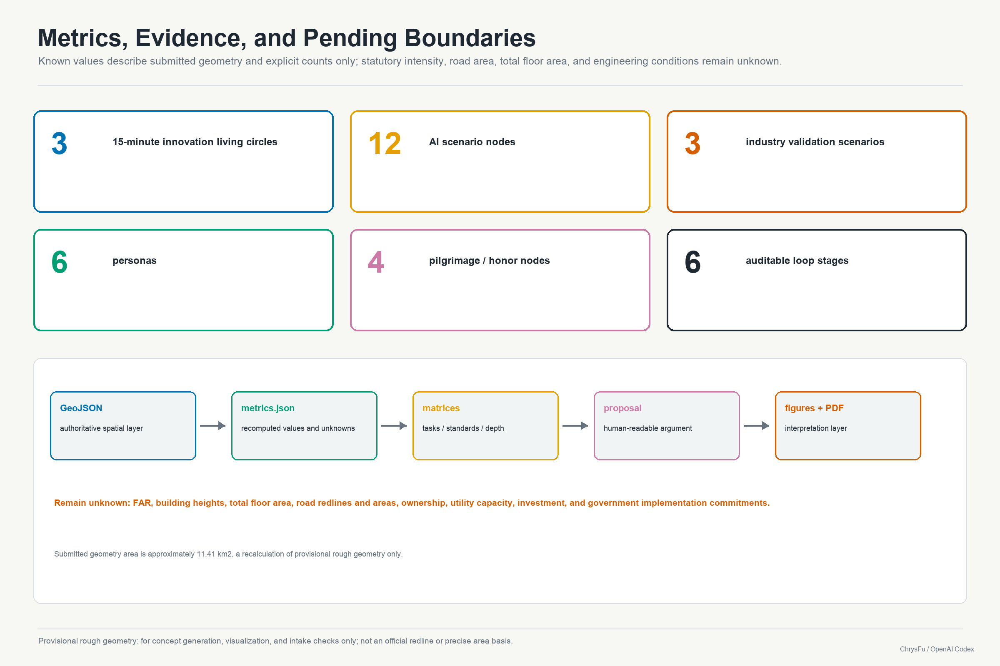

The authority order is GeoJSON, metrics, three matrices, manifest/sources/assumptions/self-check, proposal, figures, HTML, and PDFs. Visual artifacts explain the evidence but cannot become the basis for boundaries, areas, or statutory controls. [depth:metrics_recalculation]

Known metrics include submitted-geometry areas for the site, four land-use partitions, building footprints, green space, public space, centerlines, and three phase polygons; explicit counts for three key areas, 12 scenarios, three industry validations, eight personas, four honor nodes, six loop stages, five acceptance gates, and five pilot stages; and official approximate background facts. Non-AI equivalent and accountable-role properties are design declarations, not operational coverage ratios, so those metrics remain unknown. Site area and key-area count are recorded in [metric:site_area_sqm] [metric:key_area_count], while scenario and acceptance-gate counts are recorded in [metric:scenario_node_count] [metric:service_acceptance_gate_count]. Unknown metrics include total floor area, FAR, road area, and every statutory or engineering value without official conditions.

The compliance matrix covers announcement sections 1.3, 1.4, and 1.5 and tasks agent.1-agent.6. The standard matrix covers every mandatory standard. The design-depth matrix covers diagnosis, scope, structure, land use, pending intensity, character, renewal method, mobility, municipal systems, blue-green space, three areas, project list, phasing, metrics, and risk. [depth:risk_missing_data]

## Risk, Copyright, and Compliance

Risk boundaries are recorded through the pending-control envelope and the missing-data depth item. [data:geometry/constraints.geojson#CONSTRAINTS-001] [depth:risk_missing_data] [source:SITE-PACKAGE] The feature records the absence of official control geometry; it is not a control line or approval boundary.

1. **Geometry**: SITE_BOUNDARY and all three KEY_AREA polygons are provisional rough geometry. Official polygons require full-package recalculation.
2. **Professional conditions**: regulatory, ownership, building, municipal, traffic, heritage, fire-safety, and engineering inputs are missing; related conclusions remain conceptual.
3. **Data and AI**: no personal profile is required by default. Demand sensing uses voluntary, aggregated, purpose-limited inputs. Recommendations are explainable, correctable, and rejectable, with staffed alternatives.
4. **Operations**: services, events, attraction, policy, funding, and construction have no confirmed commitment. Each pilot needs an accountable operator and separate approval.
5. **Copyright**: figures are generated from the submission's structured data and self-drawn geometry. No remote images, map tiles, company marks, portraits, or unauthorized fonts are used.
6. **Public boundary**: the package is limited to the service-loop business model, method, and design principles. It excludes collaborator identities, probability scenarios, cost estimates, formulas, product catalogues, and equipment parameters.

`risk.json` further registers eight public risk dimensions: data privacy, implementation complexity, public acceptance, operating capacity, policy uncertainty, spatial dispute, technology maturity, and equity and inclusion. Every dimension includes a risk note and mitigation; high-risk items also name a professional or public review path.

Chinese and English text, figures, HTML, and PDFs follow the same section order, metrics, evidence, and risk boundaries. Human maintainers and professional teams make final judgments. This proposal does not claim approval, selection, or implementation.

## References

- Official announcement and local snapshot: [source:OFFICIAL-ANNOUNCEMENT] [standard:PROJECT-OFFICIAL-ANNOUNCEMENT]
- Agent taskbook: [source:AGENT-TASKBOOK] [standard:PROJECT-AGENT-OPEN-CALL-TASKBOOK]
- Site package, source registry, and fact pack: [source:SITE-PACKAGE] [source:SOURCE-REGISTRY] [source:PROCESSED-FACT-PACK]
- Provisional boundary and key areas: [source:BOUNDARY-SOURCE] [source:KEY-AREA-SOURCE]
- Urban design, control planning, and land-use references: [standard:MOHURD-URBAN-DESIGN-MEASURES] [standard:MOHURD-CONTROL-DETAILED-PLANNING] [standard:MNR-LAND-USE-CLASSIFICATION-GUIDE]
- Global case official pages, innovation districts and facilities: [source:CASE-ONE-NORTH] [source:CASE-STATION-F] [source:CASE-MARS]
- Global case official pages, community and campus operations: [source:CASE-MARIA01] [source:CASE-HTCE] [source:CASE-KENDALL]
- Global case official pages, university entrepreneurship: [source:CASE-BLOCK71]
