# 京张 AI 人才生活实验带

本方案把“吸引 AI 人才”从一次性招商或形象工程，转化为可以在日常生活中持续验证的城市服务能力：人提出真实需求，系统只在明确规则内推荐，空间与运营以柔性方式响应，服务过程可追溯，公众可以反馈、纠正或退出，下一轮迭代再据此调整。六阶段闭环为：**需求感知 → 受控推荐 → 柔性服务 → 质量追溯 → 公共反馈 → 持续迭代**。

总体空间由三处十五分钟创新生活圈、京张公共创新轴和两翼构成。众智园承担“服务原型与质量验证”，北京 AI 原点社区承担“近校人才生活与公共反馈”，大钟寺承担“企业服务与规模转化”；中关村科技服务翼提供公开政策、知识产权、合规和资本服务入口，小月河场景赋能翼提供公共空间、生态与日常体验反馈。所有空间动作均为**概念建议、参考方案、可供专业团队深化研究**，不替代正式规划，不构成政府审定或实施承诺。[source:AGENT-TASKBOOK] [standard:PROJECT-AGENT-OPEN-CALL-TASKBOOK]

## 核心差异化机制：生活服务验收轨

京张铁路的公共价值不只来自“连接”，还来自把工程能力交付为可被验收的线路。本方案据此提出 **生活服务验收轨 / Living Service Acceptance Rail**：AI 服务不能因为完成技术演示就进入城市日常，而要沿京张公共创新轴依次通过五道公开门槛。每道门槛都对应空间界面、责任角色、可审计记录和失败后的退出动作，从而把六阶段闭环从流程图转化为城市基础设施。

| 验收门 | 核心问题 | 空间界面 | 通过证据 | 未通过处置 |
| --- | --- | --- | --- | --- |
| G1 公共价值门 | 是否解决真实、可公开说明的日常问题 | 人才日常需求站 | 需求来源、非 AI 替代方案、受影响群体说明 | 返回需求定义，不进入推荐 |
| G2 权利与公平门 | 是否自愿、可解释、无差别排除 | 自愿体验与退出台 | 明示规则、撤回记录、无障碍与价格公平检查 | 停止试用并修订规则 |
| G3 质量与安全门 | 输出是否稳定、可追溯、可人工接管 | 质量追溯工坊与安全沙盒 | 测试记录、责任链、异常与人工接管记录 | 隔离服务，不进入公共场景 |
| G4 运营责任门 | 是否有人负责、有人维护、有人受理纠纷 | 公共反馈论坛与企业服务接口 | 责任角色、服务时间、投诉渠道、复盘记录 | 暂停运营并公开整改 |
| G5 扩容复核门 | 是否值得从单点扩大到片区 | 大钟寺规模转化复核台 | 公共价值、权益、质量和运营四类证据汇总 | 保持小规模、回退或退出 |

五道门不是审批替代品，而是面向概念试点的公共证据框架。它要求 12 个场景全部提供人工等价入口、责任角色、纠错渠道和停止条件；任何一个场景都不得以“使用人数增加”单独证明成功。[metric:service_acceptance_gate_count] [metric:non_ai_equivalent_coverage_ratio] [metric:accountable_role_coverage_ratio]

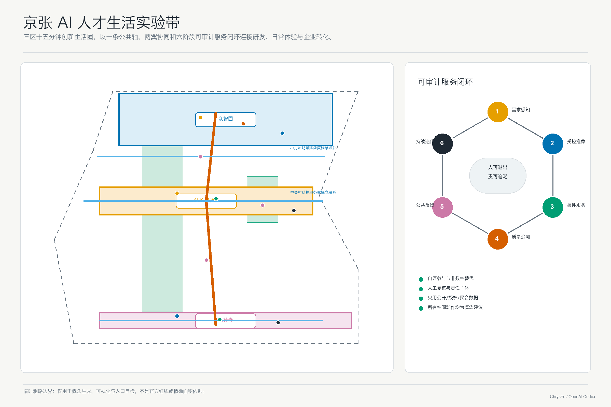

## 设计依据与资料清单

方案以官方资格预审公告、面向智能体任务书和仓库 site package 为主控依据。[source:OFFICIAL-ANNOUNCEMENT] [source:AGENT-TASKBOOK] [source:SITE-PACKAGE] 来源登记表与处理事实包用于补充公开材料的可追溯记录。[source:SOURCE-REGISTRY] [source:PROCESSED-FACT-PACK] 公告提出三层范围、三区重点设计和控规深度城市设计要求；任务书提出三大定位、五大功能、三区两翼及 agent.1-agent.6 六项任务。[standard:PROJECT-OFFICIAL-ANNOUNCEMENT] [standard:PROJECT-AGENT-OPEN-CALL-TASKBOOK]

专业响应以《城市设计管理办法》、控制性详细规划相关公开参考和国土空间用地分类指南为依据，分别约束总体空间、法定与建议边界、用地代码和可读证据链。[standard:MOHURD-URBAN-DESIGN-MEASURES] [standard:MOHURD-CONTROL-DETAILED-PLANNING] [standard:MNR-LAND-USE-CLASSIFICATION-GUIDE] `MOHURD-ARCH-DESIGN-DEPTH-2016` 当前缺少可核验的官方源文件，只作为已披露资料缺口，不声明已正式采用。[standard:MOHURD-ARCH-DESIGN-DEPTH-2016]

当前仓库没有官方精确总体边界和三处重点区 polygon。本方案使用 `provisional_boundaries.geojson` 中的临时粗略几何，来源说明为 [source:BOUNDARY-SOURCE] [source:KEY-AREA-SOURCE]。提交的总体边界和重点区数据分别记录为 [data:geometry/site_boundary.geojson#SITE-001] [data:geometry/key_areas.geojson#PROV-KEY-001]。这些几何仅用于概念生成、可视化、相对位置表达和入口自检，不是官方红线、地块边界、道路红线、审批依据或精确面积依据；官方 polygon 发布后，全部设计图层、指标、图件、网页与 PDF 必须统一复算。[depth:existing_conditions_diagnosis]

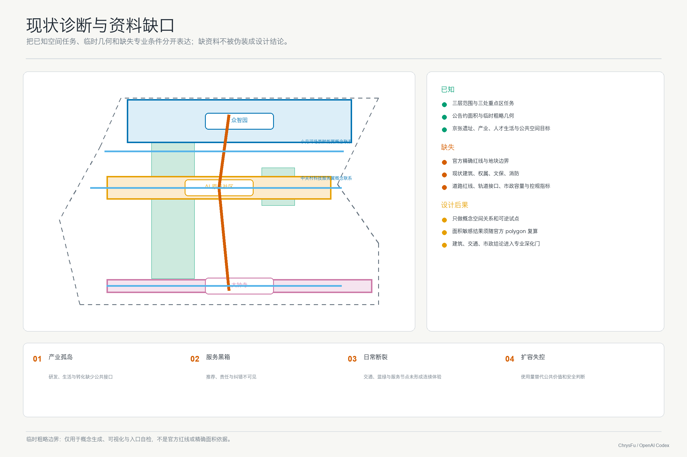

外部案例只提取公开机制，不复制图片、图纸、商标或控制指标。创新城区和载体参考包括新加坡 one-north、巴黎 STATION F 与多伦多 MaRS。[source:CASE-ONE-NORTH] [source:CASE-STATION-F] [source:CASE-MARS] 社区运营与园区公共生活参考赫尔辛基 Maria 01、埃因霍温 High Tech Campus 和剑桥创新经济区。[source:CASE-MARIA01] [source:CASE-HTCE] [source:CASE-KENDALL] 大学创业网络补充参考新加坡 BLOCK71。[source:CASE-BLOCK71]

## 三层范围工作框架

统筹研究范围回答“海淀 AI 创新生态如何与未来城市形态协同”；总体设计范围回答“京张轴线周边如何把产业、人才生活、公共空间、交通与城市更新组织成连续系统”；重点区域回答“三个片区分别验证什么、由什么空间承载、哪些条件必须人工与专业复核”。[depth:three_level_scope_framework] [depth:overall_spatial_structure]

总体设计范围的提交几何复算约为 11.41 平方公里，仅代表临时粗略 polygon 自身，不等于官方面积结论。[metric:site_area_sqm] 三处重点区数量为 3；公告约面积仍作为任务背景，提交 polygon 只用于位置和设计角色表达。[metric:key_area_count]

三层传导关系不是“从大到小画三套图”，而是从产业目标到公共规则，再到可验证节点：统筹层定义三大定位和五大功能；总体层用用地、公共轴、两翼、蓝绿慢行和服务节点组织网络；重点区层为每项服务设置负责主体、数据边界、人工复核和退出机制。用地完整分区见 [data:geometry/land_use.geojson#LU-001]，公共网络见 [data:geometry/roads.geojson#ROAD-001]，12 个节点见 [data:geometry/public_space.geojson#SCN-01]。

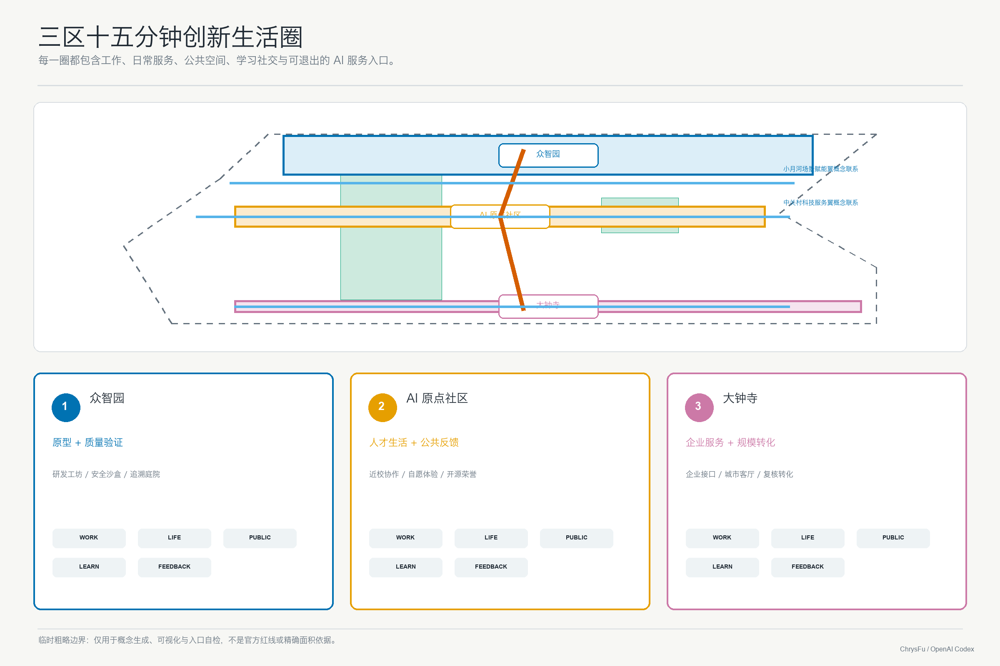

## 统筹研究范围产业与未来城市研究

### 三大定位、五大功能与三区两翼

方案同时回应“百年京张文化带、都市 AI 生活体验带、AI 融合创新带”三大定位。文化带通过京张历史叙事、可解释导览和贡献荣誉系统建立时间纵深；生活体验带通过可退出的日常服务、十五分钟生活圈和公共反馈建立人才黏性；融合创新带通过原型验证、企业服务接口和规模转化复核形成产业闭环。[source:AGENT-TASKBOOK]

五大功能被转译为可定位机制：AI 全栈自主创新体系落在众智园验证圈；世界级 AI 创新生态落在原点社区与两翼的开放协作；AI+场景赋能新范式落在 12 个节点；智能化 AI 活力城市落在公共轴与日常路线；AI 治理全球话语权落在安全、互操作、质量追溯、人工复核和公开规则。[depth:overall_spatial_structure]

三区之间不是同质化“展示园区”。众智园产出经过记录的服务原型；原点社区用自愿体验和公共反馈判断其是否有用、公平和可退出；大钟寺检查企业接口、运营责任与公众接受度，再决定是否进入更大范围的概念性推广。中关村科技服务翼不指向特定合作方，而是提供公开政策、合规、知识产权与专业服务入口；小月河场景赋能翼不采集个人画像，而以公共空间、生态、无障碍和聚合反馈验证城市体验。

### 全球案例及可转化机制

| 案例 | 公开机制 | 京张可转化内容 | 不直接照搬的内容 |
| --- | --- | --- | --- |
| one-north [source:CASE-ONE-NORTH] | 研发、企业、居住和公共空间混合组织 | 将创新工作与日常生活放入同一可步行网络 | 土地控制、规模和治理模式 |
| STATION F [source:CASE-STATION-F] | 可见的创业服务入口与社区活动 | 建立企业服务接口台和公开服务目录 | 单一大型运营主体假设 |
| MaRS [source:CASE-MARS] | 研究转化、创业支持与行业服务连接 | 形成“验证—专业服务—转化复核”链条 | 机构名单、资金与绩效数据 |
| Maria 01 [source:CASE-MARIA01] | 适应性再利用与创始人社区 | 优先可逆改造、共享协作和低门槛活动 | 未经调查的具体建筑改造结论 |
| High Tech Campus Eindhoven [source:CASE-HTCE] | 共享技术设施与开放创新社区 | 共享验证工坊、质量追溯和跨团队使用规则 | 园区开发强度和企业配置 |
| Cambridge innovation economy [source:CASE-KENDALL] | 创新区公共空间、交通和城市社区接口 | 把公共利益、慢行和社区反馈纳入创新区绩效 | 房地产与税收机制 |
| BLOCK71 [source:CASE-BLOCK71] | 高校邻近、创业社区与共享支持 | 强化原点社区的近校协作和成果转化入口 | 指定高校、企业或投资网络 |

### 命名、Logo 与视觉系统

主名称保留“京张 AI 人才生活实验带”，机制副名称为“生活服务验收轨”。视觉标识由两条平行轨迹、一个开放入口和五个验收节点构成：平行轨迹分别代表技术能力与公共利益，开放入口代表可自愿进入和退出，五个节点代表五道验收门。蓝、绿、橙、红、品红分别用于空间、公共利益、运营、风险和贡献信息，不用单一“科技蓝”覆盖全部内容。

该标识为本次投稿自绘的传播资产，不使用企业标识或未授权素材，不是已审定官方标识。应用层级分为带名、三区功能名、验收门编号和年度活动名，新增节点可沿同一编码体系扩展。[source:AGENT-TASKBOOK]

### 区域协同与国际传播

协同不以未确认的机构名单为前提，而以可交换的验证产物为接口：众智园输出测试方法与质量记录，供未来科学城和怀柔科学城的科研成果转化讨论参考；大钟寺输出规模转化复核模板，与经开区制造和应用场景形成概念性“验证—量产”接口；北纬社区与京津冀其他创新节点可复用公众参与、人工接管和风险记录模板。所有协同均为可供相关专业团队研究的参考机制，不构成已确定合作安排。

国际传播采用“一个承诺、三类证据、五道门”的统一叙事：承诺是 AI 服务必须接受公共验收；三类证据是空间、服务和公众反馈；五道门对应从需求到扩容的共同语言。双语标识、开放方法卡和年度公开复盘使国际访客能看懂一项服务为何被采用、暂停或退出。

## 总体设计范围城市更新与控规深度城市设计

总体结构为“一轴、三圈、两翼、多点”。京张公共创新轴承担慢行、蓝绿、文化与公共服务连续性；三圈形成差异化十五分钟创新生活单元；两翼连接科技服务和公共体验；多点是可预约、可退出、可追溯的服务与验证节点。[data:geometry/roads.geojson#ROAD-001] [data:geometry/green_space.geojson#GREEN-001] [data:geometry/public_space.geojson#PUBLIC-001]

用地分区完整覆盖提交边界且不重叠：AI 研发与服务原型、京张蓝绿公共轴、企业服务与智能原生商务、人才社区与日常服务配套四类分区分别由 LU-001 至 LU-004 表达。[depth:land_use_layout] 研发原型与公共轴的复算指标为 [metric:land_use_0802_area_sqm] [metric:land_use_1401_area_sqm]；企业服务与人才社区的复算指标为 [metric:land_use_05_area_sqm] [metric:land_use_0702_area_sqm]。这些数值只描述提交 geometry 的拓扑分区，不能被解释为正式用地指标。

建筑图层只放置三个“空间原型基底”，用于说明工坊、协作站和企业服务客厅的空间关系，不对现状建筑作拆、改、留结论。[data:geometry/buildings.geojson#BLDG-001] [metric:building_footprint_area_sqm] [metric:building_density] 实际保留、改造、新建、建筑高度、体量、风貌和首层业态必须在官方建筑、权属、控规、消防、结构和文保资料补齐后由专业团队确认。[depth:development_intensity_controls] [depth:height_massing_character] [depth:retain_renovate_demolish]

更新策略优先采用可逆、低侵入和运营先行：先以服务台、导视、反馈设施、临时展陈和预约机制验证需求，再决定是否进入建筑或工程深化。任何道路线形、桥隧、市政管线、地下空间、能源负荷或开发时序都保持待确认，不在本方案中形成工程结论。[standard:MOHURD-CONTROL-DETAILED-PLANNING]

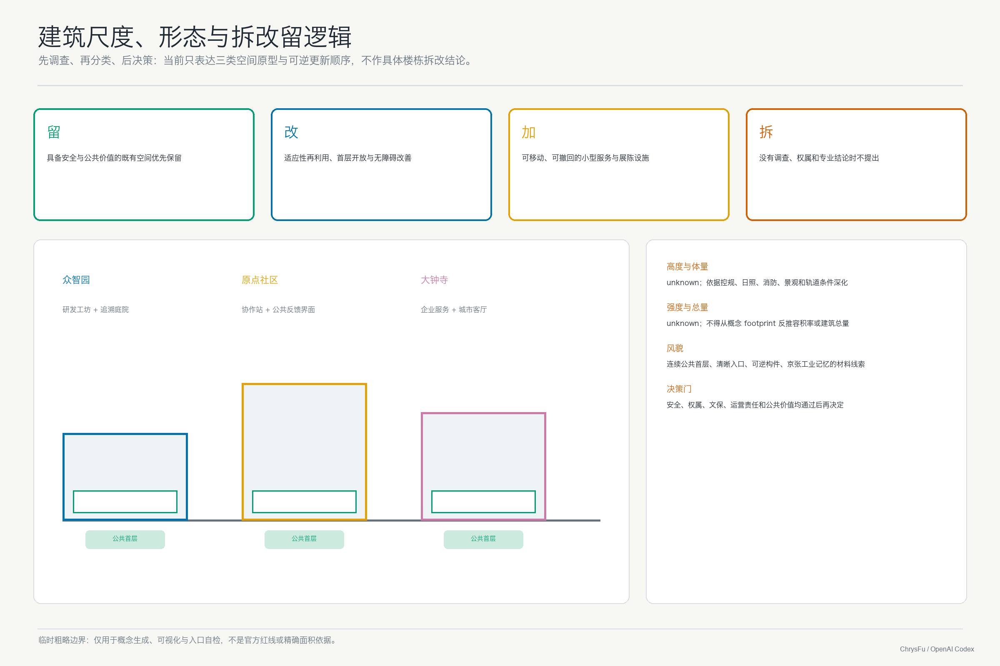

## 重点区域详细设计

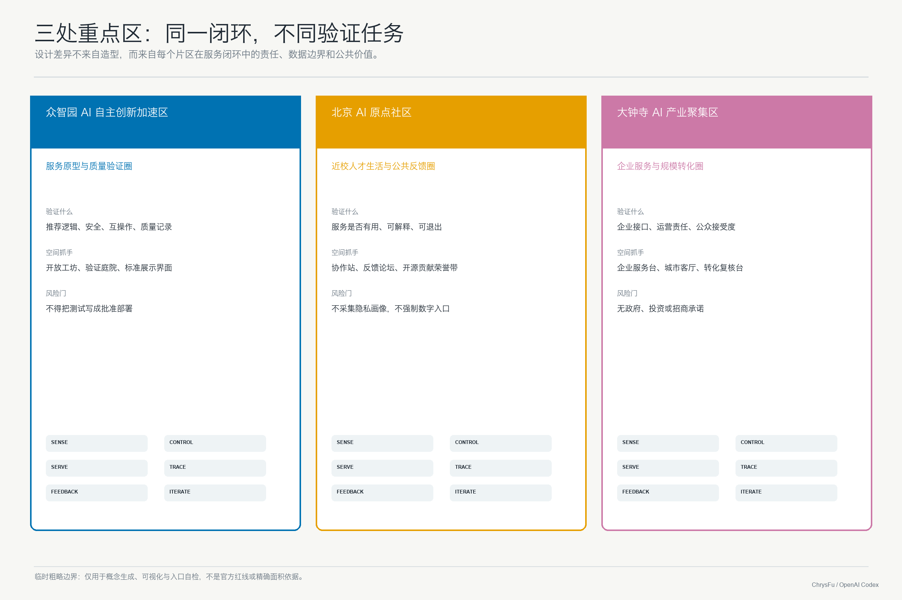

### 众智园 AI 自主创新加速区：服务原型与质量验证圈

定位是把全栈自主创新、安全治理和标准研究转化为公众可理解、产业可复核的验证界面。[data:geometry/key_areas.geojson#PROV-KEY-001] 空间结构建议为“研发工坊—安全与互操作沙盒—质量追溯开放庭院—公共展示界面”，以公共轴连接清河与园区日常路线。三个产业验证场景 SCN-01 至 SCN-03 分别检查需求登记是否最小化、推荐是否受规则约束、服务输出是否有质量记录和责任主体。[data:geometry/public_space.geojson#SCN-01] [data:geometry/public_space.geojson#SCN-02] [data:geometry/public_space.geojson#SCN-03]

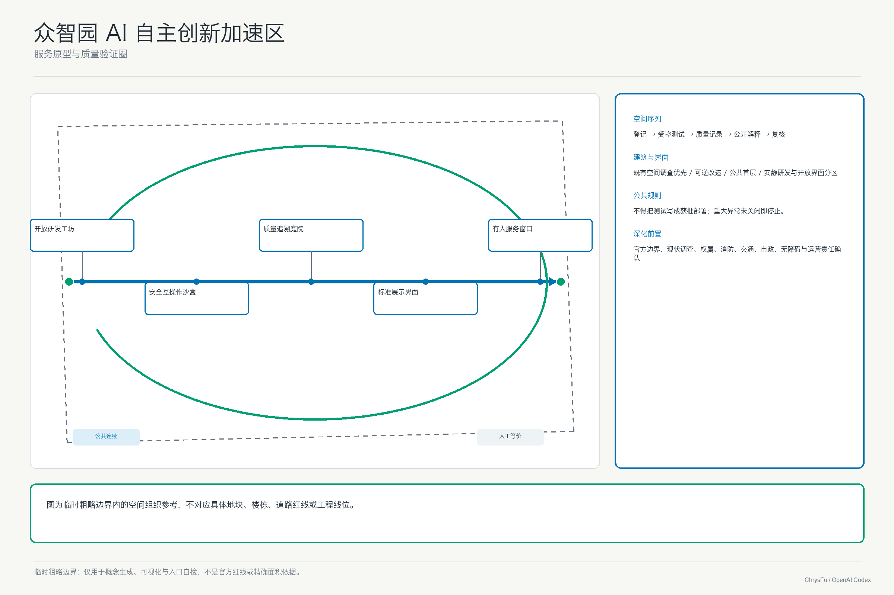

建筑动作仅建议对适合的既有空间开展适应性再利用调查，不指定具体楼栋，不给出拆改留结论。交通动作仅表达对外接驳、步行骑行和公共展示的关系，不形成道路工程线位。实施前置条件包括 official polygon、权属、现状建筑、消防、交通、生态与安全评估。[depth:three_key_area_detailed_design]

### 北京 AI 原点社区：近校人才生活与公共反馈圈

定位是让高校师生、开发者、初创团队、居民和国际访客在十五分钟日常生活中自愿体验服务，并能看到推荐依据、责任主体、反馈入口和退出方式。[data:geometry/key_areas.geojson#PROV-KEY-002] 空间结构建议为“近校协作站—人才日常需求站—自愿体验与退出台—公共反馈论坛—开源贡献荣誉带”。SCN-04 至 SCN-07 只使用公开服务目录、授权活动信息和自愿聚合反馈，不建立商业化个人画像。[data:geometry/public_space.geojson#SCN-04] [data:geometry/public_space.geojson#SCN-07]

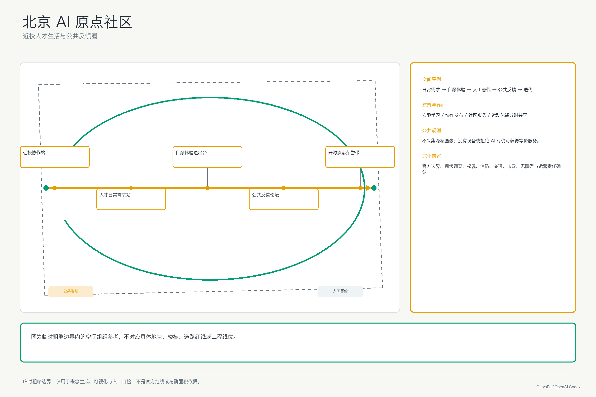

公共空间强调全天候但分级运营：安静学习、协作发布、社区服务、运动休憩和活动模式有不同时间与声环境规则。任何校园数据、科研成果、个人健康、消费或行为轨迹都不作为默认输入。数字入口必须有人工窗口和非数字替代。[depth:blue_green_public_space]

### 大钟寺 AI 产业聚集区：企业服务与规模转化圈

定位是把通过验证的服务原型转译为可对接企业、城市商务和公共消费的服务模块，同时保留运营复核和公众退出权。[data:geometry/key_areas.geojson#PROV-KEY-003] 空间结构建议为“轨道接驳概念联系—企业服务接口台—柔性服务城市客厅—规模转化复核台—贡献展示界面”。SCN-08 至 SCN-10 不指定企业、合作名单或供应商，也不提出投资、招商、营收或政府承诺。[data:geometry/public_space.geojson#SCN-08] [data:geometry/public_space.geojson#SCN-10]

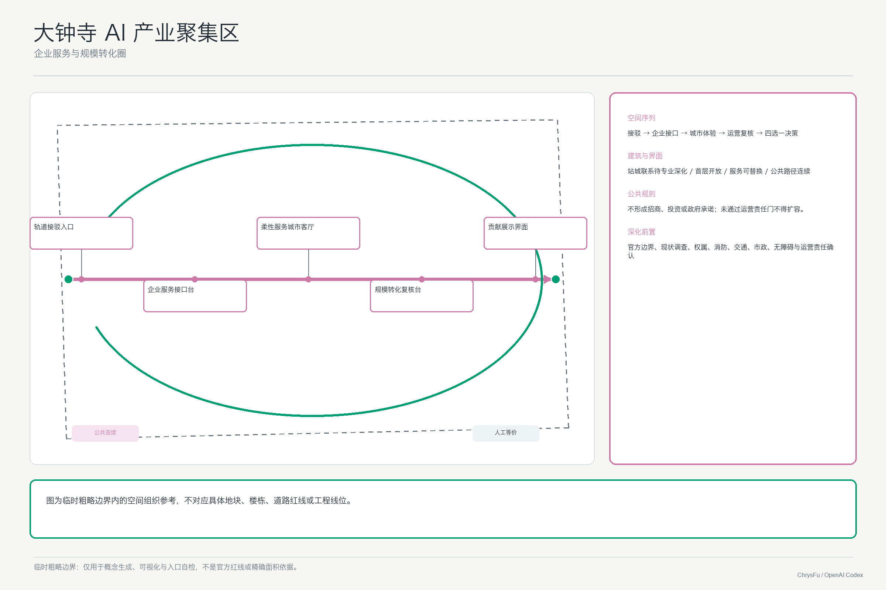

四象限步行连通、站城一体化、地下空间和交通组织均只提出问题框架，必须由轨道、交通、市政、消防、无障碍和权属专业资料深化。智能原生消费的重点不是炫技，而是透明推荐、质量追溯、服务可替换和纠纷可处理。

## AI 创新生态、人才画像与 AI+ 场景

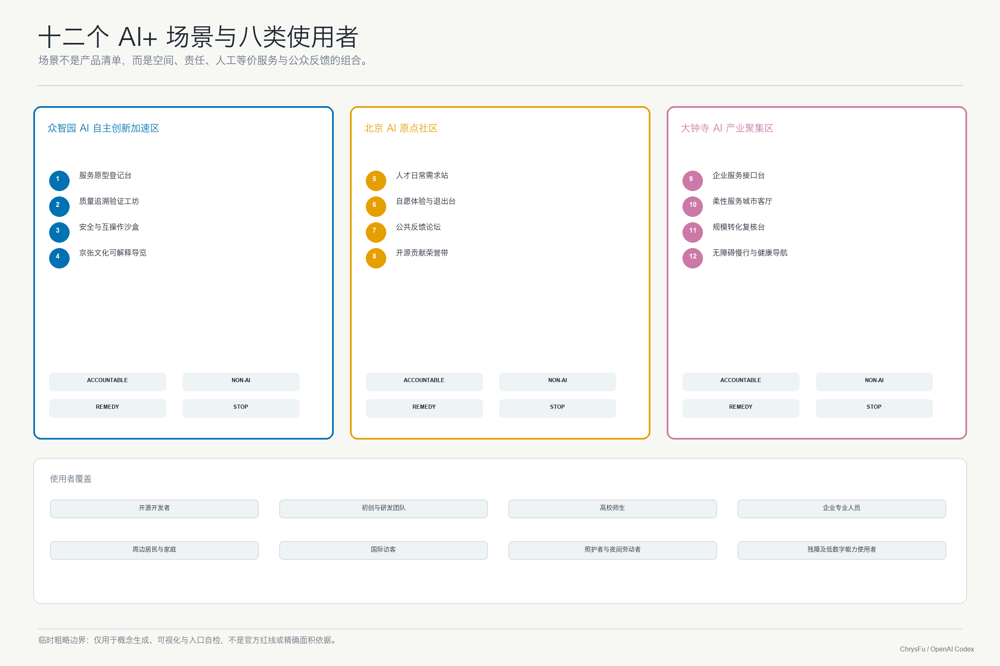

### 八类用户画像

| 画像 | 核心需求 | 空间与服务响应 | 数据边界 |
| --- | --- | --- | --- |
| 开源开发者 | 协作、发布、贡献被看见 | 原点协作站、开源荣誉带、活动路线 | 不追踪个人代码或行为；只展示自愿公开贡献 |
| 初创与研发团队 | 低门槛测试、合规与企业服务 | 众智园验证工坊、大钟寺企业接口 | 不提交企业专有数据、预测结果或合作主体信息 |
| 高校师生 | 成果转化、学习社交、近校生活 | 原点社区十五分钟生活圈 | 科研成果、校园和个人数据须另行授权 |
| 企业专业人员 | 商务接待、服务组合、人才交流 | 大钟寺城市客厅、公共轴活动节点 | 不建立商业个人画像，不指定供应商 |
| 周边居民与家庭 | 通勤、健康、休闲、社区服务 | 蓝绿轴、健康导航、人工服务窗口 | 不用居民画像做强制推荐或差异定价 |
| 国际访客与活动参与者 | 易懂导览、无障碍、可信信息 | 双语导视、文化导览、公共路线 | 只用公开策展与活动信息，事实人工复核 |
| 老年人、儿童照护者与夜间劳动者 | 低门槛、时段安全、可求助 | 有人值守窗口、夜间照明与休息节点、清晰求助路径 | 不以年龄、家庭或作息形成自动差别待遇 |
| 残障人士与低数字能力使用者 | 连续无障碍、非数字入口、可理解规则 | 无障碍路线、纸质/人工办理、易读说明与陪伴服务 | 拒绝 AI 或没有智能设备时仍获得等价服务 |

[metric:persona_count]

### 公共利益与无 AI 等价服务

公共利益不是单独的宣传章节，而是所有场景进入运营的共同门槛。12 个场景都必须满足以下五项保障，并在公共反馈论坛公开复盘；当前记录的是设计声明，运营覆盖率仍需试点证据验证。[metric:equity_safeguard_count] [metric:non_ai_equivalent_coverage_ratio]

| 保障 | 最低要求 | 可审计证据 |
| --- | --- | --- |
| 无 AI 等价服务 | 拒绝推荐、未携带设备或网络不可用时仍可办理 | 人工/纸质流程、等待时间与可用时段 |
| 无障碍与易读 | 路线、界面、语言和感官信息可被不同能力人群使用 | 现场审计、问题清单、修正记录 |
| 价格与机会公平 | 不按推断身份、设备能力或行为评分差别定价和排队 | 规则版本、抽样检查、申诉结果 |
| 数据最小化 | 默认不建立跨场景个人画像，不用无关数据换取服务 | 字段清单、保存期限、删除记录 |
| 纠错与救济 | 能找到责任主体、人工接管、投诉和复议入口 | 工单、响应时间、整改与关闭记录 |

### 从问题到空间触点的审查索引

`visual/assets/service_touchpoint_matrix.json` 把 12 个场景逐项压缩为“问题—待收集证据—空间回应—公共价值/验证”四段链，并把 G1-G5、责任角色、人工等价入口、救济渠道、停止条件与扩容门放在同一记录中。双语离线网页提供按众智园、AI 原点社区、大钟寺和公共轴筛选的键盘可操作审查界面；矩阵与界面均从既有场景节点和正文生成，不新增官方事实。[data:geometry/public_space.geojson#SCN-01] [metric:scenario_node_count]

| 空间单元 | 优先审查问题 | 触点与证据重点 | 概念验收门 |
| --- | --- | --- | --- |
| 众智园 | 原型是否回应真实需求，质量与安全是否可追溯 | SCN-01—03；需求、测试、异常关闭、专业复核 | G1 / G3 / G4 |
| AI 原点社区 | 自愿、退出、人工等价和公共反馈是否真实可用 | SCN-04—07；撤回、等待、纠错、版权与反馈记录 | G1 / G2 / G4 |
| 大钟寺 | 企业接口是否责任清楚，是否具备扩容证据 | SCN-08—10；目录、投诉、重大异常关闭与回退方案 | G1 / G3 / G4 / G5 |
| 京张公共创新轴 | 文化信息与无障碍导航是否经过事实和现场核验 | SCN-11—12；来源、版权、入口、过街、坡度和问题关闭 | G1 / G2 / G3 / G4 |

这是一套概念试点审查索引，不是审批流程。任何节点只要责任缺位、非 AI 等价服务失效、重大异常未关闭或救济不可用，就保持小规模、回退或退出；12 个节点的人工等价和责任角色是结构化设计声明，实际覆盖率保持 unknown，须由试点记录复核。[metric:non_ai_equivalent_coverage_ratio] [metric:accountable_role_coverage_ratio]

### 十二张场景卡

| 编号 | 场景 | 类型 | 位置 | 输入与人工复核 | 公共价值 |
| --- | --- | --- | --- | --- | --- |
| SCN-01 | 服务原型登记台 | **产业验证 1** | 众智园 | 自愿需求、最小字段；运营与合规人员复核 | 防止“先有技术后找场景” |
| SCN-02 | 质量追溯验证工坊 | **产业验证 2** | 众智园 | 测试记录、质量问题、责任链；专业复核 | 让服务结果可解释、可追责 |
| SCN-03 | 安全与互操作沙盒 | **产业验证 3** | 众智园 | 公开规范、合成测试、授权数据；安全人员复核 | 检查跨系统接口和退出机制 |
| SCN-04 | 人才日常需求站 | 公共服务 | 原点社区 | 自愿选择、聚合需求；人工服务台 | 识别真实日常缺口 |
| SCN-05 | 自愿体验与退出台 | 公共服务 | 原点社区 | 明示规则、同意与撤回记录；人工处理 | 保证拒绝 AI 后仍可获得服务 |
| SCN-06 | 公共反馈论坛 | 公共空间 | 原点社区 | 匿名或实名自选反馈；社区复核 | 把争议和改进纳入下一轮 |
| SCN-07 | 开源贡献荣誉带 | 文化/荣誉 | 原点社区 | 自愿公开贡献与策展文本；事实版权复核 | 让长期公共贡献被记忆 |
| SCN-08 | 企业服务接口台 | 企业服务 | 大钟寺 | 公开政策与服务目录；专业人员复核 | 降低企业寻找合规服务的成本 |
| SCN-09 | 柔性服务城市客厅 | 生活/商务 | 大钟寺 | 公开目录、现场选择；运营人员负责 | 让服务组合随时段和人群调整 |
| SCN-10 | 规模转化复核台 | 企业服务 | 大钟寺 | 试点记录、公众反馈、风险清单；多专业复核 | 防止未经验证直接扩大部署 |
| SCN-11 | 京张文化可解释导览 | 文化 | 公共轴 | 公开史料、人工策展；史实版权复核 | 连接铁路历史与 AI 新文化 |
| SCN-12 | 无障碍慢行与健康导航 | 公共服务 | 公共轴 | 公开服务信息、现场调研；交通医疗复核 | 降低人才与居民日常服务门槛 |

[metric:scenario_node_count] [metric:industry_validation_scenario_count] [metric:service_loop_stage_count]

推荐系统只可在“公开规则 + 用户明确选择 + 可解释结果 + 人工复核 + 可退出”条件下运行。公共空间不得采用以身份识别、过度监控或不可申诉评分为基础的体验。健康、法律、政策和安全相关输出只做导航或提示，不替代专业意见和行政判断。[source:SOURCE-REGISTRY]

每张场景卡还必须绑定五项实施字段：`accountable_role`、`non_ai_equivalent`、`redress_channel`、`stop_condition` 和 `expansion_gate`。这些字段写入 `geometry/public_space.geojson`，使“谁负责、如何拒绝、哪里投诉、何时停用、何时扩容”不再停留在说明文字中。[data:geometry/public_space.geojson#SCN-01]

### 四个 AI 朝圣与荣誉节点

1. **百年轨迹记忆门**：以时间轨迹和公开史料连接京张铁路历史，不使用未经授权的历史图片。
2. **原点开源论坛**：面向发布、协作、贡献展示和公共讨论，贡献者自愿署名。
3. **质量追溯瞭望台**：把安全、互操作、质量记录和责任链变成可理解的公共展示。
4. **全球贡献荣誉带**：记录长期公共知识、开源贡献与城市共创，不以商业排名替代公共价值。

四个节点是可逆公共空间组件和策展机制，不是大型地标建筑或确定建设项目。[metric:pilgrimage_honor_node_count]

## 证据审计、策略比较与空间模型深化（v1.4）

v1.4 以官方仓库 `main` 提交 `b153e17d414941ec299a517ef87c03686b9504f9` 作为 2026-08-11 的提交规则审计基线，并把 v1.3 作为只读派生起点。派生 QGIS 工程已按 EPSG:4548 打开：10 个报名包显示图层保持只读，10 个 PlanX 诊断图层默认隐藏并标记 provisional。QGIS/PlanX 的成功调用只证明工具链和概念设计网络可审计，不构成现状调查、官方可达性或工程绩效。[source:METHOD-QGIS-MCP] [source:METHOD-PLANX]

Geo MCP 对 9 个提交 GeoJSON 进行有效性检查，全部通过且无需修复；总体边界成功转换到 EPSG:4548。三处重点区质心和面积、300/500/1000 米欧氏缓冲、建筑原型区内关系、公共轴与三区相交关系均复核成功。[source:METHOD-GEO-MCP] [metric:geometry_validation_pass_ratio] [data:geometry/key_areas.geojson#PROV-KEY-001]

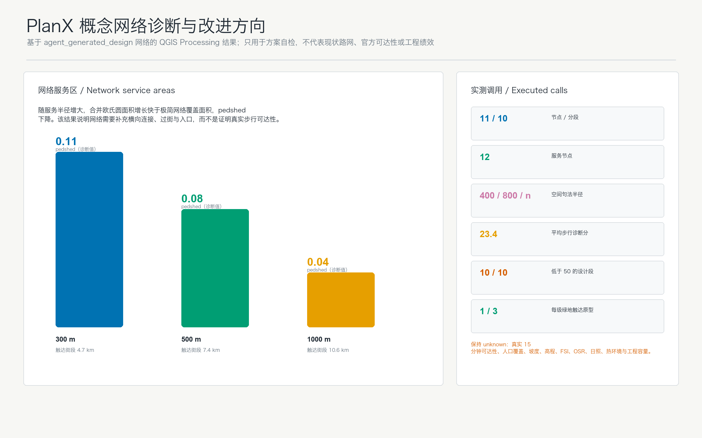

PlanX 在 `agent_generated_design` 网络上完成 11 个节点、10 个分段的网络准备，以及 400/800/全局空间句法、中心性、12 个服务节点的 300/500/1000 米服务区、步行性和绿地触达诊断。聚合 pedshed 约为 0.11/0.08/0.04，10 个设计段的步行诊断均低于 50；这只说明当前概念网络缺少横向连接、入口、过街和坡度证据，不能作为真实十五分钟可达性。建筑指标插件在 QGIS 3.34 上不兼容，FSI/OSR 因缺少已核验层数而未运行。[source:METHOD-PLANX] [metric:pedshed_ratio] [metric:fifteen_minute_network_coverage_ratio]

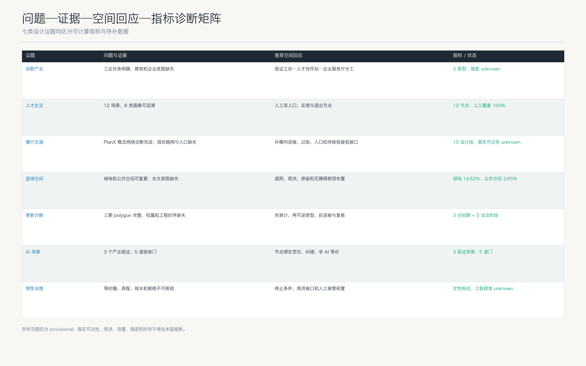

诊断覆盖创新产业、人才生活、慢行与公共交通、蓝绿公共空间、更新分期、AI 场景落位和韧性治理。能够由提交几何复算且不代表运营事实的指标保留为 known；人工等价与责任角色覆盖率、真实十五分钟可达性、pedshed、高程、树冠、雨洪、建筑强度和容量保持 unknown。[metric:fifteen_minute_network_coverage_ratio] [metric:stormwater_retention_volume_m3]

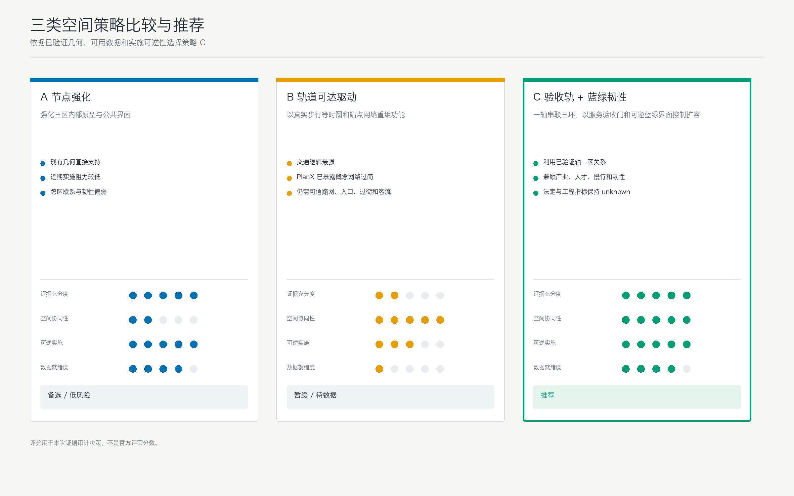

A 节点强化可实施性高但跨区联系偏弱；B 轨道可达驱动具有较强交通逻辑，但 PlanX 诊断暴露出概念网络过简，真实路网、入口、过街、坡度和 ORS 等时圈仍缺失；C 验收轨 + 蓝绿韧性利用已验证轴—区关系，以一轴串联三环、两翼和 12 个 AI/service nodes，并用五道验收门控制扩容，因此被推荐。比较分数不是官方评审分数。[data:geometry/public_space.geojson#SCN-01] [metric:ai_service_node_count]

彩色城市功能分析信息模型使用 BBBike 提供的 OpenStreetMap 公开数据保留研究带既有城市肌理，并按区位与体量进行程序化功能推断、立面细化和轴测渲染。功能色、窗格、店面和屋顶设备只服务于城市设计尺度表达，不是官方建筑用途、真实立面、法定高度、层数、结构、工程量或投资依据；正式报名包只包含中英共用渲染图，QGIS、Blender 与 GLB 源文件保留在本地派生交付目录。[source:PUBLIC-BBBIKE-OSM-BACKGROUND-20260810] [data:geometry/buildings.geojson#BLDG-001] [depth:height_massing_character]

OSM 背景探测返回铁路站点和地铁出入口要素；公园查询超时，主干路查询只返回 way 代表点而非可分析线几何。步行矩阵速度明显不合理，高程服务返回 HTTP 500，ORS 15 分钟等时圈缺少 API 密钥。这些结果只用于识别数据缺口，不进入正式指标。[source:PUBLIC-OSM-BACKGROUND-20260810] [metric:pedshed_ratio] [metric:elevation_range_m]

## 用地、建筑规模与拆改留方案

用地以 0802、1401、05、0702 四类代码构成完整拓扑分区；代码遵循仓库登记的国土空间用地分类参考，不自造法定分类。[standard:MNR-LAND-USE-CLASSIFICATION-GUIDE] 各分区面积仅用于校验 union、gap 和 overlap，不作为正式供地或比例结论。[data:geometry/land_use.geojson#LU-002]

建筑基底仅表达三类空间原型：验证工坊、人才生活协作站、企业服务与城市体验客厅。总建筑面积、容积率和道路面积保持 unknown：[metric:total_floor_area_sqm] [metric:floor_area_ratio] [metric:road_area_sqm]。建筑基底面积与密度只描述设计示意 polygon：[metric:building_footprint_area_sqm] [metric:building_density]。

拆改留采用“先调查、再分类、后决策”流程：建立建筑年代、结构、使用、权属、消防、能耗、文化价值与首层界面清单；再由专业团队确定保留、修缮、适应性再利用、更新或拆除。没有这些资料时，本方案不对任何具体地块或建筑给出结论。[depth:retain_renovate_demolish]

## 交通、轨道、市政与公共服务设施

京张公共创新轴优先服务步行、骑行、无障碍和公共体验；中关村科技服务翼与小月河场景赋能翼只表达概念联系；大钟寺站城接驳只表达换乘问题，不是道路或轨道线位。[data:geometry/roads.geojson#ROAD-001] [data:geometry/roads.geojson#ROAD-004] 提交中心线总长度仅用于图层复算，不等于批准道路长度。[metric:road_centerline_length_m] [depth:traffic_rail_slow_parking]

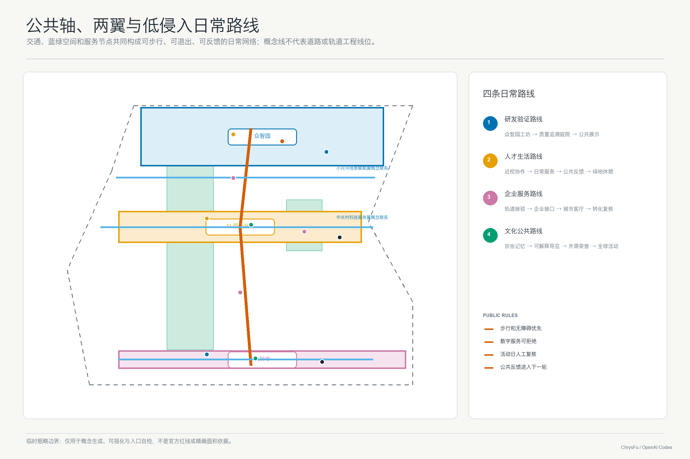

市政和新型基础设施采用“共享、可计量、可停用、有人负责”的原则。端侧算力、传感、充电、雨洪、照明和信息设施应优先结合既有设施和可逆设备；涉及能源负荷、管线容量、防洪、消防、网络安全和设备参数时必须另行专业测算，本方案不提供这些数值。[depth:municipal_new_infrastructure]

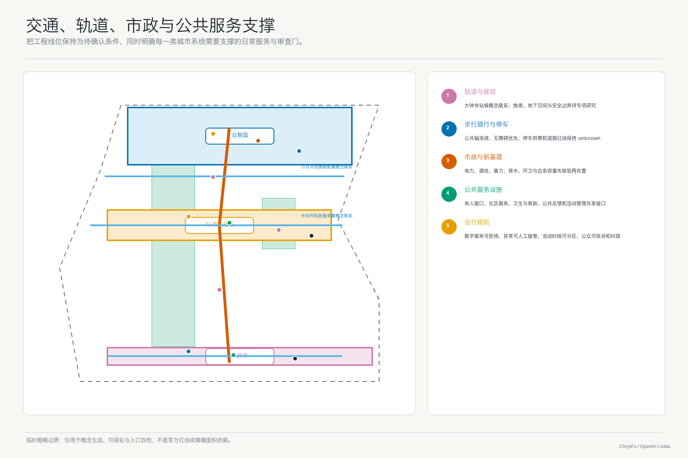

公共服务设施强调数字与人工双入口：AI 导航可降低检索门槛，但健康、法律、政策、安全与纠纷处理必须保留人工渠道。无障碍路线、夜间安全、儿童与老年人需求应在现场调研和公众参与后深化。

## 蓝绿空间、公共空间与城市风貌

蓝绿系统以京张连续公共轴为骨架，以三处公共空间节点和小月河场景赋能翼形成支线。提交绿地的面积与比例为 geometry 复算结果 [metric:green_space_area_sqm] [metric:green_ratio]；公共空间的面积与比例单独复算为 [metric:public_space_area_sqm] [metric:public_space_ratio]。它们不代表正式绿地率或公共空间指标。[data:geometry/green_space.geojson#GREEN-001] [data:geometry/public_space.geojson#PUBLIC-002]

公共空间组件包括可移动座椅、遮阴与雨棚、双语导视、人工服务窗口、可关闭显示界面、匿名反馈设施和活动电源接口。所有组件应满足无障碍、消防、文保、生态和公共安全要求，避免把公共空间变成持续监控或强制消费界面。[standard:MOHURD-URBAN-DESIGN-MEASURES] [depth:blue_green_public_space]

文化叙事沿“铁路工程—中关村创新—开源协作—可信 AI 城市”展开。城市风貌以清晰结构、耐久材料、可逆技术层和夜间低扰动为原则；生成内容必须标注，史实和人物机构叙述必须人工核查。整体 Logo 与文化标识分层使用，避免把企业商标或活动视觉误作城市公共标识。

### 百年京张叙事与国际活动体系

叙事主线从“自主修建一条铁路”推进为“共同验收一种城市服务”：铁路工程留下可测量的坡度、线路与结构，AI 城市则应留下可查询的规则、质量与责任。公共轴上的记忆门、质量瞭望台、原点论坛和贡献荣誉带分别对应历史约束、技术验收、公众讨论和长期贡献，使文化不只是导览文本，而成为服务治理方式。[metric:pilgrimage_honor_node_count]

年度活动采用四季循环：春季开放方法与开发者共创，夏季人才生活场景开放，秋季公共利益与风险复盘，冬季京张文化和国际交流。每次活动只在单独批准、安全、版权和责任条件成立后举办；公开成果是方法卡、问题清单和下一轮决定，不公布合作名单、预算或内部预测。

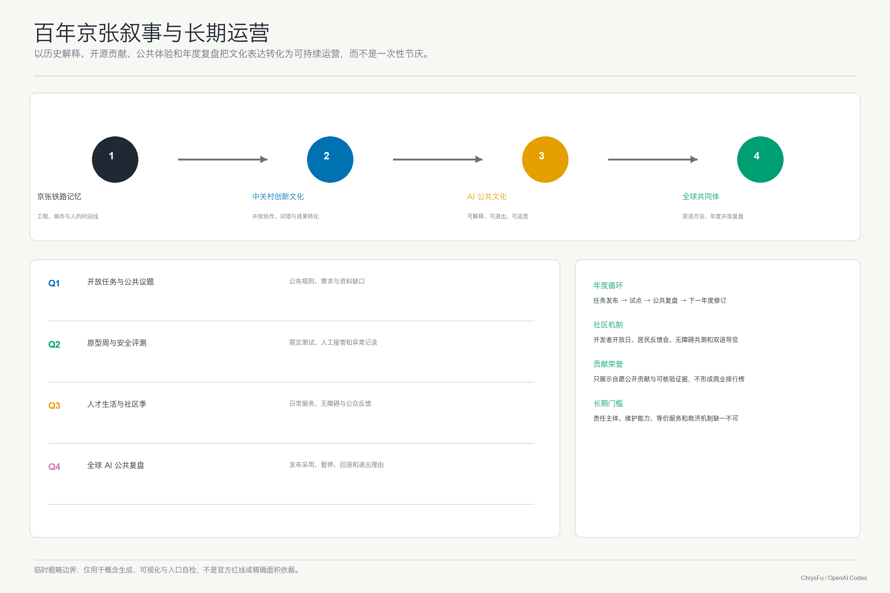

## 更新项目清单、实施政策与分期计划

| 项目 | 概念动作 | 依赖条件 | 可审计结果 |
| --- | --- | --- | --- |
| P1 公共服务闭环最小试点 | 需求站、人工窗口、反馈台、公开规则 | 场地许可、运营主体、隐私与安全评估 | 使用与退出记录、问题清单、改进决定 |
| P2 众智园验证工坊 | 原型登记、安全互操作、质量追溯展示 | 建筑与消防调查、测试规则、责任主体 | 测试记录、质量问题、是否进入下一阶段 |
| P3 原点人才生活圈 | 近校协作、日常服务、公共反馈、开源荣誉 | 校园与社区协调、活动和声环境规则 | 公共反馈、服务修订、非数字替代可用性 |
| P4 大钟寺企业接口 | 服务目录、城市客厅、规模转化复核 | 轨道交通、权属、企业与公众规则 | 服务接口质量、公众接受度、风险门结论 |
| P5 京张公共创新轴 | 慢行、蓝绿、文化导览、无障碍导航 | 道路、文保、生态、交通和市政复核 | 慢行问题清单、无障碍修正、史实复核 |
| P6 年度共创运营 | 开发者季、场景开放日、公共反馈月、国际交流周 | 独立审批、活动安全、版权、运营责任 | 公开复盘、贡献记录、下一年调整清单 |

项目包 P01-P12 的公开编号、空间抓手和五阶段安排见下图；它们是概念项目清单，不是建设项目、投资计划或政府承诺。

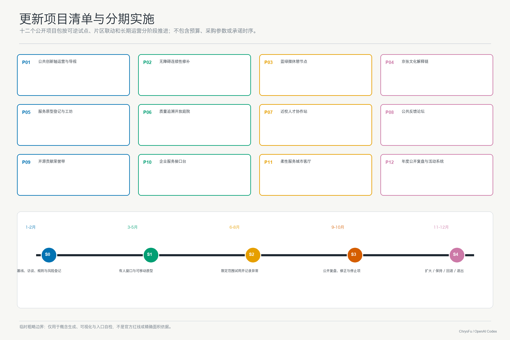

### 角色责任与扩容门

| 角色类型 | 必须承担的责任 | 不得替代的判断 |
| --- | --- | --- |
| 场景运营角色 | 公布服务规则、值守时段、非 AI 等价入口和停止条件 | 不得自行作出规划、医疗、法律或安全结论 |
| 数据与合规角色 | 审查字段、授权、保存期限、删除和访问控制 | 不得以合规名义扩大无关数据收集 |
| 空间与设施角色 | 检查无障碍、消防、交通、生态和设备可逆性 | 不得把概念图当作施工依据 |
| 社区与公众复核角色 | 组织反馈、记录争议、检查弱势群体影响 | 不得以少量活动参与者代表全部公众 |
| 独立专业复核角色 | 对质量、安全、扩容或退出给出书面意见 | 不得替代法定审批或政府决策 |

扩容必须同时满足 G1-G4，并由 G5 形成“扩大、保持、回退、退出”四选一结论。任何责任角色缺位、非 AI 等价服务失效、重大异常未关闭或公众救济不可用时，默认结论都是“不扩容”。[metric:accountable_role_coverage_ratio]

### 十二个月最小试点路径

| 阶段 | 月份 | 只做什么 | 退出/进入条件 |
| --- | --- | --- | --- |
| S0 基线与共识 | 1-2 月 | 场地与无障碍审计、需求访谈、规则草案、风险登记 | 资料或责任主体不足则不进入试用 |
| S1 可逆原型 | 3-5 月 | 一个有人值守窗口、一个非 AI 流程、一组可移动设施 | G1-G2 通过，投诉和退出路径可用 |
| S2 有限试用 | 6-8 月 | 在限定时段和范围运行，记录质量、异常和公平影响 | G3-G4 通过，重大问题关闭 |
| S3 公共复盘 | 9-10 月 | 公开问题、修正、停止项和未解决分歧 | 复盘材料完整才进入扩容讨论 |
| S4 扩容或退出 | 11-12 月 | 由 G5 决定扩大、保持、回退或退出 | 不以使用量或传播热度单独决定 |

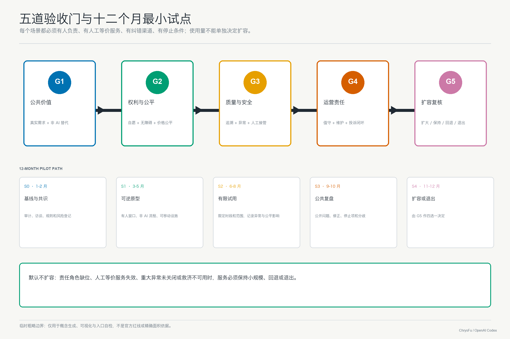

该路径不包含投资预算、采购参数、合作名单或政府开发时序。`changelog.md` 记录方案迭代，`risk.json` 记录可公开风险、触发条件和缓解责任；二者均不存放内部预测或未清权信息。[metric:pilot_stage_count]

分期不是政府开发时序。近期概念阶段优先可逆服务和验证节点；中期概念阶段连接三圈公共空间和企业接口；长期概念阶段再讨论轴翼协同和制度化迭代。阶段几何记录在 [data:geometry/phasing.geojson#PHASE-001]。近期与中期复算面积为 [metric:phase_1_area_sqm] [metric:phase_2_area_sqm]，长期复算面积为 [metric:phase_3_area_sqm]；实施深化边界见 [depth:phasing_implementation]。

年度活动体系建议采用“开发者与开源贡献季—人才生活场景开放日—公共反馈与可信 AI 月—京张文化与国际交流周”的循环。活动必须逐次审批并公开责任边界，不宣称已确定举办。开发者、企业、居民和专业团队的贡献进入可追溯 changelog；任何服务扩大部署前必须经过质量、公众和专业复核。[depth:renewal_project_list]

## 指标体系、面积复算与合规矩阵

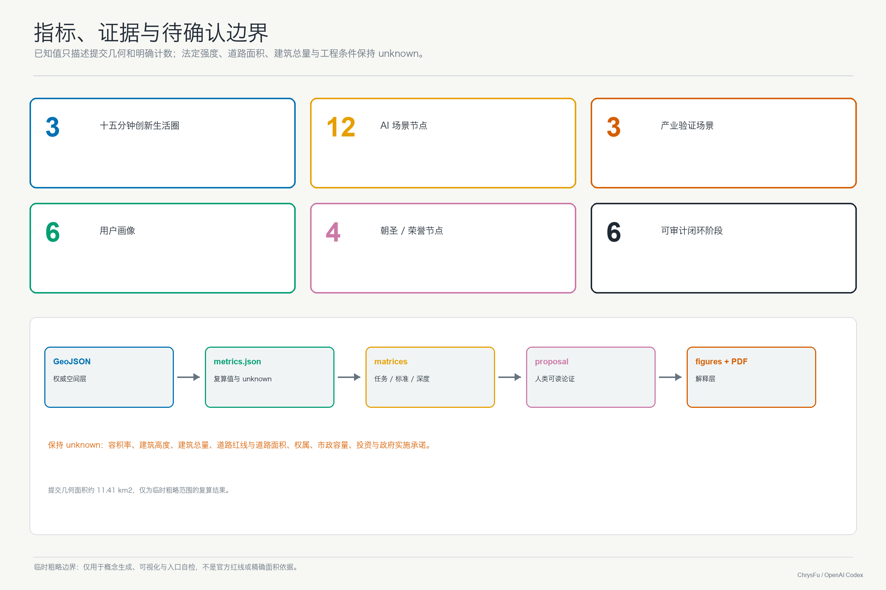

权威顺序为 GeoJSON、metrics、三类矩阵、manifest/sources/assumptions/self_check、proposal、图件、HTML、PDF。图件和网页是解释层，不能反向成为边界、面积或法定控制依据。[depth:metrics_recalculation]

known 指标分为三类：第一类是提交几何复算，包括总体边界、四类用地、建筑基底、绿地、公共空间、中心线和三期 polygon；第二类是明确计数，包括 3 个重点区、12 个场景、3 个产业验证、8 类画像、4 个荣誉节点、6 个闭环阶段、5 道验收门和 5 个试点阶段；第三类是公告约面积等背景事实。人工等价入口与责任角色是设计声明，不等同运营覆盖率，后者保持 unknown。总体面积与重点区计数由 [metric:site_area_sqm] [metric:key_area_count] 记录，场景与验收门计数由 [metric:scenario_node_count] [metric:service_acceptance_gate_count] 记录。unknown 指标包括建筑总量、容积率、道路面积以及所有缺少官方条件的工程与法定数据。

合规矩阵逐条覆盖公告 1.3、1.4、1.5 和 agent.1-agent.6；标准矩阵覆盖 mandatory 标准；设计深度矩阵覆盖现状诊断、三层范围、总体结构、用地、强度待确认、体量风貌、拆改留、交通、市政、蓝绿、三区、项目、分期、指标与风险。[depth:risk_missing_data]

## 风险、版权与合规说明

风险边界由待补官方控制条件包络和缺资料深度项共同记录：[data:geometry/constraints.geojson#CONSTRAINTS-001] [depth:risk_missing_data] [source:SITE-PACKAGE]。该 feature 只记录“缺少 official control geometry”这一事实，不是控制线或审批边界。

1. **几何风险**：SITE_BOUNDARY 和三个 KEY_AREA 均为 provisional rough geometry。正式 polygon 到位后必须全量复算，不能只替换图片。
2. **专业条件风险**：缺少控规、权属、建筑、市政、交通、文保、消防和工程条件，所有相关结论均保持概念层。
3. **数据与 AI 风险**：不默认采集个人画像；需求感知采用自愿、聚合、目的限定信息；推荐可解释、可纠正、可退出并保留人工渠道。
4. **运营风险**：服务、活动、招商、政策、资金与建设均无确定承诺；每项试点需要明确责任主体和独立审批。
5. **版权风险**：图件由本次结构化数据和自绘图形生成；不使用远程图片、地图瓦片、企业标识、人物肖像或未授权字体素材。
6. **公开边界**：仅提交商业模式层面的服务闭环、方法论与设计原则；不包含合作主体信息、概率推演、成本测算、配方、产品目录或设备参数。

`risk.json` 进一步登记八类公开风险维度：数据隐私、实施复杂度、公众接受度、运维能力、政策不确定性、空间争议、技术成熟度与公平包容。每个维度都包含风险说明、缓解动作；高风险项另列专业或公众复核路径。

本方案的中文与英文文件、图件、HTML 和 PDF 保持同章序、同指标、同证据与同风险边界。最终判断由人类、维护者和专业团队作出；本方案不声称官方批准、入选或已经实施。

## 参考资料

- 官方公告与本地参考快照：[source:OFFICIAL-ANNOUNCEMENT] [standard:PROJECT-OFFICIAL-ANNOUNCEMENT]
- 面向智能体任务书：[source:AGENT-TASKBOOK] [standard:PROJECT-AGENT-OPEN-CALL-TASKBOOK]
- site package、来源登记与事实包：[source:SITE-PACKAGE] [source:SOURCE-REGISTRY] [source:PROCESSED-FACT-PACK]
- 临时边界与重点区：[source:BOUNDARY-SOURCE] [source:KEY-AREA-SOURCE]
- 城市设计、控规与用地分类参考：[standard:MOHURD-URBAN-DESIGN-MEASURES] [standard:MOHURD-CONTROL-DETAILED-PLANNING] [standard:MNR-LAND-USE-CLASSIFICATION-GUIDE]
- 全球案例官方网页（创新城区与载体）：[source:CASE-ONE-NORTH] [source:CASE-STATION-F] [source:CASE-MARS]
- 全球案例官方网页（社区与园区运营）：[source:CASE-MARIA01] [source:CASE-HTCE] [source:CASE-KENDALL]
- 全球案例官方网页（大学创业网络）：[source:CASE-BLOCK71]
