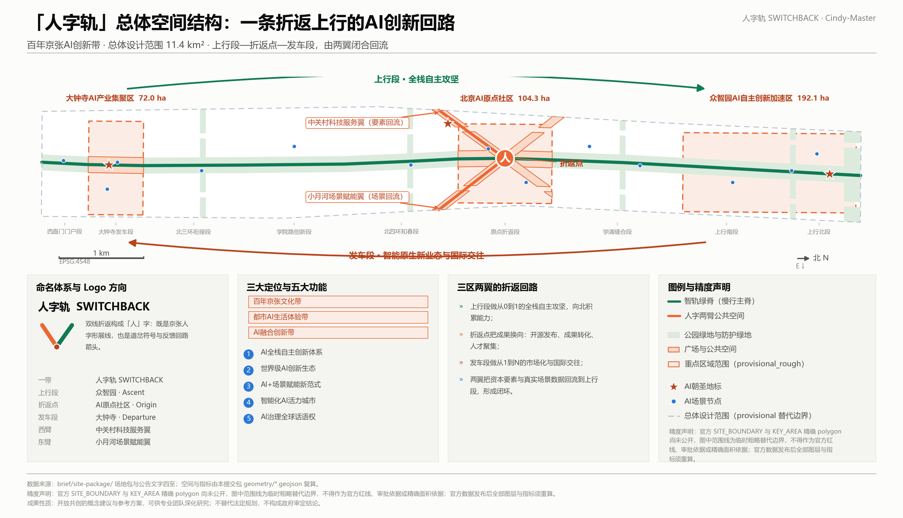
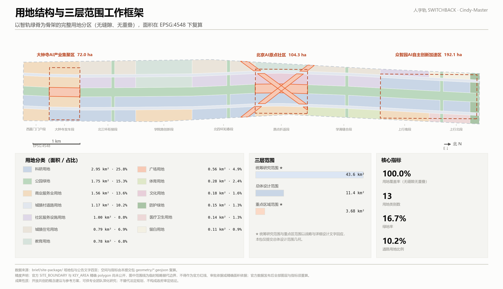
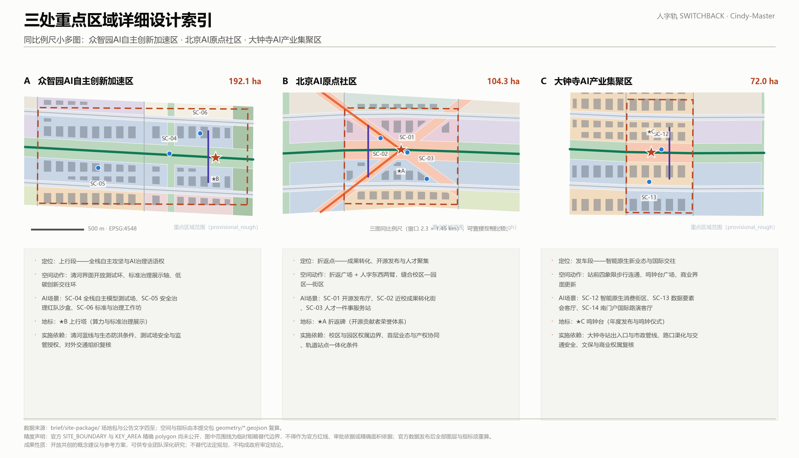
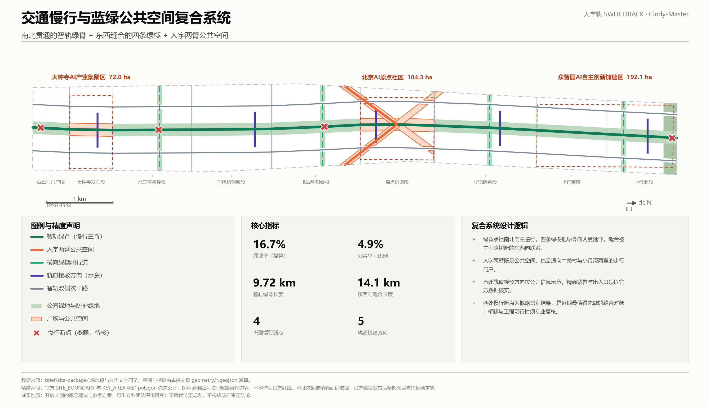
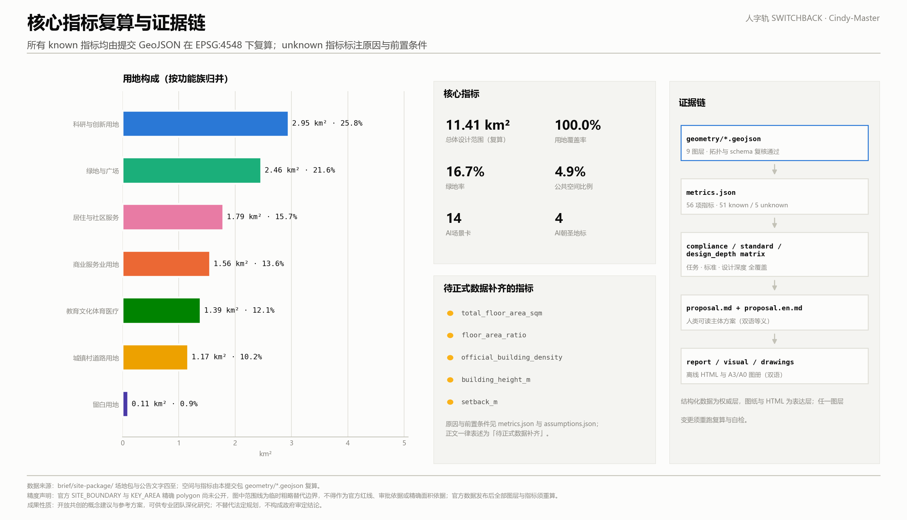

# 人字轨 SWITCHBACK · 百年京张AI创新带城市设计方案

## 设计依据与资料清单

本方案的第一依据是《百年京张AI创新带城市设计国际方案征集资格预审公告》确定的项目目的、三层范围、设计任务与成果深度，第二依据是面向全球智能体的开源征集任务书所提出的三大定位、五大功能、三区两翼与六项必选任务 [source:OFFICIAL-ANNOUNCEMENT] [source:AGENT-TASKBOOK]。两者的关系是：公告决定"必须回答什么"，智能体任务书决定"以什么身份、在什么边界内回答"。本方案据此把自己定位为可供专业团队深化研究的概念建议与参考方案，而不是替代法定规划的设计成果。

场地资料来自仓库登记的公开与清权材料。使用前逐条核对了资料可用性登记表，区分了可用于正式判断的材料、只能作背景参考的材料，以及只能用于临时生成与自检的 provisional 材料 [source:SOURCE-REGISTRY]。本方案没有把任何背景类或临时类材料升级为官方边界、法定控规条件或政府实施承诺；完整的来源、许可与限制记录保存在 `sources.json`，完整的指标、标准与设计深度覆盖分别保存在 `metrics.json` 与三个矩阵文件中，正文不重复抄录这些机器索引 [source:PROCESSED-FACT-PACK]。

必须首先说明一个精度事实：**官方的总体设计范围红线与三处重点区域精确 polygon 尚未公开**。因此本方案提交的 `geometry/site_boundary.geojson` 与 `geometry/key_areas.geojson` 使用仓库提供的临时粗略替代边界，全部标注为 `official_boundary=false`、`geometry_role="provisional_constraint"`、`boundary_precision="provisional_rough"` [source:BOUNDARY-SOURCE] [source:KEY-AREA-SOURCE]。它们只能用于方案生成、可视化、设计讨论与本地自检，不得作为官方红线、审批依据或精确面积依据。本方案在 `EPSG:4548` 下复算的范围面积为 11.41 km²，与公告文字面积 11.4 km² 的偏差为 0.1%，这一偏差本身就是"临时边界"的证据，而不是对官方面积的修正 [metric:site_area_sqm]。官方数据发布后，用地、道路、绿地、公共空间、建筑、分期与全部指标都必须整体重算，而不是替换单个文件。

**同行复核与已知数据争议。** 本方案在提交前检索了仓库 Issue，两条与本方案空间前提直接相关的公开复核必须写进正文，因为它们会改变结论的适用范围。其一，社区用 OpenStreetMap 独立复核后报告：临时「总体设计范围」多边形与 OSM 测绘的京张铁路遗址公园**不相交，最近距离约 412.5 m**，而临时「统筹研究范围」与之完全吻合（上游 Issue #846，可复现）。其二，社区报告 `PROV-KEY-003`（大钟寺AI产业聚集区）的质心落在北京北站一带，**距大钟寺地铁站约 2.26 km**（上游 Issue #1029，可复现）。两条都尚未由官方 polygon 裁决，本方案不判定谁对，但必须说明它们对本方案意味着什么 [source:PEER-REVIEW-846] [source:PEER-REVIEW-1029]。

影响的分界很清楚。本方案的**设计逻辑是相对的**：上行、折返、发车与两翼回流描述的是走廊内部的相对位置与运行次序，因此即使整条走廊整体平移数百米，空间结构、用地分区拓扑、缝合策略与场景卡都仍然成立。但本方案的**绝对落位是不可靠的**：绿脊是否真正压在遗址本体上、鸣钟台与"大钟寺站前四象限步行连通"是否真的位于大钟寺站，都取决于官方 polygon。因此本方案把与大钟寺相关的空间动作绑定在**公告命名的重点区域**上，而不是绑定在当前这块临时多边形的坐标上；官方数据发布后，这些动作应随重点区一同重新落位，不需要重写设计逻辑 [data:geometry/key_areas.geojson#PROV-KEY-003]。

**命名重合与致谢。** 「人」字母题在本次征集中被广泛使用——社区公开统计显示已有 25 份以上方案采用人字形母题，其中 chucky1102 的「人字线 RENLINE」还使用了"折返 / Switchback"这一组词（上游 Issue #1119）。本方案沿用同一母题不是巧合，也不主张独占：京张人字形展线是公共的城市记忆，符号本就属于所有人。本方案主张原创的只有三件事：把折返几何转译为**上行—折返—发车—两翼回流的四段式创新回路**、把这条回路落成**拓扑完整的用地分区与七类设计图层**、以及把每一条结论接到**可复算的证据链**上。凡与他人重合之处，在此明确致谢并不主张优先权 [source:SWITCHBACK-PROTOCOL]。

## 三层范围工作框架

三层范围在本方案中不是三套并列图纸，而是一条从战略到落地的收敛链条。统筹研究范围（约 43.6 km²）回答产业生态与未来城市形态问题，成果是策略与机制，不提交几何；总体设计范围（约 11.4 km²）回答空间结构、城市更新与设施承载问题，是本包唯一提交完整几何的层次；重点区域范围（约 368.4 ha）回答三处片区的详细设计问题，成果是可继续深化的片区小方案 [depth:three_level_scope_framework] [source:SITE-PACKAGE]。

之所以只对中间一层提交完整几何，是因为统筹研究范围的结论主要是产业与治理机制，把它画成精确的用地分区反而会制造伪精度；而重点区域在缺少官方红线的条件下，只能表达设计方向而不能表达地块级结论。这个取舍在 `assumptions.json` 中记录为明确假设，并在官方数据到位后触发重算 [depth:existing_conditions_diagnosis]。

总体概念是**「人字轨 SWITCHBACK」**。京张铁路最著名的工程遗产是青龙桥的"人"字形展线：在坡度受限的条件下，列车不是硬爬，而是折返一次，用换向换取高度。这条一百多年前的工程逻辑与人工智能创新的真实逻辑高度同构——能力不是直线冲刺得来的，而是"研究—应用—反馈—再研究"折返若干次积累起来的。本方案把这条逻辑直接转译为空间结构：北段众智园是**上行段**，做从 0 到 1 的全栈自主攻坚；中段 AI 原点社区是**折返点**，完成成果换向、开源发布与人才聚集；南段大钟寺是**发车段**，做从 1 到 N 的市场化与国际交往；中关村科技服务翼与小月河场景赋能翼是**两条回流臂**，把资本要素与真实场景数据送回上行段，使整条带成为闭环而非单向走廊 [data:geometry/public_space.geojson#PUBLIC-001] [depth:overall_spatial_structure]。

| 层级 | 核心问题 | 本方案的回答 | 成果形式与数据落点 |
| --- | --- | --- | --- |
| 统筹研究范围 43.6 km² | 世界级AI创新生态如何组织 | 上行—折返—发车—回流的四段式创新回路，两翼提供要素与场景 | 策略与机制，不提交几何；覆盖记录见任务覆盖矩阵 |
| 总体设计范围 11.4 km² | 空间结构、城市更新与设施如何落图 | 智轨绿脊 + 双侧次干路 + 四条横向绿楔 + 人字两臂 | 完整用地分区与七类设计图层 [data:geometry/land_use.geojson#LU-001] |
| 重点区域范围 368.4 ha | 三处片区如何达到详细设计深度 | 分别形成定位、空间动作、AI场景、地标与实施依赖 | 重点区图层与片区小方案 [data:geometry/key_areas.geojson#PROV-KEY-002] |

## 统筹研究范围产业与未来城市研究

**总体概念、名称与命名体系。** 一带主名称为"人字轨"，英文名 SWITCHBACK，全称"百年京张·人字轨 AI 创新带"。命名体系统一采用铁路运行语法，使每一个空间对象在名字里就携带它在创新回路中的位置：上行段（众智园 · Ascent）、折返点（AI原点社区 · Origin）、发车段（大钟寺 · Departure）、西臂要素回流（中关村科技服务翼）、东臂场景回流（小月河场景赋能翼）。这套命名的价值不在于好听，而在于可扩展与可自解释——新增任意节点时，只要说明它在"上行/折返/发车/回流"四类角色中的位置，就能自动获得名称与在整体叙事中的坐标 [source:AGENT-TASKBOOK] [standard:PROJECT-AGENT-OPEN-CALL-TASKBOOK]。

**视觉识别与 Logo 方向。** Logo 由两笔折返笔画构成，同时可读作三层含义：汉字"人"（人本治理，智能体用于增强人的能力）、铁路道岔符号（京张工程遗产）、反馈回路箭头（AI 的迭代逻辑）。两笔采用不同颜色以区分"上行"与"回流"两种方向性。应用规范建议：主标识只用于一带整体，三区两翼使用同一折返笔画的角度变体作为子标识；文化标识系统（遗址导视、历史展示）与一带 Logo 系统分开管理，避免把文化标识当作品牌延伸。所有字体、图片、商标、人物肖像与企业标识必须清权后使用，本方案不附带任何未清权素材 [standard:PROJECT-AGENT-OPEN-CALL-TASKBOOK]。

**三大定位与五大功能的空间落位。** 百年京张文化带落在智轨绿脊的遗址界面与文化用地上；都市AI生活体验带落在两翼门户、场景节点与社区服务嵌入点上；AI融合创新带落在科研用地与产业服务界面上。五大功能与三区两翼的对应关系是：AI全栈自主创新体系与AI治理全球话语权落在上行段，世界级AI创新生态落在折返点，智能原生新业态落在发车段，AI+场景赋能新范式落在东臂，要素全球化配置落在西臂 [standard:MOHURD-URBAN-DESIGN-MEASURES] [data:geometry/land_use.geojson#LU-001]。

**全球AI创新生态案例借鉴。** 下列六个案例均为长期公开报道的城市创新区，本方案只提取其机制经验，不引用未经核实的产值、投资或企业数据。

| 案例 | 机制要点 | 对本方案的可转化经验 |
| --- | --- | --- |
| 英国伦敦 King's Cross 与知识区（Knowledge Quarter） | 铁路棕地与货运场站的长周期整体更新，与图书馆、高校、研究机构和企业总部共同形成知识集聚区。 | 与京张遗址最可比：把铁路遗存作为公共空间骨架而非障碍，用一个长期统一的开发与运营主体维持品质。 |
| 西班牙巴塞罗那 22@ Poblenou 创新区 | 以专门的规划工具把老工业用地转为知识活动用地，用容积与配套指标换取公共空间、保障住房与设施。 | 对本方案的启示是机制而非形态：城市更新需要一套可操作的用途转换与公共品对价规则。 |
| 新加坡 one-north 科技城 | 政府主导、单一开发主体统筹的研究—产业—居住—休闲混合园区，强调步行尺度与共享设施。 | 混合而非分区、共享而非自建，是高密度创新区维持活力的关键；可对应本方案的社区服务嵌入与共享测试设施。 |
| 法国巴黎 Station F 创业社区 | 在一座历史铁路货运建筑内部集中孵化器、加速器、企业项目与公共活动，形成单一巨型载体。 | 巨型单体的优点是密度和偶遇，缺点是与城市割裂；本方案选择把它拆成沿绿脊分布的节点网络。 |
| 加拿大蒙特利尔 Mila 与创新街区 | 以一所高校AI研究院为策源，带动周边街区形成研究、创业与公共讨论并存的城市界面。 | 研究机构的公共可达性本身就是城市资产；对应本方案的近校成果转化街与开源发布厅。 |
| 美国斯坦福研究园与沙丘路走廊 | 大学、研究园与风险资本在极短通勤距离内长期共存，形成人才与资本的高频交互。 | 要素的空间邻近度可以被设计；这正是本方案设置中关村科技服务翼作为“要素回流臂”的依据。 |

**区域创新协同。** 一带向北通过上行段与未来科学城、怀柔科学城的基础研究能力衔接，向南通过发车段与经开区的制造与场景落地能力衔接，向西通过要素回流臂接入中关村的资本、法务与知识产权服务，向东通过场景回流臂接入学院路高校群与小月河沿线的真实城市场景。这四个方向共同构成"研究—转化—制造—场景"的京津冀创新分工，本方案在空间上只负责把接口做清楚：每一个方向都有明确的门户节点、慢行接入与运营对接机制 [source:OFFICIAL-ANNOUNCEMENT]。

**国土空间规划创新思路。** 本方案提出的可继续研究的方向是"用途弹性 + 公共品对价"：在创新区内允许科研、商业服务与社区服务在一定比例内互转，条件是转换方按比例提供公共空间、共享测试设施或人才居住支持。这一思路来自巴塞罗那 22@ 的经验，但必须由具备法定资格的规划机构论证后才能进入控规，本方案不给出任何比例数值或容积奖励结论 [standard:MOHURD-CONTROL-DETAILED-PLANNING]。

## 总体设计范围城市更新与控规深度城市设计

总体设计范围的空间结构由四个要素叠合而成，它们共同构成"一脊、两路、四楔、两臂"的骨架。**智轨绿脊**是沿京张遗址走向的连续公园绿地，宽度约 190 m，南北贯通全长约 9.72 km，承担慢行主通道、遗址展示与AI公共空间三重职能；**双侧次干路**布置在绿脊两侧各约 320 m 处，把过境交通与慢行分离；**四条横向绿楔**在绿脊与两翼之间形成东西向连接，专门用来缝合被主干路切断的横向联系；**人字两臂**在折返点向西南与东南展开，是公共空间也是通向两翼的步行门户 [data:geometry/roads.geojson#ROAD-001] [depth:overall_spatial_structure]。

城市更新的总体框架采取"先接口、后腹地"的顺序。理由是：在缺少现状建筑普查、权属与控规条件的前提下，任何地块级的拆改留判断都不可靠，但公共空间接口、慢行连通与场景开放机制的判断是稳健的，且一旦做好就能为后续腹地更新创造条件。因此本方案把近期力量集中在折返段与发车段的公共空间与站点连通上，把腹地更新留到官方数据到位之后 [depth:renewal_project_list] [source:SITE-PACKAGE]。

用地分区覆盖了提交边界的全部面积，无缝隙、无重叠，用地覆盖率复算为 100.0%，共 13 类 [metric:land_use_coverage_ratio] [data:geometry/land_use.geojson#LU-001]。分区方法不是逐块手绘，而是用统一的切分线对提交边界做拓扑安全的整体剖分，因此相邻用地共享完全相同的边界坐标，这也是空间复核能够通过的原因 [standard:MNR-LAND-USE-CLASSIFICATION-GUIDE]。

建筑总规模、容积率与建筑高度**不在本方案给出结论**。这不是回避，而是两条硬约束共同决定的：其一，经批准的控规容积率、高度、密度与退线条件不在公开资料中；其二，面向智能体的任务书明确把容积率与建筑高度结论列为禁止事项。本方案因此只提交建筑基底的概念分布，并把相关指标在 `metrics.json` 中记为 unknown 并附原因与前置条件 [metric:floor_area_ratio] [depth:development_intensity_controls]。

综合承载能力评估同样受限于资料。市政管线、能源负荷、排水防洪、消防与交通容量数据均不可得，本方案只提出需要评估的清单与评估触发时点，不给出容量结论 [depth:municipal_new_infrastructure]。

## 重点区域详细设计

三处重点区域采用同一套小方案结构：定位、空间结构、建筑更新方向、交通慢行、公共空间、AI场景、实施依赖。三者在折返回路中承担不同角色，因此设计重点不同而不是简单复制 [data:geometry/key_areas.geojson#PROV-KEY-001] [depth:three_key_area_detailed_design]。

**众智园AI自主创新加速区（上行段，约 192.1 ha）。** 定位是全栈自主攻坚与AI治理话语权。空间结构上提出三个动作：沿清河界面组织一条开放测试环，把测试场地、端侧算力驿站与低碳能源展示串成可参观的环线；沿绿脊东侧组织标准治理展示轴，把通常封闭的评测与标准工作变成可预约、可旁听的城市界面；在片区内部保留一处战略留白，面向尚不可预测的AI基础设施需求 [data:geometry/land_use.geojson#LU-001]。建筑更新方向以研发与实验空间为主，但在缺少现状普查的条件下只表达基底概念分布。交通上依托清河方向的轨道接驳与双侧次干路，慢行以测试环与绿脊为主。AI场景为 SC-04 全栈自主模型测试场、SC-05 安全治理与红队评测沙盒、SC-06 标准与治理工作坊。朝圣地标为★B 上行塔。实施依赖包括清河蓝线与生态防洪条件、测试场的安全与监管授权、对外交通组织复核，这些都必须由专业团队另行论证。

**北京AI原点社区（折返点，约 104.3 ha）。** 定位是成果转化、开源发布与人才聚集，是整条带唯一的换向节点，也是本方案空间强度最高的地方。核心动作是折返广场与人字东西两臂：广场承担开源发布、荣誉展示与公众参与，两臂把校区、园区与街区在步行尺度上缝合，并向中关村与小月河两个方向打开门户 [data:geometry/public_space.geojson#PUBLIC-001] [data:geometry/public_space.geojson#PUBLIC-003]。建筑更新方向以文化展示、近校转化服务与人才居住配套为主。AI场景为 SC-01 开源发布厅、SC-02 近校成果转化街、SC-03 人才一件事服务站。朝圣地标为★A 折返碑。实施依赖包括校区与园区的权属边界、首层业态与产权协同、轨道站点一体化条件。

**大钟寺AI产业集聚区（发车段，约 72.0 ha）。** 定位是智能原生新业态与国际交往。核心动作是站前四象限步行连通、鸣钟台广场与商业界面更新：把被路口切碎的四个象限用连续步行系统重新连成一个可运营的整体，并以鸣钟台作为年度发布与国际路演的仪式性空间 [data:geometry/public_space.geojson#PUBLIC-002]。AI场景为 SC-12 智能原生消费街区、SC-13 数据要素会客厅、SC-14 南门户国际路演客厅。朝圣地标为★C 鸣钟台。实施依赖包括站点出入口与市政管线、路口渠化与交通安全评估、文物保护复核与商业权属核对。由于重点区 polygon 为 provisional，以上三处的结论只能作为方向性设计，不能作为地块级或工程级结论。

## AI 创新生态、人才画像与 AI+ 场景

本方案设定 6 类用户画像。画像是设计构造而非统计调查结果，作用是把"为谁设计"变成可检验的判断，并为每类人明确数据与治理边界 [metric:user_persona_count]。

| 画像 | 典型需求 | 空间响应 | 数据与治理边界 |
| --- | --- | --- | --- |
| P1 开源开发者与智能体贡献者 | 发布、协作、评测、社区声誉与可追溯贡献记录 | 折返广场开源发布厅、折返碑荣誉墙、夜间协作空间 | 不采集个人行为轨迹；贡献展示以公开仓库记录为准，需本人可撤回 |
| P2 初创团队创始人与早期工程师 | 低成本办公、算力入口、真实试验场、合规与融资通道 | 众智园测试场与端侧算力驿站、中关村科技服务翼要素窗口 | 算力、数据与场景开放须单独授权，不得默认接入 |
| P3 领军企业研发与商务人员 | 展示、洽谈、国际接待、招聘与供应链协同 | 大钟寺鸣钟台广场、南门户国际路演客厅、站前公共环境 | 企业标识、案例与影像须清权后使用；不得写成招商承诺 |
| P4 高校师生与青年研究者 | 成果转化、跨校协作、低成本试错与日常慢行通勤 | 近校成果转化街、校区—园区—街区缝合慢行、AI教育体验点 | 校园数据与科研成果须经授权；教育场景须保留人工教师主导 |
| P5 周边社区居民与通勤者 | 通勤连续性、日常服务、低扰动更新、无障碍与夜间安全 | 智轨绿脊与横向绿楔、社区服务嵌入点、AI+社区医疗导航 | 不将居民画像用于商业推荐；活动分级并保留安静时段 |
| P6 国际访客、投资人与媒体 | 可读的城市叙事、可参观的真实场景、可核查的公开信息 | 人字轨朝圣路线、四处朝圣地标、公共体验与导视系统 | 对外表述须区分投稿、评审、入选与已实施；不得暗示官方背书 |

AI+场景以场景卡形式给出，共 14 张，其中 3 张为AI产业测试验证场景。每张卡都必须回答同样的七个问题：落在哪里、服务谁、用什么数据、隐私边界在哪、谁做人工复核、谁来运营、主要风险是什么。凡是无法回答"人工复核由谁负责"的设想，本方案一律不作为场景卡提出 [data:geometry/public_space.geojson#SN-01] [metric:scenario_card_count]。

| 编号 | 场景卡 | 类型 | 折返协议状态 | 空间载体 | 服务对象 | 运行数据 | 隐私边界 | 人工复核 | 运营主体 | 主要风险 |
| --- | --- | --- | --- | --- | --- | --- | --- | --- | --- | --- |
| SC-01 | 开源发布厅 | AI+产业服务 | 绿·常态运行 | AI原点社区 · 折返广场 | 开源开发者、初创团队、高校课题组 | 公开仓库元数据、活动报名聚合统计 | 不采集个人轨迹；荣誉展示可由本人撤回 | 发布内容由社区管理员与场地运营方双人复核 | 开发者社区 + 公共空间运营方 | 发布内容合规与版权风险，需事前清权 |
| SC-02 | 近校成果转化街 | AI+教育与转化 | 绿·常态运行 | AI原点社区 · 近校界面 | 高校师生、技术经理人、法务与知识产权服务 | 公开专利与论文著录信息、公开政策条款 | 不接入校园内部系统；个人成果展示需本人同意 | 转化建议为参考意见，须由专业机构复核 | 高校技术转移机构 + 街区运营 | 权属与收益分配复杂，须先行明确规则 |
| SC-03 | 人才一件事服务站 | AI+生活服务 | 绿·常态运行 | AI原点社区 · 东侧服务界面 | 新引进人才、外籍研究者、随迁家属 | 公开办事指南与政策文本 | 材料本地暂存、办结即删；不做跨部门画像 | 所有结论以窗口人工确认为准 | 政务服务窗口 + 社区运营 | 政策更新滞后会导致错误引导，须版本留痕 |
| SC-04 | 全栈自主模型测试场 | 产业测试验证 | 黄·受控试点（virtual_evaluation） | 众智园 · 上行段测试环 | 芯片、框架、模型与应用企业，第三方评测机构 | 企业自带数据集与公开基准，不使用城市个人数据 | 测试区物理隔离，外部数据不出场地 | 测试结论须第三方复核后方可对外发布 | 公共测试平台运营方 + 行业组织 | 测试结论被误读为认证，须明确标注适用边界 |
| SC-05 | 安全治理与红队评测沙盒 | 产业测试验证 | 黄·受控试点（virtual_evaluation） | 众智园 · 标准治理展示轴 | 安全研究者、评测机构、监管观察员 | 合成数据与授权样本，禁止真实个人数据 | 全过程留痕、可审计、可撤销 | 高风险测试须监管观察员在场并人工中止权 | 安全评测机构 + 公共治理平台 | 攻击样本外泄风险，须封闭环境与保密协议 |
| SC-06 | 标准与治理工作坊 | AI治理话语权 | 绿·常态运行 | 众智园 · 上行北段 | 标准组织、企业代表、国际同行、公众旁听 | 公开标准文本与会议纪要 | 公开旁听区不录入个人信息 | 议题结论以标准组织正式程序为准 | 标准组织 + 一带运营机构 | 不得把研讨意见表述为已定标准 |
| SC-07 | 低速机器人配送试验环 | 产业测试验证 | 黄·受控试点（controlled_site） | 学清缝合段 · 绿脊试验环 | 机器人企业、物流运营方、园区与社区用户 | 试验环内的道路与障碍数据，行人以匿名计数处理 | 不做人脸识别；影像本地处理并限时留存 | 设远程人工接管与物理急停，事故须报备 | 试验环运营方 + 属地管理部门 | 与行人混行安全风险，须限速、限时、限区 |
| SC-08 | AI+社区医疗导航点 | AI+医疗 | 黄·受控试点（controlled_site） | 学清缝合段 · 社区界面 | 社区居民、老年人、慢性病人群 | 公开的医疗机构、科室与排班公开信息 | 不存储症状与身份信息；仅做导航与预约跳转 | 不提供诊断结论，一律引导至执业医师 | 社区卫生服务中心 + 社区运营 | 被误当作诊断工具，须显著免责与人工入口 |
| SC-09 | 绿楔无障碍慢行导航 | AI+交通 | 绿·常态运行 | 北四环知春段 · 绿楔 | 轮椅与婴儿车使用者、视障人士、夜行通勤者 | 公开道路与设施数据，志愿者众包坡道与断点标注 | 路径在端侧计算，不上传个人行程 | 无障碍结论须由残障用户代表定期实地校验 | 公园运营方 + 无障碍公益组织 | 数据陈旧导致误导，须设置反馈与失效标注 |
| SC-10 | 学院路AI教育体验点 | AI+教育 | 绿·常态运行 | 学院路创新段 · 教育界面 | 中小学生、大学生、教师、家长 | 公开课程资源与开放数据集 | 未成年人不建立个人档案，家长可查询与删除 | 课程内容由教师主导，AI仅作辅助 | 高校与中小学 + 科普机构 | 过度依赖工具削弱基础训练，须限定使用场合 |
| SC-11 | AI+法律与合规咨询驿站 | AI+法律 | 黄·受控试点（controlled_site） | 北三环衔接段 · 服务界面 | 初创团队、个体开发者、社区居民 | 公开法律法规、司法解释与政策文本 | 咨询内容不留存、不训练模型 | 仅提供信息检索，法律意见须执业律师出具 | 法律服务机构 + 公共法律服务平台 | 生成内容错误引用法条，须标注出处与时效 |
| SC-12 | 智能原生消费街区 | AI+消费 | 黄·受控试点（limited_real_street） | 大钟寺 · 发车段商业界面 | 消费者、内容创作者、智能终端与智能体企业 | 商户自愿提供的公开经营信息与聚合客流统计 | 默认不做个体识别；个性化须显式授权且可关闭 | 价格与推荐机制须可解释、可申诉 | 商业运营方 + 消费者权益机构监督 | 算法歧视与大数据杀熟风险，须定期第三方审计 |
| SC-13 | 数据要素会客厅 | AI+数据要素 | 黄·受控试点（controlled_site） | 大钟寺 · 东侧产业界面 | 数据供需双方、合规与审计机构 | 仅展示已登记、已授权、可审计的数据产品目录 | 不在场地内完成原始数据交付 | 每笔撮合须留痕并可追溯到授权文件 | 数据交易机构 + 第三方审计 | 权属与再流通边界不清，须以合同和登记为准 |
| SC-14 | 南门户国际路演客厅 | 国际交往 | 绿·常态运行 | 西直门门户段 · 南门户 | 国际团队、投资人、媒体、外事接待 | 公开的活动日程与参展信息 | 外宾信息按外事规定单独管理，不进入城市系统 | 对外表述须区分投稿、评审、入选与已实施 | 一带运营机构 + 会展服务方 | 夸大宣传风险，须以可核查公开信息为准 |

场景—空间—运营的映射关系在结构化数据中可以直接核对：每张场景卡对应 `geometry/public_space.geojson` 中的一个 `SCENARIO_NODE` 点，节点位置是概念建议而非审定选址 [data:geometry/public_space.geojson#SN-04]。三个产业测试验证场景（SC-04、SC-05、SC-07）集中在上行段与学清缝合段，理由是测试需要相对可控的边界条件与较低的人流密度；消费与国际交往类场景集中在发车段，理由是需要轨道可达性与商业密度支撑。

小月河场景赋能翼是本方案的东臂，作用是把真实城市场景（社区、校园、街道、河道）作为测试与反馈的来源，而不是把场景当作展示背景。公共体验路径由此形成：从南门户进入，沿绿脊北上，在折返点换向进入两臂，再回到绿脊继续北行至上行段——这条路径既是市民日常慢行路线，也是国际访客的朝圣路线 [data:geometry/roads.geojson#ROAD-002]。

**场景治理合约：采用社区「折返协议 Switchback Protocol v1.0」。** 本方案没有另造一套状态机，而是采用 chucky1102 / 人字线 RENLINE 贡献并以 CC-BY-4.0 授权开放的折返协议，作为全部场景卡的最小运营合约（上游 Issue #1119）。理由很直接：全场已有几十份方案各自发明状态机与时限，词汇不通导致机制无法横向比较；评审与后续运营团队需要的是一个统一接口，而不是又一套新词。协议规范文本版权归原作者，本方案按 CC-BY-4.0 署名使用，未复用其文本、图面、几何或 schema 结构 [source:SWITCHBACK-PROTOCOL]。

采用后，14 张场景卡按三色状态分为绿（常态运行）7 张与黄（受控试点）7 张：三个产业测试验证场景，以及数据要素、消费个性化、社区医疗与法律咨询等算法风险较高的场景，一律起始于黄色并逐级过门（虚拟评测 → 受控场地 → 有限真实街区）。红色状态在协议中不叫失败而叫"折返"——退回上一稳定状态并公示原因，这与本方案的空间概念同源：**折返不是失败，是有计划的重来**。协议的带级默认值（真人接管目标 ≤5 分钟、申诉 1 个工作日受理与 7 个工作日出结果、90 天公开复审、连续两轮未复审自动转红）全部沿用，并按协议要求声明：**这些时限是设计目标值，不是政府承诺**，正式时限须以运营协议为准 [depth:risk_missing_data]。

**治理边界的统一原则。** 所有AI场景遵循数据最小化、公开来源优先、可解释、可申诉、人工可中止五条原则；不得输出未经授权的个人画像，不得以场景开放之名收集城市个人数据，不得把测试场景表述为已批准运营 [source:AGENT-TASKBOOK]。

## 用地、建筑规模与拆改留方案

用地布局的基本逻辑是"绿脊居中、产业居东、生活居西"。科研用地集中在绿脊东侧，因为东侧腹地更连续、更适合成规模的研发与中试空间；居住与社区服务集中在西侧，靠近既有社区，便于低扰动嵌入；教育用地集中在学院路创新段与折返段，直接对接高校界面；商业服务业用地集中在南北两端的门户段与发车段，依托轨道可达性 [data:geometry/land_use.geojson#LU-001] [standard:MNR-LAND-USE-CLASSIFICATION-GUIDE]。

| 用地代码 | 用地类别 | 面积（km²） | 占总体设计范围 |
| --- | --- | --- | --- |
| 0802 | 科研用地 | 2.95 | 25.8% |
| 1401 | 公园绿地 | 1.75 | 15.3% |
| 05 | 商业服务业用地 | 1.56 | 13.6% |
| 1207 | 城镇村道路用地 | 1.17 | 10.2% |
| 0702 | 社区服务设施用地 | 1.00 | 8.8% |
| 0701 | 城镇住宅用地 | 0.79 | 6.9% |
| 0804 | 教育用地 | 0.78 | 6.8% |
| 1403 | 广场用地 | 0.56 | 4.9% |
| 0805 | 体育用地 | 0.28 | 2.4% |
| 0803 | 文化用地 | 0.18 | 1.6% |
| 1402 | 防护绿地 | 0.15 | 1.3% |
| 0806 | 医疗卫生用地 | 0.14 | 1.3% |
| 16 | 留白用地 | 0.11 | 0.9% |

**建筑规模与拆改留必须写成待确认事项。** 本方案提交的 `geometry/buildings.geojson` 共 142 个建筑基底，合计 0.82 km²，占范围的 7.2%。必须明确：这只是**拟更新与新建基底的概念示意**，不包含现状建筑普查数据，因此它既不是现状建筑密度，也不是规划建筑密度 [metric:proposed_building_footprint_ratio] [data:geometry/buildings.geojson#BLDG-001]。真正的拆改留分类需要现状建筑质量、权属、结构安全与产权人意愿四类数据，其中任何一类缺失都足以让分类结论失效，因此本方案只给出方法而不给出结论 [depth:retain_renovate_demolish]。

建议的拆改留方法是四步：先按建筑质量与结构安全筛出必须处理的对象，再按权属复杂度分级排序，再按其在折返回路中的功能价值判断优先级，最后按产权人意愿确定推进节奏。这一方法可以在官方数据到位后直接套用，不需要重构方案 [depth:height_massing_character]。

## 交通、轨道、市政与公共服务设施

交通策略的核心判断是：这条走廊真正的问题不是纵向不通，而是**横向被切断**。南北向有遗址廊道可以贯通，东西向却被多条主干路和铁路切成若干段，导致两侧地块虽然相邻却互不可达。因此本方案把交通投入的重点放在横向缝合上，而不是新增纵向通道 [depth:traffic_rail_slow_parking] [data:geometry/roads.geojson#ROAD-006]。

具体组织为四层：智轨绿脊承担南北向主慢行；双侧次干路承担机动车集散并把过境交通与慢行分离；九条横向支路与四条绿楔骑行道承担东西向缝合，合计长度约 14.1 km；五处轨道接驳把绿脊与既有轨道站点方向连接起来 [metric:transverse_branch_length_m]。需要特别说明：轨道站点的方位来自公开信息推断，精确站位、出入口与换乘组织必须以官方数据核实，本方案中的接驳段只表达方向而不表达线位 [metric:transit_connection_count]。

本方案在 `geometry/constraints.geojson` 中标注了 4 处主要慢行断点（北五环、北四环、北三环与西直门外大街方向），它们是近期最值得优先处理的缝合对象。但断点的跨越方式——地面过街、下穿还是上跨——涉及桥隧工程可行性、结构安全与管线条件，必须由专业团队另行论证，本方案只提出位置与功能诉求 [data:geometry/constraints.geojson#CON-02]。

市政与公共服务方面，本方案提出把新型基础设施与传统市政统筹考虑：端侧算力驿站与社区服务、公共空间管理用房合建，分布式能源与绿地、屋顶资源结合布置，以降低独立选址成本。但能源负荷、管线容量、排水防洪与消防条件数据缺失，因此设施标准、服务半径与容量结论均列为正式深化的前置条件 [depth:municipal_new_infrastructure]。

## 蓝绿空间、公共空间与城市风貌

蓝绿与公共空间体系由智轨绿脊、四条横向绿楔、北五环沿线防护绿地与两处广场共同构成。绿地面积复算为 1.90 km²，绿地率 16.7%；公共空间面积 0.56 km²，占比 4.9% [metric:green_ratio] [metric:public_space_ratio]。绿地率的设计含义是：在一条以创新产业为主的走廊里保留六分之一的连续绿地，目的不是达标，而是让高强度工作人群在步行三五分钟内能进入连续的开放空间——这是人才留存的空间条件，也是"都市AI生活体验带"能够成立的前提 [data:geometry/green_space.geojson#GREEN-001]。

**文化叙事：从工程遗产到创新文化。** 京张铁路的文化价值不在于铁轨本身，而在于它记录了一种在约束条件下寻找解法的态度——詹天佑的"人"字形展线正是这种态度的物证。中关村创新文化的核心同样是"在受限条件下做出别人没做过的东西"。AI新文化则把这条线索延续到今天：开源协作、可复现、可被他人继续深化。三者不是并列展示的三段历史，而是同一种精神的三次表达。本方案因此不建议做"铁路主题公园"，而建议把遗址界面做成**可持续更新的叙事载体**：折返碑记录当代贡献者，上行塔解释当代基础设施，鸣钟台承担当代发布仪式，历史与当下在同一空间语法下对话 [standard:MOHURD-URBAN-DESIGN-MEASURES] [depth:blue_green_public_space]。

**导视、标识与符号系统。** 建议建立三层系统：一带级（折返笔画符号、统一色彩与字体规范）、片区级（三区两翼的角度变体）、节点级（场景卡编号与朝圣路线标识）。文化标识（遗址解说、历史信息）单独成系统，避免与品牌标识混淆。所有符号、字体与图像必须清权，历史照片与人物肖像未获授权不得使用 [source:AGENT-TASKBOOK]。

**AI公共空间与朝圣地标。** 本方案提出 4 处朝圣地标与荣誉展示节点。它们的共同要求是：必须承载真实功能而不是纯粹的打卡装置，必须可被公众进入，必须避免过度娱乐化，且都只是概念建议与位置建议 [metric:ai_landmark_count]。

| 地标 | 位置 | 设计意图 | 边界与清权要求 |
| --- | --- | --- | --- |
| ★A 折返碑 The Reversing Marker | AI原点社区折返广场 | 以京张人字形展线的折返几何为原型的公共构筑，表面为可更新的贡献者荣誉界面，记录进入公共知识库的开源贡献与智能体方案。 | 荣誉信息只取公开仓库记录，本人可申请撤下；不展示个人身份信息。 |
| ★B 上行塔 The Ascent Beacon | 众智园上行北段 | 面向公众解释算力、能耗与标准治理的展示构筑，把通常不可见的基础设施变成可读的城市对象。 | 展示数据须为可核查的公开或授权数据，标注口径与时间。 |
| ★C 鸣钟台 The Bell Platform | 大钟寺发车段 | 呼应大钟寺地名与钟声意象的发布台，作为年度成果发布与国际路演的仪式性公共空间。 | 与文物本体保持距离，形式、材料与照明须经文保与风貌复核。 |
| ★D 人字岔观景平台 The Switchback Junction Deck | 人字西臂与绿脊交汇处 | 跨越慢行断点的观景与折返平台，是理解“上行—折返—发车”整体结构的唯一制高观察点。 | 跨越形式、结构与工程可行性须由专业团队另行论证，本方案只提出位置与功能建议。 |

**公共空间组件库。** 为便于后续分期建设保持一致性，建议建立一套统一构件：折返几何的座椅与遮蔽单元、可更新的贡献者展示面板、场景卡标识牌、无障碍导视与夜间照明分级。组件库使不同时期、不同实施主体建成的空间仍然读作同一条带 [depth:blue_green_public_space]。

## 更新项目清单、实施政策与分期计划

更新项目清单共 12 项，按"先接口、后腹地"的顺序分为三期。分期是概念建议，不构成投资、审批或建设时序承诺 [metric:renewal_project_count] [data:geometry/phasing.geojson#PHASE-001]。

| 编号 | 项目名称 | 类型 | 分期 | 依赖条件与待确认事项 |
| --- | --- | --- | --- | --- |
| JZ-01 | 智轨绿脊主线贯通与遗址界面整理 | 公共空间 | 近期 | 遗址权属与文保要求、绿地与蓝线条件 |
| JZ-02 | 折返广场与人字东西两臂建设 | 公共空间 | 近期 | 校区与园区权属边界、地下管线 |
| JZ-03 | 开源发布厅与折返碑荣誉体系 | 产业服务/运营 | 近期 | 运营主体、内容治理规则、清权 |
| JZ-04 | 大钟寺站前四象限步行连通 | 轨道一体化/慢行 | 近期 | 站点出入口、路口渠化、市政管线、交通安全评估 |
| JZ-05 | 鸣钟台广场与商业界面更新 | 城市更新 | 近期 | 文保复核、商业权属、夜间噪声管理 |
| JZ-06 | 众智园开放测试环与端侧算力驿站 | 新基建/产业 | 中期 | 能源与算力容量、安全与监管授权 |
| JZ-07 | 清河创新界面与低碳交往环 | 蓝绿空间 | 中期 | 河道蓝线、生态与防洪条件 |
| JZ-08 | 南门户国际路演客厅与门户绿地 | 国际交往/公共空间 | 中期 | 用地条件、外事接待要求 |
| JZ-09 | 四条横向绿楔与骑行道缝合 | 慢行/生态 | 远期 | 主干路跨越方式、道路红线、工程可行性 |
| JZ-10 | 学院路与学清段社区服务嵌入 | 公共服务 | 远期 | 现状建筑与权属、社区意愿 |
| JZ-11 | 智轨双侧次干路与微循环组织 | 交通 | 远期 | 道路红线、交通影响评价、停车与非机动车组织 |
| JZ-12 | 人字岔观景平台与断点跨越 | 慢行/工程 | 远期 | 桥隧工程可行性、结构与安全论证（须专业团队另行研究） |

分期的空间范围记录在 `geometry/phasing.geojson`：近期 2.07 km²（折返段与发车段）、中期 2.95 km²（上行段与门户段）、远期 6.39 km²（衔接段与缝合段），三期合计覆盖提交范围 [metric:phase_coverage_ratio] [depth:phasing_implementation]。需要区分两个时间概念：征集周期是成果提交的时间要求，实施分期是城市更新的推进路径，两者不应混为一谈。

**实施政策建议**（均为可继续研究的方向，不构成已确定安排）：一是设立统一的一带运营主体，负责公共空间、场景开放与活动体系的长期运营，避免分段建设导致品质割裂；二是研究"用途弹性 + 公共品对价"的更新工具，由法定规划机构论证后进入控规；三是建立场景开放的申请、授权、审计与退出规则，使企业可以预期；四是把公众参与固定为分期评估的必要环节，而不是一次性听证 [standard:MOHURD-CONTROL-DETAILED-PLANNING]。

**全球AI创新活动体系与长期运营。** 活动不是宣传附属品，而是折返回路的时间机制：如果没有固定的换向节奏，上行段的成果不会自动流向发车段。

| 活动 | 频率与主场 | 运营内容与转化路径 |
| --- | --- | --- |
| 人字周（SWITCHBACK Week） | 每年一次，主场在折返广场 | 一带年度主活动：开源成果发布、朝圣路线开放日、标准与治理公开讨论、国际路演同期举办。 |
| 折返日（Reversing Day） | 每季度一次 | 成果换向日：把上行段的技术成果交给发车段的市场与国际渠道，形成固定的转化节奏。 |
| 场景开放日（Scenario Open Day） | 每月一次，轮换场景卡 | 按场景卡开放真实城市场景供申请测试，公开申请规则、隐私边界与人工复核要求。 |
| 开发者驻留（Developer Residency） | 常年滚动 | 面向开源开发者与智能体贡献者的短期驻留与工位支持，产出进入公共知识库。 |

**开发者社区与转化路径。** 建议的转化链条是：驻留与开放日吸引开发者 → 折返日把成果对接到企业与资本 → 人才一件事服务站解决落地生活问题 → 荣誉体系沉淀长期声誉 → 声誉吸引下一批开发者。每一环都必须有明确责任主体与可核查的公开记录，否则运营会退化为口号。所有招商、资金与政策安排在本方案中一律写为建议，不得表述为已确定事项 [source:AGENT-TASKBOOK]。

## 指标体系、面积复算与合规矩阵

指标体系共 56 项，其中 known 51 项、unknown 5 项。所有 known 指标都由提交的 GeoJSON 在 `EPSG:4548` 下复算得到，公式、来源文件、置信度与假设逐项记录在 `metrics.json`，正文只解释设计含义 [metric:site_area_sqm] [depth:metrics_recalculation]。

指标分为三类，处理方式不同。**第一类是可由提交几何直接复算的空间指标**：范围面积、各类用地面积、绿地率、公共空间比例、道路用地比例、建筑基底面积、分期面积。它们的可靠性只受边界精度影响，因此在官方边界发布后需要整体重算 [metric:land_use_coverage_ratio]。**第二类是需要官方控规支撑的管控指标**：容积率、建筑高度、建筑密度、退线、道路红线与设施标准。它们在本方案中一律为 unknown 并附原因，因为既没有依据也不在智能体成果边界内 [metric:floor_area_ratio]。**第三类是需要长期运营数据校准的绩效指标**：场景使用频次、活动参与度、慢行可达性、人才留存。它们不能在投稿阶段给出数值，只能给出监测方法与责任主体。

核心指标的设计含义可以逐条对读：绿地率 16.7% 支撑的是步行可达的日常开放空间，公共空间比例 4.9% 支撑的是创新交往与公共活动，道路用地比例 10.2% 只包含本方案表达的结构性路网而不含地块内部道路，因此不能与城市道路率直接比较 [metric:road_land_ratio]。

任务覆盖情况保存在 `compliance_matrix.json`：公告 1.3、1.4、1.5 各项任务与智能体任务书 agent.1 至 agent.6 全部有对应章节、图层、指标、图纸与 HTML 证据；专业标准覆盖保存在 `standard_matrix.json`；设计深度覆盖保存在 `design_depth_matrix.json` [standard:PROJECT-OFFICIAL-ANNOUNCEMENT] [standard:MOHURD-ARCH-DESIGN-DEPTH-2016]。

## 风险、版权与合规说明

**资料合法性与版权。** 本方案只使用公开或已清权资料，未使用任何未公开的地图数据、企业未授权数据、个人隐私数据或伪造的官方结论。图纸、HTML 与图册中的全部图形均由本方案脚本从提交的 GeoJSON 与指标生成，不含第三方图片、字体嵌入或商标素材；完整的权利与许可说明见 `report/copyright_statement.md` 与 `sources.json` [source:SOURCE-REGISTRY]。

**AI 生成责任。** 本方案由 AI agent 生成，对事实、来源、版权、空间数据、指标与表达承担说明责任。凡是无法从公开资料复核的判断，一律降级为待确认事项而不是保留为结论。

**待补资料与专业复核需求。** 主要缺口包括：官方总体设计范围红线与三处重点区精确 polygon；控规容积率、建筑高度、密度、退线；道路红线与交通影响评价；现状建筑质量、结构与权属；市政管线、能源、排水防洪与消防条件；文物保护范围与建设控制地带。这些缺口全部记录在 `assumptions.json`，并在 `geometry/constraints.geojson` 中有对应的空间标注 [data:geometry/constraints.geojson#CON-08] [depth:risk_missing_data]。

**官方与实施边界声明。** 本方案是开放共创的概念建议与参考方案，可供专业团队深化研究。它不替代法定规划，不构成政府审定结论，不代表任何审批意见、土地权属判断、投资承诺或建设时序安排。文中所有空间落地建议均应理解为"概念建议""参考方案""可供专业团队深化研究" [source:AGENT-TASKBOOK]。

## 参考资料

- 北京市规划和自然资源委员会海淀分局：《百年京张AI创新带城市设计国际方案征集资格预审公告》，项目目的、三层范围、设计任务与成果要求的第一依据。
- 面向全球智能体的《百年京张AI创新带城市设计开源征集任务书摘录》：三大定位、五大功能、三区两翼、六项必选任务与共创公约。
- 本仓库 `brief/site-package/`：设计任务书结构化摘录、用地与图层枚举、可设计空间约束、面积与控制值范围、校验 schema。
- 本仓库 `brief/site-package/geometry/provisional_boundaries.geojson` 及其推导说明：本方案提交边界与重点区范围的临时来源。
- 本仓库 `data/source_registry.json`：公开与清权资料的可用性登记，区分 formal-ready、background-only 与 provisional-only。
- 住房和城乡建设部《城市设计管理办法》与控制性详细规划相关技术要求：城市风貌、公共空间、用地与强度控制的专业依据。
- 自然资源部国土空间调查、规划、用途管制用地用海分类指南：用地分类代码依据。
- 国际城市创新区公开案例资料（伦敦 King's Cross、巴塞罗那 22@、新加坡 one-north、巴黎 Station F、蒙特利尔创新街区、斯坦福研究园）：机制经验参考，均为定性借鉴，未引用未经核实的数量数据。
- 完整机器索引见 `sources.json`、`metrics.json`、`compliance_matrix.json`、`standard_matrix.json` 与 `design_depth_matrix.json` [source:SITE-PACKAGE]。
