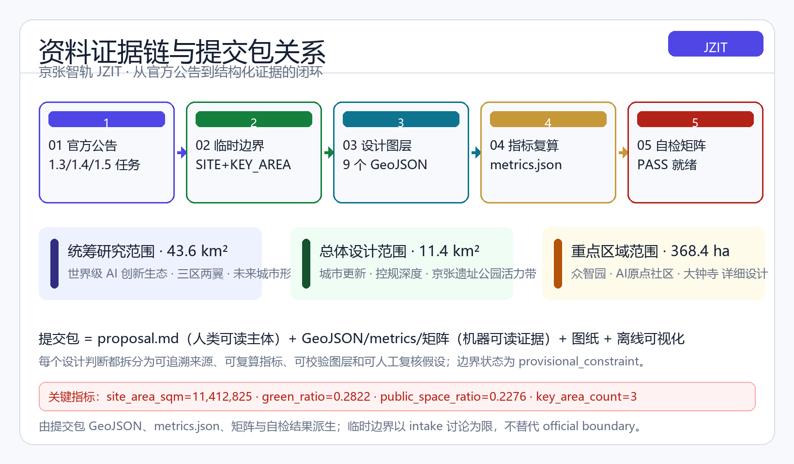
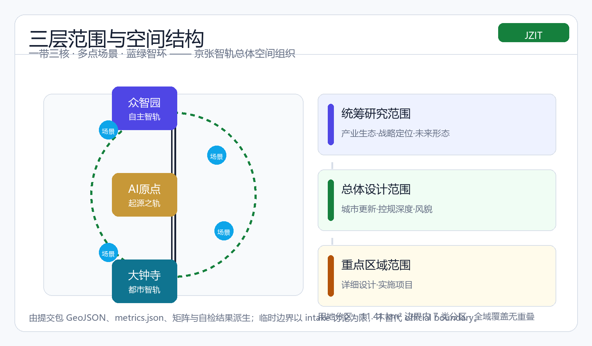
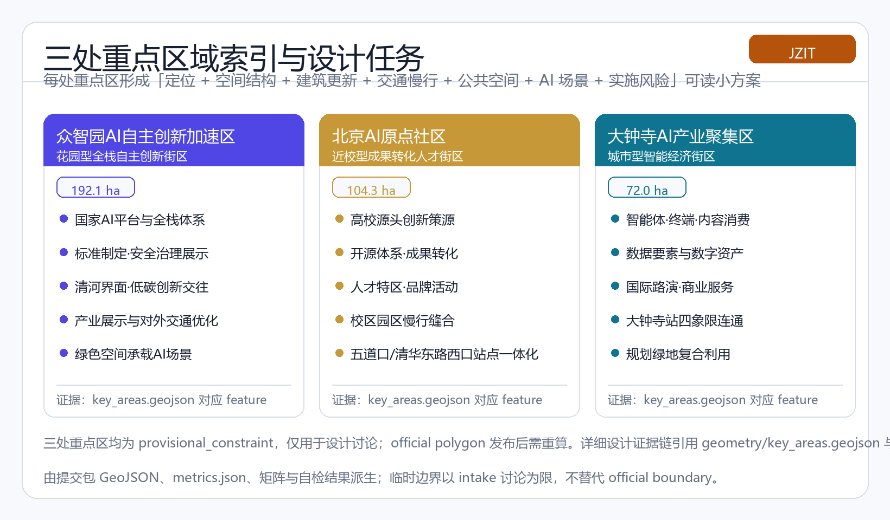
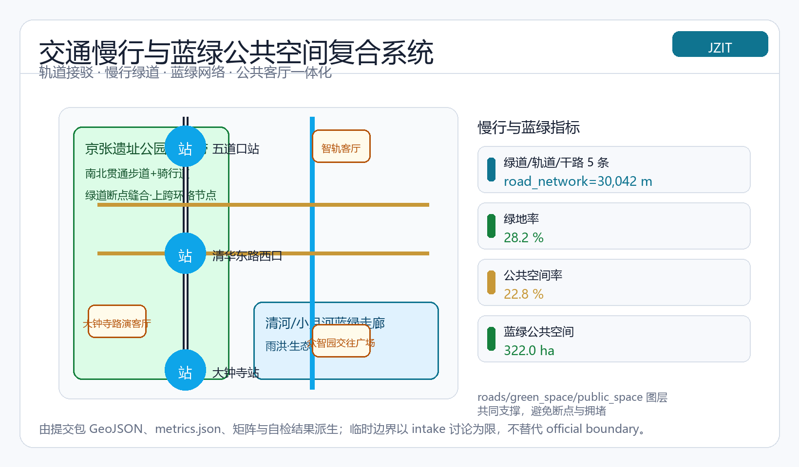
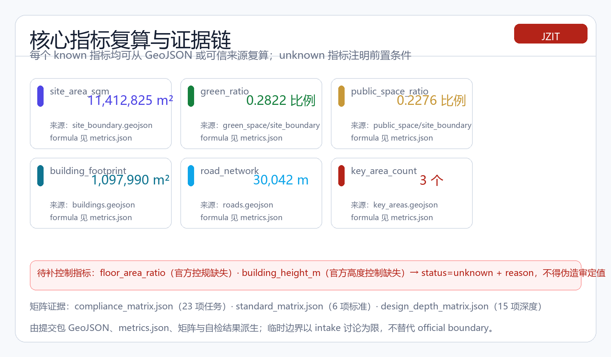

# 京张智轨：从百年钢轨到智能轨迹

## 设计依据与资料清单

本方案以北京市规划和自然资源委员会海淀分局发布的《百年京张AI创新带城市设计国际方案征集资格预审公告》为第一依据，该公告明确了项目名称、三层范围、设计任务与成果深度，是全部形式任务覆盖的主控文件 [source:OFFICIAL-ANNOUNCEMENT][standard:PROJECT-OFFICIAL-ANNOUNCEMENT]。面向智能体的开源征集任务书摘录补充了三大定位、五大功能、三区两翼、六项必选任务与十条共创原则，本方案的所有概念建议均按其边界条款表述为「概念建议、参考方案、可供专业团队深化研究」，不替代正式规划、不构成政府审定结论 [source:AGENT-TASKBOOK][standard:PROJECT-AGENT-OPEN-CALL-TASKBOOK]。站点包中的 `design_brief.json`、`allowed_design_space.json`、`enums/`、`ranges/planning_limits.json` 与各 schema 提供了机器可读的设计空间与校验规则 [source:SITE-PACKAGE]。

资料用途按公开来源注册表区分：官方公告与任务书为 formal-ready 依据，临时边界为 provisional_only 依据，处理资料包仅为阅读导航层 [source:SOURCE-REGISTRY][source:PROCESSED-FACT-PACK]。本方案采用的三层范围与三处重点区几何来自仓库维护的临时粗略 polygon，标注为 `provisional_constraint`，仅用于方案生成、展示与自检 [source:BOUNDARY-SOURCE][source:KEY-AREA-SOURCE]。提交包内所有设计图层均在本边界内派生，面积采用 EPSG:4548 投影复算 [metric:site_area_sqm]，并受 `design_depth_matrix.json` 中 [depth:existing_conditions_diagnosis] 与 [depth:metrics_recalculation] 约束。关键边界状态：**临时边界，保留精度警示并待正式数据发布后复算；该组织方数据缺口不阻断内容评分**。

方案所有空间落地建议均以概念形式提出：不给出容积率、建筑高度、拆改留、道路红线或工程实施结论，凡缺少官方控规、权属、市政与文保条件的内容一律列为待确认事项，并在 `assumptions.json` 中登记 [depth:risk_missing_data]。资料登记与缺口清单对应 `missing_data_checklist.csv` 的导航内容，正文每个核心判断均通过 `[source:]`、`[standard:]`、`[depth:]`、`[data:]`、`[metric:]` 引用回溯到证据层，确保机器可解析、可空间审查、可视觉检查、可专业审计。

## 三层范围工作框架

方案按公告确定的三层次组织工作：**统筹研究范围**（约 43.6 平方公里）回答「世界级 AI 创新生态与未来城市形态如何组织」的产业战略问题 [standard:PROJECT-OFFICIAL-ANNOUNCEMENT]；**总体设计范围**（约 11.4 平方公里）以城市更新为抓手开展控规深度城市设计 [metric:site_area_sqm][depth:three_level_scope_framework]；**重点区域范围**（约 368.4 公顷）对众智园、北京 AI 原点社区、大钟寺三处片区开展详细设计 [data:geometry/site_boundary.geojson#SITE-001][data:geometry/key_areas.geojson#PROV-KEY-001][metric:key_area_count]。

三层范围是同一设计逻辑的逐级落实而非割裂图纸：统筹研究决定产业链与城市形态判断，总体设计把判断落实到更新项目、空间结构与设施承载，重点区域验证具体地块、建筑、交通、公共空间与 AI 应用场景的可实施性 [depth:overall_spatial_structure]。生成顺序严格遵循空间生成协议：先锁定边界与既有约束，再派生用地、建筑、道路、绿地、公共空间与分期图层，最后复算指标 [depth:land_use_layout][depth:phasing_implementation]。

当前三层范围与三处重点区均为 `provisional_constraint`，其几何由维护者依据公告文字四至、位置线索与公告面积推定，矩形边不得解释为地块或道路红线 [source:BOUNDARY-SOURCE]。official polygon 发布后，site boundary、key areas、land use、roads、green space、public space、buildings、phasing 与 metrics 均需重算，本方案的面积与比例结论只能作为方向性设计参考 [source:KEY-AREA-SOURCE][depth:metrics_recalculation]。

本方案总体概念为「**京张智轨（Jing-Zhang Intelligence Track）**」：以京张遗址公园为历史与公共空间主轴（文化带），以众智园、AI 原点社区、大钟寺三处重点片区为创新锚点（创新带），以高校、企业、社区与轨道站点为日常网络（生活带），形成「一带三核、多点场景、蓝绿智环」的空间组织。「一带」不是新增红线，而是把公告三层范围转译为工作方法；「三核」对应三处重点区域；「多点场景」对应 AI+公共服务、产业服务与城市生活的可运营节点；「蓝绿智环」对应慢行、绿地、公共空间与活动路线的联动 [depth:blue_green_public_space][metric:green_ratio][metric:public_space_ratio]。

方案以「城市是有机生命体」为理论前提 [source:NDRC-CITY-AGENT-2026][source:WU-ZHIQIANG-2026]：把京张铁路的百年轨道转译为城市的「动脉」，把蓝绿智环理解为城市的「生态脉动」与「智能神经」，并将城市智能体的「感知—数据—计算—明律—应用」智慧链条落到具体空间节点，使创新带成为能够自我感知、持续进化的生命体式空间载体。该理论转译仅作为概念性设计主张，不改变任何控制性结论。

| 层级 | 设计问题 | 方案回答 | 数据落点 |
| --- | --- | --- | --- |
| 统筹研究范围 | AI 产业生态与未来城市形态如何组织 | 建立「高校策源—开源协作—企业转化—公共体验—国际传播」创新链 | [source:AGENT-TASKBOOK][standard:PROJECT-AGENT-OPEN-CALL-TASKBOOK] |
| 总体设计范围 | 产业空间、更新、交通市政与风貌如何落图 | 用地、建筑、道路、绿地、公共空间、分期图层共同表达 | [data:geometry/land_use.geojson#LU-001][data:geometry/roads.geojson#ROAD-001] |
| 重点区域范围 | 三处片区如何达到详细设计深度 | 分别提出定位、空间动作、AI 场景与实施依赖 | [data:geometry/key_areas.geojson#PROV-KEY-001][data:geometry/key_areas.geojson#PROV-KEY-002][data:geometry/key_areas.geojson#PROV-KEY-003] |

## 统筹研究范围产业与未来城市研究

统筹研究范围的核心任务是构建世界级 AI 创新生态体系。方案借鉴全球可公开检索的创新生态经验，形成五至八类可转化为空间与运营机制的模式：其一，硅谷-帕洛阿尔托的「大学策源+风险资本+持续创业」循环；其二，波士顿肯德尔广场的「研究机构+孵化加速+药械产业」密度集聚；其三，伦敦国王十字的「铁路棕地更新+知识经济园区」的遗产再利用；其四，新加坡纬壹科技城的「全链条园区+国际人才服务」的政府统筹；其五，特拉维夫-赫兹利亚的「军民融合+创业文化」生态；其六，深圳南山的「产业配套+终端制造+快速迭代」的工程化生态；其七，日本筑波科学城的「国家实验室+产研协同」的定向培育 [source:AGENT-TASKBOOK]。这些案例的共同启示是：创新生态需要「策源—转化—加速—产业化—国际交往」的完整回路，空间上表现为校区、园区、街区三者的高密度缝合与轨道站点的节点化支撑 [standard:PROJECT-AGENT-OPEN-CALL-TASKBOOK]。

海淀拥有清华、北大、中科院等原始创新策源，头部企业与独角兽聚集，且已提出「1+X+1」现代化产业体系 [source:SITE-PACKAGE][depth:three_level_scope_framework]。据 2026 年 3 月中关村论坛官方发布：海淀 AI 核心产业规模已超 3500 亿元、约占全国三成，创新带沿线集聚 30 余家高校科研院所、近 2000 家 AI 企业及 30 余家高能级平台，形成「全中国 AI 浓度最高的 9 公里」创新廊道（官方口径约 39.6 平方公里重点发展区域）[source:ZGC-FORUM-2026]。因此统筹研究的核心判断是：以「AI 全栈自主创新」为战略主线，呼应海淀「三区两翼」布局中众智园、AI 原点社区、大钟寺三区与中关村科技服务翼、小月河场景赋能翼的协同回路 [source:OFFICIAL-ANNOUNCEMENT]，并承接小月河翼具身智能产业园等已落地产业节点的空间需求 [source:ZGC-FORUM-2026]。方案提出五大功能的空间承载：AI 全栈自主创新体系落在众智园，世界级 AI 创新生态落在 AI 原点社区，AI+场景赋能新范式沿小月河翼展开，智能化 AI 活力城市由遗址公园与社区网络承载，AI 治理全球话语权通过标准、评测与展示节点表达 [standard:PROJECT-AGENT-OPEN-CALL-TASKBOOK][depth:overall_spatial_structure]。

**命名与 Logo 方向**：主名为「京张智轨」，英文为 Jing-Zhang Intelligence Track（JZIT），副题「从百年钢轨，到智能轨迹」。命名体系以「轨」为系：众智园对应「自主智轨」、AI 原点社区对应「起源之轨」、大钟寺对应「都市智轨」，活动体系命名「轨道系列」（开发者轨道、场景轨道、文化轨道），强调钢轨→智轨、工程自主→科技自主的百年演进 [source:AGENT-TASKBOOK]。Logo 方向：以詹天佑人字形展线为骨架，双轨化作两条并行的数据流，交汇节点隐喻神经网络，整体呈现「人字形展线 × 神经网络节点 × 双轨数据流」的几何语言，色板采用轨道钢青灰、创新靛蓝与百年铜金；该方向仅作为视觉识别建议，最终使用前需完成字体、图形与商标清权 [depth:height_massing_character]。未来城市形态方面，方案提出 AI 交通系统、连续绿色空间、创新服务设施与国际化生活工作氛围的功能区、节点、廊道与场景落位，不泛化技术愿景，所有运营性内容均表述为概念建议 [standard:MOHURD-URBAN-DESIGN-MEASURES][metric:landmark_count]。

## 总体设计范围城市更新与控规深度城市设计

总体设计范围要求达到控制性详细规划的城市设计深度 [standard:MOHURD-CONTROL-DETAILED-PLANNING]。方案以城市更新为抓手，识别京张遗址公园两侧低效空间与校区园区街区融合的潜力空间，提出「主轴缝合、三核点亮、蓝绿织网、站点耦合」的城市更新总体空间结构 [depth:overall_spatial_structure][data:geometry/land_use.geojson#LU-001]。产业功能布局沿南北分段组织：北段为众智园科研用地与五环门户，中段为 AI 原点社区科研教育用地与智轨客厅广场，中南段为大钟寺商业服务业用地，南段为人才住区与社区服务 [depth:land_use_layout][metric:green_space_area_sqm]。land_use 图层全域覆盖提交边界、无间隙无重叠，符合国土空间用地用海分类逻辑 [standard:MNR-LAND-USE-CLASSIFICATION-GUIDE][data:geometry/land_use.geojson#LU-001]。

城市更新总体框架强调「保留—改造—新建」的逻辑分层：对清华园火车站等文化资源与既有高校院落以保留与微更新为主，对低效产业空间与轨道站点周边提出更新引导，但所有拆改留判断均须在官方现状建筑、权属与控规条件确认后成立，本方案只给出方法框架与待校准清单 [depth:retain_renovate_demolish][metric:building_footprint_area_sqm]。方案提出区域规划建筑总规模的测算方法而非审定值：以建筑基底 [data:geometry/buildings.geojson#BLDG-001]、绿地与公共空间比例 [metric:green_ratio][metric:public_space_ratio] 为设计约束，总规模、容积率、建筑高度与密度列为 unknown 待补指标，避免以 agent 推测值冒充审定指标 [depth:development_intensity_controls][metric:floor_area_ratio]。

支撑 AI 发展的交通、轨道、市政与配套设施方面，方案提出围绕轨道站点一体化布局、改善道路微循环、组织慢行断点缝合、完善非机动车停放与停车供给，并探索分布式能源、端侧算力等新型基础设施与传统市政设施的融合路径 [depth:municipal_new_infrastructure][data:geometry/roads.geojson#ROAD-001]。借鉴「算力网将成为继水网、电网、通信网之后的新一代城市基础设施」的行业判断 [source:AI-CITY-FORUM-2026]，方案将端侧算力驿站与分布式能源节点作为「算力网」的空间化载体纳入新型基础设施体系，与轨道、市政管线等传统设施统筹布局，作为概念性深化方向提出。创新服务平台、人才生活服务与新型基础设施的体系与标准同样作为深化方向提出，管线、能源、排水、防洪、消防等工程资料缺失时一律列为正式深化前置条件 [depth:traffic_rail_slow_parking][source:SITE-PACKAGE]。京张遗址公园活力带作为总体设计的空间主轴，联动周边高校、企业与社区的出行需求，规划南北贯通、东西连通的步道骑行道与绿色空间体系 [data:geometry/green_space.geojson#GREEN-001][depth:blue_green_public_space]。

## 重点区域详细设计

重点区域详细设计是必选项，三处片区均需达到规划综合实施方案的城市设计深度 [standard:PROJECT-OFFICIAL-ANNOUNCEMENT][depth:three_key_area_detailed_design]。以下为各片区「定位 + 空间结构 + 建筑更新 + 交通慢行 + 公共空间 + AI 场景 + 实施风险」的可读小方案。

**众智园AI自主创新加速区**（约 192.1 公顷）定位「花园型全栈自主创新街区、自主智轨」[data:geometry/key_areas.geojson#PROV-KEY-001]。空间结构以清河界面为生态底景、以产业展示轴串联国家平台、标准制定与安全治理功能；建筑更新建议围绕低效产业空间提出功能置换与密度优化的深化方向 [depth:retain_renovate_demolish]；交通上结合五环路一体化规划提出对外交通优化方案，完善内部慢行与绿色出行 [depth:traffic_rail_slow_parking]；公共空间突出低碳绿色创新交往环境与绿色空间 AI 场景 [metric:green_space_area_sqm]；AI 场景包括自主模型测试、标准制定工作坊、安全治理展示与低碳算力体验 [source:AGENT-TASKBOOK]；实施风险为五环门户交通条件、河道蓝线与防洪要求待官方确认 [depth:risk_missing_data]。

**北京AI原点社区**（约 104.3 公顷）定位「近校型成果转化人才街区、起源之轨」[data:geometry/key_areas.geojson#PROV-KEY-002]。空间结构围绕高校原始创新策源组织成果孵化区与转化区，完善成果展示发布、居住生活配套与开源协作空间 [source:OFFICIAL-ANNOUNCEMENT]；建筑更新以低扰动、有机更新为原则，制定建筑拆改留的深化方法 [depth:retain_renovate_demolish]；交通上优化校区、园区之间的慢行联系，围绕五道口、清华东路西口轨道站点开展一体化设计 [data:geometry/roads.geojson#ROAD-001][depth:traffic_rail_slow_parking]；公共空间以近校成果转化街与开源发布厅为核心 [data:geometry/public_space.geojson#PUBLIC-001]；AI 场景包括开源社区、成果发布、人才特区服务与近校孵化 [source:AGENT-TASKBOOK]；实施风险为校区边界、权属与首层业态条件待确认 [depth:risk_missing_data]。

**大钟寺AI产业聚集区**（约 72.0 公顷）定位「城市型智能经济街区、都市智轨」[data:geometry/key_areas.geojson#PROV-KEY-003]。空间结构发挥领军企业牵引优势，围绕智能体、智能终端、内容消费等 AI 原生与 AI+ 融合赋能新业态组织产业集聚载体 [source:OFFICIAL-ANNOUNCEMENT]；建筑更新研判潜力地块用地功能与周边高校更新改造方向 [depth:retain_renovate_demolish]，并借鉴京张铁路遗址公园国际方案征集的工业遗产活化经验 [source:HERITAGE-PARK-JURY-2020]，对铁路折返段、焊轨厂、冷库等工业遗存提出「转盘剧场、运动公园、美术馆、路演厅」等复合活化方向，把铁路工业记忆转译为 AI 时代的公共文化界面；交通上优化大钟寺站一体化方案，开展地铁站所在路口四象限步行连通设计与非机动车停放组织 [data:geometry/roads.geojson#ROAD-001][depth:traffic_rail_slow_parking]；公共空间提升重点企业周边环境品质与商业服务业态，开展规划绿地复合利用设计 [data:geometry/public_space.geojson#PUBLIC-001][metric:public_space_ratio]；AI 场景包括智能体与智能终端展示、内容消费、数据要素合规流通与国际路演 [source:AGENT-TASKBOOK]；实施风险为轨道站点工程条件、绿地复合利用许可与数据要素政策待确认 [depth:risk_missing_data]。

三处重点区详细设计均引用 `key_areas.geojson` 对应 feature 与 `design_depth_matrix` 的 [depth:three_key_area_detailed_design]，因当前为 provisional 边界，所有面积、规模与拆改留结论只能作为方向性设计，official polygon 发布后需重算 [source:KEY-AREA-SOURCE][depth:metrics_recalculation]。

## AI 创新生态、人才画像与 AI+ 场景

方案建立面向 AI 人才与企业的空间需求画像，覆盖研发办公、开源协作、成果发布、企业服务、人才居住、社交学习、消费生活、运动休闲与国际交往 [source:AGENT-TASKBOOK][standard:PROJECT-AGENT-OPEN-CALL-TASKBOOK]。五类用户画像如下 [metric:persona_count]：

| 用户画像 | 典型需求 | 空间响应 | 自检边界 |
| --- | --- | --- | --- |
| 开源开发者 | 发布、协作、测试、社区声誉 | 原点社区开源发布厅、公共代码墙、夜间协作空间 | 不采集个人行为轨迹，活动数据只做聚合统计 |
| 初创团队 | 低成本办公、算力入口、产品试验场 | 众智园共享测试场、端侧算力服务点、标准治理咨询 | 算力和数据服务需另行授权 |
| 头部企业访客 | 展示、商务、国际接待、人才招聘 | 大钟寺国际路演客厅、轨道站点接驳、重点企业周边公共空间 | 企业标识和案例须清权 |
| 周边居民 | 通勤、休闲、社区服务、低扰动更新 | 京张遗址公园慢行环、社区服务嵌入、夜间照明和活动分级 | 不将居民画像用于商业推荐 |
| 高校师生 | 成果转化、跨校协作、日常慢行 | 校区-园区慢行缝合、成果转化驿站、AI 教育体验点 | 校园数据和科研成果需授权 |

方案形成 10 张结构化 AI 场景卡（见下表，字段对齐 `schema/scenario.schema.json`：tracks/users/context/data_inputs/public_value/risks/human_review），其中 3 张为 AI 产业测试验证场景 [metric:scenario_card_count]：01 开源发布厅（原点社区，成果发布与代码贡献展示）、02 安全治理沙盒（众智园，标准制定、模型红队测试与安全评测的展示与协作节点，属测试验证场景）、03 端侧算力驿站（总体范围节点，分布式能源与端侧算力原型，属测试验证场景）、04 AI 慢行导航（遗址公园，断点识别与无障碍导视）、05 大钟寺国际路演客厅（大钟寺，智能体与终端展示洽谈）、06 清河低碳创新廊（众智园，绿色空间与 AI 展示复合）、07 近校成果转化街（原点社区，孵化法务投融资服务）、08 数据要素会客厅（大钟寺，数据要素与数字资产合规界面）、09 AI 生活服务样板街（社区，AI+医疗、教育、法律与生活服务场景）、10 城市智能体沙盒（可控公共空间，交通/服务/运维智能体低速试点，属测试验证场景，须人工复核与风险提示）[source:AGENT-TASKBOOK][source:SITE-PACKAGE]。「全球 AI 活动周路线」归入年度活动与运营体系（见「更新项目清单、实施政策与分期计划」章节），不重复计入场景卡 [source:AGENT-TASKBOOK]。

| 卡ID | 场景（赛道） | 空间位置 | 服务对象 | 数据来源 | 公共价值 | 风险点 | 人工复核 |
| --- | --- | --- | --- | --- | --- | --- | --- |
| jzit-card-01 | 开源发布厅（ai-origin-community, jingzhang-heritage-narrative） | 原点社区近校成果转化街 | 开源开发者、高校师生 | 开源仓库公开元数据、社区活动公开记录、人流聚合统计 | 让开源贡献可见可感，强化开发者荣誉与社区声誉 | 场地许可；贡献者信息展示须本人同意；不采集个人轨迹 | 发布内容与贡献展示人工审核，个人信息逐项授权后公开 |
| jzit-card-02* | 安全治理沙盒（enterprise-services-ecosystem, civic-agent-governance） | 众智园AI自主创新加速区 | AI企业、科研机构、开发者 | 模型公开评测基准、标准工作坊公开纪要、测试结果聚合指标 | 模型安全治理可观察、可复核，支撑国家平台与标准制定 | 测试数据集须清权；结果不得误导为官方评级；细节脱敏 | 评测规则/数据集/结果由安全专家组人工复核，不替代监管审批 |
| jzit-card-03* | 端侧算力驿站（enterprise-services-ecosystem, ai-public-services） | 总体设计范围公共节点 | 初创团队、周边居民 | 算力使用聚合统计、能源消耗公开数据、服务申请记录 | 验证端侧算力与绿色能源可行模式，降低小微团队算力门槛 | 算力服务须授权合规；设备安全与运维责任；能耗数据脱敏 | 算力申请人工审核，试点结果由运营方与专家评估后决定是否推广 |
| jzit-card-04 | AI慢行导航（ai-traffic-walkability, jingzhang-heritage-narrative） | 京张遗址公园 | 周边居民、访客 | 公园公开路径信息、无障碍设施台账、人流聚合热力 | 改善慢行连续性与无障碍可达性，放大遗址公园公共价值 | 导航建议须人工复核；热力仅聚合使用；不替代交通管理决策 | 断点识别与导视建议由公园运营团队复核，重大设施改造报审后实施 |
| jzit-card-05 | 大钟寺国际路演客厅（enterprise-services-ecosystem） | 大钟寺AI产业聚集区 | 头部企业访客、初创团队、国际投资人 | 活动公开报名数据、企业公开简介、场馆预约记录 | 领军牵引与中小团队路演汇聚为产业交往界面 | 企业标识与案例须清权；活动安全与场馆许可；内容脱敏 | 路演项目与展示内容由主办方人工筛选审核，商务信息经企业确认后发布 |
| jzit-card-06 | 清河低碳创新廊（ai-origin-community, enterprise-services-ecosystem） | 众智园清河界面 | 开源开发者、周边居民、AI企业 | 蓝绿空间公开台账、能耗碳排聚合数据、活动公开记录 | 绿色低碳与AI展示结合，提供低扰动创新交往场所 | 河道蓝线与防洪条件待确认；展示设施须清权；能耗数据脱敏 | 空间改造与展示内容由运营方与专业团队复核，蓝线内建设报批 |
| jzit-card-07 | 近校成果转化街（ai-origin-community） | 北京AI原点社区 | 高校师生、初创团队 | 高校公开成果目录、服务机构公开清单、孵化申请记录 | 缩短高校策源到企业转化的距离，激活近校人才街区 | 校园数据与成果授权；权属与首层业态待确认；不承诺成果 | 成果展示与转化服务由运营团队审核，涉校园信息经校方授权 |
| jzit-card-08 | 数据要素会客厅（enterprise-services-ecosystem, civic-agent-governance） | 大钟寺AI产业聚集区 | AI企业、数据服务商、政策研究者 | 数据要素公开政策、合规服务清单、活动公开记录 | 数据要素合规流通的公共界面，服务产业生态与治理规则共建 | 数据合规审查严格；不接触未授权数据；政策解读须权威来源 | 数据流通示范与政策解读由合规与法务团队复核，不替代监管 |
| jzit-card-09 | AI生活服务样板街（ai-public-services, youth-friendly-public-space） | 社区公共界面 | 周边居民、高校师生 | 公共服务公开目录、医疗教育机构公开信息、居民服务聚合反馈 | 让AI公共服务可感知、可导航、可反馈 | 医疗教育信息须权威；居民画像不用于商业推荐；导航须复核 | 服务信息与导航结果由主管部门与运营方人工复核，涉医疗建议标注免责 |
| jzit-card-10* | 城市智能体沙盒（civic-agent-governance, robotics-autonomous-mobility） | 可控公共空间 | AI企业、科研机构、城市治理者 | 试点区域公开运行数据、智能体运行日志聚合、公众反馈记录 | 验证城市智能体低速试点可行模式，建立公众可感知、过程可复核的治理样本 | 试点须审批与风险提示；不得表述为已批准运营；运行数据脱敏与安全 | 试点方案/运行参数/公众反馈由城市治理与安全专家组人工复核，试点结论不替代审批 |

\* = AI 产业测试验证场景（3 张：jzit-card-02、03、10）。

场景卡体系同时回应三个前沿方向：其一，**具身智能**——呼应海淀小月河场景赋能翼具身智能产业园布局 [source:ZGC-FORUM-2026]，将机器人配送、巡检、零售取货等具身智能低速试点纳入「城市智能体沙盒」与公共空间场景，与模型评测场景共同构成从信息空间到物理世界的验证链路；其二，**城市智慧链条的空间映射**——按「感知—数据—计算—明律—应用」的城市智能链条 [source:WU-ZHIQIANG-2026]，将五个环节落到具体空间节点：泛在感知（AI 慢行导航、公共空间热力）、数据治理（数据要素会客厅）、算力计算（端侧算力驿站）、标准明律（安全治理沙盒）、场景应用（各场景卡），使智能技术链条具备可落地的空间锚点；其三，**主动服务**——AI 公共服务从「人找服务」转向「服务找人」的主动服务模式 [source:NDRC-CITY-AGENT-2026]，以社区级智能体在养老、医疗、教育等领域主动识别需求并推送服务，同时严格守住个人信息保护、数据最小化与人工复核边界，上述均为概念建议，不构成已批准部署。

每张场景卡均按「空间位置—服务对象—数据来源—公共价值—风险点—人工复核」结构化登记（见上表），并映射到对应 GeoJSON 图层 [data:geometry/public_space.geojson#PUBLIC-001][data:geometry/roads.geojson#ROAD-001][data:geometry/green_space.geojson#GREEN-001]。AI 治理遵守数据最小化、公开来源、可解释与人工复核原则，城市智能体可辅助识别慢行断点、公共空间热力、设施维护、企业服务需求与活动安全风险，但不得替代规划审批、不得输出未经授权的个人画像、不得声称获得官方实施承诺 [depth:risk_missing_data]。产业测试验证场景不得表述为已批准运营，未成熟技术不得写成可全面部署 [source:AGENT-TASKBOOK]。

## 用地、建筑规模与拆改留方案

用地方案依据国土空间用地用海分类逻辑组织 [standard:MNR-LAND-USE-CLASSIFICATION-GUIDE]，`land_use.geojson` 完整覆盖提交边界、无间隙无重叠 [data:geometry/land_use.geojson#LU-001]。七类功能分区沿南北组织：科研用地（0802，众智园与原点社区两段）、公园绿地（1401，遗址公园带与社区绿廊）、商业服务业用地（05，大钟寺智能经济）、广场用地（1403，智轨客厅）、城镇住宅用地（0701，人才住区）、城镇村道路用地（1207，五环门户）与社区服务用地 [depth:land_use_layout]。功能比例与空间组织模式作为设计建议提出，具体地块层面的比例须由官方控规条件校核 [depth:development_intensity_controls]。

建筑方案区分保留、改造、更新、新建或待确认对象：`buildings.geojson` 表达了 AI 研发总部、全栈实验室群、开源孵化器、智能经济综合体、文化展示馆与人才公寓六类概念建筑基底 [data:geometry/buildings.geojson#BLDG-001][metric:building_footprint_area_sqm]，建筑类型遵循 `enums/building_types.json` 枚举 [source:SITE-PACKAGE]。建筑高度、体量、界面与风貌控制由 [depth:height_massing_character] 管理，屋顶形态、建筑风格与色彩引导作为设计建议，但高度与强度控制必须等待官方控规、航空、景观与文保条件，不得以固定数值制造精确感 [depth:risk_missing_data]。拆改留采用「保留文脉—改造低效—引导新建—待确认列明」的四分法，所有具体地块的拆改留分类均列为待官方现状与权属确认的事项 [depth:retain_renovate_demolish]。

## 交通、轨道、市政与公共服务设施

交通方案回应公告对轨道站点一体化、道路微循环、慢行断点、对外交通、停车、非机动车停放与绿色交通系统的要求 [standard:PROJECT-OFFICIAL-ANNOUNCEMENT]。`roads.geojson` 表达了五条概念廊道：智轨主轴（南北贯通的慢行与创新服务主轴）、轨道接驳智轨快线预留、两条东西联络次干路（大钟寺-原点、众智园对外交通）与遗址公园蓝绿慢行绿道 [data:geometry/roads.geojson#ROAD-001][depth:traffic_rail_slow_parking][metric:road_network_length_m]。方案重点覆盖北五环门户、京张遗址公园跨环路节点、五道口、清华东路西口、大钟寺站及重点企业周边交通联系 [source:OFFICIAL-ANNOUNCEMENT]。道路中心线为概念廊道，不代表道路红线，官方红线确认前不得作为线位依据 [depth:risk_missing_data]。

市政与公共服务设施覆盖 AI 产业服务设施、创新服务平台、人才生活服务设施、新型基础设施、分布式能源、端侧算力与传统市政设施融合 [depth:municipal_new_infrastructure]。方案提出设施标准、空间布局、服务半径、运营模式与分期实施逻辑的深化方向，缺少管线、能源、排水、防洪、消防等工程资料时列为正式深化前置条件 [source:SITE-PACKAGE]。公共服务设施与轨道站点、公共空间、产业节点相互校核，形成「轨道站点—公共服务—创新交往」的耦合网络 [data:geometry/public_space.geojson#PUBLIC-001][metric:public_space_ratio]。

## 蓝绿空间、公共空间与城市风貌

蓝绿空间方案以京张遗址公园活力带为骨架，统筹清河、小月河、周边高校、企业与社区出行需求，提出南北贯通、东西连通的步道骑行道与绿色空间体系 [source:OFFICIAL-ANNOUNCEMENT][data:geometry/green_space.geojson#GREEN-001][metric:green_ratio]。`green_space.geojson` 表达遗址公园活力带与社区绿廊、清河滨水防护绿带两段概念绿地；`public_space.geojson` 表达智轨客厅、众智园创新交往广场、大钟寺国际路演客厅三处公共活动核心 [data:geometry/public_space.geojson#PUBLIC-001][metric:public_space_ratio][metric:public_space_area_sqm]。慢行断点识别、上跨环路节点、公园南端与北端景观节点、停车、体育、创新交往、科技测试与应用展示的复合利用策略均按深化方向提出 [depth:blue_green_public_space][depth:traffic_rail_slow_parking]。京张铁路遗址公园二期已实现约 9 公里连续绿廊贯通、断头路缝合、与清河滨水绿廊连通并形成鱼骨状慢行道网络的实际经验 [source:PARK-PHASE2-2026]，为本方案的慢行断点缝合与蓝绿贯通策略提供了可直接参照的落地路径。城市设计管理办法要求统筹景观风貌、公共空间与建筑控制 [standard:MOHURD-URBAN-DESIGN-MEASURES]。

城市风貌融合京张铁路历史文化、中关村创新文化与 AI 创新文化，提出「刚柔并济、新旧共生」的城市基调：沿遗址公园以低层高渗透的公共文化界面为主，三处重点区以科技感与人性化并重的建筑风貌为方向，屋顶形态与体量引导结合更新项目分街区深化 [depth:height_massing_character]。充分利用清华园火车站、北影等文化资源，围绕清河、小月河蓝绿空间打造宜居宜业宜人的城市空间 [source:OFFICIAL-ANNOUNCEMENT]。方案提出不少于 3 个 AI 朝圣地标或荣誉展示节点 [metric:landmark_count]：① 清华园智轨原点站——京张铁路清华园站旧址改造为 AI 朝圣起点与模型里程碑展示节点 [data:geometry/constraints.geojson#CONSTRAINT-RAIL]；② 开发者步道与开源贡献墙——位于遗址公园内，承载智能体贡献荣誉体系与开源成果展示；③ 人字形展线广场——位于跨环路节点，以詹天佑人字形展线为母题的城市景观地标 [source:AGENT-TASKBOOK]。地标、导视、Logo、字体、图像、人物与企业标识必须清权，不得过度娱乐化，概念地标不构成已批准建设 [depth:risk_missing_data][depth:height_massing_character]。

## 更新项目清单、实施政策与分期计划

实施方案形成六个可审查的更新项目清单 [metric:renewal_project_count]：JZ-01 京张遗址公园慢行断点缝合（公共空间/交通，依赖道路红线、桥下空间与交通组织复核）、JZ-02 众智园清河创新界面（蓝绿空间/产业展示，依赖河道蓝线与防洪条件）、JZ-03 原点社区近校成果转化街（城市更新/产业服务，依赖校区边界、权属与首层业态）、JZ-04 大钟寺站四象限步行连通（轨道一体化/慢行，依赖站点、道路交叉口与市政管线）、JZ-05 AI 公共服务与端侧算力节点（新基建/公共服务，依赖能源、算力、安全与运营主体）、JZ-06 全球 AI 活动周公共路线（运营/品牌，依赖公共空间许可、活动安全与版权清权）[depth:renewal_project_list]。每个项目说明位置、类型、功能、责任主体、依赖条件、实施阶段、风险与评估指标，缺少权属、资金、实施主体与审批路径的内容均作为实施风险列出，不承诺落地 [depth:phasing_implementation][data:geometry/phasing.geojson#PHASE-001]。

分期计划区分征集设计周期（提交成果的时间要求）与实施分期（城市更新与项目建设的推进路径）：一期先导节点（大钟寺—原点南段）以轻量设施、运营活动与服务平台先行；二期中段更新（原点社区核心）推进成果转化街与站点一体化；三期北段升级（众智园—五环门户）实施全栈体系与产业展示 [data:geometry/phasing.geojson#PHASE-001][metric:site_area_sqm]。实施政策建议覆盖城市更新统筹实施、空间供给、运营机制、产业服务、公共参与、数据治理与产权协同，均表述为概念建议 [source:AGENT-TASKBOOK]。

面向全球 AI 创新活动体系与长期运营，方案提出年度活动体系（全球 AI 活动周、开发者节、场景开放日、模型评测公开赛、国际路演季）、活动品牌与传播视觉系统（延续「轨道系列」命名）、开发者社区运营机制（开源贡献荣誉、代码墙、贡献者认证与里程碑纪念）、AI 场景开放运营机制（场景卡开放申请、人工复核、合规审查）、公共体验与城市地标运营、国际传播与招引转化机制（从活动流量到企业落户、人才引进与资本对接的转化路径）[source:AGENT-TASKBOOK][metric:landmark_count]。运营机制呼应海淀「政策+技术+生态」协同与开源共建的官方模式 [source:ZGC-FORUM-2026]，并把「从为人规划转向与人共同规划」的国际共识 [source:AI-CITY-FORUM-2026] 落实为开源发布厅、贡献墙与开发者社区等常态化参与载体，使公众、开发者与治理者在方案迭代、场景开放与公共体验中持续共建。所有活动、招商、资金、政策与运营安排均为概念建议或深化方向，不得表述为已确定政府安排或承诺 [depth:risk_missing_data]。

## 指标体系、面积复算与合规矩阵

指标体系覆盖空间指标、管控指标与绩效指标三类，全部 known 指标均可从 GeoJSON 或可信来源复算，unknown 指标注明原因与前置条件 [depth:metrics_recalculation][metric:site_area_sqm]。指标颗粒度呼应「城市智能评估下沉至地块街坊、从看见空间到理解空间」的评价趋势 [source:WU-ZHIQIANG-2026]，所有 known 指标均可复算到具体图层要素，支撑可验证、可追溯的证据链。空间指标包括：site_area_sqm（EPSG:4548 投影复算的提交边界面积，medium 置信度）、green_ratio（绿地面积/边界面积）、public_space_ratio（公共空间面积/边界面积）、building_footprint_area_sqm（概念建筑基底面积，low 置信度）、road_network_length_m（概念廊道总长）[metric:green_ratio][metric:public_space_ratio][metric:building_footprint_area_sqm][metric:road_network_length_m]。管控指标 floor_area_ratio 与 building_height_m 因官方控规条件缺失列为 unknown，待正式资料发布后补算 [metric:floor_area_ratio]。绩效指标包括 key_area_count=3、scenario_card_count=10、persona_count=5、landmark_count=3、renewal_project_count=6 [metric:key_area_count][metric:scenario_card_count][metric:persona_count][metric:landmark_count][metric:renewal_project_count]，全部由提交包正文与图层支撑。

合规矩阵是任务响应性的主控文件：`compliance_matrix.json` 覆盖公告 1.3、1.4、1.5 全部必选任务与 agent.1—agent.6 六项智能体任务，每条任务映射到报告章节、图层、指标、图纸、HTML 页面、来源、假设与自检项 [source:SOURCE-REGISTRY][standard:PROJECT-OFFICIAL-ANNOUNCEMENT]；`standard_matrix.json` 覆盖六项专业标准响应 [standard:MOHURD-URBAN-DESIGN-MEASURES][standard:MOHURD-CONTROL-DETAILED-PLANNING][standard:MNR-LAND-USE-CLASSIFICATION-GUIDE][standard:MOHURD-ARCH-DESIGN-DEPTH-2016]；`design_depth_matrix.json` 覆盖十五项正式设计深度项，其中 `MOHURD-ARCH-DESIGN-DEPTH-2016` 因缺少官方文件登记为 data_gap [source:SITE-PACKAGE][depth:metrics_recalculation]。未能覆盖任一必选任务的方案不得进入正式专业评分 [source:PROCESSED-FACT-PACK]。

## 风险、版权与合规说明

本方案的风险与合规边界如下：第一，资料合法性——仅使用官方公开公告、任务书摘录与仓库公开/清权资料，不使用非公开规划图件、涉密材料或未经清权内容 [source:SOURCE-REGISTRY]；第二，边界限制——所有几何均为 provisional_constraint，不得作为红线、审批依据或精确面积依据，官方数据发布后需重算 [source:BOUNDARY-SOURCE][depth:metrics_recalculation]；第三，AI 生成责任——方案由声明智能体生成，事实、来源、版权、空间数据、指标与表达由贡献者负责，接受维护者与专业评审的返修或拒绝 [source:AGENT-TASKBOOK]；第四，隐私与版权——不采集个人行为轨迹、不使用未经授权的商标、字体、图像、肖像与版权材料，图纸与 HTML 均离线无远程依赖 [depth:risk_missing_data]；第五，承诺边界——不声称官方批准、审定控规、最终权属、最终建设规模或保证实施，概念建议与活动设想均不表述为已确定安排 [standard:PROJECT-AGENT-OPEN-CALL-TASKBOOK]。版权与授权状态详见 `report/copyright_statement.md`，风险与缺资料清单详见 `assumptions.json` 与 [depth:risk_missing_data]。

## 参考资料

- 官方公告：百年京张AI创新带城市设计国际方案征集资格预审公告（北京市规划和自然资源委员会海淀分局）[source:OFFICIAL-ANNOUNCEMENT]
- `brief/site-package/design_brief.json`、`allowed_design_space.json`、`agent_taskbook.json`、`sources.json`、`enums/`、`ranges/planning_limits.json`、`schemas/`、`visual_style_recommendations.json` [source:SITE-PACKAGE]
- `data/source_registry.json` [source:SOURCE-REGISTRY]
- `data/processed/agent_fact_pack.md` 与导航表 [source:PROCESSED-FACT-PACK]
- `brief/site-package/geometry/provisional_boundaries.geojson` [source:BOUNDARY-SOURCE][source:KEY-AREA-SOURCE]
- 专业标准快照：城市设计管理办法、控规编制审批办法、国土空间用地用海分类指南、建筑工程设计文件编制深度规定 [standard:MOHURD-URBAN-DESIGN-MEASURES][standard:MOHURD-CONTROL-DETAILED-PLANNING][standard:MNR-LAND-USE-CLASSIFICATION-GUIDE][standard:MOHURD-ARCH-DESIGN-DEPTH-2016]
- 2026 中关村论坛 AI 开源前沿论坛：百年京张 AI 创新带综合规划国际征集官方发布（三区两翼、9 公里廊道、产业规模、具身智能产业园、开源共建）[source:ZGC-FORUM-2026]
- 京张铁路遗址公园国际方案征集评审结果（北京市规自委海淀分局发布，专家点评与优胜方案）[source:HERITAGE-PARK-JURY-2020]
- 京张铁路遗址公园二期建设落地报道（约 9 公里绿廊贯通、清河连通、鱼骨状慢行道）[source:PARK-PHASE2-2026]
- 国家发改委《以城市智能体建设为抓手创新打造城市"有机生命体"》[source:NDRC-CITY-AGENT-2026]
- 吴志强院士：城市生命体、地球智能与 AIQ 评价（2026 国际 AI 城市生态论坛）[source:WU-ZHIQIANG-2026]
- 2026 国际 AI 城市生态论坛·空间智能论坛（算力网、与人共同规划、智慧自给街区）[source:AI-CITY-FORUM-2026]
- 本提交包：proposal.md、manifest.json、agent.json、metrics.json、assumptions.json、sources.json、self_check.json、compliance_matrix.json、standard_matrix.json、design_depth_matrix.json、geometry/*.geojson、assets/figures/*.png、report/proposal.html、drawings/*.pdf、visual/index.html
