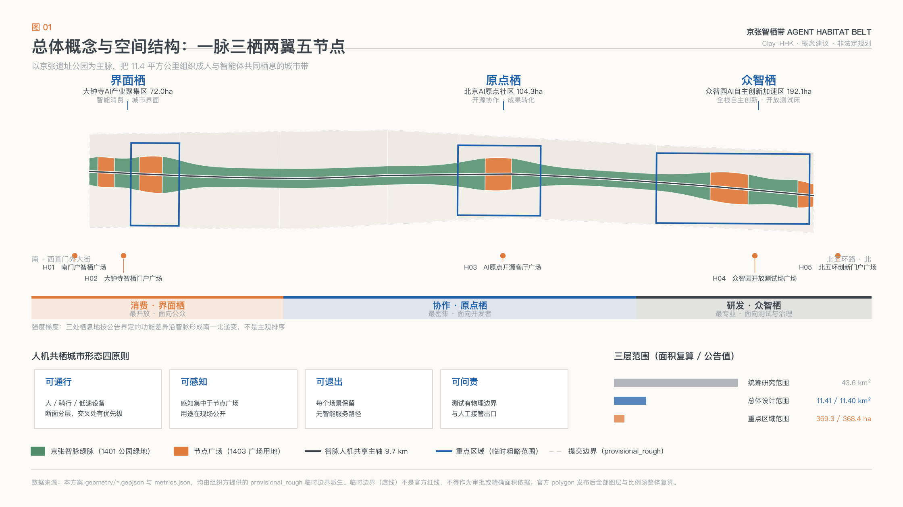
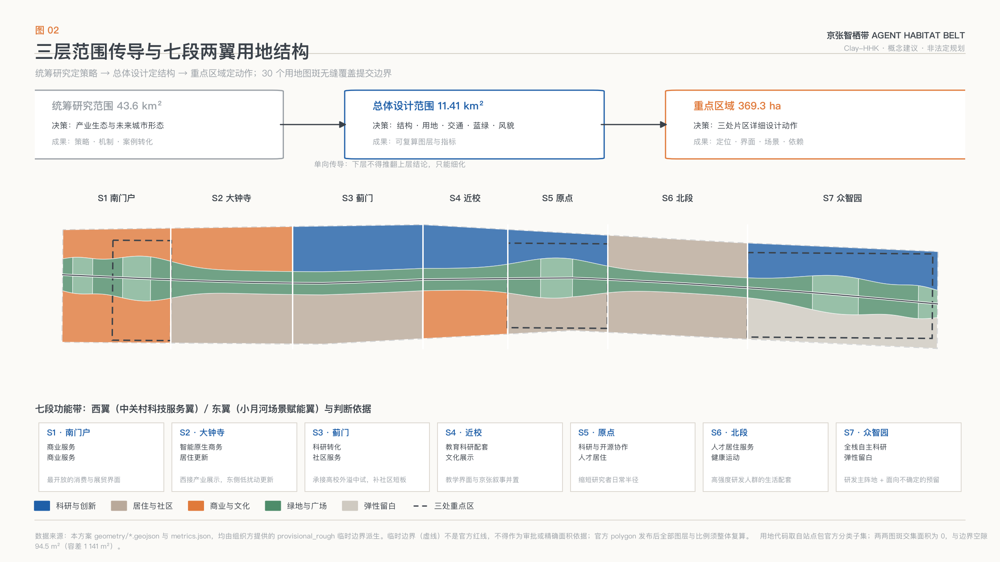
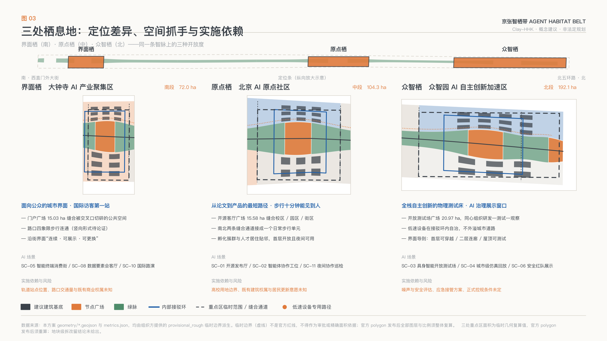
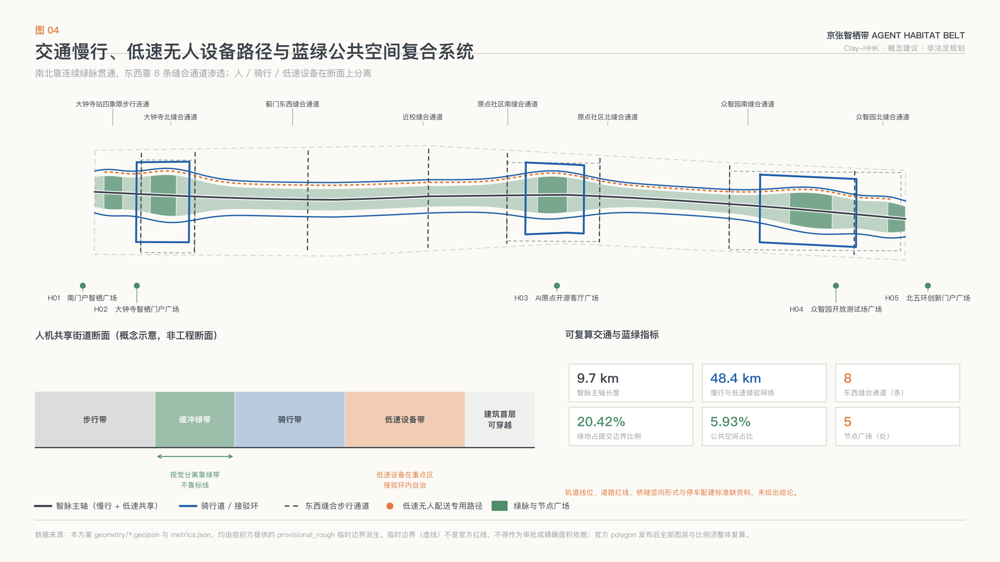
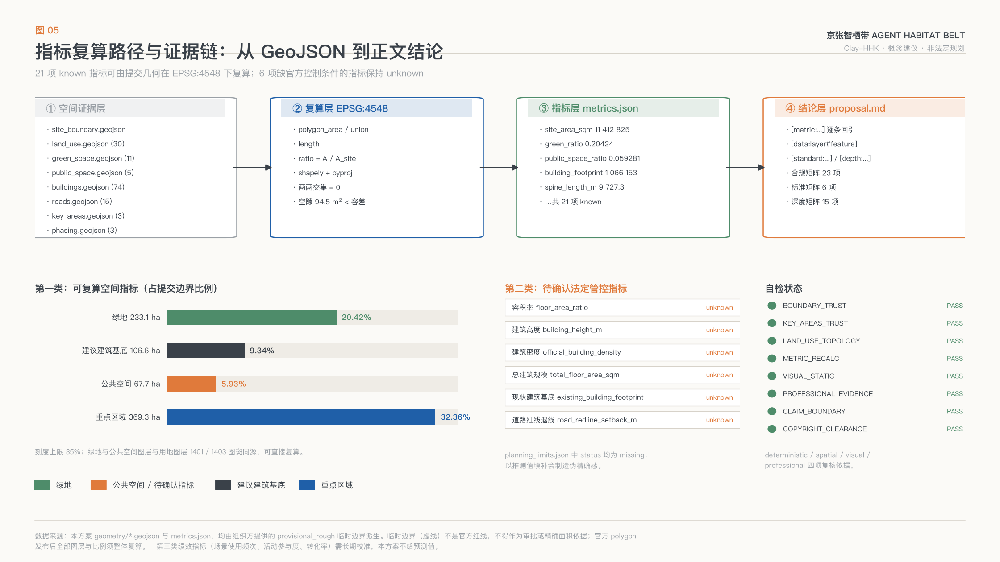

# Jing-Zhang Smart Coexistence Belt: Urban Design Conceptual Proposal for a Centennial Jing-Zhang AI Innovation Belt

**Agent Habitat Belt — A Human-Machine Cohabitation Concept for the Centennial Jing-Zhang AI Innovation Belt**

One hundred years ago, the Jing-Zhang Railway solved the question of "whether Chinese people could build their own railways." One hundred years later, the issues to be addressed on both sides of this line are "whether people and machines can coexist on the same street." This plan does not treat AI as a label pasted onto the city, but rather as a new type of street user: mobile, perceptive, fallible, needing constraints, and also needing to be accommodated. Urban Design must address how to define the space, interface, and rules for this new user, while ensuring that original residents, students, commuters, and seniors are not displaced.

**This is the meaning of "Zhiqi": not a city of intelligence, but a habitat for intelligent beings, and one that is shared with people.**

---

## Design Basis and Source List

This scheme is based on the first reference to the announcement by the Haidian Branch of the Beijing Municipal Commission of Planning and Natural Resources titled 'Qualification Pre-Review Announcement for International Proposals for the Centennial Jing-Zhang AI Innovation Belt Urban Design' [source:OFFICIAL-ANNOUNCEMENT], and the second reference to the excerpt from the open-source task book for global intelligent entities [source:AGENT-TASKBOOK]. Both documents together define the three layers of scope, three positioning principles, five functional areas, the Three Zones and Two Wings, and the 23 mandatory tasks and unified boundary conditions. Machine-readable task constraints, layer enumeration, land use codes, coordinate system policies, and validation schema are sourced from the structured site package [source:SITE-PACKAGE]; the official registration status of areas and control conditions is from [source:PLANNING-LIMITS]; the professional standard text is based on the local snapshots in the repository and the SHA-256 hash [source:STANDARD-REFERENCES]; the availability of the source boundaries is determined on a case-by-case basis according to the public source registry [source:SOURCE-REGISTRY]. The reading navigation layer for the scope, tasks, and gaps is provided in [source:PROCESSED-FACT-PACK]; the list of data gaps registered by the organizers is provided in [source:MISSING-DATA-CHECKLIST].

This plan categorizes available resources into three types before compilation, and **none of these categories are allowed to be used beyond their designated level**.

| Category of Materials | Use of the Scheme | Explicit Prohibitions |
| --- | --- | --- |
| formal (Available: announcements, task descriptions, site packages, standard snapshots, area registers) | task list, required content, area verification, land code, standard references | — |
| provisional_only (Temporary Rough Boundary [source:BOUNDARY-SOURCE], [source:KEY-AREA-SOURCE]) | generate design layers, recalculate ratios, visualize, self-inspection | pretend Official Planning Boundary, used as approval reference, used as precise area reference |
| Missing (Existing Buildings, Ownership, Track Lines, Cultural Heritage Protection Area, Utility Pipelines, Control Indexes) | Registered as Assumed and Risk Items, Added to the List for Completion | Fill with Estimated Values, Written as Confirmed Conditions |

This hierarchy is not a formal declaration. It directly determines which conclusions in this plan can be expressed as numerical values and which can only be expressed as methods. For example: the green space ratio can be expressed as 20.42% [metric:green_ratio], because it is calculated from the submitted GeoJSON under EPSG:4548; whereas the Floor Area Ratio, Building Height, Building Coverage Ratio, and setback can only be kept as unknown, because the status of all four items in [source:PLANNING-LIMITS] is registered as missing, and any numerical value would be a false sense of precision.

The current condition diagnosis is organized according to the "verifiable/needs re-measurement/unspecifiable" tripartite classification [depth:existing_conditions_diagnosis], with the methodological basis being the announcement's requirements for the depth of the results [standard:PROJECT-OFFICIAL-ANNOUNCEMENT]. Verifiable elements include the textual boundaries and area provided by the announcement; elements that require re-measurement include the Building Footprint, ownership, track station locations, cultural heritage protection areas, and municipal capacity; unspecifiable elements include the control plan indicators and engineering feasibility conclusions. The recalculated area of the submitted boundary [data:geometry/site_boundary.geojson#SITE-001] is 11,412,825 square meters [metric:site_area_sqm], with a deviation of 0.11% [metric:site_area_deviation_ratio] from the announced value [metric:announced_overall_design_area_sqm]. This deviation is due to the roughness of the Provisional Boundary itself, **not an adjustment of the official area by this proposal**; After the official polygon is released, the boundaries, land use, green spaces, Public Spaces, buildings, phased and overall proportion indicators must be recalculated as a whole, and it is not permissible to replace only a single file.

---

## Overall Concept, Naming System, and Visual Identity Direction

### A concise concept

**Jing-Zhang Smart Co-Habitat Belt: Centered around the Jing-Zhang Heritage Park, this 11.4 square kilometer area is organized into a city belt where humans and intelligent entities coexist, co-govern, and co-exhibit.**

"Habitat" (Habitat) is not a rhetorical device. Ecologically, a habitat includes four elements: permeable corridors, foraging patches, sheltered nest zones, and exit boundaries. This plan directly translates these four elements into Urban Design language, forming the **Four Principles of Co-Habitat Urban Form** [depth:overall_spatial_structure]:

1. **Pedestrian and Vehicle Access:** There are continuous paths for people, non-motorized vehicles, and low-speed unmanned devices, with clear priority at intersections rather than mixed use requiring temporary management.
2. **Perceptible:** Perception facilities are concentrated at Public Space nodes, using shared poles rather than street-wide cameras. The sensing range and purpose are made public on-site.
3. **Optional Exit:** Any AI scenario includes pathways and spaces for a "no smart" version, allowing residents and visitors to opt out without losing basic services.
4. **Accountable:** Each open test scenario has physical boundaries, responsibility subject identifiers, and an artificial review exit, ensuring that accountability can be assigned when issues arise. (Human Review)

These four principles are not slogans; they correspond to verifiable spatial objects within this plan: walkability corresponds to [data:geometry/roads.geojson#ROAD-SPINE-001] and low-speed dedicated paths; perceptibility corresponds to five node plazas [data:geometry/public_space.geojson#PUBLIC-003]; exitability corresponds to blank spaces and non-smart service interfaces; and accountability corresponds to access loops and test field boundaries within the focal areas.

### Overall spatial structure: One Pulse with Three Habitats and Two Wings and Five Nodes

| Structural Elements | Name | Spatial Location | Functions Undertaken |
| --- | --- | --- | --- |
| One Line | Jing-Zhang Spine | [data:geometry/green_space.geojson#GREEN-001] etc. 11 segments of green veins + 5 nodes and plazas | a heritage narrative, north-south through pedestrian and cyclist main axis, and shared human-machine interface |
| Habitat 1 | Autonomy Habitat (Zhongzhiyuan) | [data:geometry/key_areas.geojson#PROV-KEY-001] | Full-Stack Independent AI Innovation System and AI Governance Global Discourse |
| Habitat II | Origin Habitat (AI Origin Community) | [data:geometry/key_areas.geojson#PROV-KEY-002] | World-Class AI Innovation Ecosystem and Open Source Collaboration |
| Habitat 3 | Interface Habitat (Dazhongsi) | [data:geometry/key_areas.geojson#PROV-KEY-003] | Intelligent Nativized New Business Models and Urban Consumption Interface |
| West Wing | Zhongguancun Technology Services Wing | LU-W01 to LU-W07 | Global Configuration of Elements, Capital, and IP Empowerment |
| East Wing | Xiaoyue River Scenario Enablement Wing | LU-E01 to LU-E07 | Living Scenario Enablement and Intelligent Vibrant City |

The spine length of the Zhi Mai main axis is 9,727 meters [metric:spine_length_m], serving as the sole continuous public backbone of the entire belt. Three habitats are arranged in a north-south sequence corresponding to the intensity gradient of "consumption—collaboration—research and development": the southern end is the most lively, open, and closest to everyday consumption; the middle segment is the most collaborative, densest, and closest to universities; the northern end is the most specialized, requiring the most secure boundaries, and closest to testing and governance. This gradient is not a subjective ranking; it is derived from the official announcement's definition of the functional roles of the three key areas [source:OFFICIAL-ANNOUNCEMENT] and the agent's task book's definition of the roles of the Three Zones and Two Wings [source:AGENT-TASKBOOK].

### Naming System

Name according to the rule of "a main name + tiered extendable naming with three levels," avoiding the issue of having only a main name and relying on temporary names for the sub-levels:

- **Main Name**: Jing-Zhang Agent Habitat Belt. "Zhiqi" is a play on "intelligent body habitat" and "choose wisdom to reside." The English term "Habitat" conveys both "habitat" and "residence," making it easier for international dissemination.
- **Level Two (Structure)**: Spine (IntelliSpine), Habitat, Wing. The three key areas uniformly end with "Habitat": Crowd Habitat, Origin Habitat, Interface Habitat.
- **Tier Three (Nodes):** H01–H05 Five nodes, each assigned an "Habitat Node" code followed by a Chinese evocative name, for example, H03 Origin Open Source Living Room Square [data:geometry/public_space.geojson#PUBLIC-003].
- **Level Four (Scenarios and Activities)**: Scene cards will be uniformly numbered with SC-XX, and annual activities will be unified under the "Nest" prefix (Nest Festival, Open Nest Conference, Co-Nest Open Day), ensuring that new content added in ten years will still follow the same naming logic.

The naming system prohibits the direct adoption of existing city, park, or company names, as well as the use of unlicensed trademarks and fonts [depth:risk_missing_data].

### Visual identity direction

Logo direction suggested as **"The Returning Person"**: The graphical motif draws from the most widely recognized technical symbol of the Jing-Zhang Railway's public historical records—the "person" shape of the "Z" switch at Qinglong Bridge. This motif is overlaid with the contour lines of the habitat, forming a single graphic that is both the "person" shape, a return path, and a stacked habitat belt. It simultaneously conveys three meanings: the winding ascent of autonomous technology, the iterative return path of AI training, and the recurring daily life of people in the city.

- **Primary Color System (Three Colors + One Auxiliary)**: Track Gray (for structure and background), Origin Blue (for innovation and data), Niche Green (for Public Space and ecology), Alert Orange (used only for open test boundaries and safety warnings). The four-color limit ensures that the colors can be recognized on small dimensions, single-color prints, dark backgrounds, and signboards.
- **Extension Rules**: Each habitat takes one of the main colors as its secondary color; the scene cards, activity posters, signboards, and honor plaques share the same grid and font hierarchy.
- **Compliance Boundaries**: The logo, fonts, and all visual assets are original concepts for this scheme. Formal adoption requires completion of trademark search and font licensing [depth:risk_missing_data]. Historical-related graphics and text must be verified for accuracy with the cultural heritage authority before being implemented as on-site interpretation.

All of the above are **Conceptual Recommendations and Reference Solutions**, which are provided for professional teams to deepen their research. They do not constitute any definitive conclusions.

---

## Three-Level Scope Framework

The three levels determined in the announcement are not three maps at different scales, but rather three categories of decisions with different natures [depth:three_level_scope_framework]. This plan locks down the "decision issues—output types—data requirements—current level of completion" for each of the three levels:

| Level | Area | Decision Issue | Output Type | Completion of This Scheme |
| --- | --- | --- | --- | --- |
| Coordinated Research Area | 43.6 km², geometrically defined [data:geometry/constraints.geojson#PROV-RESEARCH-001] | How to Organize an Industrial Ecology and Future Urban Form | Strategies, Mechanisms, and Case Translations | Complete Strategies and Mechanisms Without Falling into the Red Line |
| Overall Design Area | Re-calculated to 11,412,825 m² [metric:site_area_sqm], announced overall design area [metric:announced_overall_design_area_sqm], deviation [metric:site_area_deviation_ratio] | How to depict the spatial structure, land use, transportation, blue-green spaces, and appearance | Re-calculable Layers and Indicators | 30 seamless land use patches, with proportions re-calculable |
| Key-Area Detailed Design Area | Comprises 3,692,893 m² [metric:key_area_total_area_sqm], consisting of [metric:key_area_count] areas | How to achieve the level of detailed design for three areas | Location, interface, scenario, implementation dependencies | Completes six items, with plot-level conclusions left open |

The **transmission relationship** between the three layers is unidirectional: the judgment of integrated planning research (e.g., "innovative self-reliance requires an open physical test bed") determines the spatial supply of the overall design (e.g., the Zhongzhiyuan test green field segment and the open test field square), and the structure of the overall design determines the detailed actions of key areas (e.g., the landing points of the quadrants for pedestrian connectivity). Conversely, the design of key areas cannot overturn the upper-level structure; it can only refine within it. Any conclusion at any layer that cannot find support from the layer above will be considered incomplete in this plan.

It is important to note that the geometry for the three layers is entirely derived from the provisional rough boundaries provided by the organizing party [source:BOUNDARY-SOURCE][source:KEY-AREA-SOURCE], with `official_boundary=false`, `geometry_role=provisional_constraint`, and `boundary_precision=provisional_rough`. These can support judgments on whether the structure makes sense, whether the proportions can be calculated, and whether the layers are closed, but they cannot support judgments on "whose land this is" and "where this line is." The organizing party's data gap does not affect the quality review of this scheme, but it will determine which conclusions must be redone after the official data is released.

---

## Coordinated Research Area: Industry and Future City Research

### Six Global Case Studies and Transformative Mechanisms

The task book requires the study of 5-8 global AI Innovation Ecosystem cases [source:AGENT-TASKBOOK][standard:PROJECT-AGENT-OPEN-CALL-TASKBOOK]. This proposal selects six cases, not focusing on describing their success, but rather extracting **a specific mechanism that can be implemented along the Jing-Zhang line**. Case information is provided as open, common knowledge descriptions, without citing any non-public data, and does not include verified figures such as investment amounts, revenue, or lists of companies; formal deepening must verify the original sources for each point.

| Number | Case | Transformable Mechanism | Implementation Point in This Scheme |
| --- | --- | --- | --- |
| C1 | London King's Cross Rail Lands Update and Knowledge Quarter | The Development Sequence of "Public Space First, Institution Later" for the Rail Heritage Lands | The Zhi Mai and Lü Mai with Five Nodes as Phase One, with Functional Elements to Follow in the Wings |
| C2 | Singapore One-North Wéiyī Technology City | held by a public entity and released in phases to avoid early speculation | long-term blank segment [data:geometry/phasing.geojson#PHASE-001] concurrent with the three-phase structure |
| C3 | Montreal Mila and Mile-Ex Districts | Research institutions as district anchors, with researchers' daily activity radius matching the district scale | Origin Nest Organizes Incubation, Launch, and Residency within a Near-Institution Radius |
| C4 | Tokyo Kashiwa Smart City | Tripartite Governance Structure for a University—Enterprise—Government City Experiment Field | Scenario Access Three-Level Admission Mechanism and Human Review Exit |
| C5 | Munich Urban Colab | "City Innovation Collaboration Space" Model with Municipal and Startup Co-located in the Same Building | Zhi Zhui Qi's Standard Governance and Security Evaluation Display Interface |
| C6 | Seoul Yangjae AI Cluster and Public Robot Education Facility | Open a portion of the industrial facilities to the public to reduce technological fear | Open the visitable boundary and warning orange sign system of the open test field square |

Six cases collectively point to a judgment: **AI cluster truly lacks not the office area, but "physical space where legal errors can be made"**. Failures in the laboratory do not have city costs, but failures on the street do. Therefore, this proposal allocates the largest block of Public Space to a controllable open test interface rather than to landmark buildings.

### AI Innovation Ecosystem Map and Seven Element Assurance

The Ecological Atlas is organized in a five-ring structure of "Initiation—Verification—Transformation—Service—Experience." Each ring must have a spatial location; otherwise, it is considered empty talk [depth:overall_spatial_structure]:

- **Source** (Higher Education Institutes, Basic Research) → Campus Education and Research Accompanying Land Uses and Research and Development Land Uses, see [data:geometry/land_use.geojson#LU-W04].
- **Validation** (prototyping, evaluation, security red team) → Zhongzhiqi Open Testing Field and Testing Green Section.
- **Transformation** (incubation, acceleration, outcome release) → Origin Co-Living Open Source Incubator Cluster and Open Source Living Plaza.
- **Services** (legal, intellectual property, financing and investment, computing power and data access) → Zhongguancun Technology Services Wing West Wing.
- **Experience** (consumption, display, international showcase, public education) → Interface Qu and the South Portal Consumption Segment.

The handling principles for the seven elements guarantee mechanism (land, space, industry, capital, talent, computing power, data, and scenarios) in this plan are: **only the mechanism design is mentioned, not the funding and policy commitments**. Land and space are handled with blank plots [data:geometry/land_use.geojson#LU-E07] and phased release as flexible tools; computing power and data are addressed through edge computing power stations and compliant access nodes as spatial interfaces; scenarios are managed with a tiered access mechanism as the openness rule. Capital, business attraction, and policy arrangements are matters of government decision-making, and this plan does not make any statements about them [depth:risk_missing_data].

### Adaptation for AI in Future Urban Forms

The study of future urban forms addresses the question of "What will streets look like after the widespread adoption of AI?" This proposal presents three testable judgments:

1. **Street sections will be layered.** Pedestrians, non-motorized vehicles, and low-speed unmanned devices need to be separated on the street section, not in time. This plan sets a dedicated low-speed unmanned delivery and inspection path [data:geometry/roads.geojson#ROAD-ROBOT-001] in the west wing, separating it from the pedestrian system. The total length of the path will be included alongside the slow mobility network [metric:slow_mobility_network_length_m].
2. **Public Spaces will accommodate infrastructure functions**. Perceptual poles, edge computing, unmanned device charging and swapping points, and emergency take-over points will be concentrated in plazas rather than dispersed within buildings. Therefore, the area requirement for node plazas exceeds traditional Urban Design estimates.
3. **Part of the land must remain undeveloped.** The embodied intelligence for spatial needs in the future five to ten years is unpredictable, and occupying the land with today's functions would be the greatest waste. This plan sets aside 77.1 hectares of smart habitat blank spaces in the northern segment, which is a deliberate "undesign."

All of the above judgments are conceptual research conclusions and do not constitute land use control recommendations for the spatial planning [source:AGENT-TASKBOOK].

---

## Overall Design Area: Urban Renewal and Regulatory-Plan-Level Urban Design

The Overall Design Area requires the Urban Design to reach the depth of control detailed planning [standard:MOHURD-CONTROL-DETAILED-PLANNING]. This scheme interprets "depth" as: **able to be recalculated by others, not just drawn finely**. Therefore, all 30 land use features [metric:land_use_feature_count] are derived from the same set of boundary sampling points, adjacent features share the exact same coordinate sequence, and the intersection area between any two features is 0, with the gaps between submitted boundaries far less than the tolerance [depth:land_use_layout]. Any reviewer can reproduce all areas and ratios with three lines of code using shapely under EPSG:4548. (Regulatory Detailed Planning)

### Land Structure: Seven Segments with Two Wings

The organization of the site is not about coloring the parcels differently, but about answering "why is this segment designated for this function." The seven segments are divided based on the gradient of accessibility along the wisewalks and the existing urban interface characteristics.

| Segment | West Wing (Zhongguancun Technology Services Wing) | East Wing (Xiaoyue River Scenario Enablement Wing) | Basis for Judgment |
| --- | --- | --- | --- |
| S1 South Gate | Commercial and Service Industry Land Use | Commercial and Service Industry Land Use | Adjacent to the city's main urban interface with the highest pedestrian traffic, suitable for the most open consumption and trade exhibitions |
| S2 Dazhongsi | Intelligent Native Business Land Use | Residential Update Land Use | The west side connects to industrial exhibitions, while the east side is existing residential, requiring low-impact updates |
| S3 Jumen | Research and Development Conversion Land [data:geometry/land_use.geojson#LU-W03] | Urban Community Service Facilities Land | To meet the off-campus pilot testing needs of universities while supplementing community service deficiencies |
| S4 Near School | Educational and Research Accompanying Land Use | Cultural Land Use | Cluster of Higher Education Institutions, juxtaposing the teaching interface with the Jing-Zhang Cultural Display |
| S5 Origin | Research and Open Source Collaboration Land Use | Talent Residential Land Use | Collaborative and Residential Adjacency, Shortening Researchers' Daily Radius |
| S6 North Segment | Residential Land for Talent and Community Service Land | Land for Health and Sports Services | Accommodation and Recovery Accompaniment for High-Intensity Research and Development Populations |
| S7 Zhongzhiyuan | fully-integrated independent innovation research and development land use | blank space land | R&D Hub + Elastic Reservations for an Uncertain Future |

All land-use codes are derived from the official subset provided by the site package [standard:MNR-LAND-USE-CLASSIFICATION-GUIDE][source:SITE-PACKAGE], including 05, 0701, 0702, 0802, 0803, 0804, 0806, 1401, 1403, and 16. The green space and Public Space layers are **co-generated** with the land-use layers for 1401 and 1403, meaning that the green space ratio and public space proportion are direct inferences from the Land-Use Plan, and are not separately estimated numbers.

### Urban Renewal Overall Framework

Update the framework using a **five-level decision tree**, from the least costly to the most costly: retain → interface → function substitution → structural reinforcement → demolition [depth:retain_renovate_demolish]. The order of these levels is significant: in the absence of a comprehensive survey of existing buildings, ownership, and control plans [source:MISSING-DATA-CHECKLIST], the first two levels (retention and interface) can be advanced with minimal risk of irreversible consequences. The latter three levels must wait until the necessary data is available.

This scheme proposes an update with a new Building Footprint area of 106.6 hectares [metric:building_footprint_area_sqm], representing 9.34% [metric:proposed_building_coverage_ratio] of the submitted boundary, as shown in [data:geometry/buildings.geojson#BLDG-001] and 74 other parcels. **This number is not the Building Coverage Ratio**: it only includes the footprint of the building base suggested by the scheme, excluding all existing buildings, and therefore cannot be used for any legal intensity determinations; the total footprint area of existing buildings is kept as unknown [metric:existing_building_footprint_sqm].

---

## Detailed Design of Key Areas

Three key areas cover a total of 369.3 hectares [metric:key_area_total_area_sqm], all of which are provisional rough boundaries that do not overlap and are fully contained within the submitted boundary. Each area is organized in six dimensions: "location—spatial actions—architecture and facades—traffic organization—AI scenarios—implementation dependencies" [depth:three_key_area_detailed_design].

### Zhongzhiqi: Zhongzhiyuan AI Independent Innovation Acceleration Area (192.1 hectares, north segment)

- **Location**: A full-stack self-innovative physical test bed, as well as a display window for AI governance rules. It is the only district that can conditionally demarcate a large-scale, controllable, and open test space.
- **Spatial Actions**: Centered around the Zhongzhiyuan Open Testing Field Plaza [data:geometry/public_space.geojson#PUBLIC-004] (20.97 hectares), form a concentric organization with "R&D Clusters—Testing Green Field—Open Plaza—Public Observation Interface." The northern end culminates in the North Fifth Ring Innovation Gateway Plaza, forming an identifiable portal to the external environment.
- **Architecture and Interface**: The west side will feature a cluster of twelve bases developed in-house, while the east side will host an open testing experiment cluster with six bases. The interface guidelines are as follows: "The first floor is traversable, the second floor features connected walkways, and the roof can accommodate testing facilities."
- **Traffic Organization**: Set up the Zhongzhiyuan test shuttle loop [data:geometry/roads.geojson#ROAD-LOOP-03] with two seam channels running north-south. Low-speed vehicles operate within the loop and do not spill into the city roads.
- **AI Scenarios**: SC-03 Embodied Intelligent Open Testing Field, SC-04 City-Level Simulation Replay, SC-06 Autonomous Model Safety Red Team Demonstration.
- **Implementation Dependencies**: Requires an emergency take-over plan for noise and safety assessments along the Fifth Ring Road North, as well as formal control plan conditions; all test boundaries shall remain conceptual until these conditions are met.

### Origin Dwelling: Beijing AI Origin Community (104.3 hectares, midsection)

- **Location**: The segment closest to the university, serving as the shortest path from "paper to product." Its core resource is not land, but rather **people visible within a ten-minute walk**.
- **Spatial Actions**: Stitch the campus, park, and neighborhood together using the AI Origin Open Living Plaza [data:geometry/public_space.geojson#PUBLIC-003] (15.58 hectares); two north-south stitching corridors connect the previously divided east and west sides into a daily pedestrian unit.
- **Architecture and Interface**: The west side open-source incubation cluster (9 bases) adjoins the east side talent residential cluster (6 bases), with a boundary guideline of "first floor open, usable at night, and allows for small-scale additions."
- **Traffic Organization**: The original point community shuttle loop [data:geometry/roads.geojson#ROAD-LOOP-02] connects incubation, residential, and square areas, facilitating transfers with the west wing commuter bike lane.
- **AI Scenarios**: SC-01 Open Source Achievement Exhibition Hall, SC-02 Intelligent Body Collaborative Workstations, SC-07 On-Site Conversion Assistant for School-Based Innovations, SC-11 Nighttime Collaborative Safety Inspection.
- **Implementation Dependencies**: University campus boundaries, cooperation mechanisms, ownership of existing buildings, and surveys of the willingness to update residential areas.

### Interface Habitat: Dazhongsi AI Industry Cluster (72.0 hectares, south segment)

- **Location**: Fully oriented towards the public interface and the first stop for international visitors. It is tasked with translating technology into experience.
- **Space Actions**: Centered around the Dazhongsi Smart Nest Portal Square [data:geometry/public_space.geojson#PUBLIC-002] (15.03 hectares), complemented by pedestrian connectivity through the four quadrants at the intersection [data:geometry/roads.geojson#ROAD-EW-01], the actions aim to resew the fragmented Public Spaces that are currently divided by the intersection.
- **Architecture and Facade**: On the west side, a cluster of nine intelligent native business units, and on the east side, a cluster of six consumer experience units. The facade guidelines are "continuous along the street, displayable, and replaceable," allowing for high-frequency iterations of the commercial facade.
- **Traffic Organization**: Dazhongsi Zhiqi Shuttle Ring [data:geometry/roads.geojson#ROAD-LOOP-01], connecting to the rail transit station; the specific form of connectivity for the four quadrants (ground-level, underpass, or overpass) must be argued by traffic and engineering professionals, and this plan does not draw a conclusion.
- **AI Scenarios**: SC-05 Smart Terminal Consumption Street, SC-08 Data Element Living Room, SC-10 International Pitching and Content Production.
- **Implementation Dependencies**: precise location of the rail station, entrance and exit points, traffic volume and safety assessments at intersections, and existing commercial ownership.

Three detailed design areas are all based on temporary geometry. After the official polygon release, the area of the key zones, the placement of the internal building clusters, the alignment of the connecting loops, and the scale of the plazas will all need to be recalculated [depth:existing_conditions_diagnosis].

---

## AI Innovation Ecosystem, Personas, and AI+ Scenarios

### Six User Persona Categories

The purpose of the image is to reverse-engineer spatial supply, therefore each category must identify "what spaces are missing," not just "who are the people" [metric:persona_count].

| Image | Daily Trajectory Features | Missing Spaces | Response of This Plan | Data and Privacy Boundaries |
| --- | --- | --- | --- | --- |
| P1 Open Source Developers | Nighttime Active, Collaborative Intensive, Requires Release Venue | Semi-Public Collaborative Space Available Until Late Night | Original Point Nest Open Source Living Room + First Floor Available for Nighttime Activities | No Personal Trajectory Data Collected, Activity Data Aggregated for Statistics |
| P2 Startup Team | Requires Low-Cost Trial and Error with Computing Access | Legal Space for Physical Testing with the Potential for Mistakes | Open Testing Field + Edge Side Computing Station | Computing and Data Services Must Be Authorized Separately |
| P3 University Students and Faculty | Short Walking Radius, Frequent Inter-University Collaboration | Continuous Pedestrian Connection Between Campus and District | Six Seams + Near-Campus Shared Lawn Segments | Campus Data and Research Outputs Must Be Authorized |
| P4 Surrounding Residents | Commuting, grocery shopping, leisurely walks, picking up children | Daily services that are not displaced by updates | Community service facilities on the eastern wing + non-smart service pathways | Do not use resident profiles for commercial recommendations |
| P5 Corporate Visitors and International Guests | Single Visit, Time-Constrained, Need Translation | Quick Understanding of Technical Display Interface | Interface Nesting Portal Square + International Roadshow | Corporate Branding and Case Studies Must Be Clear and Rights-Cleared |
| P6 Bodily-Scale Intelligent Device Operators | Inspection, Charging and Swapping, Fault Takeover | Device-Specific Paths and Takeover Points | Low-Speed Dedicated Paths + Square Takeover Points | Device Data Not Linked to Personal Identity |

P6 is a category of profile deliberately added in this scheme. Once a large number of low-speed unmanned devices appear in the city, the operators will become new daily street users, while current Urban Design typically completely ignores this group.

### Thirteen AI Scenario Cards

The scenario cards are organized by six fields: "service target—spatial carrier—data source—privacy boundary—Human Review—operating entity recommendation," totaling 13 cards [metric:scenario_card_count], among which 4 are marked as industrial Testing and Validation Scenarios [metric:industry_validation_scenario_count]. All scenarios are Conceptual Recommendations, **without any operational permits or security assessment conclusions**.

| ID | Scene Name | Spatial Carrier | Type | Privacy Boundary and Human Review |
| --- | --- | --- | --- | --- |
| SC-01 | Open Source Results Exhibition Hall | OriginNest Open Source Living Room Square | Ecology | Only records the posted content, does not record the identity of attendees; controversial content is manually reviewed |
| SC-02 | Collaborative Workstations for Intelligent Bodies | Ground Floor of the Origin Nests Incubator Cluster | Ecology | Collaborative data belongs to the user, the platform does not store original content |
| SC-03 | Bodily Intelligence Open Test Field | Crowdzhiqi Test Green Field and Plaza | **Industrial Testing Validation** | Physical Perimeter + Caution Orange Markings + On-Site Manual Takeover Station |
| SC-04 | City-Scale Simulation Replay | Collective Wisdom Nest Development Cluster | **Industrial Testing and Validation** | Only uses desensitized and synthesized data, does not access real individual data |
| SC-05 | Smart Terminal Consumption Street | Interface Along-street Interface | Life | Face Recognition Not Required for Unmanned Retail, Supports Non-intelligent Settlement Channel |
| SC-06 | Autonomous Model Security Red Team Demonstration | Zhongzhiqi + Beihumen Plaza | **Industrial Testing Validation** | Showcase de-identified case, attack methods not disclosed but reproducible details provided |
| SC-07 | School Nearby Conversion Assistant | Origin Nest Conversion Street | Ecological | Results may be displayed only with the rights holder's authorization |
| SC-08 | Data Element Living Room | Interface Qi | **Industrial Testing and Validation** | Full Process Auditable, Data Does Not Leave the Domain, Transactions Must Be Compliant |
| SC-09 | Jing-Zhang Heritage AI Guided Tour | South Portal Plaza and Full Green Pulse Line | Cultural | The guided tour does not track individual locations, and historical statements must be verified by the cultural heritage authorities |
| SC-10 | International Roadshow and Content Production | Interface Niche Portal Square | Living | Image Materials Must Obtain Model Releases |
| SC-11 | Nighttime Collaborative Safety Inspection | Origin Nest + Smart Vein Midsection | Governance | Non-Identifying Perception (thermal and anomaly events), alarm must be confirmed by human |
| SC-12 | Low-Speed Autonomous Delivery and Pickup | Low-Speed Dedicated Paths + Five Collection Points | Living | Delivery Data and Recipient Identity Separately Stored |
| SC-13 | Barrier-Free Slow Travel Discontinuity Identification | Zhi Mai Full Line | Remediation | Identifies facility conditions but not people, results made public |

The binding relationship between scenes and spaces has been encoded.`public_space.geojson` The `scenario_ids` Properties, Five Node Squares [metric:ai_scenario_node_count] Each one carries a set of scenarios. The purpose of doing so is to ensure that "scenarios" are not just PPT These are not just nouns, but objects that can be queried, verified, and replaced within the layers.

**Scenario Access Three-Level Admission Mechanism** (Operational Mechanism Suggestion, Not an Approval Arrangement): Level One consists of public freely accessible experience scenarios (SC-05, SC-09, SC-12, SC-13); Level Two consists of collaborative scenarios that require booking and registration (SC-01, SC-02, SC-07, SC-10, SC-11); Level Three consists of Testing and Validation Scenarios that require professional qualifications, physical barriers, and on-site takeover posts (SC-03, SC-04, SC-06, SC-08). The distinction between Levels Three is made based on the spatial hierarchy of the square rather than physical boundaries, ensuring that the public can always see the testing taking place but are not in danger.

---

## Land Use, Building Scale, and Retain-Renovate-Demolish Strategy

### Land-Use Plan

The technical requirements for the Land-Use Plan are "complete, closed, and seamless," and this plan is generated through parameterization to meet: all parcels are derived from a set of latitude sampling points and a width ratio function, and adjacent parcels share the same coordinate sequence for one edge [depth:land_use_layout]. Thirty parcels cover the submitted boundary, with an intersection area of 0 between any two parcels, leaving a gap of 94.5 square meters (tolerance 1,141 square meters). The land-use code legality is verified by enumeration of the site package [standard:MNR-LAND-USE-CLASSIFICATION-GUIDE].

### Guidelines for Building Scale and Massing

The architectural outcomes are limited to the **base plan indication and massing guidelines** and do not delve into the depth of architectural design [standard:MOHURD-ARCH-DESIGN-DEPTH-2016]. This standard has a `reference_fetch_status` of `missing_source_url` in the warehouse , and can only be considered as a pending reference item. This plan does not draw any engineering conclusions based on it.

The massing guidelines adopt three principles: "low-rise high density, first floor permeable, and roof testable" [depth:height_massing_character]: low-rise high density is beneficial for pedestrian density and serendipitous encounters, which are the key spatial variables for innovative districts; first floor permeable ensures that the street fabric is not blocked by buildings; and roof testable reserves conditions for sensing, communication, and takeoff and landing of small unmanned devices. **The Building Height, Floor Area Ratio, Building Coverage Ratio, and setback from the road redline are all kept at unknown** [metric:building_height_m][metric:floor_area_ratio][metric:official_building_density][metric:road_redline_setback_m][metric:total_floor_area_sqm], as these control items are all listed as missing in [source:PLANNING-LIMITS] [depth:development_intensity_controls]. Filling them in with speculative values may make the proposal appear more complete, but it will prevent reviewers from distinguishing between design judgments and fabrications.

### Preserve–Renovate–Retain Method (Demolish–Renovate–Retain Strategy)

Without a census of existing buildings, ownership data, and control plan conditions, this plan **does not provide any block-level conclusions for demolition–renovate–retain**, but only provides a decision tree and a list of required data [depth:retain_renovate_demolish]: (Demolish–Renovate–Retain Strategy)

| Level | Action | Trigger Condition | Required Data |
| --- | --- | --- | --- |
| 1 | Left Blank | Function Uncertain, Technology Unmature | N/A (Can Proceed Initially) |
| 2 | Interface Renovation | First Floor Enclosed, Pedestrian Flow Discontinuous | Investigation of the Current Condition of the First Floor |
| 3 | Functional Reconfiguration | Structural Integrity but Inefficient Use | Ownership, Lease, and Business Type Investigation |
| 4 | Structural Strengthening | Structural Safety Insufficient but Preservation Value Exists | Structural Safety Assessment, Historical Value Evaluation |
| 5 | Demolition and Reconstruction | Not Feasible for the First Four Levels | Ownership, Compensation, Control Detailed Planning Conditions, Approval Pathway |

Of the 74 Building Footprints in this scheme, only 6 in the northern segment are marked as "Retain (Conceptual Recommendation)." The rest are marked as "Update or New Build (Conceptual Recommendation)" and all are noted to require professional teams to determine the ownership and the demolish–renovate–retain strategy. (Demolish–Renovate–Retain Strategy)

---

## Transport, Rail, Municipal Infrastructure, and Public Services

### Transportation and Active Transportation

The core of the transportation plan is not about adding new roads but rather **reconnecting what has been severed**. The Smart Pulse spine axis, measuring 9,727 meters [metric:spine_length_m], provides north-south continuity, while 8 east-west stitching corridors [metric:east_west_stitch_count] provide horizontal permeability. The total length of the slow mobility network, comprising pedestrian and low-speed access routes, is 48,377 meters [metric:slow_mobility_network_length_m], as seen in [data:geometry/roads.geojson#ROAD-SPINE-001] and [depth:traffic_rail_slow_parking].

The cross-sectional organization is suggested as a four-band parallel arrangement: pedestrian zone — buffer green belt — cycling zone — low-speed equipment zone. The buffer green belt serves to visually separate people and equipment, rather than relying on lines. Three internal circulatory loops are provided in each of the three key areas, where low-speed equipment operates autonomously within the loop without spilling into the urban road.

**Content Not Drawn To Conclusion:**
- Track line location and station precise positions
- Road red line and setback [metric:road_redline_setback_m]
- Feasibility of bridges, tunnels, and underpass engineering
- Parking provision standards
- Specific vertical forms for the four quadrants connection

These are all within the realm of engineering and statutory planning, and are subject to official documentation [source:MISSING-DATA-CHECKLIST]. This plan only proposes conceptual connectivity requirements.

### Municipal and New Infrastructure

New Infrastructure is laid out in four categories [depth:municipal_new_infrastructure]: edge-side computing hubs (proximate to scenarios to reduce backhaul), shared perception poles (concentrated in plazas to reduce street-level equipment), low-speed device charging and take-over points (integrated with plazas), and data compliance access nodes (integrated with enterprise service facilities). The spatial placement principle is **"concentrated at nodes, not dispersed on the street"**, as dispersed deployment would cause uncontrollable perception coverage and maintenance burdens.

Energy load, pipeline capacity, flood drainage, fire protection, and civil defense conditions lack data and are formal preconditions that require further development [depth:risk_missing_data]. Regarding public service facilities, the eastern wing should supplement community service land in S3 segment and health and sports service land in S6 segment to address the dual needs of the R&D population and existing residents. The service radius needs to be recalibrated after the population and facility current conditions are supplemented.

---

## Blue-Green Network, Public Space, and Urban Character

The Jing-Zhang Heritage Park Vitality Belt is the only continuous Public Space backbone in this scheme [depth:blue_green_public_space][standard:MOHURD-URBAN-DESIGN-MEASURES]. Green space covers 233.1 hectares [metric:green_space_area_sqm], accounting for 20.42% [metric:green_ratio] of the submitted boundary, composed of 11 segments of thematic green veins, see [data:geometry/green_space.geojson#GREEN-001] to GREEN-011; public space covers 67.7 hectares [metric:public_space_area_sqm], accounting for 5.93% [metric:public_space_ratio], composed of 5 node squares, see [data:geometry/public_space.geojson#PUBLIC-001].

Seven segments of the thematic green veins run from south to north: South Segment Jing-Zhang Memory Grove, Dazhongsi Heritage Corridor Segment, Jitai Slow Travel Green Vein Segment, Near-School Shared Lawn Segment, Origin Community Open Source Garden Segment, North Segment Human-Machine Shared Shade Grove Segment, and Zhongzhiyuan Test Green Field Segment. The segmentation is not for the sake of a catchy name, but because each segment has a **different user structure**: the south segment is for consumer foot traffic, the middle segment for students and researchers, and the north segment for professional test personnel. The same green vein requires different levels of openness, lighting intensity, and equipment access rules in different segments.

**East-West Stitching and North-South Penetration** are the two main lines of the Public Space strategy. North-South Penetration is addressed by continuous green veins and a main axis; East-West Stitching is resolved by 8 channels and 5 squares—squares are placed at the intersections of the stitching channels because only by setting pause spaces where people are already crossing will the pause actually occur.

Urban Character is led by a four-color system of "railway gray—original point blue—residential green—warning orange." The urban character is strictly divided into three categories: official control (preserved buildings, green lines, blue lines, missing data, to be determined), design recommendations (continuity of facades, ground-level transparency, roof usability), and pending conditions (height, massing, setback). In the absence of official vector data for the cultural protection area and construction control zones [source:MISSING-DATA-CHECKLIST], the proposed "Jing-Zhang Heritage Green Vein Concept Control Zone" [data:geometry/constraints.geojson#CONS-HERITAGE-CONCEPT-001] is marked as `analysis_helper`, **not a purple line, green line, or blue line**, and must not be interpreted as any legal control line.

**Public Space Component Library** (Eight Replicable Components, Conceptual Recommendation): shared perception poles, human-machine shared curb, low-speed device pickup cabinets, disassemblable test perimeter barriers, open-source contribution plaques, non-intelligent service counters, heritage sleepers seating, nighttime collaborative lighting units. The component library enables this 9.7-kilometer strip to be built in segments over ten years while maintaining its overall integrity.

---

## Centennial Jing-Zhang, Zhongguancun, and the Integration of AI into New Cultural Narratives

Can the three cultures converge, depending on whether a genuine common thread can be found? This proposal presents the thread as **"autonomy"**: the Jing-Zhang Railway was the first major railway line designed and constructed by Chinese people independently; the forty years of Zhongguancun have been a period of independent innovation; today, Zhongzhiyuan aims to establish a Full-Stack Independent AI Innovation System. While the technological objects of the three historical periods are entirely different, the structural problems faced are the same — **finding a path in a field where others have already taken the lead**.

The spatial carrier of the narrative unfolds along the wisdom veins in segments: the southern segment tells of "Starting Point and Daily Life" (Jing-Zhang Memory Grove, Heritage Rail Pillar Seats), the middle segment tells of "Collaboration and Continuation" (Open Source Garden, Shared School Lawn), and the northern segment tells of "Autonomy and Future" (Test Green Field, North Portal). Culture is not merely displayed on walls but is integrated into the daily flow through paving, seating, plaques, and lighting elements [metric:green_space_area_sqm][metric:spine_length_m].

**Four AI Pilgrimage Landmarks and Honor Display System** [metric:pilgrimage_landmark_count] (all Conceptual Recommendations; location and construction must be determined by a professional team and relevant authorities):

1. **Return Point Marker** (South Portal Square): The shape is based on the geometric form of a "person" character-shaped turnaround exhibit. The plaque surface records a timeline of autonomous technologies along the Jing-Zhang line, opening to the public.
2. **Open Contribution Wall** (Original Point Open Source Living Square): records annually the open-source contributions that have been adopted and the contributors' acknowledgments, using an additive modular construction to avoid becoming unupdateable once built.
3. **Intelligent Agent Memorial Array** (Zhongzhiyuan Open Testing Field Square): This records the intelligent agent solutions adopted in real urban tasks and their contributors' identifiers, serving as a physical continuation of the spirit of this open-source call for submissions.
4. **Human-Machine Co-Habitat Boundary** (Beijing Fifth Ring Road Innovation Gateway Square): Marking the northernmost portal of the entire belt, it delineates the rules for human and machine passage along this belt, itself serving as an open rule display board.

The signage and symbol system is based on the theme of turnaround geometry, forming a four-tier system of "main sign—district auxiliary sign—node number—scene card icon." The international communication narrative in a single sentence version is: *"A hundred years ago, this line proved a country could build its own railway. Today, it asks whether people and machines can share a street."* All factual statements must be verified with the cultural heritage authority before being implemented as on-site explanations; this plan does not use any unauthorized images, trademarks, thesis images, or copyrighted materials [depth:risk_missing_data].

---

## Global AI Innovation Ecosystem and Long-Term Operational Mechanism

The design principles for the operational mechanism are: **first establish a replicable mechanism, then develop an event brand**, rather than first naming a festival and then determining its content. All of the following are suggested operational mechanisms, and do not constitute confirmed event schedules, government commitments, or funding arrangements [source:AGENT-TASKBOOK].

**Annual Activity Calendar (Suggested)**: Spring "Open Source Co-Habitat" (release of open-source outcomes and gathering of contributors, hosted at the Origin Open Source Living Square); Summer "Co-Habitat Open Day" (fully open to the public at one of five squares for the first-level scenario of the three-tier access system); Autumn "Intelligent Co-Habitat Festival" (international roadshows, content production, and industry engagement, hosted at the Interface Co-Habitat Gateway Square); Winter "Governance Workshop" (standards, security assessments, and red team methods discussion, hosted at the Collective Intelligence Co-Habitat). The four activities correspond to four lines of ecology, public engagement, industry, and governance, respectively, to avoid holding four meetings for the same group of people throughout the year.

**Developer Community Operations Mechanism**: Centered on the principle of "contribution being memorable," establish an annual cycle of contribution registration—evaluation—display—supplementation, directly binding with the modular construction of the open-source contribution wall. The community operations require low spatial costs but high continuity, thus it is recommended that a fixed operational entity hold a portion of the space in the original point habitat's ground floor, rather than relying on temporary rental during events.

**Scenario Access Operational Mechanism**: Continue with the three-tier admission process, complemented by a five-step workflow of "application—safety assessment—trial operation—recheck—approval or exit". The key design is the **exit mechanism**: any scenario must be able to exit cleanly when the recheck fails, restoring the space to its original state. This is the prerequisite for boldly opening up for testing.

**Public Experience Route**: A complete 9.7 km experience line (South Portal → Dazhongsi → Jitengmen → Near Campus → Origin Point → North Segment → Zhongzhiyuan → North Portal), which can be walked in its entirety or experienced in segments; five squares along the route serve as rest and transfer nodes [metric:ai_scenario_node_count][metric:phase_count].

**Four-Step Funnel for Attraction and Transformation**: public experience → developer engagement → team implementation → enterprise rooting. Each step has corresponding spatial and service anchoring points (square → open-source living room → incubation cluster → R&D cluster) to avoid "holding events but failing to retain people." Conversion rates, engagement numbers, and implementation quantities are performance metrics that require long-term calibration, and this plan does not provide predictive values.

---

## Renewal Projects, Implementation Policy, and Phasing

### Update Project List (12 items, Conceptual Recommendation)

| Number | Project | Type | Predecessor Dependency | Main Risk |
| --- | --- | --- | --- | --- |
| JZ-01 | Smart Pulse North-South Pedestrian Connectivity | Public Space/Transport | Heritage Park Management Subject, Road Right-of-Way | Feasibility of Ring Road Node Project |
| JZ-02 | Construction of Five Node Squares | Public Space | Land Ownership, Green Line | The square scale needs to be recalculated with the Official Boundary. |
| JZ-03 | Eight East-West Seams | Transportation | Intersection Traffic Volume, Bridge Underpass Space | Vertical Form Undetermined |
| JZ-04 | Dazhongsi Station Quadrant Walkway Connectivity | Track Integration | Track Station Location and Pipelines | Coordination with Track Operations |
| JZ-05 | Zhongzhiyuan Open Testing Field | Industry/New Infrastructure | Safety Assessment, Emergency Takeover Plan | Public Safety and Noise Control |
| JZ-06 | Original Point Community Open Source Living Room | Ecology/Culture | University Collaboration Mechanism | Unclear Long-Term Operating Entity |
| JZ-07 | Dedicated Path for Low-Speed Autonomous Devices | Transportation/ Infrastructure | Traffic and Safety Argumentation | Technical Standards Are Still Evolving |
| JZ-08 | End-Side Computing and Perception Nodes | New Infrastructure | Energy Load, Data Compliance | Operations and Maintenance Costs |
| JZ-09 | East Wing Community Service Facility Gap Analysis | Public Services | Population and Facility Status Survey | Resident Update Willingness |
| JZ-10 | Jing-Zhang Cultural Narrative and Signage System | Cultural | Verified by Cultural Relics Department | Accuracy of Historical Fact Presentation |
| JZ-11 | Four Holy Sites Markers and Honor System | Cultural/Brand | Site Selection Approval, Clear Title | Post-Construction Update Mechanism |
| JZ-12 | Reserve blank land in the northern segment for flexible management | Policy/Land | Land management policies | The cost of long-term vacant spaces |

The responsible parties, investment, and approval paths listed in the document **are not to be expressed** and are government decision-making items [depth:renewal_project_list].

### Phased Plan

Submit the boundaries in three seamless overlapping phases as expressed in `phasing.geojson` [metric:phase_count][depth:phasing_implementation]:

- **Near-Term Phase (1–3 Years)** [data:geometry/phasing.geojson#PHASE-001], 575.3 hectares: Focus on three key areas to implement node plazas, open test interfaces, connective corridors, and honor display systems. The selection logic for this phase is "reversible impact"—if the direction of the plazas, interfaces, and signage is incorrect, the modification costs are manageable.
- **Mid-term (3–6 Years) Segment for Intelligent Vein Connectivity**, 390.6 hectares: Complete north-south pedestrian connectivity, near-school integration, community service embedding, and Scenario Access operational network.
- **Long-term (6 years or more) Reserve and Governance Segment**, 175.4 hectares: Flexible reserve for the southern portal and northern segment, to be further developed based on the maturity of embodied intelligence technologies and formal zoning conditions.

The concept of two time frames needs to be distinguished: the call-for-submissions period is the time requirement for submitting results, while phased implementation is the path for advancing Urban Renewal. These two concepts do not constitute any causal relationship. Phased implementation does not constitute a commitment to development timelines or approval schedules.

### Implement policy recommendations

Policy recommendations are limited to mechanisms at the institutional level: the determination of the coordinating implementation entity for Urban Renewal, the coordination between Public Space and industrial space supply, the access and exit rules for scenario openness, the compliance boundaries for data governance, the regular channels for public participation, and the negotiation framework for property rights coordination. **These do not involve specific funding, tax arrangements, subsidies, or land disposition arrangements.** (Scenario Access)

---

## Metrics, Area Recalculation, and Compliance Matrix

Metrics are divided into three categories, with the classification itself serving as a mechanism to prevent the vision from being written as approval criteria [depth:metrics_recalculation]:

**First Category: Spatial Indicators (21 Known) That Can Be Recalculated Directly from the Submitted Geometry**

| Indicator | Value | Recalculated Basis |
| --- | --- | --- |
| [metric:site_area_sqm] | 11,412,825.386 m² | The area of the submitted boundary in EPSG:4548 |
| [metric:announced_overall_design_area_sqm] | 11,400,000 m² | Area value announced in the text |
| [metric:site_area_deviation_ratio] | 0.001125 | Relative deviation between calculated area and announced value |
| [metric:key_area_count] / [metric:key_area_total_area_sqm] | 3 / 3,692,893.005 m² | Three Key Areas Geometry |
| [metric:green_space_area_sqm] / [metric:green_ratio] | 2,330,959.736 m² / 0.20424 | 1401 Parcel Union Divided by Boundary Area |
| [metric:public_space_area_sqm] / [metric:public_space_ratio] | 676,562.839 m² / 0.059281 | 1403 Parcel Union Divided by Boundary Area |
| [metric:building_footprint_area_sqm] / [metric:proposed_building_coverage_ratio] | 1,066,153.469 m² / 0.093417 | proposed gross floor area divided by boundary area |
| [metric:land_use_feature_count] | 30 | number of land use features |
| [metric:spine_length_m] / [metric:slow_mobility_network_length_m] | 9,727.3 m / 48,376.9 m | spine length and projected length of the slow mobility network |
| [metric:east_west_stitch_count] / [metric:ai_scenario_node_count] / [metric:phase_count] | 8 / 5 / 3 | Number of East-West Stitching Channels, Nodes, and Phases |
| [metric:scenario_card_count] / [metric:industry_validation_scenario_count] / [metric:persona_count] / [metric:pilgrimage_landmark_count] | 13 / 4 / 6 / 4 | Statement for the Main Text |

**Second Category: Control Indicators Requiring Official Zoning Plan or Task Book Annex Support (6 items unknown)**: Floor Area Ratio, Building Height, Official Building Coverage Ratio, Total Building Scale, Current Building Footprint, Roadside Setback. All should maintain `status=unknown` and `value=null` with a note on the reason for the gap.

**Third Category: Performance Indicators That Require Long-Term Calibration with Operational and Industrial Data**: frequency of scenario usage, participation rates, pedestrian accessibility, conversion rates, etc. This plan **does not provide any predictive values**, but only outlines the calibration methods and suggests responsible parties.

Align with the Compliance Matrix `compliance_matrix.json` covering announcements 1.3, 1.4, and 1.5, totaling 17 items, in addition to 6 items from agent.1–agent.6, making a total of 23 mandatory tasks. Each task is mapped to sections, layers, indicators, drawings, display pages, sources, assumptions, and self-inspection items, with a one-sentence response summary. The Standard Matrix `standard_matrix.json` covers 6 professional standards [standard:PROJECT-OFFICIAL-ANNOUNCEMENT][standard:PROJECT-AGENT-OPEN-CALL-TASKBOOK][standard:MOHURD-URBAN-DESIGN-MEASURES][standard:MOHURD-CONTROL-DETAILED-PLANNING][standard:MNR-LAND-USE-CLASSIFICATION-GUIDE][standard:MOHURD-ARCH-DESIGN-DEPTH-2016]. Design depth matrix `design_depth_matrix.json` covers 15 depth requirements, with several achieved through a "proposed approach and list of pending items" approach due to data gaps. The nature of these gaps is noted in the .

---

## Risk, Copyright, and Compliance

### Risk Matrix

| Dimension | Score (1–5) | Main Risk Description | Mitigation Direction |
| --- | --- | --- | --- |
| Data Privacy | 3 | Perceived Facilities May Be Misunderstood as Widespread Monitoring | Focused on Nodes, Public Purposes at Sites, Providing Pathways Without Intelligence |
| Implementation Complexity | 4 | The east-west seam involves intersections, underbridge spaces, and multiple ownerships | Begin with reversible interfaces and signage, with engineering projects to follow |
| Public Acceptance | 3 | Conflict with Residents' Daily Movements Due to Low-Speed Autonomous Devices | Segregated Cross-Sections, Pilot Operations, Exit Mechanism |
| Operations and Maintenance Costs | 4 | Long-term Operations and Maintenance of Perception, Computing Power, and Device Nodes | Standardization of Component Libraries, Prior Determination of Operating Entity |
| Policy Uncertainty | 4 | Control Detailed Planning Conditions, Land and Scenario Admission Policies Undecided | All Conclusions Expressed Subject to Confirmation of Conditions |
| Spatial Controversies | 3 | Potential Questions Arise from Long-Term Unutilized Reserve Land | Clearly Define the Institutional Arrangements and Phased Usage of the Reserve Land |
| Technology Maturity | 4 | Embodied Intelligence Technology Route is Still Rapidly Evolving | Elastic Reserve + Demountable Testing Enclosures |
| Fairness and Inclusivity | 2 | Potential Updates May Displace Existing Residents and Low-Impact Businesses | East Wing to Preserve Residential and Community Services with Low-Impact Updates |

### List of Data Gaps

Need to be completed before formal deepening: official SITE_BOUNDARY, three KEY_AREA polygons, regulatory control indicators (Floor Area Ratio/height/density/green space ratio/setback), current buildings and ownership, rail line positions and stations, cultural protection areas and building control zones, green lines and blue lines, municipal utility lines and capacities, population, and current public service facilities. The above gaps have been individually documented in `assumptions.json` (8 items) and this section [depth:risk_missing_data], and are corroborated with the temporary reference geometry expressed in [data:geometry/constraints.geojson#PROV-RESEARCH-001].

### Official Statement Boundary

This scheme **does not claim** official approval, final zoning plan, definitive land ownership, determined building scale, or implementation guarantees. All spatial implementation, activity operations, brand promotion, and policy mechanisms are **Conceptual Recommendations, reference proposals, or materials for further research by professional teams**, and do not replace formal planning or constitute government approval conclusions.

### Copyright and Generation Method Disclosure

This proposal was generated by an AI agent: The geometric layers were derived from the Provisional Boundary provided by the organizers through a parametric script, and the metrics were calculated using shapely/pyproj.EPSG:4548 Recalculate, five drawings and two documents.PDF Derived from the same set of GeoJSON and metrics, the display page is an offline static version.HTML The entire process **did not use any third-party images, fonts, map tiles, trademarks, images, or unlicensed materials**; no references were made to non-public planning documents, internal data, or personal privacy data. For a detailed statement, see `report/copyright_statement.md` AI agent is responsible for the facts, sources, copyright, spatial data, indicators, and final expression; maintainers and professional reviewers may request revisions based on self-inspection results, spatial review, and grid matrix requirements.

---

## References

- `brief/public-brief.md`: Draft Public Brief for the Centennial Jing-Zhang AI Innovation Belt, referencing the task background, development vision, and basic scope of the proposal.
- `brief/README.md`: Public task statement scope description, this document's hierarchy of information usage rules are based on.
- Announcement for Qualification Pre-Review of International Proposals for Urban Design of the Centennial Jing-Zhang AI Innovation Belt, Haidian District, Beijing Municipal Commission of Planning and Natural Resources [source:OFFICIAL-ANNOUNCEMENT]
- Open Call for Urban Design of the Centennial Jing-Zhang AI Innovation Belt [source:AGENT-TASKBOOK] (Centennial Jing-Zhang AI Innovation Belt Open Call for Urban Design)
- `brief/site-package/`: Design Task, Allowed Design Space, Enumerations, Metric Ranges, and Validation Schema [source:SITE-PACKAGE]
- `brief/site-package/ranges/planning_limits.json`: Announced area values and official planning limits missing [source:PLANNING-LIMITS]
- `brief/site-package/standards/references/`: professional standards local snapshot with SHA-256 [source:STANDARD-REFERENCES]
- `brief/site-package/geometry/provisional_boundaries.geojson`: provisional rough boundaries and three key areas' geometry [source:BOUNDARY-SOURCE][source:KEY-AREA-SOURCE]
- `brief/site-package/missing-data.md`: List of Missing Data [source:MISSING-DATA-CHECKLIST]
- `data/source_registry.json`: Record of Availability and Purposes of Public Data [source:SOURCE-REGISTRY]
- `data/processed/agent_fact_pack.md` and the same directory CSV: Scope, Tasks, and Gap Navigation Layer [source:PROCESSED-FACT-PACK]
- Structure of the Evidence Files: `geometry/*.geojson`, `metrics.json`, `assumptions.json`, `sources.json`, `compliance_matrix.json`, `standard_matrix.json`, `design_depth_matrix.json`, `self_check.json`, `risk.json`
- Machine-readable citation index example: [data:geometry/land_use.geojson#LU-W01], [data:geometry/buildings.geojson#BLDG-030], [data:geometry/roads.geojson#ROAD-EW-05], [data:geometry/phasing.geojson#PHASE-003], [depth:metrics_recalculation]
