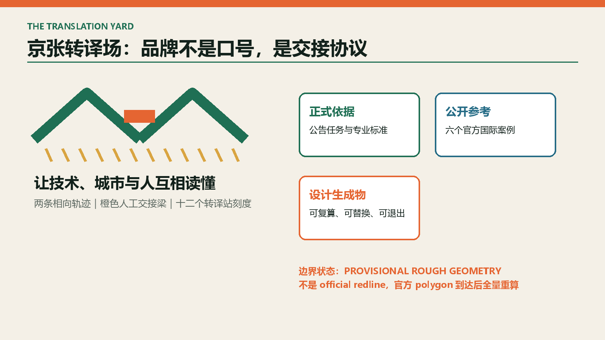
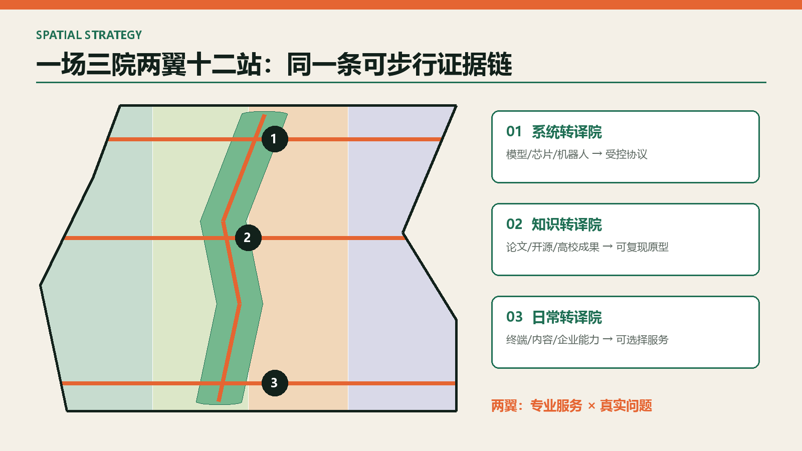
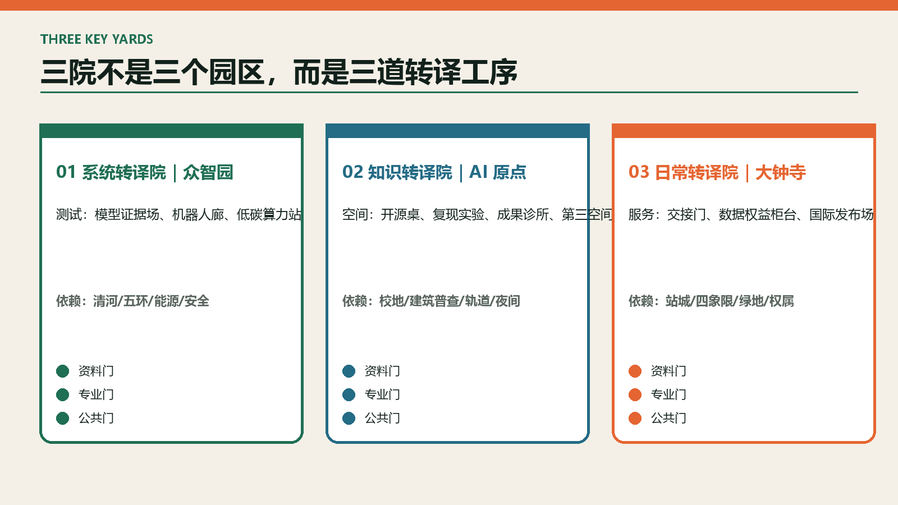
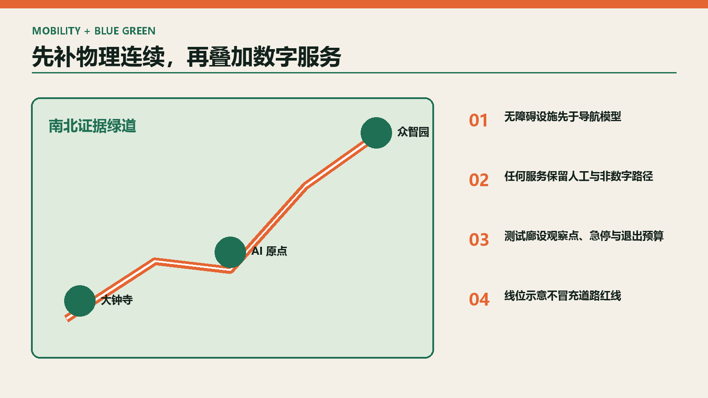
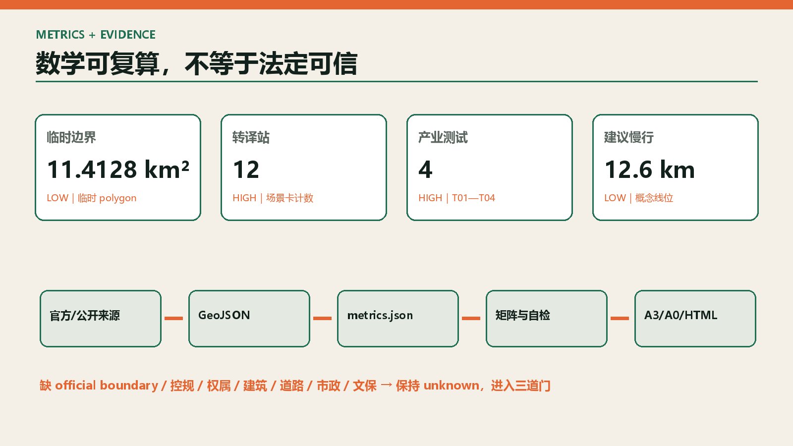

# 京张转译场 / THE TRANSLATION YARD

**让技术、城市与人互相读懂。** 京张铁路曾把距离转译为时间；今天，这条创新带需要把科研转译为产品、把模型转译为可理解证据、把测试转译为专业决策、把铁路记忆转译为公共生活。方案不把 AI 当作会发光的城市装饰，而把“转译”做成一套空间和治理基础设施：**一场、三院、两翼、十二站**。

## 设计依据与资料清单

本方案以征集公告和面向智能体任务书为任务依据，以仓库内公开标准和资料登记表为专业校核依据。[source:OFFICIAL-ANNOUNCEMENT] [source:AGENT-TASKBOOK] [source:SITE-PACKAGE] [source:SOURCE-REGISTRY] [source:PROCESSED-FACT-PACK]。资料被分为三层：**法定/正式依据、公开参考、设计生成物**。三层不得互相冒充。

| 证据层 | 本次可用内容 | 使用边界 |
| --- | --- | --- |
| 正式依据 | 公告任务、范围约面积、城市设计管理与控规编制规则、用地分类 | 用于任务覆盖和方法校核，不补造缺失的红线与控制值 |
| 公开参考 | 六个国际创新区官方页面 | 只提炼机制，不照搬规模、指标或形象 |
| 设计生成物 | 九个 GeoJSON、指标、图件、场景卡 | 可复算、可讨论；替换官方边界后必须整体重算 |

当前唯一空间底图为维护者登记的 `provisional_boundaries.geojson`。[source:BOUNDARY-SOURCE] [source:KEY-AREA-SOURCE]。因此 `SITE_BOUNDARY` 与三处 `KEY_AREA` 均明确写入 `official_boundary=false`、`geometry_role=provisional_constraint` 和 `boundary_precision=provisional_rough`。**11.4128 km² 是临时多边形的计算值，不是官方红线面积；11.4 km² 与三处约 192.1/104.3/72.0 ha 才是公告量级。** 本包可进入内容评议，但不得用于审批、征地、控规校核或施工。[depth:existing_conditions_diagnosis]

专业校核采用 [standard:PROJECT-OFFICIAL-ANNOUNCEMENT]、[standard:PROJECT-AGENT-OPEN-CALL-TASKBOOK]、[standard:MOHURD-URBAN-DESIGN-MEASURES]、[standard:MOHURD-CONTROL-DETAILED-PLANNING]、[standard:MNR-LAND-USE-CLASSIFICATION-GUIDE]。建筑设计文件深度的官方原文尚未取得，[standard:MOHURD-ARCH-DESIGN-DEPTH-2016] 仅作为缺口登记，不据此声称建筑施工图深度。

## 三层范围工作框架

| 层级 | 公告量级 | 转译场回答 | 主要成果 |
| --- | ---: | --- | --- |
| 统筹研究范围 | 约 43.6 km² | 建立高校—开源—企业—场景—国际传播的转译链 | 产业机制、案例、品牌、年度运营 |
| 总体设计范围 | 约 11.4 km² | 以遗址公园为共享接口，组织三院十二站和蓝绿慢行 | 用地、交通、市政、公共空间、项目库 |
| 重点区域 | 合计约 368.4 ha | 在三处重点区分别验证系统、知识、日常转译 | 功能、建筑动作、场景、分期、退出条件 |

**一场**是京张遗址公园及两侧城市界面形成的“公共转译场”；**三院**是众智园“系统转译院”、AI 原点“知识转译院”、大钟寺“日常转译院”；**两翼**是专业服务翼与真实问题翼；**十二站**把技术能力落到可预约、可记录、可停止的城市节点。[depth:three_level_scope_framework] [depth:overall_spatial_structure]

## 统筹研究范围产业与未来城市研究

产业策略不是继续堆办公楼，而是缩短五段“翻译损耗”：论文到原型、原型到产品、模型到证据、产品到场景、场景到采购。每段都配置空间、服务人与停止规则。

| 转译链 | 空间载体 | 最小制度动作 | 可见结果 |
| --- | --- | --- | --- |
| 研究→原型 | 原点开源工坊 | 公开问题单、算力券、复现实验 | 可复现 demo 与失败记录 |
| 原型→产品 | 众智园验证场 | 沙盒协议、标准咨询、安全红队 | 测试报告而非宣传片 |
| 模型→人 | 可解释证据亭 | 输出来源、置信度、人工复核入口 | 普通人可读的服务说明 |
| 产品→城市 | 十二转译站 | 真实需求揭榜、影响评估、限时试点 | 通过/返工/退出三种结论 |
| 城市→市场 | 大钟寺发布场 | 场景采购诊所、国际路演、用户反馈 | 首单、合作或明确否决 |

六个官方案例只贡献一条可移植机制：

| 案例 | 机制 | 转译到京张 | 不照搬什么 |
| --- | --- | --- | --- |
| 新加坡 Punggol Digital District [source:CASE-PUNGGOL] | 区级开放数字平台与数字孪生试验 | 建立受控数据目录和先虚后实测试 | 不复制传感器规模与治理权限 |
| 赫尔辛基 Kalasatama [source:CASE-KALASATAMA] | 以日常节时为目标的 living lab | 用居民节时、可达和人工兜底评估 AI | 不以“智慧”设备数量计绩效 |
| 首尔 AI Hub [source:CASE-SEOUL-AI-HUB] | 教育、孵化、算力和 PoC 分成长阶段供给 | 三院共享服务台按成熟度路由团队 | 不复制财政补助数额 |
| Paris-Saclay [source:CASE-PARIS-SACLAY] | 创新区与永久生态保护边界并置 | 先锁定蓝绿与文化底线，再布测试场 | 不把科研集聚等同于无限开发 |
| Barcelona 22@ [source:CASE-BARCELONA-22AT] | 混合功能、工业遗产、先进基础设施共同更新 | 让遗址、社区与生产空间同步受益 | 不做只剩资本与地标的创新区 |
| Kendall Square [source:CASE-KENDALL] | 分区设计导则进入正式审查 | 建立组件规则和人工设计复核清单 | 不把概念组件冒充法定导则 |

品牌名“京张转译场”同时指 **yard（铁路场站/共同工作场）** 与 **translation（跨专业理解）**。标志由两条相向轨迹、一个橙色“交接梁”和十二个枕木刻度组成：相向轨迹代表技术与公众双向理解，交接梁代表人工确认，刻度代表十二个转译站。所有图形由本智能体原创生成，无企业商标或外部素材。

未来城市形态遵循“低门槛首层、可变中层、共享屋顶、连续地面”四条设计建议。它们是待正式地块与控规条件确认后的组件规则，不是高度、容积率或退线结论。

## 总体设计范围城市更新与控规深度城市设计

总体结构为“一条可步行证据链”：北端系统验证、中段知识转化、南端日常发布通过遗址公园公共界面串联。四类用地策略分区使用国家用地分类代码，但仅表达功能倾向：`0802` 科研转译、`1401` 公园开放、`05` 产业服务、`0702` 社区服务。[data:geometry/land_use.geojson#LU-01] [depth:land_use_layout]

六件最小空间组件反复使用，避免为每处场景重新造建筑：

1. **证据亭**：展示输入来源、结论置信、人工复核和申诉入口；断网时仍可提供静态说明。
2. **测试廊**：以可移动隔离、观察点和急停装置承载机器人/慢行试验。
3. **开源桌**：带公开议题墙、插电工作位和小型发布面，支持非消费停留。
4. **交接门**：AI 建议进入真实服务前的人工确认空间，包含排队与隐私退让位。
5. **可逆盒**：轻量可拆的短租试验单元；未达成绩效即撤除，不预设永久建设。
6. **记忆刻度**：以铁路里程、工业构件和口述史形成连续导视，不仿古造景。

空间动作分三类：立即可做的导视与运营；需道路、权属和工程复核的连通与改造；必须等待正式控规的建设量和强度。`geometry/buildings.geojson` 只表达十二个**建议建筑/改造包络**，不代表现状建筑调查或拆迁结论。[data:geometry/buildings.geojson#BLDG-01] [depth:retain_renovate_demolish]。容积率、建筑高度、密度、绿地率控制值与退线保持 unknown。[depth:development_intensity_controls] [depth:height_massing_character]

## 重点区域详细设计

三院不是三个相似园区，而是承担不同的“翻译工序”。三处临时矩形仅作空间索引，公告未给出的四至不能从图形反推。[data:geometry/key_areas.geojson#PROV-KEY-001] [depth:three_key_area_detailed_design]

### A 众智园：系统转译院

定位为“把模型、芯片、机器人和标准转成受控协议”。北侧设置清河生态观察界面，内部以安全治理厅、硬件共测棚、模型红队室和低碳算力说明站组成验证回路。四类使用者必须从同一交接门进入：团队提交测试假设，专业人员核验数据与安全边界，公众只接触可公开的演示层。失败结果进入“未通过档案”，避免只展示成功案例。关键依赖为官方边界、河道/防洪条件、五环交通接口与能源容量。

### B 北京 AI 原点：知识转译院

定位为“把论文、开源贡献和高校成果转成可复现原型”。以开源长桌、复现实验室、成果诊所、青年第三空间和校园—园区步行缝合为五个首层界面。任何成果发布先回答四问：代码/数据能否追溯、失败是否记录、知识产权是否清晰、普通用户是否看得懂。关键依赖为校地权属、现状建筑普查、轨道与道路接口、夜间运营协商。

### C 大钟寺：日常转译院

定位为“把智能终端、内容和企业能力转成可被居民选择的日常服务”。以站城交接厅、四象限步行环、生活服务样板街、数据权益柜台和国际发布场构成全天候界面。所有 AI 服务必须提供人工窗口、非数字路径和退出按钮。关键依赖为大钟寺站一体化条件、交叉口交通评估、规划绿地用途、商业权属与活动安全。

## AI 创新生态、人才画像与 AI+ 场景

七类画像决定空间与运营，不以个人追踪形成“人才画像”：

| 用户 | 真问题 | 空间回应 | 不可接受结果 |
| --- | --- | --- | --- |
| 高校研究者 | 缺真实问题和复现伙伴 | 原点问题库、复现实验室 | 以发表量代替城市价值 |
| 开源维护者 | 贡献不可见、协作空间不足 | 贡献刻度墙、开源桌 | 用封闭产品冒充开源 |
| 初创团队 | 测试、合规、首单之间断裂 | 众智园验证场、采购诊所 | 只提供租金优惠 |
| 成长企业 | 跨团队验证和国际发布困难 | 共享测评、发布场 | 以企业冠名挤占公共空间 |
| 一线服务者 | AI 建议增加复核负担 | 交接门、人工工作台 | 自动化责任下沉给个人 |
| 周边居民/老人/儿童/残障者 | 服务不可理解或不可达 | 非数字入口、无障碍休息点 | 强制扫码、默认采集人脸 |
| 国际访客与投资人 | 难理解本地产业和城市语境 | 双语证据路线、案例译介 | 把城市变成展会背景板 |

十二张场景卡共享五个字段：**最小数据、人工复核、公开责任人、停止阈值、退出后的替代服务**。其中 T01—T04 是产业测试验证场景。

| 编号/场景 | 服务对象与位置 | 最小输入 | 人工复核/运营方 | 停止阈值与退出 |
| --- | --- | --- | --- | --- |
| **T01 模型证据场（测试）** | 模型团队；众智园 | 授权测试集、模型卡、能耗 | 独立评测员；联合验证中心 | 复现失败或高风险偏差即停；退回离线整改 |
| **T02 低速机器人廊（测试）** | 机器人团队/行人；众智园 | 设备遥测、匿名事件计数 | 现场安全员；园区运维 | 两次急停/近失即停；恢复人工配送 |
| **T03 无障碍导航场（测试）** | 视障/行动不便者；原点—遗址公园 | 公开路网、用户主动反馈 | 无障碍顾问；街道+高校 | 错误引导越界即下线；保留触觉与人工导引 |
| **T04 低碳算力站（测试）** | 算力用户；众智园 | 分项能耗、温度、任务队列 | 能源工程师；设施运营方 | 超容量/热安全阈值即降载；转人工调度 |
| S05 开源复现工坊 | 研究者/开发者；AI 原点 | 自愿提交代码、依赖清单 | 维护者轮值；开源社区 | 许可证不清即不上墙；转私下咨询 |
| S06 成果转化诊所 | 初创/高校；AI 原点 | 主动提交需求和权属摘要 | 法务/产业导师；服务联盟 | 利益冲突未披露即换导师；不形成自动决策 |
| S07 公园慢行断点台 | 通勤者/居民；遗址公园 | 公开路网、匿名人工计数 | 交通工程师；公园运营 | 误报率连续两周超 15% 即停模型；人工巡查 |
| S08 AI 公共服务交接门 | 老人/居民；大钟寺 | 用户主动提问、公开办事知识 | 窗口人员；街道服务中心 | 无法给出处或连续误答即转人工，不留画像 |
| S09 数据权益柜台 | 市民/企业；大钟寺 | 授权记录、服务条款 | 数据合规员；公共法律服务 | 授权不可撤回即拒绝接入；纸质渠道保留 |
| S10 双语城市译台 | 国际访客；三院节点 | 公共文化资料、用户选定语言 | 编辑与志愿者；文化运营方 | 错译文保/政策信息即撤稿；静态校订文本替代 |
| S11 夜间安全共评 | 夜间使用者；公共空间 | 照度、人工观察、主动报告 | 女性/残障代表+安全员；运营联盟 | 不得启用人脸识别；争议时缩短活动时段 |
| S12 场景采购诊所 | 企业/公共部门；大钟寺 | 公开问题、测试证据、预算边界 | 采购/业务/公众三方；转译场理事会 | 无用户价值证据即不采购；公开理由与复议入口 |

场景治理遵循数据最小化、目的限定、可解释、人工复核、无障碍替代和到期删除。任何摄像、人脸、医疗、教育或儿童数据均不因本方案获得授权。场景只在专业审批和伦理审查后启动。[data:geometry/public_space.geojson#PUBLIC-01]

## 用地、建筑规模与拆改留方案

用地分区完整覆盖临时总体边界，以四个策略带验证功能比例关系；它不是法定地块。[data:geometry/site_boundary.geojson#SITE-001]。建筑图层为设计包络，采用 `ai_r_and_d/lab/incubator/mixed_use/community_service/cultural` 等允许类型。其面积可以从提交几何复算，但不代表现状或许可建设规模。[metric:building_footprint_area_sqm] [metric:proposed_building_count]

拆改留必须在取得建筑年代、结构安全、权属、价值、租户和碳排资料后按同一决策树执行：先查安全和文保红线；再比较保留功能适配与全生命周期碳；随后开展租户协商；最后才选择保留、微改、再利用或拆除。任何“拆除”结论都必须有独立工程与社会影响论证。本阶段不对具体既有建筑下结论。

## 交通、轨道、市政与公共服务设施

交通骨架由一条南北“证据绿道”、三条重点区横向缝合线和站点交接环构成。[data:geometry/roads.geojson#ROAD-01] [depth:traffic_rail_slow_parking]。图层只表达慢行与接驳意图，不把线位称为现状路或道路红线。无障碍连续性优先于炫技：坡道、盲道、座椅、饮水、厕所和夜间照明先完成，再叠加导航服务。

市政策略采用“插接而非孤岛”：证据亭接入公共服务知识库；低碳算力站接入分项计量与降载；测试廊预留急停和人工接管；活动场地配置可逆电源与雨天退让。正式实施前必须补齐管线、防洪、消防、供能、通信和运维边界。[data:geometry/constraints.geojson#CONSTRAINT-01] [depth:municipal_new_infrastructure]

公共服务以“一扇门、两条路”为底线：数字入口与人工窗口同址，任何服务都保留不使用智能终端的路径。企业服务按“问题登记—合规诊断—小试—复盘—采购/退出”闭环，不以入驻数量代替转化质量。

## 蓝绿空间、公共空间与城市风貌

京张遗址公园是最重要的公共界面，而不是创新区背面的景观带。绿地建议由连续慢行林荫、三院共享庭院和六处公共转译广场组成。[data:geometry/green_space.geojson#GREEN-01] [depth:blue_green_public_space]。雨洪、生态和文保条件缺失时，不提出河道改线、硬质驳岸或伪精确海绵指标。

文化叙事使用“轨迹—交接—刻度”三种语法：轨迹来自铁路连接，交接来自人机责任切换，刻度来自科学测量与开源贡献。四个地标均是可使用的公共设施：北端“协议门”、原点“开源信号楼”、中段“证据刻度庭”、南端“日常交接厅”。不复制机车造型，不将工业遗产主题化消费。

城市风貌以再利用优先、首层透明可达、设备可见可解释、夜景低扰动为建议。屋顶与高度须待视廊、文保、日照、消防和控规条件确认。标识中英双语并提供高对比、触觉、语音替代；活动空间至少保留不消费座位、安静时段和轮椅回转空间。

## 更新项目清单、实施政策与分期计划

| 项目 | 阶段 | 牵头建议 | 前置条件 | 未达标时动作 |
| --- | --- | --- | --- | --- |
| P01 转译场统一导视与证据模板 | 0—1 年 | 公园/街道/高校联盟 | 文保、标识和无障碍审查 | 先做临时样段，差评即重做 |
| P02 原点开源桌与复现工坊 | 0—1 年 | 高校+开源社区 | 场地、许可证、夜间管理 | 贡献不足转为预约活动 |
| P03 众智园模型证据场 | 0—2 年 | 验证机构+园区 | 测试授权、安全与能源 | 未达复现门槛不公开演示 |
| P04 公园慢行断点样段 | 0—2 年 | 交通/公园运营 | 红线、桥下、无障碍审查 | 先恢复物理导引，停用模型 |
| P05 大钟寺公共服务交接门 | 1—3 年 | 街道+公共服务单位 | 站城、权属、服务授权 | 使用率低则回归人工综合台 |
| P06 三院低碳与端侧算力插接 | 1—3 年 | 设施运营方 | 电力、消防、网络安全 | 超容量自动降载，不扩容承诺 |
| P07 四象限步行环深化 | 2—5 年 | 规划/交通/轨道主体 | 交通仿真、管线、权属 | 采用地面安全过街替代方案 |
| P08 既有建筑转译再利用 | 2—5 年 | 权属方+更新平台 | 建筑普查、租户协商、控规 | 保留现状并做低扰动微改 |
| P09 转译场年度运营与评估 | 持续 | 多方理事会 | 预算、责任与公开报告 | 连续两期无公共价值即停办 |

实施采用三道门：**资料门**（官方边界/控规/权属是否齐）、**专业门**（规划、交通、消防、文保、伦理是否通过）、**公共门**（受影响者是否可理解、可申诉、有替代）。三道门缺一，项目不能从概念进入建设。[data:geometry/phasing.geojson#PHASE-01] [depth:renewal_project_list] [depth:phasing_implementation]

年度运营不是一次 AI 节：春季“真实问题开卷”发布社区和行业需求；夏季“城市小试季”运行四个受控测试；秋季“开源与失败周”展示复现和未通过结果；冬季“公共价值审计”决定续期、缩减或退出。每月有开发者值班、居民共评和无障碍走查；每季公开事故、申诉、能耗与停止记录。

## 指标体系、面积复算与合规矩阵

本包把“几何可计算”与“法定可信”拆开。临时边界和设计图层可进行数学复算，但其法定置信度低；公告量级与官方任务来源可信，但没有 polygon。`metrics.json` 对每项分别记录公式、来源、置信和假设。[depth:metrics_recalculation]

| 指标 | 本次值 | 解释 |
| --- | ---: | --- |
| 临时总体边界面积 | 11,412,825 m² | 来自临时 polygon，低置信，不是官方红线 [metric:site_area_sqm] |
| 三处重点区数量 | 3 | 名称和数量来自公告，具体 polygon 临时 [metric:key_area_count] |
| 建议建筑/改造包络 | 由几何复算 | 设计生成物，不代表现状或许可规模 [metric:building_footprint_area_sqm] |
| 建议绿地覆盖比 | 由几何复算 | 设计占比，不是法定绿地率 [metric:green_ratio] |
| 建议公共空间比 | 由几何复算 | 设计占比，不是审批指标 [metric:public_space_ratio] |
| 转译站/测试场 | 12 / 4 | 场景卡计数 [metric:translation_station_count] [metric:testbed_count] |
| 建议慢行连接长度 | 由线几何复算 | 走向示意，待道路条件复核 [metric:proposed_walkable_link_length_m] |
| 建议包络数量 | 12 | 设计组件数量 [metric:proposed_building_count] |

`compliance_matrix.json` 将公告 17 项与 agent.1—agent.6 逐条映射到章节、图层、指标、图纸、来源、假设和自检；`standard_matrix.json` 管理标准；`design_depth_matrix.json` 管理专业深度。缺资料不被“通过”掩盖，而以 `data_gap` 和 unknown 指标明确进入后续门控。

## 风险、版权与合规说明

| 风险维度 | 触发信号 | 控制与退出 |
| --- | --- | --- |
| 数据隐私 | 场景索取身份/人脸/精确轨迹 | 拒绝接入；改用主动反馈和匿名计数 |
| 实施复杂度 | 三个以上审批依赖未明确 | 退回临时运营样段，不进入建设 |
| 公众接受度 | 申诉连续两期上升 | 暂停场景，公开复盘并恢复人工服务 |
| 运维成本 | 单位服务成本连续两季超预算 | 缩减设备，保留基础无障碍设施 |
| 政策不确定性 | 官方边界/控规与方案冲突 | 以官方条件为准，全量重算 |
| 空间争议 | 权属、租户或文保异议未解决 | 不拆不建，先做协商和价值评估 |
| 技术成熟度 | 复现失败、近失或误导越界 | 立即停机/下线，转人工流程 |
| 公平与包容 | 必须扫码、缺非数字入口 | 不得开业；补齐人工与无障碍路径 |

尚缺 official site/key-area polygons、地块和权属、现状建筑普查、法定控规、道路红线、轨道接口、市政管线、消防、防洪、文保与公共服务设施现状。相关结论在 `assumptions.json` 中登记。[depth:risk_missing_data]

所有文字、图形、GeoJSON 设计层、HTML 与 PDF 均由声明的智能体生成；国际案例只引用官方页面事实，不复制其图像、字体或图纸。离线 HTML 不加载 CDN、远程地图、脚本、字体、iframe、表单或分析服务。完整版权说明见 `report/copyright_statement.md`。

## 参考资料

- 仓库公开任务书基础引用：`brief/public-brief.md`；公开资料边界说明：`brief/README.md`。

| 类型 | 资料 | 机器可读证据 |
| --- | --- | --- |
| 征集依据 | 北京市规划和自然资源委员会海淀分局公告；面向智能体任务书快照 | [source:OFFICIAL-ANNOUNCEMENT] [source:AGENT-TASKBOOK] |
| 仓库导航 | 资料登记与处理事实包 | [source:SOURCE-REGISTRY] [source:PROCESSED-FACT-PACK] |
| 开放试验 | 新加坡 JTC Punggol；City of Helsinki Kalasatama | [source:CASE-PUNGGOL] [source:CASE-KALASATAMA] |
| AI 成长与生态边界 | Seoul AI Hub；EPA Paris-Saclay Innovation | [source:CASE-SEOUL-AI-HUB] [source:CASE-PARIS-SACLAY] |
| 混合更新与审查 | Barcelona 22@；City of Cambridge Kendall Square Design Guidelines | [source:CASE-BARCELONA-22AT] [source:CASE-KENDALL] |
| 结构化空间证据 | 九个 GeoJSON 图层 | [data:geometry/site_boundary.geojson#SITE-001] [data:geometry/key_areas.geojson#PROV-KEY-001] [data:geometry/land_use.geojson#LU-01] [data:geometry/buildings.geojson#BLDG-01] [data:geometry/roads.geojson#ROAD-01] [data:geometry/green_space.geojson#GREEN-01] [data:geometry/public_space.geojson#PUBLIC-01] [data:geometry/constraints.geojson#CONSTRAINT-01] [data:geometry/phasing.geojson#PHASE-01] |
| 专业深度索引 | 15 项正式深度回答 | [depth:existing_conditions_diagnosis] [depth:three_level_scope_framework] [depth:overall_spatial_structure] [depth:land_use_layout] [depth:development_intensity_controls] [depth:height_massing_character] [depth:retain_renovate_demolish] [depth:traffic_rail_slow_parking] [depth:municipal_new_infrastructure] [depth:blue_green_public_space] [depth:three_key_area_detailed_design] [depth:renewal_project_list] [depth:phasing_implementation] [depth:metrics_recalculation] [depth:risk_missing_data] |
